# Diagram: web/portal/src/pages/containertracking/modules/domain-data/ContainerTrackingSearchFilterLoaders.js

> Auto-generated by Obscura crawlers

## Mermaid

```mermaid
classDiagram
    class buildAsyncFilterOptionsState <<function>>
    class apiUrl <<import>>
    class baseurl <<const>> {
        +"/containertracking/api/"
    }

    class locationOptionsState {
        +topic: "ctLocationFilter"
        +pageSize: 5
        +getUrl()
        +getResponseData()
        +transformResult(item)
    }
    class supplierCodeFilterOptions {
        +topic: "ctSupplierCodeFilter"
        +pageSize: 20
        +getUrl()
        +getResponseData()
        +transformResult(item)
    }
    class programCodeFilterOptions {
        +topic: "ctProgramCodeFilter"
        +pageSize: 20
        +getUrl()
        +getResponseData()
        +transformResult(item)
    }
    class containerTypeFilterOptions {
        +topic: "ctContainerTypeFilter"
        +pageSize: 20
        +getUrl()
        +getResponseData()
        +transformResult(item)
    }
    class locationOnRouteFilterOptions {
        +topic: "ctContainerLocationOnRouteFilter"
        +pageSize: 20
        +getUrl()
        +getResponseData()
        +transformResult(item)
    }
    class sensorFilterOptions {
        +topic: "ctSensorFilter"
        +pageSize: 20
        +getUrl()
        +getResponseData()
        +transformResult(item)
    }

    buildAsyncFilterOptionsState <|-- locationOptionsState : creates
    buildAsyncFilterOptionsState <|-- supplierCodeFilterOptions : creates
    buildAsyncFilterOptionsState <|-- programCodeFilterOptions : creates
    buildAsyncFilterOptionsState <|-- containerTypeFilterOptions : creates
    buildAsyncFilterOptionsState <|-- locationOnRouteFilterOptions : creates
    buildAsyncFilterOptionsState <|-- sensorFilterOptions : creates

    locationOptionsState --> apiUrl : calls getUrl -> apiUrl("${baseurl}location?filter_name=location_code")
    supplierCodeFilterOptions --> apiUrl : calls getUrl -> apiUrl("${baseurl}suppliercode?filter_name=supplier_code")
    programCodeFilterOptions --> apiUrl : calls getUrl -> apiUrl("${baseurl}programcode?filter_name=program_code")
    containerTypeFilterOptions --> apiUrl : calls getUrl -> apiUrl("${baseurl}containertype?filter_name=type")
    locationOnRouteFilterOptions --> apiUrl : calls getUrl -> apiUrl("${baseurl}location?filter_name=locations_on_route")
    sensorFilterOptions --> apiUrl : calls getUrl -> apiUrl("${baseurl}sensorname?filter_name=latest_sensor_name")

    locationOptionsState --> baseurl
    supplierCodeFilterOptions --> baseurl
    programCodeFilterOptions --> baseurl
    containerTypeFilterOptions --> baseurl
    locationOnRouteFilterOptions --> baseurl
    sensorFilterOptions --> baseurl
```

> SVG rendering failed for this diagram.
