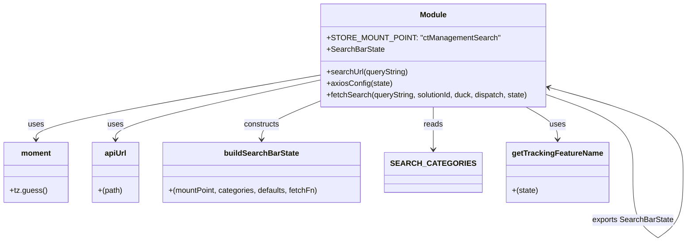

# Diagram: web/portal/src/pages/containertracking/redux/ContainerManagementSearchBarState.js


> Auto-generated by Obscura crawlers

## Diagram 1



### SVG

<svg id="container" width="1395.0810546875" xmlns="http://www.w3.org/2000/svg" class="classDiagram" height="506.1499938964844" viewBox="0 0 1395.0810546875 506.1499938964844" role="graphics-document document" aria-roledescription="class"><style>#container{font-family:"trebuchet ms",verdana,arial,sans-serif;font-size:16px;fill:#333;}@keyframes edge-animation-frame{from{stroke-dashoffset:0;}}@keyframes dash{to{stroke-dashoffset:0;}}#container .edge-animation-slow{stroke-dasharray:9,5!important;stroke-dashoffset:900;animation:dash 50s linear infinite;stroke-linecap:round;}#container .edge-animation-fast{stroke-dasharray:9,5!important;stroke-dashoffset:900;animation:dash 20s linear infinite;stroke-linecap:round;}#container .error-icon{fill:#552222;}#container .error-text{fill:#552222;stroke:#552222;}#container .edge-thickness-normal{stroke-width:1px;}#container .edge-thickness-thick{stroke-width:3.5px;}#container .edge-pattern-solid{stroke-dasharray:0;}#container .edge-thickness-invisible{stroke-width:0;fill:none;}#container .edge-pattern-dashed{stroke-dasharray:3;}#container .edge-pattern-dotted{stroke-dasharray:2;}#container .marker{fill:#333333;stroke:#333333;}#container .marker.cross{stroke:#333333;}#container svg{font-family:"trebuchet ms",verdana,arial,sans-serif;font-size:16px;}#container p{margin:0;}#container g.classGroup text{fill:#9370DB;stroke:none;font-family:"trebuchet ms",verdana,arial,sans-serif;font-size:10px;}#container g.classGroup text .title{font-weight:bolder;}#container .nodeLabel,#container .edgeLabel{color:#131300;}#container .edgeLabel .label rect{fill:#ECECFF;}#container .label text{fill:#131300;}#container .labelBkg{background:#ECECFF;}#container .edgeLabel .label span{background:#ECECFF;}#container .classTitle{font-weight:bolder;}#container .node rect,#container .node circle,#container .node ellipse,#container .node polygon,#container .node path{fill:#ECECFF;stroke:#9370DB;stroke-width:1px;}#container .divider{stroke:#9370DB;stroke-width:1;}#container g.clickable{cursor:pointer;}#container g.classGroup rect{fill:#ECECFF;stroke:#9370DB;}#container g.classGroup line{stroke:#9370DB;stroke-width:1;}#container .classLabel .box{stroke:none;stroke-width:0;fill:#ECECFF;opacity:0.5;}#container .classLabel .label{fill:#9370DB;font-size:10px;}#container .relation{stroke:#333333;stroke-width:1;fill:none;}#container .dashed-line{stroke-dasharray:3;}#container .dotted-line{stroke-dasharray:1 2;}#container #compositionStart,#container .composition{fill:#333333!important;stroke:#333333!important;stroke-width:1;}#container #compositionEnd,#container .composition{fill:#333333!important;stroke:#333333!important;stroke-width:1;}#container #dependencyStart,#container .dependency{fill:#333333!important;stroke:#333333!important;stroke-width:1;}#container #dependencyStart,#container .dependency{fill:#333333!important;stroke:#333333!important;stroke-width:1;}#container #extensionStart,#container .extension{fill:transparent!important;stroke:#333333!important;stroke-width:1;}#container #extensionEnd,#container .extension{fill:transparent!important;stroke:#333333!important;stroke-width:1;}#container #aggregationStart,#container .aggregation{fill:transparent!important;stroke:#333333!important;stroke-width:1;}#container #aggregationEnd,#container .aggregation{fill:transparent!important;stroke:#333333!important;stroke-width:1;}#container #lollipopStart,#container .lollipop{fill:#ECECFF!important;stroke:#333333!important;stroke-width:1;}#container #lollipopEnd,#container .lollipop{fill:#ECECFF!important;stroke:#333333!important;stroke-width:1;}#container .edgeTerminals{font-size:11px;line-height:initial;}#container .classTitleText{text-anchor:middle;font-size:18px;fill:#333;}#container .label-icon{display:inline-block;height:1em;overflow:visible;vertical-align:-0.125em;}#container .node .label-icon path{fill:currentColor;stroke:revert;stroke-width:revert;}#container :root{--mermaid-font-family:"trebuchet ms",verdana,arial,sans-serif;}</style><g><defs><marker id="container_class-aggregationStart" class="marker aggregation class" refX="18" refY="7" markerWidth="190" markerHeight="240" orient="auto"><path d="M 18,7 L9,13 L1,7 L9,1 Z"></path></marker></defs><defs><marker id="container_class-aggregationEnd" class="marker aggregation class" refX="1" refY="7" markerWidth="20" markerHeight="28" orient="auto"><path d="M 18,7 L9,13 L1,7 L9,1 Z"></path></marker></defs><defs><marker id="container_class-extensionStart" class="marker extension class" refX="18" refY="7" markerWidth="190" markerHeight="240" orient="auto"><path d="M 1,7 L18,13 V 1 Z"></path></marker></defs><defs><marker id="container_class-extensionEnd" class="marker extension class" refX="1" refY="7" markerWidth="20" markerHeight="28" orient="auto"><path d="M 1,1 V 13 L18,7 Z"></path></marker></defs><defs><marker id="container_class-compositionStart" class="marker composition class" refX="18" refY="7" markerWidth="190" markerHeight="240" orient="auto"><path d="M 18,7 L9,13 L1,7 L9,1 Z"></path></marker></defs><defs><marker id="container_class-compositionEnd" class="marker composition class" refX="1" refY="7" markerWidth="20" markerHeight="28" orient="auto"><path d="M 18,7 L9,13 L1,7 L9,1 Z"></path></marker></defs><defs><marker id="container_class-dependencyStart" class="marker dependency class" refX="6" refY="7" markerWidth="190" markerHeight="240" orient="auto"><path d="M 5,7 L9,13 L1,7 L9,1 Z"></path></marker></defs><defs><marker id="container_class-dependencyEnd" class="marker dependency class" refX="13" refY="7" markerWidth="20" markerHeight="28" orient="auto"><path d="M 18,7 L9,13 L14,7 L9,1 Z"></path></marker></defs><defs><marker id="container_class-lollipopStart" class="marker lollipop class" refX="13" refY="7" markerWidth="190" markerHeight="240" orient="auto"><circle stroke="black" fill="transparent" cx="7" cy="7" r="6"></circle></marker></defs><defs><marker id="container_class-lollipopEnd" class="marker lollipop class" refX="1" refY="7" markerWidth="190" markerHeight="240" orient="auto"><circle stroke="black" fill="transparent" cx="7" cy="7" r="6"></circle></marker></defs><g class="root"><g class="clusters"></g><g class="edgePaths"><path d="M649.148,169.241L580.441,184.534C511.733,199.827,374.318,230.414,305.61,250.873C236.902,271.333,236.902,281.667,236.902,286.833L236.902,292" id="id_Module_apiUrl_1" class="edge-thickness-normal edge-pattern-solid relation" style=";;;" data-edge="true" data-et="edge" data-id="id_Module_apiUrl_1" data-points="W3sieCI6NjQ5LjE0ODQzNzUsInkiOjE2OS4yNDA4OTAwOTM0ODI2Mn0seyJ4IjoyMzYuOTAyMzQzNzUsInkiOjI2MX0seyJ4IjoyMzYuOTAyMzQzNzUsInkiOjI5OH1d" marker-end="url(#container_class-dependencyEnd)"></path><path d="M649.148,158.539L553.125,175.616C457.102,192.692,265.055,226.846,169.031,249.09C73.008,271.333,73.008,281.667,73.008,286.833L73.008,292" id="id_Module_moment_2" class="edge-thickness-normal edge-pattern-solid relation" style=";;;" data-edge="true" data-et="edge" data-id="id_Module_moment_2" data-points="W3sieCI6NjQ5LjE0ODQzNzUsInkiOjE1OC41Mzg2ODcwODI1ODY3M30seyJ4Ijo3My4wMDc4MTI1LCJ5IjoyNjF9LHsieCI6NzMuMDA3ODEyNSwieSI6Mjk4fV0=" marker-end="url(#container_class-dependencyEnd)"></path><path d="M1067.865,224L1078.115,230.167C1088.365,236.333,1108.866,248.667,1119.117,260C1129.367,271.333,1129.367,281.667,1129.367,286.833L1129.367,292" id="id_Module_getTrackingFeatureName_3" class="edge-thickness-normal edge-pattern-solid relation" style=";;;" data-edge="true" data-et="edge" data-id="id_Module_getTrackingFeatureName_3" data-points="W3sieCI6MTA2Ny44NjQ2NTUxNzI0MTM3LCJ5IjoyMjR9LHsieCI6MTEyOS4zNjcxODc1LCJ5IjoyNjF9LHsieCI6MTEyOS4zNjcxODc1LCJ5IjoyOTh9XQ==" marker-end="url(#container_class-dependencyEnd)"></path><path d="M888.344,224L888.344,230.167C888.344,236.333,888.344,248.667,888.344,263.5C888.344,278.333,888.344,295.667,888.344,304.333L888.344,313" id="id_Module_SEARCH_CATEGORIES_4" class="edge-thickness-normal edge-pattern-solid relation" style=";;;" data-edge="true" data-et="edge" data-id="id_Module_SEARCH_CATEGORIES_4" data-points="W3sieCI6ODg4LjM0Mzc1LCJ5IjoyMjR9LHsieCI6ODg4LjM0Mzc1LCJ5IjoyNjF9LHsieCI6ODg4LjM0Mzc1LCJ5IjozMTl9XQ==" marker-end="url(#container_class-dependencyEnd)"></path><path d="M649.148,216.434L631.458,223.861C613.768,231.289,578.388,246.145,560.698,258.739C543.008,271.333,543.008,281.667,543.008,286.833L543.008,292" id="id_Module_buildSearchBarState_5" class="edge-thickness-normal edge-pattern-solid relation" style=";;;" data-edge="true" data-et="edge" data-id="id_Module_buildSearchBarState_5" data-points="W3sieCI6NjQ5LjE0ODQzNzUsInkiOjIxNi40MzM1Njc4NTczODUyNH0seyJ4Ijo1NDMuMDA3ODEyNSwieSI6MjYxfSx7IngiOjU0My4wMDc4MTI1LCJ5IjoyOTh9XQ==" marker-end="url(#container_class-dependencyEnd)"></path><path d="M1127.539,204.033L1153.336,213.528C1179.134,223.022,1230.729,242.011,1256.526,268.164C1282.323,294.317,1282.323,327.633,1282.323,344.292L1282.323,360.95" id="Module-cyclic-special-1" class="edge-thickness-normal edge-pattern-solid relation" style=";;;" data-edge="true" data-et="edge" data-id="Module-cyclic-special-1" data-points="W3sieCI6MTEyNy41MzkwNjI1LCJ5IjoyMDQuMDMzMjcwMjc0NzEyODZ9LHsieCI6MTI4Mi4zMjM0Mzc1MDA3NDUsInkiOjI2MX0seyJ4IjoxMjgyLjMyMzQzNzUwMDc0NSwieSI6MzYwLjk0OTk5OTk5OTI1NDk0fV0="></path><path d="M1282.323,361.05L1282.323,377.708C1282.323,394.367,1282.323,427.683,1291.045,450.511C1299.766,473.338,1317.209,485.676,1325.931,491.846L1334.652,498.015" id="Module-cyclic-special-mid" class="edge-thickness-normal edge-pattern-solid relation" style=";;;" data-edge="true" data-et="edge" data-id="Module-cyclic-special-mid" data-points="W3sieCI6MTI4Mi4zMjM0Mzc1MDA3NDUsInkiOjM2MS4wNTAwMDAwMDA3NDUwNn0seyJ4IjoxMjgyLjMyMzQzNzUwMDc0NSwieSI6NDYxfSx7IngiOjEzMzQuNjUyMzQzNzUsInkiOjQ5OC4wMTQ2MzI3MDk1OTE2NH1d"></path><path d="M1334.752,498.015L1343.474,491.846C1352.195,485.676,1369.638,473.338,1378.36,450.502C1387.081,427.667,1387.081,394.333,1387.081,361C1387.081,327.667,1387.081,294.333,1344.784,265.37C1302.488,236.406,1217.894,211.812,1175.597,199.514L1133.301,187.217" id="Module-cyclic-special-2" class="edge-thickness-normal edge-pattern-solid relation" style=";;;" data-edge="true" data-et="edge" data-id="Module-cyclic-special-2" data-points="W3sieCI6MTMzNC43NTIzNDM3NTE0OTAxLCJ5Ijo0OTguMDE0NjMyNzA5NTkxNjR9LHsieCI6MTM4Ny4wODEyNTAwMDA3NDUsInkiOjQ2MX0seyJ4IjoxMzg3LjA4MTI1MDAwMDc0NSwieSI6MzYxfSx7IngiOjEzODcuMDgxMjUwMDAwNzQ1LCJ5IjoyNjF9LHsieCI6MTEyNy41MzkwNjI1LCJ5IjoxODUuNTQyMjM0NzY3Njg0NzZ9XQ==" marker-end="url(#container_class-dependencyEnd)"></path></g><g class="edgeLabels"><g class="edgeLabel" transform="translate(236.90234375, 261)"><g class="label" data-id="id_Module_apiUrl_1" transform="translate(-16.4921875, -12)"><foreignObject width="32.984375" height="24"><div xmlns="http://www.w3.org/1999/xhtml" class="labelBkg" style="display: table-cell; white-space: nowrap; line-height: 1.5; max-width: 200px; text-align: center;"><span class="edgeLabel"><p>uses</p></span></div></foreignObject></g></g><g class="edgeLabel" transform="translate(73.0078125, 261)"><g class="label" data-id="id_Module_moment_2" transform="translate(-16.4921875, -12)"><foreignObject width="32.984375" height="24"><div xmlns="http://www.w3.org/1999/xhtml" class="labelBkg" style="display: table-cell; white-space: nowrap; line-height: 1.5; max-width: 200px; text-align: center;"><span class="edgeLabel"><p>uses</p></span></div></foreignObject></g></g><g class="edgeLabel" transform="translate(1129.3671875, 261)"><g class="label" data-id="id_Module_getTrackingFeatureName_3" transform="translate(-16.4921875, -12)"><foreignObject width="32.984375" height="24"><div xmlns="http://www.w3.org/1999/xhtml" class="labelBkg" style="display: table-cell; white-space: nowrap; line-height: 1.5; max-width: 200px; text-align: center;"><span class="edgeLabel"><p>uses</p></span></div></foreignObject></g></g><g class="edgeLabel" transform="translate(888.34375, 261)"><g class="label" data-id="id_Module_SEARCH_CATEGORIES_4" transform="translate(-20.0078125, -12)"><foreignObject width="40.015625" height="24"><div xmlns="http://www.w3.org/1999/xhtml" class="labelBkg" style="display: table-cell; white-space: nowrap; line-height: 1.5; max-width: 200px; text-align: center;"><span class="edgeLabel"><p>reads</p></span></div></foreignObject></g></g><g class="edgeLabel" transform="translate(543.0078125, 261)"><g class="label" data-id="id_Module_buildSearchBarState_5" transform="translate(-37.84375, -12)"><foreignObject width="75.6875" height="24"><div xmlns="http://www.w3.org/1999/xhtml" class="labelBkg" style="display: table-cell; white-space: nowrap; line-height: 1.5; max-width: 200px; text-align: center;"><span class="edgeLabel"><p>constructs</p></span></div></foreignObject></g></g><g class="edgeLabel"><g class="label" data-id="Module-cyclic-special-1" transform="translate(0, 0)"><foreignObject width="0" height="0"><div xmlns="http://www.w3.org/1999/xhtml" class="labelBkg" style="display: table-cell; white-space: nowrap; line-height: 1.5; max-width: 200px; text-align: center;"><span class="edgeLabel"></span></div></foreignObject></g></g><g class="edgeLabel" transform="translate(1282.323437500745, 461)"><g class="label" data-id="Module-cyclic-special-mid" transform="translate(-84.7578125, -12)"><foreignObject width="169.515625" height="24"><div xmlns="http://www.w3.org/1999/xhtml" class="labelBkg" style="display: table-cell; white-space: nowrap; line-height: 1.5; max-width: 200px; text-align: center;"><span class="edgeLabel"><p>exports SearchBarState</p></span></div></foreignObject></g></g><g class="edgeLabel"><g class="label" data-id="Module-cyclic-special-2" transform="translate(0, 0)"><foreignObject width="0" height="0"><div xmlns="http://www.w3.org/1999/xhtml" class="labelBkg" style="display: table-cell; white-space: nowrap; line-height: 1.5; max-width: 200px; text-align: center;"><span class="edgeLabel"></span></div></foreignObject></g></g></g><g class="nodes"><g class="node default" id="classId-Module-0" transform="translate(888.34375, 116)"><g class="basic label-container"><path d="M-239.1953125 -108 L239.1953125 -108 L239.1953125 108 L-239.1953125 108" stroke="none" stroke-width="0" fill="#ECECFF" style=""></path><path d="M-239.1953125 -108 C-86.29748791739544 -108, 66.60033666520911 -108, 239.1953125 -108 M-239.1953125 -108 C-113.48554485421704 -108, 12.224222791565921 -108, 239.1953125 -108 M239.1953125 -108 C239.1953125 -36.83125169994621, 239.1953125 34.337496600107585, 239.1953125 108 M239.1953125 -108 C239.1953125 -41.16942316678316, 239.1953125 25.661153666433677, 239.1953125 108 M239.1953125 108 C72.84937264599716 108, -93.49656720800567 108, -239.1953125 108 M239.1953125 108 C58.86039155566425 108, -121.4745293886715 108, -239.1953125 108 M-239.1953125 108 C-239.1953125 30.656515476770267, -239.1953125 -46.68696904645947, -239.1953125 -108 M-239.1953125 108 C-239.1953125 41.72796509321584, -239.1953125 -24.544069813568314, -239.1953125 -108" stroke="#9370DB" stroke-width="1.3" fill="none" stroke-dasharray="0 0" style=""></path></g><g class="annotation-group text" transform="translate(0, -84)"></g><g class="label-group text" transform="translate(-27.09375, -84)"><g class="label" style="font-weight: bolder" transform="translate(0,-12)"><foreignObject width="54.1875" height="24"><div xmlns="http://www.w3.org/1999/xhtml" style="display: table-cell; white-space: nowrap; line-height: 1.5; max-width: 104px; text-align: center;"><span class="nodeLabel markdown-node-label" style=""><p>Module</p></span></div></foreignObject></g></g><g class="members-group text" transform="translate(-227.1953125, -36)"><g class="label" style="" transform="translate(0,-12)"><foreignObject width="341.484375" height="24"><div xmlns="http://www.w3.org/1999/xhtml" style="display: table-cell; white-space: nowrap; line-height: 1.5; max-width: 399px; text-align: center;"><span class="nodeLabel markdown-node-label" style=""><p>+STORE_MOUNT_POINT: "ctManagementSearch"</p></span></div></foreignObject></g><g class="label" style="" transform="translate(0,12)"><foreignObject width="118.015625" height="24"><div xmlns="http://www.w3.org/1999/xhtml" style="display: table-cell; white-space: nowrap; line-height: 1.5; max-width: 175px; text-align: center;"><span class="nodeLabel markdown-node-label" style=""><p>+SearchBarState</p></span></div></foreignObject></g></g><g class="methods-group text" transform="translate(-227.1953125, 36)"><g class="label" style="" transform="translate(0,-12)"><foreignObject width="171.796875" height="24"><div xmlns="http://www.w3.org/1999/xhtml" style="display: table-cell; white-space: nowrap; line-height: 1.5; max-width: 229px; text-align: center;"><span class="nodeLabel markdown-node-label" style=""><p>+searchUrl(queryString)</p></span></div></foreignObject></g><g class="label" style="" transform="translate(0,12)"><foreignObject width="136.890625" height="24"><div xmlns="http://www.w3.org/1999/xhtml" style="display: table-cell; white-space: nowrap; line-height: 1.5; max-width: 194px; text-align: center;"><span class="nodeLabel markdown-node-label" style=""><p>+axiosConfig(state)</p></span></div></foreignObject></g><g class="label" style="" transform="translate(0,36)"><foreignObject width="427.296875" height="24"><div xmlns="http://www.w3.org/1999/xhtml" style="display: table-cell; white-space: nowrap; line-height: 1.5; max-width: 485px; text-align: center;"><span class="nodeLabel markdown-node-label" style=""><p>+fetchSearch(queryString, solutionId, duck, dispatch, state)</p></span></div></foreignObject></g></g><g class="divider" style=""><path d="M-239.1953125 -60 C-52.45763102885468 -60, 134.28005044229064 -60, 239.1953125 -60 M-239.1953125 -60 C-56.581583689817336 -60, 126.03214512036533 -60, 239.1953125 -60" stroke="#9370DB" stroke-width="1.3" fill="none" stroke-dasharray="0 0" style=""></path></g><g class="divider" style=""><path d="M-239.1953125 12 C-93.4825503742708 12, 52.2302117514584 12, 239.1953125 12 M-239.1953125 12 C-127.58470942732939 12, -15.974106354658772 12, 239.1953125 12" stroke="#9370DB" stroke-width="1.3" fill="none" stroke-dasharray="0 0" style=""></path></g></g><g class="node default" id="classId-moment-1" transform="translate(73.0078125, 361)"><g class="basic label-container"><path d="M-65.0078125 -63 L65.0078125 -63 L65.0078125 63 L-65.0078125 63" stroke="none" stroke-width="0" fill="#ECECFF" style=""></path><path d="M-65.0078125 -63 C-21.51520869590054 -63, 21.97739510819892 -63, 65.0078125 -63 M-65.0078125 -63 C-28.988429238183336 -63, 7.030954023633328 -63, 65.0078125 -63 M65.0078125 -63 C65.0078125 -29.76103269276227, 65.0078125 3.4779346144754584, 65.0078125 63 M65.0078125 -63 C65.0078125 -19.07163436429105, 65.0078125 24.8567312714179, 65.0078125 63 M65.0078125 63 C15.604477176394987 63, -33.79885814721003 63, -65.0078125 63 M65.0078125 63 C24.97916540428217 63, -15.049481691435659 63, -65.0078125 63 M-65.0078125 63 C-65.0078125 21.834959007821688, -65.0078125 -19.330081984356625, -65.0078125 -63 M-65.0078125 63 C-65.0078125 33.114275307500904, -65.0078125 3.228550615001808, -65.0078125 -63" stroke="#9370DB" stroke-width="1.3" fill="none" stroke-dasharray="0 0" style=""></path></g><g class="annotation-group text" transform="translate(0, -39)"></g><g class="label-group text" transform="translate(-30.3125, -39)"><g class="label" style="font-weight: bolder" transform="translate(0,-12)"><foreignObject width="60.625" height="24"><div xmlns="http://www.w3.org/1999/xhtml" style="display: table-cell; white-space: nowrap; line-height: 1.5; max-width: 111px; text-align: center;"><span class="nodeLabel markdown-node-label" style=""><p>moment</p></span></div></foreignObject></g></g><g class="members-group text" transform="translate(-53.0078125, 9)"></g><g class="methods-group text" transform="translate(-53.0078125, 39)"><g class="label" style="" transform="translate(0,-12)"><foreignObject width="75.703125" height="24"><div xmlns="http://www.w3.org/1999/xhtml" style="display: table-cell; white-space: nowrap; line-height: 1.5; max-width: 133px; text-align: center;"><span class="nodeLabel markdown-node-label" style=""><p>+tz.guess()</p></span></div></foreignObject></g></g><g class="divider" style=""><path d="M-65.0078125 -15 C-38.05284719013075 -15, -11.097881880261504 -15, 65.0078125 -15 M-65.0078125 -15 C-15.387409488840717 -15, 34.232993522318566 -15, 65.0078125 -15" stroke="#9370DB" stroke-width="1.3" fill="none" stroke-dasharray="0 0" style=""></path></g><g class="divider" style=""><path d="M-65.0078125 9 C-32.658787897506194 9, -0.3097632950123881 9, 65.0078125 9 M-65.0078125 9 C-34.533889065863534 9, -4.059965631727067 9, 65.0078125 9" stroke="#9370DB" stroke-width="1.3" fill="none" stroke-dasharray="0 0" style=""></path></g></g><g class="node default" id="classId-apiUrl-2" transform="translate(236.90234375, 361)"><g class="basic label-container"><path d="M-48.88671875 -63 L48.88671875 -63 L48.88671875 63 L-48.88671875 63" stroke="none" stroke-width="0" fill="#ECECFF" style=""></path><path d="M-48.88671875 -63 C-12.38088257741331 -63, 24.12495359517338 -63, 48.88671875 -63 M-48.88671875 -63 C-11.895049029963104 -63, 25.09662069007379 -63, 48.88671875 -63 M48.88671875 -63 C48.88671875 -31.241349916063562, 48.88671875 0.5173001678728752, 48.88671875 63 M48.88671875 -63 C48.88671875 -21.190561443587967, 48.88671875 20.618877112824066, 48.88671875 63 M48.88671875 63 C29.245493601808167 63, 9.604268453616335 63, -48.88671875 63 M48.88671875 63 C16.246557431751306 63, -16.393603886497388 63, -48.88671875 63 M-48.88671875 63 C-48.88671875 33.56037338589154, -48.88671875 4.120746771783075, -48.88671875 -63 M-48.88671875 63 C-48.88671875 13.463168717675174, -48.88671875 -36.07366256464965, -48.88671875 -63" stroke="#9370DB" stroke-width="1.3" fill="none" stroke-dasharray="0 0" style=""></path></g><g class="annotation-group text" transform="translate(0, -39)"></g><g class="label-group text" transform="translate(-22.2109375, -39)"><g class="label" style="font-weight: bolder" transform="translate(0,-12)"><foreignObject width="44.421875" height="24"><div xmlns="http://www.w3.org/1999/xhtml" style="display: table-cell; white-space: nowrap; line-height: 1.5; max-width: 94px; text-align: center;"><span class="nodeLabel markdown-node-label" style=""><p>apiUrl</p></span></div></foreignObject></g></g><g class="members-group text" transform="translate(-36.88671875, 9)"></g><g class="methods-group text" transform="translate(-36.88671875, 39)"><g class="label" style="" transform="translate(0,-12)"><foreignObject width="51.5625" height="24"><div xmlns="http://www.w3.org/1999/xhtml" style="display: table-cell; white-space: nowrap; line-height: 1.5; max-width: 102px; text-align: center;"><span class="nodeLabel markdown-node-label" style=""><p>+(path)</p></span></div></foreignObject></g></g><g class="divider" style=""><path d="M-48.88671875 -15 C-11.937439852758835 -15, 25.01183904448233 -15, 48.88671875 -15 M-48.88671875 -15 C-18.43733209082812 -15, 12.012054568343757 -15, 48.88671875 -15" stroke="#9370DB" stroke-width="1.3" fill="none" stroke-dasharray="0 0" style=""></path></g><g class="divider" style=""><path d="M-48.88671875 9 C-11.688554708654337 9, 25.509609332691326 9, 48.88671875 9 M-48.88671875 9 C-27.895924932754184 9, -6.905131115508368 9, 48.88671875 9" stroke="#9370DB" stroke-width="1.3" fill="none" stroke-dasharray="0 0" style=""></path></g></g><g class="node default" id="classId-buildSearchBarState-3" transform="translate(543.0078125, 361)"><g class="basic label-container"><path d="M-207.21875 -63 L207.21875 -63 L207.21875 63 L-207.21875 63" stroke="none" stroke-width="0" fill="#ECECFF" style=""></path><path d="M-207.21875 -63 C-73.94520975044449 -63, 59.32833049911102 -63, 207.21875 -63 M-207.21875 -63 C-83.55726023113544 -63, 40.10422953772911 -63, 207.21875 -63 M207.21875 -63 C207.21875 -26.34833849341439, 207.21875 10.303323013171223, 207.21875 63 M207.21875 -63 C207.21875 -19.37845353482325, 207.21875 24.243092930353498, 207.21875 63 M207.21875 63 C118.26862850566364 63, 29.318507011327284 63, -207.21875 63 M207.21875 63 C118.07831961933147 63, 28.937889238662933 63, -207.21875 63 M-207.21875 63 C-207.21875 23.07384613100504, -207.21875 -16.852307737989918, -207.21875 -63 M-207.21875 63 C-207.21875 33.36416369501299, -207.21875 3.7283273900259815, -207.21875 -63" stroke="#9370DB" stroke-width="1.3" fill="none" stroke-dasharray="0 0" style=""></path></g><g class="annotation-group text" transform="translate(0, -39)"></g><g class="label-group text" transform="translate(-75.296875, -39)"><g class="label" style="font-weight: bolder" transform="translate(0,-12)"><foreignObject width="150.59375" height="24"><div xmlns="http://www.w3.org/1999/xhtml" style="display: table-cell; white-space: nowrap; line-height: 1.5; max-width: 198px; text-align: center;"><span class="nodeLabel markdown-node-label" style=""><p>buildSearchBarState</p></span></div></foreignObject></g></g><g class="members-group text" transform="translate(-195.21875, 9)"></g><g class="methods-group text" transform="translate(-195.21875, 39)"><g class="label" style="" transform="translate(0,-12)"><foreignObject width="315.140625" height="24"><div xmlns="http://www.w3.org/1999/xhtml" style="display: table-cell; white-space: nowrap; line-height: 1.5; max-width: 365px; text-align: center;"><span class="nodeLabel markdown-node-label" style=""><p>+(mountPoint, categories, defaults, fetchFn)</p></span></div></foreignObject></g></g><g class="divider" style=""><path d="M-207.21875 -15 C-106.24298121681888 -15, -5.267212433637752 -15, 207.21875 -15 M-207.21875 -15 C-81.30095005942535 -15, 44.61684988114931 -15, 207.21875 -15" stroke="#9370DB" stroke-width="1.3" fill="none" stroke-dasharray="0 0" style=""></path></g><g class="divider" style=""><path d="M-207.21875 9 C-86.8868125423233 9, 33.445124915353404 9, 207.21875 9 M-207.21875 9 C-111.33246862528648 9, -15.446187250572962 9, 207.21875 9" stroke="#9370DB" stroke-width="1.3" fill="none" stroke-dasharray="0 0" style=""></path></g></g><g class="node default" id="classId-SEARCH_CATEGORIES-4" transform="translate(888.34375, 361)"><g class="basic label-container"><path d="M-88.1171875 -42 L88.1171875 -42 L88.1171875 42 L-88.1171875 42" stroke="none" stroke-width="0" fill="#ECECFF" style=""></path><path d="M-88.1171875 -42 C-23.657640251632913 -42, 40.801906996734175 -42, 88.1171875 -42 M-88.1171875 -42 C-44.320146874409296 -42, -0.5231062488185927 -42, 88.1171875 -42 M88.1171875 -42 C88.1171875 -24.834102455265086, 88.1171875 -7.6682049105301715, 88.1171875 42 M88.1171875 -42 C88.1171875 -21.338805813390113, 88.1171875 -0.6776116267802266, 88.1171875 42 M88.1171875 42 C27.956173551649762 42, -32.204840396700476 42, -88.1171875 42 M88.1171875 42 C32.08072043671459 42, -23.955746626570814 42, -88.1171875 42 M-88.1171875 42 C-88.1171875 24.530770884942854, -88.1171875 7.061541769885707, -88.1171875 -42 M-88.1171875 42 C-88.1171875 12.22909026135478, -88.1171875 -17.54181947729044, -88.1171875 -42" stroke="#9370DB" stroke-width="1.3" fill="none" stroke-dasharray="0 0" style=""></path></g><g class="annotation-group text" transform="translate(0, -18)"></g><g class="label-group text" transform="translate(-76.1171875, -18)"><g class="label" style="font-weight: bolder" transform="translate(0,-12)"><foreignObject width="152.234375" height="24"><div xmlns="http://www.w3.org/1999/xhtml" style="display: table-cell; white-space: nowrap; line-height: 1.5; max-width: 200px; text-align: center;"><span class="nodeLabel markdown-node-label" style=""><p>SEARCH_CATEGORIES</p></span></div></foreignObject></g></g><g class="members-group text" transform="translate(-76.1171875, 30)"></g><g class="methods-group text" transform="translate(-76.1171875, 60)"></g><g class="divider" style=""><path d="M-88.1171875 6 C-31.45926645274401 6, 25.19865459451198 6, 88.1171875 6 M-88.1171875 6 C-21.119567559523276 6, 45.87805238095345 6, 88.1171875 6" stroke="#9370DB" stroke-width="1.3" fill="none" stroke-dasharray="0 0" style=""></path></g><g class="divider" style=""><path d="M-88.1171875 24 C-29.499599433018375 24, 29.11798863396325 24, 88.1171875 24 M-88.1171875 24 C-30.7789376108012 24, 26.5593122783976 24, 88.1171875 24" stroke="#9370DB" stroke-width="1.3" fill="none" stroke-dasharray="0 0" style=""></path></g></g><g class="node default" id="classId-getTrackingFeatureName-5" transform="translate(1129.3671875, 361)"><g class="basic label-container"><path d="M-102.90625 -63 L102.90625 -63 L102.90625 63 L-102.90625 63" stroke="none" stroke-width="0" fill="#ECECFF" style=""></path><path d="M-102.90625 -63 C-27.87221667802514 -63, 47.16181664394972 -63, 102.90625 -63 M-102.90625 -63 C-60.09082011770805 -63, -17.275390235416097 -63, 102.90625 -63 M102.90625 -63 C102.90625 -35.73851051922987, 102.90625 -8.477021038459739, 102.90625 63 M102.90625 -63 C102.90625 -28.417483645639088, 102.90625 6.165032708721824, 102.90625 63 M102.90625 63 C54.71347273931903 63, 6.520695478638061 63, -102.90625 63 M102.90625 63 C30.79094801807868 63, -41.32435396384264 63, -102.90625 63 M-102.90625 63 C-102.90625 32.7135542800539, -102.90625 2.427108560107797, -102.90625 -63 M-102.90625 63 C-102.90625 34.870515638368495, -102.90625 6.74103127673699, -102.90625 -63" stroke="#9370DB" stroke-width="1.3" fill="none" stroke-dasharray="0 0" style=""></path></g><g class="annotation-group text" transform="translate(0, -39)"></g><g class="label-group text" transform="translate(-90.90625, -39)"><g class="label" style="font-weight: bolder" transform="translate(0,-12)"><foreignObject width="181.8125" height="24"><div xmlns="http://www.w3.org/1999/xhtml" style="display: table-cell; white-space: nowrap; line-height: 1.5; max-width: 229px; text-align: center;"><span class="nodeLabel markdown-node-label" style=""><p>getTrackingFeatureName</p></span></div></foreignObject></g></g><g class="members-group text" transform="translate(-90.90625, 9)"></g><g class="methods-group text" transform="translate(-90.90625, 39)"><g class="label" style="" transform="translate(0,-12)"><foreignObject width="54.453125" height="24"><div xmlns="http://www.w3.org/1999/xhtml" style="display: table-cell; white-space: nowrap; line-height: 1.5; max-width: 104px; text-align: center;"><span class="nodeLabel markdown-node-label" style=""><p>+(state)</p></span></div></foreignObject></g></g><g class="divider" style=""><path d="M-102.90625 -15 C-22.11601390782991 -15, 58.67422218434018 -15, 102.90625 -15 M-102.90625 -15 C-31.757481075455203 -15, 39.39128784908959 -15, 102.90625 -15" stroke="#9370DB" stroke-width="1.3" fill="none" stroke-dasharray="0 0" style=""></path></g><g class="divider" style=""><path d="M-102.90625 9 C-28.310022951909886 9, 46.28620409618023 9, 102.90625 9 M-102.90625 9 C-28.47865675634398 9, 45.94893648731204 9, 102.90625 9" stroke="#9370DB" stroke-width="1.3" fill="none" stroke-dasharray="0 0" style=""></path></g></g><g class="label edgeLabel" id="Module---Module---1" transform="translate(1282.323437500745, 361)"><rect width="0.1" height="0.1"></rect><g class="label" style="" transform="translate(0, 0)"><rect></rect><foreignObject width="0" height="0"><div xmlns="http://www.w3.org/1999/xhtml" style="display: table-cell; white-space: nowrap; line-height: 1.5; max-width: 10px; text-align: center;"><span class="nodeLabel"></span></div></foreignObject></g></g><g class="label edgeLabel" id="Module---Module---2" transform="translate(1334.702343750745, 498.05000000074506)"><rect width="0.1" height="0.1"></rect><g class="label" style="" transform="translate(0, 0)"><rect></rect><foreignObject width="0" height="0"><div xmlns="http://www.w3.org/1999/xhtml" style="display: table-cell; white-space: nowrap; line-height: 1.5; max-width: 10px; text-align: center;"><span class="nodeLabel"></span></div></foreignObject></g></g></g></g></g></svg>

## Diagram 2

```mermaid
flowchart TD
    subgraph Imports
        A1[import moment]
        A2[import apiUrl]
        A3[import buildSearchBarState]
        A4[import SEARCH_CATEGORIES]
        A5[import getTrackingFeatureName]
    end
    A1 --> B1[axiosConfig(state) : x-time-zone = moment.tz.guess()]
    A5 --> B1
    A2 --> B2[searchUrl(queryString) : apiUrl("/...?" + queryString)]
    B2 --> C1[fetchSearch(queryString, solutionId, duck, dispatch, state)]
    B1 --> C1
    C1 --> D1[dispatch(duck.fetch(url, config))]
    C1 --> E1[returns nothing]
    C1 --> F1[used as fetchFn]
    A3 --> G1[buildSearchBarState(STORE_MOUNT_POINT, SEARCH_CATEGORIES, [], fetchSearch)]
    A4 --> G1
    F1 --> G1
    G1 --> H1[SearchBarState exported as default]
```

> SVG rendering failed for this diagram.
