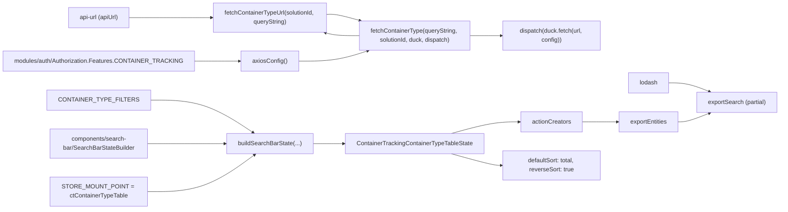

# Diagram: web/portal/src/pages/containertracking/redux/ContainerTrackingContainerTypeTableState.js

> Auto-generated by Obscura crawlers

## Mermaid

### SVG

<svg id="container" width="2084.796875" xmlns="http://www.w3.org/2000/svg" class="flowchart" height="558" viewBox="0 0 2084.796875 558" role="graphics-document document" aria-roledescription="flowchart-v2"><g><marker id="container_flowchart-v2-pointEnd" class="marker flowchart-v2" viewBox="0 0 10 10" refX="5" refY="5" markerUnits="userSpaceOnUse" markerWidth="8" markerHeight="8" orient="auto"><path d="M 0 0 L 10 5 L 0 10 z" class="arrowMarkerPath" style="stroke-width: 1; stroke-dasharray: 1, 0;"></path></marker><marker id="container_flowchart-v2-pointStart" class="marker flowchart-v2" viewBox="0 0 10 10" refX="4.5" refY="5" markerUnits="userSpaceOnUse" markerWidth="8" markerHeight="8" orient="auto"><path d="M 0 5 L 10 10 L 10 0 z" class="arrowMarkerPath" style="stroke-width: 1; stroke-dasharray: 1, 0;"></path></marker><marker id="container_flowchart-v2-circleEnd" class="marker flowchart-v2" viewBox="0 0 10 10" refX="11" refY="5" markerUnits="userSpaceOnUse" markerWidth="11" markerHeight="11" orient="auto"><circle cx="5" cy="5" r="5" class="arrowMarkerPath" style="stroke-width: 1; stroke-dasharray: 1, 0;"></circle></marker><marker id="container_flowchart-v2-circleStart" class="marker flowchart-v2" viewBox="0 0 10 10" refX="-1" refY="5" markerUnits="userSpaceOnUse" markerWidth="11" markerHeight="11" orient="auto"><circle cx="5" cy="5" r="5" class="arrowMarkerPath" style="stroke-width: 1; stroke-dasharray: 1, 0;"></circle></marker><marker id="container_flowchart-v2-crossEnd" class="marker cross flowchart-v2" viewBox="0 0 11 11" refX="12" refY="5.2" markerUnits="userSpaceOnUse" markerWidth="11" markerHeight="11" orient="auto"><path d="M 1,1 l 9,9 M 10,1 l -9,9" class="arrowMarkerPath" style="stroke-width: 2; stroke-dasharray: 1, 0;"></path></marker><marker id="container_flowchart-v2-crossStart" class="marker cross flowchart-v2" viewBox="0 0 11 11" refX="-1" refY="5.2" markerUnits="userSpaceOnUse" markerWidth="11" markerHeight="11" orient="auto"><path d="M 1,1 l 9,9 M 10,1 l -9,9" class="arrowMarkerPath" style="stroke-width: 2; stroke-dasharray: 1, 0;"></path></marker><g class="root"><g class="clusters"></g><g class="edgePaths"><path d="M1782.211,221L1790.775,221C1799.339,221,1816.466,221,1835.154,224.926C1853.841,228.851,1874.089,236.703,1884.212,240.628L1894.336,244.554" id="L_Lodash_ExportPartial_0" class="edge-thickness-normal edge-pattern-solid edge-thickness-normal edge-pattern-solid flowchart-link" style=";" data-edge="true" data-et="edge" data-id="L_Lodash_ExportPartial_0" data-points="W3sieCI6MTc4Mi4yMTA5Mzc1LCJ5IjoyMjF9LHsieCI6MTgzMy41OTM3NSwieSI6MjIxfSx7IngiOjE4OTguMDY1NjU1MDQ4MDc3LCJ5IjoyNDZ9XQ==" marker-end="url(#container_flowchart-v2-pointEnd)"></path><path d="M341.109,47L372.771,47C404.432,47,467.755,47,502.917,47C538.078,47,545.078,47,548.578,47L552.078,47" id="L_ApiUrl_FetchUrl_0" class="edge-thickness-normal edge-pattern-solid edge-thickness-normal edge-pattern-solid flowchart-link" style=";" data-edge="true" data-et="edge" data-id="L_ApiUrl_FetchUrl_0" data-points="W3sieCI6MzQxLjEwOTM3NSwieSI6NDd9LHsieCI6NTMxLjA3ODEyNSwieSI6NDd9LHsieCI6NTU2LjA3ODEyNSwieSI6NDd9XQ==" marker-end="url(#container_flowchart-v2-pointEnd)"></path><path d="M865.641,38.391L869.807,38.159C873.974,37.927,882.307,37.464,897.331,40.221C912.355,42.979,934.07,48.959,944.927,51.948L955.785,54.938" id="L_FetchUrl_Fetch_0" class="edge-thickness-normal edge-pattern-solid edge-thickness-normal edge-pattern-solid flowchart-link" style=";" data-edge="true" data-et="edge" data-id="L_FetchUrl_Fetch_0" data-points="W3sieCI6ODY1LjY0MDYyNSwieSI6MzguMzkwNTc4ODI4NDM3MzM0fSx7IngiOjg5MC42NDA2MjUsInkiOjM3fSx7IngiOjk1OS42NDEwMjkwOTQ4Mjc2LCJ5Ijo1Nn1d" marker-end="url(#container_flowchart-v2-pointEnd)"></path><path d="M506.078,163L510.245,163C514.411,163,522.745,163,543.454,163C564.164,163,597.25,163,613.793,163L630.336,163" id="L_Features_AxiosCfg_0" class="edge-thickness-normal edge-pattern-solid edge-thickness-normal edge-pattern-solid flowchart-link" style=";" data-edge="true" data-et="edge" data-id="L_Features_AxiosCfg_0" data-points="W3sieCI6NTA2LjA3ODEyNSwieSI6MTYzfSx7IngiOjUzMS4wNzgxMjUsInkiOjE2M30seyJ4Ijo2MzQuMzM1OTM3NSwieSI6MTYzfV0=" marker-end="url(#container_flowchart-v2-pointEnd)"></path><path d="M787.383,163L804.592,163C821.802,163,856.221,163,887.768,158.371C919.315,153.743,947.989,144.486,962.326,139.857L976.663,135.229" id="L_AxiosCfg_Fetch_0" class="edge-thickness-normal edge-pattern-solid edge-thickness-normal edge-pattern-solid flowchart-link" style=";" data-edge="true" data-et="edge" data-id="L_AxiosCfg_Fetch_0" data-points="W3sieCI6Nzg3LjM4MjgxMjUsInkiOjE2M30seyJ4Ijo4OTAuNjQwNjI1LCJ5IjoxNjN9LHsieCI6OTgwLjQ2OTMyNDQ0ODUyOTQsInkiOjEzNH1d" marker-end="url(#container_flowchart-v2-pointEnd)"></path><path d="M380.18,267L405.329,267C430.479,267,480.779,267,528.357,281.472C575.936,295.944,620.794,324.888,643.224,339.359L665.653,353.831" id="L_CONTAINER_TYPE_FILTERS_BuildState_0" class="edge-thickness-normal edge-pattern-solid edge-thickness-normal edge-pattern-solid flowchart-link" style=";" data-edge="true" data-et="edge" data-id="L_CONTAINER_TYPE_FILTERS_BuildState_0" data-points="W3sieCI6MzgwLjE3OTY4NzUsInkiOjI2N30seyJ4Ijo1MzEuMDc4MTI1LCJ5IjoyNjd9LHsieCI6NjY5LjAxMzczOTIyNDEzNzksInkiOjM1Nn1d" marker-end="url(#container_flowchart-v2-pointEnd)"></path><path d="M387.039,383L411.046,383C435.052,383,483.065,383,517.197,383C551.328,383,571.578,383,581.703,383L591.828,383" id="L_SearchBuilder_BuildState_0" class="edge-thickness-normal edge-pattern-solid edge-thickness-normal edge-pattern-solid flowchart-link" style=";" data-edge="true" data-et="edge" data-id="L_SearchBuilder_BuildState_0" data-points="W3sieCI6Mzg3LjAzOTA2MjUsInkiOjM4M30seyJ4Ijo1MzEuMDc4MTI1LCJ5IjozODN9LHsieCI6NTk1LjgyODEyNSwieSI6MzgzfV0=" marker-end="url(#container_flowchart-v2-pointEnd)"></path><path d="M387.039,511L411.046,511C435.052,511,483.065,511,530.172,494.553C577.278,478.107,623.478,445.213,646.578,428.767L669.678,412.32" id="L_STORE_BuildState_0" class="edge-thickness-normal edge-pattern-solid edge-thickness-normal edge-pattern-solid flowchart-link" style=";" data-edge="true" data-et="edge" data-id="L_STORE_BuildState_0" data-points="W3sieCI6Mzg3LjAzOTA2MjUsInkiOjUxMX0seyJ4Ijo1MzEuMDc4MTI1LCJ5Ijo1MTF9LHsieCI6NjcyLjkzNjc2NzU3ODEyNSwieSI6NDEwfV0=" marker-end="url(#container_flowchart-v2-pointEnd)"></path><path d="M825.891,383L836.682,383C847.474,383,869.057,383,883.349,383C897.641,383,904.641,383,908.141,383L911.641,383" id="L_BuildState_ContainerState_0" class="edge-thickness-normal edge-pattern-solid edge-thickness-normal edge-pattern-solid flowchart-link" style=";" data-edge="true" data-et="edge" data-id="L_BuildState_ContainerState_0" data-points="W3sieCI6ODI1Ljg5MDYyNSwieSI6MzgzfSx7IngiOjg5MC42NDA2MjUsInkiOjM4M30seyJ4Ijo5MTUuNjQwNjI1LCJ5IjozODN9XQ==" marker-end="url(#container_flowchart-v2-pointEnd)"></path><path d="M1199.327,356L1218.09,350.833C1236.853,345.667,1274.38,335.333,1304.531,330.167C1334.682,325,1357.458,325,1368.846,325L1380.234,325" id="L_ContainerState_ActionCreators_0" class="edge-thickness-normal edge-pattern-solid edge-thickness-normal edge-pattern-solid flowchart-link" style=";" data-edge="true" data-et="edge" data-id="L_ContainerState_ActionCreators_0" data-points="W3sieCI6MTE5OS4zMjY2NDMzMTg5NjU2LCJ5IjozNTZ9LHsieCI6MTMxMS45MDYyNSwieSI6MzI1fSx7IngiOjEzODQuMjM0Mzc1LCJ5IjozMjV9XQ==" marker-end="url(#container_flowchart-v2-pointEnd)"></path><path d="M1549.578,325L1561.633,325C1573.688,325,1597.797,325,1613.352,325C1628.906,325,1635.906,325,1639.406,325L1642.906,325" id="L_ActionCreators_ExportEntities_0" class="edge-thickness-normal edge-pattern-solid edge-thickness-normal edge-pattern-solid flowchart-link" style=";" data-edge="true" data-et="edge" data-id="L_ActionCreators_ExportEntities_0" data-points="W3sieCI6MTU0OS41NzgxMjUsInkiOjMyNX0seyJ4IjoxNjIxLjkwNjI1LCJ5IjozMjV9LHsieCI6MTY0Ni45MDYyNSwieSI6MzI1fV0=" marker-end="url(#container_flowchart-v2-pointEnd)"></path><path d="M1808.594,325L1812.76,325C1816.927,325,1825.26,325,1839.551,321.074C1853.841,317.149,1874.089,309.297,1884.212,305.372L1894.336,301.446" id="L_ExportEntities_ExportPartial_0" class="edge-thickness-normal edge-pattern-solid edge-thickness-normal edge-pattern-solid flowchart-link" style=";" data-edge="true" data-et="edge" data-id="L_ExportEntities_ExportPartial_0" data-points="W3sieCI6MTgwOC41OTM3NSwieSI6MzI1fSx7IngiOjE4MzMuNTkzNzUsInkiOjMyNX0seyJ4IjoxODk4LjA2NTY1NTA0ODA3NywieSI6MzAwfV0=" marker-end="url(#container_flowchart-v2-pointEnd)"></path><path d="M1250.531,95L1260.76,95C1270.99,95,1291.448,95,1305.177,95C1318.906,95,1325.906,95,1329.406,95L1332.906,95" id="L_Fetch_Dispatch_0" class="edge-thickness-normal edge-pattern-solid edge-thickness-normal edge-pattern-solid flowchart-link" style=";" data-edge="true" data-et="edge" data-id="L_Fetch_Dispatch_0" data-points="W3sieCI6MTI1MC41MzEyNSwieSI6OTV9LHsieCI6MTMxMS45MDYyNSwieSI6OTV9LHsieCI6MTMzNi45MDYyNSwieSI6OTV9XQ==" marker-end="url(#container_flowchart-v2-pointEnd)"></path><path d="M952.016,95L941.786,95C931.557,95,911.099,95,895.896,93.672C880.693,92.344,870.744,89.688,865.77,88.36L860.796,87.032" id="L_Fetch_FetchUrl_0" class="edge-thickness-normal edge-pattern-solid edge-thickness-normal edge-pattern-solid flowchart-link" style=";" data-edge="true" data-et="edge" data-id="L_Fetch_FetchUrl_0" data-points="W3sieCI6OTUyLjAxNTYyNSwieSI6OTV9LHsieCI6ODkwLjY0MDYyNSwieSI6OTV9LHsieCI6ODU2LjkzMTY0MDYyNSwieSI6ODZ9XQ==" marker-end="url(#container_flowchart-v2-pointEnd)"></path><path d="M1199.327,410L1218.09,415.167C1236.853,420.333,1274.38,430.667,1296.643,435.833C1318.906,441,1325.906,441,1329.406,441L1332.906,441" id="L_ContainerState_DefaultSort_0" class="edge-thickness-normal edge-pattern-solid edge-thickness-normal edge-pattern-solid flowchart-link" style=";" data-edge="true" data-et="edge" data-id="L_ContainerState_DefaultSort_0" data-points="W3sieCI6MTE5OS4zMjY2NDMzMTg5NjU2LCJ5Ijo0MTB9LHsieCI6MTMxMS45MDYyNSwieSI6NDQxfSx7IngiOjEzMzYuOTA2MjUsInkiOjQ0MX1d" marker-end="url(#container_flowchart-v2-pointEnd)"></path></g><g class="edgeLabels"><g class="edgeLabel"><g class="label" data-id="L_Lodash_ExportPartial_0" transform="translate(0, 0)"><foreignObject width="0" height="0">

</foreignObject></g></g><g class="edgeLabel"><g class="label" data-id="L_ApiUrl_FetchUrl_0" transform="translate(0, 0)"><foreignObject width="0" height="0">

</foreignObject></g></g><g class="edgeLabel"><g class="label" data-id="L_FetchUrl_Fetch_0" transform="translate(0, 0)"><foreignObject width="0" height="0">

</foreignObject></g></g><g class="edgeLabel"><g class="label" data-id="L_Features_AxiosCfg_0" transform="translate(0, 0)"><foreignObject width="0" height="0">

</foreignObject></g></g><g class="edgeLabel"><g class="label" data-id="L_AxiosCfg_Fetch_0" transform="translate(0, 0)"><foreignObject width="0" height="0">

</foreignObject></g></g><g class="edgeLabel"><g class="label" data-id="L_CONTAINER_TYPE_FILTERS_BuildState_0" transform="translate(0, 0)"><foreignObject width="0" height="0">

</foreignObject></g></g><g class="edgeLabel"><g class="label" data-id="L_SearchBuilder_BuildState_0" transform="translate(0, 0)"><foreignObject width="0" height="0">

</foreignObject></g></g><g class="edgeLabel"><g class="label" data-id="L_STORE_BuildState_0" transform="translate(0, 0)"><foreignObject width="0" height="0">

</foreignObject></g></g><g class="edgeLabel"><g class="label" data-id="L_BuildState_ContainerState_0" transform="translate(0, 0)"><foreignObject width="0" height="0">

</foreignObject></g></g><g class="edgeLabel"><g class="label" data-id="L_ContainerState_ActionCreators_0" transform="translate(0, 0)"><foreignObject width="0" height="0">

</foreignObject></g></g><g class="edgeLabel"><g class="label" data-id="L_ActionCreators_ExportEntities_0" transform="translate(0, 0)"><foreignObject width="0" height="0">

</foreignObject></g></g><g class="edgeLabel"><g class="label" data-id="L_ExportEntities_ExportPartial_0" transform="translate(0, 0)"><foreignObject width="0" height="0">

</foreignObject></g></g><g class="edgeLabel"><g class="label" data-id="L_Fetch_Dispatch_0" transform="translate(0, 0)"><foreignObject width="0" height="0">

</foreignObject></g></g><g class="edgeLabel"><g class="label" data-id="L_Fetch_FetchUrl_0" transform="translate(0, 0)"><foreignObject width="0" height="0">

</foreignObject></g></g><g class="edgeLabel"><g class="label" data-id="L_ContainerState_DefaultSort_0" transform="translate(0, 0)"><foreignObject width="0" height="0">

</foreignObject></g></g></g><g class="nodes"><g class="node default" id="flowchart-Lodash-0" transform="translate(1727.75, 221)"><rect class="basic label-container" style="" x="-54.4609375" y="-27" width="108.921875" height="54"></rect><g class="label" style="" transform="translate(-24.4609375, -12)"><rect></rect><foreignObject width="48.921875" height="24">

lodash

</foreignObject></g></g><g class="node default" id="flowchart-ExportPartial-1" transform="translate(1967.6953125, 273)"><rect class="basic label-container" style="" x="-109.1015625" y="-27" width="218.203125" height="54"></rect><g class="label" style="" transform="translate(-79.1015625, -12)"><rect></rect><foreignObject width="158.203125" height="24">

exportSearch (partial)

</foreignObject></g></g><g class="node default" id="flowchart-ApiUrl-2" transform="translate(257.0390625, 47)"><rect class="basic label-container" style="" x="-84.0703125" y="-27" width="168.140625" height="54"></rect><g class="label" style="" transform="translate(-54.0703125, -12)"><rect></rect><foreignObject width="108.140625" height="24">

api-url (apiUrl)

</foreignObject></g></g><g class="node default" id="flowchart-FetchUrl-3" transform="translate(710.859375, 47)"><rect class="basic label-container" style="" x="-154.78125" y="-39" width="309.5625" height="78"></rect><g class="label" style="" transform="translate(-124.78125, -24)"><rect></rect><foreignObject width="249.5625" height="48">

fetchContainerTypeUrl(solutionId, queryString)

</foreignObject></g></g><g class="node default" id="flowchart-Fetch-5" transform="translate(1101.2734375, 95)"><rect class="basic label-container" style="" x="-149.2578125" y="-39" width="298.515625" height="78"></rect><g class="label" style="" transform="translate(-119.2578125, -24)"><rect></rect><foreignObject width="238.515625" height="48">

fetchContainerType(queryString, solutionId, duck, dispatch)

</foreignObject></g></g><g class="node default" id="flowchart-Features-6" transform="translate(257.0390625, 163)"><rect class="basic label-container" style="" x="-249.0390625" y="-27" width="498.078125" height="54"></rect><g class="label" style="" transform="translate(-219.0390625, -12)"><rect></rect><foreignObject width="438.078125" height="24">

modules/auth/Authorization.Features.CONTAINER_TRACKING

</foreignObject></g></g><g class="node default" id="flowchart-AxiosCfg-7" transform="translate(710.859375, 163)"><rect class="basic label-container" style="" x="-76.5234375" y="-27" width="153.046875" height="54"></rect><g class="label" style="" transform="translate(-46.5234375, -12)"><rect></rect><foreignObject width="93.046875" height="24">

axiosConfig()

</foreignObject></g></g><g class="node default" id="flowchart-CONTAINER_TYPE_FILTERS-10" transform="translate(257.0390625, 267)"><rect class="basic label-container" style="" x="-123.140625" y="-27" width="246.28125" height="54"></rect><g class="label" style="" transform="translate(-93.140625, -12)"><rect></rect><foreignObject width="186.28125" height="24">

CONTAINER_TYPE_FILTERS

</foreignObject></g></g><g class="node default" id="flowchart-BuildState-11" transform="translate(710.859375, 383)"><rect class="basic label-container" style="" x="-115.03125" y="-27" width="230.0625" height="54"></rect><g class="label" style="" transform="translate(-85.03125, -12)"><rect></rect><foreignObject width="170.0625" height="24">

buildSearchBarState(...)

</foreignObject></g></g><g class="node default" id="flowchart-SearchBuilder-12" transform="translate(257.0390625, 383)"><rect class="basic label-container" style="" x="-130" y="-39" width="260" height="78"></rect><g class="label" style="" transform="translate(-100, -24)"><rect></rect><foreignObject width="200" height="48">

components/search-bar/SearchBarStateBuilder

</foreignObject></g></g><g class="node default" id="flowchart-STORE-14" transform="translate(257.0390625, 511)"><rect class="basic label-container" style="" x="-130" y="-39" width="260" height="78"></rect><g class="label" style="" transform="translate(-100, -24)"><rect></rect><foreignObject width="200" height="48">

STORE_MOUNT_POINT = ctContainerTypeTable

</foreignObject></g></g><g class="node default" id="flowchart-ContainerState-17" transform="translate(1101.2734375, 383)"><rect class="basic label-container" style="" x="-185.6328125" y="-27" width="371.265625" height="54"></rect><g class="label" style="" transform="translate(-155.6328125, -12)"><rect></rect><foreignObject width="311.265625" height="24">

ContainerTrackingContainerTypeTableState

</foreignObject></g></g><g class="node default" id="flowchart-ActionCreators-19" transform="translate(1466.90625, 325)"><rect class="basic label-container" style="" x="-82.671875" y="-27" width="165.34375" height="54"></rect><g class="label" style="" transform="translate(-52.671875, -12)"><rect></rect><foreignObject width="105.34375" height="24">

actionCreators

</foreignObject></g></g><g class="node default" id="flowchart-ExportEntities-21" transform="translate(1727.75, 325)"><rect class="basic label-container" style="" x="-80.84375" y="-27" width="161.6875" height="54"></rect><g class="label" style="" transform="translate(-50.84375, -12)"><rect></rect><foreignObject width="101.6875" height="24">

exportEntities

</foreignObject></g></g><g class="node default" id="flowchart-Dispatch-25" transform="translate(1466.90625, 95)"><rect class="basic label-container" style="" x="-130" y="-39" width="260" height="78"></rect><g class="label" style="" transform="translate(-100, -24)"><rect></rect><foreignObject width="200" height="48">

dispatch(duck.fetch(url, config))

</foreignObject></g></g><g class="node default" id="flowchart-DefaultSort-29" transform="translate(1466.90625, 441)"><rect class="basic label-container" style="" x="-130" y="-39" width="260" height="78"></rect><g class="label" style="" transform="translate(-100, -24)"><rect></rect><foreignObject width="200" height="48">

defaultSort: total, reverseSort: true

</foreignObject></g></g></g></g></g></svg>
