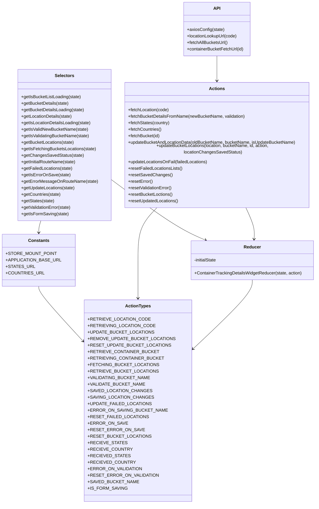

# Diagram: web/portal/src/pages/containertracking/redux/ContainerTrackingLocationManagementState.js


> Auto-generated by Obscura crawlers

## Diagram 1



### SVG

<svg id="container" width="1144.330078125" xmlns="http://www.w3.org/2000/svg" class="classDiagram" height="1858" viewBox="0 0 1144.330078125 1858" role="graphics-document document" aria-roledescription="class"><style>#container{font-family:"trebuchet ms",verdana,arial,sans-serif;font-size:16px;fill:#333;}@keyframes edge-animation-frame{from{stroke-dashoffset:0;}}@keyframes dash{to{stroke-dashoffset:0;}}#container .edge-animation-slow{stroke-dasharray:9,5!important;stroke-dashoffset:900;animation:dash 50s linear infinite;stroke-linecap:round;}#container .edge-animation-fast{stroke-dasharray:9,5!important;stroke-dashoffset:900;animation:dash 20s linear infinite;stroke-linecap:round;}#container .error-icon{fill:#552222;}#container .error-text{fill:#552222;stroke:#552222;}#container .edge-thickness-normal{stroke-width:1px;}#container .edge-thickness-thick{stroke-width:3.5px;}#container .edge-pattern-solid{stroke-dasharray:0;}#container .edge-thickness-invisible{stroke-width:0;fill:none;}#container .edge-pattern-dashed{stroke-dasharray:3;}#container .edge-pattern-dotted{stroke-dasharray:2;}#container .marker{fill:#333333;stroke:#333333;}#container .marker.cross{stroke:#333333;}#container svg{font-family:"trebuchet ms",verdana,arial,sans-serif;font-size:16px;}#container p{margin:0;}#container g.classGroup text{fill:#9370DB;stroke:none;font-family:"trebuchet ms",verdana,arial,sans-serif;font-size:10px;}#container g.classGroup text .title{font-weight:bolder;}#container .nodeLabel,#container .edgeLabel{color:#131300;}#container .edgeLabel .label rect{fill:#ECECFF;}#container .label text{fill:#131300;}#container .labelBkg{background:#ECECFF;}#container .edgeLabel .label span{background:#ECECFF;}#container .classTitle{font-weight:bolder;}#container .node rect,#container .node circle,#container .node ellipse,#container .node polygon,#container .node path{fill:#ECECFF;stroke:#9370DB;stroke-width:1px;}#container .divider{stroke:#9370DB;stroke-width:1;}#container g.clickable{cursor:pointer;}#container g.classGroup rect{fill:#ECECFF;stroke:#9370DB;}#container g.classGroup line{stroke:#9370DB;stroke-width:1;}#container .classLabel .box{stroke:none;stroke-width:0;fill:#ECECFF;opacity:0.5;}#container .classLabel .label{fill:#9370DB;font-size:10px;}#container .relation{stroke:#333333;stroke-width:1;fill:none;}#container .dashed-line{stroke-dasharray:3;}#container .dotted-line{stroke-dasharray:1 2;}#container #compositionStart,#container .composition{fill:#333333!important;stroke:#333333!important;stroke-width:1;}#container #compositionEnd,#container .composition{fill:#333333!important;stroke:#333333!important;stroke-width:1;}#container #dependencyStart,#container .dependency{fill:#333333!important;stroke:#333333!important;stroke-width:1;}#container #dependencyStart,#container .dependency{fill:#333333!important;stroke:#333333!important;stroke-width:1;}#container #extensionStart,#container .extension{fill:transparent!important;stroke:#333333!important;stroke-width:1;}#container #extensionEnd,#container .extension{fill:transparent!important;stroke:#333333!important;stroke-width:1;}#container #aggregationStart,#container .aggregation{fill:transparent!important;stroke:#333333!important;stroke-width:1;}#container #aggregationEnd,#container .aggregation{fill:transparent!important;stroke:#333333!important;stroke-width:1;}#container #lollipopStart,#container .lollipop{fill:#ECECFF!important;stroke:#333333!important;stroke-width:1;}#container #lollipopEnd,#container .lollipop{fill:#ECECFF!important;stroke:#333333!important;stroke-width:1;}#container .edgeTerminals{font-size:11px;line-height:initial;}#container .classTitleText{text-anchor:middle;font-size:18px;fill:#333;}#container .label-icon{display:inline-block;height:1em;overflow:visible;vertical-align:-0.125em;}#container .node .label-icon path{fill:currentColor;stroke:revert;stroke-width:revert;}#container :root{--mermaid-font-family:"trebuchet ms",verdana,arial,sans-serif;}</style><g><defs><marker id="container_class-aggregationStart" class="marker aggregation class" refX="18" refY="7" markerWidth="190" markerHeight="240" orient="auto"><path d="M 18,7 L9,13 L1,7 L9,1 Z"></path></marker></defs><defs><marker id="container_class-aggregationEnd" class="marker aggregation class" refX="1" refY="7" markerWidth="20" markerHeight="28" orient="auto"><path d="M 18,7 L9,13 L1,7 L9,1 Z"></path></marker></defs><defs><marker id="container_class-extensionStart" class="marker extension class" refX="18" refY="7" markerWidth="190" markerHeight="240" orient="auto"><path d="M 1,7 L18,13 V 1 Z"></path></marker></defs><defs><marker id="container_class-extensionEnd" class="marker extension class" refX="1" refY="7" markerWidth="20" markerHeight="28" orient="auto"><path d="M 1,1 V 13 L18,7 Z"></path></marker></defs><defs><marker id="container_class-compositionStart" class="marker composition class" refX="18" refY="7" markerWidth="190" markerHeight="240" orient="auto"><path d="M 18,7 L9,13 L1,7 L9,1 Z"></path></marker></defs><defs><marker id="container_class-compositionEnd" class="marker composition class" refX="1" refY="7" markerWidth="20" markerHeight="28" orient="auto"><path d="M 18,7 L9,13 L1,7 L9,1 Z"></path></marker></defs><defs><marker id="container_class-dependencyStart" class="marker dependency class" refX="6" refY="7" markerWidth="190" markerHeight="240" orient="auto"><path d="M 5,7 L9,13 L1,7 L9,1 Z"></path></marker></defs><defs><marker id="container_class-dependencyEnd" class="marker dependency class" refX="13" refY="7" markerWidth="20" markerHeight="28" orient="auto"><path d="M 18,7 L9,13 L14,7 L9,1 Z"></path></marker></defs><defs><marker id="container_class-lollipopStart" class="marker lollipop class" refX="13" refY="7" markerWidth="190" markerHeight="240" orient="auto"><circle stroke="black" fill="transparent" cx="7" cy="7" r="6"></circle></marker></defs><defs><marker id="container_class-lollipopEnd" class="marker lollipop class" refX="1" refY="7" markerWidth="190" markerHeight="240" orient="auto"><circle stroke="black" fill="transparent" cx="7" cy="7" r="6"></circle></marker></defs><g class="root"><g class="clusters"></g><g class="edgePaths"><path d="M128.816,1056L128.816,1060.167C128.816,1064.333,128.816,1072.667,158.989,1110.139C189.161,1147.612,249.506,1214.224,279.678,1247.53L309.851,1280.836" id="id_Constants_ActionTypes_1" class="edge-thickness-normal edge-pattern-solid relation" style=";;;" data-edge="true" data-et="edge" data-id="id_Constants_ActionTypes_1" data-points="W3sieCI6MTI4LjgxNjQwNjI1LCJ5IjoxMDU2fSx7IngiOjEyOC44MTY0MDYyNSwieSI6MTA4MX0seyJ4IjozMTMuODc4OTA2MjUsInkiOjEyODUuMjgyMzA2OTQwMzcxNH1d" marker-end="url(#container_class-dependencyEnd)"></path><path d="M780.205,206L780.205,210.167C780.205,214.333,780.205,222.667,780.205,240C780.205,257.333,780.205,283.667,780.205,296.833L780.205,310" id="id_API_Actions_2" class="edge-thickness-normal edge-pattern-solid relation" style=";;;" data-edge="true" data-et="edge" data-id="id_API_Actions_2" data-points="W3sieCI6NzgwLjIwNTA3ODEyNSwieSI6MjA2fSx7IngiOjc4MC4yMDUwNzgxMjUsInkiOjIzMX0seyJ4Ijo3ODAuMjA1MDc4MTI1LCJ5IjozMTZ9XQ==" marker-end="url(#container_class-dependencyEnd)"></path><path d="M570.037,754L556.442,768.167C542.846,782.333,515.656,810.667,502.06,845C488.465,879.333,488.465,919.667,488.465,960C488.465,1000.333,488.465,1040.667,488.465,1064C488.465,1087.333,488.465,1093.667,488.465,1096.833L488.465,1100" id="id_Actions_ActionTypes_3" class="edge-thickness-normal edge-pattern-solid relation" style=";;;" data-edge="true" data-et="edge" data-id="id_Actions_ActionTypes_3" data-points="W3sieCI6NTcwLjAzNjk0ODc1NjE2NzcsInkiOjc1NH0seyJ4Ijo0ODguNDY0ODQzNzUsInkiOjgzOX0seyJ4Ijo0ODguNDY0ODQzNzUsInkiOjk2MH0seyJ4Ijo0ODguNDY0ODQzNzUsInkiOjEwODF9LHsieCI6NDg4LjQ2NDg0Mzc1LCJ5IjoxMTA2fV0=" marker-end="url(#container_class-dependencyEnd)"></path><path d="M910.58,1032L910.58,1040.167C910.58,1048.333,910.58,1064.667,870.054,1110.949C829.527,1157.23,748.474,1233.461,707.948,1271.576L667.421,1309.691" id="id_Reducer_ActionTypes_4" class="edge-thickness-normal edge-pattern-solid relation" style=";;;" data-edge="true" data-et="edge" data-id="id_Reducer_ActionTypes_4" data-points="W3sieCI6OTEwLjU4MDA3ODEyNSwieSI6MTAzMn0seyJ4Ijo5MTAuNTgwMDc4MTI1LCJ5IjoxMDgxfSx7IngiOjY2My4wNTA3ODEyNSwieSI6MTMxMy44MDE2Njg0OTQzMjk1fV0=" marker-end="url(#container_class-dependencyEnd)"></path><path d="M136.046,814L134.841,818.167C133.636,822.333,131.226,830.667,130.021,838C128.816,845.333,128.816,851.667,128.816,854.833L128.816,858" id="id_Selectors_Constants_5" class="edge-thickness-normal edge-pattern-solid relation" style=";;;" data-edge="true" data-et="edge" data-id="id_Selectors_Constants_5" data-points="W3sieCI6MTM2LjA0NTY5OTI3MDE0ODAyLCJ5Ijo4MTR9LHsieCI6MTI4LjgxNjQwNjI1LCJ5Ijo4Mzl9LHsieCI6MTI4LjgxNjQwNjI1LCJ5Ijo4NjR9XQ==" marker-end="url(#container_class-dependencyEnd)"></path><path d="M385.209,659.284L425.814,689.237C466.419,719.189,547.63,779.095,606.331,816.819C665.033,854.544,701.227,870.088,719.323,877.86L737.42,885.632" id="id_Selectors_Reducer_6" class="edge-thickness-normal edge-pattern-solid relation" style=";;;" data-edge="true" data-et="edge" data-id="id_Selectors_Reducer_6" data-points="W3sieCI6Mzg1LjIwODk4NDM3NSwieSI6NjU5LjI4MzgwNjM5MTM3ODN9LHsieCI6NjI4LjgzOTg0Mzc1LCJ5Ijo4Mzl9LHsieCI6NzQyLjkzMjk5NjUxMzQyOTgsInkiOjg4OH1d" marker-end="url(#container_class-dependencyEnd)"></path><path d="M881.33,754L887.872,768.167C894.414,782.333,907.497,810.667,913.446,832.003C919.395,853.34,918.21,867.68,917.617,874.85L917.025,882.02" id="id_Actions_Reducer_7" class="edge-thickness-normal edge-pattern-solid relation" style=";;;" data-edge="true" data-et="edge" data-id="id_Actions_Reducer_7" data-points="W3sieCI6ODgxLjMzMDQ4OTMwOTIxMDUsInkiOjc1NH0seyJ4Ijo5MjAuNTgwMDc4MTI1LCJ5Ijo4Mzl9LHsieCI6OTE2LjUzMDQ5MTM0ODE0MDUsInkiOjg4OH1d" marker-end="url(#container_class-dependencyEnd)"></path></g><g class="edgeLabels"><g class="edgeLabel"><g class="label" data-id="id_Constants_ActionTypes_1" transform="translate(0, 0)"><foreignObject width="0" height="0"><div xmlns="http://www.w3.org/1999/xhtml" class="labelBkg" style="display: table-cell; white-space: nowrap; line-height: 1.5; max-width: 200px; text-align: center;"><span class="edgeLabel"></span></div></foreignObject></g></g><g class="edgeLabel"><g class="label" data-id="id_API_Actions_2" transform="translate(0, 0)"><foreignObject width="0" height="0"><div xmlns="http://www.w3.org/1999/xhtml" class="labelBkg" style="display: table-cell; white-space: nowrap; line-height: 1.5; max-width: 200px; text-align: center;"><span class="edgeLabel"></span></div></foreignObject></g></g><g class="edgeLabel"><g class="label" data-id="id_Actions_ActionTypes_3" transform="translate(0, 0)"><foreignObject width="0" height="0"><div xmlns="http://www.w3.org/1999/xhtml" class="labelBkg" style="display: table-cell; white-space: nowrap; line-height: 1.5; max-width: 200px; text-align: center;"><span class="edgeLabel"></span></div></foreignObject></g></g><g class="edgeLabel"><g class="label" data-id="id_Reducer_ActionTypes_4" transform="translate(0, 0)"><foreignObject width="0" height="0"><div xmlns="http://www.w3.org/1999/xhtml" class="labelBkg" style="display: table-cell; white-space: nowrap; line-height: 1.5; max-width: 200px; text-align: center;"><span class="edgeLabel"></span></div></foreignObject></g></g><g class="edgeLabel"><g class="label" data-id="id_Selectors_Constants_5" transform="translate(0, 0)"><foreignObject width="0" height="0"><div xmlns="http://www.w3.org/1999/xhtml" class="labelBkg" style="display: table-cell; white-space: nowrap; line-height: 1.5; max-width: 200px; text-align: center;"><span class="edgeLabel"></span></div></foreignObject></g></g><g class="edgeLabel"><g class="label" data-id="id_Selectors_Reducer_6" transform="translate(0, 0)"><foreignObject width="0" height="0"><div xmlns="http://www.w3.org/1999/xhtml" class="labelBkg" style="display: table-cell; white-space: nowrap; line-height: 1.5; max-width: 200px; text-align: center;"><span class="edgeLabel"></span></div></foreignObject></g></g><g class="edgeLabel"><g class="label" data-id="id_Actions_Reducer_7" transform="translate(0, 0)"><foreignObject width="0" height="0"><div xmlns="http://www.w3.org/1999/xhtml" class="labelBkg" style="display: table-cell; white-space: nowrap; line-height: 1.5; max-width: 200px; text-align: center;"><span class="edgeLabel"></span></div></foreignObject></g></g></g><g class="nodes"><g class="node default" id="classId-Constants-0" transform="translate(128.81640625, 960)"><g class="basic label-container"><path d="M-120.81640625 -96 L120.81640625 -96 L120.81640625 96 L-120.81640625 96" stroke="none" stroke-width="0" fill="#ECECFF" style=""></path><path d="M-120.81640625 -96 C-54.555845413056446 -96, 11.704715423887109 -96, 120.81640625 -96 M-120.81640625 -96 C-64.52141307623131 -96, -8.226419902462638 -96, 120.81640625 -96 M120.81640625 -96 C120.81640625 -22.108935168175407, 120.81640625 51.78212966364919, 120.81640625 96 M120.81640625 -96 C120.81640625 -33.62137740920128, 120.81640625 28.75724518159744, 120.81640625 96 M120.81640625 96 C45.07815821452721 96, -30.660089820945586 96, -120.81640625 96 M120.81640625 96 C66.11216099383682 96, 11.407915737673662 96, -120.81640625 96 M-120.81640625 96 C-120.81640625 26.131371689136103, -120.81640625 -43.737256621727795, -120.81640625 -96 M-120.81640625 96 C-120.81640625 24.388019764838006, -120.81640625 -47.22396047032399, -120.81640625 -96" stroke="#9370DB" stroke-width="1.3" fill="none" stroke-dasharray="0 0" style=""></path></g><g class="annotation-group text" transform="translate(0, -72)"></g><g class="label-group text" transform="translate(-36.5390625, -72)"><g class="label" style="font-weight: bolder" transform="translate(0,-12)"><foreignObject width="73.078125" height="24"><div xmlns="http://www.w3.org/1999/xhtml" style="display: table-cell; white-space: nowrap; line-height: 1.5; max-width: 122px; text-align: center;"><span class="nodeLabel markdown-node-label" style=""><p>Constants</p></span></div></foreignObject></g></g><g class="members-group text" transform="translate(-108.81640625, -24)"><g class="label" style="" transform="translate(0,-12)"><foreignObject width="166.03125" height="24"><div xmlns="http://www.w3.org/1999/xhtml" style="display: table-cell; white-space: nowrap; line-height: 1.5; max-width: 224px; text-align: center;"><span class="nodeLabel markdown-node-label" style=""><p>+STORE_MOUNT_POINT</p></span></div></foreignObject></g><g class="label" style="" transform="translate(0,12)"><foreignObject width="181.09375" height="24"><div xmlns="http://www.w3.org/1999/xhtml" style="display: table-cell; white-space: nowrap; line-height: 1.5; max-width: 238px; text-align: center;"><span class="nodeLabel markdown-node-label" style=""><p>+APPLICATION_BASE_URL</p></span></div></foreignObject></g><g class="label" style="" transform="translate(0,36)"><foreignObject width="92.546875" height="24"><div xmlns="http://www.w3.org/1999/xhtml" style="display: table-cell; white-space: nowrap; line-height: 1.5; max-width: 150px; text-align: center;"><span class="nodeLabel markdown-node-label" style=""><p>+STATES_URL</p></span></div></foreignObject></g><g class="label" style="" transform="translate(0,60)"><foreignObject width="124.609375" height="24"><div xmlns="http://www.w3.org/1999/xhtml" style="display: table-cell; white-space: nowrap; line-height: 1.5; max-width: 182px; text-align: center;"><span class="nodeLabel markdown-node-label" style=""><p>+COUNTRIES_URL</p></span></div></foreignObject></g></g><g class="methods-group text" transform="translate(-108.81640625, 96)"></g><g class="divider" style=""><path d="M-120.81640625 -48 C-48.62534865982765 -48, 23.565708930344698 -48, 120.81640625 -48 M-120.81640625 -48 C-31.51810906614044 -48, 57.78018811771912 -48, 120.81640625 -48" stroke="#9370DB" stroke-width="1.3" fill="none" stroke-dasharray="0 0" style=""></path></g><g class="divider" style=""><path d="M-120.81640625 72 C-58.68282923413381 72, 3.4507477817323746 72, 120.81640625 72 M-120.81640625 72 C-57.404339779873204 72, 6.007726690253591 72, 120.81640625 72" stroke="#9370DB" stroke-width="1.3" fill="none" stroke-dasharray="0 0" style=""></path></g></g><g class="node default" id="classId-ActionTypes-1" transform="translate(488.46484375, 1478)"><g class="basic label-container"><path d="M-174.5859375 -372 L174.5859375 -372 L174.5859375 372 L-174.5859375 372" stroke="none" stroke-width="0" fill="#ECECFF" style=""></path><path d="M-174.5859375 -372 C-81.57728144247872 -372, 11.431374615042557 -372, 174.5859375 -372 M-174.5859375 -372 C-64.60362115851922 -372, 45.378695182961565 -372, 174.5859375 -372 M174.5859375 -372 C174.5859375 -79.40235679800048, 174.5859375 213.19528640399903, 174.5859375 372 M174.5859375 -372 C174.5859375 -112.35964318639964, 174.5859375 147.28071362720073, 174.5859375 372 M174.5859375 372 C37.612182927280685 372, -99.36157164543863 372, -174.5859375 372 M174.5859375 372 C71.28072458547713 372, -32.02448832904574 372, -174.5859375 372 M-174.5859375 372 C-174.5859375 75.82707110251494, -174.5859375 -220.34585779497013, -174.5859375 -372 M-174.5859375 372 C-174.5859375 81.12865485529858, -174.5859375 -209.74269028940284, -174.5859375 -372" stroke="#9370DB" stroke-width="1.3" fill="none" stroke-dasharray="0 0" style=""></path></g><g class="annotation-group text" transform="translate(0, -348)"></g><g class="label-group text" transform="translate(-44.390625, -348)"><g class="label" style="font-weight: bolder" transform="translate(0,-12)"><foreignObject width="88.78125" height="24"><div xmlns="http://www.w3.org/1999/xhtml" style="display: table-cell; white-space: nowrap; line-height: 1.5; max-width: 137px; text-align: center;"><span class="nodeLabel markdown-node-label" style=""><p>ActionTypes</p></span></div></foreignObject></g></g><g class="members-group text" transform="translate(-162.5859375, -300)"><g class="label" style="" transform="translate(0,-12)"><foreignObject width="200.140625" height="24"><div xmlns="http://www.w3.org/1999/xhtml" style="display: table-cell; white-space: nowrap; line-height: 1.5; max-width: 258px; text-align: center;"><span class="nodeLabel markdown-node-label" style=""><p>+RETRIEVE_LOCATION_CODE</p></span></div></foreignObject></g><g class="label" style="" transform="translate(0,12)"><foreignObject width="217.3125" height="24"><div xmlns="http://www.w3.org/1999/xhtml" style="display: table-cell; white-space: nowrap; line-height: 1.5; max-width: 275px; text-align: center;"><span class="nodeLabel markdown-node-label" style=""><p>+RETRIEVING_LOCATION_CODE</p></span></div></foreignObject></g><g class="label" style="" transform="translate(0,36)"><foreignObject width="213.953125" height="24"><div xmlns="http://www.w3.org/1999/xhtml" style="display: table-cell; white-space: nowrap; line-height: 1.5; max-width: 272px; text-align: center;"><span class="nodeLabel markdown-node-label" style=""><p>+UPDATE_BUCKET_LOCATIONS</p></span></div></foreignObject></g><g class="label" style="" transform="translate(0,60)"><foreignObject width="280.78125" height="24"><div xmlns="http://www.w3.org/1999/xhtml" style="display: table-cell; white-space: nowrap; line-height: 1.5; max-width: 338px; text-align: center;"><span class="nodeLabel markdown-node-label" style=""><p>+REMOVE_UPDATE_BUCKET_LOCATIONS</p></span></div></foreignObject></g><g class="label" style="" transform="translate(0,84)"><foreignObject width="264.625" height="24"><div xmlns="http://www.w3.org/1999/xhtml" style="display: table-cell; white-space: nowrap; line-height: 1.5; max-width: 322px; text-align: center;"><span class="nodeLabel markdown-node-label" style=""><p>+RESET_UPDATE_BUCKET_LOCATIONS</p></span></div></foreignObject></g><g class="label" style="" transform="translate(0,108)"><foreignObject width="227.625" height="24"><div xmlns="http://www.w3.org/1999/xhtml" style="display: table-cell; white-space: nowrap; line-height: 1.5; max-width: 286px; text-align: center;"><span class="nodeLabel markdown-node-label" style=""><p>+RETRIEVE_CONTAINER_BUCKET</p></span></div></foreignObject></g><g class="label" style="" transform="translate(0,132)"><foreignObject width="244.8125" height="24"><div xmlns="http://www.w3.org/1999/xhtml" style="display: table-cell; white-space: nowrap; line-height: 1.5; max-width: 303px; text-align: center;"><span class="nodeLabel markdown-node-label" style=""><p>+RETRIEVING_CONTAINER_BUCKET</p></span></div></foreignObject></g><g class="label" style="" transform="translate(0,156)"><foreignObject width="228.4375" height="24"><div xmlns="http://www.w3.org/1999/xhtml" style="display: table-cell; white-space: nowrap; line-height: 1.5; max-width: 286px; text-align: center;"><span class="nodeLabel markdown-node-label" style=""><p>+FETCHING_BUCKET_LOCATIONS</p></span></div></foreignObject></g><g class="label" style="" transform="translate(0,180)"><foreignObject width="225.65625" height="24"><div xmlns="http://www.w3.org/1999/xhtml" style="display: table-cell; white-space: nowrap; line-height: 1.5; max-width: 283px; text-align: center;"><span class="nodeLabel markdown-node-label" style=""><p>+RETRIEVE_BUCKET_LOCATIONS</p></span></div></foreignObject></g><g class="label" style="" transform="translate(0,204)"><foreignObject width="203.125" height="24"><div xmlns="http://www.w3.org/1999/xhtml" style="display: table-cell; white-space: nowrap; line-height: 1.5; max-width: 260px; text-align: center;"><span class="nodeLabel markdown-node-label" style=""><p>+VALIDATING_BUCKET_NAME</p></span></div></foreignObject></g><g class="label" style="" transform="translate(0,228)"><foreignObject width="185.9375" height="24"><div xmlns="http://www.w3.org/1999/xhtml" style="display: table-cell; white-space: nowrap; line-height: 1.5; max-width: 243px; text-align: center;"><span class="nodeLabel markdown-node-label" style=""><p>+VALIDATE_BUCKET_NAME</p></span></div></foreignObject></g><g class="label" style="" transform="translate(0,252)"><foreignObject width="205.84375" height="24"><div xmlns="http://www.w3.org/1999/xhtml" style="display: table-cell; white-space: nowrap; line-height: 1.5; max-width: 263px; text-align: center;"><span class="nodeLabel markdown-node-label" style=""><p>+SAVED_LOCATION_CHANGES</p></span></div></foreignObject></g><g class="label" style="" transform="translate(0,276)"><foreignObject width="213.375" height="24"><div xmlns="http://www.w3.org/1999/xhtml" style="display: table-cell; white-space: nowrap; line-height: 1.5; max-width: 271px; text-align: center;"><span class="nodeLabel markdown-node-label" style=""><p>+SAVING_LOCATION_CHANGES</p></span></div></foreignObject></g><g class="label" style="" transform="translate(0,300)"><foreignObject width="206.359375" height="24"><div xmlns="http://www.w3.org/1999/xhtml" style="display: table-cell; white-space: nowrap; line-height: 1.5; max-width: 264px; text-align: center;"><span class="nodeLabel markdown-node-label" style=""><p>+UPDATE_FAILED_LOCATIONS</p></span></div></foreignObject></g><g class="label" style="" transform="translate(0,324)"><foreignObject width="258.90625" height="24"><div xmlns="http://www.w3.org/1999/xhtml" style="display: table-cell; white-space: nowrap; line-height: 1.5; max-width: 316px; text-align: center;"><span class="nodeLabel markdown-node-label" style=""><p>+ERROR_ON_SAVING_BUCKET_NAME</p></span></div></foreignObject></g><g class="label" style="" transform="translate(0,348)"><foreignObject width="193.953125" height="24"><div xmlns="http://www.w3.org/1999/xhtml" style="display: table-cell; white-space: nowrap; line-height: 1.5; max-width: 252px; text-align: center;"><span class="nodeLabel markdown-node-label" style=""><p>+RESET_FAILED_LOCATIONS</p></span></div></foreignObject></g><g class="label" style="" transform="translate(0,372)"><foreignObject width="129.234375" height="24"><div xmlns="http://www.w3.org/1999/xhtml" style="display: table-cell; white-space: nowrap; line-height: 1.5; max-width: 187px; text-align: center;"><span class="nodeLabel markdown-node-label" style=""><p>+ERROR_ON_SAVE</p></span></div></foreignObject></g><g class="label" style="" transform="translate(0,396)"><foreignObject width="180.390625" height="24"><div xmlns="http://www.w3.org/1999/xhtml" style="display: table-cell; white-space: nowrap; line-height: 1.5; max-width: 238px; text-align: center;"><span class="nodeLabel markdown-node-label" style=""><p>+RESET_ERROR_ON_SAVE</p></span></div></foreignObject></g><g class="label" style="" transform="translate(0,420)"><foreignObject width="201.5625" height="24"><div xmlns="http://www.w3.org/1999/xhtml" style="display: table-cell; white-space: nowrap; line-height: 1.5; max-width: 259px; text-align: center;"><span class="nodeLabel markdown-node-label" style=""><p>+RESET_BUCKET_LOCATIONS</p></span></div></foreignObject></g><g class="label" style="" transform="translate(0,444)"><foreignObject width="123.34375" height="24"><div xmlns="http://www.w3.org/1999/xhtml" style="display: table-cell; white-space: nowrap; line-height: 1.5; max-width: 181px; text-align: center;"><span class="nodeLabel markdown-node-label" style=""><p>+RECIEVE_STATES</p></span></div></foreignObject></g><g class="label" style="" transform="translate(0,468)"><foreignObject width="140.984375" height="24"><div xmlns="http://www.w3.org/1999/xhtml" style="display: table-cell; white-space: nowrap; line-height: 1.5; max-width: 199px; text-align: center;"><span class="nodeLabel markdown-node-label" style=""><p>+RECIEVE_COUNTRY</p></span></div></foreignObject></g><g class="label" style="" transform="translate(0,492)"><foreignObject width="133" height="24"><div xmlns="http://www.w3.org/1999/xhtml" style="display: table-cell; white-space: nowrap; line-height: 1.5; max-width: 191px; text-align: center;"><span class="nodeLabel markdown-node-label" style=""><p>+RECIEVED_STATES</p></span></div></foreignObject></g><g class="label" style="" transform="translate(0,516)"><foreignObject width="150.640625" height="24"><div xmlns="http://www.w3.org/1999/xhtml" style="display: table-cell; white-space: nowrap; line-height: 1.5; max-width: 208px; text-align: center;"><span class="nodeLabel markdown-node-label" style=""><p>+RECIEVED_COUNTRY</p></span></div></foreignObject></g><g class="label" style="" transform="translate(0,540)"><foreignObject width="177.75" height="24"><div xmlns="http://www.w3.org/1999/xhtml" style="display: table-cell; white-space: nowrap; line-height: 1.5; max-width: 235px; text-align: center;"><span class="nodeLabel markdown-node-label" style=""><p>+ERROR_ON_VALIDATION</p></span></div></foreignObject></g><g class="label" style="" transform="translate(0,564)"><foreignObject width="228.90625" height="24"><div xmlns="http://www.w3.org/1999/xhtml" style="display: table-cell; white-space: nowrap; line-height: 1.5; max-width: 286px; text-align: center;"><span class="nodeLabel markdown-node-label" style=""><p>+RESET_ERROR_ON_VALIDATION</p></span></div></foreignObject></g><g class="label" style="" transform="translate(0,588)"><foreignObject width="164.53125" height="24"><div xmlns="http://www.w3.org/1999/xhtml" style="display: table-cell; white-space: nowrap; line-height: 1.5; max-width: 222px; text-align: center;"><span class="nodeLabel markdown-node-label" style=""><p>+SAVED_BUCKET_NAME</p></span></div></foreignObject></g><g class="label" style="" transform="translate(0,612)"><foreignObject width="130.28125" height="24"><div xmlns="http://www.w3.org/1999/xhtml" style="display: table-cell; white-space: nowrap; line-height: 1.5; max-width: 188px; text-align: center;"><span class="nodeLabel markdown-node-label" style=""><p>+IS_FORM_SAVING</p></span></div></foreignObject></g></g><g class="methods-group text" transform="translate(-162.5859375, 372)"></g><g class="divider" style=""><path d="M-174.5859375 -324 C-69.6105060941094 -324, 35.36492531178121 -324, 174.5859375 -324 M-174.5859375 -324 C-99.27242055515542 -324, -23.95890361031084 -324, 174.5859375 -324" stroke="#9370DB" stroke-width="1.3" fill="none" stroke-dasharray="0 0" style=""></path></g><g class="divider" style=""><path d="M-174.5859375 348 C-74.25066004893426 348, 26.08461740213147 348, 174.5859375 348 M-174.5859375 348 C-98.88753532027187 348, -23.18913314054373 348, 174.5859375 348" stroke="#9370DB" stroke-width="1.3" fill="none" stroke-dasharray="0 0" style=""></path></g></g><g class="node default" id="classId-API-2" transform="translate(780.205078125, 107)"><g class="basic label-container"><path d="M-123.38671875 -99 L123.38671875 -99 L123.38671875 99 L-123.38671875 99" stroke="none" stroke-width="0" fill="#ECECFF" style=""></path><path d="M-123.38671875 -99 C-31.902358750997124 -99, 59.58200124800575 -99, 123.38671875 -99 M-123.38671875 -99 C-37.97177879349255 -99, 47.443161163014906 -99, 123.38671875 -99 M123.38671875 -99 C123.38671875 -50.42460104132002, 123.38671875 -1.8492020826400335, 123.38671875 99 M123.38671875 -99 C123.38671875 -39.1819533195536, 123.38671875 20.6360933608928, 123.38671875 99 M123.38671875 99 C45.17233517703258 99, -33.04204839593484 99, -123.38671875 99 M123.38671875 99 C68.2819169627804 99, 13.177115175560814 99, -123.38671875 99 M-123.38671875 99 C-123.38671875 56.73797922476517, -123.38671875 14.475958449530339, -123.38671875 -99 M-123.38671875 99 C-123.38671875 33.53832553411549, -123.38671875 -31.923348931769027, -123.38671875 -99" stroke="#9370DB" stroke-width="1.3" fill="none" stroke-dasharray="0 0" style=""></path></g><g class="annotation-group text" transform="translate(0, -75)"></g><g class="label-group text" transform="translate(-11.8671875, -75)"><g class="label" style="font-weight: bolder" transform="translate(0,-12)"><foreignObject width="23.734375" height="24"><div xmlns="http://www.w3.org/1999/xhtml" style="display: table-cell; white-space: nowrap; line-height: 1.5; max-width: 73px; text-align: center;"><span class="nodeLabel markdown-node-label" style=""><p>API</p></span></div></foreignObject></g></g><g class="members-group text" transform="translate(-111.38671875, -27)"></g><g class="methods-group text" transform="translate(-111.38671875, 3)"><g class="label" style="" transform="translate(0,-12)"><foreignObject width="136.890625" height="24"><div xmlns="http://www.w3.org/1999/xhtml" style="display: table-cell; white-space: nowrap; line-height: 1.5; max-width: 194px; text-align: center;"><span class="nodeLabel markdown-node-label" style=""><p>+axiosConfig(state)</p></span></div></foreignObject></g><g class="label" style="" transform="translate(0,12)"><foreignObject width="187.078125" height="24"><div xmlns="http://www.w3.org/1999/xhtml" style="display: table-cell; white-space: nowrap; line-height: 1.5; max-width: 244px; text-align: center;"><span class="nodeLabel markdown-node-label" style=""><p>+locationLookupUrl(code)</p></span></div></foreignObject></g><g class="label" style="" transform="translate(0,36)"><foreignObject width="151.296875" height="24"><div xmlns="http://www.w3.org/1999/xhtml" style="display: table-cell; white-space: nowrap; line-height: 1.5; max-width: 209px; text-align: center;"><span class="nodeLabel markdown-node-label" style=""><p>+fetchAllBucketsUrl()</p></span></div></foreignObject></g><g class="label" style="" transform="translate(0,60)"><foreignObject width="210.90625" height="24"><div xmlns="http://www.w3.org/1999/xhtml" style="display: table-cell; white-space: nowrap; line-height: 1.5; max-width: 268px; text-align: center;"><span class="nodeLabel markdown-node-label" style=""><p>+containerBucketFetchUrl(id)</p></span></div></foreignObject></g></g><g class="divider" style=""><path d="M-123.38671875 -51 C-69.16197989034956 -51, -14.937241030699127 -51, 123.38671875 -51 M-123.38671875 -51 C-45.17989639682844 -51, 33.02692595634312 -51, 123.38671875 -51" stroke="#9370DB" stroke-width="1.3" fill="none" stroke-dasharray="0 0" style=""></path></g><g class="divider" style=""><path d="M-123.38671875 -27 C-48.42557109182731 -27, 26.535576566345384 -27, 123.38671875 -27 M-123.38671875 -27 C-39.71859119621611 -27, 43.94953635756778 -27, 123.38671875 -27" stroke="#9370DB" stroke-width="1.3" fill="none" stroke-dasharray="0 0" style=""></path></g></g><g class="node default" id="classId-Actions-3" transform="translate(780.205078125, 535)"><g class="basic label-container"><path d="M-344.99609375 -219 L344.99609375 -219 L344.99609375 219 L-344.99609375 219" stroke="none" stroke-width="0" fill="#ECECFF" style=""></path><path d="M-344.99609375 -219 C-149.27804511020153 -219, 46.440003529596936 -219, 344.99609375 -219 M-344.99609375 -219 C-206.0082795078151 -219, -67.02046526563021 -219, 344.99609375 -219 M344.99609375 -219 C344.99609375 -86.66535328084842, 344.99609375 45.66929343830316, 344.99609375 219 M344.99609375 -219 C344.99609375 -68.35274187680184, 344.99609375 82.29451624639631, 344.99609375 219 M344.99609375 219 C147.98129233599653 219, -49.033509078006944 219, -344.99609375 219 M344.99609375 219 C72.34987491306208 219, -200.29634392387584 219, -344.99609375 219 M-344.99609375 219 C-344.99609375 76.86852122518684, -344.99609375 -65.26295754962632, -344.99609375 -219 M-344.99609375 219 C-344.99609375 84.4360743068801, -344.99609375 -50.1278513862398, -344.99609375 -219" stroke="#9370DB" stroke-width="1.3" fill="none" stroke-dasharray="0 0" style=""></path></g><g class="annotation-group text" transform="translate(0, -195)"></g><g class="label-group text" transform="translate(-27.0546875, -195)"><g class="label" style="font-weight: bolder" transform="translate(0,-12)"><foreignObject width="54.109375" height="24"><div xmlns="http://www.w3.org/1999/xhtml" style="display: table-cell; white-space: nowrap; line-height: 1.5; max-width: 103px; text-align: center;"><span class="nodeLabel markdown-node-label" style=""><p>Actions</p></span></div></foreignObject></g></g><g class="members-group text" transform="translate(-332.99609375, -147)"></g><g class="methods-group text" transform="translate(-332.99609375, -117)"><g class="label" style="" transform="translate(0,-12)"><foreignObject width="151.671875" height="24"><div xmlns="http://www.w3.org/1999/xhtml" style="display: table-cell; white-space: nowrap; line-height: 1.5; max-width: 209px; text-align: center;"><span class="nodeLabel markdown-node-label" style=""><p>+fetchLocation(code)</p></span></div></foreignObject></g><g class="label" style="" transform="translate(0,12)"><foreignObject width="433.4375" height="24"><div xmlns="http://www.w3.org/1999/xhtml" style="display: table-cell; white-space: nowrap; line-height: 1.5; max-width: 491px; text-align: center;"><span class="nodeLabel markdown-node-label" style=""><p>+fetchBucketDetailsFromName(newBucketName, validation)</p></span></div></foreignObject></g><g class="label" style="" transform="translate(0,36)"><foreignObject width="154.59375" height="24"><div xmlns="http://www.w3.org/1999/xhtml" style="display: table-cell; white-space: nowrap; line-height: 1.5; max-width: 212px; text-align: center;"><span class="nodeLabel markdown-node-label" style=""><p>+fetchStates(country)</p></span></div></foreignObject></g><g class="label" style="" transform="translate(0,60)"><foreignObject width="123.921875" height="24"><div xmlns="http://www.w3.org/1999/xhtml" style="display: table-cell; white-space: nowrap; line-height: 1.5; max-width: 181px; text-align: center;"><span class="nodeLabel markdown-node-label" style=""><p>+fetchCountries()</p></span></div></foreignObject></g><g class="label" style="" transform="translate(0,84)"><foreignObject width="117.90625" height="24"><div xmlns="http://www.w3.org/1999/xhtml" style="display: table-cell; white-space: nowrap; line-height: 1.5; max-width: 175px; text-align: center;"><span class="nodeLabel markdown-node-label" style=""><p>+fetchBucket(id)</p></span></div></foreignObject></g><g class="label" style="" transform="translate(0,108)"><foreignObject width="620.015625" height="24"><div xmlns="http://www.w3.org/1999/xhtml" style="display: table-cell; white-space: nowrap; line-height: 1.5; max-width: 677px; text-align: center;"><span class="nodeLabel markdown-node-label" style=""><p>+updateBucketAndLocationData(oldBucketName, bucketName, isUpdateBucketName)</p></span></div></foreignObject></g><g class="label" style="" transform="translate(0,132)"><foreignObject width="638.9375" height="24"><div xmlns="http://www.w3.org/1999/xhtml" style="display: table-cell; white-space: nowrap; line-height: 1.5; max-width: 696px; text-align: center;"><span class="nodeLabel markdown-node-label" style=""><p>+updateBucketLocations(location, bucketName, id, action, locationChangesSavedStatus)</p></span></div></foreignObject></g><g class="label" style="" transform="translate(0,156)"><foreignObject width="295.234375" height="24"><div xmlns="http://www.w3.org/1999/xhtml" style="display: table-cell; white-space: nowrap; line-height: 1.5; max-width: 353px; text-align: center;"><span class="nodeLabel markdown-node-label" style=""><p>+updateLocationsOnFail(failedLocations)</p></span></div></foreignObject></g><g class="label" style="" transform="translate(0,180)"><foreignObject width="200.53125" height="24"><div xmlns="http://www.w3.org/1999/xhtml" style="display: table-cell; white-space: nowrap; line-height: 1.5; max-width: 258px; text-align: center;"><span class="nodeLabel markdown-node-label" style=""><p>+resetFailedLocationsLists()</p></span></div></foreignObject></g><g class="label" style="" transform="translate(0,204)"><foreignObject width="158.53125" height="24"><div xmlns="http://www.w3.org/1999/xhtml" style="display: table-cell; white-space: nowrap; line-height: 1.5; max-width: 216px; text-align: center;"><span class="nodeLabel markdown-node-label" style=""><p>+resetSavedChanges()</p></span></div></foreignObject></g><g class="label" style="" transform="translate(0,228)"><foreignObject width="90.53125" height="24"><div xmlns="http://www.w3.org/1999/xhtml" style="display: table-cell; white-space: nowrap; line-height: 1.5; max-width: 148px; text-align: center;"><span class="nodeLabel markdown-node-label" style=""><p>+resetError()</p></span></div></foreignObject></g><g class="label" style="" transform="translate(0,252)"><foreignObject width="163.8125" height="24"><div xmlns="http://www.w3.org/1999/xhtml" style="display: table-cell; white-space: nowrap; line-height: 1.5; max-width: 221px; text-align: center;"><span class="nodeLabel markdown-node-label" style=""><p>+resetValidationError()</p></span></div></foreignObject></g><g class="label" style="" transform="translate(0,276)"><foreignObject width="165.015625" height="24"><div xmlns="http://www.w3.org/1999/xhtml" style="display: table-cell; white-space: nowrap; line-height: 1.5; max-width: 222px; text-align: center;"><span class="nodeLabel markdown-node-label" style=""><p>+resetBucketLoctions()</p></span></div></foreignObject></g><g class="label" style="" transform="translate(0,300)"><foreignObject width="186.515625" height="24"><div xmlns="http://www.w3.org/1999/xhtml" style="display: table-cell; white-space: nowrap; line-height: 1.5; max-width: 244px; text-align: center;"><span class="nodeLabel markdown-node-label" style=""><p>+resetUpdatedLocations()</p></span></div></foreignObject></g></g><g class="divider" style=""><path d="M-344.99609375 -171 C-160.80656596292852 -171, 23.382961824142967 -171, 344.99609375 -171 M-344.99609375 -171 C-157.189298317698 -171, 30.61749711460402 -171, 344.99609375 -171" stroke="#9370DB" stroke-width="1.3" fill="none" stroke-dasharray="0 0" style=""></path></g><g class="divider" style=""><path d="M-344.99609375 -147 C-164.14515417714017 -147, 16.70578539571966 -147, 344.99609375 -147 M-344.99609375 -147 C-158.3189882738075 -147, 28.358117202385017 -147, 344.99609375 -147" stroke="#9370DB" stroke-width="1.3" fill="none" stroke-dasharray="0 0" style=""></path></g></g><g class="node default" id="classId-Selectors-4" transform="translate(216.724609375, 535)"><g class="basic label-container"><path d="M-168.484375 -279 L168.484375 -279 L168.484375 279 L-168.484375 279" stroke="none" stroke-width="0" fill="#ECECFF" style=""></path><path d="M-168.484375 -279 C-57.70028914373107 -279, 53.08379671253786 -279, 168.484375 -279 M-168.484375 -279 C-58.032204842661315 -279, 52.41996531467737 -279, 168.484375 -279 M168.484375 -279 C168.484375 -165.5708054690017, 168.484375 -52.141610938003424, 168.484375 279 M168.484375 -279 C168.484375 -71.17495666380776, 168.484375 136.65008667238448, 168.484375 279 M168.484375 279 C71.73966981824574 279, -25.00503536350851 279, -168.484375 279 M168.484375 279 C36.61663441126041 279, -95.25110617747919 279, -168.484375 279 M-168.484375 279 C-168.484375 135.20568523457683, -168.484375 -8.588629530846333, -168.484375 -279 M-168.484375 279 C-168.484375 118.63975245754818, -168.484375 -41.72049508490363, -168.484375 -279" stroke="#9370DB" stroke-width="1.3" fill="none" stroke-dasharray="0 0" style=""></path></g><g class="annotation-group text" transform="translate(0, -255)"></g><g class="label-group text" transform="translate(-34.171875, -255)"><g class="label" style="font-weight: bolder" transform="translate(0,-12)"><foreignObject width="68.34375" height="24"><div xmlns="http://www.w3.org/1999/xhtml" style="display: table-cell; white-space: nowrap; line-height: 1.5; max-width: 117px; text-align: center;"><span class="nodeLabel markdown-node-label" style=""><p>Selectors</p></span></div></foreignObject></g></g><g class="members-group text" transform="translate(-156.484375, -207)"></g><g class="methods-group text" transform="translate(-156.484375, -177)"><g class="label" style="" transform="translate(0,-12)"><foreignObject width="221.40625" height="24"><div xmlns="http://www.w3.org/1999/xhtml" style="display: table-cell; white-space: nowrap; line-height: 1.5; max-width: 279px; text-align: center;"><span class="nodeLabel markdown-node-label" style=""><p>+getIsBucketListLoading(state)</p></span></div></foreignObject></g><g class="label" style="" transform="translate(0,12)"><foreignObject width="176.3125" height="24"><div xmlns="http://www.w3.org/1999/xhtml" style="display: table-cell; white-space: nowrap; line-height: 1.5; max-width: 234px; text-align: center;"><span class="nodeLabel markdown-node-label" style=""><p>+getBucketDetails(state)</p></span></div></foreignObject></g><g class="label" style="" transform="translate(0,36)"><foreignObject width="233.546875" height="24"><div xmlns="http://www.w3.org/1999/xhtml" style="display: table-cell; white-space: nowrap; line-height: 1.5; max-width: 291px; text-align: center;"><span class="nodeLabel markdown-node-label" style=""><p>+getBucketDetailsLoading(state)</p></span></div></foreignObject></g><g class="label" style="" transform="translate(0,60)"><foreignObject width="189.1875" height="24"><div xmlns="http://www.w3.org/1999/xhtml" style="display: table-cell; white-space: nowrap; line-height: 1.5; max-width: 247px; text-align: center;"><span class="nodeLabel markdown-node-label" style=""><p>+getLocationDetails(state)</p></span></div></foreignObject></g><g class="label" style="" transform="translate(0,84)"><foreignObject width="258.609375" height="24"><div xmlns="http://www.w3.org/1999/xhtml" style="display: table-cell; white-space: nowrap; line-height: 1.5; max-width: 316px; text-align: center;"><span class="nodeLabel markdown-node-label" style=""><p>+getIsLocationDetailsLoading(state)</p></span></div></foreignObject></g><g class="label" style="" transform="translate(0,108)"><foreignObject width="247.1875" height="24"><div xmlns="http://www.w3.org/1999/xhtml" style="display: table-cell; white-space: nowrap; line-height: 1.5; max-width: 305px; text-align: center;"><span class="nodeLabel markdown-node-label" style=""><p>+getIsValidNewBucketName(state)</p></span></div></foreignObject></g><g class="label" style="" transform="translate(0,132)"><foreignObject width="252.765625" height="24"><div xmlns="http://www.w3.org/1999/xhtml" style="display: table-cell; white-space: nowrap; line-height: 1.5; max-width: 310px; text-align: center;"><span class="nodeLabel markdown-node-label" style=""><p>+getIsValidatingBucketName(state)</p></span></div></foreignObject></g><g class="label" style="" transform="translate(0,156)"><foreignObject width="195.828125" height="24"><div xmlns="http://www.w3.org/1999/xhtml" style="display: table-cell; white-space: nowrap; line-height: 1.5; max-width: 253px; text-align: center;"><span class="nodeLabel markdown-node-label" style=""><p>+getBucketLocations(state)</p></span></div></foreignObject></g><g class="label" style="" transform="translate(0,180)"><foreignObject width="276.28125" height="24"><div xmlns="http://www.w3.org/1999/xhtml" style="display: table-cell; white-space: nowrap; line-height: 1.5; max-width: 334px; text-align: center;"><span class="nodeLabel markdown-node-label" style=""><p>+getIsFetchingBucketsLocations(state)</p></span></div></foreignObject></g><g class="label" style="" transform="translate(0,204)"><foreignObject width="226.453125" height="24"><div xmlns="http://www.w3.org/1999/xhtml" style="display: table-cell; white-space: nowrap; line-height: 1.5; max-width: 284px; text-align: center;"><span class="nodeLabel markdown-node-label" style=""><p>+getChangesSavedStatus(state)</p></span></div></foreignObject></g><g class="label" style="" transform="translate(0,228)"><foreignObject width="203.5625" height="24"><div xmlns="http://www.w3.org/1999/xhtml" style="display: table-cell; white-space: nowrap; line-height: 1.5; max-width: 261px; text-align: center;"><span class="nodeLabel markdown-node-label" style=""><p>+getInitialRouteName(state)</p></span></div></foreignObject></g><g class="label" style="" transform="translate(0,252)"><foreignObject width="189.609375" height="24"><div xmlns="http://www.w3.org/1999/xhtml" style="display: table-cell; white-space: nowrap; line-height: 1.5; max-width: 247px; text-align: center;"><span class="nodeLabel markdown-node-label" style=""><p>+getFailedLocations(state)</p></span></div></foreignObject></g><g class="label" style="" transform="translate(0,276)"><foreignObject width="179.15625" height="24"><div xmlns="http://www.w3.org/1999/xhtml" style="display: table-cell; white-space: nowrap; line-height: 1.5; max-width: 237px; text-align: center;"><span class="nodeLabel markdown-node-label" style=""><p>+getIsErrorOnSave(state)</p></span></div></foreignObject></g><g class="label" style="" transform="translate(0,300)"><foreignObject width="278.796875" height="24"><div xmlns="http://www.w3.org/1999/xhtml" style="display: table-cell; white-space: nowrap; line-height: 1.5; max-width: 336px; text-align: center;"><span class="nodeLabel markdown-node-label" style=""><p>+getErrorMessageOnRouteName(state)</p></span></div></foreignObject></g><g class="label" style="" transform="translate(0,324)"><foreignObject width="199.21875" height="24"><div xmlns="http://www.w3.org/1999/xhtml" style="display: table-cell; white-space: nowrap; line-height: 1.5; max-width: 257px; text-align: center;"><span class="nodeLabel markdown-node-label" style=""><p>+getUpdateLocations(state)</p></span></div></foreignObject></g><g class="label" style="" transform="translate(0,348)"><foreignObject width="146.34375" height="24"><div xmlns="http://www.w3.org/1999/xhtml" style="display: table-cell; white-space: nowrap; line-height: 1.5; max-width: 204px; text-align: center;"><span class="nodeLabel markdown-node-label" style=""><p>+getCountries(state)</p></span></div></foreignObject></g><g class="label" style="" transform="translate(0,372)"><foreignObject width="121.828125" height="24"><div xmlns="http://www.w3.org/1999/xhtml" style="display: table-cell; white-space: nowrap; line-height: 1.5; max-width: 179px; text-align: center;"><span class="nodeLabel markdown-node-label" style=""><p>+getStates(state)</p></span></div></foreignObject></g><g class="label" style="" transform="translate(0,396)"><foreignObject width="186.09375" height="24"><div xmlns="http://www.w3.org/1999/xhtml" style="display: table-cell; white-space: nowrap; line-height: 1.5; max-width: 243px; text-align: center;"><span class="nodeLabel markdown-node-label" style=""><p>+getValidationError(state)</p></span></div></foreignObject></g><g class="label" style="" transform="translate(0,420)"><foreignObject width="173" height="24"><div xmlns="http://www.w3.org/1999/xhtml" style="display: table-cell; white-space: nowrap; line-height: 1.5; max-width: 230px; text-align: center;"><span class="nodeLabel markdown-node-label" style=""><p>+getIsFormSaving(state)</p></span></div></foreignObject></g></g><g class="divider" style=""><path d="M-168.484375 -231 C-81.14792717921435 -231, 6.188520641571301 -231, 168.484375 -231 M-168.484375 -231 C-59.57312752663924 -231, 49.33811994672152 -231, 168.484375 -231" stroke="#9370DB" stroke-width="1.3" fill="none" stroke-dasharray="0 0" style=""></path></g><g class="divider" style=""><path d="M-168.484375 -207 C-54.4877690675697 -207, 59.5088368648606 -207, 168.484375 -207 M-168.484375 -207 C-56.328467069314584 -207, 55.82744086137083 -207, 168.484375 -207" stroke="#9370DB" stroke-width="1.3" fill="none" stroke-dasharray="0 0" style=""></path></g></g><g class="node default" id="classId-Reducer-5" transform="translate(910.580078125, 960)"><g class="basic label-container"><path d="M-225.75 -72 L225.75 -72 L225.75 72 L-225.75 72" stroke="none" stroke-width="0" fill="#ECECFF" style=""></path><path d="M-225.75 -72 C-126.68180721312326 -72, -27.613614426246528 -72, 225.75 -72 M-225.75 -72 C-92.1663527302529 -72, 41.41729453949421 -72, 225.75 -72 M225.75 -72 C225.75 -32.82718595867791, 225.75 6.345628082644183, 225.75 72 M225.75 -72 C225.75 -25.820884362678775, 225.75 20.35823127464245, 225.75 72 M225.75 72 C128.9782081661137 72, 32.20641633222738 72, -225.75 72 M225.75 72 C101.31372598851698 72, -23.122548022966043 72, -225.75 72 M-225.75 72 C-225.75 35.64500290043997, -225.75 -0.7099941991200609, -225.75 -72 M-225.75 72 C-225.75 22.032143026448892, -225.75 -27.935713947102215, -225.75 -72" stroke="#9370DB" stroke-width="1.3" fill="none" stroke-dasharray="0 0" style=""></path></g><g class="annotation-group text" transform="translate(0, -48)"></g><g class="label-group text" transform="translate(-29.90625, -48)"><g class="label" style="font-weight: bolder" transform="translate(0,-12)"><foreignObject width="59.8125" height="24"><div xmlns="http://www.w3.org/1999/xhtml" style="display: table-cell; white-space: nowrap; line-height: 1.5; max-width: 110px; text-align: center;"><span class="nodeLabel markdown-node-label" style=""><p>Reducer</p></span></div></foreignObject></g></g><g class="members-group text" transform="translate(-213.75, 0)"><g class="label" style="" transform="translate(0,-12)"><foreignObject width="85.71875" height="24"><div xmlns="http://www.w3.org/1999/xhtml" style="display: table-cell; white-space: nowrap; line-height: 1.5; max-width: 143px; text-align: center;"><span class="nodeLabel markdown-node-label" style=""><p>-initialState</p></span></div></foreignObject></g></g><g class="methods-group text" transform="translate(-213.75, 48)"><g class="label" style="" transform="translate(0,-12)"><foreignObject width="397.59375" height="24"><div xmlns="http://www.w3.org/1999/xhtml" style="display: table-cell; white-space: nowrap; line-height: 1.5; max-width: 455px; text-align: center;"><span class="nodeLabel markdown-node-label" style=""><p>+ContainerTrackingDetailsWidgetReducer(state, action)</p></span></div></foreignObject></g></g><g class="divider" style=""><path d="M-225.75 -24 C-70.98943500912517 -24, 83.77112998174965 -24, 225.75 -24 M-225.75 -24 C-87.51434001414776 -24, 50.721319971704474 -24, 225.75 -24" stroke="#9370DB" stroke-width="1.3" fill="none" stroke-dasharray="0 0" style=""></path></g><g class="divider" style=""><path d="M-225.75 24 C-133.44892934104865 24, -41.14785868209728 24, 225.75 24 M-225.75 24 C-60.104181373771866 24, 105.54163725245627 24, 225.75 24" stroke="#9370DB" stroke-width="1.3" fill="none" stroke-dasharray="0 0" style=""></path></g></g></g></g></g></svg>

## Diagram 2

```mermaid
flowchart LR
    subgraph Lookup
        A[fetchLocation(code)] -->|dispatch RETRIEVING_LOCATION_CODE| B[axios.get(locationLookupUrl)]
        B -->|on success| C[dispatch RETRIEVE_LOCATION_CODE]
        B -->|on error| D[console.log(err)]
    end
    subgraph BucketNameValidation
        E[fetchBucketDetailsFromName(name, validation)] -->|dispatch VALIDATING_BUCKET_NAME or FETCHING_BUCKET_LOCATIONS| F[axios.get(fetchAllBucketsUrl?bucket_name=name)]
        F -->|on success & validation| G[dispatch VALIDATE_BUCKET_NAME(payload true/false)]
        F -->|on success & not validation| H[dispatch RETRIEVE_BUCKET_LOCATIONS(payload locations)]
        F -->|on error| I[dispatch ERROR_ON_VALIDATION(payload)]
    end
    subgraph FetchRegions
        J[fetchStates(country)] --> K[dispatch RECIEVE_STATES]
        K --> L[axios.get(STATES_URL/country)]
        L --> M[dispatch RECIEVED_STATES(payload)]
        N[fetchCountries()] --> O[dispatch RECIEVE_COUNTRY]
        O --> P[axios.get(COUNTRIES_URL)]
        P --> Q[dispatch RECIEVED_COUNTRY(payload)]
    end
    subgraph BucketFetchAndUpdate
        R[fetchBucket(id)] --> S[dispatch RETRIEVING_CONTAINER_BUCKET]
        S --> T[axios.get(containerBucketFetchUrl(id))]
        T --> U[dispatch RETRIEVE_CONTAINER_BUCKET(payload)]
        V[updateBucketAndLocationData(...)] --> W[dispatch SAVING_LOCATION_CHANGES & IS_FORM_SAVING true & RESET_ERROR_ON_SAVE]
        W --> X[axios.put(APPLICATION_BASE_URL/bucket, requestBody, config)]
        X -->|res.status 200| Y[dispatch SAVED_LOCATION_CHANGES, SAVED_BUCKET_NAME, RESET_UPDATE_BUCKET_LOCATIONS]
        X -->|res.status 207/500| Z[dispatch UPDATE_FAILED_LOCATIONS or ERROR_ON_SAVE]
        X -->|catch| AA[dispatch ERROR_ON_SAVE]
        X --> AB[finally dispatch IS_FORM_SAVING false]
    end
    subgraph LocalUpdates
        AC[updateBucketLocations(...)] -->|if DELETE & isNew| AD[dispatch REMOVE_UPDATE_BUCKET_LOCATIONS(payload filtered)]
        AC -->|else| AE[dispatch UPDATE_BUCKET_LOCATIONS(payload merged)]
        AF[updateLocationsOnFail(failedLocations)] --> AG[dispatch REMOVE_UPDATE_BUCKET_LOCATIONS(payload filtered)]
    end
    C --> ReducerState[Reducer handles RETRIEVE_LOCATION_CODE -> updates locationCodeDetails]
    H --> ReducerState
    U --> ReducerState
    Y --> ReducerState
    Z --> ReducerState
    AD --> ReducerState
    AE --> ReducerState
    AG --> ReducerState
```

> SVG rendering failed for this diagram.
