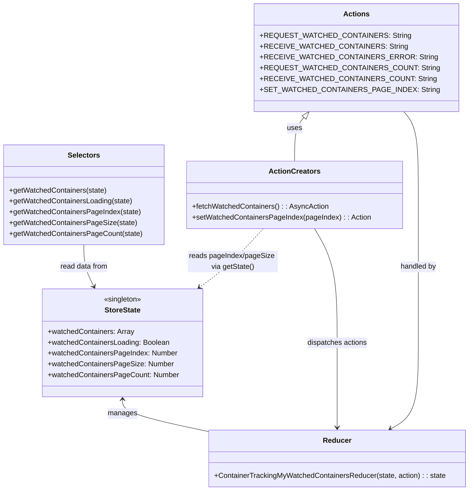

# Diagram: web/portal/src/pages/containertracking/redux/ContainerTrackingMyWatchedContainersState.js


> Auto-generated by Obscura crawlers

## Diagram 1

```mermaid
flowchart TD
  Start([fetchWatchedContainers()])
  Start --> DispatchReq[/"dispatch REQUEST_WATCHED_CONTAINERS"/]
  Start --> DispatchCount[/"dispatch REQUEST_WATCHED_CONTAINERS_COUNT"/]
  Start --> GetState[getState() -> read pageSize/pageNumber]
  GetState --> BuildReq[/"build headers (x-target-feature: CONTAINER_TRACKING) & params"/]
  BuildReq --> Axios[/"axios.get(apiUrl('/containertracking/api/watch'), {headers, params})"/]
  Axios -->|200 OK| DispatchReceiveCount[/"dispatch RECEIVE_WATCHED_CONTAINERS_COUNT (totalPages)"/]
  DispatchReceiveCount --> DispatchReceive[/"dispatch RECEIVE_WATCHED_CONTAINERS (watchedContainers)"/]
  Axios -->|error| DispatchError[/"dispatch RECEIVE_WATCHED_CONTAINERS_ERROR (error)"/]
  DispatchReceive --> End([returns dispatch result])
  DispatchError --> End
```

> SVG rendering failed for this diagram.

## Diagram 2



### SVG

<svg id="container" width="1029.984375" xmlns="http://www.w3.org/2000/svg" class="classDiagram" height="1090" viewBox="0 0 1029.984375 1090" role="graphics-document document" aria-roledescription="class"><style>#container{font-family:"trebuchet ms",verdana,arial,sans-serif;font-size:16px;fill:#333;}@keyframes edge-animation-frame{from{stroke-dashoffset:0;}}@keyframes dash{to{stroke-dashoffset:0;}}#container .edge-animation-slow{stroke-dasharray:9,5!important;stroke-dashoffset:900;animation:dash 50s linear infinite;stroke-linecap:round;}#container .edge-animation-fast{stroke-dasharray:9,5!important;stroke-dashoffset:900;animation:dash 20s linear infinite;stroke-linecap:round;}#container .error-icon{fill:#552222;}#container .error-text{fill:#552222;stroke:#552222;}#container .edge-thickness-normal{stroke-width:1px;}#container .edge-thickness-thick{stroke-width:3.5px;}#container .edge-pattern-solid{stroke-dasharray:0;}#container .edge-thickness-invisible{stroke-width:0;fill:none;}#container .edge-pattern-dashed{stroke-dasharray:3;}#container .edge-pattern-dotted{stroke-dasharray:2;}#container .marker{fill:#333333;stroke:#333333;}#container .marker.cross{stroke:#333333;}#container svg{font-family:"trebuchet ms",verdana,arial,sans-serif;font-size:16px;}#container p{margin:0;}#container g.classGroup text{fill:#9370DB;stroke:none;font-family:"trebuchet ms",verdana,arial,sans-serif;font-size:10px;}#container g.classGroup text .title{font-weight:bolder;}#container .nodeLabel,#container .edgeLabel{color:#131300;}#container .edgeLabel .label rect{fill:#ECECFF;}#container .label text{fill:#131300;}#container .labelBkg{background:#ECECFF;}#container .edgeLabel .label span{background:#ECECFF;}#container .classTitle{font-weight:bolder;}#container .node rect,#container .node circle,#container .node ellipse,#container .node polygon,#container .node path{fill:#ECECFF;stroke:#9370DB;stroke-width:1px;}#container .divider{stroke:#9370DB;stroke-width:1;}#container g.clickable{cursor:pointer;}#container g.classGroup rect{fill:#ECECFF;stroke:#9370DB;}#container g.classGroup line{stroke:#9370DB;stroke-width:1;}#container .classLabel .box{stroke:none;stroke-width:0;fill:#ECECFF;opacity:0.5;}#container .classLabel .label{fill:#9370DB;font-size:10px;}#container .relation{stroke:#333333;stroke-width:1;fill:none;}#container .dashed-line{stroke-dasharray:3;}#container .dotted-line{stroke-dasharray:1 2;}#container #compositionStart,#container .composition{fill:#333333!important;stroke:#333333!important;stroke-width:1;}#container #compositionEnd,#container .composition{fill:#333333!important;stroke:#333333!important;stroke-width:1;}#container #dependencyStart,#container .dependency{fill:#333333!important;stroke:#333333!important;stroke-width:1;}#container #dependencyStart,#container .dependency{fill:#333333!important;stroke:#333333!important;stroke-width:1;}#container #extensionStart,#container .extension{fill:transparent!important;stroke:#333333!important;stroke-width:1;}#container #extensionEnd,#container .extension{fill:transparent!important;stroke:#333333!important;stroke-width:1;}#container #aggregationStart,#container .aggregation{fill:transparent!important;stroke:#333333!important;stroke-width:1;}#container #aggregationEnd,#container .aggregation{fill:transparent!important;stroke:#333333!important;stroke-width:1;}#container #lollipopStart,#container .lollipop{fill:#ECECFF!important;stroke:#333333!important;stroke-width:1;}#container #lollipopEnd,#container .lollipop{fill:#ECECFF!important;stroke:#333333!important;stroke-width:1;}#container .edgeTerminals{font-size:11px;line-height:initial;}#container .classTitleText{text-anchor:middle;font-size:18px;fill:#333;}#container .label-icon{display:inline-block;height:1em;overflow:visible;vertical-align:-0.125em;}#container .node .label-icon path{fill:currentColor;stroke:revert;stroke-width:revert;}#container :root{--mermaid-font-family:"trebuchet ms",verdana,arial,sans-serif;}</style><g><defs><marker id="container_class-aggregationStart" class="marker aggregation class" refX="18" refY="7" markerWidth="190" markerHeight="240" orient="auto"><path d="M 18,7 L9,13 L1,7 L9,1 Z"></path></marker></defs><defs><marker id="container_class-aggregationEnd" class="marker aggregation class" refX="1" refY="7" markerWidth="20" markerHeight="28" orient="auto"><path d="M 18,7 L9,13 L1,7 L9,1 Z"></path></marker></defs><defs><marker id="container_class-extensionStart" class="marker extension class" refX="18" refY="7" markerWidth="190" markerHeight="240" orient="auto"><path d="M 1,7 L18,13 V 1 Z"></path></marker></defs><defs><marker id="container_class-extensionEnd" class="marker extension class" refX="1" refY="7" markerWidth="20" markerHeight="28" orient="auto"><path d="M 1,1 V 13 L18,7 Z"></path></marker></defs><defs><marker id="container_class-compositionStart" class="marker composition class" refX="18" refY="7" markerWidth="190" markerHeight="240" orient="auto"><path d="M 18,7 L9,13 L1,7 L9,1 Z"></path></marker></defs><defs><marker id="container_class-compositionEnd" class="marker composition class" refX="1" refY="7" markerWidth="20" markerHeight="28" orient="auto"><path d="M 18,7 L9,13 L1,7 L9,1 Z"></path></marker></defs><defs><marker id="container_class-dependencyStart" class="marker dependency class" refX="6" refY="7" markerWidth="190" markerHeight="240" orient="auto"><path d="M 5,7 L9,13 L1,7 L9,1 Z"></path></marker></defs><defs><marker id="container_class-dependencyEnd" class="marker dependency class" refX="13" refY="7" markerWidth="20" markerHeight="28" orient="auto"><path d="M 18,7 L9,13 L14,7 L9,1 Z"></path></marker></defs><defs><marker id="container_class-lollipopStart" class="marker lollipop class" refX="13" refY="7" markerWidth="190" markerHeight="240" orient="auto"><circle stroke="black" fill="transparent" cx="7" cy="7" r="6"></circle></marker></defs><defs><marker id="container_class-lollipopEnd" class="marker lollipop class" refX="1" refY="7" markerWidth="190" markerHeight="240" orient="auto"><circle stroke="black" fill="transparent" cx="7" cy="7" r="6"></circle></marker></defs><g class="root"><g class="clusters"></g><g class="edgePaths"><path d="M270.645,888L270.645,893.167C270.645,898.333,270.645,908.667,301.131,920.36C331.617,932.053,392.59,945.105,423.076,951.632L453.563,958.158" id="id_StoreState_Reducer_1" class="edge-thickness-normal edge-pattern-solid relation" style=";;;" data-edge="true" data-et="edge" data-id="id_StoreState_Reducer_1" data-points="W3sieCI6MjcwLjY0NDUzMTI1LCJ5Ijo4ODJ9LHsieCI6MjcwLjY0NDUzMTI1LCJ5Ijo5MTl9LHsieCI6NDUzLjU2MjUsInkiOjk1OC4xNTc5MjExNDM5NTYyfV0=" marker-start="url(#container_class-dependencyStart)"></path><path d="M666.599,261.049L663.147,265.041C659.696,269.033,652.793,277.016,649.342,293.175C645.891,309.333,645.891,333.667,645.891,345.833L645.891,358" id="id_Actions_ActionCreators_2" class="edge-thickness-normal edge-pattern-solid relation" style=";;;" data-edge="true" data-et="edge" data-id="id_Actions_ActionCreators_2" data-points="W3sieCI6Njc3Ljg4MDgyMjA1NDE0MDEsInkiOjI0OH0seyJ4Ijo2NDUuODkwNjI1LCJ5IjoyODV9LHsieCI6NjQ1Ljg5MDYyNSwieSI6MzU4fV0=" marker-start="url(#container_class-extensionStart)"></path><path d="M688.961,508L697.096,522.167C705.232,536.333,721.503,564.667,729.638,607C737.773,649.333,737.773,705.667,737.773,760C737.773,814.333,737.773,866.667,737.773,898C737.773,929.333,737.773,939.667,737.773,944.833L737.773,950" id="id_ActionCreators_Reducer_3" class="edge-thickness-normal edge-pattern-solid relation" style=";;;" data-edge="true" data-et="edge" data-id="id_ActionCreators_Reducer_3" data-points="W3sieCI6Njg4Ljk2MDY5MzM1OTM3NSwieSI6NTA4fSx7IngiOjczNy43NzM0Mzc1LCJ5Ijo1OTN9LHsieCI6NzM3Ljc3MzQzNzUsInkiOjc2Mn0seyJ4Ijo3MzcuNzczNDM3NSwieSI6OTE5fSx7IngiOjczNy43NzM0Mzc1LCJ5Ijo5NTZ9XQ==" marker-end="url(#container_class-dependencyEnd)"></path><path d="M183.703,544L183.703,552.167C183.703,560.333,183.703,576.667,187.447,592.111C191.191,607.555,198.679,622.11,202.422,629.387L206.166,636.665" id="id_Selectors_StoreState_4" class="edge-thickness-normal edge-pattern-solid relation" style=";;;" data-edge="true" data-et="edge" data-id="id_Selectors_StoreState_4" data-points="W3sieCI6MTgzLjcwMzEyNSwieSI6NTQ0fSx7IngiOjE4My43MDMxMjUsInkiOjU5M30seyJ4IjoyMDguOTEwOTg4MzUwNTkxNywieSI6NjQyfV0=" marker-end="url(#container_class-dependencyEnd)"></path><path d="M885.385,248L890.717,254.167C896.048,260.333,906.712,272.667,912.043,303.5C917.375,334.333,917.375,383.667,917.375,435C917.375,486.333,917.375,539.667,917.375,594.5C917.375,649.333,917.375,705.667,917.375,760C917.375,814.333,917.375,866.667,907.173,898.514C896.972,930.36,876.568,941.721,866.366,947.401L856.165,953.081" id="id_Actions_Reducer_5" class="edge-thickness-normal edge-pattern-solid relation" style=";;;" data-edge="true" data-et="edge" data-id="id_Actions_Reducer_5" data-points="W3sieCI6ODg1LjM4NDgwMjk0NTg1OTksInkiOjI0OH0seyJ4Ijo5MTcuMzc1LCJ5IjoyODV9LHsieCI6OTE3LjM3NSwieSI6NDMzfSx7IngiOjkxNy4zNzUsInkiOjU5M30seyJ4Ijo5MTcuMzc1LCJ5Ijo3NjJ9LHsieCI6OTE3LjM3NSwieSI6OTE5fSx7IngiOjg1MC45MjI0MjE4NzUsInkiOjk1Nn1d" marker-end="url(#container_class-dependencyEnd)"></path><path d="M578.319,508L565.556,522.167C552.792,536.333,527.265,564.667,504.142,586.41C481.018,608.153,460.298,623.305,449.938,630.882L439.578,638.458" id="id_ActionCreators_StoreState_6" class="edge-thickness-normal edge-pattern-dashed relation" style=";;;" data-edge="true" data-et="edge" data-id="id_ActionCreators_StoreState_6" data-points="W3sieCI6NTc4LjMxOTIxMzg2NzE4NzUsInkiOjUwOH0seyJ4Ijo1MDEuNzM4MjgxMjUsInkiOjU5M30seyJ4Ijo0MzQuNzM0NzY3OTM2MzkwNTQsInkiOjY0Mn1d" marker-end="url(#container_class-dependencyEnd)"></path></g><g class="edgeLabels"><g class="edgeLabel" transform="translate(270.64453125, 919)"><g class="label" data-id="id_StoreState_Reducer_1" transform="translate(-32.296875, -12)"><foreignObject width="64.59375" height="24"><div xmlns="http://www.w3.org/1999/xhtml" class="labelBkg" style="display: table-cell; white-space: nowrap; line-height: 1.5; max-width: 200px; text-align: center;"><span class="edgeLabel"><p>manages</p></span></div></foreignObject></g></g><g class="edgeLabel" transform="translate(645.890625, 285)"><g class="label" data-id="id_Actions_ActionCreators_2" transform="translate(-16.4921875, -12)"><foreignObject width="32.984375" height="24"><div xmlns="http://www.w3.org/1999/xhtml" class="labelBkg" style="display: table-cell; white-space: nowrap; line-height: 1.5; max-width: 200px; text-align: center;"><span class="edgeLabel"><p>uses</p></span></div></foreignObject></g></g><g class="edgeLabel" transform="translate(737.7734375, 762)"><g class="label" data-id="id_ActionCreators_Reducer_3" transform="translate(-67.71875, -12)"><foreignObject width="135.4375" height="24"><div xmlns="http://www.w3.org/1999/xhtml" class="labelBkg" style="display: table-cell; white-space: nowrap; line-height: 1.5; max-width: 200px; text-align: center;"><span class="edgeLabel"><p>dispatches actions</p></span></div></foreignObject></g></g><g class="edgeLabel" transform="translate(183.703125, 593)"><g class="label" data-id="id_Selectors_StoreState_4" transform="translate(-53.8828125, -12)"><foreignObject width="107.765625" height="24"><div xmlns="http://www.w3.org/1999/xhtml" class="labelBkg" style="display: table-cell; white-space: nowrap; line-height: 1.5; max-width: 200px; text-align: center;"><span class="edgeLabel"><p>read data from</p></span></div></foreignObject></g></g><g class="edgeLabel" transform="translate(917.375, 593)"><g class="label" data-id="id_Actions_Reducer_5" transform="translate(-40.7421875, -12)"><foreignObject width="81.484375" height="24"><div xmlns="http://www.w3.org/1999/xhtml" class="labelBkg" style="display: table-cell; white-space: nowrap; line-height: 1.5; max-width: 200px; text-align: center;"><span class="edgeLabel"><p>handled by</p></span></div></foreignObject></g></g><g class="edgeLabel" transform="translate(512.24753, 581.3354)"><g class="label" data-id="id_ActionCreators_StoreState_6" transform="translate(-100, -24)"><foreignObject width="200" height="48"><div xmlns="http://www.w3.org/1999/xhtml" class="labelBkg" style="display: table; white-space: break-spaces; line-height: 1.5; max-width: 200px; text-align: center; width: 200px;"><span class="edgeLabel"><p>reads pageIndex/pageSize via getState()</p></span></div></foreignObject></g></g></g><g class="nodes"><g class="node default" id="classId-StoreState-0" transform="translate(270.64453125, 762)"><g class="basic label-container"><path d="M-178.0078125 -120 L178.0078125 -120 L178.0078125 120 L-178.0078125 120" stroke="none" stroke-width="0" fill="#ECECFF" style=""></path><path d="M-178.0078125 -120 C-72.48944618557677 -120, 33.028920128846465 -120, 178.0078125 -120 M-178.0078125 -120 C-65.9062482518682 -120, 46.19531599626359 -120, 178.0078125 -120 M178.0078125 -120 C178.0078125 -47.30088138867319, 178.0078125 25.39823722265362, 178.0078125 120 M178.0078125 -120 C178.0078125 -62.62571418561818, 178.0078125 -5.251428371236358, 178.0078125 120 M178.0078125 120 C103.31683832044617 120, 28.625864140892332 120, -178.0078125 120 M178.0078125 120 C76.8834582478974 120, -24.24089600420521 120, -178.0078125 120 M-178.0078125 120 C-178.0078125 42.77009769352911, -178.0078125 -34.45980461294178, -178.0078125 -120 M-178.0078125 120 C-178.0078125 68.62819951811028, -178.0078125 17.256399036220557, -178.0078125 -120" stroke="#9370DB" stroke-width="1.3" fill="none" stroke-dasharray="0 0" style=""></path></g><g class="annotation-group text" transform="translate(-42.765625, -96)"><g class="label" style="" transform="translate(0,-12)"><foreignObject width="85.53125" height="24"><div xmlns="http://www.w3.org/1999/xhtml" style="display: table-cell; white-space: nowrap; line-height: 1.5; max-width: 136px; text-align: center;"><span class="nodeLabel markdown-node-label" style=""><p>«singleton»</p></span></div></foreignObject></g></g><g class="label-group text" transform="translate(-38.890625, -72)"><g class="label" style="font-weight: bolder" transform="translate(0,-12)"><foreignObject width="77.78125" height="24"><div xmlns="http://www.w3.org/1999/xhtml" style="display: table-cell; white-space: nowrap; line-height: 1.5; max-width: 125px; text-align: center;"><span class="nodeLabel markdown-node-label" style=""><p>StoreState</p></span></div></foreignObject></g></g><g class="members-group text" transform="translate(-166.0078125, -24)"><g class="label" style="" transform="translate(0,-12)"><foreignObject width="191.9375" height="24"><div xmlns="http://www.w3.org/1999/xhtml" style="display: table-cell; white-space: nowrap; line-height: 1.5; max-width: 249px; text-align: center;"><span class="nodeLabel markdown-node-label" style=""><p>+watchedContainers: Array</p></span></div></foreignObject></g><g class="label" style="" transform="translate(0,12)"><foreignObject width="271.546875" height="24"><div xmlns="http://www.w3.org/1999/xhtml" style="display: table-cell; white-space: nowrap; line-height: 1.5; max-width: 329px; text-align: center;"><span class="nodeLabel markdown-node-label" style=""><p>+watchedContainersLoading: Boolean</p></span></div></foreignObject></g><g class="label" style="" transform="translate(0,36)"><foreignObject width="286.8125" height="24"><div xmlns="http://www.w3.org/1999/xhtml" style="display: table-cell; white-space: nowrap; line-height: 1.5; max-width: 345px; text-align: center;"><span class="nodeLabel markdown-node-label" style=""><p>+watchedContainersPageIndex: Number</p></span></div></foreignObject></g><g class="label" style="" transform="translate(0,60)"><foreignObject width="275.578125" height="24"><div xmlns="http://www.w3.org/1999/xhtml" style="display: table-cell; white-space: nowrap; line-height: 1.5; max-width: 334px; text-align: center;"><span class="nodeLabel markdown-node-label" style=""><p>+watchedContainersPageSize: Number</p></span></div></foreignObject></g><g class="label" style="" transform="translate(0,84)"><foreignObject width="289.25" height="24"><div xmlns="http://www.w3.org/1999/xhtml" style="display: table-cell; white-space: nowrap; line-height: 1.5; max-width: 347px; text-align: center;"><span class="nodeLabel markdown-node-label" style=""><p>+watchedContainersPageCount: Number</p></span></div></foreignObject></g></g><g class="methods-group text" transform="translate(-166.0078125, 120)"></g><g class="divider" style=""><path d="M-178.0078125 -48 C-47.228624670730966 -48, 83.55056315853807 -48, 178.0078125 -48 M-178.0078125 -48 C-65.86275589898693 -48, 46.282300702026134 -48, 178.0078125 -48" stroke="#9370DB" stroke-width="1.3" fill="none" stroke-dasharray="0 0" style=""></path></g><g class="divider" style=""><path d="M-178.0078125 96 C-47.97797383891185 96, 82.0518648221763 96, 178.0078125 96 M-178.0078125 96 C-106.57136469747947 96, -35.134916894958934 96, 178.0078125 96" stroke="#9370DB" stroke-width="1.3" fill="none" stroke-dasharray="0 0" style=""></path></g></g><g class="node default" id="classId-Actions-1" transform="translate(781.6328125, 128)"><g class="basic label-container"><path d="M-201.08984375 -120 L201.08984375 -120 L201.08984375 120 L-201.08984375 120" stroke="none" stroke-width="0" fill="#ECECFF" style=""></path><path d="M-201.08984375 -120 C-103.36798128594008 -120, -5.646118821880151 -120, 201.08984375 -120 M-201.08984375 -120 C-54.329403519069444 -120, 92.43103671186111 -120, 201.08984375 -120 M201.08984375 -120 C201.08984375 -54.22767426564758, 201.08984375 11.544651468704842, 201.08984375 120 M201.08984375 -120 C201.08984375 -28.681616676065516, 201.08984375 62.63676664786897, 201.08984375 120 M201.08984375 120 C88.4745947851232 120, -24.140654179753597 120, -201.08984375 120 M201.08984375 120 C62.32366338796476 120, -76.44251697407049 120, -201.08984375 120 M-201.08984375 120 C-201.08984375 63.30439732012899, -201.08984375 6.608794640257983, -201.08984375 -120 M-201.08984375 120 C-201.08984375 65.18247866941783, -201.08984375 10.364957338835666, -201.08984375 -120" stroke="#9370DB" stroke-width="1.3" fill="none" stroke-dasharray="0 0" style=""></path></g><g class="annotation-group text" transform="translate(0, -96)"></g><g class="label-group text" transform="translate(-27.0546875, -96)"><g class="label" style="font-weight: bolder" transform="translate(0,-12)"><foreignObject width="54.109375" height="24"><div xmlns="http://www.w3.org/1999/xhtml" style="display: table-cell; white-space: nowrap; line-height: 1.5; max-width: 103px; text-align: center;"><span class="nodeLabel markdown-node-label" style=""><p>Actions</p></span></div></foreignObject></g></g><g class="members-group text" transform="translate(-189.08984375, -48)"><g class="label" style="" transform="translate(0,-12)"><foreignObject width="295.0625" height="24"><div xmlns="http://www.w3.org/1999/xhtml" style="display: table-cell; white-space: nowrap; line-height: 1.5; max-width: 353px; text-align: center;"><span class="nodeLabel markdown-node-label" style=""><p>+REQUEST_WATCHED_CONTAINERS: String</p></span></div></foreignObject></g><g class="label" style="" transform="translate(0,12)"><foreignObject width="288.875" height="24"><div xmlns="http://www.w3.org/1999/xhtml" style="display: table-cell; white-space: nowrap; line-height: 1.5; max-width: 347px; text-align: center;"><span class="nodeLabel markdown-node-label" style=""><p>+RECEIVE_WATCHED_CONTAINERS: String</p></span></div></foreignObject></g><g class="label" style="" transform="translate(0,36)"><foreignObject width="345.234375" height="24"><div xmlns="http://www.w3.org/1999/xhtml" style="display: table-cell; white-space: nowrap; line-height: 1.5; max-width: 403px; text-align: center;"><span class="nodeLabel markdown-node-label" style=""><p>+RECEIVE_WATCHED_CONTAINERS_ERROR: String</p></span></div></foreignObject></g><g class="label" style="" transform="translate(0,60)"><foreignObject width="351.125" height="24"><div xmlns="http://www.w3.org/1999/xhtml" style="display: table-cell; white-space: nowrap; line-height: 1.5; max-width: 409px; text-align: center;"><span class="nodeLabel markdown-node-label" style=""><p>+REQUEST_WATCHED_CONTAINERS_COUNT: String</p></span></div></foreignObject></g><g class="label" style="" transform="translate(0,84)"><foreignObject width="344.9375" height="24"><div xmlns="http://www.w3.org/1999/xhtml" style="display: table-cell; white-space: nowrap; line-height: 1.5; max-width: 403px; text-align: center;"><span class="nodeLabel markdown-node-label" style=""><p>+RECEIVE_WATCHED_CONTAINERS_COUNT: String</p></span></div></foreignObject></g><g class="label" style="" transform="translate(0,108)"><foreignObject width="350.546875" height="24"><div xmlns="http://www.w3.org/1999/xhtml" style="display: table-cell; white-space: nowrap; line-height: 1.5; max-width: 409px; text-align: center;"><span class="nodeLabel markdown-node-label" style=""><p>+SET_WATCHED_CONTAINERS_PAGE_INDEX: String</p></span></div></foreignObject></g></g><g class="methods-group text" transform="translate(-189.08984375, 120)"></g><g class="divider" style=""><path d="M-201.08984375 -72 C-98.3520978933079 -72, 4.385647963384201 -72, 201.08984375 -72 M-201.08984375 -72 C-78.3517437350125 -72, 44.38635627997499 -72, 201.08984375 -72" stroke="#9370DB" stroke-width="1.3" fill="none" stroke-dasharray="0 0" style=""></path></g><g class="divider" style=""><path d="M-201.08984375 96 C-92.7983422994389 96, 15.4931591511222 96, 201.08984375 96 M-201.08984375 96 C-111.52019413697049 96, -21.950544523940977 96, 201.08984375 96" stroke="#9370DB" stroke-width="1.3" fill="none" stroke-dasharray="0 0" style=""></path></g></g><g class="node default" id="classId-ActionCreators-2" transform="translate(645.890625, 433)"><g class="basic label-container"><path d="M-236.484375 -75 L236.484375 -75 L236.484375 75 L-236.484375 75" stroke="none" stroke-width="0" fill="#ECECFF" style=""></path><path d="M-236.484375 -75 C-139.90119876503803 -75, -43.31802253007609 -75, 236.484375 -75 M-236.484375 -75 C-89.31141646005153 -75, 57.861542079896935 -75, 236.484375 -75 M236.484375 -75 C236.484375 -29.82594251735778, 236.484375 15.348114965284438, 236.484375 75 M236.484375 -75 C236.484375 -17.875386907846504, 236.484375 39.24922618430699, 236.484375 75 M236.484375 75 C125.07576544945768 75, 13.667155898915354 75, -236.484375 75 M236.484375 75 C79.60239602687821 75, -77.27958294624358 75, -236.484375 75 M-236.484375 75 C-236.484375 35.78523391282777, -236.484375 -3.429532174344459, -236.484375 -75 M-236.484375 75 C-236.484375 42.43508538213919, -236.484375 9.870170764278384, -236.484375 -75" stroke="#9370DB" stroke-width="1.3" fill="none" stroke-dasharray="0 0" style=""></path></g><g class="annotation-group text" transform="translate(0, -51)"></g><g class="label-group text" transform="translate(-53.96875, -51)"><g class="label" style="font-weight: bolder" transform="translate(0,-12)"><foreignObject width="107.9375" height="24"><div xmlns="http://www.w3.org/1999/xhtml" style="display: table-cell; white-space: nowrap; line-height: 1.5; max-width: 156px; text-align: center;"><span class="nodeLabel markdown-node-label" style=""><p>ActionCreators</p></span></div></foreignObject></g></g><g class="members-group text" transform="translate(-224.484375, -3)"></g><g class="methods-group text" transform="translate(-224.484375, 27)"><g class="label" style="" transform="translate(0,-12)"><foreignObject width="302.125" height="24"><div xmlns="http://www.w3.org/1999/xhtml" style="display: table-cell; white-space: nowrap; line-height: 1.5; max-width: 359px; text-align: center;"><span class="nodeLabel markdown-node-label" style=""><p>+fetchWatchedContainers() : : AsyncAction</p></span></div></foreignObject></g><g class="label" style="" transform="translate(0,12)"><foreignObject width="395" height="24"><div xmlns="http://www.w3.org/1999/xhtml" style="display: table-cell; white-space: nowrap; line-height: 1.5; max-width: 452px; text-align: center;"><span class="nodeLabel markdown-node-label" style=""><p>+setWatchedContainersPageIndex(pageIndex) : : Action</p></span></div></foreignObject></g></g><g class="divider" style=""><path d="M-236.484375 -27 C-52.21990601297591 -27, 132.04456297404818 -27, 236.484375 -27 M-236.484375 -27 C-110.20749378436334 -27, 16.069387431273327 -27, 236.484375 -27" stroke="#9370DB" stroke-width="1.3" fill="none" stroke-dasharray="0 0" style=""></path></g><g class="divider" style=""><path d="M-236.484375 -3 C-49.817783450913765 -3, 136.84880809817247 -3, 236.484375 -3 M-236.484375 -3 C-138.87603224160858 -3, -41.26768948321714 -3, 236.484375 -3" stroke="#9370DB" stroke-width="1.3" fill="none" stroke-dasharray="0 0" style=""></path></g></g><g class="node default" id="classId-Selectors-3" transform="translate(183.703125, 433)"><g class="basic label-container"><path d="M-175.703125 -111 L175.703125 -111 L175.703125 111 L-175.703125 111" stroke="none" stroke-width="0" fill="#ECECFF" style=""></path><path d="M-175.703125 -111 C-77.60486220884421 -111, 20.49340058231158 -111, 175.703125 -111 M-175.703125 -111 C-64.56949733079051 -111, 46.56413033841898 -111, 175.703125 -111 M175.703125 -111 C175.703125 -63.91148359789635, 175.703125 -16.8229671957927, 175.703125 111 M175.703125 -111 C175.703125 -55.60772128821566, 175.703125 -0.2154425764313146, 175.703125 111 M175.703125 111 C92.8562731470553 111, 10.00942129411061 111, -175.703125 111 M175.703125 111 C63.49906679399329 111, -48.70499141201341 111, -175.703125 111 M-175.703125 111 C-175.703125 42.99865794914423, -175.703125 -25.002684101711537, -175.703125 -111 M-175.703125 111 C-175.703125 44.47989013065022, -175.703125 -22.040219738699562, -175.703125 -111" stroke="#9370DB" stroke-width="1.3" fill="none" stroke-dasharray="0 0" style=""></path></g><g class="annotation-group text" transform="translate(0, -87)"></g><g class="label-group text" transform="translate(-34.171875, -87)"><g class="label" style="font-weight: bolder" transform="translate(0,-12)"><foreignObject width="68.34375" height="24"><div xmlns="http://www.w3.org/1999/xhtml" style="display: table-cell; white-space: nowrap; line-height: 1.5; max-width: 117px; text-align: center;"><span class="nodeLabel markdown-node-label" style=""><p>Selectors</p></span></div></foreignObject></g></g><g class="members-group text" transform="translate(-163.703125, -39)"></g><g class="methods-group text" transform="translate(-163.703125, -9)"><g class="label" style="" transform="translate(0,-12)"><foreignObject width="217.046875" height="24"><div xmlns="http://www.w3.org/1999/xhtml" style="display: table-cell; white-space: nowrap; line-height: 1.5; max-width: 274px; text-align: center;"><span class="nodeLabel markdown-node-label" style=""><p>+getWatchedContainers(state)</p></span></div></foreignObject></g><g class="label" style="" transform="translate(0,12)"><foreignObject width="274.28125" height="24"><div xmlns="http://www.w3.org/1999/xhtml" style="display: table-cell; white-space: nowrap; line-height: 1.5; max-width: 332px; text-align: center;"><span class="nodeLabel markdown-node-label" style=""><p>+getWatchedContainersLoading(state)</p></span></div></foreignObject></g><g class="label" style="" transform="translate(0,36)"><foreignObject width="290.796875" height="24"><div xmlns="http://www.w3.org/1999/xhtml" style="display: table-cell; white-space: nowrap; line-height: 1.5; max-width: 348px; text-align: center;"><span class="nodeLabel markdown-node-label" style=""><p>+getWatchedContainersPageIndex(state)</p></span></div></foreignObject></g><g class="label" style="" transform="translate(0,60)"><foreignObject width="279.625" height="24"><div xmlns="http://www.w3.org/1999/xhtml" style="display: table-cell; white-space: nowrap; line-height: 1.5; max-width: 337px; text-align: center;"><span class="nodeLabel markdown-node-label" style=""><p>+getWatchedContainersPageSize(state)</p></span></div></foreignObject></g><g class="label" style="" transform="translate(0,84)"><foreignObject width="293.234375" height="24"><div xmlns="http://www.w3.org/1999/xhtml" style="display: table-cell; white-space: nowrap; line-height: 1.5; max-width: 351px; text-align: center;"><span class="nodeLabel markdown-node-label" style=""><p>+getWatchedContainersPageCount(state)</p></span></div></foreignObject></g></g><g class="divider" style=""><path d="M-175.703125 -63 C-85.6209673643963 -63, 4.461190271207414 -63, 175.703125 -63 M-175.703125 -63 C-64.16635975122773 -63, 47.37040549754454 -63, 175.703125 -63" stroke="#9370DB" stroke-width="1.3" fill="none" stroke-dasharray="0 0" style=""></path></g><g class="divider" style=""><path d="M-175.703125 -39 C-81.4824200752963 -39, 12.738284849407393 -39, 175.703125 -39 M-175.703125 -39 C-46.65267147448685 -39, 82.3977820510263 -39, 175.703125 -39" stroke="#9370DB" stroke-width="1.3" fill="none" stroke-dasharray="0 0" style=""></path></g></g><g class="node default" id="classId-Reducer-4" transform="translate(737.7734375, 1019)"><g class="basic label-container"><path d="M-284.2109375 -63 L284.2109375 -63 L284.2109375 63 L-284.2109375 63" stroke="none" stroke-width="0" fill="#ECECFF" style=""></path><path d="M-284.2109375 -63 C-143.30520134901394 -63, -2.399465198027883 -63, 284.2109375 -63 M-284.2109375 -63 C-114.93905146291587 -63, 54.33283457416826 -63, 284.2109375 -63 M284.2109375 -63 C284.2109375 -33.798937067097995, 284.2109375 -4.597874134195997, 284.2109375 63 M284.2109375 -63 C284.2109375 -16.330801891936687, 284.2109375 30.338396216126625, 284.2109375 63 M284.2109375 63 C126.02968654680149 63, -32.15156440639703 63, -284.2109375 63 M284.2109375 63 C141.33353499390526 63, -1.543867512189479 63, -284.2109375 63 M-284.2109375 63 C-284.2109375 25.086049533522527, -284.2109375 -12.827900932954947, -284.2109375 -63 M-284.2109375 63 C-284.2109375 17.82379132295594, -284.2109375 -27.352417354088118, -284.2109375 -63" stroke="#9370DB" stroke-width="1.3" fill="none" stroke-dasharray="0 0" style=""></path></g><g class="annotation-group text" transform="translate(0, -39)"></g><g class="label-group text" transform="translate(-29.90625, -39)"><g class="label" style="font-weight: bolder" transform="translate(0,-12)"><foreignObject width="59.8125" height="24"><div xmlns="http://www.w3.org/1999/xhtml" style="display: table-cell; white-space: nowrap; line-height: 1.5; max-width: 110px; text-align: center;"><span class="nodeLabel markdown-node-label" style=""><p>Reducer</p></span></div></foreignObject></g></g><g class="members-group text" transform="translate(-272.2109375, 9)"></g><g class="methods-group text" transform="translate(-272.2109375, 39)"><g class="label" style="" transform="translate(0,-12)"><foreignObject width="514.515625" height="24"><div xmlns="http://www.w3.org/1999/xhtml" style="display: table-cell; white-space: nowrap; line-height: 1.5; max-width: 572px; text-align: center;"><span class="nodeLabel markdown-node-label" style=""><p>+ContainerTrackingMyWatchedContainersReducer(state, action) : : state</p></span></div></foreignObject></g></g><g class="divider" style=""><path d="M-284.2109375 -15 C-65.99696704700554 -15, 152.21700340598892 -15, 284.2109375 -15 M-284.2109375 -15 C-156.6372856609361 -15, -29.0636338218722 -15, 284.2109375 -15" stroke="#9370DB" stroke-width="1.3" fill="none" stroke-dasharray="0 0" style=""></path></g><g class="divider" style=""><path d="M-284.2109375 9 C-102.04921395369357 9, 80.11250959261287 9, 284.2109375 9 M-284.2109375 9 C-155.9533149148354 9, -27.695692329670806 9, 284.2109375 9" stroke="#9370DB" stroke-width="1.3" fill="none" stroke-dasharray="0 0" style=""></path></g></g></g></g></g></svg>
