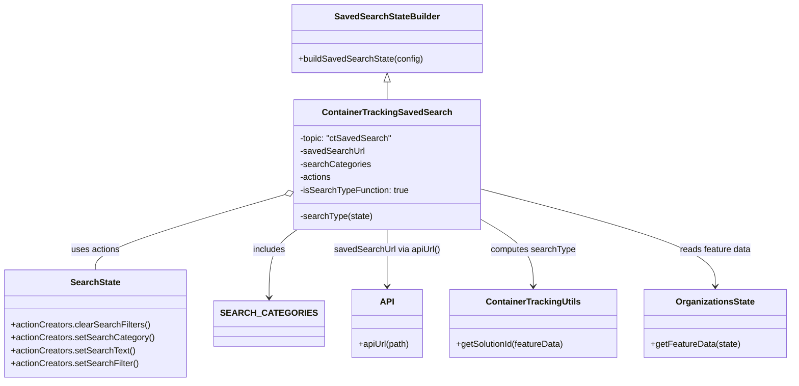

# Diagram: web/portal/src/pages/containertracking/redux/ContainerTrackingSavedSearchState.js


> Auto-generated by Obscura crawlers

## Diagram 1



### SVG

<svg id="container" width="1419.8125" xmlns="http://www.w3.org/2000/svg" class="classDiagram" height="704" viewBox="0 0 1419.8125 704" role="graphics-document document" aria-roledescription="class"><style>#container{font-family:"trebuchet ms",verdana,arial,sans-serif;font-size:16px;fill:#333;}@keyframes edge-animation-frame{from{stroke-dashoffset:0;}}@keyframes dash{to{stroke-dashoffset:0;}}#container .edge-animation-slow{stroke-dasharray:9,5!important;stroke-dashoffset:900;animation:dash 50s linear infinite;stroke-linecap:round;}#container .edge-animation-fast{stroke-dasharray:9,5!important;stroke-dashoffset:900;animation:dash 20s linear infinite;stroke-linecap:round;}#container .error-icon{fill:#552222;}#container .error-text{fill:#552222;stroke:#552222;}#container .edge-thickness-normal{stroke-width:1px;}#container .edge-thickness-thick{stroke-width:3.5px;}#container .edge-pattern-solid{stroke-dasharray:0;}#container .edge-thickness-invisible{stroke-width:0;fill:none;}#container .edge-pattern-dashed{stroke-dasharray:3;}#container .edge-pattern-dotted{stroke-dasharray:2;}#container .marker{fill:#333333;stroke:#333333;}#container .marker.cross{stroke:#333333;}#container svg{font-family:"trebuchet ms",verdana,arial,sans-serif;font-size:16px;}#container p{margin:0;}#container g.classGroup text{fill:#9370DB;stroke:none;font-family:"trebuchet ms",verdana,arial,sans-serif;font-size:10px;}#container g.classGroup text .title{font-weight:bolder;}#container .nodeLabel,#container .edgeLabel{color:#131300;}#container .edgeLabel .label rect{fill:#ECECFF;}#container .label text{fill:#131300;}#container .labelBkg{background:#ECECFF;}#container .edgeLabel .label span{background:#ECECFF;}#container .classTitle{font-weight:bolder;}#container .node rect,#container .node circle,#container .node ellipse,#container .node polygon,#container .node path{fill:#ECECFF;stroke:#9370DB;stroke-width:1px;}#container .divider{stroke:#9370DB;stroke-width:1;}#container g.clickable{cursor:pointer;}#container g.classGroup rect{fill:#ECECFF;stroke:#9370DB;}#container g.classGroup line{stroke:#9370DB;stroke-width:1;}#container .classLabel .box{stroke:none;stroke-width:0;fill:#ECECFF;opacity:0.5;}#container .classLabel .label{fill:#9370DB;font-size:10px;}#container .relation{stroke:#333333;stroke-width:1;fill:none;}#container .dashed-line{stroke-dasharray:3;}#container .dotted-line{stroke-dasharray:1 2;}#container #compositionStart,#container .composition{fill:#333333!important;stroke:#333333!important;stroke-width:1;}#container #compositionEnd,#container .composition{fill:#333333!important;stroke:#333333!important;stroke-width:1;}#container #dependencyStart,#container .dependency{fill:#333333!important;stroke:#333333!important;stroke-width:1;}#container #dependencyStart,#container .dependency{fill:#333333!important;stroke:#333333!important;stroke-width:1;}#container #extensionStart,#container .extension{fill:transparent!important;stroke:#333333!important;stroke-width:1;}#container #extensionEnd,#container .extension{fill:transparent!important;stroke:#333333!important;stroke-width:1;}#container #aggregationStart,#container .aggregation{fill:transparent!important;stroke:#333333!important;stroke-width:1;}#container #aggregationEnd,#container .aggregation{fill:transparent!important;stroke:#333333!important;stroke-width:1;}#container #lollipopStart,#container .lollipop{fill:#ECECFF!important;stroke:#333333!important;stroke-width:1;}#container #lollipopEnd,#container .lollipop{fill:#ECECFF!important;stroke:#333333!important;stroke-width:1;}#container .edgeTerminals{font-size:11px;line-height:initial;}#container .classTitleText{text-anchor:middle;font-size:18px;fill:#333;}#container .label-icon{display:inline-block;height:1em;overflow:visible;vertical-align:-0.125em;}#container .node .label-icon path{fill:currentColor;stroke:revert;stroke-width:revert;}#container :root{--mermaid-font-family:"trebuchet ms",verdana,arial,sans-serif;}</style><g><defs><marker id="container_class-aggregationStart" class="marker aggregation class" refX="18" refY="7" markerWidth="190" markerHeight="240" orient="auto"><path d="M 18,7 L9,13 L1,7 L9,1 Z"></path></marker></defs><defs><marker id="container_class-aggregationEnd" class="marker aggregation class" refX="1" refY="7" markerWidth="20" markerHeight="28" orient="auto"><path d="M 18,7 L9,13 L1,7 L9,1 Z"></path></marker></defs><defs><marker id="container_class-extensionStart" class="marker extension class" refX="18" refY="7" markerWidth="190" markerHeight="240" orient="auto"><path d="M 1,7 L18,13 V 1 Z"></path></marker></defs><defs><marker id="container_class-extensionEnd" class="marker extension class" refX="1" refY="7" markerWidth="20" markerHeight="28" orient="auto"><path d="M 1,1 V 13 L18,7 Z"></path></marker></defs><defs><marker id="container_class-compositionStart" class="marker composition class" refX="18" refY="7" markerWidth="190" markerHeight="240" orient="auto"><path d="M 18,7 L9,13 L1,7 L9,1 Z"></path></marker></defs><defs><marker id="container_class-compositionEnd" class="marker composition class" refX="1" refY="7" markerWidth="20" markerHeight="28" orient="auto"><path d="M 18,7 L9,13 L1,7 L9,1 Z"></path></marker></defs><defs><marker id="container_class-dependencyStart" class="marker dependency class" refX="6" refY="7" markerWidth="190" markerHeight="240" orient="auto"><path d="M 5,7 L9,13 L1,7 L9,1 Z"></path></marker></defs><defs><marker id="container_class-dependencyEnd" class="marker dependency class" refX="13" refY="7" markerWidth="20" markerHeight="28" orient="auto"><path d="M 18,7 L9,13 L14,7 L9,1 Z"></path></marker></defs><defs><marker id="container_class-lollipopStart" class="marker lollipop class" refX="13" refY="7" markerWidth="190" markerHeight="240" orient="auto"><circle stroke="black" fill="transparent" cx="7" cy="7" r="6"></circle></marker></defs><defs><marker id="container_class-lollipopEnd" class="marker lollipop class" refX="1" refY="7" markerWidth="190" markerHeight="240" orient="auto"><circle stroke="black" fill="transparent" cx="7" cy="7" r="6"></circle></marker></defs><g class="root"><g class="clusters"></g><g class="edgePaths"><path d="M679.184,151.25L679.184,152.542C679.184,153.833,679.184,156.417,679.184,161.875C679.184,167.333,679.184,175.667,679.184,179.833L679.184,184" id="id_SavedSearchStateBuilder_ContainerTrackingSavedSearch_1" class="edge-thickness-normal edge-pattern-solid relation" style=";;;" data-edge="true" data-et="edge" data-id="id_SavedSearchStateBuilder_ContainerTrackingSavedSearch_1" data-points="W3sieCI6Njc5LjE4MzU5Mzc1LCJ5IjoxMzR9LHsieCI6Njc5LjE4MzU5Mzc1LCJ5IjoxNTl9LHsieCI6Njc5LjE4MzU5Mzc1LCJ5IjoxODR9XQ==" marker-start="url(#container_class-extensionStart)"></path><path d="M493.265,361.623L439.827,378.186C386.388,394.749,279.51,427.874,226.072,450.604C172.633,473.333,172.633,485.667,172.633,491.833L172.633,498" id="id_ContainerTrackingSavedSearch_SearchState_2" class="edge-thickness-normal edge-pattern-solid relation" style=";;;" data-edge="true" data-et="edge" data-id="id_ContainerTrackingSavedSearch_SearchState_2" data-points="W3sieCI6NTA5Ljc0MjE4NzUsInkiOjM1Ni41MTY1NTI2NjU0Njg4fSx7IngiOjE3Mi42MzI4MTI1LCJ5Ijo0NjF9LHsieCI6MTcyLjYzMjgxMjUsInkiOjQ5OH1d" marker-start="url(#container_class-aggregationStart)"></path><path d="M523.412,424L515.407,430.167C507.402,436.333,491.393,448.667,483.388,469.5C475.383,490.333,475.383,519.667,475.383,534.333L475.383,549" id="id_ContainerTrackingSavedSearch_SEARCH_CATEGORIES_3" class="edge-thickness-normal edge-pattern-solid relation" style=";;;" data-edge="true" data-et="edge" data-id="id_ContainerTrackingSavedSearch_SEARCH_CATEGORIES_3" data-points="W3sieCI6NTIzLjQxMjI5NTk3OTI5OTQsInkiOjQyNH0seyJ4Ijo0NzUuMzgyODEyNSwieSI6NDYxfSx7IngiOjQ3NS4zODI4MTI1LCJ5Ijo1NTV9XQ==" marker-end="url(#container_class-dependencyEnd)"></path><path d="M679.184,424L679.184,430.167C679.184,436.333,679.184,448.667,679.184,466C679.184,483.333,679.184,505.667,679.184,516.833L679.184,528" id="id_ContainerTrackingSavedSearch_API_4" class="edge-thickness-normal edge-pattern-solid relation" style=";;;" data-edge="true" data-et="edge" data-id="id_ContainerTrackingSavedSearch_API_4" data-points="W3sieCI6Njc5LjE4MzU5Mzc1LCJ5Ijo0MjR9LHsieCI6Njc5LjE4MzU5Mzc1LCJ5Ijo0NjF9LHsieCI6Njc5LjE4MzU5Mzc1LCJ5Ijo1MzR9XQ==" marker-end="url(#container_class-dependencyEnd)"></path><path d="M848.625,402.5L865.397,412.25C882.169,422,915.714,441.5,932.486,462.417C949.258,483.333,949.258,505.667,949.258,516.833L949.258,528" id="id_ContainerTrackingSavedSearch_ContainerTrackingUtils_5" class="edge-thickness-normal edge-pattern-solid relation" style=";;;" data-edge="true" data-et="edge" data-id="id_ContainerTrackingSavedSearch_ContainerTrackingUtils_5" data-points="W3sieCI6ODQ4LjYyNSwieSI6NDAyLjQ5OTk2Mzg0MDk1ODA2fSx7IngiOjk0OS4yNTc4MTI1LCJ5Ijo0NjF9LHsieCI6OTQ5LjI1NzgxMjUsInkiOjUzNH1d" marker-end="url(#container_class-dependencyEnd)"></path><path d="M848.625,348.077L920.976,366.897C993.327,385.718,1138.029,423.359,1210.38,453.346C1282.73,483.333,1282.73,505.667,1282.73,516.833L1282.73,528" id="id_ContainerTrackingSavedSearch_OrganizationsState_6" class="edge-thickness-normal edge-pattern-solid relation" style=";;;" data-edge="true" data-et="edge" data-id="id_ContainerTrackingSavedSearch_OrganizationsState_6" data-points="W3sieCI6ODQ4LjYyNSwieSI6MzQ4LjA3NjYxMDkxOTgyMjk0fSx7IngiOjEyODIuNzMwNDY4NzUsInkiOjQ2MX0seyJ4IjoxMjgyLjczMDQ2ODc1LCJ5Ijo1MzR9XQ==" marker-end="url(#container_class-dependencyEnd)"></path></g><g class="edgeLabels"><g class="edgeLabel"><g class="label" data-id="id_SavedSearchStateBuilder_ContainerTrackingSavedSearch_1" transform="translate(0, 0)"><foreignObject width="0" height="0"><div xmlns="http://www.w3.org/1999/xhtml" class="labelBkg" style="display: table-cell; white-space: nowrap; line-height: 1.5; max-width: 200px; text-align: center;"><span class="edgeLabel"></span></div></foreignObject></g></g><g class="edgeLabel" transform="translate(172.6328125, 461)"><g class="label" data-id="id_ContainerTrackingSavedSearch_SearchState_2" transform="translate(-45.03125, -12)"><foreignObject width="90.0625" height="24"><div xmlns="http://www.w3.org/1999/xhtml" class="labelBkg" style="display: table-cell; white-space: nowrap; line-height: 1.5; max-width: 200px; text-align: center;"><span class="edgeLabel"><p>uses actions</p></span></div></foreignObject></g></g><g class="edgeLabel" transform="translate(475.3828125, 461)"><g class="label" data-id="id_ContainerTrackingSavedSearch_SEARCH_CATEGORIES_3" transform="translate(-30.6484375, -12)"><foreignObject width="61.296875" height="24"><div xmlns="http://www.w3.org/1999/xhtml" class="labelBkg" style="display: table-cell; white-space: nowrap; line-height: 1.5; max-width: 200px; text-align: center;"><span class="edgeLabel"><p>includes</p></span></div></foreignObject></g></g><g class="edgeLabel" transform="translate(679.18359375, 461)"><g class="label" data-id="id_ContainerTrackingSavedSearch_API_4" transform="translate(-98.078125, -12)"><foreignObject width="196.15625" height="24"><div xmlns="http://www.w3.org/1999/xhtml" class="labelBkg" style="display: table-cell; white-space: nowrap; line-height: 1.5; max-width: 200px; text-align: center;"><span class="edgeLabel"><p>savedSearchUrl via apiUrl()</p></span></div></foreignObject></g></g><g class="edgeLabel" transform="translate(949.2578125, 461)"><g class="label" data-id="id_ContainerTrackingSavedSearch_ContainerTrackingUtils_5" transform="translate(-78.1796875, -12)"><foreignObject width="156.359375" height="24"><div xmlns="http://www.w3.org/1999/xhtml" class="labelBkg" style="display: table-cell; white-space: nowrap; line-height: 1.5; max-width: 200px; text-align: center;"><span class="edgeLabel"><p>computes searchType</p></span></div></foreignObject></g></g><g class="edgeLabel" transform="translate(1282.73046875, 461)"><g class="label" data-id="id_ContainerTrackingSavedSearch_OrganizationsState_6" transform="translate(-66.546875, -12)"><foreignObject width="133.09375" height="24"><div xmlns="http://www.w3.org/1999/xhtml" class="labelBkg" style="display: table-cell; white-space: nowrap; line-height: 1.5; max-width: 200px; text-align: center;"><span class="edgeLabel"><p>reads feature data</p></span></div></foreignObject></g></g></g><g class="nodes"><g class="node default" id="classId-SavedSearchStateBuilder-0" transform="translate(679.18359375, 71)"><g class="basic label-container"><path d="M-172.70703125 -63 L172.70703125 -63 L172.70703125 63 L-172.70703125 63" stroke="none" stroke-width="0" fill="#ECECFF" style=""></path><path d="M-172.70703125 -63 C-58.887491980981 -63, 54.93204728803801 -63, 172.70703125 -63 M-172.70703125 -63 C-74.0538565807332 -63, 24.599318088533607 -63, 172.70703125 -63 M172.70703125 -63 C172.70703125 -17.648931090408155, 172.70703125 27.70213781918369, 172.70703125 63 M172.70703125 -63 C172.70703125 -33.31233502605526, 172.70703125 -3.624670052110517, 172.70703125 63 M172.70703125 63 C66.50454299182195 63, -39.6979452663561 63, -172.70703125 63 M172.70703125 63 C41.89768274551028 63, -88.91166575897944 63, -172.70703125 63 M-172.70703125 63 C-172.70703125 16.217978736487993, -172.70703125 -30.564042527024014, -172.70703125 -63 M-172.70703125 63 C-172.70703125 29.131246191637743, -172.70703125 -4.737507616724514, -172.70703125 -63" stroke="#9370DB" stroke-width="1.3" fill="none" stroke-dasharray="0 0" style=""></path></g><g class="annotation-group text" transform="translate(0, -39)"></g><g class="label-group text" transform="translate(-92.6484375, -39)"><g class="label" style="font-weight: bolder" transform="translate(0,-12)"><foreignObject width="185.296875" height="24"><div xmlns="http://www.w3.org/1999/xhtml" style="display: table-cell; white-space: nowrap; line-height: 1.5; max-width: 233px; text-align: center;"><span class="nodeLabel markdown-node-label" style=""><p>SavedSearchStateBuilder</p></span></div></foreignObject></g></g><g class="members-group text" transform="translate(-160.70703125, 9)"></g><g class="methods-group text" transform="translate(-160.70703125, 39)"><g class="label" style="" transform="translate(0,-12)"><foreignObject width="228.765625" height="24"><div xmlns="http://www.w3.org/1999/xhtml" style="display: table-cell; white-space: nowrap; line-height: 1.5; max-width: 286px; text-align: center;"><span class="nodeLabel markdown-node-label" style=""><p>+buildSavedSearchState(config)</p></span></div></foreignObject></g></g><g class="divider" style=""><path d="M-172.70703125 -15 C-72.136600427065 -15, 28.43383039586999 -15, 172.70703125 -15 M-172.70703125 -15 C-45.59131101890118 -15, 81.52440921219764 -15, 172.70703125 -15" stroke="#9370DB" stroke-width="1.3" fill="none" stroke-dasharray="0 0" style=""></path></g><g class="divider" style=""><path d="M-172.70703125 9 C-54.686602822328595 9, 63.33382560534281 9, 172.70703125 9 M-172.70703125 9 C-102.24248179317111 9, -31.777932336342218 9, 172.70703125 9" stroke="#9370DB" stroke-width="1.3" fill="none" stroke-dasharray="0 0" style=""></path></g></g><g class="node default" id="classId-ContainerTrackingSavedSearch-1" transform="translate(679.18359375, 304)"><g class="basic label-container"><path d="M-169.44140625 -120 L169.44140625 -120 L169.44140625 120 L-169.44140625 120" stroke="none" stroke-width="0" fill="#ECECFF" style=""></path><path d="M-169.44140625 -120 C-91.7004077695399 -120, -13.959409289079787 -120, 169.44140625 -120 M-169.44140625 -120 C-83.82843375761692 -120, 1.7845387347661585 -120, 169.44140625 -120 M169.44140625 -120 C169.44140625 -57.16182915851896, 169.44140625 5.676341682962075, 169.44140625 120 M169.44140625 -120 C169.44140625 -34.91520041759816, 169.44140625 50.169599164803685, 169.44140625 120 M169.44140625 120 C45.0599501214713 120, -79.3215060070574 120, -169.44140625 120 M169.44140625 120 C81.99257331183318 120, -5.456259626333633 120, -169.44140625 120 M-169.44140625 120 C-169.44140625 49.56769267893149, -169.44140625 -20.864614642137013, -169.44140625 -120 M-169.44140625 120 C-169.44140625 41.590194230152406, -169.44140625 -36.81961153969519, -169.44140625 -120" stroke="#9370DB" stroke-width="1.3" fill="none" stroke-dasharray="0 0" style=""></path></g><g class="annotation-group text" transform="translate(0, -96)"></g><g class="label-group text" transform="translate(-113.3359375, -96)"><g class="label" style="font-weight: bolder" transform="translate(0,-12)"><foreignObject width="226.671875" height="24"><div xmlns="http://www.w3.org/1999/xhtml" style="display: table-cell; white-space: nowrap; line-height: 1.5; max-width: 273px; text-align: center;"><span class="nodeLabel markdown-node-label" style=""><p>ContainerTrackingSavedSearch</p></span></div></foreignObject></g></g><g class="members-group text" transform="translate(-157.44140625, -48)"><g class="label" style="" transform="translate(0,-12)"><foreignObject width="168.921875" height="24"><div xmlns="http://www.w3.org/1999/xhtml" style="display: table-cell; white-space: nowrap; line-height: 1.5; max-width: 226px; text-align: center;"><span class="nodeLabel markdown-node-label" style=""><p>-topic: "ctSavedSearch"</p></span></div></foreignObject></g><g class="label" style="" transform="translate(0,12)"><foreignObject width="118.484375" height="24"><div xmlns="http://www.w3.org/1999/xhtml" style="display: table-cell; white-space: nowrap; line-height: 1.5; max-width: 176px; text-align: center;"><span class="nodeLabel markdown-node-label" style=""><p>-savedSearchUrl</p></span></div></foreignObject></g><g class="label" style="" transform="translate(0,36)"><foreignObject width="129.953125" height="24"><div xmlns="http://www.w3.org/1999/xhtml" style="display: table-cell; white-space: nowrap; line-height: 1.5; max-width: 187px; text-align: center;"><span class="nodeLabel markdown-node-label" style=""><p>-searchCategories</p></span></div></foreignObject></g><g class="label" style="" transform="translate(0,60)"><foreignObject width="59.046875" height="24"><div xmlns="http://www.w3.org/1999/xhtml" style="display: table-cell; white-space: nowrap; line-height: 1.5; max-width: 116px; text-align: center;"><span class="nodeLabel markdown-node-label" style=""><p>-actions</p></span></div></foreignObject></g><g class="label" style="" transform="translate(0,84)"><foreignObject width="201.546875" height="24"><div xmlns="http://www.w3.org/1999/xhtml" style="display: table-cell; white-space: nowrap; line-height: 1.5; max-width: 259px; text-align: center;"><span class="nodeLabel markdown-node-label" style=""><p>-isSearchTypeFunction: true</p></span></div></foreignObject></g></g><g class="methods-group text" transform="translate(-157.44140625, 96)"><g class="label" style="" transform="translate(0,-12)"><foreignObject width="134.109375" height="24"><div xmlns="http://www.w3.org/1999/xhtml" style="display: table-cell; white-space: nowrap; line-height: 1.5; max-width: 191px; text-align: center;"><span class="nodeLabel markdown-node-label" style=""><p>-searchType(state)</p></span></div></foreignObject></g></g><g class="divider" style=""><path d="M-169.44140625 -72 C-68.48057774163527 -72, 32.480250766729455 -72, 169.44140625 -72 M-169.44140625 -72 C-56.6952534554905 -72, 56.050899339019 -72, 169.44140625 -72" stroke="#9370DB" stroke-width="1.3" fill="none" stroke-dasharray="0 0" style=""></path></g><g class="divider" style=""><path d="M-169.44140625 72 C-61.83867583381428 72, 45.76405458237144 72, 169.44140625 72 M-169.44140625 72 C-48.09866359160148 72, 73.24407906679704 72, 169.44140625 72" stroke="#9370DB" stroke-width="1.3" fill="none" stroke-dasharray="0 0" style=""></path></g></g><g class="node default" id="classId-SearchState-2" transform="translate(172.6328125, 597)"><g class="basic label-container"><path d="M-164.6328125 -99 L164.6328125 -99 L164.6328125 99 L-164.6328125 99" stroke="none" stroke-width="0" fill="#ECECFF" style=""></path><path d="M-164.6328125 -99 C-41.36866015770616 -99, 81.89549218458768 -99, 164.6328125 -99 M-164.6328125 -99 C-59.44992258905198 -99, 45.73296732189604 -99, 164.6328125 -99 M164.6328125 -99 C164.6328125 -30.16363649972685, 164.6328125 38.6727270005463, 164.6328125 99 M164.6328125 -99 C164.6328125 -56.62747004133054, 164.6328125 -14.25494008266108, 164.6328125 99 M164.6328125 99 C85.55242198900609 99, 6.472031478012184 99, -164.6328125 99 M164.6328125 99 C84.74989608906574 99, 4.866979678131486 99, -164.6328125 99 M-164.6328125 99 C-164.6328125 25.76413785621655, -164.6328125 -47.4717242875669, -164.6328125 -99 M-164.6328125 99 C-164.6328125 44.545774374170406, -164.6328125 -9.908451251659187, -164.6328125 -99" stroke="#9370DB" stroke-width="1.3" fill="none" stroke-dasharray="0 0" style=""></path></g><g class="annotation-group text" transform="translate(0, -75)"></g><g class="label-group text" transform="translate(-44.03125, -75)"><g class="label" style="font-weight: bolder" transform="translate(0,-12)"><foreignObject width="88.0625" height="24"><div xmlns="http://www.w3.org/1999/xhtml" style="display: table-cell; white-space: nowrap; line-height: 1.5; max-width: 136px; text-align: center;"><span class="nodeLabel markdown-node-label" style=""><p>SearchState</p></span></div></foreignObject></g></g><g class="members-group text" transform="translate(-152.6328125, -27)"></g><g class="methods-group text" transform="translate(-152.6328125, 3)"><g class="label" style="" transform="translate(0,-12)"><foreignObject width="255.6875" height="24"><div xmlns="http://www.w3.org/1999/xhtml" style="display: table-cell; white-space: nowrap; line-height: 1.5; max-width: 313px; text-align: center;"><span class="nodeLabel markdown-node-label" style=""><p>+actionCreators.clearSearchFilters()</p></span></div></foreignObject></g><g class="label" style="" transform="translate(0,12)"><foreignObject width="261.234375" height="24"><div xmlns="http://www.w3.org/1999/xhtml" style="display: table-cell; white-space: nowrap; line-height: 1.5; max-width: 319px; text-align: center;"><span class="nodeLabel markdown-node-label" style=""><p>+actionCreators.setSearchCategory()</p></span></div></foreignObject></g><g class="label" style="" transform="translate(0,36)"><foreignObject width="227.53125" height="24"><div xmlns="http://www.w3.org/1999/xhtml" style="display: table-cell; white-space: nowrap; line-height: 1.5; max-width: 285px; text-align: center;"><span class="nodeLabel markdown-node-label" style=""><p>+actionCreators.setSearchText()</p></span></div></foreignObject></g><g class="label" style="" transform="translate(0,60)"><foreignObject width="234.953125" height="24"><div xmlns="http://www.w3.org/1999/xhtml" style="display: table-cell; white-space: nowrap; line-height: 1.5; max-width: 292px; text-align: center;"><span class="nodeLabel markdown-node-label" style=""><p>+actionCreators.setSearchFilter()</p></span></div></foreignObject></g></g><g class="divider" style=""><path d="M-164.6328125 -51 C-62.08305707688676 -51, 40.46669834622648 -51, 164.6328125 -51 M-164.6328125 -51 C-45.44563478726094 -51, 73.74154292547811 -51, 164.6328125 -51" stroke="#9370DB" stroke-width="1.3" fill="none" stroke-dasharray="0 0" style=""></path></g><g class="divider" style=""><path d="M-164.6328125 -27 C-48.67205262311079 -27, 67.28870725377843 -27, 164.6328125 -27 M-164.6328125 -27 C-79.03905618581013 -27, 6.55470012837975 -27, 164.6328125 -27" stroke="#9370DB" stroke-width="1.3" fill="none" stroke-dasharray="0 0" style=""></path></g></g><g class="node default" id="classId-ContainerTrackingUtils-3" transform="translate(949.2578125, 597)"><g class="basic label-container"><path d="M-154.390625 -63 L154.390625 -63 L154.390625 63 L-154.390625 63" stroke="none" stroke-width="0" fill="#ECECFF" style=""></path><path d="M-154.390625 -63 C-41.53987312047829 -63, 71.31087875904342 -63, 154.390625 -63 M-154.390625 -63 C-65.03647972633199 -63, 24.31766554733602 -63, 154.390625 -63 M154.390625 -63 C154.390625 -17.71081313214649, 154.390625 27.578373735707018, 154.390625 63 M154.390625 -63 C154.390625 -30.14251450003586, 154.390625 2.7149709999282834, 154.390625 63 M154.390625 63 C66.58686385056066 63, -21.216897298878678 63, -154.390625 63 M154.390625 63 C68.68292096109711 63, -17.02478307780578 63, -154.390625 63 M-154.390625 63 C-154.390625 18.421664038038784, -154.390625 -26.15667192392243, -154.390625 -63 M-154.390625 63 C-154.390625 24.125066989067918, -154.390625 -14.749866021864165, -154.390625 -63" stroke="#9370DB" stroke-width="1.3" fill="none" stroke-dasharray="0 0" style=""></path></g><g class="annotation-group text" transform="translate(0, -39)"></g><g class="label-group text" transform="translate(-83.3125, -39)"><g class="label" style="font-weight: bolder" transform="translate(0,-12)"><foreignObject width="166.625" height="24"><div xmlns="http://www.w3.org/1999/xhtml" style="display: table-cell; white-space: nowrap; line-height: 1.5; max-width: 214px; text-align: center;"><span class="nodeLabel markdown-node-label" style=""><p>ContainerTrackingUtils</p></span></div></foreignObject></g></g><g class="members-group text" transform="translate(-142.390625, 9)"></g><g class="methods-group text" transform="translate(-142.390625, 39)"><g class="label" style="" transform="translate(0,-12)"><foreignObject width="201.46875" height="24"><div xmlns="http://www.w3.org/1999/xhtml" style="display: table-cell; white-space: nowrap; line-height: 1.5; max-width: 259px; text-align: center;"><span class="nodeLabel markdown-node-label" style=""><p>+getSolutionId(featureData)</p></span></div></foreignObject></g></g><g class="divider" style=""><path d="M-154.390625 -15 C-57.55502730415384 -15, 39.28057039169232 -15, 154.390625 -15 M-154.390625 -15 C-74.17720024544859 -15, 6.036224509102823 -15, 154.390625 -15" stroke="#9370DB" stroke-width="1.3" fill="none" stroke-dasharray="0 0" style=""></path></g><g class="divider" style=""><path d="M-154.390625 9 C-36.89240016834272 9, 80.60582466331456 9, 154.390625 9 M-154.390625 9 C-83.71499012127002 9, -13.03935524254004 9, 154.390625 9" stroke="#9370DB" stroke-width="1.3" fill="none" stroke-dasharray="0 0" style=""></path></g></g><g class="node default" id="classId-OrganizationsState-4" transform="translate(1282.73046875, 597)"><g class="basic label-container"><path d="M-129.08203125 -63 L129.08203125 -63 L129.08203125 63 L-129.08203125 63" stroke="none" stroke-width="0" fill="#ECECFF" style=""></path><path d="M-129.08203125 -63 C-73.90351301980743 -63, -18.724994789614854 -63, 129.08203125 -63 M-129.08203125 -63 C-28.38940102555169 -63, 72.30322919889662 -63, 129.08203125 -63 M129.08203125 -63 C129.08203125 -35.11568112635146, 129.08203125 -7.2313622527029295, 129.08203125 63 M129.08203125 -63 C129.08203125 -14.11689056178382, 129.08203125 34.76621887643236, 129.08203125 63 M129.08203125 63 C56.24963486165393 63, -16.58276152669214 63, -129.08203125 63 M129.08203125 63 C25.832283302384226 63, -77.41746464523155 63, -129.08203125 63 M-129.08203125 63 C-129.08203125 19.46256008859116, -129.08203125 -24.074879822817678, -129.08203125 -63 M-129.08203125 63 C-129.08203125 35.67373109747078, -129.08203125 8.347462194941556, -129.08203125 -63" stroke="#9370DB" stroke-width="1.3" fill="none" stroke-dasharray="0 0" style=""></path></g><g class="annotation-group text" transform="translate(0, -39)"></g><g class="label-group text" transform="translate(-69.8671875, -39)"><g class="label" style="font-weight: bolder" transform="translate(0,-12)"><foreignObject width="139.734375" height="24"><div xmlns="http://www.w3.org/1999/xhtml" style="display: table-cell; white-space: nowrap; line-height: 1.5; max-width: 187px; text-align: center;"><span class="nodeLabel markdown-node-label" style=""><p>OrganizationsState</p></span></div></foreignObject></g></g><g class="members-group text" transform="translate(-117.08203125, 9)"></g><g class="methods-group text" transform="translate(-117.08203125, 39)"><g class="label" style="" transform="translate(0,-12)"><foreignObject width="164.296875" height="24"><div xmlns="http://www.w3.org/1999/xhtml" style="display: table-cell; white-space: nowrap; line-height: 1.5; max-width: 222px; text-align: center;"><span class="nodeLabel markdown-node-label" style=""><p>+getFeatureData(state)</p></span></div></foreignObject></g></g><g class="divider" style=""><path d="M-129.08203125 -15 C-53.87747545622575 -15, 21.327080337548495 -15, 129.08203125 -15 M-129.08203125 -15 C-45.34905043125278 -15, 38.383930387494445 -15, 129.08203125 -15" stroke="#9370DB" stroke-width="1.3" fill="none" stroke-dasharray="0 0" style=""></path></g><g class="divider" style=""><path d="M-129.08203125 9 C-56.40306402494997 9, 16.27590320010006 9, 129.08203125 9 M-129.08203125 9 C-58.167222398134996 9, 12.747586453730008 9, 129.08203125 9" stroke="#9370DB" stroke-width="1.3" fill="none" stroke-dasharray="0 0" style=""></path></g></g><g class="node default" id="classId-API-5" transform="translate(679.18359375, 597)"><g class="basic label-container"><path d="M-65.68359375 -63 L65.68359375 -63 L65.68359375 63 L-65.68359375 63" stroke="none" stroke-width="0" fill="#ECECFF" style=""></path><path d="M-65.68359375 -63 C-35.716070410642914 -63, -5.748547071285834 -63, 65.68359375 -63 M-65.68359375 -63 C-28.45965549923728 -63, 8.764282751525442 -63, 65.68359375 -63 M65.68359375 -63 C65.68359375 -32.482518622013075, 65.68359375 -1.9650372440261563, 65.68359375 63 M65.68359375 -63 C65.68359375 -23.77020765776993, 65.68359375 15.45958468446014, 65.68359375 63 M65.68359375 63 C36.21061030612918 63, 6.737626862258374 63, -65.68359375 63 M65.68359375 63 C30.9259832583692 63, -3.8316272332615995 63, -65.68359375 63 M-65.68359375 63 C-65.68359375 13.862645441310917, -65.68359375 -35.274709117378166, -65.68359375 -63 M-65.68359375 63 C-65.68359375 25.154656471123474, -65.68359375 -12.690687057753053, -65.68359375 -63" stroke="#9370DB" stroke-width="1.3" fill="none" stroke-dasharray="0 0" style=""></path></g><g class="annotation-group text" transform="translate(0, -39)"></g><g class="label-group text" transform="translate(-11.8671875, -39)"><g class="label" style="font-weight: bolder" transform="translate(0,-12)"><foreignObject width="23.734375" height="24"><div xmlns="http://www.w3.org/1999/xhtml" style="display: table-cell; white-space: nowrap; line-height: 1.5; max-width: 73px; text-align: center;"><span class="nodeLabel markdown-node-label" style=""><p>API</p></span></div></foreignObject></g></g><g class="members-group text" transform="translate(-53.68359375, 9)"></g><g class="methods-group text" transform="translate(-53.68359375, 39)"><g class="label" style="" transform="translate(0,-12)"><foreignObject width="95.5" height="24"><div xmlns="http://www.w3.org/1999/xhtml" style="display: table-cell; white-space: nowrap; line-height: 1.5; max-width: 153px; text-align: center;"><span class="nodeLabel markdown-node-label" style=""><p>+apiUrl(path)</p></span></div></foreignObject></g></g><g class="divider" style=""><path d="M-65.68359375 -15 C-28.89929302830909 -15, 7.885007693381823 -15, 65.68359375 -15 M-65.68359375 -15 C-21.01061483000889 -15, 23.66236408998222 -15, 65.68359375 -15" stroke="#9370DB" stroke-width="1.3" fill="none" stroke-dasharray="0 0" style=""></path></g><g class="divider" style=""><path d="M-65.68359375 9 C-29.696919381592764 9, 6.289754986814472 9, 65.68359375 9 M-65.68359375 9 C-20.64592358167463 9, 24.39174658665074 9, 65.68359375 9" stroke="#9370DB" stroke-width="1.3" fill="none" stroke-dasharray="0 0" style=""></path></g></g><g class="node default" id="classId-SEARCH_CATEGORIES-6" transform="translate(475.3828125, 597)"><g class="basic label-container"><path d="M-88.1171875 -42 L88.1171875 -42 L88.1171875 42 L-88.1171875 42" stroke="none" stroke-width="0" fill="#ECECFF" style=""></path><path d="M-88.1171875 -42 C-23.390467539914624 -42, 41.33625242017075 -42, 88.1171875 -42 M-88.1171875 -42 C-22.71702897616106 -42, 42.68312954767788 -42, 88.1171875 -42 M88.1171875 -42 C88.1171875 -18.402259718388507, 88.1171875 5.195480563222986, 88.1171875 42 M88.1171875 -42 C88.1171875 -17.396138318456202, 88.1171875 7.207723363087595, 88.1171875 42 M88.1171875 42 C24.678186243312524 42, -38.76081501337495 42, -88.1171875 42 M88.1171875 42 C42.791789277668116 42, -2.5336089446637686 42, -88.1171875 42 M-88.1171875 42 C-88.1171875 12.241518805809687, -88.1171875 -17.516962388380627, -88.1171875 -42 M-88.1171875 42 C-88.1171875 9.911702430438034, -88.1171875 -22.176595139123933, -88.1171875 -42" stroke="#9370DB" stroke-width="1.3" fill="none" stroke-dasharray="0 0" style=""></path></g><g class="annotation-group text" transform="translate(0, -18)"></g><g class="label-group text" transform="translate(-76.1171875, -18)"><g class="label" style="font-weight: bolder" transform="translate(0,-12)"><foreignObject width="152.234375" height="24"><div xmlns="http://www.w3.org/1999/xhtml" style="display: table-cell; white-space: nowrap; line-height: 1.5; max-width: 200px; text-align: center;"><span class="nodeLabel markdown-node-label" style=""><p>SEARCH_CATEGORIES</p></span></div></foreignObject></g></g><g class="members-group text" transform="translate(-76.1171875, 30)"></g><g class="methods-group text" transform="translate(-76.1171875, 60)"></g><g class="divider" style=""><path d="M-88.1171875 6 C-22.875338710071503 6, 42.366510079856994 6, 88.1171875 6 M-88.1171875 6 C-33.05825228780224 6, 22.00068292439552 6, 88.1171875 6" stroke="#9370DB" stroke-width="1.3" fill="none" stroke-dasharray="0 0" style=""></path></g><g class="divider" style=""><path d="M-88.1171875 24 C-25.857750690612853 24, 36.40168611877429 24, 88.1171875 24 M-88.1171875 24 C-36.915544639248154 24, 14.286098221503693 24, 88.1171875 24" stroke="#9370DB" stroke-width="1.3" fill="none" stroke-dasharray="0 0" style=""></path></g></g></g></g></g></svg>

## Diagram 2

```mermaid
flowchart TD
    A[Application State] --> B[getFeatureData(state)]
    B --> C[getSolutionId(featureData)]
    C --> D[searchType function returns solution_id]
    E[apiUrl("/preferences-ng/search-history")] --> F[savedSearchUrl]
    D --> G[buildSavedSearchState config]
    F --> G
    H[SEARCH_CATEGORIES] --> G
    I[SearchState.actionCreators] --> G
    G --> J[ctSavedSearch (store mount point)]
    J --> K[Saved search behavior (clear/set filters, categories, text, filter)]
```

> SVG rendering failed for this diagram.
