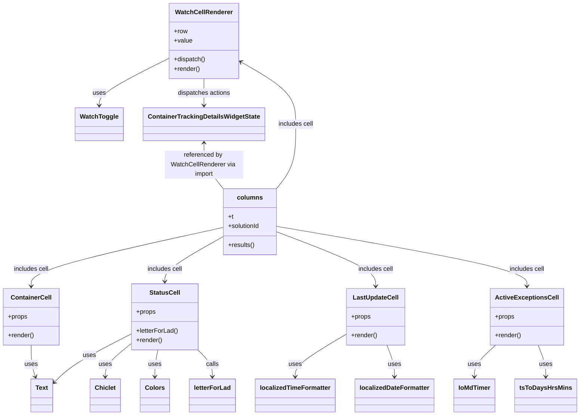

# Diagram: web/portal/src/pages/containertracking/search/ContainerTracking.Search.Columns.js

> Auto-generated by Obscura crawlers

## Mermaid

### SVG

<svg id="container" width="1436.033203125" xmlns="http://www.w3.org/2000/svg" class="classDiagram" height="1056" viewBox="0 0 1436.033203125 1056" role="graphics-document document" aria-roledescription="class"><g><defs><marker id="container_class-aggregationStart" class="marker aggregation class" refX="18" refY="7" markerWidth="190" markerHeight="240" orient="auto"><path d="M 18,7 L9,13 L1,7 L9,1 Z"></path></marker></defs><defs><marker id="container_class-aggregationEnd" class="marker aggregation class" refX="1" refY="7" markerWidth="20" markerHeight="28" orient="auto"><path d="M 18,7 L9,13 L1,7 L9,1 Z"></path></marker></defs><defs><marker id="container_class-extensionStart" class="marker extension class" refX="18" refY="7" markerWidth="190" markerHeight="240" orient="auto"><path d="M 1,7 L18,13 V 1 Z"></path></marker></defs><defs><marker id="container_class-extensionEnd" class="marker extension class" refX="1" refY="7" markerWidth="20" markerHeight="28" orient="auto"><path d="M 1,1 V 13 L18,7 Z"></path></marker></defs><defs><marker id="container_class-compositionStart" class="marker composition class" refX="18" refY="7" markerWidth="190" markerHeight="240" orient="auto"><path d="M 18,7 L9,13 L1,7 L9,1 Z"></path></marker></defs><defs><marker id="container_class-compositionEnd" class="marker composition class" refX="1" refY="7" markerWidth="20" markerHeight="28" orient="auto"><path d="M 18,7 L9,13 L1,7 L9,1 Z"></path></marker></defs><defs><marker id="container_class-dependencyStart" class="marker dependency class" refX="6" refY="7" markerWidth="190" markerHeight="240" orient="auto"><path d="M 5,7 L9,13 L1,7 L9,1 Z"></path></marker></defs><defs><marker id="container_class-dependencyEnd" class="marker dependency class" refX="13" refY="7" markerWidth="20" markerHeight="28" orient="auto"><path d="M 18,7 L9,13 L14,7 L9,1 Z"></path></marker></defs><defs><marker id="container_class-lollipopStart" class="marker lollipop class" refX="13" refY="7" markerWidth="190" markerHeight="240" orient="auto"><circle stroke="black" fill="transparent" cx="7" cy="7" r="6"></circle></marker></defs><defs><marker id="container_class-lollipopEnd" class="marker lollipop class" refX="1" refY="7" markerWidth="190" markerHeight="240" orient="auto"><circle stroke="black" fill="transparent" cx="7" cy="7" r="6"></circle></marker></defs><g class="root"><g class="clusters"></g><g class="edgePaths"><path d="M419.979,148.989L391.597,163.657C363.215,178.326,306.452,207.663,278.071,227.498C249.689,247.333,249.689,257.667,249.689,262.833L249.689,268" id="id_WatchCellRenderer_WatchToggle_1" class="edge-thickness-normal edge-pattern-solid relation" style=";;;" data-edge="true" data-et="edge" data-id="id_WatchCellRenderer_WatchToggle_1" data-points="W3sieCI6NDE5Ljk3ODUxNTYyNSwieSI6MTQ4Ljk4ODc5NzQ3NDExODgzfSx7IngiOjI0OS42ODk0NTMxMjUsInkiOjIzN30seyJ4IjoyNDkuNjg5NDUzMTI1LCJ5IjoyNzR9XQ==" marker-end="url(#container_class-dependencyEnd)"></path><path d="M507.025,200L507.025,206.167C507.025,212.333,507.025,224.667,507.025,236C507.025,247.333,507.025,257.667,507.025,262.833L507.025,268" id="id_WatchCellRenderer_ContainerTrackingDetailsWidgetState_2" class="edge-thickness-normal edge-pattern-solid relation" style=";;;" data-edge="true" data-et="edge" data-id="id_WatchCellRenderer_ContainerTrackingDetailsWidgetState_2" data-points="W3sieCI6NTA3LjAyNTM5MDYyNSwieSI6MjAwfSx7IngiOjUwNy4wMjUzOTA2MjUsInkiOjIzN30seyJ4Ijo1MDcuMDI1MzkwNjI1LCJ5IjoyNzR9XQ==" marker-end="url(#container_class-dependencyEnd)"></path><path d="M77.91,878L77.91,886.167C77.91,894.333,77.91,910.667,79.66,924.052C81.41,937.437,84.91,947.874,86.66,953.093L88.41,958.311" id="id_ContainerCell_Text_3" class="edge-thickness-normal edge-pattern-solid relation" style=";;;" data-edge="true" data-et="edge" data-id="id_ContainerCell_Text_3" data-points="W3sieCI6NzcuOTEwMTU2MjUsInkiOjg3OH0seyJ4Ijo3Ny45MTAxNTYyNSwieSI6OTI3fSx7IngiOjkwLjMxNzg4OTYzNjA3NTk1LCJ5Ijo5NjR9XQ==" marker-end="url(#container_class-dependencyEnd)"></path><path d="M861.912,849.889L840.531,862.741C819.15,875.593,776.389,901.296,755.008,919.315C733.627,937.333,733.627,947.667,733.627,952.833L733.627,958" id="id_LastUpdateCell_localizedTimeFormatter_4" class="edge-thickness-normal edge-pattern-solid relation" style=";;;" data-edge="true" data-et="edge" data-id="id_LastUpdateCell_localizedTimeFormatter_4" data-points="W3sieCI6ODYxLjkxMjEwOTM3NSwieSI6ODQ5Ljg4OTAwMzE2MzAyMTd9LHsieCI6NzMzLjYyNjk1MzEyNSwieSI6OTI3fSx7IngiOjczMy42MjY5NTMxMjUsInkiOjk2NH1d" marker-end="url(#container_class-dependencyEnd)"></path><path d="M961.674,878L964.708,886.167C967.742,894.333,973.809,910.667,976.843,924C979.877,937.333,979.877,947.667,979.877,952.833L979.877,958" id="id_LastUpdateCell_localizedDateFormatter_5" class="edge-thickness-normal edge-pattern-solid relation" style=";;;" data-edge="true" data-et="edge" data-id="id_LastUpdateCell_localizedDateFormatter_5" data-points="W3sieCI6OTYxLjY3NDM3NjkzNjk4MzQsInkiOjg3OH0seyJ4Ijo5NzkuODc2OTUzMTI1LCJ5Ijo5Mjd9LHsieCI6OTc5Ljg3Njk1MzEyNSwieSI6OTY0fV0=" marker-end="url(#container_class-dependencyEnd)"></path><path d="M327.943,874.477L317.212,883.231C306.481,891.985,285.019,909.492,274.288,923.413C263.557,937.333,263.557,947.667,263.557,952.833L263.557,958" id="id_StatusCell_Chiclet_6" class="edge-thickness-normal edge-pattern-solid relation" style=";;;" data-edge="true" data-et="edge" data-id="id_StatusCell_Chiclet_6" data-points="W3sieCI6MzI3Ljk0MzM1OTM3NSwieSI6ODc0LjQ3NzMzOTE2MjAzNjJ9LHsieCI6MjYzLjU1NjY0MDYyNSwieSI6OTI3fSx7IngiOjI2My41NTY2NDA2MjUsInkiOjk2NH1d" marker-end="url(#container_class-dependencyEnd)"></path><path d="M327.943,849.772L303.259,862.644C278.575,875.515,229.206,901.257,197.204,921.793C165.202,942.328,150.565,957.656,143.247,965.32L135.929,972.984" id="id_StatusCell_Text_7" class="edge-thickness-normal edge-pattern-solid relation" style=";;;" data-edge="true" data-et="edge" data-id="id_StatusCell_Text_7" data-points="W3sieCI6MzI3Ljk0MzM1OTM3NSwieSI6ODQ5Ljc3MjI0MTM5MzgyMn0seyJ4IjoxNzkuODM3ODkwNjI1LCJ5Ijo5Mjd9LHsieCI6MTMxLjc4NTE1NjI1LCJ5Ijo5NzcuMzIzMzA0NzY2NTg5OX1d" marker-end="url(#container_class-dependencyEnd)"></path><path d="M393.728,890L392.395,896.167C391.061,902.333,388.395,914.667,387.062,926C385.729,937.333,385.729,947.667,385.729,952.833L385.729,958" id="id_StatusCell_Colors_8" class="edge-thickness-normal edge-pattern-solid relation" style=";;;" data-edge="true" data-et="edge" data-id="id_StatusCell_Colors_8" data-points="W3sieCI6MzkzLjcyNzkwMjI0NjkwMDg0LCJ5Ijo4OTB9LHsieCI6Mzg1LjcyODUxNTYyNSwieSI6OTI3fSx7IngiOjM4NS43Mjg1MTU2MjUsInkiOjk2NH1d" marker-end="url(#container_class-dependencyEnd)"></path><path d="M492.458,890L498.373,896.167C504.288,902.333,516.118,914.667,522.032,926C527.947,937.333,527.947,947.667,527.947,952.833L527.947,958" id="id_StatusCell_letterForLad_9" class="edge-thickness-normal edge-pattern-solid relation" style=";;;" data-edge="true" data-et="edge" data-id="id_StatusCell_letterForLad_9" data-points="W3sieCI6NDkyLjQ1ODI3NDE0NzcyNzI1LCJ5Ijo4OTB9LHsieCI6NTI3Ljk0NzI2NTYyNSwieSI6OTI3fSx7IngiOjUyNy45NDcyNjU2MjUsInkiOjk2NH1d" marker-end="url(#container_class-dependencyEnd)"></path><path d="M1231.395,878L1222.602,886.167C1213.808,894.333,1196.221,910.667,1187.428,924C1178.635,937.333,1178.635,947.667,1178.635,952.833L1178.635,958" id="id_ActiveExceptionsCell_IoMdTimer_10" class="edge-thickness-normal edge-pattern-solid relation" style=";;;" data-edge="true" data-et="edge" data-id="id_ActiveExceptionsCell_IoMdTimer_10" data-points="W3sieCI6MTIzMS4zOTQ4NzAyMjIxMDczLCJ5Ijo4Nzh9LHsieCI6MTE3OC42MzQ3NjU2MjUsInkiOjkyN30seyJ4IjoxMTc4LjYzNDc2NTYyNSwieSI6OTY0fV0=" marker-end="url(#container_class-dependencyEnd)"></path><path d="M1335.667,878L1338.7,886.167C1341.734,894.333,1347.802,910.667,1350.835,924C1353.869,937.333,1353.869,947.667,1353.869,952.833L1353.869,958" id="id_ActiveExceptionsCell_tsToDaysHrsMins_11" class="edge-thickness-normal edge-pattern-solid relation" style=";;;" data-edge="true" data-et="edge" data-id="id_ActiveExceptionsCell_tsToDaysHrsMins_11" data-points="W3sieCI6MTMzNS42NjY1NjQ0MzY5ODM0LCJ5Ijo4Nzh9LHsieCI6MTM1My44NjkxNDA2MjUsInkiOjkyN30seyJ4IjoxMzUzLjg2OTE0MDYyNSwieSI6OTY0fV0=" marker-end="url(#container_class-dependencyEnd)"></path><path d="M688.159,480L696.2,469.833C704.242,459.667,720.325,439.333,728.367,412C736.408,384.667,736.408,350.333,736.408,320C736.408,289.667,736.408,263.333,713.551,236.913C690.693,210.494,644.978,183.987,622.12,170.734L599.263,157.481" id="id_columns_WatchCellRenderer_12" class="edge-thickness-normal edge-pattern-solid relation" style=";;;" data-edge="true" data-et="edge" data-id="id_columns_WatchCellRenderer_12" data-points="W3sieCI6Njg4LjE1ODcxNDk3ODQ0ODMsInkiOjQ4MH0seyJ4Ijo3MzYuNDA4MjAzMTI1LCJ5Ijo0MTl9LHsieCI6NzM2LjQwODIwMzEyNSwieSI6MzE2fSx7IngiOjczNi40MDgyMDMxMjUsInkiOjIzN30seyJ4Ijo1OTQuMDcyMjY1NjI1LCJ5IjoxNTQuNDcxMjM3MzU1Njc1OX1d" marker-end="url(#container_class-dependencyEnd)"></path><path d="M553.393,579.203L474.146,596.835C394.898,614.468,236.404,649.734,157.157,674.534C77.91,699.333,77.91,713.667,77.91,720.833L77.91,728" id="id_columns_ContainerCell_13" class="edge-thickness-normal edge-pattern-solid relation" style=";;;" data-edge="true" data-et="edge" data-id="id_columns_ContainerCell_13" data-points="W3sieCI6NTUzLjM5MjU3ODEyNSwieSI6NTc5LjIwMjUxODQxNTgyNTl9LHsieCI6NzcuOTEwMTU2MjUsInkiOjY4NX0seyJ4Ijo3Ny45MTAxNTYyNSwieSI6NzM0fV0=" marker-end="url(#container_class-dependencyEnd)"></path><path d="M553.393,603.4L529.809,617C506.225,630.6,459.057,657.8,435.473,676.567C411.889,695.333,411.889,705.667,411.889,710.833L411.889,716" id="id_columns_StatusCell_14" class="edge-thickness-normal edge-pattern-solid relation" style=";;;" data-edge="true" data-et="edge" data-id="id_columns_StatusCell_14" data-points="W3sieCI6NTUzLjM5MjU3ODEyNSwieSI6NjAzLjQwMDAxMTE2OTg1NjN9LHsieCI6NDExLjg4ODY3MTg3NSwieSI6Njg1fSx7IngiOjQxMS44ODg2NzE4NzUsInkiOjcyMn1d" marker-end="url(#container_class-dependencyEnd)"></path><path d="M690.041,590.395L730.855,606.163C771.67,621.93,853.299,653.465,894.113,676.399C934.928,699.333,934.928,713.667,934.928,720.833L934.928,728" id="id_columns_LastUpdateCell_15" class="edge-thickness-normal edge-pattern-solid relation" style=";;;" data-edge="true" data-et="edge" data-id="id_columns_LastUpdateCell_15" data-points="W3sieCI6NjkwLjA0MTAxNTYyNSwieSI6NTkwLjM5NTA4ODY3MzI2ODN9LHsieCI6OTM0LjkyNzczNDM3NSwieSI6Njg1fSx7IngiOjkzNC45Mjc3MzQzNzUsInkiOjczNH1d" marker-end="url(#container_class-dependencyEnd)"></path><path d="M690.041,576.03L793.188,594.192C896.334,612.354,1102.627,648.677,1205.773,674.005C1308.92,699.333,1308.92,713.667,1308.92,720.833L1308.92,728" id="id_columns_ActiveExceptionsCell_16" class="edge-thickness-normal edge-pattern-solid relation" style=";;;" data-edge="true" data-et="edge" data-id="id_columns_ActiveExceptionsCell_16" data-points="W3sieCI6NjkwLjA0MTAxNTYyNSwieSI6NTc2LjAzMDI1NzM4Mzg3MDN9LHsieCI6MTMwOC45MTk5MjE4NzUsInkiOjY4NX0seyJ4IjoxMzA4LjkxOTkyMTg3NSwieSI6NzM0fV0=" marker-end="url(#container_class-dependencyEnd)"></path><path d="M507.025,364L507.025,373.167C507.025,382.333,507.025,400.667,515.067,420C523.109,439.333,539.192,459.667,547.233,469.833L555.275,480" id="id_ContainerTrackingDetailsWidgetState_columns_17" class="edge-thickness-normal edge-pattern-solid relation" style=";;;" data-edge="true" data-et="edge" data-id="id_ContainerTrackingDetailsWidgetState_columns_17" data-points="W3sieCI6NTA3LjAyNTM5MDYyNSwieSI6MzU4fSx7IngiOjUwNy4wMjUzOTA2MjUsInkiOjQxOX0seyJ4Ijo1NTUuMjc0ODc4NzcxNTUxNywieSI6NDgwfV0=" marker-start="url(#container_class-dependencyStart)"></path></g><g class="edgeLabels"><g class="edgeLabel" transform="translate(249.689453125, 237)"><g class="label" data-id="id_WatchCellRenderer_WatchToggle_1" transform="translate(-16.4921875, -12)"><foreignObject width="32.984375" height="24">

uses

</foreignObject></g></g><g class="edgeLabel" transform="translate(507.025390625, 237)"><g class="label" data-id="id_WatchCellRenderer_ContainerTrackingDetailsWidgetState_2" transform="translate(-67.71875, -12)"><foreignObject width="135.4375" height="24">

dispatches actions

</foreignObject></g></g><g class="edgeLabel" transform="translate(77.91015625, 927)"><g class="label" data-id="id_ContainerCell_Text_3" transform="translate(-16.4921875, -12)"><foreignObject width="32.984375" height="24">

uses

</foreignObject></g></g><g class="edgeLabel" transform="translate(733.626953125, 927)"><g class="label" data-id="id_LastUpdateCell_localizedTimeFormatter_4" transform="translate(-16.4921875, -12)"><foreignObject width="32.984375" height="24">

uses

</foreignObject></g></g><g class="edgeLabel" transform="translate(979.876953125, 927)"><g class="label" data-id="id_LastUpdateCell_localizedDateFormatter_5" transform="translate(-16.4921875, -12)"><foreignObject width="32.984375" height="24">

uses

</foreignObject></g></g><g class="edgeLabel" transform="translate(263.556640625, 927)"><g class="label" data-id="id_StatusCell_Chiclet_6" transform="translate(-16.4921875, -12)"><foreignObject width="32.984375" height="24">

uses

</foreignObject></g></g><g class="edgeLabel" transform="translate(223.04213, 904.47169)"><g class="label" data-id="id_StatusCell_Text_7" transform="translate(-16.4921875, -12)"><foreignObject width="32.984375" height="24">

uses

</foreignObject></g></g><g class="edgeLabel" transform="translate(385.728515625, 927)"><g class="label" data-id="id_StatusCell_Colors_8" transform="translate(-16.4921875, -12)"><foreignObject width="32.984375" height="24">

uses

</foreignObject></g></g><g class="edgeLabel" transform="translate(527.947265625, 927)"><g class="label" data-id="id_StatusCell_letterForLad_9" transform="translate(-16.4453125, -12)"><foreignObject width="32.890625" height="24">

calls

</foreignObject></g></g><g class="edgeLabel" transform="translate(1178.634765625, 927)"><g class="label" data-id="id_ActiveExceptionsCell_IoMdTimer_10" transform="translate(-16.4921875, -12)"><foreignObject width="32.984375" height="24">

uses

</foreignObject></g></g><g class="edgeLabel" transform="translate(1353.869140625, 927)"><g class="label" data-id="id_ActiveExceptionsCell_tsToDaysHrsMins_11" transform="translate(-16.4921875, -12)"><foreignObject width="32.984375" height="24">

uses

</foreignObject></g></g><g class="edgeLabel" transform="translate(736.408203125, 316)"><g class="label" data-id="id_columns_WatchCellRenderer_12" transform="translate(-45.484375, -12)"><foreignObject width="90.96875" height="24">

includes cell

</foreignObject></g></g><g class="edgeLabel" transform="translate(77.91015625, 685)"><g class="label" data-id="id_columns_ContainerCell_13" transform="translate(-45.484375, -12)"><foreignObject width="90.96875" height="24">

includes cell

</foreignObject></g></g><g class="edgeLabel" transform="translate(411.888671875, 685)"><g class="label" data-id="id_columns_StatusCell_14" transform="translate(-45.484375, -12)"><foreignObject width="90.96875" height="24">

includes cell

</foreignObject></g></g><g class="edgeLabel" transform="translate(934.927734375, 685)"><g class="label" data-id="id_columns_LastUpdateCell_15" transform="translate(-45.484375, -12)"><foreignObject width="90.96875" height="24">

includes cell

</foreignObject></g></g><g class="edgeLabel" transform="translate(1308.919921875, 685)"><g class="label" data-id="id_columns_ActiveExceptionsCell_16" transform="translate(-45.484375, -12)"><foreignObject width="90.96875" height="24">

includes cell

</foreignObject></g></g><g class="edgeLabel" transform="translate(507.025390625, 419)"><g class="label" data-id="id_ContainerTrackingDetailsWidgetState_columns_17" transform="translate(-100, -36)"><foreignObject width="200" height="72">

referenced by WatchCellRenderer via import

</foreignObject></g></g></g><g class="nodes"><g class="node default" id="classId-WatchCellRenderer-0" transform="translate(507.025390625, 104)"><g class="basic label-container"><path d="M-87.046875 -96 L87.046875 -96 L87.046875 96 L-87.046875 96" stroke="none" stroke-width="0" fill="#ECECFF" style=""></path><path d="M-87.046875 -96 C-29.561460916236612 -96, 27.923953167526776 -96, 87.046875 -96 M-87.046875 -96 C-26.916440978656475 -96, 33.21399304268705 -96, 87.046875 -96 M87.046875 -96 C87.046875 -41.84722211106206, 87.046875 12.305555777875881, 87.046875 96 M87.046875 -96 C87.046875 -43.17475162804085, 87.046875 9.650496743918296, 87.046875 96 M87.046875 96 C23.198659453257143 96, -40.649556093485714 96, -87.046875 96 M87.046875 96 C48.900462125095466 96, 10.754049250190931 96, -87.046875 96 M-87.046875 96 C-87.046875 40.91844878333736, -87.046875 -14.163102433325278, -87.046875 -96 M-87.046875 96 C-87.046875 54.32359424550982, -87.046875 12.647188491019634, -87.046875 -96" stroke="#9370DB" stroke-width="1.3" fill="none" stroke-dasharray="0 0" style=""></path></g><g class="annotation-group text" transform="translate(0, -72)"></g><g class="label-group text" transform="translate(-69.578125, -72)"><g class="label" style="font-weight: bolder" transform="translate(0,-12)"><foreignObject width="139.15625" height="24">

WatchCellRenderer

</foreignObject></g></g><g class="members-group text" transform="translate(-75.046875, -24)"><g class="label" style="" transform="translate(0,-12)"><foreignObject width="34.5" height="24">

+row

</foreignObject></g><g class="label" style="" transform="translate(0,12)"><foreignObject width="46.71875" height="24">

+value

</foreignObject></g></g><g class="methods-group text" transform="translate(-75.046875, 48)"><g class="label" style="" transform="translate(0,-12)"><foreignObject width="80.515625" height="24">

+dispatch()

</foreignObject></g><g class="label" style="" transform="translate(0,12)"><foreignObject width="66.609375" height="24">

+render()

</foreignObject></g></g><g class="divider" style=""><path d="M-87.046875 -48 C-21.535247777989497 -48, 43.976379444021006 -48, 87.046875 -48 M-87.046875 -48 C-49.73097961248691 -48, -12.415084224973825 -48, 87.046875 -48" stroke="#9370DB" stroke-width="1.3" fill="none" stroke-dasharray="0 0" style=""></path></g><g class="divider" style=""><path d="M-87.046875 24 C-24.36029092597655 24, 38.3262931480469 24, 87.046875 24 M-87.046875 24 C-21.926838760614586 24, 43.19319747877083 24, 87.046875 24" stroke="#9370DB" stroke-width="1.3" fill="none" stroke-dasharray="0 0" style=""></path></g></g><g class="node default" id="classId-ContainerCell-1" transform="translate(77.91015625, 806)"><g class="basic label-container"><path d="M-69.91015625 -72 L69.91015625 -72 L69.91015625 72 L-69.91015625 72" stroke="none" stroke-width="0" fill="#ECECFF" style=""></path><path d="M-69.91015625 -72 C-14.48375394813646 -72, 40.94264835372708 -72, 69.91015625 -72 M-69.91015625 -72 C-21.63279071508265 -72, 26.644574819834702 -72, 69.91015625 -72 M69.91015625 -72 C69.91015625 -20.536425354324948, 69.91015625 30.927149291350105, 69.91015625 72 M69.91015625 -72 C69.91015625 -34.89048669283963, 69.91015625 2.2190266143207396, 69.91015625 72 M69.91015625 72 C33.92421889774594 72, -2.0617184545081244 72, -69.91015625 72 M69.91015625 72 C29.736164871790606 72, -10.437826506418787 72, -69.91015625 72 M-69.91015625 72 C-69.91015625 41.98701547562716, -69.91015625 11.974030951254313, -69.91015625 -72 M-69.91015625 72 C-69.91015625 26.742471381325153, -69.91015625 -18.515057237349694, -69.91015625 -72" stroke="#9370DB" stroke-width="1.3" fill="none" stroke-dasharray="0 0" style=""></path></g><g class="annotation-group text" transform="translate(0, -48)"></g><g class="label-group text" transform="translate(-49.2109375, -48)"><g class="label" style="font-weight: bolder" transform="translate(0,-12)"><foreignObject width="98.421875" height="24">

ContainerCell

</foreignObject></g></g><g class="members-group text" transform="translate(-57.91015625, 0)"><g class="label" style="" transform="translate(0,-12)"><foreignObject width="49.515625" height="24">

+props

</foreignObject></g></g><g class="methods-group text" transform="translate(-57.91015625, 48)"><g class="label" style="" transform="translate(0,-12)"><foreignObject width="66.609375" height="24">

+render()

</foreignObject></g></g><g class="divider" style=""><path d="M-69.91015625 -24 C-34.19642596527029 -24, 1.517304319459413 -24, 69.91015625 -24 M-69.91015625 -24 C-38.55502449349426 -24, -7.1998927369885095 -24, 69.91015625 -24" stroke="#9370DB" stroke-width="1.3" fill="none" stroke-dasharray="0 0" style=""></path></g><g class="divider" style=""><path d="M-69.91015625 24 C-31.4861815244549 24, 6.9377932010902015 24, 69.91015625 24 M-69.91015625 24 C-22.08114920669602 24, 25.747857836607963 24, 69.91015625 24" stroke="#9370DB" stroke-width="1.3" fill="none" stroke-dasharray="0 0" style=""></path></g></g><g class="node default" id="classId-LastUpdateCell-2" transform="translate(934.927734375, 806)"><g class="basic label-container"><path d="M-73.015625 -72 L73.015625 -72 L73.015625 72 L-73.015625 72" stroke="none" stroke-width="0" fill="#ECECFF" style=""></path><path d="M-73.015625 -72 C-23.887573091054428 -72, 25.240478817891145 -72, 73.015625 -72 M-73.015625 -72 C-43.12016200749102 -72, -13.22469901498203 -72, 73.015625 -72 M73.015625 -72 C73.015625 -37.0335090096893, 73.015625 -2.067018019378594, 73.015625 72 M73.015625 -72 C73.015625 -34.776963616778644, 73.015625 2.446072766442711, 73.015625 72 M73.015625 72 C35.56803479756487 72, -1.8795554048702598 72, -73.015625 72 M73.015625 72 C39.05036542200398 72, 5.0851058440079555 72, -73.015625 72 M-73.015625 72 C-73.015625 31.422515068744808, -73.015625 -9.154969862510384, -73.015625 -72 M-73.015625 72 C-73.015625 23.787678524394792, -73.015625 -24.424642951210416, -73.015625 -72" stroke="#9370DB" stroke-width="1.3" fill="none" stroke-dasharray="0 0" style=""></path></g><g class="annotation-group text" transform="translate(0, -48)"></g><g class="label-group text" transform="translate(-55.421875, -48)"><g class="label" style="font-weight: bolder" transform="translate(0,-12)"><foreignObject width="110.84375" height="24">

LastUpdateCell

</foreignObject></g></g><g class="members-group text" transform="translate(-61.015625, 0)"><g class="label" style="" transform="translate(0,-12)"><foreignObject width="49.515625" height="24">

+props

</foreignObject></g></g><g class="methods-group text" transform="translate(-61.015625, 48)"><g class="label" style="" transform="translate(0,-12)"><foreignObject width="66.609375" height="24">

+render()

</foreignObject></g></g><g class="divider" style=""><path d="M-73.015625 -24 C-21.384974845526926 -24, 30.245675308946147 -24, 73.015625 -24 M-73.015625 -24 C-30.763123411027102 -24, 11.489378177945795 -24, 73.015625 -24" stroke="#9370DB" stroke-width="1.3" fill="none" stroke-dasharray="0 0" style=""></path></g><g class="divider" style=""><path d="M-73.015625 24 C-22.11657785688488 24, 28.78246928623024 24, 73.015625 24 M-73.015625 24 C-18.61033157385061 24, 35.79496185229878 24, 73.015625 24" stroke="#9370DB" stroke-width="1.3" fill="none" stroke-dasharray="0 0" style=""></path></g></g><g class="node default" id="classId-StatusCell-3" transform="translate(411.888671875, 806)"><g class="basic label-container"><path d="M-83.9453125 -84 L83.9453125 -84 L83.9453125 84 L-83.9453125 84" stroke="none" stroke-width="0" fill="#ECECFF" style=""></path><path d="M-83.9453125 -84 C-40.76864873368071 -84, 2.4080150326385734 -84, 83.9453125 -84 M-83.9453125 -84 C-41.27219214355512 -84, 1.4009282128897667 -84, 83.9453125 -84 M83.9453125 -84 C83.9453125 -38.44717026636571, 83.9453125 7.10565946726858, 83.9453125 84 M83.9453125 -84 C83.9453125 -29.255723729152436, 83.9453125 25.488552541695128, 83.9453125 84 M83.9453125 84 C28.913971627284475 84, -26.11736924543105 84, -83.9453125 84 M83.9453125 84 C39.792831350875076 84, -4.359649798249848 84, -83.9453125 84 M-83.9453125 84 C-83.9453125 37.079388373849376, -83.9453125 -9.841223252301248, -83.9453125 -84 M-83.9453125 84 C-83.9453125 19.822297454213484, -83.9453125 -44.35540509157303, -83.9453125 -84" stroke="#9370DB" stroke-width="1.3" fill="none" stroke-dasharray="0 0" style=""></path></g><g class="annotation-group text" transform="translate(0, -60)"></g><g class="label-group text" transform="translate(-37.09375, -60)"><g class="label" style="font-weight: bolder" transform="translate(0,-12)"><foreignObject width="74.1875" height="24">

StatusCell

</foreignObject></g></g><g class="members-group text" transform="translate(-71.9453125, -12)"><g class="label" style="" transform="translate(0,-12)"><foreignObject width="49.515625" height="24">

+props

</foreignObject></g></g><g class="methods-group text" transform="translate(-71.9453125, 36)"><g class="label" style="" transform="translate(0,-12)"><foreignObject width="106.796875" height="24">

+letterForLad()

</foreignObject></g><g class="label" style="" transform="translate(0,12)"><foreignObject width="66.609375" height="24">

+render()

</foreignObject></g></g><g class="divider" style=""><path d="M-83.9453125 -36 C-48.47343083333571 -36, -13.001549166671424 -36, 83.9453125 -36 M-83.9453125 -36 C-48.92062591264573 -36, -13.895939325291465 -36, 83.9453125 -36" stroke="#9370DB" stroke-width="1.3" fill="none" stroke-dasharray="0 0" style=""></path></g><g class="divider" style=""><path d="M-83.9453125 12 C-24.757101244779804 12, 34.43111001044039 12, 83.9453125 12 M-83.9453125 12 C-45.205671221543305 12, -6.46602994308661 12, 83.9453125 12" stroke="#9370DB" stroke-width="1.3" fill="none" stroke-dasharray="0 0" style=""></path></g></g><g class="node default" id="classId-ActiveExceptionsCell-4" transform="translate(1308.919921875, 806)"><g class="basic label-container"><path d="M-87.5234375 -72 L87.5234375 -72 L87.5234375 72 L-87.5234375 72" stroke="none" stroke-width="0" fill="#ECECFF" style=""></path><path d="M-87.5234375 -72 C-45.28958445992141 -72, -3.0557314198428145 -72, 87.5234375 -72 M-87.5234375 -72 C-33.742775355791046 -72, 20.037886788417907 -72, 87.5234375 -72 M87.5234375 -72 C87.5234375 -33.180589485274965, 87.5234375 5.638821029450071, 87.5234375 72 M87.5234375 -72 C87.5234375 -25.21635753079436, 87.5234375 21.567284938411277, 87.5234375 72 M87.5234375 72 C37.0012654214424 72, -13.520906657115205 72, -87.5234375 72 M87.5234375 72 C31.873394876482934 72, -23.776647747034133 72, -87.5234375 72 M-87.5234375 72 C-87.5234375 23.83134157251871, -87.5234375 -24.33731685496258, -87.5234375 -72 M-87.5234375 72 C-87.5234375 30.123124249626585, -87.5234375 -11.75375150074683, -87.5234375 -72" stroke="#9370DB" stroke-width="1.3" fill="none" stroke-dasharray="0 0" style=""></path></g><g class="annotation-group text" transform="translate(0, -48)"></g><g class="label-group text" transform="translate(-75.5234375, -48)"><g class="label" style="font-weight: bolder" transform="translate(0,-12)"><foreignObject width="151.046875" height="24">

ActiveExceptionsCell

</foreignObject></g></g><g class="members-group text" transform="translate(-75.5234375, 0)"><g class="label" style="" transform="translate(0,-12)"><foreignObject width="49.515625" height="24">

+props

</foreignObject></g></g><g class="methods-group text" transform="translate(-75.5234375, 48)"><g class="label" style="" transform="translate(0,-12)"><foreignObject width="66.609375" height="24">

+render()

</foreignObject></g></g><g class="divider" style=""><path d="M-87.5234375 -24 C-41.90680779874819 -24, 3.70982190250362 -24, 87.5234375 -24 M-87.5234375 -24 C-45.61470057051585 -24, -3.705963641031701 -24, 87.5234375 -24" stroke="#9370DB" stroke-width="1.3" fill="none" stroke-dasharray="0 0" style=""></path></g><g class="divider" style=""><path d="M-87.5234375 24 C-43.78835428323309 24, -0.05327106646618063 24, 87.5234375 24 M-87.5234375 24 C-23.86954101581214 24, 39.78435546837572 24, 87.5234375 24" stroke="#9370DB" stroke-width="1.3" fill="none" stroke-dasharray="0 0" style=""></path></g></g><g class="node default" id="classId-columns-5" transform="translate(621.716796875, 564)"><g class="basic label-container"><path d="M-68.32421875 -84 L68.32421875 -84 L68.32421875 84 L-68.32421875 84" stroke="none" stroke-width="0" fill="#ECECFF" style=""></path><path d="M-68.32421875 -84 C-27.1255965236709 -84, 14.0730257026582 -84, 68.32421875 -84 M-68.32421875 -84 C-40.96036419811752 -84, -13.596509646235027 -84, 68.32421875 -84 M68.32421875 -84 C68.32421875 -43.78869485526242, 68.32421875 -3.577389710524841, 68.32421875 84 M68.32421875 -84 C68.32421875 -26.174032717017397, 68.32421875 31.651934565965206, 68.32421875 84 M68.32421875 84 C38.15070313432643 84, 7.977187518652855 84, -68.32421875 84 M68.32421875 84 C18.53098621002517 84, -31.26224632994966 84, -68.32421875 84 M-68.32421875 84 C-68.32421875 47.86905316439635, -68.32421875 11.738106328792696, -68.32421875 -84 M-68.32421875 84 C-68.32421875 39.52732898758252, -68.32421875 -4.945342024834957, -68.32421875 -84" stroke="#9370DB" stroke-width="1.3" fill="none" stroke-dasharray="0 0" style=""></path></g><g class="annotation-group text" transform="translate(0, -60)"></g><g class="label-group text" transform="translate(-30.5390625, -60)"><g class="label" style="font-weight: bolder" transform="translate(0,-12)"><foreignObject width="61.078125" height="24">

columns

</foreignObject></g></g><g class="members-group text" transform="translate(-56.32421875, -12)"><g class="label" style="" transform="translate(0,-12)"><foreignObject width="13.6875" height="24">

+t

</foreignObject></g><g class="label" style="" transform="translate(0,12)"><foreignObject width="82.109375" height="24">

+solutionId

</foreignObject></g></g><g class="methods-group text" transform="translate(-56.32421875, 60)"><g class="label" style="" transform="translate(0,-12)"><foreignObject width="67.5" height="24">

+results()

</foreignObject></g></g><g class="divider" style=""><path d="M-68.32421875 -36 C-18.194812753486268 -36, 31.934593243027464 -36, 68.32421875 -36 M-68.32421875 -36 C-33.34372344666414 -36, 1.6367718566717144 -36, 68.32421875 -36" stroke="#9370DB" stroke-width="1.3" fill="none" stroke-dasharray="0 0" style=""></path></g><g class="divider" style=""><path d="M-68.32421875 36 C-26.142343698160147 36, 16.039531353679706 36, 68.32421875 36 M-68.32421875 36 C-40.74443696858304 36, -13.164655187166076 36, 68.32421875 36" stroke="#9370DB" stroke-width="1.3" fill="none" stroke-dasharray="0 0" style=""></path></g></g><g class="node default" id="classId-WatchToggle-6" transform="translate(249.689453125, 316)"><g class="basic label-container"><path d="M-58.4375 -42 L58.4375 -42 L58.4375 42 L-58.4375 42" stroke="none" stroke-width="0" fill="#ECECFF" style=""></path><path d="M-58.4375 -42 C-12.272403157866954 -42, 33.89269368426609 -42, 58.4375 -42 M-58.4375 -42 C-22.109925373803605 -42, 14.217649252392789 -42, 58.4375 -42 M58.4375 -42 C58.4375 -9.297815639295074, 58.4375 23.404368721409853, 58.4375 42 M58.4375 -42 C58.4375 -18.682979874076718, 58.4375 4.634040251846564, 58.4375 42 M58.4375 42 C23.64014640484219 42, -11.157207190315617 42, -58.4375 42 M58.4375 42 C17.89551786847524 42, -22.646464263049523 42, -58.4375 42 M-58.4375 42 C-58.4375 10.873451039653151, -58.4375 -20.253097920693698, -58.4375 -42 M-58.4375 42 C-58.4375 24.173136816598625, -58.4375 6.346273633197249, -58.4375 -42" stroke="#9370DB" stroke-width="1.3" fill="none" stroke-dasharray="0 0" style=""></path></g><g class="annotation-group text" transform="translate(0, -18)"></g><g class="label-group text" transform="translate(-46.4375, -18)"><g class="label" style="font-weight: bolder" transform="translate(0,-12)"><foreignObject width="92.875" height="24">

WatchToggle

</foreignObject></g></g><g class="members-group text" transform="translate(-46.4375, 30)"></g><g class="methods-group text" transform="translate(-46.4375, 60)"></g><g class="divider" style=""><path d="M-58.4375 6 C-29.136910052860856 6, 0.16367989427828888 6, 58.4375 6 M-58.4375 6 C-24.765643946661264 6, 8.906212106677472 6, 58.4375 6" stroke="#9370DB" stroke-width="1.3" fill="none" stroke-dasharray="0 0" style=""></path></g><g class="divider" style=""><path d="M-58.4375 24 C-33.414080778650025 24, -8.39066155730005 24, 58.4375 24 M-58.4375 24 C-33.93806446939992 24, -9.438628938799837 24, 58.4375 24" stroke="#9370DB" stroke-width="1.3" fill="none" stroke-dasharray="0 0" style=""></path></g></g><g class="node default" id="classId-Chiclet-7" transform="translate(263.556640625, 1006)"><g class="basic label-container"><path d="M-37.0703125 -42 L37.0703125 -42 L37.0703125 42 L-37.0703125 42" stroke="none" stroke-width="0" fill="#ECECFF" style=""></path><path d="M-37.0703125 -42 C-8.815606283870167 -42, 19.439099932259666 -42, 37.0703125 -42 M-37.0703125 -42 C-19.382489336224225 -42, -1.69466617244845 -42, 37.0703125 -42 M37.0703125 -42 C37.0703125 -17.752418275979608, 37.0703125 6.495163448040785, 37.0703125 42 M37.0703125 -42 C37.0703125 -21.23718209253659, 37.0703125 -0.4743641850731777, 37.0703125 42 M37.0703125 42 C19.924163838286454 42, 2.7780151765729073 42, -37.0703125 42 M37.0703125 42 C20.452412268507118 42, 3.8345120370142354 42, -37.0703125 42 M-37.0703125 42 C-37.0703125 21.11491631891761, -37.0703125 0.2298326378352229, -37.0703125 -42 M-37.0703125 42 C-37.0703125 21.355483129345853, -37.0703125 0.7109662586917054, -37.0703125 -42" stroke="#9370DB" stroke-width="1.3" fill="none" stroke-dasharray="0 0" style=""></path></g><g class="annotation-group text" transform="translate(0, -18)"></g><g class="label-group text" transform="translate(-25.0703125, -18)"><g class="label" style="font-weight: bolder" transform="translate(0,-12)"><foreignObject width="50.140625" height="24">

Chiclet

</foreignObject></g></g><g class="members-group text" transform="translate(-25.0703125, 30)"></g><g class="methods-group text" transform="translate(-25.0703125, 60)"></g><g class="divider" style=""><path d="M-37.0703125 6 C-13.100064532001507 6, 10.870183435996985 6, 37.0703125 6 M-37.0703125 6 C-22.14019789788754 6, -7.210083295775078 6, 37.0703125 6" stroke="#9370DB" stroke-width="1.3" fill="none" stroke-dasharray="0 0" style=""></path></g><g class="divider" style=""><path d="M-37.0703125 24 C-15.927099985540888 24, 5.216112528918224 24, 37.0703125 24 M-37.0703125 24 C-10.142714538757264 24, 16.78488342248547 24, 37.0703125 24" stroke="#9370DB" stroke-width="1.3" fill="none" stroke-dasharray="0 0" style=""></path></g></g><g class="node default" id="classId-Text-8" transform="translate(104.40234375, 1006)"><g class="basic label-container"><path d="M-27.3828125 -42 L27.3828125 -42 L27.3828125 42 L-27.3828125 42" stroke="none" stroke-width="0" fill="#ECECFF" style=""></path><path d="M-27.3828125 -42 C-6.336363204059495 -42, 14.71008609188101 -42, 27.3828125 -42 M-27.3828125 -42 C-6.079268112994242 -42, 15.224276274011515 -42, 27.3828125 -42 M27.3828125 -42 C27.3828125 -19.402453615592144, 27.3828125 3.1950927688157122, 27.3828125 42 M27.3828125 -42 C27.3828125 -24.341207479410226, 27.3828125 -6.682414958820452, 27.3828125 42 M27.3828125 42 C14.744985055389494 42, 2.1071576107789873 42, -27.3828125 42 M27.3828125 42 C13.078906928174499 42, -1.224998643651002 42, -27.3828125 42 M-27.3828125 42 C-27.3828125 23.608591567900035, -27.3828125 5.21718313580007, -27.3828125 -42 M-27.3828125 42 C-27.3828125 13.636919331533136, -27.3828125 -14.726161336933728, -27.3828125 -42" stroke="#9370DB" stroke-width="1.3" fill="none" stroke-dasharray="0 0" style=""></path></g><g class="annotation-group text" transform="translate(0, -18)"></g><g class="label-group text" transform="translate(-15.3828125, -18)"><g class="label" style="font-weight: bolder" transform="translate(0,-12)"><foreignObject width="30.765625" height="24">

Text

</foreignObject></g></g><g class="members-group text" transform="translate(-15.3828125, 30)"></g><g class="methods-group text" transform="translate(-15.3828125, 60)"></g><g class="divider" style=""><path d="M-27.3828125 6 C-9.37687486604435 6, 8.6290627679113 6, 27.3828125 6 M-27.3828125 6 C-7.744081744311661 6, 11.894649011376679 6, 27.3828125 6" stroke="#9370DB" stroke-width="1.3" fill="none" stroke-dasharray="0 0" style=""></path></g><g class="divider" style=""><path d="M-27.3828125 24 C-11.205086246217753 24, 4.972640007564493 24, 27.3828125 24 M-27.3828125 24 C-6.358736859696862 24, 14.665338780606277 24, 27.3828125 24" stroke="#9370DB" stroke-width="1.3" fill="none" stroke-dasharray="0 0" style=""></path></g></g><g class="node default" id="classId-Colors-9" transform="translate(385.728515625, 1006)"><g class="basic label-container"><path d="M-35.1015625 -42 L35.1015625 -42 L35.1015625 42 L-35.1015625 42" stroke="none" stroke-width="0" fill="#ECECFF" style=""></path><path d="M-35.1015625 -42 C-8.60271489041261 -42, 17.89613271917478 -42, 35.1015625 -42 M-35.1015625 -42 C-14.899733315741386 -42, 5.3020958685172275 -42, 35.1015625 -42 M35.1015625 -42 C35.1015625 -18.753697483280327, 35.1015625 4.492605033439347, 35.1015625 42 M35.1015625 -42 C35.1015625 -14.629621155596894, 35.1015625 12.740757688806212, 35.1015625 42 M35.1015625 42 C12.334911992171886 42, -10.431738515656228 42, -35.1015625 42 M35.1015625 42 C15.90322373370384 42, -3.295115032592321 42, -35.1015625 42 M-35.1015625 42 C-35.1015625 12.248090394953621, -35.1015625 -17.503819210092757, -35.1015625 -42 M-35.1015625 42 C-35.1015625 23.458819345859517, -35.1015625 4.917638691719034, -35.1015625 -42" stroke="#9370DB" stroke-width="1.3" fill="none" stroke-dasharray="0 0" style=""></path></g><g class="annotation-group text" transform="translate(0, -18)"></g><g class="label-group text" transform="translate(-23.1015625, -18)"><g class="label" style="font-weight: bolder" transform="translate(0,-12)"><foreignObject width="46.203125" height="24">

Colors

</foreignObject></g></g><g class="members-group text" transform="translate(-23.1015625, 30)"></g><g class="methods-group text" transform="translate(-23.1015625, 60)"></g><g class="divider" style=""><path d="M-35.1015625 6 C-20.918052750060596 6, -6.734543000121192 6, 35.1015625 6 M-35.1015625 6 C-11.87687561704642 6, 11.347811265907161 6, 35.1015625 6" stroke="#9370DB" stroke-width="1.3" fill="none" stroke-dasharray="0 0" style=""></path></g><g class="divider" style=""><path d="M-35.1015625 24 C-15.431713723346721 24, 4.238135053306557 24, 35.1015625 24 M-35.1015625 24 C-19.824175737048385 24, -4.546788974096767 24, 35.1015625 24" stroke="#9370DB" stroke-width="1.3" fill="none" stroke-dasharray="0 0" style=""></path></g></g><g class="node default" id="classId-localizedTimeFormatter-10" transform="translate(733.626953125, 1006)"><g class="basic label-container"><path d="M-98.5625 -42 L98.5625 -42 L98.5625 42 L-98.5625 42" stroke="none" stroke-width="0" fill="#ECECFF" style=""></path><path d="M-98.5625 -42 C-54.53198418866661 -42, -10.501468377333225 -42, 98.5625 -42 M-98.5625 -42 C-51.91785655519073 -42, -5.273213110381462 -42, 98.5625 -42 M98.5625 -42 C98.5625 -9.650886967442382, 98.5625 22.698226065115236, 98.5625 42 M98.5625 -42 C98.5625 -12.545848477902062, 98.5625 16.908303044195875, 98.5625 42 M98.5625 42 C26.82932047444362 42, -44.90385905111276 42, -98.5625 42 M98.5625 42 C33.387839674577776 42, -31.786820650844447 42, -98.5625 42 M-98.5625 42 C-98.5625 9.619100074229102, -98.5625 -22.761799851541795, -98.5625 -42 M-98.5625 42 C-98.5625 12.567673344413421, -98.5625 -16.864653311173157, -98.5625 -42" stroke="#9370DB" stroke-width="1.3" fill="none" stroke-dasharray="0 0" style=""></path></g><g class="annotation-group text" transform="translate(0, -18)"></g><g class="label-group text" transform="translate(-86.5625, -18)"><g class="label" style="font-weight: bolder" transform="translate(0,-12)"><foreignObject width="173.125" height="24">

localizedTimeFormatter

</foreignObject></g></g><g class="members-group text" transform="translate(-86.5625, 30)"></g><g class="methods-group text" transform="translate(-86.5625, 60)"></g><g class="divider" style=""><path d="M-98.5625 6 C-57.40669897356323 6, -16.25089794712646 6, 98.5625 6 M-98.5625 6 C-33.41686716929503 6, 31.728765661409938 6, 98.5625 6" stroke="#9370DB" stroke-width="1.3" fill="none" stroke-dasharray="0 0" style=""></path></g><g class="divider" style=""><path d="M-98.5625 24 C-26.5292315843852 24, 45.5040368312296 24, 98.5625 24 M-98.5625 24 C-40.9720868522908 24, 16.6183262954184 24, 98.5625 24" stroke="#9370DB" stroke-width="1.3" fill="none" stroke-dasharray="0 0" style=""></path></g></g><g class="node default" id="classId-localizedDateFormatter-11" transform="translate(979.876953125, 1006)"><g class="basic label-container"><path d="M-97.6875 -42 L97.6875 -42 L97.6875 42 L-97.6875 42" stroke="none" stroke-width="0" fill="#ECECFF" style=""></path><path d="M-97.6875 -42 C-32.37758895400512 -42, 32.93232209198976 -42, 97.6875 -42 M-97.6875 -42 C-36.180907079122996 -42, 25.32568584175401 -42, 97.6875 -42 M97.6875 -42 C97.6875 -11.71321160086308, 97.6875 18.57357679827384, 97.6875 42 M97.6875 -42 C97.6875 -24.901016504465947, 97.6875 -7.802033008931893, 97.6875 42 M97.6875 42 C43.13688257387459 42, -11.413734852250826 42, -97.6875 42 M97.6875 42 C43.04245616465951 42, -11.602587670680975 42, -97.6875 42 M-97.6875 42 C-97.6875 20.23978350322328, -97.6875 -1.5204329935534417, -97.6875 -42 M-97.6875 42 C-97.6875 20.44340119309803, -97.6875 -1.1131976138039406, -97.6875 -42" stroke="#9370DB" stroke-width="1.3" fill="none" stroke-dasharray="0 0" style=""></path></g><g class="annotation-group text" transform="translate(0, -18)"></g><g class="label-group text" transform="translate(-85.6875, -18)"><g class="label" style="font-weight: bolder" transform="translate(0,-12)"><foreignObject width="171.375" height="24">

localizedDateFormatter

</foreignObject></g></g><g class="members-group text" transform="translate(-85.6875, 30)"></g><g class="methods-group text" transform="translate(-85.6875, 60)"></g><g class="divider" style=""><path d="M-97.6875 6 C-26.125743177682878 6, 45.436013644634244 6, 97.6875 6 M-97.6875 6 C-22.428907202168617 6, 52.82968559566277 6, 97.6875 6" stroke="#9370DB" stroke-width="1.3" fill="none" stroke-dasharray="0 0" style=""></path></g><g class="divider" style=""><path d="M-97.6875 24 C-21.10710697384178 24, 55.47328605231644 24, 97.6875 24 M-97.6875 24 C-22.507332475285793 24, 52.672835049428414 24, 97.6875 24" stroke="#9370DB" stroke-width="1.3" fill="none" stroke-dasharray="0 0" style=""></path></g></g><g class="node default" id="classId-tsToDaysHrsMins-12" transform="translate(1353.869140625, 1006)"><g class="basic label-container"><path d="M-74.1640625 -42 L74.1640625 -42 L74.1640625 42 L-74.1640625 42" stroke="none" stroke-width="0" fill="#ECECFF" style=""></path><path d="M-74.1640625 -42 C-20.257401052406394 -42, 33.64926039518721 -42, 74.1640625 -42 M-74.1640625 -42 C-24.339655261560814 -42, 25.48475197687837 -42, 74.1640625 -42 M74.1640625 -42 C74.1640625 -15.97889971320464, 74.1640625 10.04220057359072, 74.1640625 42 M74.1640625 -42 C74.1640625 -10.406416425217515, 74.1640625 21.18716714956497, 74.1640625 42 M74.1640625 42 C35.774262952313684 42, -2.6155365953726317 42, -74.1640625 42 M74.1640625 42 C23.831812043575184 42, -26.500438412849633 42, -74.1640625 42 M-74.1640625 42 C-74.1640625 24.980203218564085, -74.1640625 7.960406437128171, -74.1640625 -42 M-74.1640625 42 C-74.1640625 18.206017172897987, -74.1640625 -5.587965654204027, -74.1640625 -42" stroke="#9370DB" stroke-width="1.3" fill="none" stroke-dasharray="0 0" style=""></path></g><g class="annotation-group text" transform="translate(0, -18)"></g><g class="label-group text" transform="translate(-62.1640625, -18)"><g class="label" style="font-weight: bolder" transform="translate(0,-12)"><foreignObject width="124.328125" height="24">

tsToDaysHrsMins

</foreignObject></g></g><g class="members-group text" transform="translate(-62.1640625, 30)"></g><g class="methods-group text" transform="translate(-62.1640625, 60)"></g><g class="divider" style=""><path d="M-74.1640625 6 C-22.849383111206528 6, 28.465296277586944 6, 74.1640625 6 M-74.1640625 6 C-20.694675549316905 6, 32.77471140136619 6, 74.1640625 6" stroke="#9370DB" stroke-width="1.3" fill="none" stroke-dasharray="0 0" style=""></path></g><g class="divider" style=""><path d="M-74.1640625 24 C-42.958239256927456 24, -11.75241601385492 24, 74.1640625 24 M-74.1640625 24 C-33.4986854393327 24, 7.166691621334607 24, 74.1640625 24" stroke="#9370DB" stroke-width="1.3" fill="none" stroke-dasharray="0 0" style=""></path></g></g><g class="node default" id="classId-ContainerTrackingDetailsWidgetState-13" transform="translate(507.025390625, 316)"><g class="basic label-container"><path d="M-148.8984375 -42 L148.8984375 -42 L148.8984375 42 L-148.8984375 42" stroke="none" stroke-width="0" fill="#ECECFF" style=""></path><path d="M-148.8984375 -42 C-82.40277414590983 -42, -15.907110791819662 -42, 148.8984375 -42 M-148.8984375 -42 C-77.41091875150912 -42, -5.92340000301823 -42, 148.8984375 -42 M148.8984375 -42 C148.8984375 -9.14974281033345, 148.8984375 23.7005143793331, 148.8984375 42 M148.8984375 -42 C148.8984375 -11.115863504141142, 148.8984375 19.768272991717716, 148.8984375 42 M148.8984375 42 C78.55880440191669 42, 8.219171303833377 42, -148.8984375 42 M148.8984375 42 C75.98387081879379 42, 3.0693041375875794 42, -148.8984375 42 M-148.8984375 42 C-148.8984375 13.185461354149979, -148.8984375 -15.629077291700042, -148.8984375 -42 M-148.8984375 42 C-148.8984375 10.753590591003604, -148.8984375 -20.49281881799279, -148.8984375 -42" stroke="#9370DB" stroke-width="1.3" fill="none" stroke-dasharray="0 0" style=""></path></g><g class="annotation-group text" transform="translate(0, -18)"></g><g class="label-group text" transform="translate(-136.8984375, -18)"><g class="label" style="font-weight: bolder" transform="translate(0,-12)"><foreignObject width="273.796875" height="24">

ContainerTrackingDetailsWidgetState

</foreignObject></g></g><g class="members-group text" transform="translate(-136.8984375, 30)"></g><g class="methods-group text" transform="translate(-136.8984375, 60)"></g><g class="divider" style=""><path d="M-148.8984375 6 C-56.35287665753691 6, 36.19268418492618 6, 148.8984375 6 M-148.8984375 6 C-67.3271145895869 6, 14.244208320826203 6, 148.8984375 6" stroke="#9370DB" stroke-width="1.3" fill="none" stroke-dasharray="0 0" style=""></path></g><g class="divider" style=""><path d="M-148.8984375 24 C-46.64696152988728 24, 55.604514440225444 24, 148.8984375 24 M-148.8984375 24 C-73.13250629506027 24, 2.6334249098794658 24, 148.8984375 24" stroke="#9370DB" stroke-width="1.3" fill="none" stroke-dasharray="0 0" style=""></path></g></g><g class="node default" id="classId-letterForLad-14" transform="translate(527.947265625, 1006)"><g class="basic label-container"><path d="M-57.1171875 -42 L57.1171875 -42 L57.1171875 42 L-57.1171875 42" stroke="none" stroke-width="0" fill="#ECECFF" style=""></path><path d="M-57.1171875 -42 C-34.242333815206365 -42, -11.367480130412737 -42, 57.1171875 -42 M-57.1171875 -42 C-24.2665518135379 -42, 8.584083872924197 -42, 57.1171875 -42 M57.1171875 -42 C57.1171875 -24.795584934255785, 57.1171875 -7.591169868511571, 57.1171875 42 M57.1171875 -42 C57.1171875 -21.042756585821262, 57.1171875 -0.08551317164252481, 57.1171875 42 M57.1171875 42 C13.945967112732454 42, -29.225253274535092 42, -57.1171875 42 M57.1171875 42 C16.33783936640497 42, -24.441508767190058 42, -57.1171875 42 M-57.1171875 42 C-57.1171875 12.49387817669718, -57.1171875 -17.01224364660564, -57.1171875 -42 M-57.1171875 42 C-57.1171875 16.286071238224046, -57.1171875 -9.427857523551907, -57.1171875 -42" stroke="#9370DB" stroke-width="1.3" fill="none" stroke-dasharray="0 0" style=""></path></g><g class="annotation-group text" transform="translate(0, -18)"></g><g class="label-group text" transform="translate(-45.1171875, -18)"><g class="label" style="font-weight: bolder" transform="translate(0,-12)"><foreignObject width="90.234375" height="24">

letterForLad

</foreignObject></g></g><g class="members-group text" transform="translate(-45.1171875, 30)"></g><g class="methods-group text" transform="translate(-45.1171875, 60)"></g><g class="divider" style=""><path d="M-57.1171875 6 C-27.401071207934013 6, 2.315045084131974 6, 57.1171875 6 M-57.1171875 6 C-20.01472470303284 6, 17.08773809393432 6, 57.1171875 6" stroke="#9370DB" stroke-width="1.3" fill="none" stroke-dasharray="0 0" style=""></path></g><g class="divider" style=""><path d="M-57.1171875 24 C-26.414497585642227 24, 4.288192328715546 24, 57.1171875 24 M-57.1171875 24 C-21.24183602045482 24, 14.633515459090361 24, 57.1171875 24" stroke="#9370DB" stroke-width="1.3" fill="none" stroke-dasharray="0 0" style=""></path></g></g><g class="node default" id="classId-IoMdTimer-15" transform="translate(1178.634765625, 1006)"><g class="basic label-container"><path d="M-51.0703125 -42 L51.0703125 -42 L51.0703125 42 L-51.0703125 42" stroke="none" stroke-width="0" fill="#ECECFF" style=""></path><path d="M-51.0703125 -42 C-26.77538004141813 -42, -2.4804475828362627 -42, 51.0703125 -42 M-51.0703125 -42 C-11.562292736153829 -42, 27.945727027692342 -42, 51.0703125 -42 M51.0703125 -42 C51.0703125 -9.869794192809167, 51.0703125 22.260411614381667, 51.0703125 42 M51.0703125 -42 C51.0703125 -18.40690056632194, 51.0703125 5.186198867356119, 51.0703125 42 M51.0703125 42 C23.734904981324803 42, -3.600502537350394 42, -51.0703125 42 M51.0703125 42 C23.605168189185722 42, -3.8599761216285557 42, -51.0703125 42 M-51.0703125 42 C-51.0703125 17.6042722577662, -51.0703125 -6.791455484467598, -51.0703125 -42 M-51.0703125 42 C-51.0703125 10.538164120033205, -51.0703125 -20.92367175993359, -51.0703125 -42" stroke="#9370DB" stroke-width="1.3" fill="none" stroke-dasharray="0 0" style=""></path></g><g class="annotation-group text" transform="translate(0, -18)"></g><g class="label-group text" transform="translate(-39.0703125, -18)"><g class="label" style="font-weight: bolder" transform="translate(0,-12)"><foreignObject width="78.140625" height="24">

IoMdTimer

</foreignObject></g></g><g class="members-group text" transform="translate(-39.0703125, 30)"></g><g class="methods-group text" transform="translate(-39.0703125, 60)"></g><g class="divider" style=""><path d="M-51.0703125 6 C-26.04287558867372 6, -1.01543867734744 6, 51.0703125 6 M-51.0703125 6 C-27.123987521027114 6, -3.177662542054229 6, 51.0703125 6" stroke="#9370DB" stroke-width="1.3" fill="none" stroke-dasharray="0 0" style=""></path></g><g class="divider" style=""><path d="M-51.0703125 24 C-14.560673172549976 24, 21.94896615490005 24, 51.0703125 24 M-51.0703125 24 C-17.164840029417746 24, 16.740632441164507 24, 51.0703125 24" stroke="#9370DB" stroke-width="1.3" fill="none" stroke-dasharray="0 0" style=""></path></g></g></g></g></g></svg>
