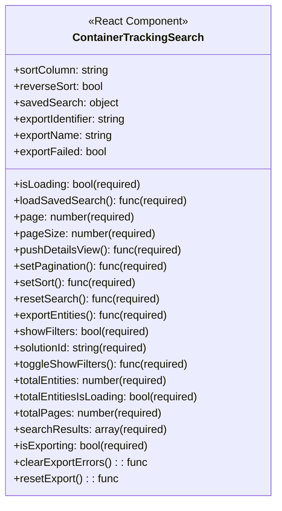

# Diagram: web/portal/src/pages/containertracking/search/ContainerTracking.Search.Page.js


> Auto-generated by Obscura crawlers

## Diagram 1

```mermaid
graph TD
  CTS[ContainerTrackingSearch]
  S[Search Component]
  SSModal[SavedSearchModalContainer]
  SB[SearchBarContainer]
  FC[FiltersContainer]
  COL[columns(t, solutionId)]
  UT[useTranslation("container-tracking")]
  UTTitle[useSetTitleOnMount]
  RCH[rowClickHandler]
  CTS -->|renders| S
  S -->|uses prop: SavedSearchModalContainer| SSModal
  S -->|uses prop: SearchBarContainer| SB
  S -->|uses prop: FiltersContainer| FC
  S -->|uses prop: columns(...)| COL
  CTS -->|calls| UT
  CTS -->|calls| UTTitle
  CTS -->|defines| RCH
  RCH -->|on row click ->| S
  S -->|tableProps includes| RCH
```

> SVG rendering failed for this diagram.

## Diagram 2



### SVG

<svg id="container" width="410.015625" xmlns="http://www.w3.org/2000/svg" class="classDiagram" height="736" viewBox="0 0 410.015625 736" role="graphics-document document" aria-roledescription="class"><style>#container{font-family:"trebuchet ms",verdana,arial,sans-serif;font-size:16px;fill:#333;}@keyframes edge-animation-frame{from{stroke-dashoffset:0;}}@keyframes dash{to{stroke-dashoffset:0;}}#container .edge-animation-slow{stroke-dasharray:9,5!important;stroke-dashoffset:900;animation:dash 50s linear infinite;stroke-linecap:round;}#container .edge-animation-fast{stroke-dasharray:9,5!important;stroke-dashoffset:900;animation:dash 20s linear infinite;stroke-linecap:round;}#container .error-icon{fill:#552222;}#container .error-text{fill:#552222;stroke:#552222;}#container .edge-thickness-normal{stroke-width:1px;}#container .edge-thickness-thick{stroke-width:3.5px;}#container .edge-pattern-solid{stroke-dasharray:0;}#container .edge-thickness-invisible{stroke-width:0;fill:none;}#container .edge-pattern-dashed{stroke-dasharray:3;}#container .edge-pattern-dotted{stroke-dasharray:2;}#container .marker{fill:#333333;stroke:#333333;}#container .marker.cross{stroke:#333333;}#container svg{font-family:"trebuchet ms",verdana,arial,sans-serif;font-size:16px;}#container p{margin:0;}#container g.classGroup text{fill:#9370DB;stroke:none;font-family:"trebuchet ms",verdana,arial,sans-serif;font-size:10px;}#container g.classGroup text .title{font-weight:bolder;}#container .nodeLabel,#container .edgeLabel{color:#131300;}#container .edgeLabel .label rect{fill:#ECECFF;}#container .label text{fill:#131300;}#container .labelBkg{background:#ECECFF;}#container .edgeLabel .label span{background:#ECECFF;}#container .classTitle{font-weight:bolder;}#container .node rect,#container .node circle,#container .node ellipse,#container .node polygon,#container .node path{fill:#ECECFF;stroke:#9370DB;stroke-width:1px;}#container .divider{stroke:#9370DB;stroke-width:1;}#container g.clickable{cursor:pointer;}#container g.classGroup rect{fill:#ECECFF;stroke:#9370DB;}#container g.classGroup line{stroke:#9370DB;stroke-width:1;}#container .classLabel .box{stroke:none;stroke-width:0;fill:#ECECFF;opacity:0.5;}#container .classLabel .label{fill:#9370DB;font-size:10px;}#container .relation{stroke:#333333;stroke-width:1;fill:none;}#container .dashed-line{stroke-dasharray:3;}#container .dotted-line{stroke-dasharray:1 2;}#container #compositionStart,#container .composition{fill:#333333!important;stroke:#333333!important;stroke-width:1;}#container #compositionEnd,#container .composition{fill:#333333!important;stroke:#333333!important;stroke-width:1;}#container #dependencyStart,#container .dependency{fill:#333333!important;stroke:#333333!important;stroke-width:1;}#container #dependencyStart,#container .dependency{fill:#333333!important;stroke:#333333!important;stroke-width:1;}#container #extensionStart,#container .extension{fill:transparent!important;stroke:#333333!important;stroke-width:1;}#container #extensionEnd,#container .extension{fill:transparent!important;stroke:#333333!important;stroke-width:1;}#container #aggregationStart,#container .aggregation{fill:transparent!important;stroke:#333333!important;stroke-width:1;}#container #aggregationEnd,#container .aggregation{fill:transparent!important;stroke:#333333!important;stroke-width:1;}#container #lollipopStart,#container .lollipop{fill:#ECECFF!important;stroke:#333333!important;stroke-width:1;}#container #lollipopEnd,#container .lollipop{fill:#ECECFF!important;stroke:#333333!important;stroke-width:1;}#container .edgeTerminals{font-size:11px;line-height:initial;}#container .classTitleText{text-anchor:middle;font-size:18px;fill:#333;}#container .label-icon{display:inline-block;height:1em;overflow:visible;vertical-align:-0.125em;}#container .node .label-icon path{fill:currentColor;stroke:revert;stroke-width:revert;}#container :root{--mermaid-font-family:"trebuchet ms",verdana,arial,sans-serif;}</style><g><defs><marker id="container_class-aggregationStart" class="marker aggregation class" refX="18" refY="7" markerWidth="190" markerHeight="240" orient="auto"><path d="M 18,7 L9,13 L1,7 L9,1 Z"></path></marker></defs><defs><marker id="container_class-aggregationEnd" class="marker aggregation class" refX="1" refY="7" markerWidth="20" markerHeight="28" orient="auto"><path d="M 18,7 L9,13 L1,7 L9,1 Z"></path></marker></defs><defs><marker id="container_class-extensionStart" class="marker extension class" refX="18" refY="7" markerWidth="190" markerHeight="240" orient="auto"><path d="M 1,7 L18,13 V 1 Z"></path></marker></defs><defs><marker id="container_class-extensionEnd" class="marker extension class" refX="1" refY="7" markerWidth="20" markerHeight="28" orient="auto"><path d="M 1,1 V 13 L18,7 Z"></path></marker></defs><defs><marker id="container_class-compositionStart" class="marker composition class" refX="18" refY="7" markerWidth="190" markerHeight="240" orient="auto"><path d="M 18,7 L9,13 L1,7 L9,1 Z"></path></marker></defs><defs><marker id="container_class-compositionEnd" class="marker composition class" refX="1" refY="7" markerWidth="20" markerHeight="28" orient="auto"><path d="M 18,7 L9,13 L1,7 L9,1 Z"></path></marker></defs><defs><marker id="container_class-dependencyStart" class="marker dependency class" refX="6" refY="7" markerWidth="190" markerHeight="240" orient="auto"><path d="M 5,7 L9,13 L1,7 L9,1 Z"></path></marker></defs><defs><marker id="container_class-dependencyEnd" class="marker dependency class" refX="13" refY="7" markerWidth="20" markerHeight="28" orient="auto"><path d="M 18,7 L9,13 L14,7 L9,1 Z"></path></marker></defs><defs><marker id="container_class-lollipopStart" class="marker lollipop class" refX="13" refY="7" markerWidth="190" markerHeight="240" orient="auto"><circle stroke="black" fill="transparent" cx="7" cy="7" r="6"></circle></marker></defs><defs><marker id="container_class-lollipopEnd" class="marker lollipop class" refX="1" refY="7" markerWidth="190" markerHeight="240" orient="auto"><circle stroke="black" fill="transparent" cx="7" cy="7" r="6"></circle></marker></defs><g class="root"><g class="clusters"></g><g class="edgePaths"></g><g class="edgeLabels"></g><g class="nodes"><g class="node default" id="classId-ContainerTrackingSearch-0" transform="translate(205.0078125, 368)"><g class="basic label-container"><path d="M-197.0078125 -360 L197.0078125 -360 L197.0078125 360 L-197.0078125 360" stroke="none" stroke-width="0" fill="#ECECFF" style=""></path><path d="M-197.0078125 -360 C-52.67702608073316 -360, 91.65376033853369 -360, 197.0078125 -360 M-197.0078125 -360 C-67.5132297801074 -360, 61.98135293978521 -360, 197.0078125 -360 M197.0078125 -360 C197.0078125 -183.28881762704833, 197.0078125 -6.577635254096663, 197.0078125 360 M197.0078125 -360 C197.0078125 -206.12361241542774, 197.0078125 -52.24722483085549, 197.0078125 360 M197.0078125 360 C75.5679779365859 360, -45.87185662682819 360, -197.0078125 360 M197.0078125 360 C64.71188587522079 360, -67.58404074955843 360, -197.0078125 360 M-197.0078125 360 C-197.0078125 77.02134325001009, -197.0078125 -205.95731349997982, -197.0078125 -360 M-197.0078125 360 C-197.0078125 112.24729820604267, -197.0078125 -135.50540358791466, -197.0078125 -360" stroke="#9370DB" stroke-width="1.3" fill="none" stroke-dasharray="0 0" style=""></path></g><g class="annotation-group text" transform="translate(-73.2109375, -336)"><g class="label" style="" transform="translate(0,-12)"><foreignObject width="146.421875" height="24"><div xmlns="http://www.w3.org/1999/xhtml" style="display: table-cell; white-space: nowrap; line-height: 1.5; max-width: 196px; text-align: center;"><span class="nodeLabel markdown-node-label" style=""><p>«React Component»</p></span></div></foreignObject></g></g><g class="label-group text" transform="translate(-91.234375, -312)"><g class="label" style="font-weight: bolder" transform="translate(0,-12)"><foreignObject width="182.46875" height="24"><div xmlns="http://www.w3.org/1999/xhtml" style="display: table-cell; white-space: nowrap; line-height: 1.5; max-width: 229px; text-align: center;"><span class="nodeLabel markdown-node-label" style=""><p>ContainerTrackingSearch</p></span></div></foreignObject></g></g><g class="members-group text" transform="translate(-185.0078125, -264)"><g class="label" style="" transform="translate(0,-12)"><foreignObject width="141.546875" height="24"><div xmlns="http://www.w3.org/1999/xhtml" style="display: table-cell; white-space: nowrap; line-height: 1.5; max-width: 200px; text-align: center;"><span class="nodeLabel markdown-node-label" style=""><p>+sortColumn: string</p></span></div></foreignObject></g><g class="label" style="" transform="translate(0,12)"><foreignObject width="132.046875" height="24"><div xmlns="http://www.w3.org/1999/xhtml" style="display: table-cell; white-space: nowrap; line-height: 1.5; max-width: 190px; text-align: center;"><span class="nodeLabel markdown-node-label" style=""><p>+reverseSort: bool</p></span></div></foreignObject></g><g class="label" style="" transform="translate(0,36)"><foreignObject width="152.125" height="24"><div xmlns="http://www.w3.org/1999/xhtml" style="display: table-cell; white-space: nowrap; line-height: 1.5; max-width: 210px; text-align: center;"><span class="nodeLabel markdown-node-label" style=""><p>+savedSearch: object</p></span></div></foreignObject></g><g class="label" style="" transform="translate(0,60)"><foreignObject width="171.765625" height="24"><div xmlns="http://www.w3.org/1999/xhtml" style="display: table-cell; white-space: nowrap; line-height: 1.5; max-width: 230px; text-align: center;"><span class="nodeLabel markdown-node-label" style=""><p>+exportIdentifier: string</p></span></div></foreignObject></g><g class="label" style="" transform="translate(0,84)"><foreignObject width="146.90625" height="24"><div xmlns="http://www.w3.org/1999/xhtml" style="display: table-cell; white-space: nowrap; line-height: 1.5; max-width: 205px; text-align: center;"><span class="nodeLabel markdown-node-label" style=""><p>+exportName: string</p></span></div></foreignObject></g><g class="label" style="" transform="translate(0,108)"><foreignObject width="139.09375" height="24"><div xmlns="http://www.w3.org/1999/xhtml" style="display: table-cell; white-space: nowrap; line-height: 1.5; max-width: 197px; text-align: center;"><span class="nodeLabel markdown-node-label" style=""><p>+exportFailed: bool</p></span></div></foreignObject></g></g><g class="methods-group text" transform="translate(-185.0078125, -96)"><g class="label" style="" transform="translate(0,-12)"><foreignObject width="190.328125" height="24"><div xmlns="http://www.w3.org/1999/xhtml" style="display: table-cell; white-space: nowrap; line-height: 1.5; max-width: 248px; text-align: center;"><span class="nodeLabel markdown-node-label" style=""><p>+isLoading: bool(required)</p></span></div></foreignObject></g><g class="label" style="" transform="translate(0,12)"><foreignObject width="254.34375" height="24"><div xmlns="http://www.w3.org/1999/xhtml" style="display: table-cell; white-space: nowrap; line-height: 1.5; max-width: 312px; text-align: center;"><span class="nodeLabel markdown-node-label" style=""><p>+loadSavedSearch(): func(required)</p></span></div></foreignObject></g><g class="label" style="" transform="translate(0,36)"><foreignObject width="179.703125" height="24"><div xmlns="http://www.w3.org/1999/xhtml" style="display: table-cell; white-space: nowrap; line-height: 1.5; max-width: 237px; text-align: center;"><span class="nodeLabel markdown-node-label" style=""><p>+page: number(required)</p></span></div></foreignObject></g><g class="label" style="" transform="translate(0,60)"><foreignObject width="208.53125" height="24"><div xmlns="http://www.w3.org/1999/xhtml" style="display: table-cell; white-space: nowrap; line-height: 1.5; max-width: 266px; text-align: center;"><span class="nodeLabel markdown-node-label" style=""><p>+pageSize: number(required)</p></span></div></foreignObject></g><g class="label" style="" transform="translate(0,84)"><foreignObject width="249.625" height="24"><div xmlns="http://www.w3.org/1999/xhtml" style="display: table-cell; white-space: nowrap; line-height: 1.5; max-width: 307px; text-align: center;"><span class="nodeLabel markdown-node-label" style=""><p>+pushDetailsView(): func(required)</p></span></div></foreignObject></g><g class="label" style="" transform="translate(0,108)"><foreignObject width="229.140625" height="24"><div xmlns="http://www.w3.org/1999/xhtml" style="display: table-cell; white-space: nowrap; line-height: 1.5; max-width: 287px; text-align: center;"><span class="nodeLabel markdown-node-label" style=""><p>+setPagination(): func(required)</p></span></div></foreignObject></g><g class="label" style="" transform="translate(0,132)"><foreignObject width="182.28125" height="24"><div xmlns="http://www.w3.org/1999/xhtml" style="display: table-cell; white-space: nowrap; line-height: 1.5; max-width: 240px; text-align: center;"><span class="nodeLabel markdown-node-label" style=""><p>+setSort(): func(required)</p></span></div></foreignObject></g><g class="label" style="" transform="translate(0,156)"><foreignObject width="215.390625" height="24"><div xmlns="http://www.w3.org/1999/xhtml" style="display: table-cell; white-space: nowrap; line-height: 1.5; max-width: 273px; text-align: center;"><span class="nodeLabel markdown-node-label" style=""><p>+resetSearch(): func(required)</p></span></div></foreignObject></g><g class="label" style="" transform="translate(0,180)"><foreignObject width="231.96875" height="24"><div xmlns="http://www.w3.org/1999/xhtml" style="display: table-cell; white-space: nowrap; line-height: 1.5; max-width: 289px; text-align: center;"><span class="nodeLabel markdown-node-label" style=""><p>+exportEntities(): func(required)</p></span></div></foreignObject></g><g class="label" style="" transform="translate(0,204)"><foreignObject width="202.9375" height="24"><div xmlns="http://www.w3.org/1999/xhtml" style="display: table-cell; white-space: nowrap; line-height: 1.5; max-width: 260px; text-align: center;"><span class="nodeLabel markdown-node-label" style=""><p>+showFilters: bool(required)</p></span></div></foreignObject></g><g class="label" style="" transform="translate(0,228)"><foreignObject width="203.96875" height="24"><div xmlns="http://www.w3.org/1999/xhtml" style="display: table-cell; white-space: nowrap; line-height: 1.5; max-width: 261px; text-align: center;"><span class="nodeLabel markdown-node-label" style=""><p>+solutionId: string(required)</p></span></div></foreignObject></g><g class="label" style="" transform="translate(0,252)"><foreignObject width="258.140625" height="24"><div xmlns="http://www.w3.org/1999/xhtml" style="display: table-cell; white-space: nowrap; line-height: 1.5; max-width: 316px; text-align: center;"><span class="nodeLabel markdown-node-label" style=""><p>+toggleShowFilters(): func(required)</p></span></div></foreignObject></g><g class="label" style="" transform="translate(0,276)"><foreignObject width="233.265625" height="24"><div xmlns="http://www.w3.org/1999/xhtml" style="display: table-cell; white-space: nowrap; line-height: 1.5; max-width: 291px; text-align: center;"><span class="nodeLabel markdown-node-label" style=""><p>+totalEntities: number(required)</p></span></div></foreignObject></g><g class="label" style="" transform="translate(0,300)"><foreignObject width="278.78125" height="24"><div xmlns="http://www.w3.org/1999/xhtml" style="display: table-cell; white-space: nowrap; line-height: 1.5; max-width: 336px; text-align: center;"><span class="nodeLabel markdown-node-label" style=""><p>+totalEntitiesIsLoading: bool(required)</p></span></div></foreignObject></g><g class="label" style="" transform="translate(0,324)"><foreignObject width="219.9375" height="24"><div xmlns="http://www.w3.org/1999/xhtml" style="display: table-cell; white-space: nowrap; line-height: 1.5; max-width: 277px; text-align: center;"><span class="nodeLabel markdown-node-label" style=""><p>+totalPages: number(required)</p></span></div></foreignObject></g><g class="label" style="" transform="translate(0,348)"><foreignObject width="225.40625" height="24"><div xmlns="http://www.w3.org/1999/xhtml" style="display: table-cell; white-space: nowrap; line-height: 1.5; max-width: 283px; text-align: center;"><span class="nodeLabel markdown-node-label" style=""><p>+searchResults: array(required)</p></span></div></foreignObject></g><g class="label" style="" transform="translate(0,372)"><foreignObject width="202.421875" height="24"><div xmlns="http://www.w3.org/1999/xhtml" style="display: table-cell; white-space: nowrap; line-height: 1.5; max-width: 260px; text-align: center;"><span class="nodeLabel markdown-node-label" style=""><p>+isExporting: bool(required)</p></span></div></foreignObject></g><g class="label" style="" transform="translate(0,396)"><foreignObject width="196.296875" height="24"><div xmlns="http://www.w3.org/1999/xhtml" style="display: table-cell; white-space: nowrap; line-height: 1.5; max-width: 254px; text-align: center;"><span class="nodeLabel markdown-node-label" style=""><p>+clearExportErrors() : : func</p></span></div></foreignObject></g><g class="label" style="" transform="translate(0,420)"><foreignObject width="153.953125" height="24"><div xmlns="http://www.w3.org/1999/xhtml" style="display: table-cell; white-space: nowrap; line-height: 1.5; max-width: 212px; text-align: center;"><span class="nodeLabel markdown-node-label" style=""><p>+resetExport() : : func</p></span></div></foreignObject></g></g><g class="divider" style=""><path d="M-197.0078125 -288 C-89.47512752169801 -288, 18.057557456603973 -288, 197.0078125 -288 M-197.0078125 -288 C-89.69198665124978 -288, 17.623839197500445 -288, 197.0078125 -288" stroke="#9370DB" stroke-width="1.3" fill="none" stroke-dasharray="0 0" style=""></path></g><g class="divider" style=""><path d="M-197.0078125 -120 C-49.88664254597907 -120, 97.23452740804186 -120, 197.0078125 -120 M-197.0078125 -120 C-114.178894512672 -120, -31.349976525344005 -120, 197.0078125 -120" stroke="#9370DB" stroke-width="1.3" fill="none" stroke-dasharray="0 0" style=""></path></g></g></g></g></g></svg>
