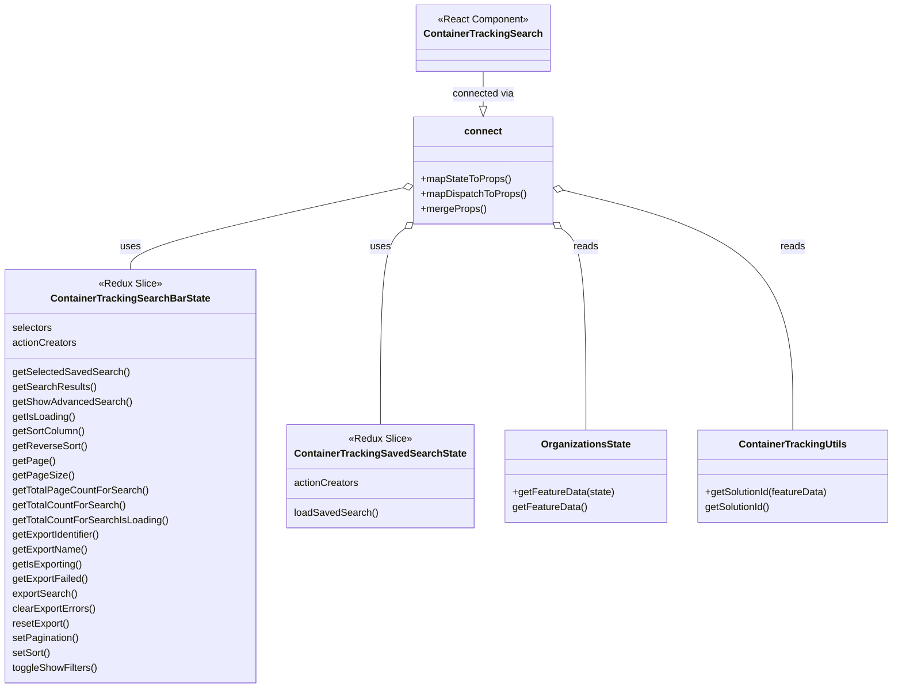

# Diagram: web/portal/src/pages/containertracking/search/ContainerTracking.Search.page.container.js


> Auto-generated by Obscura crawlers

## Diagram 1

```mermaid
flowchart LR
  State[Redux State] -->|getFeatureData(state)| GetFeatureData[getFeatureData]
  GetFeatureData -->|getSolutionId(...)| SolutionId[getSolutionId]
  State --> CTSB[ContainerTrackingSearchBarState.selectors]
  CTSB --> SavedSearch[getSelectedSavedSearch()]
  CTSB --> SearchResults[getSearchResults()]
  CTSB --> ShowFilters[getShowAdvancedSearch()]
  CTSB --> IsLoading[getIsLoading()]
  CTSB --> SortColumn[getSortColumn()]
  CTSB --> ReverseSort[getReverseSort()]
  CTSB --> Page[getPage()]
  CTSB --> PageSize[getPageSize()]
  CTSB --> TotalPages[getTotalPageCountForSearch()]
  CTSB --> TotalEntities[getTotalCountForSearch()]
  CTSB --> TotalEntitiesLoading[getTotalCountForSearchIsLoading()]
  CTSB --> ExportIdentifier[getExportIdentifier()]
  CTSB --> ExportName[getExportName()]
  CTSB --> IsExporting[getIsExporting()]
  CTSB --> ExportFailed[getExportFailed()]
  SolutionId --> MapState[mapStateToProps]
  SavedSearch --> MapState
  SearchResults --> MapState
  ShowFilters --> MapState
  IsLoading --> MapState
  SortColumn --> MapState
  ReverseSort --> MapState
  Page --> MapState
  PageSize --> MapState
  TotalPages --> MapState
  TotalEntities --> MapState
  TotalEntitiesLoading --> MapState
  ExportIdentifier --> MapState
  ExportName --> MapState
  IsExporting --> MapState
  ExportFailed --> MapState
  MapState --> ConnectedProps[props]
  Dispatch[dispatch] --> MDT[mapDispatchToProps]
  MDT -->|loadSavedSearch(savedSearch)| Action_LoadSaved[loadSavedSearch -> ContainerTrackingSavedSearchState.actionCreators.loadSavedSearch]
  MDT -->|pushDetailsView(id)| Action_Push[dispatch {CONTAINER_TRACKING_DETAILS}]
  MDT -->|toggleShowFilters(showFilters)| Action_Toggle[actionCreators.toggleShowFilters]
  MDT -->|setPagination(...)| Action_Pagination[actionCreators.setPagination]
  MDT -->|setSort(...)| Action_SetSort[actionCreators.setSort]
  MDT -->|exportEntities(solutionId)| Action_Export[actionCreators.exportSearch]
  MDT -->|clearExportErrors()| Action_Clear[actionCreators.clearExportErrors]
  MDT -->|resetSearch(solutionId)| Action_Reset[actionCreators.resetSearchAndFilters + searchEntities]
  MDT -->|resetExport()| Action_ResetExport[actionCreators.resetExport]
  ConnectedProps --> Merge[mergeProps(stateProps, dispatchProps, ownProps)]
  Merge --> FinalProps[final props]
  FinalProps --> ConnectedComponent[connect(...) -> ContainerTrackingSearch]
```

> SVG rendering failed for this diagram.

## Diagram 2



### SVG

<svg id="container" width="1423.0390625" xmlns="http://www.w3.org/2000/svg" class="classDiagram" height="1118" viewBox="0 0 1423.0390625 1118" role="graphics-document document" aria-roledescription="class"><style>#container{font-family:"trebuchet ms",verdana,arial,sans-serif;font-size:16px;fill:#333;}@keyframes edge-animation-frame{from{stroke-dashoffset:0;}}@keyframes dash{to{stroke-dashoffset:0;}}#container .edge-animation-slow{stroke-dasharray:9,5!important;stroke-dashoffset:900;animation:dash 50s linear infinite;stroke-linecap:round;}#container .edge-animation-fast{stroke-dasharray:9,5!important;stroke-dashoffset:900;animation:dash 20s linear infinite;stroke-linecap:round;}#container .error-icon{fill:#552222;}#container .error-text{fill:#552222;stroke:#552222;}#container .edge-thickness-normal{stroke-width:1px;}#container .edge-thickness-thick{stroke-width:3.5px;}#container .edge-pattern-solid{stroke-dasharray:0;}#container .edge-thickness-invisible{stroke-width:0;fill:none;}#container .edge-pattern-dashed{stroke-dasharray:3;}#container .edge-pattern-dotted{stroke-dasharray:2;}#container .marker{fill:#333333;stroke:#333333;}#container .marker.cross{stroke:#333333;}#container svg{font-family:"trebuchet ms",verdana,arial,sans-serif;font-size:16px;}#container p{margin:0;}#container g.classGroup text{fill:#9370DB;stroke:none;font-family:"trebuchet ms",verdana,arial,sans-serif;font-size:10px;}#container g.classGroup text .title{font-weight:bolder;}#container .nodeLabel,#container .edgeLabel{color:#131300;}#container .edgeLabel .label rect{fill:#ECECFF;}#container .label text{fill:#131300;}#container .labelBkg{background:#ECECFF;}#container .edgeLabel .label span{background:#ECECFF;}#container .classTitle{font-weight:bolder;}#container .node rect,#container .node circle,#container .node ellipse,#container .node polygon,#container .node path{fill:#ECECFF;stroke:#9370DB;stroke-width:1px;}#container .divider{stroke:#9370DB;stroke-width:1;}#container g.clickable{cursor:pointer;}#container g.classGroup rect{fill:#ECECFF;stroke:#9370DB;}#container g.classGroup line{stroke:#9370DB;stroke-width:1;}#container .classLabel .box{stroke:none;stroke-width:0;fill:#ECECFF;opacity:0.5;}#container .classLabel .label{fill:#9370DB;font-size:10px;}#container .relation{stroke:#333333;stroke-width:1;fill:none;}#container .dashed-line{stroke-dasharray:3;}#container .dotted-line{stroke-dasharray:1 2;}#container #compositionStart,#container .composition{fill:#333333!important;stroke:#333333!important;stroke-width:1;}#container #compositionEnd,#container .composition{fill:#333333!important;stroke:#333333!important;stroke-width:1;}#container #dependencyStart,#container .dependency{fill:#333333!important;stroke:#333333!important;stroke-width:1;}#container #dependencyStart,#container .dependency{fill:#333333!important;stroke:#333333!important;stroke-width:1;}#container #extensionStart,#container .extension{fill:transparent!important;stroke:#333333!important;stroke-width:1;}#container #extensionEnd,#container .extension{fill:transparent!important;stroke:#333333!important;stroke-width:1;}#container #aggregationStart,#container .aggregation{fill:transparent!important;stroke:#333333!important;stroke-width:1;}#container #aggregationEnd,#container .aggregation{fill:transparent!important;stroke:#333333!important;stroke-width:1;}#container #lollipopStart,#container .lollipop{fill:#ECECFF!important;stroke:#333333!important;stroke-width:1;}#container #lollipopEnd,#container .lollipop{fill:#ECECFF!important;stroke:#333333!important;stroke-width:1;}#container .edgeTerminals{font-size:11px;line-height:initial;}#container .classTitleText{text-anchor:middle;font-size:18px;fill:#333;}#container .label-icon{display:inline-block;height:1em;overflow:visible;vertical-align:-0.125em;}#container .node .label-icon path{fill:currentColor;stroke:revert;stroke-width:revert;}#container :root{--mermaid-font-family:"trebuchet ms",verdana,arial,sans-serif;}</style><g><defs><marker id="container_class-aggregationStart" class="marker aggregation class" refX="18" refY="7" markerWidth="190" markerHeight="240" orient="auto"><path d="M 18,7 L9,13 L1,7 L9,1 Z"></path></marker></defs><defs><marker id="container_class-aggregationEnd" class="marker aggregation class" refX="1" refY="7" markerWidth="20" markerHeight="28" orient="auto"><path d="M 18,7 L9,13 L1,7 L9,1 Z"></path></marker></defs><defs><marker id="container_class-extensionStart" class="marker extension class" refX="18" refY="7" markerWidth="190" markerHeight="240" orient="auto"><path d="M 1,7 L18,13 V 1 Z"></path></marker></defs><defs><marker id="container_class-extensionEnd" class="marker extension class" refX="1" refY="7" markerWidth="20" markerHeight="28" orient="auto"><path d="M 1,1 V 13 L18,7 Z"></path></marker></defs><defs><marker id="container_class-compositionStart" class="marker composition class" refX="18" refY="7" markerWidth="190" markerHeight="240" orient="auto"><path d="M 18,7 L9,13 L1,7 L9,1 Z"></path></marker></defs><defs><marker id="container_class-compositionEnd" class="marker composition class" refX="1" refY="7" markerWidth="20" markerHeight="28" orient="auto"><path d="M 18,7 L9,13 L1,7 L9,1 Z"></path></marker></defs><defs><marker id="container_class-dependencyStart" class="marker dependency class" refX="6" refY="7" markerWidth="190" markerHeight="240" orient="auto"><path d="M 5,7 L9,13 L1,7 L9,1 Z"></path></marker></defs><defs><marker id="container_class-dependencyEnd" class="marker dependency class" refX="13" refY="7" markerWidth="20" markerHeight="28" orient="auto"><path d="M 18,7 L9,13 L14,7 L9,1 Z"></path></marker></defs><defs><marker id="container_class-lollipopStart" class="marker lollipop class" refX="13" refY="7" markerWidth="190" markerHeight="240" orient="auto"><circle stroke="black" fill="transparent" cx="7" cy="7" r="6"></circle></marker></defs><defs><marker id="container_class-lollipopEnd" class="marker lollipop class" refX="1" refY="7" markerWidth="190" markerHeight="240" orient="auto"><circle stroke="black" fill="transparent" cx="7" cy="7" r="6"></circle></marker></defs><g class="root"><g class="clusters"></g><g class="edgePaths"><path d="M764.869,116L764.869,122.167C764.869,128.333,764.869,140.667,764.869,150.125C764.869,159.583,764.869,166.167,764.869,169.458L764.869,172.75" id="id_ContainerTrackingSearch_connect_1" class="edge-thickness-normal edge-pattern-solid relation" style=";;;" data-edge="true" data-et="edge" data-id="id_ContainerTrackingSearch_connect_1" data-points="W3sieCI6NzY0Ljg2OTE0MDYyNSwieSI6MTE2fSx7IngiOjc2NC44NjkxNDA2MjUsInkiOjE1M30seyJ4Ijo3NjQuODY5MTQwNjI1LCJ5IjoxOTB9XQ==" marker-end="url(#container_class-extensionEnd)"></path><path d="M636.121,305.644L564.687,321.537C493.252,337.429,350.384,369.215,278.95,391.274C207.516,413.333,207.516,425.667,207.516,431.833L207.516,438" id="id_connect_ContainerTrackingSearchBarState_2" class="edge-thickness-normal edge-pattern-solid relation" style=";;;" data-edge="true" data-et="edge" data-id="id_connect_ContainerTrackingSearchBarState_2" data-points="W3sieCI6NjUyLjk1ODk4NDM3NSwieSI6MzAxLjg5Nzc2OTUyMzI0MjJ9LHsieCI6MjA3LjUxNTYyNSwieSI6NDAxfSx7IngiOjIwNy41MTU2MjUsInkiOjQzOH1d" marker-start="url(#container_class-aggregationStart)"></path><path d="M639.252,372.97L633.137,377.642C627.022,382.313,614.792,391.657,608.677,444.495C602.563,497.333,602.563,593.667,602.563,641.833L602.563,690" id="id_connect_ContainerTrackingSavedSearchState_3" class="edge-thickness-normal edge-pattern-solid relation" style=";;;" data-edge="true" data-et="edge" data-id="id_connect_ContainerTrackingSavedSearchState_3" data-points="W3sieCI6NjUyLjk1ODk4NDM3NSwieSI6MzYyLjQ5Nzc5MTg0MzY2MDE0fSx7IngiOjYwMi41NjI1LCJ5Ijo0MDF9LHsieCI6NjAyLjU2MjUsInkiOjY5MH1d" marker-start="url(#container_class-aggregationStart)"></path><path d="M890.487,372.97L896.602,377.642C902.716,382.313,914.946,391.657,921.061,445.995C927.176,500.333,927.176,599.667,927.176,649.333L927.176,699" id="id_connect_OrganizationsState_4" class="edge-thickness-normal edge-pattern-solid relation" style=";;;" data-edge="true" data-et="edge" data-id="id_connect_OrganizationsState_4" data-points="W3sieCI6ODc2Ljc3OTI5Njg3NSwieSI6MzYyLjQ5Nzc5MTg0MzY2MDE0fSx7IngiOjkyNy4xNzU3ODEyNSwieSI6NDAxfSx7IngiOjkyNy4xNzU3ODEyNSwieSI6Njk5fV0=" marker-start="url(#container_class-aggregationStart)"></path><path d="M893.514,309.175L954.703,324.48C1015.892,339.784,1138.27,370.392,1199.459,435.363C1260.648,500.333,1260.648,599.667,1260.648,649.333L1260.648,699" id="id_connect_ContainerTrackingUtils_5" class="edge-thickness-normal edge-pattern-solid relation" style=";;;" data-edge="true" data-et="edge" data-id="id_connect_ContainerTrackingUtils_5" data-points="W3sieCI6ODc2Ljc3OTI5Njg3NSwieSI6MzA0Ljk4OTk5MzY1NzM5N30seyJ4IjoxMjYwLjY0ODQzNzUsInkiOjQwMX0seyJ4IjoxMjYwLjY0ODQzNzUsInkiOjY5OX1d" marker-start="url(#container_class-aggregationStart)"></path></g><g class="edgeLabels"><g class="edgeLabel" transform="translate(764.869140625, 153)"><g class="label" data-id="id_ContainerTrackingSearch_connect_1" transform="translate(-50.4765625, -12)"><foreignObject width="100.953125" height="24"><div xmlns="http://www.w3.org/1999/xhtml" class="labelBkg" style="display: table-cell; white-space: nowrap; line-height: 1.5; max-width: 200px; text-align: center;"><span class="edgeLabel"><p>connected via</p></span></div></foreignObject></g></g><g class="edgeLabel" transform="translate(207.515625, 401)"><g class="label" data-id="id_connect_ContainerTrackingSearchBarState_2" transform="translate(-16.4921875, -12)"><foreignObject width="32.984375" height="24"><div xmlns="http://www.w3.org/1999/xhtml" class="labelBkg" style="display: table-cell; white-space: nowrap; line-height: 1.5; max-width: 200px; text-align: center;"><span class="edgeLabel"><p>uses</p></span></div></foreignObject></g></g><g class="edgeLabel" transform="translate(602.5625, 401)"><g class="label" data-id="id_connect_ContainerTrackingSavedSearchState_3" transform="translate(-16.4921875, -12)"><foreignObject width="32.984375" height="24"><div xmlns="http://www.w3.org/1999/xhtml" class="labelBkg" style="display: table-cell; white-space: nowrap; line-height: 1.5; max-width: 200px; text-align: center;"><span class="edgeLabel"><p>uses</p></span></div></foreignObject></g></g><g class="edgeLabel" transform="translate(927.17578125, 401)"><g class="label" data-id="id_connect_OrganizationsState_4" transform="translate(-20.0078125, -12)"><foreignObject width="40.015625" height="24"><div xmlns="http://www.w3.org/1999/xhtml" class="labelBkg" style="display: table-cell; white-space: nowrap; line-height: 1.5; max-width: 200px; text-align: center;"><span class="edgeLabel"><p>reads</p></span></div></foreignObject></g></g><g class="edgeLabel" transform="translate(1260.6484375, 401)"><g class="label" data-id="id_connect_ContainerTrackingUtils_5" transform="translate(-20.0078125, -12)"><foreignObject width="40.015625" height="24"><div xmlns="http://www.w3.org/1999/xhtml" class="labelBkg" style="display: table-cell; white-space: nowrap; line-height: 1.5; max-width: 200px; text-align: center;"><span class="edgeLabel"><p>reads</p></span></div></foreignObject></g></g></g><g class="nodes"><g class="node default" id="classId-ContainerTrackingSearch-0" transform="translate(764.869140625, 62)"><g class="basic label-container"><path d="M-103.234375 -54 L103.234375 -54 L103.234375 54 L-103.234375 54" stroke="none" stroke-width="0" fill="#ECECFF" style=""></path><path d="M-103.234375 -54 C-51.098741408105376 -54, 1.0368921837892486 -54, 103.234375 -54 M-103.234375 -54 C-24.798627075927115 -54, 53.63712084814577 -54, 103.234375 -54 M103.234375 -54 C103.234375 -21.38184819255897, 103.234375 11.236303614882061, 103.234375 54 M103.234375 -54 C103.234375 -16.820516463471627, 103.234375 20.358967073056746, 103.234375 54 M103.234375 54 C23.481953898995158 54, -56.270467202009684 54, -103.234375 54 M103.234375 54 C51.390457896605085 54, -0.4534592067898302 54, -103.234375 54 M-103.234375 54 C-103.234375 28.233340417250727, -103.234375 2.466680834501453, -103.234375 -54 M-103.234375 54 C-103.234375 26.250515604792845, -103.234375 -1.4989687904143096, -103.234375 -54" stroke="#9370DB" stroke-width="1.3" fill="none" stroke-dasharray="0 0" style=""></path></g><g class="annotation-group text" transform="translate(-73.2109375, -30)"><g class="label" style="" transform="translate(0,-12)"><foreignObject width="146.421875" height="24"><div xmlns="http://www.w3.org/1999/xhtml" style="display: table-cell; white-space: nowrap; line-height: 1.5; max-width: 196px; text-align: center;"><span class="nodeLabel markdown-node-label" style=""><p>«React Component»</p></span></div></foreignObject></g></g><g class="label-group text" transform="translate(-91.234375, -6)"><g class="label" style="font-weight: bolder" transform="translate(0,-12)"><foreignObject width="182.46875" height="24"><div xmlns="http://www.w3.org/1999/xhtml" style="display: table-cell; white-space: nowrap; line-height: 1.5; max-width: 229px; text-align: center;"><span class="nodeLabel markdown-node-label" style=""><p>ContainerTrackingSearch</p></span></div></foreignObject></g></g><g class="members-group text" transform="translate(-91.234375, 42)"></g><g class="methods-group text" transform="translate(-91.234375, 72)"></g><g class="divider" style=""><path d="M-103.234375 18 C-56.73142315865241 18, -10.228471317304823 18, 103.234375 18 M-103.234375 18 C-40.27610305652373 18, 22.68216888695254 18, 103.234375 18" stroke="#9370DB" stroke-width="1.3" fill="none" stroke-dasharray="0 0" style=""></path></g><g class="divider" style=""><path d="M-103.234375 36 C-38.331041430591654 36, 26.572292138816692 36, 103.234375 36 M-103.234375 36 C-51.92268302257621 36, -0.6109910451524172 36, 103.234375 36" stroke="#9370DB" stroke-width="1.3" fill="none" stroke-dasharray="0 0" style=""></path></g></g><g class="node default" id="classId-connect-1" transform="translate(764.869140625, 277)"><g class="basic label-container"><path d="M-111.91015625 -87 L111.91015625 -87 L111.91015625 87 L-111.91015625 87" stroke="none" stroke-width="0" fill="#ECECFF" style=""></path><path d="M-111.91015625 -87 C-65.3862198710927 -87, -18.862283492185412 -87, 111.91015625 -87 M-111.91015625 -87 C-48.02326135782444 -87, 15.863633534351123 -87, 111.91015625 -87 M111.91015625 -87 C111.91015625 -31.28515916268656, 111.91015625 24.429681674626877, 111.91015625 87 M111.91015625 -87 C111.91015625 -21.618072941949265, 111.91015625 43.76385411610147, 111.91015625 87 M111.91015625 87 C58.2785180351172 87, 4.646879820234403 87, -111.91015625 87 M111.91015625 87 C31.31126764129087 87, -49.28762096741826 87, -111.91015625 87 M-111.91015625 87 C-111.91015625 22.33488200385129, -111.91015625 -42.33023599229742, -111.91015625 -87 M-111.91015625 87 C-111.91015625 35.77001569969063, -111.91015625 -15.459968600618737, -111.91015625 -87" stroke="#9370DB" stroke-width="1.3" fill="none" stroke-dasharray="0 0" style=""></path></g><g class="annotation-group text" transform="translate(0, -63)"></g><g class="label-group text" transform="translate(-28.9140625, -63)"><g class="label" style="font-weight: bolder" transform="translate(0,-12)"><foreignObject width="57.828125" height="24"><div xmlns="http://www.w3.org/1999/xhtml" style="display: table-cell; white-space: nowrap; line-height: 1.5; max-width: 108px; text-align: center;"><span class="nodeLabel markdown-node-label" style=""><p>connect</p></span></div></foreignObject></g></g><g class="members-group text" transform="translate(-99.91015625, -15)"></g><g class="methods-group text" transform="translate(-99.91015625, 15)"><g class="label" style="" transform="translate(0,-12)"><foreignObject width="145.359375" height="24"><div xmlns="http://www.w3.org/1999/xhtml" style="display: table-cell; white-space: nowrap; line-height: 1.5; max-width: 203px; text-align: center;"><span class="nodeLabel markdown-node-label" style=""><p>+mapStateToProps()</p></span></div></foreignObject></g><g class="label" style="" transform="translate(0,12)"><foreignObject width="170.90625" height="24"><div xmlns="http://www.w3.org/1999/xhtml" style="display: table-cell; white-space: nowrap; line-height: 1.5; max-width: 228px; text-align: center;"><span class="nodeLabel markdown-node-label" style=""><p>+mapDispatchToProps()</p></span></div></foreignObject></g><g class="label" style="" transform="translate(0,36)"><foreignObject width="104.5" height="24"><div xmlns="http://www.w3.org/1999/xhtml" style="display: table-cell; white-space: nowrap; line-height: 1.5; max-width: 162px; text-align: center;"><span class="nodeLabel markdown-node-label" style=""><p>+mergeProps()</p></span></div></foreignObject></g></g><g class="divider" style=""><path d="M-111.91015625 -39 C-38.058797382244705 -39, 35.79256148551059 -39, 111.91015625 -39 M-111.91015625 -39 C-63.422162253853514 -39, -14.934168257707029 -39, 111.91015625 -39" stroke="#9370DB" stroke-width="1.3" fill="none" stroke-dasharray="0 0" style=""></path></g><g class="divider" style=""><path d="M-111.91015625 -15 C-66.26595803889609 -15, -20.621759827792175 -15, 111.91015625 -15 M-111.91015625 -15 C-27.010710454827958 -15, 57.888735340344084 -15, 111.91015625 -15" stroke="#9370DB" stroke-width="1.3" fill="none" stroke-dasharray="0 0" style=""></path></g></g><g class="node default" id="classId-ContainerTrackingSearchBarState-2" transform="translate(207.515625, 774)"><g class="basic label-container"><path d="M-199.515625 -336 L199.515625 -336 L199.515625 336 L-199.515625 336" stroke="none" stroke-width="0" fill="#ECECFF" style=""></path><path d="M-199.515625 -336 C-118.4888621480253 -336, -37.46209929605061 -336, 199.515625 -336 M-199.515625 -336 C-90.15107963488937 -336, 19.21346573022126 -336, 199.515625 -336 M199.515625 -336 C199.515625 -197.85692902547606, 199.515625 -59.713858050952126, 199.515625 336 M199.515625 -336 C199.515625 -177.16451330094614, 199.515625 -18.32902660189228, 199.515625 336 M199.515625 336 C90.26203685230644 336, -18.991551295387126 336, -199.515625 336 M199.515625 336 C73.63264926770675 336, -52.25032646458649 336, -199.515625 336 M-199.515625 336 C-199.515625 196.03726789334246, -199.515625 56.07453578668492, -199.515625 -336 M-199.515625 336 C-199.515625 200.53457580101127, -199.515625 65.06915160202254, -199.515625 -336" stroke="#9370DB" stroke-width="1.3" fill="none" stroke-dasharray="0 0" style=""></path></g><g class="annotation-group text" transform="translate(-50.4765625, -312)"><g class="label" style="" transform="translate(0,-12)"><foreignObject width="100.953125" height="24"><div xmlns="http://www.w3.org/1999/xhtml" style="display: table-cell; white-space: nowrap; line-height: 1.5; max-width: 151px; text-align: center;"><span class="nodeLabel markdown-node-label" style=""><p>«Redux Slice»</p></span></div></foreignObject></g></g><g class="label-group text" transform="translate(-123.078125, -288)"><g class="label" style="font-weight: bolder" transform="translate(0,-12)"><foreignObject width="246.15625" height="24"><div xmlns="http://www.w3.org/1999/xhtml" style="display: table-cell; white-space: nowrap; line-height: 1.5; max-width: 291px; text-align: center;"><span class="nodeLabel markdown-node-label" style=""><p>ContainerTrackingSearchBarState</p></span></div></foreignObject></g></g><g class="members-group text" transform="translate(-187.515625, -240)"><g class="label" style="" transform="translate(0,-12)"><foreignObject width="65.46875" height="24"><div xmlns="http://www.w3.org/1999/xhtml" style="display: table-cell; white-space: nowrap; line-height: 1.5; max-width: 115px; text-align: center;"><span class="nodeLabel markdown-node-label" style=""><p>selectors</p></span></div></foreignObject></g><g class="label" style="" transform="translate(0,12)"><foreignObject width="105.34375" height="24"><div xmlns="http://www.w3.org/1999/xhtml" style="display: table-cell; white-space: nowrap; line-height: 1.5; max-width: 155px; text-align: center;"><span class="nodeLabel markdown-node-label" style=""><p>actionCreators</p></span></div></foreignObject></g></g><g class="methods-group text" transform="translate(-187.515625, -168)"><g class="label" style="" transform="translate(0,-12)"><foreignObject width="187.15625" height="24"><div xmlns="http://www.w3.org/1999/xhtml" style="display: table-cell; white-space: nowrap; line-height: 1.5; max-width: 237px; text-align: center;"><span class="nodeLabel markdown-node-label" style=""><p>getSelectedSavedSearch()</p></span></div></foreignObject></g><g class="label" style="" transform="translate(0,12)"><foreignObject width="134.515625" height="24"><div xmlns="http://www.w3.org/1999/xhtml" style="display: table-cell; white-space: nowrap; line-height: 1.5; max-width: 185px; text-align: center;"><span class="nodeLabel markdown-node-label" style=""><p>getSearchResults()</p></span></div></foreignObject></g><g class="label" style="" transform="translate(0,36)"><foreignObject width="190.59375" height="24"><div xmlns="http://www.w3.org/1999/xhtml" style="display: table-cell; white-space: nowrap; line-height: 1.5; max-width: 241px; text-align: center;"><span class="nodeLabel markdown-node-label" style=""><p>getShowAdvancedSearch()</p></span></div></foreignObject></g><g class="label" style="" transform="translate(0,60)"><foreignObject width="102.359375" height="24"><div xmlns="http://www.w3.org/1999/xhtml" style="display: table-cell; white-space: nowrap; line-height: 1.5; max-width: 152px; text-align: center;"><span class="nodeLabel markdown-node-label" style=""><p>getIsLoading()</p></span></div></foreignObject></g><g class="label" style="" transform="translate(0,84)"><foreignObject width="118.03125" height="24"><div xmlns="http://www.w3.org/1999/xhtml" style="display: table-cell; white-space: nowrap; line-height: 1.5; max-width: 168px; text-align: center;"><span class="nodeLabel markdown-node-label" style=""><p>getSortColumn()</p></span></div></foreignObject></g><g class="label" style="" transform="translate(0,108)"><foreignObject width="119.703125" height="24"><div xmlns="http://www.w3.org/1999/xhtml" style="display: table-cell; white-space: nowrap; line-height: 1.5; max-width: 170px; text-align: center;"><span class="nodeLabel markdown-node-label" style=""><p>getReverseSort()</p></span></div></foreignObject></g><g class="label" style="" transform="translate(0,132)"><foreignObject width="66.6875" height="24"><div xmlns="http://www.w3.org/1999/xhtml" style="display: table-cell; white-space: nowrap; line-height: 1.5; max-width: 117px; text-align: center;"><span class="nodeLabel markdown-node-label" style=""><p>getPage()</p></span></div></foreignObject></g><g class="label" style="" transform="translate(0,156)"><foreignObject width="95.515625" height="24"><div xmlns="http://www.w3.org/1999/xhtml" style="display: table-cell; white-space: nowrap; line-height: 1.5; max-width: 146px; text-align: center;"><span class="nodeLabel markdown-node-label" style=""><p>getPageSize()</p></span></div></foreignObject></g><g class="label" style="" transform="translate(0,180)"><foreignObject width="216.28125" height="24"><div xmlns="http://www.w3.org/1999/xhtml" style="display: table-cell; white-space: nowrap; line-height: 1.5; max-width: 266px; text-align: center;"><span class="nodeLabel markdown-node-label" style=""><p>getTotalPageCountForSearch()</p></span></div></foreignObject></g><g class="label" style="" transform="translate(0,204)"><foreignObject width="182.53125" height="24"><div xmlns="http://www.w3.org/1999/xhtml" style="display: table-cell; white-space: nowrap; line-height: 1.5; max-width: 233px; text-align: center;"><span class="nodeLabel markdown-node-label" style=""><p>getTotalCountForSearch()</p></span></div></foreignObject></g><g class="label" style="" transform="translate(0,228)"><foreignObject width="251.953125" height="24"><div xmlns="http://www.w3.org/1999/xhtml" style="display: table-cell; white-space: nowrap; line-height: 1.5; max-width: 302px; text-align: center;"><span class="nodeLabel markdown-node-label" style=""><p>getTotalCountForSearchIsLoading()</p></span></div></foreignObject></g><g class="label" style="" transform="translate(0,252)"><foreignObject width="146.828125" height="24"><div xmlns="http://www.w3.org/1999/xhtml" style="display: table-cell; white-space: nowrap; line-height: 1.5; max-width: 197px; text-align: center;"><span class="nodeLabel markdown-node-label" style=""><p>getExportIdentifier()</p></span></div></foreignObject></g><g class="label" style="" transform="translate(0,276)"><foreignObject width="122.125" height="24"><div xmlns="http://www.w3.org/1999/xhtml" style="display: table-cell; white-space: nowrap; line-height: 1.5; max-width: 172px; text-align: center;"><span class="nodeLabel markdown-node-label" style=""><p>getExportName()</p></span></div></foreignObject></g><g class="label" style="" transform="translate(0,300)"><foreignObject width="114.453125" height="24"><div xmlns="http://www.w3.org/1999/xhtml" style="display: table-cell; white-space: nowrap; line-height: 1.5; max-width: 164px; text-align: center;"><span class="nodeLabel markdown-node-label" style=""><p>getIsExporting()</p></span></div></foreignObject></g><g class="label" style="" transform="translate(0,324)"><foreignObject width="123.0625" height="24"><div xmlns="http://www.w3.org/1999/xhtml" style="display: table-cell; white-space: nowrap; line-height: 1.5; max-width: 173px; text-align: center;"><span class="nodeLabel markdown-node-label" style=""><p>getExportFailed()</p></span></div></foreignObject></g><g class="label" style="" transform="translate(0,348)"><foreignObject width="106.21875" height="24"><div xmlns="http://www.w3.org/1999/xhtml" style="display: table-cell; white-space: nowrap; line-height: 1.5; max-width: 156px; text-align: center;"><span class="nodeLabel markdown-node-label" style=""><p>exportSearch()</p></span></div></foreignObject></g><g class="label" style="" transform="translate(0,372)"><foreignObject width="136.21875" height="24"><div xmlns="http://www.w3.org/1999/xhtml" style="display: table-cell; white-space: nowrap; line-height: 1.5; max-width: 186px; text-align: center;"><span class="nodeLabel markdown-node-label" style=""><p>clearExportErrors()</p></span></div></foreignObject></g><g class="label" style="" transform="translate(0,396)"><foreignObject width="93.875" height="24"><div xmlns="http://www.w3.org/1999/xhtml" style="display: table-cell; white-space: nowrap; line-height: 1.5; max-width: 144px; text-align: center;"><span class="nodeLabel markdown-node-label" style=""><p>resetExport()</p></span></div></foreignObject></g><g class="label" style="" transform="translate(0,420)"><foreignObject width="109.21875" height="24"><div xmlns="http://www.w3.org/1999/xhtml" style="display: table-cell; white-space: nowrap; line-height: 1.5; max-width: 159px; text-align: center;"><span class="nodeLabel markdown-node-label" style=""><p>setPagination()</p></span></div></foreignObject></g><g class="label" style="" transform="translate(0,444)"><foreignObject width="62.359375" height="24"><div xmlns="http://www.w3.org/1999/xhtml" style="display: table-cell; white-space: nowrap; line-height: 1.5; max-width: 112px; text-align: center;"><span class="nodeLabel markdown-node-label" style=""><p>setSort()</p></span></div></foreignObject></g><g class="label" style="" transform="translate(0,468)"><foreignObject width="138.296875" height="24"><div xmlns="http://www.w3.org/1999/xhtml" style="display: table-cell; white-space: nowrap; line-height: 1.5; max-width: 188px; text-align: center;"><span class="nodeLabel markdown-node-label" style=""><p>toggleShowFilters()</p></span></div></foreignObject></g></g><g class="divider" style=""><path d="M-199.515625 -264 C-64.08887953841648 -264, 71.33786592316704 -264, 199.515625 -264 M-199.515625 -264 C-58.322879528650446 -264, 82.86986594269911 -264, 199.515625 -264" stroke="#9370DB" stroke-width="1.3" fill="none" stroke-dasharray="0 0" style=""></path></g><g class="divider" style=""><path d="M-199.515625 -192 C-49.31187717212134 -192, 100.89187065575732 -192, 199.515625 -192 M-199.515625 -192 C-82.05916510544283 -192, 35.39729478911434 -192, 199.515625 -192" stroke="#9370DB" stroke-width="1.3" fill="none" stroke-dasharray="0 0" style=""></path></g></g><g class="node default" id="classId-ContainerTrackingSavedSearchState-3" transform="translate(602.5625, 774)"><g class="basic label-container"><path d="M-145.53125 -84 L145.53125 -84 L145.53125 84 L-145.53125 84" stroke="none" stroke-width="0" fill="#ECECFF" style=""></path><path d="M-145.53125 -84 C-59.523903487568134 -84, 26.483443024863732 -84, 145.53125 -84 M-145.53125 -84 C-74.25891650471412 -84, -2.9865830094282444 -84, 145.53125 -84 M145.53125 -84 C145.53125 -27.022754291872253, 145.53125 29.954491416255493, 145.53125 84 M145.53125 -84 C145.53125 -32.693193999649885, 145.53125 18.61361200070023, 145.53125 84 M145.53125 84 C44.193754784166146 84, -57.14374043166771 84, -145.53125 84 M145.53125 84 C74.55210712837975 84, 3.572964256759491 84, -145.53125 84 M-145.53125 84 C-145.53125 46.000828990338015, -145.53125 8.001657980676029, -145.53125 -84 M-145.53125 84 C-145.53125 40.63842465053543, -145.53125 -2.723150698929146, -145.53125 -84" stroke="#9370DB" stroke-width="1.3" fill="none" stroke-dasharray="0 0" style=""></path></g><g class="annotation-group text" transform="translate(-50.4765625, -60)"><g class="label" style="" transform="translate(0,-12)"><foreignObject width="100.953125" height="24"><div xmlns="http://www.w3.org/1999/xhtml" style="display: table-cell; white-space: nowrap; line-height: 1.5; max-width: 151px; text-align: center;"><span class="nodeLabel markdown-node-label" style=""><p>«Redux Slice»</p></span></div></foreignObject></g></g><g class="label-group text" transform="translate(-132.640625, -36)"><g class="label" style="font-weight: bolder" transform="translate(0,-12)"><foreignObject width="265.28125" height="24"><div xmlns="http://www.w3.org/1999/xhtml" style="display: table-cell; white-space: nowrap; line-height: 1.5; max-width: 310px; text-align: center;"><span class="nodeLabel markdown-node-label" style=""><p>ContainerTrackingSavedSearchState</p></span></div></foreignObject></g></g><g class="members-group text" transform="translate(-133.53125, 12)"><g class="label" style="" transform="translate(0,-12)"><foreignObject width="105.34375" height="24"><div xmlns="http://www.w3.org/1999/xhtml" style="display: table-cell; white-space: nowrap; line-height: 1.5; max-width: 155px; text-align: center;"><span class="nodeLabel markdown-node-label" style=""><p>actionCreators</p></span></div></foreignObject></g></g><g class="methods-group text" transform="translate(-133.53125, 60)"><g class="label" style="" transform="translate(0,-12)"><foreignObject width="134.421875" height="24"><div xmlns="http://www.w3.org/1999/xhtml" style="display: table-cell; white-space: nowrap; line-height: 1.5; max-width: 184px; text-align: center;"><span class="nodeLabel markdown-node-label" style=""><p>loadSavedSearch()</p></span></div></foreignObject></g></g><g class="divider" style=""><path d="M-145.53125 -12 C-66.07828328391251 -12, 13.374683432174976 -12, 145.53125 -12 M-145.53125 -12 C-49.13809250415508 -12, 47.255064991689835 -12, 145.53125 -12" stroke="#9370DB" stroke-width="1.3" fill="none" stroke-dasharray="0 0" style=""></path></g><g class="divider" style=""><path d="M-145.53125 36 C-52.238206471729455 36, 41.05483705654109 36, 145.53125 36 M-145.53125 36 C-40.380054828282354 36, 64.77114034343529 36, 145.53125 36" stroke="#9370DB" stroke-width="1.3" fill="none" stroke-dasharray="0 0" style=""></path></g></g><g class="node default" id="classId-OrganizationsState-4" transform="translate(927.17578125, 774)"><g class="basic label-container"><path d="M-129.08203125 -75 L129.08203125 -75 L129.08203125 75 L-129.08203125 75" stroke="none" stroke-width="0" fill="#ECECFF" style=""></path><path d="M-129.08203125 -75 C-60.6056613577657 -75, 7.870708534468605 -75, 129.08203125 -75 M-129.08203125 -75 C-66.418475447965 -75, -3.7549196459299736 -75, 129.08203125 -75 M129.08203125 -75 C129.08203125 -27.589664735630443, 129.08203125 19.820670528739115, 129.08203125 75 M129.08203125 -75 C129.08203125 -33.95523363496946, 129.08203125 7.08953273006108, 129.08203125 75 M129.08203125 75 C57.38977712860756 75, -14.302476992784875 75, -129.08203125 75 M129.08203125 75 C72.48222971120576 75, 15.882428172411522 75, -129.08203125 75 M-129.08203125 75 C-129.08203125 21.632466920241953, -129.08203125 -31.735066159516094, -129.08203125 -75 M-129.08203125 75 C-129.08203125 40.4502279799178, -129.08203125 5.900455959835597, -129.08203125 -75" stroke="#9370DB" stroke-width="1.3" fill="none" stroke-dasharray="0 0" style=""></path></g><g class="annotation-group text" transform="translate(0, -51)"></g><g class="label-group text" transform="translate(-69.8671875, -51)"><g class="label" style="font-weight: bolder" transform="translate(0,-12)"><foreignObject width="139.734375" height="24"><div xmlns="http://www.w3.org/1999/xhtml" style="display: table-cell; white-space: nowrap; line-height: 1.5; max-width: 187px; text-align: center;"><span class="nodeLabel markdown-node-label" style=""><p>OrganizationsState</p></span></div></foreignObject></g></g><g class="members-group text" transform="translate(-117.08203125, -3)"></g><g class="methods-group text" transform="translate(-117.08203125, 27)"><g class="label" style="" transform="translate(0,-12)"><foreignObject width="164.296875" height="24"><div xmlns="http://www.w3.org/1999/xhtml" style="display: table-cell; white-space: nowrap; line-height: 1.5; max-width: 222px; text-align: center;"><span class="nodeLabel markdown-node-label" style=""><p>+getFeatureData(state)</p></span></div></foreignObject></g><g class="label" style="" transform="translate(0,12)"><foreignObject width="120.21875" height="24"><div xmlns="http://www.w3.org/1999/xhtml" style="display: table-cell; white-space: nowrap; line-height: 1.5; max-width: 170px; text-align: center;"><span class="nodeLabel markdown-node-label" style=""><p>getFeatureData()</p></span></div></foreignObject></g></g><g class="divider" style=""><path d="M-129.08203125 -27 C-57.884139840152656 -27, 13.313751569694688 -27, 129.08203125 -27 M-129.08203125 -27 C-28.23954346631639 -27, 72.60294431736722 -27, 129.08203125 -27" stroke="#9370DB" stroke-width="1.3" fill="none" stroke-dasharray="0 0" style=""></path></g><g class="divider" style=""><path d="M-129.08203125 -3 C-45.15842286272479 -3, 38.76518552455042 -3, 129.08203125 -3 M-129.08203125 -3 C-73.36194454955942 -3, -17.64185784911885 -3, 129.08203125 -3" stroke="#9370DB" stroke-width="1.3" fill="none" stroke-dasharray="0 0" style=""></path></g></g><g class="node default" id="classId-ContainerTrackingUtils-5" transform="translate(1260.6484375, 774)"><g class="basic label-container"><path d="M-154.390625 -75 L154.390625 -75 L154.390625 75 L-154.390625 75" stroke="none" stroke-width="0" fill="#ECECFF" style=""></path><path d="M-154.390625 -75 C-55.408548997525386 -75, 43.57352700494923 -75, 154.390625 -75 M-154.390625 -75 C-77.49799108373725 -75, -0.6053571674744944 -75, 154.390625 -75 M154.390625 -75 C154.390625 -42.65692598047795, 154.390625 -10.313851960955901, 154.390625 75 M154.390625 -75 C154.390625 -43.24880192937427, 154.390625 -11.49760385874854, 154.390625 75 M154.390625 75 C53.22701095276322 75, -47.936603094473554 75, -154.390625 75 M154.390625 75 C75.08346930695387 75, -4.223686386092254 75, -154.390625 75 M-154.390625 75 C-154.390625 29.19800880294897, -154.390625 -16.60398239410206, -154.390625 -75 M-154.390625 75 C-154.390625 28.2079050215185, -154.390625 -18.584189956963, -154.390625 -75" stroke="#9370DB" stroke-width="1.3" fill="none" stroke-dasharray="0 0" style=""></path></g><g class="annotation-group text" transform="translate(0, -51)"></g><g class="label-group text" transform="translate(-83.3125, -51)"><g class="label" style="font-weight: bolder" transform="translate(0,-12)"><foreignObject width="166.625" height="24"><div xmlns="http://www.w3.org/1999/xhtml" style="display: table-cell; white-space: nowrap; line-height: 1.5; max-width: 214px; text-align: center;"><span class="nodeLabel markdown-node-label" style=""><p>ContainerTrackingUtils</p></span></div></foreignObject></g></g><g class="members-group text" transform="translate(-142.390625, -3)"></g><g class="methods-group text" transform="translate(-142.390625, 27)"><g class="label" style="" transform="translate(0,-12)"><foreignObject width="201.46875" height="24"><div xmlns="http://www.w3.org/1999/xhtml" style="display: table-cell; white-space: nowrap; line-height: 1.5; max-width: 259px; text-align: center;"><span class="nodeLabel markdown-node-label" style=""><p>+getSolutionId(featureData)</p></span></div></foreignObject></g><g class="label" style="" transform="translate(0,12)"><foreignObject width="108.296875" height="24"><div xmlns="http://www.w3.org/1999/xhtml" style="display: table-cell; white-space: nowrap; line-height: 1.5; max-width: 158px; text-align: center;"><span class="nodeLabel markdown-node-label" style=""><p>getSolutionId()</p></span></div></foreignObject></g></g><g class="divider" style=""><path d="M-154.390625 -27 C-56.192149693731196 -27, 42.00632561253761 -27, 154.390625 -27 M-154.390625 -27 C-41.80414526209725 -27, 70.7823344758055 -27, 154.390625 -27" stroke="#9370DB" stroke-width="1.3" fill="none" stroke-dasharray="0 0" style=""></path></g><g class="divider" style=""><path d="M-154.390625 -3 C-38.150535781206614 -3, 78.08955343758677 -3, 154.390625 -3 M-154.390625 -3 C-38.92454606023479 -3, 76.54153287953042 -3, 154.390625 -3" stroke="#9370DB" stroke-width="1.3" fill="none" stroke-dasharray="0 0" style=""></path></g></g></g></g></g></svg>
