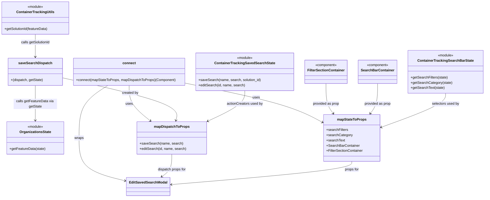

# Diagram: web/portal/src/pages/containertracking/search/ContainerTrackingSavedSearchModalContainer.js

> Auto-generated by Obscura crawlers

## Mermaid

### SVG

<svg id="container" width="2189.51953125" xmlns="http://www.w3.org/2000/svg" class="classDiagram" height="910" viewBox="0 0 2189.51953125 910" role="graphics-document document" aria-roledescription="class"><g><defs><marker id="container_class-aggregationStart" class="marker aggregation class" refX="18" refY="7" markerWidth="190" markerHeight="240" orient="auto"><path d="M 18,7 L9,13 L1,7 L9,1 Z"></path></marker></defs><defs><marker id="container_class-aggregationEnd" class="marker aggregation class" refX="1" refY="7" markerWidth="20" markerHeight="28" orient="auto"><path d="M 18,7 L9,13 L1,7 L9,1 Z"></path></marker></defs><defs><marker id="container_class-extensionStart" class="marker extension class" refX="18" refY="7" markerWidth="190" markerHeight="240" orient="auto"><path d="M 1,7 L18,13 V 1 Z"></path></marker></defs><defs><marker id="container_class-extensionEnd" class="marker extension class" refX="1" refY="7" markerWidth="20" markerHeight="28" orient="auto"><path d="M 1,1 V 13 L18,7 Z"></path></marker></defs><defs><marker id="container_class-compositionStart" class="marker composition class" refX="18" refY="7" markerWidth="190" markerHeight="240" orient="auto"><path d="M 18,7 L9,13 L1,7 L9,1 Z"></path></marker></defs><defs><marker id="container_class-compositionEnd" class="marker composition class" refX="1" refY="7" markerWidth="20" markerHeight="28" orient="auto"><path d="M 18,7 L9,13 L1,7 L9,1 Z"></path></marker></defs><defs><marker id="container_class-dependencyStart" class="marker dependency class" refX="6" refY="7" markerWidth="190" markerHeight="240" orient="auto"><path d="M 5,7 L9,13 L1,7 L9,1 Z"></path></marker></defs><defs><marker id="container_class-dependencyEnd" class="marker dependency class" refX="13" refY="7" markerWidth="20" markerHeight="28" orient="auto"><path d="M 18,7 L9,13 L14,7 L9,1 Z"></path></marker></defs><defs><marker id="container_class-lollipopStart" class="marker lollipop class" refX="13" refY="7" markerWidth="190" markerHeight="240" orient="auto"><circle stroke="black" fill="transparent" cx="7" cy="7" r="6"></circle></marker></defs><defs><marker id="container_class-lollipopEnd" class="marker lollipop class" refX="1" refY="7" markerWidth="190" markerHeight="240" orient="auto"><circle stroke="black" fill="transparent" cx="7" cy="7" r="6"></circle></marker></defs><g class="root"><g class="clusters"></g><g class="edgePaths"><path d="M2013.512,430L2013.512,438.167C2013.512,446.333,2013.512,462.667,1966.429,488.55C1919.346,514.433,1825.18,549.867,1778.097,567.584L1731.014,585.3" id="id_ContainerTrackingSearchBarState_mapStateToProps_1" class="edge-thickness-normal edge-pattern-solid relation" style=";;;" data-edge="true" data-et="edge" data-id="id_ContainerTrackingSearchBarState_mapStateToProps_1" data-points="W3sieCI6MjAxMy41MTE3MTg3NSwieSI6NDMwfSx7IngiOjIwMTMuNTExNzE4NzUsInkiOjQ3OX0seyJ4IjoxNzI1LjM5ODQzNzUsInkiOjU4Ny40MTMzNzExNTY3OTg4fV0=" marker-end="url(#container_class-dependencyEnd)"></path><path d="M1710.66,385L1710.66,400.667C1710.66,416.333,1710.66,447.667,1705.299,470.692C1699.938,493.717,1689.216,508.434,1683.855,515.792L1678.494,523.151" id="id_SearchBarContainer_mapStateToProps_2" class="edge-thickness-normal edge-pattern-solid relation" style=";;;" data-edge="true" data-et="edge" data-id="id_SearchBarContainer_mapStateToProps_2" data-points="W3sieCI6MTcxMC42NjAxNTYyNSwieSI6Mzg1fSx7IngiOjE3MTAuNjYwMTU2MjUsInkiOjQ3OX0seyJ4IjoxNjc0Ljk2MTA2MTkwMjg2NjMsInkiOjUyOH1d" marker-end="url(#container_class-dependencyEnd)"></path><path d="M1481.895,385L1481.895,400.667C1481.895,416.333,1481.895,447.667,1487.256,470.692C1492.617,493.717,1503.339,508.434,1508.7,515.792L1514.061,523.151" id="id_FilterSectionContainer_mapStateToProps_3" class="edge-thickness-normal edge-pattern-solid relation" style=";;;" data-edge="true" data-et="edge" data-id="id_FilterSectionContainer_mapStateToProps_3" data-points="W3sieCI6MTQ4MS44OTQ1MzEyNSwieSI6Mzg1fSx7IngiOjE0ODEuODk0NTMxMjUsInkiOjQ3OX0seyJ4IjoxNTE3LjU5MzYyNTU5NzEzMzcsInkiOjUyOH1d" marker-end="url(#container_class-dependencyEnd)"></path><path d="M1596.277,744L1596.277,750.167C1596.277,756.333,1596.277,768.667,1459.836,786.549C1323.394,804.431,1050.51,827.861,914.068,839.576L777.626,851.292" id="id_mapStateToProps_EditSavedSearchModal_4" class="edge-thickness-normal edge-pattern-solid relation" style=";;;" data-edge="true" data-et="edge" data-id="id_mapStateToProps_EditSavedSearchModal_4" data-points="W3sieCI6MTU5Ni4yNzczNDM3NSwieSI6NzQ0fSx7IngiOjE1OTYuMjc3MzQzNzUsInkiOjc4MX0seyJ4Ijo3NzEuNjQ4NDM3NSwieSI6ODUxLjgwNDgxMzY0MDIwNH1d" marker-end="url(#container_class-dependencyEnd)"></path><path d="M1116.871,418L1116.871,428.167C1116.871,438.333,1116.871,458.667,1088.391,482.231C1059.911,505.795,1002.95,532.589,974.47,545.987L945.99,559.384" id="id_ContainerTrackingSavedSearchState_mapDispatchToProps_5" class="edge-thickness-normal edge-pattern-solid relation" style=";;;" data-edge="true" data-et="edge" data-id="id_ContainerTrackingSavedSearchState_mapDispatchToProps_5" data-points="W3sieCI6MTExNi44NzEwOTM3NSwieSI6NDE4fSx7IngiOjExMTYuODcxMDkzNzUsInkiOjQ3OX0seyJ4Ijo5NDAuNTYwNTQ2ODc1LCJ5Ijo1NjEuOTM4MTA4OTc2NDIyMn1d" marker-end="url(#container_class-dependencyEnd)"></path><path d="M285.152,358.613L374.354,378.678C463.555,398.742,641.958,438.871,728.149,471.629C814.339,504.387,808.317,529.775,805.306,542.468L802.295,555.162" id="id_saveSearchDispatch_mapDispatchToProps_6" class="edge-thickness-normal edge-pattern-solid relation" style=";;;" data-edge="true" data-et="edge" data-id="id_saveSearchDispatch_mapDispatchToProps_6" data-points="W3sieCI6Mjg1LjE1MjM0Mzc1LCJ5IjozNTguNjEzMjg3Nzc4MTc2ODd9LHsieCI6ODIwLjM2MTMyODEyNSwieSI6NDc5fSx7IngiOjgwMC45MDk5OTQ1MjYyNzM5LCJ5Ijo1NjF9XQ==" marker-end="url(#container_class-dependencyEnd)"></path><path d="M162.391,394L162.391,408.167C162.391,422.333,162.391,450.667,162.391,477.5C162.391,504.333,162.391,529.667,162.391,542.333L162.391,555" id="id_saveSearchDispatch_OrganizationsState_7" class="edge-thickness-normal edge-pattern-solid relation" style=";;;" data-edge="true" data-et="edge" data-id="id_saveSearchDispatch_OrganizationsState_7" data-points="W3sieCI6MTYyLjM5MDYyNSwieSI6Mzk0fSx7IngiOjE2Mi4zOTA2MjUsInkiOjQ3OX0seyJ4IjoxNjIuMzkwNjI1LCJ5Ijo1NjF9XQ==" marker-end="url(#container_class-dependencyEnd)"></path><path d="M162.391,158L162.391,164.167C162.391,170.333,162.391,182.667,162.391,200C162.391,217.333,162.391,239.667,162.391,250.833L162.391,262" id="id_ContainerTrackingUtils_saveSearchDispatch_8" class="edge-thickness-normal edge-pattern-solid relation" style=";;;" data-edge="true" data-et="edge" data-id="id_ContainerTrackingUtils_saveSearchDispatch_8" data-points="W3sieCI6MTYyLjM5MDYyNSwieSI6MTU4fSx7IngiOjE2Mi4zOTA2MjUsInkiOjE5NX0seyJ4IjoxNjIuMzkwNjI1LCJ5IjoyNjh9XQ==" marker-end="url(#container_class-dependencyEnd)"></path><path d="M783.119,711L783.119,722.667C783.119,734.333,783.119,757.667,775.578,774.906C768.036,792.145,752.953,803.29,745.412,808.862L737.87,814.434" id="id_mapDispatchToProps_EditSavedSearchModal_9" class="edge-thickness-normal edge-pattern-solid relation" style=";;;" data-edge="true" data-et="edge" data-id="id_mapDispatchToProps_EditSavedSearchModal_9" data-points="W3sieCI6NzgzLjExOTE0MDYyNSwieSI6NzExfSx7IngiOjc4My4xMTkxNDA2MjUsInkiOjc4MX0seyJ4Ijo3MzMuMDQ0NTUxMDI4NDgxLCJ5Ijo4MTh9XQ==" marker-end="url(#container_class-dependencyEnd)"></path><path d="M493.315,394L471.471,408.167C449.626,422.333,405.936,450.667,384.091,491C362.246,531.333,362.246,583.667,362.246,634C362.246,684.333,362.246,732.667,397.695,765.753C433.144,798.84,504.041,816.68,539.49,825.599L574.939,834.519" id="id_connect_EditSavedSearchModal_10" class="edge-thickness-normal edge-pattern-solid relation" style=";;;" data-edge="true" data-et="edge" data-id="id_connect_EditSavedSearchModal_10" data-points="W3sieCI6NDkzLjMxNTQyOTY4NzUsInkiOjM5NH0seyJ4IjozNjIuMjQ2MDkzNzUsInkiOjQ3OX0seyJ4IjozNjIuMjQ2MDkzNzUsInkiOjYzNn0seyJ4IjozNjIuMjQ2MDkzNzUsInkiOjc4MX0seyJ4Ijo1ODAuNzU3ODEyNSwieSI6ODM1Ljk4MzQwMjM4NjM3MzV9XQ==" marker-end="url(#container_class-dependencyEnd)"></path><path d="M845.77,383.505L923.161,399.421C1000.552,415.337,1155.335,447.168,1258.022,476.963C1360.71,506.757,1411.303,534.515,1436.599,548.394L1461.896,562.272" id="id_connect_mapStateToProps_11" class="edge-thickness-normal edge-pattern-solid relation" style=";;;" data-edge="true" data-et="edge" data-id="id_connect_mapStateToProps_11" data-points="W3sieCI6ODQ1Ljc2OTUzMTI1LCJ5IjozODMuNTA1MTY3Mzk3NjI5MDd9LHsieCI6MTMxMC4xMTcxODc1LCJ5Ijo0Nzl9LHsieCI6MTQ2Ny4xNTYyNSwieSI6NTY1LjE1ODUxMDQ0OTUxMzR9XQ==" marker-end="url(#container_class-dependencyEnd)"></path><path d="M590.461,394L590.461,408.167C590.461,422.333,590.461,450.667,606.456,477.868C622.452,505.07,654.443,531.14,670.438,544.175L686.434,557.21" id="id_connect_mapDispatchToProps_12" class="edge-thickness-normal edge-pattern-solid relation" style=";;;" data-edge="true" data-et="edge" data-id="id_connect_mapDispatchToProps_12" data-points="W3sieCI6NTkwLjQ2MDkzNzUsInkiOjM5NH0seyJ4Ijo1OTAuNDYwOTM3NSwieSI6NDc5fSx7IngiOjY5MS4wODQ5NjcxNTc2NDMzLCJ5Ijo1NjF9XQ==" marker-end="url(#container_class-dependencyEnd)"></path></g><g class="edgeLabels"><g class="edgeLabel" transform="translate(2013.51171875, 479)"><g class="label" data-id="id_ContainerTrackingSearchBarState_mapStateToProps_1" transform="translate(-63.1640625, -12)"><foreignObject width="126.328125" height="24">

selectors used by

</foreignObject></g></g><g class="edgeLabel" transform="translate(1710.66015625, 479)"><g class="label" data-id="id_SearchBarContainer_mapStateToProps_2" transform="translate(-61.6328125, -12)"><foreignObject width="123.265625" height="24">

provided as prop

</foreignObject></g></g><g class="edgeLabel" transform="translate(1481.89453125, 479)"><g class="label" data-id="id_FilterSectionContainer_mapStateToProps_3" transform="translate(-61.6328125, -12)"><foreignObject width="123.265625" height="24">

provided as prop

</foreignObject></g></g><g class="edgeLabel" transform="translate(1596.27734375, 781)"><g class="label" data-id="id_mapStateToProps_EditSavedSearchModal_4" transform="translate(-33.2421875, -12)"><foreignObject width="66.484375" height="24">

props for

</foreignObject></g></g><g class="edgeLabel" transform="translate(1116.87109375, 479)"><g class="label" data-id="id_ContainerTrackingSavedSearchState_mapDispatchToProps_5" transform="translate(-83.1015625, -12)"><foreignObject width="166.203125" height="24">

actionCreators used by

</foreignObject></g></g><g class="edgeLabel" transform="translate(593.8674, 428.05381)"><g class="label" data-id="id_saveSearchDispatch_mapDispatchToProps_6" transform="translate(-37.9921875, -12)"><foreignObject width="75.984375" height="24">

created by

</foreignObject></g></g><g class="edgeLabel" transform="translate(162.390625, 479)"><g class="label" data-id="id_saveSearchDispatch_OrganizationsState_7" transform="translate(-100, -24)"><foreignObject width="200" height="48">

calls getFeatureData via getState

</foreignObject></g></g><g class="edgeLabel" transform="translate(162.390625, 195)"><g class="label" data-id="id_ContainerTrackingUtils_saveSearchDispatch_8" transform="translate(-67.5234375, -12)"><foreignObject width="135.046875" height="24">

calls getSolutionId

</foreignObject></g></g><g class="edgeLabel" transform="translate(783.119140625, 781)"><g class="label" data-id="id_mapDispatchToProps_EditSavedSearchModal_9" transform="translate(-66.4453125, -12)"><foreignObject width="132.890625" height="24">

dispatch props for

</foreignObject></g></g><g class="edgeLabel" transform="translate(362.24609375, 636)"><g class="label" data-id="id_connect_EditSavedSearchModal_10" transform="translate(-21.390625, -12)"><foreignObject width="42.78125" height="24">

wraps

</foreignObject></g></g><g class="edgeLabel" transform="translate(1165.66829, 449.29354)"><g class="label" data-id="id_connect_mapStateToProps_11" transform="translate(-16.4921875, -12)"><foreignObject width="32.984375" height="24">

uses

</foreignObject></g></g><g class="edgeLabel" transform="translate(590.4609375, 479)"><g class="label" data-id="id_connect_mapDispatchToProps_12" transform="translate(-16.4921875, -12)"><foreignObject width="32.984375" height="24">

uses

</foreignObject></g></g></g><g class="nodes"><g class="node default" id="classId-EditSavedSearchModal-0" transform="translate(676.203125, 860)"><g class="basic label-container"><path d="M-95.4453125 -42 L95.4453125 -42 L95.4453125 42 L-95.4453125 42" stroke="none" stroke-width="0" fill="#ECECFF" style=""></path><path d="M-95.4453125 -42 C-56.122223009431536 -42, -16.799133518863073 -42, 95.4453125 -42 M-95.4453125 -42 C-44.24315752079501 -42, 6.958997458409982 -42, 95.4453125 -42 M95.4453125 -42 C95.4453125 -12.44417181671312, 95.4453125 17.11165636657376, 95.4453125 42 M95.4453125 -42 C95.4453125 -12.922140416255246, 95.4453125 16.155719167489508, 95.4453125 42 M95.4453125 42 C36.502522070600214 42, -22.44026835879957 42, -95.4453125 42 M95.4453125 42 C30.6994209844201 42, -34.0464705311598 42, -95.4453125 42 M-95.4453125 42 C-95.4453125 22.018913293928552, -95.4453125 2.0378265878571042, -95.4453125 -42 M-95.4453125 42 C-95.4453125 23.720542320867548, -95.4453125 5.441084641735095, -95.4453125 -42" stroke="#9370DB" stroke-width="1.3" fill="none" stroke-dasharray="0 0" style=""></path></g><g class="annotation-group text" transform="translate(0, -18)"></g><g class="label-group text" transform="translate(-83.4453125, -18)"><g class="label" style="font-weight: bolder" transform="translate(0,-12)"><foreignObject width="166.890625" height="24">

EditSavedSearchModal

</foreignObject></g></g><g class="members-group text" transform="translate(-83.4453125, 30)"></g><g class="methods-group text" transform="translate(-83.4453125, 60)"></g><g class="divider" style=""><path d="M-95.4453125 6 C-25.779312426298148 6, 43.886687647403704 6, 95.4453125 6 M-95.4453125 6 C-28.661086665551892 6, 38.123139168896216 6, 95.4453125 6" stroke="#9370DB" stroke-width="1.3" fill="none" stroke-dasharray="0 0" style=""></path></g><g class="divider" style=""><path d="M-95.4453125 24 C-32.8723779478707 24, 29.700556604258594 24, 95.4453125 24 M-95.4453125 24 C-32.784904244978115 24, 29.87550401004377 24, 95.4453125 24" stroke="#9370DB" stroke-width="1.3" fill="none" stroke-dasharray="0 0" style=""></path></g></g><g class="node default" id="classId-ContainerTrackingSearchBarState-1" transform="translate(2013.51171875, 331)"><g class="basic label-container"><path d="M-168.0078125 -99 L168.0078125 -99 L168.0078125 99 L-168.0078125 99" stroke="none" stroke-width="0" fill="#ECECFF" style=""></path><path d="M-168.0078125 -99 C-91.92090892031388 -99, -15.834005340627755 -99, 168.0078125 -99 M-168.0078125 -99 C-54.09612613177113 -99, 59.81556023645774 -99, 168.0078125 -99 M168.0078125 -99 C168.0078125 -38.2101115333339, 168.0078125 22.579776933332198, 168.0078125 99 M168.0078125 -99 C168.0078125 -32.68263658854774, 168.0078125 33.634726822904526, 168.0078125 99 M168.0078125 99 C80.84967235742491 99, -6.308467785150185 99, -168.0078125 99 M168.0078125 99 C84.40851950001512 99, 0.8092265000302348 99, -168.0078125 99 M-168.0078125 99 C-168.0078125 24.43223249936969, -168.0078125 -50.13553500126062, -168.0078125 -99 M-168.0078125 99 C-168.0078125 49.13093982330213, -168.0078125 -0.7381203533957432, -168.0078125 -99" stroke="#9370DB" stroke-width="1.3" fill="none" stroke-dasharray="0 0" style=""></path></g><g class="annotation-group text" transform="translate(-36.6015625, -75)"><g class="label" style="" transform="translate(0,-12)"><foreignObject width="73.203125" height="24">

«module»

</foreignObject></g></g><g class="label-group text" transform="translate(-123.078125, -51)"><g class="label" style="font-weight: bolder" transform="translate(0,-12)"><foreignObject width="246.15625" height="24">

ContainerTrackingSearchBarState

</foreignObject></g></g><g class="members-group text" transform="translate(-156.0078125, -3)"></g><g class="methods-group text" transform="translate(-156.0078125, 27)"><g class="label" style="" transform="translate(0,-12)"><foreignObject width="169.875" height="24">

+getSearchFilters(state)

</foreignObject></g><g class="label" style="" transform="translate(0,12)"><foreignObject width="188.9375" height="24">

+getSearchCategory(state)

</foreignObject></g><g class="label" style="" transform="translate(0,36)"><foreignObject width="155.21875" height="24">

+getSearchText(state)

</foreignObject></g></g><g class="divider" style=""><path d="M-168.0078125 -27 C-85.10871458751122 -27, -2.2096166750224313 -27, 168.0078125 -27 M-168.0078125 -27 C-34.36171479553997 -27, 99.28438290892007 -27, 168.0078125 -27" stroke="#9370DB" stroke-width="1.3" fill="none" stroke-dasharray="0 0" style=""></path></g><g class="divider" style=""><path d="M-168.0078125 -3 C-54.611272185720225 -3, 58.78526812855955 -3, 168.0078125 -3 M-168.0078125 -3 C-86.19679414391955 -3, -4.385775787839094 -3, 168.0078125 -3" stroke="#9370DB" stroke-width="1.3" fill="none" stroke-dasharray="0 0" style=""></path></g></g><g class="node default" id="classId-ContainerTrackingSavedSearchState-2" transform="translate(1116.87109375, 331)"><g class="basic label-container"><path d="M-221.1015625 -87 L221.1015625 -87 L221.1015625 87 L-221.1015625 87" stroke="none" stroke-width="0" fill="#ECECFF" style=""></path><path d="M-221.1015625 -87 C-107.87106286632914 -87, 5.35943676734172 -87, 221.1015625 -87 M-221.1015625 -87 C-79.12959084139996 -87, 62.84238081720008 -87, 221.1015625 -87 M221.1015625 -87 C221.1015625 -24.896262175276, 221.1015625 37.207475649448, 221.1015625 87 M221.1015625 -87 C221.1015625 -22.92637809115584, 221.1015625 41.14724381768832, 221.1015625 87 M221.1015625 87 C70.14512683881853 87, -80.81130882236295 87, -221.1015625 87 M221.1015625 87 C129.04606692457617 87, 36.99057134915236 87, -221.1015625 87 M-221.1015625 87 C-221.1015625 52.069975645627295, -221.1015625 17.13995129125459, -221.1015625 -87 M-221.1015625 87 C-221.1015625 52.04505940442502, -221.1015625 17.090118808850036, -221.1015625 -87" stroke="#9370DB" stroke-width="1.3" fill="none" stroke-dasharray="0 0" style=""></path></g><g class="annotation-group text" transform="translate(-36.6015625, -63)"><g class="label" style="" transform="translate(0,-12)"><foreignObject width="73.203125" height="24">

«module»

</foreignObject></g></g><g class="label-group text" transform="translate(-132.640625, -39)"><g class="label" style="font-weight: bolder" transform="translate(0,-12)"><foreignObject width="265.28125" height="24">

ContainerTrackingSavedSearchState

</foreignObject></g></g><g class="members-group text" transform="translate(-209.1015625, 9)"></g><g class="methods-group text" transform="translate(-209.1015625, 39)"><g class="label" style="" transform="translate(0,-12)"><foreignObject width="285.5625" height="24">

+saveSearch(name, search, solution_id)

</foreignObject></g><g class="label" style="" transform="translate(0,12)"><foreignObject width="213.6875" height="24">

+editSearch(id, name, search)

</foreignObject></g></g><g class="divider" style=""><path d="M-221.1015625 -15 C-97.91962258196904 -15, 25.262317336061926 -15, 221.1015625 -15 M-221.1015625 -15 C-114.4978557310005 -15, -7.8941489620009975 -15, 221.1015625 -15" stroke="#9370DB" stroke-width="1.3" fill="none" stroke-dasharray="0 0" style=""></path></g><g class="divider" style=""><path d="M-221.1015625 9 C-119.67035115252068 9, -18.23913980504136 9, 221.1015625 9 M-221.1015625 9 C-99.71818482741172 9, 21.665192845176563 9, 221.1015625 9" stroke="#9370DB" stroke-width="1.3" fill="none" stroke-dasharray="0 0" style=""></path></g></g><g class="node default" id="classId-SearchBarContainer-3" transform="translate(1710.66015625, 331)"><g class="basic label-container"><path d="M-84.84375 -54 L84.84375 -54 L84.84375 54 L-84.84375 54" stroke="none" stroke-width="0" fill="#ECECFF" style=""></path><path d="M-84.84375 -54 C-30.22943823195905 -54, 24.384873536081898 -54, 84.84375 -54 M-84.84375 -54 C-39.424296088629994 -54, 5.995157822740012 -54, 84.84375 -54 M84.84375 -54 C84.84375 -14.261086523124625, 84.84375 25.47782695375075, 84.84375 54 M84.84375 -54 C84.84375 -21.95805567087811, 84.84375 10.08388865824378, 84.84375 54 M84.84375 54 C28.854945641358448 54, -27.133858717283104 54, -84.84375 54 M84.84375 54 C33.470556180078574 54, -17.90263763984285 54, -84.84375 54 M-84.84375 54 C-84.84375 27.82859216135417, -84.84375 1.6571843227083392, -84.84375 -54 M-84.84375 54 C-84.84375 24.23978652843262, -84.84375 -5.520426943134758, -84.84375 -54" stroke="#9370DB" stroke-width="1.3" fill="none" stroke-dasharray="0 0" style=""></path></g><g class="annotation-group text" transform="translate(-50.2109375, -30)"><g class="label" style="" transform="translate(0,-12)"><foreignObject width="100.421875" height="24">

«component»

</foreignObject></g></g><g class="label-group text" transform="translate(-72.84375, -6)"><g class="label" style="font-weight: bolder" transform="translate(0,-12)"><foreignObject width="145.6875" height="24">

SearchBarContainer

</foreignObject></g></g><g class="members-group text" transform="translate(-72.84375, 42)"></g><g class="methods-group text" transform="translate(-72.84375, 72)"></g><g class="divider" style=""><path d="M-84.84375 18 C-24.150049398308717 18, 36.54365120338257 18, 84.84375 18 M-84.84375 18 C-33.20692659944146 18, 18.42989680111708 18, 84.84375 18" stroke="#9370DB" stroke-width="1.3" fill="none" stroke-dasharray="0 0" style=""></path></g><g class="divider" style=""><path d="M-84.84375 36 C-43.88482926956383 36, -2.9259085391276614 36, 84.84375 36 M-84.84375 36 C-20.581322390179935 36, 43.68110521964013 36, 84.84375 36" stroke="#9370DB" stroke-width="1.3" fill="none" stroke-dasharray="0 0" style=""></path></g></g><g class="node default" id="classId-FilterSectionContainer-4" transform="translate(1481.89453125, 331)"><g class="basic label-container"><path d="M-93.921875 -54 L93.921875 -54 L93.921875 54 L-93.921875 54" stroke="none" stroke-width="0" fill="#ECECFF" style=""></path><path d="M-93.921875 -54 C-25.71464466629247 -54, 42.49258566741506 -54, 93.921875 -54 M-93.921875 -54 C-34.417721308878804 -54, 25.086432382242393 -54, 93.921875 -54 M93.921875 -54 C93.921875 -30.167959846643747, 93.921875 -6.335919693287494, 93.921875 54 M93.921875 -54 C93.921875 -12.026820478832967, 93.921875 29.946359042334066, 93.921875 54 M93.921875 54 C31.194323599969515 54, -31.53322780006097 54, -93.921875 54 M93.921875 54 C44.14584412080333 54, -5.630186758393336 54, -93.921875 54 M-93.921875 54 C-93.921875 23.173157994585615, -93.921875 -7.653684010828769, -93.921875 -54 M-93.921875 54 C-93.921875 16.434791628043655, -93.921875 -21.13041674391269, -93.921875 -54" stroke="#9370DB" stroke-width="1.3" fill="none" stroke-dasharray="0 0" style=""></path></g><g class="annotation-group text" transform="translate(-50.2109375, -30)"><g class="label" style="" transform="translate(0,-12)"><foreignObject width="100.421875" height="24">

«component»

</foreignObject></g></g><g class="label-group text" transform="translate(-81.921875, -6)"><g class="label" style="font-weight: bolder" transform="translate(0,-12)"><foreignObject width="163.84375" height="24">

FilterSectionContainer

</foreignObject></g></g><g class="members-group text" transform="translate(-81.921875, 42)"></g><g class="methods-group text" transform="translate(-81.921875, 72)"></g><g class="divider" style=""><path d="M-93.921875 18 C-38.349398544528086 18, 17.22307791094383 18, 93.921875 18 M-93.921875 18 C-19.968506763775167 18, 53.984861472449666 18, 93.921875 18" stroke="#9370DB" stroke-width="1.3" fill="none" stroke-dasharray="0 0" style=""></path></g><g class="divider" style=""><path d="M-93.921875 36 C-23.49979207846802 36, 46.92229084306396 36, 93.921875 36 M-93.921875 36 C-30.682468853598756 36, 32.55693729280249 36, 93.921875 36" stroke="#9370DB" stroke-width="1.3" fill="none" stroke-dasharray="0 0" style=""></path></g></g><g class="node default" id="classId-ContainerTrackingUtils-5" transform="translate(162.390625, 83)"><g class="basic label-container"><path d="M-154.390625 -75 L154.390625 -75 L154.390625 75 L-154.390625 75" stroke="none" stroke-width="0" fill="#ECECFF" style=""></path><path d="M-154.390625 -75 C-89.2802375494021 -75, -24.169850098804204 -75, 154.390625 -75 M-154.390625 -75 C-39.166542012184266 -75, 76.05754097563147 -75, 154.390625 -75 M154.390625 -75 C154.390625 -16.006575145028656, 154.390625 42.98684970994269, 154.390625 75 M154.390625 -75 C154.390625 -20.109776848692313, 154.390625 34.780446302615374, 154.390625 75 M154.390625 75 C87.34026571052206 75, 20.289906421044122 75, -154.390625 75 M154.390625 75 C38.458167726149256 75, -77.47428954770149 75, -154.390625 75 M-154.390625 75 C-154.390625 35.74044484109224, -154.390625 -3.5191103178155174, -154.390625 -75 M-154.390625 75 C-154.390625 36.976134820691556, -154.390625 -1.0477303586168887, -154.390625 -75" stroke="#9370DB" stroke-width="1.3" fill="none" stroke-dasharray="0 0" style=""></path></g><g class="annotation-group text" transform="translate(-36.6015625, -51)"><g class="label" style="" transform="translate(0,-12)"><foreignObject width="73.203125" height="24">

«module»

</foreignObject></g></g><g class="label-group text" transform="translate(-83.3125, -27)"><g class="label" style="font-weight: bolder" transform="translate(0,-12)"><foreignObject width="166.625" height="24">

ContainerTrackingUtils

</foreignObject></g></g><g class="members-group text" transform="translate(-142.390625, 21)"></g><g class="methods-group text" transform="translate(-142.390625, 51)"><g class="label" style="" transform="translate(0,-12)"><foreignObject width="201.46875" height="24">

+getSolutionId(featureData)

</foreignObject></g></g><g class="divider" style=""><path d="M-154.390625 -3 C-37.379064938841935 -3, 79.63249512231613 -3, 154.390625 -3 M-154.390625 -3 C-52.668487300472634 -3, 49.05365039905473 -3, 154.390625 -3" stroke="#9370DB" stroke-width="1.3" fill="none" stroke-dasharray="0 0" style=""></path></g><g class="divider" style=""><path d="M-154.390625 21 C-72.16672267062789 21, 10.057179658744218 21, 154.390625 21 M-154.390625 21 C-86.62958190358015 21, -18.86853880716029 21, 154.390625 21" stroke="#9370DB" stroke-width="1.3" fill="none" stroke-dasharray="0 0" style=""></path></g></g><g class="node default" id="classId-OrganizationsState-6" transform="translate(162.390625, 636)"><g class="basic label-container"><path d="M-129.08203125 -75 L129.08203125 -75 L129.08203125 75 L-129.08203125 75" stroke="none" stroke-width="0" fill="#ECECFF" style=""></path><path d="M-129.08203125 -75 C-58.39018199546713 -75, 12.301667259065738 -75, 129.08203125 -75 M-129.08203125 -75 C-74.14367189031522 -75, -19.205312530630437 -75, 129.08203125 -75 M129.08203125 -75 C129.08203125 -18.960985173577058, 129.08203125 37.078029652845885, 129.08203125 75 M129.08203125 -75 C129.08203125 -30.03698249561228, 129.08203125 14.926035008775443, 129.08203125 75 M129.08203125 75 C33.92151221291384 75, -61.23900682417232 75, -129.08203125 75 M129.08203125 75 C58.66119157649892 75, -11.759648097002156 75, -129.08203125 75 M-129.08203125 75 C-129.08203125 17.874857886506646, -129.08203125 -39.25028422698671, -129.08203125 -75 M-129.08203125 75 C-129.08203125 30.287497090678286, -129.08203125 -14.425005818643427, -129.08203125 -75" stroke="#9370DB" stroke-width="1.3" fill="none" stroke-dasharray="0 0" style=""></path></g><g class="annotation-group text" transform="translate(-36.6015625, -51)"><g class="label" style="" transform="translate(0,-12)"><foreignObject width="73.203125" height="24">

«module»

</foreignObject></g></g><g class="label-group text" transform="translate(-69.8671875, -27)"><g class="label" style="font-weight: bolder" transform="translate(0,-12)"><foreignObject width="139.734375" height="24">

OrganizationsState

</foreignObject></g></g><g class="members-group text" transform="translate(-117.08203125, 21)"></g><g class="methods-group text" transform="translate(-117.08203125, 51)"><g class="label" style="" transform="translate(0,-12)"><foreignObject width="164.296875" height="24">

+getFeatureData(state)

</foreignObject></g></g><g class="divider" style=""><path d="M-129.08203125 -3 C-29.63595515370791 -3, 69.81012094258418 -3, 129.08203125 -3 M-129.08203125 -3 C-65.36712227887608 -3, -1.6522133077521488 -3, 129.08203125 -3" stroke="#9370DB" stroke-width="1.3" fill="none" stroke-dasharray="0 0" style=""></path></g><g class="divider" style=""><path d="M-129.08203125 21 C-52.042594699366916 21, 24.99684185126617 21, 129.08203125 21 M-129.08203125 21 C-32.57837958710782 21, 63.92527207578436 21, 129.08203125 21" stroke="#9370DB" stroke-width="1.3" fill="none" stroke-dasharray="0 0" style=""></path></g></g><g class="node default" id="classId-mapStateToProps-7" transform="translate(1596.27734375, 636)"><g class="basic label-container"><path d="M-129.12109375 -108 L129.12109375 -108 L129.12109375 108 L-129.12109375 108" stroke="none" stroke-width="0" fill="#ECECFF" style=""></path><path d="M-129.12109375 -108 C-54.783314869370244 -108, 19.554464011259512 -108, 129.12109375 -108 M-129.12109375 -108 C-39.92934366472578 -108, 49.262406420548444 -108, 129.12109375 -108 M129.12109375 -108 C129.12109375 -45.27994399374161, 129.12109375 17.440112012516778, 129.12109375 108 M129.12109375 -108 C129.12109375 -27.46033140517507, 129.12109375 53.07933718964986, 129.12109375 108 M129.12109375 108 C58.57661217960826 108, -11.967869390783477 108, -129.12109375 108 M129.12109375 108 C61.39785386068 108, -6.325386028639997 108, -129.12109375 108 M-129.12109375 108 C-129.12109375 49.41589319490396, -129.12109375 -9.168213610192083, -129.12109375 -108 M-129.12109375 108 C-129.12109375 24.9387952376821, -129.12109375 -58.1224095246358, -129.12109375 -108" stroke="#9370DB" stroke-width="1.3" fill="none" stroke-dasharray="0 0" style=""></path></g><g class="annotation-group text" transform="translate(0, -84)"></g><g class="label-group text" transform="translate(-64.7109375, -84)"><g class="label" style="font-weight: bolder" transform="translate(0,-12)"><foreignObject width="129.421875" height="24">

mapStateToProps

</foreignObject></g></g><g class="members-group text" transform="translate(-117.12109375, -36)"><g class="label" style="" transform="translate(0,-12)"><foreignObject width="99.609375" height="24">

+searchFilters

</foreignObject></g><g class="label" style="" transform="translate(0,12)"><foreignObject width="118.65625" height="24">

+searchCategory

</foreignObject></g><g class="label" style="" transform="translate(0,36)"><foreignObject width="84.953125" height="24">

+searchText

</foreignObject></g><g class="label" style="" transform="translate(0,60)"><foreignObject width="151.171875" height="24">

+SearchBarContainer

</foreignObject></g><g class="label" style="" transform="translate(0,84)"><foreignObject width="169.53125" height="24">

+FilterSectionContainer

</foreignObject></g></g><g class="methods-group text" transform="translate(-117.12109375, 108)"></g><g class="divider" style=""><path d="M-129.12109375 -60 C-65.43916890376471 -60, -1.7572440575294337 -60, 129.12109375 -60 M-129.12109375 -60 C-58.19176795600926 -60, 12.737557837981484 -60, 129.12109375 -60" stroke="#9370DB" stroke-width="1.3" fill="none" stroke-dasharray="0 0" style=""></path></g><g class="divider" style=""><path d="M-129.12109375 84 C-28.29156301682434 84, 72.53796771635132 84, 129.12109375 84 M-129.12109375 84 C-63.12348550449752 84, 2.8741227410049532 84, 129.12109375 84" stroke="#9370DB" stroke-width="1.3" fill="none" stroke-dasharray="0 0" style=""></path></g></g><g class="node default" id="classId-mapDispatchToProps-8" transform="translate(783.119140625, 636)"><g class="basic label-container"><path d="M-157.44140625 -75 L157.44140625 -75 L157.44140625 75 L-157.44140625 75" stroke="none" stroke-width="0" fill="#ECECFF" style=""></path><path d="M-157.44140625 -75 C-40.51514145588821 -75, 76.41112333822358 -75, 157.44140625 -75 M-157.44140625 -75 C-59.26803710853602 -75, 38.90533203292796 -75, 157.44140625 -75 M157.44140625 -75 C157.44140625 -31.332773378697517, 157.44140625 12.334453242604965, 157.44140625 75 M157.44140625 -75 C157.44140625 -15.108201041123372, 157.44140625 44.783597917753255, 157.44140625 75 M157.44140625 75 C32.464747850356176 75, -92.51191054928765 75, -157.44140625 75 M157.44140625 75 C54.346030843086965 75, -48.74934456382607 75, -157.44140625 75 M-157.44140625 75 C-157.44140625 35.99216764852938, -157.44140625 -3.015664702941237, -157.44140625 -75 M-157.44140625 75 C-157.44140625 26.815033085172047, -157.44140625 -21.369933829655906, -157.44140625 -75" stroke="#9370DB" stroke-width="1.3" fill="none" stroke-dasharray="0 0" style=""></path></g><g class="annotation-group text" transform="translate(0, -51)"></g><g class="label-group text" transform="translate(-77.1953125, -51)"><g class="label" style="font-weight: bolder" transform="translate(0,-12)"><foreignObject width="154.390625" height="24">

mapDispatchToProps

</foreignObject></g></g><g class="members-group text" transform="translate(-145.44140625, -3)"></g><g class="methods-group text" transform="translate(-145.44140625, 27)"><g class="label" style="" transform="translate(0,-12)"><foreignObject width="195.25" height="24">

+saveSearch(name, search)

</foreignObject></g><g class="label" style="" transform="translate(0,12)"><foreignObject width="213.6875" height="24">

+editSearch(id, name, search)

</foreignObject></g></g><g class="divider" style=""><path d="M-157.44140625 -27 C-48.34106063874282 -27, 60.759284972514365 -27, 157.44140625 -27 M-157.44140625 -27 C-74.28435839997937 -27, 8.872689450041264 -27, 157.44140625 -27" stroke="#9370DB" stroke-width="1.3" fill="none" stroke-dasharray="0 0" style=""></path></g><g class="divider" style=""><path d="M-157.44140625 -3 C-76.51327977822014 -3, 4.414846693559724 -3, 157.44140625 -3 M-157.44140625 -3 C-50.18450972079101 -3, 57.072386808417974 -3, 157.44140625 -3" stroke="#9370DB" stroke-width="1.3" fill="none" stroke-dasharray="0 0" style=""></path></g></g><g class="node default" id="classId-saveSearchDispatch-9" transform="translate(162.390625, 331)"><g class="basic label-container"><path d="M-122.76171875 -63 L122.76171875 -63 L122.76171875 63 L-122.76171875 63" stroke="none" stroke-width="0" fill="#ECECFF" style=""></path><path d="M-122.76171875 -63 C-45.7027282653826 -63, 31.356262219234793 -63, 122.76171875 -63 M-122.76171875 -63 C-51.78284190050229 -63, 19.19603494899542 -63, 122.76171875 -63 M122.76171875 -63 C122.76171875 -36.64490397213852, 122.76171875 -10.289807944277037, 122.76171875 63 M122.76171875 -63 C122.76171875 -14.945682396721892, 122.76171875 33.108635206556215, 122.76171875 63 M122.76171875 63 C56.36278249310669 63, -10.036153763786615 63, -122.76171875 63 M122.76171875 63 C53.64470973385437 63, -15.47229928229126 63, -122.76171875 63 M-122.76171875 63 C-122.76171875 21.959150763032937, -122.76171875 -19.081698473934125, -122.76171875 -63 M-122.76171875 63 C-122.76171875 12.872547476868057, -122.76171875 -37.254905046263886, -122.76171875 -63" stroke="#9370DB" stroke-width="1.3" fill="none" stroke-dasharray="0 0" style=""></path></g><g class="annotation-group text" transform="translate(0, -39)"></g><g class="label-group text" transform="translate(-73.0234375, -39)"><g class="label" style="font-weight: bolder" transform="translate(0,-12)"><foreignObject width="146.046875" height="24">

saveSearchDispatch

</foreignObject></g></g><g class="members-group text" transform="translate(-110.76171875, 9)"></g><g class="methods-group text" transform="translate(-110.76171875, 39)"><g class="label" style="" transform="translate(0,-12)"><foreignObject width="148.5" height="24">

+(dispatch, getState)

</foreignObject></g></g><g class="divider" style=""><path d="M-122.76171875 -15 C-40.03956647928197 -15, 42.682585791436054 -15, 122.76171875 -15 M-122.76171875 -15 C-44.177791005681755 -15, 34.40613673863649 -15, 122.76171875 -15" stroke="#9370DB" stroke-width="1.3" fill="none" stroke-dasharray="0 0" style=""></path></g><g class="divider" style=""><path d="M-122.76171875 9 C-44.47801955587991 9, 33.80567963824018 9, 122.76171875 9 M-122.76171875 9 C-61.73598225000394 9, -0.7102457500078856 9, 122.76171875 9" stroke="#9370DB" stroke-width="1.3" fill="none" stroke-dasharray="0 0" style=""></path></g></g><g class="node default" id="classId-connect-10" transform="translate(590.4609375, 331)"><g class="basic label-container"><path d="M-255.30859375 -63 L255.30859375 -63 L255.30859375 63 L-255.30859375 63" stroke="none" stroke-width="0" fill="#ECECFF" style=""></path><path d="M-255.30859375 -63 C-124.2934105121198 -63, 6.721772725760388 -63, 255.30859375 -63 M-255.30859375 -63 C-60.41016777394 -63, 134.48825820212 -63, 255.30859375 -63 M255.30859375 -63 C255.30859375 -26.40974347631095, 255.30859375 10.1805130473781, 255.30859375 63 M255.30859375 -63 C255.30859375 -29.314862557097513, 255.30859375 4.3702748858049745, 255.30859375 63 M255.30859375 63 C140.22671658540895 63, 25.14483942081793 63, -255.30859375 63 M255.30859375 63 C67.14617909902276 63, -121.01623555195448 63, -255.30859375 63 M-255.30859375 63 C-255.30859375 18.810160778444683, -255.30859375 -25.379678443110635, -255.30859375 -63 M-255.30859375 63 C-255.30859375 22.73254951261395, -255.30859375 -17.5349009747721, -255.30859375 -63" stroke="#9370DB" stroke-width="1.3" fill="none" stroke-dasharray="0 0" style=""></path></g><g class="annotation-group text" transform="translate(0, -39)"></g><g class="label-group text" transform="translate(-28.9140625, -39)"><g class="label" style="font-weight: bolder" transform="translate(0,-12)"><foreignObject width="57.828125" height="24">

connect

</foreignObject></g></g><g class="members-group text" transform="translate(-243.30859375, 9)"></g><g class="methods-group text" transform="translate(-243.30859375, 39)"><g class="label" style="" transform="translate(0,-12)"><foreignObject width="457.703125" height="24">

+connect(mapStateToProps, mapDispatchToProps)(Component)

</foreignObject></g></g><g class="divider" style=""><path d="M-255.30859375 -15 C-71.5454966166377 -15, 112.21760051672459 -15, 255.30859375 -15 M-255.30859375 -15 C-113.65675904489555 -15, 27.995075660208897 -15, 255.30859375 -15" stroke="#9370DB" stroke-width="1.3" fill="none" stroke-dasharray="0 0" style=""></path></g><g class="divider" style=""><path d="M-255.30859375 9 C-139.20838548223077 9, -23.108177214461534 9, 255.30859375 9 M-255.30859375 9 C-95.28262299415638 9, 64.74334776168723 9, 255.30859375 9" stroke="#9370DB" stroke-width="1.3" fill="none" stroke-dasharray="0 0" style=""></path></g></g></g></g></g></svg>
