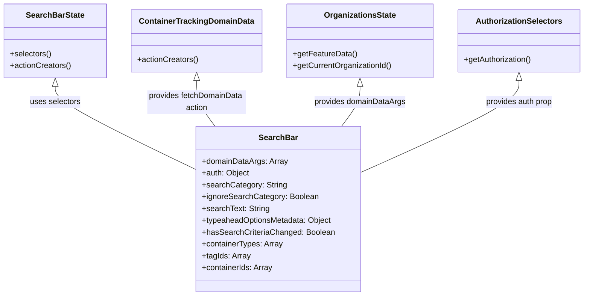

# Diagram: web/portal/src/pages/containertracking/search/ContainerTrackingSearchBarContainer.js


> Auto-generated by Obscura crawlers

## Diagram 1

```mermaid
flowchart LR
  Store[Redux Store]
  SearchBarComp[SearchBar Component]
  connectFn[connect(mapStateToProps, actionCreators)]
  mapStateToPropsFunc[mapStateToProps]
  actionCreatorsObj[actionCreators]
  SearchBarStateModule[SearchBarState.selectors / actionCreators]
  OrgsModule[modules/organizations/OrganizationsState]
  AuthModule[modules/auth/AuthorizationSelectors]
  DomainModule[ContainerTrackingDomainData.actionCreators]

  Store -->|selectors: getSearchText,\ngetSearchCategory,\ngetIgnoreSearchCategory,\ngetTypeaheadOptionsMetadata,\ngetHasSearchCriteriaChanged| SearchBarStateModule
  Store -->|getFeatureData\ngetCurrentOrganizationId| OrgsModule
  Store -->|getAuthorization| AuthModule

  SearchBarStateModule -->|selectors used in| mapStateToPropsFunc
  OrgsModule -->|functions used in| mapStateToPropsFunc
  AuthModule -->|function used in| mapStateToPropsFunc

  DomainModule -->|fetchDomainData| actionCreatorsObj
  SearchBarStateModule -->|setSearchCategoryForKey,\nsetSearchText,\nclearSearchText,\nresetSearchBar,\nsearchEntities,\nclearSavedSearch| actionCreatorsObj

  mapStateToPropsFunc --> connectFn
  actionCreatorsObj --> connectFn
  connectFn --> SearchBarComp
```

> SVG rendering failed for this diagram.

## Diagram 2



### SVG

<svg id="container" width="1170.5859375" xmlns="http://www.w3.org/2000/svg" class="classDiagram" height="600" viewBox="0 0 1170.5859375 600" role="graphics-document document" aria-roledescription="class"><style>#container{font-family:"trebuchet ms",verdana,arial,sans-serif;font-size:16px;fill:#333;}@keyframes edge-animation-frame{from{stroke-dashoffset:0;}}@keyframes dash{to{stroke-dashoffset:0;}}#container .edge-animation-slow{stroke-dasharray:9,5!important;stroke-dashoffset:900;animation:dash 50s linear infinite;stroke-linecap:round;}#container .edge-animation-fast{stroke-dasharray:9,5!important;stroke-dashoffset:900;animation:dash 20s linear infinite;stroke-linecap:round;}#container .error-icon{fill:#552222;}#container .error-text{fill:#552222;stroke:#552222;}#container .edge-thickness-normal{stroke-width:1px;}#container .edge-thickness-thick{stroke-width:3.5px;}#container .edge-pattern-solid{stroke-dasharray:0;}#container .edge-thickness-invisible{stroke-width:0;fill:none;}#container .edge-pattern-dashed{stroke-dasharray:3;}#container .edge-pattern-dotted{stroke-dasharray:2;}#container .marker{fill:#333333;stroke:#333333;}#container .marker.cross{stroke:#333333;}#container svg{font-family:"trebuchet ms",verdana,arial,sans-serif;font-size:16px;}#container p{margin:0;}#container g.classGroup text{fill:#9370DB;stroke:none;font-family:"trebuchet ms",verdana,arial,sans-serif;font-size:10px;}#container g.classGroup text .title{font-weight:bolder;}#container .nodeLabel,#container .edgeLabel{color:#131300;}#container .edgeLabel .label rect{fill:#ECECFF;}#container .label text{fill:#131300;}#container .labelBkg{background:#ECECFF;}#container .edgeLabel .label span{background:#ECECFF;}#container .classTitle{font-weight:bolder;}#container .node rect,#container .node circle,#container .node ellipse,#container .node polygon,#container .node path{fill:#ECECFF;stroke:#9370DB;stroke-width:1px;}#container .divider{stroke:#9370DB;stroke-width:1;}#container g.clickable{cursor:pointer;}#container g.classGroup rect{fill:#ECECFF;stroke:#9370DB;}#container g.classGroup line{stroke:#9370DB;stroke-width:1;}#container .classLabel .box{stroke:none;stroke-width:0;fill:#ECECFF;opacity:0.5;}#container .classLabel .label{fill:#9370DB;font-size:10px;}#container .relation{stroke:#333333;stroke-width:1;fill:none;}#container .dashed-line{stroke-dasharray:3;}#container .dotted-line{stroke-dasharray:1 2;}#container #compositionStart,#container .composition{fill:#333333!important;stroke:#333333!important;stroke-width:1;}#container #compositionEnd,#container .composition{fill:#333333!important;stroke:#333333!important;stroke-width:1;}#container #dependencyStart,#container .dependency{fill:#333333!important;stroke:#333333!important;stroke-width:1;}#container #dependencyStart,#container .dependency{fill:#333333!important;stroke:#333333!important;stroke-width:1;}#container #extensionStart,#container .extension{fill:transparent!important;stroke:#333333!important;stroke-width:1;}#container #extensionEnd,#container .extension{fill:transparent!important;stroke:#333333!important;stroke-width:1;}#container #aggregationStart,#container .aggregation{fill:transparent!important;stroke:#333333!important;stroke-width:1;}#container #aggregationEnd,#container .aggregation{fill:transparent!important;stroke:#333333!important;stroke-width:1;}#container #lollipopStart,#container .lollipop{fill:#ECECFF!important;stroke:#333333!important;stroke-width:1;}#container #lollipopEnd,#container .lollipop{fill:#ECECFF!important;stroke:#333333!important;stroke-width:1;}#container .edgeTerminals{font-size:11px;line-height:initial;}#container .classTitleText{text-anchor:middle;font-size:18px;fill:#333;}#container .label-icon{display:inline-block;height:1em;overflow:visible;vertical-align:-0.125em;}#container .node .label-icon path{fill:currentColor;stroke:revert;stroke-width:revert;}#container :root{--mermaid-font-family:"trebuchet ms",verdana,arial,sans-serif;}</style><g><defs><marker id="container_class-aggregationStart" class="marker aggregation class" refX="18" refY="7" markerWidth="190" markerHeight="240" orient="auto"><path d="M 18,7 L9,13 L1,7 L9,1 Z"></path></marker></defs><defs><marker id="container_class-aggregationEnd" class="marker aggregation class" refX="1" refY="7" markerWidth="20" markerHeight="28" orient="auto"><path d="M 18,7 L9,13 L1,7 L9,1 Z"></path></marker></defs><defs><marker id="container_class-extensionStart" class="marker extension class" refX="18" refY="7" markerWidth="190" markerHeight="240" orient="auto"><path d="M 1,7 L18,13 V 1 Z"></path></marker></defs><defs><marker id="container_class-extensionEnd" class="marker extension class" refX="1" refY="7" markerWidth="20" markerHeight="28" orient="auto"><path d="M 1,1 V 13 L18,7 Z"></path></marker></defs><defs><marker id="container_class-compositionStart" class="marker composition class" refX="18" refY="7" markerWidth="190" markerHeight="240" orient="auto"><path d="M 18,7 L9,13 L1,7 L9,1 Z"></path></marker></defs><defs><marker id="container_class-compositionEnd" class="marker composition class" refX="1" refY="7" markerWidth="20" markerHeight="28" orient="auto"><path d="M 18,7 L9,13 L1,7 L9,1 Z"></path></marker></defs><defs><marker id="container_class-dependencyStart" class="marker dependency class" refX="6" refY="7" markerWidth="190" markerHeight="240" orient="auto"><path d="M 5,7 L9,13 L1,7 L9,1 Z"></path></marker></defs><defs><marker id="container_class-dependencyEnd" class="marker dependency class" refX="13" refY="7" markerWidth="20" markerHeight="28" orient="auto"><path d="M 18,7 L9,13 L14,7 L9,1 Z"></path></marker></defs><defs><marker id="container_class-lollipopStart" class="marker lollipop class" refX="13" refY="7" markerWidth="190" markerHeight="240" orient="auto"><circle stroke="black" fill="transparent" cx="7" cy="7" r="6"></circle></marker></defs><defs><marker id="container_class-lollipopEnd" class="marker lollipop class" refX="1" refY="7" markerWidth="190" markerHeight="240" orient="auto"><circle stroke="black" fill="transparent" cx="7" cy="7" r="6"></circle></marker></defs><g class="root"><g class="clusters"></g><g class="edgePaths"><path d="M110.004,175.25L110.004,180.542C110.004,185.833,110.004,196.417,156.908,224.591C203.813,252.766,297.621,298.532,344.525,321.414L391.43,344.297" id="id_SearchBarState_SearchBar_1" class="edge-thickness-normal edge-pattern-solid relation" style=";;;" data-edge="true" data-et="edge" data-id="id_SearchBarState_SearchBar_1" data-points="W3sieCI6MTEwLjAwMzkwNjI1LCJ5IjoxNTh9LHsieCI6MTEwLjAwMzkwNjI1LCJ5IjoyMDd9LHsieCI6MzkxLjQyOTY4NzUsInkiOjM0NC4yOTcyNjUyNTQ1MDUyfV0=" marker-start="url(#container_class-extensionStart)"></path><path d="M391.387,163.25L391.387,170.542C391.387,177.833,391.387,192.417,397.537,207.875C403.687,223.333,415.987,239.667,422.137,247.833L428.287,256" id="id_ContainerTrackingDomainData_SearchBar_2" class="edge-thickness-normal edge-pattern-solid relation" style=";;;" data-edge="true" data-et="edge" data-id="id_ContainerTrackingDomainData_SearchBar_2" data-points="W3sieCI6MzkxLjM4NjcxODc1LCJ5IjoxNDZ9LHsieCI6MzkxLjM4NjcxODc1LCJ5IjoyMDd9LHsieCI6NDI4LjI4NjY2ODM0Njc3NDIsInkiOjI1Nn1d" marker-start="url(#container_class-extensionStart)"></path><path d="M718.215,175.25L718.215,180.542C718.215,185.833,718.215,196.417,712.065,209.875C705.915,223.333,693.615,239.667,687.465,247.833L681.315,256" id="id_OrganizationsState_SearchBar_3" class="edge-thickness-normal edge-pattern-solid relation" style=";;;" data-edge="true" data-et="edge" data-id="id_OrganizationsState_SearchBar_3" data-points="W3sieCI6NzE4LjIxNDg0Mzc1LCJ5IjoxNTh9LHsieCI6NzE4LjIxNDg0Mzc1LCJ5IjoyMDd9LHsieCI6NjgxLjMxNDg5NDE1MzIyNTksInkiOjI1Nn1d" marker-start="url(#container_class-extensionStart)"></path><path d="M1039.125,163.25L1039.125,170.542C1039.125,177.833,1039.125,192.417,985.633,223.675C932.141,254.934,825.156,302.868,771.664,326.835L718.172,350.802" id="id_AuthorizationSelectors_SearchBar_4" class="edge-thickness-normal edge-pattern-solid relation" style=";;;" data-edge="true" data-et="edge" data-id="id_AuthorizationSelectors_SearchBar_4" data-points="W3sieCI6MTAzOS4xMjUsInkiOjE0Nn0seyJ4IjoxMDM5LjEyNSwieSI6MjA3fSx7IngiOjcxOC4xNzE4NzUsInkiOjM1MC44MDIwNzYwMjQwOTkzfV0=" marker-start="url(#container_class-extensionStart)"></path></g><g class="edgeLabels"><g class="edgeLabel" transform="translate(110.00390625, 207)"><g class="label" data-id="id_SearchBarState_SearchBar_1" transform="translate(-51.34375, -12)"><foreignObject width="102.6875" height="24"><div xmlns="http://www.w3.org/1999/xhtml" class="labelBkg" style="display: table-cell; white-space: nowrap; line-height: 1.5; max-width: 200px; text-align: center;"><span class="edgeLabel"><p>uses selectors</p></span></div></foreignObject></g></g><g class="edgeLabel" transform="translate(391.38671875, 207)"><g class="label" data-id="id_ContainerTrackingDomainData_SearchBar_2" transform="translate(-100, -24)"><foreignObject width="200" height="48"><div xmlns="http://www.w3.org/1999/xhtml" class="labelBkg" style="display: table; white-space: break-spaces; line-height: 1.5; max-width: 200px; text-align: center; width: 200px;"><span class="edgeLabel"><p>provides fetchDomainData action</p></span></div></foreignObject></g></g><g class="edgeLabel" transform="translate(718.21484375, 207)"><g class="label" data-id="id_OrganizationsState_SearchBar_3" transform="translate(-93.046875, -12)"><foreignObject width="186.09375" height="24"><div xmlns="http://www.w3.org/1999/xhtml" class="labelBkg" style="display: table-cell; white-space: nowrap; line-height: 1.5; max-width: 200px; text-align: center;"><span class="edgeLabel"><p>provides domainDataArgs</p></span></div></foreignObject></g></g><g class="edgeLabel" transform="translate(1039.125, 207)"><g class="label" data-id="id_AuthorizationSelectors_SearchBar_4" transform="translate(-69.1640625, -12)"><foreignObject width="138.328125" height="24"><div xmlns="http://www.w3.org/1999/xhtml" class="labelBkg" style="display: table-cell; white-space: nowrap; line-height: 1.5; max-width: 200px; text-align: center;"><span class="edgeLabel"><p>provides auth prop</p></span></div></foreignObject></g></g></g><g class="nodes"><g class="node default" id="classId-SearchBar-0" transform="translate(554.80078125, 424)"><g class="basic label-container"><path d="M-163.37109375 -168 L163.37109375 -168 L163.37109375 168 L-163.37109375 168" stroke="none" stroke-width="0" fill="#ECECFF" style=""></path><path d="M-163.37109375 -168 C-40.06204319060484 -168, 83.24700736879032 -168, 163.37109375 -168 M-163.37109375 -168 C-35.159228527847006 -168, 93.05263669430599 -168, 163.37109375 -168 M163.37109375 -168 C163.37109375 -74.80678508353584, 163.37109375 18.386429832928314, 163.37109375 168 M163.37109375 -168 C163.37109375 -61.11466342952926, 163.37109375 45.77067314094148, 163.37109375 168 M163.37109375 168 C94.95749247398288 168, 26.543891197965763 168, -163.37109375 168 M163.37109375 168 C79.30064891445286 168, -4.769795921094271 168, -163.37109375 168 M-163.37109375 168 C-163.37109375 35.45365611307889, -163.37109375 -97.09268777384221, -163.37109375 -168 M-163.37109375 168 C-163.37109375 44.002975698193524, -163.37109375 -79.99404860361295, -163.37109375 -168" stroke="#9370DB" stroke-width="1.3" fill="none" stroke-dasharray="0 0" style=""></path></g><g class="annotation-group text" transform="translate(0, -144)"></g><g class="label-group text" transform="translate(-37.2421875, -144)"><g class="label" style="font-weight: bolder" transform="translate(0,-12)"><foreignObject width="74.484375" height="24"><div xmlns="http://www.w3.org/1999/xhtml" style="display: table-cell; white-space: nowrap; line-height: 1.5; max-width: 124px; text-align: center;"><span class="nodeLabel markdown-node-label" style=""><p>SearchBar</p></span></div></foreignObject></g></g><g class="members-group text" transform="translate(-151.37109375, -96)"><g class="label" style="" transform="translate(0,-12)"><foreignObject width="172.578125" height="24"><div xmlns="http://www.w3.org/1999/xhtml" style="display: table-cell; white-space: nowrap; line-height: 1.5; max-width: 230px; text-align: center;"><span class="nodeLabel markdown-node-label" style=""><p>+domainDataArgs: Array</p></span></div></foreignObject></g><g class="label" style="" transform="translate(0,12)"><foreignObject width="96.203125" height="24"><div xmlns="http://www.w3.org/1999/xhtml" style="display: table-cell; white-space: nowrap; line-height: 1.5; max-width: 154px; text-align: center;"><span class="nodeLabel markdown-node-label" style=""><p>+auth: Object</p></span></div></foreignObject></g><g class="label" style="" transform="translate(0,36)"><foreignObject width="169.6875" height="24"><div xmlns="http://www.w3.org/1999/xhtml" style="display: table-cell; white-space: nowrap; line-height: 1.5; max-width: 228px; text-align: center;"><span class="nodeLabel markdown-node-label" style=""><p>+searchCategory: String</p></span></div></foreignObject></g><g class="label" style="" transform="translate(0,60)"><foreignObject width="233.6875" height="24"><div xmlns="http://www.w3.org/1999/xhtml" style="display: table-cell; white-space: nowrap; line-height: 1.5; max-width: 291px; text-align: center;"><span class="nodeLabel markdown-node-label" style=""><p>+ignoreSearchCategory: Boolean</p></span></div></foreignObject></g><g class="label" style="" transform="translate(0,84)"><foreignObject width="135.96875" height="24"><div xmlns="http://www.w3.org/1999/xhtml" style="display: table-cell; white-space: nowrap; line-height: 1.5; max-width: 194px; text-align: center;"><span class="nodeLabel markdown-node-label" style=""><p>+searchText: String</p></span></div></foreignObject></g><g class="label" style="" transform="translate(0,108)"><foreignObject width="264.96875" height="24"><div xmlns="http://www.w3.org/1999/xhtml" style="display: table-cell; white-space: nowrap; line-height: 1.5; max-width: 323px; text-align: center;"><span class="nodeLabel markdown-node-label" style=""><p>+typeaheadOptionsMetadata: Object</p></span></div></foreignObject></g><g class="label" style="" transform="translate(0,132)"><foreignObject width="265.5" height="24"><div xmlns="http://www.w3.org/1999/xhtml" style="display: table-cell; white-space: nowrap; line-height: 1.5; max-width: 323px; text-align: center;"><span class="nodeLabel markdown-node-label" style=""><p>+hasSearchCriteriaChanged: Boolean</p></span></div></foreignObject></g><g class="label" style="" transform="translate(0,156)"><foreignObject width="163.765625" height="24"><div xmlns="http://www.w3.org/1999/xhtml" style="display: table-cell; white-space: nowrap; line-height: 1.5; max-width: 221px; text-align: center;"><span class="nodeLabel markdown-node-label" style=""><p>+containerTypes: Array</p></span></div></foreignObject></g><g class="label" style="" transform="translate(0,180)"><foreignObject width="97.578125" height="24"><div xmlns="http://www.w3.org/1999/xhtml" style="display: table-cell; white-space: nowrap; line-height: 1.5; max-width: 155px; text-align: center;"><span class="nodeLabel markdown-node-label" style=""><p>+tagIds: Array</p></span></div></foreignObject></g><g class="label" style="" transform="translate(0,204)"><foreignObject width="144.328125" height="24"><div xmlns="http://www.w3.org/1999/xhtml" style="display: table-cell; white-space: nowrap; line-height: 1.5; max-width: 202px; text-align: center;"><span class="nodeLabel markdown-node-label" style=""><p>+containerIds: Array</p></span></div></foreignObject></g></g><g class="methods-group text" transform="translate(-151.37109375, 168)"></g><g class="divider" style=""><path d="M-163.37109375 -120 C-76.59163817403137 -120, 10.187817401937252 -120, 163.37109375 -120 M-163.37109375 -120 C-51.26655606316575 -120, 60.8379816236685 -120, 163.37109375 -120" stroke="#9370DB" stroke-width="1.3" fill="none" stroke-dasharray="0 0" style=""></path></g><g class="divider" style=""><path d="M-163.37109375 144 C-84.90877830886153 144, -6.446462867723056 144, 163.37109375 144 M-163.37109375 144 C-57.54327733416636 144, 48.284539081667276 144, 163.37109375 144" stroke="#9370DB" stroke-width="1.3" fill="none" stroke-dasharray="0 0" style=""></path></g></g><g class="node default" id="classId-SearchBarState-1" transform="translate(110.00390625, 83)"><g class="basic label-container"><path d="M-102.00390625 -75 L102.00390625 -75 L102.00390625 75 L-102.00390625 75" stroke="none" stroke-width="0" fill="#ECECFF" style=""></path><path d="M-102.00390625 -75 C-42.67730399415312 -75, 16.649298261693758 -75, 102.00390625 -75 M-102.00390625 -75 C-48.52043127732121 -75, 4.963043695357584 -75, 102.00390625 -75 M102.00390625 -75 C102.00390625 -26.135644625290922, 102.00390625 22.728710749418156, 102.00390625 75 M102.00390625 -75 C102.00390625 -31.948880561564415, 102.00390625 11.10223887687117, 102.00390625 75 M102.00390625 75 C28.81232753094197 75, -44.37925118811606 75, -102.00390625 75 M102.00390625 75 C56.67956194528432 75, 11.35521764056864 75, -102.00390625 75 M-102.00390625 75 C-102.00390625 31.68327477429586, -102.00390625 -11.63345045140828, -102.00390625 -75 M-102.00390625 75 C-102.00390625 40.896957628296754, -102.00390625 6.7939152565935075, -102.00390625 -75" stroke="#9370DB" stroke-width="1.3" fill="none" stroke-dasharray="0 0" style=""></path></g><g class="annotation-group text" transform="translate(0, -51)"></g><g class="label-group text" transform="translate(-56.5546875, -51)"><g class="label" style="font-weight: bolder" transform="translate(0,-12)"><foreignObject width="113.109375" height="24"><div xmlns="http://www.w3.org/1999/xhtml" style="display: table-cell; white-space: nowrap; line-height: 1.5; max-width: 161px; text-align: center;"><span class="nodeLabel markdown-node-label" style=""><p>SearchBarState</p></span></div></foreignObject></g></g><g class="members-group text" transform="translate(-90.00390625, -3)"></g><g class="methods-group text" transform="translate(-90.00390625, 27)"><g class="label" style="" transform="translate(0,-12)"><foreignObject width="83.8125" height="24"><div xmlns="http://www.w3.org/1999/xhtml" style="display: table-cell; white-space: nowrap; line-height: 1.5; max-width: 141px; text-align: center;"><span class="nodeLabel markdown-node-label" style=""><p>+selectors()</p></span></div></foreignObject></g><g class="label" style="" transform="translate(0,12)"><foreignObject width="123.453125" height="24"><div xmlns="http://www.w3.org/1999/xhtml" style="display: table-cell; white-space: nowrap; line-height: 1.5; max-width: 181px; text-align: center;"><span class="nodeLabel markdown-node-label" style=""><p>+actionCreators()</p></span></div></foreignObject></g></g><g class="divider" style=""><path d="M-102.00390625 -27 C-58.607478879450326 -27, -15.211051508900653 -27, 102.00390625 -27 M-102.00390625 -27 C-46.84285968235797 -27, 8.318186885284064 -27, 102.00390625 -27" stroke="#9370DB" stroke-width="1.3" fill="none" stroke-dasharray="0 0" style=""></path></g><g class="divider" style=""><path d="M-102.00390625 -3 C-30.186020988979394 -3, 41.63186427204121 -3, 102.00390625 -3 M-102.00390625 -3 C-29.668100227419743 -3, 42.667705795160515 -3, 102.00390625 -3" stroke="#9370DB" stroke-width="1.3" fill="none" stroke-dasharray="0 0" style=""></path></g></g><g class="node default" id="classId-ContainerTrackingDomainData-2" transform="translate(391.38671875, 83)"><g class="basic label-container"><path d="M-129.37890625 -63 L129.37890625 -63 L129.37890625 63 L-129.37890625 63" stroke="none" stroke-width="0" fill="#ECECFF" style=""></path><path d="M-129.37890625 -63 C-50.18919875656212 -63, 29.00050873687576 -63, 129.37890625 -63 M-129.37890625 -63 C-40.49214158465169 -63, 48.39462308069662 -63, 129.37890625 -63 M129.37890625 -63 C129.37890625 -35.10921410969845, 129.37890625 -7.218428219396898, 129.37890625 63 M129.37890625 -63 C129.37890625 -25.695974505148314, 129.37890625 11.608050989703372, 129.37890625 63 M129.37890625 63 C61.65310359922309 63, -6.072699051553826 63, -129.37890625 63 M129.37890625 63 C31.669484244908546 63, -66.03993776018291 63, -129.37890625 63 M-129.37890625 63 C-129.37890625 37.30870712035337, -129.37890625 11.617414240706736, -129.37890625 -63 M-129.37890625 63 C-129.37890625 20.360186048711277, -129.37890625 -22.279627902577445, -129.37890625 -63" stroke="#9370DB" stroke-width="1.3" fill="none" stroke-dasharray="0 0" style=""></path></g><g class="annotation-group text" transform="translate(0, -39)"></g><g class="label-group text" transform="translate(-111.3046875, -39)"><g class="label" style="font-weight: bolder" transform="translate(0,-12)"><foreignObject width="222.609375" height="24"><div xmlns="http://www.w3.org/1999/xhtml" style="display: table-cell; white-space: nowrap; line-height: 1.5; max-width: 270px; text-align: center;"><span class="nodeLabel markdown-node-label" style=""><p>ContainerTrackingDomainData</p></span></div></foreignObject></g></g><g class="members-group text" transform="translate(-117.37890625, 9)"></g><g class="methods-group text" transform="translate(-117.37890625, 39)"><g class="label" style="" transform="translate(0,-12)"><foreignObject width="123.453125" height="24"><div xmlns="http://www.w3.org/1999/xhtml" style="display: table-cell; white-space: nowrap; line-height: 1.5; max-width: 181px; text-align: center;"><span class="nodeLabel markdown-node-label" style=""><p>+actionCreators()</p></span></div></foreignObject></g></g><g class="divider" style=""><path d="M-129.37890625 -15 C-62.80974239288115 -15, 3.759421464237704 -15, 129.37890625 -15 M-129.37890625 -15 C-43.63288971739621 -15, 42.11312681520758 -15, 129.37890625 -15" stroke="#9370DB" stroke-width="1.3" fill="none" stroke-dasharray="0 0" style=""></path></g><g class="divider" style=""><path d="M-129.37890625 9 C-44.49003127499677 9, 40.398843700006466 9, 129.37890625 9 M-129.37890625 9 C-70.18323186896896 9, -10.98755748793792 9, 129.37890625 9" stroke="#9370DB" stroke-width="1.3" fill="none" stroke-dasharray="0 0" style=""></path></g></g><g class="node default" id="classId-OrganizationsState-3" transform="translate(718.21484375, 83)"><g class="basic label-container"><path d="M-147.44921875 -75 L147.44921875 -75 L147.44921875 75 L-147.44921875 75" stroke="none" stroke-width="0" fill="#ECECFF" style=""></path><path d="M-147.44921875 -75 C-63.439013338662775 -75, 20.57119207267445 -75, 147.44921875 -75 M-147.44921875 -75 C-41.19670023489799 -75, 65.05581828020402 -75, 147.44921875 -75 M147.44921875 -75 C147.44921875 -41.85525823657503, 147.44921875 -8.710516473150065, 147.44921875 75 M147.44921875 -75 C147.44921875 -30.567776061499814, 147.44921875 13.864447877000373, 147.44921875 75 M147.44921875 75 C53.790076579845476 75, -39.86906559030905 75, -147.44921875 75 M147.44921875 75 C33.105833537150374 75, -81.23755167569925 75, -147.44921875 75 M-147.44921875 75 C-147.44921875 38.82758042682988, -147.44921875 2.6551608536597655, -147.44921875 -75 M-147.44921875 75 C-147.44921875 28.021373553641368, -147.44921875 -18.957252892717264, -147.44921875 -75" stroke="#9370DB" stroke-width="1.3" fill="none" stroke-dasharray="0 0" style=""></path></g><g class="annotation-group text" transform="translate(0, -51)"></g><g class="label-group text" transform="translate(-69.8671875, -51)"><g class="label" style="font-weight: bolder" transform="translate(0,-12)"><foreignObject width="139.734375" height="24"><div xmlns="http://www.w3.org/1999/xhtml" style="display: table-cell; white-space: nowrap; line-height: 1.5; max-width: 187px; text-align: center;"><span class="nodeLabel markdown-node-label" style=""><p>OrganizationsState</p></span></div></foreignObject></g></g><g class="members-group text" transform="translate(-135.44921875, -3)"></g><g class="methods-group text" transform="translate(-135.44921875, 27)"><g class="label" style="" transform="translate(0,-12)"><foreignObject width="128.203125" height="24"><div xmlns="http://www.w3.org/1999/xhtml" style="display: table-cell; white-space: nowrap; line-height: 1.5; max-width: 186px; text-align: center;"><span class="nodeLabel markdown-node-label" style=""><p>+getFeatureData()</p></span></div></foreignObject></g><g class="label" style="" transform="translate(0,12)"><foreignObject width="201.03125" height="24"><div xmlns="http://www.w3.org/1999/xhtml" style="display: table-cell; white-space: nowrap; line-height: 1.5; max-width: 258px; text-align: center;"><span class="nodeLabel markdown-node-label" style=""><p>+getCurrentOrganizationId()</p></span></div></foreignObject></g></g><g class="divider" style=""><path d="M-147.44921875 -27 C-62.13559024457801 -27, 23.178038260843977 -27, 147.44921875 -27 M-147.44921875 -27 C-74.97292051845326 -27, -2.496622286906529 -27, 147.44921875 -27" stroke="#9370DB" stroke-width="1.3" fill="none" stroke-dasharray="0 0" style=""></path></g><g class="divider" style=""><path d="M-147.44921875 -3 C-66.7291631255762 -3, 13.990892498847586 -3, 147.44921875 -3 M-147.44921875 -3 C-67.49716639506417 -3, 12.45488595987166 -3, 147.44921875 -3" stroke="#9370DB" stroke-width="1.3" fill="none" stroke-dasharray="0 0" style=""></path></g></g><g class="node default" id="classId-AuthorizationSelectors-4" transform="translate(1039.125, 83)"><g class="basic label-container"><path d="M-123.4609375 -63 L123.4609375 -63 L123.4609375 63 L-123.4609375 63" stroke="none" stroke-width="0" fill="#ECECFF" style=""></path><path d="M-123.4609375 -63 C-46.119855407104424 -63, 31.22122668579115 -63, 123.4609375 -63 M-123.4609375 -63 C-59.23677788727947 -63, 4.987381725441054 -63, 123.4609375 -63 M123.4609375 -63 C123.4609375 -33.36331717547314, 123.4609375 -3.7266343509462914, 123.4609375 63 M123.4609375 -63 C123.4609375 -25.585112532628273, 123.4609375 11.829774934743455, 123.4609375 63 M123.4609375 63 C55.42256070470489 63, -12.615816090590215 63, -123.4609375 63 M123.4609375 63 C43.92934304127381 63, -35.60225141745238 63, -123.4609375 63 M-123.4609375 63 C-123.4609375 18.545428527783912, -123.4609375 -25.909142944432176, -123.4609375 -63 M-123.4609375 63 C-123.4609375 35.521855096395434, -123.4609375 8.043710192790869, -123.4609375 -63" stroke="#9370DB" stroke-width="1.3" fill="none" stroke-dasharray="0 0" style=""></path></g><g class="annotation-group text" transform="translate(0, -39)"></g><g class="label-group text" transform="translate(-83.875, -39)"><g class="label" style="font-weight: bolder" transform="translate(0,-12)"><foreignObject width="167.75" height="24"><div xmlns="http://www.w3.org/1999/xhtml" style="display: table-cell; white-space: nowrap; line-height: 1.5; max-width: 215px; text-align: center;"><span class="nodeLabel markdown-node-label" style=""><p>AuthorizationSelectors</p></span></div></foreignObject></g></g><g class="members-group text" transform="translate(-111.4609375, 9)"></g><g class="methods-group text" transform="translate(-111.4609375, 39)"><g class="label" style="" transform="translate(0,-12)"><foreignObject width="139.046875" height="24"><div xmlns="http://www.w3.org/1999/xhtml" style="display: table-cell; white-space: nowrap; line-height: 1.5; max-width: 196px; text-align: center;"><span class="nodeLabel markdown-node-label" style=""><p>+getAuthorization()</p></span></div></foreignObject></g></g><g class="divider" style=""><path d="M-123.4609375 -15 C-30.376515470117482 -15, 62.707906559765036 -15, 123.4609375 -15 M-123.4609375 -15 C-61.55061143294973 -15, 0.3597146341005413 -15, 123.4609375 -15" stroke="#9370DB" stroke-width="1.3" fill="none" stroke-dasharray="0 0" style=""></path></g><g class="divider" style=""><path d="M-123.4609375 9 C-36.51263791243747 9, 50.43566167512506 9, 123.4609375 9 M-123.4609375 9 C-30.41826389099539 9, 62.62440971800922 9, 123.4609375 9" stroke="#9370DB" stroke-width="1.3" fill="none" stroke-dasharray="0 0" style=""></path></g></g></g></g></g></svg>
