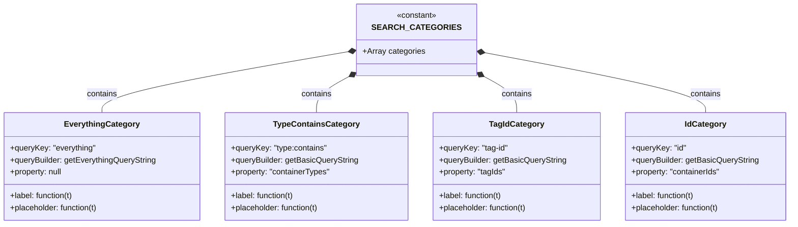

# Diagram: web/portal/src/pages/containertracking/search/ContainerTrackingSearchCategoryDefs.js

> Auto-generated by Obscura crawlers

## Mermaid

### SVG

<svg id="container" width="1573.2421875" xmlns="http://www.w3.org/2000/svg" class="classDiagram" height="450" viewBox="0 0 1573.2421875 450" role="graphics-document document" aria-roledescription="class"><g><defs><marker id="container_class-aggregationStart" class="marker aggregation class" refX="18" refY="7" markerWidth="190" markerHeight="240" orient="auto"><path d="M 18,7 L9,13 L1,7 L9,1 Z"></path></marker></defs><defs><marker id="container_class-aggregationEnd" class="marker aggregation class" refX="1" refY="7" markerWidth="20" markerHeight="28" orient="auto"><path d="M 18,7 L9,13 L1,7 L9,1 Z"></path></marker></defs><defs><marker id="container_class-extensionStart" class="marker extension class" refX="18" refY="7" markerWidth="190" markerHeight="240" orient="auto"><path d="M 1,7 L18,13 V 1 Z"></path></marker></defs><defs><marker id="container_class-extensionEnd" class="marker extension class" refX="1" refY="7" markerWidth="20" markerHeight="28" orient="auto"><path d="M 1,1 V 13 L18,7 Z"></path></marker></defs><defs><marker id="container_class-compositionStart" class="marker composition class" refX="18" refY="7" markerWidth="190" markerHeight="240" orient="auto"><path d="M 18,7 L9,13 L1,7 L9,1 Z"></path></marker></defs><defs><marker id="container_class-compositionEnd" class="marker composition class" refX="1" refY="7" markerWidth="20" markerHeight="28" orient="auto"><path d="M 18,7 L9,13 L1,7 L9,1 Z"></path></marker></defs><defs><marker id="container_class-dependencyStart" class="marker dependency class" refX="6" refY="7" markerWidth="190" markerHeight="240" orient="auto"><path d="M 5,7 L9,13 L1,7 L9,1 Z"></path></marker></defs><defs><marker id="container_class-dependencyEnd" class="marker dependency class" refX="13" refY="7" markerWidth="20" markerHeight="28" orient="auto"><path d="M 18,7 L9,13 L14,7 L9,1 Z"></path></marker></defs><defs><marker id="container_class-lollipopStart" class="marker lollipop class" refX="13" refY="7" markerWidth="190" markerHeight="240" orient="auto"><circle stroke="black" fill="transparent" cx="7" cy="7" r="6"></circle></marker></defs><defs><marker id="container_class-lollipopEnd" class="marker lollipop class" refX="1" refY="7" markerWidth="190" markerHeight="240" orient="auto"><circle stroke="black" fill="transparent" cx="7" cy="7" r="6"></circle></marker></defs><g class="root"><g class="clusters"></g><g class="edgePaths"><path d="M699.846,102.493L617.09,116.911C534.333,131.329,368.821,160.164,286.065,180.749C203.309,201.333,203.309,213.667,203.309,219.833L203.309,226" id="id_SEARCH_CATEGORIES_EverythingCategory_1" class="edge-thickness-normal edge-pattern-solid relation" style=";;;" data-edge="true" data-et="edge" data-id="id_SEARCH_CATEGORIES_EverythingCategory_1" data-points="W3sieCI6NzE2LjgzOTg0Mzc1LCJ5Ijo5OS41MzI0MTM0NDg2MzExfSx7IngiOjIwMy4zMDg1OTM3NSwieSI6MTg5fSx7IngiOjIwMy4zMDg1OTM3NSwieSI6MjI2fV0=" marker-start="url(#container_class-compositionStart)"></path><path d="M701.711,149.698L689.753,156.249C677.794,162.799,653.878,175.899,641.919,188.616C629.961,201.333,629.961,213.667,629.961,219.833L629.961,226" id="id_SEARCH_CATEGORIES_TypeContainsCategory_2" class="edge-thickness-normal edge-pattern-solid relation" style=";;;" data-edge="true" data-et="edge" data-id="id_SEARCH_CATEGORIES_TypeContainsCategory_2" data-points="W3sieCI6NzE2LjgzOTg0Mzc1LCJ5IjoxNDEuNDExMTkzMTIxNTg5MjZ9LHsieCI6NjI5Ljk2MDkzNzUsInkiOjE4OX0seyJ4Ijo2MjkuOTYwOTM3NSwieSI6MjI2fV0=" marker-start="url(#container_class-compositionStart)"></path><path d="M956.195,149.698L968.154,156.249C980.112,162.799,1004.029,175.899,1015.987,188.616C1027.945,201.333,1027.945,213.667,1027.945,219.833L1027.945,226" id="id_SEARCH_CATEGORIES_TagIdCategory_3" class="edge-thickness-normal edge-pattern-solid relation" style=";;;" data-edge="true" data-et="edge" data-id="id_SEARCH_CATEGORIES_TagIdCategory_3" data-points="W3sieCI6OTQxLjA2NjQwNjI1LCJ5IjoxNDEuNDExMTkzMTIxNTg5MjZ9LHsieCI6MTAyNy45NDUzMTI1LCJ5IjoxODl9LHsieCI6MTAyNy45NDUzMTI1LCJ5IjoyMjZ9XQ==" marker-start="url(#container_class-compositionStart)"></path><path d="M958.016,104.425L1032.499,118.521C1106.982,132.617,1255.948,160.808,1330.431,181.071C1404.914,201.333,1404.914,213.667,1404.914,219.833L1404.914,226" id="id_SEARCH_CATEGORIES_IdCategory_4" class="edge-thickness-normal edge-pattern-solid relation" style=";;;" data-edge="true" data-et="edge" data-id="id_SEARCH_CATEGORIES_IdCategory_4" data-points="W3sieCI6OTQxLjA2NjQwNjI1LCJ5IjoxMDEuMjE3MzIwMjM5Mjc0MDR9LHsieCI6MTQwNC45MTQwNjI1LCJ5IjoxODl9LHsieCI6MTQwNC45MTQwNjI1LCJ5IjoyMjZ9XQ==" marker-start="url(#container_class-compositionStart)"></path></g><g class="edgeLabels"><g class="edgeLabel" transform="translate(203.30859375, 189)"><g class="label" data-id="id_SEARCH_CATEGORIES_EverythingCategory_1" transform="translate(-30.890625, -12)"><foreignObject width="61.78125" height="24">

contains

</foreignObject></g></g><g class="edgeLabel" transform="translate(629.9609375, 189)"><g class="label" data-id="id_SEARCH_CATEGORIES_TypeContainsCategory_2" transform="translate(-30.890625, -12)"><foreignObject width="61.78125" height="24">

contains

</foreignObject></g></g><g class="edgeLabel" transform="translate(1027.9453125, 189)"><g class="label" data-id="id_SEARCH_CATEGORIES_TagIdCategory_3" transform="translate(-30.890625, -12)"><foreignObject width="61.78125" height="24">

contains

</foreignObject></g></g><g class="edgeLabel" transform="translate(1404.9140625, 189)"><g class="label" data-id="id_SEARCH_CATEGORIES_IdCategory_4" transform="translate(-30.890625, -12)"><foreignObject width="61.78125" height="24">

contains

</foreignObject></g></g></g><g class="nodes"><g class="node default" id="classId-SEARCH_CATEGORIES-0" transform="translate(828.953125, 80)"><g class="basic label-container"><path d="M-112.11328125 -72 L112.11328125 -72 L112.11328125 72 L-112.11328125 72" stroke="none" stroke-width="0" fill="#ECECFF" style=""></path><path d="M-112.11328125 -72 C-35.32424555932191 -72, 41.46479013135618 -72, 112.11328125 -72 M-112.11328125 -72 C-24.12782941656269 -72, 63.85762241687462 -72, 112.11328125 -72 M112.11328125 -72 C112.11328125 -20.520562453827075, 112.11328125 30.95887509234585, 112.11328125 72 M112.11328125 -72 C112.11328125 -42.74792540599312, 112.11328125 -13.495850811986244, 112.11328125 72 M112.11328125 72 C23.040489278252053 72, -66.0323026934959 72, -112.11328125 72 M112.11328125 72 C49.28969154672891 72, -13.533898156542179 72, -112.11328125 72 M-112.11328125 72 C-112.11328125 25.86020212313698, -112.11328125 -20.279595753726042, -112.11328125 -72 M-112.11328125 72 C-112.11328125 20.63814830606647, -112.11328125 -30.72370338786706, -112.11328125 -72" stroke="#9370DB" stroke-width="1.3" fill="none" stroke-dasharray="0 0" style=""></path></g><g class="annotation-group text" transform="translate(-40.4921875, -48)"><g class="label" style="" transform="translate(0,-12)"><foreignObject width="80.984375" height="24">

«constant»

</foreignObject></g></g><g class="label-group text" transform="translate(-76.1171875, -24)"><g class="label" style="font-weight: bolder" transform="translate(0,-12)"><foreignObject width="152.234375" height="24">

SEARCH_CATEGORIES

</foreignObject></g></g><g class="members-group text" transform="translate(-100.11328125, 24)"><g class="label" style="" transform="translate(0,-12)"><foreignObject width="124.109375" height="24">

+Array categories

</foreignObject></g></g><g class="methods-group text" transform="translate(-100.11328125, 72)"></g><g class="divider" style=""><path d="M-112.11328125 0 C-38.633584059433076 0, 34.84611313113385 0, 112.11328125 0 M-112.11328125 0 C-56.3725472292402 0, -0.6318132084803949 0, 112.11328125 0" stroke="#9370DB" stroke-width="1.3" fill="none" stroke-dasharray="0 0" style=""></path></g><g class="divider" style=""><path d="M-112.11328125 48 C-48.38183783397306 48, 15.349605582053883 48, 112.11328125 48 M-112.11328125 48 C-38.37544595136386 48, 35.362389347272284 48, 112.11328125 48" stroke="#9370DB" stroke-width="1.3" fill="none" stroke-dasharray="0 0" style=""></path></g></g><g class="node default" id="classId-EverythingCategory-1" transform="translate(203.30859375, 334)"><g class="basic label-container"><path d="M-195.30859375 -108 L195.30859375 -108 L195.30859375 108 L-195.30859375 108" stroke="none" stroke-width="0" fill="#ECECFF" style=""></path><path d="M-195.30859375 -108 C-80.25842995987817 -108, 34.79173383024366 -108, 195.30859375 -108 M-195.30859375 -108 C-107.22802237103429 -108, -19.14745099206857 -108, 195.30859375 -108 M195.30859375 -108 C195.30859375 -35.433321368575605, 195.30859375 37.13335726284879, 195.30859375 108 M195.30859375 -108 C195.30859375 -49.24602012901315, 195.30859375 9.507959741973707, 195.30859375 108 M195.30859375 108 C74.83089072031008 108, -45.64681230937984 108, -195.30859375 108 M195.30859375 108 C106.35999419793767 108, 17.411394645875333 108, -195.30859375 108 M-195.30859375 108 C-195.30859375 25.722539395409044, -195.30859375 -56.55492120918191, -195.30859375 -108 M-195.30859375 108 C-195.30859375 23.2398711057306, -195.30859375 -61.5202577885388, -195.30859375 -108" stroke="#9370DB" stroke-width="1.3" fill="none" stroke-dasharray="0 0" style=""></path></g><g class="annotation-group text" transform="translate(0, -84)"></g><g class="label-group text" transform="translate(-71.3671875, -84)"><g class="label" style="font-weight: bolder" transform="translate(0,-12)"><foreignObject width="142.734375" height="24">

EverythingCategory

</foreignObject></g></g><g class="members-group text" transform="translate(-183.30859375, -36)"><g class="label" style="" transform="translate(0,-12)"><foreignObject width="172.71875" height="24">

+queryKey: "everything"

</foreignObject></g><g class="label" style="" transform="translate(0,12)"><foreignObject width="295.25" height="24">

+queryBuilder: getEverythingQueryString

</foreignObject></g><g class="label" style="" transform="translate(0,36)"><foreignObject width="106.71875" height="24">

+property: null

</foreignObject></g></g><g class="methods-group text" transform="translate(-183.30859375, 60)"><g class="label" style="" transform="translate(0,-12)"><foreignObject width="129.296875" height="24">

+label: function(t)

</foreignObject></g><g class="label" style="" transform="translate(0,12)"><foreignObject width="179.734375" height="24">

+placeholder: function(t)

</foreignObject></g></g><g class="divider" style=""><path d="M-195.30859375 -60 C-115.94182021325804 -60, -36.57504667651608 -60, 195.30859375 -60 M-195.30859375 -60 C-106.7786351267074 -60, -18.2486765034148 -60, 195.30859375 -60" stroke="#9370DB" stroke-width="1.3" fill="none" stroke-dasharray="0 0" style=""></path></g><g class="divider" style=""><path d="M-195.30859375 36 C-70.81879424411656 36, 53.67100526176688 36, 195.30859375 36 M-195.30859375 36 C-104.16108919194546 36, -13.013584633890929 36, 195.30859375 36" stroke="#9370DB" stroke-width="1.3" fill="none" stroke-dasharray="0 0" style=""></path></g></g><g class="node default" id="classId-TypeContainsCategory-2" transform="translate(629.9609375, 334)"><g class="basic label-container"><path d="M-181.34375 -108 L181.34375 -108 L181.34375 108 L-181.34375 108" stroke="none" stroke-width="0" fill="#ECECFF" style=""></path><path d="M-181.34375 -108 C-41.72189670306773 -108, 97.89995659386454 -108, 181.34375 -108 M-181.34375 -108 C-85.50814220579245 -108, 10.327465588415095 -108, 181.34375 -108 M181.34375 -108 C181.34375 -55.63282944555529, 181.34375 -3.2656588911105757, 181.34375 108 M181.34375 -108 C181.34375 -61.64647483853072, 181.34375 -15.292949677061443, 181.34375 108 M181.34375 108 C82.26040598645477 108, -16.82293802709046 108, -181.34375 108 M181.34375 108 C58.76694751244777 108, -63.80985497510446 108, -181.34375 108 M-181.34375 108 C-181.34375 25.94612310761059, -181.34375 -56.10775378477882, -181.34375 -108 M-181.34375 108 C-181.34375 49.986945992996624, -181.34375 -8.026108014006752, -181.34375 -108" stroke="#9370DB" stroke-width="1.3" fill="none" stroke-dasharray="0 0" style=""></path></g><g class="annotation-group text" transform="translate(0, -84)"></g><g class="label-group text" transform="translate(-81.703125, -84)"><g class="label" style="font-weight: bolder" transform="translate(0,-12)"><foreignObject width="163.40625" height="24">

TypeContainsCategory

</foreignObject></g></g><g class="members-group text" transform="translate(-169.34375, -36)"><g class="label" style="" transform="translate(0,-12)"><foreignObject width="193.609375" height="24">

+queryKey: "type:contains"

</foreignObject></g><g class="label" style="" transform="translate(0,12)"><foreignObject width="256.984375" height="24">

+queryBuilder: getBasicQueryString

</foreignObject></g><g class="label" style="" transform="translate(0,36)"><foreignObject width="201.421875" height="24">

+property: "containerTypes"

</foreignObject></g></g><g class="methods-group text" transform="translate(-169.34375, 60)"><g class="label" style="" transform="translate(0,-12)"><foreignObject width="129.296875" height="24">

+label: function(t)

</foreignObject></g><g class="label" style="" transform="translate(0,12)"><foreignObject width="179.734375" height="24">

+placeholder: function(t)

</foreignObject></g></g><g class="divider" style=""><path d="M-181.34375 -60 C-105.71907647115248 -60, -30.094402942304953 -60, 181.34375 -60 M-181.34375 -60 C-58.537740473854484 -60, 64.26826905229103 -60, 181.34375 -60" stroke="#9370DB" stroke-width="1.3" fill="none" stroke-dasharray="0 0" style=""></path></g><g class="divider" style=""><path d="M-181.34375 36 C-49.42176314283316 36, 82.50022371433369 36, 181.34375 36 M-181.34375 36 C-39.374835725024184 36, 102.59407854995163 36, 181.34375 36" stroke="#9370DB" stroke-width="1.3" fill="none" stroke-dasharray="0 0" style=""></path></g></g><g class="node default" id="classId-TagIdCategory-3" transform="translate(1027.9453125, 334)"><g class="basic label-container"><path d="M-166.640625 -108 L166.640625 -108 L166.640625 108 L-166.640625 108" stroke="none" stroke-width="0" fill="#ECECFF" style=""></path><path d="M-166.640625 -108 C-93.89718904169874 -108, -21.153753083397476 -108, 166.640625 -108 M-166.640625 -108 C-40.75404954853076 -108, 85.13252590293848 -108, 166.640625 -108 M166.640625 -108 C166.640625 -40.70818831734175, 166.640625 26.583623365316498, 166.640625 108 M166.640625 -108 C166.640625 -53.55520455680899, 166.640625 0.8895908863820239, 166.640625 108 M166.640625 108 C89.76883033665703 108, 12.897035673314065 108, -166.640625 108 M166.640625 108 C52.935852834600425 108, -60.76891933079915 108, -166.640625 108 M-166.640625 108 C-166.640625 58.57665151009741, -166.640625 9.153303020194826, -166.640625 -108 M-166.640625 108 C-166.640625 29.353118644879686, -166.640625 -49.29376271024063, -166.640625 -108" stroke="#9370DB" stroke-width="1.3" fill="none" stroke-dasharray="0 0" style=""></path></g><g class="annotation-group text" transform="translate(0, -84)"></g><g class="label-group text" transform="translate(-52.296875, -84)"><g class="label" style="font-weight: bolder" transform="translate(0,-12)"><foreignObject width="104.59375" height="24">

TagIdCategory

</foreignObject></g></g><g class="members-group text" transform="translate(-154.640625, -36)"><g class="label" style="" transform="translate(0,-12)"><foreignObject width="139.34375" height="24">

+queryKey: "tag-id"

</foreignObject></g><g class="label" style="" transform="translate(0,12)"><foreignObject width="256.984375" height="24">

+queryBuilder: getBasicQueryString

</foreignObject></g><g class="label" style="" transform="translate(0,36)"><foreignObject width="135.625" height="24">

+property: "tagIds"

</foreignObject></g></g><g class="methods-group text" transform="translate(-154.640625, 60)"><g class="label" style="" transform="translate(0,-12)"><foreignObject width="129.296875" height="24">

+label: function(t)

</foreignObject></g><g class="label" style="" transform="translate(0,12)"><foreignObject width="179.734375" height="24">

+placeholder: function(t)

</foreignObject></g></g><g class="divider" style=""><path d="M-166.640625 -60 C-87.82964081330596 -60, -9.018656626611914 -60, 166.640625 -60 M-166.640625 -60 C-74.97532861503525 -60, 16.689967769929495 -60, 166.640625 -60" stroke="#9370DB" stroke-width="1.3" fill="none" stroke-dasharray="0 0" style=""></path></g><g class="divider" style=""><path d="M-166.640625 36 C-92.51678699295425 36, -18.392948985908504 36, 166.640625 36 M-166.640625 36 C-53.000200247764866 36, 60.64022450447027 36, 166.640625 36" stroke="#9370DB" stroke-width="1.3" fill="none" stroke-dasharray="0 0" style=""></path></g></g><g class="node default" id="classId-IdCategory-4" transform="translate(1404.9140625, 334)"><g class="basic label-container"><path d="M-160.328125 -108 L160.328125 -108 L160.328125 108 L-160.328125 108" stroke="none" stroke-width="0" fill="#ECECFF" style=""></path><path d="M-160.328125 -108 C-86.899217672731 -108, -13.470310345461996 -108, 160.328125 -108 M-160.328125 -108 C-48.796115255509676 -108, 62.73589448898065 -108, 160.328125 -108 M160.328125 -108 C160.328125 -48.89139445427716, 160.328125 10.217211091445677, 160.328125 108 M160.328125 -108 C160.328125 -46.56184768930337, 160.328125 14.87630462139326, 160.328125 108 M160.328125 108 C52.02472436789536 108, -56.27867626420928 108, -160.328125 108 M160.328125 108 C92.264834119423 108, 24.201543238846 108, -160.328125 108 M-160.328125 108 C-160.328125 55.34665321464605, -160.328125 2.693306429292093, -160.328125 -108 M-160.328125 108 C-160.328125 35.72221109416935, -160.328125 -36.555577811661294, -160.328125 -108" stroke="#9370DB" stroke-width="1.3" fill="none" stroke-dasharray="0 0" style=""></path></g><g class="annotation-group text" transform="translate(0, -84)"></g><g class="label-group text" transform="translate(-39.671875, -84)"><g class="label" style="font-weight: bolder" transform="translate(0,-12)"><foreignObject width="79.34375" height="24">

IdCategory

</foreignObject></g></g><g class="members-group text" transform="translate(-148.328125, -36)"><g class="label" style="" transform="translate(0,-12)"><foreignObject width="110.359375" height="24">

+queryKey: "id"

</foreignObject></g><g class="label" style="" transform="translate(0,12)"><foreignObject width="256.984375" height="24">

+queryBuilder: getBasicQueryString

</foreignObject></g><g class="label" style="" transform="translate(0,36)"><foreignObject width="181.96875" height="24">

+property: "containerIds"

</foreignObject></g></g><g class="methods-group text" transform="translate(-148.328125, 60)"><g class="label" style="" transform="translate(0,-12)"><foreignObject width="129.296875" height="24">

+label: function(t)

</foreignObject></g><g class="label" style="" transform="translate(0,12)"><foreignObject width="179.734375" height="24">

+placeholder: function(t)

</foreignObject></g></g><g class="divider" style=""><path d="M-160.328125 -60 C-75.91429328231209 -60, 8.499538435375825 -60, 160.328125 -60 M-160.328125 -60 C-86.3270460086597 -60, -12.325967017319414 -60, 160.328125 -60" stroke="#9370DB" stroke-width="1.3" fill="none" stroke-dasharray="0 0" style=""></path></g><g class="divider" style=""><path d="M-160.328125 36 C-87.4891034918109 36, -14.650081983621789 36, 160.328125 36 M-160.328125 36 C-91.12261144515665 36, -21.9170978903133 36, 160.328125 36" stroke="#9370DB" stroke-width="1.3" fill="none" stroke-dasharray="0 0" style=""></path></g></g></g></g></g></svg>
