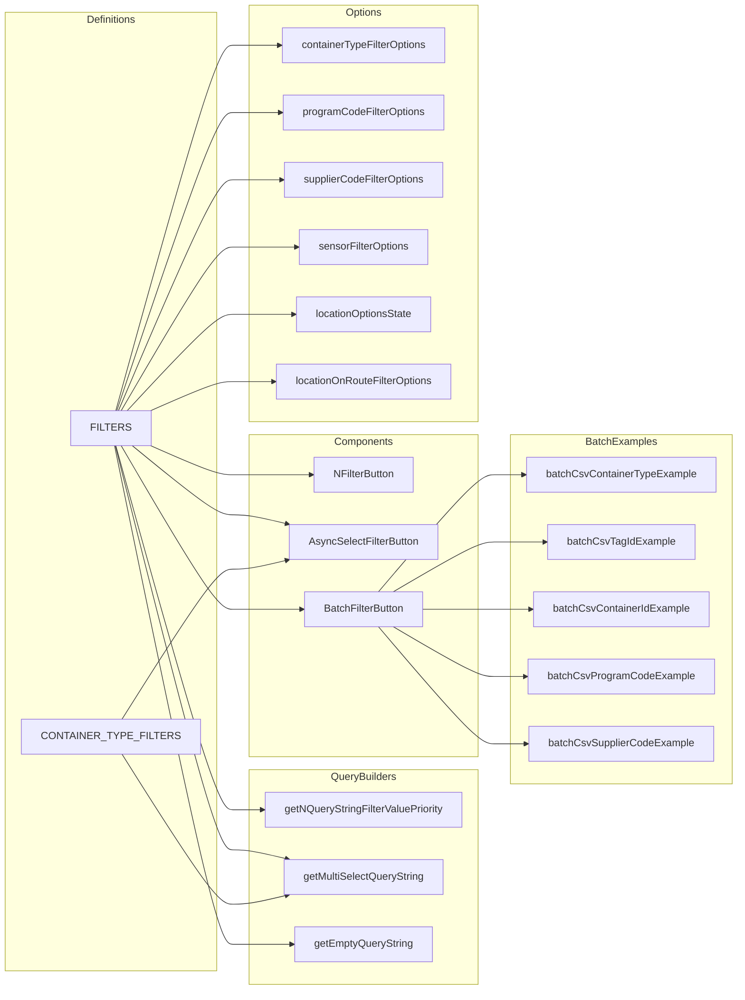

# Diagram: web/portal/src/pages/containertracking/search/ContainerTrackingSearchFilterDefs.ts

> Auto-generated by Obscura crawlers

## Diagram 1

```mermaid
classDiagram
class FilterProps {
  +label: string
  +value: string
}
class TranslateFunction
class FILTERS <<Array>>
class CONTAINER_TYPE_FILTERS <<Array>>
class NFilterButton
class AsyncSelectFilterButton
class BatchFilterButton
class getMultiSelectQueryString
class getNQueryStringFilterValuePriority
class getEmptyQueryString
class containerTypeFilterOptions
class programCodeFilterOptions
class supplierCodeFilterOptions
class sensorFilterOptions
class locationOptionsState
class locationOnRouteFilterOptions
class batchCsvContainerTypeExample
class batchCsvTagIdExample
class batchCsvContainerIdExample
class batchCsvProgramCodeExample
class batchCsvSupplierCodeExample

FILTERS --> FilterProps : "filterValue items"
FILTERS --> TranslateFunction : "label(t)"
FILTERS --> NFilterButton
FILTERS --> AsyncSelectFilterButton
FILTERS --> BatchFilterButton
FILTERS --> getMultiSelectQueryString
FILTERS --> getNQueryStringFilterValuePriority
FILTERS --> getEmptyQueryString
FILTERS --> containerTypeFilterOptions
FILTERS --> programCodeFilterOptions
FILTERS --> supplierCodeFilterOptions
FILTERS --> sensorFilterOptions
FILTERS --> locationOptionsState
FILTERS --> locationOnRouteFilterOptions
FILTERS --> batchCsvContainerTypeExample
FILTERS --> batchCsvTagIdExample
FILTERS --> batchCsvContainerIdExample
FILTERS --> batchCsvProgramCodeExample
FILTERS --> batchCsvSupplierCodeExample

CONTAINER_TYPE_FILTERS --> containerTypeFilterOptions
CONTAINER_TYPE_FILTERS --> programCodeFilterOptions
CONTAINER_TYPE_FILTERS --> supplierCodeFilterOptions
CONTAINER_TYPE_FILTERS --> AsyncSelectFilterButton
CONTAINER_TYPE_FILTERS --> getMultiSelectQueryString
```

> SVG rendering failed for this diagram.

## Diagram 2

### SVG

<svg id="container" width="1111.515625" xmlns="http://www.w3.org/2000/svg" class="flowchart" height="1530" viewBox="0 0 1111.515625 1530" role="graphics-document document" aria-roledescription="flowchart-v2"><g><marker id="container_flowchart-v2-pointEnd" class="marker flowchart-v2" viewBox="0 0 10 10" refX="5" refY="5" markerUnits="userSpaceOnUse" markerWidth="8" markerHeight="8" orient="auto"><path d="M 0 0 L 10 5 L 0 10 z" class="arrowMarkerPath" style="stroke-width: 1; stroke-dasharray: 1, 0;"></path></marker><marker id="container_flowchart-v2-pointStart" class="marker flowchart-v2" viewBox="0 0 10 10" refX="4.5" refY="5" markerUnits="userSpaceOnUse" markerWidth="8" markerHeight="8" orient="auto"><path d="M 0 5 L 10 10 L 10 0 z" class="arrowMarkerPath" style="stroke-width: 1; stroke-dasharray: 1, 0;"></path></marker><marker id="container_flowchart-v2-circleEnd" class="marker flowchart-v2" viewBox="0 0 10 10" refX="11" refY="5" markerUnits="userSpaceOnUse" markerWidth="11" markerHeight="11" orient="auto"><circle cx="5" cy="5" r="5" class="arrowMarkerPath" style="stroke-width: 1; stroke-dasharray: 1, 0;"></circle></marker><marker id="container_flowchart-v2-circleStart" class="marker flowchart-v2" viewBox="0 0 10 10" refX="-1" refY="5" markerUnits="userSpaceOnUse" markerWidth="11" markerHeight="11" orient="auto"><circle cx="5" cy="5" r="5" class="arrowMarkerPath" style="stroke-width: 1; stroke-dasharray: 1, 0;"></circle></marker><marker id="container_flowchart-v2-crossEnd" class="marker cross flowchart-v2" viewBox="0 0 11 11" refX="12" refY="5.2" markerUnits="userSpaceOnUse" markerWidth="11" markerHeight="11" orient="auto"><path d="M 1,1 l 9,9 M 10,1 l -9,9" class="arrowMarkerPath" style="stroke-width: 2; stroke-dasharray: 1, 0;"></path></marker><marker id="container_flowchart-v2-crossStart" class="marker cross flowchart-v2" viewBox="0 0 11 11" refX="-1" refY="5.2" markerUnits="userSpaceOnUse" markerWidth="11" markerHeight="11" orient="auto"><path d="M 1,1 l 9,9 M 10,1 l -9,9" class="arrowMarkerPath" style="stroke-width: 2; stroke-dasharray: 1, 0;"></path></marker><g class="root"><g class="clusters"><g class="cluster" id="BatchExamples" data-look="classic"><rect style="" x="763.5" y="672" width="340.015625" height="540"></rect><g class="cluster-label" transform="translate(878.609375, 672)"><foreignObject width="109.796875" height="24">

BatchExamples

</foreignObject></g></g><g class="cluster" id="Options" data-look="classic"><rect style="" x="354.28125" y="8" width="359.21875" height="644"></rect><g class="cluster-label" transform="translate(505.359375, 8)"><foreignObject width="57.0625" height="24">

Options

</foreignObject></g></g><g class="cluster" id="Components" data-look="classic"><rect style="" x="354.28125" y="672" width="359.21875" height="498"></rect><g class="cluster-label" transform="translate(488.2578125, 672)"><foreignObject width="91.265625" height="24">

Components

</foreignObject></g></g><g class="cluster" id="QueryBuilders" data-look="classic"><rect style="" x="354.28125" y="1190" width="359.21875" height="332"></rect><g class="cluster-label" transform="translate(482.390625, 1190)"><foreignObject width="103" height="24">

QueryBuilders

</foreignObject></g></g><g class="cluster" id="Definitions" data-look="classic"><rect style="" x="8" y="19" width="296.28125" height="1482"></rect><g class="cluster-label" transform="translate(116.84375, 19)"><foreignObject width="78.59375" height="24">

Definitions

</foreignObject></g></g></g><g class="edgePaths"><path d="M162.92,689L186.48,782.833C210.04,876.667,257.161,1064.333,284.888,1158.167C312.615,1252,320.948,1252,329.281,1252C337.615,1252,345.948,1252,353.615,1252C361.281,1252,368.281,1252,371.781,1252L375.281,1252" id="L_F_QB1_0" class="edge-thickness-normal edge-pattern-solid edge-thickness-normal edge-pattern-solid flowchart-link" style=";" data-edge="true" data-et="edge" data-id="L_F_QB1_0" data-points="W3sieCI6MTYyLjkxOTk0MTczNzI4ODEzLCJ5Ijo2ODl9LHsieCI6MzA0LjI4MTI1LCJ5IjoxMjUyfSx7IngiOjMyOS4yODEyNSwieSI6MTI1Mn0seyJ4IjozNTQuMjgxMjUsInkiOjEyNTJ9LHsieCI6Mzc5LjI4MTI1LCJ5IjoxMjUyfV0=" marker-end="url(#container_flowchart-v2-pointEnd)"></path><path d="M162.275,689L185.943,793.167C209.611,897.333,256.946,1105.667,284.78,1209.833C312.615,1314,320.948,1314,329.281,1314C337.615,1314,345.948,1314,360.156,1316.348C374.365,1318.696,394.449,1323.393,404.491,1325.741L414.533,1328.089" id="L_F_QB2_0" class="edge-thickness-normal edge-pattern-solid edge-thickness-normal edge-pattern-solid flowchart-link" style=";" data-edge="true" data-et="edge" data-id="L_F_QB2_0" data-points="W3sieCI6MTYyLjI3NTI4Mjc4Mzc0MjM0LCJ5Ijo2ODl9LHsieCI6MzA0LjI4MTI1LCJ5IjoxMzE0fSx7IngiOjMyOS4yODEyNSwieSI6MTMxNH0seyJ4IjozNTQuMjgxMjUsInkiOjEzMTR9LHsieCI6NDE4LjQyNzQ1NTM1NzE0MjksInkiOjEzMjl9XQ==" marker-end="url(#container_flowchart-v2-pointEnd)"></path><path d="M161.153,689L185.008,817.5C208.862,946,256.572,1203,284.593,1331.5C312.615,1460,320.948,1460,329.281,1460C337.615,1460,345.948,1460,361.569,1460C377.19,1460,400.099,1460,411.553,1460L423.008,1460" id="L_F_QB3_0" class="edge-thickness-normal edge-pattern-solid edge-thickness-normal edge-pattern-solid flowchart-link" style=";" data-edge="true" data-et="edge" data-id="L_F_QB3_0" data-points="W3sieCI6MTYxLjE1MjkwMTc4NTcxNDI4LCJ5Ijo2ODl9LHsieCI6MzA0LjI4MTI1LCJ5IjoxNDYwfSx7IngiOjMyOS4yODEyNSwieSI6MTQ2MH0seyJ4IjozNTQuMjgxMjUsInkiOjE0NjB9LHsieCI6NDI3LjAwNzgxMjUsInkiOjE0NjB9XQ==" marker-end="url(#container_flowchart-v2-pointEnd)"></path><path d="M171.584,1166L193.7,1204.667C215.816,1243.333,260.049,1320.667,286.332,1359.333C312.615,1398,320.948,1398,329.281,1398C337.615,1398,345.948,1398,360.156,1395.652C374.365,1393.304,394.449,1388.607,404.491,1386.259L414.533,1383.911" id="L_C_QB2_0" class="edge-thickness-normal edge-pattern-solid edge-thickness-normal edge-pattern-solid flowchart-link" style=";" data-edge="true" data-et="edge" data-id="L_C_QB2_0" data-points="W3sieCI6MTcxLjU4Mzg1NjE3NzYwNjE4LCJ5IjoxMTY2fSx7IngiOjMwNC4yODEyNSwieSI6MTM5OH0seyJ4IjozMjkuMjgxMjUsInkiOjEzOTh9LHsieCI6MzU0LjI4MTI1LCJ5IjoxMzk4fSx7IngiOjQxOC40Mjc0NTUzNTcxNDI5LCJ5IjoxMzgzfV0=" marker-end="url(#container_flowchart-v2-pointEnd)"></path><path d="M211.693,689L227.125,696.5C242.556,704,273.419,719,293.017,726.5C312.615,734,320.948,734,329.281,734C337.615,734,345.948,734,366.305,734C386.661,734,419.042,734,435.232,734L451.422,734" id="L_F_NB_0" class="edge-thickness-normal edge-pattern-solid edge-thickness-normal edge-pattern-solid flowchart-link" style=";" data-edge="true" data-et="edge" data-id="L_F_NB_0" data-points="W3sieCI6MjExLjY5MzM1OTM3NSwieSI6Njg5fSx7IngiOjMwNC4yODEyNSwieSI6NzM0fSx7IngiOjMyOS4yODEyNSwieSI6NzM0fSx7IngiOjM1NC4yODEyNSwieSI6NzM0fSx7IngiOjQ1NS40MjE4NzUsInkiOjczNH1d" marker-end="url(#container_flowchart-v2-pointEnd)"></path><path d="M185.99,689L205.705,706.833C225.42,724.667,264.851,760.333,288.733,778.167C312.615,796,320.948,796,329.281,796C337.615,796,345.948,796,360.156,798.348C374.365,800.696,394.449,805.393,404.491,807.741L414.533,810.089" id="L_F_AS_0" class="edge-thickness-normal edge-pattern-solid edge-thickness-normal edge-pattern-solid flowchart-link" style=";" data-edge="true" data-et="edge" data-id="L_F_AS_0" data-points="W3sieCI6MTg1Ljk4OTg1NTQxMDQ0Nzc3LCJ5Ijo2ODl9LHsieCI6MzA0LjI4MTI1LCJ5Ijo3OTZ9LHsieCI6MzI5LjI4MTI1LCJ5Ijo3OTZ9LHsieCI6MzU0LjI4MTI1LCJ5Ijo3OTZ9LHsieCI6NDE4LjQyNzQ1NTM1NzE0MjksInkiOjgxMX1d" marker-end="url(#container_flowchart-v2-pointEnd)"></path><path d="M170.426,689L192.735,731.167C215.044,773.333,259.663,857.667,286.139,899.833C312.615,942,320.948,942,329.281,942C337.615,942,345.948,942,363.799,942C381.651,942,409.021,942,422.706,942L436.391,942" id="L_F_BB_0" class="edge-thickness-normal edge-pattern-solid edge-thickness-normal edge-pattern-solid flowchart-link" style=";" data-edge="true" data-et="edge" data-id="L_F_BB_0" data-points="W3sieCI6MTcwLjQyNTYxMzgzOTI4NTcyLCJ5Ijo2ODl9LHsieCI6MzA0LjI4MTI1LCJ5Ijo5NDJ9LHsieCI6MzI5LjI4MTI1LCJ5Ijo5NDJ9LHsieCI6MzU0LjI4MTI1LCJ5Ijo5NDJ9LHsieCI6NDQwLjM5MDYyNSwieSI6OTQyfV0=" marker-end="url(#container_flowchart-v2-pointEnd)"></path><path d="M171.584,1112L193.7,1073.333C215.816,1034.667,260.049,957.333,286.332,918.667C312.615,880,320.948,880,329.281,880C337.615,880,345.948,880,360.156,877.652C374.365,875.304,394.449,870.607,404.491,868.259L414.533,865.911" id="L_C_AS_0" class="edge-thickness-normal edge-pattern-solid edge-thickness-normal edge-pattern-solid flowchart-link" style=";" data-edge="true" data-et="edge" data-id="L_C_AS_0" data-points="W3sieCI6MTcxLjU4Mzg1NjE3NzYwNjE4LCJ5IjoxMTEyfSx7IngiOjMwNC4yODEyNSwieSI6ODgwfSx7IngiOjMyOS4yODEyNSwieSI6ODgwfSx7IngiOjM1NC4yODEyNSwieSI6ODgwfSx7IngiOjQxOC40Mjc0NTUzNTcxNDI5LCJ5Ijo4NjV9XQ==" marker-end="url(#container_flowchart-v2-pointEnd)"></path><path d="M162.897,635L186.461,540.833C210.025,446.667,257.153,258.333,284.884,164.167C312.615,70,320.948,70,329.281,70C337.615,70,345.948,70,357.973,70C369.997,70,385.714,70,393.572,70L401.43,70" id="L_F_CT_0" class="edge-thickness-normal edge-pattern-solid edge-thickness-normal edge-pattern-solid flowchart-link" style=";" data-edge="true" data-et="edge" data-id="L_F_CT_0" data-points="W3sieCI6MTYyLjg5NzAzODY0MDIwMjcsInkiOjYzNX0seyJ4IjozMDQuMjgxMjUsInkiOjcwfSx7IngiOjMyOS4yODEyNSwieSI6NzB9LHsieCI6MzU0LjI4MTI1LCJ5Ijo3MH0seyJ4Ijo0MDUuNDI5Njg3NSwieSI6NzB9XQ==" marker-end="url(#container_flowchart-v2-pointEnd)"></path><path d="M164.337,635L187.661,558.167C210.985,481.333,257.633,327.667,285.124,250.833C312.615,174,320.948,174,329.281,174C337.615,174,345.948,174,358.453,174C370.958,174,387.635,174,395.974,174L404.313,174" id="L_F_PC_0" class="edge-thickness-normal edge-pattern-solid edge-thickness-normal edge-pattern-solid flowchart-link" style=";" data-edge="true" data-et="edge" data-id="L_F_PC_0" data-points="W3sieCI6MTY0LjMzNjkzMDA3MTcyMTMzLCJ5Ijo2MzV9LHsieCI6MzA0LjI4MTI1LCJ5IjoxNzR9LHsieCI6MzI5LjI4MTI1LCJ5IjoxNzR9LHsieCI6MzU0LjI4MTI1LCJ5IjoxNzR9LHsieCI6NDA4LjMxMjUsInkiOjE3NH1d" marker-end="url(#container_flowchart-v2-pointEnd)"></path><path d="M166.557,635L189.511,575.5C212.465,516,258.373,397,285.494,337.5C312.615,278,320.948,278,329.281,278C337.615,278,345.948,278,358.536,278C371.125,278,387.969,278,396.391,278L404.813,278" id="L_F_SC_0" class="edge-thickness-normal edge-pattern-solid edge-thickness-normal edge-pattern-solid flowchart-link" style=";" data-edge="true" data-et="edge" data-id="L_F_SC_0" data-points="W3sieCI6MTY2LjU1Njc2MjY5NTMxMjUsInkiOjYzNX0seyJ4IjozMDQuMjgxMjUsInkiOjI3OH0seyJ4IjozMjkuMjgxMjUsInkiOjI3OH0seyJ4IjozNTQuMjgxMjUsInkiOjI3OH0seyJ4Ijo0MDguODEyNSwieSI6Mjc4fV0=" marker-end="url(#container_flowchart-v2-pointEnd)"></path><path d="M170.426,635L192.735,592.833C215.044,550.667,259.663,466.333,286.139,424.167C312.615,382,320.948,382,329.281,382C337.615,382,345.948,382,362.504,382C379.06,382,403.839,382,416.228,382L428.617,382" id="L_F_SN_0" class="edge-thickness-normal edge-pattern-solid edge-thickness-normal edge-pattern-solid flowchart-link" style=";" data-edge="true" data-et="edge" data-id="L_F_SN_0" data-points="W3sieCI6MTcwLjQyNTYxMzgzOTI4NTcyLCJ5Ijo2MzV9LHsieCI6MzA0LjI4MTI1LCJ5IjozODJ9LHsieCI6MzI5LjI4MTI1LCJ5IjozODJ9LHsieCI6MzU0LjI4MTI1LCJ5IjozODJ9LHsieCI6NDMyLjYxNzE4NzUsInkiOjM4Mn1d" marker-end="url(#container_flowchart-v2-pointEnd)"></path><path d="M178.867,635L199.769,610.167C220.672,585.333,262.476,535.667,287.545,510.833C312.615,486,320.948,486,329.281,486C337.615,486,345.948,486,361.586,486C377.224,486,400.167,486,411.638,486L423.109,486" id="L_F_LO_0" class="edge-thickness-normal edge-pattern-solid edge-thickness-normal edge-pattern-solid flowchart-link" style=";" data-edge="true" data-et="edge" data-id="L_F_LO_0" data-points="W3sieCI6MTc4Ljg2Njc0MzYwNzk1NDU2LCJ5Ijo2MzV9LHsieCI6MzA0LjI4MTI1LCJ5Ijo0ODZ9LHsieCI6MzI5LjI4MTI1LCJ5Ijo0ODZ9LHsieCI6MzU0LjI4MTI1LCJ5Ijo0ODZ9LHsieCI6NDI3LjEwOTM3NSwieSI6NDg2fV0=" marker-end="url(#container_flowchart-v2-pointEnd)"></path><path d="M211.693,635L227.125,627.5C242.556,620,273.419,605,293.017,597.5C312.615,590,320.948,590,329.281,590C337.615,590,345.948,590,356.388,590C366.828,590,379.375,590,385.648,590L391.922,590" id="L_F_LR_0" class="edge-thickness-normal edge-pattern-solid edge-thickness-normal edge-pattern-solid flowchart-link" style=";" data-edge="true" data-et="edge" data-id="L_F_LR_0" data-points="W3sieCI6MjExLjY5MzM1OTM3NSwieSI6NjM1fSx7IngiOjMwNC4yODEyNSwieSI6NTkwfSx7IngiOjMyOS4yODEyNSwieSI6NTkwfSx7IngiOjM1NC4yODEyNSwieSI6NTkwfSx7IngiOjM5NS45MjE4NzUsInkiOjU5MH1d" marker-end="url(#container_flowchart-v2-pointEnd)"></path><path d="M557.205,915L583.254,884.833C609.304,854.667,661.402,794.333,691.618,764.167C721.833,734,730.167,734,738.5,734C746.833,734,755.167,734,762.833,734C770.5,734,777.5,734,781,734L784.5,734" id="L_BB_B1_0" class="edge-thickness-normal edge-pattern-solid edge-thickness-normal edge-pattern-solid flowchart-link" style=";" data-edge="true" data-et="edge" data-id="L_BB_B1_0" data-points="W3sieCI6NTU3LjIwNTMwMzQ4NTU3NjksInkiOjkxNX0seyJ4Ijo3MTMuNSwieSI6NzM0fSx7IngiOjczOC41LCJ5Ijo3MzR9LHsieCI6NzYzLjUsInkiOjczNH0seyJ4Ijo3ODguNSwieSI6NzM0fV0=" marker-end="url(#container_flowchart-v2-pointEnd)"></path><path d="M580.52,915L602.683,902.167C624.847,889.333,669.173,863.667,695.503,850.833C721.833,838,730.167,838,738.5,838C746.833,838,755.167,838,768.302,838C781.438,838,799.375,838,808.344,838L817.313,838" id="L_BB_B2_0" class="edge-thickness-normal edge-pattern-solid edge-thickness-normal edge-pattern-solid flowchart-link" style=";" data-edge="true" data-et="edge" data-id="L_BB_B2_0" data-points="W3sieCI6NTgwLjUxOTk4MTk3MTE1MzgsInkiOjkxNX0seyJ4Ijo3MTMuNSwieSI6ODM4fSx7IngiOjczOC41LCJ5Ijo4Mzh9LHsieCI6NzYzLjUsInkiOjgzOH0seyJ4Ijo4MjEuMzEyNSwieSI6ODM4fV0=" marker-end="url(#container_flowchart-v2-pointEnd)"></path><path d="M627.391,942L641.742,942C656.094,942,684.797,942,703.315,942C721.833,942,730.167,942,738.5,942C746.833,942,755.167,942,764.454,942C773.742,942,783.984,942,789.105,942L794.227,942" id="L_BB_B3_0" class="edge-thickness-normal edge-pattern-solid edge-thickness-normal edge-pattern-solid flowchart-link" style=";" data-edge="true" data-et="edge" data-id="L_BB_B3_0" data-points="W3sieCI6NjI3LjM5MDYyNSwieSI6OTQyfSx7IngiOjcxMy41LCJ5Ijo5NDJ9LHsieCI6NzM4LjUsInkiOjk0Mn0seyJ4Ijo3NjMuNSwieSI6OTQyfSx7IngiOjc5OC4yMjY1NjI1LCJ5Ijo5NDJ9XQ==" marker-end="url(#container_flowchart-v2-pointEnd)"></path><path d="M580.52,969L602.683,981.833C624.847,994.667,669.173,1020.333,695.503,1033.167C721.833,1046,730.167,1046,738.5,1046C746.833,1046,755.167,1046,763.467,1046C771.768,1046,780.036,1046,784.171,1046L788.305,1046" id="L_BB_B4_0" class="edge-thickness-normal edge-pattern-solid edge-thickness-normal edge-pattern-solid flowchart-link" style=";" data-edge="true" data-et="edge" data-id="L_BB_B4_0" data-points="W3sieCI6NTgwLjUxOTk4MTk3MTE1MzgsInkiOjk2OX0seyJ4Ijo3MTMuNSwieSI6MTA0Nn0seyJ4Ijo3MzguNSwieSI6MTA0Nn0seyJ4Ijo3NjMuNSwieSI6MTA0Nn0seyJ4Ijo3OTIuMzA0Njg3NSwieSI6MTA0Nn1d" marker-end="url(#container_flowchart-v2-pointEnd)"></path><path d="M557.205,969L583.254,999.167C609.304,1029.333,661.402,1089.667,691.618,1119.833C721.833,1150,730.167,1150,738.5,1150C746.833,1150,755.167,1150,763.404,1150C771.641,1150,779.781,1150,783.852,1150L787.922,1150" id="L_BB_B5_0" class="edge-thickness-normal edge-pattern-solid edge-thickness-normal edge-pattern-solid flowchart-link" style=";" data-edge="true" data-et="edge" data-id="L_BB_B5_0" data-points="W3sieCI6NTU3LjIwNTMwMzQ4NTU3NjksInkiOjk2OX0seyJ4Ijo3MTMuNSwieSI6MTE1MH0seyJ4Ijo3MzguNSwieSI6MTE1MH0seyJ4Ijo3NjMuNSwieSI6MTE1MH0seyJ4Ijo3OTEuOTIxODc1LCJ5IjoxMTUwfV0=" marker-end="url(#container_flowchart-v2-pointEnd)"></path></g><g class="edgeLabels"><g class="edgeLabel"><g class="label" data-id="L_F_QB1_0" transform="translate(0, 0)"><foreignObject width="0" height="0">

</foreignObject></g></g><g class="edgeLabel"><g class="label" data-id="L_F_QB2_0" transform="translate(0, 0)"><foreignObject width="0" height="0">

</foreignObject></g></g><g class="edgeLabel"><g class="label" data-id="L_F_QB3_0" transform="translate(0, 0)"><foreignObject width="0" height="0">

</foreignObject></g></g><g class="edgeLabel"><g class="label" data-id="L_C_QB2_0" transform="translate(0, 0)"><foreignObject width="0" height="0">

</foreignObject></g></g><g class="edgeLabel"><g class="label" data-id="L_F_NB_0" transform="translate(0, 0)"><foreignObject width="0" height="0">

</foreignObject></g></g><g class="edgeLabel"><g class="label" data-id="L_F_AS_0" transform="translate(0, 0)"><foreignObject width="0" height="0">

</foreignObject></g></g><g class="edgeLabel"><g class="label" data-id="L_F_BB_0" transform="translate(0, 0)"><foreignObject width="0" height="0">

</foreignObject></g></g><g class="edgeLabel"><g class="label" data-id="L_C_AS_0" transform="translate(0, 0)"><foreignObject width="0" height="0">

</foreignObject></g></g><g class="edgeLabel"><g class="label" data-id="L_F_CT_0" transform="translate(0, 0)"><foreignObject width="0" height="0">

</foreignObject></g></g><g class="edgeLabel"><g class="label" data-id="L_F_PC_0" transform="translate(0, 0)"><foreignObject width="0" height="0">

</foreignObject></g></g><g class="edgeLabel"><g class="label" data-id="L_F_SC_0" transform="translate(0, 0)"><foreignObject width="0" height="0">

</foreignObject></g></g><g class="edgeLabel"><g class="label" data-id="L_F_SN_0" transform="translate(0, 0)"><foreignObject width="0" height="0">

</foreignObject></g></g><g class="edgeLabel"><g class="label" data-id="L_F_LO_0" transform="translate(0, 0)"><foreignObject width="0" height="0">

</foreignObject></g></g><g class="edgeLabel"><g class="label" data-id="L_F_LR_0" transform="translate(0, 0)"><foreignObject width="0" height="0">

</foreignObject></g></g><g class="edgeLabel"><g class="label" data-id="L_BB_B1_0" transform="translate(0, 0)"><foreignObject width="0" height="0">

</foreignObject></g></g><g class="edgeLabel"><g class="label" data-id="L_BB_B2_0" transform="translate(0, 0)"><foreignObject width="0" height="0">

</foreignObject></g></g><g class="edgeLabel"><g class="label" data-id="L_BB_B3_0" transform="translate(0, 0)"><foreignObject width="0" height="0">

</foreignObject></g></g><g class="edgeLabel"><g class="label" data-id="L_BB_B4_0" transform="translate(0, 0)"><foreignObject width="0" height="0">

</foreignObject></g></g><g class="edgeLabel"><g class="label" data-id="L_BB_B5_0" transform="translate(0, 0)"><foreignObject width="0" height="0">

</foreignObject></g></g></g><g class="nodes"><g class="node default" id="flowchart-F-0" transform="translate(156.140625, 662)"><rect class="basic label-container" style="" x="-57.171875" y="-27" width="114.34375" height="54"></rect><g class="label" style="" transform="translate(-27.171875, -12)"><rect></rect><foreignObject width="54.34375" height="24">

FILTERS

</foreignObject></g></g><g class="node default" id="flowchart-C-1" transform="translate(156.140625, 1139)"><rect class="basic label-container" style="" x="-123.140625" y="-27" width="246.28125" height="54"></rect><g class="label" style="" transform="translate(-93.140625, -12)"><rect></rect><foreignObject width="186.28125" height="24">

CONTAINER_TYPE_FILTERS

</foreignObject></g></g><g class="node default" id="flowchart-QB1-2" transform="translate(533.890625, 1252)"><rect class="basic label-container" style="" x="-154.609375" y="-27" width="309.21875" height="54"></rect><g class="label" style="" transform="translate(-124.609375, -12)"><rect></rect><foreignObject width="249.21875" height="24">

getNQueryStringFilterValuePriority

</foreignObject></g></g><g class="node default" id="flowchart-QB2-3" transform="translate(533.890625, 1356)"><rect class="basic label-container" style="" x="-124.7578125" y="-27" width="249.515625" height="54"></rect><g class="label" style="" transform="translate(-94.7578125, -12)"><rect></rect><foreignObject width="189.515625" height="24">

getMultiSelectQueryString

</foreignObject></g></g><g class="node default" id="flowchart-QB3-4" transform="translate(533.890625, 1460)"><rect class="basic label-container" style="" x="-106.8828125" y="-27" width="213.765625" height="54"></rect><g class="label" style="" transform="translate(-76.8828125, -12)"><rect></rect><foreignObject width="153.765625" height="24">

getEmptyQueryString

</foreignObject></g></g><g class="node default" id="flowchart-NB-5" transform="translate(533.890625, 734)"><rect class="basic label-container" style="" x="-78.46875" y="-27" width="156.9375" height="54"></rect><g class="label" style="" transform="translate(-48.46875, -12)"><rect></rect><foreignObject width="96.9375" height="24">

NFilterButton

</foreignObject></g></g><g class="node default" id="flowchart-AS-6" transform="translate(533.890625, 838)"><rect class="basic label-container" style="" x="-115.734375" y="-27" width="231.46875" height="54"></rect><g class="label" style="" transform="translate(-85.734375, -12)"><rect></rect><foreignObject width="171.46875" height="24">

AsyncSelectFilterButton

</foreignObject></g></g><g class="node default" id="flowchart-BB-7" transform="translate(533.890625, 942)"><rect class="basic label-container" style="" x="-93.5" y="-27" width="187" height="54"></rect><g class="label" style="" transform="translate(-63.5, -12)"><rect></rect><foreignObject width="127" height="24">

BatchFilterButton

</foreignObject></g></g><g class="node default" id="flowchart-CT-8" transform="translate(533.890625, 70)"><rect class="basic label-container" style="" x="-128.4609375" y="-27" width="256.921875" height="54"></rect><g class="label" style="" transform="translate(-98.4609375, -12)"><rect></rect><foreignObject width="196.921875" height="24">

containerTypeFilterOptions

</foreignObject></g></g><g class="node default" id="flowchart-PC-9" transform="translate(533.890625, 174)"><rect class="basic label-container" style="" x="-125.578125" y="-27" width="251.15625" height="54"></rect><g class="label" style="" transform="translate(-95.578125, -12)"><rect></rect><foreignObject width="191.15625" height="24">

programCodeFilterOptions

</foreignObject></g></g><g class="node default" id="flowchart-SC-10" transform="translate(533.890625, 278)"><rect class="basic label-container" style="" x="-125.078125" y="-27" width="250.15625" height="54"></rect><g class="label" style="" transform="translate(-95.078125, -12)"><rect></rect><foreignObject width="190.15625" height="24">

supplierCodeFilterOptions

</foreignObject></g></g><g class="node default" id="flowchart-SN-11" transform="translate(533.890625, 382)"><rect class="basic label-container" style="" x="-101.2734375" y="-27" width="202.546875" height="54"></rect><g class="label" style="" transform="translate(-71.2734375, -12)"><rect></rect><foreignObject width="142.546875" height="24">

sensorFilterOptions

</foreignObject></g></g><g class="node default" id="flowchart-LO-12" transform="translate(533.890625, 486)"><rect class="basic label-container" style="" x="-106.78125" y="-27" width="213.5625" height="54"></rect><g class="label" style="" transform="translate(-76.78125, -12)"><rect></rect><foreignObject width="153.5625" height="24">

locationOptionsState

</foreignObject></g></g><g class="node default" id="flowchart-LR-13" transform="translate(533.890625, 590)"><rect class="basic label-container" style="" x="-137.96875" y="-27" width="275.9375" height="54"></rect><g class="label" style="" transform="translate(-107.96875, -12)"><rect></rect><foreignObject width="215.9375" height="24">

locationOnRouteFilterOptions

</foreignObject></g></g><g class="node default" id="flowchart-B1-14" transform="translate(933.5078125, 734)"><rect class="basic label-container" style="" x="-145.0078125" y="-27" width="290.015625" height="54"></rect><g class="label" style="" transform="translate(-115.0078125, -12)"><rect></rect><foreignObject width="230.015625" height="24">

batchCsvContainerTypeExample

</foreignObject></g></g><g class="node default" id="flowchart-B2-15" transform="translate(933.5078125, 838)"><rect class="basic label-container" style="" x="-112.1953125" y="-27" width="224.390625" height="54"></rect><g class="label" style="" transform="translate(-82.1953125, -12)"><rect></rect><foreignObject width="164.390625" height="24">

batchCsvTagIdExample

</foreignObject></g></g><g class="node default" id="flowchart-B3-16" transform="translate(933.5078125, 942)"><rect class="basic label-container" style="" x="-135.28125" y="-27" width="270.5625" height="54"></rect><g class="label" style="" transform="translate(-105.28125, -12)"><rect></rect><foreignObject width="210.5625" height="24">

batchCsvContainerIdExample

</foreignObject></g></g><g class="node default" id="flowchart-B4-17" transform="translate(933.5078125, 1046)"><rect class="basic label-container" style="" x="-141.203125" y="-27" width="282.40625" height="54"></rect><g class="label" style="" transform="translate(-111.203125, -12)"><rect></rect><foreignObject width="222.40625" height="24">

batchCsvProgramCodeExample

</foreignObject></g></g><g class="node default" id="flowchart-B5-18" transform="translate(933.5078125, 1150)"><rect class="basic label-container" style="" x="-141.5859375" y="-27" width="283.171875" height="54"></rect><g class="label" style="" transform="translate(-111.5859375, -12)"><rect></rect><foreignObject width="223.171875" height="24">

batchCsvSupplierCodeExample

</foreignObject></g></g></g></g></g></svg>
