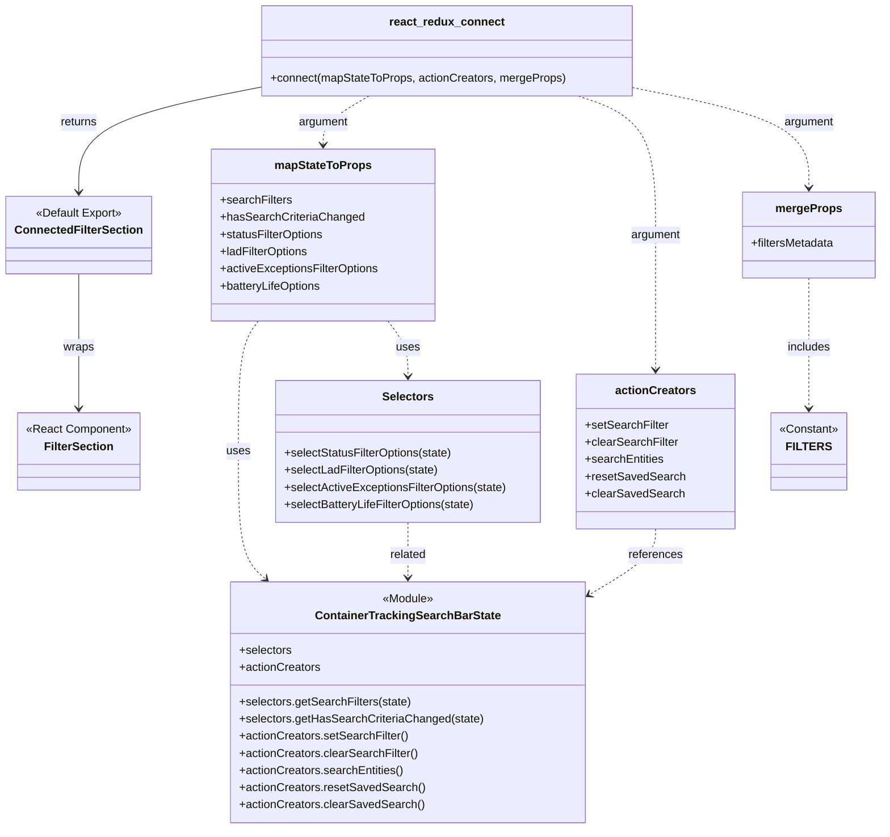

# Diagram: web/portal/src/pages/containertracking/search/ContainerTrackingSearchFiltersContainer.js

> Auto-generated by Obscura crawlers

## Mermaid

### SVG

<svg id="container" width="1215.775390625" xmlns="http://www.w3.org/2000/svg" class="classDiagram" height="1156" viewBox="0 0 1215.775390625 1156" role="graphics-document document" aria-roledescription="class"><g><defs><marker id="container_class-aggregationStart" class="marker aggregation class" refX="18" refY="7" markerWidth="190" markerHeight="240" orient="auto"><path d="M 18,7 L9,13 L1,7 L9,1 Z"></path></marker></defs><defs><marker id="container_class-aggregationEnd" class="marker aggregation class" refX="1" refY="7" markerWidth="20" markerHeight="28" orient="auto"><path d="M 18,7 L9,13 L1,7 L9,1 Z"></path></marker></defs><defs><marker id="container_class-extensionStart" class="marker extension class" refX="18" refY="7" markerWidth="190" markerHeight="240" orient="auto"><path d="M 1,7 L18,13 V 1 Z"></path></marker></defs><defs><marker id="container_class-extensionEnd" class="marker extension class" refX="1" refY="7" markerWidth="20" markerHeight="28" orient="auto"><path d="M 1,1 V 13 L18,7 Z"></path></marker></defs><defs><marker id="container_class-compositionStart" class="marker composition class" refX="18" refY="7" markerWidth="190" markerHeight="240" orient="auto"><path d="M 18,7 L9,13 L1,7 L9,1 Z"></path></marker></defs><defs><marker id="container_class-compositionEnd" class="marker composition class" refX="1" refY="7" markerWidth="20" markerHeight="28" orient="auto"><path d="M 18,7 L9,13 L1,7 L9,1 Z"></path></marker></defs><defs><marker id="container_class-dependencyStart" class="marker dependency class" refX="6" refY="7" markerWidth="190" markerHeight="240" orient="auto"><path d="M 5,7 L9,13 L1,7 L9,1 Z"></path></marker></defs><defs><marker id="container_class-dependencyEnd" class="marker dependency class" refX="13" refY="7" markerWidth="20" markerHeight="28" orient="auto"><path d="M 18,7 L9,13 L14,7 L9,1 Z"></path></marker></defs><defs><marker id="container_class-lollipopStart" class="marker lollipop class" refX="13" refY="7" markerWidth="190" markerHeight="240" orient="auto"><circle stroke="black" fill="transparent" cx="7" cy="7" r="6"></circle></marker></defs><defs><marker id="container_class-lollipopEnd" class="marker lollipop class" refX="1" refY="7" markerWidth="190" markerHeight="240" orient="auto"><circle stroke="black" fill="transparent" cx="7" cy="7" r="6"></circle></marker></defs><g class="root"><g class="clusters"></g><g class="edgePaths"><path d="M359.32,121.128L316.947,129.44C274.573,137.752,189.826,154.376,147.452,178.855C105.078,203.333,105.078,235.667,105.078,251.833L105.078,268" id="id_react_redux_connect_ConnectedFilterSection_1" class="edge-thickness-normal edge-pattern-solid relation" style=";;;" data-edge="true" data-et="edge" data-id="id_react_redux_connect_ConnectedFilterSection_1" data-points="W3sieCI6MzU5LjMyMDMxMjUsInkiOjEyMS4xMjc1ODEzMTg3MjM0M30seyJ4IjoxMDUuMDc4MTI1LCJ5IjoxNzF9LHsieCI6MTA1LjA3ODEyNSwieSI6Mjc0fV0=" marker-end="url(#container_class-dependencyEnd)"></path><path d="M105.078,382L105.078,399.167C105.078,416.333,105.078,450.667,105.078,482C105.078,513.333,105.078,541.667,105.078,555.833L105.078,570" id="id_ConnectedFilterSection_FilterSection_2" class="edge-thickness-normal edge-pattern-solid relation" style=";;;" data-edge="true" data-et="edge" data-id="id_ConnectedFilterSection_FilterSection_2" data-points="W3sieCI6MTA1LjA3ODEyNSwieSI6MzgyfSx7IngiOjEwNS4wNzgxMjUsInkiOjQ4NX0seyJ4IjoxMDUuMDc4MTI1LCJ5Ijo1NzZ9XQ==" marker-end="url(#container_class-dependencyEnd)"></path><path d="M352.873,448L348.215,454.167C343.556,460.333,334.24,472.667,329.582,503C324.924,533.333,324.924,581.667,324.924,630C324.924,678.333,324.924,726.667,331.302,756.346C337.68,786.026,350.437,797.051,356.815,802.564L363.194,808.077" id="id_mapStateToProps_ContainerTrackingSearchBarState_3" class="edge-thickness-normal edge-pattern-dashed relation" style=";;;" data-edge="true" data-et="edge" data-id="id_mapStateToProps_ContainerTrackingSearchBarState_3" data-points="W3sieCI6MzUyLjg3MjY3MzY2NjQwMTMsInkiOjQ0OH0seyJ4IjozMjQuOTIzODI4MTI1LCJ5Ijo0ODV9LHsieCI6MzI0LjkyMzgyODEyNSwieSI6NjMwfSx7IngiOjMyNC45MjM4MjgxMjUsInkiOjc3NX0seyJ4IjozNjcuNzMzMjc5MzQ0NTEyMiwieSI6ODEyfV0=" marker-end="url(#container_class-dependencyEnd)"></path><path d="M534.162,448L538.821,454.167C543.479,460.333,552.795,472.667,557.453,485.5C562.111,498.333,562.111,511.667,562.111,518.333L562.111,525" id="id_mapStateToProps_Selectors_4" class="edge-thickness-normal edge-pattern-dashed relation" style=";;;" data-edge="true" data-et="edge" data-id="id_mapStateToProps_Selectors_4" data-points="W3sieCI6NTM0LjE2MjQ4MjU4MzU5ODcsInkiOjQ0OH0seyJ4Ijo1NjIuMTExMzI4MTI1LCJ5Ijo0ODV9LHsieCI6NTYyLjExMTMyODEyNSwieSI6NTMxfV0=" marker-end="url(#container_class-dependencyEnd)"></path><path d="M562.111,729L562.111,736.667C562.111,744.333,562.111,759.667,562.111,772.5C562.111,785.333,562.111,795.667,562.111,800.833L562.111,806" id="id_Selectors_ContainerTrackingSearchBarState_5" class="edge-thickness-normal edge-pattern-dashed relation" style=";;;" data-edge="true" data-et="edge" data-id="id_Selectors_ContainerTrackingSearchBarState_5" data-points="W3sieCI6NTYyLjExMTMyODEyNSwieSI6NzI5fSx7IngiOjU2Mi4xMTEzMjgxMjUsInkiOjc3NX0seyJ4Ijo1NjIuMTExMzI4MTI1LCJ5Ijo4MTJ9XQ==" marker-end="url(#container_class-dependencyEnd)"></path><path d="M904.803,738L904.803,744.167C904.803,750.333,904.803,762.667,888.921,778.334C873.039,794.001,841.274,813.003,825.392,822.504L809.51,832.004" id="id_actionCreators_ContainerTrackingSearchBarState_6" class="edge-thickness-normal edge-pattern-dashed relation" style=";;;" data-edge="true" data-et="edge" data-id="id_actionCreators_ContainerTrackingSearchBarState_6" data-points="W3sieCI6OTA0LjgwMjczNDM3NSwieSI6NzM4fSx7IngiOjkwNC44MDI3MzQzNzUsInkiOjc3NX0seyJ4Ijo4MDQuMzYxMzI4MTI1LCJ5Ijo4MzUuMDg0NjM1NjM5Mjk4M31d" marker-end="url(#container_class-dependencyEnd)"></path><path d="M1115.104,388L1115.104,404.167C1115.104,420.333,1115.104,452.667,1115.104,483C1115.104,513.333,1115.104,541.667,1115.104,555.833L1115.104,570" id="id_mergeProps_FILTERS_7" class="edge-thickness-normal edge-pattern-dashed relation" style=";;;" data-edge="true" data-et="edge" data-id="id_mergeProps_FILTERS_7" data-points="W3sieCI6MTExNS4xMDM1MTU2MjUsInkiOjM4OH0seyJ4IjoxMTE1LjEwMzUxNTYyNSwieSI6NDg1fSx7IngiOjExMTUuMTAzNTE1NjI1LCJ5Ijo1NzZ9XQ==" marker-end="url(#container_class-dependencyEnd)"></path><path d="M506.915,134L496.349,140.167C485.783,146.333,464.65,158.667,454.084,170C443.518,181.333,443.518,191.667,443.518,196.833L443.518,202" id="id_react_redux_connect_mapStateToProps_8" class="edge-thickness-normal edge-pattern-dashed relation" style=";;;" data-edge="true" data-et="edge" data-id="id_react_redux_connect_mapStateToProps_8" data-points="W3sieCI6NTA2LjkxNTQ4ODI4MTI1LCJ5IjoxMzR9LHsieCI6NDQzLjUxNzU3ODEyNSwieSI6MTcxfSx7IngiOjQ0My41MTc1NzgxMjUsInkiOjIwOH1d" marker-end="url(#container_class-dependencyEnd)"></path><path d="M797.525,134L815.405,140.167C833.284,146.333,869.044,158.667,886.923,191C904.803,223.333,904.803,275.667,904.803,328C904.803,380.333,904.803,432.667,904.803,464C904.803,495.333,904.803,505.667,904.803,510.833L904.803,516" id="id_react_redux_connect_actionCreators_9" class="edge-thickness-normal edge-pattern-dashed relation" style=";;;" data-edge="true" data-et="edge" data-id="id_react_redux_connect_actionCreators_9" data-points="W3sieCI6Nzk3LjUyNTEzNjcxODc1LCJ5IjoxMzR9LHsieCI6OTA0LjgwMjczNDM3NSwieSI6MTcxfSx7IngiOjkwNC44MDI3MzQzNzUsInkiOjMyOH0seyJ4Ijo5MDQuODAyNzM0Mzc1LCJ5Ijo0ODV9LHsieCI6OTA0LjgwMjczNDM3NSwieSI6NTIyfV0=" marker-end="url(#container_class-dependencyEnd)"></path><path d="M870.406,122.084L911.189,130.237C951.972,138.389,1033.538,154.695,1074.321,178.014C1115.104,201.333,1115.104,231.667,1115.104,246.833L1115.104,262" id="id_react_redux_connect_mergeProps_10" class="edge-thickness-normal edge-pattern-dashed relation" style=";;;" data-edge="true" data-et="edge" data-id="id_react_redux_connect_mergeProps_10" data-points="W3sieCI6ODcwLjQwNjI1LCJ5IjoxMjIuMDg0MDQ5NDYwNjEwNzF9LHsieCI6MTExNS4xMDM1MTU2MjUsInkiOjE3MX0seyJ4IjoxMTE1LjEwMzUxNTYyNSwieSI6MjY4fV0=" marker-end="url(#container_class-dependencyEnd)"></path></g><g class="edgeLabels"><g class="edgeLabel" transform="translate(105.078125, 171)"><g class="label" data-id="id_react_redux_connect_ConnectedFilterSection_1" transform="translate(-26.265625, -12)"><foreignObject width="52.53125" height="24">

returns

</foreignObject></g></g><g class="edgeLabel" transform="translate(105.078125, 485)"><g class="label" data-id="id_ConnectedFilterSection_FilterSection_2" transform="translate(-21.390625, -12)"><foreignObject width="42.78125" height="24">

wraps

</foreignObject></g></g><g class="edgeLabel" transform="translate(324.923828125, 630)"><g class="label" data-id="id_mapStateToProps_ContainerTrackingSearchBarState_3" transform="translate(-16.4921875, -12)"><foreignObject width="32.984375" height="24">

uses

</foreignObject></g></g><g class="edgeLabel" transform="translate(562.111328125, 485)"><g class="label" data-id="id_mapStateToProps_Selectors_4" transform="translate(-16.4921875, -12)"><foreignObject width="32.984375" height="24">

uses

</foreignObject></g></g><g class="edgeLabel" transform="translate(562.111328125, 775)"><g class="label" data-id="id_Selectors_ContainerTrackingSearchBarState_5" transform="translate(-25.78125, -12)"><foreignObject width="51.5625" height="24">

related

</foreignObject></g></g><g class="edgeLabel" transform="translate(904.802734375, 775)"><g class="label" data-id="id_actionCreators_ContainerTrackingSearchBarState_6" transform="translate(-37.828125, -12)"><foreignObject width="75.65625" height="24">

references

</foreignObject></g></g><g class="edgeLabel" transform="translate(1115.103515625, 485)"><g class="label" data-id="id_mergeProps_FILTERS_7" transform="translate(-30.6484375, -12)"><foreignObject width="61.296875" height="24">

includes

</foreignObject></g></g><g class="edgeLabel" transform="translate(443.517578125, 171)"><g class="label" data-id="id_react_redux_connect_mapStateToProps_8" transform="translate(-34.8515625, -12)"><foreignObject width="69.703125" height="24">

argument

</foreignObject></g></g><g class="edgeLabel" transform="translate(904.802734375, 328)"><g class="label" data-id="id_react_redux_connect_actionCreators_9" transform="translate(-34.8515625, -12)"><foreignObject width="69.703125" height="24">

argument

</foreignObject></g></g><g class="edgeLabel" transform="translate(1115.103515625, 171)"><g class="label" data-id="id_react_redux_connect_mergeProps_10" transform="translate(-34.8515625, -12)"><foreignObject width="69.703125" height="24">

argument

</foreignObject></g></g></g><g class="nodes"><g class="node default" id="classId-FilterSection-0" transform="translate(105.078125, 630)"><g class="basic label-container"><path d="M-85.2109375 -54 L85.2109375 -54 L85.2109375 54 L-85.2109375 54" stroke="none" stroke-width="0" fill="#ECECFF" style=""></path><path d="M-85.2109375 -54 C-38.11843700951248 -54, 8.974063480975033 -54, 85.2109375 -54 M-85.2109375 -54 C-48.16707675490654 -54, -11.123216009813078 -54, 85.2109375 -54 M85.2109375 -54 C85.2109375 -31.762295744718532, 85.2109375 -9.524591489437064, 85.2109375 54 M85.2109375 -54 C85.2109375 -25.661125880563024, 85.2109375 2.677748238873953, 85.2109375 54 M85.2109375 54 C37.15713042905719 54, -10.89667664188562 54, -85.2109375 54 M85.2109375 54 C28.34872156442284 54, -28.513494371154323 54, -85.2109375 54 M-85.2109375 54 C-85.2109375 31.136329346303583, -85.2109375 8.272658692607166, -85.2109375 -54 M-85.2109375 54 C-85.2109375 12.127056084385536, -85.2109375 -29.745887831228927, -85.2109375 -54" stroke="#9370DB" stroke-width="1.3" fill="none" stroke-dasharray="0 0" style=""></path></g><g class="annotation-group text" transform="translate(-73.2109375, -30)"><g class="label" style="" transform="translate(0,-12)"><foreignObject width="146.421875" height="24">

«React Component»

</foreignObject></g></g><g class="label-group text" transform="translate(-46.3203125, -6)"><g class="label" style="font-weight: bolder" transform="translate(0,-12)"><foreignObject width="92.640625" height="24">

FilterSection

</foreignObject></g></g><g class="members-group text" transform="translate(-73.2109375, 42)"></g><g class="methods-group text" transform="translate(-73.2109375, 72)"></g><g class="divider" style=""><path d="M-85.2109375 18 C-19.861610794062457 18, 45.487715911875085 18, 85.2109375 18 M-85.2109375 18 C-27.985463027488898 18, 29.240011445022205 18, 85.2109375 18" stroke="#9370DB" stroke-width="1.3" fill="none" stroke-dasharray="0 0" style=""></path></g><g class="divider" style=""><path d="M-85.2109375 36 C-27.105504874152253 36, 30.999927751695495 36, 85.2109375 36 M-85.2109375 36 C-44.7256371027373 36, -4.240336705474604 36, 85.2109375 36" stroke="#9370DB" stroke-width="1.3" fill="none" stroke-dasharray="0 0" style=""></path></g></g><g class="node default" id="classId-ConnectedFilterSection-1" transform="translate(105.078125, 328)"><g class="basic label-container"><path d="M-97.078125 -54 L97.078125 -54 L97.078125 54 L-97.078125 54" stroke="none" stroke-width="0" fill="#ECECFF" style=""></path><path d="M-97.078125 -54 C-44.1446620977565 -54, 8.788800804486996 -54, 97.078125 -54 M-97.078125 -54 C-21.937969521788318 -54, 53.202185956423364 -54, 97.078125 -54 M97.078125 -54 C97.078125 -25.996653771063333, 97.078125 2.006692457873335, 97.078125 54 M97.078125 -54 C97.078125 -30.991864794177513, 97.078125 -7.983729588355025, 97.078125 54 M97.078125 54 C20.283886877561486 54, -56.51035124487703 54, -97.078125 54 M97.078125 54 C33.72667484971006 54, -29.624775300579884 54, -97.078125 54 M-97.078125 54 C-97.078125 11.020401257105647, -97.078125 -31.959197485788707, -97.078125 -54 M-97.078125 54 C-97.078125 10.96540045337958, -97.078125 -32.06919909324084, -97.078125 -54" stroke="#9370DB" stroke-width="1.3" fill="none" stroke-dasharray="0 0" style=""></path></g><g class="annotation-group text" transform="translate(-61.0703125, -30)"><g class="label" style="" transform="translate(0,-12)"><foreignObject width="122.140625" height="24">

«Default Export»

</foreignObject></g></g><g class="label-group text" transform="translate(-85.078125, -6)"><g class="label" style="font-weight: bolder" transform="translate(0,-12)"><foreignObject width="170.15625" height="24">

ConnectedFilterSection

</foreignObject></g></g><g class="members-group text" transform="translate(-85.078125, 42)"></g><g class="methods-group text" transform="translate(-85.078125, 72)"></g><g class="divider" style=""><path d="M-97.078125 18 C-30.25890559676192 18, 36.56031380647616 18, 97.078125 18 M-97.078125 18 C-50.51196388260307 18, -3.945802765206139 18, 97.078125 18" stroke="#9370DB" stroke-width="1.3" fill="none" stroke-dasharray="0 0" style=""></path></g><g class="divider" style=""><path d="M-97.078125 36 C-37.657435765655116 36, 21.76325346868977 36, 97.078125 36 M-97.078125 36 C-21.763796706088755 36, 53.55053158782249 36, 97.078125 36" stroke="#9370DB" stroke-width="1.3" fill="none" stroke-dasharray="0 0" style=""></path></g></g><g class="node default" id="classId-react_redux_connect-2" transform="translate(614.86328125, 71)"><g class="basic label-container"><path d="M-255.54296875 -63 L255.54296875 -63 L255.54296875 63 L-255.54296875 63" stroke="none" stroke-width="0" fill="#ECECFF" style=""></path><path d="M-255.54296875 -63 C-127.6579527998335 -63, 0.2270631503330094 -63, 255.54296875 -63 M-255.54296875 -63 C-148.4624824576581 -63, -41.38199616531617 -63, 255.54296875 -63 M255.54296875 -63 C255.54296875 -16.303848413418834, 255.54296875 30.392303173162333, 255.54296875 63 M255.54296875 -63 C255.54296875 -14.42733862876436, 255.54296875 34.14532274247128, 255.54296875 63 M255.54296875 63 C116.95104088304123 63, -21.64088698391754 63, -255.54296875 63 M255.54296875 63 C137.3706995421054 63, 19.19843033421077 63, -255.54296875 63 M-255.54296875 63 C-255.54296875 19.991656345523303, -255.54296875 -23.016687308953394, -255.54296875 -63 M-255.54296875 63 C-255.54296875 16.671389938175913, -255.54296875 -29.657220123648173, -255.54296875 -63" stroke="#9370DB" stroke-width="1.3" fill="none" stroke-dasharray="0 0" style=""></path></g><g class="annotation-group text" transform="translate(0, -39)"></g><g class="label-group text" transform="translate(-76.5390625, -39)"><g class="label" style="font-weight: bolder" transform="translate(0,-12)"><foreignObject width="153.078125" height="24">

react_redux_connect

</foreignObject></g></g><g class="members-group text" transform="translate(-243.54296875, 9)"></g><g class="methods-group text" transform="translate(-243.54296875, 39)"><g class="label" style="" transform="translate(0,-12)"><foreignObject width="410.546875" height="24">

+connect(mapStateToProps, actionCreators, mergeProps)

</foreignObject></g></g><g class="divider" style=""><path d="M-255.54296875 -15 C-65.73442641348242 -15, 124.07411592303515 -15, 255.54296875 -15 M-255.54296875 -15 C-106.24886242875004 -15, 43.04524389249991 -15, 255.54296875 -15" stroke="#9370DB" stroke-width="1.3" fill="none" stroke-dasharray="0 0" style=""></path></g><g class="divider" style=""><path d="M-255.54296875 9 C-114.55913640804772 9, 26.42469593390456 9, 255.54296875 9 M-255.54296875 9 C-149.63762688148648 9, -43.732285012972966 9, 255.54296875 9" stroke="#9370DB" stroke-width="1.3" fill="none" stroke-dasharray="0 0" style=""></path></g></g><g class="node default" id="classId-ContainerTrackingSearchBarState-3" transform="translate(562.111328125, 980)"><g class="basic label-container"><path d="M-242.25 -168 L242.25 -168 L242.25 168 L-242.25 168" stroke="none" stroke-width="0" fill="#ECECFF" style=""></path><path d="M-242.25 -168 C-135.5284063758772 -168, -28.80681275175442 -168, 242.25 -168 M-242.25 -168 C-113.7505206980008 -168, 14.748958603998403 -168, 242.25 -168 M242.25 -168 C242.25 -52.11944012148693, 242.25 63.76111975702614, 242.25 168 M242.25 -168 C242.25 -71.75963532264882, 242.25 24.480729354702362, 242.25 168 M242.25 168 C78.53419958503966 168, -85.18160082992068 168, -242.25 168 M242.25 168 C118.45284381924849 168, -5.344312361503029 168, -242.25 168 M-242.25 168 C-242.25 81.8084235358848, -242.25 -4.383152928230402, -242.25 -168 M-242.25 168 C-242.25 74.53126368901367, -242.25 -18.93747262197266, -242.25 -168" stroke="#9370DB" stroke-width="1.3" fill="none" stroke-dasharray="0 0" style=""></path></g><g class="annotation-group text" transform="translate(-35.96875, -144)"><g class="label" style="" transform="translate(0,-12)"><foreignObject width="71.9375" height="24">

«Module»

</foreignObject></g></g><g class="label-group text" transform="translate(-123.078125, -120)"><g class="label" style="font-weight: bolder" transform="translate(0,-12)"><foreignObject width="246.15625" height="24">

ContainerTrackingSearchBarState

</foreignObject></g></g><g class="members-group text" transform="translate(-230.25, -72)"><g class="label" style="" transform="translate(0,-12)"><foreignObject width="73.453125" height="24">

+selectors

</foreignObject></g><g class="label" style="" transform="translate(0,12)"><foreignObject width="113.078125" height="24">

+actionCreators

</foreignObject></g></g><g class="methods-group text" transform="translate(-230.25, 0)"><g class="label" style="" transform="translate(0,-12)"><foreignObject width="239.015625" height="24">

+selectors.getSearchFilters(state)

</foreignObject></g><g class="label" style="" transform="translate(0,12)"><foreignObject width="337.421875" height="24">

+selectors.getHasSearchCriteriaChanged(state)

</foreignObject></g><g class="label" style="" transform="translate(0,36)"><foreignObject width="234.953125" height="24">

+actionCreators.setSearchFilter()

</foreignObject></g><g class="label" style="" transform="translate(0,60)"><foreignObject width="248.453125" height="24">

+actionCreators.clearSearchFilter()

</foreignObject></g><g class="label" style="" transform="translate(0,84)"><foreignObject width="229.359375" height="24">

+actionCreators.searchEntities()

</foreignObject></g><g class="label" style="" transform="translate(0,108)"><foreignObject width="255.65625" height="24">

+actionCreators.resetSavedSearch()

</foreignObject></g><g class="label" style="" transform="translate(0,132)"><foreignObject width="254.8125" height="24">

+actionCreators.clearSavedSearch()

</foreignObject></g></g><g class="divider" style=""><path d="M-242.25 -96 C-78.22816068317715 -96, 85.7936786336457 -96, 242.25 -96 M-242.25 -96 C-137.74406538382857 -96, -33.23813076765717 -96, 242.25 -96" stroke="#9370DB" stroke-width="1.3" fill="none" stroke-dasharray="0 0" style=""></path></g><g class="divider" style=""><path d="M-242.25 -24 C-63.622497033038286 -24, 115.00500593392343 -24, 242.25 -24 M-242.25 -24 C-103.92732486236224 -24, 34.39535027527552 -24, 242.25 -24" stroke="#9370DB" stroke-width="1.3" fill="none" stroke-dasharray="0 0" style=""></path></g></g><g class="node default" id="classId-Selectors-4" transform="translate(562.111328125, 630)"><g class="basic label-container"><path d="M-185.6953125 -99 L185.6953125 -99 L185.6953125 99 L-185.6953125 99" stroke="none" stroke-width="0" fill="#ECECFF" style=""></path><path d="M-185.6953125 -99 C-97.59699874873257 -99, -9.498684997465148 -99, 185.6953125 -99 M-185.6953125 -99 C-76.3588863901139 -99, 32.97753971977221 -99, 185.6953125 -99 M185.6953125 -99 C185.6953125 -27.24765820483377, 185.6953125 44.50468359033246, 185.6953125 99 M185.6953125 -99 C185.6953125 -35.91429600006618, 185.6953125 27.17140799986764, 185.6953125 99 M185.6953125 99 C78.68986498121942 99, -28.31558253756117 99, -185.6953125 99 M185.6953125 99 C56.00860820558941 99, -73.67809608882118 99, -185.6953125 99 M-185.6953125 99 C-185.6953125 35.487764790488065, -185.6953125 -28.02447041902387, -185.6953125 -99 M-185.6953125 99 C-185.6953125 33.98047231196938, -185.6953125 -31.039055376061242, -185.6953125 -99" stroke="#9370DB" stroke-width="1.3" fill="none" stroke-dasharray="0 0" style=""></path></g><g class="annotation-group text" transform="translate(0, -75)"></g><g class="label-group text" transform="translate(-34.171875, -75)"><g class="label" style="font-weight: bolder" transform="translate(0,-12)"><foreignObject width="68.34375" height="24">

Selectors

</foreignObject></g></g><g class="members-group text" transform="translate(-173.6953125, -27)"></g><g class="methods-group text" transform="translate(-173.6953125, 3)"><g class="label" style="" transform="translate(0,-12)"><foreignObject width="237.03125" height="24">

+selectStatusFilterOptions(state)

</foreignObject></g><g class="label" style="" transform="translate(0,12)"><foreignObject width="217.46875" height="24">

+selectLadFilterOptions(state)

</foreignObject></g><g class="label" style="" transform="translate(0,36)"><foreignObject width="313.21875" height="24">

+selectActiveExceptionsFilterOptions(state)

</foreignObject></g><g class="label" style="" transform="translate(0,60)"><foreignObject width="270.296875" height="24">

+selectBatteryLifeFilterOptions(state)

</foreignObject></g></g><g class="divider" style=""><path d="M-185.6953125 -51 C-106.9471093554629 -51, -28.1989062109258 -51, 185.6953125 -51 M-185.6953125 -51 C-40.776744489977574 -51, 104.14182352004485 -51, 185.6953125 -51" stroke="#9370DB" stroke-width="1.3" fill="none" stroke-dasharray="0 0" style=""></path></g><g class="divider" style=""><path d="M-185.6953125 -27 C-100.07661483229839 -27, -14.457917164596779 -27, 185.6953125 -27 M-185.6953125 -27 C-80.80973362911205 -27, 24.07584524177591 -27, 185.6953125 -27" stroke="#9370DB" stroke-width="1.3" fill="none" stroke-dasharray="0 0" style=""></path></g></g><g class="node default" id="classId-FILTERS-5" transform="translate(1115.103515625, 630)"><g class="basic label-container"><path d="M-53.3046875 -54 L53.3046875 -54 L53.3046875 54 L-53.3046875 54" stroke="none" stroke-width="0" fill="#ECECFF" style=""></path><path d="M-53.3046875 -54 C-31.131005270918514 -54, -8.957323041837029 -54, 53.3046875 -54 M-53.3046875 -54 C-24.46695436550351 -54, 4.370778768992977 -54, 53.3046875 -54 M53.3046875 -54 C53.3046875 -16.707042597075002, 53.3046875 20.585914805849995, 53.3046875 54 M53.3046875 -54 C53.3046875 -14.792119475617099, 53.3046875 24.415761048765802, 53.3046875 54 M53.3046875 54 C31.790850924221274 54, 10.277014348442549 54, -53.3046875 54 M53.3046875 54 C17.06160976088426 54, -19.18146797823148 54, -53.3046875 54 M-53.3046875 54 C-53.3046875 23.066172524467998, -53.3046875 -7.867654951064004, -53.3046875 -54 M-53.3046875 54 C-53.3046875 19.575021044958156, -53.3046875 -14.849957910083688, -53.3046875 -54" stroke="#9370DB" stroke-width="1.3" fill="none" stroke-dasharray="0 0" style=""></path></g><g class="annotation-group text" transform="translate(-41.3046875, -30)"><g class="label" style="" transform="translate(0,-12)"><foreignObject width="82.609375" height="24">

«Constant»

</foreignObject></g></g><g class="label-group text" transform="translate(-27.5625, -6)"><g class="label" style="font-weight: bolder" transform="translate(0,-12)"><foreignObject width="55.125" height="24">

FILTERS

</foreignObject></g></g><g class="members-group text" transform="translate(-41.3046875, 42)"></g><g class="methods-group text" transform="translate(-41.3046875, 72)"></g><g class="divider" style=""><path d="M-53.3046875 18 C-12.182210288995186 18, 28.940266922009627 18, 53.3046875 18 M-53.3046875 18 C-28.414941266863025 18, -3.5251950337260496 18, 53.3046875 18" stroke="#9370DB" stroke-width="1.3" fill="none" stroke-dasharray="0 0" style=""></path></g><g class="divider" style=""><path d="M-53.3046875 36 C-28.9321413734467 36, -4.559595246893402 36, 53.3046875 36 M-53.3046875 36 C-27.095815789437484 36, -0.8869440788749685 36, 53.3046875 36" stroke="#9370DB" stroke-width="1.3" fill="none" stroke-dasharray="0 0" style=""></path></g></g><g class="node default" id="classId-mapStateToProps-6" transform="translate(443.517578125, 328)"><g class="basic label-container"><path d="M-155.91015625 -120 L155.91015625 -120 L155.91015625 120 L-155.91015625 120" stroke="none" stroke-width="0" fill="#ECECFF" style=""></path><path d="M-155.91015625 -120 C-40.079721066050865 -120, 75.75071411789827 -120, 155.91015625 -120 M-155.91015625 -120 C-44.503769401587135 -120, 66.90261744682573 -120, 155.91015625 -120 M155.91015625 -120 C155.91015625 -44.42519011701617, 155.91015625 31.149619765967657, 155.91015625 120 M155.91015625 -120 C155.91015625 -33.32632054510651, 155.91015625 53.347358909786976, 155.91015625 120 M155.91015625 120 C53.918436187584064 120, -48.07328387483187 120, -155.91015625 120 M155.91015625 120 C53.46509089884985 120, -48.9799744523003 120, -155.91015625 120 M-155.91015625 120 C-155.91015625 68.30903307011789, -155.91015625 16.618066140235783, -155.91015625 -120 M-155.91015625 120 C-155.91015625 66.8356924505379, -155.91015625 13.671384901075811, -155.91015625 -120" stroke="#9370DB" stroke-width="1.3" fill="none" stroke-dasharray="0 0" style=""></path></g><g class="annotation-group text" transform="translate(0, -96)"></g><g class="label-group text" transform="translate(-64.7109375, -96)"><g class="label" style="font-weight: bolder" transform="translate(0,-12)"><foreignObject width="129.421875" height="24">

mapStateToProps

</foreignObject></g></g><g class="members-group text" transform="translate(-143.91015625, -48)"><g class="label" style="" transform="translate(0,-12)"><foreignObject width="99.609375" height="24">

+searchFilters

</foreignObject></g><g class="label" style="" transform="translate(0,12)"><foreignObject width="197.75" height="24">

+hasSearchCriteriaChanged

</foreignObject></g><g class="label" style="" transform="translate(0,36)"><foreignObject width="146.375" height="24">

+statusFilterOptions

</foreignObject></g><g class="label" style="" transform="translate(0,60)"><foreignObject width="124.859375" height="24">

+ladFilterOptions

</foreignObject></g><g class="label" style="" transform="translate(0,84)"><foreignObject width="223.109375" height="24">

+activeExceptionsFilterOptions

</foreignObject></g><g class="label" style="" transform="translate(0,108)"><foreignObject width="143.578125" height="24">

+batteryLifeOptions

</foreignObject></g></g><g class="methods-group text" transform="translate(-143.91015625, 120)"></g><g class="divider" style=""><path d="M-155.91015625 -72 C-91.81153832069022 -72, -27.712920391380436 -72, 155.91015625 -72 M-155.91015625 -72 C-41.53349686160165 -72, 72.8431625267967 -72, 155.91015625 -72" stroke="#9370DB" stroke-width="1.3" fill="none" stroke-dasharray="0 0" style=""></path></g><g class="divider" style=""><path d="M-155.91015625 96 C-47.46753154284693 96, 60.975093164306145 96, 155.91015625 96 M-155.91015625 96 C-82.80471467919196 96, -9.69927310838392 96, 155.91015625 96" stroke="#9370DB" stroke-width="1.3" fill="none" stroke-dasharray="0 0" style=""></path></g></g><g class="node default" id="classId-actionCreators-7" transform="translate(904.802734375, 630)"><g class="basic label-container"><path d="M-106.99609375 -108 L106.99609375 -108 L106.99609375 108 L-106.99609375 108" stroke="none" stroke-width="0" fill="#ECECFF" style=""></path><path d="M-106.99609375 -108 C-47.3798426193785 -108, 12.236408511242999 -108, 106.99609375 -108 M-106.99609375 -108 C-23.80809936190593 -108, 59.37989502618814 -108, 106.99609375 -108 M106.99609375 -108 C106.99609375 -27.825934631424516, 106.99609375 52.34813073715097, 106.99609375 108 M106.99609375 -108 C106.99609375 -28.250561566436076, 106.99609375 51.49887686712785, 106.99609375 108 M106.99609375 108 C62.46649007577737 108, 17.936886401554744 108, -106.99609375 108 M106.99609375 108 C51.28709810623096 108, -4.4218975375380865 108, -106.99609375 108 M-106.99609375 108 C-106.99609375 53.63080902754518, -106.99609375 -0.7383819449096336, -106.99609375 -108 M-106.99609375 108 C-106.99609375 64.66430992266575, -106.99609375 21.328619845331517, -106.99609375 -108" stroke="#9370DB" stroke-width="1.3" fill="none" stroke-dasharray="0 0" style=""></path></g><g class="annotation-group text" transform="translate(0, -84)"></g><g class="label-group text" transform="translate(-53.6328125, -84)"><g class="label" style="font-weight: bolder" transform="translate(0,-12)"><foreignObject width="107.265625" height="24">

actionCreators

</foreignObject></g></g><g class="members-group text" transform="translate(-94.99609375, -36)"><g class="label" style="" transform="translate(0,-12)"><foreignObject width="115.59375" height="24">

+setSearchFilter

</foreignObject></g><g class="label" style="" transform="translate(0,12)"><foreignObject width="129.3125" height="24">

+clearSearchFilter

</foreignObject></g><g class="label" style="" transform="translate(0,36)"><foreignObject width="109.984375" height="24">

+searchEntities

</foreignObject></g><g class="label" style="" transform="translate(0,60)"><foreignObject width="136.359375" height="24">

+resetSavedSearch

</foreignObject></g><g class="label" style="" transform="translate(0,84)"><foreignObject width="135.671875" height="24">

+clearSavedSearch

</foreignObject></g></g><g class="methods-group text" transform="translate(-94.99609375, 108)"></g><g class="divider" style=""><path d="M-106.99609375 -60 C-43.47083685516447 -60, 20.054420039671058 -60, 106.99609375 -60 M-106.99609375 -60 C-44.67275681954335 -60, 17.650580110913296 -60, 106.99609375 -60" stroke="#9370DB" stroke-width="1.3" fill="none" stroke-dasharray="0 0" style=""></path></g><g class="divider" style=""><path d="M-106.99609375 84 C-48.76831905038653 84, 9.459455649226939 84, 106.99609375 84 M-106.99609375 84 C-33.31475222357929 84, 40.36658930284142 84, 106.99609375 84" stroke="#9370DB" stroke-width="1.3" fill="none" stroke-dasharray="0 0" style=""></path></g></g><g class="node default" id="classId-mergeProps-8" transform="translate(1115.103515625, 328)"><g class="basic label-container"><path d="M-92.671875 -60 L92.671875 -60 L92.671875 60 L-92.671875 60" stroke="none" stroke-width="0" fill="#ECECFF" style=""></path><path d="M-92.671875 -60 C-46.47960795217953 -60, -0.28734090435905557 -60, 92.671875 -60 M-92.671875 -60 C-45.919508893892115 -60, 0.8328572122157709 -60, 92.671875 -60 M92.671875 -60 C92.671875 -17.409817155896604, 92.671875 25.18036568820679, 92.671875 60 M92.671875 -60 C92.671875 -35.1564921770142, 92.671875 -10.312984354028409, 92.671875 60 M92.671875 60 C29.145307755169718 60, -34.381259489660565 60, -92.671875 60 M92.671875 60 C30.952568587362556 60, -30.766737825274888 60, -92.671875 60 M-92.671875 60 C-92.671875 28.5082289944914, -92.671875 -2.9835420110171995, -92.671875 -60 M-92.671875 60 C-92.671875 13.10477673928137, -92.671875 -33.79044652143726, -92.671875 -60" stroke="#9370DB" stroke-width="1.3" fill="none" stroke-dasharray="0 0" style=""></path></g><g class="annotation-group text" transform="translate(0, -36)"></g><g class="label-group text" transform="translate(-43.859375, -36)"><g class="label" style="font-weight: bolder" transform="translate(0,-12)"><foreignObject width="87.71875" height="24">

mergeProps

</foreignObject></g></g><g class="members-group text" transform="translate(-80.671875, 12)"><g class="label" style="" transform="translate(0,-12)"><foreignObject width="117.484375" height="24">

+filtersMetadata

</foreignObject></g></g><g class="methods-group text" transform="translate(-80.671875, 60)"></g><g class="divider" style=""><path d="M-92.671875 -12 C-54.20093136947263 -12, -15.729987738945255 -12, 92.671875 -12 M-92.671875 -12 C-41.56311557726475 -12, 9.545643845470494 -12, 92.671875 -12" stroke="#9370DB" stroke-width="1.3" fill="none" stroke-dasharray="0 0" style=""></path></g><g class="divider" style=""><path d="M-92.671875 36 C-49.34776989539024 36, -6.0236647907804866 36, 92.671875 36 M-92.671875 36 C-45.01937117633668 36, 2.633132647326633 36, 92.671875 36" stroke="#9370DB" stroke-width="1.3" fill="none" stroke-dasharray="0 0" style=""></path></g></g></g></g></g></svg>
