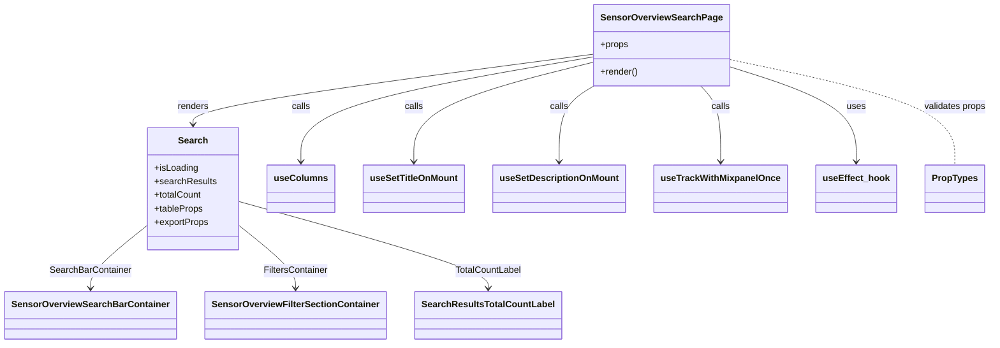

# Diagram: web/portal/src/pages/containertracking/search/SensorOverview/SensorOverview.Search.page.js


> Auto-generated by Obscura crawlers

## Diagram 1



### SVG

<svg id="container" width="1690.8515625" xmlns="http://www.w3.org/2000/svg" class="classDiagram" height="608" viewBox="0 0 1690.8515625 608" role="graphics-document document" aria-roledescription="class"><style>#container{font-family:"trebuchet ms",verdana,arial,sans-serif;font-size:16px;fill:#333;}@keyframes edge-animation-frame{from{stroke-dashoffset:0;}}@keyframes dash{to{stroke-dashoffset:0;}}#container .edge-animation-slow{stroke-dasharray:9,5!important;stroke-dashoffset:900;animation:dash 50s linear infinite;stroke-linecap:round;}#container .edge-animation-fast{stroke-dasharray:9,5!important;stroke-dashoffset:900;animation:dash 20s linear infinite;stroke-linecap:round;}#container .error-icon{fill:#552222;}#container .error-text{fill:#552222;stroke:#552222;}#container .edge-thickness-normal{stroke-width:1px;}#container .edge-thickness-thick{stroke-width:3.5px;}#container .edge-pattern-solid{stroke-dasharray:0;}#container .edge-thickness-invisible{stroke-width:0;fill:none;}#container .edge-pattern-dashed{stroke-dasharray:3;}#container .edge-pattern-dotted{stroke-dasharray:2;}#container .marker{fill:#333333;stroke:#333333;}#container .marker.cross{stroke:#333333;}#container svg{font-family:"trebuchet ms",verdana,arial,sans-serif;font-size:16px;}#container p{margin:0;}#container g.classGroup text{fill:#9370DB;stroke:none;font-family:"trebuchet ms",verdana,arial,sans-serif;font-size:10px;}#container g.classGroup text .title{font-weight:bolder;}#container .nodeLabel,#container .edgeLabel{color:#131300;}#container .edgeLabel .label rect{fill:#ECECFF;}#container .label text{fill:#131300;}#container .labelBkg{background:#ECECFF;}#container .edgeLabel .label span{background:#ECECFF;}#container .classTitle{font-weight:bolder;}#container .node rect,#container .node circle,#container .node ellipse,#container .node polygon,#container .node path{fill:#ECECFF;stroke:#9370DB;stroke-width:1px;}#container .divider{stroke:#9370DB;stroke-width:1;}#container g.clickable{cursor:pointer;}#container g.classGroup rect{fill:#ECECFF;stroke:#9370DB;}#container g.classGroup line{stroke:#9370DB;stroke-width:1;}#container .classLabel .box{stroke:none;stroke-width:0;fill:#ECECFF;opacity:0.5;}#container .classLabel .label{fill:#9370DB;font-size:10px;}#container .relation{stroke:#333333;stroke-width:1;fill:none;}#container .dashed-line{stroke-dasharray:3;}#container .dotted-line{stroke-dasharray:1 2;}#container #compositionStart,#container .composition{fill:#333333!important;stroke:#333333!important;stroke-width:1;}#container #compositionEnd,#container .composition{fill:#333333!important;stroke:#333333!important;stroke-width:1;}#container #dependencyStart,#container .dependency{fill:#333333!important;stroke:#333333!important;stroke-width:1;}#container #dependencyStart,#container .dependency{fill:#333333!important;stroke:#333333!important;stroke-width:1;}#container #extensionStart,#container .extension{fill:transparent!important;stroke:#333333!important;stroke-width:1;}#container #extensionEnd,#container .extension{fill:transparent!important;stroke:#333333!important;stroke-width:1;}#container #aggregationStart,#container .aggregation{fill:transparent!important;stroke:#333333!important;stroke-width:1;}#container #aggregationEnd,#container .aggregation{fill:transparent!important;stroke:#333333!important;stroke-width:1;}#container #lollipopStart,#container .lollipop{fill:#ECECFF!important;stroke:#333333!important;stroke-width:1;}#container #lollipopEnd,#container .lollipop{fill:#ECECFF!important;stroke:#333333!important;stroke-width:1;}#container .edgeTerminals{font-size:11px;line-height:initial;}#container .classTitleText{text-anchor:middle;font-size:18px;fill:#333;}#container .label-icon{display:inline-block;height:1em;overflow:visible;vertical-align:-0.125em;}#container .node .label-icon path{fill:currentColor;stroke:revert;stroke-width:revert;}#container :root{--mermaid-font-family:"trebuchet ms",verdana,arial,sans-serif;}</style><g><defs><marker id="container_class-aggregationStart" class="marker aggregation class" refX="18" refY="7" markerWidth="190" markerHeight="240" orient="auto"><path d="M 18,7 L9,13 L1,7 L9,1 Z"></path></marker></defs><defs><marker id="container_class-aggregationEnd" class="marker aggregation class" refX="1" refY="7" markerWidth="20" markerHeight="28" orient="auto"><path d="M 18,7 L9,13 L1,7 L9,1 Z"></path></marker></defs><defs><marker id="container_class-extensionStart" class="marker extension class" refX="18" refY="7" markerWidth="190" markerHeight="240" orient="auto"><path d="M 1,7 L18,13 V 1 Z"></path></marker></defs><defs><marker id="container_class-extensionEnd" class="marker extension class" refX="1" refY="7" markerWidth="20" markerHeight="28" orient="auto"><path d="M 1,1 V 13 L18,7 Z"></path></marker></defs><defs><marker id="container_class-compositionStart" class="marker composition class" refX="18" refY="7" markerWidth="190" markerHeight="240" orient="auto"><path d="M 18,7 L9,13 L1,7 L9,1 Z"></path></marker></defs><defs><marker id="container_class-compositionEnd" class="marker composition class" refX="1" refY="7" markerWidth="20" markerHeight="28" orient="auto"><path d="M 18,7 L9,13 L1,7 L9,1 Z"></path></marker></defs><defs><marker id="container_class-dependencyStart" class="marker dependency class" refX="6" refY="7" markerWidth="190" markerHeight="240" orient="auto"><path d="M 5,7 L9,13 L1,7 L9,1 Z"></path></marker></defs><defs><marker id="container_class-dependencyEnd" class="marker dependency class" refX="13" refY="7" markerWidth="20" markerHeight="28" orient="auto"><path d="M 18,7 L9,13 L14,7 L9,1 Z"></path></marker></defs><defs><marker id="container_class-lollipopStart" class="marker lollipop class" refX="13" refY="7" markerWidth="190" markerHeight="240" orient="auto"><circle stroke="black" fill="transparent" cx="7" cy="7" r="6"></circle></marker></defs><defs><marker id="container_class-lollipopEnd" class="marker lollipop class" refX="1" refY="7" markerWidth="190" markerHeight="240" orient="auto"><circle stroke="black" fill="transparent" cx="7" cy="7" r="6"></circle></marker></defs><g class="root"><g class="clusters"></g><g class="edgePaths"><path d="M1012.859,95.439L898.358,111.033C783.857,126.626,554.854,157.813,440.353,178.573C325.852,199.333,325.852,209.667,325.852,214.833L325.852,220" id="id_SensorOverviewSearchPage_Search_1" class="edge-thickness-normal edge-pattern-solid relation" style=";;;" data-edge="true" data-et="edge" data-id="id_SensorOverviewSearchPage_Search_1" data-points="W3sieCI6MTAxMi44NTkzNzUsInkiOjk1LjQzOTA0MjI0NTgyMjI2fSx7IngiOjMyNS44NTE1NjI1LCJ5IjoxODl9LHsieCI6MzI1Ljg1MTU2MjUsInkiOjIyNn1d" marker-end="url(#container_class-dependencyEnd)"></path><path d="M247.328,399.551L231.466,412.792C215.604,426.034,183.88,452.517,168.018,470.925C152.156,489.333,152.156,499.667,152.156,504.833L152.156,510" id="id_Search_SensorOverviewSearchBarContainer_2" class="edge-thickness-normal edge-pattern-solid relation" style=";;;" data-edge="true" data-et="edge" data-id="id_Search_SensorOverviewSearchBarContainer_2" data-points="W3sieCI6MjQ3LjMyODEyNSwieSI6Mzk5LjU1MDk4Mjc3MzM1NDl9LHsieCI6MTUyLjE1NjI1LCJ5Ijo0Nzl9LHsieCI6MTUyLjE1NjI1LCJ5Ijo1MTZ9XQ==" marker-end="url(#container_class-dependencyEnd)"></path><path d="M404.375,399.551L420.237,412.792C436.099,426.034,467.823,452.517,483.685,470.925C499.547,489.333,499.547,499.667,499.547,504.833L499.547,510" id="id_Search_SensorOverviewFilterSectionContainer_3" class="edge-thickness-normal edge-pattern-solid relation" style=";;;" data-edge="true" data-et="edge" data-id="id_Search_SensorOverviewFilterSectionContainer_3" data-points="W3sieCI6NDA0LjM3NSwieSI6Mzk5LjU1MDk4Mjc3MzM1NDl9LHsieCI6NDk5LjU0Njg3NSwieSI6NDc5fSx7IngiOjQ5OS41NDY4NzUsInkiOjUxNn1d" marker-end="url(#container_class-dependencyEnd)"></path><path d="M404.375,356.761L474.66,377.134C544.945,397.507,685.516,438.254,755.801,463.794C826.086,489.333,826.086,499.667,826.086,504.833L826.086,510" id="id_Search_SearchResultsTotalCountLabel_4" class="edge-thickness-normal edge-pattern-solid relation" style=";;;" data-edge="true" data-et="edge" data-id="id_Search_SearchResultsTotalCountLabel_4" data-points="W3sieCI6NDA0LjM3NSwieSI6MzU2Ljc2MTEyNzU5NjQzOTE3fSx7IngiOjgyNi4wODU5Mzc1LCJ5Ijo0Nzl9LHsieCI6ODI2LjA4NTkzNzUsInkiOjUxNn1d" marker-end="url(#container_class-dependencyEnd)"></path><path d="M1012.859,100.07L929.139,114.892C845.419,129.714,677.979,159.357,594.259,190.345C510.539,221.333,510.539,253.667,510.539,269.833L510.539,286" id="id_SensorOverviewSearchPage_useColumns_5" class="edge-thickness-normal edge-pattern-solid relation" style=";;;" data-edge="true" data-et="edge" data-id="id_SensorOverviewSearchPage_useColumns_5" data-points="W3sieCI6MTAxMi44NTkzNzUsInkiOjEwMC4wNzAyODQ3NDI2NjU3Mn0seyJ4Ijo1MTAuNTM5MDYyNSwieSI6MTg5fSx7IngiOjUxMC41MzkwNjI1LCJ5IjoyOTJ9XQ==" marker-end="url(#container_class-dependencyEnd)"></path><path d="M1012.859,109.222L961.276,122.518C909.693,135.815,806.526,162.407,754.943,191.87C703.359,221.333,703.359,253.667,703.359,269.833L703.359,286" id="id_SensorOverviewSearchPage_useSetTitleOnMount_6" class="edge-thickness-normal edge-pattern-solid relation" style=";;;" data-edge="true" data-et="edge" data-id="id_SensorOverviewSearchPage_useSetTitleOnMount_6" data-points="W3sieCI6MTAxMi44NTkzNzUsInkiOjEwOS4yMjE5OTY0MTU4MzY4M30seyJ4Ijo3MDMuMzU5Mzc1LCJ5IjoxODl9LHsieCI6NzAzLjM1OTM3NSwieSI6MjkyfV0=" marker-end="url(#container_class-dependencyEnd)"></path><path d="M1012.859,151.142L1002.805,157.452C992.75,163.761,972.641,176.381,962.586,198.857C952.531,221.333,952.531,253.667,952.531,269.833L952.531,286" id="id_SensorOverviewSearchPage_useSetDescriptionOnMount_7" class="edge-thickness-normal edge-pattern-solid relation" style=";;;" data-edge="true" data-et="edge" data-id="id_SensorOverviewSearchPage_useSetDescriptionOnMount_7" data-points="W3sieCI6MTAxMi44NTkzNzUsInkiOjE1MS4xNDE5NTExNTM2OTA0Nn0seyJ4Ijo5NTIuNTMxMjUsInkiOjE4OX0seyJ4Ijo5NTIuNTMxMjUsInkiOjI5Mn1d" marker-end="url(#container_class-dependencyEnd)"></path><path d="M1193.216,152L1198.953,158.167C1204.691,164.333,1216.166,176.667,1221.903,199C1227.641,221.333,1227.641,253.667,1227.641,269.833L1227.641,286" id="id_SensorOverviewSearchPage_useTrackWithMixpanelOnce_8" class="edge-thickness-normal edge-pattern-solid relation" style=";;;" data-edge="true" data-et="edge" data-id="id_SensorOverviewSearchPage_useTrackWithMixpanelOnce_8" data-points="W3sieCI6MTE5My4yMTU2NjgwMDQ1ODcsInkiOjE1Mn0seyJ4IjoxMjI3LjY0MDYyNSwieSI6MTg5fSx7IngiOjEyMjcuNjQwNjI1LCJ5IjoyOTJ9XQ==" marker-end="url(#container_class-dependencyEnd)"></path><path d="M1239.594,117.174L1276.1,129.145C1312.607,141.116,1385.62,165.058,1422.126,193.196C1458.633,221.333,1458.633,253.667,1458.633,269.833L1458.633,286" id="id_SensorOverviewSearchPage_useEffect_hook_9" class="edge-thickness-normal edge-pattern-solid relation" style=";;;" data-edge="true" data-et="edge" data-id="id_SensorOverviewSearchPage_useEffect_hook_9" data-points="W3sieCI6MTIzOS41OTM3NSwieSI6MTE3LjE3NDQ2MTc4NDMzNzd9LHsieCI6MTQ1OC42MzI4MTI1LCJ5IjoxODl9LHsieCI6MTQ1OC42MzI4MTI1LCJ5IjoyOTJ9XQ==" marker-end="url(#container_class-dependencyEnd)"></path><path d="M1239.594,104.662L1304.21,118.718C1368.826,132.774,1498.057,160.887,1562.673,192.11C1627.289,223.333,1627.289,257.667,1627.289,274.833L1627.289,292" id="id_SensorOverviewSearchPage_PropTypes_10" class="edge-thickness-normal edge-pattern-dashed relation" style=";;;" data-edge="true" data-et="edge" data-id="id_SensorOverviewSearchPage_PropTypes_10" data-points="W3sieCI6MTIzOS41OTM3NSwieSI6MTA0LjY2MTY0MDg4ODExMjc2fSx7IngiOjE2MjcuMjg5MDYyNSwieSI6MTg5fSx7IngiOjE2MjcuMjg5MDYyNSwieSI6MjkyfV0="></path></g><g class="edgeLabels"><g class="edgeLabel" transform="translate(325.8515625, 189)"><g class="label" data-id="id_SensorOverviewSearchPage_Search_1" transform="translate(-27.75, -12)"><foreignObject width="55.5" height="24"><div xmlns="http://www.w3.org/1999/xhtml" class="labelBkg" style="display: table-cell; white-space: nowrap; line-height: 1.5; max-width: 200px; text-align: center;"><span class="edgeLabel"><p>renders</p></span></div></foreignObject></g></g><g class="edgeLabel" transform="translate(152.15625, 479)"><g class="label" data-id="id_Search_SensorOverviewSearchBarContainer_2" transform="translate(-71.9140625, -12)"><foreignObject width="143.828125" height="24"><div xmlns="http://www.w3.org/1999/xhtml" class="labelBkg" style="display: table-cell; white-space: nowrap; line-height: 1.5; max-width: 200px; text-align: center;"><span class="edgeLabel"><p>SearchBarContainer</p></span></div></foreignObject></g></g><g class="edgeLabel" transform="translate(499.546875, 479)"><g class="label" data-id="id_Search_SensorOverviewFilterSectionContainer_3" transform="translate(-57.34375, -12)"><foreignObject width="114.6875" height="24"><div xmlns="http://www.w3.org/1999/xhtml" class="labelBkg" style="display: table-cell; white-space: nowrap; line-height: 1.5; max-width: 200px; text-align: center;"><span class="edgeLabel"><p>FiltersContainer</p></span></div></foreignObject></g></g><g class="edgeLabel" transform="translate(826.0859375, 479)"><g class="label" data-id="id_Search_SearchResultsTotalCountLabel_4" transform="translate(-58.7578125, -12)"><foreignObject width="117.515625" height="24"><div xmlns="http://www.w3.org/1999/xhtml" class="labelBkg" style="display: table-cell; white-space: nowrap; line-height: 1.5; max-width: 200px; text-align: center;"><span class="edgeLabel"><p>TotalCountLabel</p></span></div></foreignObject></g></g><g class="edgeLabel" transform="translate(510.5390625, 189)"><g class="label" data-id="id_SensorOverviewSearchPage_useColumns_5" transform="translate(-16.4453125, -12)"><foreignObject width="32.890625" height="24"><div xmlns="http://www.w3.org/1999/xhtml" class="labelBkg" style="display: table-cell; white-space: nowrap; line-height: 1.5; max-width: 200px; text-align: center;"><span class="edgeLabel"><p>calls</p></span></div></foreignObject></g></g><g class="edgeLabel" transform="translate(703.359375, 189)"><g class="label" data-id="id_SensorOverviewSearchPage_useSetTitleOnMount_6" transform="translate(-16.4453125, -12)"><foreignObject width="32.890625" height="24"><div xmlns="http://www.w3.org/1999/xhtml" class="labelBkg" style="display: table-cell; white-space: nowrap; line-height: 1.5; max-width: 200px; text-align: center;"><span class="edgeLabel"><p>calls</p></span></div></foreignObject></g></g><g class="edgeLabel" transform="translate(952.53125, 189)"><g class="label" data-id="id_SensorOverviewSearchPage_useSetDescriptionOnMount_7" transform="translate(-16.4453125, -12)"><foreignObject width="32.890625" height="24"><div xmlns="http://www.w3.org/1999/xhtml" class="labelBkg" style="display: table-cell; white-space: nowrap; line-height: 1.5; max-width: 200px; text-align: center;"><span class="edgeLabel"><p>calls</p></span></div></foreignObject></g></g><g class="edgeLabel" transform="translate(1227.640625, 189)"><g class="label" data-id="id_SensorOverviewSearchPage_useTrackWithMixpanelOnce_8" transform="translate(-16.4453125, -12)"><foreignObject width="32.890625" height="24"><div xmlns="http://www.w3.org/1999/xhtml" class="labelBkg" style="display: table-cell; white-space: nowrap; line-height: 1.5; max-width: 200px; text-align: center;"><span class="edgeLabel"><p>calls</p></span></div></foreignObject></g></g><g class="edgeLabel" transform="translate(1458.6328125, 189)"><g class="label" data-id="id_SensorOverviewSearchPage_useEffect_hook_9" transform="translate(-16.4921875, -12)"><foreignObject width="32.984375" height="24"><div xmlns="http://www.w3.org/1999/xhtml" class="labelBkg" style="display: table-cell; white-space: nowrap; line-height: 1.5; max-width: 200px; text-align: center;"><span class="edgeLabel"><p>uses</p></span></div></foreignObject></g></g><g class="edgeLabel" transform="translate(1627.2890625, 189)"><g class="label" data-id="id_SensorOverviewSearchPage_PropTypes_10" transform="translate(-55.5625, -12)"><foreignObject width="111.125" height="24"><div xmlns="http://www.w3.org/1999/xhtml" class="labelBkg" style="display: table-cell; white-space: nowrap; line-height: 1.5; max-width: 200px; text-align: center;"><span class="edgeLabel"><p>validates props</p></span></div></foreignObject></g></g></g><g class="nodes"><g class="node default" id="classId-SensorOverviewSearchPage-0" transform="translate(1126.2265625, 80)"><g class="basic label-container"><path d="M-113.3671875 -72 L113.3671875 -72 L113.3671875 72 L-113.3671875 72" stroke="none" stroke-width="0" fill="#ECECFF" style=""></path><path d="M-113.3671875 -72 C-61.117586181919755 -72, -8.86798486383951 -72, 113.3671875 -72 M-113.3671875 -72 C-62.68948014734512 -72, -12.011772794690245 -72, 113.3671875 -72 M113.3671875 -72 C113.3671875 -14.658203932791196, 113.3671875 42.68359213441761, 113.3671875 72 M113.3671875 -72 C113.3671875 -39.81056742151495, 113.3671875 -7.621134843029907, 113.3671875 72 M113.3671875 72 C64.59681856910964 72, 15.826449638219273 72, -113.3671875 72 M113.3671875 72 C60.77486449225547 72, 8.182541484510935 72, -113.3671875 72 M-113.3671875 72 C-113.3671875 41.14205367929174, -113.3671875 10.284107358583483, -113.3671875 -72 M-113.3671875 72 C-113.3671875 28.919303996561965, -113.3671875 -14.16139200687607, -113.3671875 -72" stroke="#9370DB" stroke-width="1.3" fill="none" stroke-dasharray="0 0" style=""></path></g><g class="annotation-group text" transform="translate(0, -48)"></g><g class="label-group text" transform="translate(-101.3671875, -48)"><g class="label" style="font-weight: bolder" transform="translate(0,-12)"><foreignObject width="202.734375" height="24"><div xmlns="http://www.w3.org/1999/xhtml" style="display: table-cell; white-space: nowrap; line-height: 1.5; max-width: 249px; text-align: center;"><span class="nodeLabel markdown-node-label" style=""><p>SensorOverviewSearchPage</p></span></div></foreignObject></g></g><g class="members-group text" transform="translate(-101.3671875, 0)"><g class="label" style="" transform="translate(0,-12)"><foreignObject width="49.515625" height="24"><div xmlns="http://www.w3.org/1999/xhtml" style="display: table-cell; white-space: nowrap; line-height: 1.5; max-width: 107px; text-align: center;"><span class="nodeLabel markdown-node-label" style=""><p>+props</p></span></div></foreignObject></g></g><g class="methods-group text" transform="translate(-101.3671875, 48)"><g class="label" style="" transform="translate(0,-12)"><foreignObject width="66.609375" height="24"><div xmlns="http://www.w3.org/1999/xhtml" style="display: table-cell; white-space: nowrap; line-height: 1.5; max-width: 124px; text-align: center;"><span class="nodeLabel markdown-node-label" style=""><p>+render()</p></span></div></foreignObject></g></g><g class="divider" style=""><path d="M-113.3671875 -24 C-49.9919106193097 -24, 13.383366261380601 -24, 113.3671875 -24 M-113.3671875 -24 C-48.29658984629489 -24, 16.774007807410214 -24, 113.3671875 -24" stroke="#9370DB" stroke-width="1.3" fill="none" stroke-dasharray="0 0" style=""></path></g><g class="divider" style=""><path d="M-113.3671875 24 C-54.10669611254518 24, 5.1537952749096405 24, 113.3671875 24 M-113.3671875 24 C-23.877022598495444 24, 65.61314230300911 24, 113.3671875 24" stroke="#9370DB" stroke-width="1.3" fill="none" stroke-dasharray="0 0" style=""></path></g></g><g class="node default" id="classId-Search-1" transform="translate(325.8515625, 334)"><g class="basic label-container"><path d="M-78.5234375 -108 L78.5234375 -108 L78.5234375 108 L-78.5234375 108" stroke="none" stroke-width="0" fill="#ECECFF" style=""></path><path d="M-78.5234375 -108 C-26.92489203711628 -108, 24.67365342576744 -108, 78.5234375 -108 M-78.5234375 -108 C-44.60811439088713 -108, -10.692791281774262 -108, 78.5234375 -108 M78.5234375 -108 C78.5234375 -43.00340060029214, 78.5234375 21.993198799415723, 78.5234375 108 M78.5234375 -108 C78.5234375 -40.183917933071285, 78.5234375 27.63216413385743, 78.5234375 108 M78.5234375 108 C42.94055878145248 108, 7.3576800629049615 108, -78.5234375 108 M78.5234375 108 C46.7188131372079 108, 14.914188774415813 108, -78.5234375 108 M-78.5234375 108 C-78.5234375 44.64022082957825, -78.5234375 -18.719558340843506, -78.5234375 -108 M-78.5234375 108 C-78.5234375 50.39860963204797, -78.5234375 -7.2027807359040565, -78.5234375 -108" stroke="#9370DB" stroke-width="1.3" fill="none" stroke-dasharray="0 0" style=""></path></g><g class="annotation-group text" transform="translate(0, -84)"></g><g class="label-group text" transform="translate(-24.71875, -84)"><g class="label" style="font-weight: bolder" transform="translate(0,-12)"><foreignObject width="49.4375" height="24"><div xmlns="http://www.w3.org/1999/xhtml" style="display: table-cell; white-space: nowrap; line-height: 1.5; max-width: 99px; text-align: center;"><span class="nodeLabel markdown-node-label" style=""><p>Search</p></span></div></foreignObject></g></g><g class="members-group text" transform="translate(-66.5234375, -36)"><g class="label" style="" transform="translate(0,-12)"><foreignObject width="77.203125" height="24"><div xmlns="http://www.w3.org/1999/xhtml" style="display: table-cell; white-space: nowrap; line-height: 1.5; max-width: 135px; text-align: center;"><span class="nodeLabel markdown-node-label" style=""><p>+isLoading</p></span></div></foreignObject></g><g class="label" style="" transform="translate(0,12)"><foreignObject width="108.328125" height="24"><div xmlns="http://www.w3.org/1999/xhtml" style="display: table-cell; white-space: nowrap; line-height: 1.5; max-width: 166px; text-align: center;"><span class="nodeLabel markdown-node-label" style=""><p>+searchResults</p></span></div></foreignObject></g><g class="label" style="" transform="translate(0,36)"><foreignObject width="84.140625" height="24"><div xmlns="http://www.w3.org/1999/xhtml" style="display: table-cell; white-space: nowrap; line-height: 1.5; max-width: 142px; text-align: center;"><span class="nodeLabel markdown-node-label" style=""><p>+totalCount</p></span></div></foreignObject></g><g class="label" style="" transform="translate(0,60)"><foreignObject width="86.109375" height="24"><div xmlns="http://www.w3.org/1999/xhtml" style="display: table-cell; white-space: nowrap; line-height: 1.5; max-width: 143px; text-align: center;"><span class="nodeLabel markdown-node-label" style=""><p>+tableProps</p></span></div></foreignObject></g><g class="label" style="" transform="translate(0,84)"><foreignObject width="96.125" height="24"><div xmlns="http://www.w3.org/1999/xhtml" style="display: table-cell; white-space: nowrap; line-height: 1.5; max-width: 153px; text-align: center;"><span class="nodeLabel markdown-node-label" style=""><p>+exportProps</p></span></div></foreignObject></g></g><g class="methods-group text" transform="translate(-66.5234375, 108)"></g><g class="divider" style=""><path d="M-78.5234375 -60 C-39.896833136765764 -60, -1.270228773531528 -60, 78.5234375 -60 M-78.5234375 -60 C-21.304598410886122 -60, 35.914240678227756 -60, 78.5234375 -60" stroke="#9370DB" stroke-width="1.3" fill="none" stroke-dasharray="0 0" style=""></path></g><g class="divider" style=""><path d="M-78.5234375 84 C-30.837483447386845 84, 16.84847060522631 84, 78.5234375 84 M-78.5234375 84 C-30.53919241919872 84, 17.44505266160256 84, 78.5234375 84" stroke="#9370DB" stroke-width="1.3" fill="none" stroke-dasharray="0 0" style=""></path></g></g><g class="node default" id="classId-SensorOverviewSearchBarContainer-2" transform="translate(152.15625, 558)"><g class="basic label-container"><path d="M-144.15625 -42 L144.15625 -42 L144.15625 42 L-144.15625 42" stroke="none" stroke-width="0" fill="#ECECFF" style=""></path><path d="M-144.15625 -42 C-29.481599286821776 -42, 85.19305142635645 -42, 144.15625 -42 M-144.15625 -42 C-81.02745665507935 -42, -17.898663310158696 -42, 144.15625 -42 M144.15625 -42 C144.15625 -8.830627048100531, 144.15625 24.338745903798937, 144.15625 42 M144.15625 -42 C144.15625 -19.17300471315207, 144.15625 3.6539905736958573, 144.15625 42 M144.15625 42 C68.78275439389489 42, -6.590741212210219 42, -144.15625 42 M144.15625 42 C39.59834939619027 42, -64.95955120761946 42, -144.15625 42 M-144.15625 42 C-144.15625 8.620901769457298, -144.15625 -24.758196461085404, -144.15625 -42 M-144.15625 42 C-144.15625 9.075144478065326, -144.15625 -23.84971104386935, -144.15625 -42" stroke="#9370DB" stroke-width="1.3" fill="none" stroke-dasharray="0 0" style=""></path></g><g class="annotation-group text" transform="translate(0, -18)"></g><g class="label-group text" transform="translate(-132.15625, -18)"><g class="label" style="font-weight: bolder" transform="translate(0,-12)"><foreignObject width="264.3125" height="24"><div xmlns="http://www.w3.org/1999/xhtml" style="display: table-cell; white-space: nowrap; line-height: 1.5; max-width: 311px; text-align: center;"><span class="nodeLabel markdown-node-label" style=""><p>SensorOverviewSearchBarContainer</p></span></div></foreignObject></g></g><g class="members-group text" transform="translate(-132.15625, 30)"></g><g class="methods-group text" transform="translate(-132.15625, 60)"></g><g class="divider" style=""><path d="M-144.15625 6 C-40.07284090970276 6, 64.01056818059448 6, 144.15625 6 M-144.15625 6 C-54.58783498254614 6, 34.98058003490772 6, 144.15625 6" stroke="#9370DB" stroke-width="1.3" fill="none" stroke-dasharray="0 0" style=""></path></g><g class="divider" style=""><path d="M-144.15625 24 C-63.9420219917194 24, 16.2722060165612 24, 144.15625 24 M-144.15625 24 C-44.36800828095117 24, 55.420233438097654 24, 144.15625 24" stroke="#9370DB" stroke-width="1.3" fill="none" stroke-dasharray="0 0" style=""></path></g></g><g class="node default" id="classId-SensorOverviewFilterSectionContainer-3" transform="translate(499.546875, 558)"><g class="basic label-container"><path d="M-153.234375 -42 L153.234375 -42 L153.234375 42 L-153.234375 42" stroke="none" stroke-width="0" fill="#ECECFF" style=""></path><path d="M-153.234375 -42 C-49.860338603677874 -42, 53.51369779264425 -42, 153.234375 -42 M-153.234375 -42 C-36.03360979263452 -42, 81.16715541473096 -42, 153.234375 -42 M153.234375 -42 C153.234375 -9.12651238662258, 153.234375 23.74697522675484, 153.234375 42 M153.234375 -42 C153.234375 -12.668980615520542, 153.234375 16.662038768958915, 153.234375 42 M153.234375 42 C88.99475957532323 42, 24.75514415064646 42, -153.234375 42 M153.234375 42 C87.29436712219798 42, 21.354359244395965 42, -153.234375 42 M-153.234375 42 C-153.234375 19.857981045919267, -153.234375 -2.2840379081614657, -153.234375 -42 M-153.234375 42 C-153.234375 11.377600446519793, -153.234375 -19.244799106960414, -153.234375 -42" stroke="#9370DB" stroke-width="1.3" fill="none" stroke-dasharray="0 0" style=""></path></g><g class="annotation-group text" transform="translate(0, -18)"></g><g class="label-group text" transform="translate(-141.234375, -18)"><g class="label" style="font-weight: bolder" transform="translate(0,-12)"><foreignObject width="282.46875" height="24"><div xmlns="http://www.w3.org/1999/xhtml" style="display: table-cell; white-space: nowrap; line-height: 1.5; max-width: 329px; text-align: center;"><span class="nodeLabel markdown-node-label" style=""><p>SensorOverviewFilterSectionContainer</p></span></div></foreignObject></g></g><g class="members-group text" transform="translate(-141.234375, 30)"></g><g class="methods-group text" transform="translate(-141.234375, 60)"></g><g class="divider" style=""><path d="M-153.234375 6 C-55.3662575628329 6, 42.5018598743342 6, 153.234375 6 M-153.234375 6 C-46.63323662846783 6, 59.967901743064346 6, 153.234375 6" stroke="#9370DB" stroke-width="1.3" fill="none" stroke-dasharray="0 0" style=""></path></g><g class="divider" style=""><path d="M-153.234375 24 C-59.59550128891111 24, 34.04337242217778 24, 153.234375 24 M-153.234375 24 C-38.50015589937939 24, 76.23406320124121 24, 153.234375 24" stroke="#9370DB" stroke-width="1.3" fill="none" stroke-dasharray="0 0" style=""></path></g></g><g class="node default" id="classId-SearchResultsTotalCountLabel-4" transform="translate(826.0859375, 558)"><g class="basic label-container"><path d="M-123.3046875 -42 L123.3046875 -42 L123.3046875 42 L-123.3046875 42" stroke="none" stroke-width="0" fill="#ECECFF" style=""></path><path d="M-123.3046875 -42 C-32.79512344993246 -42, 57.71444060013508 -42, 123.3046875 -42 M-123.3046875 -42 C-29.436882076193882 -42, 64.43092334761224 -42, 123.3046875 -42 M123.3046875 -42 C123.3046875 -22.43655801992002, 123.3046875 -2.873116039840042, 123.3046875 42 M123.3046875 -42 C123.3046875 -20.364145725887006, 123.3046875 1.2717085482259876, 123.3046875 42 M123.3046875 42 C35.6242427866695 42, -52.056201926661004 42, -123.3046875 42 M123.3046875 42 C31.130616120756898 42, -61.043455258486205 42, -123.3046875 42 M-123.3046875 42 C-123.3046875 20.7159843898577, -123.3046875 -0.5680312202846025, -123.3046875 -42 M-123.3046875 42 C-123.3046875 24.1722829308303, -123.3046875 6.344565861660598, -123.3046875 -42" stroke="#9370DB" stroke-width="1.3" fill="none" stroke-dasharray="0 0" style=""></path></g><g class="annotation-group text" transform="translate(0, -18)"></g><g class="label-group text" transform="translate(-111.3046875, -18)"><g class="label" style="font-weight: bolder" transform="translate(0,-12)"><foreignObject width="222.609375" height="24"><div xmlns="http://www.w3.org/1999/xhtml" style="display: table-cell; white-space: nowrap; line-height: 1.5; max-width: 269px; text-align: center;"><span class="nodeLabel markdown-node-label" style=""><p>SearchResultsTotalCountLabel</p></span></div></foreignObject></g></g><g class="members-group text" transform="translate(-111.3046875, 30)"></g><g class="methods-group text" transform="translate(-111.3046875, 60)"></g><g class="divider" style=""><path d="M-123.3046875 6 C-42.91697293041199 6, 37.470741639176026 6, 123.3046875 6 M-123.3046875 6 C-42.35389228972663 6, 38.59690292054674 6, 123.3046875 6" stroke="#9370DB" stroke-width="1.3" fill="none" stroke-dasharray="0 0" style=""></path></g><g class="divider" style=""><path d="M-123.3046875 24 C-54.25049049097868 24, 14.803706518042645 24, 123.3046875 24 M-123.3046875 24 C-24.744009449842494 24, 73.81666860031501 24, 123.3046875 24" stroke="#9370DB" stroke-width="1.3" fill="none" stroke-dasharray="0 0" style=""></path></g></g><g class="node default" id="classId-useColumns-5" transform="translate(510.5390625, 334)"><g class="basic label-container"><path d="M-56.1640625 -42 L56.1640625 -42 L56.1640625 42 L-56.1640625 42" stroke="none" stroke-width="0" fill="#ECECFF" style=""></path><path d="M-56.1640625 -42 C-18.022677328254716 -42, 20.11870784349057 -42, 56.1640625 -42 M-56.1640625 -42 C-30.91564973772416 -42, -5.6672369754483185 -42, 56.1640625 -42 M56.1640625 -42 C56.1640625 -17.683930898026187, 56.1640625 6.632138203947626, 56.1640625 42 M56.1640625 -42 C56.1640625 -15.887431553805868, 56.1640625 10.225136892388264, 56.1640625 42 M56.1640625 42 C17.1348785026833 42, -21.8943054946334 42, -56.1640625 42 M56.1640625 42 C18.404941517925586 42, -19.354179464148828 42, -56.1640625 42 M-56.1640625 42 C-56.1640625 21.32279811690637, -56.1640625 0.6455962338127392, -56.1640625 -42 M-56.1640625 42 C-56.1640625 9.703394461124034, -56.1640625 -22.59321107775193, -56.1640625 -42" stroke="#9370DB" stroke-width="1.3" fill="none" stroke-dasharray="0 0" style=""></path></g><g class="annotation-group text" transform="translate(0, -18)"></g><g class="label-group text" transform="translate(-44.1640625, -18)"><g class="label" style="font-weight: bolder" transform="translate(0,-12)"><foreignObject width="88.328125" height="24"><div xmlns="http://www.w3.org/1999/xhtml" style="display: table-cell; white-space: nowrap; line-height: 1.5; max-width: 138px; text-align: center;"><span class="nodeLabel markdown-node-label" style=""><p>useColumns</p></span></div></foreignObject></g></g><g class="members-group text" transform="translate(-44.1640625, 30)"></g><g class="methods-group text" transform="translate(-44.1640625, 60)"></g><g class="divider" style=""><path d="M-56.1640625 6 C-29.8414738409248 6, -3.5188851818495976 6, 56.1640625 6 M-56.1640625 6 C-15.272889794107549 6, 25.618282911784902 6, 56.1640625 6" stroke="#9370DB" stroke-width="1.3" fill="none" stroke-dasharray="0 0" style=""></path></g><g class="divider" style=""><path d="M-56.1640625 24 C-29.61919777406389 24, -3.0743330481277766 24, 56.1640625 24 M-56.1640625 24 C-19.211940632513226 24, 17.740181234973548 24, 56.1640625 24" stroke="#9370DB" stroke-width="1.3" fill="none" stroke-dasharray="0 0" style=""></path></g></g><g class="node default" id="classId-useSetTitleOnMount-6" transform="translate(703.359375, 334)"><g class="basic label-container"><path d="M-86.65625 -42 L86.65625 -42 L86.65625 42 L-86.65625 42" stroke="none" stroke-width="0" fill="#ECECFF" style=""></path><path d="M-86.65625 -42 C-20.626914957570094 -42, 45.40242008485981 -42, 86.65625 -42 M-86.65625 -42 C-47.25334041209926 -42, -7.850430824198526 -42, 86.65625 -42 M86.65625 -42 C86.65625 -8.721924947288088, 86.65625 24.556150105423825, 86.65625 42 M86.65625 -42 C86.65625 -22.330898502615305, 86.65625 -2.6617970052306106, 86.65625 42 M86.65625 42 C27.35344785487375 42, -31.9493542902525 42, -86.65625 42 M86.65625 42 C38.543426973355764 42, -9.569396053288472 42, -86.65625 42 M-86.65625 42 C-86.65625 22.233164014899657, -86.65625 2.466328029799314, -86.65625 -42 M-86.65625 42 C-86.65625 23.088799041353532, -86.65625 4.177598082707064, -86.65625 -42" stroke="#9370DB" stroke-width="1.3" fill="none" stroke-dasharray="0 0" style=""></path></g><g class="annotation-group text" transform="translate(0, -18)"></g><g class="label-group text" transform="translate(-74.65625, -18)"><g class="label" style="font-weight: bolder" transform="translate(0,-12)"><foreignObject width="149.3125" height="24"><div xmlns="http://www.w3.org/1999/xhtml" style="display: table-cell; white-space: nowrap; line-height: 1.5; max-width: 197px; text-align: center;"><span class="nodeLabel markdown-node-label" style=""><p>useSetTitleOnMount</p></span></div></foreignObject></g></g><g class="members-group text" transform="translate(-74.65625, 30)"></g><g class="methods-group text" transform="translate(-74.65625, 60)"></g><g class="divider" style=""><path d="M-86.65625 6 C-32.32167944883368 6, 22.012891102332645 6, 86.65625 6 M-86.65625 6 C-36.44856283636796 6, 13.759124327264075 6, 86.65625 6" stroke="#9370DB" stroke-width="1.3" fill="none" stroke-dasharray="0 0" style=""></path></g><g class="divider" style=""><path d="M-86.65625 24 C-37.175586203620874 24, 12.305077592758252 24, 86.65625 24 M-86.65625 24 C-18.45821560438759 24, 49.73981879122482 24, 86.65625 24" stroke="#9370DB" stroke-width="1.3" fill="none" stroke-dasharray="0 0" style=""></path></g></g><g class="node default" id="classId-useSetDescriptionOnMount-7" transform="translate(952.53125, 334)"><g class="basic label-container"><path d="M-112.515625 -42 L112.515625 -42 L112.515625 42 L-112.515625 42" stroke="none" stroke-width="0" fill="#ECECFF" style=""></path><path d="M-112.515625 -42 C-47.04805245823225 -42, 18.419520083535502 -42, 112.515625 -42 M-112.515625 -42 C-50.561731892042694 -42, 11.392161215914612 -42, 112.515625 -42 M112.515625 -42 C112.515625 -17.610171546902208, 112.515625 6.779656906195584, 112.515625 42 M112.515625 -42 C112.515625 -18.542304716309904, 112.515625 4.915390567380193, 112.515625 42 M112.515625 42 C25.25191858984533 42, -62.01178782030934 42, -112.515625 42 M112.515625 42 C38.896676455313866 42, -34.72227208937227 42, -112.515625 42 M-112.515625 42 C-112.515625 9.868174825313694, -112.515625 -22.26365034937261, -112.515625 -42 M-112.515625 42 C-112.515625 23.98851746274248, -112.515625 5.977034925484958, -112.515625 -42" stroke="#9370DB" stroke-width="1.3" fill="none" stroke-dasharray="0 0" style=""></path></g><g class="annotation-group text" transform="translate(0, -18)"></g><g class="label-group text" transform="translate(-100.515625, -18)"><g class="label" style="font-weight: bolder" transform="translate(0,-12)"><foreignObject width="201.03125" height="24"><div xmlns="http://www.w3.org/1999/xhtml" style="display: table-cell; white-space: nowrap; line-height: 1.5; max-width: 249px; text-align: center;"><span class="nodeLabel markdown-node-label" style=""><p>useSetDescriptionOnMount</p></span></div></foreignObject></g></g><g class="members-group text" transform="translate(-100.515625, 30)"></g><g class="methods-group text" transform="translate(-100.515625, 60)"></g><g class="divider" style=""><path d="M-112.515625 6 C-57.230419340428085 6, -1.9452136808561704 6, 112.515625 6 M-112.515625 6 C-28.364875414326846 6, 55.78587417134631 6, 112.515625 6" stroke="#9370DB" stroke-width="1.3" fill="none" stroke-dasharray="0 0" style=""></path></g><g class="divider" style=""><path d="M-112.515625 24 C-29.36609029763153 24, 53.78344440473694 24, 112.515625 24 M-112.515625 24 C-38.488564509242664 24, 35.53849598151467 24, 112.515625 24" stroke="#9370DB" stroke-width="1.3" fill="none" stroke-dasharray="0 0" style=""></path></g></g><g class="node default" id="classId-useTrackWithMixpanelOnce-8" transform="translate(1227.640625, 334)"><g class="basic label-container"><path d="M-112.59375 -42 L112.59375 -42 L112.59375 42 L-112.59375 42" stroke="none" stroke-width="0" fill="#ECECFF" style=""></path><path d="M-112.59375 -42 C-48.16278525069174 -42, 16.26817949861652 -42, 112.59375 -42 M-112.59375 -42 C-31.420859842463045 -42, 49.75203031507391 -42, 112.59375 -42 M112.59375 -42 C112.59375 -11.320660119104495, 112.59375 19.35867976179101, 112.59375 42 M112.59375 -42 C112.59375 -22.47418385833969, 112.59375 -2.9483677166793782, 112.59375 42 M112.59375 42 C51.24288309946982 42, -10.107983801060357 42, -112.59375 42 M112.59375 42 C28.887651166066462 42, -54.818447667867076 42, -112.59375 42 M-112.59375 42 C-112.59375 13.799246168768274, -112.59375 -14.401507662463452, -112.59375 -42 M-112.59375 42 C-112.59375 19.987991261445483, -112.59375 -2.024017477109034, -112.59375 -42" stroke="#9370DB" stroke-width="1.3" fill="none" stroke-dasharray="0 0" style=""></path></g><g class="annotation-group text" transform="translate(0, -18)"></g><g class="label-group text" transform="translate(-100.59375, -18)"><g class="label" style="font-weight: bolder" transform="translate(0,-12)"><foreignObject width="201.1875" height="24"><div xmlns="http://www.w3.org/1999/xhtml" style="display: table-cell; white-space: nowrap; line-height: 1.5; max-width: 248px; text-align: center;"><span class="nodeLabel markdown-node-label" style=""><p>useTrackWithMixpanelOnce</p></span></div></foreignObject></g></g><g class="members-group text" transform="translate(-100.59375, 30)"></g><g class="methods-group text" transform="translate(-100.59375, 60)"></g><g class="divider" style=""><path d="M-112.59375 6 C-51.90246362934086 6, 8.788822741318285 6, 112.59375 6 M-112.59375 6 C-51.846672377866845 6, 8.90040524426631 6, 112.59375 6" stroke="#9370DB" stroke-width="1.3" fill="none" stroke-dasharray="0 0" style=""></path></g><g class="divider" style=""><path d="M-112.59375 24 C-57.00786214594072 24, -1.4219742918814404 24, 112.59375 24 M-112.59375 24 C-37.94579256695823 24, 36.702164866083535 24, 112.59375 24" stroke="#9370DB" stroke-width="1.3" fill="none" stroke-dasharray="0 0" style=""></path></g></g><g class="node default" id="classId-useEffect_hook-9" transform="translate(1458.6328125, 334)"><g class="basic label-container"><path d="M-68.3984375 -42 L68.3984375 -42 L68.3984375 42 L-68.3984375 42" stroke="none" stroke-width="0" fill="#ECECFF" style=""></path><path d="M-68.3984375 -42 C-30.13272261133968 -42, 8.13299227732064 -42, 68.3984375 -42 M-68.3984375 -42 C-18.469766590174117 -42, 31.458904319651765 -42, 68.3984375 -42 M68.3984375 -42 C68.3984375 -11.35357068947744, 68.3984375 19.29285862104512, 68.3984375 42 M68.3984375 -42 C68.3984375 -22.543305118512045, 68.3984375 -3.0866102370240895, 68.3984375 42 M68.3984375 42 C27.85056738104261 42, -12.697302737914782 42, -68.3984375 42 M68.3984375 42 C34.25720300808687 42, 0.11596851617373716 42, -68.3984375 42 M-68.3984375 42 C-68.3984375 23.97874687647795, -68.3984375 5.957493752955898, -68.3984375 -42 M-68.3984375 42 C-68.3984375 23.141916562024647, -68.3984375 4.283833124049295, -68.3984375 -42" stroke="#9370DB" stroke-width="1.3" fill="none" stroke-dasharray="0 0" style=""></path></g><g class="annotation-group text" transform="translate(0, -18)"></g><g class="label-group text" transform="translate(-56.3984375, -18)"><g class="label" style="font-weight: bolder" transform="translate(0,-12)"><foreignObject width="112.796875" height="24"><div xmlns="http://www.w3.org/1999/xhtml" style="display: table-cell; white-space: nowrap; line-height: 1.5; max-width: 162px; text-align: center;"><span class="nodeLabel markdown-node-label" style=""><p>useEffect_hook</p></span></div></foreignObject></g></g><g class="members-group text" transform="translate(-56.3984375, 30)"></g><g class="methods-group text" transform="translate(-56.3984375, 60)"></g><g class="divider" style=""><path d="M-68.3984375 6 C-23.988060856156117 6, 20.422315787687765 6, 68.3984375 6 M-68.3984375 6 C-37.383614652262324 6, -6.3687918045246406 6, 68.3984375 6" stroke="#9370DB" stroke-width="1.3" fill="none" stroke-dasharray="0 0" style=""></path></g><g class="divider" style=""><path d="M-68.3984375 24 C-14.382507044667271 24, 39.63342341066546 24, 68.3984375 24 M-68.3984375 24 C-28.428007753330675 24, 11.54242199333865 24, 68.3984375 24" stroke="#9370DB" stroke-width="1.3" fill="none" stroke-dasharray="0 0" style=""></path></g></g><g class="node default" id="classId-PropTypes-10" transform="translate(1627.2890625, 334)"><g class="basic label-container"><path d="M-50.2578125 -42 L50.2578125 -42 L50.2578125 42 L-50.2578125 42" stroke="none" stroke-width="0" fill="#ECECFF" style=""></path><path d="M-50.2578125 -42 C-30.11716329946611 -42, -9.97651409893222 -42, 50.2578125 -42 M-50.2578125 -42 C-11.551178256927827 -42, 27.155455986144347 -42, 50.2578125 -42 M50.2578125 -42 C50.2578125 -22.178480026950425, 50.2578125 -2.356960053900849, 50.2578125 42 M50.2578125 -42 C50.2578125 -15.371756644353589, 50.2578125 11.256486711292823, 50.2578125 42 M50.2578125 42 C23.89606557815545 42, -2.4656813436890985 42, -50.2578125 42 M50.2578125 42 C17.54875748118272 42, -15.160297537634563 42, -50.2578125 42 M-50.2578125 42 C-50.2578125 9.307010492186748, -50.2578125 -23.385979015626503, -50.2578125 -42 M-50.2578125 42 C-50.2578125 8.974412640783349, -50.2578125 -24.051174718433302, -50.2578125 -42" stroke="#9370DB" stroke-width="1.3" fill="none" stroke-dasharray="0 0" style=""></path></g><g class="annotation-group text" transform="translate(0, -18)"></g><g class="label-group text" transform="translate(-38.2578125, -18)"><g class="label" style="font-weight: bolder" transform="translate(0,-12)"><foreignObject width="76.515625" height="24"><div xmlns="http://www.w3.org/1999/xhtml" style="display: table-cell; white-space: nowrap; line-height: 1.5; max-width: 125px; text-align: center;"><span class="nodeLabel markdown-node-label" style=""><p>PropTypes</p></span></div></foreignObject></g></g><g class="members-group text" transform="translate(-38.2578125, 30)"></g><g class="methods-group text" transform="translate(-38.2578125, 60)"></g><g class="divider" style=""><path d="M-50.2578125 6 C-22.442079281366684 6, 5.373653937266631 6, 50.2578125 6 M-50.2578125 6 C-22.87593081906053 6, 4.505950861878937 6, 50.2578125 6" stroke="#9370DB" stroke-width="1.3" fill="none" stroke-dasharray="0 0" style=""></path></g><g class="divider" style=""><path d="M-50.2578125 24 C-24.243021284216248 24, 1.7717699315675048 24, 50.2578125 24 M-50.2578125 24 C-21.434020615889658 24, 7.389771268220684 24, 50.2578125 24" stroke="#9370DB" stroke-width="1.3" fill="none" stroke-dasharray="0 0" style=""></path></g></g></g></g></g></svg>

## Diagram 2

```mermaid
graph TD
    A[Component Mount] --> B[useSetTitleOnMount]
    A --> C[useSetDescriptionOnMount]
    A --> D[useTrackWithMixpanelOnce]
    A --> E[useEffect -> searchEntities()]
    E --> F[Fetch Search Results]
    F --> G[SensorOverviewSearchPage receives searchResults]
    G --> H[Render <Search /> with props]
    H --> I[Search renders SearchBarContainer & FiltersContainer]
    H --> J[Search tableProps -> show table]
    J --> K[User pagination action]
    K --> L[setPagination(page, pageSize)]
    J --> M[User sort action]
    M --> N[setSort(column, isReverse)]
    H --> O[Export actions]
    O --> P[exportEntities, clearExportErrors, resetExport]
```

> SVG rendering failed for this diagram.
