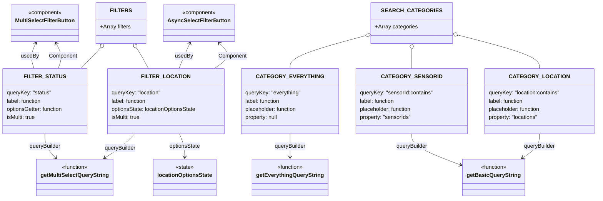

# Diagram: web/portal/src/pages/containertracking/search/SensorOverview/SensorOverview.searchOptions.js

> Auto-generated by Obscura crawlers

## Mermaid

### SVG

<svg id="container" width="1720.80859375" xmlns="http://www.w3.org/2000/svg" class="classDiagram" height="584" viewBox="0 0 1720.80859375 584" role="graphics-document document" aria-roledescription="class"><g><defs><marker id="container_class-aggregationStart" class="marker aggregation class" refX="18" refY="7" markerWidth="190" markerHeight="240" orient="auto"><path d="M 18,7 L9,13 L1,7 L9,1 Z"></path></marker></defs><defs><marker id="container_class-aggregationEnd" class="marker aggregation class" refX="1" refY="7" markerWidth="20" markerHeight="28" orient="auto"><path d="M 18,7 L9,13 L1,7 L9,1 Z"></path></marker></defs><defs><marker id="container_class-extensionStart" class="marker extension class" refX="18" refY="7" markerWidth="190" markerHeight="240" orient="auto"><path d="M 1,7 L18,13 V 1 Z"></path></marker></defs><defs><marker id="container_class-extensionEnd" class="marker extension class" refX="1" refY="7" markerWidth="20" markerHeight="28" orient="auto"><path d="M 1,1 V 13 L18,7 Z"></path></marker></defs><defs><marker id="container_class-compositionStart" class="marker composition class" refX="18" refY="7" markerWidth="190" markerHeight="240" orient="auto"><path d="M 18,7 L9,13 L1,7 L9,1 Z"></path></marker></defs><defs><marker id="container_class-compositionEnd" class="marker composition class" refX="1" refY="7" markerWidth="20" markerHeight="28" orient="auto"><path d="M 18,7 L9,13 L1,7 L9,1 Z"></path></marker></defs><defs><marker id="container_class-dependencyStart" class="marker dependency class" refX="6" refY="7" markerWidth="190" markerHeight="240" orient="auto"><path d="M 5,7 L9,13 L1,7 L9,1 Z"></path></marker></defs><defs><marker id="container_class-dependencyEnd" class="marker dependency class" refX="13" refY="7" markerWidth="20" markerHeight="28" orient="auto"><path d="M 18,7 L9,13 L14,7 L9,1 Z"></path></marker></defs><defs><marker id="container_class-lollipopStart" class="marker lollipop class" refX="13" refY="7" markerWidth="190" markerHeight="240" orient="auto"><circle stroke="black" fill="transparent" cx="7" cy="7" r="6"></circle></marker></defs><defs><marker id="container_class-lollipopEnd" class="marker lollipop class" refX="1" refY="7" markerWidth="190" markerHeight="240" orient="auto"><circle stroke="black" fill="transparent" cx="7" cy="7" r="6"></circle></marker></defs><g class="root"><g class="clusters"></g><g class="edgePaths"><path d="M1061.632,104.064L1025.383,114.22C989.133,124.376,916.635,144.688,880.386,161.011C844.137,177.333,844.137,189.667,844.137,195.833L844.137,202" id="id_SEARCH_CATEGORIES_CATEGORY_EVERYTHING_1" class="edge-thickness-normal edge-pattern-solid relation" style=";;;" data-edge="true" data-et="edge" data-id="id_SEARCH_CATEGORIES_CATEGORY_EVERYTHING_1" data-points="W3sieCI6MTA3OC4yNDIxODc1LCJ5Ijo5OS40MTA3NDMyOTgxMzE1OX0seyJ4Ijo4NDQuMTM2NzE4NzUsInkiOjE2NX0seyJ4Ijo4NDQuMTM2NzE4NzUsInkiOjIwMn1d" marker-start="url(#container_class-aggregationStart)"></path><path d="M1190.355,145.25L1190.355,148.542C1190.355,151.833,1190.355,158.417,1190.355,167.875C1190.355,177.333,1190.355,189.667,1190.355,195.833L1190.355,202" id="id_SEARCH_CATEGORIES_CATEGORY_SENSORID_2" class="edge-thickness-normal edge-pattern-solid relation" style=";;;" data-edge="true" data-et="edge" data-id="id_SEARCH_CATEGORIES_CATEGORY_SENSORID_2" data-points="W3sieCI6MTE5MC4zNTU0Njg3NSwieSI6MTI4fSx7IngiOjExOTAuMzU1NDY4NzUsInkiOjE2NX0seyJ4IjoxMTkwLjM1NTQ2ODc1LCJ5IjoyMDJ9XQ==" marker-start="url(#container_class-aggregationStart)"></path><path d="M1319.142,102.161L1358.626,112.634C1398.11,123.107,1477.079,144.054,1516.563,160.693C1556.047,177.333,1556.047,189.667,1556.047,195.833L1556.047,202" id="id_SEARCH_CATEGORIES_CATEGORY_LOCATION_3" class="edge-thickness-normal edge-pattern-solid relation" style=";;;" data-edge="true" data-et="edge" data-id="id_SEARCH_CATEGORIES_CATEGORY_LOCATION_3" data-points="W3sieCI6MTMwMi40Njg3NSwieSI6OTcuNzM4MTU2NTMxMzk5MjF9LHsieCI6MTU1Ni4wNDY4NzUsInkiOjE2NX0seyJ4IjoxNTU2LjA0Njg3NSwieSI6MjAyfV0=" marker-start="url(#container_class-aggregationStart)"></path><path d="M844.137,394L844.137,400.167C844.137,406.333,844.137,418.667,844.137,430C844.137,441.333,844.137,451.667,844.137,456.833L844.137,462" id="id_CATEGORY_EVERYTHING_getEverythingQueryString_4" class="edge-thickness-normal edge-pattern-solid relation" style=";;;" data-edge="true" data-et="edge" data-id="id_CATEGORY_EVERYTHING_getEverythingQueryString_4" data-points="W3sieCI6ODQ0LjEzNjcxODc1LCJ5IjozOTR9LHsieCI6ODQ0LjEzNjcxODc1LCJ5Ijo0MzF9LHsieCI6ODQ0LjEzNjcxODc1LCJ5Ijo0Njh9XQ==" marker-end="url(#container_class-dependencyEnd)"></path><path d="M1190.355,394L1190.355,400.167C1190.355,406.333,1190.355,418.667,1213.298,433.903C1236.24,449.14,1282.125,467.281,1305.068,476.351L1328.01,485.421" id="id_CATEGORY_SENSORID_getBasicQueryString_5" class="edge-thickness-normal edge-pattern-solid relation" style=";;;" data-edge="true" data-et="edge" data-id="id_CATEGORY_SENSORID_getBasicQueryString_5" data-points="W3sieCI6MTE5MC4zNTU0Njg3NSwieSI6Mzk0fSx7IngiOjExOTAuMzU1NDY4NzUsInkiOjQzMX0seyJ4IjoxMzMzLjU4OTg0Mzc1LCJ5Ijo0ODcuNjI2NzUyMTk3NjcxNjR9XQ==" marker-end="url(#container_class-dependencyEnd)"></path><path d="M1556.047,394L1556.047,400.167C1556.047,406.333,1556.047,418.667,1547.694,430.443C1539.341,442.218,1522.635,453.437,1514.283,459.046L1505.93,464.655" id="id_CATEGORY_LOCATION_getBasicQueryString_6" class="edge-thickness-normal edge-pattern-solid relation" style=";;;" data-edge="true" data-et="edge" data-id="id_CATEGORY_LOCATION_getBasicQueryString_6" data-points="W3sieCI6MTU1Ni4wNDY4NzUsInkiOjM5NH0seyJ4IjoxNTU2LjA0Njg3NSwieSI6NDMxfSx7IngiOjE1MDAuOTQ4NzAzNjQwMTEsInkiOjQ2OH1d" marker-end="url(#container_class-dependencyEnd)"></path><path d="M290.56,141.433L287.396,145.361C284.231,149.289,277.903,157.144,268.245,167.239C258.588,177.333,245.601,189.667,239.108,195.833L232.615,202" id="id_FILTERS_FILTER_STATUS_7" class="edge-thickness-normal edge-pattern-solid relation" style=";;;" data-edge="true" data-et="edge" data-id="id_FILTERS_FILTER_STATUS_7" data-points="W3sieCI6MzAxLjM4MTkyNjU0NjM5MTc1LCJ5IjoxMjh9LHsieCI6MjcxLjU3NDIxODc1LCJ5IjoxNjV9LHsieCI6MjMyLjYxNDg5NjYxNjU0MTM2LCJ5IjoyMDJ9XQ==" marker-start="url(#container_class-aggregationStart)"></path><path d="M398.071,142.468L400.509,146.223C402.948,149.979,407.824,157.489,413.672,167.411C419.519,177.333,426.337,189.667,429.747,195.833L433.156,202" id="id_FILTERS_FILTER_LOCATION_8" class="edge-thickness-normal edge-pattern-solid relation" style=";;;" data-edge="true" data-et="edge" data-id="id_FILTERS_FILTER_LOCATION_8" data-points="W3sieCI6Mzg4LjY3Njk0OTA5NzkzODEsInkiOjEyOH0seyJ4Ijo0MTIuNzAxMTcxODc1LCJ5IjoxNjV9LHsieCI6NDMzLjE1NTYwMzg1MzM4MzQ3LCJ5IjoyMDJ9XQ==" marker-start="url(#container_class-aggregationStart)"></path><path d="M165.697,202L167.892,195.833C170.087,189.667,174.476,177.333,173.612,164.899C172.748,152.464,166.631,139.928,163.572,133.66L160.513,127.392" id="id_FILTER_STATUS_MultiSelectFilterButton_9" class="edge-thickness-normal edge-pattern-solid relation" style=";;;" data-edge="true" data-et="edge" data-id="id_FILTER_STATUS_MultiSelectFilterButton_9" data-points="W3sieCI6MTY1LjY5NzEzMzQ1ODY0NjYyLCJ5IjoyMDJ9LHsieCI6MTc4Ljg2NTIzNDM3NSwieSI6MTY1fSx7IngiOjE1Ny44ODIxMjc4OTk0ODQ1NCwieSI6MTIyfV0=" marker-end="url(#container_class-dependencyEnd)"></path><path d="M131.531,394L131.531,400.167C131.531,406.333,131.531,418.667,137.414,430.318C143.297,441.969,155.062,452.939,160.945,458.424L166.828,463.908" id="id_FILTER_STATUS_getMultiSelectQueryString_10" class="edge-thickness-normal edge-pattern-solid relation" style=";;;" data-edge="true" data-et="edge" data-id="id_FILTER_STATUS_getMultiSelectQueryString_10" data-points="W3sieCI6MTMxLjUzMTI1LCJ5IjozOTR9LHsieCI6MTMxLjUzMTI1LCJ5Ijo0MzF9LHsieCI6MTcxLjIxNjE5NTkxMzQ2MTU1LCJ5Ijo0Njh9XQ==" marker-end="url(#container_class-dependencyEnd)"></path><path d="M624.905,202L633.813,195.833C642.721,189.667,660.537,177.333,662.655,164.69C664.773,152.047,651.192,139.094,644.402,132.618L637.611,126.141" id="id_FILTER_LOCATION_AsyncSelectFilterButton_11" class="edge-thickness-normal edge-pattern-solid relation" style=";;;" data-edge="true" data-et="edge" data-id="id_FILTER_LOCATION_AsyncSelectFilterButton_11" data-points="W3sieCI6NjI0LjkwNDY2NDAwMzc1OTQsInkiOjIwMn0seyJ4Ijo2NzguMzUzNTE1NjI1LCJ5IjoxNjV9LHsieCI6NjMzLjI2OTQ5MDk3OTM4MTQsInkiOjEyMn1d" marker-end="url(#container_class-dependencyEnd)"></path><path d="M395.656,394L389.838,400.167C384.02,406.333,372.384,418.667,358.47,430.431C344.555,442.196,328.363,453.392,320.266,458.99L312.17,464.588" id="id_FILTER_LOCATION_getMultiSelectQueryString_12" class="edge-thickness-normal edge-pattern-solid relation" style=";;;" data-edge="true" data-et="edge" data-id="id_FILTER_LOCATION_getMultiSelectQueryString_12" data-points="W3sieCI6Mzk1LjY1NTYwMzg1MzM4MzQ3LCJ5IjozOTR9LHsieCI6MzYwLjc0ODA0Njg3NSwieSI6NDMxfSx7IngiOjMwNy4yMzQ5NTQ0OTg2MjY0LCJ5Ijo0Njh9XQ==" marker-end="url(#container_class-dependencyEnd)"></path><path d="M526.44,394L529.024,400.167C531.607,406.333,536.773,418.667,539.356,430C541.939,441.333,541.939,451.667,541.939,456.833L541.939,462" id="id_FILTER_LOCATION_locationOptionsState_13" class="edge-thickness-normal edge-pattern-solid relation" style=";;;" data-edge="true" data-et="edge" data-id="id_FILTER_LOCATION_locationOptionsState_13" data-points="W3sieCI6NTI2LjQ0MDM3ODI4OTQ3MzYsInkiOjM5NH0seyJ4Ijo1NDEuOTM5NDUzMTI1LCJ5Ijo0MzF9LHsieCI6NTQxLjkzOTQ1MzEyNSwieSI6NDY4fV0=" marker-end="url(#container_class-dependencyEnd)"></path><path d="M104.485,127.462L101.639,133.718C98.793,139.974,93.102,152.487,92.302,164.91C91.502,177.333,95.593,189.667,97.639,195.833L99.684,202" id="id_MultiSelectFilterButton_FILTER_STATUS_14" class="edge-thickness-normal edge-pattern-solid relation" style=";;;" data-edge="true" data-et="edge" data-id="id_MultiSelectFilterButton_FILTER_STATUS_14" data-points="W3sieCI6MTA2Ljk2ODk5MTYyMzcxMTMzLCJ5IjoxMjJ9LHsieCI6ODcuNDEwMTU2MjUsInkiOjE2NX0seyJ4Ijo5OS42ODQ0NDU0ODg3MjE4LCJ5IjoyMDJ9XQ==" marker-start="url(#container_class-dependencyStart)"></path><path d="M549.606,127.462L546.76,133.718C543.914,139.974,538.223,152.487,533.23,164.91C528.237,177.333,523.943,189.667,521.796,195.833L519.649,202" id="id_AsyncSelectFilterButton_FILTER_LOCATION_15" class="edge-thickness-normal edge-pattern-solid relation" style=";;;" data-edge="true" data-et="edge" data-id="id_AsyncSelectFilterButton_FILTER_LOCATION_15" data-points="W3sieCI6NTUyLjA5MDA4NTM3MzcxMTMsInkiOjEyMn0seyJ4Ijo1MzIuNTMxMjUsInkiOjE2NX0seyJ4Ijo1MTkuNjQ5NDk0ODMwODI3LCJ5IjoyMDJ9XQ==" marker-start="url(#container_class-dependencyStart)"></path></g><g class="edgeLabels"><g class="edgeLabel"><g class="label" data-id="id_SEARCH_CATEGORIES_CATEGORY_EVERYTHING_1" transform="translate(0, 0)"><foreignObject width="0" height="0">

</foreignObject></g></g><g class="edgeLabel"><g class="label" data-id="id_SEARCH_CATEGORIES_CATEGORY_SENSORID_2" transform="translate(0, 0)"><foreignObject width="0" height="0">

</foreignObject></g></g><g class="edgeLabel"><g class="label" data-id="id_SEARCH_CATEGORIES_CATEGORY_LOCATION_3" transform="translate(0, 0)"><foreignObject width="0" height="0">

</foreignObject></g></g><g class="edgeLabel" transform="translate(844.13671875, 431)"><g class="label" data-id="id_CATEGORY_EVERYTHING_getEverythingQueryString_4" transform="translate(-47.140625, -12)"><foreignObject width="94.28125" height="24">

queryBuilder

</foreignObject></g></g><g class="edgeLabel" transform="translate(1190.35546875, 431)"><g class="label" data-id="id_CATEGORY_SENSORID_getBasicQueryString_5" transform="translate(-47.140625, -12)"><foreignObject width="94.28125" height="24">

queryBuilder

</foreignObject></g></g><g class="edgeLabel" transform="translate(1556.046875, 431)"><g class="label" data-id="id_CATEGORY_LOCATION_getBasicQueryString_6" transform="translate(-47.140625, -12)"><foreignObject width="94.28125" height="24">

queryBuilder

</foreignObject></g></g><g class="edgeLabel"><g class="label" data-id="id_FILTERS_FILTER_STATUS_7" transform="translate(0, 0)"><foreignObject width="0" height="0">

</foreignObject></g></g><g class="edgeLabel"><g class="label" data-id="id_FILTERS_FILTER_LOCATION_8" transform="translate(0, 0)"><foreignObject width="0" height="0">

</foreignObject></g></g><g class="edgeLabel" transform="translate(178.865234375, 165)"><g class="label" data-id="id_FILTER_STATUS_MultiSelectFilterButton_9" transform="translate(-41.8984375, -12)"><foreignObject width="83.796875" height="24">

Component

</foreignObject></g></g><g class="edgeLabel" transform="translate(131.53125, 431)"><g class="label" data-id="id_FILTER_STATUS_getMultiSelectQueryString_10" transform="translate(-47.140625, -12)"><foreignObject width="94.28125" height="24">

queryBuilder

</foreignObject></g></g><g class="edgeLabel" transform="translate(678.353515625, 165)"><g class="label" data-id="id_FILTER_LOCATION_AsyncSelectFilterButton_11" transform="translate(-41.8984375, -12)"><foreignObject width="83.796875" height="24">

Component

</foreignObject></g></g><g class="edgeLabel" transform="translate(354.91176, 435.03532)"><g class="label" data-id="id_FILTER_LOCATION_getMultiSelectQueryString_12" transform="translate(-47.140625, -12)"><foreignObject width="94.28125" height="24">

queryBuilder

</foreignObject></g></g><g class="edgeLabel" transform="translate(541.939453125, 431)"><g class="label" data-id="id_FILTER_LOCATION_locationOptionsState_13" transform="translate(-46.34375, -12)"><foreignObject width="92.6875" height="24">

optionsState

</foreignObject></g></g><g class="edgeLabel" transform="translate(87.41015625, 165)"><g class="label" data-id="id_MultiSelectFilterButton_FILTER_STATUS_14" transform="translate(-26.34375, -12)"><foreignObject width="52.6875" height="24">

usedBy

</foreignObject></g></g><g class="edgeLabel" transform="translate(532.53125, 165)"><g class="label" data-id="id_AsyncSelectFilterButton_FILTER_LOCATION_15" transform="translate(-26.34375, -12)"><foreignObject width="52.6875" height="24">

usedBy

</foreignObject></g></g></g><g class="nodes"><g class="node default" id="classId-getBasicQueryString-0" transform="translate(1420.53515625, 522)"><g class="basic label-container"><path d="M-86.9453125 -54 L86.9453125 -54 L86.9453125 54 L-86.9453125 54" stroke="none" stroke-width="0" fill="#ECECFF" style=""></path><path d="M-86.9453125 -54 C-25.596940036790976 -54, 35.75143242641805 -54, 86.9453125 -54 M-86.9453125 -54 C-33.650151977695714 -54, 19.645008544608572 -54, 86.9453125 -54 M86.9453125 -54 C86.9453125 -13.904042935099916, 86.9453125 26.191914129800168, 86.9453125 54 M86.9453125 -54 C86.9453125 -28.185167210477296, 86.9453125 -2.370334420954592, 86.9453125 54 M86.9453125 54 C28.4938384084264 54, -29.957635683147203 54, -86.9453125 54 M86.9453125 54 C44.771745957624915 54, 2.598179415249831 54, -86.9453125 54 M-86.9453125 54 C-86.9453125 16.478854104221952, -86.9453125 -21.042291791556096, -86.9453125 -54 M-86.9453125 54 C-86.9453125 15.466536273477779, -86.9453125 -23.066927453044443, -86.9453125 -54" stroke="#9370DB" stroke-width="1.3" fill="none" stroke-dasharray="0 0" style=""></path></g><g class="annotation-group text" transform="translate(-39.484375, -30)"><g class="label" style="" transform="translate(0,-12)"><foreignObject width="78.96875" height="24">

«function»

</foreignObject></g></g><g class="label-group text" transform="translate(-74.9453125, -6)"><g class="label" style="font-weight: bolder" transform="translate(0,-12)"><foreignObject width="149.890625" height="24">

getBasicQueryString

</foreignObject></g></g><g class="members-group text" transform="translate(-74.9453125, 42)"></g><g class="methods-group text" transform="translate(-74.9453125, 72)"></g><g class="divider" style=""><path d="M-86.9453125 18 C-40.78248853737988 18, 5.380335425240247 18, 86.9453125 18 M-86.9453125 18 C-49.55398217909663 18, -12.162651858193257 18, 86.9453125 18" stroke="#9370DB" stroke-width="1.3" fill="none" stroke-dasharray="0 0" style=""></path></g><g class="divider" style=""><path d="M-86.9453125 36 C-47.258688807676954 36, -7.572065115353908 36, 86.9453125 36 M-86.9453125 36 C-25.146519924010747 36, 36.65227265197851 36, 86.9453125 36" stroke="#9370DB" stroke-width="1.3" fill="none" stroke-dasharray="0 0" style=""></path></g></g><g class="node default" id="classId-getEverythingQueryString-1" transform="translate(844.13671875, 522)"><g class="basic label-container"><path d="M-106.59375 -54 L106.59375 -54 L106.59375 54 L-106.59375 54" stroke="none" stroke-width="0" fill="#ECECFF" style=""></path><path d="M-106.59375 -54 C-49.784511236128935 -54, 7.0247275277421295 -54, 106.59375 -54 M-106.59375 -54 C-44.4674814520659 -54, 17.658787095868206 -54, 106.59375 -54 M106.59375 -54 C106.59375 -19.466174325827225, 106.59375 15.06765134834555, 106.59375 54 M106.59375 -54 C106.59375 -29.3529114174181, 106.59375 -4.705822834836198, 106.59375 54 M106.59375 54 C41.14795870068782 54, -24.297832598624353 54, -106.59375 54 M106.59375 54 C22.10725481685151 54, -62.37924036629698 54, -106.59375 54 M-106.59375 54 C-106.59375 30.781083052939017, -106.59375 7.562166105878035, -106.59375 -54 M-106.59375 54 C-106.59375 21.06826395208728, -106.59375 -11.863472095825443, -106.59375 -54" stroke="#9370DB" stroke-width="1.3" fill="none" stroke-dasharray="0 0" style=""></path></g><g class="annotation-group text" transform="translate(-39.484375, -30)"><g class="label" style="" transform="translate(0,-12)"><foreignObject width="78.96875" height="24">

«function»

</foreignObject></g></g><g class="label-group text" transform="translate(-94.59375, -6)"><g class="label" style="font-weight: bolder" transform="translate(0,-12)"><foreignObject width="189.1875" height="24">

getEverythingQueryString

</foreignObject></g></g><g class="members-group text" transform="translate(-94.59375, 42)"></g><g class="methods-group text" transform="translate(-94.59375, 72)"></g><g class="divider" style=""><path d="M-106.59375 18 C-54.30485483810008 18, -2.015959676200154 18, 106.59375 18 M-106.59375 18 C-47.56501545304129 18, 11.463719093917419 18, 106.59375 18" stroke="#9370DB" stroke-width="1.3" fill="none" stroke-dasharray="0 0" style=""></path></g><g class="divider" style=""><path d="M-106.59375 36 C-63.63795044781233 36, -20.68215089562466 36, 106.59375 36 M-106.59375 36 C-33.32366227938226 36, 39.946425441235476 36, 106.59375 36" stroke="#9370DB" stroke-width="1.3" fill="none" stroke-dasharray="0 0" style=""></path></g></g><g class="node default" id="classId-getMultiSelectQueryString-2" transform="translate(229.134765625, 522)"><g class="basic label-container"><path d="M-109.0078125 -54 L109.0078125 -54 L109.0078125 54 L-109.0078125 54" stroke="none" stroke-width="0" fill="#ECECFF" style=""></path><path d="M-109.0078125 -54 C-38.40431998105878 -54, 32.19917253788245 -54, 109.0078125 -54 M-109.0078125 -54 C-40.247059949399954 -54, 28.51369260120009 -54, 109.0078125 -54 M109.0078125 -54 C109.0078125 -19.72258018766383, 109.0078125 14.55483962467234, 109.0078125 54 M109.0078125 -54 C109.0078125 -21.343402524684777, 109.0078125 11.313194950630447, 109.0078125 54 M109.0078125 54 C38.90511616002999 54, -31.19758017994002 54, -109.0078125 54 M109.0078125 54 C28.451214779803735 54, -52.10538294039253 54, -109.0078125 54 M-109.0078125 54 C-109.0078125 26.30590215386311, -109.0078125 -1.3881956922737828, -109.0078125 -54 M-109.0078125 54 C-109.0078125 13.206684822587349, -109.0078125 -27.586630354825303, -109.0078125 -54" stroke="#9370DB" stroke-width="1.3" fill="none" stroke-dasharray="0 0" style=""></path></g><g class="annotation-group text" transform="translate(-39.484375, -30)"><g class="label" style="" transform="translate(0,-12)"><foreignObject width="78.96875" height="24">

«function»

</foreignObject></g></g><g class="label-group text" transform="translate(-97.0078125, -6)"><g class="label" style="font-weight: bolder" transform="translate(0,-12)"><foreignObject width="194.015625" height="24">

getMultiSelectQueryString

</foreignObject></g></g><g class="members-group text" transform="translate(-97.0078125, 42)"></g><g class="methods-group text" transform="translate(-97.0078125, 72)"></g><g class="divider" style=""><path d="M-109.0078125 18 C-59.56711815997541 18, -10.126423819950816 18, 109.0078125 18 M-109.0078125 18 C-57.8330610003721 18, -6.6583095007441955 18, 109.0078125 18" stroke="#9370DB" stroke-width="1.3" fill="none" stroke-dasharray="0 0" style=""></path></g><g class="divider" style=""><path d="M-109.0078125 36 C-32.01710424840091 36, 44.973604003198176 36, 109.0078125 36 M-109.0078125 36 C-60.3805803587624 36, -11.753348217524803 36, 109.0078125 36" stroke="#9370DB" stroke-width="1.3" fill="none" stroke-dasharray="0 0" style=""></path></g></g><g class="node default" id="classId-locationOptionsState-3" transform="translate(541.939453125, 522)"><g class="basic label-container"><path d="M-89.890625 -54 L89.890625 -54 L89.890625 54 L-89.890625 54" stroke="none" stroke-width="0" fill="#ECECFF" style=""></path><path d="M-89.890625 -54 C-53.448602179795415 -54, -17.00657935959083 -54, 89.890625 -54 M-89.890625 -54 C-43.65096297562919 -54, 2.588699048741617 -54, 89.890625 -54 M89.890625 -54 C89.890625 -12.305092767188874, 89.890625 29.38981446562225, 89.890625 54 M89.890625 -54 C89.890625 -30.165392769248584, 89.890625 -6.330785538497167, 89.890625 54 M89.890625 54 C21.26616578142651 54, -47.35829343714698 54, -89.890625 54 M89.890625 54 C28.794809110162255 54, -32.30100677967549 54, -89.890625 54 M-89.890625 54 C-89.890625 30.716492614194205, -89.890625 7.432985228388411, -89.890625 -54 M-89.890625 54 C-89.890625 20.026898938687587, -89.890625 -13.946202122624825, -89.890625 -54" stroke="#9370DB" stroke-width="1.3" fill="none" stroke-dasharray="0 0" style=""></path></g><g class="annotation-group text" transform="translate(-27.0234375, -30)"><g class="label" style="" transform="translate(0,-12)"><foreignObject width="54.046875" height="24">

«state»

</foreignObject></g></g><g class="label-group text" transform="translate(-77.890625, -6)"><g class="label" style="font-weight: bolder" transform="translate(0,-12)"><foreignObject width="155.78125" height="24">

locationOptionsState

</foreignObject></g></g><g class="members-group text" transform="translate(-77.890625, 42)"></g><g class="methods-group text" transform="translate(-77.890625, 72)"></g><g class="divider" style=""><path d="M-89.890625 18 C-50.990424631142524 18, -12.090224262285048 18, 89.890625 18 M-89.890625 18 C-26.97297098068824 18, 35.94468303862352 18, 89.890625 18" stroke="#9370DB" stroke-width="1.3" fill="none" stroke-dasharray="0 0" style=""></path></g><g class="divider" style=""><path d="M-89.890625 36 C-45.45629592734615 36, -1.0219668546922946 36, 89.890625 36 M-89.890625 36 C-40.409894134493705 36, 9.07083673101259 36, 89.890625 36" stroke="#9370DB" stroke-width="1.3" fill="none" stroke-dasharray="0 0" style=""></path></g></g><g class="node default" id="classId-AsyncSelectFilterButton-4" transform="translate(576.65234375, 68)"><g class="basic label-container"><path d="M-99.390625 -54 L99.390625 -54 L99.390625 54 L-99.390625 54" stroke="none" stroke-width="0" fill="#ECECFF" style=""></path><path d="M-99.390625 -54 C-19.94703350593906 -54, 59.49655798812188 -54, 99.390625 -54 M-99.390625 -54 C-56.255266387684976 -54, -13.119907775369953 -54, 99.390625 -54 M99.390625 -54 C99.390625 -22.341236750266884, 99.390625 9.317526499466233, 99.390625 54 M99.390625 -54 C99.390625 -18.527763960519522, 99.390625 16.944472078960956, 99.390625 54 M99.390625 54 C43.145239069412014 54, -13.100146861175972 54, -99.390625 54 M99.390625 54 C57.028604392938675 54, 14.66658378587735 54, -99.390625 54 M-99.390625 54 C-99.390625 23.638993318015594, -99.390625 -6.722013363968813, -99.390625 -54 M-99.390625 54 C-99.390625 22.142619928361626, -99.390625 -9.714760143276749, -99.390625 -54" stroke="#9370DB" stroke-width="1.3" fill="none" stroke-dasharray="0 0" style=""></path></g><g class="annotation-group text" transform="translate(-50.2109375, -30)"><g class="label" style="" transform="translate(0,-12)"><foreignObject width="100.421875" height="24">

«component»

</foreignObject></g></g><g class="label-group text" transform="translate(-87.390625, -6)"><g class="label" style="font-weight: bolder" transform="translate(0,-12)"><foreignObject width="174.78125" height="24">

AsyncSelectFilterButton

</foreignObject></g></g><g class="members-group text" transform="translate(-87.390625, 42)"></g><g class="methods-group text" transform="translate(-87.390625, 72)"></g><g class="divider" style=""><path d="M-99.390625 18 C-32.10544221629672 18, 35.179740567406554 18, 99.390625 18 M-99.390625 18 C-33.332010488584956 18, 32.72660402283009 18, 99.390625 18" stroke="#9370DB" stroke-width="1.3" fill="none" stroke-dasharray="0 0" style=""></path></g><g class="divider" style=""><path d="M-99.390625 36 C-40.76978023094416 36, 17.851064538111686 36, 99.390625 36 M-99.390625 36 C-59.25290959694819 36, -19.115194193896386 36, 99.390625 36" stroke="#9370DB" stroke-width="1.3" fill="none" stroke-dasharray="0 0" style=""></path></g></g><g class="node default" id="classId-MultiSelectFilterButton-5" transform="translate(131.53125, 68)"><g class="basic label-container"><path d="M-96.9453125 -54 L96.9453125 -54 L96.9453125 54 L-96.9453125 54" stroke="none" stroke-width="0" fill="#ECECFF" style=""></path><path d="M-96.9453125 -54 C-56.223760630454024 -54, -15.502208760908047 -54, 96.9453125 -54 M-96.9453125 -54 C-55.71949396584258 -54, -14.493675431685162 -54, 96.9453125 -54 M96.9453125 -54 C96.9453125 -22.060369672096517, 96.9453125 9.879260655806966, 96.9453125 54 M96.9453125 -54 C96.9453125 -29.13844711992298, 96.9453125 -4.276894239845959, 96.9453125 54 M96.9453125 54 C36.32652615359691 54, -24.292260192806182 54, -96.9453125 54 M96.9453125 54 C26.350032991257095 54, -44.24524651748581 54, -96.9453125 54 M-96.9453125 54 C-96.9453125 31.85161093379338, -96.9453125 9.703221867586763, -96.9453125 -54 M-96.9453125 54 C-96.9453125 20.780406631306313, -96.9453125 -12.439186737387374, -96.9453125 -54" stroke="#9370DB" stroke-width="1.3" fill="none" stroke-dasharray="0 0" style=""></path></g><g class="annotation-group text" transform="translate(-50.2109375, -30)"><g class="label" style="" transform="translate(0,-12)"><foreignObject width="100.421875" height="24">

«component»

</foreignObject></g></g><g class="label-group text" transform="translate(-84.9453125, -6)"><g class="label" style="font-weight: bolder" transform="translate(0,-12)"><foreignObject width="169.890625" height="24">

MultiSelectFilterButton

</foreignObject></g></g><g class="members-group text" transform="translate(-84.9453125, 42)"></g><g class="methods-group text" transform="translate(-84.9453125, 72)"></g><g class="divider" style=""><path d="M-96.9453125 18 C-21.68291340038421 18, 53.57948569923158 18, 96.9453125 18 M-96.9453125 18 C-42.820655117090546 18, 11.304002265818909 18, 96.9453125 18" stroke="#9370DB" stroke-width="1.3" fill="none" stroke-dasharray="0 0" style=""></path></g><g class="divider" style=""><path d="M-96.9453125 36 C-29.517718463316044 36, 37.90987557336791 36, 96.9453125 36 M-96.9453125 36 C-45.967596910395415 36, 5.010118679209171 36, 96.9453125 36" stroke="#9370DB" stroke-width="1.3" fill="none" stroke-dasharray="0 0" style=""></path></g></g><g class="node default" id="classId-SEARCH_CATEGORIES-6" transform="translate(1190.35546875, 68)"><g class="basic label-container"><path d="M-112.11328125 -60 L112.11328125 -60 L112.11328125 60 L-112.11328125 60" stroke="none" stroke-width="0" fill="#ECECFF" style=""></path><path d="M-112.11328125 -60 C-51.85289838764432 -60, 8.407484474711353 -60, 112.11328125 -60 M-112.11328125 -60 C-61.375449693673524 -60, -10.637618137347047 -60, 112.11328125 -60 M112.11328125 -60 C112.11328125 -16.276012900591503, 112.11328125 27.447974198816993, 112.11328125 60 M112.11328125 -60 C112.11328125 -13.740468869671481, 112.11328125 32.51906226065704, 112.11328125 60 M112.11328125 60 C42.98085117006954 60, -26.151578909860916 60, -112.11328125 60 M112.11328125 60 C40.1879215550631 60, -31.737438139873802 60, -112.11328125 60 M-112.11328125 60 C-112.11328125 12.785217112949368, -112.11328125 -34.42956577410126, -112.11328125 -60 M-112.11328125 60 C-112.11328125 27.616145667159984, -112.11328125 -4.767708665680033, -112.11328125 -60" stroke="#9370DB" stroke-width="1.3" fill="none" stroke-dasharray="0 0" style=""></path></g><g class="annotation-group text" transform="translate(0, -36)"></g><g class="label-group text" transform="translate(-76.1171875, -36)"><g class="label" style="font-weight: bolder" transform="translate(0,-12)"><foreignObject width="152.234375" height="24">

SEARCH_CATEGORIES

</foreignObject></g></g><g class="members-group text" transform="translate(-100.11328125, 12)"><g class="label" style="" transform="translate(0,-12)"><foreignObject width="124.109375" height="24">

+Array categories

</foreignObject></g></g><g class="methods-group text" transform="translate(-100.11328125, 60)"></g><g class="divider" style=""><path d="M-112.11328125 -12 C-45.13289779586171 -12, 21.847485658276582 -12, 112.11328125 -12 M-112.11328125 -12 C-50.48705643327202 -12, 11.139168383455953 -12, 112.11328125 -12" stroke="#9370DB" stroke-width="1.3" fill="none" stroke-dasharray="0 0" style=""></path></g><g class="divider" style=""><path d="M-112.11328125 36 C-49.65849219693625 36, 12.796296856127498 36, 112.11328125 36 M-112.11328125 36 C-41.42545232211032 36, 29.262376605779366 36, 112.11328125 36" stroke="#9370DB" stroke-width="1.3" fill="none" stroke-dasharray="0 0" style=""></path></g></g><g class="node default" id="classId-CATEGORY_EVERYTHING-7" transform="translate(844.13671875, 298)"><g class="basic label-container"><path d="M-137.2890625 -96 L137.2890625 -96 L137.2890625 96 L-137.2890625 96" stroke="none" stroke-width="0" fill="#ECECFF" style=""></path><path d="M-137.2890625 -96 C-38.31069766029056 -96, 60.667667179418885 -96, 137.2890625 -96 M-137.2890625 -96 C-30.176356664078213 -96, 76.93634917184357 -96, 137.2890625 -96 M137.2890625 -96 C137.2890625 -29.11829023187616, 137.2890625 37.76341953624768, 137.2890625 96 M137.2890625 -96 C137.2890625 -38.8937375920501, 137.2890625 18.212524815899798, 137.2890625 96 M137.2890625 96 C73.68733675286724 96, 10.085611005734478 96, -137.2890625 96 M137.2890625 96 C72.46297689348508 96, 7.636891286970155 96, -137.2890625 96 M-137.2890625 96 C-137.2890625 34.363978476250374, -137.2890625 -27.272043047499253, -137.2890625 -96 M-137.2890625 96 C-137.2890625 27.586041564504825, -137.2890625 -40.82791687099035, -137.2890625 -96" stroke="#9370DB" stroke-width="1.3" fill="none" stroke-dasharray="0 0" style=""></path></g><g class="annotation-group text" transform="translate(0, -72)"></g><g class="label-group text" transform="translate(-85.84375, -72)"><g class="label" style="font-weight: bolder" transform="translate(0,-12)"><foreignObject width="171.6875" height="24">

CATEGORY_EVERYTHING

</foreignObject></g></g><g class="members-group text" transform="translate(-125.2890625, -24)"><g class="label" style="" transform="translate(0,-12)"><foreignObject width="164.734375" height="24">

queryKey: "everything"

</foreignObject></g><g class="label" style="" transform="translate(0,12)"><foreignObject width="105.171875" height="24">

label: function

</foreignObject></g><g class="label" style="" transform="translate(0,36)"><foreignObject width="155.609375" height="24">

placeholder: function

</foreignObject></g><g class="label" style="" transform="translate(0,60)"><foreignObject width="98.734375" height="24">

property: null

</foreignObject></g></g><g class="methods-group text" transform="translate(-125.2890625, 96)"></g><g class="divider" style=""><path d="M-137.2890625 -48 C-41.29169301383732 -48, 54.705676472325365 -48, 137.2890625 -48 M-137.2890625 -48 C-40.48396107254868 -48, 56.32114035490264 -48, 137.2890625 -48" stroke="#9370DB" stroke-width="1.3" fill="none" stroke-dasharray="0 0" style=""></path></g><g class="divider" style=""><path d="M-137.2890625 72 C-28.112646620588265 72, 81.06376925882347 72, 137.2890625 72 M-137.2890625 72 C-74.1012599577862 72, -10.91345741557241 72, 137.2890625 72" stroke="#9370DB" stroke-width="1.3" fill="none" stroke-dasharray="0 0" style=""></path></g></g><g class="node default" id="classId-CATEGORY_SENSORID-8" transform="translate(1190.35546875, 298)"><g class="basic label-container"><path d="M-158.9296875 -96 L158.9296875 -96 L158.9296875 96 L-158.9296875 96" stroke="none" stroke-width="0" fill="#ECECFF" style=""></path><path d="M-158.9296875 -96 C-91.1860130768494 -96, -23.442338653698812 -96, 158.9296875 -96 M-158.9296875 -96 C-32.53895954429902 -96, 93.85176841140196 -96, 158.9296875 -96 M158.9296875 -96 C158.9296875 -33.28815056925293, 158.9296875 29.423698861494145, 158.9296875 96 M158.9296875 -96 C158.9296875 -38.48635897323784, 158.9296875 19.027282053524317, 158.9296875 96 M158.9296875 96 C37.38660380588752 96, -84.15647988822496 96, -158.9296875 96 M158.9296875 96 C51.1824548394022 96, -56.564777821195605 96, -158.9296875 96 M-158.9296875 96 C-158.9296875 30.996015278930358, -158.9296875 -34.007969442139284, -158.9296875 -96 M-158.9296875 96 C-158.9296875 55.53660507572135, -158.9296875 15.073210151442694, -158.9296875 -96" stroke="#9370DB" stroke-width="1.3" fill="none" stroke-dasharray="0 0" style=""></path></g><g class="annotation-group text" transform="translate(0, -72)"></g><g class="label-group text" transform="translate(-77.5, -72)"><g class="label" style="font-weight: bolder" transform="translate(0,-12)"><foreignObject width="155" height="24">

CATEGORY_SENSORID

</foreignObject></g></g><g class="members-group text" transform="translate(-146.9296875, -24)"><g class="label" style="" transform="translate(0,-12)"><foreignObject width="216.359375" height="24">

queryKey: "sensorId:contains"

</foreignObject></g><g class="label" style="" transform="translate(0,12)"><foreignObject width="105.171875" height="24">

label: function

</foreignObject></g><g class="label" style="" transform="translate(0,36)"><foreignObject width="155.609375" height="24">

placeholder: function

</foreignObject></g><g class="label" style="" transform="translate(0,60)"><foreignObject width="153.359375" height="24">

property: "sensorIds"

</foreignObject></g></g><g class="methods-group text" transform="translate(-146.9296875, 96)"></g><g class="divider" style=""><path d="M-158.9296875 -48 C-69.63374309569798 -48, 19.66220130860404 -48, 158.9296875 -48 M-158.9296875 -48 C-92.47381554984992 -48, -26.017943599699834 -48, 158.9296875 -48" stroke="#9370DB" stroke-width="1.3" fill="none" stroke-dasharray="0 0" style=""></path></g><g class="divider" style=""><path d="M-158.9296875 72 C-81.4992937690414 72, -4.068900038082802 72, 158.9296875 72 M-158.9296875 72 C-64.06139332821738 72, 30.806900843565245 72, 158.9296875 72" stroke="#9370DB" stroke-width="1.3" fill="none" stroke-dasharray="0 0" style=""></path></g></g><g class="node default" id="classId-CATEGORY_LOCATION-9" transform="translate(1556.046875, 298)"><g class="basic label-container"><path d="M-156.76171875 -96 L156.76171875 -96 L156.76171875 96 L-156.76171875 96" stroke="none" stroke-width="0" fill="#ECECFF" style=""></path><path d="M-156.76171875 -96 C-57.575866723895274 -96, 41.60998530220945 -96, 156.76171875 -96 M-156.76171875 -96 C-74.50985256369877 -96, 7.742013622602457 -96, 156.76171875 -96 M156.76171875 -96 C156.76171875 -42.84990918441508, 156.76171875 10.300181631169835, 156.76171875 96 M156.76171875 -96 C156.76171875 -25.105136673107566, 156.76171875 45.78972665378487, 156.76171875 96 M156.76171875 96 C79.81808776589926 96, 2.8744567817985285 96, -156.76171875 96 M156.76171875 96 C51.679218097498335 96, -53.40328255500333 96, -156.76171875 96 M-156.76171875 96 C-156.76171875 47.02307784701114, -156.76171875 -1.953844305977725, -156.76171875 -96 M-156.76171875 96 C-156.76171875 28.217522612443517, -156.76171875 -39.564954775112966, -156.76171875 -96" stroke="#9370DB" stroke-width="1.3" fill="none" stroke-dasharray="0 0" style=""></path></g><g class="annotation-group text" transform="translate(0, -72)"></g><g class="label-group text" transform="translate(-76.6953125, -72)"><g class="label" style="font-weight: bolder" transform="translate(0,-12)"><foreignObject width="153.390625" height="24">

CATEGORY_LOCATION

</foreignObject></g></g><g class="members-group text" transform="translate(-144.76171875, -24)"><g class="label" style="" transform="translate(0,-12)"><foreignObject width="212.828125" height="24">

queryKey: "location:contains"

</foreignObject></g><g class="label" style="" transform="translate(0,12)"><foreignObject width="105.171875" height="24">

label: function

</foreignObject></g><g class="label" style="" transform="translate(0,36)"><foreignObject width="155.609375" height="24">

placeholder: function

</foreignObject></g><g class="label" style="" transform="translate(0,60)"><foreignObject width="149.8125" height="24">

property: "locations"

</foreignObject></g></g><g class="methods-group text" transform="translate(-144.76171875, 96)"></g><g class="divider" style=""><path d="M-156.76171875 -48 C-67.33529820027567 -48, 22.091122349448653 -48, 156.76171875 -48 M-156.76171875 -48 C-49.07902413773117 -48, 58.603670474537665 -48, 156.76171875 -48" stroke="#9370DB" stroke-width="1.3" fill="none" stroke-dasharray="0 0" style=""></path></g><g class="divider" style=""><path d="M-156.76171875 72 C-47.744722379590584 72, 61.27227399081883 72, 156.76171875 72 M-156.76171875 72 C-41.799689330089336 72, 73.16234008982133 72, 156.76171875 72" stroke="#9370DB" stroke-width="1.3" fill="none" stroke-dasharray="0 0" style=""></path></g></g><g class="node default" id="classId-FILTERS-10" transform="translate(349.71875, 68)"><g class="basic label-container"><path d="M-71.2421875 -60 L71.2421875 -60 L71.2421875 60 L-71.2421875 60" stroke="none" stroke-width="0" fill="#ECECFF" style=""></path><path d="M-71.2421875 -60 C-15.21018711164249 -60, 40.82181327671502 -60, 71.2421875 -60 M-71.2421875 -60 C-21.754766916064483 -60, 27.732653667871034 -60, 71.2421875 -60 M71.2421875 -60 C71.2421875 -30.408440197506437, 71.2421875 -0.8168803950128734, 71.2421875 60 M71.2421875 -60 C71.2421875 -31.658279541302395, 71.2421875 -3.3165590826047904, 71.2421875 60 M71.2421875 60 C36.201425796734206 60, 1.1606640934684123 60, -71.2421875 60 M71.2421875 60 C35.310068374811145 60, -0.62205075037771 60, -71.2421875 60 M-71.2421875 60 C-71.2421875 19.165915486452995, -71.2421875 -21.66816902709401, -71.2421875 -60 M-71.2421875 60 C-71.2421875 15.159157282569296, -71.2421875 -29.681685434861407, -71.2421875 -60" stroke="#9370DB" stroke-width="1.3" fill="none" stroke-dasharray="0 0" style=""></path></g><g class="annotation-group text" transform="translate(0, -36)"></g><g class="label-group text" transform="translate(-27.5625, -36)"><g class="label" style="font-weight: bolder" transform="translate(0,-12)"><foreignObject width="55.125" height="24">

FILTERS

</foreignObject></g></g><g class="members-group text" transform="translate(-59.2421875, 12)"><g class="label" style="" transform="translate(0,-12)"><foreignObject width="90.921875" height="24">

+Array filters

</foreignObject></g></g><g class="methods-group text" transform="translate(-59.2421875, 60)"></g><g class="divider" style=""><path d="M-71.2421875 -12 C-30.97530393599323 -12, 9.291579628013537 -12, 71.2421875 -12 M-71.2421875 -12 C-25.015588232963495 -12, 21.21101103407301 -12, 71.2421875 -12" stroke="#9370DB" stroke-width="1.3" fill="none" stroke-dasharray="0 0" style=""></path></g><g class="divider" style=""><path d="M-71.2421875 36 C-26.340547974324622 36, 18.561091551350756 36, 71.2421875 36 M-71.2421875 36 C-41.408638699973395 36, -11.57508989994679 36, 71.2421875 36" stroke="#9370DB" stroke-width="1.3" fill="none" stroke-dasharray="0 0" style=""></path></g></g><g class="node default" id="classId-FILTER_STATUS-11" transform="translate(131.53125, 298)"><g class="basic label-container"><path d="M-123.53125 -96 L123.53125 -96 L123.53125 96 L-123.53125 96" stroke="none" stroke-width="0" fill="#ECECFF" style=""></path><path d="M-123.53125 -96 C-63.15528801479831 -96, -2.779326029596618 -96, 123.53125 -96 M-123.53125 -96 C-69.65600400796737 -96, -15.780758015934751 -96, 123.53125 -96 M123.53125 -96 C123.53125 -50.27548038464792, 123.53125 -4.550960769295841, 123.53125 96 M123.53125 -96 C123.53125 -39.57177535419552, 123.53125 16.856449291608953, 123.53125 96 M123.53125 96 C29.33618196872635 96, -64.8588860625473 96, -123.53125 96 M123.53125 96 C44.253972464304 96, -35.023305071392 96, -123.53125 96 M-123.53125 96 C-123.53125 44.343245250483, -123.53125 -7.313509499033998, -123.53125 -96 M-123.53125 96 C-123.53125 34.32155673292089, -123.53125 -27.35688653415822, -123.53125 -96" stroke="#9370DB" stroke-width="1.3" fill="none" stroke-dasharray="0 0" style=""></path></g><g class="annotation-group text" transform="translate(0, -72)"></g><g class="label-group text" transform="translate(-53.765625, -72)"><g class="label" style="font-weight: bolder" transform="translate(0,-12)"><foreignObject width="107.53125" height="24">

FILTER_STATUS

</foreignObject></g></g><g class="members-group text" transform="translate(-111.53125, -24)"><g class="label" style="" transform="translate(0,-12)"><foreignObject width="132.296875" height="24">

queryKey: "status"

</foreignObject></g><g class="label" style="" transform="translate(0,12)"><foreignObject width="105.171875" height="24">

label: function

</foreignObject></g><g class="label" style="" transform="translate(0,36)"><foreignObject width="169.296875" height="24">

optionsGetter: function

</foreignObject></g><g class="label" style="" transform="translate(0,60)"><foreignObject width="86.796875" height="24">

isMulti: true

</foreignObject></g></g><g class="methods-group text" transform="translate(-111.53125, 96)"></g><g class="divider" style=""><path d="M-123.53125 -48 C-32.46909539975667 -48, 58.593059200486664 -48, 123.53125 -48 M-123.53125 -48 C-67.3115696569999 -48, -11.091889313999772 -48, 123.53125 -48" stroke="#9370DB" stroke-width="1.3" fill="none" stroke-dasharray="0 0" style=""></path></g><g class="divider" style=""><path d="M-123.53125 72 C-39.30296455935952 72, 44.92532088128095 72, 123.53125 72 M-123.53125 72 C-27.832860022433152 72, 67.8655299551337 72, 123.53125 72" stroke="#9370DB" stroke-width="1.3" fill="none" stroke-dasharray="0 0" style=""></path></g></g><g class="node default" id="classId-FILTER_LOCATION-12" transform="translate(486.2265625, 298)"><g class="basic label-container"><path d="M-170.62109375 -96 L170.62109375 -96 L170.62109375 96 L-170.62109375 96" stroke="none" stroke-width="0" fill="#ECECFF" style=""></path><path d="M-170.62109375 -96 C-62.475004324107616 -96, 45.67108510178477 -96, 170.62109375 -96 M-170.62109375 -96 C-61.80381831930181 -96, 47.01345711139638 -96, 170.62109375 -96 M170.62109375 -96 C170.62109375 -32.59699364323263, 170.62109375 30.80601271353474, 170.62109375 96 M170.62109375 -96 C170.62109375 -45.45400024749266, 170.62109375 5.091999505014684, 170.62109375 96 M170.62109375 96 C96.35398656780781 96, 22.086879385615617 96, -170.62109375 96 M170.62109375 96 C75.73786280665337 96, -19.145368136693264 96, -170.62109375 96 M-170.62109375 96 C-170.62109375 53.12904287521865, -170.62109375 10.258085750437303, -170.62109375 -96 M-170.62109375 96 C-170.62109375 30.34699364495421, -170.62109375 -35.30601271009158, -170.62109375 -96" stroke="#9370DB" stroke-width="1.3" fill="none" stroke-dasharray="0 0" style=""></path></g><g class="annotation-group text" transform="translate(0, -72)"></g><g class="label-group text" transform="translate(-62.9296875, -72)"><g class="label" style="font-weight: bolder" transform="translate(0,-12)"><foreignObject width="125.859375" height="24">

FILTER_LOCATION

</foreignObject></g></g><g class="members-group text" transform="translate(-158.62109375, -24)"><g class="label" style="" transform="translate(0,-12)"><foreignObject width="147.28125" height="24">

queryKey: "location"

</foreignObject></g><g class="label" style="" transform="translate(0,12)"><foreignObject width="105.171875" height="24">

label: function

</foreignObject></g><g class="label" style="" transform="translate(0,36)"><foreignObject width="254.3125" height="24">

optionsState: locationOptionsState

</foreignObject></g><g class="label" style="" transform="translate(0,60)"><foreignObject width="86.796875" height="24">

isMulti: true

</foreignObject></g></g><g class="methods-group text" transform="translate(-158.62109375, 96)"></g><g class="divider" style=""><path d="M-170.62109375 -48 C-67.48313616901189 -48, 35.65482141197623 -48, 170.62109375 -48 M-170.62109375 -48 C-50.99961667827162 -48, 68.62186039345676 -48, 170.62109375 -48" stroke="#9370DB" stroke-width="1.3" fill="none" stroke-dasharray="0 0" style=""></path></g><g class="divider" style=""><path d="M-170.62109375 72 C-81.7107902625727 72, 7.1995132248545985 72, 170.62109375 72 M-170.62109375 72 C-68.67635812394137 72, 33.26837750211726 72, 170.62109375 72" stroke="#9370DB" stroke-width="1.3" fill="none" stroke-dasharray="0 0" style=""></path></g></g></g></g></g></svg>
