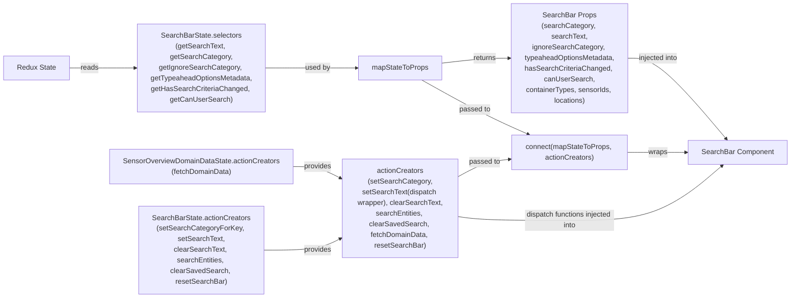

# Diagram: web/portal/src/pages/containertracking/search/SensorOverview/SensorOverviewSearchBarContainer.js

> Auto-generated by Obscura crawlers

## Mermaid

### SVG

<svg id="container" width="2403.625" xmlns="http://www.w3.org/2000/svg" class="flowchart" height="448" viewBox="0 0 2403.625 448" role="graphics-document document" aria-roledescription="flowchart-v2"><g><marker id="container_flowchart-v2-pointEnd" class="marker flowchart-v2" viewBox="0 0 10 10" refX="5" refY="5" markerUnits="userSpaceOnUse" markerWidth="8" markerHeight="8" orient="auto"><path d="M 0 0 L 10 5 L 0 10 z" class="arrowMarkerPath" style="stroke-width: 1; stroke-dasharray: 1, 0;"></path></marker><marker id="container_flowchart-v2-pointStart" class="marker flowchart-v2" viewBox="0 0 10 10" refX="4.5" refY="5" markerUnits="userSpaceOnUse" markerWidth="8" markerHeight="8" orient="auto"><path d="M 0 5 L 10 10 L 10 0 z" class="arrowMarkerPath" style="stroke-width: 1; stroke-dasharray: 1, 0;"></path></marker><marker id="container_flowchart-v2-circleEnd" class="marker flowchart-v2" viewBox="0 0 10 10" refX="11" refY="5" markerUnits="userSpaceOnUse" markerWidth="11" markerHeight="11" orient="auto"><circle cx="5" cy="5" r="5" class="arrowMarkerPath" style="stroke-width: 1; stroke-dasharray: 1, 0;"></circle></marker><marker id="container_flowchart-v2-circleStart" class="marker flowchart-v2" viewBox="0 0 10 10" refX="-1" refY="5" markerUnits="userSpaceOnUse" markerWidth="11" markerHeight="11" orient="auto"><circle cx="5" cy="5" r="5" class="arrowMarkerPath" style="stroke-width: 1; stroke-dasharray: 1, 0;"></circle></marker><marker id="container_flowchart-v2-crossEnd" class="marker cross flowchart-v2" viewBox="0 0 11 11" refX="12" refY="5.2" markerUnits="userSpaceOnUse" markerWidth="11" markerHeight="11" orient="auto"><path d="M 1,1 l 9,9 M 10,1 l -9,9" class="arrowMarkerPath" style="stroke-width: 2; stroke-dasharray: 1, 0;"></path></marker><marker id="container_flowchart-v2-crossStart" class="marker cross flowchart-v2" viewBox="0 0 11 11" refX="-1" refY="5.2" markerUnits="userSpaceOnUse" markerWidth="11" markerHeight="11" orient="auto"><path d="M 1,1 l 9,9 M 10,1 l -9,9" class="arrowMarkerPath" style="stroke-width: 2; stroke-dasharray: 1, 0;"></path></marker><g class="root"><g class="clusters"></g><g class="edgePaths"><path d="M154.391,93L161.892,93C169.393,93,184.396,93,201.84,93C219.284,93,239.169,93,249.112,93L259.055,93" id="L_ReduxState_SBSelectors_0" class="edge-thickness-normal edge-pattern-solid edge-thickness-normal edge-pattern-solid flowchart-link" style=";" data-edge="true" data-et="edge" data-id="L_ReduxState_SBSelectors_0" data-points="W3sieCI6MTU0LjM5MDYyNSwieSI6OTN9LHsieCI6MTk5LjM5ODQzNzUsInkiOjkzfSx7IngiOjI2My4wNTQ2ODc1LCJ5Ijo5M31d" marker-end="url(#container_flowchart-v2-pointEnd)"></path><path d="M790.523,93L803.017,93C815.51,93,840.497,93,888.783,93C937.068,93,1008.651,93,1044.443,93L1080.234,93" id="L_SBSelectors_mapStateToProps_0" class="edge-thickness-normal edge-pattern-solid edge-thickness-normal edge-pattern-solid flowchart-link" style=";" data-edge="true" data-et="edge" data-id="L_SBSelectors_mapStateToProps_0" data-points="W3sieCI6NzkwLjUyMzQzNzUsInkiOjkzfSx7IngiOjg2NS40ODQzNzUsInkiOjkzfSx7IngiOjEwODQuMjM0Mzc1LCJ5Ijo5M31d" marker-end="url(#container_flowchart-v2-pointEnd)"></path><path d="M1271.234,86.49L1308.315,83.908C1345.396,81.327,1419.557,76.163,1465.979,73.582C1512.401,71,1531.083,71,1540.424,71L1549.766,71" id="L_mapStateToProps_Props_0" class="edge-thickness-normal edge-pattern-solid edge-thickness-normal edge-pattern-solid flowchart-link" style=";" data-edge="true" data-et="edge" data-id="L_mapStateToProps_Props_0" data-points="W3sieCI6MTI3MS4yMzQzNzUsInkiOjg2LjQ5MDE4NDQ0MzQ1NTQ4fSx7IngiOjE0OTMuNzE4NzUsInkiOjcxfSx7IngiOjE1NTMuNzY1NjI1LCJ5Ijo3MX1d" marker-end="url(#container_flowchart-v2-pointEnd)"></path><path d="M772.68,389L788.147,389C803.615,389,834.549,389,859.935,386.967C885.32,384.934,905.156,380.869,915.074,378.836L924.992,376.803" id="L_SBActionCreators_actionCreatorsObj_0" class="edge-thickness-normal edge-pattern-solid edge-thickness-normal edge-pattern-solid flowchart-link" style=";" data-edge="true" data-et="edge" data-id="L_SBActionCreators_actionCreatorsObj_0" data-points="W3sieCI6NzcyLjY3OTY4NzUsInkiOjM4OX0seyJ4Ijo4NjUuNDg0Mzc1LCJ5IjozODl9LHsieCI6OTI4LjkxMDE1NjI1LCJ5IjozNzZ9XQ==" marker-end="url(#container_flowchart-v2-pointEnd)"></path><path d="M809.172,261L818.557,261C827.943,261,846.714,261,866.017,263.033C885.32,265.066,905.156,269.131,915.074,271.164L924.992,273.197" id="L_SODomainActions_actionCreatorsObj_0" class="edge-thickness-normal edge-pattern-solid edge-thickness-normal edge-pattern-solid flowchart-link" style=";" data-edge="true" data-et="edge" data-id="L_SODomainActions_actionCreatorsObj_0" data-points="W3sieCI6ODA5LjE3MTg3NSwieSI6MjYxfSx7IngiOjg2NS40ODQzNzUsInkiOjI2MX0seyJ4Ijo5MjguOTEwMTU2MjUsInkiOjI3NH1d" marker-end="url(#container_flowchart-v2-pointEnd)"></path><path d="M1379.174,274L1398.265,269.167C1417.356,264.333,1455.537,254.667,1502.214,247.807C1548.892,240.947,1604.064,236.895,1631.651,234.868L1659.237,232.842" id="L_actionCreatorsObj_Connect_0" class="edge-thickness-normal edge-pattern-solid edge-thickness-normal edge-pattern-solid flowchart-link" style=";" data-edge="true" data-et="edge" data-id="L_actionCreatorsObj_Connect_0" data-points="W3sieCI6MTM3OS4xNzQ0MTQwNjI1LCJ5IjoyNzR9LHsieCI6MTQ5My43MTg3NSwieSI6MjQ1fSx7IngiOjE2NjMuMjI2NTYyNSwieSI6MjMyLjU0ODk5OTY2MDkwMn1d" marker-end="url(#container_flowchart-v2-pointEnd)"></path><path d="M1271.234,115.488L1308.315,124.407C1345.396,133.326,1419.557,151.163,1484.233,165.057C1548.909,178.951,1604.1,188.901,1631.695,193.877L1659.29,198.852" id="L_mapStateToProps_Connect_0" class="edge-thickness-normal edge-pattern-solid edge-thickness-normal edge-pattern-solid flowchart-link" style=";" data-edge="true" data-et="edge" data-id="L_mapStateToProps_Connect_0" data-points="W3sieCI6MTI3MS4yMzQzNzUsInkiOjExNS40ODg0NTM3NDA3OTAxOX0seyJ4IjoxNDkzLjcxODc1LCJ5IjoxNjl9LHsieCI6MTY2My4yMjY1NjI1LCJ5IjoxOTkuNTYxNTQ2Mjg2ODc2OX1d" marker-end="url(#container_flowchart-v2-pointEnd)"></path><path d="M1923.227,223L1953.268,223C1983.31,223,2043.393,223,2084.566,223C2125.74,223,2148.003,223,2159.134,223L2170.266,223" id="L_Connect_SearchBarComponent_0" class="edge-thickness-normal edge-pattern-solid edge-thickness-normal edge-pattern-solid flowchart-link" style=";" data-edge="true" data-et="edge" data-id="L_Connect_SearchBarComponent_0" data-points="W3sieCI6MTkyMy4yMjY1NjI1LCJ5IjoyMjN9LHsieCI6MjEwMy40NzY1NjI1LCJ5IjoyMjN9LHsieCI6MjE3NC4yNjU2MjUsInkiOjIyM31d" marker-end="url(#container_flowchart-v2-pointEnd)"></path><path d="M2032.688,71L2044.486,71C2056.284,71,2079.88,71,2116.04,91.405C2152.199,111.811,2200.922,152.621,2225.283,173.026L2249.644,193.432" id="L_Props_SearchBarComponent_0" class="edge-thickness-normal edge-pattern-solid edge-thickness-normal edge-pattern-solid flowchart-link" style=";" data-edge="true" data-et="edge" data-id="L_Props_SearchBarComponent_0" data-points="W3sieCI6MjAzMi42ODc1LCJ5Ijo3MX0seyJ4IjoyMTAzLjQ3NjU2MjUsInkiOjcxfSx7IngiOjIyNTIuNzEwNzMxOTA3ODk0NiwieSI6MTk2fV0=" marker-end="url(#container_flowchart-v2-pointEnd)"></path><path d="M1433.672,346.869L1443.68,347.724C1453.688,348.579,1473.703,350.29,1533.629,351.145C1593.555,352,1693.391,352,1795.017,352C1896.643,352,2000.06,352,2075.139,335.386C2150.219,318.773,2196.961,285.545,2220.332,268.931L2243.703,252.318" id="L_actionCreatorsObj_SearchBarComponent_0" class="edge-thickness-normal edge-pattern-solid edge-thickness-normal edge-pattern-solid flowchart-link" style=";" data-edge="true" data-et="edge" data-id="L_actionCreatorsObj_SearchBarComponent_0" data-points="W3sieCI6MTQzMy42NzE4NzUsInkiOjM0Ni44NjkxNTg4Nzg1MDQ2Nn0seyJ4IjoxNDkzLjcxODc1LCJ5IjozNTJ9LHsieCI6MTc5My4yMjY1NjI1LCJ5IjozNTJ9LHsieCI6MjEwMy40NzY1NjI1LCJ5IjozNTJ9LHsieCI6MjI0Ni45NjM0ODExMDQ2NTEyLCJ5IjoyNTB9XQ==" marker-end="url(#container_flowchart-v2-pointEnd)"></path></g><g class="edgeLabels"><g class="edgeLabel" transform="translate(199.3984375, 93)"><g class="label" data-id="L_ReduxState_SBSelectors_0" transform="translate(-20.0078125, -12)"><foreignObject width="40.015625" height="24">

reads

</foreignObject></g></g><g class="edgeLabel" transform="translate(865.484375, 93)"><g class="label" data-id="L_SBSelectors_mapStateToProps_0" transform="translate(-28.3125, -12)"><foreignObject width="56.625" height="24">

used by

</foreignObject></g></g><g class="edgeLabel" transform="translate(1493.71875, 71)"><g class="label" data-id="L_mapStateToProps_Props_0" transform="translate(-26.265625, -12)"><foreignObject width="52.53125" height="24">

returns

</foreignObject></g></g><g class="edgeLabel" transform="translate(865.484375, 389)"><g class="label" data-id="L_SBActionCreators_actionCreatorsObj_0" transform="translate(-31.3125, -12)"><foreignObject width="62.625" height="24">

provides

</foreignObject></g></g><g class="edgeLabel" transform="translate(865.484375, 261)"><g class="label" data-id="L_SODomainActions_actionCreatorsObj_0" transform="translate(-31.3125, -12)"><foreignObject width="62.625" height="24">

provides

</foreignObject></g></g><g class="edgeLabel" transform="translate(1519.5522, 243.10243)"><g class="label" data-id="L_actionCreatorsObj_Connect_0" transform="translate(-35.046875, -12)"><foreignObject width="70.09375" height="24">

passed to

</foreignObject></g></g><g class="edgeLabel" transform="translate(1466.20911, 162.38343)"><g class="label" data-id="L_mapStateToProps_Connect_0" transform="translate(-35.046875, -12)"><foreignObject width="70.09375" height="24">

passed to

</foreignObject></g></g><g class="edgeLabel" transform="translate(2103.4765625, 223)"><g class="label" data-id="L_Connect_SearchBarComponent_0" transform="translate(-21.390625, -12)"><foreignObject width="42.78125" height="24">

wraps

</foreignObject></g></g><g class="edgeLabel" transform="translate(2103.4765625, 71)"><g class="label" data-id="L_Props_SearchBarComponent_0" transform="translate(-45.7890625, -12)"><foreignObject width="91.578125" height="24">

injected into

</foreignObject></g></g><g class="edgeLabel" transform="translate(1793.2265625, 352)"><g class="label" data-id="L_actionCreatorsObj_SearchBarComponent_0" transform="translate(-100, -24)"><foreignObject width="200" height="48">

dispatch functions injected into

</foreignObject></g></g></g><g class="nodes"><g class="node default" id="flowchart-ReduxState-0" transform="translate(81.1953125, 93)"><rect class="basic label-container" style="" x="-73.1953125" y="-27" width="146.390625" height="54"></rect><g class="label" style="" transform="translate(-43.1953125, -12)"><rect></rect><foreignObject width="86.390625" height="24">

Redux State

</foreignObject></g></g><g class="node default" id="flowchart-SBSelectors-1" transform="translate(526.7890625, 93)"><rect class="basic label-container" style="" x="-263.734375" y="-63" width="527.46875" height="126"></rect><g class="label" style="" transform="translate(-233.734375, -48)"><rect></rect><foreignObject width="467.46875" height="96">

SearchBarState.selectors\n(getSearchText, getSearchCategory,\ngetIgnoreSearchCategory, getTypeaheadOptionsMetadata,\ngetHasSearchCriteriaChanged, getCanUserSearch)

</foreignObject></g></g><g class="node default" id="flowchart-SODomainActions-2" transform="translate(526.7890625, 261)"><rect class="basic label-container" style="" x="-282.3828125" y="-27" width="564.765625" height="54"></rect><g class="label" style="" transform="translate(-252.3828125, -12)"><rect></rect><foreignObject width="504.765625" height="24">

SensorOverviewDomainDataState.actionCreators\n(fetchDomainData)

</foreignObject></g></g><g class="node default" id="flowchart-mapStateToProps-3" transform="translate(1177.734375, 93)"><rect class="basic label-container" style="" x="-93.5" y="-27" width="187" height="54"></rect><g class="label" style="" transform="translate(-63.5, -12)"><rect></rect><foreignObject width="127" height="24">

mapStateToProps

</foreignObject></g></g><g class="node default" id="flowchart-Props-4" transform="translate(1793.2265625, 71)"><rect class="basic label-container" style="" x="-239.4609375" y="-63" width="478.921875" height="126"></rect><g class="label" style="" transform="translate(-209.4609375, -48)"><rect></rect><foreignObject width="418.921875" height="96">

SearchBar Props\n(searchCategory, searchText,\nignoreSearchCategory, typeaheadOptionsMetadata,\nhasSearchCriteriaChanged, canUserSearch,\ncontainerTypes, sensorIds, locations)

</foreignObject></g></g><g class="node default" id="flowchart-SBActionCreators-5" transform="translate(526.7890625, 389)"><rect class="basic label-container" style="" x="-245.890625" y="-51" width="491.78125" height="102"></rect><g class="label" style="" transform="translate(-215.890625, -36)"><rect></rect><foreignObject width="431.78125" height="72">

SearchBarState.actionCreators\n(setSearchCategoryForKey, setSearchText,\nclearSearchText, searchEntities, clearSavedSearch, resetSearchBar)

</foreignObject></g></g><g class="node default" id="flowchart-actionCreatorsObj-6" transform="translate(1177.734375, 325)"><rect class="basic label-container" style="" x="-255.9375" y="-51" width="511.875" height="102"></rect><g class="label" style="" transform="translate(-225.9375, -36)"><rect></rect><foreignObject width="451.875" height="72">

actionCreators\n(setSearchCategory,\nsetSearchText(dispatch wrapper), clearSearchText,\nsearchEntities, clearSavedSearch, fetchDomainData, resetSearchBar)

</foreignObject></g></g><g class="node default" id="flowchart-Connect-7" transform="translate(1793.2265625, 223)"><rect class="basic label-container" style="" x="-130" y="-39" width="260" height="78"></rect><g class="label" style="" transform="translate(-100, -24)"><rect></rect><foreignObject width="200" height="48">

connect(mapStateToProps, actionCreators)

</foreignObject></g></g><g class="node default" id="flowchart-SearchBarComponent-8" transform="translate(2284.9453125, 223)"><rect class="basic label-container" style="" x="-110.6796875" y="-27" width="221.359375" height="54"></rect><g class="label" style="" transform="translate(-80.6796875, -12)"><rect></rect><foreignObject width="161.359375" height="24">

SearchBar Component

</foreignObject></g></g></g></g></g></svg>
