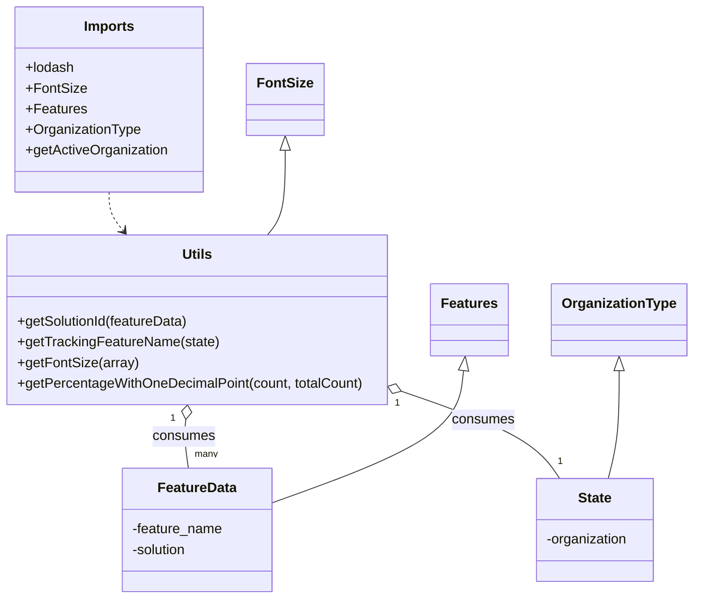

# Diagram: web/portal/src/pages/containertracking/utils/ContainerTrackingUtils.js


> Auto-generated by Obscura crawlers

## Diagram 1



### SVG

<svg id="container" width="799.4375" xmlns="http://www.w3.org/2000/svg" class="classDiagram" height="698" viewBox="0 0 799.4375 698" role="graphics-document document" aria-roledescription="class"><style>#container{font-family:"trebuchet ms",verdana,arial,sans-serif;font-size:16px;fill:#333;}@keyframes edge-animation-frame{from{stroke-dashoffset:0;}}@keyframes dash{to{stroke-dashoffset:0;}}#container .edge-animation-slow{stroke-dasharray:9,5!important;stroke-dashoffset:900;animation:dash 50s linear infinite;stroke-linecap:round;}#container .edge-animation-fast{stroke-dasharray:9,5!important;stroke-dashoffset:900;animation:dash 20s linear infinite;stroke-linecap:round;}#container .error-icon{fill:#552222;}#container .error-text{fill:#552222;stroke:#552222;}#container .edge-thickness-normal{stroke-width:1px;}#container .edge-thickness-thick{stroke-width:3.5px;}#container .edge-pattern-solid{stroke-dasharray:0;}#container .edge-thickness-invisible{stroke-width:0;fill:none;}#container .edge-pattern-dashed{stroke-dasharray:3;}#container .edge-pattern-dotted{stroke-dasharray:2;}#container .marker{fill:#333333;stroke:#333333;}#container .marker.cross{stroke:#333333;}#container svg{font-family:"trebuchet ms",verdana,arial,sans-serif;font-size:16px;}#container p{margin:0;}#container g.classGroup text{fill:#9370DB;stroke:none;font-family:"trebuchet ms",verdana,arial,sans-serif;font-size:10px;}#container g.classGroup text .title{font-weight:bolder;}#container .nodeLabel,#container .edgeLabel{color:#131300;}#container .edgeLabel .label rect{fill:#ECECFF;}#container .label text{fill:#131300;}#container .labelBkg{background:#ECECFF;}#container .edgeLabel .label span{background:#ECECFF;}#container .classTitle{font-weight:bolder;}#container .node rect,#container .node circle,#container .node ellipse,#container .node polygon,#container .node path{fill:#ECECFF;stroke:#9370DB;stroke-width:1px;}#container .divider{stroke:#9370DB;stroke-width:1;}#container g.clickable{cursor:pointer;}#container g.classGroup rect{fill:#ECECFF;stroke:#9370DB;}#container g.classGroup line{stroke:#9370DB;stroke-width:1;}#container .classLabel .box{stroke:none;stroke-width:0;fill:#ECECFF;opacity:0.5;}#container .classLabel .label{fill:#9370DB;font-size:10px;}#container .relation{stroke:#333333;stroke-width:1;fill:none;}#container .dashed-line{stroke-dasharray:3;}#container .dotted-line{stroke-dasharray:1 2;}#container #compositionStart,#container .composition{fill:#333333!important;stroke:#333333!important;stroke-width:1;}#container #compositionEnd,#container .composition{fill:#333333!important;stroke:#333333!important;stroke-width:1;}#container #dependencyStart,#container .dependency{fill:#333333!important;stroke:#333333!important;stroke-width:1;}#container #dependencyStart,#container .dependency{fill:#333333!important;stroke:#333333!important;stroke-width:1;}#container #extensionStart,#container .extension{fill:transparent!important;stroke:#333333!important;stroke-width:1;}#container #extensionEnd,#container .extension{fill:transparent!important;stroke:#333333!important;stroke-width:1;}#container #aggregationStart,#container .aggregation{fill:transparent!important;stroke:#333333!important;stroke-width:1;}#container #aggregationEnd,#container .aggregation{fill:transparent!important;stroke:#333333!important;stroke-width:1;}#container #lollipopStart,#container .lollipop{fill:#ECECFF!important;stroke:#333333!important;stroke-width:1;}#container #lollipopEnd,#container .lollipop{fill:#ECECFF!important;stroke:#333333!important;stroke-width:1;}#container .edgeTerminals{font-size:11px;line-height:initial;}#container .classTitleText{text-anchor:middle;font-size:18px;fill:#333;}#container .label-icon{display:inline-block;height:1em;overflow:visible;vertical-align:-0.125em;}#container .node .label-icon path{fill:currentColor;stroke:revert;stroke-width:revert;}#container :root{--mermaid-font-family:"trebuchet ms",verdana,arial,sans-serif;}</style><g><defs><marker id="container_class-aggregationStart" class="marker aggregation class" refX="18" refY="7" markerWidth="190" markerHeight="240" orient="auto"><path d="M 18,7 L9,13 L1,7 L9,1 Z"></path></marker></defs><defs><marker id="container_class-aggregationEnd" class="marker aggregation class" refX="1" refY="7" markerWidth="20" markerHeight="28" orient="auto"><path d="M 18,7 L9,13 L1,7 L9,1 Z"></path></marker></defs><defs><marker id="container_class-extensionStart" class="marker extension class" refX="18" refY="7" markerWidth="190" markerHeight="240" orient="auto"><path d="M 1,7 L18,13 V 1 Z"></path></marker></defs><defs><marker id="container_class-extensionEnd" class="marker extension class" refX="1" refY="7" markerWidth="20" markerHeight="28" orient="auto"><path d="M 1,1 V 13 L18,7 Z"></path></marker></defs><defs><marker id="container_class-compositionStart" class="marker composition class" refX="18" refY="7" markerWidth="190" markerHeight="240" orient="auto"><path d="M 18,7 L9,13 L1,7 L9,1 Z"></path></marker></defs><defs><marker id="container_class-compositionEnd" class="marker composition class" refX="1" refY="7" markerWidth="20" markerHeight="28" orient="auto"><path d="M 18,7 L9,13 L1,7 L9,1 Z"></path></marker></defs><defs><marker id="container_class-dependencyStart" class="marker dependency class" refX="6" refY="7" markerWidth="190" markerHeight="240" orient="auto"><path d="M 5,7 L9,13 L1,7 L9,1 Z"></path></marker></defs><defs><marker id="container_class-dependencyEnd" class="marker dependency class" refX="13" refY="7" markerWidth="20" markerHeight="28" orient="auto"><path d="M 18,7 L9,13 L14,7 L9,1 Z"></path></marker></defs><defs><marker id="container_class-lollipopStart" class="marker lollipop class" refX="13" refY="7" markerWidth="190" markerHeight="240" orient="auto"><circle stroke="black" fill="transparent" cx="7" cy="7" r="6"></circle></marker></defs><defs><marker id="container_class-lollipopEnd" class="marker lollipop class" refX="1" refY="7" markerWidth="190" markerHeight="240" orient="auto"><circle stroke="black" fill="transparent" cx="7" cy="7" r="6"></circle></marker></defs><g class="root"><g class="clusters"></g><g class="edgePaths"><path d="M129.27,224L129.27,228.167C129.27,232.333,129.27,240.667,132.037,248.225C134.804,255.784,140.339,262.567,143.106,265.959L145.873,269.351" id="id_Imports_Utils_1" class="edge-thickness-normal edge-pattern-dashed relation" style=";;;" data-edge="true" data-et="edge" data-id="id_Imports_Utils_1" data-points="W3sieCI6MTI5LjI2OTUzMTI1LCJ5IjoyMjR9LHsieCI6MTI5LjI2OTUzMTI1LCJ5IjoyNDl9LHsieCI6MTQ5LjY2NjI5OTE0MzE0NTE4LCJ5IjoyNzR9XQ==" marker-end="url(#container_class-dependencyEnd)"></path><path d="M214.105,489.082L213.638,492.401C213.171,495.721,212.237,502.361,212.852,511.847C213.468,521.333,215.633,533.667,216.715,539.833L217.798,546" id="id_Utils_FeatureData_2" class="edge-thickness-normal edge-pattern-solid relation" style=";;;" data-edge="true" data-et="edge" data-id="id_Utils_FeatureData_2" data-points="W3sieCI6MjE2LjUwODUxNjE5OTQ0ODU0LCJ5Ijo0NzJ9LHsieCI6MjExLjMwMjczNDM3NSwieSI6NTA5fSx7IngiOjIxNy43OTgwMjE3ODg5OTA4NCwieSI6NTQ2fV0=" marker-start="url(#container_class-aggregationStart)"></path><path d="M469.122,458.156L492.873,466.63C516.625,475.104,564.128,492.052,593.543,508.693C622.957,525.333,634.284,541.667,639.947,549.833L645.611,558" id="id_Utils_State_3" class="edge-thickness-normal edge-pattern-solid relation" style=";;;" data-edge="true" data-et="edge" data-id="id_Utils_State_3" data-points="W3sieCI6NDUyLjg3NSwieSI6NDUyLjM1OTk4Njg4MzI5NzJ9LHsieCI6NjExLjYzMDg1OTM3NSwieSI6NTA5fSx7IngiOjY0NS42MTA3MzY4MTE5MjY2LCJ5Ijo1NTh9XQ==" marker-start="url(#container_class-aggregationStart)"></path><path d="M537.812,432.082L536.009,444.901C534.205,457.721,530.598,483.361,493.95,508.987C457.302,534.614,387.614,560.229,352.77,573.036L317.926,585.843" id="id_Features_FeatureData_4" class="edge-thickness-normal edge-pattern-solid relation" style=";;;" data-edge="true" data-et="edge" data-id="id_Features_FeatureData_4" data-points="W3sieCI6NTQwLjIxNTczNDE0NTIyMDYsInkiOjQxNX0seyJ4Ijo1MjYuOTkwMjM0Mzc1LCJ5Ijo1MDl9LHsieCI6MzE3LjkyNTc4MTI1LCJ5Ijo1ODUuODQzMDc5NjU4ODQwMn1d" marker-start="url(#container_class-extensionStart)"></path><path d="M715.406,432.25L715.406,445.042C715.406,457.833,715.406,483.417,713.294,504.375C711.182,525.333,706.959,541.667,704.847,549.833L702.735,558" id="id_OrganizationType_State_5" class="edge-thickness-normal edge-pattern-solid relation" style=";;;" data-edge="true" data-et="edge" data-id="id_OrganizationType_State_5" data-points="W3sieCI6NzE1LjQwNjI1LCJ5Ijo0MTV9LHsieCI6NzE1LjQwNjI1LCJ5Ijo1MDl9LHsieCI6NzAyLjczNDgwNTA0NTg3MTYsInkiOjU1OH1d" marker-start="url(#container_class-extensionStart)"></path><path d="M331.605,175.25L331.605,187.542C331.605,199.833,331.605,224.417,328.206,240.875C324.807,257.333,318.008,265.667,314.608,269.833L311.209,274" id="id_FontSize_Utils_6" class="edge-thickness-normal edge-pattern-solid relation" style=";;;" data-edge="true" data-et="edge" data-id="id_FontSize_Utils_6" data-points="W3sieCI6MzMxLjYwNTQ2ODc1LCJ5IjoxNTh9LHsieCI6MzMxLjYwNTQ2ODc1LCJ5IjoyNDl9LHsieCI6MzExLjIwODcwMDg1Njg1NDgsInkiOjI3NH1d" marker-start="url(#container_class-extensionStart)"></path></g><g class="edgeLabels"><g class="edgeLabel"><g class="label" data-id="id_Imports_Utils_1" transform="translate(0, 0)"><foreignObject width="0" height="0"><div xmlns="http://www.w3.org/1999/xhtml" class="labelBkg" style="display: table-cell; white-space: nowrap; line-height: 1.5; max-width: 200px; text-align: center;"><span class="edgeLabel"></span></div></foreignObject></g></g><g class="edgeLabel" transform="translate(211.32014, 509.09917)"><g class="label" data-id="id_Utils_FeatureData_2" transform="translate(-36.375, -12)"><foreignObject width="72.75" height="24"><div xmlns="http://www.w3.org/1999/xhtml" class="labelBkg" style="display: table-cell; white-space: nowrap; line-height: 1.5; max-width: 200px; text-align: center;"><span class="edgeLabel"><p>consumes</p></span></div></foreignObject></g></g><g class="edgeLabel" transform="translate(611.630859375, 509)"><g class="label" data-id="id_Utils_State_3" transform="translate(-36.375, -12)"><foreignObject width="72.75" height="24"><div xmlns="http://www.w3.org/1999/xhtml" class="labelBkg" style="display: table-cell; white-space: nowrap; line-height: 1.5; max-width: 200px; text-align: center;"><span class="edgeLabel"><p>consumes</p></span></div></foreignObject></g></g><g class="edgeLabel"><g class="label" data-id="id_Features_FeatureData_4" transform="translate(0, 0)"><foreignObject width="0" height="0"><div xmlns="http://www.w3.org/1999/xhtml" class="labelBkg" style="display: table-cell; white-space: nowrap; line-height: 1.5; max-width: 200px; text-align: center;"><span class="edgeLabel"></span></div></foreignObject></g></g><g class="edgeLabel"><g class="label" data-id="id_OrganizationType_State_5" transform="translate(0, 0)"><foreignObject width="0" height="0"><div xmlns="http://www.w3.org/1999/xhtml" class="labelBkg" style="display: table-cell; white-space: nowrap; line-height: 1.5; max-width: 200px; text-align: center;"><span class="edgeLabel"></span></div></foreignObject></g></g><g class="edgeLabel"><g class="label" data-id="id_FontSize_Utils_6" transform="translate(0, 0)"><foreignObject width="0" height="0"><div xmlns="http://www.w3.org/1999/xhtml" class="labelBkg" style="display: table-cell; white-space: nowrap; line-height: 1.5; max-width: 200px; text-align: center;"><span class="edgeLabel"></span></div></foreignObject></g></g><g class="edgeTerminals" transform="translate(199.216636312251, 487.23945320787817)"><g class="inner" transform="translate(0, 0)"><foreignObject style="width: 9px; height: 12px;"><div xmlns="http://www.w3.org/1999/xhtml" style="display: inline-block; padding-right: 1px; white-space: nowrap;"><span class="edgeLabel">1</span></div></foreignObject></g></g><g class="edgeTerminals" transform="translate(464.3169748719827, 472.3682647749778)"><g class="inner" transform="translate(0, 0)"><foreignObject style="width: 9px; height: 12px;"><div xmlns="http://www.w3.org/1999/xhtml" style="display: inline-block; padding-right: 1px; white-space: nowrap;"><span class="edgeLabel">1</span></div></foreignObject></g></g><g class="edgeTerminals" transform="translate(224.54627521067212, 521.170009816836)"><g class="inner" transform="translate(0, 0)"></g><foreignObject style="width: 36px; height: 12px;"><div xmlns="http://www.w3.org/1999/xhtml" style="display: inline-block; padding-right: 1px; white-space: nowrap;"><span class="edgeLabel">many</span></div></foreignObject></g><g class="edgeTerminals" transform="translate(642.9644906222882, 530.0716391150836)"><g class="inner" transform="translate(0, 0)"></g><foreignObject style="width: 9px; height: 12px;"><div xmlns="http://www.w3.org/1999/xhtml" style="display: inline-block; padding-right: 1px; white-space: nowrap;"><span class="edgeLabel">1</span></div></foreignObject></g></g><g class="nodes"><g class="node default" id="classId-Imports-0" transform="translate(129.26953125, 116)"><g class="basic label-container"><path d="M-109.4921875 -108 L109.4921875 -108 L109.4921875 108 L-109.4921875 108" stroke="none" stroke-width="0" fill="#ECECFF" style=""></path><path d="M-109.4921875 -108 C-27.024090642255004 -108, 55.44400621548999 -108, 109.4921875 -108 M-109.4921875 -108 C-27.572509759683413 -108, 54.347167980633174 -108, 109.4921875 -108 M109.4921875 -108 C109.4921875 -51.03054331468228, 109.4921875 5.938913370635433, 109.4921875 108 M109.4921875 -108 C109.4921875 -62.358360606918836, 109.4921875 -16.716721213837673, 109.4921875 108 M109.4921875 108 C49.86336066554924 108, -9.765466168901526 108, -109.4921875 108 M109.4921875 108 C53.31118437991131 108, -2.8698187401773794 108, -109.4921875 108 M-109.4921875 108 C-109.4921875 26.50095543495152, -109.4921875 -54.99808913009696, -109.4921875 -108 M-109.4921875 108 C-109.4921875 49.46370357186433, -109.4921875 -9.072592856271342, -109.4921875 -108" stroke="#9370DB" stroke-width="1.3" fill="none" stroke-dasharray="0 0" style=""></path></g><g class="annotation-group text" transform="translate(0, -84)"></g><g class="label-group text" transform="translate(-28.71875, -84)"><g class="label" style="font-weight: bolder" transform="translate(0,-12)"><foreignObject width="57.4375" height="24"><div xmlns="http://www.w3.org/1999/xhtml" style="display: table-cell; white-space: nowrap; line-height: 1.5; max-width: 107px; text-align: center;"><span class="nodeLabel markdown-node-label" style=""><p>Imports</p></span></div></foreignObject></g></g><g class="members-group text" transform="translate(-97.4921875, -36)"><g class="label" style="" transform="translate(0,-12)"><foreignObject width="56.90625" height="24"><div xmlns="http://www.w3.org/1999/xhtml" style="display: table-cell; white-space: nowrap; line-height: 1.5; max-width: 114px; text-align: center;"><span class="nodeLabel markdown-node-label" style=""><p>+lodash</p></span></div></foreignObject></g><g class="label" style="" transform="translate(0,12)"><foreignObject width="68.609375" height="24"><div xmlns="http://www.w3.org/1999/xhtml" style="display: table-cell; white-space: nowrap; line-height: 1.5; max-width: 126px; text-align: center;"><span class="nodeLabel markdown-node-label" style=""><p>+FontSize</p></span></div></foreignObject></g><g class="label" style="" transform="translate(0,36)"><foreignObject width="69.53125" height="24"><div xmlns="http://www.w3.org/1999/xhtml" style="display: table-cell; white-space: nowrap; line-height: 1.5; max-width: 127px; text-align: center;"><span class="nodeLabel markdown-node-label" style=""><p>+Features</p></span></div></foreignObject></g><g class="label" style="" transform="translate(0,60)"><foreignObject width="133.796875" height="24"><div xmlns="http://www.w3.org/1999/xhtml" style="display: table-cell; white-space: nowrap; line-height: 1.5; max-width: 191px; text-align: center;"><span class="nodeLabel markdown-node-label" style=""><p>+OrganizationType</p></span></div></foreignObject></g><g class="label" style="" transform="translate(0,84)"><foreignObject width="166.265625" height="24"><div xmlns="http://www.w3.org/1999/xhtml" style="display: table-cell; white-space: nowrap; line-height: 1.5; max-width: 224px; text-align: center;"><span class="nodeLabel markdown-node-label" style=""><p>+getActiveOrganization</p></span></div></foreignObject></g></g><g class="methods-group text" transform="translate(-97.4921875, 108)"></g><g class="divider" style=""><path d="M-109.4921875 -60 C-45.59119476802549 -60, 18.309797963949023 -60, 109.4921875 -60 M-109.4921875 -60 C-34.28611579477001 -60, 40.919955910459976 -60, 109.4921875 -60" stroke="#9370DB" stroke-width="1.3" fill="none" stroke-dasharray="0 0" style=""></path></g><g class="divider" style=""><path d="M-109.4921875 84 C-33.739637934805785 84, 42.01291163038843 84, 109.4921875 84 M-109.4921875 84 C-44.18076014379204 84, 21.130667212415915 84, 109.4921875 84" stroke="#9370DB" stroke-width="1.3" fill="none" stroke-dasharray="0 0" style=""></path></g></g><g class="node default" id="classId-Utils-1" transform="translate(230.4375, 373)"><g class="basic label-container"><path d="M-222.4375 -99 L222.4375 -99 L222.4375 99 L-222.4375 99" stroke="none" stroke-width="0" fill="#ECECFF" style=""></path><path d="M-222.4375 -99 C-85.17036081561244 -99, 52.09677836877512 -99, 222.4375 -99 M-222.4375 -99 C-53.82587049357548 -99, 114.78575901284904 -99, 222.4375 -99 M222.4375 -99 C222.4375 -31.031644507975457, 222.4375 36.936710984049085, 222.4375 99 M222.4375 -99 C222.4375 -21.34273196392037, 222.4375 56.31453607215926, 222.4375 99 M222.4375 99 C95.4414150124706 99, -31.5546699750588 99, -222.4375 99 M222.4375 99 C64.38498728770082 99, -93.66752542459835 99, -222.4375 99 M-222.4375 99 C-222.4375 40.00575243141419, -222.4375 -18.988495137171626, -222.4375 -99 M-222.4375 99 C-222.4375 25.002093069451746, -222.4375 -48.99581386109651, -222.4375 -99" stroke="#9370DB" stroke-width="1.3" fill="none" stroke-dasharray="0 0" style=""></path></g><g class="annotation-group text" transform="translate(0, -75)"></g><g class="label-group text" transform="translate(-16.796875, -75)"><g class="label" style="font-weight: bolder" transform="translate(0,-12)"><foreignObject width="33.59375" height="24"><div xmlns="http://www.w3.org/1999/xhtml" style="display: table-cell; white-space: nowrap; line-height: 1.5; max-width: 83px; text-align: center;"><span class="nodeLabel markdown-node-label" style=""><p>Utils</p></span></div></foreignObject></g></g><g class="members-group text" transform="translate(-210.4375, -27)"></g><g class="methods-group text" transform="translate(-210.4375, 3)"><g class="label" style="" transform="translate(0,-12)"><foreignObject width="201.46875" height="24"><div xmlns="http://www.w3.org/1999/xhtml" style="display: table-cell; white-space: nowrap; line-height: 1.5; max-width: 259px; text-align: center;"><span class="nodeLabel markdown-node-label" style=""><p>+getSolutionId(featureData)</p></span></div></foreignObject></g><g class="label" style="" transform="translate(0,12)"><foreignObject width="233.296875" height="24"><div xmlns="http://www.w3.org/1999/xhtml" style="display: table-cell; white-space: nowrap; line-height: 1.5; max-width: 291px; text-align: center;"><span class="nodeLabel markdown-node-label" style=""><p>+getTrackingFeatureName(state)</p></span></div></foreignObject></g><g class="label" style="" transform="translate(0,36)"><foreignObject width="138.375" height="24"><div xmlns="http://www.w3.org/1999/xhtml" style="display: table-cell; white-space: nowrap; line-height: 1.5; max-width: 196px; text-align: center;"><span class="nodeLabel markdown-node-label" style=""><p>+getFontSize(array)</p></span></div></foreignObject></g><g class="label" style="" transform="translate(0,60)"><foreignObject width="404.078125" height="24"><div xmlns="http://www.w3.org/1999/xhtml" style="display: table-cell; white-space: nowrap; line-height: 1.5; max-width: 461px; text-align: center;"><span class="nodeLabel markdown-node-label" style=""><p>+getPercentageWithOneDecimalPoint(count, totalCount)</p></span></div></foreignObject></g></g><g class="divider" style=""><path d="M-222.4375 -51 C-118.39672898574408 -51, -14.355957971488152 -51, 222.4375 -51 M-222.4375 -51 C-78.99743018821516 -51, 64.44263962356968 -51, 222.4375 -51" stroke="#9370DB" stroke-width="1.3" fill="none" stroke-dasharray="0 0" style=""></path></g><g class="divider" style=""><path d="M-222.4375 -27 C-105.9556529201584 -27, 10.5261941596832 -27, 222.4375 -27 M-222.4375 -27 C-53.42290510843583 -27, 115.59168978312834 -27, 222.4375 -27" stroke="#9370DB" stroke-width="1.3" fill="none" stroke-dasharray="0 0" style=""></path></g></g><g class="node default" id="classId-FeatureData-2" transform="translate(230.4375, 618)"><g class="basic label-container"><path d="M-87.48828125 -72 L87.48828125 -72 L87.48828125 72 L-87.48828125 72" stroke="none" stroke-width="0" fill="#ECECFF" style=""></path><path d="M-87.48828125 -72 C-31.048261457838315 -72, 25.39175833432337 -72, 87.48828125 -72 M-87.48828125 -72 C-31.461198669869475 -72, 24.56588391026105 -72, 87.48828125 -72 M87.48828125 -72 C87.48828125 -43.00928269150397, 87.48828125 -14.018565383007939, 87.48828125 72 M87.48828125 -72 C87.48828125 -36.648126334373856, 87.48828125 -1.2962526687477123, 87.48828125 72 M87.48828125 72 C17.91337930598165 72, -51.6615226380367 72, -87.48828125 72 M87.48828125 72 C18.486605724772318 72, -50.515069800455365 72, -87.48828125 72 M-87.48828125 72 C-87.48828125 23.221769561893048, -87.48828125 -25.556460876213904, -87.48828125 -72 M-87.48828125 72 C-87.48828125 31.34320812984398, -87.48828125 -9.31358374031204, -87.48828125 -72" stroke="#9370DB" stroke-width="1.3" fill="none" stroke-dasharray="0 0" style=""></path></g><g class="annotation-group text" transform="translate(0, -48)"></g><g class="label-group text" transform="translate(-44.2734375, -48)"><g class="label" style="font-weight: bolder" transform="translate(0,-12)"><foreignObject width="88.546875" height="24"><div xmlns="http://www.w3.org/1999/xhtml" style="display: table-cell; white-space: nowrap; line-height: 1.5; max-width: 137px; text-align: center;"><span class="nodeLabel markdown-node-label" style=""><p>FeatureData</p></span></div></foreignObject></g></g><g class="members-group text" transform="translate(-75.48828125, 0)"><g class="label" style="" transform="translate(0,-12)"><foreignObject width="106.703125" height="24"><div xmlns="http://www.w3.org/1999/xhtml" style="display: table-cell; white-space: nowrap; line-height: 1.5; max-width: 164px; text-align: center;"><span class="nodeLabel markdown-node-label" style=""><p>-feature_name</p></span></div></foreignObject></g><g class="label" style="" transform="translate(0,12)"><foreignObject width="66.28125" height="24"><div xmlns="http://www.w3.org/1999/xhtml" style="display: table-cell; white-space: nowrap; line-height: 1.5; max-width: 124px; text-align: center;"><span class="nodeLabel markdown-node-label" style=""><p>-solution</p></span></div></foreignObject></g></g><g class="methods-group text" transform="translate(-75.48828125, 72)"></g><g class="divider" style=""><path d="M-87.48828125 -24 C-18.050341834883525 -24, 51.38759758023295 -24, 87.48828125 -24 M-87.48828125 -24 C-24.67367644646582 -24, 38.14092835706836 -24, 87.48828125 -24" stroke="#9370DB" stroke-width="1.3" fill="none" stroke-dasharray="0 0" style=""></path></g><g class="divider" style=""><path d="M-87.48828125 48 C-41.106087771788026 48, 5.276105706423948 48, 87.48828125 48 M-87.48828125 48 C-51.49705502626254 48, -15.505828802525073 48, 87.48828125 48" stroke="#9370DB" stroke-width="1.3" fill="none" stroke-dasharray="0 0" style=""></path></g></g><g class="node default" id="classId-State-3" transform="translate(687.21875, 618)"><g class="basic label-container"><path d="M-70.0625 -60 L70.0625 -60 L70.0625 60 L-70.0625 60" stroke="none" stroke-width="0" fill="#ECECFF" style=""></path><path d="M-70.0625 -60 C-16.25220416568129 -60, 37.55809166863742 -60, 70.0625 -60 M-70.0625 -60 C-22.740393965790602 -60, 24.581712068418796 -60, 70.0625 -60 M70.0625 -60 C70.0625 -12.624465385425154, 70.0625 34.75106922914969, 70.0625 60 M70.0625 -60 C70.0625 -12.126130467156969, 70.0625 35.74773906568606, 70.0625 60 M70.0625 60 C24.858664405792297 60, -20.345171188415407 60, -70.0625 60 M70.0625 60 C32.66942913692566 60, -4.723641726148685 60, -70.0625 60 M-70.0625 60 C-70.0625 35.88872350078189, -70.0625 11.777447001563779, -70.0625 -60 M-70.0625 60 C-70.0625 15.100235606192811, -70.0625 -29.799528787614378, -70.0625 -60" stroke="#9370DB" stroke-width="1.3" fill="none" stroke-dasharray="0 0" style=""></path></g><g class="annotation-group text" transform="translate(0, -36)"></g><g class="label-group text" transform="translate(-19.3125, -36)"><g class="label" style="font-weight: bolder" transform="translate(0,-12)"><foreignObject width="38.625" height="24"><div xmlns="http://www.w3.org/1999/xhtml" style="display: table-cell; white-space: nowrap; line-height: 1.5; max-width: 87px; text-align: center;"><span class="nodeLabel markdown-node-label" style=""><p>State</p></span></div></foreignObject></g></g><g class="members-group text" transform="translate(-58.0625, 12)"><g class="label" style="" transform="translate(0,-12)"><foreignObject width="96.8125" height="24"><div xmlns="http://www.w3.org/1999/xhtml" style="display: table-cell; white-space: nowrap; line-height: 1.5; max-width: 154px; text-align: center;"><span class="nodeLabel markdown-node-label" style=""><p>-organization</p></span></div></foreignObject></g></g><g class="methods-group text" transform="translate(-58.0625, 60)"></g><g class="divider" style=""><path d="M-70.0625 -12 C-19.249506032044067 -12, 31.563487935911866 -12, 70.0625 -12 M-70.0625 -12 C-25.505876213905395 -12, 19.05074757218921 -12, 70.0625 -12" stroke="#9370DB" stroke-width="1.3" fill="none" stroke-dasharray="0 0" style=""></path></g><g class="divider" style=""><path d="M-70.0625 36 C-18.59665991160685 36, 32.8691801767863 36, 70.0625 36 M-70.0625 36 C-20.938591554228204 36, 28.185316891543593 36, 70.0625 36" stroke="#9370DB" stroke-width="1.3" fill="none" stroke-dasharray="0 0" style=""></path></g></g><g class="node default" id="classId-Features-4" transform="translate(546.125, 373)"><g class="basic label-container"><path d="M-43.25 -42 L43.25 -42 L43.25 42 L-43.25 42" stroke="none" stroke-width="0" fill="#ECECFF" style=""></path><path d="M-43.25 -42 C-8.810839681695505 -42, 25.62832063660899 -42, 43.25 -42 M-43.25 -42 C-11.16872273251861 -42, 20.91255453496278 -42, 43.25 -42 M43.25 -42 C43.25 -10.662031727199604, 43.25 20.67593654560079, 43.25 42 M43.25 -42 C43.25 -24.703252407887536, 43.25 -7.406504815775072, 43.25 42 M43.25 42 C12.999065418445369 42, -17.251869163109262 42, -43.25 42 M43.25 42 C11.163365656667487 42, -20.923268686665025 42, -43.25 42 M-43.25 42 C-43.25 23.287027223837413, -43.25 4.5740544476748255, -43.25 -42 M-43.25 42 C-43.25 9.02913492688294, -43.25 -23.94173014623412, -43.25 -42" stroke="#9370DB" stroke-width="1.3" fill="none" stroke-dasharray="0 0" style=""></path></g><g class="annotation-group text" transform="translate(0, -18)"></g><g class="label-group text" transform="translate(-31.25, -18)"><g class="label" style="font-weight: bolder" transform="translate(0,-12)"><foreignObject width="62.5" height="24"><div xmlns="http://www.w3.org/1999/xhtml" style="display: table-cell; white-space: nowrap; line-height: 1.5; max-width: 112px; text-align: center;"><span class="nodeLabel markdown-node-label" style=""><p>Features</p></span></div></foreignObject></g></g><g class="members-group text" transform="translate(-31.25, 30)"></g><g class="methods-group text" transform="translate(-31.25, 60)"></g><g class="divider" style=""><path d="M-43.25 6 C-21.818151656718502 6, -0.3863033134370042 6, 43.25 6 M-43.25 6 C-21.71925710292372 6, -0.18851420584744005 6, 43.25 6" stroke="#9370DB" stroke-width="1.3" fill="none" stroke-dasharray="0 0" style=""></path></g><g class="divider" style=""><path d="M-43.25 24 C-25.418478708052948 24, -7.586957416105896 24, 43.25 24 M-43.25 24 C-12.624715397923183 24, 18.000569204153635 24, 43.25 24" stroke="#9370DB" stroke-width="1.3" fill="none" stroke-dasharray="0 0" style=""></path></g></g><g class="node default" id="classId-OrganizationType-5" transform="translate(715.40625, 373)"><g class="basic label-container"><path d="M-76.03125 -42 L76.03125 -42 L76.03125 42 L-76.03125 42" stroke="none" stroke-width="0" fill="#ECECFF" style=""></path><path d="M-76.03125 -42 C-19.118621662472627 -42, 37.794006675054746 -42, 76.03125 -42 M-76.03125 -42 C-35.01441049697864 -42, 6.002429006042718 -42, 76.03125 -42 M76.03125 -42 C76.03125 -24.80816172472855, 76.03125 -7.616323449457099, 76.03125 42 M76.03125 -42 C76.03125 -11.091103364210323, 76.03125 19.817793271579355, 76.03125 42 M76.03125 42 C37.35167769509792 42, -1.3278946098041615 42, -76.03125 42 M76.03125 42 C44.56020428618159 42, 13.089158572363182 42, -76.03125 42 M-76.03125 42 C-76.03125 11.505972376478603, -76.03125 -18.988055247042794, -76.03125 -42 M-76.03125 42 C-76.03125 24.339062299871, -76.03125 6.678124599741999, -76.03125 -42" stroke="#9370DB" stroke-width="1.3" fill="none" stroke-dasharray="0 0" style=""></path></g><g class="annotation-group text" transform="translate(0, -18)"></g><g class="label-group text" transform="translate(-64.03125, -18)"><g class="label" style="font-weight: bolder" transform="translate(0,-12)"><foreignObject width="128.0625" height="24"><div xmlns="http://www.w3.org/1999/xhtml" style="display: table-cell; white-space: nowrap; line-height: 1.5; max-width: 176px; text-align: center;"><span class="nodeLabel markdown-node-label" style=""><p>OrganizationType</p></span></div></foreignObject></g></g><g class="members-group text" transform="translate(-64.03125, 30)"></g><g class="methods-group text" transform="translate(-64.03125, 60)"></g><g class="divider" style=""><path d="M-76.03125 6 C-32.487086376422425 6, 11.05707724715515 6, 76.03125 6 M-76.03125 6 C-24.009681439062497 6, 28.011887121875006 6, 76.03125 6" stroke="#9370DB" stroke-width="1.3" fill="none" stroke-dasharray="0 0" style=""></path></g><g class="divider" style=""><path d="M-76.03125 24 C-42.46892940799101 24, -8.906608815982025 24, 76.03125 24 M-76.03125 24 C-27.18704615072574 24, 21.657157698548517 24, 76.03125 24" stroke="#9370DB" stroke-width="1.3" fill="none" stroke-dasharray="0 0" style=""></path></g></g><g class="node default" id="classId-FontSize-6" transform="translate(331.60546875, 116)"><g class="basic label-container"><path d="M-42.84375 -42 L42.84375 -42 L42.84375 42 L-42.84375 42" stroke="none" stroke-width="0" fill="#ECECFF" style=""></path><path d="M-42.84375 -42 C-24.92877711834893 -42, -7.013804236697858 -42, 42.84375 -42 M-42.84375 -42 C-9.712572236870443 -42, 23.418605526259114 -42, 42.84375 -42 M42.84375 -42 C42.84375 -14.653059790946482, 42.84375 12.693880418107035, 42.84375 42 M42.84375 -42 C42.84375 -23.792981637031694, 42.84375 -5.585963274063388, 42.84375 42 M42.84375 42 C20.339495448893185 42, -2.1647591022136297 42, -42.84375 42 M42.84375 42 C24.757482947340158 42, 6.671215894680316 42, -42.84375 42 M-42.84375 42 C-42.84375 9.956142222054737, -42.84375 -22.087715555890526, -42.84375 -42 M-42.84375 42 C-42.84375 20.942525200746086, -42.84375 -0.11494959850782749, -42.84375 -42" stroke="#9370DB" stroke-width="1.3" fill="none" stroke-dasharray="0 0" style=""></path></g><g class="annotation-group text" transform="translate(0, -18)"></g><g class="label-group text" transform="translate(-30.84375, -18)"><g class="label" style="font-weight: bolder" transform="translate(0,-12)"><foreignObject width="61.6875" height="24"><div xmlns="http://www.w3.org/1999/xhtml" style="display: table-cell; white-space: nowrap; line-height: 1.5; max-width: 111px; text-align: center;"><span class="nodeLabel markdown-node-label" style=""><p>FontSize</p></span></div></foreignObject></g></g><g class="members-group text" transform="translate(-30.84375, 30)"></g><g class="methods-group text" transform="translate(-30.84375, 60)"></g><g class="divider" style=""><path d="M-42.84375 6 C-17.48332945460809 6, 7.877091090783821 6, 42.84375 6 M-42.84375 6 C-24.203079887811857 6, -5.562409775623713 6, 42.84375 6" stroke="#9370DB" stroke-width="1.3" fill="none" stroke-dasharray="0 0" style=""></path></g><g class="divider" style=""><path d="M-42.84375 24 C-20.607540044628166 24, 1.6286699107436675 24, 42.84375 24 M-42.84375 24 C-20.911252366517473 24, 1.0212452669650531 24, 42.84375 24" stroke="#9370DB" stroke-width="1.3" fill="none" stroke-dasharray="0 0" style=""></path></g></g></g></g></g></svg>

## Diagram 2

```mermaid
flowchart TD
  A[getSolutionId(featureData)] -->|if featureData present| B{find feature where feature_name === Features.CONTAINER_TRACKING}
  B -->|found| C[return feature.solution ?? ""]
  B -->|not found| D[return ""]
  A -->|if no featureData| D

  E[getTrackingFeatureName(state)] --> F[getActiveOrganization(state)]
  F --> G{org_type === OrganizationType.HEALTHCAREPROVIDER}
  G -->|true| H[return Features.SURGICAL_TOTE_TRACKING]
  G -->|false| I[return Features.CONTAINER_TRACKING]

  J[getFontSize(array)] --> K[maxValue = _.max(array) ?? 0]
  K --> L{maxValue > 999999}
  L -->|yes| M[return FontSize.size18]
  L -->|no| N{maxValue > 9999}
  N -->|yes| O[return FontSize.size24]
  N -->|no| P[return FontSize.size32]

  Q[getPercentageWithOneDecimalPoint(count,totalCount)] --> R{!count || !totalCount}
  R -->|true| S[return 0]
  R -->|false| T[return ((count/totalCount)*100).toFixed(1)]
```

> SVG rendering failed for this diagram.
