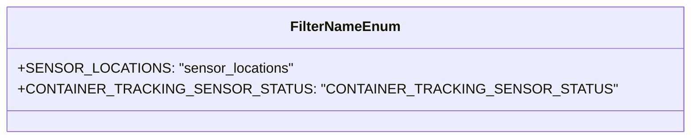

# Diagram: web/portal/src/pages/containertracking/utils/enum.utils.ts

> Auto-generated by Obscura crawlers

## Mermaid

### SVG

<svg id="container" width="698.765625" xmlns="http://www.w3.org/2000/svg" class="classDiagram" height="160" viewBox="0 0 698.765625 160" role="graphics-document document" aria-roledescription="class"><g><defs><marker id="container_class-aggregationStart" class="marker aggregation class" refX="18" refY="7" markerWidth="190" markerHeight="240" orient="auto"><path d="M 18,7 L9,13 L1,7 L9,1 Z"></path></marker></defs><defs><marker id="container_class-aggregationEnd" class="marker aggregation class" refX="1" refY="7" markerWidth="20" markerHeight="28" orient="auto"><path d="M 18,7 L9,13 L1,7 L9,1 Z"></path></marker></defs><defs><marker id="container_class-extensionStart" class="marker extension class" refX="18" refY="7" markerWidth="190" markerHeight="240" orient="auto"><path d="M 1,7 L18,13 V 1 Z"></path></marker></defs><defs><marker id="container_class-extensionEnd" class="marker extension class" refX="1" refY="7" markerWidth="20" markerHeight="28" orient="auto"><path d="M 1,1 V 13 L18,7 Z"></path></marker></defs><defs><marker id="container_class-compositionStart" class="marker composition class" refX="18" refY="7" markerWidth="190" markerHeight="240" orient="auto"><path d="M 18,7 L9,13 L1,7 L9,1 Z"></path></marker></defs><defs><marker id="container_class-compositionEnd" class="marker composition class" refX="1" refY="7" markerWidth="20" markerHeight="28" orient="auto"><path d="M 18,7 L9,13 L1,7 L9,1 Z"></path></marker></defs><defs><marker id="container_class-dependencyStart" class="marker dependency class" refX="6" refY="7" markerWidth="190" markerHeight="240" orient="auto"><path d="M 5,7 L9,13 L1,7 L9,1 Z"></path></marker></defs><defs><marker id="container_class-dependencyEnd" class="marker dependency class" refX="13" refY="7" markerWidth="20" markerHeight="28" orient="auto"><path d="M 18,7 L9,13 L14,7 L9,1 Z"></path></marker></defs><defs><marker id="container_class-lollipopStart" class="marker lollipop class" refX="13" refY="7" markerWidth="190" markerHeight="240" orient="auto"><circle stroke="black" fill="transparent" cx="7" cy="7" r="6"></circle></marker></defs><defs><marker id="container_class-lollipopEnd" class="marker lollipop class" refX="1" refY="7" markerWidth="190" markerHeight="240" orient="auto"><circle stroke="black" fill="transparent" cx="7" cy="7" r="6"></circle></marker></defs><g class="root"><g class="clusters"></g><g class="edgePaths"></g><g class="edgeLabels"></g><g class="nodes"><g class="node default" id="classId-FilterNameEnum-0" transform="translate(349.3828125, 80)"><g class="basic label-container"><path d="M-341.3828125 -72 L341.3828125 -72 L341.3828125 72 L-341.3828125 72" stroke="none" stroke-width="0" fill="#ECECFF" style=""></path><path d="M-341.3828125 -72 C-107.36145596200697 -72, 126.65990057598606 -72, 341.3828125 -72 M-341.3828125 -72 C-83.80821057352631 -72, 173.76639135294738 -72, 341.3828125 -72 M341.3828125 -72 C341.3828125 -16.66261109019191, 341.3828125 38.67477781961618, 341.3828125 72 M341.3828125 -72 C341.3828125 -26.394410699579886, 341.3828125 19.211178600840228, 341.3828125 72 M341.3828125 72 C135.70147340576608 72, -69.97986568846784 72, -341.3828125 72 M341.3828125 72 C117.3265980266213 72, -106.7296164467574 72, -341.3828125 72 M-341.3828125 72 C-341.3828125 16.81761177597116, -341.3828125 -38.36477644805768, -341.3828125 -72 M-341.3828125 72 C-341.3828125 26.079367522041387, -341.3828125 -19.841264955917225, -341.3828125 -72" stroke="#9370DB" stroke-width="1.3" fill="none" stroke-dasharray="0 0" style=""></path></g><g class="annotation-group text" transform="translate(0, -48)"></g><g class="label-group text" transform="translate(-59.8125, -48)"><g class="label" style="font-weight: bolder" transform="translate(0,-12)"><foreignObject width="119.625" height="24">

FilterNameEnum

</foreignObject></g></g><g class="members-group text" transform="translate(-329.3828125, 0)"><g class="label" style="" transform="translate(0,-12)"><foreignObject width="295.21875" height="24">

+SENSOR_LOCATIONS: "sensor_locations"

</foreignObject></g><g class="label" style="" transform="translate(0,12)"><foreignObject width="598.953125" height="24">

+CONTAINER_TRACKING_SENSOR_STATUS: "CONTAINER_TRACKING_SENSOR_STATUS"

</foreignObject></g></g><g class="methods-group text" transform="translate(-329.3828125, 72)"></g><g class="divider" style=""><path d="M-341.3828125 -24 C-79.13402746246993 -24, 183.11475757506014 -24, 341.3828125 -24 M-341.3828125 -24 C-137.37707424659945 -24, 66.6286640068011 -24, 341.3828125 -24" stroke="#9370DB" stroke-width="1.3" fill="none" stroke-dasharray="0 0" style=""></path></g><g class="divider" style=""><path d="M-341.3828125 48 C-122.18437956705881 48, 97.01405336588238 48, 341.3828125 48 M-341.3828125 48 C-140.3845443077592 48, 60.6137238844816 48, 341.3828125 48" stroke="#9370DB" stroke-width="1.3" fill="none" stroke-dasharray="0 0" style=""></path></g></g></g></g></g></svg>
