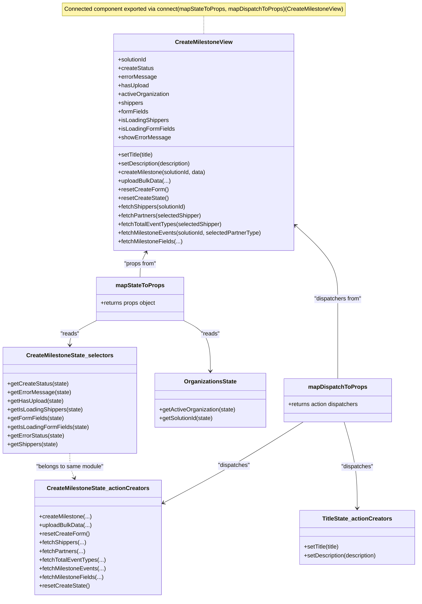

# Diagram: web/portal/src/pages/createmilestone/CreateMilestone.page.container.js

> Auto-generated by Obscura crawlers

## Mermaid

### SVG

<svg id="container" width="1154.86328125" xmlns="http://www.w3.org/2000/svg" class="classDiagram" height="1656" viewBox="0 0 1154.86328125 1656" role="graphics-document document" aria-roledescription="class"><g><defs><marker id="container_class-aggregationStart" class="marker aggregation class" refX="18" refY="7" markerWidth="190" markerHeight="240" orient="auto"><path d="M 18,7 L9,13 L1,7 L9,1 Z"></path></marker></defs><defs><marker id="container_class-aggregationEnd" class="marker aggregation class" refX="1" refY="7" markerWidth="20" markerHeight="28" orient="auto"><path d="M 18,7 L9,13 L1,7 L9,1 Z"></path></marker></defs><defs><marker id="container_class-extensionStart" class="marker extension class" refX="18" refY="7" markerWidth="190" markerHeight="240" orient="auto"><path d="M 1,7 L18,13 V 1 Z"></path></marker></defs><defs><marker id="container_class-extensionEnd" class="marker extension class" refX="1" refY="7" markerWidth="20" markerHeight="28" orient="auto"><path d="M 1,1 V 13 L18,7 Z"></path></marker></defs><defs><marker id="container_class-compositionStart" class="marker composition class" refX="18" refY="7" markerWidth="190" markerHeight="240" orient="auto"><path d="M 18,7 L9,13 L1,7 L9,1 Z"></path></marker></defs><defs><marker id="container_class-compositionEnd" class="marker composition class" refX="1" refY="7" markerWidth="20" markerHeight="28" orient="auto"><path d="M 18,7 L9,13 L1,7 L9,1 Z"></path></marker></defs><defs><marker id="container_class-dependencyStart" class="marker dependency class" refX="6" refY="7" markerWidth="190" markerHeight="240" orient="auto"><path d="M 5,7 L9,13 L1,7 L9,1 Z"></path></marker></defs><defs><marker id="container_class-dependencyEnd" class="marker dependency class" refX="13" refY="7" markerWidth="20" markerHeight="28" orient="auto"><path d="M 18,7 L9,13 L14,7 L9,1 Z"></path></marker></defs><defs><marker id="container_class-lollipopStart" class="marker lollipop class" refX="13" refY="7" markerWidth="190" markerHeight="240" orient="auto"><circle stroke="black" fill="transparent" cx="7" cy="7" r="6"></circle></marker></defs><defs><marker id="container_class-lollipopEnd" class="marker lollipop class" refX="1" refY="7" markerWidth="190" markerHeight="240" orient="auto"><circle stroke="black" fill="transparent" cx="7" cy="7" r="6"></circle></marker></defs><g class="root"><g class="clusters"></g><g class="edgePaths"><path d="M560.215,44L560.215,48.167C560.215,52.333,560.215,60.667,560.215,69C560.215,77.333,560.215,85.667,560.215,89.833L560.215,94" id="edgeNote1" class="edge-thickness-normal edge-pattern-dotted relation" style="fill: none;;;fill: none" data-edge="true" data-et="edge" data-id="edgeNote1" data-points="W3sieCI6NTYwLjIxNDg0Mzc1LCJ5Ijo0NH0seyJ4Ijo1NjAuMjE0ODQzNzUsInkiOjY5fSx7IngiOjU2MC4yMTQ4NDM3NSwieSI6OTR9XQ=="></path><path d="M400.211,699.314L397.443,704.595C394.676,709.876,389.141,720.438,386.373,731.886C383.605,743.333,383.605,755.667,383.605,761.833L383.605,768" id="id_CreateMilestoneView_mapStateToProps_1" class="edge-thickness-normal edge-pattern-solid relation" style=";;;" data-edge="true" data-et="edge" data-id="id_CreateMilestoneView_mapStateToProps_1" data-points="W3sieCI6NDAyLjk5NTgxNTU2MDA4OSwieSI6Njk0fSx7IngiOjM4My42MDU0Njg3NSwieSI6NzMxfSx7IngiOjM4My42MDU0Njg3NSwieSI6NzY4fV0=" marker-start="url(#container_class-dependencyStart)"></path><path d="M816.434,627.633L835.327,644.861C854.22,662.089,892.006,696.544,910.9,729.939C929.793,763.333,929.793,795.667,929.793,828C929.793,860.333,929.793,892.667,929.793,929.5C929.793,966.333,929.793,1007.667,929.793,1028.333L929.793,1049" id="id_CreateMilestoneView_mapDispatchToProps_2" class="edge-thickness-normal edge-pattern-solid relation" style=";;;" data-edge="true" data-et="edge" data-id="id_CreateMilestoneView_mapDispatchToProps_2" data-points="W3sieCI6ODEyLCJ5Ijo2MjMuNTkwNDIxOTMzNzkyOH0seyJ4Ijo5MjkuNzkyOTY4NzUsInkiOjczMX0seyJ4Ijo5MjkuNzkyOTY4NzUsInkiOjgyOH0seyJ4Ijo5MjkuNzkyOTY4NzUsInkiOjkyNX0seyJ4Ijo5MjkuNzkyOTY4NzUsInkiOjEwNDl9XQ==" marker-start="url(#container_class-dependencyStart)"></path><path d="M264.243,888L251.976,894.167C239.708,900.333,215.172,912.667,202.904,924C190.637,935.333,190.637,945.667,190.637,950.833L190.637,956" id="id_mapStateToProps_CreateMilestoneState_selectors_3" class="edge-thickness-normal edge-pattern-solid relation" style=";;;" data-edge="true" data-et="edge" data-id="id_mapStateToProps_CreateMilestoneState_selectors_3" data-points="W3sieCI6MjY0LjI0MzM1NTM0NzkzODIsInkiOjg4OH0seyJ4IjoxOTAuNjM2NzE4NzUsInkiOjkyNX0seyJ4IjoxOTAuNjM2NzE4NzUsInkiOjk2Mn1d" marker-end="url(#container_class-dependencyEnd)"></path><path d="M502.968,888L515.235,894.167C527.503,900.333,552.039,912.667,564.306,936C576.574,959.333,576.574,993.667,576.574,1010.833L576.574,1028" id="id_mapStateToProps_OrganizationsState_4" class="edge-thickness-normal edge-pattern-solid relation" style=";;;" data-edge="true" data-et="edge" data-id="id_mapStateToProps_OrganizationsState_4" data-points="W3sieCI6NTAyLjk2NzU4MjE1MjA2MTgsInkiOjg4OH0seyJ4Ijo1NzYuNTc0MjE4NzUsInkiOjkyNX0seyJ4Ijo1NzYuNTc0MjE4NzUsInkiOjEwMzR9XQ==" marker-end="url(#container_class-dependencyEnd)"></path><path d="M835.519,1169L803.047,1189.667C770.575,1210.333,705.631,1251.667,641.146,1289.311C576.661,1326.955,512.635,1360.91,480.622,1377.888L448.609,1394.866" id="id_mapDispatchToProps_CreateMilestoneState_actionCreators_5" class="edge-thickness-normal edge-pattern-solid relation" style=";;;" data-edge="true" data-et="edge" data-id="id_mapDispatchToProps_CreateMilestoneState_actionCreators_5" data-points="W3sieCI6ODM1LjUxOTQ0NjMzMTUyMTcsInkiOjExNjl9LHsieCI6NjQwLjY4NzUsInkiOjEyOTN9LHsieCI6NDQzLjMwODU5Mzc1LCJ5IjoxMzk3LjY3NjgyNzQ2Mzc0NjZ9XQ==" marker-end="url(#container_class-dependencyEnd)"></path><path d="M947.847,1169L954.066,1189.667C960.285,1210.333,972.723,1251.667,978.941,1291.5C985.16,1331.333,985.16,1369.667,985.16,1388.833L985.16,1408" id="id_mapDispatchToProps_TitleState_actionCreators_6" class="edge-thickness-normal edge-pattern-solid relation" style=";;;" data-edge="true" data-et="edge" data-id="id_mapDispatchToProps_TitleState_actionCreators_6" data-points="W3sieCI6OTQ3Ljg0NzQ4NjQxMzA0MzUsInkiOjExNjl9LHsieCI6OTg1LjE2MDE1NjI1LCJ5IjoxMjkzfSx7IngiOjk4NS4xNjAxNTYyNSwieSI6MTQxNH1d" marker-end="url(#container_class-dependencyEnd)"></path><path d="M190.637,1256L190.637,1262.167C190.637,1268.333,190.637,1280.667,192.789,1292.075C194.941,1303.483,199.245,1313.966,201.397,1319.208L203.549,1324.45" id="id_CreateMilestoneState_selectors_CreateMilestoneState_actionCreators_7" class="edge-thickness-normal edge-pattern-dashed relation" style=";;;" data-edge="true" data-et="edge" data-id="id_CreateMilestoneState_selectors_CreateMilestoneState_actionCreators_7" data-points="W3sieCI6MTkwLjYzNjcxODc1LCJ5IjoxMjU2fSx7IngiOjE5MC42MzY3MTg3NSwieSI6MTI5M30seyJ4IjoyMDUuODI3OTg1NDkxMDcxNDQsInkiOjEzMzB9XQ==" marker-end="url(#container_class-dependencyEnd)"></path></g><g class="edgeLabels"><g class="edgeLabel"><g class="label" data-id="edgeNote1" transform="translate(0, 0)"><foreignObject width="0" height="0">

</foreignObject></g></g><g class="edgeLabel" transform="translate(383.60546875, 731)"><g class="label" data-id="id_CreateMilestoneView_mapStateToProps_1" transform="translate(-46.2421875, -12)"><foreignObject width="92.484375" height="24">

"props from"

</foreignObject></g></g><g class="edgeLabel" transform="translate(929.79296875, 828)"><g class="label" data-id="id_CreateMilestoneView_mapDispatchToProps_2" transform="translate(-67.546875, -12)"><foreignObject width="135.09375" height="24">

"dispatchers from"

</foreignObject></g></g><g class="edgeLabel" transform="translate(190.63671875, 925)"><g class="label" data-id="id_mapStateToProps_CreateMilestoneState_selectors_3" transform="translate(-26.265625, -12)"><foreignObject width="52.53125" height="24">

"reads"

</foreignObject></g></g><g class="edgeLabel" transform="translate(576.57421875, 925)"><g class="label" data-id="id_mapStateToProps_OrganizationsState_4" transform="translate(-26.265625, -12)"><foreignObject width="52.53125" height="24">

"reads"

</foreignObject></g></g><g class="edgeLabel" transform="translate(640.6875, 1293)"><g class="label" data-id="id_mapDispatchToProps_CreateMilestoneState_actionCreators_5" transform="translate(-45.3671875, -12)"><foreignObject width="90.734375" height="24">

"dispatches"

</foreignObject></g></g><g class="edgeLabel" transform="translate(985.16015625, 1293)"><g class="label" data-id="id_mapDispatchToProps_TitleState_actionCreators_6" transform="translate(-45.3671875, -12)"><foreignObject width="90.734375" height="24">

"dispatches"

</foreignObject></g></g><g class="edgeLabel" transform="translate(190.63671875, 1293)"><g class="label" data-id="id_CreateMilestoneState_selectors_CreateMilestoneState_actionCreators_7" transform="translate(-95.578125, -12)"><foreignObject width="191.15625" height="24">

"belongs to same module"

</foreignObject></g></g></g><g class="nodes"><g class="node default" id="classId-CreateMilestoneView-0" transform="translate(560.21484375, 394)"><g class="basic label-container"><path d="M-251.78515625 -300 L251.78515625 -300 L251.78515625 300 L-251.78515625 300" stroke="none" stroke-width="0" fill="#ECECFF" style=""></path><path d="M-251.78515625 -300 C-144.64786226018322 -300, -37.51056827036646 -300, 251.78515625 -300 M-251.78515625 -300 C-86.6262396720538 -300, 78.5326769058924 -300, 251.78515625 -300 M251.78515625 -300 C251.78515625 -162.99541549596856, 251.78515625 -25.990830991937116, 251.78515625 300 M251.78515625 -300 C251.78515625 -179.52086444907167, 251.78515625 -59.04172889814333, 251.78515625 300 M251.78515625 300 C100.33582909722685 300, -51.1134980555463 300, -251.78515625 300 M251.78515625 300 C113.96124509770235 300, -23.86266605459531 300, -251.78515625 300 M-251.78515625 300 C-251.78515625 112.03009572785393, -251.78515625 -75.93980854429213, -251.78515625 -300 M-251.78515625 300 C-251.78515625 167.7484817843497, -251.78515625 35.496963568699414, -251.78515625 -300" stroke="#9370DB" stroke-width="1.3" fill="none" stroke-dasharray="0 0" style=""></path></g><g class="annotation-group text" transform="translate(0, -276)"></g><g class="label-group text" transform="translate(-76.5859375, -276)"><g class="label" style="font-weight: bolder" transform="translate(0,-12)"><foreignObject width="153.171875" height="24">

CreateMilestoneView

</foreignObject></g></g><g class="members-group text" transform="translate(-239.78515625, -228)"><g class="label" style="" transform="translate(0,-12)"><foreignObject width="82.109375" height="24">

+solutionId

</foreignObject></g><g class="label" style="" transform="translate(0,12)"><foreignObject width="98.5" height="24">

+createStatus

</foreignObject></g><g class="label" style="" transform="translate(0,36)"><foreignObject width="105.21875" height="24">

+errorMessage

</foreignObject></g><g class="label" style="" transform="translate(0,60)"><foreignObject width="85.546875" height="24">

+hasUpload

</foreignObject></g><g class="label" style="" transform="translate(0,84)"><foreignObject width="143" height="24">

+activeOrganization

</foreignObject></g><g class="label" style="" transform="translate(0,108)"><foreignObject width="70.484375" height="24">

+shippers

</foreignObject></g><g class="label" style="" transform="translate(0,132)"><foreignObject width="84.359375" height="24">

+formFields

</foreignObject></g><g class="label" style="" transform="translate(0,156)"><foreignObject width="140.953125" height="24">

+isLoadingShippers

</foreignObject></g><g class="label" style="" transform="translate(0,180)"><foreignObject width="155.90625" height="24">

+isLoadingFormFields

</foreignObject></g><g class="label" style="" transform="translate(0,204)"><foreignObject width="142.5625" height="24">

+showErrorMessage

</foreignObject></g></g><g class="methods-group text" transform="translate(-239.78515625, 36)"><g class="label" style="" transform="translate(0,-12)"><foreignObject width="101.28125" height="24">

+setTitle(title)

</foreignObject></g><g class="label" style="" transform="translate(0,12)"><foreignObject width="206.28125" height="24">

+setDescription(description)

</foreignObject></g><g class="label" style="" transform="translate(0,36)"><foreignObject width="248.796875" height="24">

+createMilestone(solutionId, data)

</foreignObject></g><g class="label" style="" transform="translate(0,60)"><foreignObject width="145.890625" height="24">

+uploadBulkData(...)

</foreignObject></g><g class="label" style="" transform="translate(0,84)"><foreignObject width="137.203125" height="24">

+resetCreateForm()

</foreignObject></g><g class="label" style="" transform="translate(0,108)"><foreignObject width="138.03125" height="24">

+resetCreateState()

</foreignObject></g><g class="label" style="" transform="translate(0,132)"><foreignObject width="192.453125" height="24">

+fetchShippers(solutionId)

</foreignObject></g><g class="label" style="" transform="translate(0,156)"><foreignObject width="232.6875" height="24">

+fetchPartners(selectedShipper)

</foreignObject></g><g class="label" style="" transform="translate(0,180)"><foreignObject width="288.859375" height="24">

+fetchTotalEventTypes(selectedShipper)

</foreignObject></g><g class="label" style="" transform="translate(0,204)"><foreignObject width="402.984375" height="24">

+fetchMilestoneEvents(solutionId, selectedPartnerType)

</foreignObject></g><g class="label" style="" transform="translate(0,228)"><foreignObject width="179.03125" height="24">

+fetchMilestoneFields(...)

</foreignObject></g></g><g class="divider" style=""><path d="M-251.78515625 -252 C-136.32147115949397 -252, -20.857786068987934 -252, 251.78515625 -252 M-251.78515625 -252 C-108.82613511965664 -252, 34.13288601068672 -252, 251.78515625 -252" stroke="#9370DB" stroke-width="1.3" fill="none" stroke-dasharray="0 0" style=""></path></g><g class="divider" style=""><path d="M-251.78515625 12 C-139.62376409698027 12, -27.462371943960505 12, 251.78515625 12 M-251.78515625 12 C-68.54706134612417 12, 114.69103355775167 12, 251.78515625 12" stroke="#9370DB" stroke-width="1.3" fill="none" stroke-dasharray="0 0" style=""></path></g></g><g class="node default" id="classId-mapStateToProps-1" transform="translate(383.60546875, 828)"><g class="basic label-container"><path d="M-122.34765625 -60 L122.34765625 -60 L122.34765625 60 L-122.34765625 60" stroke="none" stroke-width="0" fill="#ECECFF" style=""></path><path d="M-122.34765625 -60 C-37.67294287284203 -60, 47.00177050431594 -60, 122.34765625 -60 M-122.34765625 -60 C-31.760563655552943 -60, 58.826528938894114 -60, 122.34765625 -60 M122.34765625 -60 C122.34765625 -28.01401660415355, 122.34765625 3.9719667916929, 122.34765625 60 M122.34765625 -60 C122.34765625 -31.759727750377248, 122.34765625 -3.5194555007544963, 122.34765625 60 M122.34765625 60 C46.00429056746603 60, -30.339075115067942 60, -122.34765625 60 M122.34765625 60 C51.663936945181376 60, -19.019782359637247 60, -122.34765625 60 M-122.34765625 60 C-122.34765625 19.02275375754548, -122.34765625 -21.95449248490904, -122.34765625 -60 M-122.34765625 60 C-122.34765625 12.572294846632225, -122.34765625 -34.85541030673555, -122.34765625 -60" stroke="#9370DB" stroke-width="1.3" fill="none" stroke-dasharray="0 0" style=""></path></g><g class="annotation-group text" transform="translate(0, -36)"></g><g class="label-group text" transform="translate(-64.7109375, -36)"><g class="label" style="font-weight: bolder" transform="translate(0,-12)"><foreignObject width="129.421875" height="24">

mapStateToProps

</foreignObject></g></g><g class="members-group text" transform="translate(-110.34765625, 12)"><g class="label" style="" transform="translate(0,-12)"><foreignObject width="155.984375" height="24">

+returns props object

</foreignObject></g></g><g class="methods-group text" transform="translate(-110.34765625, 60)"></g><g class="divider" style=""><path d="M-122.34765625 -12 C-64.84075168716103 -12, -7.333847124322062 -12, 122.34765625 -12 M-122.34765625 -12 C-35.40600900160908 -12, 51.53563824678184 -12, 122.34765625 -12" stroke="#9370DB" stroke-width="1.3" fill="none" stroke-dasharray="0 0" style=""></path></g><g class="divider" style=""><path d="M-122.34765625 36 C-71.73253046749005 36, -21.117404684980116 36, 122.34765625 36 M-122.34765625 36 C-63.12295625296649 36, -3.898256255932978 36, 122.34765625 36" stroke="#9370DB" stroke-width="1.3" fill="none" stroke-dasharray="0 0" style=""></path></g></g><g class="node default" id="classId-mapDispatchToProps-2" transform="translate(929.79296875, 1109)"><g class="basic label-container"><path d="M-149.91796875 -60 L149.91796875 -60 L149.91796875 60 L-149.91796875 60" stroke="none" stroke-width="0" fill="#ECECFF" style=""></path><path d="M-149.91796875 -60 C-79.61223002221314 -60, -9.30649129442628 -60, 149.91796875 -60 M-149.91796875 -60 C-81.79233231751594 -60, -13.666695885031885 -60, 149.91796875 -60 M149.91796875 -60 C149.91796875 -32.09800009270502, 149.91796875 -4.1960001854100355, 149.91796875 60 M149.91796875 -60 C149.91796875 -28.489651858576682, 149.91796875 3.020696282846636, 149.91796875 60 M149.91796875 60 C31.011276039827735 60, -87.89541667034453 60, -149.91796875 60 M149.91796875 60 C83.72166573230045 60, 17.525362714600902 60, -149.91796875 60 M-149.91796875 60 C-149.91796875 13.59011769678326, -149.91796875 -32.81976460643348, -149.91796875 -60 M-149.91796875 60 C-149.91796875 21.518229967640636, -149.91796875 -16.963540064718728, -149.91796875 -60" stroke="#9370DB" stroke-width="1.3" fill="none" stroke-dasharray="0 0" style=""></path></g><g class="annotation-group text" transform="translate(0, -36)"></g><g class="label-group text" transform="translate(-77.1953125, -36)"><g class="label" style="font-weight: bolder" transform="translate(0,-12)"><foreignObject width="154.390625" height="24">

mapDispatchToProps

</foreignObject></g></g><g class="members-group text" transform="translate(-137.91796875, 12)"><g class="label" style="" transform="translate(0,-12)"><foreignObject width="198.640625" height="24">

+returns action dispatchers

</foreignObject></g></g><g class="methods-group text" transform="translate(-137.91796875, 60)"></g><g class="divider" style=""><path d="M-149.91796875 -12 C-61.08114084557015 -12, 27.755687058859706 -12, 149.91796875 -12 M-149.91796875 -12 C-31.900794821953994 -12, 86.11637910609201 -12, 149.91796875 -12" stroke="#9370DB" stroke-width="1.3" fill="none" stroke-dasharray="0 0" style=""></path></g><g class="divider" style=""><path d="M-149.91796875 36 C-87.76354275565197 36, -25.609116761303937 36, 149.91796875 36 M-149.91796875 36 C-54.32648641338639 36, 41.26499592322722 36, 149.91796875 36" stroke="#9370DB" stroke-width="1.3" fill="none" stroke-dasharray="0 0" style=""></path></g></g><g class="node default" id="classId-CreateMilestoneState_selectors-3" transform="translate(190.63671875, 1109)"><g class="basic label-container"><path d="M-182.63671875 -147 L182.63671875 -147 L182.63671875 147 L-182.63671875 147" stroke="none" stroke-width="0" fill="#ECECFF" style=""></path><path d="M-182.63671875 -147 C-78.1807028488548 -147, 26.275313052290386 -147, 182.63671875 -147 M-182.63671875 -147 C-103.70559306501933 -147, -24.774467380038658 -147, 182.63671875 -147 M182.63671875 -147 C182.63671875 -48.52122112971769, 182.63671875 49.957557740564624, 182.63671875 147 M182.63671875 -147 C182.63671875 -54.428164912781426, 182.63671875 38.14367017443715, 182.63671875 147 M182.63671875 147 C86.51305500323988 147, -9.610608743520231 147, -182.63671875 147 M182.63671875 147 C58.95868732455973 147, -64.71934410088053 147, -182.63671875 147 M-182.63671875 147 C-182.63671875 29.83090220377109, -182.63671875 -87.33819559245782, -182.63671875 -147 M-182.63671875 147 C-182.63671875 63.95198331714802, -182.63671875 -19.09603336570396, -182.63671875 -147" stroke="#9370DB" stroke-width="1.3" fill="none" stroke-dasharray="0 0" style=""></path></g><g class="annotation-group text" transform="translate(0, -123)"></g><g class="label-group text" transform="translate(-116.1328125, -123)"><g class="label" style="font-weight: bolder" transform="translate(0,-12)"><foreignObject width="232.265625" height="24">

CreateMilestoneState_selectors

</foreignObject></g></g><g class="members-group text" transform="translate(-170.63671875, -75)"></g><g class="methods-group text" transform="translate(-170.63671875, -45)"><g class="label" style="" transform="translate(0,-12)"><foreignObject width="168.59375" height="24">

+getCreateStatus(state)

</foreignObject></g><g class="label" style="" transform="translate(0,12)"><foreignObject width="173.921875" height="24">

+getErrorMessage(state)

</foreignObject></g><g class="label" style="" transform="translate(0,36)"><foreignObject width="156.078125" height="24">

+getHasUpload(state)

</foreignObject></g><g class="label" style="" transform="translate(0,60)"><foreignObject width="210.1875" height="24">

+getIsLoadingShippers(state)

</foreignObject></g><g class="label" style="" transform="translate(0,84)"><foreignObject width="155.71875" height="24">

+getFormFields(state)

</foreignObject></g><g class="label" style="" transform="translate(0,108)"><foreignObject width="225.140625" height="24">

+getIsLoadingFormFields(state)

</foreignObject></g><g class="label" style="" transform="translate(0,132)"><foreignObject width="158.453125" height="24">

+getErrorStatus(state)

</foreignObject></g><g class="label" style="" transform="translate(0,156)"><foreignObject width="140.765625" height="24">

+getShippers(state)

</foreignObject></g></g><g class="divider" style=""><path d="M-182.63671875 -99 C-86.49942515510786 -99, 9.637868439784285 -99, 182.63671875 -99 M-182.63671875 -99 C-64.79063050630792 -99, 53.05545773738416 -99, 182.63671875 -99" stroke="#9370DB" stroke-width="1.3" fill="none" stroke-dasharray="0 0" style=""></path></g><g class="divider" style=""><path d="M-182.63671875 -75 C-67.42215761598052 -75, 47.79240351803895 -75, 182.63671875 -75 M-182.63671875 -75 C-36.59585763750465 -75, 109.4450034749907 -75, 182.63671875 -75" stroke="#9370DB" stroke-width="1.3" fill="none" stroke-dasharray="0 0" style=""></path></g></g><g class="node default" id="classId-CreateMilestoneState_actionCreators-4" transform="translate(271.109375, 1489)"><g class="basic label-container"><path d="M-172.19921875 -159 L172.19921875 -159 L172.19921875 159 L-172.19921875 159" stroke="none" stroke-width="0" fill="#ECECFF" style=""></path><path d="M-172.19921875 -159 C-51.95805771748611 -159, 68.28310331502777 -159, 172.19921875 -159 M-172.19921875 -159 C-98.72547716846432 -159, -25.251735586928646 -159, 172.19921875 -159 M172.19921875 -159 C172.19921875 -46.10712290174929, 172.19921875 66.78575419650141, 172.19921875 159 M172.19921875 -159 C172.19921875 -69.35133888936649, 172.19921875 20.297322221267024, 172.19921875 159 M172.19921875 159 C57.65954133693414 159, -56.88013607613172 159, -172.19921875 159 M172.19921875 159 C95.46964494123442 159, 18.74007113246884 159, -172.19921875 159 M-172.19921875 159 C-172.19921875 61.00393405781023, -172.19921875 -36.992131884379546, -172.19921875 -159 M-172.19921875 159 C-172.19921875 67.54396491690724, -172.19921875 -23.912070166185515, -172.19921875 -159" stroke="#9370DB" stroke-width="1.3" fill="none" stroke-dasharray="0 0" style=""></path></g><g class="annotation-group text" transform="translate(0, -135)"></g><g class="label-group text" transform="translate(-136.1484375, -135)"><g class="label" style="font-weight: bolder" transform="translate(0,-12)"><foreignObject width="272.296875" height="24">

CreateMilestoneState_actionCreators

</foreignObject></g></g><g class="members-group text" transform="translate(-160.19921875, -87)"></g><g class="methods-group text" transform="translate(-160.19921875, -57)"><g class="label" style="" transform="translate(0,-12)"><foreignObject width="145.484375" height="24">

+createMilestone(...)

</foreignObject></g><g class="label" style="" transform="translate(0,12)"><foreignObject width="145.890625" height="24">

+uploadBulkData(...)

</foreignObject></g><g class="label" style="" transform="translate(0,36)"><foreignObject width="137.203125" height="24">

+resetCreateForm()

</foreignObject></g><g class="label" style="" transform="translate(0,60)"><foreignObject width="129.859375" height="24">

+fetchShippers(...)

</foreignObject></g><g class="label" style="" transform="translate(0,84)"><foreignObject width="126.703125" height="24">

+fetchPartners(...)

</foreignObject></g><g class="label" style="" transform="translate(0,108)"><foreignObject width="182.875" height="24">

+fetchTotalEventTypes(...)

</foreignObject></g><g class="label" style="" transform="translate(0,132)"><foreignObject width="184.25" height="24">

+fetchMilestoneEvents(...)

</foreignObject></g><g class="label" style="" transform="translate(0,156)"><foreignObject width="179.03125" height="24">

+fetchMilestoneFields(...)

</foreignObject></g><g class="label" style="" transform="translate(0,180)"><foreignObject width="138.03125" height="24">

+resetCreateState()

</foreignObject></g></g><g class="divider" style=""><path d="M-172.19921875 -111 C-73.42214274159234 -111, 25.354933266815323 -111, 172.19921875 -111 M-172.19921875 -111 C-36.12889049785747 -111, 99.94143775428506 -111, 172.19921875 -111" stroke="#9370DB" stroke-width="1.3" fill="none" stroke-dasharray="0 0" style=""></path></g><g class="divider" style=""><path d="M-172.19921875 -87 C-45.991715673137236 -87, 80.21578740372553 -87, 172.19921875 -87 M-172.19921875 -87 C-73.60674321524294 -87, 24.985732319514113 -87, 172.19921875 -87" stroke="#9370DB" stroke-width="1.3" fill="none" stroke-dasharray="0 0" style=""></path></g></g><g class="node default" id="classId-TitleState_actionCreators-5" transform="translate(985.16015625, 1489)"><g class="basic label-container"><path d="M-161.703125 -75 L161.703125 -75 L161.703125 75 L-161.703125 75" stroke="none" stroke-width="0" fill="#ECECFF" style=""></path><path d="M-161.703125 -75 C-48.208008094665345 -75, 65.28710881066931 -75, 161.703125 -75 M-161.703125 -75 C-86.07046258903655 -75, -10.437800178073104 -75, 161.703125 -75 M161.703125 -75 C161.703125 -32.548917757762666, 161.703125 9.902164484474667, 161.703125 75 M161.703125 -75 C161.703125 -17.882045801501434, 161.703125 39.23590839699713, 161.703125 75 M161.703125 75 C79.41755702309851 75, -2.8680109538029797 75, -161.703125 75 M161.703125 75 C38.31272718412838 75, -85.07767063174325 75, -161.703125 75 M-161.703125 75 C-161.703125 36.16000199284936, -161.703125 -2.679996014301281, -161.703125 -75 M-161.703125 75 C-161.703125 32.01986966017751, -161.703125 -10.960260679644975, -161.703125 -75" stroke="#9370DB" stroke-width="1.3" fill="none" stroke-dasharray="0 0" style=""></path></g><g class="annotation-group text" transform="translate(0, -51)"></g><g class="label-group text" transform="translate(-93.125, -51)"><g class="label" style="font-weight: bolder" transform="translate(0,-12)"><foreignObject width="186.25" height="24">

TitleState_actionCreators

</foreignObject></g></g><g class="members-group text" transform="translate(-149.703125, -3)"></g><g class="methods-group text" transform="translate(-149.703125, 27)"><g class="label" style="" transform="translate(0,-12)"><foreignObject width="101.28125" height="24">

+setTitle(title)

</foreignObject></g><g class="label" style="" transform="translate(0,12)"><foreignObject width="206.28125" height="24">

+setDescription(description)

</foreignObject></g></g><g class="divider" style=""><path d="M-161.703125 -27 C-68.5827521434301 -27, 24.537620713139802 -27, 161.703125 -27 M-161.703125 -27 C-79.15907231833764 -27, 3.384980363324729 -27, 161.703125 -27" stroke="#9370DB" stroke-width="1.3" fill="none" stroke-dasharray="0 0" style=""></path></g><g class="divider" style=""><path d="M-161.703125 -3 C-65.88414045823431 -3, 29.934844083531374 -3, 161.703125 -3 M-161.703125 -3 C-73.66761643636274 -3, 14.36789212727453 -3, 161.703125 -3" stroke="#9370DB" stroke-width="1.3" fill="none" stroke-dasharray="0 0" style=""></path></g></g><g class="node default" id="classId-OrganizationsState-6" transform="translate(576.57421875, 1109)"><g class="basic label-container"><path d="M-153.30078125 -75 L153.30078125 -75 L153.30078125 75 L-153.30078125 75" stroke="none" stroke-width="0" fill="#ECECFF" style=""></path><path d="M-153.30078125 -75 C-73.34632917448512 -75, 6.608122901029759 -75, 153.30078125 -75 M-153.30078125 -75 C-33.268558437700136 -75, 86.76366437459973 -75, 153.30078125 -75 M153.30078125 -75 C153.30078125 -33.72773338296347, 153.30078125 7.544533234073057, 153.30078125 75 M153.30078125 -75 C153.30078125 -24.541580910888868, 153.30078125 25.916838178222264, 153.30078125 75 M153.30078125 75 C64.82846125239041 75, -23.643858745219177 75, -153.30078125 75 M153.30078125 75 C58.75053931410777 75, -35.79970262178446 75, -153.30078125 75 M-153.30078125 75 C-153.30078125 31.99900945287304, -153.30078125 -11.001981094253921, -153.30078125 -75 M-153.30078125 75 C-153.30078125 20.142320594989485, -153.30078125 -34.71535881002103, -153.30078125 -75" stroke="#9370DB" stroke-width="1.3" fill="none" stroke-dasharray="0 0" style=""></path></g><g class="annotation-group text" transform="translate(0, -51)"></g><g class="label-group text" transform="translate(-69.8671875, -51)"><g class="label" style="font-weight: bolder" transform="translate(0,-12)"><foreignObject width="139.734375" height="24">

OrganizationsState

</foreignObject></g></g><g class="members-group text" transform="translate(-141.30078125, -3)"></g><g class="methods-group text" transform="translate(-141.30078125, 27)"><g class="label" style="" transform="translate(0,-12)"><foreignObject width="212.734375" height="24">

+getActiveOrganization(state)

</foreignObject></g><g class="label" style="" transform="translate(0,12)"><foreignObject width="152.375" height="24">

+getSolutionId(state)

</foreignObject></g></g><g class="divider" style=""><path d="M-153.30078125 -27 C-89.96530857665508 -27, -26.629835903310152 -27, 153.30078125 -27 M-153.30078125 -27 C-90.11689041073126 -27, -26.93299957146253 -27, 153.30078125 -27" stroke="#9370DB" stroke-width="1.3" fill="none" stroke-dasharray="0 0" style=""></path></g><g class="divider" style=""><path d="M-153.30078125 -3 C-58.79304949469973 -3, 35.71468226060054 -3, 153.30078125 -3 M-153.30078125 -3 C-58.67433398846612 -3, 35.952113273067766 -3, 153.30078125 -3" stroke="#9370DB" stroke-width="1.3" fill="none" stroke-dasharray="0 0" style=""></path></g></g><g class="node undefined" id="note0" transform="translate(560.21484375, 26)"><g class="basic label-container"><path d="M-395.421875 -18 L395.421875 -18 L395.421875 18 L-395.421875 18" stroke="none" stroke-width="0" fill="#fff5ad" style="fill:#fff5ad !important;stroke:#aaaa33 !important"></path><path d="M-395.421875 -18 C-134.96354818045484 -18, 125.49477863909033 -18, 395.421875 -18 M-395.421875 -18 C-210.84849386295102 -18, -26.275112725902034 -18, 395.421875 -18 M395.421875 -18 C395.421875 -9.074916765765732, 395.421875 -0.1498335315314634, 395.421875 18 M395.421875 -18 C395.421875 -5.989673922588652, 395.421875 6.020652154822695, 395.421875 18 M395.421875 18 C221.94576871058925 18, 48.4696624211785 18, -395.421875 18 M395.421875 18 C85.99379838915439 18, -223.43427822169122 18, -395.421875 18 M-395.421875 18 C-395.421875 5.130739060496856, -395.421875 -7.738521879006289, -395.421875 -18 M-395.421875 18 C-395.421875 6.554907737335791, -395.421875 -4.890184525328419, -395.421875 -18" stroke="#aaaa33" stroke-width="1.3" fill="none" stroke-dasharray="0 0" style="fill:#fff5ad !important;stroke:#aaaa33 !important"></path></g><g class="label" style="text-align:left !important;white-space:nowrap !important" transform="translate(-389.421875, -12)"><rect></rect><foreignObject width="778.84375" height="24">

Connected component exported via connect(mapStateToProps, mapDispatchToProps)(CreateMilestoneView)

</foreignObject></g></g></g></g></g></svg>
