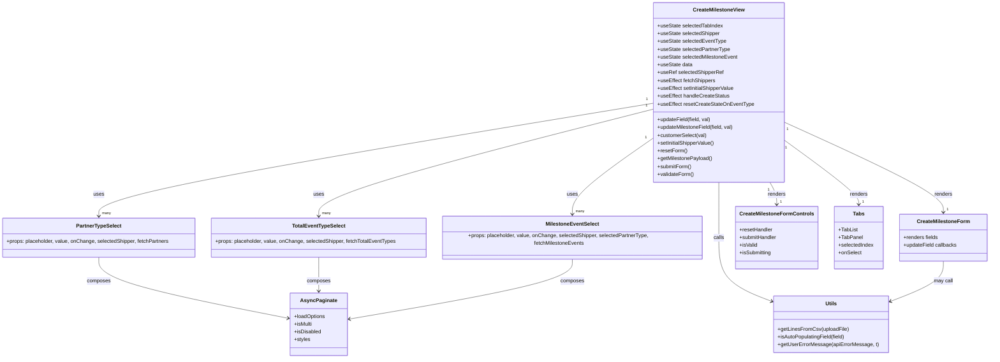

# Diagram: web/portal/src/pages/createmilestone/CreateMilestone.page.js


> Auto-generated by Obscura crawlers

## Diagram 1



### SVG

<svg id="container" width="3046.8359375" xmlns="http://www.w3.org/2000/svg" class="classDiagram" height="1100" viewBox="0 0 3046.8359375 1100" role="graphics-document document" aria-roledescription="class"><style>#container{font-family:"trebuchet ms",verdana,arial,sans-serif;font-size:16px;fill:#333;}@keyframes edge-animation-frame{from{stroke-dashoffset:0;}}@keyframes dash{to{stroke-dashoffset:0;}}#container .edge-animation-slow{stroke-dasharray:9,5!important;stroke-dashoffset:900;animation:dash 50s linear infinite;stroke-linecap:round;}#container .edge-animation-fast{stroke-dasharray:9,5!important;stroke-dashoffset:900;animation:dash 20s linear infinite;stroke-linecap:round;}#container .error-icon{fill:#552222;}#container .error-text{fill:#552222;stroke:#552222;}#container .edge-thickness-normal{stroke-width:1px;}#container .edge-thickness-thick{stroke-width:3.5px;}#container .edge-pattern-solid{stroke-dasharray:0;}#container .edge-thickness-invisible{stroke-width:0;fill:none;}#container .edge-pattern-dashed{stroke-dasharray:3;}#container .edge-pattern-dotted{stroke-dasharray:2;}#container .marker{fill:#333333;stroke:#333333;}#container .marker.cross{stroke:#333333;}#container svg{font-family:"trebuchet ms",verdana,arial,sans-serif;font-size:16px;}#container p{margin:0;}#container g.classGroup text{fill:#9370DB;stroke:none;font-family:"trebuchet ms",verdana,arial,sans-serif;font-size:10px;}#container g.classGroup text .title{font-weight:bolder;}#container .nodeLabel,#container .edgeLabel{color:#131300;}#container .edgeLabel .label rect{fill:#ECECFF;}#container .label text{fill:#131300;}#container .labelBkg{background:#ECECFF;}#container .edgeLabel .label span{background:#ECECFF;}#container .classTitle{font-weight:bolder;}#container .node rect,#container .node circle,#container .node ellipse,#container .node polygon,#container .node path{fill:#ECECFF;stroke:#9370DB;stroke-width:1px;}#container .divider{stroke:#9370DB;stroke-width:1;}#container g.clickable{cursor:pointer;}#container g.classGroup rect{fill:#ECECFF;stroke:#9370DB;}#container g.classGroup line{stroke:#9370DB;stroke-width:1;}#container .classLabel .box{stroke:none;stroke-width:0;fill:#ECECFF;opacity:0.5;}#container .classLabel .label{fill:#9370DB;font-size:10px;}#container .relation{stroke:#333333;stroke-width:1;fill:none;}#container .dashed-line{stroke-dasharray:3;}#container .dotted-line{stroke-dasharray:1 2;}#container #compositionStart,#container .composition{fill:#333333!important;stroke:#333333!important;stroke-width:1;}#container #compositionEnd,#container .composition{fill:#333333!important;stroke:#333333!important;stroke-width:1;}#container #dependencyStart,#container .dependency{fill:#333333!important;stroke:#333333!important;stroke-width:1;}#container #dependencyStart,#container .dependency{fill:#333333!important;stroke:#333333!important;stroke-width:1;}#container #extensionStart,#container .extension{fill:transparent!important;stroke:#333333!important;stroke-width:1;}#container #extensionEnd,#container .extension{fill:transparent!important;stroke:#333333!important;stroke-width:1;}#container #aggregationStart,#container .aggregation{fill:transparent!important;stroke:#333333!important;stroke-width:1;}#container #aggregationEnd,#container .aggregation{fill:transparent!important;stroke:#333333!important;stroke-width:1;}#container #lollipopStart,#container .lollipop{fill:#ECECFF!important;stroke:#333333!important;stroke-width:1;}#container #lollipopEnd,#container .lollipop{fill:#ECECFF!important;stroke:#333333!important;stroke-width:1;}#container .edgeTerminals{font-size:11px;line-height:initial;}#container .classTitleText{text-anchor:middle;font-size:18px;fill:#333;}#container .label-icon{display:inline-block;height:1em;overflow:visible;vertical-align:-0.125em;}#container .node .label-icon path{fill:currentColor;stroke:revert;stroke-width:revert;}#container :root{--mermaid-font-family:"trebuchet ms",verdana,arial,sans-serif;}</style><g><defs><marker id="container_class-aggregationStart" class="marker aggregation class" refX="18" refY="7" markerWidth="190" markerHeight="240" orient="auto"><path d="M 18,7 L9,13 L1,7 L9,1 Z"></path></marker></defs><defs><marker id="container_class-aggregationEnd" class="marker aggregation class" refX="1" refY="7" markerWidth="20" markerHeight="28" orient="auto"><path d="M 18,7 L9,13 L1,7 L9,1 Z"></path></marker></defs><defs><marker id="container_class-extensionStart" class="marker extension class" refX="18" refY="7" markerWidth="190" markerHeight="240" orient="auto"><path d="M 1,7 L18,13 V 1 Z"></path></marker></defs><defs><marker id="container_class-extensionEnd" class="marker extension class" refX="1" refY="7" markerWidth="20" markerHeight="28" orient="auto"><path d="M 1,1 V 13 L18,7 Z"></path></marker></defs><defs><marker id="container_class-compositionStart" class="marker composition class" refX="18" refY="7" markerWidth="190" markerHeight="240" orient="auto"><path d="M 18,7 L9,13 L1,7 L9,1 Z"></path></marker></defs><defs><marker id="container_class-compositionEnd" class="marker composition class" refX="1" refY="7" markerWidth="20" markerHeight="28" orient="auto"><path d="M 18,7 L9,13 L1,7 L9,1 Z"></path></marker></defs><defs><marker id="container_class-dependencyStart" class="marker dependency class" refX="6" refY="7" markerWidth="190" markerHeight="240" orient="auto"><path d="M 5,7 L9,13 L1,7 L9,1 Z"></path></marker></defs><defs><marker id="container_class-dependencyEnd" class="marker dependency class" refX="13" refY="7" markerWidth="20" markerHeight="28" orient="auto"><path d="M 18,7 L9,13 L14,7 L9,1 Z"></path></marker></defs><defs><marker id="container_class-lollipopStart" class="marker lollipop class" refX="13" refY="7" markerWidth="190" markerHeight="240" orient="auto"><circle stroke="black" fill="transparent" cx="7" cy="7" r="6"></circle></marker></defs><defs><marker id="container_class-lollipopEnd" class="marker lollipop class" refX="1" refY="7" markerWidth="190" markerHeight="240" orient="auto"><circle stroke="black" fill="transparent" cx="7" cy="7" r="6"></circle></marker></defs><g class="root"><g class="clusters"></g><g class="edgePaths"><path d="M2025.738,316.05L1738.632,362.875C1451.525,409.7,877.311,503.35,590.204,561.342C303.098,619.333,303.098,641.667,303.098,652.833L303.098,664" id="id_CreateMilestoneView_PartnerTypeSelect_1" class="edge-thickness-normal edge-pattern-solid relation" style=";;;" data-edge="true" data-et="edge" data-id="id_CreateMilestoneView_PartnerTypeSelect_1" data-points="W3sieCI6MjAyNS43MzgyODEyNSwieSI6MzE2LjA0OTY1MzY3NjA0MTF9LHsieCI6MzAzLjA5NzY1NjI1LCJ5Ijo1OTd9LHsieCI6MzAzLjA5NzY1NjI1LCJ5Ijo2NzB9XQ==" marker-end="url(#container_class-dependencyEnd)"></path><path d="M2025.738,333.392L1850.939,377.327C1676.141,421.261,1326.543,509.131,1151.744,564.232C976.945,619.333,976.945,641.667,976.945,652.833L976.945,664" id="id_CreateMilestoneView_TotalEventTypeSelect_2" class="edge-thickness-normal edge-pattern-solid relation" style=";;;" data-edge="true" data-et="edge" data-id="id_CreateMilestoneView_TotalEventTypeSelect_2" data-points="W3sieCI6MjAyNS43MzgyODEyNSwieSI6MzMzLjM5MjA2MzMxMjgxODh9LHsieCI6OTc2Ljk0NTMxMjUsInkiOjU5N30seyJ4Ijo5NzYuOTQ1MzEyNSwieSI6NjcwfV0=" marker-end="url(#container_class-dependencyEnd)"></path><path d="M2025.738,418.005L1981.99,447.837C1938.242,477.67,1850.746,537.335,1806.998,578.334C1763.25,619.333,1763.25,641.667,1763.25,652.833L1763.25,664" id="id_CreateMilestoneView_MilestoneEventSelect_3" class="edge-thickness-normal edge-pattern-solid relation" style=";;;" data-edge="true" data-et="edge" data-id="id_CreateMilestoneView_MilestoneEventSelect_3" data-points="W3sieCI6MjAyNS43MzgyODEyNSwieSI6NDE4LjAwNDcyMzI0MzQ2NH0seyJ4IjoxNzYzLjI1LCJ5Ijo1OTd9LHsieCI6MTc2My4yNSwieSI6NjcwfV0=" marker-end="url(#container_class-dependencyEnd)"></path><path d="M2418.762,374.017L2499.892,411.181C2581.022,448.345,2743.283,522.672,2824.413,569.003C2905.543,615.333,2905.543,633.667,2905.543,642.833L2905.543,652" id="id_CreateMilestoneView_CreateMilestoneForm_4" class="edge-thickness-normal edge-pattern-solid relation" style=";;;" data-edge="true" data-et="edge" data-id="id_CreateMilestoneView_CreateMilestoneForm_4" data-points="W3sieCI6MjQxOC43NjE3MTg3NSwieSI6Mzc0LjAxNzI3MDQ1NjE0MzZ9LHsieCI6MjkwNS41NDI5Njg3NSwieSI6NTk3fSx7IngiOjI5MDUuNTQyOTY4NzUsInkiOjY1OH1d" marker-end="url(#container_class-dependencyEnd)"></path><path d="M2377.231,560L2380.694,566.167C2384.157,572.333,2391.082,584.667,2394.545,596C2398.008,607.333,2398.008,617.667,2398.008,622.833L2398.008,628" id="id_CreateMilestoneView_CreateMilestoneFormControls_5" class="edge-thickness-normal edge-pattern-solid relation" style=";;;" data-edge="true" data-et="edge" data-id="id_CreateMilestoneView_CreateMilestoneFormControls_5" data-points="W3sieCI6MjM3Ny4yMzEzMjk4NzIyMDQ3LCJ5Ijo1NjB9LHsieCI6MjM5OC4wMDc4MTI1LCJ5Ijo1OTd9LHsieCI6MjM5OC4wMDc4MTI1LCJ5Ijo2MzR9XQ==" marker-end="url(#container_class-dependencyEnd)"></path><path d="M2418.762,428.713L2456.849,456.761C2494.936,484.809,2571.111,540.904,2609.198,574.119C2647.285,607.333,2647.285,617.667,2647.285,622.833L2647.285,628" id="id_CreateMilestoneView_Tabs_6" class="edge-thickness-normal edge-pattern-solid relation" style=";;;" data-edge="true" data-et="edge" data-id="id_CreateMilestoneView_Tabs_6" data-points="W3sieCI6MjQxOC43NjE3MTg3NSwieSI6NDI4LjcxMzEzMDM0NzY3MzR9LHsieCI6MjY0Ny4yODUxNTYyNSwieSI6NTk3fSx7IngiOjI2NDcuMjg1MTU2MjUsInkiOjYzNH1d" marker-end="url(#container_class-dependencyEnd)"></path><path d="M303.098,790L303.098,802.167C303.098,814.333,303.098,838.667,399.937,869.947C496.776,901.227,690.455,939.454,787.294,958.568L884.133,977.681" id="id_PartnerTypeSelect_AsyncPaginate_7" class="edge-thickness-normal edge-pattern-solid relation" style=";;;" data-edge="true" data-et="edge" data-id="id_PartnerTypeSelect_AsyncPaginate_7" data-points="W3sieCI6MzAzLjA5NzY1NjI1LCJ5Ijo3OTB9LHsieCI6MzAzLjA5NzY1NjI1LCJ5Ijo4NjN9LHsieCI6ODkwLjAxOTUzMTI1LCJ5Ijo5NzguODQzMTExNzkzODYxfV0=" marker-end="url(#container_class-dependencyEnd)"></path><path d="M976.945,790L976.945,802.167C976.945,814.333,976.945,838.667,976.945,856C976.945,873.333,976.945,883.667,976.945,888.833L976.945,894" id="id_TotalEventTypeSelect_AsyncPaginate_8" class="edge-thickness-normal edge-pattern-solid relation" style=";;;" data-edge="true" data-et="edge" data-id="id_TotalEventTypeSelect_AsyncPaginate_8" data-points="W3sieCI6OTc2Ljk0NTMxMjUsInkiOjc5MH0seyJ4Ijo5NzYuOTQ1MzEyNSwieSI6ODYzfSx7IngiOjk3Ni45NDUzMTI1LCJ5Ijo5MDB9XQ==" marker-end="url(#container_class-dependencyEnd)"></path><path d="M1763.25,790L1763.25,802.167C1763.25,814.333,1763.25,838.667,1647.673,870.383C1532.096,902.099,1300.941,941.197,1185.364,960.747L1069.787,980.296" id="id_MilestoneEventSelect_AsyncPaginate_9" class="edge-thickness-normal edge-pattern-solid relation" style=";;;" data-edge="true" data-et="edge" data-id="id_MilestoneEventSelect_AsyncPaginate_9" data-points="W3sieCI6MTc2My4yNSwieSI6NzkwfSx7IngiOjE3NjMuMjUsInkiOjg2M30seyJ4IjoxMDYzLjg3MTA5Mzc1LCJ5Ijo5ODEuMjk2ODg0MTU5NDg4MX1d" marker-end="url(#container_class-dependencyEnd)"></path><path d="M2222.25,560L2222.25,566.167C2222.25,572.333,2222.25,584.667,2222.25,613C2222.25,641.333,2222.25,685.667,2222.25,730C2222.25,774.333,2222.25,818.667,2249.522,851.45C2276.794,884.234,2331.339,905.467,2358.611,916.084L2385.883,926.701" id="id_CreateMilestoneView_Utils_10" class="edge-thickness-normal edge-pattern-solid relation" style=";;;" data-edge="true" data-et="edge" data-id="id_CreateMilestoneView_Utils_10" data-points="W3sieCI6MjIyMi4yNSwieSI6NTYwfSx7IngiOjIyMjIuMjUsInkiOjU5N30seyJ4IjoyMjIyLjI1LCJ5Ijo3MzB9LHsieCI6MjIyMi4yNSwieSI6ODYzfSx7IngiOjIzOTEuNDc0NjA5Mzc1LCJ5Ijo5MjguODc3NjY2MTczMTE2Mn1d" marker-end="url(#container_class-dependencyEnd)"></path><path d="M2905.543,802L2905.543,812.167C2905.543,822.333,2905.543,842.667,2878.271,863.45C2850.999,884.234,2796.454,905.467,2769.182,916.084L2741.91,926.701" id="id_CreateMilestoneForm_Utils_11" class="edge-thickness-normal edge-pattern-solid relation" style=";;;" data-edge="true" data-et="edge" data-id="id_CreateMilestoneForm_Utils_11" data-points="W3sieCI6MjkwNS41NDI5Njg3NSwieSI6ODAyfSx7IngiOjI5MDUuNTQyOTY4NzUsInkiOjg2M30seyJ4IjoyNzM2LjMxODM1OTM3NSwieSI6OTI4Ljg3NzY2NjE3MzExNjJ9XQ==" marker-end="url(#container_class-dependencyEnd)"></path></g><g class="edgeLabels"><g class="edgeLabel" transform="translate(303.09765625, 597)"><g class="label" data-id="id_CreateMilestoneView_PartnerTypeSelect_1" transform="translate(-16.4921875, -12)"><foreignObject width="32.984375" height="24"><div xmlns="http://www.w3.org/1999/xhtml" class="labelBkg" style="display: table-cell; white-space: nowrap; line-height: 1.5; max-width: 200px; text-align: center;"><span class="edgeLabel"><p>uses</p></span></div></foreignObject></g></g><g class="edgeLabel" transform="translate(976.9453125, 597)"><g class="label" data-id="id_CreateMilestoneView_TotalEventTypeSelect_2" transform="translate(-16.4921875, -12)"><foreignObject width="32.984375" height="24"><div xmlns="http://www.w3.org/1999/xhtml" class="labelBkg" style="display: table-cell; white-space: nowrap; line-height: 1.5; max-width: 200px; text-align: center;"><span class="edgeLabel"><p>uses</p></span></div></foreignObject></g></g><g class="edgeLabel" transform="translate(1763.25, 597)"><g class="label" data-id="id_CreateMilestoneView_MilestoneEventSelect_3" transform="translate(-16.4921875, -12)"><foreignObject width="32.984375" height="24"><div xmlns="http://www.w3.org/1999/xhtml" class="labelBkg" style="display: table-cell; white-space: nowrap; line-height: 1.5; max-width: 200px; text-align: center;"><span class="edgeLabel"><p>uses</p></span></div></foreignObject></g></g><g class="edgeLabel" transform="translate(2905.54296875, 597)"><g class="label" data-id="id_CreateMilestoneView_CreateMilestoneForm_4" transform="translate(-27.75, -12)"><foreignObject width="55.5" height="24"><div xmlns="http://www.w3.org/1999/xhtml" class="labelBkg" style="display: table-cell; white-space: nowrap; line-height: 1.5; max-width: 200px; text-align: center;"><span class="edgeLabel"><p>renders</p></span></div></foreignObject></g></g><g class="edgeLabel" transform="translate(2398.0078125, 597)"><g class="label" data-id="id_CreateMilestoneView_CreateMilestoneFormControls_5" transform="translate(-27.75, -12)"><foreignObject width="55.5" height="24"><div xmlns="http://www.w3.org/1999/xhtml" class="labelBkg" style="display: table-cell; white-space: nowrap; line-height: 1.5; max-width: 200px; text-align: center;"><span class="edgeLabel"><p>renders</p></span></div></foreignObject></g></g><g class="edgeLabel" transform="translate(2647.28515625, 597)"><g class="label" data-id="id_CreateMilestoneView_Tabs_6" transform="translate(-27.75, -12)"><foreignObject width="55.5" height="24"><div xmlns="http://www.w3.org/1999/xhtml" class="labelBkg" style="display: table-cell; white-space: nowrap; line-height: 1.5; max-width: 200px; text-align: center;"><span class="edgeLabel"><p>renders</p></span></div></foreignObject></g></g><g class="edgeLabel" transform="translate(303.09765625, 863)"><g class="label" data-id="id_PartnerTypeSelect_AsyncPaginate_7" transform="translate(-36.453125, -12)"><foreignObject width="72.90625" height="24"><div xmlns="http://www.w3.org/1999/xhtml" class="labelBkg" style="display: table-cell; white-space: nowrap; line-height: 1.5; max-width: 200px; text-align: center;"><span class="edgeLabel"><p>composes</p></span></div></foreignObject></g></g><g class="edgeLabel" transform="translate(976.9453125, 863)"><g class="label" data-id="id_TotalEventTypeSelect_AsyncPaginate_8" transform="translate(-36.453125, -12)"><foreignObject width="72.90625" height="24"><div xmlns="http://www.w3.org/1999/xhtml" class="labelBkg" style="display: table-cell; white-space: nowrap; line-height: 1.5; max-width: 200px; text-align: center;"><span class="edgeLabel"><p>composes</p></span></div></foreignObject></g></g><g class="edgeLabel" transform="translate(1763.25, 863)"><g class="label" data-id="id_MilestoneEventSelect_AsyncPaginate_9" transform="translate(-36.453125, -12)"><foreignObject width="72.90625" height="24"><div xmlns="http://www.w3.org/1999/xhtml" class="labelBkg" style="display: table-cell; white-space: nowrap; line-height: 1.5; max-width: 200px; text-align: center;"><span class="edgeLabel"><p>composes</p></span></div></foreignObject></g></g><g class="edgeLabel" transform="translate(2222.25, 730)"><g class="label" data-id="id_CreateMilestoneView_Utils_10" transform="translate(-16.4453125, -12)"><foreignObject width="32.890625" height="24"><div xmlns="http://www.w3.org/1999/xhtml" class="labelBkg" style="display: table-cell; white-space: nowrap; line-height: 1.5; max-width: 200px; text-align: center;"><span class="edgeLabel"><p>calls</p></span></div></foreignObject></g></g><g class="edgeLabel" transform="translate(2905.54296875, 863)"><g class="label" data-id="id_CreateMilestoneForm_Utils_11" transform="translate(-29.8515625, -12)"><foreignObject width="59.703125" height="24"><div xmlns="http://www.w3.org/1999/xhtml" class="labelBkg" style="display: table-cell; white-space: nowrap; line-height: 1.5; max-width: 200px; text-align: center;"><span class="edgeLabel"><p>may call</p></span></div></foreignObject></g></g><g class="edgeTerminals" transform="translate(2006.0519881844564, 304.06216295611523)"><g class="inner" transform="translate(0, 0)"><foreignObject style="width: 9px; height: 12px;"><div xmlns="http://www.w3.org/1999/xhtml" style="display: inline-block; padding-right: 1px; white-space: nowrap;"><span class="edgeLabel">1</span></div></foreignObject></g></g><g class="edgeTerminals" transform="translate(2005.1097372566617, 323.1103762646838)"><g class="inner" transform="translate(0, 0)"><foreignObject style="width: 9px; height: 12px;"><div xmlns="http://www.w3.org/1999/xhtml" style="display: inline-block; padding-right: 1px; white-space: nowrap;"><span class="edgeLabel">1</span></div></foreignObject></g></g><g class="edgeTerminals" transform="translate(2002.8290790136077, 415.4712587315433)"><g class="inner" transform="translate(0, 0)"><foreignObject style="width: 9px; height: 12px;"><div xmlns="http://www.w3.org/1999/xhtml" style="display: inline-block; padding-right: 1px; white-space: nowrap;"><span class="edgeLabel">1</span></div></foreignObject></g></g><g class="edgeTerminals" transform="translate(2428.4249870974127, 394.94264291324316)"><g class="inner" transform="translate(0, 0)"><foreignObject style="width: 9px; height: 12px;"><div xmlns="http://www.w3.org/1999/xhtml" style="display: inline-block; padding-right: 1px; white-space: nowrap;"><span class="edgeLabel">1</span></div></foreignObject></g></g><g class="edgeTerminals" transform="translate(2372.72054484884, 582.6031593894842)"><g class="inner" transform="translate(0, 0)"><foreignObject style="width: 9px; height: 12px;"><div xmlns="http://www.w3.org/1999/xhtml" style="display: inline-block; padding-right: 1px; white-space: nowrap;"><span class="edgeLabel">1</span></div></foreignObject></g></g><g class="edgeTerminals" transform="translate(2423.958503104375, 451.1684956974063)"><g class="inner" transform="translate(0, 0)"><foreignObject style="width: 9px; height: 12px;"><div xmlns="http://www.w3.org/1999/xhtml" style="display: inline-block; padding-right: 1px; white-space: nowrap;"><span class="edgeLabel">1</span></div></foreignObject></g></g><g class="edgeTerminals" transform="translate(313.0976581249999, 647.5000016071428)"><g class="inner" transform="translate(0, 0)"></g><foreignObject style="width: 36px; height: 12px;"><div xmlns="http://www.w3.org/1999/xhtml" style="display: inline-block; padding-right: 1px; white-space: nowrap;"><span class="edgeLabel">many</span></div></foreignObject></g><g class="edgeTerminals" transform="translate(986.94531125, 647.4999989285714)"><g class="inner" transform="translate(0, 0)"></g><foreignObject style="width: 36px; height: 12px;"><div xmlns="http://www.w3.org/1999/xhtml" style="display: inline-block; padding-right: 1px; white-space: nowrap;"><span class="edgeLabel">many</span></div></foreignObject></g><g class="edgeTerminals" transform="translate(1773.25, 647.5)"><g class="inner" transform="translate(0, 0)"></g><foreignObject style="width: 36px; height: 12px;"><div xmlns="http://www.w3.org/1999/xhtml" style="display: inline-block; padding-right: 1px; white-space: nowrap;"><span class="edgeLabel">many</span></div></foreignObject></g><g class="edgeTerminals" transform="translate(2915.542969375, 635.5000005357143)"><g class="inner" transform="translate(0, 0)"></g><foreignObject style="width: 9px; height: 12px;"><div xmlns="http://www.w3.org/1999/xhtml" style="display: inline-block; padding-right: 1px; white-space: nowrap;"><span class="edgeLabel">1</span></div></foreignObject></g><g class="edgeTerminals" transform="translate(2408.00781125, 611.4999989285715)"><g class="inner" transform="translate(0, 0)"></g><foreignObject style="width: 9px; height: 12px;"><div xmlns="http://www.w3.org/1999/xhtml" style="display: inline-block; padding-right: 1px; white-space: nowrap;"><span class="edgeLabel">1</span></div></foreignObject></g><g class="edgeTerminals" transform="translate(2657.2851581249997, 611.5000016071428)"><g class="inner" transform="translate(0, 0)"></g><foreignObject style="width: 9px; height: 12px;"><div xmlns="http://www.w3.org/1999/xhtml" style="display: inline-block; padding-right: 1px; white-space: nowrap;"><span class="edgeLabel">1</span></div></foreignObject></g></g><g class="nodes"><g class="node default" id="classId-CreateMilestoneView-0" transform="translate(2222.25, 284)"><g class="basic label-container"><path d="M-196.51171875 -276 L196.51171875 -276 L196.51171875 276 L-196.51171875 276" stroke="none" stroke-width="0" fill="#ECECFF" style=""></path><path d="M-196.51171875 -276 C-94.51771407350114 -276, 7.476290602997722 -276, 196.51171875 -276 M-196.51171875 -276 C-74.20250003669001 -276, 48.10671867661998 -276, 196.51171875 -276 M196.51171875 -276 C196.51171875 -82.93463127507309, 196.51171875 110.13073744985383, 196.51171875 276 M196.51171875 -276 C196.51171875 -133.26702213245943, 196.51171875 9.465955735081138, 196.51171875 276 M196.51171875 276 C93.18678555383262 276, -10.138147642334758 276, -196.51171875 276 M196.51171875 276 C39.39638130572516 276, -117.71895613854969 276, -196.51171875 276 M-196.51171875 276 C-196.51171875 143.85901883144254, -196.51171875 11.71803766288508, -196.51171875 -276 M-196.51171875 276 C-196.51171875 60.31560730980033, -196.51171875 -155.36878538039934, -196.51171875 -276" stroke="#9370DB" stroke-width="1.3" fill="none" stroke-dasharray="0 0" style=""></path></g><g class="annotation-group text" transform="translate(0, -252)"></g><g class="label-group text" transform="translate(-76.5859375, -252)"><g class="label" style="font-weight: bolder" transform="translate(0,-12)"><foreignObject width="153.171875" height="24"><div xmlns="http://www.w3.org/1999/xhtml" style="display: table-cell; white-space: nowrap; line-height: 1.5; max-width: 201px; text-align: center;"><span class="nodeLabel markdown-node-label" style=""><p>CreateMilestoneView</p></span></div></foreignObject></g></g><g class="members-group text" transform="translate(-184.51171875, -204)"><g class="label" style="" transform="translate(0,-12)"><foreignObject width="201.75" height="24"><div xmlns="http://www.w3.org/1999/xhtml" style="display: table-cell; white-space: nowrap; line-height: 1.5; max-width: 259px; text-align: center;"><span class="nodeLabel markdown-node-label" style=""><p>+useState selectedTabIndex</p></span></div></foreignObject></g><g class="label" style="" transform="translate(0,12)"><foreignObject width="192.578125" height="24"><div xmlns="http://www.w3.org/1999/xhtml" style="display: table-cell; white-space: nowrap; line-height: 1.5; max-width: 251px; text-align: center;"><span class="nodeLabel markdown-node-label" style=""><p>+useState selectedShipper</p></span></div></foreignObject></g><g class="label" style="" transform="translate(0,36)"><foreignObject width="209.71875" height="24"><div xmlns="http://www.w3.org/1999/xhtml" style="display: table-cell; white-space: nowrap; line-height: 1.5; max-width: 267px; text-align: center;"><span class="nodeLabel markdown-node-label" style=""><p>+useState selectedEventType</p></span></div></foreignObject></g><g class="label" style="" transform="translate(0,60)"><foreignObject width="223.140625" height="24"><div xmlns="http://www.w3.org/1999/xhtml" style="display: table-cell; white-space: nowrap; line-height: 1.5; max-width: 281px; text-align: center;"><span class="nodeLabel markdown-node-label" style=""><p>+useState selectedPartnerType</p></span></div></foreignObject></g><g class="label" style="" transform="translate(0,84)"><foreignObject width="246.734375" height="24"><div xmlns="http://www.w3.org/1999/xhtml" style="display: table-cell; white-space: nowrap; line-height: 1.5; max-width: 304px; text-align: center;"><span class="nodeLabel markdown-node-label" style=""><p>+useState selectedMilestoneEvent</p></span></div></foreignObject></g><g class="label" style="" transform="translate(0,108)"><foreignObject width="107.71875" height="24"><div xmlns="http://www.w3.org/1999/xhtml" style="display: table-cell; white-space: nowrap; line-height: 1.5; max-width: 165px; text-align: center;"><span class="nodeLabel markdown-node-label" style=""><p>+useState data</p></span></div></foreignObject></g><g class="label" style="" transform="translate(0,132)"><foreignObject width="202.28125" height="24"><div xmlns="http://www.w3.org/1999/xhtml" style="display: table-cell; white-space: nowrap; line-height: 1.5; max-width: 261px; text-align: center;"><span class="nodeLabel markdown-node-label" style=""><p>+useRef selectedShipperRef</p></span></div></foreignObject></g><g class="label" style="" transform="translate(0,156)"><foreignObject width="178.90625" height="24"><div xmlns="http://www.w3.org/1999/xhtml" style="display: table-cell; white-space: nowrap; line-height: 1.5; max-width: 236px; text-align: center;"><span class="nodeLabel markdown-node-label" style=""><p>+useEffect fetchShippers</p></span></div></foreignObject></g><g class="label" style="" transform="translate(0,180)"><foreignObject width="238.8125" height="24"><div xmlns="http://www.w3.org/1999/xhtml" style="display: table-cell; white-space: nowrap; line-height: 1.5; max-width: 296px; text-align: center;"><span class="nodeLabel markdown-node-label" style=""><p>+useEffect setInitialShipperValue</p></span></div></foreignObject></g><g class="label" style="" transform="translate(0,204)"><foreignObject width="220.609375" height="24"><div xmlns="http://www.w3.org/1999/xhtml" style="display: table-cell; white-space: nowrap; line-height: 1.5; max-width: 278px; text-align: center;"><span class="nodeLabel markdown-node-label" style=""><p>+useEffect handleCreateStatus</p></span></div></foreignObject></g><g class="label" style="" transform="translate(0,228)"><foreignObject width="292.4375" height="24"><div xmlns="http://www.w3.org/1999/xhtml" style="display: table-cell; white-space: nowrap; line-height: 1.5; max-width: 350px; text-align: center;"><span class="nodeLabel markdown-node-label" style=""><p>+useEffect resetCreateStateOnEventType</p></span></div></foreignObject></g></g><g class="methods-group text" transform="translate(-184.51171875, 84)"><g class="label" style="" transform="translate(0,-12)"><foreignObject width="165.4375" height="24"><div xmlns="http://www.w3.org/1999/xhtml" style="display: table-cell; white-space: nowrap; line-height: 1.5; max-width: 223px; text-align: center;"><span class="nodeLabel markdown-node-label" style=""><p>+updateField(field, val)</p></span></div></foreignObject></g><g class="label" style="" transform="translate(0,12)"><foreignObject width="236.171875" height="24"><div xmlns="http://www.w3.org/1999/xhtml" style="display: table-cell; white-space: nowrap; line-height: 1.5; max-width: 294px; text-align: center;"><span class="nodeLabel markdown-node-label" style=""><p>+updateMilestoneField(field, val)</p></span></div></foreignObject></g><g class="label" style="" transform="translate(0,36)"><foreignObject width="151.15625" height="24"><div xmlns="http://www.w3.org/1999/xhtml" style="display: table-cell; white-space: nowrap; line-height: 1.5; max-width: 209px; text-align: center;"><span class="nodeLabel markdown-node-label" style=""><p>+customerSelect(val)</p></span></div></foreignObject></g><g class="label" style="" transform="translate(0,60)"><foreignObject width="178.484375" height="24"><div xmlns="http://www.w3.org/1999/xhtml" style="display: table-cell; white-space: nowrap; line-height: 1.5; max-width: 236px; text-align: center;"><span class="nodeLabel markdown-node-label" style=""><p>+setInitialShipperValue()</p></span></div></foreignObject></g><g class="label" style="" transform="translate(0,84)"><foreignObject width="91.265625" height="24"><div xmlns="http://www.w3.org/1999/xhtml" style="display: table-cell; white-space: nowrap; line-height: 1.5; max-width: 149px; text-align: center;"><span class="nodeLabel markdown-node-label" style=""><p>+resetForm()</p></span></div></foreignObject></g><g class="label" style="" transform="translate(0,108)"><foreignObject width="168.46875" height="24"><div xmlns="http://www.w3.org/1999/xhtml" style="display: table-cell; white-space: nowrap; line-height: 1.5; max-width: 226px; text-align: center;"><span class="nodeLabel markdown-node-label" style=""><p>+getMilestonePayload()</p></span></div></foreignObject></g><g class="label" style="" transform="translate(0,132)"><foreignObject width="105.171875" height="24"><div xmlns="http://www.w3.org/1999/xhtml" style="display: table-cell; white-space: nowrap; line-height: 1.5; max-width: 163px; text-align: center;"><span class="nodeLabel markdown-node-label" style=""><p>+submitForm()</p></span></div></foreignObject></g><g class="label" style="" transform="translate(0,156)"><foreignObject width="112.609375" height="24"><div xmlns="http://www.w3.org/1999/xhtml" style="display: table-cell; white-space: nowrap; line-height: 1.5; max-width: 170px; text-align: center;"><span class="nodeLabel markdown-node-label" style=""><p>+validateForm()</p></span></div></foreignObject></g></g><g class="divider" style=""><path d="M-196.51171875 -228 C-115.17450199002894 -228, -33.83728523005789 -228, 196.51171875 -228 M-196.51171875 -228 C-94.12092665211571 -228, 8.269865445768573 -228, 196.51171875 -228" stroke="#9370DB" stroke-width="1.3" fill="none" stroke-dasharray="0 0" style=""></path></g><g class="divider" style=""><path d="M-196.51171875 60 C-94.18046443063245 60, 8.15078988873509 60, 196.51171875 60 M-196.51171875 60 C-116.40628727984722 60, -36.30085580969444 60, 196.51171875 60" stroke="#9370DB" stroke-width="1.3" fill="none" stroke-dasharray="0 0" style=""></path></g></g><g class="node default" id="classId-PartnerTypeSelect-1" transform="translate(303.09765625, 730)"><g class="basic label-container"><path d="M-295.09765625 -60 L295.09765625 -60 L295.09765625 60 L-295.09765625 60" stroke="none" stroke-width="0" fill="#ECECFF" style=""></path><path d="M-295.09765625 -60 C-122.89365343619392 -60, 49.31034937761217 -60, 295.09765625 -60 M-295.09765625 -60 C-116.43408983414662 -60, 62.22947658170676 -60, 295.09765625 -60 M295.09765625 -60 C295.09765625 -35.13591083529481, 295.09765625 -10.27182167058961, 295.09765625 60 M295.09765625 -60 C295.09765625 -30.42035513676118, 295.09765625 -0.8407102735223617, 295.09765625 60 M295.09765625 60 C171.18033831338238 60, 47.26302037676476 60, -295.09765625 60 M295.09765625 60 C102.00839803582835 60, -91.0808601783433 60, -295.09765625 60 M-295.09765625 60 C-295.09765625 18.155324594611898, -295.09765625 -23.689350810776205, -295.09765625 -60 M-295.09765625 60 C-295.09765625 32.107922599765374, -295.09765625 4.215845199530747, -295.09765625 -60" stroke="#9370DB" stroke-width="1.3" fill="none" stroke-dasharray="0 0" style=""></path></g><g class="annotation-group text" transform="translate(0, -36)"></g><g class="label-group text" transform="translate(-67.3046875, -36)"><g class="label" style="font-weight: bolder" transform="translate(0,-12)"><foreignObject width="134.609375" height="24"><div xmlns="http://www.w3.org/1999/xhtml" style="display: table-cell; white-space: nowrap; line-height: 1.5; max-width: 181px; text-align: center;"><span class="nodeLabel markdown-node-label" style=""><p>PartnerTypeSelect</p></span></div></foreignObject></g></g><g class="members-group text" transform="translate(-283.09765625, 12)"><g class="label" style="" transform="translate(0,-12)"><foreignObject width="498.890625" height="24"><div xmlns="http://www.w3.org/1999/xhtml" style="display: table-cell; white-space: nowrap; line-height: 1.5; max-width: 556px; text-align: center;"><span class="nodeLabel markdown-node-label" style=""><p>+props: placeholder, value, onChange, selectedShipper, fetchPartners</p></span></div></foreignObject></g></g><g class="methods-group text" transform="translate(-283.09765625, 60)"></g><g class="divider" style=""><path d="M-295.09765625 -12 C-175.4272522531889 -12, -55.756848256377765 -12, 295.09765625 -12 M-295.09765625 -12 C-61.31335330664564 -12, 172.47094963670872 -12, 295.09765625 -12" stroke="#9370DB" stroke-width="1.3" fill="none" stroke-dasharray="0 0" style=""></path></g><g class="divider" style=""><path d="M-295.09765625 36 C-119.88839932514603 36, 55.32085759970795 36, 295.09765625 36 M-295.09765625 36 C-90.06974924963058 36, 114.95815775073885 36, 295.09765625 36" stroke="#9370DB" stroke-width="1.3" fill="none" stroke-dasharray="0 0" style=""></path></g></g><g class="node default" id="classId-TotalEventTypeSelect-2" transform="translate(976.9453125, 730)"><g class="basic label-container"><path d="M-328.75 -60 L328.75 -60 L328.75 60 L-328.75 60" stroke="none" stroke-width="0" fill="#ECECFF" style=""></path><path d="M-328.75 -60 C-152.40410045664882 -60, 23.94179908670236 -60, 328.75 -60 M-328.75 -60 C-117.30646016553956 -60, 94.13707966892088 -60, 328.75 -60 M328.75 -60 C328.75 -20.162737572888076, 328.75 19.674524854223847, 328.75 60 M328.75 -60 C328.75 -26.465488025129865, 328.75 7.06902394974027, 328.75 60 M328.75 60 C179.3232399934404 60, 29.89647998688082 60, -328.75 60 M328.75 60 C139.17604449540156 60, -50.39791100919689 60, -328.75 60 M-328.75 60 C-328.75 24.866046023117626, -328.75 -10.267907953764748, -328.75 -60 M-328.75 60 C-328.75 28.49689430437813, -328.75 -3.0062113912437383, -328.75 -60" stroke="#9370DB" stroke-width="1.3" fill="none" stroke-dasharray="0 0" style=""></path></g><g class="annotation-group text" transform="translate(0, -36)"></g><g class="label-group text" transform="translate(-78.4375, -36)"><g class="label" style="font-weight: bolder" transform="translate(0,-12)"><foreignObject width="156.875" height="24"><div xmlns="http://www.w3.org/1999/xhtml" style="display: table-cell; white-space: nowrap; line-height: 1.5; max-width: 204px; text-align: center;"><span class="nodeLabel markdown-node-label" style=""><p>TotalEventTypeSelect</p></span></div></foreignObject></g></g><g class="members-group text" transform="translate(-316.75, 12)"><g class="label" style="" transform="translate(0,-12)"><foreignObject width="555.0625" height="24"><div xmlns="http://www.w3.org/1999/xhtml" style="display: table-cell; white-space: nowrap; line-height: 1.5; max-width: 612px; text-align: center;"><span class="nodeLabel markdown-node-label" style=""><p>+props: placeholder, value, onChange, selectedShipper, fetchTotalEventTypes</p></span></div></foreignObject></g></g><g class="methods-group text" transform="translate(-316.75, 60)"></g><g class="divider" style=""><path d="M-328.75 -12 C-73.60823820513713 -12, 181.53352358972575 -12, 328.75 -12 M-328.75 -12 C-98.92848989724322 -12, 130.89302020551355 -12, 328.75 -12" stroke="#9370DB" stroke-width="1.3" fill="none" stroke-dasharray="0 0" style=""></path></g><g class="divider" style=""><path d="M-328.75 36 C-142.7775818829866 36, 43.19483623402681 36, 328.75 36 M-328.75 36 C-109.14667602945048 36, 110.45664794109905 36, 328.75 36" stroke="#9370DB" stroke-width="1.3" fill="none" stroke-dasharray="0 0" style=""></path></g></g><g class="node default" id="classId-MilestoneEventSelect-3" transform="translate(1763.25, 730)"><g class="basic label-container"><path d="M-407.5546875 -60 L407.5546875 -60 L407.5546875 60 L-407.5546875 60" stroke="none" stroke-width="0" fill="#ECECFF" style=""></path><path d="M-407.5546875 -60 C-239.69989617752466 -60, -71.84510485504933 -60, 407.5546875 -60 M-407.5546875 -60 C-238.7974633855834 -60, -70.0402392711668 -60, 407.5546875 -60 M407.5546875 -60 C407.5546875 -15.365359829984243, 407.5546875 29.269280340031514, 407.5546875 60 M407.5546875 -60 C407.5546875 -34.1985656048557, 407.5546875 -8.397131209711397, 407.5546875 60 M407.5546875 60 C141.50655349841065 60, -124.5415805031787 60, -407.5546875 60 M407.5546875 60 C137.42552306503018 60, -132.70364136993965 60, -407.5546875 60 M-407.5546875 60 C-407.5546875 16.947103850425236, -407.5546875 -26.105792299149527, -407.5546875 -60 M-407.5546875 60 C-407.5546875 21.033659431576687, -407.5546875 -17.932681136846625, -407.5546875 -60" stroke="#9370DB" stroke-width="1.3" fill="none" stroke-dasharray="0 0" style=""></path></g><g class="annotation-group text" transform="translate(0, -36)"></g><g class="label-group text" transform="translate(-78.6875, -36)"><g class="label" style="font-weight: bolder" transform="translate(0,-12)"><foreignObject width="157.375" height="24"><div xmlns="http://www.w3.org/1999/xhtml" style="display: table-cell; white-space: nowrap; line-height: 1.5; max-width: 205px; text-align: center;"><span class="nodeLabel markdown-node-label" style=""><p>MilestoneEventSelect</p></span></div></foreignObject></g></g><g class="members-group text" transform="translate(-395.5546875, 12)"><g class="label" style="" transform="translate(0,-12)"><foreignObject width="712.421875" height="24"><div xmlns="http://www.w3.org/1999/xhtml" style="display: table-cell; white-space: nowrap; line-height: 1.5; max-width: 770px; text-align: center;"><span class="nodeLabel markdown-node-label" style=""><p>+props: placeholder, value, onChange, selectedShipper, selectedPartnerType, fetchMilestoneEvents</p></span></div></foreignObject></g></g><g class="methods-group text" transform="translate(-395.5546875, 60)"></g><g class="divider" style=""><path d="M-407.5546875 -12 C-219.32647554429417 -12, -31.09826358858834 -12, 407.5546875 -12 M-407.5546875 -12 C-102.47904457185325 -12, 202.5965983562935 -12, 407.5546875 -12" stroke="#9370DB" stroke-width="1.3" fill="none" stroke-dasharray="0 0" style=""></path></g><g class="divider" style=""><path d="M-407.5546875 36 C-184.02890678685512 36, 39.496873926289766 36, 407.5546875 36 M-407.5546875 36 C-192.73541499630005 36, 22.083857507399898 36, 407.5546875 36" stroke="#9370DB" stroke-width="1.3" fill="none" stroke-dasharray="0 0" style=""></path></g></g><g class="node default" id="classId-CreateMilestoneForm-4" transform="translate(2905.54296875, 730)"><g class="basic label-container"><path d="M-133.29296875 -72 L133.29296875 -72 L133.29296875 72 L-133.29296875 72" stroke="none" stroke-width="0" fill="#ECECFF" style=""></path><path d="M-133.29296875 -72 C-51.66999573559909 -72, 29.952977278801825 -72, 133.29296875 -72 M-133.29296875 -72 C-32.96968382337333 -72, 67.35360110325334 -72, 133.29296875 -72 M133.29296875 -72 C133.29296875 -28.678115508190245, 133.29296875 14.643768983619509, 133.29296875 72 M133.29296875 -72 C133.29296875 -19.14445004273194, 133.29296875 33.71109991453612, 133.29296875 72 M133.29296875 72 C65.22290798431453 72, -2.847152781370937 72, -133.29296875 72 M133.29296875 72 C41.537624028912646 72, -50.21772069217471 72, -133.29296875 72 M-133.29296875 72 C-133.29296875 18.876830798687138, -133.29296875 -34.246338402625724, -133.29296875 -72 M-133.29296875 72 C-133.29296875 33.56671306919225, -133.29296875 -4.866573861615507, -133.29296875 -72" stroke="#9370DB" stroke-width="1.3" fill="none" stroke-dasharray="0 0" style=""></path></g><g class="annotation-group text" transform="translate(0, -48)"></g><g class="label-group text" transform="translate(-77.6171875, -48)"><g class="label" style="font-weight: bolder" transform="translate(0,-12)"><foreignObject width="155.234375" height="24"><div xmlns="http://www.w3.org/1999/xhtml" style="display: table-cell; white-space: nowrap; line-height: 1.5; max-width: 203px; text-align: center;"><span class="nodeLabel markdown-node-label" style=""><p>CreateMilestoneForm</p></span></div></foreignObject></g></g><g class="members-group text" transform="translate(-121.29296875, 0)"><g class="label" style="" transform="translate(0,-12)"><foreignObject width="107.28125" height="24"><div xmlns="http://www.w3.org/1999/xhtml" style="display: table-cell; white-space: nowrap; line-height: 1.5; max-width: 165px; text-align: center;"><span class="nodeLabel markdown-node-label" style=""><p>+renders fields</p></span></div></foreignObject></g><g class="label" style="" transform="translate(0,12)"><foreignObject width="164.96875" height="24"><div xmlns="http://www.w3.org/1999/xhtml" style="display: table-cell; white-space: nowrap; line-height: 1.5; max-width: 222px; text-align: center;"><span class="nodeLabel markdown-node-label" style=""><p>+updateField callbacks</p></span></div></foreignObject></g></g><g class="methods-group text" transform="translate(-121.29296875, 72)"></g><g class="divider" style=""><path d="M-133.29296875 -24 C-43.132699591450276 -24, 47.02756956709945 -24, 133.29296875 -24 M-133.29296875 -24 C-31.929730933334213 -24, 69.43350688333157 -24, 133.29296875 -24" stroke="#9370DB" stroke-width="1.3" fill="none" stroke-dasharray="0 0" style=""></path></g><g class="divider" style=""><path d="M-133.29296875 48 C-44.0533909863983 48, 45.1861867772034 48, 133.29296875 48 M-133.29296875 48 C-38.81717329924551 48, 55.65862215150898 48, 133.29296875 48" stroke="#9370DB" stroke-width="1.3" fill="none" stroke-dasharray="0 0" style=""></path></g></g><g class="node default" id="classId-CreateMilestoneFormControls-5" transform="translate(2398.0078125, 730)"><g class="basic label-container"><path d="M-124.3125 -96 L124.3125 -96 L124.3125 96 L-124.3125 96" stroke="none" stroke-width="0" fill="#ECECFF" style=""></path><path d="M-124.3125 -96 C-29.394310495610824 -96, 65.52387900877835 -96, 124.3125 -96 M-124.3125 -96 C-63.435329363372226 -96, -2.558158726744452 -96, 124.3125 -96 M124.3125 -96 C124.3125 -44.58536407743023, 124.3125 6.829271845139544, 124.3125 96 M124.3125 -96 C124.3125 -54.517593862448635, 124.3125 -13.03518772489727, 124.3125 96 M124.3125 96 C67.47887050306305 96, 10.6452410061261 96, -124.3125 96 M124.3125 96 C29.699613222678963 96, -64.91327355464207 96, -124.3125 96 M-124.3125 96 C-124.3125 49.8799698699363, -124.3125 3.759939739872607, -124.3125 -96 M-124.3125 96 C-124.3125 54.02185045907012, -124.3125 12.043700918140246, -124.3125 -96" stroke="#9370DB" stroke-width="1.3" fill="none" stroke-dasharray="0 0" style=""></path></g><g class="annotation-group text" transform="translate(0, -72)"></g><g class="label-group text" transform="translate(-108.3125, -72)"><g class="label" style="font-weight: bolder" transform="translate(0,-12)"><foreignObject width="216.625" height="24"><div xmlns="http://www.w3.org/1999/xhtml" style="display: table-cell; white-space: nowrap; line-height: 1.5; max-width: 264px; text-align: center;"><span class="nodeLabel markdown-node-label" style=""><p>CreateMilestoneFormControls</p></span></div></foreignObject></g></g><g class="members-group text" transform="translate(-112.3125, -24)"><g class="label" style="" transform="translate(0,-12)"><foreignObject width="102.40625" height="24"><div xmlns="http://www.w3.org/1999/xhtml" style="display: table-cell; white-space: nowrap; line-height: 1.5; max-width: 161px; text-align: center;"><span class="nodeLabel markdown-node-label" style=""><p>+resetHandler</p></span></div></foreignObject></g><g class="label" style="" transform="translate(0,12)"><foreignObject width="116.3125" height="24"><div xmlns="http://www.w3.org/1999/xhtml" style="display: table-cell; white-space: nowrap; line-height: 1.5; max-width: 174px; text-align: center;"><span class="nodeLabel markdown-node-label" style=""><p>+submitHandler</p></span></div></foreignObject></g><g class="label" style="" transform="translate(0,36)"><foreignObject width="55.546875" height="24"><div xmlns="http://www.w3.org/1999/xhtml" style="display: table-cell; white-space: nowrap; line-height: 1.5; max-width: 113px; text-align: center;"><span class="nodeLabel markdown-node-label" style=""><p>+isValid</p></span></div></foreignObject></g><g class="label" style="" transform="translate(0,60)"><foreignObject width="99.5" height="24"><div xmlns="http://www.w3.org/1999/xhtml" style="display: table-cell; white-space: nowrap; line-height: 1.5; max-width: 158px; text-align: center;"><span class="nodeLabel markdown-node-label" style=""><p>+isSubmitting</p></span></div></foreignObject></g></g><g class="methods-group text" transform="translate(-112.3125, 96)"></g><g class="divider" style=""><path d="M-124.3125 -48 C-25.858788142202727 -48, 72.59492371559455 -48, 124.3125 -48 M-124.3125 -48 C-30.14367367238576 -48, 64.02515265522848 -48, 124.3125 -48" stroke="#9370DB" stroke-width="1.3" fill="none" stroke-dasharray="0 0" style=""></path></g><g class="divider" style=""><path d="M-124.3125 72 C-28.225641272864664 72, 67.86121745427067 72, 124.3125 72 M-124.3125 72 C-44.03930506581666 72, 36.233889868366674 72, 124.3125 72" stroke="#9370DB" stroke-width="1.3" fill="none" stroke-dasharray="0 0" style=""></path></g></g><g class="node default" id="classId-Tabs-6" transform="translate(2647.28515625, 730)"><g class="basic label-container"><path d="M-74.96484375 -96 L74.96484375 -96 L74.96484375 96 L-74.96484375 96" stroke="none" stroke-width="0" fill="#ECECFF" style=""></path><path d="M-74.96484375 -96 C-22.244822263401502 -96, 30.475199223196995 -96, 74.96484375 -96 M-74.96484375 -96 C-36.93277580478734 -96, 1.0992921404253195 -96, 74.96484375 -96 M74.96484375 -96 C74.96484375 -57.12012256604068, 74.96484375 -18.240245132081355, 74.96484375 96 M74.96484375 -96 C74.96484375 -30.951502147815674, 74.96484375 34.09699570436865, 74.96484375 96 M74.96484375 96 C37.206294331372845 96, -0.5522550872543093 96, -74.96484375 96 M74.96484375 96 C18.382187273897216 96, -38.20046920220557 96, -74.96484375 96 M-74.96484375 96 C-74.96484375 43.95634397682127, -74.96484375 -8.087312046357454, -74.96484375 -96 M-74.96484375 96 C-74.96484375 42.13329894507116, -74.96484375 -11.733402109857678, -74.96484375 -96" stroke="#9370DB" stroke-width="1.3" fill="none" stroke-dasharray="0 0" style=""></path></g><g class="annotation-group text" transform="translate(0, -72)"></g><g class="label-group text" transform="translate(-16.9453125, -72)"><g class="label" style="font-weight: bolder" transform="translate(0,-12)"><foreignObject width="33.890625" height="24"><div xmlns="http://www.w3.org/1999/xhtml" style="display: table-cell; white-space: nowrap; line-height: 1.5; max-width: 83px; text-align: center;"><span class="nodeLabel markdown-node-label" style=""><p>Tabs</p></span></div></foreignObject></g></g><g class="members-group text" transform="translate(-62.96484375, -24)"><g class="label" style="" transform="translate(0,-12)"><foreignObject width="58.59375" height="24"><div xmlns="http://www.w3.org/1999/xhtml" style="display: table-cell; white-space: nowrap; line-height: 1.5; max-width: 116px; text-align: center;"><span class="nodeLabel markdown-node-label" style=""><p>+TabList</p></span></div></foreignObject></g><g class="label" style="" transform="translate(0,12)"><foreignObject width="72.78125" height="24"><div xmlns="http://www.w3.org/1999/xhtml" style="display: table-cell; white-space: nowrap; line-height: 1.5; max-width: 130px; text-align: center;"><span class="nodeLabel markdown-node-label" style=""><p>+TabPanel</p></span></div></foreignObject></g><g class="label" style="" transform="translate(0,36)"><foreignObject width="108.984375" height="24"><div xmlns="http://www.w3.org/1999/xhtml" style="display: table-cell; white-space: nowrap; line-height: 1.5; max-width: 167px; text-align: center;"><span class="nodeLabel markdown-node-label" style=""><p>+selectedIndex</p></span></div></foreignObject></g><g class="label" style="" transform="translate(0,60)"><foreignObject width="70.90625" height="24"><div xmlns="http://www.w3.org/1999/xhtml" style="display: table-cell; white-space: nowrap; line-height: 1.5; max-width: 128px; text-align: center;"><span class="nodeLabel markdown-node-label" style=""><p>+onSelect</p></span></div></foreignObject></g></g><g class="methods-group text" transform="translate(-62.96484375, 96)"></g><g class="divider" style=""><path d="M-74.96484375 -48 C-25.129463414395566 -48, 24.705916921208868 -48, 74.96484375 -48 M-74.96484375 -48 C-43.367600835990146 -48, -11.770357921980285 -48, 74.96484375 -48" stroke="#9370DB" stroke-width="1.3" fill="none" stroke-dasharray="0 0" style=""></path></g><g class="divider" style=""><path d="M-74.96484375 72 C-29.244433119617334 72, 16.475977510765333 72, 74.96484375 72 M-74.96484375 72 C-35.503396992906886 72, 3.958049764186228 72, 74.96484375 72" stroke="#9370DB" stroke-width="1.3" fill="none" stroke-dasharray="0 0" style=""></path></g></g><g class="node default" id="classId-AsyncPaginate-7" transform="translate(976.9453125, 996)"><g class="basic label-container"><path d="M-86.92578125 -96 L86.92578125 -96 L86.92578125 96 L-86.92578125 96" stroke="none" stroke-width="0" fill="#ECECFF" style=""></path><path d="M-86.92578125 -96 C-21.76635488833334 -96, 43.39307147333332 -96, 86.92578125 -96 M-86.92578125 -96 C-17.91458984518745 -96, 51.0966015596251 -96, 86.92578125 -96 M86.92578125 -96 C86.92578125 -47.65136215619205, 86.92578125 0.6972756876158996, 86.92578125 96 M86.92578125 -96 C86.92578125 -26.384316410038466, 86.92578125 43.23136717992307, 86.92578125 96 M86.92578125 96 C26.34265585649363 96, -34.24046953701274 96, -86.92578125 96 M86.92578125 96 C27.205956021498004 96, -32.51386920700399 96, -86.92578125 96 M-86.92578125 96 C-86.92578125 21.53503328593041, -86.92578125 -52.92993342813918, -86.92578125 -96 M-86.92578125 96 C-86.92578125 23.791129436296927, -86.92578125 -48.417741127406146, -86.92578125 -96" stroke="#9370DB" stroke-width="1.3" fill="none" stroke-dasharray="0 0" style=""></path></g><g class="annotation-group text" transform="translate(0, -72)"></g><g class="label-group text" transform="translate(-52.7421875, -72)"><g class="label" style="font-weight: bolder" transform="translate(0,-12)"><foreignObject width="105.484375" height="24"><div xmlns="http://www.w3.org/1999/xhtml" style="display: table-cell; white-space: nowrap; line-height: 1.5; max-width: 153px; text-align: center;"><span class="nodeLabel markdown-node-label" style=""><p>AsyncPaginate</p></span></div></foreignObject></g></g><g class="members-group text" transform="translate(-74.92578125, -24)"><g class="label" style="" transform="translate(0,-12)"><foreignObject width="97.109375" height="24"><div xmlns="http://www.w3.org/1999/xhtml" style="display: table-cell; white-space: nowrap; line-height: 1.5; max-width: 154px; text-align: center;"><span class="nodeLabel markdown-node-label" style=""><p>+loadOptions</p></span></div></foreignObject></g><g class="label" style="" transform="translate(0,12)"><foreignObject width="56.71875" height="24"><div xmlns="http://www.w3.org/1999/xhtml" style="display: table-cell; white-space: nowrap; line-height: 1.5; max-width: 114px; text-align: center;"><span class="nodeLabel markdown-node-label" style=""><p>+isMulti</p></span></div></foreignObject></g><g class="label" style="" transform="translate(0,36)"><foreignObject width="83.203125" height="24"><div xmlns="http://www.w3.org/1999/xhtml" style="display: table-cell; white-space: nowrap; line-height: 1.5; max-width: 141px; text-align: center;"><span class="nodeLabel markdown-node-label" style=""><p>+isDisabled</p></span></div></foreignObject></g><g class="label" style="" transform="translate(0,60)"><foreignObject width="49.828125" height="24"><div xmlns="http://www.w3.org/1999/xhtml" style="display: table-cell; white-space: nowrap; line-height: 1.5; max-width: 107px; text-align: center;"><span class="nodeLabel markdown-node-label" style=""><p>+styles</p></span></div></foreignObject></g></g><g class="methods-group text" transform="translate(-74.92578125, 96)"></g><g class="divider" style=""><path d="M-86.92578125 -48 C-35.04913139607537 -48, 16.827518457849266 -48, 86.92578125 -48 M-86.92578125 -48 C-20.94763210128653 -48, 45.03051704742694 -48, 86.92578125 -48" stroke="#9370DB" stroke-width="1.3" fill="none" stroke-dasharray="0 0" style=""></path></g><g class="divider" style=""><path d="M-86.92578125 72 C-42.9800440607703 72, 0.9656931284594066 72, 86.92578125 72 M-86.92578125 72 C-21.741145843956488 72, 43.443489562087024 72, 86.92578125 72" stroke="#9370DB" stroke-width="1.3" fill="none" stroke-dasharray="0 0" style=""></path></g></g><g class="node default" id="classId-Utils-8" transform="translate(2563.896484375, 996)"><g class="basic label-container"><path d="M-172.421875 -87 L172.421875 -87 L172.421875 87 L-172.421875 87" stroke="none" stroke-width="0" fill="#ECECFF" style=""></path><path d="M-172.421875 -87 C-61.08212137409417 -87, 50.25763225181166 -87, 172.421875 -87 M-172.421875 -87 C-87.4896556283247 -87, -2.557436256649396 -87, 172.421875 -87 M172.421875 -87 C172.421875 -44.34099569366044, 172.421875 -1.6819913873208776, 172.421875 87 M172.421875 -87 C172.421875 -21.495070617496893, 172.421875 44.009858765006214, 172.421875 87 M172.421875 87 C67.02761430785034 87, -38.366646384299315 87, -172.421875 87 M172.421875 87 C88.34546337539717 87, 4.269051750794347 87, -172.421875 87 M-172.421875 87 C-172.421875 30.360739072906988, -172.421875 -26.278521854186025, -172.421875 -87 M-172.421875 87 C-172.421875 33.6840186562675, -172.421875 -19.631962687465006, -172.421875 -87" stroke="#9370DB" stroke-width="1.3" fill="none" stroke-dasharray="0 0" style=""></path></g><g class="annotation-group text" transform="translate(0, -63)"></g><g class="label-group text" transform="translate(-16.796875, -63)"><g class="label" style="font-weight: bolder" transform="translate(0,-12)"><foreignObject width="33.59375" height="24"><div xmlns="http://www.w3.org/1999/xhtml" style="display: table-cell; white-space: nowrap; line-height: 1.5; max-width: 83px; text-align: center;"><span class="nodeLabel markdown-node-label" style=""><p>Utils</p></span></div></foreignObject></g></g><g class="members-group text" transform="translate(-160.421875, -15)"></g><g class="methods-group text" transform="translate(-160.421875, 15)"><g class="label" style="" transform="translate(0,-12)"><foreignObject width="214.859375" height="24"><div xmlns="http://www.w3.org/1999/xhtml" style="display: table-cell; white-space: nowrap; line-height: 1.5; max-width: 272px; text-align: center;"><span class="nodeLabel markdown-node-label" style=""><p>+getLinesFromCsv(uploadFile)</p></span></div></foreignObject></g><g class="label" style="" transform="translate(0,12)"><foreignObject width="208.78125" height="24"><div xmlns="http://www.w3.org/1999/xhtml" style="display: table-cell; white-space: nowrap; line-height: 1.5; max-width: 266px; text-align: center;"><span class="nodeLabel markdown-node-label" style=""><p>+isAutoPopulatingField(field)</p></span></div></foreignObject></g><g class="label" style="" transform="translate(0,36)"><foreignObject width="304.046875" height="24"><div xmlns="http://www.w3.org/1999/xhtml" style="display: table-cell; white-space: nowrap; line-height: 1.5; max-width: 361px; text-align: center;"><span class="nodeLabel markdown-node-label" style=""><p>+getUserErrorMessage(apiErrorMessage, t)</p></span></div></foreignObject></g></g><g class="divider" style=""><path d="M-172.421875 -39 C-42.73819797573384 -39, 86.94547904853232 -39, 172.421875 -39 M-172.421875 -39 C-93.19554484846931 -39, -13.969214696938622 -39, 172.421875 -39" stroke="#9370DB" stroke-width="1.3" fill="none" stroke-dasharray="0 0" style=""></path></g><g class="divider" style=""><path d="M-172.421875 -15 C-97.11286687781735 -15, -21.803858755634707 -15, 172.421875 -15 M-172.421875 -15 C-101.71497983915556 -15, -31.00808467831112 -15, 172.421875 -15" stroke="#9370DB" stroke-width="1.3" fill="none" stroke-dasharray="0 0" style=""></path></g></g></g></g></g></svg>

## Diagram 2

```mermaid
flowchart TD
    A[User selects Customer/Shipper] --> B[fetchShippers(solutionId)]
    B --> C{single shipper?}
    C -->|yes| D[setInitialShipperValue -> customerSelect]
    C -->|no| E[wait for user select -> customerSelect]
    D --> F[updateField(customer) & reset dependent fields]
    E --> F
    F --> G[User selects Total Event Type]
    G --> H{EventType === SINGLE?}
    H -->|yes| I[Show Partner Type select]
    H -->|no| J[Fetch milestone fields for MULTIPLE]
    I --> K[User selects Partner Type -> partnerTypeSelect]
    K --> L[fetchPartners(selectedShipper)]
    K --> M[User selects Milestone Event]
    M --> N[getMilestoneEventValue -> updateMilestoneField(MILESTONE_STATUS_CODE, VMACS_CODE)]
    N --> O[fetchMilestoneFields(selectedShipper, selectedEventType, selectedPartnerType, code, vmacsCode)]
    O --> P[Tabs populated -> show form fields]
    P --> Q[User fills form fields]
    Q --> R{Tab isBatchUpload?}
    R -->|yes| S[If SINGLE: getLinesFromCsv(uploadFile) -> parsedLines]
    S --> T[uploadBulkData(selectedShipper.solutionId, ... parsedLines)]
    R -->|no| U[getMilestonePayload() -> createMilestone(selectedShipper.solutionId, payload)]
    T --> V[Show upload success or error]
    U --> V
    V --> W[CreateMilestoneFormControls shows status and allows reset]
    W --> X[resetForm -> fetchShippers -> setInitialShipperValue]
```

> SVG rendering failed for this diagram.
