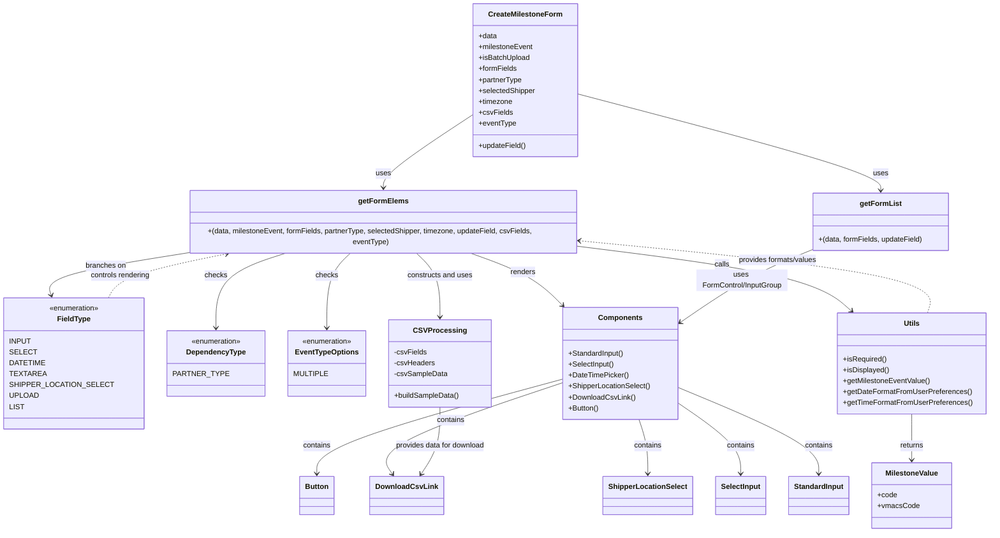

# Diagram: web/portal/src/pages/createmilestone/components/CreateMilestoneForm.js

> Auto-generated by Obscura crawlers

## Mermaid

### SVG

<svg id="container" width="2095.240234375" xmlns="http://www.w3.org/2000/svg" class="classDiagram" height="1180" viewBox="0 0 2095.240234375 1180" role="graphics-document document" aria-roledescription="class"><g><defs><marker id="container_class-aggregationStart" class="marker aggregation class" refX="18" refY="7" markerWidth="190" markerHeight="240" orient="auto"><path d="M 18,7 L9,13 L1,7 L9,1 Z"></path></marker></defs><defs><marker id="container_class-aggregationEnd" class="marker aggregation class" refX="1" refY="7" markerWidth="20" markerHeight="28" orient="auto"><path d="M 18,7 L9,13 L1,7 L9,1 Z"></path></marker></defs><defs><marker id="container_class-extensionStart" class="marker extension class" refX="18" refY="7" markerWidth="190" markerHeight="240" orient="auto"><path d="M 1,7 L18,13 V 1 Z"></path></marker></defs><defs><marker id="container_class-extensionEnd" class="marker extension class" refX="1" refY="7" markerWidth="20" markerHeight="28" orient="auto"><path d="M 1,1 V 13 L18,7 Z"></path></marker></defs><defs><marker id="container_class-compositionStart" class="marker composition class" refX="18" refY="7" markerWidth="190" markerHeight="240" orient="auto"><path d="M 18,7 L9,13 L1,7 L9,1 Z"></path></marker></defs><defs><marker id="container_class-compositionEnd" class="marker composition class" refX="1" refY="7" markerWidth="20" markerHeight="28" orient="auto"><path d="M 18,7 L9,13 L1,7 L9,1 Z"></path></marker></defs><defs><marker id="container_class-dependencyStart" class="marker dependency class" refX="6" refY="7" markerWidth="190" markerHeight="240" orient="auto"><path d="M 5,7 L9,13 L1,7 L9,1 Z"></path></marker></defs><defs><marker id="container_class-dependencyEnd" class="marker dependency class" refX="13" refY="7" markerWidth="20" markerHeight="28" orient="auto"><path d="M 18,7 L9,13 L14,7 L9,1 Z"></path></marker></defs><defs><marker id="container_class-lollipopStart" class="marker lollipop class" refX="13" refY="7" markerWidth="190" markerHeight="240" orient="auto"><circle stroke="black" fill="transparent" cx="7" cy="7" r="6"></circle></marker></defs><defs><marker id="container_class-lollipopEnd" class="marker lollipop class" refX="1" refY="7" markerWidth="190" markerHeight="240" orient="auto"><circle stroke="black" fill="transparent" cx="7" cy="7" r="6"></circle></marker></defs><g class="root"><g class="clusters"></g><g class="edgePaths"><path d="M983.434,249.166L949.331,271.138C915.228,293.11,847.022,337.055,812.919,364.194C778.816,391.333,778.816,401.667,778.816,406.833L778.816,412" id="id_CreateMilestoneForm_getFormElems_1" class="edge-thickness-normal edge-pattern-solid relation" style=";;;" data-edge="true" data-et="edge" data-id="id_CreateMilestoneForm_getFormElems_1" data-points="W3sieCI6OTgzLjQzMzU5Mzc1LCJ5IjoyNDkuMTY1NTY3ODczNDk3Nn0seyJ4Ijo3NzguODE2NDA2MjUsInkiOjM4MX0seyJ4Ijo3NzguODE2NDA2MjUsInkiOjQxOH1d" marker-end="url(#container_class-dependencyEnd)"></path><path d="M1210.551,206.58L1318.504,235.65C1426.456,264.72,1642.362,322.86,1750.315,357.097C1858.268,391.333,1858.268,401.667,1858.268,406.833L1858.268,412" id="id_CreateMilestoneForm_getFormList_2" class="edge-thickness-normal edge-pattern-solid relation" style=";;;" data-edge="true" data-et="edge" data-id="id_CreateMilestoneForm_getFormList_2" data-points="W3sieCI6MTIxMC41NTA3ODEyNSwieSI6MjA2LjU3OTYxOTQxOTUwODI4fSx7IngiOjE4NTguMjY3NTc4MTI1LCJ5IjozODF9LHsieCI6MTg1OC4yNjc1NzgxMjUsInkiOjQxOH1d" marker-end="url(#container_class-dependencyEnd)"></path><path d="M386.521,544L335.668,552.167C284.815,560.333,183.109,576.667,134.716,592.053C86.324,607.44,91.246,621.881,93.707,629.101L96.168,636.321" id="id_getFormElems_FieldType_3" class="edge-thickness-normal edge-pattern-solid relation" style=";;;" data-edge="true" data-et="edge" data-id="id_getFormElems_FieldType_3" data-points="W3sieCI6Mzg2LjUyMDk5NjA5Mzc1LCJ5Ijo1NDR9LHsieCI6ODEuNDAyMzQzNzUsInkiOjU5M30seyJ4Ijo5OC4xMDMyODI4NjkxNzA5OCwieSI6NjQyfV0=" marker-end="url(#container_class-dependencyEnd)"></path><path d="M584.317,544L559.104,552.167C533.891,560.333,483.465,576.667,458.252,604C433.039,631.333,433.039,669.667,433.039,688.833L433.039,708" id="id_getFormElems_DependencyType_4" class="edge-thickness-normal edge-pattern-solid relation" style=";;;" data-edge="true" data-et="edge" data-id="id_getFormElems_DependencyType_4" data-points="W3sieCI6NTg0LjMxNjY1MDM5MDYyNSwieSI6NTQ0fSx7IngiOjQzMy4wMzkwNjI1LCJ5Ijo1OTN9LHsieCI6NDMzLjAzOTA2MjUsInkiOjcxNH1d" marker-end="url(#container_class-dependencyEnd)"></path><path d="M711.497,544L702.77,552.167C694.043,560.333,676.59,576.667,667.863,604C659.137,631.333,659.137,669.667,659.137,688.833L659.137,708" id="id_getFormElems_EventTypeOptions_5" class="edge-thickness-normal edge-pattern-solid relation" style=";;;" data-edge="true" data-et="edge" data-id="id_getFormElems_EventTypeOptions_5" data-points="W3sieCI6NzExLjQ5NjU4MjAzMTI1LCJ5Ijo1NDR9LHsieCI6NjU5LjEzNjcxODc1LCJ5Ijo1OTN9LHsieCI6NjU5LjEzNjcxODc1LCJ5Ijo3MTR9XQ==" marker-end="url(#container_class-dependencyEnd)"></path><path d="M960.129,544L983.633,552.167C1007.136,560.333,1054.143,576.667,1088.752,595.797C1123.36,614.928,1145.569,636.856,1156.674,647.82L1167.779,658.784" id="id_getFormElems_Components_6" class="edge-thickness-normal edge-pattern-solid relation" style=";;;" data-edge="true" data-et="edge" data-id="id_getFormElems_Components_6" data-points="W3sieCI6OTYwLjEyOTI3MjQ2MDkzNzUsInkiOjU0NH0seyJ4IjoxMTAxLjE1MDM5MDYyNSwieSI6NTkzfSx7IngiOjExNzIuMDQ4NjI1NzI4NjI3LCJ5Ijo2NjN9XQ==" marker-end="url(#container_class-dependencyEnd)"></path><path d="M1216.609,533.595L1299.023,543.496C1381.438,553.396,1546.266,573.198,1643.188,596.098C1740.109,618.999,1769.125,644.997,1783.633,657.997L1798.141,670.996" id="id_getFormElems_Utils_7" class="edge-thickness-normal edge-pattern-solid relation" style=";;;" data-edge="true" data-et="edge" data-id="id_getFormElems_Utils_7" data-points="W3sieCI6MTIxNi42MDkzNzUsInkiOjUzMy41OTQ2NjI3NjcxNjU1fSx7IngiOjE3MTEuMDkzNzUsInkiOjU5M30seyJ4IjoxODAyLjYwOTM1NDc2MDM2MjcsInkiOjY3NX1d" marker-end="url(#container_class-dependencyEnd)"></path><path d="M1709.709,539.665L1687.199,548.554C1664.689,557.443,1619.669,575.222,1572.514,601.219C1525.36,627.216,1476.071,661.432,1451.427,678.539L1426.782,695.647" id="id_getFormList_Components_8" class="edge-thickness-normal edge-pattern-solid relation" style=";;;" data-edge="true" data-et="edge" data-id="id_getFormList_Components_8" data-points="W3sieCI6MTcwOS43MDg5ODQzNzUsInkiOjUzOS42NjUxNjA4MzI3MDc4fSx7IngiOjE1NzQuNjQ4NDM3NSwieSI6NTkzfSx7IngiOjE0MjEuODUzNTE1NjI1LCJ5Ijo2OTkuMDY4ODUyODczNjExNn1d" marker-end="url(#container_class-dependencyEnd)"></path><path d="M1171.4,821.992L1080.354,848.16C989.307,874.328,807.214,926.664,716.168,964.999C625.121,1003.333,625.121,1027.667,625.121,1039.833L625.121,1052" id="id_Components_Button_9" class="edge-thickness-normal edge-pattern-solid relation" style=";;;" data-edge="true" data-et="edge" data-id="id_Components_Button_9" data-points="W3sieCI6MTE3MS40MDAzOTA2MjUsInkiOjgyMS45OTE4MzI3MjIwNDc5fSx7IngiOjYyNS4xMjEwOTM3NSwieSI6OTc5fSx7IngiOjYyNS4xMjEwOTM3NSwieSI6MTA1OH1d" marker-end="url(#container_class-dependencyEnd)"></path><path d="M1171.4,830.021L1100.768,854.851C1030.135,879.681,888.87,929.34,825.918,966.488C762.967,1003.636,778.328,1028.272,786.008,1040.591L793.689,1052.909" id="id_Components_DownloadCsvLink_10" class="edge-thickness-normal edge-pattern-solid relation" style=";;;" data-edge="true" data-et="edge" data-id="id_Components_DownloadCsvLink_10" data-points="W3sieCI6MTE3MS40MDAzOTA2MjUsInkiOjgzMC4wMjE0NTg2MzIwMTIyfSx7IngiOjc0Ny42MDU0Njg3NSwieSI6OTc5fSx7IngiOjc5Ni44NjMxNTIxMTc3Njg1LCJ5IjoxMDU4fV0=" marker-end="url(#container_class-dependencyEnd)"></path><path d="M1336.538,909L1340.324,920.667C1344.109,932.333,1351.681,955.667,1355.466,979.5C1359.252,1003.333,1359.252,1027.667,1359.252,1039.833L1359.252,1052" id="id_Components_ShipperLocationSelect_11" class="edge-thickness-normal edge-pattern-solid relation" style=";;;" data-edge="true" data-et="edge" data-id="id_Components_ShipperLocationSelect_11" data-points="W3sieCI6MTMzNi41MzgyMjI1NTUwNTE4LCJ5Ijo5MDl9LHsieCI6MTM1OS4yNTE5NTMxMjUsInkiOjk3OX0seyJ4IjoxMzU5LjI1MTk1MzEyNSwieSI6MTA1OH1d" marker-end="url(#container_class-dependencyEnd)"></path><path d="M1421.854,878.484L1444.537,895.237C1467.221,911.989,1512.588,945.495,1535.271,974.414C1557.955,1003.333,1557.955,1027.667,1557.955,1039.833L1557.955,1052" id="id_Components_SelectInput_12" class="edge-thickness-normal edge-pattern-solid relation" style=";;;" data-edge="true" data-et="edge" data-id="id_Components_SelectInput_12" data-points="W3sieCI6MTQyMS44NTM1MTU2MjUsInkiOjg3OC40ODQyMTUyNDY2MzY3fSx7IngiOjE1NTcuOTU1MDc4MTI1LCJ5Ijo5Nzl9LHsieCI6MTU1Ny45NTUwNzgxMjUsInkiOjEwNTh9XQ==" marker-end="url(#container_class-dependencyEnd)"></path><path d="M1421.854,842.165L1472.702,864.97C1523.551,887.776,1625.249,933.388,1676.098,968.361C1726.947,1003.333,1726.947,1027.667,1726.947,1039.833L1726.947,1052" id="id_Components_StandardInput_13" class="edge-thickness-normal edge-pattern-solid relation" style=";;;" data-edge="true" data-et="edge" data-id="id_Components_StandardInput_13" data-points="W3sieCI6MTQyMS44NTM1MTU2MjUsInkiOjg0Mi4xNjQ1MDMxODYyMTY2fSx7IngiOjE3MjYuOTQ3MjY1NjI1LCJ5Ijo5Nzl9LHsieCI6MTcyNi45NDcyNjU2MjUsInkiOjEwNTh9XQ==" marker-end="url(#container_class-dependencyEnd)"></path><path d="M212.281,642L215.972,633.833C219.664,625.667,227.048,609.333,269.455,593.202C311.862,577.07,389.293,561.139,428.008,553.174L466.723,545.209" id="id_FieldType_getFormElems_14" class="edge-thickness-normal edge-pattern-dashed relation" style=";;;" data-edge="true" data-et="edge" data-id="id_FieldType_getFormElems_14" data-points="W3sieCI6MjEyLjI4MDU4MjA5MTk2ODksInkiOjY0Mn0seyJ4IjoyMzQuNDMxNjQwNjI1LCJ5Ijo1OTN9LHsieCI6NDcyLjU5OTk3NTU4NTkzNzUsInkiOjU0NH1d" marker-end="url(#container_class-dependencyEnd)"></path><path d="M1962.508,675L1966.942,661.333C1971.377,647.667,1980.246,620.333,1856.925,594.844C1733.605,569.355,1478.094,545.711,1350.339,533.888L1222.584,522.066" id="id_Utils_getFormElems_15" class="edge-thickness-normal edge-pattern-dashed relation" style=";;;" data-edge="true" data-et="edge" data-id="id_Utils_getFormElems_15" data-points="W3sieCI6MTk2Mi41MDc3MjE0MjE2MzIxLCJ5Ijo2NzV9LHsieCI6MTk4OS4xMTUyMzQzNzUsInkiOjU5M30seyJ4IjoxMjE2LjYwOTM3NSwieSI6NTIxLjUxMjk4MDIzMzEyMjl9XQ==" marker-end="url(#container_class-dependencyEnd)"></path><path d="M1926.49,897L1926.49,910.667C1926.49,924.333,1926.49,951.667,1926.49,972.5C1926.49,993.333,1926.49,1007.667,1926.49,1014.833L1926.49,1022" id="id_Utils_MilestoneValue_16" class="edge-thickness-normal edge-pattern-solid relation" style=";;;" data-edge="true" data-et="edge" data-id="id_Utils_MilestoneValue_16" data-points="W3sieCI6MTkyNi40OTAyMzQzNzUsInkiOjg5N30seyJ4IjoxOTI2LjQ5MDIzNDM3NSwieSI6OTc5fSx7IngiOjE5MjYuNDkwMjM0Mzc1LCJ5IjoxMDI4fV0=" marker-end="url(#container_class-dependencyEnd)"></path><path d="M846.136,544L854.863,552.167C863.59,560.333,881.043,576.667,889.769,600C898.496,623.333,898.496,653.667,898.496,668.833L898.496,684" id="id_getFormElems_CSVProcessing_17" class="edge-thickness-normal edge-pattern-solid relation" style=";;;" data-edge="true" data-et="edge" data-id="id_getFormElems_CSVProcessing_17" data-points="W3sieCI6ODQ2LjEzNjIzMDQ2ODc1LCJ5Ijo1NDR9LHsieCI6ODk4LjQ5NjA5Mzc1LCJ5Ijo1OTN9LHsieCI6ODk4LjQ5NjA5Mzc1LCJ5Ijo2OTB9XQ==" marker-end="url(#container_class-dependencyEnd)"></path><path d="M898.496,882L898.496,898.167C898.496,914.333,898.496,946.667,890.816,975.151C883.135,1003.636,867.774,1028.272,860.093,1040.591L852.413,1052.909" id="id_CSVProcessing_DownloadCsvLink_18" class="edge-thickness-normal edge-pattern-solid relation" style=";;;" data-edge="true" data-et="edge" data-id="id_CSVProcessing_DownloadCsvLink_18" data-points="W3sieCI6ODk4LjQ5NjA5Mzc1LCJ5Ijo4ODJ9LHsieCI6ODk4LjQ5NjA5Mzc1LCJ5Ijo5Nzl9LHsieCI6ODQ5LjIzODQxMDM4MjIzMTUsInkiOjEwNTh9XQ==" marker-end="url(#container_class-dependencyEnd)"></path></g><g class="edgeLabels"><g class="edgeLabel" transform="translate(778.81640625, 381)"><g class="label" data-id="id_CreateMilestoneForm_getFormElems_1" transform="translate(-16.4921875, -12)"><foreignObject width="32.984375" height="24">

uses

</foreignObject></g></g><g class="edgeLabel" transform="translate(1858.267578125, 381)"><g class="label" data-id="id_CreateMilestoneForm_getFormList_2" transform="translate(-16.4921875, -12)"><foreignObject width="32.984375" height="24">

uses

</foreignObject></g></g><g class="edgeLabel" transform="translate(208.40515, 572.60421)"><g class="label" data-id="id_getFormElems_FieldType_3" transform="translate(-44.6953125, -12)"><foreignObject width="89.390625" height="24">

branches on

</foreignObject></g></g><g class="edgeLabel" transform="translate(433.0390625, 593)"><g class="label" data-id="id_getFormElems_DependencyType_4" transform="translate(-24.4921875, -12)"><foreignObject width="48.984375" height="24">

checks

</foreignObject></g></g><g class="edgeLabel" transform="translate(659.13671875, 593)"><g class="label" data-id="id_getFormElems_EventTypeOptions_5" transform="translate(-24.4921875, -12)"><foreignObject width="48.984375" height="24">

checks

</foreignObject></g></g><g class="edgeLabel" transform="translate(1077.6962, 584.85047)"><g class="label" data-id="id_getFormElems_Components_6" transform="translate(-27.75, -12)"><foreignObject width="55.5" height="24">

renders

</foreignObject></g></g><g class="edgeLabel" transform="translate(1524.85215, 570.62569)"><g class="label" data-id="id_getFormElems_Utils_7" transform="translate(-16.4453125, -12)"><foreignObject width="32.890625" height="24">

calls

</foreignObject></g></g><g class="edgeLabel" transform="translate(1557.89364, 604.63103)"><g class="label" data-id="id_getFormList_Components_8" transform="translate(-100, -24)"><foreignObject width="200" height="48">

uses FormControl/InputGroup

</foreignObject></g></g><g class="edgeLabel" transform="translate(625.12109375, 979)"><g class="label" data-id="id_Components_Button_9" transform="translate(-30.890625, -12)"><foreignObject width="61.78125" height="24">

contains

</foreignObject></g></g><g class="edgeLabel" transform="translate(915.58811, 919.9483)"><g class="label" data-id="id_Components_DownloadCsvLink_10" transform="translate(-30.890625, -12)"><foreignObject width="61.78125" height="24">

contains

</foreignObject></g></g><g class="edgeLabel" transform="translate(1359.251953125, 979)"><g class="label" data-id="id_Components_ShipperLocationSelect_11" transform="translate(-30.890625, -12)"><foreignObject width="61.78125" height="24">

contains

</foreignObject></g></g><g class="edgeLabel" transform="translate(1557.955078125, 979)"><g class="label" data-id="id_Components_SelectInput_12" transform="translate(-30.890625, -12)"><foreignObject width="61.78125" height="24">

contains

</foreignObject></g></g><g class="edgeLabel" transform="translate(1726.947265625, 979)"><g class="label" data-id="id_Components_StandardInput_13" transform="translate(-30.890625, -12)"><foreignObject width="61.78125" height="24">

contains

</foreignObject></g></g><g class="edgeLabel" transform="translate(234.431640625, 593)"><g class="label" data-id="id_FieldType_getFormElems_14" transform="translate(-66.8671875, -12)"><foreignObject width="133.734375" height="24">

controls rendering

</foreignObject></g></g><g class="edgeLabel" transform="translate(1645.78333, 561.22836)"><g class="label" data-id="id_Utils_getFormElems_15" transform="translate(-88.8046875, -12)"><foreignObject width="177.609375" height="24">

provides formats/values

</foreignObject></g></g><g class="edgeLabel" transform="translate(1926.490234375, 979)"><g class="label" data-id="id_Utils_MilestoneValue_16" transform="translate(-26.265625, -12)"><foreignObject width="52.53125" height="24">

returns

</foreignObject></g></g><g class="edgeLabel" transform="translate(898.49609375, 593)"><g class="label" data-id="id_getFormElems_CSVProcessing_17" transform="translate(-72.3984375, -12)"><foreignObject width="144.796875" height="24">

constructs and uses

</foreignObject></g></g><g class="edgeLabel" transform="translate(898.49609375, 979)"><g class="label" data-id="id_CSVProcessing_DownloadCsvLink_18" transform="translate(-100, -24)"><foreignObject width="200" height="48">

provides data for download

</foreignObject></g></g></g><g class="nodes"><g class="node default" id="classId-CreateMilestoneForm-0" transform="translate(1096.9921875, 176)"><g class="basic label-container"><path d="M-113.55859375 -168 L113.55859375 -168 L113.55859375 168 L-113.55859375 168" stroke="none" stroke-width="0" fill="#ECECFF" style=""></path><path d="M-113.55859375 -168 C-65.55063671150526 -168, -17.54267967301051 -168, 113.55859375 -168 M-113.55859375 -168 C-53.30343824715231 -168, 6.951717255695385 -168, 113.55859375 -168 M113.55859375 -168 C113.55859375 -73.96818116007225, 113.55859375 20.063637679855503, 113.55859375 168 M113.55859375 -168 C113.55859375 -84.27505234107711, 113.55859375 -0.5501046821542275, 113.55859375 168 M113.55859375 168 C28.07488020684839 168, -57.40883333630322 168, -113.55859375 168 M113.55859375 168 C57.71472366934874 168, 1.8708535886974857 168, -113.55859375 168 M-113.55859375 168 C-113.55859375 82.28826788769766, -113.55859375 -3.423464224604686, -113.55859375 -168 M-113.55859375 168 C-113.55859375 95.69016446267545, -113.55859375 23.38032892535091, -113.55859375 -168" stroke="#9370DB" stroke-width="1.3" fill="none" stroke-dasharray="0 0" style=""></path></g><g class="annotation-group text" transform="translate(0, -144)"></g><g class="label-group text" transform="translate(-77.6171875, -144)"><g class="label" style="font-weight: bolder" transform="translate(0,-12)"><foreignObject width="155.234375" height="24">

CreateMilestoneForm

</foreignObject></g></g><g class="members-group text" transform="translate(-101.55859375, -96)"><g class="label" style="" transform="translate(0,-12)"><foreignObject width="40.625" height="24">

+data

</foreignObject></g><g class="label" style="" transform="translate(0,12)"><foreignObject width="119.90625" height="24">

+milestoneEvent

</foreignObject></g><g class="label" style="" transform="translate(0,36)"><foreignObject width="113.125" height="24">

+isBatchUpload

</foreignObject></g><g class="label" style="" transform="translate(0,60)"><foreignObject width="84.359375" height="24">

+formFields

</foreignObject></g><g class="label" style="" transform="translate(0,84)"><foreignObject width="95.984375" height="24">

+partnerType

</foreignObject></g><g class="label" style="" transform="translate(0,108)"><foreignObject width="125.5" height="24">

+selectedShipper

</foreignObject></g><g class="label" style="" transform="translate(0,132)"><foreignObject width="74.84375" height="24">

+timezone

</foreignObject></g><g class="label" style="" transform="translate(0,156)"><foreignObject width="72.890625" height="24">

+csvFields

</foreignObject></g><g class="label" style="" transform="translate(0,180)"><foreignObject width="82.0625" height="24">

+eventType

</foreignObject></g></g><g class="methods-group text" transform="translate(-101.55859375, 144)"><g class="label" style="" transform="translate(0,-12)"><foreignObject width="104.40625" height="24">

+updateField()

</foreignObject></g></g><g class="divider" style=""><path d="M-113.55859375 -120 C-34.84036630546903 -120, 43.877861139061935 -120, 113.55859375 -120 M-113.55859375 -120 C-65.89301229257768 -120, -18.227430835155346 -120, 113.55859375 -120" stroke="#9370DB" stroke-width="1.3" fill="none" stroke-dasharray="0 0" style=""></path></g><g class="divider" style=""><path d="M-113.55859375 120 C-40.544112294907464 120, 32.47036916018507 120, 113.55859375 120 M-113.55859375 120 C-38.442907786306336 120, 36.67277817738733 120, 113.55859375 120" stroke="#9370DB" stroke-width="1.3" fill="none" stroke-dasharray="0 0" style=""></path></g></g><g class="node default" id="classId-getFormElems-1" transform="translate(778.81640625, 481)"><g class="basic label-container"><path d="M-437.79296875 -63 L437.79296875 -63 L437.79296875 63 L-437.79296875 63" stroke="none" stroke-width="0" fill="#ECECFF" style=""></path><path d="M-437.79296875 -63 C-112.64347384907467 -63, 212.50602105185067 -63, 437.79296875 -63 M-437.79296875 -63 C-215.9532950164197 -63, 5.886378717160596 -63, 437.79296875 -63 M437.79296875 -63 C437.79296875 -33.54153188403333, 437.79296875 -4.0830637680666655, 437.79296875 63 M437.79296875 -63 C437.79296875 -24.969276476485526, 437.79296875 13.061447047028949, 437.79296875 63 M437.79296875 63 C196.2930820694845 63, -45.206804611030975 63, -437.79296875 63 M437.79296875 63 C233.35325204444345 63, 28.913535338886902 63, -437.79296875 63 M-437.79296875 63 C-437.79296875 14.55517313531584, -437.79296875 -33.88965372936832, -437.79296875 -63 M-437.79296875 63 C-437.79296875 15.913107206396944, -437.79296875 -31.173785587206112, -437.79296875 -63" stroke="#9370DB" stroke-width="1.3" fill="none" stroke-dasharray="0 0" style=""></path></g><g class="annotation-group text" transform="translate(0, -39)"></g><g class="label-group text" transform="translate(-51.5078125, -39)"><g class="label" style="font-weight: bolder" transform="translate(0,-12)"><foreignObject width="103.015625" height="24">

getFormElems

</foreignObject></g></g><g class="members-group text" transform="translate(-425.79296875, 9)"></g><g class="methods-group text" transform="translate(-425.79296875, 39)"><g class="label" style="" transform="translate(0,-12)"><foreignObject width="800.078125" height="24">

+(data, milestoneEvent, formFields, partnerType, selectedShipper, timezone, updateField, csvFields, eventType)

</foreignObject></g></g><g class="divider" style=""><path d="M-437.79296875 -15 C-163.08683766537177 -15, 111.61929341925645 -15, 437.79296875 -15 M-437.79296875 -15 C-203.3592670436548 -15, 31.074434662690408 -15, 437.79296875 -15" stroke="#9370DB" stroke-width="1.3" fill="none" stroke-dasharray="0 0" style=""></path></g><g class="divider" style=""><path d="M-437.79296875 9 C-95.4537383625755 9, 246.885492024849 9, 437.79296875 9 M-437.79296875 9 C-214.85773959411705 9, 8.077489561765901 9, 437.79296875 9" stroke="#9370DB" stroke-width="1.3" fill="none" stroke-dasharray="0 0" style=""></path></g></g><g class="node default" id="classId-getFormList-2" transform="translate(1858.267578125, 481)"><g class="basic label-container"><path d="M-148.55859375 -63 L148.55859375 -63 L148.55859375 63 L-148.55859375 63" stroke="none" stroke-width="0" fill="#ECECFF" style=""></path><path d="M-148.55859375 -63 C-74.74661948044272 -63, -0.9346452108854351 -63, 148.55859375 -63 M-148.55859375 -63 C-77.84800456433416 -63, -7.137415378668322 -63, 148.55859375 -63 M148.55859375 -63 C148.55859375 -36.16533714761144, 148.55859375 -9.330674295222884, 148.55859375 63 M148.55859375 -63 C148.55859375 -22.094884359273493, 148.55859375 18.810231281453014, 148.55859375 63 M148.55859375 63 C71.4017961103984 63, -5.755001529203213 63, -148.55859375 63 M148.55859375 63 C31.236833773611934 63, -86.08492620277613 63, -148.55859375 63 M-148.55859375 63 C-148.55859375 22.864208720947396, -148.55859375 -17.27158255810521, -148.55859375 -63 M-148.55859375 63 C-148.55859375 17.382003016445132, -148.55859375 -28.235993967109735, -148.55859375 -63" stroke="#9370DB" stroke-width="1.3" fill="none" stroke-dasharray="0 0" style=""></path></g><g class="annotation-group text" transform="translate(0, -39)"></g><g class="label-group text" transform="translate(-43.3046875, -39)"><g class="label" style="font-weight: bolder" transform="translate(0,-12)"><foreignObject width="86.609375" height="24">

getFormList

</foreignObject></g></g><g class="members-group text" transform="translate(-136.55859375, 9)"></g><g class="methods-group text" transform="translate(-136.55859375, 39)"><g class="label" style="" transform="translate(0,-12)"><foreignObject width="229.8125" height="24">

+(data, formFields, updateField)

</foreignObject></g></g><g class="divider" style=""><path d="M-148.55859375 -15 C-79.84515719260001 -15, -11.131720635200026 -15, 148.55859375 -15 M-148.55859375 -15 C-43.58233080971469 -15, 61.39393213057062 -15, 148.55859375 -15" stroke="#9370DB" stroke-width="1.3" fill="none" stroke-dasharray="0 0" style=""></path></g><g class="divider" style=""><path d="M-148.55859375 9 C-88.8575202114129 9, -29.15644667282581 9, 148.55859375 9 M-148.55859375 9 C-83.54456799034321 9, -18.53054223068642 9, 148.55859375 9" stroke="#9370DB" stroke-width="1.3" fill="none" stroke-dasharray="0 0" style=""></path></g></g><g class="node default" id="classId-FieldType-3" transform="translate(147.18359375, 786)"><g class="basic label-container"><path d="M-139.18359375 -144 L139.18359375 -144 L139.18359375 144 L-139.18359375 144" stroke="none" stroke-width="0" fill="#ECECFF" style=""></path><path d="M-139.18359375 -144 C-46.14018468350406 -144, 46.90322438299188 -144, 139.18359375 -144 M-139.18359375 -144 C-48.42594108027133 -144, 42.33171158945734 -144, 139.18359375 -144 M139.18359375 -144 C139.18359375 -74.13773354732851, 139.18359375 -4.275467094657017, 139.18359375 144 M139.18359375 -144 C139.18359375 -38.65760476998503, 139.18359375 66.68479046002994, 139.18359375 144 M139.18359375 144 C80.94314585336359 144, 22.702697956727178 144, -139.18359375 144 M139.18359375 144 C38.554651215869086 144, -62.07429131826183 144, -139.18359375 144 M-139.18359375 144 C-139.18359375 70.21163411398143, -139.18359375 -3.576731772037135, -139.18359375 -144 M-139.18359375 144 C-139.18359375 42.50708988063113, -139.18359375 -58.985820238737745, -139.18359375 -144" stroke="#9370DB" stroke-width="1.3" fill="none" stroke-dasharray="0 0" style=""></path></g><g class="annotation-group text" transform="translate(-55.5546875, -120)"><g class="label" style="" transform="translate(0,-12)"><foreignObject width="111.109375" height="24">

«enumeration»

</foreignObject></g></g><g class="label-group text" transform="translate(-34.8125, -96)"><g class="label" style="font-weight: bolder" transform="translate(0,-12)"><foreignObject width="69.625" height="24">

FieldType

</foreignObject></g></g><g class="members-group text" transform="translate(-127.18359375, -48)"><g class="label" style="" transform="translate(0,-12)"><foreignObject width="43.8125" height="24">

INPUT

</foreignObject></g><g class="label" style="" transform="translate(0,12)"><foreignObject width="50.703125" height="24">

SELECT

</foreignObject></g><g class="label" style="" transform="translate(0,36)"><foreignObject width="69.359375" height="24">

DATETIME

</foreignObject></g><g class="label" style="" transform="translate(0,60)"><foreignObject width="69.53125" height="24">

TEXTAREA

</foreignObject></g><g class="label" style="" transform="translate(0,84)"><foreignObject width="198.8125" height="24">

SHIPPER_LOCATION_SELECT

</foreignObject></g><g class="label" style="" transform="translate(0,108)"><foreignObject width="57.53125" height="24">

UPLOAD

</foreignObject></g><g class="label" style="" transform="translate(0,132)"><foreignObject width="29.328125" height="24">

LIST

</foreignObject></g></g><g class="methods-group text" transform="translate(-127.18359375, 144)"></g><g class="divider" style=""><path d="M-139.18359375 -72 C-29.595917544926863 -72, 79.99175866014627 -72, 139.18359375 -72 M-139.18359375 -72 C-81.42714752530873 -72, -23.670701300617438 -72, 139.18359375 -72" stroke="#9370DB" stroke-width="1.3" fill="none" stroke-dasharray="0 0" style=""></path></g><g class="divider" style=""><path d="M-139.18359375 120 C-48.62442763774453 120, 41.93473847451094 120, 139.18359375 120 M-139.18359375 120 C-77.66597445925318 120, -16.148355168506356 120, 139.18359375 120" stroke="#9370DB" stroke-width="1.3" fill="none" stroke-dasharray="0 0" style=""></path></g></g><g class="node default" id="classId-DependencyType-4" transform="translate(433.0390625, 786)"><g class="basic label-container"><path d="M-96.671875 -72 L96.671875 -72 L96.671875 72 L-96.671875 72" stroke="none" stroke-width="0" fill="#ECECFF" style=""></path><path d="M-96.671875 -72 C-40.31665075996045 -72, 16.038573480079094 -72, 96.671875 -72 M-96.671875 -72 C-57.251400326304775 -72, -17.83092565260955 -72, 96.671875 -72 M96.671875 -72 C96.671875 -38.306423977441725, 96.671875 -4.612847954883449, 96.671875 72 M96.671875 -72 C96.671875 -17.061989255305264, 96.671875 37.87602148938947, 96.671875 72 M96.671875 72 C24.121762756298395 72, -48.42834948740321 72, -96.671875 72 M96.671875 72 C24.195098034515667 72, -48.28167893096867 72, -96.671875 72 M-96.671875 72 C-96.671875 36.86065418599446, -96.671875 1.7213083719889255, -96.671875 -72 M-96.671875 72 C-96.671875 36.203470029465606, -96.671875 0.40694005893121243, -96.671875 -72" stroke="#9370DB" stroke-width="1.3" fill="none" stroke-dasharray="0 0" style=""></path></g><g class="annotation-group text" transform="translate(-55.5546875, -48)"><g class="label" style="" transform="translate(0,-12)"><foreignObject width="111.109375" height="24">

«enumeration»

</foreignObject></g></g><g class="label-group text" transform="translate(-62.578125, -24)"><g class="label" style="font-weight: bolder" transform="translate(0,-12)"><foreignObject width="125.15625" height="24">

DependencyType

</foreignObject></g></g><g class="members-group text" transform="translate(-84.671875, 24)"><g class="label" style="" transform="translate(0,-12)"><foreignObject width="106.765625" height="24">

PARTNER_TYPE

</foreignObject></g></g><g class="methods-group text" transform="translate(-84.671875, 72)"></g><g class="divider" style=""><path d="M-96.671875 0 C-52.69396924694031 0, -8.716063493880625 0, 96.671875 0 M-96.671875 0 C-50.85352525602236 0, -5.035175512044717 0, 96.671875 0" stroke="#9370DB" stroke-width="1.3" fill="none" stroke-dasharray="0 0" style=""></path></g><g class="divider" style=""><path d="M-96.671875 48 C-40.36823761269757 48, 15.93539977460486 48, 96.671875 48 M-96.671875 48 C-45.769131142798976 48, 5.133612714402048 48, 96.671875 48" stroke="#9370DB" stroke-width="1.3" fill="none" stroke-dasharray="0 0" style=""></path></g></g><g class="node default" id="classId-EventTypeOptions-5" transform="translate(659.13671875, 786)"><g class="basic label-container"><path d="M-79.42578125 -72 L79.42578125 -72 L79.42578125 72 L-79.42578125 72" stroke="none" stroke-width="0" fill="#ECECFF" style=""></path><path d="M-79.42578125 -72 C-37.71533331735793 -72, 3.9951146152841375 -72, 79.42578125 -72 M-79.42578125 -72 C-26.481969264635083 -72, 26.461842720729834 -72, 79.42578125 -72 M79.42578125 -72 C79.42578125 -34.23551344612963, 79.42578125 3.5289731077407396, 79.42578125 72 M79.42578125 -72 C79.42578125 -34.0874882763542, 79.42578125 3.825023447291599, 79.42578125 72 M79.42578125 72 C38.348399455308375 72, -2.7289823393832506 72, -79.42578125 72 M79.42578125 72 C33.68806689514971 72, -12.04964745970058 72, -79.42578125 72 M-79.42578125 72 C-79.42578125 27.6468017266588, -79.42578125 -16.7063965466824, -79.42578125 -72 M-79.42578125 72 C-79.42578125 32.96301878666797, -79.42578125 -6.073962426664053, -79.42578125 -72" stroke="#9370DB" stroke-width="1.3" fill="none" stroke-dasharray="0 0" style=""></path></g><g class="annotation-group text" transform="translate(-55.5546875, -48)"><g class="label" style="" transform="translate(0,-12)"><foreignObject width="111.109375" height="24">

«enumeration»

</foreignObject></g></g><g class="label-group text" transform="translate(-66.3515625, -24)"><g class="label" style="font-weight: bolder" transform="translate(0,-12)"><foreignObject width="132.703125" height="24">

EventTypeOptions

</foreignObject></g></g><g class="members-group text" transform="translate(-67.42578125, 24)"><g class="label" style="" transform="translate(0,-12)"><foreignObject width="68.5" height="24">

MULTIPLE

</foreignObject></g></g><g class="methods-group text" transform="translate(-67.42578125, 72)"></g><g class="divider" style=""><path d="M-79.42578125 0 C-47.1715324070664 0, -14.917283564132802 0, 79.42578125 0 M-79.42578125 0 C-25.48849639758675 0, 28.4487884548265 0, 79.42578125 0" stroke="#9370DB" stroke-width="1.3" fill="none" stroke-dasharray="0 0" style=""></path></g><g class="divider" style=""><path d="M-79.42578125 48 C-45.11566913010568 48, -10.80555701021136 48, 79.42578125 48 M-79.42578125 48 C-45.08385880040448 48, -10.741936350808956 48, 79.42578125 48" stroke="#9370DB" stroke-width="1.3" fill="none" stroke-dasharray="0 0" style=""></path></g></g><g class="node default" id="classId-Components-6" transform="translate(1296.626953125, 786)"><g class="basic label-container"><path d="M-125.2265625 -123 L125.2265625 -123 L125.2265625 123 L-125.2265625 123" stroke="none" stroke-width="0" fill="#ECECFF" style=""></path><path d="M-125.2265625 -123 C-28.471247343520147 -123, 68.2840678129597 -123, 125.2265625 -123 M-125.2265625 -123 C-51.0576432136245 -123, 23.111276072750996 -123, 125.2265625 -123 M125.2265625 -123 C125.2265625 -29.01885475497555, 125.2265625 64.9622904900489, 125.2265625 123 M125.2265625 -123 C125.2265625 -33.126252818520555, 125.2265625 56.74749436295889, 125.2265625 123 M125.2265625 123 C30.377024528796994 123, -64.47251344240601 123, -125.2265625 123 M125.2265625 123 C66.13483283750315 123, 7.0431031750063084 123, -125.2265625 123 M-125.2265625 123 C-125.2265625 59.85802830678295, -125.2265625 -3.283943386434103, -125.2265625 -123 M-125.2265625 123 C-125.2265625 49.368595781390184, -125.2265625 -24.262808437219633, -125.2265625 -123" stroke="#9370DB" stroke-width="1.3" fill="none" stroke-dasharray="0 0" style=""></path></g><g class="annotation-group text" transform="translate(0, -99)"></g><g class="label-group text" transform="translate(-45.921875, -99)"><g class="label" style="font-weight: bolder" transform="translate(0,-12)"><foreignObject width="91.84375" height="24">

Components

</foreignObject></g></g><g class="members-group text" transform="translate(-113.2265625, -51)"></g><g class="methods-group text" transform="translate(-113.2265625, -21)"><g class="label" style="" transform="translate(0,-12)"><foreignObject width="122.40625" height="24">

+StandardInput()

</foreignObject></g><g class="label" style="" transform="translate(0,12)"><foreignObject width="100.59375" height="24">

+SelectInput()

</foreignObject></g><g class="label" style="" transform="translate(0,36)"><foreignObject width="131.078125" height="24">

+DateTimePicker()

</foreignObject></g><g class="label" style="" transform="translate(0,60)"><foreignObject width="180.53125" height="24">

+ShipperLocationSelect()

</foreignObject></g><g class="label" style="" transform="translate(0,84)"><foreignObject width="144.796875" height="24">

+DownloadCsvLink()

</foreignObject></g><g class="label" style="" transform="translate(0,108)"><foreignObject width="67.4375" height="24">

+Button()

</foreignObject></g></g><g class="divider" style=""><path d="M-125.2265625 -75 C-53.816426870578894 -75, 17.59370875884221 -75, 125.2265625 -75 M-125.2265625 -75 C-40.858846266629996 -75, 43.50886996674001 -75, 125.2265625 -75" stroke="#9370DB" stroke-width="1.3" fill="none" stroke-dasharray="0 0" style=""></path></g><g class="divider" style=""><path d="M-125.2265625 -51 C-67.77877375594298 -51, -10.330985011885957 -51, 125.2265625 -51 M-125.2265625 -51 C-52.665825608093215 -51, 19.89491128381357 -51, 125.2265625 -51" stroke="#9370DB" stroke-width="1.3" fill="none" stroke-dasharray="0 0" style=""></path></g></g><g class="node default" id="classId-Utils-7" transform="translate(1926.490234375, 786)"><g class="basic label-container"><path d="M-160.75 -111 L160.75 -111 L160.75 111 L-160.75 111" stroke="none" stroke-width="0" fill="#ECECFF" style=""></path><path d="M-160.75 -111 C-73.58608985021033 -111, 13.577820299579344 -111, 160.75 -111 M-160.75 -111 C-66.27220129300716 -111, 28.205597413985686 -111, 160.75 -111 M160.75 -111 C160.75 -51.96029302276417, 160.75 7.079413954471661, 160.75 111 M160.75 -111 C160.75 -31.356471763832133, 160.75 48.287056472335735, 160.75 111 M160.75 111 C88.49434440208877 111, 16.238688804177542 111, -160.75 111 M160.75 111 C69.67413025139646 111, -21.401739497207075 111, -160.75 111 M-160.75 111 C-160.75 43.88947657805291, -160.75 -23.221046843894186, -160.75 -111 M-160.75 111 C-160.75 49.28104139716243, -160.75 -12.437917205675134, -160.75 -111" stroke="#9370DB" stroke-width="1.3" fill="none" stroke-dasharray="0 0" style=""></path></g><g class="annotation-group text" transform="translate(0, -87)"></g><g class="label-group text" transform="translate(-16.796875, -87)"><g class="label" style="font-weight: bolder" transform="translate(0,-12)"><foreignObject width="33.59375" height="24">

Utils

</foreignObject></g></g><g class="members-group text" transform="translate(-148.75, -39)"></g><g class="methods-group text" transform="translate(-148.75, -9)"><g class="label" style="" transform="translate(0,-12)"><foreignObject width="95.875" height="24">

+isRequired()

</foreignObject></g><g class="label" style="" transform="translate(0,12)"><foreignObject width="101.296875" height="24">

+isDisplayed()

</foreignObject></g><g class="label" style="" transform="translate(0,36)"><foreignObject width="191.09375" height="24">

+getMilestoneEventValue()

</foreignObject></g><g class="label" style="" transform="translate(0,60)"><foreignObject width="278.578125" height="24">

+getDateFormatFromUserPreferences()

</foreignObject></g><g class="label" style="" transform="translate(0,84)"><foreignObject width="280.703125" height="24">

+getTimeFormatFromUserPreferences()

</foreignObject></g></g><g class="divider" style=""><path d="M-160.75 -63 C-55.398887425178 -63, 49.95222514964399 -63, 160.75 -63 M-160.75 -63 C-55.96194203004163 -63, 48.82611593991675 -63, 160.75 -63" stroke="#9370DB" stroke-width="1.3" fill="none" stroke-dasharray="0 0" style=""></path></g><g class="divider" style=""><path d="M-160.75 -39 C-53.216050232084314 -39, 54.31789953583137 -39, 160.75 -39 M-160.75 -39 C-89.7984193291746 -39, -18.846838658349213 -39, 160.75 -39" stroke="#9370DB" stroke-width="1.3" fill="none" stroke-dasharray="0 0" style=""></path></g></g><g class="node default" id="classId-Button-8" transform="translate(625.12109375, 1100)"><g class="basic label-container"><path d="M-36.8359375 -42 L36.8359375 -42 L36.8359375 42 L-36.8359375 42" stroke="none" stroke-width="0" fill="#ECECFF" style=""></path><path d="M-36.8359375 -42 C-18.90270771597973 -42, -0.9694779319594602 -42, 36.8359375 -42 M-36.8359375 -42 C-11.902003417548482 -42, 13.031930664903037 -42, 36.8359375 -42 M36.8359375 -42 C36.8359375 -14.437933415162714, 36.8359375 13.124133169674572, 36.8359375 42 M36.8359375 -42 C36.8359375 -8.690616729395167, 36.8359375 24.618766541209666, 36.8359375 42 M36.8359375 42 C9.999292931733272 42, -16.837351636533455 42, -36.8359375 42 M36.8359375 42 C20.954974355530695 42, 5.074011211061386 42, -36.8359375 42 M-36.8359375 42 C-36.8359375 15.972522403521772, -36.8359375 -10.054955192956456, -36.8359375 -42 M-36.8359375 42 C-36.8359375 13.913613471690581, -36.8359375 -14.172773056618837, -36.8359375 -42" stroke="#9370DB" stroke-width="1.3" fill="none" stroke-dasharray="0 0" style=""></path></g><g class="annotation-group text" transform="translate(0, -18)"></g><g class="label-group text" transform="translate(-24.8359375, -18)"><g class="label" style="font-weight: bolder" transform="translate(0,-12)"><foreignObject width="49.671875" height="24">

Button

</foreignObject></g></g><g class="members-group text" transform="translate(-24.8359375, 30)"></g><g class="methods-group text" transform="translate(-24.8359375, 60)"></g><g class="divider" style=""><path d="M-36.8359375 6 C-8.804228233722913 6, 19.227481032554174 6, 36.8359375 6 M-36.8359375 6 C-11.503763524493039 6, 13.828410451013923 6, 36.8359375 6" stroke="#9370DB" stroke-width="1.3" fill="none" stroke-dasharray="0 0" style=""></path></g><g class="divider" style=""><path d="M-36.8359375 24 C-17.5873110192039 24, 1.6613154615922028 24, 36.8359375 24 M-36.8359375 24 C-12.086391341961754 24, 12.663154816076492 24, 36.8359375 24" stroke="#9370DB" stroke-width="1.3" fill="none" stroke-dasharray="0 0" style=""></path></g></g><g class="node default" id="classId-DownloadCsvLink-9" transform="translate(823.05078125, 1100)"><g class="basic label-container"><path d="M-76.3515625 -42 L76.3515625 -42 L76.3515625 42 L-76.3515625 42" stroke="none" stroke-width="0" fill="#ECECFF" style=""></path><path d="M-76.3515625 -42 C-40.7651443592482 -42, -5.178726218496394 -42, 76.3515625 -42 M-76.3515625 -42 C-36.345212724288686 -42, 3.661137051422628 -42, 76.3515625 -42 M76.3515625 -42 C76.3515625 -18.694559608645754, 76.3515625 4.610880782708492, 76.3515625 42 M76.3515625 -42 C76.3515625 -20.221033277696833, 76.3515625 1.5579334446063342, 76.3515625 42 M76.3515625 42 C43.25275375823903 42, 10.153945016478062 42, -76.3515625 42 M76.3515625 42 C36.758357004665534 42, -2.834848490668932 42, -76.3515625 42 M-76.3515625 42 C-76.3515625 8.80893232089182, -76.3515625 -24.38213535821636, -76.3515625 -42 M-76.3515625 42 C-76.3515625 22.97376744323328, -76.3515625 3.9475348864665634, -76.3515625 -42" stroke="#9370DB" stroke-width="1.3" fill="none" stroke-dasharray="0 0" style=""></path></g><g class="annotation-group text" transform="translate(0, -18)"></g><g class="label-group text" transform="translate(-64.3515625, -18)"><g class="label" style="font-weight: bolder" transform="translate(0,-12)"><foreignObject width="128.703125" height="24">

DownloadCsvLink

</foreignObject></g></g><g class="members-group text" transform="translate(-64.3515625, 30)"></g><g class="methods-group text" transform="translate(-64.3515625, 60)"></g><g class="divider" style=""><path d="M-76.3515625 6 C-33.52662964265529 6, 9.298303214689426 6, 76.3515625 6 M-76.3515625 6 C-41.19021136113303 6, -6.028860222266061 6, 76.3515625 6" stroke="#9370DB" stroke-width="1.3" fill="none" stroke-dasharray="0 0" style=""></path></g><g class="divider" style=""><path d="M-76.3515625 24 C-27.916075090680806 24, 20.519412318638388 24, 76.3515625 24 M-76.3515625 24 C-20.42569924281524 24, 35.50016401436952 24, 76.3515625 24" stroke="#9370DB" stroke-width="1.3" fill="none" stroke-dasharray="0 0" style=""></path></g></g><g class="node default" id="classId-ShipperLocationSelect-10" transform="translate(1359.251953125, 1100)"><g class="basic label-container"><path d="M-94.6328125 -42 L94.6328125 -42 L94.6328125 42 L-94.6328125 42" stroke="none" stroke-width="0" fill="#ECECFF" style=""></path><path d="M-94.6328125 -42 C-38.569850509042126 -42, 17.493111481915747 -42, 94.6328125 -42 M-94.6328125 -42 C-23.40480302194439 -42, 47.82320645611122 -42, 94.6328125 -42 M94.6328125 -42 C94.6328125 -16.338425050326993, 94.6328125 9.323149899346014, 94.6328125 42 M94.6328125 -42 C94.6328125 -15.223245330585364, 94.6328125 11.553509338829272, 94.6328125 42 M94.6328125 42 C34.704161871094826 42, -25.22448875781035 42, -94.6328125 42 M94.6328125 42 C43.29552447556179 42, -8.041763548876418 42, -94.6328125 42 M-94.6328125 42 C-94.6328125 14.185030048634545, -94.6328125 -13.62993990273091, -94.6328125 -42 M-94.6328125 42 C-94.6328125 8.889709590912133, -94.6328125 -24.220580818175733, -94.6328125 -42" stroke="#9370DB" stroke-width="1.3" fill="none" stroke-dasharray="0 0" style=""></path></g><g class="annotation-group text" transform="translate(0, -18)"></g><g class="label-group text" transform="translate(-82.6328125, -18)"><g class="label" style="font-weight: bolder" transform="translate(0,-12)"><foreignObject width="165.265625" height="24">

ShipperLocationSelect

</foreignObject></g></g><g class="members-group text" transform="translate(-82.6328125, 30)"></g><g class="methods-group text" transform="translate(-82.6328125, 60)"></g><g class="divider" style=""><path d="M-94.6328125 6 C-54.066972415725424 6, -13.501132331450847 6, 94.6328125 6 M-94.6328125 6 C-28.02419056573696 6, 38.58443136852608 6, 94.6328125 6" stroke="#9370DB" stroke-width="1.3" fill="none" stroke-dasharray="0 0" style=""></path></g><g class="divider" style=""><path d="M-94.6328125 24 C-29.480999020538093 24, 35.670814458923815 24, 94.6328125 24 M-94.6328125 24 C-20.614571832723342 24, 53.403668834553315 24, 94.6328125 24" stroke="#9370DB" stroke-width="1.3" fill="none" stroke-dasharray="0 0" style=""></path></g></g><g class="node default" id="classId-SelectInput-11" transform="translate(1557.955078125, 1100)"><g class="basic label-container"><path d="M-54.0703125 -42 L54.0703125 -42 L54.0703125 42 L-54.0703125 42" stroke="none" stroke-width="0" fill="#ECECFF" style=""></path><path d="M-54.0703125 -42 C-16.935465319957117 -42, 20.199381860085765 -42, 54.0703125 -42 M-54.0703125 -42 C-11.020217486084725 -42, 32.02987752783055 -42, 54.0703125 -42 M54.0703125 -42 C54.0703125 -17.384760466052494, 54.0703125 7.230479067895011, 54.0703125 42 M54.0703125 -42 C54.0703125 -17.59074468233021, 54.0703125 6.818510635339578, 54.0703125 42 M54.0703125 42 C18.68602236728769 42, -16.698267765424617 42, -54.0703125 42 M54.0703125 42 C27.744996178282797 42, 1.419679856565594 42, -54.0703125 42 M-54.0703125 42 C-54.0703125 20.32493227068673, -54.0703125 -1.3501354586265393, -54.0703125 -42 M-54.0703125 42 C-54.0703125 16.86169103768387, -54.0703125 -8.276617924632262, -54.0703125 -42" stroke="#9370DB" stroke-width="1.3" fill="none" stroke-dasharray="0 0" style=""></path></g><g class="annotation-group text" transform="translate(0, -18)"></g><g class="label-group text" transform="translate(-42.0703125, -18)"><g class="label" style="font-weight: bolder" transform="translate(0,-12)"><foreignObject width="84.140625" height="24">

SelectInput

</foreignObject></g></g><g class="members-group text" transform="translate(-42.0703125, 30)"></g><g class="methods-group text" transform="translate(-42.0703125, 60)"></g><g class="divider" style=""><path d="M-54.0703125 6 C-30.369806034588596 6, -6.669299569177191 6, 54.0703125 6 M-54.0703125 6 C-30.55836791694223 6, -7.046423333884462 6, 54.0703125 6" stroke="#9370DB" stroke-width="1.3" fill="none" stroke-dasharray="0 0" style=""></path></g><g class="divider" style=""><path d="M-54.0703125 24 C-29.356343945390226 24, -4.642375390780451 24, 54.0703125 24 M-54.0703125 24 C-18.28035158790545 24, 17.5096093241891 24, 54.0703125 24" stroke="#9370DB" stroke-width="1.3" fill="none" stroke-dasharray="0 0" style=""></path></g></g><g class="node default" id="classId-StandardInput-12" transform="translate(1726.947265625, 1100)"><g class="basic label-container"><path d="M-64.921875 -42 L64.921875 -42 L64.921875 42 L-64.921875 42" stroke="none" stroke-width="0" fill="#ECECFF" style=""></path><path d="M-64.921875 -42 C-15.720915969914103 -42, 33.480043060171795 -42, 64.921875 -42 M-64.921875 -42 C-29.03663618677949 -42, 6.848602626441021 -42, 64.921875 -42 M64.921875 -42 C64.921875 -21.506871011338493, 64.921875 -1.0137420226769862, 64.921875 42 M64.921875 -42 C64.921875 -20.537106951410493, 64.921875 0.9257860971790137, 64.921875 42 M64.921875 42 C38.743235643909365 42, 12.56459628781873 42, -64.921875 42 M64.921875 42 C19.335483243813954 42, -26.250908512372092 42, -64.921875 42 M-64.921875 42 C-64.921875 24.116010184523496, -64.921875 6.232020369046992, -64.921875 -42 M-64.921875 42 C-64.921875 9.797972566309895, -64.921875 -22.40405486738021, -64.921875 -42" stroke="#9370DB" stroke-width="1.3" fill="none" stroke-dasharray="0 0" style=""></path></g><g class="annotation-group text" transform="translate(0, -18)"></g><g class="label-group text" transform="translate(-52.921875, -18)"><g class="label" style="font-weight: bolder" transform="translate(0,-12)"><foreignObject width="105.84375" height="24">

StandardInput

</foreignObject></g></g><g class="members-group text" transform="translate(-52.921875, 30)"></g><g class="methods-group text" transform="translate(-52.921875, 60)"></g><g class="divider" style=""><path d="M-64.921875 6 C-38.35037250136705 6, -11.778870002734095 6, 64.921875 6 M-64.921875 6 C-14.454120134930825 6, 36.01363473013835 6, 64.921875 6" stroke="#9370DB" stroke-width="1.3" fill="none" stroke-dasharray="0 0" style=""></path></g><g class="divider" style=""><path d="M-64.921875 24 C-22.99613341664505 24, 18.929608166709897 24, 64.921875 24 M-64.921875 24 C-22.97939266632728 24, 18.963089667345443 24, 64.921875 24" stroke="#9370DB" stroke-width="1.3" fill="none" stroke-dasharray="0 0" style=""></path></g></g><g class="node default" id="classId-MilestoneValue-13" transform="translate(1926.490234375, 1100)"><g class="basic label-container"><path d="M-84.62109375 -72 L84.62109375 -72 L84.62109375 72 L-84.62109375 72" stroke="none" stroke-width="0" fill="#ECECFF" style=""></path><path d="M-84.62109375 -72 C-35.048867359373986 -72, 14.523359031252028 -72, 84.62109375 -72 M-84.62109375 -72 C-21.907762541577576 -72, 40.80556866684485 -72, 84.62109375 -72 M84.62109375 -72 C84.62109375 -29.956325120402518, 84.62109375 12.087349759194964, 84.62109375 72 M84.62109375 -72 C84.62109375 -42.248418766270945, 84.62109375 -12.496837532541882, 84.62109375 72 M84.62109375 72 C50.52445712214568 72, 16.427820494291353 72, -84.62109375 72 M84.62109375 72 C19.506335718210337 72, -45.608422313579325 72, -84.62109375 72 M-84.62109375 72 C-84.62109375 17.176683572370884, -84.62109375 -37.64663285525823, -84.62109375 -72 M-84.62109375 72 C-84.62109375 27.92107410139522, -84.62109375 -16.15785179720956, -84.62109375 -72" stroke="#9370DB" stroke-width="1.3" fill="none" stroke-dasharray="0 0" style=""></path></g><g class="annotation-group text" transform="translate(0, -48)"></g><g class="label-group text" transform="translate(-55.7265625, -48)"><g class="label" style="font-weight: bolder" transform="translate(0,-12)"><foreignObject width="111.453125" height="24">

MilestoneValue

</foreignObject></g></g><g class="members-group text" transform="translate(-72.62109375, 0)"><g class="label" style="" transform="translate(0,-12)"><foreignObject width="42.953125" height="24">

+code

</foreignObject></g><g class="label" style="" transform="translate(0,12)"><foreignObject width="89.515625" height="24">

+vmacsCode

</foreignObject></g></g><g class="methods-group text" transform="translate(-72.62109375, 72)"></g><g class="divider" style=""><path d="M-84.62109375 -24 C-27.308010328563242 -24, 30.005073092873516 -24, 84.62109375 -24 M-84.62109375 -24 C-20.409322602079698 -24, 43.802448545840605 -24, 84.62109375 -24" stroke="#9370DB" stroke-width="1.3" fill="none" stroke-dasharray="0 0" style=""></path></g><g class="divider" style=""><path d="M-84.62109375 48 C-21.00157046297076 48, 42.61795282405848 48, 84.62109375 48 M-84.62109375 48 C-42.50462557565259 48, -0.38815740130517895 48, 84.62109375 48" stroke="#9370DB" stroke-width="1.3" fill="none" stroke-dasharray="0 0" style=""></path></g></g><g class="node default" id="classId-CSVProcessing-14" transform="translate(898.49609375, 786)"><g class="basic label-container"><path d="M-109.93359375 -96 L109.93359375 -96 L109.93359375 96 L-109.93359375 96" stroke="none" stroke-width="0" fill="#ECECFF" style=""></path><path d="M-109.93359375 -96 C-65.13404820649984 -96, -20.334502662999697 -96, 109.93359375 -96 M-109.93359375 -96 C-36.77967344404348 -96, 36.374246861913036 -96, 109.93359375 -96 M109.93359375 -96 C109.93359375 -43.5223664408244, 109.93359375 8.955267118351202, 109.93359375 96 M109.93359375 -96 C109.93359375 -57.24111495778783, 109.93359375 -18.482229915575658, 109.93359375 96 M109.93359375 96 C23.789021947613776 96, -62.35554985477245 96, -109.93359375 96 M109.93359375 96 C43.92635056110653 96, -22.080892627786938 96, -109.93359375 96 M-109.93359375 96 C-109.93359375 49.49617090772783, -109.93359375 2.99234181545566, -109.93359375 -96 M-109.93359375 96 C-109.93359375 52.23327681385554, -109.93359375 8.466553627711079, -109.93359375 -96" stroke="#9370DB" stroke-width="1.3" fill="none" stroke-dasharray="0 0" style=""></path></g><g class="annotation-group text" transform="translate(0, -72)"></g><g class="label-group text" transform="translate(-52.8203125, -72)"><g class="label" style="font-weight: bolder" transform="translate(0,-12)"><foreignObject width="105.640625" height="24">

CSVProcessing

</foreignObject></g></g><g class="members-group text" transform="translate(-97.93359375, -24)"><g class="label" style="" transform="translate(0,-12)"><foreignObject width="71.359375" height="24">

-csvFields

</foreignObject></g><g class="label" style="" transform="translate(0,12)"><foreignObject width="89.015625" height="24">

-csvHeaders

</foreignObject></g><g class="label" style="" transform="translate(0,36)"><foreignObject width="116.359375" height="24">

-csvSampleData

</foreignObject></g></g><g class="methods-group text" transform="translate(-97.93359375, 72)"><g class="label" style="" transform="translate(0,-12)"><foreignObject width="143.046875" height="24">

+buildSampleData()

</foreignObject></g></g><g class="divider" style=""><path d="M-109.93359375 -48 C-43.53228835507835 -48, 22.8690170398433 -48, 109.93359375 -48 M-109.93359375 -48 C-26.010414616833387 -48, 57.912764516333226 -48, 109.93359375 -48" stroke="#9370DB" stroke-width="1.3" fill="none" stroke-dasharray="0 0" style=""></path></g><g class="divider" style=""><path d="M-109.93359375 48 C-60.239363060415876 48, -10.545132370831752 48, 109.93359375 48 M-109.93359375 48 C-31.899626044319746 48, 46.13434166136051 48, 109.93359375 48" stroke="#9370DB" stroke-width="1.3" fill="none" stroke-dasharray="0 0" style=""></path></g></g></g></g></g></svg>
