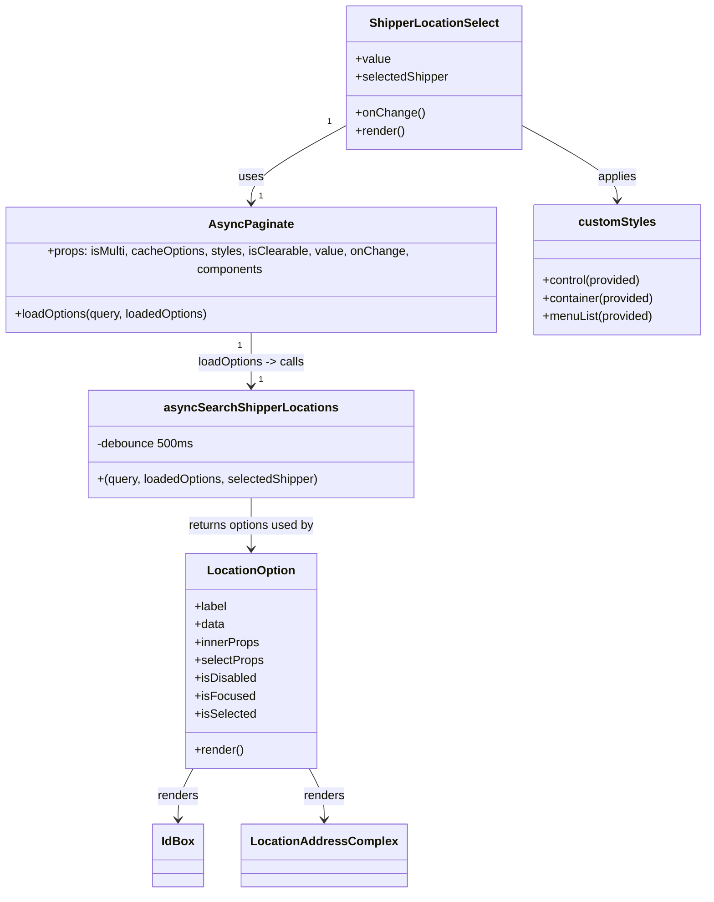

# Diagram: web/portal/src/pages/createmilestone/components/ShipperLocationSelect.js


> Auto-generated by Obscura crawlers

## Diagram 1

```mermaid
flowchart LR
  UserInput(["User types query"])
  A[asyncSearchShipperLocations\n(debounce 500ms)]
  B[asyncSearchLocations]
  C[apiUrl(...owner_id=selectedShipper.organization_id)]
  D[returns {options, hasMore}]
  E[AsyncPaginate.loadOptions]
  F[ShipperLocationSelect component]
  G[LocationOption component]
  H[IdBox]
  I[LocationAddressComplex]
  UserInput -->|query| A
  A -->|after debounce / validate length>=2\ncompute page & pageSize| B
  B --> C
  C --> B
  B --> D
  D --> E
  E --> F
  F -->|components.Option = LocationOption| G
  G --> H
  G --> I
```

> SVG rendering failed for this diagram.

## Diagram 2



### SVG

<svg id="container" width="943.5234375" xmlns="http://www.w3.org/2000/svg" class="classDiagram" height="1194" viewBox="0 0 943.5234375 1194" role="graphics-document document" aria-roledescription="class"><style>#container{font-family:"trebuchet ms",verdana,arial,sans-serif;font-size:16px;fill:#333;}@keyframes edge-animation-frame{from{stroke-dashoffset:0;}}@keyframes dash{to{stroke-dashoffset:0;}}#container .edge-animation-slow{stroke-dasharray:9,5!important;stroke-dashoffset:900;animation:dash 50s linear infinite;stroke-linecap:round;}#container .edge-animation-fast{stroke-dasharray:9,5!important;stroke-dashoffset:900;animation:dash 20s linear infinite;stroke-linecap:round;}#container .error-icon{fill:#552222;}#container .error-text{fill:#552222;stroke:#552222;}#container .edge-thickness-normal{stroke-width:1px;}#container .edge-thickness-thick{stroke-width:3.5px;}#container .edge-pattern-solid{stroke-dasharray:0;}#container .edge-thickness-invisible{stroke-width:0;fill:none;}#container .edge-pattern-dashed{stroke-dasharray:3;}#container .edge-pattern-dotted{stroke-dasharray:2;}#container .marker{fill:#333333;stroke:#333333;}#container .marker.cross{stroke:#333333;}#container svg{font-family:"trebuchet ms",verdana,arial,sans-serif;font-size:16px;}#container p{margin:0;}#container g.classGroup text{fill:#9370DB;stroke:none;font-family:"trebuchet ms",verdana,arial,sans-serif;font-size:10px;}#container g.classGroup text .title{font-weight:bolder;}#container .nodeLabel,#container .edgeLabel{color:#131300;}#container .edgeLabel .label rect{fill:#ECECFF;}#container .label text{fill:#131300;}#container .labelBkg{background:#ECECFF;}#container .edgeLabel .label span{background:#ECECFF;}#container .classTitle{font-weight:bolder;}#container .node rect,#container .node circle,#container .node ellipse,#container .node polygon,#container .node path{fill:#ECECFF;stroke:#9370DB;stroke-width:1px;}#container .divider{stroke:#9370DB;stroke-width:1;}#container g.clickable{cursor:pointer;}#container g.classGroup rect{fill:#ECECFF;stroke:#9370DB;}#container g.classGroup line{stroke:#9370DB;stroke-width:1;}#container .classLabel .box{stroke:none;stroke-width:0;fill:#ECECFF;opacity:0.5;}#container .classLabel .label{fill:#9370DB;font-size:10px;}#container .relation{stroke:#333333;stroke-width:1;fill:none;}#container .dashed-line{stroke-dasharray:3;}#container .dotted-line{stroke-dasharray:1 2;}#container #compositionStart,#container .composition{fill:#333333!important;stroke:#333333!important;stroke-width:1;}#container #compositionEnd,#container .composition{fill:#333333!important;stroke:#333333!important;stroke-width:1;}#container #dependencyStart,#container .dependency{fill:#333333!important;stroke:#333333!important;stroke-width:1;}#container #dependencyStart,#container .dependency{fill:#333333!important;stroke:#333333!important;stroke-width:1;}#container #extensionStart,#container .extension{fill:transparent!important;stroke:#333333!important;stroke-width:1;}#container #extensionEnd,#container .extension{fill:transparent!important;stroke:#333333!important;stroke-width:1;}#container #aggregationStart,#container .aggregation{fill:transparent!important;stroke:#333333!important;stroke-width:1;}#container #aggregationEnd,#container .aggregation{fill:transparent!important;stroke:#333333!important;stroke-width:1;}#container #lollipopStart,#container .lollipop{fill:#ECECFF!important;stroke:#333333!important;stroke-width:1;}#container #lollipopEnd,#container .lollipop{fill:#ECECFF!important;stroke:#333333!important;stroke-width:1;}#container .edgeTerminals{font-size:11px;line-height:initial;}#container .classTitleText{text-anchor:middle;font-size:18px;fill:#333;}#container .label-icon{display:inline-block;height:1em;overflow:visible;vertical-align:-0.125em;}#container .node .label-icon path{fill:currentColor;stroke:revert;stroke-width:revert;}#container :root{--mermaid-font-family:"trebuchet ms",verdana,arial,sans-serif;}</style><g><defs><marker id="container_class-aggregationStart" class="marker aggregation class" refX="18" refY="7" markerWidth="190" markerHeight="240" orient="auto"><path d="M 18,7 L9,13 L1,7 L9,1 Z"></path></marker></defs><defs><marker id="container_class-aggregationEnd" class="marker aggregation class" refX="1" refY="7" markerWidth="20" markerHeight="28" orient="auto"><path d="M 18,7 L9,13 L1,7 L9,1 Z"></path></marker></defs><defs><marker id="container_class-extensionStart" class="marker extension class" refX="18" refY="7" markerWidth="190" markerHeight="240" orient="auto"><path d="M 1,7 L18,13 V 1 Z"></path></marker></defs><defs><marker id="container_class-extensionEnd" class="marker extension class" refX="1" refY="7" markerWidth="20" markerHeight="28" orient="auto"><path d="M 1,1 V 13 L18,7 Z"></path></marker></defs><defs><marker id="container_class-compositionStart" class="marker composition class" refX="18" refY="7" markerWidth="190" markerHeight="240" orient="auto"><path d="M 18,7 L9,13 L1,7 L9,1 Z"></path></marker></defs><defs><marker id="container_class-compositionEnd" class="marker composition class" refX="1" refY="7" markerWidth="20" markerHeight="28" orient="auto"><path d="M 18,7 L9,13 L1,7 L9,1 Z"></path></marker></defs><defs><marker id="container_class-dependencyStart" class="marker dependency class" refX="6" refY="7" markerWidth="190" markerHeight="240" orient="auto"><path d="M 5,7 L9,13 L1,7 L9,1 Z"></path></marker></defs><defs><marker id="container_class-dependencyEnd" class="marker dependency class" refX="13" refY="7" markerWidth="20" markerHeight="28" orient="auto"><path d="M 18,7 L9,13 L14,7 L9,1 Z"></path></marker></defs><defs><marker id="container_class-lollipopStart" class="marker lollipop class" refX="13" refY="7" markerWidth="190" markerHeight="240" orient="auto"><circle stroke="black" fill="transparent" cx="7" cy="7" r="6"></circle></marker></defs><defs><marker id="container_class-lollipopEnd" class="marker lollipop class" refX="1" refY="7" markerWidth="190" markerHeight="240" orient="auto"><circle stroke="black" fill="transparent" cx="7" cy="7" r="6"></circle></marker></defs><g class="root"><g class="clusters"></g><g class="edgePaths"><path d="M462.459,167.167L441.073,178.806C419.688,190.445,376.916,213.722,355.53,233.028C334.145,252.333,334.145,267.667,334.145,275.333L334.145,283" id="id_ShipperLocationSelect_AsyncPaginate_1" class="edge-thickness-normal edge-pattern-solid relation" style=";;;" data-edge="true" data-et="edge" data-id="id_ShipperLocationSelect_AsyncPaginate_1" data-points="W3sieCI6NDYyLjQ1ODk4NDM3NSwieSI6MTY3LjE2NzEwNzU2NjE1NDl9LHsieCI6MzM0LjE0NDUzMTI1LCJ5IjoyMzd9LHsieCI6MzM0LjE0NDUzMTI1LCJ5IjoyODl9XQ==" marker-end="url(#container_class-dependencyEnd)"></path><path d="M334.145,433L334.145,441.667C334.145,450.333,334.145,467.667,334.145,481.5C334.145,495.333,334.145,505.667,334.145,510.833L334.145,516" id="id_AsyncPaginate_asyncSearchShipperLocations_2" class="edge-thickness-normal edge-pattern-solid relation" style=";;;" data-edge="true" data-et="edge" data-id="id_AsyncPaginate_asyncSearchShipperLocations_2" data-points="W3sieCI6MzM0LjE0NDUzMTI1LCJ5Ijo0MzN9LHsieCI6MzM0LjE0NDUzMTI1LCJ5Ijo0ODV9LHsieCI6MzM0LjE0NDUzMTI1LCJ5Ijo1MjJ9XQ==" marker-end="url(#container_class-dependencyEnd)"></path><path d="M334.145,666L334.145,672.167C334.145,678.333,334.145,690.667,334.145,702C334.145,713.333,334.145,723.667,334.145,728.833L334.145,734" id="id_asyncSearchShipperLocations_LocationOption_3" class="edge-thickness-normal edge-pattern-solid relation" style=";;;" data-edge="true" data-et="edge" data-id="id_asyncSearchShipperLocations_LocationOption_3" data-points="W3sieCI6MzM0LjE0NDUzMTI1LCJ5Ijo2NjZ9LHsieCI6MzM0LjE0NDUzMTI1LCJ5Ijo3MDN9LHsieCI6MzM0LjE0NDUzMTI1LCJ5Ijo3NDB9XQ==" marker-end="url(#container_class-dependencyEnd)"></path><path d="M259.811,1028L256.627,1034.167C253.444,1040.333,247.077,1052.667,243.894,1064C240.711,1075.333,240.711,1085.667,240.711,1090.833L240.711,1096" id="id_LocationOption_IdBox_4" class="edge-thickness-normal edge-pattern-solid relation" style=";;;" data-edge="true" data-et="edge" data-id="id_LocationOption_IdBox_4" data-points="W3sieCI6MjU5LjgxMDYyMjQxMDIyMSwieSI6MTAyOH0seyJ4IjoyNDAuNzEwOTM3NSwieSI6MTA2NX0seyJ4IjoyNDAuNzEwOTM3NSwieSI6MTEwMn1d" marker-end="url(#container_class-dependencyEnd)"></path><path d="M408.478,1028L411.662,1034.167C414.845,1040.333,421.212,1052.667,424.395,1064C427.578,1075.333,427.578,1085.667,427.578,1090.833L427.578,1096" id="id_LocationOption_LocationAddressComplex_5" class="edge-thickness-normal edge-pattern-solid relation" style=";;;" data-edge="true" data-et="edge" data-id="id_LocationOption_LocationAddressComplex_5" data-points="W3sieCI6NDA4LjQ3ODQ0MDA4OTc3OSwieSI6MTAyOH0seyJ4Ijo0MjcuNTc4MTI1LCJ5IjoxMDY1fSx7IngiOjQyNy41NzgxMjUsInkiOjExMDJ9XQ==" marker-end="url(#container_class-dependencyEnd)"></path><path d="M694.592,167.167L715.978,178.806C737.363,190.445,780.135,213.722,801.521,230.528C822.906,247.333,822.906,257.667,822.906,262.833L822.906,268" id="id_ShipperLocationSelect_customStyles_6" class="edge-thickness-normal edge-pattern-solid relation" style=";;;" data-edge="true" data-et="edge" data-id="id_ShipperLocationSelect_customStyles_6" data-points="W3sieCI6Njk0LjU5MTc5Njg3NSwieSI6MTY3LjE2NzEwNzU2NjE1NDl9LHsieCI6ODIyLjkwNjI1LCJ5IjoyMzd9LHsieCI6ODIyLjkwNjI1LCJ5IjoyNzR9XQ==" marker-end="url(#container_class-dependencyEnd)"></path></g><g class="edgeLabels"><g class="edgeLabel" transform="translate(334.14453125, 237)"><g class="label" data-id="id_ShipperLocationSelect_AsyncPaginate_1" transform="translate(-16.4921875, -12)"><foreignObject width="32.984375" height="24"><div xmlns="http://www.w3.org/1999/xhtml" class="labelBkg" style="display: table-cell; white-space: nowrap; line-height: 1.5; max-width: 200px; text-align: center;"><span class="edgeLabel"><p>uses</p></span></div></foreignObject></g></g><g class="edgeLabel" transform="translate(334.14453125, 485)"><g class="label" data-id="id_AsyncPaginate_asyncSearchShipperLocations_2" transform="translate(-72.46875, -12)"><foreignObject width="144.9375" height="24"><div xmlns="http://www.w3.org/1999/xhtml" class="labelBkg" style="display: table-cell; white-space: nowrap; line-height: 1.5; max-width: 200px; text-align: center;"><span class="edgeLabel"><p>loadOptions -&gt; calls</p></span></div></foreignObject></g></g><g class="edgeLabel" transform="translate(334.14453125, 703)"><g class="label" data-id="id_asyncSearchShipperLocations_LocationOption_3" transform="translate(-86.484375, -12)"><foreignObject width="172.96875" height="24"><div xmlns="http://www.w3.org/1999/xhtml" class="labelBkg" style="display: table-cell; white-space: nowrap; line-height: 1.5; max-width: 200px; text-align: center;"><span class="edgeLabel"><p>returns options used by</p></span></div></foreignObject></g></g><g class="edgeLabel" transform="translate(240.7109375, 1065)"><g class="label" data-id="id_LocationOption_IdBox_4" transform="translate(-27.75, -12)"><foreignObject width="55.5" height="24"><div xmlns="http://www.w3.org/1999/xhtml" class="labelBkg" style="display: table-cell; white-space: nowrap; line-height: 1.5; max-width: 200px; text-align: center;"><span class="edgeLabel"><p>renders</p></span></div></foreignObject></g></g><g class="edgeLabel" transform="translate(427.578125, 1065)"><g class="label" data-id="id_LocationOption_LocationAddressComplex_5" transform="translate(-27.75, -12)"><foreignObject width="55.5" height="24"><div xmlns="http://www.w3.org/1999/xhtml" class="labelBkg" style="display: table-cell; white-space: nowrap; line-height: 1.5; max-width: 200px; text-align: center;"><span class="edgeLabel"><p>renders</p></span></div></foreignObject></g></g><g class="edgeLabel" transform="translate(822.90625, 237)"><g class="label" data-id="id_ShipperLocationSelect_customStyles_6" transform="translate(-26.5546875, -12)"><foreignObject width="53.109375" height="24"><div xmlns="http://www.w3.org/1999/xhtml" class="labelBkg" style="display: table-cell; white-space: nowrap; line-height: 1.5; max-width: 200px; text-align: center;"><span class="edgeLabel"><p>applies</p></span></div></foreignObject></g></g><g class="edgeTerminals" transform="translate(439.9175524818821, 162.3573424549479)"><g class="inner" transform="translate(0, 0)"><foreignObject style="width: 9px; height: 12px;"><div xmlns="http://www.w3.org/1999/xhtml" style="display: inline-block; padding-right: 1px; white-space: nowrap;"><span class="edgeLabel">1</span></div></foreignObject></g></g><g class="edgeTerminals" transform="translate(319.144530625, 450.4999994642857)"><g class="inner" transform="translate(0, 0)"><foreignObject style="width: 9px; height: 12px;"><div xmlns="http://www.w3.org/1999/xhtml" style="display: inline-block; padding-right: 1px; white-space: nowrap;"><span class="edgeLabel">1</span></div></foreignObject></g></g><g class="edgeTerminals" transform="translate(344.144530625, 266.4999994642857)"><g class="inner" transform="translate(0, 0)"></g><foreignObject style="width: 9px; height: 12px;"><div xmlns="http://www.w3.org/1999/xhtml" style="display: inline-block; padding-right: 1px; white-space: nowrap;"><span class="edgeLabel">1</span></div></foreignObject></g><g class="edgeTerminals" transform="translate(344.144530625, 499.4999994642857)"><g class="inner" transform="translate(0, 0)"></g><foreignObject style="width: 9px; height: 12px;"><div xmlns="http://www.w3.org/1999/xhtml" style="display: inline-block; padding-right: 1px; white-space: nowrap;"><span class="edgeLabel">1</span></div></foreignObject></g></g><g class="nodes"><g class="node default" id="classId-ShipperLocationSelect-0" transform="translate(578.525390625, 104)"><g class="basic label-container"><path d="M-116.06640625 -96 L116.06640625 -96 L116.06640625 96 L-116.06640625 96" stroke="none" stroke-width="0" fill="#ECECFF" style=""></path><path d="M-116.06640625 -96 C-40.75830770598226 -96, 34.54979083803548 -96, 116.06640625 -96 M-116.06640625 -96 C-33.47522170952652 -96, 49.115962830946955 -96, 116.06640625 -96 M116.06640625 -96 C116.06640625 -57.399094510144415, 116.06640625 -18.79818902028883, 116.06640625 96 M116.06640625 -96 C116.06640625 -24.824917929911805, 116.06640625 46.35016414017639, 116.06640625 96 M116.06640625 96 C33.47069596634525 96, -49.12501431730951 96, -116.06640625 96 M116.06640625 96 C55.402023781352284 96, -5.262358687295432 96, -116.06640625 96 M-116.06640625 96 C-116.06640625 54.92610045742509, -116.06640625 13.852200914850187, -116.06640625 -96 M-116.06640625 96 C-116.06640625 55.85005520953345, -116.06640625 15.700110419066903, -116.06640625 -96" stroke="#9370DB" stroke-width="1.3" fill="none" stroke-dasharray="0 0" style=""></path></g><g class="annotation-group text" transform="translate(0, -72)"></g><g class="label-group text" transform="translate(-82.6328125, -72)"><g class="label" style="font-weight: bolder" transform="translate(0,-12)"><foreignObject width="165.265625" height="24"><div xmlns="http://www.w3.org/1999/xhtml" style="display: table-cell; white-space: nowrap; line-height: 1.5; max-width: 213px; text-align: center;"><span class="nodeLabel markdown-node-label" style=""><p>ShipperLocationSelect</p></span></div></foreignObject></g></g><g class="members-group text" transform="translate(-104.06640625, -24)"><g class="label" style="" transform="translate(0,-12)"><foreignObject width="46.71875" height="24"><div xmlns="http://www.w3.org/1999/xhtml" style="display: table-cell; white-space: nowrap; line-height: 1.5; max-width: 104px; text-align: center;"><span class="nodeLabel markdown-node-label" style=""><p>+value</p></span></div></foreignObject></g><g class="label" style="" transform="translate(0,12)"><foreignObject width="125.5" height="24"><div xmlns="http://www.w3.org/1999/xhtml" style="display: table-cell; white-space: nowrap; line-height: 1.5; max-width: 184px; text-align: center;"><span class="nodeLabel markdown-node-label" style=""><p>+selectedShipper</p></span></div></foreignObject></g></g><g class="methods-group text" transform="translate(-104.06640625, 48)"><g class="label" style="" transform="translate(0,-12)"><foreignObject width="90.125" height="24"><div xmlns="http://www.w3.org/1999/xhtml" style="display: table-cell; white-space: nowrap; line-height: 1.5; max-width: 147px; text-align: center;"><span class="nodeLabel markdown-node-label" style=""><p>+onChange()</p></span></div></foreignObject></g><g class="label" style="" transform="translate(0,12)"><foreignObject width="66.609375" height="24"><div xmlns="http://www.w3.org/1999/xhtml" style="display: table-cell; white-space: nowrap; line-height: 1.5; max-width: 124px; text-align: center;"><span class="nodeLabel markdown-node-label" style=""><p>+render()</p></span></div></foreignObject></g></g><g class="divider" style=""><path d="M-116.06640625 -48 C-28.481348420047155 -48, 59.10370940990569 -48, 116.06640625 -48 M-116.06640625 -48 C-25.675190671121683 -48, 64.71602490775663 -48, 116.06640625 -48" stroke="#9370DB" stroke-width="1.3" fill="none" stroke-dasharray="0 0" style=""></path></g><g class="divider" style=""><path d="M-116.06640625 24 C-40.268556167204835 24, 35.52929391559033 24, 116.06640625 24 M-116.06640625 24 C-62.54227284344256 24, -9.018139436885122 24, 116.06640625 24" stroke="#9370DB" stroke-width="1.3" fill="none" stroke-dasharray="0 0" style=""></path></g></g><g class="node default" id="classId-AsyncPaginate-1" transform="translate(334.14453125, 361)"><g class="basic label-container"><path d="M-326.14453125 -72 L326.14453125 -72 L326.14453125 72 L-326.14453125 72" stroke="none" stroke-width="0" fill="#ECECFF" style=""></path><path d="M-326.14453125 -72 C-157.45506294471394 -72, 11.234405360572111 -72, 326.14453125 -72 M-326.14453125 -72 C-157.40353789550122 -72, 11.337455458997567 -72, 326.14453125 -72 M326.14453125 -72 C326.14453125 -19.140626600481447, 326.14453125 33.718746799037106, 326.14453125 72 M326.14453125 -72 C326.14453125 -32.66012364601859, 326.14453125 6.67975270796282, 326.14453125 72 M326.14453125 72 C100.67832870127393 72, -124.78787384745215 72, -326.14453125 72 M326.14453125 72 C74.42919796816096 72, -177.28613531367807 72, -326.14453125 72 M-326.14453125 72 C-326.14453125 42.485316564163995, -326.14453125 12.97063312832799, -326.14453125 -72 M-326.14453125 72 C-326.14453125 26.799502757546023, -326.14453125 -18.400994484907955, -326.14453125 -72" stroke="#9370DB" stroke-width="1.3" fill="none" stroke-dasharray="0 0" style=""></path></g><g class="annotation-group text" transform="translate(0, -48)"></g><g class="label-group text" transform="translate(-52.7421875, -48)"><g class="label" style="font-weight: bolder" transform="translate(0,-12)"><foreignObject width="105.484375" height="24"><div xmlns="http://www.w3.org/1999/xhtml" style="display: table-cell; white-space: nowrap; line-height: 1.5; max-width: 153px; text-align: center;"><span class="nodeLabel markdown-node-label" style=""><p>AsyncPaginate</p></span></div></foreignObject></g></g><g class="members-group text" transform="translate(-314.14453125, 0)"><g class="label" style="" transform="translate(0,-12)"><foreignObject width="575.546875" height="24"><div xmlns="http://www.w3.org/1999/xhtml" style="display: table-cell; white-space: nowrap; line-height: 1.5; max-width: 633px; text-align: center;"><span class="nodeLabel markdown-node-label" style=""><p>+props: isMulti, cacheOptions, styles, isClearable, value, onChange, components</p></span></div></foreignObject></g></g><g class="methods-group text" transform="translate(-314.14453125, 48)"><g class="label" style="" transform="translate(0,-12)"><foreignObject width="263.96875" height="24"><div xmlns="http://www.w3.org/1999/xhtml" style="display: table-cell; white-space: nowrap; line-height: 1.5; max-width: 321px; text-align: center;"><span class="nodeLabel markdown-node-label" style=""><p>+loadOptions(query, loadedOptions)</p></span></div></foreignObject></g></g><g class="divider" style=""><path d="M-326.14453125 -24 C-88.03026440866935 -24, 150.0840024326613 -24, 326.14453125 -24 M-326.14453125 -24 C-166.06885606109117 -24, -5.993180872182336 -24, 326.14453125 -24" stroke="#9370DB" stroke-width="1.3" fill="none" stroke-dasharray="0 0" style=""></path></g><g class="divider" style=""><path d="M-326.14453125 24 C-157.20831718448682 24, 11.727896881026368 24, 326.14453125 24 M-326.14453125 24 C-128.5744891190264 24, 68.99555301194721 24, 326.14453125 24" stroke="#9370DB" stroke-width="1.3" fill="none" stroke-dasharray="0 0" style=""></path></g></g><g class="node default" id="classId-LocationOption-2" transform="translate(334.14453125, 884)"><g class="basic label-container"><path d="M-86.1015625 -144 L86.1015625 -144 L86.1015625 144 L-86.1015625 144" stroke="none" stroke-width="0" fill="#ECECFF" style=""></path><path d="M-86.1015625 -144 C-42.42587345673917 -144, 1.2498155865216631 -144, 86.1015625 -144 M-86.1015625 -144 C-37.8611117387946 -144, 10.379339022410804 -144, 86.1015625 -144 M86.1015625 -144 C86.1015625 -70.42755415057825, 86.1015625 3.1448916988435087, 86.1015625 144 M86.1015625 -144 C86.1015625 -29.357949910794886, 86.1015625 85.28410017841023, 86.1015625 144 M86.1015625 144 C25.373991342611994 144, -35.35357981477601 144, -86.1015625 144 M86.1015625 144 C47.76277861506601 144, 9.423994730132023 144, -86.1015625 144 M-86.1015625 144 C-86.1015625 51.21311295756047, -86.1015625 -41.57377408487906, -86.1015625 -144 M-86.1015625 144 C-86.1015625 77.21787865592844, -86.1015625 10.43575731185689, -86.1015625 -144" stroke="#9370DB" stroke-width="1.3" fill="none" stroke-dasharray="0 0" style=""></path></g><g class="annotation-group text" transform="translate(0, -120)"></g><g class="label-group text" transform="translate(-56.28125, -120)"><g class="label" style="font-weight: bolder" transform="translate(0,-12)"><foreignObject width="112.5625" height="24"><div xmlns="http://www.w3.org/1999/xhtml" style="display: table-cell; white-space: nowrap; line-height: 1.5; max-width: 162px; text-align: center;"><span class="nodeLabel markdown-node-label" style=""><p>LocationOption</p></span></div></foreignObject></g></g><g class="members-group text" transform="translate(-74.1015625, -72)"><g class="label" style="" transform="translate(0,-12)"><foreignObject width="44.21875" height="24"><div xmlns="http://www.w3.org/1999/xhtml" style="display: table-cell; white-space: nowrap; line-height: 1.5; max-width: 102px; text-align: center;"><span class="nodeLabel markdown-node-label" style=""><p>+label</p></span></div></foreignObject></g><g class="label" style="" transform="translate(0,12)"><foreignObject width="40.625" height="24"><div xmlns="http://www.w3.org/1999/xhtml" style="display: table-cell; white-space: nowrap; line-height: 1.5; max-width: 98px; text-align: center;"><span class="nodeLabel markdown-node-label" style=""><p>+data</p></span></div></foreignObject></g><g class="label" style="" transform="translate(0,36)"><foreignObject width="87.140625" height="24"><div xmlns="http://www.w3.org/1999/xhtml" style="display: table-cell; white-space: nowrap; line-height: 1.5; max-width: 145px; text-align: center;"><span class="nodeLabel markdown-node-label" style=""><p>+innerProps</p></span></div></foreignObject></g><g class="label" style="" transform="translate(0,60)"><foreignObject width="91.921875" height="24"><div xmlns="http://www.w3.org/1999/xhtml" style="display: table-cell; white-space: nowrap; line-height: 1.5; max-width: 149px; text-align: center;"><span class="nodeLabel markdown-node-label" style=""><p>+selectProps</p></span></div></foreignObject></g><g class="label" style="" transform="translate(0,84)"><foreignObject width="83.203125" height="24"><div xmlns="http://www.w3.org/1999/xhtml" style="display: table-cell; white-space: nowrap; line-height: 1.5; max-width: 141px; text-align: center;"><span class="nodeLabel markdown-node-label" style=""><p>+isDisabled</p></span></div></foreignObject></g><g class="label" style="" transform="translate(0,108)"><foreignObject width="79.171875" height="24"><div xmlns="http://www.w3.org/1999/xhtml" style="display: table-cell; white-space: nowrap; line-height: 1.5; max-width: 137px; text-align: center;"><span class="nodeLabel markdown-node-label" style=""><p>+isFocused</p></span></div></foreignObject></g><g class="label" style="" transform="translate(0,132)"><foreignObject width="82.21875" height="24"><div xmlns="http://www.w3.org/1999/xhtml" style="display: table-cell; white-space: nowrap; line-height: 1.5; max-width: 140px; text-align: center;"><span class="nodeLabel markdown-node-label" style=""><p>+isSelected</p></span></div></foreignObject></g></g><g class="methods-group text" transform="translate(-74.1015625, 120)"><g class="label" style="" transform="translate(0,-12)"><foreignObject width="66.609375" height="24"><div xmlns="http://www.w3.org/1999/xhtml" style="display: table-cell; white-space: nowrap; line-height: 1.5; max-width: 124px; text-align: center;"><span class="nodeLabel markdown-node-label" style=""><p>+render()</p></span></div></foreignObject></g></g><g class="divider" style=""><path d="M-86.1015625 -96 C-27.420967484162176 -96, 31.259627531675648 -96, 86.1015625 -96 M-86.1015625 -96 C-42.39153494107587 -96, 1.318492617848264 -96, 86.1015625 -96" stroke="#9370DB" stroke-width="1.3" fill="none" stroke-dasharray="0 0" style=""></path></g><g class="divider" style=""><path d="M-86.1015625 96 C-23.128564123162434 96, 39.84443425367513 96, 86.1015625 96 M-86.1015625 96 C-43.88725001506471 96, -1.672937530129417 96, 86.1015625 96" stroke="#9370DB" stroke-width="1.3" fill="none" stroke-dasharray="0 0" style=""></path></g></g><g class="node default" id="classId-asyncSearchShipperLocations-3" transform="translate(334.14453125, 594)"><g class="basic label-container"><path d="M-216.796875 -72 L216.796875 -72 L216.796875 72 L-216.796875 72" stroke="none" stroke-width="0" fill="#ECECFF" style=""></path><path d="M-216.796875 -72 C-97.84468340586822 -72, 21.10750818826355 -72, 216.796875 -72 M-216.796875 -72 C-93.94873279143363 -72, 28.899409417132745 -72, 216.796875 -72 M216.796875 -72 C216.796875 -32.362981058133215, 216.796875 7.27403788373357, 216.796875 72 M216.796875 -72 C216.796875 -33.500199009639644, 216.796875 4.999601980720712, 216.796875 72 M216.796875 72 C47.73630002298384 72, -121.32427495403232 72, -216.796875 72 M216.796875 72 C56.87801735868595 72, -103.0408402826281 72, -216.796875 72 M-216.796875 72 C-216.796875 41.82804855251823, -216.796875 11.656097105036466, -216.796875 -72 M-216.796875 72 C-216.796875 32.90471256745107, -216.796875 -6.190574865097858, -216.796875 -72" stroke="#9370DB" stroke-width="1.3" fill="none" stroke-dasharray="0 0" style=""></path></g><g class="annotation-group text" transform="translate(0, -48)"></g><g class="label-group text" transform="translate(-109.15625, -48)"><g class="label" style="font-weight: bolder" transform="translate(0,-12)"><foreignObject width="218.3125" height="24"><div xmlns="http://www.w3.org/1999/xhtml" style="display: table-cell; white-space: nowrap; line-height: 1.5; max-width: 265px; text-align: center;"><span class="nodeLabel markdown-node-label" style=""><p>asyncSearchShipperLocations</p></span></div></foreignObject></g></g><g class="members-group text" transform="translate(-204.796875, 0)"><g class="label" style="" transform="translate(0,-12)"><foreignObject width="129.625" height="24"><div xmlns="http://www.w3.org/1999/xhtml" style="display: table-cell; white-space: nowrap; line-height: 1.5; max-width: 187px; text-align: center;"><span class="nodeLabel markdown-node-label" style=""><p>-debounce 500ms</p></span></div></foreignObject></g></g><g class="methods-group text" transform="translate(-204.796875, 48)"><g class="label" style="" transform="translate(0,-12)"><foreignObject width="300.4375" height="24"><div xmlns="http://www.w3.org/1999/xhtml" style="display: table-cell; white-space: nowrap; line-height: 1.5; max-width: 350px; text-align: center;"><span class="nodeLabel markdown-node-label" style=""><p>+(query, loadedOptions, selectedShipper)</p></span></div></foreignObject></g></g><g class="divider" style=""><path d="M-216.796875 -24 C-90.05767869472986 -24, 36.68151761054028 -24, 216.796875 -24 M-216.796875 -24 C-65.10565123869293 -24, 86.58557252261414 -24, 216.796875 -24" stroke="#9370DB" stroke-width="1.3" fill="none" stroke-dasharray="0 0" style=""></path></g><g class="divider" style=""><path d="M-216.796875 24 C-90.65494323467624 24, 35.48698853064752 24, 216.796875 24 M-216.796875 24 C-92.28022104568319 24, 32.23643290863362 24, 216.796875 24" stroke="#9370DB" stroke-width="1.3" fill="none" stroke-dasharray="0 0" style=""></path></g></g><g class="node default" id="classId-customStyles-4" transform="translate(822.90625, 361)"><g class="basic label-container"><path d="M-112.6171875 -87 L112.6171875 -87 L112.6171875 87 L-112.6171875 87" stroke="none" stroke-width="0" fill="#ECECFF" style=""></path><path d="M-112.6171875 -87 C-61.52841615766562 -87, -10.439644815331235 -87, 112.6171875 -87 M-112.6171875 -87 C-44.55593287577565 -87, 23.505321748448694 -87, 112.6171875 -87 M112.6171875 -87 C112.6171875 -43.96302897985195, 112.6171875 -0.9260579597038969, 112.6171875 87 M112.6171875 -87 C112.6171875 -20.159603848128427, 112.6171875 46.68079230374315, 112.6171875 87 M112.6171875 87 C28.81241764000221 87, -54.99235221999558 87, -112.6171875 87 M112.6171875 87 C55.58669990606213 87, -1.4437876878757407 87, -112.6171875 87 M-112.6171875 87 C-112.6171875 38.37552973978076, -112.6171875 -10.248940520438481, -112.6171875 -87 M-112.6171875 87 C-112.6171875 28.30899972291325, -112.6171875 -30.3820005541735, -112.6171875 -87" stroke="#9370DB" stroke-width="1.3" fill="none" stroke-dasharray="0 0" style=""></path></g><g class="annotation-group text" transform="translate(0, -63)"></g><g class="label-group text" transform="translate(-48.953125, -63)"><g class="label" style="font-weight: bolder" transform="translate(0,-12)"><foreignObject width="97.90625" height="24"><div xmlns="http://www.w3.org/1999/xhtml" style="display: table-cell; white-space: nowrap; line-height: 1.5; max-width: 146px; text-align: center;"><span class="nodeLabel markdown-node-label" style=""><p>customStyles</p></span></div></foreignObject></g></g><g class="members-group text" transform="translate(-100.6171875, -15)"></g><g class="methods-group text" transform="translate(-100.6171875, 15)"><g class="label" style="" transform="translate(0,-12)"><foreignObject width="134.625" height="24"><div xmlns="http://www.w3.org/1999/xhtml" style="display: table-cell; white-space: nowrap; line-height: 1.5; max-width: 192px; text-align: center;"><span class="nodeLabel markdown-node-label" style=""><p>+control(provided)</p></span></div></foreignObject></g><g class="label" style="" transform="translate(0,12)"><foreignObject width="152.28125" height="24"><div xmlns="http://www.w3.org/1999/xhtml" style="display: table-cell; white-space: nowrap; line-height: 1.5; max-width: 210px; text-align: center;"><span class="nodeLabel markdown-node-label" style=""><p>+container(provided)</p></span></div></foreignObject></g><g class="label" style="" transform="translate(0,36)"><foreignObject width="149.921875" height="24"><div xmlns="http://www.w3.org/1999/xhtml" style="display: table-cell; white-space: nowrap; line-height: 1.5; max-width: 207px; text-align: center;"><span class="nodeLabel markdown-node-label" style=""><p>+menuList(provided)</p></span></div></foreignObject></g></g><g class="divider" style=""><path d="M-112.6171875 -39 C-51.91018323555381 -39, 8.796821028892381 -39, 112.6171875 -39 M-112.6171875 -39 C-37.83220923447104 -39, 36.952769031057926 -39, 112.6171875 -39" stroke="#9370DB" stroke-width="1.3" fill="none" stroke-dasharray="0 0" style=""></path></g><g class="divider" style=""><path d="M-112.6171875 -15 C-39.50995446652301 -15, 33.597278566953975 -15, 112.6171875 -15 M-112.6171875 -15 C-32.36845068704275 -15, 47.880286125914495 -15, 112.6171875 -15" stroke="#9370DB" stroke-width="1.3" fill="none" stroke-dasharray="0 0" style=""></path></g></g><g class="node default" id="classId-IdBox-5" transform="translate(240.7109375, 1144)"><g class="basic label-container"><path d="M-32.75 -42 L32.75 -42 L32.75 42 L-32.75 42" stroke="none" stroke-width="0" fill="#ECECFF" style=""></path><path d="M-32.75 -42 C-15.427710012078407 -42, 1.894579975843186 -42, 32.75 -42 M-32.75 -42 C-17.583233304507708 -42, -2.416466609015419 -42, 32.75 -42 M32.75 -42 C32.75 -12.748564269120475, 32.75 16.50287146175905, 32.75 42 M32.75 -42 C32.75 -12.987702357077428, 32.75 16.024595285845145, 32.75 42 M32.75 42 C16.174098899524285 42, -0.4018022009514297 42, -32.75 42 M32.75 42 C16.501777285112986 42, 0.2535545702259725 42, -32.75 42 M-32.75 42 C-32.75 16.737869261283453, -32.75 -8.524261477433093, -32.75 -42 M-32.75 42 C-32.75 17.515006129725304, -32.75 -6.969987740549392, -32.75 -42" stroke="#9370DB" stroke-width="1.3" fill="none" stroke-dasharray="0 0" style=""></path></g><g class="annotation-group text" transform="translate(0, -18)"></g><g class="label-group text" transform="translate(-20.75, -18)"><g class="label" style="font-weight: bolder" transform="translate(0,-12)"><foreignObject width="41.5" height="24"><div xmlns="http://www.w3.org/1999/xhtml" style="display: table-cell; white-space: nowrap; line-height: 1.5; max-width: 91px; text-align: center;"><span class="nodeLabel markdown-node-label" style=""><p>IdBox</p></span></div></foreignObject></g></g><g class="members-group text" transform="translate(-20.75, 30)"></g><g class="methods-group text" transform="translate(-20.75, 60)"></g><g class="divider" style=""><path d="M-32.75 6 C-11.606570999577617 6, 9.536858000844767 6, 32.75 6 M-32.75 6 C-8.624367486324832 6, 15.501265027350335 6, 32.75 6" stroke="#9370DB" stroke-width="1.3" fill="none" stroke-dasharray="0 0" style=""></path></g><g class="divider" style=""><path d="M-32.75 24 C-11.174622031480578 24, 10.400755937038845 24, 32.75 24 M-32.75 24 C-6.768666733131557 24, 19.212666533736886 24, 32.75 24" stroke="#9370DB" stroke-width="1.3" fill="none" stroke-dasharray="0 0" style=""></path></g></g><g class="node default" id="classId-LocationAddressComplex-6" transform="translate(427.578125, 1144)"><g class="basic label-container"><path d="M-104.1171875 -42 L104.1171875 -42 L104.1171875 42 L-104.1171875 42" stroke="none" stroke-width="0" fill="#ECECFF" style=""></path><path d="M-104.1171875 -42 C-36.480761076421786 -42, 31.15566534715643 -42, 104.1171875 -42 M-104.1171875 -42 C-34.04041299514341 -42, 36.036361509713174 -42, 104.1171875 -42 M104.1171875 -42 C104.1171875 -20.877201221200604, 104.1171875 0.2455975575987921, 104.1171875 42 M104.1171875 -42 C104.1171875 -10.630382784221634, 104.1171875 20.73923443155673, 104.1171875 42 M104.1171875 42 C29.68376874599832 42, -44.74965000800336 42, -104.1171875 42 M104.1171875 42 C22.907511951355715 42, -58.30216359728857 42, -104.1171875 42 M-104.1171875 42 C-104.1171875 16.06996018302522, -104.1171875 -9.86007963394956, -104.1171875 -42 M-104.1171875 42 C-104.1171875 25.0895334248791, -104.1171875 8.1790668497582, -104.1171875 -42" stroke="#9370DB" stroke-width="1.3" fill="none" stroke-dasharray="0 0" style=""></path></g><g class="annotation-group text" transform="translate(0, -18)"></g><g class="label-group text" transform="translate(-92.1171875, -18)"><g class="label" style="font-weight: bolder" transform="translate(0,-12)"><foreignObject width="184.234375" height="24"><div xmlns="http://www.w3.org/1999/xhtml" style="display: table-cell; white-space: nowrap; line-height: 1.5; max-width: 232px; text-align: center;"><span class="nodeLabel markdown-node-label" style=""><p>LocationAddressComplex</p></span></div></foreignObject></g></g><g class="members-group text" transform="translate(-92.1171875, 30)"></g><g class="methods-group text" transform="translate(-92.1171875, 60)"></g><g class="divider" style=""><path d="M-104.1171875 6 C-43.37648901693773 6, 17.364209466124535 6, 104.1171875 6 M-104.1171875 6 C-31.27734637006337 6, 41.56249475987326 6, 104.1171875 6" stroke="#9370DB" stroke-width="1.3" fill="none" stroke-dasharray="0 0" style=""></path></g><g class="divider" style=""><path d="M-104.1171875 24 C-23.464956808138083 24, 57.18727388372383 24, 104.1171875 24 M-104.1171875 24 C-61.59326846535793 24, -19.06934943071586 24, 104.1171875 24" stroke="#9370DB" stroke-width="1.3" fill="none" stroke-dasharray="0 0" style=""></path></g></g></g></g></g></svg>
