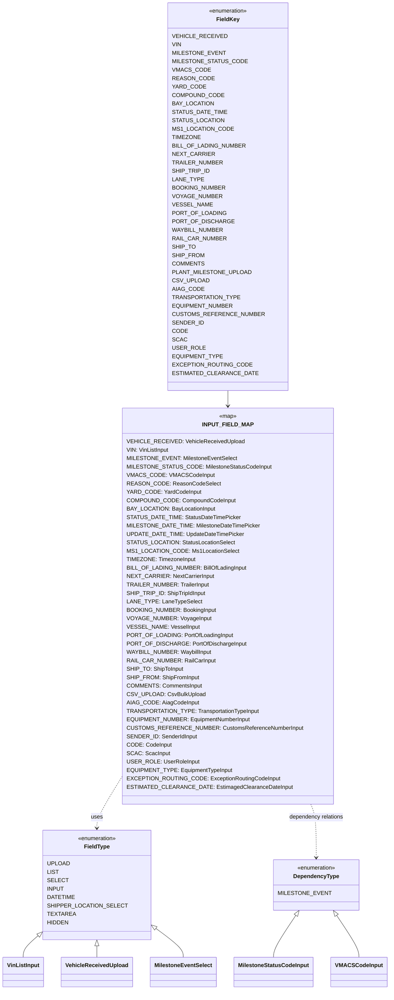

# Diagram: web/portal/src/pages/createmilestone/constants/CreateMilestone.const.js


> Auto-generated by Obscura crawlers

## Diagram 1



### SVG

<svg id="container" width="1070.53125" xmlns="http://www.w3.org/2000/svg" class="classDiagram" height="2818" viewBox="0 0 1070.53125 2818" role="graphics-document document" aria-roledescription="class"><style>#container{font-family:"trebuchet ms",verdana,arial,sans-serif;font-size:16px;fill:#333;}@keyframes edge-animation-frame{from{stroke-dashoffset:0;}}@keyframes dash{to{stroke-dashoffset:0;}}#container .edge-animation-slow{stroke-dasharray:9,5!important;stroke-dashoffset:900;animation:dash 50s linear infinite;stroke-linecap:round;}#container .edge-animation-fast{stroke-dasharray:9,5!important;stroke-dashoffset:900;animation:dash 20s linear infinite;stroke-linecap:round;}#container .error-icon{fill:#552222;}#container .error-text{fill:#552222;stroke:#552222;}#container .edge-thickness-normal{stroke-width:1px;}#container .edge-thickness-thick{stroke-width:3.5px;}#container .edge-pattern-solid{stroke-dasharray:0;}#container .edge-thickness-invisible{stroke-width:0;fill:none;}#container .edge-pattern-dashed{stroke-dasharray:3;}#container .edge-pattern-dotted{stroke-dasharray:2;}#container .marker{fill:#333333;stroke:#333333;}#container .marker.cross{stroke:#333333;}#container svg{font-family:"trebuchet ms",verdana,arial,sans-serif;font-size:16px;}#container p{margin:0;}#container g.classGroup text{fill:#9370DB;stroke:none;font-family:"trebuchet ms",verdana,arial,sans-serif;font-size:10px;}#container g.classGroup text .title{font-weight:bolder;}#container .nodeLabel,#container .edgeLabel{color:#131300;}#container .edgeLabel .label rect{fill:#ECECFF;}#container .label text{fill:#131300;}#container .labelBkg{background:#ECECFF;}#container .edgeLabel .label span{background:#ECECFF;}#container .classTitle{font-weight:bolder;}#container .node rect,#container .node circle,#container .node ellipse,#container .node polygon,#container .node path{fill:#ECECFF;stroke:#9370DB;stroke-width:1px;}#container .divider{stroke:#9370DB;stroke-width:1;}#container g.clickable{cursor:pointer;}#container g.classGroup rect{fill:#ECECFF;stroke:#9370DB;}#container g.classGroup line{stroke:#9370DB;stroke-width:1;}#container .classLabel .box{stroke:none;stroke-width:0;fill:#ECECFF;opacity:0.5;}#container .classLabel .label{fill:#9370DB;font-size:10px;}#container .relation{stroke:#333333;stroke-width:1;fill:none;}#container .dashed-line{stroke-dasharray:3;}#container .dotted-line{stroke-dasharray:1 2;}#container #compositionStart,#container .composition{fill:#333333!important;stroke:#333333!important;stroke-width:1;}#container #compositionEnd,#container .composition{fill:#333333!important;stroke:#333333!important;stroke-width:1;}#container #dependencyStart,#container .dependency{fill:#333333!important;stroke:#333333!important;stroke-width:1;}#container #dependencyStart,#container .dependency{fill:#333333!important;stroke:#333333!important;stroke-width:1;}#container #extensionStart,#container .extension{fill:transparent!important;stroke:#333333!important;stroke-width:1;}#container #extensionEnd,#container .extension{fill:transparent!important;stroke:#333333!important;stroke-width:1;}#container #aggregationStart,#container .aggregation{fill:transparent!important;stroke:#333333!important;stroke-width:1;}#container #aggregationEnd,#container .aggregation{fill:transparent!important;stroke:#333333!important;stroke-width:1;}#container #lollipopStart,#container .lollipop{fill:#ECECFF!important;stroke:#333333!important;stroke-width:1;}#container #lollipopEnd,#container .lollipop{fill:#ECECFF!important;stroke:#333333!important;stroke-width:1;}#container .edgeTerminals{font-size:11px;line-height:initial;}#container .classTitleText{text-anchor:middle;font-size:18px;fill:#333;}#container .label-icon{display:inline-block;height:1em;overflow:visible;vertical-align:-0.125em;}#container .node .label-icon path{fill:currentColor;stroke:revert;stroke-width:revert;}#container :root{--mermaid-font-family:"trebuchet ms",verdana,arial,sans-serif;}</style><g><defs><marker id="container_class-aggregationStart" class="marker aggregation class" refX="18" refY="7" markerWidth="190" markerHeight="240" orient="auto"><path d="M 18,7 L9,13 L1,7 L9,1 Z"></path></marker></defs><defs><marker id="container_class-aggregationEnd" class="marker aggregation class" refX="1" refY="7" markerWidth="20" markerHeight="28" orient="auto"><path d="M 18,7 L9,13 L1,7 L9,1 Z"></path></marker></defs><defs><marker id="container_class-extensionStart" class="marker extension class" refX="18" refY="7" markerWidth="190" markerHeight="240" orient="auto"><path d="M 1,7 L18,13 V 1 Z"></path></marker></defs><defs><marker id="container_class-extensionEnd" class="marker extension class" refX="1" refY="7" markerWidth="20" markerHeight="28" orient="auto"><path d="M 1,1 V 13 L18,7 Z"></path></marker></defs><defs><marker id="container_class-compositionStart" class="marker composition class" refX="18" refY="7" markerWidth="190" markerHeight="240" orient="auto"><path d="M 18,7 L9,13 L1,7 L9,1 Z"></path></marker></defs><defs><marker id="container_class-compositionEnd" class="marker composition class" refX="1" refY="7" markerWidth="20" markerHeight="28" orient="auto"><path d="M 18,7 L9,13 L1,7 L9,1 Z"></path></marker></defs><defs><marker id="container_class-dependencyStart" class="marker dependency class" refX="6" refY="7" markerWidth="190" markerHeight="240" orient="auto"><path d="M 5,7 L9,13 L1,7 L9,1 Z"></path></marker></defs><defs><marker id="container_class-dependencyEnd" class="marker dependency class" refX="13" refY="7" markerWidth="20" markerHeight="28" orient="auto"><path d="M 18,7 L9,13 L14,7 L9,1 Z"></path></marker></defs><defs><marker id="container_class-lollipopStart" class="marker lollipop class" refX="13" refY="7" markerWidth="190" markerHeight="240" orient="auto"><circle stroke="black" fill="transparent" cx="7" cy="7" r="6"></circle></marker></defs><defs><marker id="container_class-lollipopEnd" class="marker lollipop class" refX="1" refY="7" markerWidth="190" markerHeight="240" orient="auto"><circle stroke="black" fill="transparent" cx="7" cy="7" r="6"></circle></marker></defs><g class="root"><g class="clusters"></g><g class="edgePaths"><path d="M627.875,1112L627.875,1116.167C627.875,1120.333,627.875,1128.667,627.875,1136C627.875,1143.333,627.875,1149.667,627.875,1152.833L627.875,1156" id="id_FieldKey_INPUT_FIELD_MAP_1" class="edge-thickness-normal edge-pattern-solid relation" style=";;;" data-edge="true" data-et="edge" data-id="id_FieldKey_INPUT_FIELD_MAP_1" data-points="W3sieCI6NjI3Ljg3NSwieSI6MTExMn0seyJ4Ijo2MjcuODc1LCJ5IjoxMTM3fSx7IngiOjYyNy44NzUsInkiOjExNjJ9XQ==" marker-end="url(#container_class-dependencyEnd)"></path><path d="M115.393,2655.379L106.852,2662.983C98.312,2670.586,81.23,2685.793,72.689,2697.563C64.148,2709.333,64.148,2717.667,64.148,2721.833L64.148,2726" id="id_FieldType_VinListInput_2" class="edge-thickness-normal edge-pattern-solid relation" style=";;;" data-edge="true" data-et="edge" data-id="id_FieldType_VinListInput_2" data-points="W3sieCI6MTI4LjI3NzM0Mzc1LCJ5IjoyNjQzLjkwODkxMTAwNTIyNn0seyJ4Ijo2NC4xNDg0Mzc1LCJ5IjoyNzAxfSx7IngiOjY0LjE0ODQzNzUsInkiOjI3MjZ9XQ==" marker-start="url(#container_class-extensionStart)"></path><path d="M267.461,2693.25L267.461,2694.542C267.461,2695.833,267.461,2698.417,267.461,2703.875C267.461,2709.333,267.461,2717.667,267.461,2721.833L267.461,2726" id="id_FieldType_VehicleReceivedUpload_3" class="edge-thickness-normal edge-pattern-solid relation" style=";;;" data-edge="true" data-et="edge" data-id="id_FieldType_VehicleReceivedUpload_3" data-points="W3sieCI6MjY3LjQ2MDkzNzUsInkiOjI2NzZ9LHsieCI6MjY3LjQ2MDkzNzUsInkiOjI3MDF9LHsieCI6MjY3LjQ2MDkzNzUsInkiOjI3MjZ9XQ==" marker-start="url(#container_class-extensionStart)"></path><path d="M420.372,2636.362L434.529,2647.135C448.685,2657.908,476.999,2679.454,491.156,2694.394C505.313,2709.333,505.313,2717.667,505.313,2721.833L505.313,2726" id="id_FieldType_MilestoneEventSelect_4" class="edge-thickness-normal edge-pattern-solid relation" style=";;;" data-edge="true" data-et="edge" data-id="id_FieldType_MilestoneEventSelect_4" data-points="W3sieCI6NDA2LjY0NDUzMTI1LCJ5IjoyNjI1LjkxNTc2NjEzNTY1NDR9LHsieCI6NTA1LjMxMjUsInkiOjI3MDF9LHsieCI6NTA1LjMxMjUsInkiOjI3MjZ9XQ==" marker-start="url(#container_class-extensionStart)"></path><path d="M815.917,2606.5L805.768,2622.25C795.619,2638,775.321,2669.5,765.172,2689.417C755.023,2709.333,755.023,2717.667,755.023,2721.833L755.023,2726" id="id_DependencyType_MilestoneStatusCodeInput_5" class="edge-thickness-normal edge-pattern-solid relation" style=";;;" data-edge="true" data-et="edge" data-id="id_DependencyType_MilestoneStatusCodeInput_5" data-points="W3sieCI6ODI1LjI2MDg3NzA3MTgyMzIsInkiOjI1OTJ9LHsieCI6NzU1LjAyMzQzNzUsInkiOjI3MDF9LHsieCI6NzU1LjAyMzQzNzUsInkiOjI3MjZ9XQ==" marker-start="url(#container_class-extensionStart)"></path><path d="M927.395,2606.5L937.544,2622.25C947.693,2638,967.991,2669.5,978.14,2689.417C988.289,2709.333,988.289,2717.667,988.289,2721.833L988.289,2726" id="id_DependencyType_VMACSCodeInput_6" class="edge-thickness-normal edge-pattern-solid relation" style=";;;" data-edge="true" data-et="edge" data-id="id_DependencyType_VMACSCodeInput_6" data-points="W3sieCI6OTE4LjA1MTYyMjkyODE3NjgsInkiOjI1OTJ9LHsieCI6OTg4LjI4OTA2MjUsInkiOjI3MDF9LHsieCI6OTg4LjI4OTA2MjUsInkiOjI3MjZ9XQ==" marker-start="url(#container_class-extensionStart)"></path><path d="M350.668,2188.25L336.8,2211.375C322.932,2234.5,295.197,2280.75,281.329,2309.042C267.461,2337.333,267.461,2347.667,267.461,2352.833L267.461,2358" id="id_INPUT_FIELD_MAP_FieldType_7" class="edge-thickness-normal edge-pattern-dashed relation" style=";;;" data-edge="true" data-et="edge" data-id="id_INPUT_FIELD_MAP_FieldType_7" data-points="W3sieCI6MzUwLjY2Nzk2ODc1LCJ5IjoyMTg4LjI1MDA3MDQ0ODQ4Nn0seyJ4IjoyNjcuNDYwOTM3NSwieSI6MjMyN30seyJ4IjoyNjcuNDYwOTM3NSwieSI6MjM2NH1d" marker-end="url(#container_class-dependencyEnd)"></path><path d="M856.648,2290L859.149,2296.167C861.651,2302.333,866.654,2314.667,869.155,2340C871.656,2365.333,871.656,2403.667,871.656,2422.833L871.656,2442" id="id_INPUT_FIELD_MAP_DependencyType_8" class="edge-thickness-normal edge-pattern-dashed relation" style=";;;" data-edge="true" data-et="edge" data-id="id_INPUT_FIELD_MAP_DependencyType_8" data-points="W3sieCI6ODU2LjY0ODA4NjUyMjQ2MjYsInkiOjIyOTB9LHsieCI6ODcxLjY1NjI1LCJ5IjoyMzI3fSx7IngiOjg3MS42NTYyNSwieSI6MjQ0OH1d" marker-end="url(#container_class-dependencyEnd)"></path></g><g class="edgeLabels"><g class="edgeLabel"><g class="label" data-id="id_FieldKey_INPUT_FIELD_MAP_1" transform="translate(0, 0)"><foreignObject width="0" height="0"><div xmlns="http://www.w3.org/1999/xhtml" class="labelBkg" style="display: table-cell; white-space: nowrap; line-height: 1.5; max-width: 200px; text-align: center;"><span class="edgeLabel"></span></div></foreignObject></g></g><g class="edgeLabel"><g class="label" data-id="id_FieldType_VinListInput_2" transform="translate(0, 0)"><foreignObject width="0" height="0"><div xmlns="http://www.w3.org/1999/xhtml" class="labelBkg" style="display: table-cell; white-space: nowrap; line-height: 1.5; max-width: 200px; text-align: center;"><span class="edgeLabel"></span></div></foreignObject></g></g><g class="edgeLabel"><g class="label" data-id="id_FieldType_VehicleReceivedUpload_3" transform="translate(0, 0)"><foreignObject width="0" height="0"><div xmlns="http://www.w3.org/1999/xhtml" class="labelBkg" style="display: table-cell; white-space: nowrap; line-height: 1.5; max-width: 200px; text-align: center;"><span class="edgeLabel"></span></div></foreignObject></g></g><g class="edgeLabel"><g class="label" data-id="id_FieldType_MilestoneEventSelect_4" transform="translate(0, 0)"><foreignObject width="0" height="0"><div xmlns="http://www.w3.org/1999/xhtml" class="labelBkg" style="display: table-cell; white-space: nowrap; line-height: 1.5; max-width: 200px; text-align: center;"><span class="edgeLabel"></span></div></foreignObject></g></g><g class="edgeLabel"><g class="label" data-id="id_DependencyType_MilestoneStatusCodeInput_5" transform="translate(0, 0)"><foreignObject width="0" height="0"><div xmlns="http://www.w3.org/1999/xhtml" class="labelBkg" style="display: table-cell; white-space: nowrap; line-height: 1.5; max-width: 200px; text-align: center;"><span class="edgeLabel"></span></div></foreignObject></g></g><g class="edgeLabel"><g class="label" data-id="id_DependencyType_VMACSCodeInput_6" transform="translate(0, 0)"><foreignObject width="0" height="0"><div xmlns="http://www.w3.org/1999/xhtml" class="labelBkg" style="display: table-cell; white-space: nowrap; line-height: 1.5; max-width: 200px; text-align: center;"><span class="edgeLabel"></span></div></foreignObject></g></g><g class="edgeLabel" transform="translate(267.4609375, 2327)"><g class="label" data-id="id_INPUT_FIELD_MAP_FieldType_7" transform="translate(-16.4921875, -12)"><foreignObject width="32.984375" height="24"><div xmlns="http://www.w3.org/1999/xhtml" class="labelBkg" style="display: table-cell; white-space: nowrap; line-height: 1.5; max-width: 200px; text-align: center;"><span class="edgeLabel"><p>uses</p></span></div></foreignObject></g></g><g class="edgeLabel" transform="translate(871.65625, 2327)"><g class="label" data-id="id_INPUT_FIELD_MAP_DependencyType_8" transform="translate(-78.765625, -12)"><foreignObject width="157.53125" height="24"><div xmlns="http://www.w3.org/1999/xhtml" class="labelBkg" style="display: table-cell; white-space: nowrap; line-height: 1.5; max-width: 200px; text-align: center;"><span class="edgeLabel"><p>dependency relations</p></span></div></foreignObject></g></g></g><g class="nodes"><g class="node default" id="classId-FieldKey-0" transform="translate(627.875, 560)"><g class="basic label-container"><path d="M-153.12890625 -552 L153.12890625 -552 L153.12890625 552 L-153.12890625 552" stroke="none" stroke-width="0" fill="#ECECFF" style=""></path><path d="M-153.12890625 -552 C-34.143333096229554 -552, 84.84224005754089 -552, 153.12890625 -552 M-153.12890625 -552 C-75.13865290222145 -552, 2.8516004455570965 -552, 153.12890625 -552 M153.12890625 -552 C153.12890625 -164.51779584508955, 153.12890625 222.9644083098209, 153.12890625 552 M153.12890625 -552 C153.12890625 -149.67160692209637, 153.12890625 252.65678615580725, 153.12890625 552 M153.12890625 552 C76.3922299423098 552, -0.3444463653804064 552, -153.12890625 552 M153.12890625 552 C38.394048987375726 552, -76.34080827524855 552, -153.12890625 552 M-153.12890625 552 C-153.12890625 120.45089744309433, -153.12890625 -311.09820511381133, -153.12890625 -552 M-153.12890625 552 C-153.12890625 118.73875212688421, -153.12890625 -314.5224957462316, -153.12890625 -552" stroke="#9370DB" stroke-width="1.3" fill="none" stroke-dasharray="0 0" style=""></path></g><g class="annotation-group text" transform="translate(-55.5546875, -528)"><g class="label" style="" transform="translate(0,-12)"><foreignObject width="111.109375" height="24"><div xmlns="http://www.w3.org/1999/xhtml" style="display: table-cell; white-space: nowrap; line-height: 1.5; max-width: 161px; text-align: center;"><span class="nodeLabel markdown-node-label" style=""><p>«enumeration»</p></span></div></foreignObject></g></g><g class="label-group text" transform="translate(-30.890625, -504)"><g class="label" style="font-weight: bolder" transform="translate(0,-12)"><foreignObject width="61.78125" height="24"><div xmlns="http://www.w3.org/1999/xhtml" style="display: table-cell; white-space: nowrap; line-height: 1.5; max-width: 111px; text-align: center;"><span class="nodeLabel markdown-node-label" style=""><p>FieldKey</p></span></div></foreignObject></g></g><g class="members-group text" transform="translate(-141.12890625, -456)"><g class="label" style="" transform="translate(0,-12)"><foreignObject width="134.921875" height="24"><div xmlns="http://www.w3.org/1999/xhtml" style="display: table-cell; white-space: nowrap; line-height: 1.5; max-width: 185px; text-align: center;"><span class="nodeLabel markdown-node-label" style=""><p>VEHICLE_RECEIVED</p></span></div></foreignObject></g><g class="label" style="" transform="translate(0,12)"><foreignObject width="24.546875" height="24"><div xmlns="http://www.w3.org/1999/xhtml" style="display: table-cell; white-space: nowrap; line-height: 1.5; max-width: 75px; text-align: center;"><span class="nodeLabel markdown-node-label" style=""><p>VIN</p></span></div></foreignObject></g><g class="label" style="" transform="translate(0,36)"><foreignObject width="133.71875" height="24"><div xmlns="http://www.w3.org/1999/xhtml" style="display: table-cell; white-space: nowrap; line-height: 1.5; max-width: 184px; text-align: center;"><span class="nodeLabel markdown-node-label" style=""><p>MILESTONE_EVENT</p></span></div></foreignObject></g><g class="label" style="" transform="translate(0,60)"><foreignObject width="185.640625" height="24"><div xmlns="http://www.w3.org/1999/xhtml" style="display: table-cell; white-space: nowrap; line-height: 1.5; max-width: 236px; text-align: center;"><span class="nodeLabel markdown-node-label" style=""><p>MILESTONE_STATUS_CODE</p></span></div></foreignObject></g><g class="label" style="" transform="translate(0,84)"><foreignObject width="93.546875" height="24"><div xmlns="http://www.w3.org/1999/xhtml" style="display: table-cell; white-space: nowrap; line-height: 1.5; max-width: 144px; text-align: center;"><span class="nodeLabel markdown-node-label" style=""><p>VMACS_CODE</p></span></div></foreignObject></g><g class="label" style="" transform="translate(0,108)"><foreignObject width="104.390625" height="24"><div xmlns="http://www.w3.org/1999/xhtml" style="display: table-cell; white-space: nowrap; line-height: 1.5; max-width: 154px; text-align: center;"><span class="nodeLabel markdown-node-label" style=""><p>REASON_CODE</p></span></div></foreignObject></g><g class="label" style="" transform="translate(0,132)"><foreignObject width="82.796875" height="24"><div xmlns="http://www.w3.org/1999/xhtml" style="display: table-cell; white-space: nowrap; line-height: 1.5; max-width: 133px; text-align: center;"><span class="nodeLabel markdown-node-label" style=""><p>YARD_CODE</p></span></div></foreignObject></g><g class="label" style="" transform="translate(0,156)"><foreignObject width="129.859375" height="24"><div xmlns="http://www.w3.org/1999/xhtml" style="display: table-cell; white-space: nowrap; line-height: 1.5; max-width: 180px; text-align: center;"><span class="nodeLabel markdown-node-label" style=""><p>COMPOUND_CODE</p></span></div></foreignObject></g><g class="label" style="" transform="translate(0,180)"><foreignObject width="104.515625" height="24"><div xmlns="http://www.w3.org/1999/xhtml" style="display: table-cell; white-space: nowrap; line-height: 1.5; max-width: 155px; text-align: center;"><span class="nodeLabel markdown-node-label" style=""><p>BAY_LOCATION</p></span></div></foreignObject></g><g class="label" style="" transform="translate(0,204)"><foreignObject width="136.390625" height="24"><div xmlns="http://www.w3.org/1999/xhtml" style="display: table-cell; white-space: nowrap; line-height: 1.5; max-width: 186px; text-align: center;"><span class="nodeLabel markdown-node-label" style=""><p>STATUS_DATE_TIME</p></span></div></foreignObject></g><g class="label" style="" transform="translate(0,228)"><foreignObject width="130.171875" height="24"><div xmlns="http://www.w3.org/1999/xhtml" style="display: table-cell; white-space: nowrap; line-height: 1.5; max-width: 180px; text-align: center;"><span class="nodeLabel markdown-node-label" style=""><p>STATUS_LOCATION</p></span></div></foreignObject></g><g class="label" style="" transform="translate(0,252)"><foreignObject width="152.609375" height="24"><div xmlns="http://www.w3.org/1999/xhtml" style="display: table-cell; white-space: nowrap; line-height: 1.5; max-width: 203px; text-align: center;"><span class="nodeLabel markdown-node-label" style=""><p>MS1_LOCATION_CODE</p></span></div></foreignObject></g><g class="label" style="" transform="translate(0,276)"><foreignObject width="72.359375" height="24"><div xmlns="http://www.w3.org/1999/xhtml" style="display: table-cell; white-space: nowrap; line-height: 1.5; max-width: 122px; text-align: center;"><span class="nodeLabel markdown-node-label" style=""><p>TIMEZONE</p></span></div></foreignObject></g><g class="label" style="" transform="translate(0,300)"><foreignObject width="187.15625" height="24"><div xmlns="http://www.w3.org/1999/xhtml" style="display: table-cell; white-space: nowrap; line-height: 1.5; max-width: 237px; text-align: center;"><span class="nodeLabel markdown-node-label" style=""><p>BILL_OF_LADING_NUMBER</p></span></div></foreignObject></g><g class="label" style="" transform="translate(0,324)"><foreignObject width="103.734375" height="24"><div xmlns="http://www.w3.org/1999/xhtml" style="display: table-cell; white-space: nowrap; line-height: 1.5; max-width: 154px; text-align: center;"><span class="nodeLabel markdown-node-label" style=""><p>NEXT_CARRIER</p></span></div></foreignObject></g><g class="label" style="" transform="translate(0,348)"><foreignObject width="128.3125" height="24"><div xmlns="http://www.w3.org/1999/xhtml" style="display: table-cell; white-space: nowrap; line-height: 1.5; max-width: 179px; text-align: center;"><span class="nodeLabel markdown-node-label" style=""><p>TRAILER_NUMBER</p></span></div></foreignObject></g><g class="label" style="" transform="translate(0,372)"><foreignObject width="93.25" height="24"><div xmlns="http://www.w3.org/1999/xhtml" style="display: table-cell; white-space: nowrap; line-height: 1.5; max-width: 143px; text-align: center;"><span class="nodeLabel markdown-node-label" style=""><p>SHIP_TRIP_ID</p></span></div></foreignObject></g><g class="label" style="" transform="translate(0,396)"><foreignObject width="79.078125" height="24"><div xmlns="http://www.w3.org/1999/xhtml" style="display: table-cell; white-space: nowrap; line-height: 1.5; max-width: 129px; text-align: center;"><span class="nodeLabel markdown-node-label" style=""><p>LANE_TYPE</p></span></div></foreignObject></g><g class="label" style="" transform="translate(0,420)"><foreignObject width="137.296875" height="24"><div xmlns="http://www.w3.org/1999/xhtml" style="display: table-cell; white-space: nowrap; line-height: 1.5; max-width: 188px; text-align: center;"><span class="nodeLabel markdown-node-label" style=""><p>BOOKING_NUMBER</p></span></div></foreignObject></g><g class="label" style="" transform="translate(0,444)"><foreignObject width="125.34375" height="24"><div xmlns="http://www.w3.org/1999/xhtml" style="display: table-cell; white-space: nowrap; line-height: 1.5; max-width: 176px; text-align: center;"><span class="nodeLabel markdown-node-label" style=""><p>VOYAGE_NUMBER</p></span></div></foreignObject></g><g class="label" style="" transform="translate(0,468)"><foreignObject width="100.5" height="24"><div xmlns="http://www.w3.org/1999/xhtml" style="display: table-cell; white-space: nowrap; line-height: 1.5; max-width: 151px; text-align: center;"><span class="nodeLabel markdown-node-label" style=""><p>VESSEL_NAME</p></span></div></foreignObject></g><g class="label" style="" transform="translate(0,492)"><foreignObject width="133.90625" height="24"><div xmlns="http://www.w3.org/1999/xhtml" style="display: table-cell; white-space: nowrap; line-height: 1.5; max-width: 184px; text-align: center;"><span class="nodeLabel markdown-node-label" style=""><p>PORT_OF_LOADING</p></span></div></foreignObject></g><g class="label" style="" transform="translate(0,516)"><foreignObject width="151.484375" height="24"><div xmlns="http://www.w3.org/1999/xhtml" style="display: table-cell; white-space: nowrap; line-height: 1.5; max-width: 201px; text-align: center;"><span class="nodeLabel markdown-node-label" style=""><p>PORT_OF_DISCHARGE</p></span></div></foreignObject></g><g class="label" style="" transform="translate(0,540)"><foreignObject width="131.046875" height="24"><div xmlns="http://www.w3.org/1999/xhtml" style="display: table-cell; white-space: nowrap; line-height: 1.5; max-width: 181px; text-align: center;"><span class="nodeLabel markdown-node-label" style=""><p>WAYBILL_NUMBER</p></span></div></foreignObject></g><g class="label" style="" transform="translate(0,564)"><foreignObject width="137.28125" height="24"><div xmlns="http://www.w3.org/1999/xhtml" style="display: table-cell; white-space: nowrap; line-height: 1.5; max-width: 188px; text-align: center;"><span class="nodeLabel markdown-node-label" style=""><p>RAIL_CAR_NUMBER</p></span></div></foreignObject></g><g class="label" style="" transform="translate(0,588)"><foreignObject width="58.328125" height="24"><div xmlns="http://www.w3.org/1999/xhtml" style="display: table-cell; white-space: nowrap; line-height: 1.5; max-width: 108px; text-align: center;"><span class="nodeLabel markdown-node-label" style=""><p>SHIP_TO</p></span></div></foreignObject></g><g class="label" style="" transform="translate(0,612)"><foreignObject width="81.140625" height="24"><div xmlns="http://www.w3.org/1999/xhtml" style="display: table-cell; white-space: nowrap; line-height: 1.5; max-width: 131px; text-align: center;"><span class="nodeLabel markdown-node-label" style=""><p>SHIP_FROM</p></span></div></foreignObject></g><g class="label" style="" transform="translate(0,636)"><foreignObject width="80.65625" height="24"><div xmlns="http://www.w3.org/1999/xhtml" style="display: table-cell; white-space: nowrap; line-height: 1.5; max-width: 131px; text-align: center;"><span class="nodeLabel markdown-node-label" style=""><p>COMMENTS</p></span></div></foreignObject></g><g class="label" style="" transform="translate(0,660)"><foreignObject width="198.703125" height="24"><div xmlns="http://www.w3.org/1999/xhtml" style="display: table-cell; white-space: nowrap; line-height: 1.5; max-width: 249px; text-align: center;"><span class="nodeLabel markdown-node-label" style=""><p>PLANT_MILESTONE_UPLOAD</p></span></div></foreignObject></g><g class="label" style="" transform="translate(0,684)"><foreignObject width="90.65625" height="24"><div xmlns="http://www.w3.org/1999/xhtml" style="display: table-cell; white-space: nowrap; line-height: 1.5; max-width: 141px; text-align: center;"><span class="nodeLabel markdown-node-label" style=""><p>CSV_UPLOAD</p></span></div></foreignObject></g><g class="label" style="" transform="translate(0,708)"><foreignObject width="79.25" height="24"><div xmlns="http://www.w3.org/1999/xhtml" style="display: table-cell; white-space: nowrap; line-height: 1.5; max-width: 129px; text-align: center;"><span class="nodeLabel markdown-node-label" style=""><p>AIAG_CODE</p></span></div></foreignObject></g><g class="label" style="" transform="translate(0,732)"><foreignObject width="169.78125" height="24"><div xmlns="http://www.w3.org/1999/xhtml" style="display: table-cell; white-space: nowrap; line-height: 1.5; max-width: 220px; text-align: center;"><span class="nodeLabel markdown-node-label" style=""><p>TRANSPORTATION_TYPE</p></span></div></foreignObject></g><g class="label" style="" transform="translate(0,756)"><foreignObject width="153.21875" height="24"><div xmlns="http://www.w3.org/1999/xhtml" style="display: table-cell; white-space: nowrap; line-height: 1.5; max-width: 204px; text-align: center;"><span class="nodeLabel markdown-node-label" style=""><p>EQUIPMENT_NUMBER</p></span></div></foreignObject></g><g class="label" style="" transform="translate(0,780)"><foreignObject width="226.703125" height="24"><div xmlns="http://www.w3.org/1999/xhtml" style="display: table-cell; white-space: nowrap; line-height: 1.5; max-width: 277px; text-align: center;"><span class="nodeLabel markdown-node-label" style=""><p>CUSTOMS_REFERENCE_NUMBER</p></span></div></foreignObject></g><g class="label" style="" transform="translate(0,804)"><foreignObject width="80.109375" height="24"><div xmlns="http://www.w3.org/1999/xhtml" style="display: table-cell; white-space: nowrap; line-height: 1.5; max-width: 130px; text-align: center;"><span class="nodeLabel markdown-node-label" style=""><p>SENDER_ID</p></span></div></foreignObject></g><g class="label" style="" transform="translate(0,828)"><foreignObject width="38.578125" height="24"><div xmlns="http://www.w3.org/1999/xhtml" style="display: table-cell; white-space: nowrap; line-height: 1.5; max-width: 89px; text-align: center;"><span class="nodeLabel markdown-node-label" style=""><p>CODE</p></span></div></foreignObject></g><g class="label" style="" transform="translate(0,852)"><foreignObject width="35.65625" height="24"><div xmlns="http://www.w3.org/1999/xhtml" style="display: table-cell; white-space: nowrap; line-height: 1.5; max-width: 86px; text-align: center;"><span class="nodeLabel markdown-node-label" style=""><p>SCAC</p></span></div></foreignObject></g><g class="label" style="" transform="translate(0,876)"><foreignObject width="82.90625" height="24"><div xmlns="http://www.w3.org/1999/xhtml" style="display: table-cell; white-space: nowrap; line-height: 1.5; max-width: 133px; text-align: center;"><span class="nodeLabel markdown-node-label" style=""><p>USER_ROLE</p></span></div></foreignObject></g><g class="label" style="" transform="translate(0,900)"><foreignObject width="125.421875" height="24"><div xmlns="http://www.w3.org/1999/xhtml" style="display: table-cell; white-space: nowrap; line-height: 1.5; max-width: 175px; text-align: center;"><span class="nodeLabel markdown-node-label" style=""><p>EQUIPMENT_TYPE</p></span></div></foreignObject></g><g class="label" style="" transform="translate(0,924)"><foreignObject width="198.1875" height="24"><div xmlns="http://www.w3.org/1999/xhtml" style="display: table-cell; white-space: nowrap; line-height: 1.5; max-width: 248px; text-align: center;"><span class="nodeLabel markdown-node-label" style=""><p>EXCEPTION_ROUTING_CODE</p></span></div></foreignObject></g><g class="label" style="" transform="translate(0,948)"><foreignObject width="210.375" height="24"><div xmlns="http://www.w3.org/1999/xhtml" style="display: table-cell; white-space: nowrap; line-height: 1.5; max-width: 260px; text-align: center;"><span class="nodeLabel markdown-node-label" style=""><p>ESTIMATED_CLEARANCE_DATE</p></span></div></foreignObject></g></g><g class="methods-group text" transform="translate(-141.12890625, 552)"></g><g class="divider" style=""><path d="M-153.12890625 -480 C-62.858622522948636 -480, 27.411661204102728 -480, 153.12890625 -480 M-153.12890625 -480 C-69.45337552334442 -480, 14.22215520331116 -480, 153.12890625 -480" stroke="#9370DB" stroke-width="1.3" fill="none" stroke-dasharray="0 0" style=""></path></g><g class="divider" style=""><path d="M-153.12890625 528 C-43.121365491796666 528, 66.88617526640667 528, 153.12890625 528 M-153.12890625 528 C-66.63998432147513 528, 19.84893760704975 528, 153.12890625 528" stroke="#9370DB" stroke-width="1.3" fill="none" stroke-dasharray="0 0" style=""></path></g></g><g class="node default" id="classId-FieldType-1" transform="translate(267.4609375, 2520)"><g class="basic label-container"><path d="M-139.18359375 -156 L139.18359375 -156 L139.18359375 156 L-139.18359375 156" stroke="none" stroke-width="0" fill="#ECECFF" style=""></path><path d="M-139.18359375 -156 C-40.09038470728228 -156, 59.002824335435434 -156, 139.18359375 -156 M-139.18359375 -156 C-71.36477280142127 -156, -3.545951852842535 -156, 139.18359375 -156 M139.18359375 -156 C139.18359375 -46.29527258819513, 139.18359375 63.409454823609735, 139.18359375 156 M139.18359375 -156 C139.18359375 -81.66093717658109, 139.18359375 -7.321874353162173, 139.18359375 156 M139.18359375 156 C29.962485355185805 156, -79.25862303962839 156, -139.18359375 156 M139.18359375 156 C40.911498800497625 156, -57.36059614900475 156, -139.18359375 156 M-139.18359375 156 C-139.18359375 81.3337686685174, -139.18359375 6.667537337034787, -139.18359375 -156 M-139.18359375 156 C-139.18359375 35.6316036187318, -139.18359375 -84.7367927625364, -139.18359375 -156" stroke="#9370DB" stroke-width="1.3" fill="none" stroke-dasharray="0 0" style=""></path></g><g class="annotation-group text" transform="translate(-55.5546875, -132)"><g class="label" style="" transform="translate(0,-12)"><foreignObject width="111.109375" height="24"><div xmlns="http://www.w3.org/1999/xhtml" style="display: table-cell; white-space: nowrap; line-height: 1.5; max-width: 161px; text-align: center;"><span class="nodeLabel markdown-node-label" style=""><p>«enumeration»</p></span></div></foreignObject></g></g><g class="label-group text" transform="translate(-34.8125, -108)"><g class="label" style="font-weight: bolder" transform="translate(0,-12)"><foreignObject width="69.625" height="24"><div xmlns="http://www.w3.org/1999/xhtml" style="display: table-cell; white-space: nowrap; line-height: 1.5; max-width: 118px; text-align: center;"><span class="nodeLabel markdown-node-label" style=""><p>FieldType</p></span></div></foreignObject></g></g><g class="members-group text" transform="translate(-127.18359375, -60)"><g class="label" style="" transform="translate(0,-12)"><foreignObject width="57.53125" height="24"><div xmlns="http://www.w3.org/1999/xhtml" style="display: table-cell; white-space: nowrap; line-height: 1.5; max-width: 108px; text-align: center;"><span class="nodeLabel markdown-node-label" style=""><p>UPLOAD</p></span></div></foreignObject></g><g class="label" style="" transform="translate(0,12)"><foreignObject width="29.328125" height="24"><div xmlns="http://www.w3.org/1999/xhtml" style="display: table-cell; white-space: nowrap; line-height: 1.5; max-width: 80px; text-align: center;"><span class="nodeLabel markdown-node-label" style=""><p>LIST</p></span></div></foreignObject></g><g class="label" style="" transform="translate(0,36)"><foreignObject width="50.703125" height="24"><div xmlns="http://www.w3.org/1999/xhtml" style="display: table-cell; white-space: nowrap; line-height: 1.5; max-width: 101px; text-align: center;"><span class="nodeLabel markdown-node-label" style=""><p>SELECT</p></span></div></foreignObject></g><g class="label" style="" transform="translate(0,60)"><foreignObject width="43.8125" height="24"><div xmlns="http://www.w3.org/1999/xhtml" style="display: table-cell; white-space: nowrap; line-height: 1.5; max-width: 95px; text-align: center;"><span class="nodeLabel markdown-node-label" style=""><p>INPUT</p></span></div></foreignObject></g><g class="label" style="" transform="translate(0,84)"><foreignObject width="69.359375" height="24"><div xmlns="http://www.w3.org/1999/xhtml" style="display: table-cell; white-space: nowrap; line-height: 1.5; max-width: 119px; text-align: center;"><span class="nodeLabel markdown-node-label" style=""><p>DATETIME</p></span></div></foreignObject></g><g class="label" style="" transform="translate(0,108)"><foreignObject width="198.8125" height="24"><div xmlns="http://www.w3.org/1999/xhtml" style="display: table-cell; white-space: nowrap; line-height: 1.5; max-width: 250px; text-align: center;"><span class="nodeLabel markdown-node-label" style=""><p>SHIPPER_LOCATION_SELECT</p></span></div></foreignObject></g><g class="label" style="" transform="translate(0,132)"><foreignObject width="69.53125" height="24"><div xmlns="http://www.w3.org/1999/xhtml" style="display: table-cell; white-space: nowrap; line-height: 1.5; max-width: 120px; text-align: center;"><span class="nodeLabel markdown-node-label" style=""><p>TEXTAREA</p></span></div></foreignObject></g><g class="label" style="" transform="translate(0,156)"><foreignObject width="55.703125" height="24"><div xmlns="http://www.w3.org/1999/xhtml" style="display: table-cell; white-space: nowrap; line-height: 1.5; max-width: 106px; text-align: center;"><span class="nodeLabel markdown-node-label" style=""><p>HIDDEN</p></span></div></foreignObject></g></g><g class="methods-group text" transform="translate(-127.18359375, 156)"></g><g class="divider" style=""><path d="M-139.18359375 -84 C-48.02863384328515 -84, 43.1263260634297 -84, 139.18359375 -84 M-139.18359375 -84 C-33.325843433784996 -84, 72.53190688243001 -84, 139.18359375 -84" stroke="#9370DB" stroke-width="1.3" fill="none" stroke-dasharray="0 0" style=""></path></g><g class="divider" style=""><path d="M-139.18359375 132 C-71.29385979199306 132, -3.4041258339861145 132, 139.18359375 132 M-139.18359375 132 C-57.21112094532569 132, 24.761351859348622 132, 139.18359375 132" stroke="#9370DB" stroke-width="1.3" fill="none" stroke-dasharray="0 0" style=""></path></g></g><g class="node default" id="classId-DependencyType-2" transform="translate(871.65625, 2520)"><g class="basic label-container"><path d="M-110.1484375 -72 L110.1484375 -72 L110.1484375 72 L-110.1484375 72" stroke="none" stroke-width="0" fill="#ECECFF" style=""></path><path d="M-110.1484375 -72 C-44.10817081861802 -72, 21.93209586276396 -72, 110.1484375 -72 M-110.1484375 -72 C-54.831012789609204 -72, 0.4864119207815918 -72, 110.1484375 -72 M110.1484375 -72 C110.1484375 -36.48233825182329, 110.1484375 -0.9646765036465865, 110.1484375 72 M110.1484375 -72 C110.1484375 -31.052718555446774, 110.1484375 9.894562889106453, 110.1484375 72 M110.1484375 72 C43.24145238527254 72, -23.665532729454924 72, -110.1484375 72 M110.1484375 72 C45.446446126326634 72, -19.25554524734673 72, -110.1484375 72 M-110.1484375 72 C-110.1484375 17.517858691346035, -110.1484375 -36.96428261730793, -110.1484375 -72 M-110.1484375 72 C-110.1484375 30.71904770128863, -110.1484375 -10.561904597422739, -110.1484375 -72" stroke="#9370DB" stroke-width="1.3" fill="none" stroke-dasharray="0 0" style=""></path></g><g class="annotation-group text" transform="translate(-55.5546875, -48)"><g class="label" style="" transform="translate(0,-12)"><foreignObject width="111.109375" height="24"><div xmlns="http://www.w3.org/1999/xhtml" style="display: table-cell; white-space: nowrap; line-height: 1.5; max-width: 161px; text-align: center;"><span class="nodeLabel markdown-node-label" style=""><p>«enumeration»</p></span></div></foreignObject></g></g><g class="label-group text" transform="translate(-62.578125, -24)"><g class="label" style="font-weight: bolder" transform="translate(0,-12)"><foreignObject width="125.15625" height="24"><div xmlns="http://www.w3.org/1999/xhtml" style="display: table-cell; white-space: nowrap; line-height: 1.5; max-width: 174px; text-align: center;"><span class="nodeLabel markdown-node-label" style=""><p>DependencyType</p></span></div></foreignObject></g></g><g class="members-group text" transform="translate(-98.1484375, 24)"><g class="label" style="" transform="translate(0,-12)"><foreignObject width="133.71875" height="24"><div xmlns="http://www.w3.org/1999/xhtml" style="display: table-cell; white-space: nowrap; line-height: 1.5; max-width: 184px; text-align: center;"><span class="nodeLabel markdown-node-label" style=""><p>MILESTONE_EVENT</p></span></div></foreignObject></g></g><g class="methods-group text" transform="translate(-98.1484375, 72)"></g><g class="divider" style=""><path d="M-110.1484375 0 C-41.02222990222319 0, 28.103977695553624 0, 110.1484375 0 M-110.1484375 0 C-30.660740765880107 0, 48.82695596823979 0, 110.1484375 0" stroke="#9370DB" stroke-width="1.3" fill="none" stroke-dasharray="0 0" style=""></path></g><g class="divider" style=""><path d="M-110.1484375 48 C-26.85050573006177 48, 56.44742603987646 48, 110.1484375 48 M-110.1484375 48 C-43.847950200891376 48, 22.45253709821725 48, 110.1484375 48" stroke="#9370DB" stroke-width="1.3" fill="none" stroke-dasharray="0 0" style=""></path></g></g><g class="node default" id="classId-INPUT_FIELD_MAP-3" transform="translate(627.875, 1726)"><g class="basic label-container"><path d="M-277.20703125 -564 L277.20703125 -564 L277.20703125 564 L-277.20703125 564" stroke="none" stroke-width="0" fill="#ECECFF" style=""></path><path d="M-277.20703125 -564 C-112.25893675176329 -564, 52.68915774647343 -564, 277.20703125 -564 M-277.20703125 -564 C-114.55175174331626 -564, 48.10352776336748 -564, 277.20703125 -564 M277.20703125 -564 C277.20703125 -132.6243313229736, 277.20703125 298.7513373540528, 277.20703125 564 M277.20703125 -564 C277.20703125 -292.26497015179166, 277.20703125 -20.529940303583317, 277.20703125 564 M277.20703125 564 C87.91982933805727 564, -101.36737257388546 564, -277.20703125 564 M277.20703125 564 C160.16617813285583 564, 43.12532501571167 564, -277.20703125 564 M-277.20703125 564 C-277.20703125 169.22025941384874, -277.20703125 -225.55948117230253, -277.20703125 -564 M-277.20703125 564 C-277.20703125 268.74195488215474, -277.20703125 -26.516090235690513, -277.20703125 -564" stroke="#9370DB" stroke-width="1.3" fill="none" stroke-dasharray="0 0" style=""></path></g><g class="annotation-group text" transform="translate(-24.9296875, -540)"><g class="label" style="" transform="translate(0,-12)"><foreignObject width="49.859375" height="24"><div xmlns="http://www.w3.org/1999/xhtml" style="display: table-cell; white-space: nowrap; line-height: 1.5; max-width: 100px; text-align: center;"><span class="nodeLabel markdown-node-label" style=""><p>«map»</p></span></div></foreignObject></g></g><g class="label-group text" transform="translate(-65.1484375, -516)"><g class="label" style="font-weight: bolder" transform="translate(0,-12)"><foreignObject width="130.296875" height="24"><div xmlns="http://www.w3.org/1999/xhtml" style="display: table-cell; white-space: nowrap; line-height: 1.5; max-width: 179px; text-align: center;"><span class="nodeLabel markdown-node-label" style=""><p>INPUT_FIELD_MAP</p></span></div></foreignObject></g></g><g class="members-group text" transform="translate(-265.20703125, -468)"><g class="label" style="" transform="translate(0,-12)"><foreignObject width="312.0625" height="24"><div xmlns="http://www.w3.org/1999/xhtml" style="display: table-cell; white-space: nowrap; line-height: 1.5; max-width: 362px; text-align: center;"><span class="nodeLabel markdown-node-label" style=""><p>VEHICLE_RECEIVED: VehicleReceivedUpload</p></span></div></foreignObject></g><g class="label" style="" transform="translate(0,12)"><foreignObject width="119.828125" height="24"><div xmlns="http://www.w3.org/1999/xhtml" style="display: table-cell; white-space: nowrap; line-height: 1.5; max-width: 170px; text-align: center;"><span class="nodeLabel markdown-node-label" style=""><p>VIN: VinListInput</p></span></div></foreignObject></g><g class="label" style="" transform="translate(0,36)"><foreignObject width="296.015625" height="24"><div xmlns="http://www.w3.org/1999/xhtml" style="display: table-cell; white-space: nowrap; line-height: 1.5; max-width: 346px; text-align: center;"><span class="nodeLabel markdown-node-label" style=""><p>MILESTONE_EVENT: MilestoneEventSelect</p></span></div></foreignObject></g><g class="label" style="" transform="translate(0,60)"><foreignObject width="385.0625" height="24"><div xmlns="http://www.w3.org/1999/xhtml" style="display: table-cell; white-space: nowrap; line-height: 1.5; max-width: 435px; text-align: center;"><span class="nodeLabel markdown-node-label" style=""><p>MILESTONE_STATUS_CODE: MilestoneStatusCodeInput</p></span></div></foreignObject></g><g class="label" style="" transform="translate(0,84)"><foreignObject width="224.34375" height="24"><div xmlns="http://www.w3.org/1999/xhtml" style="display: table-cell; white-space: nowrap; line-height: 1.5; max-width: 275px; text-align: center;"><span class="nodeLabel markdown-node-label" style=""><p>VMACS_CODE: VMACSCodeInput</p></span></div></foreignObject></g><g class="label" style="" transform="translate(0,108)"><foreignObject width="245.671875" height="24"><div xmlns="http://www.w3.org/1999/xhtml" style="display: table-cell; white-space: nowrap; line-height: 1.5; max-width: 296px; text-align: center;"><span class="nodeLabel markdown-node-label" style=""><p>REASON_CODE: ReasonCodeSelect</p></span></div></foreignObject></g><g class="label" style="" transform="translate(0,132)"><foreignObject width="197.34375" height="24"><div xmlns="http://www.w3.org/1999/xhtml" style="display: table-cell; white-space: nowrap; line-height: 1.5; max-width: 248px; text-align: center;"><span class="nodeLabel markdown-node-label" style=""><p>YARD_CODE: YardCodeInput</p></span></div></foreignObject></g><g class="label" style="" transform="translate(0,156)"><foreignObject width="291.703125" height="24"><div xmlns="http://www.w3.org/1999/xhtml" style="display: table-cell; white-space: nowrap; line-height: 1.5; max-width: 342px; text-align: center;"><span class="nodeLabel markdown-node-label" style=""><p>COMPOUND_CODE: CompoundCodeInput</p></span></div></foreignObject></g><g class="label" style="" transform="translate(0,180)"><foreignObject width="239.46875" height="24"><div xmlns="http://www.w3.org/1999/xhtml" style="display: table-cell; white-space: nowrap; line-height: 1.5; max-width: 290px; text-align: center;"><span class="nodeLabel markdown-node-label" style=""><p>BAY_LOCATION: BayLocationInput</p></span></div></foreignObject></g><g class="label" style="" transform="translate(0,204)"><foreignObject width="302.84375" height="24"><div xmlns="http://www.w3.org/1999/xhtml" style="display: table-cell; white-space: nowrap; line-height: 1.5; max-width: 354px; text-align: center;"><span class="nodeLabel markdown-node-label" style=""><p>STATUS_DATE_TIME: StatusDateTimePicker</p></span></div></foreignObject></g><g class="label" style="" transform="translate(0,228)"><foreignObject width="356.90625" height="24"><div xmlns="http://www.w3.org/1999/xhtml" style="display: table-cell; white-space: nowrap; line-height: 1.5; max-width: 408px; text-align: center;"><span class="nodeLabel markdown-node-label" style=""><p>MILESTONE_DATE_TIME: MilestoneDateTimePicker</p></span></div></foreignObject></g><g class="label" style="" transform="translate(0,252)"><foreignObject width="313.84375" height="24"><div xmlns="http://www.w3.org/1999/xhtml" style="display: table-cell; white-space: nowrap; line-height: 1.5; max-width: 365px; text-align: center;"><span class="nodeLabel markdown-node-label" style=""><p>UPDATE_DATE_TIME: UpdateDateTimePicker</p></span></div></foreignObject></g><g class="label" style="" transform="translate(0,276)"><foreignObject width="290.203125" height="24"><div xmlns="http://www.w3.org/1999/xhtml" style="display: table-cell; white-space: nowrap; line-height: 1.5; max-width: 340px; text-align: center;"><span class="nodeLabel markdown-node-label" style=""><p>STATUS_LOCATION: StatusLocationSelect</p></span></div></foreignObject></g><g class="label" style="" transform="translate(0,300)"><foreignObject width="293.375" height="24"><div xmlns="http://www.w3.org/1999/xhtml" style="display: table-cell; white-space: nowrap; line-height: 1.5; max-width: 344px; text-align: center;"><span class="nodeLabel markdown-node-label" style=""><p>MS1_LOCATION_CODE: Ms1LocationSelect</p></span></div></foreignObject></g><g class="label" style="" transform="translate(0,324)"><foreignObject width="188.546875" height="24"><div xmlns="http://www.w3.org/1999/xhtml" style="display: table-cell; white-space: nowrap; line-height: 1.5; max-width: 239px; text-align: center;"><span class="nodeLabel markdown-node-label" style=""><p>TIMEZONE: TimezoneInput</p></span></div></foreignObject></g><g class="label" style="" transform="translate(0,348)"><foreignObject width="322.265625" height="24"><div xmlns="http://www.w3.org/1999/xhtml" style="display: table-cell; white-space: nowrap; line-height: 1.5; max-width: 372px; text-align: center;"><span class="nodeLabel markdown-node-label" style=""><p>BILL_OF_LADING_NUMBER: BillOfLadingInput</p></span></div></foreignObject></g><g class="label" style="" transform="translate(0,372)"><foreignObject width="232.8125" height="24"><div xmlns="http://www.w3.org/1999/xhtml" style="display: table-cell; white-space: nowrap; line-height: 1.5; max-width: 283px; text-align: center;"><span class="nodeLabel markdown-node-label" style=""><p>NEXT_CARRIER: NextCarrierInput</p></span></div></foreignObject></g><g class="label" style="" transform="translate(0,396)"><foreignObject width="221.203125" height="24"><div xmlns="http://www.w3.org/1999/xhtml" style="display: table-cell; white-space: nowrap; line-height: 1.5; max-width: 271px; text-align: center;"><span class="nodeLabel markdown-node-label" style=""><p>TRAILER_NUMBER: TrailerInput</p></span></div></foreignObject></g><g class="label" style="" transform="translate(0,420)"><foreignObject width="214.40625" height="24"><div xmlns="http://www.w3.org/1999/xhtml" style="display: table-cell; white-space: nowrap; line-height: 1.5; max-width: 265px; text-align: center;"><span class="nodeLabel markdown-node-label" style=""><p>SHIP_TRIP_ID: ShipTripIdInput</p></span></div></foreignObject></g><g class="label" style="" transform="translate(0,444)"><foreignObject width="199.6875" height="24"><div xmlns="http://www.w3.org/1999/xhtml" style="display: table-cell; white-space: nowrap; line-height: 1.5; max-width: 250px; text-align: center;"><span class="nodeLabel markdown-node-label" style=""><p>LANE_TYPE: LaneTypeSelect</p></span></div></foreignObject></g><g class="label" style="" transform="translate(0,468)"><foreignObject width="242.890625" height="24"><div xmlns="http://www.w3.org/1999/xhtml" style="display: table-cell; white-space: nowrap; line-height: 1.5; max-width: 293px; text-align: center;"><span class="nodeLabel markdown-node-label" style=""><p>BOOKING_NUMBER: BookingInput</p></span></div></foreignObject></g><g class="label" style="" transform="translate(0,492)"><foreignObject width="222.828125" height="24"><div xmlns="http://www.w3.org/1999/xhtml" style="display: table-cell; white-space: nowrap; line-height: 1.5; max-width: 273px; text-align: center;"><span class="nodeLabel markdown-node-label" style=""><p>VOYAGE_NUMBER: VoyageInput</p></span></div></foreignObject></g><g class="label" style="" transform="translate(0,516)"><foreignObject width="192.6875" height="24"><div xmlns="http://www.w3.org/1999/xhtml" style="display: table-cell; white-space: nowrap; line-height: 1.5; max-width: 243px; text-align: center;"><span class="nodeLabel markdown-node-label" style=""><p>VESSEL_NAME: VesselInput</p></span></div></foreignObject></g><g class="label" style="" transform="translate(0,540)"><foreignObject width="284.453125" height="24"><div xmlns="http://www.w3.org/1999/xhtml" style="display: table-cell; white-space: nowrap; line-height: 1.5; max-width: 335px; text-align: center;"><span class="nodeLabel markdown-node-label" style=""><p>PORT_OF_LOADING: PortOfLoadingInput</p></span></div></foreignObject></g><g class="label" style="" transform="translate(0,564)"><foreignObject width="315.53125" height="24"><div xmlns="http://www.w3.org/1999/xhtml" style="display: table-cell; white-space: nowrap; line-height: 1.5; max-width: 366px; text-align: center;"><span class="nodeLabel markdown-node-label" style=""><p>PORT_OF_DISCHARGE: PortOfDischargeInput</p></span></div></foreignObject></g><g class="label" style="" transform="translate(0,588)"><foreignObject width="230.28125" height="24"><div xmlns="http://www.w3.org/1999/xhtml" style="display: table-cell; white-space: nowrap; line-height: 1.5; max-width: 280px; text-align: center;"><span class="nodeLabel markdown-node-label" style=""><p>WAYBILL_NUMBER: WaybillInput</p></span></div></foreignObject></g><g class="label" style="" transform="translate(0,612)"><foreignObject width="235.15625" height="24"><div xmlns="http://www.w3.org/1999/xhtml" style="display: table-cell; white-space: nowrap; line-height: 1.5; max-width: 285px; text-align: center;"><span class="nodeLabel markdown-node-label" style=""><p>RAIL_CAR_NUMBER: RailCarInput</p></span></div></foreignObject></g><g class="label" style="" transform="translate(0,636)"><foreignObject width="153.9375" height="24"><div xmlns="http://www.w3.org/1999/xhtml" style="display: table-cell; white-space: nowrap; line-height: 1.5; max-width: 204px; text-align: center;"><span class="nodeLabel markdown-node-label" style=""><p>SHIP_TO: ShipToInput</p></span></div></foreignObject></g><g class="label" style="" transform="translate(0,660)"><foreignObject width="196.078125" height="24"><div xmlns="http://www.w3.org/1999/xhtml" style="display: table-cell; white-space: nowrap; line-height: 1.5; max-width: 246px; text-align: center;"><span class="nodeLabel markdown-node-label" style=""><p>SHIP_FROM: ShipFromInput</p></span></div></foreignObject></g><g class="label" style="" transform="translate(0,684)"><foreignObject width="204.1875" height="24"><div xmlns="http://www.w3.org/1999/xhtml" style="display: table-cell; white-space: nowrap; line-height: 1.5; max-width: 254px; text-align: center;"><span class="nodeLabel markdown-node-label" style=""><p>COMMENTS: CommentsInput</p></span></div></foreignObject></g><g class="label" style="" transform="translate(0,708)"><foreignObject width="206.640625" height="24"><div xmlns="http://www.w3.org/1999/xhtml" style="display: table-cell; white-space: nowrap; line-height: 1.5; max-width: 257px; text-align: center;"><span class="nodeLabel markdown-node-label" style=""><p>CSV_UPLOAD: CsvBulkUpload</p></span></div></foreignObject></g><g class="label" style="" transform="translate(0,732)"><foreignObject width="192.84375" height="24"><div xmlns="http://www.w3.org/1999/xhtml" style="display: table-cell; white-space: nowrap; line-height: 1.5; max-width: 243px; text-align: center;"><span class="nodeLabel markdown-node-label" style=""><p>AIAG_CODE: AiagCodeInput</p></span></div></foreignObject></g><g class="label" style="" transform="translate(0,756)"><foreignObject width="357.640625" height="24"><div xmlns="http://www.w3.org/1999/xhtml" style="display: table-cell; white-space: nowrap; line-height: 1.5; max-width: 408px; text-align: center;"><span class="nodeLabel markdown-node-label" style=""><p>TRANSPORTATION_TYPE: TransportationTypeInput</p></span></div></foreignObject></g><g class="label" style="" transform="translate(0,780)"><foreignObject width="337.0625" height="24"><div xmlns="http://www.w3.org/1999/xhtml" style="display: table-cell; white-space: nowrap; line-height: 1.5; max-width: 387px; text-align: center;"><span class="nodeLabel markdown-node-label" style=""><p>EQUIPMENT_NUMBER: EquipmentNumberInput</p></span></div></foreignObject></g><g class="label" style="" transform="translate(0,804)"><foreignObject width="465.265625" height="24"><div xmlns="http://www.w3.org/1999/xhtml" style="display: table-cell; white-space: nowrap; line-height: 1.5; max-width: 515px; text-align: center;"><span class="nodeLabel markdown-node-label" style=""><p>CUSTOMS_REFERENCE_NUMBER: CustomsReferenceNumberInput</p></span></div></foreignObject></g><g class="label" style="" transform="translate(0,828)"><foreignObject width="192.4375" height="24"><div xmlns="http://www.w3.org/1999/xhtml" style="display: table-cell; white-space: nowrap; line-height: 1.5; max-width: 243px; text-align: center;"><span class="nodeLabel markdown-node-label" style=""><p>SENDER_ID: SenderIdInput</p></span></div></foreignObject></g><g class="label" style="" transform="translate(0,852)"><foreignObject width="121.625" height="24"><div xmlns="http://www.w3.org/1999/xhtml" style="display: table-cell; white-space: nowrap; line-height: 1.5; max-width: 172px; text-align: center;"><span class="nodeLabel markdown-node-label" style=""><p>CODE: CodeInput</p></span></div></foreignObject></g><g class="label" style="" transform="translate(0,876)"><foreignObject width="114.984375" height="24"><div xmlns="http://www.w3.org/1999/xhtml" style="display: table-cell; white-space: nowrap; line-height: 1.5; max-width: 165px; text-align: center;"><span class="nodeLabel markdown-node-label" style=""><p>SCAC: ScacInput</p></span></div></foreignObject></g><g class="label" style="" transform="translate(0,900)"><foreignObject width="194.671875" height="24"><div xmlns="http://www.w3.org/1999/xhtml" style="display: table-cell; white-space: nowrap; line-height: 1.5; max-width: 245px; text-align: center;"><span class="nodeLabel markdown-node-label" style=""><p>USER_ROLE: UserRoleInput</p></span></div></foreignObject></g><g class="label" style="" transform="translate(0,924)"><foreignObject width="284.625" height="24"><div xmlns="http://www.w3.org/1999/xhtml" style="display: table-cell; white-space: nowrap; line-height: 1.5; max-width: 335px; text-align: center;"><span class="nodeLabel markdown-node-label" style=""><p>EQUIPMENT_TYPE: EquipmentTypeInput</p></span></div></foreignObject></g><g class="label" style="" transform="translate(0,948)"><foreignObject width="408.046875" height="24"><div xmlns="http://www.w3.org/1999/xhtml" style="display: table-cell; white-space: nowrap; line-height: 1.5; max-width: 458px; text-align: center;"><span class="nodeLabel markdown-node-label" style=""><p>EXCEPTION_ROUTING_CODE: ExceptionRoutingCodeInput</p></span></div></foreignObject></g><g class="label" style="" transform="translate(0,972)"><foreignObject width="435.515625" height="24"><div xmlns="http://www.w3.org/1999/xhtml" style="display: table-cell; white-space: nowrap; line-height: 1.5; max-width: 486px; text-align: center;"><span class="nodeLabel markdown-node-label" style=""><p>ESTIMATED_CLEARANCE_DATE: EstimagedClearanceDateInput</p></span></div></foreignObject></g></g><g class="methods-group text" transform="translate(-265.20703125, 564)"></g><g class="divider" style=""><path d="M-277.20703125 -492 C-128.28864052262102 -492, 20.629750204757954 -492, 277.20703125 -492 M-277.20703125 -492 C-143.4390465520419 -492, -9.671061854083803 -492, 277.20703125 -492" stroke="#9370DB" stroke-width="1.3" fill="none" stroke-dasharray="0 0" style=""></path></g><g class="divider" style=""><path d="M-277.20703125 540 C-77.4922708566902 540, 122.2224895366196 540, 277.20703125 540 M-277.20703125 540 C-71.42077752670824 540, 134.36547619658353 540, 277.20703125 540" stroke="#9370DB" stroke-width="1.3" fill="none" stroke-dasharray="0 0" style=""></path></g></g><g class="node default" id="classId-VinListInput-4" transform="translate(64.1484375, 2768)"><g class="basic label-container"><path d="M-56.1484375 -42 L56.1484375 -42 L56.1484375 42 L-56.1484375 42" stroke="none" stroke-width="0" fill="#ECECFF" style=""></path><path d="M-56.1484375 -42 C-18.39779567752779 -42, 19.352846144944422 -42, 56.1484375 -42 M-56.1484375 -42 C-29.592741285463305 -42, -3.0370450709266095 -42, 56.1484375 -42 M56.1484375 -42 C56.1484375 -19.68981884812233, 56.1484375 2.6203623037553427, 56.1484375 42 M56.1484375 -42 C56.1484375 -17.54448533351202, 56.1484375 6.911029332975957, 56.1484375 42 M56.1484375 42 C20.176802474796425 42, -15.79483255040715 42, -56.1484375 42 M56.1484375 42 C27.939655836730314 42, -0.2691258265393728 42, -56.1484375 42 M-56.1484375 42 C-56.1484375 11.295227950434043, -56.1484375 -19.409544099131914, -56.1484375 -42 M-56.1484375 42 C-56.1484375 23.174826804102842, -56.1484375 4.349653608205685, -56.1484375 -42" stroke="#9370DB" stroke-width="1.3" fill="none" stroke-dasharray="0 0" style=""></path></g><g class="annotation-group text" transform="translate(0, -18)"></g><g class="label-group text" transform="translate(-44.1484375, -18)"><g class="label" style="font-weight: bolder" transform="translate(0,-12)"><foreignObject width="88.296875" height="24"><div xmlns="http://www.w3.org/1999/xhtml" style="display: table-cell; white-space: nowrap; line-height: 1.5; max-width: 137px; text-align: center;"><span class="nodeLabel markdown-node-label" style=""><p>VinListInput</p></span></div></foreignObject></g></g><g class="members-group text" transform="translate(-44.1484375, 30)"></g><g class="methods-group text" transform="translate(-44.1484375, 60)"></g><g class="divider" style=""><path d="M-56.1484375 6 C-27.5079904735901 6, 1.1324565528197965 6, 56.1484375 6 M-56.1484375 6 C-13.459943959749744 6, 29.228549580500513 6, 56.1484375 6" stroke="#9370DB" stroke-width="1.3" fill="none" stroke-dasharray="0 0" style=""></path></g><g class="divider" style=""><path d="M-56.1484375 24 C-20.427467286672254 24, 15.293502926655492 24, 56.1484375 24 M-56.1484375 24 C-13.994064429788956 24, 28.160308640422087 24, 56.1484375 24" stroke="#9370DB" stroke-width="1.3" fill="none" stroke-dasharray="0 0" style=""></path></g></g><g class="node default" id="classId-VehicleReceivedUpload-5" transform="translate(267.4609375, 2768)"><g class="basic label-container"><path d="M-97.1640625 -42 L97.1640625 -42 L97.1640625 42 L-97.1640625 42" stroke="none" stroke-width="0" fill="#ECECFF" style=""></path><path d="M-97.1640625 -42 C-52.31660671942858 -42, -7.469150938857155 -42, 97.1640625 -42 M-97.1640625 -42 C-39.374395901213866 -42, 18.415270697572268 -42, 97.1640625 -42 M97.1640625 -42 C97.1640625 -15.356543255573218, 97.1640625 11.286913488853564, 97.1640625 42 M97.1640625 -42 C97.1640625 -23.263266339019573, 97.1640625 -4.526532678039146, 97.1640625 42 M97.1640625 42 C29.027771980979068 42, -39.108518538041864 42, -97.1640625 42 M97.1640625 42 C57.91484584570591 42, 18.665629191411824 42, -97.1640625 42 M-97.1640625 42 C-97.1640625 20.108408301349623, -97.1640625 -1.7831833973007534, -97.1640625 -42 M-97.1640625 42 C-97.1640625 17.602431083191842, -97.1640625 -6.795137833616316, -97.1640625 -42" stroke="#9370DB" stroke-width="1.3" fill="none" stroke-dasharray="0 0" style=""></path></g><g class="annotation-group text" transform="translate(0, -18)"></g><g class="label-group text" transform="translate(-85.1640625, -18)"><g class="label" style="font-weight: bolder" transform="translate(0,-12)"><foreignObject width="170.328125" height="24"><div xmlns="http://www.w3.org/1999/xhtml" style="display: table-cell; white-space: nowrap; line-height: 1.5; max-width: 219px; text-align: center;"><span class="nodeLabel markdown-node-label" style=""><p>VehicleReceivedUpload</p></span></div></foreignObject></g></g><g class="members-group text" transform="translate(-85.1640625, 30)"></g><g class="methods-group text" transform="translate(-85.1640625, 60)"></g><g class="divider" style=""><path d="M-97.1640625 6 C-43.10446996983347 6, 10.955122560333066 6, 97.1640625 6 M-97.1640625 6 C-52.213862384051524 6, -7.263662268103047 6, 97.1640625 6" stroke="#9370DB" stroke-width="1.3" fill="none" stroke-dasharray="0 0" style=""></path></g><g class="divider" style=""><path d="M-97.1640625 24 C-38.335530124305656 24, 20.49300225138869 24, 97.1640625 24 M-97.1640625 24 C-38.76535980093978 24, 19.633342898120446 24, 97.1640625 24" stroke="#9370DB" stroke-width="1.3" fill="none" stroke-dasharray="0 0" style=""></path></g></g><g class="node default" id="classId-MilestoneEventSelect-6" transform="translate(505.3125, 2768)"><g class="basic label-container"><path d="M-90.6875 -42 L90.6875 -42 L90.6875 42 L-90.6875 42" stroke="none" stroke-width="0" fill="#ECECFF" style=""></path><path d="M-90.6875 -42 C-43.15496680436084 -42, 4.377566391278322 -42, 90.6875 -42 M-90.6875 -42 C-51.7028697017877 -42, -12.718239403575396 -42, 90.6875 -42 M90.6875 -42 C90.6875 -11.039816176238393, 90.6875 19.920367647523214, 90.6875 42 M90.6875 -42 C90.6875 -17.044996840210633, 90.6875 7.910006319578734, 90.6875 42 M90.6875 42 C50.27241251829805 42, 9.857325036596094 42, -90.6875 42 M90.6875 42 C52.108261292175655 42, 13.52902258435131 42, -90.6875 42 M-90.6875 42 C-90.6875 18.48247738204033, -90.6875 -5.035045235919341, -90.6875 -42 M-90.6875 42 C-90.6875 16.874136852240166, -90.6875 -8.251726295519667, -90.6875 -42" stroke="#9370DB" stroke-width="1.3" fill="none" stroke-dasharray="0 0" style=""></path></g><g class="annotation-group text" transform="translate(0, -18)"></g><g class="label-group text" transform="translate(-78.6875, -18)"><g class="label" style="font-weight: bolder" transform="translate(0,-12)"><foreignObject width="157.375" height="24"><div xmlns="http://www.w3.org/1999/xhtml" style="display: table-cell; white-space: nowrap; line-height: 1.5; max-width: 205px; text-align: center;"><span class="nodeLabel markdown-node-label" style=""><p>MilestoneEventSelect</p></span></div></foreignObject></g></g><g class="members-group text" transform="translate(-78.6875, 30)"></g><g class="methods-group text" transform="translate(-78.6875, 60)"></g><g class="divider" style=""><path d="M-90.6875 6 C-52.93981821188763 6, -15.192136423775267 6, 90.6875 6 M-90.6875 6 C-27.429148731271603 6, 35.829202537456794 6, 90.6875 6" stroke="#9370DB" stroke-width="1.3" fill="none" stroke-dasharray="0 0" style=""></path></g><g class="divider" style=""><path d="M-90.6875 24 C-24.130451993991727 24, 42.426596012016546 24, 90.6875 24 M-90.6875 24 C-29.521331095340734 24, 31.64483780931853 24, 90.6875 24" stroke="#9370DB" stroke-width="1.3" fill="none" stroke-dasharray="0 0" style=""></path></g></g><g class="node default" id="classId-MilestoneStatusCodeInput-7" transform="translate(755.0234375, 2768)"><g class="basic label-container"><path d="M-109.0234375 -42 L109.0234375 -42 L109.0234375 42 L-109.0234375 42" stroke="none" stroke-width="0" fill="#ECECFF" style=""></path><path d="M-109.0234375 -42 C-58.206169384482095 -42, -7.38890126896419 -42, 109.0234375 -42 M-109.0234375 -42 C-39.19647960491551 -42, 30.63047829016898 -42, 109.0234375 -42 M109.0234375 -42 C109.0234375 -14.607339255368775, 109.0234375 12.78532148926245, 109.0234375 42 M109.0234375 -42 C109.0234375 -12.4278784793892, 109.0234375 17.1442430412216, 109.0234375 42 M109.0234375 42 C60.72316506802452 42, 12.422892636049042 42, -109.0234375 42 M109.0234375 42 C27.050727696744502 42, -54.921982106510995 42, -109.0234375 42 M-109.0234375 42 C-109.0234375 22.408258276651427, -109.0234375 2.816516553302854, -109.0234375 -42 M-109.0234375 42 C-109.0234375 14.31659957604177, -109.0234375 -13.366800847916458, -109.0234375 -42" stroke="#9370DB" stroke-width="1.3" fill="none" stroke-dasharray="0 0" style=""></path></g><g class="annotation-group text" transform="translate(0, -18)"></g><g class="label-group text" transform="translate(-97.0234375, -18)"><g class="label" style="font-weight: bolder" transform="translate(0,-12)"><foreignObject width="194.046875" height="24"><div xmlns="http://www.w3.org/1999/xhtml" style="display: table-cell; white-space: nowrap; line-height: 1.5; max-width: 242px; text-align: center;"><span class="nodeLabel markdown-node-label" style=""><p>MilestoneStatusCodeInput</p></span></div></foreignObject></g></g><g class="members-group text" transform="translate(-97.0234375, 30)"></g><g class="methods-group text" transform="translate(-97.0234375, 60)"></g><g class="divider" style=""><path d="M-109.0234375 6 C-45.95747829785985 6, 17.1084809042803 6, 109.0234375 6 M-109.0234375 6 C-61.583595275118924 6, -14.143753050237848 6, 109.0234375 6" stroke="#9370DB" stroke-width="1.3" fill="none" stroke-dasharray="0 0" style=""></path></g><g class="divider" style=""><path d="M-109.0234375 24 C-46.16631356946031 24, 16.690810361079386 24, 109.0234375 24 M-109.0234375 24 C-53.455326654802484 24, 2.1127841903950326 24, 109.0234375 24" stroke="#9370DB" stroke-width="1.3" fill="none" stroke-dasharray="0 0" style=""></path></g></g><g class="node default" id="classId-VMACSCodeInput-8" transform="translate(988.2890625, 2768)"><g class="basic label-container"><path d="M-74.2421875 -42 L74.2421875 -42 L74.2421875 42 L-74.2421875 42" stroke="none" stroke-width="0" fill="#ECECFF" style=""></path><path d="M-74.2421875 -42 C-17.35984339420027 -42, 39.52250071159946 -42, 74.2421875 -42 M-74.2421875 -42 C-29.091835663447185 -42, 16.05851617310563 -42, 74.2421875 -42 M74.2421875 -42 C74.2421875 -16.10579034149119, 74.2421875 9.78841931701762, 74.2421875 42 M74.2421875 -42 C74.2421875 -13.265864775797823, 74.2421875 15.468270448404354, 74.2421875 42 M74.2421875 42 C37.046145700586294 42, -0.14989609882741206 42, -74.2421875 42 M74.2421875 42 C36.432663336993976 42, -1.3768608260120487 42, -74.2421875 42 M-74.2421875 42 C-74.2421875 13.470297061830912, -74.2421875 -15.059405876338175, -74.2421875 -42 M-74.2421875 42 C-74.2421875 10.551861023777754, -74.2421875 -20.896277952444493, -74.2421875 -42" stroke="#9370DB" stroke-width="1.3" fill="none" stroke-dasharray="0 0" style=""></path></g><g class="annotation-group text" transform="translate(0, -18)"></g><g class="label-group text" transform="translate(-62.2421875, -18)"><g class="label" style="font-weight: bolder" transform="translate(0,-12)"><foreignObject width="124.484375" height="24"><div xmlns="http://www.w3.org/1999/xhtml" style="display: table-cell; white-space: nowrap; line-height: 1.5; max-width: 173px; text-align: center;"><span class="nodeLabel markdown-node-label" style=""><p>VMACSCodeInput</p></span></div></foreignObject></g></g><g class="members-group text" transform="translate(-62.2421875, 30)"></g><g class="methods-group text" transform="translate(-62.2421875, 60)"></g><g class="divider" style=""><path d="M-74.2421875 6 C-22.36270825352075 6, 29.5167709929585 6, 74.2421875 6 M-74.2421875 6 C-26.233468383964798 6, 21.775250732070404 6, 74.2421875 6" stroke="#9370DB" stroke-width="1.3" fill="none" stroke-dasharray="0 0" style=""></path></g><g class="divider" style=""><path d="M-74.2421875 24 C-16.399351308222663 24, 41.443484883554675 24, 74.2421875 24 M-74.2421875 24 C-23.766538124813593 24, 26.709111250372814 24, 74.2421875 24" stroke="#9370DB" stroke-width="1.3" fill="none" stroke-dasharray="0 0" style=""></path></g></g></g></g></g></svg>

## Diagram 2

```mermaid
flowchart TD
  A[Start getTabsArray] --> B[getMilestoneEventValue(milestoneEvent?.value)]
  B --> C{vmacsCode is nil?}
  C -- no --> D[push VMACSCodeInput into manualEntryFields]
  C -- no --> E[insert BatchVMACSCodeInput into batchUploadFields]
  C -- yes --> F[do not add VMACS fields]
  D --> G[always push MilestoneStatusCodeInput into manualEntryFields]
  F --> G
  E --> G
  G --> H[set FORM_FIELDS with Manual Entry and Batch Upload]
  H --> I{selectedPartnerType is Plant or Location Update OR selectedEventType is Multiple?}
  I -- yes --> J{selectedEventType is Multiple?}
  J -- yes --> K[batchUploadFields = [CsvBulkUpload]]
  J -- no --> L[keep batchUploadFields (may include VMACS)]
  K --> M[FORM_FIELDS = Batch Upload only]
  L --> M
  I -- no --> M
  M --> N[Return FORM_FIELDS]
  N --> O[End]
```

> SVG rendering failed for this diagram.
