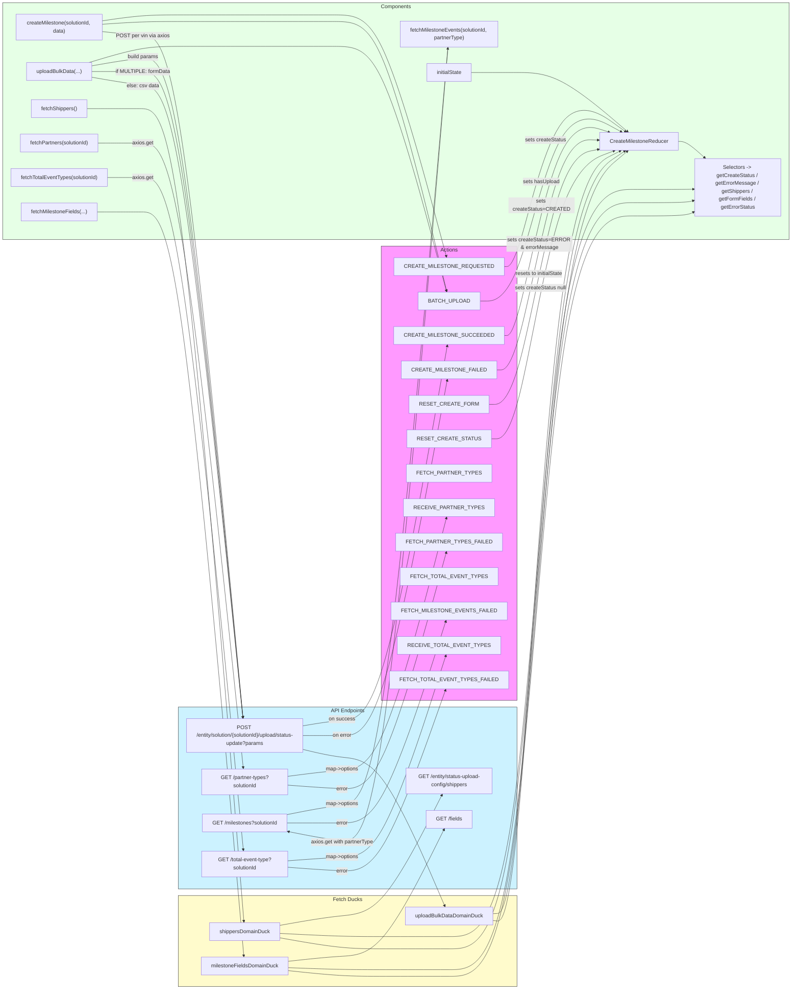

# Diagram: web/portal/src/pages/createmilestone/redux/CreateMilestoneState.js

> Auto-generated by Obscura crawlers

## Mermaid

### SVG

<svg id="container" width="2386.140625" xmlns="http://www.w3.org/2000/svg" class="flowchart" height="2987" viewBox="0 0 2386.140625 2987" role="graphics-document document" aria-roledescription="flowchart-v2"><g><marker id="container_flowchart-v2-pointEnd" class="marker flowchart-v2" viewBox="0 0 10 10" refX="5" refY="5" markerUnits="userSpaceOnUse" markerWidth="8" markerHeight="8" orient="auto"><path d="M 0 0 L 10 5 L 0 10 z" class="arrowMarkerPath" style="stroke-width: 1; stroke-dasharray: 1, 0;"></path></marker><marker id="container_flowchart-v2-pointStart" class="marker flowchart-v2" viewBox="0 0 10 10" refX="4.5" refY="5" markerUnits="userSpaceOnUse" markerWidth="8" markerHeight="8" orient="auto"><path d="M 0 5 L 10 10 L 10 0 z" class="arrowMarkerPath" style="stroke-width: 1; stroke-dasharray: 1, 0;"></path></marker><marker id="container_flowchart-v2-circleEnd" class="marker flowchart-v2" viewBox="0 0 10 10" refX="11" refY="5" markerUnits="userSpaceOnUse" markerWidth="11" markerHeight="11" orient="auto"><circle cx="5" cy="5" r="5" class="arrowMarkerPath" style="stroke-width: 1; stroke-dasharray: 1, 0;"></circle></marker><marker id="container_flowchart-v2-circleStart" class="marker flowchart-v2" viewBox="0 0 10 10" refX="-1" refY="5" markerUnits="userSpaceOnUse" markerWidth="11" markerHeight="11" orient="auto"><circle cx="5" cy="5" r="5" class="arrowMarkerPath" style="stroke-width: 1; stroke-dasharray: 1, 0;"></circle></marker><marker id="container_flowchart-v2-crossEnd" class="marker cross flowchart-v2" viewBox="0 0 11 11" refX="12" refY="5.2" markerUnits="userSpaceOnUse" markerWidth="11" markerHeight="11" orient="auto"><path d="M 1,1 l 9,9 M 10,1 l -9,9" class="arrowMarkerPath" style="stroke-width: 2; stroke-dasharray: 1, 0;"></path></marker><marker id="container_flowchart-v2-crossStart" class="marker cross flowchart-v2" viewBox="0 0 11 11" refX="-1" refY="5.2" markerUnits="userSpaceOnUse" markerWidth="11" markerHeight="11" orient="auto"><path d="M 1,1 l 9,9 M 10,1 l -9,9" class="arrowMarkerPath" style="stroke-width: 2; stroke-dasharray: 1, 0;"></path></marker><g class="root"><g class="clusters"><g class="cluster" id="Components" data-look="classic"><rect style="fill:#e6ffe6 !important;stroke:#333 !important;stroke-width:1px !important" x="8" y="8" width="2370.140625" height="715"></rect><g class="cluster-label" transform="translate(1147.4375, 8)"><foreignObject width="91.265625" height="24">

Components

</foreignObject></g></g><g class="cluster" id="APIs" data-look="classic"><rect style="fill:#ccf2ff !important;stroke:#333 !important;stroke-width:1px !important" x="539.734375" y="2135" width="1017.46875" height="549"></rect><g class="cluster-label" transform="translate(998.0859375, 2135)"><foreignObject width="100.765625" height="24">

API Endpoints

</foreignObject></g></g><g class="cluster" id="Ducks" data-look="classic"><rect style="fill:#fffbcc !important;stroke:#333 !important;stroke-width:1px !important" x="539.734375" y="2704" width="1017.46875" height="275"></rect><g class="cluster-label" transform="translate(1005.6328125, 2704)"><foreignObject width="85.671875" height="24">

Fetch Ducks

</foreignObject></g></g><g class="cluster" id="Actions" data-look="classic"><rect style="fill:#f9f !important;stroke:#333 !important;stroke-width:1px !important" x="1193.515625" y="743" width="363.6875" height="1372"></rect><g class="cluster-label" transform="translate(1348.7109375, 743)"><foreignObject width="53.296875" height="24">

Actions

</foreignObject></g></g></g><g class="edgePaths"><path d="M313.352,62.798L333.664,59.831C353.977,56.865,394.602,50.933,432.332,47.966C470.063,45,504.898,45,558.743,45C612.589,45,685.443,45,774.268,45C863.094,45,967.891,45,1040.427,45C1112.964,45,1153.24,45,1202.453,166.518C1251.667,288.037,1309.817,531.073,1338.893,652.592L1367.968,774.11" id="L_CREATE_FN_CM_REQ_0" class="edge-thickness-normal edge-pattern-solid edge-thickness-normal edge-pattern-solid flowchart-link" style=";" data-edge="true" data-et="edge" data-id="L_CREATE_FN_CM_REQ_0" data-points="W3sieCI6MzEzLjM1MTU2MjUsInkiOjYyLjc5Nzc4NjA2ODg4NDcwNH0seyJ4Ijo0MzUuMjI2NTYyNSwieSI6NDV9LHsieCI6NTM5LjczNDM3NSwieSI6NDV9LHsieCI6NzU4LjI5Njg3NSwieSI6NDV9LHsieCI6MTA3Mi42ODc1LCJ5Ijo0NX0seyJ4IjoxMTkzLjUxNTYyNSwieSI6NDV9LHsieCI6MTM2OC44OTkxMzY1MTMxNTc4LCJ5Ijo3Nzh9XQ==" marker-end="url(#container_flowchart-v2-pointEnd)"></path><path d="M313.352,77.848L333.664,77.207C353.977,76.565,394.602,75.283,432.332,74.641C470.063,74,504.898,74,558.743,74C612.589,74,685.443,74,774.268,74C863.094,74,967.891,74,1040.427,74C1112.964,74,1153.24,74,1202.563,208.015C1251.886,342.031,1310.257,610.061,1339.443,744.076L1368.628,878.092" id="L_CREATE_FN_BATCH_0" class="edge-thickness-normal edge-pattern-solid edge-thickness-normal edge-pattern-solid flowchart-link" style=";" data-edge="true" data-et="edge" data-id="L_CREATE_FN_BATCH_0" data-points="W3sieCI6MzEzLjM1MTU2MjUsInkiOjc3Ljg0ODE2OTk2MDgzOTk0fSx7IngiOjQzNS4yMjY1NjI1LCJ5Ijo3NH0seyJ4Ijo1MzkuNzM0Mzc1LCJ5Ijo3NH0seyJ4Ijo3NTguMjk2ODc1LCJ5Ijo3NH0seyJ4IjoxMDcyLjY4NzUsInkiOjc0fSx7IngiOjExOTMuNTE1NjI1LCJ5Ijo3NH0seyJ4IjoxMzY5LjQ3OTM5NzQ1NTA4OTgsInkiOjg4Mn1d" marker-end="url(#container_flowchart-v2-pointEnd)"></path><path d="M313.352,99.645L333.664,102.371C353.977,105.097,394.602,110.548,432.332,113.274C470.063,116,504.898,116,557.792,457.67C610.686,799.34,681.637,1482.681,717.113,1824.351L752.588,2166.021" id="L_CREATE_FN_API_BULK_UPLOAD_0" class="edge-thickness-normal edge-pattern-solid edge-thickness-normal edge-pattern-solid flowchart-link" style=";" data-edge="true" data-et="edge" data-id="L_CREATE_FN_API_BULK_UPLOAD_0" data-points="W3sieCI6MzEzLjM1MTU2MjUsInkiOjk5LjY0NTI3NzY2NjQzMDI3fSx7IngiOjQzNS4yMjY1NjI1LCJ5IjoxMTZ9LHsieCI6NTM5LjczNDM3NSwieSI6MTE2fSx7IngiOjc1My4wMDE1MzY1MjAxOSwieSI6MjE3MH1d" marker-end="url(#container_flowchart-v2-pointEnd)"></path><path d="M951.859,2190.832L971.997,2187.693C992.135,2184.555,1032.411,2178.277,1072.688,2175.139C1112.964,2172,1153.24,2172,1202.876,1983.992C1252.511,1795.984,1311.507,1419.968,1341.005,1231.96L1370.503,1043.952" id="L_API_BULK_UPLOAD_CM_SUCC_0" class="edge-thickness-normal edge-pattern-solid edge-thickness-normal edge-pattern-solid flowchart-link" style=";" data-edge="true" data-et="edge" data-id="L_API_BULK_UPLOAD_CM_SUCC_0" data-points="W3sieCI6OTUxLjg1OTM3NSwieSI6MjE5MC44MzE5MTY5MDI3Mzg2fSx7IngiOjEwNzIuNjg3NSwieSI6MjE3Mn0seyJ4IjoxMTkzLjUxNTYyNSwieSI6MjE3Mn0seyJ4IjoxMzcxLjEyMzE1MzA0MTQxNSwieSI6MTA0MH1d" marker-end="url(#container_flowchart-v2-pointEnd)"></path><path d="M951.859,2221L971.997,2221C992.135,2221,1032.411,2221,1072.688,2221C1112.964,2221,1153.24,2221,1202.835,2042.158C1252.431,1863.316,1311.347,1505.631,1340.804,1326.789L1370.262,1147.947" id="L_API_BULK_UPLOAD_CM_FAIL_0" class="edge-thickness-normal edge-pattern-solid edge-thickness-normal edge-pattern-solid flowchart-link" style=";" data-edge="true" data-et="edge" data-id="L_API_BULK_UPLOAD_CM_FAIL_0" data-points="W3sieCI6OTUxLjg1OTM3NSwieSI6MjIyMX0seyJ4IjoxMDcyLjY4NzUsInkiOjIyMjF9LHsieCI6MTE5My41MTU2MjUsInkiOjIyMjF9LHsieCI6MTM3MC45MTIxMDkzNzUsInkiOjExNDR9XQ==" marker-end="url(#container_flowchart-v2-pointEnd)"></path><path d="M280.813,189.442L306.548,182.535C332.284,175.628,383.755,161.814,426.909,154.907C470.063,148,504.898,148,558.743,148C612.589,148,685.443,148,774.268,148C863.094,148,967.891,148,1040.427,148C1112.964,148,1153.24,148,1202.455,269.685C1251.67,391.37,1309.824,634.74,1338.901,756.425L1367.978,878.11" id="L_UPLOAD_FN_BATCH_0" class="edge-thickness-normal edge-pattern-solid edge-thickness-normal edge-pattern-solid flowchart-link" style=";" data-edge="true" data-et="edge" data-id="L_UPLOAD_FN_BATCH_0" data-points="W3sieCI6MjgwLjgxMjUsInkiOjE4OS40NDI0NDcwNDE0MTF9LHsieCI6NDM1LjIyNjU2MjUsInkiOjE0OH0seyJ4Ijo1MzkuNzM0Mzc1LCJ5IjoxNDh9LHsieCI6NzU4LjI5Njg3NSwieSI6MTQ4fSx7IngiOjEwNzIuNjg3NSwieSI6MTQ4fSx7IngiOjExOTMuNTE1NjI1LCJ5IjoxNDh9LHsieCI6MTM2OC45MDc2MjU2NTcwMzAyLCJ5Ijo4ODJ9XQ==" marker-end="url(#container_flowchart-v2-pointEnd)"></path><path d="M280.813,201.94L306.548,198.283C332.284,194.627,383.755,187.313,426.909,183.657C470.063,180,504.898,180,557.762,511.004C610.626,842.008,681.518,1504.015,716.964,1835.019L752.41,2166.023" id="L_UPLOAD_FN_API_BULK_UPLOAD_0" class="edge-thickness-normal edge-pattern-solid edge-thickness-normal edge-pattern-solid flowchart-link" style=";" data-edge="true" data-et="edge" data-id="L_UPLOAD_FN_API_BULK_UPLOAD_0" data-points="W3sieCI6MjgwLjgxMjUsInkiOjIwMS45NDAxMTkwMjE5MjM0Nn0seyJ4Ijo0MzUuMjI2NTYyNSwieSI6MTgwfSx7IngiOjUzOS43MzQzNzUsInkiOjE4MH0seyJ4Ijo3NTIuODM1NDg5NjQ5NjgxNiwieSI6MjE3MH1d" marker-end="url(#container_flowchart-v2-pointEnd)"></path><path d="M280.813,219.124L306.548,219.937C332.284,220.75,383.755,222.375,426.909,223.187C470.063,224,504.898,224,557.741,547.671C610.583,871.341,681.431,1518.682,716.856,1842.353L752.28,2166.024" id="L_UPLOAD_FN_API_BULK_UPLOAD_2" class="edge-thickness-normal edge-pattern-solid edge-thickness-normal edge-pattern-solid flowchart-link" style=";" data-edge="true" data-et="edge" data-id="L_UPLOAD_FN_API_BULK_UPLOAD_2" data-points="W3sieCI6MjgwLjgxMjUsInkiOjIxOS4xMjQ0MTc5OTUxMjgxfSx7IngiOjQzNS4yMjY1NjI1LCJ5IjoyMjR9LHsieCI6NTM5LjczNDM3NSwieSI6MjI0fSx7IngiOjc1Mi43MTUxNTg2NzU1MTMzLCJ5IjoyMTcwfV0=" marker-end="url(#container_flowchart-v2-pointEnd)"></path><path d="M280.813,236.309L306.548,241.591C332.284,246.872,383.755,257.436,426.909,262.718C470.063,268,504.898,268,557.718,584.337C610.538,900.675,681.341,1533.35,716.743,1849.687L752.145,2166.025" id="L_UPLOAD_FN_API_BULK_UPLOAD_3" class="edge-thickness-normal edge-pattern-solid edge-thickness-normal edge-pattern-solid flowchart-link" style=";" data-edge="true" data-et="edge" data-id="L_UPLOAD_FN_API_BULK_UPLOAD_3" data-points="W3sieCI6MjgwLjgxMjUsInkiOjIzNi4zMDg3MTY5NjgzMzI3Nn0seyJ4Ijo0MzUuMjI2NTYyNSwieSI6MjY4fSx7IngiOjUzOS43MzQzNzUsInkiOjI2OH0seyJ4Ijo3NTIuNTg5NDA1NzIxOTY2MiwieSI6MjE3MH1d" marker-end="url(#container_flowchart-v2-pointEnd)"></path><path d="M951.859,2264.097L971.997,2268.581C992.135,2273.065,1032.411,2282.032,1072.688,2286.516C1112.964,2291,1153.24,2291,1201.724,2365.044C1250.208,2439.088,1306.9,2587.176,1335.247,2661.22L1363.593,2735.264" id="L_API_BULK_UPLOAD_UPLOAD_0" class="edge-thickness-normal edge-pattern-solid edge-thickness-normal edge-pattern-solid flowchart-link" style=";" data-edge="true" data-et="edge" data-id="L_API_BULK_UPLOAD_UPLOAD_0" data-points="W3sieCI6OTUxLjg1OTM3NSwieSI6MjI2NC4wOTcyNjE1Njc1MTY0fSx7IngiOjEwNzIuNjg3NSwieSI6MjI5MX0seyJ4IjoxMTkzLjUxNTYyNSwieSI6MjI5MX0seyJ4IjoxMzY1LjAyMjk5MzQyMTA1MjcsInkiOjI3Mzl9XQ==" marker-end="url(#container_flowchart-v2-pointEnd)"></path><path d="M267.156,328L295.168,328C323.18,328,379.203,328,424.633,328C470.063,328,504.898,328,558.289,737.003C611.68,1146.005,683.626,1964.01,719.599,2373.013L755.572,2782.015" id="L_FETCH_SHIPPERS_FN_SHIPPERS_0" class="edge-thickness-normal edge-pattern-solid edge-thickness-normal edge-pattern-solid flowchart-link" style=";" data-edge="true" data-et="edge" data-id="L_FETCH_SHIPPERS_FN_SHIPPERS_0" data-points="W3sieCI6MjY3LjE1NjI1LCJ5IjozMjh9LHsieCI6NDM1LjIyNjU2MjUsInkiOjMyOH0seyJ4Ijo1MzkuNzM0Mzc1LCJ5IjozMjh9LHsieCI6NzU1LjkyMjE1MTY1OTk1OTgsInkiOjI3ODZ9XQ==" marker-end="url(#container_flowchart-v2-pointEnd)"></path><path d="M865.25,2795.31L899.823,2789.592C934.396,2783.873,1003.542,2772.437,1058.253,2766.718C1112.964,2761,1153.24,2761,1200.478,2700.941C1247.716,2640.882,1301.916,2520.764,1329.016,2460.705L1356.116,2400.646" id="L_SHIPPERS_API_SHIPPERS_0" class="edge-thickness-normal edge-pattern-solid edge-thickness-normal edge-pattern-solid flowchart-link" style=";" data-edge="true" data-et="edge" data-id="L_SHIPPERS_API_SHIPPERS_0" data-points="W3sieCI6ODY1LjI1LCJ5IjoyNzk1LjMxMDAyNDM1MjY2NjV9LHsieCI6MTA3Mi42ODc1LCJ5IjoyNzYxfSx7IngiOjExOTMuNTE1NjI1LCJ5IjoyNzYxfSx7IngiOjEzNTcuNzYxNTkyNzQxOTM1NCwieSI6MjM5N31d" marker-end="url(#container_flowchart-v2-pointEnd)"></path><path d="M302.633,432L324.732,432C346.831,432,391.029,432,430.546,432C470.063,432,504.898,432,557.932,746.338C610.965,1060.675,682.197,1689.35,717.812,2003.688L753.428,2318.025" id="L_FETCH_PARTNERS_FN_API_PARTNER_TYPES_0" class="edge-thickness-normal edge-pattern-solid edge-thickness-normal edge-pattern-solid flowchart-link" style=";" data-edge="true" data-et="edge" data-id="L_FETCH_PARTNERS_FN_API_PARTNER_TYPES_0" data-points="W3sieCI6MzAyLjYzMjgxMjUsInkiOjQzMn0seyJ4Ijo0MzUuMjI2NTYyNSwieSI6NDMyfSx7IngiOjUzOS43MzQzNzUsInkiOjQzMn0seyJ4Ijo3NTMuODc4MDM3NTE5NDQwMSwieSI6MjMyMn1d" marker-end="url(#container_flowchart-v2-pointEnd)"></path><path d="M888.297,2345.287L919.029,2341.573C949.76,2337.858,1011.224,2330.429,1062.094,2326.715C1112.964,2323,1153.24,2323,1202.5,2196.483C1251.759,2069.966,1310.003,1816.932,1339.125,1690.415L1368.247,1563.898" id="L_API_PARTNER_TYPES_RECEIVE_PT_0" class="edge-thickness-normal edge-pattern-solid edge-thickness-normal edge-pattern-solid flowchart-link" style=";" data-edge="true" data-et="edge" data-id="L_API_PARTNER_TYPES_RECEIVE_PT_0" data-points="W3sieCI6ODg4LjI5Njg3NSwieSI6MjM0NS4yODcwNjMyNjcyMzM0fSx7IngiOjEwNzIuNjg3NSwieSI6MjMyM30seyJ4IjoxMTkzLjUxNTYyNSwieSI6MjMyM30seyJ4IjoxMzY5LjE0NDQ2MjAyNTMxNjQsInkiOjE1NjB9XQ==" marker-end="url(#container_flowchart-v2-pointEnd)"></path><path d="M888.297,2370.097L919.029,2372.247C949.76,2374.398,1011.224,2378.699,1062.094,2380.849C1112.964,2383,1153.24,2383,1202.43,2263.814C1251.621,2144.629,1309.726,1906.257,1338.778,1787.072L1367.831,1667.886" id="L_API_PARTNER_TYPES_FETCH_PT_FAIL_0" class="edge-thickness-normal edge-pattern-solid edge-thickness-normal edge-pattern-solid flowchart-link" style=";" data-edge="true" data-et="edge" data-id="L_API_PARTNER_TYPES_FETCH_PT_FAIL_0" data-points="W3sieCI6ODg4LjI5Njg3NSwieSI6MjM3MC4wOTY5NjMzNzE2MDE4fSx7IngiOjEwNzIuNjg3NSwieSI6MjM4M30seyJ4IjoxMTkzLjUxNTYyNSwieSI6MjM4M30seyJ4IjoxMzY4Ljc3Nzg5ODc5MzU2NTgsInkiOjE2NjR9XQ==" marker-end="url(#container_flowchart-v2-pointEnd)"></path><path d="M330.719,536L348.137,536C365.555,536,400.391,536,435.227,536C470.063,536,504.898,536,557.988,874.337C611.078,1212.674,682.422,1889.348,718.094,2227.685L753.766,2566.022" id="L_FETCH_TOTAL_FN_API_TOTAL_TYPES_0" class="edge-thickness-normal edge-pattern-solid edge-thickness-normal edge-pattern-solid flowchart-link" style=";" data-edge="true" data-et="edge" data-id="L_FETCH_TOTAL_FN_API_TOTAL_TYPES_0" data-points="W3sieCI6MzMwLjcxODc1LCJ5Ijo1MzZ9LHsieCI6NDM1LjIyNjU2MjUsInkiOjUzNn0seyJ4Ijo1MzkuNzM0Mzc1LCJ5Ijo1MzZ9LHsieCI6NzU0LjE4NDk5MDA1MDY1MTIsInkiOjI1NzB9XQ==" marker-end="url(#container_flowchart-v2-pointEnd)"></path><path d="M888.297,2599.903L919.029,2597.753C949.76,2595.602,1011.224,2591.301,1062.094,2589.151C1112.964,2587,1153.24,2587,1202.22,2485.808C1251.2,2384.616,1308.883,2182.231,1337.725,2081.039L1366.567,1979.847" id="L_API_TOTAL_TYPES_RECEIVE_TE_0" class="edge-thickness-normal edge-pattern-solid edge-thickness-normal edge-pattern-solid flowchart-link" style=";" data-edge="true" data-et="edge" data-id="L_API_TOTAL_TYPES_RECEIVE_TE_0" data-points="W3sieCI6ODg4LjI5Njg3NSwieSI6MjU5OS45MDMwMzY2MjgzOTgyfSx7IngiOjEwNzIuNjg3NSwieSI6MjU4N30seyJ4IjoxMTkzLjUxNTYyNSwieSI6MjU4N30seyJ4IjoxMzY3LjY2Mzc5MzEwMzQ0ODQsInkiOjE5NzZ9XQ==" marker-end="url(#container_flowchart-v2-pointEnd)"></path><path d="M888.297,2618.097L919.029,2620.247C949.76,2622.398,1011.224,2626.699,1062.094,2628.849C1112.964,2631,1153.24,2631,1202.069,2539.803C1250.899,2448.605,1308.282,2266.21,1336.973,2175.013L1365.665,2083.816" id="L_API_TOTAL_TYPES_FETCH_TE_FAIL_0" class="edge-thickness-normal edge-pattern-solid edge-thickness-normal edge-pattern-solid flowchart-link" style=";" data-edge="true" data-et="edge" data-id="L_API_TOTAL_TYPES_FETCH_TE_FAIL_0" data-points="W3sieCI6ODg4LjI5Njg3NSwieSI6MjYxOC4wOTY5NjMzNzE2MDE4fSx7IngiOjEwNzIuNjg3NSwieSI6MjYzMX0seyJ4IjoxMTkzLjUxNTYyNSwieSI6MjYzMX0seyJ4IjoxMzY2Ljg2NDk0Mzc3MTYyNjMsInkiOjIwODB9XQ==" marker-end="url(#container_flowchart-v2-pointEnd)"></path><path d="M1372.438,154L1342.618,552.167C1312.798,950.333,1253.157,1746.667,1203.198,2144.833C1153.24,2543,1112.964,2543,1062.705,2537.443C1012.447,2531.887,952.206,2520.773,922.085,2515.216L891.965,2509.66" id="L_FETCH_MILESTONE_FN_API_MILESTONE_EVENTS_0" class="edge-thickness-normal edge-pattern-solid edge-thickness-normal edge-pattern-solid flowchart-link" style=";" data-edge="true" data-et="edge" data-id="L_FETCH_MILESTONE_FN_API_MILESTONE_EVENTS_0" data-points="W3sieCI6MTM3Mi40Mzg0OTEwNDIwMSwieSI6MTU0fSx7IngiOjExOTMuNTE1NjI1LCJ5IjoyNTQzfSx7IngiOjEwNzIuNjg3NSwieSI6MjU0M30seyJ4Ijo4ODguMDMxMjUsInkiOjI1MDguOTMzODk5OTA1NTcxM31d" marker-end="url(#container_flowchart-v2-pointEnd)"></path><path d="M888.031,2461.066L918.807,2455.388C949.583,2449.711,1011.135,2438.355,1062.049,2432.678C1112.964,2427,1153.24,2427,1203.121,2048.831C1253.003,1670.663,1312.491,914.325,1342.235,536.156L1371.978,157.988" id="L_API_MILESTONE_EVENTS_FETCH_MILESTONE_FN_0" class="edge-thickness-normal edge-pattern-solid edge-thickness-normal edge-pattern-solid flowchart-link" style=";" data-edge="true" data-et="edge" data-id="L_API_MILESTONE_EVENTS_FETCH_MILESTONE_FN_0" data-points="W3sieCI6ODg4LjAzMTI1LCJ5IjoyNDYxLjA2NjEwMDA5NDQyODd9LHsieCI6MTA3Mi42ODc1LCJ5IjoyNDI3fSx7IngiOjExOTMuNTE1NjI1LCJ5IjoyNDI3fSx7IngiOjEzNzIuMjkxOTQxNTAwODY1LCJ5IjoxNTR9XQ==" marker-end="url(#container_flowchart-v2-pointEnd)"></path><path d="M888.031,2485L918.807,2485C949.583,2485,1011.135,2485,1062.049,2485C1112.964,2485,1153.24,2485,1202.224,2383.475C1251.209,2281.949,1308.902,2078.898,1337.748,1977.373L1366.595,1875.848" id="L_API_MILESTONE_EVENTS_FETCH_ME_FAIL_0" class="edge-thickness-normal edge-pattern-solid edge-thickness-normal edge-pattern-solid flowchart-link" style=";" data-edge="true" data-et="edge" data-id="L_API_MILESTONE_EVENTS_FETCH_ME_FAIL_0" data-points="W3sieCI6ODg4LjAzMTI1LCJ5IjoyNDg1fSx7IngiOjEwNzIuNjg3NSwieSI6MjQ4NX0seyJ4IjoxMTkzLjUxNTYyNSwieSI6MjQ4NX0seyJ4IjoxMzY3LjY4Nzg0MTc5Njg3NSwieSI6MTg3Mn1d" marker-end="url(#container_flowchart-v2-pointEnd)"></path><path d="M297.5,640L320.454,640C343.409,640,389.318,640,429.69,640C470.063,640,504.898,640,558.248,1014.336C611.597,1388.673,683.46,2137.346,719.392,2511.682L755.323,2886.018" id="L_FETCH_FIELDS_FN_FIELDS_0" class="edge-thickness-normal edge-pattern-solid edge-thickness-normal edge-pattern-solid flowchart-link" style=";" data-edge="true" data-et="edge" data-id="L_FETCH_FIELDS_FN_FIELDS_0" data-points="W3sieCI6Mjk3LjUsInkiOjY0MH0seyJ4Ijo0MzUuMjI2NTYyNSwieSI6NjQwfSx7IngiOjUzOS43MzQzNzUsInkiOjY0MH0seyJ4Ijo3NTUuNzA1MjI0ODAyMzcxNSwieSI6Mjg5MH1d" marker-end="url(#container_flowchart-v2-pointEnd)"></path><path d="M891.094,2903.483L921.359,2900.403C951.625,2897.322,1012.156,2891.161,1062.56,2888.081C1112.964,2885,1153.24,2885,1201.424,2821.61C1249.609,2758.219,1305.702,2631.439,1333.748,2568.048L1361.795,2504.658" id="L_FIELDS_API_FIELDS_0" class="edge-thickness-normal edge-pattern-solid edge-thickness-normal edge-pattern-solid flowchart-link" style=";" data-edge="true" data-et="edge" data-id="L_FIELDS_API_FIELDS_0" data-points="W3sieCI6ODkxLjA5Mzc1LCJ5IjoyOTAzLjQ4MzM3NTU3Nzc1NDV9LHsieCI6MTA3Mi42ODc1LCJ5IjoyODg1fSx7IngiOjExOTMuNTE1NjI1LCJ5IjoyODg1fSx7IngiOjEzNjMuNDEzNDM1MjE4OTc4LCJ5IjoyNTAxfV0=" marker-end="url(#container_flowchart-v2-pointEnd)"></path><path d="M865.25,2818.103L899.823,2819.752C934.396,2821.402,1003.542,2824.701,1058.253,2826.35C1112.964,2828,1153.24,2828,1203.685,2828C1254.13,2828,1314.745,2828,1375.359,2828C1435.974,2828,1496.589,2828,1547.729,2455.333C1598.87,2082.667,1640.536,1337.333,1695.149,940.059C1749.761,542.785,1817.318,493.57,1851.097,468.963L1884.876,444.355" id="L_SHIPPERS_REDUCER_0" class="edge-thickness-normal edge-pattern-solid edge-thickness-normal edge-pattern-solid flowchart-link" style=";" data-edge="true" data-et="edge" data-id="L_SHIPPERS_REDUCER_0" data-points="W3sieCI6ODY1LjI1LCJ5IjoyODE4LjEwMjg3NzU5MDU3N30seyJ4IjoxMDcyLjY4NzUsInkiOjI4Mjh9LHsieCI6MTE5My41MTU2MjUsInkiOjI4Mjh9LHsieCI6MTM3NS4zNTkzNzUsInkiOjI4Mjh9LHsieCI6MTU1Ny4yMDMxMjUsInkiOjI4Mjh9LHsieCI6MTY4Mi4yMDMxMjUsInkiOjU5Mn0seyJ4IjoxODg4LjEwODg0NTMzODk4MywieSI6NDQyfV0=" marker-end="url(#container_flowchart-v2-pointEnd)"></path><path d="M891.094,2921.646L921.359,2922.705C951.625,2923.764,1012.156,2925.882,1062.56,2926.941C1112.964,2928,1153.24,2928,1203.685,2928C1254.13,2928,1314.745,2928,1375.359,2928C1435.974,2928,1496.589,2928,1547.729,2545.333C1598.87,2162.667,1640.536,1397.333,1696.329,983.444C1752.121,569.555,1822.039,507.11,1856.998,475.887L1891.957,444.664" id="L_FIELDS_REDUCER_0" class="edge-thickness-normal edge-pattern-solid edge-thickness-normal edge-pattern-solid flowchart-link" style=";" data-edge="true" data-et="edge" data-id="L_FIELDS_REDUCER_0" data-points="W3sieCI6ODkxLjA5Mzc1LCJ5IjoyOTIxLjY0NjMzOTY0NTE0N30seyJ4IjoxMDcyLjY4NzUsInkiOjI5Mjh9LHsieCI6MTE5My41MTU2MjUsInkiOjI5Mjh9LHsieCI6MTM3NS4zNTkzNzUsInkiOjI5Mjh9LHsieCI6MTU1Ny4yMDMxMjUsInkiOjI5Mjh9LHsieCI6MTY4Mi4yMDMxMjUsInkiOjYzMn0seyJ4IjoxODk0Ljk0MDc0MDIwNzM3MzIsInkiOjQ0Mn1d" marker-end="url(#container_flowchart-v2-pointEnd)"></path><path d="M1509.078,2757.911L1517.099,2757.426C1525.12,2756.941,1541.161,2755.97,1570.016,2386.152C1598.87,2016.333,1640.536,1277.667,1692.453,892.47C1744.37,507.273,1806.537,475.546,1837.621,459.682L1868.705,443.818" id="L_UPLOAD_REDUCER_0" class="edge-thickness-normal edge-pattern-solid edge-thickness-normal edge-pattern-solid flowchart-link" style=";" data-edge="true" data-et="edge" data-id="L_UPLOAD_REDUCER_0" data-points="W3sieCI6MTUwOS4wNzgxMjUsInkiOjI3NTcuOTExMTUzMTE5MDkyNH0seyJ4IjoxNTU3LjIwMzEyNSwieSI6Mjc1NX0seyJ4IjoxNjgyLjIwMzEyNSwieSI6NTM5fSx7IngiOjE4NzIuMjY3Mzg5MTEyOTAzMiwieSI6NDQyfV0=" marker-end="url(#container_flowchart-v2-pointEnd)"></path><path d="M1521.773,805L1527.678,805C1533.583,805,1545.393,805,1572.132,714.667C1598.87,624.333,1640.536,443.667,1694.106,373.813C1747.676,303.96,1813.149,344.919,1845.885,365.399L1878.622,385.879" id="L_CM_REQ_REDUCER_0" class="edge-thickness-normal edge-pattern-solid edge-thickness-normal edge-pattern-solid flowchart-link" style=";" data-edge="true" data-et="edge" data-id="L_CM_REQ_REDUCER_0" data-points="W3sieCI6MTUyMS43NzM0Mzc1LCJ5Ijo4MDV9LHsieCI6MTU1Ny4yMDMxMjUsInkiOjgwNX0seyJ4IjoxNjgyLjIwMzEyNSwieSI6MjYzfSx7IngiOjE4ODIuMDEyOTUyMzAyNjMxNywieSI6Mzg4fV0=" marker-end="url(#container_flowchart-v2-pointEnd)"></path><path d="M1521.414,1013L1527.379,1013C1533.344,1013,1545.273,1013,1572.072,902.667C1598.87,792.333,1640.536,571.667,1684.136,467.33C1727.736,362.994,1773.269,374.987,1796.035,380.984L1818.801,386.981" id="L_CM_SUCC_REDUCER_0" class="edge-thickness-normal edge-pattern-solid edge-thickness-normal edge-pattern-solid flowchart-link" style=";" data-edge="true" data-et="edge" data-id="L_CM_SUCC_REDUCER_0" data-points="W3sieCI6MTUyMS40MTQwNjI1LCJ5IjoxMDEzfSx7IngiOjE1NTcuMjAzMTI1LCJ5IjoxMDEzfSx7IngiOjE2ODIuMjAzMTI1LCJ5IjozNTF9LHsieCI6MTgyMi42Njk0MzM1OTM3NSwieSI6Mzg4fV0=" marker-end="url(#container_flowchart-v2-pointEnd)"></path><path d="M1503.859,1117L1512.75,1117C1521.641,1117,1539.422,1117,1569.146,998.667C1598.87,880.333,1640.536,643.667,1681.537,525.997C1722.537,408.328,1762.871,409.656,1783.038,410.32L1803.205,410.984" id="L_CM_FAIL_REDUCER_0" class="edge-thickness-normal edge-pattern-solid edge-thickness-normal edge-pattern-solid flowchart-link" style=";" data-edge="true" data-et="edge" data-id="L_CM_FAIL_REDUCER_0" data-points="W3sieCI6MTUwMy44NTkzNzUsInkiOjExMTd9LHsieCI6MTU1Ny4yMDMxMjUsInkiOjExMTd9LHsieCI6MTY4Mi4yMDMxMjUsInkiOjQwN30seyJ4IjoxODA3LjIwMzEyNSwieSI6NDExLjExNTc1NTYyNzAwOTY2fV0=" marker-end="url(#container_flowchart-v2-pointEnd)"></path><path d="M1460.828,909L1476.891,909C1492.953,909,1525.078,909,1561.974,808.667C1598.87,708.333,1640.536,507.667,1691.132,420.563C1741.727,333.458,1801.251,359.917,1831.013,373.146L1860.775,386.375" id="L_BATCH_REDUCER_0" class="edge-thickness-normal edge-pattern-solid edge-thickness-normal edge-pattern-solid flowchart-link" style=";" data-edge="true" data-et="edge" data-id="L_BATCH_REDUCER_0" data-points="W3sieCI6MTQ2MC44MjgxMjUsInkiOjkwOX0seyJ4IjoxNTU3LjIwMzEyNSwieSI6OTA5fSx7IngiOjE2ODIuMjAzMTI1LCJ5IjozMDd9LHsieCI6MTg2NC40Mjk2ODc1LCJ5IjozODh9XQ==" marker-end="url(#container_flowchart-v2-pointEnd)"></path><path d="M1481.375,1221L1494.013,1221C1506.651,1221,1531.927,1221,1565.398,1094.667C1598.87,968.333,1640.536,715.667,1681.549,585.347C1722.562,455.027,1762.92,447.054,1783.1,443.067L1803.279,439.081" id="L_RESET_FORM_REDUCER_0" class="edge-thickness-normal edge-pattern-solid edge-thickness-normal edge-pattern-solid flowchart-link" style=";" data-edge="true" data-et="edge" data-id="L_RESET_FORM_REDUCER_0" data-points="W3sieCI6MTQ4MS4zNzUsInkiOjEyMjF9LHsieCI6MTU1Ny4yMDMxMjUsInkiOjEyMjF9LHsieCI6MTY4Mi4yMDMxMjUsInkiOjQ2M30seyJ4IjoxODA3LjIwMzEyNSwieSI6NDM4LjMwNTQ2NjIzNzk0MjE0fV0=" marker-end="url(#container_flowchart-v2-pointEnd)"></path><path d="M1486.656,1325L1498.414,1325C1510.172,1325,1533.688,1325,1566.279,1188.667C1598.87,1052.333,1640.536,779.667,1689.357,632.736C1738.177,485.805,1794.151,464.611,1822.138,454.014L1850.125,443.416" id="L_RESET_STATUS_REDUCER_0" class="edge-thickness-normal edge-pattern-solid edge-thickness-normal edge-pattern-solid flowchart-link" style=";" data-edge="true" data-et="edge" data-id="L_RESET_STATUS_REDUCER_0" data-points="W3sieCI6MTQ4Ni42NTYyNSwieSI6MTMyNX0seyJ4IjoxNTU3LjIwMzEyNSwieSI6MTMyNX0seyJ4IjoxNjgyLjIwMzEyNSwieSI6NTA3fSx7IngiOjE4NTMuODY1ODI4ODA0MzQ3OCwieSI6NDQyfV0=" marker-end="url(#container_flowchart-v2-pointEnd)"></path><path d="M1444.992,231L1463.694,231C1482.396,231,1519.799,231,1559.335,231C1598.87,231,1640.536,231,1695.391,256.764C1750.245,282.528,1818.288,334.057,1852.309,359.821L1886.33,385.585" id="L_STATE_REDUCER_0" class="edge-thickness-normal edge-pattern-solid edge-thickness-normal edge-pattern-solid flowchart-link" style=";" data-edge="true" data-et="edge" data-id="L_STATE_REDUCER_0" data-points="W3sieCI6MTQ0NC45OTIxODc1LCJ5IjoyMzF9LHsieCI6MTU1Ny4yMDMxMjUsInkiOjIzMX0seyJ4IjoxNjgyLjIwMzEyNSwieSI6MjMxfSx7IngiOjE4ODkuNTE4ODUxOTAyMTc0LCJ5IjozODh9XQ==" marker-end="url(#container_flowchart-v2-pointEnd)"></path><path d="M2043.141,415L2047.307,415C2051.474,415,2059.807,415,2073.142,423.222C2086.477,431.443,2104.812,447.886,2113.98,456.108L2123.148,464.329" id="L_REDUCER_SELECTORS_0" class="edge-thickness-normal edge-pattern-solid edge-thickness-normal edge-pattern-solid flowchart-link" style=";" data-edge="true" data-et="edge" data-id="L_REDUCER_SELECTORS_0" data-points="W3sieCI6MjA0My4xNDA2MjUsInkiOjQxNX0seyJ4IjoyMDY4LjE0MDYyNSwieSI6NDE1fSx7IngiOjIxMjYuMTI2MjM2NTEwNzkxNCwieSI6NDY3fV0=" marker-end="url(#container_flowchart-v2-pointEnd)"></path><path d="M865.25,2830.69L899.823,2836.408C934.396,2842.127,1003.542,2853.563,1058.253,2859.282C1112.964,2865,1153.24,2865,1203.685,2865C1254.13,2865,1314.745,2865,1375.359,2865C1435.974,2865,1496.589,2865,1547.729,2489.5C1598.87,2114,1640.536,1363,1701.865,987.5C1763.193,612,1844.182,612,1908.505,612C1972.828,612,2020.484,612,2047.855,610.675C2075.225,609.349,2082.31,606.698,2085.852,605.373L2089.394,604.047" id="L_SHIPPERS_SELECTORS_0" class="edge-thickness-normal edge-pattern-solid edge-thickness-normal edge-pattern-solid flowchart-link" style=";" data-edge="true" data-et="edge" data-id="L_SHIPPERS_SELECTORS_0" data-points="W3sieCI6ODY1LjI1LCJ5IjoyODMwLjY4OTk3NTY0NzMzMzV9LHsieCI6MTA3Mi42ODc1LCJ5IjoyODY1fSx7IngiOjExOTMuNTE1NjI1LCJ5IjoyODY1fSx7IngiOjEzNzUuMzU5Mzc1LCJ5IjoyODY1fSx7IngiOjE1NTcuMjAzMTI1LCJ5IjoyODY1fSx7IngiOjE2ODIuMjAzMTI1LCJ5Ijo2MTJ9LHsieCI6MTkyNS4xNzE4NzUsInkiOjYxMn0seyJ4IjoyMDY4LjE0MDYyNSwieSI6NjEyfSx7IngiOjIwOTMuMTQwNjI1LCJ5Ijo2MDIuNjQ1MTYxMjkwMzIyNn1d" marker-end="url(#container_flowchart-v2-pointEnd)"></path><path d="M891.094,2930.094L921.359,2933.079C951.625,2936.063,1012.156,2942.031,1062.56,2945.016C1112.964,2948,1153.24,2948,1203.685,2948C1254.13,2948,1314.745,2948,1375.359,2948C1435.974,2948,1496.589,2948,1547.729,2565.333C1598.87,2182.667,1640.536,1417.333,1701.865,1034.667C1763.193,652,1844.182,652,1908.505,652C1972.828,652,2020.484,652,2047.916,649.722C2075.347,647.444,2082.553,642.887,2086.157,640.609L2089.76,638.331" id="L_FIELDS_SELECTORS_0" class="edge-thickness-normal edge-pattern-solid edge-thickness-normal edge-pattern-solid flowchart-link" style=";" data-edge="true" data-et="edge" data-id="L_FIELDS_SELECTORS_0" data-points="W3sieCI6ODkxLjA5Mzc1LCJ5IjoyOTMwLjA5NDIyOTkwOTA1MDJ9LHsieCI6MTA3Mi42ODc1LCJ5IjoyOTQ4fSx7IngiOjExOTMuNTE1NjI1LCJ5IjoyOTQ4fSx7IngiOjEzNzUuMzU5Mzc1LCJ5IjoyOTQ4fSx7IngiOjE1NTcuMjAzMTI1LCJ5IjoyOTQ4fSx7IngiOjE2ODIuMjAzMTI1LCJ5Ijo2NTJ9LHsieCI6MTkyNS4xNzE4NzUsInkiOjY1Mn0seyJ4IjoyMDY4LjE0MDYyNSwieSI6NjUyfSx7IngiOjIwOTMuMTQwNjI1LCJ5Ijo2MzYuMTkzNTQ4Mzg3MDk2OH1d" marker-end="url(#container_flowchart-v2-pointEnd)"></path><path d="M1509.078,2781.442L1517.099,2782.369C1525.12,2783.295,1541.161,2785.147,1570.016,2416.907C1598.87,2048.667,1640.536,1310.333,1701.865,941.167C1763.193,572,1844.182,572,1908.505,572C1972.828,572,2020.484,572,2047.817,571.593C2075.15,571.186,2082.158,570.372,2085.663,569.965L2089.167,569.558" id="L_UPLOAD_SELECTORS_0" class="edge-thickness-normal edge-pattern-solid edge-thickness-normal edge-pattern-solid flowchart-link" style=";" data-edge="true" data-et="edge" data-id="L_UPLOAD_SELECTORS_0" data-points="W3sieCI6MTUwOS4wNzgxMjUsInkiOjI3ODEuNDQyMzQ0MDQ1MzY5fSx7IngiOjE1NTcuMjAzMTI1LCJ5IjoyNzg3fSx7IngiOjE2ODIuMjAzMTI1LCJ5Ijo1NzJ9LHsieCI6MTkyNS4xNzE4NzUsInkiOjU3Mn0seyJ4IjoyMDY4LjE0MDYyNSwieSI6NTcyfSx7IngiOjIwOTMuMTQwNjI1LCJ5Ijo1NjkuMDk2Nzc0MTkzNTQ4NH1d" marker-end="url(#container_flowchart-v2-pointEnd)"></path></g><g class="edgeLabels"><g class="edgeLabel"><g class="label" data-id="L_CREATE_FN_CM_REQ_0" transform="translate(0, 0)"><foreignObject width="0" height="0">

</foreignObject></g></g><g class="edgeLabel"><g class="label" data-id="L_CREATE_FN_BATCH_0" transform="translate(0, 0)"><foreignObject width="0" height="0">

</foreignObject></g></g><g class="edgeLabel" transform="translate(435.2265625, 116)"><g class="label" data-id="L_CREATE_FN_API_BULK_UPLOAD_0" transform="translate(-79.5078125, -12)"><foreignObject width="159.015625" height="24">

POST per vin via axios

</foreignObject></g></g><g class="edgeLabel" transform="translate(1072.6875, 2172)"><g class="label" data-id="L_API_BULK_UPLOAD_CM_SUCC_0" transform="translate(-38.953125, -12)"><foreignObject width="77.90625" height="24">

on success

</foreignObject></g></g><g class="edgeLabel" transform="translate(1072.6875, 2221)"><g class="label" data-id="L_API_BULK_UPLOAD_CM_FAIL_0" transform="translate(-29.5390625, -12)"><foreignObject width="59.078125" height="24">

on error

</foreignObject></g></g><g class="edgeLabel"><g class="label" data-id="L_UPLOAD_FN_BATCH_0" transform="translate(0, 0)"><foreignObject width="0" height="0">

</foreignObject></g></g><g class="edgeLabel" transform="translate(435.2265625, 180)"><g class="label" data-id="L_UPLOAD_FN_API_BULK_UPLOAD_0" transform="translate(-47.6484375, -12)"><foreignObject width="95.296875" height="24">

build params

</foreignObject></g></g><g class="edgeLabel" transform="translate(435.2265625, 224)"><g class="label" data-id="L_UPLOAD_FN_API_BULK_UPLOAD_2" transform="translate(-79.171875, -12)"><foreignObject width="158.34375" height="24">

if MULTIPLE: formData

</foreignObject></g></g><g class="edgeLabel" transform="translate(435.2265625, 268)"><g class="label" data-id="L_UPLOAD_FN_API_BULK_UPLOAD_3" transform="translate(-48.640625, -12)"><foreignObject width="97.28125" height="24">

else: csv data

</foreignObject></g></g><g class="edgeLabel"><g class="label" data-id="L_API_BULK_UPLOAD_UPLOAD_0" transform="translate(0, 0)"><foreignObject width="0" height="0">

</foreignObject></g></g><g class="edgeLabel"><g class="label" data-id="L_FETCH_SHIPPERS_FN_SHIPPERS_0" transform="translate(0, 0)"><foreignObject width="0" height="0">

</foreignObject></g></g><g class="edgeLabel"><g class="label" data-id="L_SHIPPERS_API_SHIPPERS_0" transform="translate(0, 0)"><foreignObject width="0" height="0">

</foreignObject></g></g><g class="edgeLabel" transform="translate(435.2265625, 432)"><g class="label" data-id="L_FETCH_PARTNERS_FN_API_PARTNER_TYPES_0" transform="translate(-32.0234375, -12)"><foreignObject width="64.046875" height="24">

axios.get

</foreignObject></g></g><g class="edgeLabel" transform="translate(1072.6875, 2323)"><g class="label" data-id="L_API_PARTNER_TYPES_RECEIVE_PT_0" transform="translate(-50.8515625, -12)"><foreignObject width="101.703125" height="24">

map-&gt;options

</foreignObject></g></g><g class="edgeLabel" transform="translate(1072.6875, 2383)"><g class="label" data-id="L_API_PARTNER_TYPES_FETCH_PT_FAIL_0" transform="translate(-18.0625, -12)"><foreignObject width="36.125" height="24">

error

</foreignObject></g></g><g class="edgeLabel" transform="translate(435.2265625, 536)"><g class="label" data-id="L_FETCH_TOTAL_FN_API_TOTAL_TYPES_0" transform="translate(-32.0234375, -12)"><foreignObject width="64.046875" height="24">

axios.get

</foreignObject></g></g><g class="edgeLabel" transform="translate(1072.6875, 2587)"><g class="label" data-id="L_API_TOTAL_TYPES_RECEIVE_TE_0" transform="translate(-50.8515625, -12)"><foreignObject width="101.703125" height="24">

map-&gt;options

</foreignObject></g></g><g class="edgeLabel" transform="translate(1072.6875, 2631)"><g class="label" data-id="L_API_TOTAL_TYPES_FETCH_TE_FAIL_0" transform="translate(-18.0625, -12)"><foreignObject width="36.125" height="24">

error

</foreignObject></g></g><g class="edgeLabel" transform="translate(1072.6875, 2543)"><g class="label" data-id="L_FETCH_MILESTONE_FN_API_MILESTONE_EVENTS_0" transform="translate(-95.828125, -12)"><foreignObject width="191.65625" height="24">

axios.get with partnerType

</foreignObject></g></g><g class="edgeLabel" transform="translate(1072.6875, 2427)"><g class="label" data-id="L_API_MILESTONE_EVENTS_FETCH_MILESTONE_FN_0" transform="translate(-50.8515625, -12)"><foreignObject width="101.703125" height="24">

map-&gt;options

</foreignObject></g></g><g class="edgeLabel" transform="translate(1072.6875, 2485)"><g class="label" data-id="L_API_MILESTONE_EVENTS_FETCH_ME_FAIL_0" transform="translate(-18.0625, -12)"><foreignObject width="36.125" height="24">

error

</foreignObject></g></g><g class="edgeLabel"><g class="label" data-id="L_FETCH_FIELDS_FN_FIELDS_0" transform="translate(0, 0)"><foreignObject width="0" height="0">

</foreignObject></g></g><g class="edgeLabel"><g class="label" data-id="L_FIELDS_API_FIELDS_0" transform="translate(0, 0)"><foreignObject width="0" height="0">

</foreignObject></g></g><g class="edgeLabel"><g class="label" data-id="L_SHIPPERS_REDUCER_0" transform="translate(0, 0)"><foreignObject width="0" height="0">

</foreignObject></g></g><g class="edgeLabel"><g class="label" data-id="L_FIELDS_REDUCER_0" transform="translate(0, 0)"><foreignObject width="0" height="0">

</foreignObject></g></g><g class="edgeLabel"><g class="label" data-id="L_UPLOAD_REDUCER_0" transform="translate(0, 0)"><foreignObject width="0" height="0">

</foreignObject></g></g><g class="edgeLabel" transform="translate(1642.205, 436.43186)"><g class="label" data-id="L_CM_REQ_REDUCER_0" transform="translate(-62.1015625, -12)"><foreignObject width="124.203125" height="24">

sets createStatus

</foreignObject></g></g><g class="edgeLabel" transform="translate(1629.85869, 628.21611)"><g class="label" data-id="L_CM_SUCC_REDUCER_0" transform="translate(-97.453125, -12)"><foreignObject width="194.90625" height="24">

sets createStatus=CREATED

</foreignObject></g></g><g class="edgeLabel" transform="translate(1682.203125, 407)"><g class="label" data-id="L_CM_FAIL_REDUCER_0" transform="translate(-100, -24)"><foreignObject width="200" height="48">

sets createStatus=ERROR &amp; errorMessage

</foreignObject></g></g><g class="edgeLabel" transform="translate(1630.17768, 557.55452)"><g class="label" data-id="L_BATCH_REDUCER_0" transform="translate(-55.6171875, -12)"><foreignObject width="111.234375" height="24">

sets hasUpload

</foreignObject></g></g><g class="edgeLabel" transform="translate(1682.203125, 463)"><g class="label" data-id="L_RESET_FORM_REDUCER_0" transform="translate(-73.2421875, -12)"><foreignObject width="146.484375" height="24">

resets to initialState

</foreignObject></g></g><g class="edgeLabel" transform="translate(1628.23866, 860.14346)"><g class="label" data-id="L_RESET_STATUS_REDUCER_0" transform="translate(-78.25, -12)"><foreignObject width="156.5" height="24">

sets createStatus null

</foreignObject></g></g><g class="edgeLabel"><g class="label" data-id="L_STATE_REDUCER_0" transform="translate(0, 0)"><foreignObject width="0" height="0">

</foreignObject></g></g><g class="edgeLabel"><g class="label" data-id="L_REDUCER_SELECTORS_0" transform="translate(0, 0)"><foreignObject width="0" height="0">

</foreignObject></g></g><g class="edgeLabel"><g class="label" data-id="L_SHIPPERS_SELECTORS_0" transform="translate(0, 0)"><foreignObject width="0" height="0">

</foreignObject></g></g><g class="edgeLabel"><g class="label" data-id="L_FIELDS_SELECTORS_0" transform="translate(0, 0)"><foreignObject width="0" height="0">

</foreignObject></g></g><g class="edgeLabel"><g class="label" data-id="L_UPLOAD_SELECTORS_0" transform="translate(0, 0)"><foreignObject width="0" height="0">

</foreignObject></g></g></g><g class="nodes"><g class="node default" id="flowchart-CM_REQ-0" transform="translate(1375.359375, 805)"><rect class="basic label-container" style="" x="-146.4140625" y="-27" width="292.828125" height="54"></rect><g class="label" style="" transform="translate(-116.4140625, -12)"><rect></rect><foreignObject width="232.828125" height="24">

CREATE_MILESTONE_REQUESTED

</foreignObject></g></g><g class="node default" id="flowchart-CM_SUCC-1" transform="translate(1375.359375, 1013)"><rect class="basic label-container" style="" x="-146.0546875" y="-27" width="292.109375" height="54"></rect><g class="label" style="" transform="translate(-116.0546875, -12)"><rect></rect><foreignObject width="232.109375" height="24">

CREATE_MILESTONE_SUCCEEDED

</foreignObject></g></g><g class="node default" id="flowchart-CM_FAIL-2" transform="translate(1375.359375, 1117)"><rect class="basic label-container" style="" x="-128.5" y="-27" width="257" height="54"></rect><g class="label" style="" transform="translate(-98.5, -12)"><rect></rect><foreignObject width="197" height="24">

CREATE_MILESTONE_FAILED

</foreignObject></g></g><g class="node default" id="flowchart-BATCH-3" transform="translate(1375.359375, 909)"><rect class="basic label-container" style="" x="-85.46875" y="-27" width="170.9375" height="54"></rect><g class="label" style="" transform="translate(-55.46875, -12)"><rect></rect><foreignObject width="110.9375" height="24">

BATCH_UPLOAD

</foreignObject></g></g><g class="node default" id="flowchart-RESET_FORM-4" transform="translate(1375.359375, 1221)"><rect class="basic label-container" style="" x="-106.015625" y="-27" width="212.03125" height="54"></rect><g class="label" style="" transform="translate(-76.015625, -12)"><rect></rect><foreignObject width="152.03125" height="24">

RESET_CREATE_FORM

</foreignObject></g></g><g class="node default" id="flowchart-RESET_STATUS-5" transform="translate(1375.359375, 1325)"><rect class="basic label-container" style="" x="-111.296875" y="-27" width="222.59375" height="54"></rect><g class="label" style="" transform="translate(-81.296875, -12)"><rect></rect><foreignObject width="162.59375" height="24">

RESET_CREATE_STATUS

</foreignObject></g></g><g class="node default" id="flowchart-FETCH_PT-6" transform="translate(1375.359375, 1429)"><rect class="basic label-container" style="" x="-113.8046875" y="-27" width="227.609375" height="54"></rect><g class="label" style="" transform="translate(-83.8046875, -12)"><rect></rect><foreignObject width="167.609375" height="24">

FETCH_PARTNER_TYPES

</foreignObject></g></g><g class="node default" id="flowchart-RECEIVE_PT-7" transform="translate(1375.359375, 1533)"><rect class="basic label-container" style="" x="-120.6953125" y="-27" width="241.390625" height="54"></rect><g class="label" style="" transform="translate(-90.6953125, -12)"><rect></rect><foreignObject width="181.390625" height="24">

RECEIVE_PARTNER_TYPES

</foreignObject></g></g><g class="node default" id="flowchart-FETCH_PT_FAIL-8" transform="translate(1375.359375, 1637)"><rect class="basic label-container" style="" x="-141.609375" y="-27" width="283.21875" height="54"></rect><g class="label" style="" transform="translate(-111.609375, -12)"><rect></rect><foreignObject width="223.21875" height="24">

FETCH_PARTNER_TYPES_FAILED

</foreignObject></g></g><g class="node default" id="flowchart-FETCH_TE-9" transform="translate(1375.359375, 1741)"><rect class="basic label-container" style="" x="-129.0390625" y="-27" width="258.078125" height="54"></rect><g class="label" style="" transform="translate(-99.0390625, -12)"><rect></rect><foreignObject width="198.078125" height="24">

FETCH_TOTAL_EVENT_TYPES

</foreignObject></g></g><g class="node default" id="flowchart-RECEIVE_TE-10" transform="translate(1375.359375, 1949)"><rect class="basic label-container" style="" x="-135.921875" y="-27" width="271.84375" height="54"></rect><g class="label" style="" transform="translate(-105.921875, -12)"><rect></rect><foreignObject width="211.84375" height="24">

RECEIVE_TOTAL_EVENT_TYPES

</foreignObject></g></g><g class="node default" id="flowchart-FETCH_TE_FAIL-11" transform="translate(1375.359375, 2053)"><rect class="basic label-container" style="" x="-156.84375" y="-27" width="313.6875" height="54"></rect><g class="label" style="" transform="translate(-126.84375, -12)"><rect></rect><foreignObject width="253.6875" height="24">

FETCH_TOTAL_EVENT_TYPES_FAILED

</foreignObject></g></g><g class="node default" id="flowchart-FETCH_ME_FAIL-12" transform="translate(1375.359375, 1845)"><rect class="basic label-container" style="" x="-155.015625" y="-27" width="310.03125" height="54"></rect><g class="label" style="" transform="translate(-125.015625, -12)"><rect></rect><foreignObject width="250.03125" height="24">

FETCH_MILESTONE_EVENTS_FAILED

</foreignObject></g></g><g class="node default" id="flowchart-SHIPPERS-13" transform="translate(758.296875, 2813)"><rect class="basic label-container" style="" x="-106.953125" y="-27" width="213.90625" height="54"></rect><g class="label" style="" transform="translate(-76.953125, -12)"><rect></rect><foreignObject width="153.90625" height="24">

shippersDomainDuck

</foreignObject></g></g><g class="node default" id="flowchart-FIELDS-14" transform="translate(758.296875, 2917)"><rect class="basic label-container" style="" x="-132.796875" y="-27" width="265.59375" height="54"></rect><g class="label" style="" transform="translate(-102.796875, -12)"><rect></rect><foreignObject width="205.59375" height="24">

milestoneFieldsDomainDuck

</foreignObject></g></g><g class="node default" id="flowchart-UPLOAD-15" transform="translate(1375.359375, 2766)"><rect class="basic label-container" style="" x="-133.71875" y="-27" width="267.4375" height="54"></rect><g class="label" style="" transform="translate(-103.71875, -12)"><rect></rect><foreignObject width="207.4375" height="24">

uploadBulkDataDomainDuck

</foreignObject></g></g><g class="node default" id="flowchart-API_SHIPPERS-16" transform="translate(1375.359375, 2358)"><rect class="basic label-container" style="" x="-130" y="-39" width="260" height="78"></rect><g class="label" style="" transform="translate(-100, -24)"><rect></rect><foreignObject width="200" height="48">

GET /entity/status-upload-config/shippers

</foreignObject></g></g><g class="node default" id="flowchart-API_PARTNER_TYPES-17" transform="translate(758.296875, 2361)"><rect class="basic label-container" style="" x="-130" y="-39" width="260" height="78"></rect><g class="label" style="" transform="translate(-100, -24)"><rect></rect><foreignObject width="200" height="48">

GET /partner-types?solutionId

</foreignObject></g></g><g class="node default" id="flowchart-API_TOTAL_TYPES-18" transform="translate(758.296875, 2609)"><rect class="basic label-container" style="" x="-130" y="-39" width="260" height="78"></rect><g class="label" style="" transform="translate(-100, -24)"><rect></rect><foreignObject width="200" height="48">

GET /total-event-type?solutionId

</foreignObject></g></g><g class="node default" id="flowchart-API_MILESTONE_EVENTS-19" transform="translate(758.296875, 2485)"><rect class="basic label-container" style="" x="-129.734375" y="-27" width="259.46875" height="54"></rect><g class="label" style="" transform="translate(-99.734375, -12)"><rect></rect><foreignObject width="199.46875" height="24">

GET /milestones?solutionId

</foreignObject></g></g><g class="node default" id="flowchart-API_FIELDS-20" transform="translate(1375.359375, 2474)"><rect class="basic label-container" style="" x="-69.2890625" y="-27" width="138.578125" height="54"></rect><g class="label" style="" transform="translate(-39.2890625, -12)"><rect></rect><foreignObject width="78.578125" height="24">

GET /fields

</foreignObject></g></g><g class="node default" id="flowchart-API_BULK_UPLOAD-21" transform="translate(758.296875, 2221)"><rect class="basic label-container" style="" x="-193.5625" y="-51" width="387.125" height="102"></rect><g class="label" style="" transform="translate(-163.5625, -36)"><rect></rect><foreignObject width="327.125" height="72">

POST /entity/solution/{solutionId}/upload/status-update?params

</foreignObject></g></g><g class="node default" id="flowchart-CREATE_FN-22" transform="translate(181.859375, 82)"><rect class="basic label-container" style="" x="-131.4921875" y="-39" width="262.984375" height="78"></rect><g class="label" style="" transform="translate(-101.4921875, -24)"><rect></rect><foreignObject width="202.984375" height="48">

createMilestone(solutionId, data)

</foreignObject></g></g><g class="node default" id="flowchart-UPLOAD_FN-23" transform="translate(181.859375, 216)"><rect class="basic label-container" style="" x="-98.953125" y="-27" width="197.90625" height="54"></rect><g class="label" style="" transform="translate(-68.953125, -12)"><rect></rect><foreignObject width="137.90625" height="24">

uploadBulkData(...)

</foreignObject></g></g><g class="node default" id="flowchart-FETCH_SHIPPERS_FN-24" transform="translate(181.859375, 328)"><rect class="basic label-container" style="" x="-85.296875" y="-27" width="170.59375" height="54"></rect><g class="label" style="" transform="translate(-55.296875, -12)"><rect></rect><foreignObject width="110.59375" height="24">

fetchShippers()

</foreignObject></g></g><g class="node default" id="flowchart-FETCH_PARTNERS_FN-25" transform="translate(181.859375, 432)"><rect class="basic label-container" style="" x="-120.7734375" y="-27" width="241.546875" height="54"></rect><g class="label" style="" transform="translate(-90.7734375, -12)"><rect></rect><foreignObject width="181.546875" height="24">

fetchPartners(solutionId)

</foreignObject></g></g><g class="node default" id="flowchart-FETCH_TOTAL_FN-26" transform="translate(181.859375, 536)"><rect class="basic label-container" style="" x="-148.859375" y="-27" width="297.71875" height="54"></rect><g class="label" style="" transform="translate(-118.859375, -12)"><rect></rect><foreignObject width="237.71875" height="24">

fetchTotalEventTypes(solutionId)

</foreignObject></g></g><g class="node default" id="flowchart-FETCH_MILESTONE_FN-27" transform="translate(1375.359375, 115)"><rect class="basic label-container" style="" x="-151" y="-39" width="302" height="78"></rect><g class="label" style="" transform="translate(-121, -24)"><rect></rect><foreignObject width="242" height="48">

fetchMilestoneEvents(solutionId, partnerType)

</foreignObject></g></g><g class="node default" id="flowchart-FETCH_FIELDS_FN-28" transform="translate(181.859375, 640)"><rect class="basic label-container" style="" x="-115.640625" y="-27" width="231.28125" height="54"></rect><g class="label" style="" transform="translate(-85.640625, -12)"><rect></rect><foreignObject width="171.28125" height="24">

fetchMilestoneFields(...)

</foreignObject></g></g><g class="node default" id="flowchart-REDUCER-29" transform="translate(1925.171875, 415)"><rect class="basic label-container" style="" x="-117.96875" y="-27" width="235.9375" height="54"></rect><g class="label" style="" transform="translate(-87.96875, -12)"><rect></rect><foreignObject width="175.9375" height="24">

CreateMilestoneReducer

</foreignObject></g></g><g class="node default" id="flowchart-STATE-30" transform="translate(1375.359375, 231)"><rect class="basic label-container" style="" x="-69.6328125" y="-27" width="139.265625" height="54"></rect><g class="label" style="" transform="translate(-39.6328125, -12)"><rect></rect><foreignObject width="79.265625" height="24">

initialState

</foreignObject></g></g><g class="node default" id="flowchart-SELECTORS-31" transform="translate(2223.140625, 554)"><rect class="basic label-container" style="" x="-130" y="-87" width="260" height="174"></rect><g class="label" style="" transform="translate(-100, -72)"><rect></rect><foreignObject width="200" height="144">

Selectors -&gt; getCreateStatus / getErrorMessage / getShippers / getFormFields / getErrorStatus

</foreignObject></g></g></g></g></g></svg>
