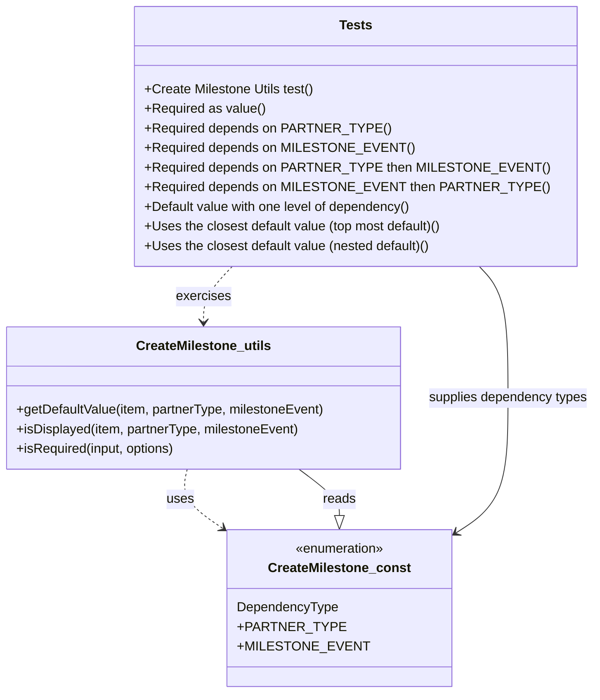

# Diagram: web/portal/src/pages/createmilestone/utils/tests/CreateMilestone.utils.tests.js

> Auto-generated by Obscura crawlers

## Mermaid

### SVG

<svg id="container" width="733.7421875" xmlns="http://www.w3.org/2000/svg" class="classDiagram" height="848" viewBox="0 0 733.7421875 848" role="graphics-document document" aria-roledescription="class"><g><defs><marker id="container_class-aggregationStart" class="marker aggregation class" refX="18" refY="7" markerWidth="190" markerHeight="240" orient="auto"><path d="M 18,7 L9,13 L1,7 L9,1 Z"></path></marker></defs><defs><marker id="container_class-aggregationEnd" class="marker aggregation class" refX="1" refY="7" markerWidth="20" markerHeight="28" orient="auto"><path d="M 18,7 L9,13 L1,7 L9,1 Z"></path></marker></defs><defs><marker id="container_class-extensionStart" class="marker extension class" refX="18" refY="7" markerWidth="190" markerHeight="240" orient="auto"><path d="M 1,7 L18,13 V 1 Z"></path></marker></defs><defs><marker id="container_class-extensionEnd" class="marker extension class" refX="1" refY="7" markerWidth="20" markerHeight="28" orient="auto"><path d="M 1,1 V 13 L18,7 Z"></path></marker></defs><defs><marker id="container_class-compositionStart" class="marker composition class" refX="18" refY="7" markerWidth="190" markerHeight="240" orient="auto"><path d="M 18,7 L9,13 L1,7 L9,1 Z"></path></marker></defs><defs><marker id="container_class-compositionEnd" class="marker composition class" refX="1" refY="7" markerWidth="20" markerHeight="28" orient="auto"><path d="M 18,7 L9,13 L1,7 L9,1 Z"></path></marker></defs><defs><marker id="container_class-dependencyStart" class="marker dependency class" refX="6" refY="7" markerWidth="190" markerHeight="240" orient="auto"><path d="M 5,7 L9,13 L1,7 L9,1 Z"></path></marker></defs><defs><marker id="container_class-dependencyEnd" class="marker dependency class" refX="13" refY="7" markerWidth="20" markerHeight="28" orient="auto"><path d="M 18,7 L9,13 L14,7 L9,1 Z"></path></marker></defs><defs><marker id="container_class-lollipopStart" class="marker lollipop class" refX="13" refY="7" markerWidth="190" markerHeight="240" orient="auto"><circle stroke="black" fill="transparent" cx="7" cy="7" r="6"></circle></marker></defs><defs><marker id="container_class-lollipopEnd" class="marker lollipop class" refX="1" refY="7" markerWidth="190" markerHeight="240" orient="auto"><circle stroke="black" fill="transparent" cx="7" cy="7" r="6"></circle></marker></defs><g class="root"><g class="clusters"></g><g class="edgePaths"><path d="M230.543,574L229.138,580.167C227.733,586.333,224.923,598.667,234.694,612.4C244.464,626.133,266.815,641.267,277.991,648.834L289.166,656.4" id="id_CreateMilestone_utils_CreateMilestone_const_1" class="edge-thickness-normal edge-pattern-dashed relation" style=";;;" data-edge="true" data-et="edge" data-id="id_CreateMilestone_utils_CreateMilestone_const_1" data-points="W3sieCI6MjMwLjU0MjcxNjczMzg3MDk4LCJ5Ijo1NzR9LHsieCI6MjIyLjExMzI4MTI1LCJ5Ijo2MTF9LHsieCI6Mjk0LjEzNDc2NTYyNSwieSI6NjU5Ljc2NDMzMDM4Njg4MzF9XQ==" marker-end="url(#container_class-dependencyEnd)"></path><path d="M285.888,326L279.967,332.167C274.046,338.333,262.205,350.667,256.284,362C250.363,373.333,250.363,383.667,250.363,388.833L250.363,394" id="id_Tests_CreateMilestone_utils_2" class="edge-thickness-normal edge-pattern-dashed relation" style=";;;" data-edge="true" data-et="edge" data-id="id_Tests_CreateMilestone_utils_2" data-points="W3sieCI6Mjg1Ljg4ODEwMzg3NDM2MjMsInkiOjMyNn0seyJ4IjoyNTAuMzYzMjgxMjUsInkiOjM2M30seyJ4IjoyNTAuMzYzMjgxMjUsInkiOjQwMH1d" marker-end="url(#container_class-dependencyEnd)"></path><path d="M418.545,630.75L418.545,627.458C418.545,624.167,418.545,617.583,410.181,608.125C401.817,598.667,385.089,586.333,376.726,580.167L368.362,574" id="id_CreateMilestone_const_CreateMilestone_utils_3" class="edge-thickness-normal edge-pattern-solid relation" style=";;;" data-edge="true" data-et="edge" data-id="id_CreateMilestone_const_CreateMilestone_utils_3" data-points="W3sieCI6NDE4LjU0NDkyMTg3NSwieSI6NjQ4fSx7IngiOjQxOC41NDQ5MjE4NzUsInkiOjYxMX0seyJ4IjozNjguMzYxNjkwMzk4MTg1NSwieSI6NTc0fV0=" marker-start="url(#container_class-extensionStart)"></path><path d="M591.21,326L597.13,332.167C603.051,338.333,614.893,350.667,620.814,377.5C626.734,404.333,626.734,445.667,626.734,487C626.734,528.333,626.734,569.667,613.614,598.715C600.493,627.764,574.252,644.528,561.132,652.91L548.011,661.292" id="id_Tests_CreateMilestone_const_4" class="edge-thickness-normal edge-pattern-solid relation" style=";;;" data-edge="true" data-et="edge" data-id="id_Tests_CreateMilestone_const_4" data-points="W3sieCI6NTkxLjIwOTU1MjM3NTYzNzcsInkiOjMyNn0seyJ4Ijo2MjYuNzM0Mzc1LCJ5IjozNjN9LHsieCI6NjI2LjczNDM3NSwieSI6NDg3fSx7IngiOjYyNi43MzQzNzUsInkiOjYxMX0seyJ4Ijo1NDIuOTU1MDc4MTI1LCJ5Ijo2NjQuNTIxNjY2NTI1OTQ0NX1d" marker-end="url(#container_class-dependencyEnd)"></path></g><g class="edgeLabels"><g class="edgeLabel" transform="translate(242.4126, 624.74427)"><g class="label" data-id="id_CreateMilestone_utils_CreateMilestone_const_1" transform="translate(-16.4921875, -12)"><foreignObject width="32.984375" height="24">

uses

</foreignObject></g></g><g class="edgeLabel" transform="translate(250.36328125, 363)"><g class="label" data-id="id_Tests_CreateMilestone_utils_2" transform="translate(-33.21875, -12)"><foreignObject width="66.4375" height="24">

exercises

</foreignObject></g></g><g class="edgeLabel" transform="translate(418.544921875, 611)"><g class="label" data-id="id_CreateMilestone_const_CreateMilestone_utils_3" transform="translate(-20.0078125, -12)"><foreignObject width="40.015625" height="24">

reads

</foreignObject></g></g><g class="edgeLabel" transform="translate(626.734375, 487)"><g class="label" data-id="id_Tests_CreateMilestone_const_4" transform="translate(-99.0078125, -12)"><foreignObject width="198.015625" height="24">

supplies dependency types

</foreignObject></g></g></g><g class="nodes"><g class="node default" id="classId-CreateMilestone_utils-0" transform="translate(250.36328125, 487)"><g class="basic label-container"><path d="M-242.36328125 -87 L242.36328125 -87 L242.36328125 87 L-242.36328125 87" stroke="none" stroke-width="0" fill="#ECECFF" style=""></path><path d="M-242.36328125 -87 C-130.63134913794806 -87, -18.8994170258961 -87, 242.36328125 -87 M-242.36328125 -87 C-86.62832046126138 -87, 69.10664032747724 -87, 242.36328125 -87 M242.36328125 -87 C242.36328125 -39.740147624853726, 242.36328125 7.519704750292547, 242.36328125 87 M242.36328125 -87 C242.36328125 -45.075922156532876, 242.36328125 -3.1518443130657516, 242.36328125 87 M242.36328125 87 C53.45781430848811 87, -135.44765263302378 87, -242.36328125 87 M242.36328125 87 C81.55701843419982 87, -79.24924438160036 87, -242.36328125 87 M-242.36328125 87 C-242.36328125 50.415815321966704, -242.36328125 13.831630643933408, -242.36328125 -87 M-242.36328125 87 C-242.36328125 17.45481291988719, -242.36328125 -52.09037416022562, -242.36328125 -87" stroke="#9370DB" stroke-width="1.3" fill="none" stroke-dasharray="0 0" style=""></path></g><g class="annotation-group text" transform="translate(0, -63)"></g><g class="label-group text" transform="translate(-79.3671875, -63)"><g class="label" style="font-weight: bolder" transform="translate(0,-12)"><foreignObject width="158.734375" height="24">

CreateMilestone_utils

</foreignObject></g></g><g class="members-group text" transform="translate(-230.36328125, -15)"></g><g class="methods-group text" transform="translate(-230.36328125, 15)"><g class="label" style="" transform="translate(0,-12)"><foreignObject width="381.359375" height="24">

+getDefaultValue(item, partnerType, milestoneEvent)

</foreignObject></g><g class="label" style="" transform="translate(0,12)"><foreignObject width="349.703125" height="24">

+isDisplayed(item, partnerType, milestoneEvent)

</foreignObject></g><g class="label" style="" transform="translate(0,36)"><foreignObject width="197.828125" height="24">

+isRequired(input, options)

</foreignObject></g></g><g class="divider" style=""><path d="M-242.36328125 -39 C-113.84671802937197 -39, 14.669845191256059 -39, 242.36328125 -39 M-242.36328125 -39 C-85.30782790299884 -39, 71.74762544400232 -39, 242.36328125 -39" stroke="#9370DB" stroke-width="1.3" fill="none" stroke-dasharray="0 0" style=""></path></g><g class="divider" style=""><path d="M-242.36328125 -15 C-67.30829915877683 -15, 107.74668293244633 -15, 242.36328125 -15 M-242.36328125 -15 C-121.38325425858451 -15, -0.40322726716902935 -15, 242.36328125 -15" stroke="#9370DB" stroke-width="1.3" fill="none" stroke-dasharray="0 0" style=""></path></g></g><g class="node default" id="classId-CreateMilestone_const-1" transform="translate(418.544921875, 744)"><g class="basic label-container"><path d="M-124.41015625 -96 L124.41015625 -96 L124.41015625 96 L-124.41015625 96" stroke="none" stroke-width="0" fill="#ECECFF" style=""></path><path d="M-124.41015625 -96 C-68.43769557564997 -96, -12.465234901299937 -96, 124.41015625 -96 M-124.41015625 -96 C-26.643503702505924 -96, 71.12314884498815 -96, 124.41015625 -96 M124.41015625 -96 C124.41015625 -37.01169667540239, 124.41015625 21.97660664919522, 124.41015625 96 M124.41015625 -96 C124.41015625 -28.74064554759775, 124.41015625 38.5187089048045, 124.41015625 96 M124.41015625 96 C62.65388324816996 96, 0.8976102463399229 96, -124.41015625 96 M124.41015625 96 C69.78012789300112 96, 15.150099536002244 96, -124.41015625 96 M-124.41015625 96 C-124.41015625 52.151909466886764, -124.41015625 8.303818933773528, -124.41015625 -96 M-124.41015625 96 C-124.41015625 20.3520000023982, -124.41015625 -55.2959999952036, -124.41015625 -96" stroke="#9370DB" stroke-width="1.3" fill="none" stroke-dasharray="0 0" style=""></path></g><g class="annotation-group text" transform="translate(-55.5546875, -72)"><g class="label" style="" transform="translate(0,-12)"><foreignObject width="111.109375" height="24">

«enumeration»

</foreignObject></g></g><g class="label-group text" transform="translate(-83.1171875, -48)"><g class="label" style="font-weight: bolder" transform="translate(0,-12)"><foreignObject width="166.234375" height="24">

CreateMilestone_const

</foreignObject></g></g><g class="members-group text" transform="translate(-112.41015625, 0)"><g class="label" style="" transform="translate(0,-12)"><foreignObject width="123.546875" height="24">

DependencyType

</foreignObject></g><g class="label" style="" transform="translate(0,12)"><foreignObject width="114.75" height="24">

+PARTNER_TYPE

</foreignObject></g><g class="label" style="" transform="translate(0,36)"><foreignObject width="141.703125" height="24">

+MILESTONE_EVENT

</foreignObject></g></g><g class="methods-group text" transform="translate(-112.41015625, 96)"></g><g class="divider" style=""><path d="M-124.41015625 -24 C-29.2194475718548 -24, 65.9712611062904 -24, 124.41015625 -24 M-124.41015625 -24 C-69.47094126161463 -24, -14.53172627322924 -24, 124.41015625 -24" stroke="#9370DB" stroke-width="1.3" fill="none" stroke-dasharray="0 0" style=""></path></g><g class="divider" style=""><path d="M-124.41015625 72 C-38.18734611849111 72, 48.03546401301779 72, 124.41015625 72 M-124.41015625 72 C-53.19528630924265 72, 18.019583631514706 72, 124.41015625 72" stroke="#9370DB" stroke-width="1.3" fill="none" stroke-dasharray="0 0" style=""></path></g></g><g class="node default" id="classId-Tests-2" transform="translate(438.548828125, 167)"><g class="basic label-container"><path d="M-251.78515625 -159 L251.78515625 -159 L251.78515625 159 L-251.78515625 159" stroke="none" stroke-width="0" fill="#ECECFF" style=""></path><path d="M-251.78515625 -159 C-124.76353076464756 -159, 2.2580947207048894 -159, 251.78515625 -159 M-251.78515625 -159 C-61.68578268583744 -159, 128.41359087832512 -159, 251.78515625 -159 M251.78515625 -159 C251.78515625 -42.939483729914485, 251.78515625 73.12103254017103, 251.78515625 159 M251.78515625 -159 C251.78515625 -82.72612195451535, 251.78515625 -6.452243909030699, 251.78515625 159 M251.78515625 159 C67.77641817672858 159, -116.23231989654283 159, -251.78515625 159 M251.78515625 159 C68.12195035331794 159, -115.54125554336412 159, -251.78515625 159 M-251.78515625 159 C-251.78515625 72.69554381633704, -251.78515625 -13.608912367325928, -251.78515625 -159 M-251.78515625 159 C-251.78515625 82.79638387227283, -251.78515625 6.592767744545654, -251.78515625 -159" stroke="#9370DB" stroke-width="1.3" fill="none" stroke-dasharray="0 0" style=""></path></g><g class="annotation-group text" transform="translate(0, -135)"></g><g class="label-group text" transform="translate(-19.1171875, -135)"><g class="label" style="font-weight: bolder" transform="translate(0,-12)"><foreignObject width="38.234375" height="24">

Tests

</foreignObject></g></g><g class="members-group text" transform="translate(-239.78515625, -87)"></g><g class="methods-group text" transform="translate(-239.78515625, -57)"><g class="label" style="" transform="translate(0,-12)"><foreignObject width="208.296875" height="24">

+Create Milestone Utils test()

</foreignObject></g><g class="label" style="" transform="translate(0,12)"><foreignObject width="147.265625" height="24">

+Required as value()

</foreignObject></g><g class="label" style="" transform="translate(0,36)"><foreignObject width="285.015625" height="24">

+Required depends on PARTNER_TYPE()

</foreignObject></g><g class="label" style="" transform="translate(0,60)"><foreignObject width="311.96875" height="24">

+Required depends on MILESTONE_EVENT()

</foreignObject></g><g class="label" style="" transform="translate(0,84)"><foreignObject width="460.453125" height="24">

+Required depends on PARTNER_TYPE then MILESTONE_EVENT()

</foreignObject></g><g class="label" style="" transform="translate(0,108)"><foreignObject width="460.453125" height="24">

+Required depends on MILESTONE_EVENT then PARTNER_TYPE()

</foreignObject></g><g class="label" style="" transform="translate(0,132)"><foreignObject width="332.03125" height="24">

+Default value with one level of dependency()

</foreignObject></g><g class="label" style="" transform="translate(0,156)"><foreignObject width="370.609375" height="24">

+Uses the closest default value (top most default)()

</foreignObject></g><g class="label" style="" transform="translate(0,180)"><foreignObject width="355.078125" height="24">

+Uses the closest default value (nested default)()

</foreignObject></g></g><g class="divider" style=""><path d="M-251.78515625 -111 C-62.29499618400587 -111, 127.19516388198826 -111, 251.78515625 -111 M-251.78515625 -111 C-70.98077601462947 -111, 109.82360422074106 -111, 251.78515625 -111" stroke="#9370DB" stroke-width="1.3" fill="none" stroke-dasharray="0 0" style=""></path></g><g class="divider" style=""><path d="M-251.78515625 -87 C-65.13366141387058 -87, 121.51783342225883 -87, 251.78515625 -87 M-251.78515625 -87 C-125.82713067328756 -87, 0.1308949034248883 -87, 251.78515625 -87" stroke="#9370DB" stroke-width="1.3" fill="none" stroke-dasharray="0 0" style=""></path></g></g></g></g></g></svg>
