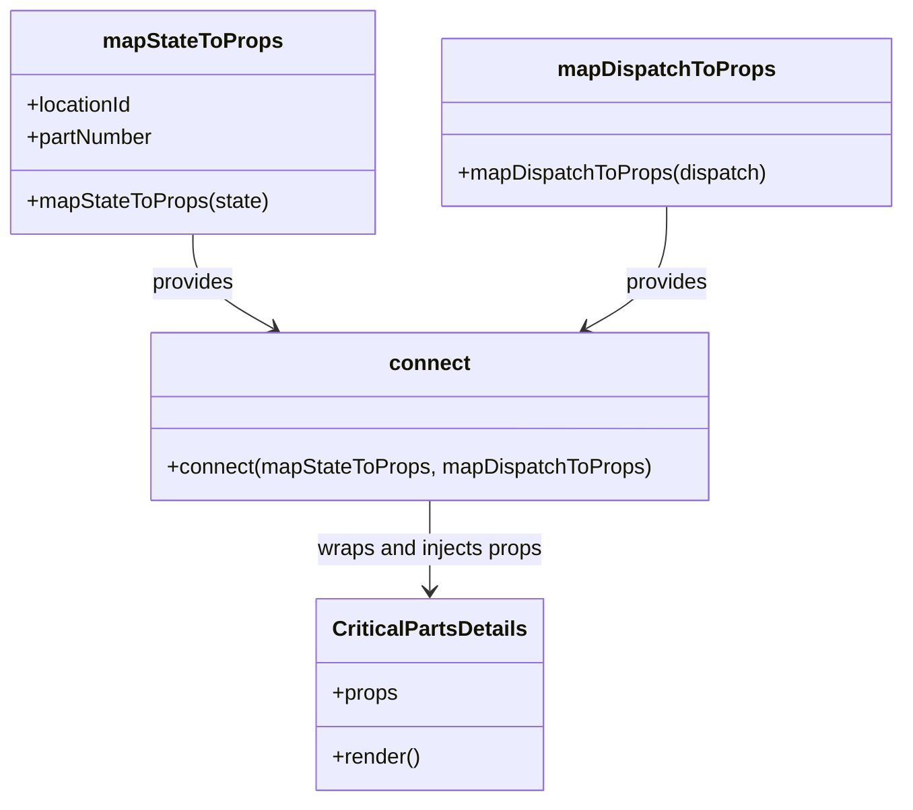

# Diagram: web/portal/src/pages/critical-parts/details/CriticalParts.Details.page.container.js


> Auto-generated by Obscura crawlers

## Diagram 1

```mermaid
flowchart LR
  state["Redux state"] -->|reads payload| mapStateToProps[mapStateToProps()]
  mapStateToProps -->|returns {locationId, partNumber}| props[Props object]
  state -->|available to| mapDispatchToProps[mapDispatchToProps()]
  mapDispatchToProps -->|returns {}| emptyProps[Empty dispatch props]
  props -->|merged by| connectFn[connect(mapStateToProps, mapDispatchToProps)]
  emptyProps --> connectFn
  connectFn -->|wraps| CriticalPartsDetails[CriticalPartsDetails Component]
```

> SVG rendering failed for this diagram.

## Diagram 2



### SVG

<svg id="container" width="670.421875" xmlns="http://www.w3.org/2000/svg" class="classDiagram" height="602" viewBox="0 0 670.421875 602" role="graphics-document document" aria-roledescription="class"><style>#container{font-family:"trebuchet ms",verdana,arial,sans-serif;font-size:16px;fill:#333;}@keyframes edge-animation-frame{from{stroke-dashoffset:0;}}@keyframes dash{to{stroke-dashoffset:0;}}#container .edge-animation-slow{stroke-dasharray:9,5!important;stroke-dashoffset:900;animation:dash 50s linear infinite;stroke-linecap:round;}#container .edge-animation-fast{stroke-dasharray:9,5!important;stroke-dashoffset:900;animation:dash 20s linear infinite;stroke-linecap:round;}#container .error-icon{fill:#552222;}#container .error-text{fill:#552222;stroke:#552222;}#container .edge-thickness-normal{stroke-width:1px;}#container .edge-thickness-thick{stroke-width:3.5px;}#container .edge-pattern-solid{stroke-dasharray:0;}#container .edge-thickness-invisible{stroke-width:0;fill:none;}#container .edge-pattern-dashed{stroke-dasharray:3;}#container .edge-pattern-dotted{stroke-dasharray:2;}#container .marker{fill:#333333;stroke:#333333;}#container .marker.cross{stroke:#333333;}#container svg{font-family:"trebuchet ms",verdana,arial,sans-serif;font-size:16px;}#container p{margin:0;}#container g.classGroup text{fill:#9370DB;stroke:none;font-family:"trebuchet ms",verdana,arial,sans-serif;font-size:10px;}#container g.classGroup text .title{font-weight:bolder;}#container .nodeLabel,#container .edgeLabel{color:#131300;}#container .edgeLabel .label rect{fill:#ECECFF;}#container .label text{fill:#131300;}#container .labelBkg{background:#ECECFF;}#container .edgeLabel .label span{background:#ECECFF;}#container .classTitle{font-weight:bolder;}#container .node rect,#container .node circle,#container .node ellipse,#container .node polygon,#container .node path{fill:#ECECFF;stroke:#9370DB;stroke-width:1px;}#container .divider{stroke:#9370DB;stroke-width:1;}#container g.clickable{cursor:pointer;}#container g.classGroup rect{fill:#ECECFF;stroke:#9370DB;}#container g.classGroup line{stroke:#9370DB;stroke-width:1;}#container .classLabel .box{stroke:none;stroke-width:0;fill:#ECECFF;opacity:0.5;}#container .classLabel .label{fill:#9370DB;font-size:10px;}#container .relation{stroke:#333333;stroke-width:1;fill:none;}#container .dashed-line{stroke-dasharray:3;}#container .dotted-line{stroke-dasharray:1 2;}#container #compositionStart,#container .composition{fill:#333333!important;stroke:#333333!important;stroke-width:1;}#container #compositionEnd,#container .composition{fill:#333333!important;stroke:#333333!important;stroke-width:1;}#container #dependencyStart,#container .dependency{fill:#333333!important;stroke:#333333!important;stroke-width:1;}#container #dependencyStart,#container .dependency{fill:#333333!important;stroke:#333333!important;stroke-width:1;}#container #extensionStart,#container .extension{fill:transparent!important;stroke:#333333!important;stroke-width:1;}#container #extensionEnd,#container .extension{fill:transparent!important;stroke:#333333!important;stroke-width:1;}#container #aggregationStart,#container .aggregation{fill:transparent!important;stroke:#333333!important;stroke-width:1;}#container #aggregationEnd,#container .aggregation{fill:transparent!important;stroke:#333333!important;stroke-width:1;}#container #lollipopStart,#container .lollipop{fill:#ECECFF!important;stroke:#333333!important;stroke-width:1;}#container #lollipopEnd,#container .lollipop{fill:#ECECFF!important;stroke:#333333!important;stroke-width:1;}#container .edgeTerminals{font-size:11px;line-height:initial;}#container .classTitleText{text-anchor:middle;font-size:18px;fill:#333;}#container .label-icon{display:inline-block;height:1em;overflow:visible;vertical-align:-0.125em;}#container .node .label-icon path{fill:currentColor;stroke:revert;stroke-width:revert;}#container :root{--mermaid-font-family:"trebuchet ms",verdana,arial,sans-serif;}</style><g><defs><marker id="container_class-aggregationStart" class="marker aggregation class" refX="18" refY="7" markerWidth="190" markerHeight="240" orient="auto"><path d="M 18,7 L9,13 L1,7 L9,1 Z"></path></marker></defs><defs><marker id="container_class-aggregationEnd" class="marker aggregation class" refX="1" refY="7" markerWidth="20" markerHeight="28" orient="auto"><path d="M 18,7 L9,13 L1,7 L9,1 Z"></path></marker></defs><defs><marker id="container_class-extensionStart" class="marker extension class" refX="18" refY="7" markerWidth="190" markerHeight="240" orient="auto"><path d="M 1,7 L18,13 V 1 Z"></path></marker></defs><defs><marker id="container_class-extensionEnd" class="marker extension class" refX="1" refY="7" markerWidth="20" markerHeight="28" orient="auto"><path d="M 1,1 V 13 L18,7 Z"></path></marker></defs><defs><marker id="container_class-compositionStart" class="marker composition class" refX="18" refY="7" markerWidth="190" markerHeight="240" orient="auto"><path d="M 18,7 L9,13 L1,7 L9,1 Z"></path></marker></defs><defs><marker id="container_class-compositionEnd" class="marker composition class" refX="1" refY="7" markerWidth="20" markerHeight="28" orient="auto"><path d="M 18,7 L9,13 L1,7 L9,1 Z"></path></marker></defs><defs><marker id="container_class-dependencyStart" class="marker dependency class" refX="6" refY="7" markerWidth="190" markerHeight="240" orient="auto"><path d="M 5,7 L9,13 L1,7 L9,1 Z"></path></marker></defs><defs><marker id="container_class-dependencyEnd" class="marker dependency class" refX="13" refY="7" markerWidth="20" markerHeight="28" orient="auto"><path d="M 18,7 L9,13 L14,7 L9,1 Z"></path></marker></defs><defs><marker id="container_class-lollipopStart" class="marker lollipop class" refX="13" refY="7" markerWidth="190" markerHeight="240" orient="auto"><circle stroke="black" fill="transparent" cx="7" cy="7" r="6"></circle></marker></defs><defs><marker id="container_class-lollipopEnd" class="marker lollipop class" refX="1" refY="7" markerWidth="190" markerHeight="240" orient="auto"><circle stroke="black" fill="transparent" cx="7" cy="7" r="6"></circle></marker></defs><g class="root"><g class="clusters"></g><g class="edgePaths"><path d="M143.082,176L143.082,182.167C143.082,188.333,143.082,200.667,153.072,212.506C163.063,224.346,183.043,235.692,193.033,241.364L203.024,247.037" id="id_mapStateToProps_connect_1" class="edge-thickness-normal edge-pattern-solid relation" style=";;;" data-edge="true" data-et="edge" data-id="id_mapStateToProps_connect_1" data-points="W3sieCI6MTQzLjA4MjAzMTI1LCJ5IjoxNzZ9LHsieCI6MTQzLjA4MjAzMTI1LCJ5IjoyMTN9LHsieCI6MjA4LjI0MTA1NDY4NzUsInkiOjI1MH1d" marker-end="url(#container_class-dependencyEnd)"></path><path d="M495.293,155L495.293,164.667C495.293,174.333,495.293,193.667,485.303,209.006C475.312,224.346,455.332,235.692,445.342,241.364L435.351,247.037" id="id_mapDispatchToProps_connect_2" class="edge-thickness-normal edge-pattern-solid relation" style=";;;" data-edge="true" data-et="edge" data-id="id_mapDispatchToProps_connect_2" data-points="W3sieCI6NDk1LjI5Mjk2ODc1LCJ5IjoxNTV9LHsieCI6NDk1LjI5Mjk2ODc1LCJ5IjoyMTN9LHsieCI6NDMwLjEzMzk0NTMxMjUwMDAzLCJ5IjoyNTB9XQ==" marker-end="url(#container_class-dependencyEnd)"></path><path d="M319.188,376L319.188,382.167C319.188,388.333,319.188,400.667,319.188,412C319.188,423.333,319.188,433.667,319.188,438.833L319.188,444" id="id_connect_CriticalPartsDetails_3" class="edge-thickness-normal edge-pattern-solid relation" style=";;;" data-edge="true" data-et="edge" data-id="id_connect_CriticalPartsDetails_3" data-points="W3sieCI6MzE5LjE4NzUsInkiOjM3Nn0seyJ4IjozMTkuMTg3NSwieSI6NDEzfSx7IngiOjMxOS4xODc1LCJ5Ijo0NTB9XQ==" marker-end="url(#container_class-dependencyEnd)"></path></g><g class="edgeLabels"><g class="edgeLabel" transform="translate(143.08203125, 213)"><g class="label" data-id="id_mapStateToProps_connect_1" transform="translate(-31.3125, -12)"><foreignObject width="62.625" height="24"><div xmlns="http://www.w3.org/1999/xhtml" class="labelBkg" style="display: table-cell; white-space: nowrap; line-height: 1.5; max-width: 200px; text-align: center;"><span class="edgeLabel"><p>provides</p></span></div></foreignObject></g></g><g class="edgeLabel" transform="translate(495.29296875, 213)"><g class="label" data-id="id_mapDispatchToProps_connect_2" transform="translate(-31.3125, -12)"><foreignObject width="62.625" height="24"><div xmlns="http://www.w3.org/1999/xhtml" class="labelBkg" style="display: table-cell; white-space: nowrap; line-height: 1.5; max-width: 200px; text-align: center;"><span class="edgeLabel"><p>provides</p></span></div></foreignObject></g></g><g class="edgeLabel" transform="translate(319.1875, 413)"><g class="label" data-id="id_connect_CriticalPartsDetails_3" transform="translate(-86.3203125, -12)"><foreignObject width="172.640625" height="24"><div xmlns="http://www.w3.org/1999/xhtml" class="labelBkg" style="display: table-cell; white-space: nowrap; line-height: 1.5; max-width: 200px; text-align: center;"><span class="edgeLabel"><p>wraps and injects props</p></span></div></foreignObject></g></g></g><g class="nodes"><g class="node default" id="classId-mapStateToProps-0" transform="translate(143.08203125, 92)"><g class="basic label-container"><path d="M-135.08203125 -84 L135.08203125 -84 L135.08203125 84 L-135.08203125 84" stroke="none" stroke-width="0" fill="#ECECFF" style=""></path><path d="M-135.08203125 -84 C-50.90326295879301 -84, 33.275505332413985 -84, 135.08203125 -84 M-135.08203125 -84 C-41.986525364489026 -84, 51.10898052102195 -84, 135.08203125 -84 M135.08203125 -84 C135.08203125 -21.05198658150526, 135.08203125 41.89602683698948, 135.08203125 84 M135.08203125 -84 C135.08203125 -31.41637977994192, 135.08203125 21.16724044011616, 135.08203125 84 M135.08203125 84 C76.02042030593286 84, 16.95880936186572 84, -135.08203125 84 M135.08203125 84 C64.59698672980205 84, -5.888057790395891 84, -135.08203125 84 M-135.08203125 84 C-135.08203125 47.282743067671454, -135.08203125 10.565486135342908, -135.08203125 -84 M-135.08203125 84 C-135.08203125 39.81876697175306, -135.08203125 -4.362466056493886, -135.08203125 -84" stroke="#9370DB" stroke-width="1.3" fill="none" stroke-dasharray="0 0" style=""></path></g><g class="annotation-group text" transform="translate(0, -60)"></g><g class="label-group text" transform="translate(-64.7109375, -60)"><g class="label" style="font-weight: bolder" transform="translate(0,-12)"><foreignObject width="129.421875" height="24"><div xmlns="http://www.w3.org/1999/xhtml" style="display: table-cell; white-space: nowrap; line-height: 1.5; max-width: 177px; text-align: center;"><span class="nodeLabel markdown-node-label" style=""><p>mapStateToProps</p></span></div></foreignObject></g></g><g class="members-group text" transform="translate(-123.08203125, -12)"><g class="label" style="" transform="translate(0,-12)"><foreignObject width="81.4375" height="24"><div xmlns="http://www.w3.org/1999/xhtml" style="display: table-cell; white-space: nowrap; line-height: 1.5; max-width: 139px; text-align: center;"><span class="nodeLabel markdown-node-label" style=""><p>+locationId</p></span></div></foreignObject></g><g class="label" style="" transform="translate(0,12)"><foreignObject width="96.34375" height="24"><div xmlns="http://www.w3.org/1999/xhtml" style="display: table-cell; white-space: nowrap; line-height: 1.5; max-width: 155px; text-align: center;"><span class="nodeLabel markdown-node-label" style=""><p>+partNumber</p></span></div></foreignObject></g></g><g class="methods-group text" transform="translate(-123.08203125, 60)"><g class="label" style="" transform="translate(0,-12)"><foreignObject width="181.453125" height="24"><div xmlns="http://www.w3.org/1999/xhtml" style="display: table-cell; white-space: nowrap; line-height: 1.5; max-width: 239px; text-align: center;"><span class="nodeLabel markdown-node-label" style=""><p>+mapStateToProps(state)</p></span></div></foreignObject></g></g><g class="divider" style=""><path d="M-135.08203125 -36 C-46.340709993031524 -36, 42.40061126393695 -36, 135.08203125 -36 M-135.08203125 -36 C-60.57077582305061 -36, 13.94047960389878 -36, 135.08203125 -36" stroke="#9370DB" stroke-width="1.3" fill="none" stroke-dasharray="0 0" style=""></path></g><g class="divider" style=""><path d="M-135.08203125 36 C-78.70950470967341 36, -22.336978169346807 36, 135.08203125 36 M-135.08203125 36 C-59.45530523935544 36, 16.17142077128912 36, 135.08203125 36" stroke="#9370DB" stroke-width="1.3" fill="none" stroke-dasharray="0 0" style=""></path></g></g><g class="node default" id="classId-mapDispatchToProps-1" transform="translate(495.29296875, 92)"><g class="basic label-container"><path d="M-167.12890625 -63 L167.12890625 -63 L167.12890625 63 L-167.12890625 63" stroke="none" stroke-width="0" fill="#ECECFF" style=""></path><path d="M-167.12890625 -63 C-35.45093406277351 -63, 96.22703812445297 -63, 167.12890625 -63 M-167.12890625 -63 C-98.92269124492951 -63, -30.71647623985902 -63, 167.12890625 -63 M167.12890625 -63 C167.12890625 -22.760585264953264, 167.12890625 17.478829470093473, 167.12890625 63 M167.12890625 -63 C167.12890625 -36.123369282316204, 167.12890625 -9.246738564632409, 167.12890625 63 M167.12890625 63 C76.65940667902012 63, -13.810092891959755 63, -167.12890625 63 M167.12890625 63 C64.2964530225699 63, -38.53600020486019 63, -167.12890625 63 M-167.12890625 63 C-167.12890625 14.864320005713061, -167.12890625 -33.27135998857388, -167.12890625 -63 M-167.12890625 63 C-167.12890625 13.30933242924813, -167.12890625 -36.38133514150374, -167.12890625 -63" stroke="#9370DB" stroke-width="1.3" fill="none" stroke-dasharray="0 0" style=""></path></g><g class="annotation-group text" transform="translate(0, -39)"></g><g class="label-group text" transform="translate(-77.1953125, -39)"><g class="label" style="font-weight: bolder" transform="translate(0,-12)"><foreignObject width="154.390625" height="24"><div xmlns="http://www.w3.org/1999/xhtml" style="display: table-cell; white-space: nowrap; line-height: 1.5; max-width: 203px; text-align: center;"><span class="nodeLabel markdown-node-label" style=""><p>mapDispatchToProps</p></span></div></foreignObject></g></g><g class="members-group text" transform="translate(-155.12890625, 9)"></g><g class="methods-group text" transform="translate(-155.12890625, 39)"><g class="label" style="" transform="translate(0,-12)"><foreignObject width="233.0625" height="24"><div xmlns="http://www.w3.org/1999/xhtml" style="display: table-cell; white-space: nowrap; line-height: 1.5; max-width: 290px; text-align: center;"><span class="nodeLabel markdown-node-label" style=""><p>+mapDispatchToProps(dispatch)</p></span></div></foreignObject></g></g><g class="divider" style=""><path d="M-167.12890625 -15 C-50.599756422110374 -15, 65.92939340577925 -15, 167.12890625 -15 M-167.12890625 -15 C-35.58278497486975 -15, 95.9633363002605 -15, 167.12890625 -15" stroke="#9370DB" stroke-width="1.3" fill="none" stroke-dasharray="0 0" style=""></path></g><g class="divider" style=""><path d="M-167.12890625 9 C-63.37941067424204 9, 40.37008490151592 9, 167.12890625 9 M-167.12890625 9 C-35.66849003398531 9, 95.79192618202939 9, 167.12890625 9" stroke="#9370DB" stroke-width="1.3" fill="none" stroke-dasharray="0 0" style=""></path></g></g><g class="node default" id="classId-connect-2" transform="translate(319.1875, 313)"><g class="basic label-container"><path d="M-208.23046875 -63 L208.23046875 -63 L208.23046875 63 L-208.23046875 63" stroke="none" stroke-width="0" fill="#ECECFF" style=""></path><path d="M-208.23046875 -63 C-44.97198625823083 -63, 118.28649623353834 -63, 208.23046875 -63 M-208.23046875 -63 C-42.64206705283658 -63, 122.94633464432684 -63, 208.23046875 -63 M208.23046875 -63 C208.23046875 -22.312013672432208, 208.23046875 18.375972655135584, 208.23046875 63 M208.23046875 -63 C208.23046875 -35.3436114775535, 208.23046875 -7.6872229551070035, 208.23046875 63 M208.23046875 63 C51.364778997790864 63, -105.50091075441827 63, -208.23046875 63 M208.23046875 63 C101.36051808538257 63, -5.509432579234868 63, -208.23046875 63 M-208.23046875 63 C-208.23046875 36.48431567096894, -208.23046875 9.96863134193788, -208.23046875 -63 M-208.23046875 63 C-208.23046875 15.509582439770824, -208.23046875 -31.98083512045835, -208.23046875 -63" stroke="#9370DB" stroke-width="1.3" fill="none" stroke-dasharray="0 0" style=""></path></g><g class="annotation-group text" transform="translate(0, -39)"></g><g class="label-group text" transform="translate(-28.9140625, -39)"><g class="label" style="font-weight: bolder" transform="translate(0,-12)"><foreignObject width="57.828125" height="24"><div xmlns="http://www.w3.org/1999/xhtml" style="display: table-cell; white-space: nowrap; line-height: 1.5; max-width: 108px; text-align: center;"><span class="nodeLabel markdown-node-label" style=""><p>connect</p></span></div></foreignObject></g></g><g class="members-group text" transform="translate(-196.23046875, 9)"></g><g class="methods-group text" transform="translate(-196.23046875, 39)"><g class="label" style="" transform="translate(0,-12)"><foreignObject width="363.546875" height="24"><div xmlns="http://www.w3.org/1999/xhtml" style="display: table-cell; white-space: nowrap; line-height: 1.5; max-width: 421px; text-align: center;"><span class="nodeLabel markdown-node-label" style=""><p>+connect(mapStateToProps, mapDispatchToProps)</p></span></div></foreignObject></g></g><g class="divider" style=""><path d="M-208.23046875 -15 C-56.16657883386296 -15, 95.89731108227409 -15, 208.23046875 -15 M-208.23046875 -15 C-109.11223049766802 -15, -9.993992245336045 -15, 208.23046875 -15" stroke="#9370DB" stroke-width="1.3" fill="none" stroke-dasharray="0 0" style=""></path></g><g class="divider" style=""><path d="M-208.23046875 9 C-91.9998658755309 9, 24.230736998938198 9, 208.23046875 9 M-208.23046875 9 C-82.45241120754538 9, 43.32564633490924 9, 208.23046875 9" stroke="#9370DB" stroke-width="1.3" fill="none" stroke-dasharray="0 0" style=""></path></g></g><g class="node default" id="classId-CriticalPartsDetails-3" transform="translate(319.1875, 522)"><g class="basic label-container"><path d="M-82.171875 -72 L82.171875 -72 L82.171875 72 L-82.171875 72" stroke="none" stroke-width="0" fill="#ECECFF" style=""></path><path d="M-82.171875 -72 C-35.388260073334166 -72, 11.395354853331668 -72, 82.171875 -72 M-82.171875 -72 C-23.10796836650688 -72, 35.95593826698624 -72, 82.171875 -72 M82.171875 -72 C82.171875 -15.545922039934133, 82.171875 40.90815592013173, 82.171875 72 M82.171875 -72 C82.171875 -35.40239628230497, 82.171875 1.19520743539006, 82.171875 72 M82.171875 72 C47.578119990154796 72, 12.984364980309593 72, -82.171875 72 M82.171875 72 C40.19995649864585 72, -1.7719620027083067 72, -82.171875 72 M-82.171875 72 C-82.171875 39.986564713346404, -82.171875 7.973129426692807, -82.171875 -72 M-82.171875 72 C-82.171875 30.87879904457637, -82.171875 -10.242401910847263, -82.171875 -72" stroke="#9370DB" stroke-width="1.3" fill="none" stroke-dasharray="0 0" style=""></path></g><g class="annotation-group text" transform="translate(0, -48)"></g><g class="label-group text" transform="translate(-70.171875, -48)"><g class="label" style="font-weight: bolder" transform="translate(0,-12)"><foreignObject width="140.34375" height="24"><div xmlns="http://www.w3.org/1999/xhtml" style="display: table-cell; white-space: nowrap; line-height: 1.5; max-width: 187px; text-align: center;"><span class="nodeLabel markdown-node-label" style=""><p>CriticalPartsDetails</p></span></div></foreignObject></g></g><g class="members-group text" transform="translate(-70.171875, 0)"><g class="label" style="" transform="translate(0,-12)"><foreignObject width="49.515625" height="24"><div xmlns="http://www.w3.org/1999/xhtml" style="display: table-cell; white-space: nowrap; line-height: 1.5; max-width: 107px; text-align: center;"><span class="nodeLabel markdown-node-label" style=""><p>+props</p></span></div></foreignObject></g></g><g class="methods-group text" transform="translate(-70.171875, 48)"><g class="label" style="" transform="translate(0,-12)"><foreignObject width="66.609375" height="24"><div xmlns="http://www.w3.org/1999/xhtml" style="display: table-cell; white-space: nowrap; line-height: 1.5; max-width: 124px; text-align: center;"><span class="nodeLabel markdown-node-label" style=""><p>+render()</p></span></div></foreignObject></g></g><g class="divider" style=""><path d="M-82.171875 -24 C-32.774717056813316 -24, 16.62244088637337 -24, 82.171875 -24 M-82.171875 -24 C-48.19708753302207 -24, -14.222300066044141 -24, 82.171875 -24" stroke="#9370DB" stroke-width="1.3" fill="none" stroke-dasharray="0 0" style=""></path></g><g class="divider" style=""><path d="M-82.171875 24 C-41.85544422025191 24, -1.5390134405038225 24, 82.171875 24 M-82.171875 24 C-44.88831653365995 24, -7.6047580673199064 24, 82.171875 24" stroke="#9370DB" stroke-width="1.3" fill="none" stroke-dasharray="0 0" style=""></path></g></g></g></g></g></svg>
