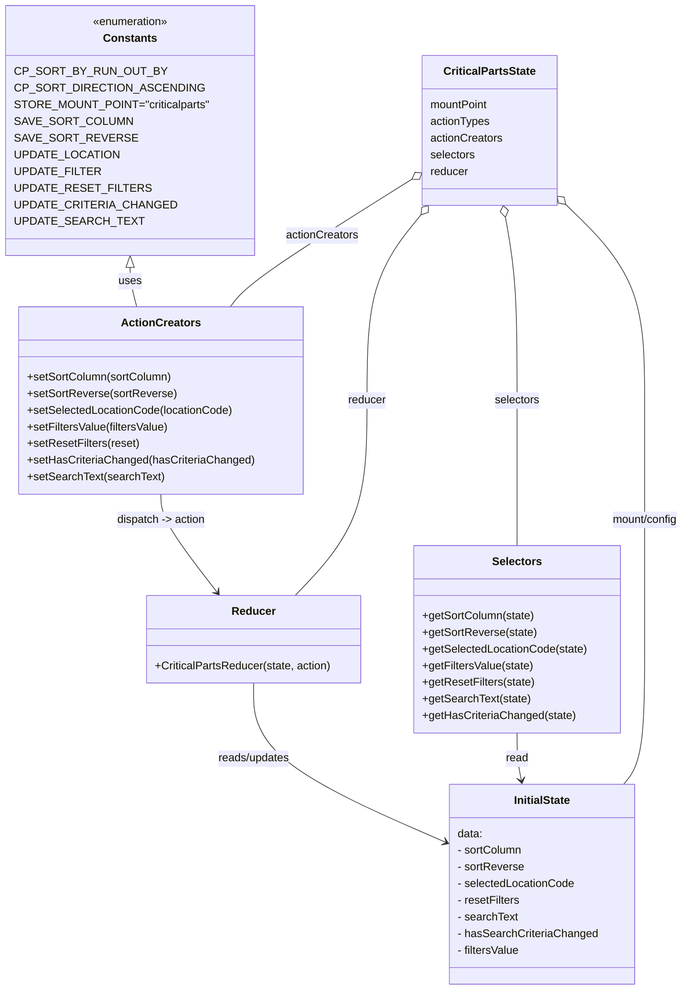

# Diagram: web/portal/src/pages/critical-parts/redux/CriticalParts.state.js


> Auto-generated by Obscura crawlers

## Diagram 1



### SVG

<svg id="container" width="973.212890625" xmlns="http://www.w3.org/2000/svg" class="classDiagram" height="1426" viewBox="0 0 973.212890625 1426" role="graphics-document document" aria-roledescription="class"><style>#container{font-family:"trebuchet ms",verdana,arial,sans-serif;font-size:16px;fill:#333;}@keyframes edge-animation-frame{from{stroke-dashoffset:0;}}@keyframes dash{to{stroke-dashoffset:0;}}#container .edge-animation-slow{stroke-dasharray:9,5!important;stroke-dashoffset:900;animation:dash 50s linear infinite;stroke-linecap:round;}#container .edge-animation-fast{stroke-dasharray:9,5!important;stroke-dashoffset:900;animation:dash 20s linear infinite;stroke-linecap:round;}#container .error-icon{fill:#552222;}#container .error-text{fill:#552222;stroke:#552222;}#container .edge-thickness-normal{stroke-width:1px;}#container .edge-thickness-thick{stroke-width:3.5px;}#container .edge-pattern-solid{stroke-dasharray:0;}#container .edge-thickness-invisible{stroke-width:0;fill:none;}#container .edge-pattern-dashed{stroke-dasharray:3;}#container .edge-pattern-dotted{stroke-dasharray:2;}#container .marker{fill:#333333;stroke:#333333;}#container .marker.cross{stroke:#333333;}#container svg{font-family:"trebuchet ms",verdana,arial,sans-serif;font-size:16px;}#container p{margin:0;}#container g.classGroup text{fill:#9370DB;stroke:none;font-family:"trebuchet ms",verdana,arial,sans-serif;font-size:10px;}#container g.classGroup text .title{font-weight:bolder;}#container .nodeLabel,#container .edgeLabel{color:#131300;}#container .edgeLabel .label rect{fill:#ECECFF;}#container .label text{fill:#131300;}#container .labelBkg{background:#ECECFF;}#container .edgeLabel .label span{background:#ECECFF;}#container .classTitle{font-weight:bolder;}#container .node rect,#container .node circle,#container .node ellipse,#container .node polygon,#container .node path{fill:#ECECFF;stroke:#9370DB;stroke-width:1px;}#container .divider{stroke:#9370DB;stroke-width:1;}#container g.clickable{cursor:pointer;}#container g.classGroup rect{fill:#ECECFF;stroke:#9370DB;}#container g.classGroup line{stroke:#9370DB;stroke-width:1;}#container .classLabel .box{stroke:none;stroke-width:0;fill:#ECECFF;opacity:0.5;}#container .classLabel .label{fill:#9370DB;font-size:10px;}#container .relation{stroke:#333333;stroke-width:1;fill:none;}#container .dashed-line{stroke-dasharray:3;}#container .dotted-line{stroke-dasharray:1 2;}#container #compositionStart,#container .composition{fill:#333333!important;stroke:#333333!important;stroke-width:1;}#container #compositionEnd,#container .composition{fill:#333333!important;stroke:#333333!important;stroke-width:1;}#container #dependencyStart,#container .dependency{fill:#333333!important;stroke:#333333!important;stroke-width:1;}#container #dependencyStart,#container .dependency{fill:#333333!important;stroke:#333333!important;stroke-width:1;}#container #extensionStart,#container .extension{fill:transparent!important;stroke:#333333!important;stroke-width:1;}#container #extensionEnd,#container .extension{fill:transparent!important;stroke:#333333!important;stroke-width:1;}#container #aggregationStart,#container .aggregation{fill:transparent!important;stroke:#333333!important;stroke-width:1;}#container #aggregationEnd,#container .aggregation{fill:transparent!important;stroke:#333333!important;stroke-width:1;}#container #lollipopStart,#container .lollipop{fill:#ECECFF!important;stroke:#333333!important;stroke-width:1;}#container #lollipopEnd,#container .lollipop{fill:#ECECFF!important;stroke:#333333!important;stroke-width:1;}#container .edgeTerminals{font-size:11px;line-height:initial;}#container .classTitleText{text-anchor:middle;font-size:18px;fill:#333;}#container .label-icon{display:inline-block;height:1em;overflow:visible;vertical-align:-0.125em;}#container .node .label-icon path{fill:currentColor;stroke:revert;stroke-width:revert;}#container :root{--mermaid-font-family:"trebuchet ms",verdana,arial,sans-serif;}</style><g><defs><marker id="container_class-aggregationStart" class="marker aggregation class" refX="18" refY="7" markerWidth="190" markerHeight="240" orient="auto"><path d="M 18,7 L9,13 L1,7 L9,1 Z"></path></marker></defs><defs><marker id="container_class-aggregationEnd" class="marker aggregation class" refX="1" refY="7" markerWidth="20" markerHeight="28" orient="auto"><path d="M 18,7 L9,13 L1,7 L9,1 Z"></path></marker></defs><defs><marker id="container_class-extensionStart" class="marker extension class" refX="18" refY="7" markerWidth="190" markerHeight="240" orient="auto"><path d="M 1,7 L18,13 V 1 Z"></path></marker></defs><defs><marker id="container_class-extensionEnd" class="marker extension class" refX="1" refY="7" markerWidth="20" markerHeight="28" orient="auto"><path d="M 1,1 V 13 L18,7 Z"></path></marker></defs><defs><marker id="container_class-compositionStart" class="marker composition class" refX="18" refY="7" markerWidth="190" markerHeight="240" orient="auto"><path d="M 18,7 L9,13 L1,7 L9,1 Z"></path></marker></defs><defs><marker id="container_class-compositionEnd" class="marker composition class" refX="1" refY="7" markerWidth="20" markerHeight="28" orient="auto"><path d="M 18,7 L9,13 L1,7 L9,1 Z"></path></marker></defs><defs><marker id="container_class-dependencyStart" class="marker dependency class" refX="6" refY="7" markerWidth="190" markerHeight="240" orient="auto"><path d="M 5,7 L9,13 L1,7 L9,1 Z"></path></marker></defs><defs><marker id="container_class-dependencyEnd" class="marker dependency class" refX="13" refY="7" markerWidth="20" markerHeight="28" orient="auto"><path d="M 18,7 L9,13 L14,7 L9,1 Z"></path></marker></defs><defs><marker id="container_class-lollipopStart" class="marker lollipop class" refX="13" refY="7" markerWidth="190" markerHeight="240" orient="auto"><circle stroke="black" fill="transparent" cx="7" cy="7" r="6"></circle></marker></defs><defs><marker id="container_class-lollipopEnd" class="marker lollipop class" refX="1" refY="7" markerWidth="190" markerHeight="240" orient="auto"><circle stroke="black" fill="transparent" cx="7" cy="7" r="6"></circle></marker></defs><g class="root"><g class="clusters"></g><g class="edgePaths"><path d="M180.707,385.25L180.707,388.542C180.707,391.833,180.707,398.417,182.305,407.875C183.904,417.333,187.101,429.667,188.699,435.833L190.297,442" id="id_Constants_ActionCreators_1" class="edge-thickness-normal edge-pattern-solid relation" style=";;;" data-edge="true" data-et="edge" data-id="id_Constants_ActionCreators_1" data-points="W3sieCI6MTgwLjcwNzAzMTI1LCJ5IjozNjh9LHsieCI6MTgwLjcwNzAzMTI1LCJ5Ijo0MDV9LHsieCI6MTkwLjI5NzM1MTkyNTg3MjA4LCJ5Ijo0NDJ9XQ==" marker-start="url(#container_class-extensionStart)"></path><path d="M225.289,712L225.289,718.167C225.289,724.333,225.289,736.667,238.608,760.206C251.926,783.746,278.563,818.492,291.882,835.865L305.201,853.238" id="id_ActionCreators_Reducer_2" class="edge-thickness-normal edge-pattern-solid relation" style=";;;" data-edge="true" data-et="edge" data-id="id_ActionCreators_Reducer_2" data-points="W3sieCI6MjI1LjI4OTA2MjUsInkiOjcxMn0seyJ4IjoyMjUuMjg5MDYyNSwieSI6NzQ5fSx7IngiOjMwOC44NTExMDgyODQ4ODM3LCJ5Ijo4NTh9XQ==" marker-end="url(#container_class-dependencyEnd)"></path><path d="M357.148,984L357.148,1002.167C357.148,1020.333,357.148,1056.667,402.847,1094.9C448.546,1133.134,539.943,1173.268,585.642,1193.336L631.34,1213.403" id="id_Reducer_InitialState_3" class="edge-thickness-normal edge-pattern-solid relation" style=";;;" data-edge="true" data-et="edge" data-id="id_Reducer_InitialState_3" data-points="W3sieCI6MzU3LjE0ODQzNzUsInkiOjk4NH0seyJ4IjozNTcuMTQ4NDM3NSwieSI6MTA5M30seyJ4Ijo2MzYuODMzOTg0Mzc1LCJ5IjoxMjE1LjgxNTA4ODA2MzQ1Njl9XQ==" marker-end="url(#container_class-dependencyEnd)"></path><path d="M733.002,1056L733.002,1062.167C733.002,1068.333,733.002,1080.667,734.043,1092.02C735.084,1103.372,737.167,1113.745,738.208,1118.931L739.249,1124.117" id="id_Selectors_InitialState_4" class="edge-thickness-normal edge-pattern-solid relation" style=";;;" data-edge="true" data-et="edge" data-id="id_Selectors_InitialState_4" data-points="W3sieCI6NzMzLjAwMTk1MzEyNSwieSI6MTA1Nn0seyJ4Ijo3MzMuMDAxOTUzMTI1LCJ5IjoxMDkzfSx7IngiOjc0MC40Mjk3NDE0NTM3MjkzLCJ5IjoxMTMwfV0=" marker-end="url(#container_class-dependencyEnd)"></path><path d="M581.497,258.158L542.687,282.632C503.877,307.105,426.258,356.053,383.026,386.693C339.794,417.333,330.949,429.667,326.527,435.833L322.104,442" id="id_CriticalPartsState_ActionCreators_5" class="edge-thickness-normal edge-pattern-solid relation" style=";;;" data-edge="true" data-et="edge" data-id="id_CriticalPartsState_ActionCreators_5" data-points="W3sieCI6NTk2LjA4Nzg5MDYyNSwieSI6MjQ4Ljk1Njk2NTkzMzcyOTEyfSx7IngiOjM0OC42Mzg2NzE4NzUsInkiOjQwNX0seyJ4IjozMjIuMTA0MTYyODgxNTQwNywieSI6NDQyfV0=" marker-start="url(#container_class-aggregationStart)"></path><path d="M715.93,312.961L718.775,328.301C721.621,343.64,727.311,374.32,730.157,418.327C733.002,462.333,733.002,519.667,733.002,577C733.002,634.333,733.002,691.667,733.002,726.5C733.002,761.333,733.002,773.667,733.002,779.833L733.002,786" id="id_CriticalPartsState_Selectors_6" class="edge-thickness-normal edge-pattern-solid relation" style=";;;" data-edge="true" data-et="edge" data-id="id_CriticalPartsState_Selectors_6" data-points="W3sieCI6NzEyLjc4NDIxMTE4OTUxNjEsInkiOjI5Nn0seyJ4Ijo3MzMuMDAxOTUzMTI1LCJ5Ijo0MDV9LHsieCI6NzMzLjAwMTk1MzEyNSwieSI6NTc3fSx7IngiOjczMy4wMDE5NTMxMjUsInkiOjc0OX0seyJ4Ijo3MzMuMDAxOTUzMTI1LCJ5Ijo3ODZ9XQ==" marker-start="url(#container_class-aggregationStart)"></path><path d="M594.335,309.4L581.418,325.333C568.502,341.267,542.668,373.133,529.751,417.733C516.834,462.333,516.834,519.667,516.834,577C516.834,634.333,516.834,691.667,499.968,738.5C483.102,785.333,449.37,821.667,432.504,839.833L415.638,858" id="id_CriticalPartsState_Reducer_7" class="edge-thickness-normal edge-pattern-solid relation" style=";;;" data-edge="true" data-et="edge" data-id="id_CriticalPartsState_Reducer_7" data-points="W3sieCI6NjA1LjE5ODMwOTY5MTgyMDIsInkiOjI5Nn0seyJ4Ijo1MTYuODMzOTg0Mzc1LCJ5Ijo0MDV9LHsieCI6NTE2LjgzMzk4NDM3NSwieSI6NTc3fSx7IngiOjUxNi44MzM5ODQzNzUsInkiOjc0OX0seyJ4Ijo0MTUuNjM3OTExMDY0NjgwMiwieSI6ODU4fV0=" marker-start="url(#container_class-aggregationStart)"></path><path d="M801.783,294.023L820.804,312.519C839.825,331.015,877.866,368.008,896.887,415.171C915.908,462.333,915.908,519.667,915.908,577C915.908,634.333,915.908,691.667,915.908,749C915.908,806.333,915.908,863.667,915.908,921C915.908,978.333,915.908,1035.667,910.915,1070.5C905.921,1105.333,895.934,1117.667,890.94,1123.833L885.946,1130" id="id_CriticalPartsState_InitialState_8" class="edge-thickness-normal edge-pattern-solid relation" style=";;;" data-edge="true" data-et="edge" data-id="id_CriticalPartsState_InitialState_8" data-points="W3sieCI6Nzg5LjQxNjAxNTYyNSwieSI6MjgxLjk5NzM3NDMxNzMyMjV9LHsieCI6OTE1LjkwODIwMzEyNSwieSI6NDA1fSx7IngiOjkxNS45MDgyMDMxMjUsInkiOjU3N30seyJ4Ijo5MTUuOTA4MjAzMTI1LCJ5Ijo3NDl9LHsieCI6OTE1LjkwODIwMzEyNSwieSI6OTIxfSx7IngiOjkxNS45MDgyMDMxMjUsInkiOjEwOTN9LHsieCI6ODg1Ljk0NjMxNjAzOTM2NDcsInkiOjExMzB9XQ==" marker-start="url(#container_class-aggregationStart)"></path></g><g class="edgeLabels"><g class="edgeLabel" transform="translate(180.70703125, 405)"><g class="label" data-id="id_Constants_ActionCreators_1" transform="translate(-16.4921875, -12)"><foreignObject width="32.984375" height="24"><div xmlns="http://www.w3.org/1999/xhtml" class="labelBkg" style="display: table-cell; white-space: nowrap; line-height: 1.5; max-width: 200px; text-align: center;"><span class="edgeLabel"><p>uses</p></span></div></foreignObject></g></g><g class="edgeLabel" transform="translate(225.2890625, 749)"><g class="label" data-id="id_ActionCreators_Reducer_2" transform="translate(-65.2265625, -12)"><foreignObject width="130.453125" height="24"><div xmlns="http://www.w3.org/1999/xhtml" class="labelBkg" style="display: table-cell; white-space: nowrap; line-height: 1.5; max-width: 200px; text-align: center;"><span class="edgeLabel"><p>dispatch -&gt; action</p></span></div></foreignObject></g></g><g class="edgeLabel" transform="translate(357.1484375, 1093)"><g class="label" data-id="id_Reducer_InitialState_3" transform="translate(-53.328125, -12)"><foreignObject width="106.65625" height="24"><div xmlns="http://www.w3.org/1999/xhtml" class="labelBkg" style="display: table-cell; white-space: nowrap; line-height: 1.5; max-width: 200px; text-align: center;"><span class="edgeLabel"><p>reads/updates</p></span></div></foreignObject></g></g><g class="edgeLabel" transform="translate(733.001953125, 1093)"><g class="label" data-id="id_Selectors_InitialState_4" transform="translate(-16.265625, -12)"><foreignObject width="32.53125" height="24"><div xmlns="http://www.w3.org/1999/xhtml" class="labelBkg" style="display: table-cell; white-space: nowrap; line-height: 1.5; max-width: 200px; text-align: center;"><span class="edgeLabel"><p>read</p></span></div></foreignObject></g></g><g class="edgeLabel" transform="translate(453.10681, 339.12173)"><g class="label" data-id="id_CriticalPartsState_ActionCreators_5" transform="translate(-52.671875, -12)"><foreignObject width="105.34375" height="24"><div xmlns="http://www.w3.org/1999/xhtml" class="labelBkg" style="display: table-cell; white-space: nowrap; line-height: 1.5; max-width: 200px; text-align: center;"><span class="edgeLabel"><p>actionCreators</p></span></div></foreignObject></g></g><g class="edgeLabel" transform="translate(733.001953125, 577)"><g class="label" data-id="id_CriticalPartsState_Selectors_6" transform="translate(-32.734375, -12)"><foreignObject width="65.46875" height="24"><div xmlns="http://www.w3.org/1999/xhtml" class="labelBkg" style="display: table-cell; white-space: nowrap; line-height: 1.5; max-width: 200px; text-align: center;"><span class="edgeLabel"><p>selectors</p></span></div></foreignObject></g></g><g class="edgeLabel" transform="translate(516.833984375, 577)"><g class="label" data-id="id_CriticalPartsState_Reducer_7" transform="translate(-27.765625, -12)"><foreignObject width="55.53125" height="24"><div xmlns="http://www.w3.org/1999/xhtml" class="labelBkg" style="display: table-cell; white-space: nowrap; line-height: 1.5; max-width: 200px; text-align: center;"><span class="edgeLabel"><p>reducer</p></span></div></foreignObject></g></g><g class="edgeLabel" transform="translate(915.908203125, 749)"><g class="label" data-id="id_CriticalPartsState_InitialState_8" transform="translate(-49.3046875, -12)"><foreignObject width="98.609375" height="24"><div xmlns="http://www.w3.org/1999/xhtml" class="labelBkg" style="display: table-cell; white-space: nowrap; line-height: 1.5; max-width: 200px; text-align: center;"><span class="edgeLabel"><p>mount/config</p></span></div></foreignObject></g></g></g><g class="nodes"><g class="node default" id="classId-Constants-0" transform="translate(180.70703125, 188)"><g class="basic label-container"><path d="M-172.70703125 -180 L172.70703125 -180 L172.70703125 180 L-172.70703125 180" stroke="none" stroke-width="0" fill="#ECECFF" style=""></path><path d="M-172.70703125 -180 C-44.81762800662075 -180, 83.0717752367585 -180, 172.70703125 -180 M-172.70703125 -180 C-46.70264135175201 -180, 79.30174854649599 -180, 172.70703125 -180 M172.70703125 -180 C172.70703125 -96.27295752793846, 172.70703125 -12.545915055876918, 172.70703125 180 M172.70703125 -180 C172.70703125 -42.18960101373702, 172.70703125 95.62079797252596, 172.70703125 180 M172.70703125 180 C48.46339503798248 180, -75.78024117403504 180, -172.70703125 180 M172.70703125 180 C77.21632467408331 180, -18.27438190183338 180, -172.70703125 180 M-172.70703125 180 C-172.70703125 106.35562047843749, -172.70703125 32.711240956874974, -172.70703125 -180 M-172.70703125 180 C-172.70703125 44.46595435795149, -172.70703125 -91.06809128409702, -172.70703125 -180" stroke="#9370DB" stroke-width="1.3" fill="none" stroke-dasharray="0 0" style=""></path></g><g class="annotation-group text" transform="translate(-55.5546875, -156)"><g class="label" style="" transform="translate(0,-12)"><foreignObject width="111.109375" height="24"><div xmlns="http://www.w3.org/1999/xhtml" style="display: table-cell; white-space: nowrap; line-height: 1.5; max-width: 161px; text-align: center;"><span class="nodeLabel markdown-node-label" style=""><p>«enumeration»</p></span></div></foreignObject></g></g><g class="label-group text" transform="translate(-36.5390625, -132)"><g class="label" style="font-weight: bolder" transform="translate(0,-12)"><foreignObject width="73.078125" height="24"><div xmlns="http://www.w3.org/1999/xhtml" style="display: table-cell; white-space: nowrap; line-height: 1.5; max-width: 122px; text-align: center;"><span class="nodeLabel markdown-node-label" style=""><p>Constants</p></span></div></foreignObject></g></g><g class="members-group text" transform="translate(-160.70703125, -84)"><g class="label" style="" transform="translate(0,-12)"><foreignObject width="189.15625" height="24"><div xmlns="http://www.w3.org/1999/xhtml" style="display: table-cell; white-space: nowrap; line-height: 1.5; max-width: 239px; text-align: center;"><span class="nodeLabel markdown-node-label" style=""><p>CP_SORT_BY_RUN_OUT_BY</p></span></div></foreignObject></g><g class="label" style="" transform="translate(0,12)"><foreignObject width="237.171875" height="24"><div xmlns="http://www.w3.org/1999/xhtml" style="display: table-cell; white-space: nowrap; line-height: 1.5; max-width: 287px; text-align: center;"><span class="nodeLabel markdown-node-label" style=""><p>CP_SORT_DIRECTION_ASCENDING</p></span></div></foreignObject></g><g class="label" style="" transform="translate(0,36)"><foreignObject width="265.859375" height="24"><div xmlns="http://www.w3.org/1999/xhtml" style="display: table-cell; white-space: nowrap; line-height: 1.5; max-width: 316px; text-align: center;"><span class="nodeLabel markdown-node-label" style=""><p>STORE_MOUNT_POINT="criticalparts"</p></span></div></foreignObject></g><g class="label" style="" transform="translate(0,60)"><foreignObject width="148.59375" height="24"><div xmlns="http://www.w3.org/1999/xhtml" style="display: table-cell; white-space: nowrap; line-height: 1.5; max-width: 199px; text-align: center;"><span class="nodeLabel markdown-node-label" style=""><p>SAVE_SORT_COLUMN</p></span></div></foreignObject></g><g class="label" style="" transform="translate(0,84)"><foreignObject width="150.53125" height="24"><div xmlns="http://www.w3.org/1999/xhtml" style="display: table-cell; white-space: nowrap; line-height: 1.5; max-width: 201px; text-align: center;"><span class="nodeLabel markdown-node-label" style=""><p>SAVE_SORT_REVERSE</p></span></div></foreignObject></g><g class="label" style="" transform="translate(0,108)"><foreignObject width="134.203125" height="24"><div xmlns="http://www.w3.org/1999/xhtml" style="display: table-cell; white-space: nowrap; line-height: 1.5; max-width: 184px; text-align: center;"><span class="nodeLabel markdown-node-label" style=""><p>UPDATE_LOCATION</p></span></div></foreignObject></g><g class="label" style="" transform="translate(0,132)"><foreignObject width="109.28125" height="24"><div xmlns="http://www.w3.org/1999/xhtml" style="display: table-cell; white-space: nowrap; line-height: 1.5; max-width: 160px; text-align: center;"><span class="nodeLabel markdown-node-label" style=""><p>UPDATE_FILTER</p></span></div></foreignObject></g><g class="label" style="" transform="translate(0,156)"><foreignObject width="169.046875" height="24"><div xmlns="http://www.w3.org/1999/xhtml" style="display: table-cell; white-space: nowrap; line-height: 1.5; max-width: 219px; text-align: center;"><span class="nodeLabel markdown-node-label" style=""><p>UPDATE_RESET_FILTERS</p></span></div></foreignObject></g><g class="label" style="" transform="translate(0,180)"><foreignObject width="203.25" height="24"><div xmlns="http://www.w3.org/1999/xhtml" style="display: table-cell; white-space: nowrap; line-height: 1.5; max-width: 253px; text-align: center;"><span class="nodeLabel markdown-node-label" style=""><p>UPDATE_CRITERIA_CHANGED</p></span></div></foreignObject></g><g class="label" style="" transform="translate(0,204)"><foreignObject width="160.328125" height="24"><div xmlns="http://www.w3.org/1999/xhtml" style="display: table-cell; white-space: nowrap; line-height: 1.5; max-width: 211px; text-align: center;"><span class="nodeLabel markdown-node-label" style=""><p>UPDATE_SEARCH_TEXT</p></span></div></foreignObject></g></g><g class="methods-group text" transform="translate(-160.70703125, 180)"></g><g class="divider" style=""><path d="M-172.70703125 -108 C-55.40670647655 -108, 61.8936182969 -108, 172.70703125 -108 M-172.70703125 -108 C-93.5859610136565 -108, -14.464890777313002 -108, 172.70703125 -108" stroke="#9370DB" stroke-width="1.3" fill="none" stroke-dasharray="0 0" style=""></path></g><g class="divider" style=""><path d="M-172.70703125 156 C-52.65072591994684 156, 67.40557941010633 156, 172.70703125 156 M-172.70703125 156 C-46.20549859393793 156, 80.29603406212414 156, 172.70703125 156" stroke="#9370DB" stroke-width="1.3" fill="none" stroke-dasharray="0 0" style=""></path></g></g><g class="node default" id="classId-InitialState-1" transform="translate(769.337890625, 1274)"><g class="basic label-container"><path d="M-132.50390625 -144 L132.50390625 -144 L132.50390625 144 L-132.50390625 144" stroke="none" stroke-width="0" fill="#ECECFF" style=""></path><path d="M-132.50390625 -144 C-75.7288128432011 -144, -18.953719436402196 -144, 132.50390625 -144 M-132.50390625 -144 C-33.22238803598604 -144, 66.05913017802791 -144, 132.50390625 -144 M132.50390625 -144 C132.50390625 -84.21435066005704, 132.50390625 -24.428701320114072, 132.50390625 144 M132.50390625 -144 C132.50390625 -39.710380474107296, 132.50390625 64.57923905178541, 132.50390625 144 M132.50390625 144 C48.96811067962457 144, -34.567684890750854 144, -132.50390625 144 M132.50390625 144 C50.187024036102585 144, -32.12985817779483 144, -132.50390625 144 M-132.50390625 144 C-132.50390625 80.19316449431476, -132.50390625 16.386328988629515, -132.50390625 -144 M-132.50390625 144 C-132.50390625 38.44192935724922, -132.50390625 -67.11614128550156, -132.50390625 -144" stroke="#9370DB" stroke-width="1.3" fill="none" stroke-dasharray="0 0" style=""></path></g><g class="annotation-group text" transform="translate(0, -120)"></g><g class="label-group text" transform="translate(-40.5546875, -120)"><g class="label" style="font-weight: bolder" transform="translate(0,-12)"><foreignObject width="81.109375" height="24"><div xmlns="http://www.w3.org/1999/xhtml" style="display: table-cell; white-space: nowrap; line-height: 1.5; max-width: 129px; text-align: center;"><span class="nodeLabel markdown-node-label" style=""><p>InitialState</p></span></div></foreignObject></g></g><g class="members-group text" transform="translate(-120.50390625, -72)"><g class="label" style="" transform="translate(0,-12)"><foreignObject width="36.484375" height="24"><div xmlns="http://www.w3.org/1999/xhtml" style="display: table-cell; white-space: nowrap; line-height: 1.5; max-width: 87px; text-align: center;"><span class="nodeLabel markdown-node-label" style=""><p>data:</p></span></div></foreignObject></g><g class="label" style="" transform="translate(0,12)"><foreignObject width="94.53125" height="24"><div xmlns="http://www.w3.org/1999/xhtml" style="display: table-cell; white-space: nowrap; line-height: 1.5; max-width: 152px; text-align: center;"><span class="nodeLabel markdown-node-label" style=""><p>- sortColumn</p></span></div></foreignObject></g><g class="label" style="" transform="translate(0,36)"><foreignObject width="96.21875" height="24"><div xmlns="http://www.w3.org/1999/xhtml" style="display: table-cell; white-space: nowrap; line-height: 1.5; max-width: 154px; text-align: center;"><span class="nodeLabel markdown-node-label" style=""><p>- sortReverse</p></span></div></foreignObject></g><g class="label" style="" transform="translate(0,60)"><foreignObject width="170.078125" height="24"><div xmlns="http://www.w3.org/1999/xhtml" style="display: table-cell; white-space: nowrap; line-height: 1.5; max-width: 227px; text-align: center;"><span class="nodeLabel markdown-node-label" style=""><p>- selectedLocationCode</p></span></div></foreignObject></g><g class="label" style="" transform="translate(0,84)"><foreignObject width="91.234375" height="24"><div xmlns="http://www.w3.org/1999/xhtml" style="display: table-cell; white-space: nowrap; line-height: 1.5; max-width: 149px; text-align: center;"><span class="nodeLabel markdown-node-label" style=""><p>- resetFilters</p></span></div></foreignObject></g><g class="label" style="" transform="translate(0,108)"><foreignObject width="87.65625" height="24"><div xmlns="http://www.w3.org/1999/xhtml" style="display: table-cell; white-space: nowrap; line-height: 1.5; max-width: 145px; text-align: center;"><span class="nodeLabel markdown-node-label" style=""><p>- searchText</p></span></div></foreignObject></g><g class="label" style="" transform="translate(0,132)"><foreignObject width="200.453125" height="24"><div xmlns="http://www.w3.org/1999/xhtml" style="display: table-cell; white-space: nowrap; line-height: 1.5; max-width: 258px; text-align: center;"><span class="nodeLabel markdown-node-label" style=""><p>- hasSearchCriteriaChanged</p></span></div></foreignObject></g><g class="label" style="" transform="translate(0,156)"><foreignObject width="91.765625" height="24"><div xmlns="http://www.w3.org/1999/xhtml" style="display: table-cell; white-space: nowrap; line-height: 1.5; max-width: 149px; text-align: center;"><span class="nodeLabel markdown-node-label" style=""><p>- filtersValue</p></span></div></foreignObject></g></g><g class="methods-group text" transform="translate(-120.50390625, 144)"></g><g class="divider" style=""><path d="M-132.50390625 -96 C-72.64126648025174 -96, -12.778626710503488 -96, 132.50390625 -96 M-132.50390625 -96 C-51.94297217390809 -96, 28.617961902183822 -96, 132.50390625 -96" stroke="#9370DB" stroke-width="1.3" fill="none" stroke-dasharray="0 0" style=""></path></g><g class="divider" style=""><path d="M-132.50390625 120 C-31.862325020873143 120, 68.77925620825371 120, 132.50390625 120 M-132.50390625 120 C-38.56784582856409 120, 55.36821459287182 120, 132.50390625 120" stroke="#9370DB" stroke-width="1.3" fill="none" stroke-dasharray="0 0" style=""></path></g></g><g class="node default" id="classId-ActionCreators-2" transform="translate(225.2890625, 577)"><g class="basic label-container"><path d="M-200.953125 -135 L200.953125 -135 L200.953125 135 L-200.953125 135" stroke="none" stroke-width="0" fill="#ECECFF" style=""></path><path d="M-200.953125 -135 C-120.32312964314622 -135, -39.693134286292434 -135, 200.953125 -135 M-200.953125 -135 C-117.59579636203705 -135, -34.2384677240741 -135, 200.953125 -135 M200.953125 -135 C200.953125 -73.14475412386778, 200.953125 -11.289508247735554, 200.953125 135 M200.953125 -135 C200.953125 -70.01987818248323, 200.953125 -5.0397563649664505, 200.953125 135 M200.953125 135 C57.04353203614431 135, -86.86606092771137 135, -200.953125 135 M200.953125 135 C105.67692126501454 135, 10.400717530029084 135, -200.953125 135 M-200.953125 135 C-200.953125 73.54272298846766, -200.953125 12.085445976935318, -200.953125 -135 M-200.953125 135 C-200.953125 43.2684090236679, -200.953125 -48.4631819526642, -200.953125 -135" stroke="#9370DB" stroke-width="1.3" fill="none" stroke-dasharray="0 0" style=""></path></g><g class="annotation-group text" transform="translate(0, -111)"></g><g class="label-group text" transform="translate(-53.96875, -111)"><g class="label" style="font-weight: bolder" transform="translate(0,-12)"><foreignObject width="107.9375" height="24"><div xmlns="http://www.w3.org/1999/xhtml" style="display: table-cell; white-space: nowrap; line-height: 1.5; max-width: 156px; text-align: center;"><span class="nodeLabel markdown-node-label" style=""><p>ActionCreators</p></span></div></foreignObject></g></g><g class="members-group text" transform="translate(-188.953125, -63)"></g><g class="methods-group text" transform="translate(-188.953125, -33)"><g class="label" style="" transform="translate(0,-12)"><foreignObject width="209.25" height="24"><div xmlns="http://www.w3.org/1999/xhtml" style="display: table-cell; white-space: nowrap; line-height: 1.5; max-width: 267px; text-align: center;"><span class="nodeLabel markdown-node-label" style=""><p>+setSortColumn(sortColumn)</p></span></div></foreignObject></g><g class="label" style="" transform="translate(0,12)"><foreignObject width="212.609375" height="24"><div xmlns="http://www.w3.org/1999/xhtml" style="display: table-cell; white-space: nowrap; line-height: 1.5; max-width: 270px; text-align: center;"><span class="nodeLabel markdown-node-label" style=""><p>+setSortReverse(sortReverse)</p></span></div></foreignObject></g><g class="label" style="" transform="translate(0,36)"><foreignObject width="296.375" height="24"><div xmlns="http://www.w3.org/1999/xhtml" style="display: table-cell; white-space: nowrap; line-height: 1.5; max-width: 354px; text-align: center;"><span class="nodeLabel markdown-node-label" style=""><p>+setSelectedLocationCode(locationCode)</p></span></div></foreignObject></g><g class="label" style="" transform="translate(0,60)"><foreignObject width="205.078125" height="24"><div xmlns="http://www.w3.org/1999/xhtml" style="display: table-cell; white-space: nowrap; line-height: 1.5; max-width: 262px; text-align: center;"><span class="nodeLabel markdown-node-label" style=""><p>+setFiltersValue(filtersValue)</p></span></div></foreignObject></g><g class="label" style="" transform="translate(0,84)"><foreignObject width="161" height="24"><div xmlns="http://www.w3.org/1999/xhtml" style="display: table-cell; white-space: nowrap; line-height: 1.5; max-width: 218px; text-align: center;"><span class="nodeLabel markdown-node-label" style=""><p>+setResetFilters(reset)</p></span></div></foreignObject></g><g class="label" style="" transform="translate(0,108)"><foreignObject width="323.9375" height="24"><div xmlns="http://www.w3.org/1999/xhtml" style="display: table-cell; white-space: nowrap; line-height: 1.5; max-width: 381px; text-align: center;"><span class="nodeLabel markdown-node-label" style=""><p>+setHasCriteriaChanged(hasCriteriaChanged)</p></span></div></foreignObject></g><g class="label" style="" transform="translate(0,132)"><foreignObject width="195.5" height="24"><div xmlns="http://www.w3.org/1999/xhtml" style="display: table-cell; white-space: nowrap; line-height: 1.5; max-width: 253px; text-align: center;"><span class="nodeLabel markdown-node-label" style=""><p>+setSearchText(searchText)</p></span></div></foreignObject></g></g><g class="divider" style=""><path d="M-200.953125 -87 C-89.46068747920803 -87, 22.031750041583933 -87, 200.953125 -87 M-200.953125 -87 C-111.62228697975152 -87, -22.291448959503043 -87, 200.953125 -87" stroke="#9370DB" stroke-width="1.3" fill="none" stroke-dasharray="0 0" style=""></path></g><g class="divider" style=""><path d="M-200.953125 -63 C-42.62284853879157 -63, 115.70742792241685 -63, 200.953125 -63 M-200.953125 -63 C-93.49646340650217 -63, 13.960198186995655 -63, 200.953125 -63" stroke="#9370DB" stroke-width="1.3" fill="none" stroke-dasharray="0 0" style=""></path></g></g><g class="node default" id="classId-Selectors-3" transform="translate(733.001953125, 921)"><g class="basic label-container"><path d="M-147.90625 -135 L147.90625 -135 L147.90625 135 L-147.90625 135" stroke="none" stroke-width="0" fill="#ECECFF" style=""></path><path d="M-147.90625 -135 C-37.41105064835189 -135, 73.08414870329622 -135, 147.90625 -135 M-147.90625 -135 C-39.48916660592511 -135, 68.92791678814979 -135, 147.90625 -135 M147.90625 -135 C147.90625 -78.1234359390659, 147.90625 -21.246871878131813, 147.90625 135 M147.90625 -135 C147.90625 -36.57549904528949, 147.90625 61.84900190942102, 147.90625 135 M147.90625 135 C31.50136259274953 135, -84.90352481450094 135, -147.90625 135 M147.90625 135 C38.500306880151044 135, -70.90563623969791 135, -147.90625 135 M-147.90625 135 C-147.90625 56.52360672700344, -147.90625 -21.95278654599312, -147.90625 -135 M-147.90625 135 C-147.90625 37.834681344643386, -147.90625 -59.33063731071323, -147.90625 -135" stroke="#9370DB" stroke-width="1.3" fill="none" stroke-dasharray="0 0" style=""></path></g><g class="annotation-group text" transform="translate(0, -111)"></g><g class="label-group text" transform="translate(-34.171875, -111)"><g class="label" style="font-weight: bolder" transform="translate(0,-12)"><foreignObject width="68.34375" height="24"><div xmlns="http://www.w3.org/1999/xhtml" style="display: table-cell; white-space: nowrap; line-height: 1.5; max-width: 117px; text-align: center;"><span class="nodeLabel markdown-node-label" style=""><p>Selectors</p></span></div></foreignObject></g></g><g class="members-group text" transform="translate(-135.90625, -63)"></g><g class="methods-group text" transform="translate(-135.90625, -33)"><g class="label" style="" transform="translate(0,-12)"><foreignObject width="162.109375" height="24"><div xmlns="http://www.w3.org/1999/xhtml" style="display: table-cell; white-space: nowrap; line-height: 1.5; max-width: 219px; text-align: center;"><span class="nodeLabel markdown-node-label" style=""><p>+getSortColumn(state)</p></span></div></foreignObject></g><g class="label" style="" transform="translate(0,12)"><foreignObject width="163.78125" height="24"><div xmlns="http://www.w3.org/1999/xhtml" style="display: table-cell; white-space: nowrap; line-height: 1.5; max-width: 221px; text-align: center;"><span class="nodeLabel markdown-node-label" style=""><p>+getSortReverse(state)</p></span></div></foreignObject></g><g class="label" style="" transform="translate(0,36)"><foreignObject width="237.640625" height="24"><div xmlns="http://www.w3.org/1999/xhtml" style="display: table-cell; white-space: nowrap; line-height: 1.5; max-width: 295px; text-align: center;"><span class="nodeLabel markdown-node-label" style=""><p>+getSelectedLocationCode(state)</p></span></div></foreignObject></g><g class="label" style="" transform="translate(0,60)"><foreignObject width="160.703125" height="24"><div xmlns="http://www.w3.org/1999/xhtml" style="display: table-cell; white-space: nowrap; line-height: 1.5; max-width: 218px; text-align: center;"><span class="nodeLabel markdown-node-label" style=""><p>+getFiltersValue(state)</p></span></div></foreignObject></g><g class="label" style="" transform="translate(0,84)"><foreignObject width="161.296875" height="24"><div xmlns="http://www.w3.org/1999/xhtml" style="display: table-cell; white-space: nowrap; line-height: 1.5; max-width: 219px; text-align: center;"><span class="nodeLabel markdown-node-label" style=""><p>+getResetFilters(state)</p></span></div></foreignObject></g><g class="label" style="" transform="translate(0,108)"><foreignObject width="155.21875" height="24"><div xmlns="http://www.w3.org/1999/xhtml" style="display: table-cell; white-space: nowrap; line-height: 1.5; max-width: 213px; text-align: center;"><span class="nodeLabel markdown-node-label" style=""><p>+getSearchText(state)</p></span></div></foreignObject></g><g class="label" style="" transform="translate(0,132)"><foreignObject width="219.578125" height="24"><div xmlns="http://www.w3.org/1999/xhtml" style="display: table-cell; white-space: nowrap; line-height: 1.5; max-width: 277px; text-align: center;"><span class="nodeLabel markdown-node-label" style=""><p>+getHasCriteriaChanged(state)</p></span></div></foreignObject></g></g><g class="divider" style=""><path d="M-147.90625 -87 C-79.3734993521619 -87, -10.8407487043238 -87, 147.90625 -87 M-147.90625 -87 C-31.41785272070713 -87, 85.07054455858574 -87, 147.90625 -87" stroke="#9370DB" stroke-width="1.3" fill="none" stroke-dasharray="0 0" style=""></path></g><g class="divider" style=""><path d="M-147.90625 -63 C-83.89305766544418 -63, -19.87986533088835 -63, 147.90625 -63 M-147.90625 -63 C-78.73711585612295 -63, -9.56798171224591 -63, 147.90625 -63" stroke="#9370DB" stroke-width="1.3" fill="none" stroke-dasharray="0 0" style=""></path></g></g><g class="node default" id="classId-Reducer-4" transform="translate(357.1484375, 921)"><g class="basic label-container"><path d="M-153.9296875 -63 L153.9296875 -63 L153.9296875 63 L-153.9296875 63" stroke="none" stroke-width="0" fill="#ECECFF" style=""></path><path d="M-153.9296875 -63 C-83.9266285091623 -63, -13.923569518324598 -63, 153.9296875 -63 M-153.9296875 -63 C-86.28009962790306 -63, -18.63051175580611 -63, 153.9296875 -63 M153.9296875 -63 C153.9296875 -25.75524560894423, 153.9296875 11.489508782111542, 153.9296875 63 M153.9296875 -63 C153.9296875 -14.03808999884076, 153.9296875 34.92382000231848, 153.9296875 63 M153.9296875 63 C63.4610756972275 63, -27.007536105545 63, -153.9296875 63 M153.9296875 63 C79.2896738404697 63, 4.6496601809394065 63, -153.9296875 63 M-153.9296875 63 C-153.9296875 23.599589174666242, -153.9296875 -15.800821650667515, -153.9296875 -63 M-153.9296875 63 C-153.9296875 17.96616655144698, -153.9296875 -27.067666897106037, -153.9296875 -63" stroke="#9370DB" stroke-width="1.3" fill="none" stroke-dasharray="0 0" style=""></path></g><g class="annotation-group text" transform="translate(0, -39)"></g><g class="label-group text" transform="translate(-29.90625, -39)"><g class="label" style="font-weight: bolder" transform="translate(0,-12)"><foreignObject width="59.8125" height="24"><div xmlns="http://www.w3.org/1999/xhtml" style="display: table-cell; white-space: nowrap; line-height: 1.5; max-width: 110px; text-align: center;"><span class="nodeLabel markdown-node-label" style=""><p>Reducer</p></span></div></foreignObject></g></g><g class="members-group text" transform="translate(-141.9296875, 9)"></g><g class="methods-group text" transform="translate(-141.9296875, 39)"><g class="label" style="" transform="translate(0,-12)"><foreignObject width="253.953125" height="24"><div xmlns="http://www.w3.org/1999/xhtml" style="display: table-cell; white-space: nowrap; line-height: 1.5; max-width: 311px; text-align: center;"><span class="nodeLabel markdown-node-label" style=""><p>+CriticalPartsReducer(state, action)</p></span></div></foreignObject></g></g><g class="divider" style=""><path d="M-153.9296875 -15 C-51.53702171326165 -15, 50.8556440734767 -15, 153.9296875 -15 M-153.9296875 -15 C-64.20503832022939 -15, 25.519610859541217 -15, 153.9296875 -15" stroke="#9370DB" stroke-width="1.3" fill="none" stroke-dasharray="0 0" style=""></path></g><g class="divider" style=""><path d="M-153.9296875 9 C-36.51978490945359 9, 80.89011768109282 9, 153.9296875 9 M-153.9296875 9 C-32.82371285811787 9, 88.28226178376426 9, 153.9296875 9" stroke="#9370DB" stroke-width="1.3" fill="none" stroke-dasharray="0 0" style=""></path></g></g><g class="node default" id="classId-CriticalPartsState-5" transform="translate(692.751953125, 188)"><g class="basic label-container"><path d="M-96.6640625 -108 L96.6640625 -108 L96.6640625 108 L-96.6640625 108" stroke="none" stroke-width="0" fill="#ECECFF" style=""></path><path d="M-96.6640625 -108 C-35.73586002523545 -108, 25.192342449529093 -108, 96.6640625 -108 M-96.6640625 -108 C-39.49752287680598 -108, 17.66901674638804 -108, 96.6640625 -108 M96.6640625 -108 C96.6640625 -58.509999544204014, 96.6640625 -9.019999088408028, 96.6640625 108 M96.6640625 -108 C96.6640625 -53.18816011511727, 96.6640625 1.6236797697654595, 96.6640625 108 M96.6640625 108 C27.746057743571 108, -41.171947012858 108, -96.6640625 108 M96.6640625 108 C24.722842274022895 108, -47.21837795195421 108, -96.6640625 108 M-96.6640625 108 C-96.6640625 46.36983157531665, -96.6640625 -15.260336849366695, -96.6640625 -108 M-96.6640625 108 C-96.6640625 45.94018611605382, -96.6640625 -16.119627767892354, -96.6640625 -108" stroke="#9370DB" stroke-width="1.3" fill="none" stroke-dasharray="0 0" style=""></path></g><g class="annotation-group text" transform="translate(0, -84)"></g><g class="label-group text" transform="translate(-63.984375, -84)"><g class="label" style="font-weight: bolder" transform="translate(0,-12)"><foreignObject width="127.96875" height="24"><div xmlns="http://www.w3.org/1999/xhtml" style="display: table-cell; white-space: nowrap; line-height: 1.5; max-width: 174px; text-align: center;"><span class="nodeLabel markdown-node-label" style=""><p>CriticalPartsState</p></span></div></foreignObject></g></g><g class="members-group text" transform="translate(-84.6640625, -36)"><g class="label" style="" transform="translate(0,-12)"><foreignObject width="85.359375" height="24"><div xmlns="http://www.w3.org/1999/xhtml" style="display: table-cell; white-space: nowrap; line-height: 1.5; max-width: 136px; text-align: center;"><span class="nodeLabel markdown-node-label" style=""><p>mountPoint</p></span></div></foreignObject></g><g class="label" style="" transform="translate(0,12)"><foreignObject width="86.5625" height="24"><div xmlns="http://www.w3.org/1999/xhtml" style="display: table-cell; white-space: nowrap; line-height: 1.5; max-width: 137px; text-align: center;"><span class="nodeLabel markdown-node-label" style=""><p>actionTypes</p></span></div></foreignObject></g><g class="label" style="" transform="translate(0,36)"><foreignObject width="105.34375" height="24"><div xmlns="http://www.w3.org/1999/xhtml" style="display: table-cell; white-space: nowrap; line-height: 1.5; max-width: 155px; text-align: center;"><span class="nodeLabel markdown-node-label" style=""><p>actionCreators</p></span></div></foreignObject></g><g class="label" style="" transform="translate(0,60)"><foreignObject width="65.46875" height="24"><div xmlns="http://www.w3.org/1999/xhtml" style="display: table-cell; white-space: nowrap; line-height: 1.5; max-width: 115px; text-align: center;"><span class="nodeLabel markdown-node-label" style=""><p>selectors</p></span></div></foreignObject></g><g class="label" style="" transform="translate(0,84)"><foreignObject width="55.53125" height="24"><div xmlns="http://www.w3.org/1999/xhtml" style="display: table-cell; white-space: nowrap; line-height: 1.5; max-width: 106px; text-align: center;"><span class="nodeLabel markdown-node-label" style=""><p>reducer</p></span></div></foreignObject></g></g><g class="methods-group text" transform="translate(-84.6640625, 108)"></g><g class="divider" style=""><path d="M-96.6640625 -60 C-40.481611459810736 -60, 15.700839580378528 -60, 96.6640625 -60 M-96.6640625 -60 C-26.53035503920667 -60, 43.60335242158666 -60, 96.6640625 -60" stroke="#9370DB" stroke-width="1.3" fill="none" stroke-dasharray="0 0" style=""></path></g><g class="divider" style=""><path d="M-96.6640625 84 C-33.83905226738176 84, 28.98595796523648 84, 96.6640625 84 M-96.6640625 84 C-52.2383366414213 84, -7.812610782842597 84, 96.6640625 84" stroke="#9370DB" stroke-width="1.3" fill="none" stroke-dasharray="0 0" style=""></path></g></g></g></g></g></svg>

## Diagram 2

```mermaid
flowchart LR
    subgraph ActionFlow
        AC[Action Creator] -->|dispatch(action)| D[Dispatch]
        D -->|call| R[CriticalPartsReducer]
        R -->|returns new state| S[Store State (criticalparts.data)]
    end
    subgraph ConstantsAndInitial
        C[Constants & InitialState]
    end
    C --> AC
    C --> S
    S -->|selected by| SEL[Selectors]
    AC -->|payload uses| P[Payload: sortColumn, sortReverse, locationCode, filtersValue, reset, searchText, hasCriteriaChanged]
    P --> D
```

> SVG rendering failed for this diagram.
