# Diagram: web/portal/src/pages/critical-parts/search/CriticalParts.Search.page.js

> Auto-generated by Obscura crawlers

## Mermaid

```mermaid
classDiagram
class CriticalPartsSearch {
  +props: userPreferences, setPreferences, userPreferencesIsLoading, userPreferencesIsLoadingError
  +props: setSortColumn, setSortReverse, sortColumn, sortReverse
  +props: setSelectedPlantLocationCode, filterParams, setResetFilters
  -state: selectedLocationCode, lastClickedLocationCode, location
  -state: pageNumber, pageSize, totalPages, totalCount
  -state: showAlertMeModal
  +methods: setPagination(newPageNumber,newPageSize)
  +methods: resetSearch()
  +methods: setDefaultLocation(locationId)
  +methods: rowClickHandler(row,cell)
}
class Search {
  +props: showFilters, FiltersContainer, totalCount, searchResults
  +props: TotalCountLabel, isLoading, tableProps
}
class Tabs {
  +TabList
  +TabPanel
}
class LocationSelect {
  +props: selectedLocation, setSelectedLocation, defaultLocationId
}
class AlertMeModal {
  +props: show, hide, subscribeeDetails, subscriptionDetails
}
class CriticalPartsFiltersContainer
class CriticalPartsSearchBarContainer
class SortBySelect
class useCriticalPartsListData {
  +returns: isFetchingList, criticalPartsList, refetch
}
class useColumns {
  +returns: columns
}
class fetchCpEnabled
class fetchLocationById

CriticalPartsSearch --> Search : "renders/owns"
CriticalPartsSearch --> Tabs : "wraps UI"
CriticalPartsSearch --> LocationSelect : "uses"
CriticalPartsSearch --> AlertMeModal : "controls"
CriticalPartsSearch --> CriticalPartsFiltersContainer : "passes as FiltersContainer"
CriticalPartsSearch --> CriticalPartsSearchBarContainer : "passes as SearchBarContainer"
CriticalPartsSearch --> SortBySelect : "renders in sortByDropDownContent"
CriticalPartsSearch --> useCriticalPartsListData : "calls hook"
CriticalPartsSearch --> useColumns : "calls hook"
CriticalPartsSearch --> fetchCpEnabled : "calls (effect)"
CriticalPartsSearch --> fetchLocationById : "calls (effect)"

Search --> CriticalPartsFiltersContainer : "uses"
Search --> CriticalPartsSearchBarContainer : "uses"
Search --> SortBySelect : "accepts sort component"

useCriticalPartsListData ..> CriticalPartsSearch : "provides data"
useColumns ..> CriticalPartsSearch : "provides columns"
```

### SVG

<svg id="container" width="3711.955078125" xmlns="http://www.w3.org/2000/svg" class="classDiagram" height="728" viewBox="0 0 3711.955078125 728" role="graphics-document document" aria-roledescription="class"><g><defs><marker id="container_class-aggregationStart" class="marker aggregation class" refX="18" refY="7" markerWidth="190" markerHeight="240" orient="auto"><path d="M 18,7 L9,13 L1,7 L9,1 Z"></path></marker></defs><defs><marker id="container_class-aggregationEnd" class="marker aggregation class" refX="1" refY="7" markerWidth="20" markerHeight="28" orient="auto"><path d="M 18,7 L9,13 L1,7 L9,1 Z"></path></marker></defs><defs><marker id="container_class-extensionStart" class="marker extension class" refX="18" refY="7" markerWidth="190" markerHeight="240" orient="auto"><path d="M 1,7 L18,13 V 1 Z"></path></marker></defs><defs><marker id="container_class-extensionEnd" class="marker extension class" refX="1" refY="7" markerWidth="20" markerHeight="28" orient="auto"><path d="M 1,1 V 13 L18,7 Z"></path></marker></defs><defs><marker id="container_class-compositionStart" class="marker composition class" refX="18" refY="7" markerWidth="190" markerHeight="240" orient="auto"><path d="M 18,7 L9,13 L1,7 L9,1 Z"></path></marker></defs><defs><marker id="container_class-compositionEnd" class="marker composition class" refX="1" refY="7" markerWidth="20" markerHeight="28" orient="auto"><path d="M 18,7 L9,13 L1,7 L9,1 Z"></path></marker></defs><defs><marker id="container_class-dependencyStart" class="marker dependency class" refX="6" refY="7" markerWidth="190" markerHeight="240" orient="auto"><path d="M 5,7 L9,13 L1,7 L9,1 Z"></path></marker></defs><defs><marker id="container_class-dependencyEnd" class="marker dependency class" refX="13" refY="7" markerWidth="20" markerHeight="28" orient="auto"><path d="M 18,7 L9,13 L14,7 L9,1 Z"></path></marker></defs><defs><marker id="container_class-lollipopStart" class="marker lollipop class" refX="13" refY="7" markerWidth="190" markerHeight="240" orient="auto"><circle stroke="black" fill="transparent" cx="7" cy="7" r="6"></circle></marker></defs><defs><marker id="container_class-lollipopEnd" class="marker lollipop class" refX="1" refY="7" markerWidth="190" markerHeight="240" orient="auto"><circle stroke="black" fill="transparent" cx="7" cy="7" r="6"></circle></marker></defs><g class="root"><g class="clusters"></g><g class="edgePaths"><path d="M2431.916,246.404L2560.223,268.837C2688.529,291.27,2945.143,336.135,3073.449,363.734C3201.756,391.333,3201.756,401.667,3201.756,406.833L3201.756,412" id="id_CriticalPartsSearch_Search_1" class="edge-thickness-normal edge-pattern-solid relation" style=";;;" data-edge="true" data-et="edge" data-id="id_CriticalPartsSearch_Search_1" data-points="W3sieCI6MjQzMS45MTYwMTU2MjUsInkiOjI0Ni40MDQyNzQ5NTM2MDkxNn0seyJ4IjozMjAxLjc1NTg1OTM3NSwieSI6MzgxfSx7IngiOjMyMDEuNzU1ODU5Mzc1LCJ5Ijo0MTh9XQ==" marker-end="url(#container_class-dependencyEnd)"></path><path d="M1626.541,223.735L1405.428,249.946C1184.315,276.157,742.089,328.578,520.976,359.956C299.863,391.333,299.863,401.667,299.863,406.833L299.863,412" id="id_CriticalPartsSearch_Tabs_2" class="edge-thickness-normal edge-pattern-solid relation" style=";;;" data-edge="true" data-et="edge" data-id="id_CriticalPartsSearch_Tabs_2" data-points="W3sieCI6MTYyNi41NDEwMTU2MjUsInkiOjIyMy43MzQ4MTk2MDg0NDEwNn0seyJ4IjoyOTkuODYzMjgxMjUsInkiOjM4MX0seyJ4IjoyOTkuODYzMjgxMjUsInkiOjQxOH1d" marker-end="url(#container_class-dependencyEnd)"></path><path d="M1626.541,237.248L1469.02,261.207C1311.499,285.165,996.456,333.083,838.935,364.208C681.414,395.333,681.414,409.667,681.414,416.833L681.414,424" id="id_CriticalPartsSearch_LocationSelect_3" class="edge-thickness-normal edge-pattern-solid relation" style=";;;" data-edge="true" data-et="edge" data-id="id_CriticalPartsSearch_LocationSelect_3" data-points="W3sieCI6MTYyNi41NDEwMTU2MjUsInkiOjIzNy4yNDc5OTg0MjMzNzM0N30seyJ4Ijo2ODEuNDE0MDYyNSwieSI6MzgxfSx7IngiOjY4MS40MTQwNjI1LCJ5Ijo0MzB9XQ==" marker-end="url(#container_class-dependencyEnd)"></path><path d="M1626.541,282.492L1564.458,298.91C1502.375,315.328,1378.209,348.164,1316.126,371.749C1254.043,395.333,1254.043,409.667,1254.043,416.833L1254.043,424" id="id_CriticalPartsSearch_AlertMeModal_4" class="edge-thickness-normal edge-pattern-solid relation" style=";;;" data-edge="true" data-et="edge" data-id="id_CriticalPartsSearch_AlertMeModal_4" data-points="W3sieCI6MTYyNi41NDEwMTU2MjUsInkiOjI4Mi40OTE4NDI5MzA3NDk5NX0seyJ4IjoxMjU0LjA0Mjk2ODc1LCJ5IjozODF9LHsieCI6MTI1NC4wNDI5Njg3NSwieSI6NDMwfV0=" marker-end="url(#container_class-dependencyEnd)"></path><path d="M1626.541,218.968L1373.451,245.973C1120.361,272.979,614.18,326.989,361.09,372.161C108,417.333,108,453.667,108,490C108,526.333,108,562.667,109.408,586.035C110.815,609.403,113.63,619.806,115.038,625.007L116.446,630.208" id="id_CriticalPartsSearch_CriticalPartsFiltersContainer_5" class="edge-thickness-normal edge-pattern-solid relation" style=";;;" data-edge="true" data-et="edge" data-id="id_CriticalPartsSearch_CriticalPartsFiltersContainer_5" data-points="W3sieCI6MTYyNi41NDEwMTU2MjUsInkiOjIxOC45Njc3ODY5MjgzMjY1fSx7IngiOjEwOCwieSI6MzgxfSx7IngiOjEwOCwieSI6NDkwfSx7IngiOjEwOCwieSI6NTk5fSx7IngiOjExOC4wMTI5MDU0NTg4NjA3NiwieSI6NjM2fV0=" marker-end="url(#container_class-dependencyEnd)"></path><path d="M2431.916,280.982L2495.857,297.652C2559.798,314.322,2687.679,347.661,2751.62,382.497C2815.561,417.333,2815.561,453.667,2815.561,490C2815.561,526.333,2815.561,562.667,2829.708,586.621C2843.856,610.576,2872.15,622.152,2886.298,627.94L2900.445,633.728" id="id_CriticalPartsSearch_CriticalPartsSearchBarContainer_6" class="edge-thickness-normal edge-pattern-solid relation" style=";;;" data-edge="true" data-et="edge" data-id="id_CriticalPartsSearch_CriticalPartsSearchBarContainer_6" data-points="W3sieCI6MjQzMS45MTYwMTU2MjUsInkiOjI4MC45ODIyOTAyMDIyMzQ1fSx7IngiOjI4MTUuNTYwNTQ2ODc1LCJ5IjozODF9LHsieCI6MjgxNS41NjA1NDY4NzUsInkiOjQ5MH0seyJ4IjoyODE1LjU2MDU0Njg3NSwieSI6NTk5fSx7IngiOjI5MDUuOTk4Njg5Njc1NjMyNywieSI6NjM2fV0=" marker-end="url(#container_class-dependencyEnd)"></path><path d="M2431.916,228.961L2624.589,254.301C2817.261,279.64,3202.606,330.32,3395.279,373.827C3587.951,417.333,3587.951,453.667,3587.951,490C3587.951,526.333,3587.951,562.667,3591.795,586.188C3595.639,609.709,3603.327,620.417,3607.171,625.772L3611.015,631.126" id="id_CriticalPartsSearch_SortBySelect_7" class="edge-thickness-normal edge-pattern-solid relation" style=";;;" data-edge="true" data-et="edge" data-id="id_CriticalPartsSearch_SortBySelect_7" data-points="W3sieCI6MjQzMS45MTYwMTU2MjUsInkiOjIyOC45NjA2MzIzMjg2NTQ1M30seyJ4IjozNTg3Ljk1MTE3MTg3NSwieSI6MzgxfSx7IngiOjM1ODcuOTUxMTcxODc1LCJ5Ijo0OTB9LHsieCI6MzU4Ny45NTExNzE4NzUsInkiOjU5OX0seyJ4IjozNjE0LjUxMzgyMDIxMzYwNzcsInkiOjYzNn1d" marker-end="url(#container_class-dependencyEnd)"></path><path d="M1650.236,344L1636.325,350.167C1622.413,356.333,1594.59,368.667,1595.824,382.546C1597.057,396.426,1627.347,411.851,1642.491,419.564L1657.636,427.277" id="id_CriticalPartsSearch_useCriticalPartsListData_8" class="edge-thickness-normal edge-pattern-solid relation" style=";;;" data-edge="true" data-et="edge" data-id="id_CriticalPartsSearch_useCriticalPartsListData_8" data-points="W3sieCI6MTY1MC4yMzYxMzc1NzYyMTk2LCJ5IjozNDR9LHsieCI6MTU2Ni43Njc1NzgxMjUsInkiOjM4MX0seyJ4IjoxNjYyLjk4MjU4MzE0MjIwMTcsInkiOjQzMH1d" marker-end="url(#container_class-dependencyEnd)"></path><path d="M2029.229,344L2029.229,350.167C2029.229,356.333,2029.229,368.667,2038.157,382.356C2047.086,396.045,2064.943,411.089,2073.872,418.612L2082.8,426.134" id="id_CriticalPartsSearch_useColumns_9" class="edge-thickness-normal edge-pattern-solid relation" style=";;;" data-edge="true" data-et="edge" data-id="id_CriticalPartsSearch_useColumns_9" data-points="W3sieCI6MjAyOS4yMjg1MTU2MjUsInkiOjM0NH0seyJ4IjoyMDI5LjIyODUxNTYyNSwieSI6MzgxfSx7IngiOjIwODcuMzg4Nzk3MzA1MDQ2LCJ5Ijo0MzB9XQ==" marker-end="url(#container_class-dependencyEnd)"></path><path d="M2337.138,344L2348.44,350.167C2359.742,356.333,2382.347,368.667,2393.649,385C2404.951,401.333,2404.951,421.667,2404.951,431.833L2404.951,442" id="id_CriticalPartsSearch_fetchCpEnabled_10" class="edge-thickness-normal edge-pattern-solid relation" style=";;;" data-edge="true" data-et="edge" data-id="id_CriticalPartsSearch_fetchCpEnabled_10" data-points="W3sieCI6MjMzNy4xMzc4MTQ0MDU0ODgsInkiOjM0NH0seyJ4IjoyNDA0Ljk1MTE3MTg3NSwieSI6MzgxfSx7IngiOjI0MDQuOTUxMTcxODc1LCJ5Ijo0NDh9XQ==" marker-end="url(#container_class-dependencyEnd)"></path><path d="M2431.916,320.022L2460.332,330.185C2488.748,340.348,2545.58,360.674,2573.996,381.004C2602.412,401.333,2602.412,421.667,2602.412,431.833L2602.412,442" id="id_CriticalPartsSearch_fetchLocationById_11" class="edge-thickness-normal edge-pattern-solid relation" style=";;;" data-edge="true" data-et="edge" data-id="id_CriticalPartsSearch_fetchLocationById_11" data-points="W3sieCI6MjQzMS45MTYwMTU2MjUsInkiOjMyMC4wMjE4MDgwMjEyNjI4fSx7IngiOjI2MDIuNDEyMTA5Mzc1LCJ5IjozODF9LHsieCI6MjYwMi40MTIxMDkzNzUsInkiOjQ0OH1d" marker-end="url(#container_class-dependencyEnd)"></path><path d="M2950.561,505.864L2704.767,521.387C2458.973,536.909,1967.386,567.955,1517.338,595.462C1067.291,622.969,658.783,646.938,454.529,658.922L250.275,670.907" id="id_Search_CriticalPartsFiltersContainer_12" class="edge-thickness-normal edge-pattern-solid relation" style=";;;" data-edge="true" data-et="edge" data-id="id_Search_CriticalPartsFiltersContainer_12" data-points="W3sieCI6Mjk1MC41NjA1NDY4NzUsInkiOjUwNS44NjM4MzAwNzYxNTc5fSx7IngiOjE0NzUuNzk4ODI4MTI1LCJ5Ijo1OTl9LHsieCI6MjQ0LjI4NTE1NjI1LCJ5Ijo2NzEuMjU3OTc3MjQ1NzkyMn1d" marker-end="url(#container_class-dependencyEnd)"></path><path d="M3201.756,562L3201.756,568.167C3201.756,574.333,3201.756,586.667,3187.608,598.621C3173.461,610.576,3145.166,622.152,3131.018,627.94L3116.871,633.728" id="id_Search_CriticalPartsSearchBarContainer_13" class="edge-thickness-normal edge-pattern-solid relation" style=";;;" data-edge="true" data-et="edge" data-id="id_Search_CriticalPartsSearchBarContainer_13" data-points="W3sieCI6MzIwMS43NTU4NTkzNzUsInkiOjU2Mn0seyJ4IjozMjAxLjc1NTg1OTM3NSwieSI6NTk5fSx7IngiOjMxMTEuMzE3NzE2NTc0MzY3MywieSI6NjM2fV0=" marker-end="url(#container_class-dependencyEnd)"></path><path d="M3452.951,544.802L3494.356,553.835C3535.761,562.868,3618.571,580.934,3656.132,595.321C3693.693,609.709,3686.005,620.417,3682.161,625.772L3678.317,631.126" id="id_Search_SortBySelect_14" class="edge-thickness-normal edge-pattern-solid relation" style=";;;" data-edge="true" data-et="edge" data-id="id_Search_SortBySelect_14" data-points="W3sieCI6MzQ1Mi45NTExNzE4NzUsInkiOjU0NC44MDE2NzkzODQ1Mzg0fSx7IngiOjM3MDEuMzgwODU5Mzc1LCJ5Ijo1OTl9LHsieCI6MzY3NC44MTgyMTEwMzYzOTIzLCJ5Ijo2MzZ9XQ==" marker-end="url(#container_class-dependencyEnd)"></path><path d="M1852.014,430L1861.707,421.833C1871.4,413.667,1890.787,397.333,1903.56,383.865C1916.332,370.396,1922.49,359.792,1925.569,354.49L1928.649,349.188" id="id_useCriticalPartsListData_CriticalPartsSearch_15" class="edge-thickness-normal edge-pattern-dashed relation" style=";;;" data-edge="true" data-et="edge" data-id="id_useCriticalPartsListData_CriticalPartsSearch_15" data-points="W3sieCI6MTg1Mi4wMTM1NDY0NDQ5NTQsInkiOjQzMH0seyJ4IjoxOTEwLjE3MzgyODEyNSwieSI6MzgxfSx7IngiOjE5MzEuNjYxNzQ3MzMyMzE3MiwieSI6MzQ0fV0=" marker-end="url(#container_class-dependencyEnd)"></path><path d="M2195.295,430L2200.289,421.833C2205.282,413.667,2215.27,397.333,2215.058,383.723C2214.846,370.112,2204.435,359.224,2199.229,353.78L2194.024,348.336" id="id_useColumns_CriticalPartsSearch_16" class="edge-thickness-normal edge-pattern-dashed relation" style=";;;" data-edge="true" data-et="edge" data-id="id_useColumns_CriticalPartsSearch_16" data-points="W3sieCI6MjE5NS4yOTQ4MzIyODIxMTAzLCJ5Ijo0MzB9LHsieCI6MjIyNS4yNTc4MTI1LCJ5IjozODF9LHsieCI6MjE4OS44NzY5MTUwMTUyNDQsInkiOjM0NH1d" marker-end="url(#container_class-dependencyEnd)"></path></g><g class="edgeLabels"><g class="edgeLabel" transform="translate(3201.755859375, 381)"><g class="label" data-id="id_CriticalPartsSearch_Search_1" transform="translate(-56.6015625, -12)"><foreignObject width="113.203125" height="24">

"renders/owns"

</foreignObject></g></g><g class="edgeLabel" transform="translate(299.86328125, 381)"><g class="label" data-id="id_CriticalPartsSearch_Tabs_2" transform="translate(-37.546875, -12)"><foreignObject width="75.09375" height="24">

"wraps UI"

</foreignObject></g></g><g class="edgeLabel" transform="translate(681.4140625, 381)"><g class="label" data-id="id_CriticalPartsSearch_LocationSelect_3" transform="translate(-22.7578125, -12)"><foreignObject width="45.515625" height="24">

"uses"

</foreignObject></g></g><g class="edgeLabel" transform="translate(1254.04296875, 381)"><g class="label" data-id="id_CriticalPartsSearch_AlertMeModal_4" transform="translate(-35.703125, -12)"><foreignObject width="71.40625" height="24">

"controls"

</foreignObject></g></g><g class="edgeLabel" transform="translate(108, 490)"><g class="label" data-id="id_CriticalPartsSearch_CriticalPartsFiltersContainer_5" transform="translate(-100, -24)"><foreignObject width="200" height="48">

"passes as FiltersContainer"

</foreignObject></g></g><g class="edgeLabel" transform="translate(2815.560546875, 490)"><g class="label" data-id="id_CriticalPartsSearch_CriticalPartsSearchBarContainer_6" transform="translate(-100, -24)"><foreignObject width="200" height="48">

"passes as SearchBarContainer"

</foreignObject></g></g><g class="edgeLabel" transform="translate(3587.951171875, 490)"><g class="label" data-id="id_CriticalPartsSearch_SortBySelect_7" transform="translate(-100, -24)"><foreignObject width="200" height="48">

"renders in sortByDropDownContent"

</foreignObject></g></g><g class="edgeLabel" transform="translate(1574.19577, 384.783)"><g class="label" data-id="id_CriticalPartsSearch_useCriticalPartsListData_8" transform="translate(-42.9921875, -12)"><foreignObject width="85.984375" height="24">

"calls hook"

</foreignObject></g></g><g class="edgeLabel" transform="translate(2029.228515625, 381)"><g class="label" data-id="id_CriticalPartsSearch_useColumns_9" transform="translate(-42.9921875, -12)"><foreignObject width="85.984375" height="24">

"calls hook"

</foreignObject></g></g><g class="edgeLabel" transform="translate(2404.951171875, 381)"><g class="label" data-id="id_CriticalPartsSearch_fetchCpEnabled_10" transform="translate(-50.765625, -12)"><foreignObject width="101.53125" height="24">

"calls (effect)"

</foreignObject></g></g><g class="edgeLabel" transform="translate(2602.412109375, 381)"><g class="label" data-id="id_CriticalPartsSearch_fetchLocationById_11" transform="translate(-50.765625, -12)"><foreignObject width="101.53125" height="24">

"calls (effect)"

</foreignObject></g></g><g class="edgeLabel" transform="translate(1597.59021, 591.30846)"><g class="label" data-id="id_Search_CriticalPartsFiltersContainer_12" transform="translate(-22.7578125, -12)"><foreignObject width="45.515625" height="24">

"uses"

</foreignObject></g></g><g class="edgeLabel" transform="translate(3201.755859375, 599)"><g class="label" data-id="id_Search_CriticalPartsSearchBarContainer_13" transform="translate(-22.7578125, -12)"><foreignObject width="45.515625" height="24">

"uses"

</foreignObject></g></g><g class="edgeLabel" transform="translate(3599.41641, 576.75507)"><g class="label" data-id="id_Search_SortBySelect_14" transform="translate(-93.4296875, -12)"><foreignObject width="186.859375" height="24">

"accepts sort component"

</foreignObject></g></g><g class="edgeLabel" transform="translate(1897.45465, 391.7159)"><g class="label" data-id="id_useCriticalPartsListData_CriticalPartsSearch_15" transform="translate(-56.0625, -12)"><foreignObject width="112.125" height="24">

"provides data"

</foreignObject></g></g><g class="edgeLabel" transform="translate(2223.62985, 383.6623)"><g class="label" data-id="id_useColumns_CriticalPartsSearch_16" transform="translate(-70.3125, -12)"><foreignObject width="140.625" height="24">

"provides columns"

</foreignObject></g></g></g><g class="nodes"><g class="node default" id="classId-CriticalPartsSearch-0" transform="translate(2029.228515625, 176)"><g class="basic label-container"><path d="M-402.6875 -168 L402.6875 -168 L402.6875 168 L-402.6875 168" stroke="none" stroke-width="0" fill="#ECECFF" style=""></path><path d="M-402.6875 -168 C-137.3157072147501 -168, 128.05608557049982 -168, 402.6875 -168 M-402.6875 -168 C-231.07787945623238 -168, -59.46825891246476 -168, 402.6875 -168 M402.6875 -168 C402.6875 -90.28765277753146, 402.6875 -12.575305555062926, 402.6875 168 M402.6875 -168 C402.6875 -66.88059962436239, 402.6875 34.23880075127522, 402.6875 168 M402.6875 168 C129.13278986825543 168, -144.42192026348914 168, -402.6875 168 M402.6875 168 C80.53811572277277 168, -241.61126855445445 168, -402.6875 168 M-402.6875 168 C-402.6875 93.542035271554, -402.6875 19.084070543107998, -402.6875 -168 M-402.6875 168 C-402.6875 44.61144875305507, -402.6875 -78.77710249388986, -402.6875 -168" stroke="#9370DB" stroke-width="1.3" fill="none" stroke-dasharray="0 0" style=""></path></g><g class="annotation-group text" transform="translate(0, -144)"></g><g class="label-group text" transform="translate(-69.390625, -144)"><g class="label" style="font-weight: bolder" transform="translate(0,-12)"><foreignObject width="138.78125" height="24">

CriticalPartsSearch

</foreignObject></g></g><g class="members-group text" transform="translate(-390.6875, -96)"><g class="label" style="" transform="translate(0,-12)"><foreignObject width="711.984375" height="24">

+props: userPreferences, setPreferences, userPreferencesIsLoading, userPreferencesIsLoadingError

</foreignObject></g><g class="label" style="" transform="translate(0,12)"><foreignObject width="466.828125" height="24">

+props: setSortColumn, setSortReverse, sortColumn, sortReverse

</foreignObject></g><g class="label" style="" transform="translate(0,36)"><foreignObject width="486.984375" height="24">

+props: setSelectedPlantLocationCode, filterParams, setResetFilters

</foreignObject></g><g class="label" style="" transform="translate(0,60)"><foreignObject width="461.765625" height="24">

-state: selectedLocationCode, lastClickedLocationCode, location

</foreignObject></g><g class="label" style="" transform="translate(0,84)"><foreignObject width="381.171875" height="24">

-state: pageNumber, pageSize, totalPages, totalCount

</foreignObject></g><g class="label" style="" transform="translate(0,108)"><foreignObject width="188.5" height="24">

-state: showAlertMeModal

</foreignObject></g></g><g class="methods-group text" transform="translate(-390.6875, 72)"><g class="label" style="" transform="translate(0,-12)"><foreignObject width="405.625" height="24">

+methods: setPagination(newPageNumber,newPageSize)

</foreignObject></g><g class="label" style="" transform="translate(0,12)"><foreignObject width="175.5" height="24">

+methods: resetSearch()

</foreignObject></g><g class="label" style="" transform="translate(0,36)"><foreignObject width="300.4375" height="24">

+methods: setDefaultLocation(locationId)

</foreignObject></g><g class="label" style="" transform="translate(0,60)"><foreignObject width="264.09375" height="24">

+methods: rowClickHandler(row,cell)

</foreignObject></g></g><g class="divider" style=""><path d="M-402.6875 -120 C-204.51250527867933 -120, -6.337510557358655 -120, 402.6875 -120 M-402.6875 -120 C-153.0010300763069 -120, 96.68543984738619 -120, 402.6875 -120" stroke="#9370DB" stroke-width="1.3" fill="none" stroke-dasharray="0 0" style=""></path></g><g class="divider" style=""><path d="M-402.6875 48 C-215.80320007793108 48, -28.91890015586216 48, 402.6875 48 M-402.6875 48 C-230.58753408756428 48, -58.48756817512856 48, 402.6875 48" stroke="#9370DB" stroke-width="1.3" fill="none" stroke-dasharray="0 0" style=""></path></g></g><g class="node default" id="classId-Search-1" transform="translate(3201.755859375, 490)"><g class="basic label-container"><path d="M-251.1953125 -72 L251.1953125 -72 L251.1953125 72 L-251.1953125 72" stroke="none" stroke-width="0" fill="#ECECFF" style=""></path><path d="M-251.1953125 -72 C-95.01955727935828 -72, 61.15619794128344 -72, 251.1953125 -72 M-251.1953125 -72 C-126.67519032070635 -72, -2.1550681414126984 -72, 251.1953125 -72 M251.1953125 -72 C251.1953125 -20.37303235999508, 251.1953125 31.25393528000984, 251.1953125 72 M251.1953125 -72 C251.1953125 -35.065400811738826, 251.1953125 1.8691983765223483, 251.1953125 72 M251.1953125 72 C100.36685185240609 72, -50.46160879518783 72, -251.1953125 72 M251.1953125 72 C121.41659112621716 72, -8.362130247565688 72, -251.1953125 72 M-251.1953125 72 C-251.1953125 27.0486244487033, -251.1953125 -17.9027511025934, -251.1953125 -72 M-251.1953125 72 C-251.1953125 25.106474708738745, -251.1953125 -21.78705058252251, -251.1953125 -72" stroke="#9370DB" stroke-width="1.3" fill="none" stroke-dasharray="0 0" style=""></path></g><g class="annotation-group text" transform="translate(0, -48)"></g><g class="label-group text" transform="translate(-24.71875, -48)"><g class="label" style="font-weight: bolder" transform="translate(0,-12)"><foreignObject width="49.4375" height="24">

Search

</foreignObject></g></g><g class="members-group text" transform="translate(-239.1953125, 0)"><g class="label" style="" transform="translate(0,-12)"><foreignObject width="453.671875" height="24">

+props: showFilters, FiltersContainer, totalCount, searchResults

</foreignObject></g><g class="label" style="" transform="translate(0,12)"><foreignObject width="338.734375" height="24">

+props: TotalCountLabel, isLoading, tableProps

</foreignObject></g></g><g class="methods-group text" transform="translate(-239.1953125, 72)"></g><g class="divider" style=""><path d="M-251.1953125 -24 C-103.9026880882532 -24, 43.3899363234936 -24, 251.1953125 -24 M-251.1953125 -24 C-86.99611134783308 -24, 77.20308980433384 -24, 251.1953125 -24" stroke="#9370DB" stroke-width="1.3" fill="none" stroke-dasharray="0 0" style=""></path></g><g class="divider" style=""><path d="M-251.1953125 48 C-117.68828189420918 48, 15.818748711581634 48, 251.1953125 48 M-251.1953125 48 C-119.53212303860639 48, 12.131066422787228 48, 251.1953125 48" stroke="#9370DB" stroke-width="1.3" fill="none" stroke-dasharray="0 0" style=""></path></g></g><g class="node default" id="classId-Tabs-2" transform="translate(299.86328125, 490)"><g class="basic label-container"><path d="M-56.86328125 -72 L56.86328125 -72 L56.86328125 72 L-56.86328125 72" stroke="none" stroke-width="0" fill="#ECECFF" style=""></path><path d="M-56.86328125 -72 C-23.98487619213447 -72, 8.893528865731056 -72, 56.86328125 -72 M-56.86328125 -72 C-24.169439794296473 -72, 8.524401661407055 -72, 56.86328125 -72 M56.86328125 -72 C56.86328125 -16.299696473606758, 56.86328125 39.400607052786484, 56.86328125 72 M56.86328125 -72 C56.86328125 -32.7378202223811, 56.86328125 6.524359555237794, 56.86328125 72 M56.86328125 72 C19.7661419355764 72, -17.3309973788472 72, -56.86328125 72 M56.86328125 72 C18.98605553853664 72, -18.89117017292672 72, -56.86328125 72 M-56.86328125 72 C-56.86328125 21.625440457006732, -56.86328125 -28.749119085986536, -56.86328125 -72 M-56.86328125 72 C-56.86328125 30.417067445944703, -56.86328125 -11.165865108110594, -56.86328125 -72" stroke="#9370DB" stroke-width="1.3" fill="none" stroke-dasharray="0 0" style=""></path></g><g class="annotation-group text" transform="translate(0, -48)"></g><g class="label-group text" transform="translate(-16.9453125, -48)"><g class="label" style="font-weight: bolder" transform="translate(0,-12)"><foreignObject width="33.890625" height="24">

Tabs

</foreignObject></g></g><g class="members-group text" transform="translate(-44.86328125, 0)"><g class="label" style="" transform="translate(0,-12)"><foreignObject width="58.59375" height="24">

+TabList

</foreignObject></g><g class="label" style="" transform="translate(0,12)"><foreignObject width="72.78125" height="24">

+TabPanel

</foreignObject></g></g><g class="methods-group text" transform="translate(-44.86328125, 72)"></g><g class="divider" style=""><path d="M-56.86328125 -24 C-24.751928471102865 -24, 7.359424307794271 -24, 56.86328125 -24 M-56.86328125 -24 C-16.431502840680245 -24, 24.00027556863951 -24, 56.86328125 -24" stroke="#9370DB" stroke-width="1.3" fill="none" stroke-dasharray="0 0" style=""></path></g><g class="divider" style=""><path d="M-56.86328125 48 C-21.04890230388734 48, 14.765476642225323 48, 56.86328125 48 M-56.86328125 48 C-18.776855165147268 48, 19.309570919705465 48, 56.86328125 48" stroke="#9370DB" stroke-width="1.3" fill="none" stroke-dasharray="0 0" style=""></path></g></g><g class="node default" id="classId-LocationSelect-3" transform="translate(681.4140625, 490)"><g class="basic label-container"><path d="M-274.6875 -60 L274.6875 -60 L274.6875 60 L-274.6875 60" stroke="none" stroke-width="0" fill="#ECECFF" style=""></path><path d="M-274.6875 -60 C-145.3817642543713 -60, -16.07602850874258 -60, 274.6875 -60 M-274.6875 -60 C-78.87968666086886 -60, 116.92812667826229 -60, 274.6875 -60 M274.6875 -60 C274.6875 -14.206120757297079, 274.6875 31.587758485405843, 274.6875 60 M274.6875 -60 C274.6875 -35.26242883156697, 274.6875 -10.524857663133943, 274.6875 60 M274.6875 60 C64.61954092865363 60, -145.44841814269273 60, -274.6875 60 M274.6875 60 C98.64966881416399 60, -77.38816237167202 60, -274.6875 60 M-274.6875 60 C-274.6875 14.731507623747142, -274.6875 -30.536984752505717, -274.6875 -60 M-274.6875 60 C-274.6875 19.3331065610843, -274.6875 -21.3337868778314, -274.6875 -60" stroke="#9370DB" stroke-width="1.3" fill="none" stroke-dasharray="0 0" style=""></path></g><g class="annotation-group text" transform="translate(0, -36)"></g><g class="label-group text" transform="translate(-54.015625, -36)"><g class="label" style="font-weight: bolder" transform="translate(0,-12)"><foreignObject width="108.03125" height="24">

LocationSelect

</foreignObject></g></g><g class="members-group text" transform="translate(-262.6875, 12)"><g class="label" style="" transform="translate(0,-12)"><foreignObject width="471.359375" height="24">

+props: selectedLocation, setSelectedLocation, defaultLocationId

</foreignObject></g></g><g class="methods-group text" transform="translate(-262.6875, 60)"></g><g class="divider" style=""><path d="M-274.6875 -12 C-62.84590402357475 -12, 148.9956919528505 -12, 274.6875 -12 M-274.6875 -12 C-57.45379474927759 -12, 159.77991050144482 -12, 274.6875 -12" stroke="#9370DB" stroke-width="1.3" fill="none" stroke-dasharray="0 0" style=""></path></g><g class="divider" style=""><path d="M-274.6875 36 C-143.46040202114378 36, -12.233304042287557 36, 274.6875 36 M-274.6875 36 C-109.48837352888413 36, 55.71075294223175 36, 274.6875 36" stroke="#9370DB" stroke-width="1.3" fill="none" stroke-dasharray="0 0" style=""></path></g></g><g class="node default" id="classId-AlertMeModal-4" transform="translate(1254.04296875, 490)"><g class="basic label-container"><path d="M-247.94140625 -60 L247.94140625 -60 L247.94140625 60 L-247.94140625 60" stroke="none" stroke-width="0" fill="#ECECFF" style=""></path><path d="M-247.94140625 -60 C-67.20850564325804 -60, 113.52439496348393 -60, 247.94140625 -60 M-247.94140625 -60 C-117.36546383544464 -60, 13.210478579110713 -60, 247.94140625 -60 M247.94140625 -60 C247.94140625 -27.757858006488483, 247.94140625 4.4842839870230335, 247.94140625 60 M247.94140625 -60 C247.94140625 -22.63932639238503, 247.94140625 14.72134721522994, 247.94140625 60 M247.94140625 60 C69.72554811057137 60, -108.49031002885727 60, -247.94140625 60 M247.94140625 60 C121.96946083075945 60, -4.00248458848111 60, -247.94140625 60 M-247.94140625 60 C-247.94140625 34.21379812676014, -247.94140625 8.42759625352027, -247.94140625 -60 M-247.94140625 60 C-247.94140625 26.269966150711866, -247.94140625 -7.4600676985762675, -247.94140625 -60" stroke="#9370DB" stroke-width="1.3" fill="none" stroke-dasharray="0 0" style=""></path></g><g class="annotation-group text" transform="translate(0, -36)"></g><g class="label-group text" transform="translate(-50.9140625, -36)"><g class="label" style="font-weight: bolder" transform="translate(0,-12)"><foreignObject width="101.828125" height="24">

AlertMeModal

</foreignObject></g></g><g class="members-group text" transform="translate(-235.94140625, 12)"><g class="label" style="" transform="translate(0,-12)"><foreignObject width="420.96875" height="24">

+props: show, hide, subscribeeDetails, subscriptionDetails

</foreignObject></g></g><g class="methods-group text" transform="translate(-235.94140625, 60)"></g><g class="divider" style=""><path d="M-247.94140625 -12 C-93.36367927858933 -12, 61.21404769282134 -12, 247.94140625 -12 M-247.94140625 -12 C-68.93848312450604 -12, 110.06444000098793 -12, 247.94140625 -12" stroke="#9370DB" stroke-width="1.3" fill="none" stroke-dasharray="0 0" style=""></path></g><g class="divider" style=""><path d="M-247.94140625 36 C-81.10946544646225 36, 85.7224753570755 36, 247.94140625 36 M-247.94140625 36 C-54.81839789351088 36, 138.30461046297825 36, 247.94140625 36" stroke="#9370DB" stroke-width="1.3" fill="none" stroke-dasharray="0 0" style=""></path></g></g><g class="node default" id="classId-CriticalPartsFiltersContainer-5" transform="translate(129.37890625, 678)"><g class="basic label-container"><path d="M-114.90625 -42 L114.90625 -42 L114.90625 42 L-114.90625 42" stroke="none" stroke-width="0" fill="#ECECFF" style=""></path><path d="M-114.90625 -42 C-24.930337107444444 -42, 65.04557578511111 -42, 114.90625 -42 M-114.90625 -42 C-43.99713854185326 -42, 26.91197291629348 -42, 114.90625 -42 M114.90625 -42 C114.90625 -11.952563618750215, 114.90625 18.09487276249957, 114.90625 42 M114.90625 -42 C114.90625 -22.02332912501438, 114.90625 -2.046658250028763, 114.90625 42 M114.90625 42 C53.56893021389542 42, -7.768389572209159 42, -114.90625 42 M114.90625 42 C62.4199008323407 42, 9.933551664681403 42, -114.90625 42 M-114.90625 42 C-114.90625 20.40413765259472, -114.90625 -1.19172469481056, -114.90625 -42 M-114.90625 42 C-114.90625 9.895781490712515, -114.90625 -22.20843701857497, -114.90625 -42" stroke="#9370DB" stroke-width="1.3" fill="none" stroke-dasharray="0 0" style=""></path></g><g class="annotation-group text" transform="translate(0, -18)"></g><g class="label-group text" transform="translate(-102.90625, -18)"><g class="label" style="font-weight: bolder" transform="translate(0,-12)"><foreignObject width="205.8125" height="24">

CriticalPartsFiltersContainer

</foreignObject></g></g><g class="members-group text" transform="translate(-102.90625, 30)"></g><g class="methods-group text" transform="translate(-102.90625, 60)"></g><g class="divider" style=""><path d="M-114.90625 6 C-60.04831088936829 6, -5.190371778736576 6, 114.90625 6 M-114.90625 6 C-23.71078808753218 6, 67.48467382493564 6, 114.90625 6" stroke="#9370DB" stroke-width="1.3" fill="none" stroke-dasharray="0 0" style=""></path></g><g class="divider" style=""><path d="M-114.90625 24 C-47.41499677044841 24, 20.076256459103178 24, 114.90625 24 M-114.90625 24 C-41.01523755593098 24, 32.87577488813804 24, 114.90625 24" stroke="#9370DB" stroke-width="1.3" fill="none" stroke-dasharray="0 0" style=""></path></g></g><g class="node default" id="classId-CriticalPartsSearchBarContainer-6" transform="translate(3008.658203125, 678)"><g class="basic label-container"><path d="M-129.515625 -42 L129.515625 -42 L129.515625 42 L-129.515625 42" stroke="none" stroke-width="0" fill="#ECECFF" style=""></path><path d="M-129.515625 -42 C-26.632147389968154 -42, 76.25133022006369 -42, 129.515625 -42 M-129.515625 -42 C-46.85948236315255 -42, 35.7966602736949 -42, 129.515625 -42 M129.515625 -42 C129.515625 -11.920705424351816, 129.515625 18.15858915129637, 129.515625 42 M129.515625 -42 C129.515625 -10.350855787771351, 129.515625 21.298288424457297, 129.515625 42 M129.515625 42 C28.365873940350752 42, -72.7838771192985 42, -129.515625 42 M129.515625 42 C69.17788995775442 42, 8.840154915508847 42, -129.515625 42 M-129.515625 42 C-129.515625 13.771877096846058, -129.515625 -14.456245806307884, -129.515625 -42 M-129.515625 42 C-129.515625 23.62233563613557, -129.515625 5.244671272271141, -129.515625 -42" stroke="#9370DB" stroke-width="1.3" fill="none" stroke-dasharray="0 0" style=""></path></g><g class="annotation-group text" transform="translate(0, -18)"></g><g class="label-group text" transform="translate(-117.515625, -18)"><g class="label" style="font-weight: bolder" transform="translate(0,-12)"><foreignObject width="235.03125" height="24">

CriticalPartsSearchBarContainer

</foreignObject></g></g><g class="members-group text" transform="translate(-117.515625, 30)"></g><g class="methods-group text" transform="translate(-117.515625, 60)"></g><g class="divider" style=""><path d="M-129.515625 6 C-45.323093083028056 6, 38.86943883394389 6, 129.515625 6 M-129.515625 6 C-67.37920110905617 6, -5.242777218112323 6, 129.515625 6" stroke="#9370DB" stroke-width="1.3" fill="none" stroke-dasharray="0 0" style=""></path></g><g class="divider" style=""><path d="M-129.515625 24 C-75.7803191324665 24, -22.045013264933004 24, 129.515625 24 M-129.515625 24 C-54.42712430882443 24, 20.661376382351136 24, 129.515625 24" stroke="#9370DB" stroke-width="1.3" fill="none" stroke-dasharray="0 0" style=""></path></g></g><g class="node default" id="classId-SortBySelect-7" transform="translate(3644.666015625, 678)"><g class="basic label-container"><path d="M-59.2890625 -42 L59.2890625 -42 L59.2890625 42 L-59.2890625 42" stroke="none" stroke-width="0" fill="#ECECFF" style=""></path><path d="M-59.2890625 -42 C-27.66290755639615 -42, 3.9632473872077014 -42, 59.2890625 -42 M-59.2890625 -42 C-13.354634797998258 -42, 32.57979290400348 -42, 59.2890625 -42 M59.2890625 -42 C59.2890625 -24.74457260127088, 59.2890625 -7.4891452025417635, 59.2890625 42 M59.2890625 -42 C59.2890625 -12.78123984528651, 59.2890625 16.43752030942698, 59.2890625 42 M59.2890625 42 C27.23795962163075 42, -4.813143256738499 42, -59.2890625 42 M59.2890625 42 C22.142557949167546 42, -15.003946601664907 42, -59.2890625 42 M-59.2890625 42 C-59.2890625 17.784972680957676, -59.2890625 -6.430054638084648, -59.2890625 -42 M-59.2890625 42 C-59.2890625 12.307570168368724, -59.2890625 -17.384859663262553, -59.2890625 -42" stroke="#9370DB" stroke-width="1.3" fill="none" stroke-dasharray="0 0" style=""></path></g><g class="annotation-group text" transform="translate(0, -18)"></g><g class="label-group text" transform="translate(-47.2890625, -18)"><g class="label" style="font-weight: bolder" transform="translate(0,-12)"><foreignObject width="94.578125" height="24">

SortBySelect

</foreignObject></g></g><g class="members-group text" transform="translate(-47.2890625, 30)"></g><g class="methods-group text" transform="translate(-47.2890625, 60)"></g><g class="divider" style=""><path d="M-59.2890625 6 C-18.646630431413875 6, 21.99580163717225 6, 59.2890625 6 M-59.2890625 6 C-26.51583206338732 6, 6.257398373225357 6, 59.2890625 6" stroke="#9370DB" stroke-width="1.3" fill="none" stroke-dasharray="0 0" style=""></path></g><g class="divider" style=""><path d="M-59.2890625 24 C-29.282461647894735 24, 0.7241392042105304 24, 59.2890625 24 M-59.2890625 24 C-34.978688911102815 24, -10.668315322205629 24, 59.2890625 24" stroke="#9370DB" stroke-width="1.3" fill="none" stroke-dasharray="0 0" style=""></path></g></g><g class="node default" id="classId-useCriticalPartsListData-8" transform="translate(1780.796875, 490)"><g class="basic label-container"><path d="M-228.8125 -60 L228.8125 -60 L228.8125 60 L-228.8125 60" stroke="none" stroke-width="0" fill="#ECECFF" style=""></path><path d="M-228.8125 -60 C-64.34774858399703 -60, 100.11700283200594 -60, 228.8125 -60 M-228.8125 -60 C-71.13136183694346 -60, 86.54977632611309 -60, 228.8125 -60 M228.8125 -60 C228.8125 -14.85356895993624, 228.8125 30.29286208012752, 228.8125 60 M228.8125 -60 C228.8125 -13.577599635541702, 228.8125 32.844800728916596, 228.8125 60 M228.8125 60 C99.09347179419555 60, -30.625556411608898 60, -228.8125 60 M228.8125 60 C80.9332719589446 60, -66.9459560821108 60, -228.8125 60 M-228.8125 60 C-228.8125 32.793643298266474, -228.8125 5.587286596532948, -228.8125 -60 M-228.8125 60 C-228.8125 30.45369658723196, -228.8125 0.9073931744639196, -228.8125 -60" stroke="#9370DB" stroke-width="1.3" fill="none" stroke-dasharray="0 0" style=""></path></g><g class="annotation-group text" transform="translate(0, -36)"></g><g class="label-group text" transform="translate(-87.734375, -36)"><g class="label" style="font-weight: bolder" transform="translate(0,-12)"><foreignObject width="175.46875" height="24">

useCriticalPartsListData

</foreignObject></g></g><g class="members-group text" transform="translate(-216.8125, 12)"><g class="label" style="" transform="translate(0,-12)"><foreignObject width="345.890625" height="24">

+returns: isFetchingList, criticalPartsList, refetch

</foreignObject></g></g><g class="methods-group text" transform="translate(-216.8125, 60)"></g><g class="divider" style=""><path d="M-228.8125 -12 C-109.0582762481786 -12, 10.695947503642799 -12, 228.8125 -12 M-228.8125 -12 C-53.37211915345017 -12, 122.06826169309966 -12, 228.8125 -12" stroke="#9370DB" stroke-width="1.3" fill="none" stroke-dasharray="0 0" style=""></path></g><g class="divider" style=""><path d="M-228.8125 36 C-68.03996456248788 36, 92.73257087502424 36, 228.8125 36 M-228.8125 36 C-85.85992149809726 36, 57.09265700380547 36, 228.8125 36" stroke="#9370DB" stroke-width="1.3" fill="none" stroke-dasharray="0 0" style=""></path></g></g><g class="node default" id="classId-useColumns-9" transform="translate(2158.60546875, 490)"><g class="basic label-container"><path d="M-98.99609375 -60 L98.99609375 -60 L98.99609375 60 L-98.99609375 60" stroke="none" stroke-width="0" fill="#ECECFF" style=""></path><path d="M-98.99609375 -60 C-50.776176509037704 -60, -2.556259268075408 -60, 98.99609375 -60 M-98.99609375 -60 C-51.228408332802076 -60, -3.4607229156041512 -60, 98.99609375 -60 M98.99609375 -60 C98.99609375 -15.454628160011154, 98.99609375 29.09074367997769, 98.99609375 60 M98.99609375 -60 C98.99609375 -13.931992337670842, 98.99609375 32.13601532465832, 98.99609375 60 M98.99609375 60 C21.21452707430582 60, -56.56703960138836 60, -98.99609375 60 M98.99609375 60 C36.26343072279961 60, -26.469232304400776 60, -98.99609375 60 M-98.99609375 60 C-98.99609375 16.333474698034024, -98.99609375 -27.33305060393195, -98.99609375 -60 M-98.99609375 60 C-98.99609375 22.148617766221257, -98.99609375 -15.702764467557486, -98.99609375 -60" stroke="#9370DB" stroke-width="1.3" fill="none" stroke-dasharray="0 0" style=""></path></g><g class="annotation-group text" transform="translate(0, -36)"></g><g class="label-group text" transform="translate(-44.1640625, -36)"><g class="label" style="font-weight: bolder" transform="translate(0,-12)"><foreignObject width="88.328125" height="24">

useColumns

</foreignObject></g></g><g class="members-group text" transform="translate(-86.99609375, 12)"><g class="label" style="" transform="translate(0,-12)"><foreignObject width="129.828125" height="24">

+returns: columns

</foreignObject></g></g><g class="methods-group text" transform="translate(-86.99609375, 60)"></g><g class="divider" style=""><path d="M-98.99609375 -12 C-21.722017756871224 -12, 55.55205823625755 -12, 98.99609375 -12 M-98.99609375 -12 C-28.280812213730925 -12, 42.43446932253815 -12, 98.99609375 -12" stroke="#9370DB" stroke-width="1.3" fill="none" stroke-dasharray="0 0" style=""></path></g><g class="divider" style=""><path d="M-98.99609375 36 C-41.77286450578255 36, 15.4503647384349 36, 98.99609375 36 M-98.99609375 36 C-47.97772396501188 36, 3.040645819976234 36, 98.99609375 36" stroke="#9370DB" stroke-width="1.3" fill="none" stroke-dasharray="0 0" style=""></path></g></g><g class="node default" id="classId-fetchCpEnabled-10" transform="translate(2404.951171875, 490)"><g class="basic label-container"><path d="M-69.3125 -42 L69.3125 -42 L69.3125 42 L-69.3125 42" stroke="none" stroke-width="0" fill="#ECECFF" style=""></path><path d="M-69.3125 -42 C-28.244793392290816 -42, 12.822913215418367 -42, 69.3125 -42 M-69.3125 -42 C-20.578066017922993 -42, 28.156367964154015 -42, 69.3125 -42 M69.3125 -42 C69.3125 -14.340340459078398, 69.3125 13.319319081843204, 69.3125 42 M69.3125 -42 C69.3125 -11.341699698831825, 69.3125 19.31660060233635, 69.3125 42 M69.3125 42 C23.656934898458218 42, -21.998630203083565 42, -69.3125 42 M69.3125 42 C18.307797607009398 42, -32.696904785981204 42, -69.3125 42 M-69.3125 42 C-69.3125 22.542213851076266, -69.3125 3.0844277021525315, -69.3125 -42 M-69.3125 42 C-69.3125 23.452163401475982, -69.3125 4.904326802951964, -69.3125 -42" stroke="#9370DB" stroke-width="1.3" fill="none" stroke-dasharray="0 0" style=""></path></g><g class="annotation-group text" transform="translate(0, -18)"></g><g class="label-group text" transform="translate(-57.3125, -18)"><g class="label" style="font-weight: bolder" transform="translate(0,-12)"><foreignObject width="114.625" height="24">

fetchCpEnabled

</foreignObject></g></g><g class="members-group text" transform="translate(-57.3125, 30)"></g><g class="methods-group text" transform="translate(-57.3125, 60)"></g><g class="divider" style=""><path d="M-69.3125 6 C-21.258844336616214 6, 26.794811326767572 6, 69.3125 6 M-69.3125 6 C-32.74883475852669 6, 3.8148304829466184 6, 69.3125 6" stroke="#9370DB" stroke-width="1.3" fill="none" stroke-dasharray="0 0" style=""></path></g><g class="divider" style=""><path d="M-69.3125 24 C-26.266956430790792 24, 16.778587138418416 24, 69.3125 24 M-69.3125 24 C-33.496411253887274 24, 2.319677492225452 24, 69.3125 24" stroke="#9370DB" stroke-width="1.3" fill="none" stroke-dasharray="0 0" style=""></path></g></g><g class="node default" id="classId-fetchLocationById-11" transform="translate(2602.412109375, 490)"><g class="basic label-container"><path d="M-78.1484375 -42 L78.1484375 -42 L78.1484375 42 L-78.1484375 42" stroke="none" stroke-width="0" fill="#ECECFF" style=""></path><path d="M-78.1484375 -42 C-34.64477396921275 -42, 8.8588895615745 -42, 78.1484375 -42 M-78.1484375 -42 C-43.40405372521718 -42, -8.659669950434363 -42, 78.1484375 -42 M78.1484375 -42 C78.1484375 -23.29877657993207, 78.1484375 -4.597553159864141, 78.1484375 42 M78.1484375 -42 C78.1484375 -19.738681171470837, 78.1484375 2.5226376570583255, 78.1484375 42 M78.1484375 42 C16.052478931113257 42, -46.04347963777349 42, -78.1484375 42 M78.1484375 42 C18.335529203752337 42, -41.477379092495326 42, -78.1484375 42 M-78.1484375 42 C-78.1484375 9.638390420771714, -78.1484375 -22.723219158456573, -78.1484375 -42 M-78.1484375 42 C-78.1484375 9.032922217767378, -78.1484375 -23.934155564465243, -78.1484375 -42" stroke="#9370DB" stroke-width="1.3" fill="none" stroke-dasharray="0 0" style=""></path></g><g class="annotation-group text" transform="translate(0, -18)"></g><g class="label-group text" transform="translate(-66.1484375, -18)"><g class="label" style="font-weight: bolder" transform="translate(0,-12)"><foreignObject width="132.296875" height="24">

fetchLocationById

</foreignObject></g></g><g class="members-group text" transform="translate(-66.1484375, 30)"></g><g class="methods-group text" transform="translate(-66.1484375, 60)"></g><g class="divider" style=""><path d="M-78.1484375 6 C-30.949106674930768 6, 16.250224150138465 6, 78.1484375 6 M-78.1484375 6 C-34.03210615472889 6, 10.084225190542213 6, 78.1484375 6" stroke="#9370DB" stroke-width="1.3" fill="none" stroke-dasharray="0 0" style=""></path></g><g class="divider" style=""><path d="M-78.1484375 24 C-44.85547306352037 24, -11.562508627040742 24, 78.1484375 24 M-78.1484375 24 C-22.738655252235525 24, 32.67112699552895 24, 78.1484375 24" stroke="#9370DB" stroke-width="1.3" fill="none" stroke-dasharray="0 0" style=""></path></g></g></g></g></g></svg>
