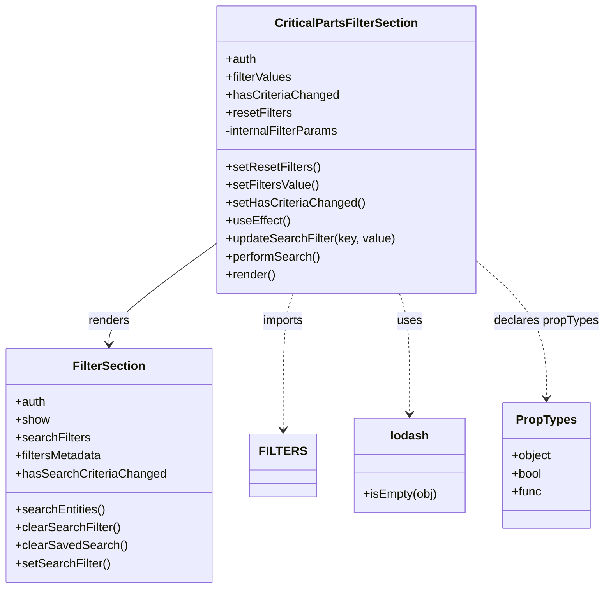

# Diagram: web/portal/src/pages/critical-parts/search/components/CriticalParts.FilterSection.js

> Auto-generated by Obscura crawlers

## Mermaid

### SVG

<svg id="container" width="788.82421875" xmlns="http://www.w3.org/2000/svg" class="classDiagram" height="786" viewBox="0 0 788.82421875 786" role="graphics-document document" aria-roledescription="class"><g><defs><marker id="container_class-aggregationStart" class="marker aggregation class" refX="18" refY="7" markerWidth="190" markerHeight="240" orient="auto"><path d="M 18,7 L9,13 L1,7 L9,1 Z"></path></marker></defs><defs><marker id="container_class-aggregationEnd" class="marker aggregation class" refX="1" refY="7" markerWidth="20" markerHeight="28" orient="auto"><path d="M 18,7 L9,13 L1,7 L9,1 Z"></path></marker></defs><defs><marker id="container_class-extensionStart" class="marker extension class" refX="18" refY="7" markerWidth="190" markerHeight="240" orient="auto"><path d="M 1,7 L18,13 V 1 Z"></path></marker></defs><defs><marker id="container_class-extensionEnd" class="marker extension class" refX="1" refY="7" markerWidth="20" markerHeight="28" orient="auto"><path d="M 1,1 V 13 L18,7 Z"></path></marker></defs><defs><marker id="container_class-compositionStart" class="marker composition class" refX="18" refY="7" markerWidth="190" markerHeight="240" orient="auto"><path d="M 18,7 L9,13 L1,7 L9,1 Z"></path></marker></defs><defs><marker id="container_class-compositionEnd" class="marker composition class" refX="1" refY="7" markerWidth="20" markerHeight="28" orient="auto"><path d="M 18,7 L9,13 L1,7 L9,1 Z"></path></marker></defs><defs><marker id="container_class-dependencyStart" class="marker dependency class" refX="6" refY="7" markerWidth="190" markerHeight="240" orient="auto"><path d="M 5,7 L9,13 L1,7 L9,1 Z"></path></marker></defs><defs><marker id="container_class-dependencyEnd" class="marker dependency class" refX="13" refY="7" markerWidth="20" markerHeight="28" orient="auto"><path d="M 18,7 L9,13 L14,7 L9,1 Z"></path></marker></defs><defs><marker id="container_class-lollipopStart" class="marker lollipop class" refX="13" refY="7" markerWidth="190" markerHeight="240" orient="auto"><circle stroke="black" fill="transparent" cx="7" cy="7" r="6"></circle></marker></defs><defs><marker id="container_class-lollipopEnd" class="marker lollipop class" refX="1" refY="7" markerWidth="190" markerHeight="240" orient="auto"><circle stroke="black" fill="transparent" cx="7" cy="7" r="6"></circle></marker></defs><g class="root"><g class="clusters"></g><g class="edgePaths"><path d="M276.66,328.001L254.223,344.834C231.785,361.667,186.91,395.334,164.473,417.334C142.035,439.333,142.035,449.667,142.035,454.833L142.035,460" id="id_CriticalPartsFilterSection_FilterSection_1" class="edge-thickness-normal edge-pattern-solid relation" style=";;;" data-edge="true" data-et="edge" data-id="id_CriticalPartsFilterSection_FilterSection_1" data-points="W3sieCI6Mjc2LjY2MDE1NjI1LCJ5IjozMjguMDAxMTAwNTYwNTE4fSx7IngiOjE0Mi4wMzUxNTYyNSwieSI6NDI5fSx7IngiOjE0Mi4wMzUxNTYyNSwieSI6NDY2fV0=" marker-end="url(#container_class-dependencyEnd)"></path><path d="M378.824,392L376.626,398.167C374.427,404.333,370.03,416.667,367.831,447C365.633,477.333,365.633,525.667,365.633,549.833L365.633,574" id="id_CriticalPartsFilterSection_FILTERS_2" class="edge-thickness-normal edge-pattern-dashed relation" style=";;;" data-edge="true" data-et="edge" data-id="id_CriticalPartsFilterSection_FILTERS_2" data-points="W3sieCI6Mzc4LjgyNDI4Njk4MTQ0MTA1LCJ5IjozOTJ9LHsieCI6MzY1LjYzMjgxMjUsInkiOjQyOX0seyJ4IjozNjUuNjMyODEyNSwieSI6NTgwfV0=" marker-end="url(#container_class-dependencyEnd)"></path><path d="M515.73,392L517.929,398.167C520.128,404.333,524.525,416.667,526.723,443.5C528.922,470.333,528.922,511.667,528.922,532.333L528.922,553" id="id_CriticalPartsFilterSection_lodash_3" class="edge-thickness-normal edge-pattern-dashed relation" style=";;;" data-edge="true" data-et="edge" data-id="id_CriticalPartsFilterSection_lodash_3" data-points="W3sieCI6NTE1LjczMDQwMDUxODU1OSwieSI6MzkyfSx7IngiOjUyOC45MjE4NzUsInkiOjQyOX0seyJ4Ijo1MjguOTIxODc1LCJ5Ijo1NTl9XQ==" marker-end="url(#container_class-dependencyEnd)"></path><path d="M617.895,348.428L633.331,361.857C648.767,375.285,679.639,402.143,695.076,432.738C710.512,463.333,710.512,497.667,710.512,514.833L710.512,532" id="id_CriticalPartsFilterSection_PropTypes_4" class="edge-thickness-normal edge-pattern-dashed relation" style=";;;" data-edge="true" data-et="edge" data-id="id_CriticalPartsFilterSection_PropTypes_4" data-points="W3sieCI6NjE3Ljg5NDUzMTI1LCJ5IjozNDguNDI3OTM5NjkyNTI2OH0seyJ4Ijo3MTAuNTExNzE4NzUsInkiOjQyOX0seyJ4Ijo3MTAuNTExNzE4NzUsInkiOjUzOH1d" marker-end="url(#container_class-dependencyEnd)"></path></g><g class="edgeLabels"><g class="edgeLabel" transform="translate(142.03515625, 429)"><g class="label" data-id="id_CriticalPartsFilterSection_FilterSection_1" transform="translate(-27.75, -12)"><foreignObject width="55.5" height="24">

renders

</foreignObject></g></g><g class="edgeLabel" transform="translate(365.6328125, 429)"><g class="label" data-id="id_CriticalPartsFilterSection_FILTERS_2" transform="translate(-28.25, -12)"><foreignObject width="56.5" height="24">

imports

</foreignObject></g></g><g class="edgeLabel" transform="translate(528.921875, 429)"><g class="label" data-id="id_CriticalPartsFilterSection_lodash_3" transform="translate(-16.4921875, -12)"><foreignObject width="32.984375" height="24">

uses

</foreignObject></g></g><g class="edgeLabel" transform="translate(710.51171875, 429)"><g class="label" data-id="id_CriticalPartsFilterSection_PropTypes_4" transform="translate(-70.3125, -12)"><foreignObject width="140.625" height="24">

declares propTypes

</foreignObject></g></g></g><g class="nodes"><g class="node default" id="classId-CriticalPartsFilterSection-0" transform="translate(447.27734375, 200)"><g class="basic label-container"><path d="M-170.6171875 -192 L170.6171875 -192 L170.6171875 192 L-170.6171875 192" stroke="none" stroke-width="0" fill="#ECECFF" style=""></path><path d="M-170.6171875 -192 C-60.51404876579397 -192, 49.589089968412054 -192, 170.6171875 -192 M-170.6171875 -192 C-88.29161098863533 -192, -5.966034477270654 -192, 170.6171875 -192 M170.6171875 -192 C170.6171875 -96.26603015833896, 170.6171875 -0.5320603166779279, 170.6171875 192 M170.6171875 -192 C170.6171875 -59.24929080163204, 170.6171875 73.50141839673591, 170.6171875 192 M170.6171875 192 C80.9858595688621 192, -8.645468362275807 192, -170.6171875 192 M170.6171875 192 C101.20137525526081 192, 31.785563010521628 192, -170.6171875 192 M-170.6171875 192 C-170.6171875 75.80363208810385, -170.6171875 -40.39273582379229, -170.6171875 -192 M-170.6171875 192 C-170.6171875 51.105109893666054, -170.6171875 -89.78978021266789, -170.6171875 -192" stroke="#9370DB" stroke-width="1.3" fill="none" stroke-dasharray="0 0" style=""></path></g><g class="annotation-group text" transform="translate(0, -168)"></g><g class="label-group text" transform="translate(-91, -168)"><g class="label" style="font-weight: bolder" transform="translate(0,-12)"><foreignObject width="182" height="24">

CriticalPartsFilterSection

</foreignObject></g></g><g class="members-group text" transform="translate(-158.6171875, -120)"><g class="label" style="" transform="translate(0,-12)"><foreignObject width="40.921875" height="24">

+auth

</foreignObject></g><g class="label" style="" transform="translate(0,12)"><foreignObject width="89.0625" height="24">

+filterValues

</foreignObject></g><g class="label" style="" transform="translate(0,36)"><foreignObject width="149.046875" height="24">

+hasCriteriaChanged

</foreignObject></g><g class="label" style="" transform="translate(0,60)"><foreignObject width="88.53125" height="24">

+resetFilters

</foreignObject></g><g class="label" style="" transform="translate(0,84)"><foreignObject width="152.9375" height="24">

-internalFilterParams

</foreignObject></g></g><g class="methods-group text" transform="translate(-158.6171875, 24)"><g class="label" style="" transform="translate(0,-12)"><foreignObject width="124.609375" height="24">

+setResetFilters()

</foreignObject></g><g class="label" style="" transform="translate(0,12)"><foreignObject width="124.015625" height="24">

+setFiltersValue()

</foreignObject></g><g class="label" style="" transform="translate(0,36)"><foreignObject width="182.890625" height="24">

+setHasCriteriaChanged()

</foreignObject></g><g class="label" style="" transform="translate(0,60)"><foreignObject width="84.8125" height="24">

+useEffect()

</foreignObject></g><g class="label" style="" transform="translate(0,84)"><foreignObject width="226.234375" height="24">

+updateSearchFilter(key, value)

</foreignObject></g><g class="label" style="" transform="translate(0,108)"><foreignObject width="125.890625" height="24">

+performSearch()

</foreignObject></g><g class="label" style="" transform="translate(0,132)"><foreignObject width="66.609375" height="24">

+render()

</foreignObject></g></g><g class="divider" style=""><path d="M-170.6171875 -144 C-76.8393788748604 -144, 16.938429750279198 -144, 170.6171875 -144 M-170.6171875 -144 C-57.959078970086296 -144, 54.69902955982741 -144, 170.6171875 -144" stroke="#9370DB" stroke-width="1.3" fill="none" stroke-dasharray="0 0" style=""></path></g><g class="divider" style=""><path d="M-170.6171875 0 C-58.933773502480236 0, 52.74964049503953 0, 170.6171875 0 M-170.6171875 0 C-72.85785888950443 0, 24.901469720991145 0, 170.6171875 0" stroke="#9370DB" stroke-width="1.3" fill="none" stroke-dasharray="0 0" style=""></path></g></g><g class="node default" id="classId-FilterSection-1" transform="translate(142.03515625, 622)"><g class="basic label-container"><path d="M-134.03515625 -156 L134.03515625 -156 L134.03515625 156 L-134.03515625 156" stroke="none" stroke-width="0" fill="#ECECFF" style=""></path><path d="M-134.03515625 -156 C-28.766458431937323 -156, 76.50223938612535 -156, 134.03515625 -156 M-134.03515625 -156 C-31.291496193797897 -156, 71.4521638624042 -156, 134.03515625 -156 M134.03515625 -156 C134.03515625 -64.6260123510329, 134.03515625 26.747975297934204, 134.03515625 156 M134.03515625 -156 C134.03515625 -90.35069538191509, 134.03515625 -24.701390763830176, 134.03515625 156 M134.03515625 156 C42.93747749112484 156, -48.160201267750324 156, -134.03515625 156 M134.03515625 156 C49.9277715281508 156, -34.1796131936984 156, -134.03515625 156 M-134.03515625 156 C-134.03515625 80.78003981923146, -134.03515625 5.560079638462923, -134.03515625 -156 M-134.03515625 156 C-134.03515625 76.86220815589475, -134.03515625 -2.275583688210503, -134.03515625 -156" stroke="#9370DB" stroke-width="1.3" fill="none" stroke-dasharray="0 0" style=""></path></g><g class="annotation-group text" transform="translate(0, -132)"></g><g class="label-group text" transform="translate(-46.3203125, -132)"><g class="label" style="font-weight: bolder" transform="translate(0,-12)"><foreignObject width="92.640625" height="24">

FilterSection

</foreignObject></g></g><g class="members-group text" transform="translate(-122.03515625, -84)"><g class="label" style="" transform="translate(0,-12)"><foreignObject width="40.921875" height="24">

+auth

</foreignObject></g><g class="label" style="" transform="translate(0,12)"><foreignObject width="45.65625" height="24">

+show

</foreignObject></g><g class="label" style="" transform="translate(0,36)"><foreignObject width="99.609375" height="24">

+searchFilters

</foreignObject></g><g class="label" style="" transform="translate(0,60)"><foreignObject width="117.484375" height="24">

+filtersMetadata

</foreignObject></g><g class="label" style="" transform="translate(0,84)"><foreignObject width="197.75" height="24">

+hasSearchCriteriaChanged

</foreignObject></g></g><g class="methods-group text" transform="translate(-122.03515625, 60)"><g class="label" style="" transform="translate(0,-12)"><foreignObject width="120.359375" height="24">

+searchEntities()

</foreignObject></g><g class="label" style="" transform="translate(0,12)"><foreignObject width="139.6875" height="24">

+clearSearchFilter()

</foreignObject></g><g class="label" style="" transform="translate(0,36)"><foreignObject width="146.046875" height="24">

+clearSavedSearch()

</foreignObject></g><g class="label" style="" transform="translate(0,60)"><foreignObject width="125.953125" height="24">

+setSearchFilter()

</foreignObject></g></g><g class="divider" style=""><path d="M-134.03515625 -108 C-58.06981050666727 -108, 17.895535236665467 -108, 134.03515625 -108 M-134.03515625 -108 C-35.82736688590731 -108, 62.38042247818538 -108, 134.03515625 -108" stroke="#9370DB" stroke-width="1.3" fill="none" stroke-dasharray="0 0" style=""></path></g><g class="divider" style=""><path d="M-134.03515625 36 C-76.62473898215016 36, -19.214321714300326 36, 134.03515625 36 M-134.03515625 36 C-62.49301589145543 36, 9.049124467089143 36, 134.03515625 36" stroke="#9370DB" stroke-width="1.3" fill="none" stroke-dasharray="0 0" style=""></path></g></g><g class="node default" id="classId-FILTERS-2" transform="translate(365.6328125, 622)"><g class="basic label-container"><path d="M-39.5625 -42 L39.5625 -42 L39.5625 42 L-39.5625 42" stroke="none" stroke-width="0" fill="#ECECFF" style=""></path><path d="M-39.5625 -42 C-10.708459320126401 -42, 18.145581359747197 -42, 39.5625 -42 M-39.5625 -42 C-18.14983366000188 -42, 3.2628326799962366 -42, 39.5625 -42 M39.5625 -42 C39.5625 -9.498040607323304, 39.5625 23.00391878535339, 39.5625 42 M39.5625 -42 C39.5625 -18.4824746222479, 39.5625 5.0350507555042014, 39.5625 42 M39.5625 42 C22.025878201814322 42, 4.489256403628644 42, -39.5625 42 M39.5625 42 C10.25250745004746 42, -19.05748509990508 42, -39.5625 42 M-39.5625 42 C-39.5625 9.288418941363027, -39.5625 -23.423162117273947, -39.5625 -42 M-39.5625 42 C-39.5625 9.94702685859724, -39.5625 -22.10594628280552, -39.5625 -42" stroke="#9370DB" stroke-width="1.3" fill="none" stroke-dasharray="0 0" style=""></path></g><g class="annotation-group text" transform="translate(0, -18)"></g><g class="label-group text" transform="translate(-27.5625, -18)"><g class="label" style="font-weight: bolder" transform="translate(0,-12)"><foreignObject width="55.125" height="24">

FILTERS

</foreignObject></g></g><g class="members-group text" transform="translate(-27.5625, 30)"></g><g class="methods-group text" transform="translate(-27.5625, 60)"></g><g class="divider" style=""><path d="M-39.5625 6 C-15.501157002487613 6, 8.560185995024774 6, 39.5625 6 M-39.5625 6 C-9.692950130419597 6, 20.176599739160807 6, 39.5625 6" stroke="#9370DB" stroke-width="1.3" fill="none" stroke-dasharray="0 0" style=""></path></g><g class="divider" style=""><path d="M-39.5625 24 C-21.708678964564676 24, -3.854857929129352 24, 39.5625 24 M-39.5625 24 C-10.750807151450466 24, 18.060885697099067 24, 39.5625 24" stroke="#9370DB" stroke-width="1.3" fill="none" stroke-dasharray="0 0" style=""></path></g></g><g class="node default" id="classId-lodash-3" transform="translate(528.921875, 622)"><g class="basic label-container"><path d="M-73.7265625 -63 L73.7265625 -63 L73.7265625 63 L-73.7265625 63" stroke="none" stroke-width="0" fill="#ECECFF" style=""></path><path d="M-73.7265625 -63 C-40.31314335959895 -63, -6.899724219197907 -63, 73.7265625 -63 M-73.7265625 -63 C-15.711048787993192 -63, 42.304464924013615 -63, 73.7265625 -63 M73.7265625 -63 C73.7265625 -37.45458559600535, 73.7265625 -11.909171192010703, 73.7265625 63 M73.7265625 -63 C73.7265625 -34.65063549682455, 73.7265625 -6.301270993649091, 73.7265625 63 M73.7265625 63 C29.61913251106578 63, -14.488297477868443 63, -73.7265625 63 M73.7265625 63 C39.71670272877767 63, 5.706842957555338 63, -73.7265625 63 M-73.7265625 63 C-73.7265625 29.927453495572294, -73.7265625 -3.1450930088554117, -73.7265625 -63 M-73.7265625 63 C-73.7265625 33.80328615083238, -73.7265625 4.606572301664748, -73.7265625 -63" stroke="#9370DB" stroke-width="1.3" fill="none" stroke-dasharray="0 0" style=""></path></g><g class="annotation-group text" transform="translate(0, -39)"></g><g class="label-group text" transform="translate(-24.59375, -39)"><g class="label" style="font-weight: bolder" transform="translate(0,-12)"><foreignObject width="49.1875" height="24">

lodash

</foreignObject></g></g><g class="members-group text" transform="translate(-61.7265625, 9)"></g><g class="methods-group text" transform="translate(-61.7265625, 39)"><g class="label" style="" transform="translate(0,-12)"><foreignObject width="98.859375" height="24">

+isEmpty(obj)

</foreignObject></g></g><g class="divider" style=""><path d="M-73.7265625 -15 C-40.968399612693 -15, -8.210236725385997 -15, 73.7265625 -15 M-73.7265625 -15 C-17.202365722915786 -15, 39.32183105416843 -15, 73.7265625 -15" stroke="#9370DB" stroke-width="1.3" fill="none" stroke-dasharray="0 0" style=""></path></g><g class="divider" style=""><path d="M-73.7265625 9 C-42.397521541828475 9, -11.06848058365695 9, 73.7265625 9 M-73.7265625 9 C-27.561808973399998 9, 18.602944553200004 9, 73.7265625 9" stroke="#9370DB" stroke-width="1.3" fill="none" stroke-dasharray="0 0" style=""></path></g></g><g class="node default" id="classId-PropTypes-4" transform="translate(710.51171875, 622)"><g class="basic label-container"><path d="M-57.86328125 -84 L57.86328125 -84 L57.86328125 84 L-57.86328125 84" stroke="none" stroke-width="0" fill="#ECECFF" style=""></path><path d="M-57.86328125 -84 C-13.444002772872125 -84, 30.97527570425575 -84, 57.86328125 -84 M-57.86328125 -84 C-17.103923582741714 -84, 23.65543408451657 -84, 57.86328125 -84 M57.86328125 -84 C57.86328125 -48.36555603608649, 57.86328125 -12.731112072172976, 57.86328125 84 M57.86328125 -84 C57.86328125 -50.147256315718174, 57.86328125 -16.294512631436348, 57.86328125 84 M57.86328125 84 C14.58300553974128 84, -28.69727017051744 84, -57.86328125 84 M57.86328125 84 C24.12078603776395 84, -9.621709174472102 84, -57.86328125 84 M-57.86328125 84 C-57.86328125 49.599973690144175, -57.86328125 15.19994738028835, -57.86328125 -84 M-57.86328125 84 C-57.86328125 20.850104806220187, -57.86328125 -42.299790387559625, -57.86328125 -84" stroke="#9370DB" stroke-width="1.3" fill="none" stroke-dasharray="0 0" style=""></path></g><g class="annotation-group text" transform="translate(0, -60)"></g><g class="label-group text" transform="translate(-38.2578125, -60)"><g class="label" style="font-weight: bolder" transform="translate(0,-12)"><foreignObject width="76.515625" height="24">

PropTypes

</foreignObject></g></g><g class="members-group text" transform="translate(-45.86328125, -12)"><g class="label" style="" transform="translate(0,-12)"><foreignObject width="53.46875" height="24">

+object

</foreignObject></g><g class="label" style="" transform="translate(0,12)"><foreignObject width="40.875" height="24">

+bool

</foreignObject></g><g class="label" style="" transform="translate(0,36)"><foreignObject width="39.453125" height="24">

+func

</foreignObject></g></g><g class="methods-group text" transform="translate(-45.86328125, 84)"></g><g class="divider" style=""><path d="M-57.86328125 -36 C-14.029251180273263 -36, 29.804778889453473 -36, 57.86328125 -36 M-57.86328125 -36 C-13.922880394170598 -36, 30.017520461658805 -36, 57.86328125 -36" stroke="#9370DB" stroke-width="1.3" fill="none" stroke-dasharray="0 0" style=""></path></g><g class="divider" style=""><path d="M-57.86328125 60 C-15.01960208491797 60, 27.82407708016406 60, 57.86328125 60 M-57.86328125 60 C-15.702307530426651 60, 26.458666189146697 60, 57.86328125 60" stroke="#9370DB" stroke-width="1.3" fill="none" stroke-dasharray="0 0" style=""></path></g></g></g></g></g></svg>
