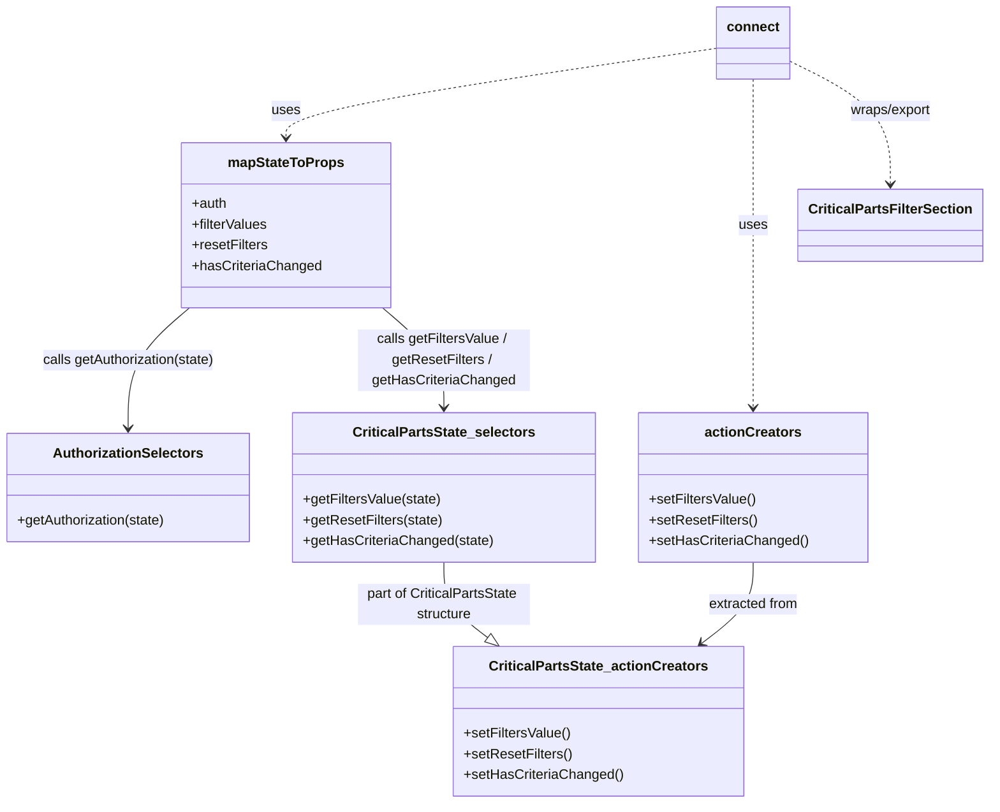

# Diagram: web/portal/src/pages/critical-parts/search/components/CriticalParts.FilterSectionContainer.js

> Auto-generated by Obscura crawlers

## Mermaid

### SVG

<svg id="container" width="1131.79296875" xmlns="http://www.w3.org/2000/svg" class="classDiagram" height="934" viewBox="0 0 1131.79296875 934" role="graphics-document document" aria-roledescription="class"><g><defs><marker id="container_class-aggregationStart" class="marker aggregation class" refX="18" refY="7" markerWidth="190" markerHeight="240" orient="auto"><path d="M 18,7 L9,13 L1,7 L9,1 Z"></path></marker></defs><defs><marker id="container_class-aggregationEnd" class="marker aggregation class" refX="1" refY="7" markerWidth="20" markerHeight="28" orient="auto"><path d="M 18,7 L9,13 L1,7 L9,1 Z"></path></marker></defs><defs><marker id="container_class-extensionStart" class="marker extension class" refX="18" refY="7" markerWidth="190" markerHeight="240" orient="auto"><path d="M 1,7 L18,13 V 1 Z"></path></marker></defs><defs><marker id="container_class-extensionEnd" class="marker extension class" refX="1" refY="7" markerWidth="20" markerHeight="28" orient="auto"><path d="M 1,1 V 13 L18,7 Z"></path></marker></defs><defs><marker id="container_class-compositionStart" class="marker composition class" refX="18" refY="7" markerWidth="190" markerHeight="240" orient="auto"><path d="M 18,7 L9,13 L1,7 L9,1 Z"></path></marker></defs><defs><marker id="container_class-compositionEnd" class="marker composition class" refX="1" refY="7" markerWidth="20" markerHeight="28" orient="auto"><path d="M 18,7 L9,13 L1,7 L9,1 Z"></path></marker></defs><defs><marker id="container_class-dependencyStart" class="marker dependency class" refX="6" refY="7" markerWidth="190" markerHeight="240" orient="auto"><path d="M 5,7 L9,13 L1,7 L9,1 Z"></path></marker></defs><defs><marker id="container_class-dependencyEnd" class="marker dependency class" refX="13" refY="7" markerWidth="20" markerHeight="28" orient="auto"><path d="M 18,7 L9,13 L14,7 L9,1 Z"></path></marker></defs><defs><marker id="container_class-lollipopStart" class="marker lollipop class" refX="13" refY="7" markerWidth="190" markerHeight="240" orient="auto"><circle stroke="black" fill="transparent" cx="7" cy="7" r="6"></circle></marker></defs><defs><marker id="container_class-lollipopEnd" class="marker lollipop class" refX="1" refY="7" markerWidth="190" markerHeight="240" orient="auto"><circle stroke="black" fill="transparent" cx="7" cy="7" r="6"></circle></marker></defs><g class="root"><g class="clusters"></g><g class="edgePaths"><path d="M220.225,358L208.439,368.167C196.653,378.333,173.08,398.667,161.294,422C149.508,445.333,149.508,471.667,149.508,484.833L149.508,498" id="id_mapStateToProps_AuthorizationSelectors_1" class="edge-thickness-normal edge-pattern-solid relation" style=";;;" data-edge="true" data-et="edge" data-id="id_mapStateToProps_AuthorizationSelectors_1" data-points="W3sieCI6MjIwLjIyNDk4MjU4MzU5ODcyLCJ5IjozNTh9LHsieCI6MTQ5LjUwNzgxMjUsInkiOjQxOX0seyJ4IjoxNDkuNTA3ODEyNSwieSI6NTA0fV0=" marker-end="url(#container_class-dependencyEnd)"></path><path d="M442.81,358L454.596,368.167C466.383,378.333,489.955,398.667,501.741,418C513.527,437.333,513.527,455.667,513.527,464.833L513.527,474" id="id_mapStateToProps_CriticalPartsState_selectors_2" class="edge-thickness-normal edge-pattern-solid relation" style=";;;" data-edge="true" data-et="edge" data-id="id_mapStateToProps_CriticalPartsState_selectors_2" data-points="W3sieCI6NDQyLjgxMDE3MzY2NjQwMTMsInkiOjM1OH0seyJ4Ijo1MTMuNTI3MzQzNzUsInkiOjQxOX0seyJ4Ijo1MTMuNTI3MzQzNzUsInkiOjQ4MH1d" marker-end="url(#container_class-dependencyEnd)"></path><path d="M866.301,654L866.301,662.167C866.301,670.333,866.301,686.667,856.501,702.389C846.701,718.112,827.101,733.224,817.301,740.78L807.501,748.336" id="id_actionCreators_CriticalPartsState_actionCreators_3" class="edge-thickness-normal edge-pattern-solid relation" style=";;;" data-edge="true" data-et="edge" data-id="id_actionCreators_CriticalPartsState_actionCreators_3" data-points="W3sieCI6ODY2LjMwMDc4MTI1LCJ5Ijo2NTR9LHsieCI6ODY2LjMwMDc4MTI1LCJ5Ijo3MDN9LHsieCI6ODAyLjc0OTY4NDA1MzMwODgsInkiOjc1Mn1d" marker-end="url(#container_class-dependencyEnd)"></path><path d="M825.387,56.044L743.075,68.203C660.764,80.363,496.141,104.681,413.829,122.007C331.518,139.333,331.518,149.667,331.518,154.833L331.518,160" id="id_connect_mapStateToProps_4" class="edge-thickness-normal edge-pattern-dashed relation" style=";;;" data-edge="true" data-et="edge" data-id="id_connect_mapStateToProps_4" data-points="W3sieCI6ODI1LjM4NjcxODc1LCJ5Ijo1Ni4wNDM5NjQ5NTM2NzIwOX0seyJ4IjozMzEuNTE3NTc4MTI1LCJ5IjoxMjl9LHsieCI6MzMxLjUxNzU3ODEyNSwieSI6MTY2fV0=" marker-end="url(#container_class-dependencyEnd)"></path><path d="M866.301,92L866.301,98.167C866.301,104.333,866.301,116.667,866.301,145C866.301,173.333,866.301,217.667,866.301,266C866.301,314.333,866.301,366.667,866.301,402C866.301,437.333,866.301,455.667,866.301,464.833L866.301,474" id="id_connect_actionCreators_5" class="edge-thickness-normal edge-pattern-dashed relation" style=";;;" data-edge="true" data-et="edge" data-id="id_connect_actionCreators_5" data-points="W3sieCI6ODY2LjMwMDc4MTI1LCJ5Ijo5Mn0seyJ4Ijo4NjYuMzAwNzgxMjUsInkiOjEyOX0seyJ4Ijo4NjYuMzAwNzgxMjUsInkiOjI2Mn0seyJ4Ijo4NjYuMzAwNzgxMjUsInkiOjQxOX0seyJ4Ijo4NjYuMzAwNzgxMjUsInkiOjQ4MH1d" marker-end="url(#container_class-dependencyEnd)"></path><path d="M907.215,70.922L926.145,80.601C945.074,90.281,982.934,109.641,1001.863,133.487C1020.793,157.333,1020.793,185.667,1020.793,199.833L1020.793,214" id="id_connect_CriticalPartsFilterSection_6" class="edge-thickness-normal edge-pattern-dashed relation" style=";;;" data-edge="true" data-et="edge" data-id="id_connect_CriticalPartsFilterSection_6" data-points="W3sieCI6OTA3LjIxNDg0Mzc1LCJ5Ijo3MC45MjE1MTcwNjcwMDM3OX0seyJ4IjoxMDIwLjc5Mjk2ODc1LCJ5IjoxMjl9LHsieCI6MTAyMC43OTI5Njg3NSwieSI6MjIwfV0=" marker-end="url(#container_class-dependencyEnd)"></path><path d="M513.527,654L513.527,662.167C513.527,670.333,513.527,686.667,521.842,701.245C530.157,715.822,546.788,728.645,555.103,735.056L563.418,741.467" id="id_CriticalPartsState_selectors_CriticalPartsState_actionCreators_7" class="edge-thickness-normal edge-pattern-solid relation" style=";;;" data-edge="true" data-et="edge" data-id="id_CriticalPartsState_selectors_CriticalPartsState_actionCreators_7" data-points="W3sieCI6NTEzLjUyNzM0Mzc1LCJ5Ijo2NTR9LHsieCI6NTEzLjUyNzM0Mzc1LCJ5Ijo3MDN9LHsieCI6NTc3LjA3ODQ0MDk0NjY5MTIsInkiOjc1Mn1d" marker-end="url(#container_class-extensionEnd)"></path></g><g class="edgeLabels"><g class="edgeLabel" transform="translate(149.5078125, 419)"><g class="label" data-id="id_mapStateToProps_AuthorizationSelectors_1" transform="translate(-100, -24)"><foreignObject width="200" height="48">

calls getAuthorization(state)

</foreignObject></g></g><g class="edgeLabel" transform="translate(513.52734375, 419)"><g class="label" data-id="id_mapStateToProps_CriticalPartsState_selectors_2" transform="translate(-100, -36)"><foreignObject width="200" height="72">

calls getFiltersValue / getResetFilters / getHasCriteriaChanged

</foreignObject></g></g><g class="edgeLabel" transform="translate(866.30078125, 703)"><g class="label" data-id="id_actionCreators_CriticalPartsState_actionCreators_3" transform="translate(-53.1328125, -12)"><foreignObject width="106.265625" height="24">

extracted from

</foreignObject></g></g><g class="edgeLabel" transform="translate(331.517578125, 129)"><g class="label" data-id="id_connect_mapStateToProps_4" transform="translate(-16.4921875, -12)"><foreignObject width="32.984375" height="24">

uses

</foreignObject></g></g><g class="edgeLabel" transform="translate(866.30078125, 262)"><g class="label" data-id="id_connect_actionCreators_5" transform="translate(-16.4921875, -12)"><foreignObject width="32.984375" height="24">

uses

</foreignObject></g></g><g class="edgeLabel" transform="translate(1020.79296875, 129)"><g class="label" data-id="id_connect_CriticalPartsFilterSection_6" transform="translate(-48.71875, -12)"><foreignObject width="97.4375" height="24">

wraps/export

</foreignObject></g></g><g class="edgeLabel" transform="translate(513.52734375, 703)"><g class="label" data-id="id_CriticalPartsState_selectors_CriticalPartsState_actionCreators_7" transform="translate(-100, -24)"><foreignObject width="200" height="48">

part of CriticalPartsState structure

</foreignObject></g></g></g><g class="nodes"><g class="node default" id="classId-CriticalPartsFilterSection-0" transform="translate(1020.79296875, 262)"><g class="basic label-container"><path d="M-103 -42 L103 -42 L103 42 L-103 42" stroke="none" stroke-width="0" fill="#ECECFF" style=""></path><path d="M-103 -42 C-38.7121344272809 -42, 25.575731145438198 -42, 103 -42 M-103 -42 C-25.053768076973583 -42, 52.892463846052834 -42, 103 -42 M103 -42 C103 -22.63008926138055, 103 -3.2601785227611018, 103 42 M103 -42 C103 -14.544987187483361, 103 12.910025625033278, 103 42 M103 42 C53.59489268817461 42, 4.189785376349221 42, -103 42 M103 42 C57.52983858921983 42, 12.059677178439657 42, -103 42 M-103 42 C-103 21.560340671041107, -103 1.1206813420822144, -103 -42 M-103 42 C-103 20.43434727719476, -103 -1.1313054456104794, -103 -42" stroke="#9370DB" stroke-width="1.3" fill="none" stroke-dasharray="0 0" style=""></path></g><g class="annotation-group text" transform="translate(0, -18)"></g><g class="label-group text" transform="translate(-91, -18)"><g class="label" style="font-weight: bolder" transform="translate(0,-12)"><foreignObject width="182" height="24">

CriticalPartsFilterSection

</foreignObject></g></g><g class="members-group text" transform="translate(-91, 30)"></g><g class="methods-group text" transform="translate(-91, 60)"></g><g class="divider" style=""><path d="M-103 6 C-52.332975113942815 6, -1.6659502278856309 6, 103 6 M-103 6 C-30.767115482422724 6, 41.46576903515455 6, 103 6" stroke="#9370DB" stroke-width="1.3" fill="none" stroke-dasharray="0 0" style=""></path></g><g class="divider" style=""><path d="M-103 24 C-28.06700468516331 24, 46.86599062967338 24, 103 24 M-103 24 C-22.407613631744837 24, 58.184772736510325 24, 103 24" stroke="#9370DB" stroke-width="1.3" fill="none" stroke-dasharray="0 0" style=""></path></g></g><g class="node default" id="classId-connect-1" transform="translate(866.30078125, 50)"><g class="basic label-container"><path d="M-40.9140625 -42 L40.9140625 -42 L40.9140625 42 L-40.9140625 42" stroke="none" stroke-width="0" fill="#ECECFF" style=""></path><path d="M-40.9140625 -42 C-14.520231930905204 -42, 11.873598638189591 -42, 40.9140625 -42 M-40.9140625 -42 C-9.09195361027614 -42, 22.73015527944772 -42, 40.9140625 -42 M40.9140625 -42 C40.9140625 -11.791741289627009, 40.9140625 18.416517420745983, 40.9140625 42 M40.9140625 -42 C40.9140625 -12.909807827317938, 40.9140625 16.180384345364125, 40.9140625 42 M40.9140625 42 C8.189017404995703 42, -24.536027690008595 42, -40.9140625 42 M40.9140625 42 C18.65763327167249 42, -3.5987959566550174 42, -40.9140625 42 M-40.9140625 42 C-40.9140625 21.474852936303854, -40.9140625 0.9497058726077086, -40.9140625 -42 M-40.9140625 42 C-40.9140625 15.915645348598787, -40.9140625 -10.168709302802426, -40.9140625 -42" stroke="#9370DB" stroke-width="1.3" fill="none" stroke-dasharray="0 0" style=""></path></g><g class="annotation-group text" transform="translate(0, -18)"></g><g class="label-group text" transform="translate(-28.9140625, -18)"><g class="label" style="font-weight: bolder" transform="translate(0,-12)"><foreignObject width="57.828125" height="24">

connect

</foreignObject></g></g><g class="members-group text" transform="translate(-28.9140625, 30)"></g><g class="methods-group text" transform="translate(-28.9140625, 60)"></g><g class="divider" style=""><path d="M-40.9140625 6 C-13.973255819319895 6, 12.967550861360209 6, 40.9140625 6 M-40.9140625 6 C-16.690241468255444 6, 7.533579563489113 6, 40.9140625 6" stroke="#9370DB" stroke-width="1.3" fill="none" stroke-dasharray="0 0" style=""></path></g><g class="divider" style=""><path d="M-40.9140625 24 C-9.07050932699996 24, 22.77304384600008 24, 40.9140625 24 M-40.9140625 24 C-8.682544058334564 24, 23.548974383330872 24, 40.9140625 24" stroke="#9370DB" stroke-width="1.3" fill="none" stroke-dasharray="0 0" style=""></path></g></g><g class="node default" id="classId-mapStateToProps-2" transform="translate(331.517578125, 262)"><g class="basic label-container"><path d="M-118.87890625 -96 L118.87890625 -96 L118.87890625 96 L-118.87890625 96" stroke="none" stroke-width="0" fill="#ECECFF" style=""></path><path d="M-118.87890625 -96 C-39.847671058446466 -96, 39.18356413310707 -96, 118.87890625 -96 M-118.87890625 -96 C-44.49945805260283 -96, 29.879990144794334 -96, 118.87890625 -96 M118.87890625 -96 C118.87890625 -48.88553711386315, 118.87890625 -1.7710742277263023, 118.87890625 96 M118.87890625 -96 C118.87890625 -32.76157265104435, 118.87890625 30.476854697911307, 118.87890625 96 M118.87890625 96 C44.43641843532468 96, -30.006069379350635 96, -118.87890625 96 M118.87890625 96 C59.27469890918497 96, -0.3295084316300603 96, -118.87890625 96 M-118.87890625 96 C-118.87890625 45.475507160176164, -118.87890625 -5.0489856796476715, -118.87890625 -96 M-118.87890625 96 C-118.87890625 34.16548342271876, -118.87890625 -27.669033154562484, -118.87890625 -96" stroke="#9370DB" stroke-width="1.3" fill="none" stroke-dasharray="0 0" style=""></path></g><g class="annotation-group text" transform="translate(0, -72)"></g><g class="label-group text" transform="translate(-64.7109375, -72)"><g class="label" style="font-weight: bolder" transform="translate(0,-12)"><foreignObject width="129.421875" height="24">

mapStateToProps

</foreignObject></g></g><g class="members-group text" transform="translate(-106.87890625, -24)"><g class="label" style="" transform="translate(0,-12)"><foreignObject width="40.921875" height="24">

+auth

</foreignObject></g><g class="label" style="" transform="translate(0,12)"><foreignObject width="89.0625" height="24">

+filterValues

</foreignObject></g><g class="label" style="" transform="translate(0,36)"><foreignObject width="88.53125" height="24">

+resetFilters

</foreignObject></g><g class="label" style="" transform="translate(0,60)"><foreignObject width="149.046875" height="24">

+hasCriteriaChanged

</foreignObject></g></g><g class="methods-group text" transform="translate(-106.87890625, 96)"></g><g class="divider" style=""><path d="M-118.87890625 -48 C-70.43513937887283 -48, -21.99137250774568 -48, 118.87890625 -48 M-118.87890625 -48 C-70.21762946307783 -48, -21.55635267615567 -48, 118.87890625 -48" stroke="#9370DB" stroke-width="1.3" fill="none" stroke-dasharray="0 0" style=""></path></g><g class="divider" style=""><path d="M-118.87890625 72 C-37.9897648806635 72, 42.899376488673 72, 118.87890625 72 M-118.87890625 72 C-24.090599927203485 72, 70.69770639559303 72, 118.87890625 72" stroke="#9370DB" stroke-width="1.3" fill="none" stroke-dasharray="0 0" style=""></path></g></g><g class="node default" id="classId-AuthorizationSelectors-3" transform="translate(149.5078125, 567)"><g class="basic label-container"><path d="M-141.5078125 -63 L141.5078125 -63 L141.5078125 63 L-141.5078125 63" stroke="none" stroke-width="0" fill="#ECECFF" style=""></path><path d="M-141.5078125 -63 C-65.3089275760618 -63, 10.88995734787639 -63, 141.5078125 -63 M-141.5078125 -63 C-49.00669371330041 -63, 43.494425073399185 -63, 141.5078125 -63 M141.5078125 -63 C141.5078125 -22.142033373907033, 141.5078125 18.715933252185934, 141.5078125 63 M141.5078125 -63 C141.5078125 -23.291663625830388, 141.5078125 16.416672748339224, 141.5078125 63 M141.5078125 63 C83.62217773000097 63, 25.73654296000194 63, -141.5078125 63 M141.5078125 63 C64.64338218653451 63, -12.221048126930981 63, -141.5078125 63 M-141.5078125 63 C-141.5078125 35.865775570467434, -141.5078125 8.731551140934876, -141.5078125 -63 M-141.5078125 63 C-141.5078125 25.814856024905488, -141.5078125 -11.370287950189024, -141.5078125 -63" stroke="#9370DB" stroke-width="1.3" fill="none" stroke-dasharray="0 0" style=""></path></g><g class="annotation-group text" transform="translate(0, -39)"></g><g class="label-group text" transform="translate(-83.875, -39)"><g class="label" style="font-weight: bolder" transform="translate(0,-12)"><foreignObject width="167.75" height="24">

AuthorizationSelectors

</foreignObject></g></g><g class="members-group text" transform="translate(-129.5078125, 9)"></g><g class="methods-group text" transform="translate(-129.5078125, 39)"><g class="label" style="" transform="translate(0,-12)"><foreignObject width="175.140625" height="24">

+getAuthorization(state)

</foreignObject></g></g><g class="divider" style=""><path d="M-141.5078125 -15 C-75.35745048077247 -15, -9.207088461544942 -15, 141.5078125 -15 M-141.5078125 -15 C-38.86447019163302 -15, 63.778872116733965 -15, 141.5078125 -15" stroke="#9370DB" stroke-width="1.3" fill="none" stroke-dasharray="0 0" style=""></path></g><g class="divider" style=""><path d="M-141.5078125 9 C-61.15456623658926 9, 19.198680026821478 9, 141.5078125 9 M-141.5078125 9 C-70.65708167249299 9, 0.1936491550140147 9, 141.5078125 9" stroke="#9370DB" stroke-width="1.3" fill="none" stroke-dasharray="0 0" style=""></path></g></g><g class="node default" id="classId-CriticalPartsState_selectors-4" transform="translate(513.52734375, 567)"><g class="basic label-container"><path d="M-172.51171875 -87 L172.51171875 -87 L172.51171875 87 L-172.51171875 87" stroke="none" stroke-width="0" fill="#ECECFF" style=""></path><path d="M-172.51171875 -87 C-71.7497359295254 -87, 29.0122468909492 -87, 172.51171875 -87 M-172.51171875 -87 C-59.606280461341015 -87, 53.29915782731797 -87, 172.51171875 -87 M172.51171875 -87 C172.51171875 -21.154062887308, 172.51171875 44.691874225384, 172.51171875 87 M172.51171875 -87 C172.51171875 -22.77653505042926, 172.51171875 41.44692989914148, 172.51171875 87 M172.51171875 87 C102.40438531387437 87, 32.29705187774874 87, -172.51171875 87 M172.51171875 87 C80.60202949152558 87, -11.30765976694883 87, -172.51171875 87 M-172.51171875 87 C-172.51171875 24.837550004911577, -172.51171875 -37.324899990176846, -172.51171875 -87 M-172.51171875 87 C-172.51171875 30.059623996769673, -172.51171875 -26.880752006460654, -172.51171875 -87" stroke="#9370DB" stroke-width="1.3" fill="none" stroke-dasharray="0 0" style=""></path></g><g class="annotation-group text" transform="translate(0, -63)"></g><g class="label-group text" transform="translate(-101.4453125, -63)"><g class="label" style="font-weight: bolder" transform="translate(0,-12)"><foreignObject width="202.890625" height="24">

CriticalPartsState_selectors

</foreignObject></g></g><g class="members-group text" transform="translate(-160.51171875, -15)"></g><g class="methods-group text" transform="translate(-160.51171875, 15)"><g class="label" style="" transform="translate(0,-12)"><foreignObject width="160.703125" height="24">

+getFiltersValue(state)

</foreignObject></g><g class="label" style="" transform="translate(0,12)"><foreignObject width="161.296875" height="24">

+getResetFilters(state)

</foreignObject></g><g class="label" style="" transform="translate(0,36)"><foreignObject width="219.578125" height="24">

+getHasCriteriaChanged(state)

</foreignObject></g></g><g class="divider" style=""><path d="M-172.51171875 -39 C-95.6646842596622 -39, -18.81764976932439 -39, 172.51171875 -39 M-172.51171875 -39 C-48.002319152509514 -39, 76.50708044498097 -39, 172.51171875 -39" stroke="#9370DB" stroke-width="1.3" fill="none" stroke-dasharray="0 0" style=""></path></g><g class="divider" style=""><path d="M-172.51171875 -15 C-76.40217722687115 -15, 19.70736429625771 -15, 172.51171875 -15 M-172.51171875 -15 C-52.285802233928365 -15, 67.94011428214327 -15, 172.51171875 -15" stroke="#9370DB" stroke-width="1.3" fill="none" stroke-dasharray="0 0" style=""></path></g></g><g class="node default" id="classId-CriticalPartsState_actionCreators-5" transform="translate(689.9140625, 839)"><g class="basic label-container"><path d="M-164.17578125 -87 L164.17578125 -87 L164.17578125 87 L-164.17578125 87" stroke="none" stroke-width="0" fill="#ECECFF" style=""></path><path d="M-164.17578125 -87 C-59.03699533655991 -87, 46.10179057688018 -87, 164.17578125 -87 M-164.17578125 -87 C-67.83922725132498 -87, 28.49732674735003 -87, 164.17578125 -87 M164.17578125 -87 C164.17578125 -50.1560955039515, 164.17578125 -13.312191007902996, 164.17578125 87 M164.17578125 -87 C164.17578125 -34.55067870982572, 164.17578125 17.898642580348564, 164.17578125 87 M164.17578125 87 C35.45443405556546 87, -93.26691313886909 87, -164.17578125 87 M164.17578125 87 C47.35300655513197 87, -69.46976813973606 87, -164.17578125 87 M-164.17578125 87 C-164.17578125 51.041025524863095, -164.17578125 15.08205104972619, -164.17578125 -87 M-164.17578125 87 C-164.17578125 31.665136983891358, -164.17578125 -23.669726032217284, -164.17578125 -87" stroke="#9370DB" stroke-width="1.3" fill="none" stroke-dasharray="0 0" style=""></path></g><g class="annotation-group text" transform="translate(0, -63)"></g><g class="label-group text" transform="translate(-121.4609375, -63)"><g class="label" style="font-weight: bolder" transform="translate(0,-12)"><foreignObject width="242.921875" height="24">

CriticalPartsState_actionCreators

</foreignObject></g></g><g class="members-group text" transform="translate(-152.17578125, -15)"></g><g class="methods-group text" transform="translate(-152.17578125, 15)"><g class="label" style="" transform="translate(0,-12)"><foreignObject width="124.015625" height="24">

+setFiltersValue()

</foreignObject></g><g class="label" style="" transform="translate(0,12)"><foreignObject width="124.609375" height="24">

+setResetFilters()

</foreignObject></g><g class="label" style="" transform="translate(0,36)"><foreignObject width="182.890625" height="24">

+setHasCriteriaChanged()

</foreignObject></g></g><g class="divider" style=""><path d="M-164.17578125 -39 C-63.460901908693685 -39, 37.25397743261263 -39, 164.17578125 -39 M-164.17578125 -39 C-58.480976450516565 -39, 47.21382834896687 -39, 164.17578125 -39" stroke="#9370DB" stroke-width="1.3" fill="none" stroke-dasharray="0 0" style=""></path></g><g class="divider" style=""><path d="M-164.17578125 -15 C-55.1302395977754 -15, 53.9153020544492 -15, 164.17578125 -15 M-164.17578125 -15 C-36.60590912332131 -15, 90.96396300335738 -15, 164.17578125 -15" stroke="#9370DB" stroke-width="1.3" fill="none" stroke-dasharray="0 0" style=""></path></g></g><g class="node default" id="classId-actionCreators-6" transform="translate(866.30078125, 567)"><g class="basic label-container"><path d="M-130.26171875 -87 L130.26171875 -87 L130.26171875 87 L-130.26171875 87" stroke="none" stroke-width="0" fill="#ECECFF" style=""></path><path d="M-130.26171875 -87 C-38.307239104365834 -87, 53.64724054126833 -87, 130.26171875 -87 M-130.26171875 -87 C-34.6104943572481 -87, 61.0407300355038 -87, 130.26171875 -87 M130.26171875 -87 C130.26171875 -50.41913048467744, 130.26171875 -13.838260969354877, 130.26171875 87 M130.26171875 -87 C130.26171875 -45.1321027899845, 130.26171875 -3.2642055799690013, 130.26171875 87 M130.26171875 87 C66.19636460062372 87, 2.131010451247448 87, -130.26171875 87 M130.26171875 87 C66.82652573836364 87, 3.391332726727299 87, -130.26171875 87 M-130.26171875 87 C-130.26171875 17.917041980408797, -130.26171875 -51.165916039182406, -130.26171875 -87 M-130.26171875 87 C-130.26171875 43.91884817353965, -130.26171875 0.8376963470793015, -130.26171875 -87" stroke="#9370DB" stroke-width="1.3" fill="none" stroke-dasharray="0 0" style=""></path></g><g class="annotation-group text" transform="translate(0, -63)"></g><g class="label-group text" transform="translate(-53.6328125, -63)"><g class="label" style="font-weight: bolder" transform="translate(0,-12)"><foreignObject width="107.265625" height="24">

actionCreators

</foreignObject></g></g><g class="members-group text" transform="translate(-118.26171875, -15)"></g><g class="methods-group text" transform="translate(-118.26171875, 15)"><g class="label" style="" transform="translate(0,-12)"><foreignObject width="124.015625" height="24">

+setFiltersValue()

</foreignObject></g><g class="label" style="" transform="translate(0,12)"><foreignObject width="124.609375" height="24">

+setResetFilters()

</foreignObject></g><g class="label" style="" transform="translate(0,36)"><foreignObject width="182.890625" height="24">

+setHasCriteriaChanged()

</foreignObject></g></g><g class="divider" style=""><path d="M-130.26171875 -39 C-45.076077903503915 -39, 40.10956294299217 -39, 130.26171875 -39 M-130.26171875 -39 C-46.06629311277604 -39, 38.129132524447925 -39, 130.26171875 -39" stroke="#9370DB" stroke-width="1.3" fill="none" stroke-dasharray="0 0" style=""></path></g><g class="divider" style=""><path d="M-130.26171875 -15 C-57.00840549706096 -15, 16.244907755878074 -15, 130.26171875 -15 M-130.26171875 -15 C-64.89179083066388 -15, 0.47813708867224136 -15, 130.26171875 -15" stroke="#9370DB" stroke-width="1.3" fill="none" stroke-dasharray="0 0" style=""></path></g></g></g></g></g></svg>
