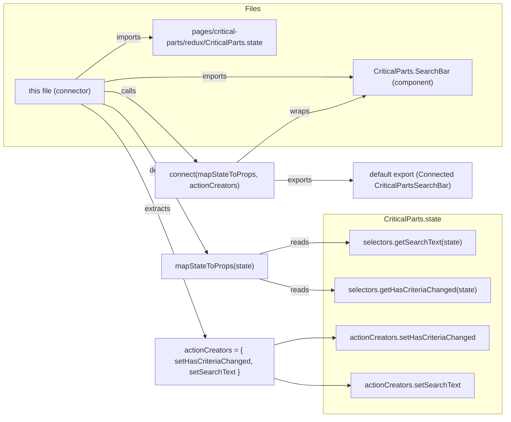

# Diagram: web/portal/src/pages/critical-parts/search/components/CriticalParts.SearchBarContainer.js

> Auto-generated by Obscura crawlers

## Mermaid

### SVG

<svg id="container" width="1126.375" xmlns="http://www.w3.org/2000/svg" class="flowchart" height="912" viewBox="0 0 1126.375 912" role="graphics-document document" aria-roledescription="flowchart-v2"><g><marker id="container_flowchart-v2-pointEnd" class="marker flowchart-v2" viewBox="0 0 10 10" refX="5" refY="5" markerUnits="userSpaceOnUse" markerWidth="8" markerHeight="8" orient="auto"><path d="M 0 0 L 10 5 L 0 10 z" class="arrowMarkerPath" style="stroke-width: 1; stroke-dasharray: 1, 0;"></path></marker><marker id="container_flowchart-v2-pointStart" class="marker flowchart-v2" viewBox="0 0 10 10" refX="4.5" refY="5" markerUnits="userSpaceOnUse" markerWidth="8" markerHeight="8" orient="auto"><path d="M 0 5 L 10 10 L 10 0 z" class="arrowMarkerPath" style="stroke-width: 1; stroke-dasharray: 1, 0;"></path></marker><marker id="container_flowchart-v2-circleEnd" class="marker flowchart-v2" viewBox="0 0 10 10" refX="11" refY="5" markerUnits="userSpaceOnUse" markerWidth="11" markerHeight="11" orient="auto"><circle cx="5" cy="5" r="5" class="arrowMarkerPath" style="stroke-width: 1; stroke-dasharray: 1, 0;"></circle></marker><marker id="container_flowchart-v2-circleStart" class="marker flowchart-v2" viewBox="0 0 10 10" refX="-1" refY="5" markerUnits="userSpaceOnUse" markerWidth="11" markerHeight="11" orient="auto"><circle cx="5" cy="5" r="5" class="arrowMarkerPath" style="stroke-width: 1; stroke-dasharray: 1, 0;"></circle></marker><marker id="container_flowchart-v2-crossEnd" class="marker cross flowchart-v2" viewBox="0 0 11 11" refX="12" refY="5.2" markerUnits="userSpaceOnUse" markerWidth="11" markerHeight="11" orient="auto"><path d="M 1,1 l 9,9 M 10,1 l -9,9" class="arrowMarkerPath" style="stroke-width: 2; stroke-dasharray: 1, 0;"></path></marker><marker id="container_flowchart-v2-crossStart" class="marker cross flowchart-v2" viewBox="0 0 11 11" refX="-1" refY="5.2" markerUnits="userSpaceOnUse" markerWidth="11" markerHeight="11" orient="auto"><path d="M 1,1 l 9,9 M 10,1 l -9,9" class="arrowMarkerPath" style="stroke-width: 2; stroke-dasharray: 1, 0;"></path></marker><g class="root"><g class="clusters"><g class="cluster" id="StateModule" data-look="classic"><rect style="" x="727.640625" y="468" width="390.734375" height="436"></rect><g class="cluster-label" transform="translate(859.5234375, 468)"><foreignObject width="126.96875" height="24">

CriticalParts.state

</foreignObject></g></g><g class="cluster" id="Files" data-look="classic"><rect style="" x="8" y="8" width="1110.375" height="312"></rect><g class="cluster-label" transform="translate(546.8828125, 8)"><foreignObject width="32.609375" height="24">

Files

</foreignObject></g></g></g><g class="edgePaths"><path d="M234.375,179.126L243.319,177.271C252.263,175.417,270.151,171.709,311.483,169.854C352.815,168,417.591,168,482.141,168C546.69,168,611.013,168,651.892,168C692.771,168,710.206,168,729.151,168.052C748.096,168.105,768.552,168.209,778.78,168.262L789.008,168.314" id="L_C_A_0" class="edge-thickness-normal edge-pattern-solid edge-thickness-normal edge-pattern-solid flowchart-link" style=";" data-edge="true" data-et="edge" data-id="L_C_A_0" data-points="W3sieCI6MjM0LjM3NSwieSI6MTc5LjEyNTU3NTc0NTMwNTQ3fSx7IngiOjI4OC4wMzkwNjI1LCJ5IjoxNjh9LHsieCI6NDgyLjM2NzE4NzUsInkiOjE2OH0seyJ4Ijo2NzUuMzM1OTM3NSwieSI6MTY4fSx7IngiOjcyNy42NDA2MjUsInkiOjE2OH0seyJ4Ijo3OTMuMDA3ODEyNSwieSI6MTY4LjMzNDU4NjMxNTgzMTU2fV0=" marker-end="url(#container_flowchart-v2-pointEnd)"></path><path d="M169.005,173L188.844,157.833C208.683,142.667,248.361,112.333,276.477,97.167C304.594,82,321.148,82,329.426,82L337.703,82" id="L_C_B_0" class="edge-thickness-normal edge-pattern-solid edge-thickness-normal edge-pattern-solid flowchart-link" style=";" data-edge="true" data-et="edge" data-id="L_C_B_0" data-points="W3sieCI6MTY5LjAwNTIzMDQwMjU0MjM3LCJ5IjoxNzN9LHsieCI6Mjg4LjAzOTA2MjUsInkiOjgyfSx7IngiOjM0MS43MDMxMjUsInkiOjgyfV0=" marker-end="url(#container_flowchart-v2-pointEnd)"></path><path d="M228.403,227L238.343,229.833C248.282,232.667,268.16,238.333,307.568,292.422C346.976,346.511,405.913,449.022,435.382,500.277L464.85,551.532" id="L_C_M_0" class="edge-thickness-normal edge-pattern-solid edge-thickness-normal edge-pattern-solid flowchart-link" style=";" data-edge="true" data-et="edge" data-id="L_C_M_0" data-points="W3sieCI6MjI4LjQwMzIzMTUzNDA5MDksInkiOjIyN30seyJ4IjoyODguMDM5MDYyNSwieSI6MjQ0fSx7IngiOjQ2Ni44NDM5MzQ5MTEyNDI2LCJ5Ijo1NTV9XQ==" marker-end="url(#container_flowchart-v2-pointEnd)"></path><path d="M582.563,555L598.025,550.833C613.487,546.667,644.411,538.333,668.591,534.167C692.771,530,710.206,530,727.786,530C745.367,530,763.094,530,771.957,530L780.82,530" id="L_M_B1_0" class="edge-thickness-normal edge-pattern-solid edge-thickness-normal edge-pattern-solid flowchart-link" style=";" data-edge="true" data-et="edge" data-id="L_M_B1_0" data-points="W3sieCI6NTgyLjU2MjUsInkiOjU1NX0seyJ4Ijo2NzUuMzM1OTM3NSwieSI6NTMwfSx7IngiOjcyNy42NDA2MjUsInkiOjUzMH0seyJ4Ijo3ODQuODIwMzEyNSwieSI6NTMwfV0=" marker-end="url(#container_flowchart-v2-pointEnd)"></path><path d="M582.563,609L598.025,613.167C613.487,617.333,644.411,625.667,668.591,629.833C692.771,634,710.206,634,722.423,634C734.641,634,741.641,634,745.141,634L748.641,634" id="L_M_B2_0" class="edge-thickness-normal edge-pattern-solid edge-thickness-normal edge-pattern-solid flowchart-link" style=";" data-edge="true" data-et="edge" data-id="L_M_B2_0" data-points="W3sieCI6NTgyLjU2MjUsInkiOjYwOX0seyJ4Ijo2NzUuMzM1OTM3NSwieSI6NjM0fSx7IngiOjcyNy42NDA2MjUsInkiOjYzNH0seyJ4Ijo3NTIuNjQwNjI1LCJ5Ijo2MzR9XQ==" marker-end="url(#container_flowchart-v2-pointEnd)"></path><path d="M181.045,227L198.878,237.167C216.71,247.333,252.374,267.667,299.064,352.378C345.753,437.09,403.467,586.18,432.324,660.725L461.181,735.27" id="L_C_AC_0" class="edge-thickness-normal edge-pattern-solid edge-thickness-normal edge-pattern-solid flowchart-link" style=";" data-edge="true" data-et="edge" data-id="L_C_AC_0" data-points="W3sieCI6MTgxLjA0NTM2NTc2NzA0NTQ0LCJ5IjoyMjd9LHsieCI6Mjg4LjAzOTA2MjUsInkiOjI4OH0seyJ4Ijo0NjIuNjI0Njg4NzQ1MDE5OSwieSI6NzM5fV0=" marker-end="url(#container_flowchart-v2-pointEnd)"></path><path d="M612.367,754.968L622.862,752.14C633.357,749.312,654.346,743.656,673.559,740.828C692.771,738,710.206,738,723.004,738C735.802,738,743.964,738,748.044,738L752.125,738" id="L_AC_B3_0" class="edge-thickness-normal edge-pattern-solid edge-thickness-normal edge-pattern-solid flowchart-link" style=";" data-edge="true" data-et="edge" data-id="L_AC_B3_0" data-points="W3sieCI6NjEyLjM2NzE4NzUsInkiOjc1NC45Njg0MjEwNTI2MzE2fSx7IngiOjY3NS4zMzU5Mzc1LCJ5Ijo3Mzh9LHsieCI6NzI3LjY0MDYyNSwieSI6NzM4fSx7IngiOjc1Ni4xMjUsInkiOjczOH1d" marker-end="url(#container_flowchart-v2-pointEnd)"></path><path d="M612.367,825.032L622.862,827.86C633.357,830.688,654.346,836.344,673.559,839.172C692.771,842,710.206,842,728.366,842C746.526,842,765.411,842,774.854,842L784.297,842" id="L_AC_B4_0" class="edge-thickness-normal edge-pattern-solid edge-thickness-normal edge-pattern-solid flowchart-link" style=";" data-edge="true" data-et="edge" data-id="L_AC_B4_0" data-points="W3sieCI6NjEyLjM2NzE4NzUsInkiOjgyNS4wMzE1Nzg5NDczNjg0fSx7IngiOjY3NS4zMzU5Mzc1LCJ5Ijo4NDJ9LHsieCI6NzI3LjY0MDYyNSwieSI6ODQyfSx7IngiOjc4OC4yOTY4NzUsInkiOjg0Mn1d" marker-end="url(#container_flowchart-v2-pointEnd)"></path><path d="M234.375,200L243.319,200C252.263,200,270.151,200,304.5,225.362C338.85,250.725,389.66,301.449,415.065,326.812L440.47,352.174" id="L_C_Conn_0" class="edge-thickness-normal edge-pattern-solid edge-thickness-normal edge-pattern-solid flowchart-link" style=";" data-edge="true" data-et="edge" data-id="L_C_Conn_0" data-points="W3sieCI6MjM0LjM3NSwieSI6MjAwfSx7IngiOjI4OC4wMzkwNjI1LCJ5IjoyMDB9LHsieCI6NDQzLjMwMTIyNDIyNjgwNDE1LCJ5IjozNTV9XQ==" marker-end="url(#container_flowchart-v2-pointEnd)"></path><path d="M532.539,355L556.339,336.5C580.138,318,627.737,281,660.254,262.5C692.771,244,710.206,244,733.93,238.239C757.655,232.478,787.669,220.956,802.676,215.195L817.683,209.434" id="L_Conn_A_0" class="edge-thickness-normal edge-pattern-solid edge-thickness-normal edge-pattern-solid flowchart-link" style=";" data-edge="true" data-et="edge" data-id="L_Conn_A_0" data-points="W3sieCI6NTMyLjUzOTA2MjUsInkiOjM1NX0seyJ4Ijo2NzUuMzM1OTM3NSwieSI6MjQ0fSx7IngiOjcyNy42NDA2MjUsInkiOjI0NH0seyJ4Ijo4MjEuNDE2ODc1LCJ5IjoyMDh9XQ==" marker-end="url(#container_flowchart-v2-pointEnd)"></path><path d="M612.367,394L622.862,394C633.357,394,654.346,394,673.559,394C692.771,394,710.206,394,729.151,394C748.096,394,768.552,394,778.78,394L789.008,394" id="L_Conn_Export_0" class="edge-thickness-normal edge-pattern-solid edge-thickness-normal edge-pattern-solid flowchart-link" style=";" data-edge="true" data-et="edge" data-id="L_Conn_Export_0" data-points="W3sieCI6NjEyLjM2NzE4NzUsInkiOjM5NH0seyJ4Ijo2NzUuMzM1OTM3NSwieSI6Mzk0fSx7IngiOjcyNy42NDA2MjUsInkiOjM5NH0seyJ4Ijo3OTMuMDA3ODEyNSwieSI6Mzk0fV0=" marker-end="url(#container_flowchart-v2-pointEnd)"></path></g><g class="edgeLabels"><g class="edgeLabel" transform="translate(482.3671875, 168)"><g class="label" data-id="L_C_A_0" transform="translate(-28.25, -12)"><foreignObject width="56.5" height="24">

imports

</foreignObject></g></g><g class="edgeLabel" transform="translate(288.0390625, 82)"><g class="label" data-id="L_C_B_0" transform="translate(-28.25, -12)"><foreignObject width="56.5" height="24">

imports

</foreignObject></g></g><g class="edgeLabel" transform="translate(361.98732, 372.62015)"><g class="label" data-id="L_C_M_0" transform="translate(-26.53125, -12)"><foreignObject width="53.0625" height="24">

defines

</foreignObject></g></g><g class="edgeLabel" transform="translate(675.3359375, 530)"><g class="label" data-id="L_M_B1_0" transform="translate(-20.0078125, -12)"><foreignObject width="40.015625" height="24">

reads

</foreignObject></g></g><g class="edgeLabel" transform="translate(675.3359375, 634)"><g class="label" data-id="L_M_B2_0" transform="translate(-20.0078125, -12)"><foreignObject width="40.015625" height="24">

reads

</foreignObject></g></g><g class="edgeLabel" transform="translate(353.10111, 456.07217)"><g class="label" data-id="L_C_AC_0" transform="translate(-28.6640625, -12)"><foreignObject width="57.328125" height="24">

extracts

</foreignObject></g></g><g class="edgeLabel"><g class="label" data-id="L_AC_B3_0" transform="translate(0, 0)"><foreignObject width="0" height="0">

</foreignObject></g></g><g class="edgeLabel"><g class="label" data-id="L_AC_B4_0" transform="translate(0, 0)"><foreignObject width="0" height="0">

</foreignObject></g></g><g class="edgeLabel" transform="translate(288.0390625, 200)"><g class="label" data-id="L_C_Conn_0" transform="translate(-16.4453125, -12)"><foreignObject width="32.890625" height="24">

calls

</foreignObject></g></g><g class="edgeLabel" transform="translate(675.3359375, 244)"><g class="label" data-id="L_Conn_A_0" transform="translate(-21.390625, -12)"><foreignObject width="42.78125" height="24">

wraps

</foreignObject></g></g><g class="edgeLabel" transform="translate(675.3359375, 394)"><g class="label" data-id="L_Conn_Export_0" transform="translate(-27.3046875, -12)"><foreignObject width="54.609375" height="24">

exports

</foreignObject></g></g></g><g class="nodes"><g class="node default" id="flowchart-A-0" transform="translate(923.0078125, 169)"><rect class="basic label-container" style="" x="-130" y="-39" width="260" height="78"></rect><g class="label" style="" transform="translate(-100, -24)"><rect></rect><foreignObject width="200" height="48">

CriticalParts.SearchBar (component)

</foreignObject></g></g><g class="node default" id="flowchart-B-1" transform="translate(482.3671875, 82)"><rect class="basic label-container" style="" x="-140.6640625" y="-39" width="281.328125" height="78"></rect><g class="label" style="" transform="translate(-110.6640625, -24)"><rect></rect><foreignObject width="221.328125" height="48">

pages/critical-parts/redux/CriticalParts.state

</foreignObject></g></g><g class="node default" id="flowchart-C-2" transform="translate(133.6875, 200)"><rect class="basic label-container" style="" x="-100.6875" y="-27" width="201.375" height="54"></rect><g class="label" style="" transform="translate(-70.6875, -12)"><rect></rect><foreignObject width="141.375" height="24">

this file (connector)

</foreignObject></g></g><g class="node default" id="flowchart-B1-3" transform="translate(923.0078125, 530)"><rect class="basic label-container" style="" x="-138.1875" y="-27" width="276.375" height="54"></rect><g class="label" style="" transform="translate(-108.1875, -12)"><rect></rect><foreignObject width="216.375" height="24">

selectors.getSearchText(state)

</foreignObject></g></g><g class="node default" id="flowchart-B2-4" transform="translate(923.0078125, 634)"><rect class="basic label-container" style="" x="-170.3671875" y="-27" width="340.734375" height="54"></rect><g class="label" style="" transform="translate(-140.3671875, -12)"><rect></rect><foreignObject width="280.734375" height="24">

selectors.getHasCriteriaChanged(state)

</foreignObject></g></g><g class="node default" id="flowchart-B3-5" transform="translate(923.0078125, 738)"><rect class="basic label-container" style="" x="-166.8828125" y="-27" width="333.765625" height="54"></rect><g class="label" style="" transform="translate(-136.8828125, -12)"><rect></rect><foreignObject width="273.765625" height="24">

actionCreators.setHasCriteriaChanged

</foreignObject></g></g><g class="node default" id="flowchart-B4-6" transform="translate(923.0078125, 842)"><rect class="basic label-container" style="" x="-134.7109375" y="-27" width="269.421875" height="54"></rect><g class="label" style="" transform="translate(-104.7109375, -12)"><rect></rect><foreignObject width="209.421875" height="24">

actionCreators.setSearchText

</foreignObject></g></g><g class="node default" id="flowchart-M-12" transform="translate(482.3671875, 582)"><rect class="basic label-container" style="" x="-116.734375" y="-27" width="233.46875" height="54"></rect><g class="label" style="" transform="translate(-86.734375, -12)"><rect></rect><foreignObject width="173.46875" height="24">

mapStateToProps(state)

</foreignObject></g></g><g class="node default" id="flowchart-AC-18" transform="translate(482.3671875, 790)"><rect class="basic label-container" style="" x="-130" y="-51" width="260" height="102"></rect><g class="label" style="" transform="translate(-100, -36)"><rect></rect><foreignObject width="200" height="72">

actionCreators = { setHasCriteriaChanged, setSearchText }

</foreignObject></g></g><g class="node default" id="flowchart-Conn-24" transform="translate(482.3671875, 394)"><rect class="basic label-container" style="" x="-130" y="-39" width="260" height="78"></rect><g class="label" style="" transform="translate(-100, -24)"><rect></rect><foreignObject width="200" height="48">

connect(mapStateToProps, actionCreators)

</foreignObject></g></g><g class="node default" id="flowchart-Export-28" transform="translate(923.0078125, 394)"><rect class="basic label-container" style="" x="-130" y="-39" width="260" height="78"></rect><g class="label" style="" transform="translate(-100, -24)"><rect></rect><foreignObject width="200" height="48">

default export (Connected CriticalPartsSearchBar)

</foreignObject></g></g></g></g></g></svg>
