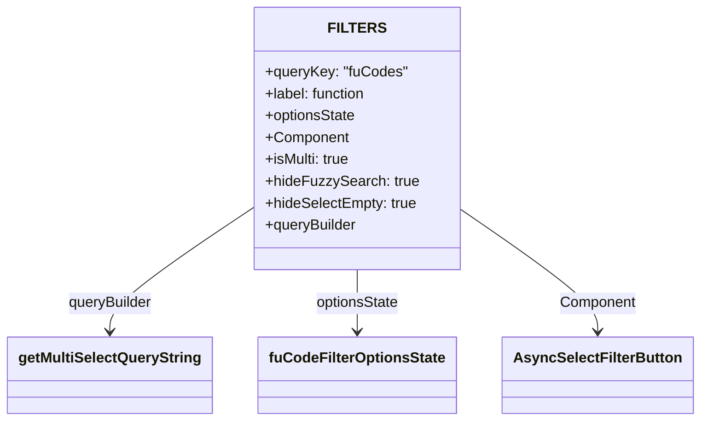

# Diagram: web/portal/src/pages/critical-parts/search/components/CriticalParts.filterDefs.js

> Auto-generated by Obscura crawlers

## Mermaid

### SVG

<svg id="container" width="742.265625" xmlns="http://www.w3.org/2000/svg" class="classDiagram" height="462" viewBox="0 0 742.265625 462" role="graphics-document document" aria-roledescription="class"><g><defs><marker id="container_class-aggregationStart" class="marker aggregation class" refX="18" refY="7" markerWidth="190" markerHeight="240" orient="auto"><path d="M 18,7 L9,13 L1,7 L9,1 Z"></path></marker></defs><defs><marker id="container_class-aggregationEnd" class="marker aggregation class" refX="1" refY="7" markerWidth="20" markerHeight="28" orient="auto"><path d="M 18,7 L9,13 L1,7 L9,1 Z"></path></marker></defs><defs><marker id="container_class-extensionStart" class="marker extension class" refX="18" refY="7" markerWidth="190" markerHeight="240" orient="auto"><path d="M 1,7 L18,13 V 1 Z"></path></marker></defs><defs><marker id="container_class-extensionEnd" class="marker extension class" refX="1" refY="7" markerWidth="20" markerHeight="28" orient="auto"><path d="M 1,1 V 13 L18,7 Z"></path></marker></defs><defs><marker id="container_class-compositionStart" class="marker composition class" refX="18" refY="7" markerWidth="190" markerHeight="240" orient="auto"><path d="M 18,7 L9,13 L1,7 L9,1 Z"></path></marker></defs><defs><marker id="container_class-compositionEnd" class="marker composition class" refX="1" refY="7" markerWidth="20" markerHeight="28" orient="auto"><path d="M 18,7 L9,13 L1,7 L9,1 Z"></path></marker></defs><defs><marker id="container_class-dependencyStart" class="marker dependency class" refX="6" refY="7" markerWidth="190" markerHeight="240" orient="auto"><path d="M 5,7 L9,13 L1,7 L9,1 Z"></path></marker></defs><defs><marker id="container_class-dependencyEnd" class="marker dependency class" refX="13" refY="7" markerWidth="20" markerHeight="28" orient="auto"><path d="M 18,7 L9,13 L14,7 L9,1 Z"></path></marker></defs><defs><marker id="container_class-lollipopStart" class="marker lollipop class" refX="13" refY="7" markerWidth="190" markerHeight="240" orient="auto"><circle stroke="black" fill="transparent" cx="7" cy="7" r="6"></circle></marker></defs><defs><marker id="container_class-lollipopEnd" class="marker lollipop class" refX="1" refY="7" markerWidth="190" markerHeight="240" orient="auto"><circle stroke="black" fill="transparent" cx="7" cy="7" r="6"></circle></marker></defs><g class="root"><g class="clusters"></g><g class="edgePaths"><path d="M271.133,227.228L245.445,244.856C219.758,262.485,168.383,297.743,142.695,320.538C117.008,343.333,117.008,353.667,117.008,358.833L117.008,364" id="id_FILTERS_getMultiSelectQueryString_1" class="edge-thickness-normal edge-pattern-solid relation" style=";;;" data-edge="true" data-et="edge" data-id="id_FILTERS_getMultiSelectQueryString_1" data-points="W3sieCI6MjcxLjEzMjgxMjUsInkiOjIyNy4yMjc2NzI2MjA2MzQ1fSx7IngiOjExNy4wMDc4MTI1LCJ5IjozMzN9LHsieCI6MTE3LjAwNzgxMjUsInkiOjM3MH1d" marker-end="url(#container_class-dependencyEnd)"></path><path d="M380.75,296L380.75,302.167C380.75,308.333,380.75,320.667,380.75,332C380.75,343.333,380.75,353.667,380.75,358.833L380.75,364" id="id_FILTERS_fuCodeFilterOptionsState_2" class="edge-thickness-normal edge-pattern-solid relation" style=";;;" data-edge="true" data-et="edge" data-id="id_FILTERS_fuCodeFilterOptionsState_2" data-points="W3sieCI6MzgwLjc1LCJ5IjoyOTZ9LHsieCI6MzgwLjc1LCJ5IjozMzN9LHsieCI6MzgwLjc1LCJ5IjozNzB9XQ==" marker-end="url(#container_class-dependencyEnd)"></path><path d="M490.367,230.075L514.452,247.229C538.536,264.383,586.706,298.692,610.79,321.012C634.875,343.333,634.875,353.667,634.875,358.833L634.875,364" id="id_FILTERS_AsyncSelectFilterButton_3" class="edge-thickness-normal edge-pattern-solid relation" style=";;;" data-edge="true" data-et="edge" data-id="id_FILTERS_AsyncSelectFilterButton_3" data-points="W3sieCI6NDkwLjM2NzE4NzUsInkiOjIzMC4wNzQ2MTI2NDE0MTY2Mn0seyJ4Ijo2MzQuODc1LCJ5IjozMzN9LHsieCI6NjM0Ljg3NSwieSI6MzcwfV0=" marker-end="url(#container_class-dependencyEnd)"></path></g><g class="edgeLabels"><g class="edgeLabel" transform="translate(117.0078125, 333)"><g class="label" data-id="id_FILTERS_getMultiSelectQueryString_1" transform="translate(-47.140625, -12)"><foreignObject width="94.28125" height="24">

queryBuilder

</foreignObject></g></g><g class="edgeLabel" transform="translate(380.75, 333)"><g class="label" data-id="id_FILTERS_fuCodeFilterOptionsState_2" transform="translate(-46.34375, -12)"><foreignObject width="92.6875" height="24">

optionsState

</foreignObject></g></g><g class="edgeLabel" transform="translate(634.875, 333)"><g class="label" data-id="id_FILTERS_AsyncSelectFilterButton_3" transform="translate(-41.8984375, -12)"><foreignObject width="83.796875" height="24">

Component

</foreignObject></g></g></g><g class="nodes"><g class="node default" id="classId-FILTERS-0" transform="translate(380.75, 152)"><g class="basic label-container"><path d="M-109.6171875 -144 L109.6171875 -144 L109.6171875 144 L-109.6171875 144" stroke="none" stroke-width="0" fill="#ECECFF" style=""></path><path d="M-109.6171875 -144 C-45.397338968319204 -144, 18.822509563361592 -144, 109.6171875 -144 M-109.6171875 -144 C-65.42506428328615 -144, -21.232941066572295 -144, 109.6171875 -144 M109.6171875 -144 C109.6171875 -37.59650262630812, 109.6171875 68.80699474738375, 109.6171875 144 M109.6171875 -144 C109.6171875 -73.20830631088931, 109.6171875 -2.4166126217786257, 109.6171875 144 M109.6171875 144 C42.288246276772554 144, -25.04069494645489 144, -109.6171875 144 M109.6171875 144 C52.664015918275915 144, -4.28915566344817 144, -109.6171875 144 M-109.6171875 144 C-109.6171875 48.493587746809496, -109.6171875 -47.01282450638101, -109.6171875 -144 M-109.6171875 144 C-109.6171875 65.41241378532496, -109.6171875 -13.175172429350084, -109.6171875 -144" stroke="#9370DB" stroke-width="1.3" fill="none" stroke-dasharray="0 0" style=""></path></g><g class="annotation-group text" transform="translate(0, -120)"></g><g class="label-group text" transform="translate(-27.5625, -120)"><g class="label" style="font-weight: bolder" transform="translate(0,-12)"><foreignObject width="55.125" height="24">

FILTERS

</foreignObject></g></g><g class="members-group text" transform="translate(-97.6171875, -72)"><g class="label" style="" transform="translate(0,-12)"><foreignObject width="154.453125" height="24">

+queryKey: "fuCodes"

</foreignObject></g><g class="label" style="" transform="translate(0,12)"><foreignObject width="113.15625" height="24">

+label: function

</foreignObject></g><g class="label" style="" transform="translate(0,36)"><foreignObject width="100.65625" height="24">

+optionsState

</foreignObject></g><g class="label" style="" transform="translate(0,60)"><foreignObject width="91.78125" height="24">

+Component

</foreignObject></g><g class="label" style="" transform="translate(0,84)"><foreignObject width="94.78125" height="24">

+isMulti: true

</foreignObject></g><g class="label" style="" transform="translate(0,108)"><foreignObject width="165.375" height="24">

+hideFuzzySearch: true

</foreignObject></g><g class="label" style="" transform="translate(0,132)"><foreignObject width="167.671875" height="24">

+hideSelectEmpty: true

</foreignObject></g><g class="label" style="" transform="translate(0,156)"><foreignObject width="102.265625" height="24">

+queryBuilder

</foreignObject></g></g><g class="methods-group text" transform="translate(-97.6171875, 144)"></g><g class="divider" style=""><path d="M-109.6171875 -96 C-39.317932006826496 -96, 30.98132348634701 -96, 109.6171875 -96 M-109.6171875 -96 C-35.84393019471766 -96, 37.929327110564685 -96, 109.6171875 -96" stroke="#9370DB" stroke-width="1.3" fill="none" stroke-dasharray="0 0" style=""></path></g><g class="divider" style=""><path d="M-109.6171875 120 C-49.502269580809774 120, 10.612648338380453 120, 109.6171875 120 M-109.6171875 120 C-36.91896346671929 120, 35.77926056656142 120, 109.6171875 120" stroke="#9370DB" stroke-width="1.3" fill="none" stroke-dasharray="0 0" style=""></path></g></g><g class="node default" id="classId-getMultiSelectQueryString-1" transform="translate(117.0078125, 412)"><g class="basic label-container"><path d="M-109.0078125 -42 L109.0078125 -42 L109.0078125 42 L-109.0078125 42" stroke="none" stroke-width="0" fill="#ECECFF" style=""></path><path d="M-109.0078125 -42 C-62.84124233216641 -42, -16.67467216433282 -42, 109.0078125 -42 M-109.0078125 -42 C-26.977380405830317 -42, 55.053051688339366 -42, 109.0078125 -42 M109.0078125 -42 C109.0078125 -9.589051084171068, 109.0078125 22.821897831657864, 109.0078125 42 M109.0078125 -42 C109.0078125 -18.635851433734082, 109.0078125 4.728297132531836, 109.0078125 42 M109.0078125 42 C54.973225705789694 42, 0.938638911579389 42, -109.0078125 42 M109.0078125 42 C58.599234368145076 42, 8.190656236290152 42, -109.0078125 42 M-109.0078125 42 C-109.0078125 17.992683457704818, -109.0078125 -6.014633084590365, -109.0078125 -42 M-109.0078125 42 C-109.0078125 24.759881542900544, -109.0078125 7.519763085801088, -109.0078125 -42" stroke="#9370DB" stroke-width="1.3" fill="none" stroke-dasharray="0 0" style=""></path></g><g class="annotation-group text" transform="translate(0, -18)"></g><g class="label-group text" transform="translate(-97.0078125, -18)"><g class="label" style="font-weight: bolder" transform="translate(0,-12)"><foreignObject width="194.015625" height="24">

getMultiSelectQueryString

</foreignObject></g></g><g class="members-group text" transform="translate(-97.0078125, 30)"></g><g class="methods-group text" transform="translate(-97.0078125, 60)"></g><g class="divider" style=""><path d="M-109.0078125 6 C-49.991162330558005 6, 9.02548783888399 6, 109.0078125 6 M-109.0078125 6 C-57.45617203682433 6, -5.904531573648654 6, 109.0078125 6" stroke="#9370DB" stroke-width="1.3" fill="none" stroke-dasharray="0 0" style=""></path></g><g class="divider" style=""><path d="M-109.0078125 24 C-61.33111424570818 24, -13.654415991416357 24, 109.0078125 24 M-109.0078125 24 C-64.34937621842951 24, -19.690939936859024 24, 109.0078125 24" stroke="#9370DB" stroke-width="1.3" fill="none" stroke-dasharray="0 0" style=""></path></g></g><g class="node default" id="classId-fuCodeFilterOptionsState-2" transform="translate(380.75, 412)"><g class="basic label-container"><path d="M-104.734375 -42 L104.734375 -42 L104.734375 42 L-104.734375 42" stroke="none" stroke-width="0" fill="#ECECFF" style=""></path><path d="M-104.734375 -42 C-56.9068446676229 -42, -9.079314335245797 -42, 104.734375 -42 M-104.734375 -42 C-44.774637470849584 -42, 15.185100058300833 -42, 104.734375 -42 M104.734375 -42 C104.734375 -13.364823580627561, 104.734375 15.270352838744877, 104.734375 42 M104.734375 -42 C104.734375 -20.147028066553847, 104.734375 1.705943866892305, 104.734375 42 M104.734375 42 C48.840584829423065 42, -7.05320534115387 42, -104.734375 42 M104.734375 42 C54.97971700810373 42, 5.225059016207453 42, -104.734375 42 M-104.734375 42 C-104.734375 15.517295392018884, -104.734375 -10.965409215962232, -104.734375 -42 M-104.734375 42 C-104.734375 9.005602315020688, -104.734375 -23.988795369958623, -104.734375 -42" stroke="#9370DB" stroke-width="1.3" fill="none" stroke-dasharray="0 0" style=""></path></g><g class="annotation-group text" transform="translate(0, -18)"></g><g class="label-group text" transform="translate(-92.734375, -18)"><g class="label" style="font-weight: bolder" transform="translate(0,-12)"><foreignObject width="185.46875" height="24">

fuCodeFilterOptionsState

</foreignObject></g></g><g class="members-group text" transform="translate(-92.734375, 30)"></g><g class="methods-group text" transform="translate(-92.734375, 60)"></g><g class="divider" style=""><path d="M-104.734375 6 C-55.51045689426231 6, -6.2865387885246236 6, 104.734375 6 M-104.734375 6 C-32.39911700093475 6, 39.9361409981305 6, 104.734375 6" stroke="#9370DB" stroke-width="1.3" fill="none" stroke-dasharray="0 0" style=""></path></g><g class="divider" style=""><path d="M-104.734375 24 C-42.76168373490222 24, 19.21100753019556 24, 104.734375 24 M-104.734375 24 C-36.181387388725184 24, 32.37160022254963 24, 104.734375 24" stroke="#9370DB" stroke-width="1.3" fill="none" stroke-dasharray="0 0" style=""></path></g></g><g class="node default" id="classId-AsyncSelectFilterButton-3" transform="translate(634.875, 412)"><g class="basic label-container"><path d="M-99.390625 -42 L99.390625 -42 L99.390625 42 L-99.390625 42" stroke="none" stroke-width="0" fill="#ECECFF" style=""></path><path d="M-99.390625 -42 C-26.903626514948854 -42, 45.58337197010229 -42, 99.390625 -42 M-99.390625 -42 C-27.458384403050715 -42, 44.47385619389857 -42, 99.390625 -42 M99.390625 -42 C99.390625 -22.88548920770529, 99.390625 -3.770978415410582, 99.390625 42 M99.390625 -42 C99.390625 -14.557556941612575, 99.390625 12.884886116774851, 99.390625 42 M99.390625 42 C38.695717374434984 42, -21.99919025113003 42, -99.390625 42 M99.390625 42 C39.85574800706104 42, -19.679128985877924 42, -99.390625 42 M-99.390625 42 C-99.390625 14.988358719406527, -99.390625 -12.023282561186946, -99.390625 -42 M-99.390625 42 C-99.390625 20.06641835333831, -99.390625 -1.8671632933233795, -99.390625 -42" stroke="#9370DB" stroke-width="1.3" fill="none" stroke-dasharray="0 0" style=""></path></g><g class="annotation-group text" transform="translate(0, -18)"></g><g class="label-group text" transform="translate(-87.390625, -18)"><g class="label" style="font-weight: bolder" transform="translate(0,-12)"><foreignObject width="174.78125" height="24">

AsyncSelectFilterButton

</foreignObject></g></g><g class="members-group text" transform="translate(-87.390625, 30)"></g><g class="methods-group text" transform="translate(-87.390625, 60)"></g><g class="divider" style=""><path d="M-99.390625 6 C-49.485471429506106 6, 0.41968214098778844 6, 99.390625 6 M-99.390625 6 C-34.21004482521178 6, 30.970535349576437 6, 99.390625 6" stroke="#9370DB" stroke-width="1.3" fill="none" stroke-dasharray="0 0" style=""></path></g><g class="divider" style=""><path d="M-99.390625 24 C-38.27453249976975 24, 22.841560000460504 24, 99.390625 24 M-99.390625 24 C-35.879353685647985 24, 27.63191762870403 24, 99.390625 24" stroke="#9370DB" stroke-width="1.3" fill="none" stroke-dasharray="0 0" style=""></path></g></g></g></g></g></svg>
