# Diagram: web/portal/src/pages/critical-parts/table/CriticalParts.columns.js

> Auto-generated by Obscura crawlers

## Mermaid

```mermaid
classDiagram
    class useColumns {
        +setShowAlertMeModal
        +t()
        +columns[]
    }
    class SupplierInfo {
        +props
        +t()
        +formatDuration()
    }
    class PartCell {
        +props
    }
    class RunOutByCell {
        +props
        +t()
        +moment()
        +localizedDateFormatter()
        +localizedTimeFormatter()
        +getDifferenceBetweenTimestamps()
    }
    class MustShipByCell {
        +props
        +t()
        +moment()
        +localizedDateFormatter()
        +localizedTimeFormatter()
        +getDifferenceBetweenTimestamps()
    }
    class ExpirationCell {
        +props
        +formatPercentage()
    }
    class CurrentInventoryCell {
        +props
        +t()
    }
    class LastCountCell {
        +props
        +getDateFormatFromUserPreferences()
        +moment()
    }
    class DaysOnHandCell {
        +props
        +t()
        +Intl.NumberFormat
    }
    class RequirementsCell {
        +props
    }
    class NextShipmentCell {
        +props
        +getDateFormatFromUserPreferences()
        +moment()
    }
    class NotesCell {
        +props
        +t()
    }
    class ActionsCell {
        +props
        +t()
        +Button.onClick()
    }
    class WatchToggle
    class Button
    class Text
    class Colors
    class moment
    class useTranslation
    class dateTimeUtils {
        +getDifferenceBetweenTimestamps()
        +localizedDateFormatter()
        +localizedTimeFormatter()
        +formatDuration()
        +getDateFormatFromUserPreferences()
    }

    useColumns --> RunOutByCell : includes
    useColumns --> MustShipByCell : includes
    useColumns --> ExpirationCell : includes
    useColumns --> CurrentInventoryCell : includes
    useColumns --> DaysOnHandCell : includes
    useColumns --> NextShipmentCell : includes
    useColumns --> NotesCell : includes
    useColumns --> PartCell : includes
    useColumns --> RequirementsCell : includes
    useColumns --> ActionsCell : includes
    useColumns --> WatchToggle : uses

    PartCell --> SupplierInfo : composes
    PartCell --> Text : uses

    SupplierInfo --> Text : uses
    SupplierInfo --> dateTimeUtils : uses
    SupplierInfo --> Colors : reads

    RunOutByCell --> moment : uses
    RunOutByCell --> dateTimeUtils : uses
    RunOutByCell --> Text : uses
    RunOutByCell --> Colors : reads

    MustShipByCell --> moment : uses
    MustShipByCell --> dateTimeUtils : uses
    MustShipByCell --> Text : uses
    MustShipByCell --> Colors : reads

    ExpirationCell --> Text : uses
    ExpirationCell --> Colors : reads

    CurrentInventoryCell --> Text : uses

    LastCountCell --> moment : uses
    LastCountCell --> dateTimeUtils : uses
    LastCountCell --> Text : uses

    DaysOnHandCell --> Text : uses
    DaysOnHandCell --> Intl : uses

    NextShipmentCell --> moment : uses
    NextShipmentCell --> dateTimeUtils : uses
    NextShipmentCell --> Text : uses

    NotesCell --> Text : uses

    ActionsCell --> Button : uses
    ActionsCell --> useColumns : calls setShowAlertMeModal

    useColumns ..> useTranslation : obtains t()
    SupplierInfo ..> useTranslation : obtains t()
    RunOutByCell ..> useTranslation : obtains t()
    MustShipByCell ..> useTranslation : obtains t()
    DaysOnHandCell ..> useTranslation : obtains t()
    NotesCell ..> useTranslation : obtains t()
    ActionsCell ..> useTranslation : obtains t()
```

### SVG

<svg id="container" width="3633.40625" xmlns="http://www.w3.org/2000/svg" class="classDiagram" height="1036" viewBox="0 0 3633.40625 1036" role="graphics-document document" aria-roledescription="class"><g><defs><marker id="container_class-aggregationStart" class="marker aggregation class" refX="18" refY="7" markerWidth="190" markerHeight="240" orient="auto"><path d="M 18,7 L9,13 L1,7 L9,1 Z"></path></marker></defs><defs><marker id="container_class-aggregationEnd" class="marker aggregation class" refX="1" refY="7" markerWidth="20" markerHeight="28" orient="auto"><path d="M 18,7 L9,13 L1,7 L9,1 Z"></path></marker></defs><defs><marker id="container_class-extensionStart" class="marker extension class" refX="18" refY="7" markerWidth="190" markerHeight="240" orient="auto"><path d="M 1,7 L18,13 V 1 Z"></path></marker></defs><defs><marker id="container_class-extensionEnd" class="marker extension class" refX="1" refY="7" markerWidth="20" markerHeight="28" orient="auto"><path d="M 1,1 V 13 L18,7 Z"></path></marker></defs><defs><marker id="container_class-compositionStart" class="marker composition class" refX="18" refY="7" markerWidth="190" markerHeight="240" orient="auto"><path d="M 18,7 L9,13 L1,7 L9,1 Z"></path></marker></defs><defs><marker id="container_class-compositionEnd" class="marker composition class" refX="1" refY="7" markerWidth="20" markerHeight="28" orient="auto"><path d="M 18,7 L9,13 L1,7 L9,1 Z"></path></marker></defs><defs><marker id="container_class-dependencyStart" class="marker dependency class" refX="6" refY="7" markerWidth="190" markerHeight="240" orient="auto"><path d="M 5,7 L9,13 L1,7 L9,1 Z"></path></marker></defs><defs><marker id="container_class-dependencyEnd" class="marker dependency class" refX="13" refY="7" markerWidth="20" markerHeight="28" orient="auto"><path d="M 18,7 L9,13 L14,7 L9,1 Z"></path></marker></defs><defs><marker id="container_class-lollipopStart" class="marker lollipop class" refX="13" refY="7" markerWidth="190" markerHeight="240" orient="auto"><circle stroke="black" fill="transparent" cx="7" cy="7" r="6"></circle></marker></defs><defs><marker id="container_class-lollipopEnd" class="marker lollipop class" refX="1" refY="7" markerWidth="190" markerHeight="240" orient="auto"><circle stroke="black" fill="transparent" cx="7" cy="7" r="6"></circle></marker></defs><g class="root"><g class="clusters"></g><g class="edgePaths"><path d="M1883.633,112.529L1786.876,129.274C1690.118,146.019,1496.604,179.51,1399.847,216.422C1303.09,253.333,1303.09,293.667,1303.09,334C1303.09,374.333,1303.09,414.667,1303.09,440C1303.09,465.333,1303.09,475.667,1303.09,480.833L1303.09,486" id="id_useColumns_RunOutByCell_1" class="edge-thickness-normal edge-pattern-solid relation" style=";;;" data-edge="true" data-et="edge" data-id="id_useColumns_RunOutByCell_1" data-points="W3sieCI6MTg4My42MzI4MTI1LCJ5IjoxMTIuNTI5MDE5MDI5NDIxMjl9LHsieCI6MTMwMy4wODk4NDM3NSwieSI6MjEzfSx7IngiOjEzMDMuMDg5ODQzNzUsInkiOjMzNH0seyJ4IjoxMzAzLjA4OTg0Mzc1LCJ5Ijo0NTV9LHsieCI6MTMwMy4wODk4NDM3NSwieSI6NDkyfV0=" marker-end="url(#container_class-dependencyEnd)"></path><path d="M1883.633,140.036L1853.604,152.197C1823.574,164.358,1763.516,188.679,1733.486,221.006C1703.457,253.333,1703.457,293.667,1703.457,334C1703.457,374.333,1703.457,414.667,1703.457,440C1703.457,465.333,1703.457,475.667,1703.457,480.833L1703.457,486" id="id_useColumns_MustShipByCell_2" class="edge-thickness-normal edge-pattern-solid relation" style=";;;" data-edge="true" data-et="edge" data-id="id_useColumns_MustShipByCell_2" data-points="W3sieCI6MTg4My42MzI4MTI1LCJ5IjoxNDAuMDM2NDg3NDc1ODE0NDV9LHsieCI6MTcwMy40NTcwMzEyNSwieSI6MjEzfSx7IngiOjE3MDMuNDU3MDMxMjUsInkiOjMzNH0seyJ4IjoxNzAzLjQ1NzAzMTI1LCJ5Ijo0NTV9LHsieCI6MTcwMy40NTcwMzEyNSwieSI6NDkyfV0=" marker-end="url(#container_class-dependencyEnd)"></path><path d="M2120.875,120.14L2186.115,135.617C2251.355,151.093,2381.836,182.047,2447.076,217.69C2512.316,253.333,2512.316,293.667,2512.316,334C2512.316,374.333,2512.316,414.667,2512.316,448C2512.316,481.333,2512.316,507.667,2512.316,520.833L2512.316,534" id="id_useColumns_ExpirationCell_3" class="edge-thickness-normal edge-pattern-solid relation" style=";;;" data-edge="true" data-et="edge" data-id="id_useColumns_ExpirationCell_3" data-points="W3sieCI6MjEyMC44NzUsInkiOjEyMC4xMzk5ODc0NDAyNjQ2OH0seyJ4IjoyNTEyLjMxNjQwNjI1LCJ5IjoyMTN9LHsieCI6MjUxMi4zMTY0MDYyNSwieSI6MzM0fSx7IngiOjI1MTIuMzE2NDA2MjUsInkiOjQ1NX0seyJ4IjoyNTEyLjMxNjQwNjI1LCJ5Ijo1NDB9XQ==" marker-end="url(#container_class-dependencyEnd)"></path><path d="M2010.606,176L2011.219,182.167C2011.833,188.333,2013.059,200.667,2013.672,227C2014.285,253.333,2014.285,293.667,2014.285,334C2014.285,374.333,2014.285,414.667,2014.285,448C2014.285,481.333,2014.285,507.667,2014.285,520.833L2014.285,534" id="id_useColumns_CurrentInventoryCell_4" class="edge-thickness-normal edge-pattern-solid relation" style=";;;" data-edge="true" data-et="edge" data-id="id_useColumns_CurrentInventoryCell_4" data-points="W3sieCI6MjAxMC42MDYxNzg5NzcyNzI3LCJ5IjoxNzZ9LHsieCI6MjAxNC4yODUxNTYyNSwieSI6MjEzfSx7IngiOjIwMTQuMjg1MTU2MjUsInkiOjMzNH0seyJ4IjoyMDE0LjI4NTE1NjI1LCJ5Ijo0NTV9LHsieCI6MjAxNC4yODUxNTYyNSwieSI6NTQwfV0=" marker-end="url(#container_class-dependencyEnd)"></path><path d="M2120.875,102.439L2330.253,120.866C2539.632,139.293,2958.388,176.146,3167.766,214.74C3377.145,253.333,3377.145,293.667,3377.145,334C3377.145,374.333,3377.145,414.667,3377.145,446C3377.145,477.333,3377.145,499.667,3377.145,510.833L3377.145,522" id="id_useColumns_DaysOnHandCell_5" class="edge-thickness-normal edge-pattern-solid relation" style=";;;" data-edge="true" data-et="edge" data-id="id_useColumns_DaysOnHandCell_5" data-points="W3sieCI6MjEyMC44NzUsInkiOjEwMi40Mzk0ODY2NjM3MTE4OX0seyJ4IjozMzc3LjE0NDUzMTI1LCJ5IjoyMTN9LHsieCI6MzM3Ny4xNDQ1MzEyNSwieSI6MzM0fSx7IngiOjMzNzcuMTQ0NTMxMjUsInkiOjQ1NX0seyJ4IjozMzc3LjE0NDUzMTI1LCJ5Ijo1Mjh9XQ==" marker-end="url(#container_class-dependencyEnd)"></path><path d="M1883.633,105.016L1719.607,123.013C1555.582,141.01,1227.531,177.005,1063.506,215.169C899.48,253.333,899.48,293.667,899.48,334C899.48,374.333,899.48,414.667,899.48,446C899.48,477.333,899.48,499.667,899.48,510.833L899.48,522" id="id_useColumns_NextShipmentCell_6" class="edge-thickness-normal edge-pattern-solid relation" style=";;;" data-edge="true" data-et="edge" data-id="id_useColumns_NextShipmentCell_6" data-points="W3sieCI6MTg4My42MzI4MTI1LCJ5IjoxMDUuMDE1NTA0MjMyOTM1NDN9LHsieCI6ODk5LjQ4MDQ2ODc1LCJ5IjoyMTN9LHsieCI6ODk5LjQ4MDQ2ODc1LCJ5IjozMzR9LHsieCI6ODk5LjQ4MDQ2ODc1LCJ5Ijo0NTV9LHsieCI6ODk5LjQ4MDQ2ODc1LCJ5Ijo1Mjh9XQ==" marker-end="url(#container_class-dependencyEnd)"></path><path d="M2120.875,111.138L2226.105,128.115C2331.335,145.092,2541.794,179.046,2647.024,216.19C2752.254,253.333,2752.254,293.667,2752.254,334C2752.254,374.333,2752.254,414.667,2752.254,448C2752.254,481.333,2752.254,507.667,2752.254,520.833L2752.254,534" id="id_useColumns_NotesCell_7" class="edge-thickness-normal edge-pattern-solid relation" style=";;;" data-edge="true" data-et="edge" data-id="id_useColumns_NotesCell_7" data-points="W3sieCI6MjEyMC44NzUsInkiOjExMS4xMzc1MzY0NTgzMzMzM30seyJ4IjoyNzUyLjI1MzkwNjI1LCJ5IjoyMTN9LHsieCI6Mjc1Mi4yNTM5MDYyNSwieSI6MzM0fSx7IngiOjI3NTIuMjUzOTA2MjUsInkiOjQ1NX0seyJ4IjoyNzUyLjI1MzkwNjI1LCJ5Ijo1NDB9XQ==" marker-end="url(#container_class-dependencyEnd)"></path><path d="M1883.633,126.541L1834.146,140.951C1784.659,155.36,1685.685,184.18,1636.198,207.757C1586.711,231.333,1586.711,249.667,1586.711,258.833L1586.711,268" id="id_useColumns_PartCell_8" class="edge-thickness-normal edge-pattern-solid relation" style=";;;" data-edge="true" data-et="edge" data-id="id_useColumns_PartCell_8" data-points="W3sieCI6MTg4My42MzI4MTI1LCJ5IjoxMjYuNTQwNzE3NjIyODM5MX0seyJ4IjoxNTg2LjcxMDkzNzUsInkiOjIxM30seyJ4IjoxNTg2LjcxMDkzNzUsInkiOjI3NH1d" marker-end="url(#container_class-dependencyEnd)"></path><path d="M1883.633,107.931L1753.242,125.442C1622.85,142.954,1362.068,177.977,1231.676,204.655C1101.285,231.333,1101.285,249.667,1101.285,258.833L1101.285,268" id="id_useColumns_RequirementsCell_9" class="edge-thickness-normal edge-pattern-solid relation" style=";;;" data-edge="true" data-et="edge" data-id="id_useColumns_RequirementsCell_9" data-points="W3sieCI6MTg4My42MzI4MTI1LCJ5IjoxMDcuOTMwNzk5MzEzMjM5MjJ9LHsieCI6MTEwMS4yODUxNTYyNSwieSI6MjEzfSx7IngiOjExMDEuMjg1MTU2MjUsInkiOjI3NH1d" marker-end="url(#container_class-dependencyEnd)"></path><path d="M2120.875,105.221L2282.05,123.184C2443.225,141.147,2765.576,177.074,2930.158,200.361C3094.74,223.649,3101.555,234.298,3104.962,239.622L3108.37,244.946" id="id_useColumns_ActionsCell_10" class="edge-thickness-normal edge-pattern-solid relation" style=";;;" data-edge="true" data-et="edge" data-id="id_useColumns_ActionsCell_10" data-points="W3sieCI6MjEyMC44NzUsInkiOjEwNS4yMjA1MjUxNjQ0Mjg3MX0seyJ4IjozMDg3LjkyNTc4MTI1LCJ5IjoyMTN9LHsieCI6MzExMS42MDM4MjIzMTQwNDk1LCJ5IjoyNTB9XQ==" marker-end="url(#container_class-dependencyEnd)"></path><path d="M1883.633,116.959L1807.557,132.966C1731.48,148.972,1579.328,180.986,1503.252,209.16C1427.176,237.333,1427.176,261.667,1427.176,273.833L1427.176,286" id="id_useColumns_WatchToggle_11" class="edge-thickness-normal edge-pattern-solid relation" style=";;;" data-edge="true" data-et="edge" data-id="id_useColumns_WatchToggle_11" data-points="W3sieCI6MTg4My42MzI4MTI1LCJ5IjoxMTYuOTU4NjEyOTYwMTk1NjJ9LHsieCI6MTQyNy4xNzU3ODEyNSwieSI6MjEzfSx7IngiOjE0MjcuMTc1NzgxMjUsInkiOjI5Mn1d" marker-end="url(#container_class-dependencyEnd)"></path><path d="M1637.809,343.295L1740.15,361.913C1842.492,380.53,2047.176,417.765,2149.518,447.549C2251.859,477.333,2251.859,499.667,2251.859,510.833L2251.859,522" id="id_PartCell_SupplierInfo_12" class="edge-thickness-normal edge-pattern-solid relation" style=";;;" data-edge="true" data-et="edge" data-id="id_PartCell_SupplierInfo_12" data-points="W3sieCI6MTYzNy44MDg1OTM3NSwieSI6MzQzLjI5NTM5MzQxNTQ3MzU0fSx7IngiOjIyNTEuODU5Mzc1LCJ5Ijo0NTV9LHsieCI6MjI1MS44NTkzNzUsInkiOjUyOH1d" marker-end="url(#container_class-dependencyEnd)"></path><path d="M1535.613,340.13L1376.014,359.275C1216.415,378.42,897.217,416.71,737.618,462.022C578.02,507.333,578.02,559.667,578.02,612C578.02,664.333,578.02,716.667,747.199,766.716C916.379,816.765,1254.738,864.531,1423.918,888.413L1593.098,912.296" id="id_PartCell_Text_13" class="edge-thickness-normal edge-pattern-solid relation" style=";;;" data-edge="true" data-et="edge" data-id="id_PartCell_Text_13" data-points="W3sieCI6MTUzNS42MTMyODEyNSwieSI6MzQwLjEyOTU0MjA2NjAyNzd9LHsieCI6NTc4LjAxOTUzMTI1LCJ5Ijo0NTV9LHsieCI6NTc4LjAxOTUzMTI1LCJ5Ijo2MTJ9LHsieCI6NTc4LjAxOTUzMTI1LCJ5Ijo3Njl9LHsieCI6MTU5OS4wMzkwNjI1LCJ5Ijo5MTMuMTM0NDQ1NjQwODc0N31d" marker-end="url(#container_class-dependencyEnd)"></path><path d="M2152.191,642.508L2083.318,663.59C2014.445,684.672,1876.698,726.836,1794.239,765.786C1711.78,804.737,1684.608,840.473,1671.022,858.341L1657.436,876.21" id="id_SupplierInfo_Text_14" class="edge-thickness-normal edge-pattern-solid relation" style=";;;" data-edge="true" data-et="edge" data-id="id_SupplierInfo_Text_14" data-points="W3sieCI6MjE1Mi4xOTE0MDYyNSwieSI6NjQyLjUwODEzMTg2MTQzNjZ9LHsieCI6MTczOC45NTExNzE4NzUsInkiOjc2OX0seyJ4IjoxNjUzLjgwNDY4NzUsInkiOjg4MC45ODU3Njc1OTUyNDQzfV0=" marker-end="url(#container_class-dependencyEnd)"></path><path d="M2152.191,619.772L1833.25,644.643C1514.309,669.515,876.426,719.257,562.419,749.555C248.412,779.854,258.281,790.707,263.216,796.134L268.15,801.561" id="id_SupplierInfo_dateTimeUtils_15" class="edge-thickness-normal edge-pattern-solid relation" style=";;;" data-edge="true" data-et="edge" data-id="id_SupplierInfo_dateTimeUtils_15" data-points="W3sieCI6MjE1Mi4xOTE0MDYyNSwieSI6NjE5Ljc3MjE4Njc0ODc3NjJ9LHsieCI6MjM4LjU0Mjk2ODc1LCJ5Ijo3Njl9LHsieCI6MjcyLjE4NjUyMzQzNzUsInkiOjgwNn1d" marker-end="url(#container_class-dependencyEnd)"></path><path d="M2351.527,665.163L2383.973,682.469C2416.418,699.775,2481.309,734.388,2520.891,768.44C2560.473,802.493,2574.748,835.987,2581.885,852.734L2589.022,869.48" id="id_SupplierInfo_Colors_16" class="edge-thickness-normal edge-pattern-solid relation" style=";;;" data-edge="true" data-et="edge" data-id="id_SupplierInfo_Colors_16" data-points="W3sieCI6MjM1MS41MjczNDM3NSwieSI6NjY1LjE2MjU5OTAzNjUwOTJ9LHsieCI6MjU0Ni4xOTkyMTg3NSwieSI6NzY5fSx7IngiOjI1OTEuMzczOTk3MDQzOTE4NywieSI6ODc1fV0=" marker-end="url(#container_class-dependencyEnd)"></path><path d="M1133.527,632.821L948.688,655.517C763.849,678.214,394.171,723.607,218.345,763.089C42.52,802.571,60.548,836.143,69.562,852.928L78.576,869.714" id="id_RunOutByCell_moment_17" class="edge-thickness-normal edge-pattern-solid relation" style=";;;" data-edge="true" data-et="edge" data-id="id_RunOutByCell_moment_17" data-points="W3sieCI6MTEzMy41MjczNDM3NSwieSI6NjMyLjgyMDcxMTE2NzMyNX0seyJ4IjoyNC40OTIxODc1LCJ5Ijo3Njl9LHsieCI6ODEuNDE0NTkwMzcxNjIxNjEsInkiOjg3NX1d" marker-end="url(#container_class-dependencyEnd)"></path><path d="M1133.527,638.317L993.194,660.098C852.861,681.878,572.194,725.439,434.777,752.51C297.361,779.582,303.195,790.164,306.111,795.455L309.028,800.746" id="id_RunOutByCell_dateTimeUtils_18" class="edge-thickness-normal edge-pattern-solid relation" style=";;;" data-edge="true" data-et="edge" data-id="id_RunOutByCell_dateTimeUtils_18" data-points="W3sieCI6MTEzMy41MjczNDM3NSwieSI6NjM4LjMxNzAyMTkzMzg4OTR9LHsieCI6MjkxLjUyNzM0Mzc1LCJ5Ijo3Njl9LHsieCI6MzExLjkyNDgwNDY4NzUsInkiOjgwNn1d" marker-end="url(#container_class-dependencyEnd)"></path><path d="M1472.652,666.457L1525.866,683.548C1579.08,700.638,1685.508,734.819,1716.445,771.829C1747.383,808.838,1702.83,848.677,1680.554,868.596L1658.277,888.515" id="id_RunOutByCell_Text_19" class="edge-thickness-normal edge-pattern-solid relation" style=";;;" data-edge="true" data-et="edge" data-id="id_RunOutByCell_Text_19" data-points="W3sieCI6MTQ3Mi42NTIzNDM3NSwieSI6NjY2LjQ1NzQ5NTEzNTYyMzN9LHsieCI6MTc5MS45MzU1NDY4NzUsInkiOjc2OX0seyJ4IjoxNjUzLjgwNDY4NzUsInkiOjg5Mi41MTQ2NzM3NzgzNjUxfV0=" marker-end="url(#container_class-dependencyEnd)"></path><path d="M1472.652,631.817L1668.28,654.681C1863.908,677.545,2255.164,723.272,2446.601,762.833C2638.038,802.394,2629.657,835.787,2625.466,852.484L2621.276,869.181" id="id_RunOutByCell_Colors_20" class="edge-thickness-normal edge-pattern-solid relation" style=";;;" data-edge="true" data-et="edge" data-id="id_RunOutByCell_Colors_20" data-points="W3sieCI6MTQ3Mi42NTIzNDM3NSwieSI6NjMxLjgxNzQwMjI0MDUyNTh9LHsieCI6MjY0Ni40MTk5MjE4NzUsInkiOjc2OX0seyJ4IjoyNjE5LjgxNTAwNzM5MDIwMjUsInkiOjg3NX1d" marker-end="url(#container_class-dependencyEnd)"></path><path d="M1530.535,628.697L1288.359,652.081C1046.182,675.465,561.829,722.232,322.639,762.298C83.449,802.365,89.421,835.729,92.407,852.412L95.393,869.094" id="id_MustShipByCell_moment_21" class="edge-thickness-normal edge-pattern-solid relation" style=";;;" data-edge="true" data-et="edge" data-id="id_MustShipByCell_moment_21" data-points="W3sieCI6MTUzMC41MzUxNTYyNSwieSI6NjI4LjY5NjgzOTE2Njc1Mjd9LHsieCI6NzcuNDc2NTYyNSwieSI6NzY5fSx7IngiOjk2LjQ1MDY5Njc5MDU0MDU1LCJ5Ijo4NzV9XQ==" marker-end="url(#container_class-dependencyEnd)"></path><path d="M1530.535,632.304L1336.502,655.087C1142.469,677.869,754.402,723.435,560.606,751.385C366.809,779.335,367.283,789.671,367.52,794.839L367.757,800.006" id="id_MustShipByCell_dateTimeUtils_22" class="edge-thickness-normal edge-pattern-solid relation" style=";;;" data-edge="true" data-et="edge" data-id="id_MustShipByCell_dateTimeUtils_22" data-points="W3sieCI6MTUzMC41MzUxNTYyNSwieSI6NjMyLjMwMzg3MTEzMTcxNjZ9LHsieCI6MzY2LjMzNTkzNzUsInkiOjc2OX0seyJ4IjozNjguMDMxMjUsInkiOjgwNn1d" marker-end="url(#container_class-dependencyEnd)"></path><path d="M1876.379,698.144L1900.084,709.954C1923.79,721.763,1971.201,745.381,1935.04,779.782C1898.88,814.183,1779.149,859.365,1719.284,881.957L1659.418,904.548" id="id_MustShipByCell_Text_23" class="edge-thickness-normal edge-pattern-solid relation" style=";;;" data-edge="true" data-et="edge" data-id="id_MustShipByCell_Text_23" data-points="W3sieCI6MTg3Ni4zNzg5MDYyNSwieSI6Njk4LjE0NDI2MjE3MzE2Njd9LHsieCI6MjAxOC42MTEzMjgxMjUsInkiOjc2OX0seyJ4IjoxNjUzLjgwNDY4NzUsInkiOjkwNi42NjY1ODUzMjU3NzAzfV0=" marker-end="url(#container_class-dependencyEnd)"></path><path d="M1876.379,639.068L2014.722,660.723C2153.064,682.379,2429.75,725.689,2557.043,764.175C2684.337,802.661,2662.238,836.323,2651.189,853.154L2640.139,869.984" id="id_MustShipByCell_Colors_24" class="edge-thickness-normal edge-pattern-solid relation" style=";;;" data-edge="true" data-et="edge" data-id="id_MustShipByCell_Colors_24" data-points="W3sieCI6MTg3Ni4zNzg5MDYyNSwieSI6NjM5LjA2ODExMTU4MTcxNDd9LHsieCI6MjcwNi40MzU1NDY4NzUsInkiOjc2OX0seyJ4IjoyNjM2Ljg0NjQ2ODUzODg1MTIsInkiOjg3NX1d" marker-end="url(#container_class-dependencyEnd)"></path><path d="M2401.527,672.492L2372.069,688.577C2342.611,704.661,2283.694,736.831,2160.044,776.213C2036.395,815.595,1848.012,862.191,1753.821,885.489L1659.629,908.786" id="id_ExpirationCell_Text_25" class="edge-thickness-normal edge-pattern-solid relation" style=";;;" data-edge="true" data-et="edge" data-id="id_ExpirationCell_Text_25" data-points="W3sieCI6MjQwMS41MjczNDM3NSwieSI6NjcyLjQ5MjI0MjkwMTc3OTZ9LHsieCI6MjIyNC43NzczNDM3NSwieSI6NzY5fSx7IngiOjE2NTMuODA0Njg3NSwieSI6OTEwLjIyNzAwODkyNDE5OTh9XQ==" marker-end="url(#container_class-dependencyEnd)"></path><path d="M2623.105,680.444L2646.996,695.203C2670.887,709.962,2718.669,739.481,2722.942,772.713C2727.215,805.945,2687.979,842.89,2668.361,861.362L2648.743,879.835" id="id_ExpirationCell_Colors_26" class="edge-thickness-normal edge-pattern-solid relation" style=";;;" data-edge="true" data-et="edge" data-id="id_ExpirationCell_Colors_26" data-points="W3sieCI6MjYyMy4xMDU0Njg3NSwieSI6NjgwLjQ0MzUzOTI3NjE4OTl9LHsieCI6Mjc2Ni40NTExNzE4NzUsInkiOjc2OX0seyJ4IjoyNjQ0LjM3NSwieSI6ODgzLjk0ODA0NTk3NzAxMTV9XQ==" marker-end="url(#container_class-dependencyEnd)"></path><path d="M2102.191,664.381L2131.453,681.818C2160.715,699.254,2219.238,734.127,2145.482,774.972C2071.726,815.816,1865.691,862.632,1762.673,886.04L1659.656,909.449" id="id_CurrentInventoryCell_Text_27" class="edge-thickness-normal edge-pattern-solid relation" style=";;;" data-edge="true" data-et="edge" data-id="id_CurrentInventoryCell_Text_27" data-points="W3sieCI6MjEwMi4xOTE0MDYyNSwieSI6NjY0LjM4MTQzODEwMjI5OH0seyJ4IjoyMjc3Ljc2MTcxODc1LCJ5Ijo3Njl9LHsieCI6MTY1My44MDQ2ODc1LCJ5Ijo5MTAuNzc3OTY5Njg5ODgyMX1d" marker-end="url(#container_class-dependencyEnd)"></path><path d="M218.341,696L204.046,708.167C189.752,720.333,161.163,744.667,143.644,773.518C126.125,802.37,119.675,835.739,116.45,852.424L113.225,869.109" id="id_LastCountCell_moment_28" class="edge-thickness-normal edge-pattern-solid relation" style=";;;" data-edge="true" data-et="edge" data-id="id_LastCountCell_moment_28" data-points="W3sieCI6MjE4LjM0MDg2Mzg1MzUwMzE4LCJ5Ijo2OTZ9LHsieCI6MTMyLjU3NDIxODc1LCJ5Ijo3Njl9LHsieCI6MTEyLjA4NjUxODE1ODc4Mzc5LCJ5Ijo4NzV9XQ==" marker-end="url(#container_class-dependencyEnd)"></path><path d="M371.759,696L379.686,708.167C387.613,720.333,403.467,744.667,409.766,762.045C416.066,779.424,412.812,789.848,411.185,795.061L409.558,800.273" id="id_LastCountCell_dateTimeUtils_29" class="edge-thickness-normal edge-pattern-solid relation" style=";;;" data-edge="true" data-et="edge" data-id="id_LastCountCell_dateTimeUtils_29" data-points="W3sieCI6MzcxLjc1OTE1NjA1MDk1NTQsInkiOjY5Nn0seyJ4Ijo0MTkuMzIwMzEyNSwieSI6NzY5fSx7IngiOjQwNy43Njk1MzEyNSwieSI6ODA2fV0=" marker-end="url(#container_class-dependencyEnd)"></path><path d="M493.461,625.755L799.675,649.63C1105.889,673.504,1718.318,721.252,1912.687,768.628C2107.056,816.004,1883.366,863.008,1771.521,886.51L1659.676,910.012" id="id_LastCountCell_Text_30" class="edge-thickness-normal edge-pattern-solid relation" style=";;;" data-edge="true" data-et="edge" data-id="id_LastCountCell_Text_30" data-points="W3sieCI6NDkzLjQ2MDkzNzUsInkiOjYyNS43NTU0MDM4NjE0MTEzfSx7IngiOjIzMzAuNzQ2MDkzNzUsInkiOjc2OX0seyJ4IjoxNjUzLjgwNDY4NzUsInkiOjkxMS4yNDYwMzU5Mjc2MTIzfV0=" marker-end="url(#container_class-dependencyEnd)"></path><path d="M3262.211,630.164L3115.798,653.304C2969.384,676.443,2676.557,722.721,2409.471,769.444C2142.385,816.166,1901.039,863.332,1780.366,886.915L1659.693,910.498" id="id_DaysOnHandCell_Text_31" class="edge-thickness-normal edge-pattern-solid relation" style=";;;" data-edge="true" data-et="edge" data-id="id_DaysOnHandCell_Text_31" data-points="W3sieCI6MzI2Mi4yMTA5Mzc1LCJ5Ijo2MzAuMTY0MjAyNTIxMjkyNn0seyJ4IjoyMzgzLjczMDQ2ODc1LCJ5Ijo3Njl9LHsieCI6MTY1My44MDQ2ODc1LCJ5Ijo5MTEuNjQ4NjA2NTQ3NjUyOH1d" marker-end="url(#container_class-dependencyEnd)"></path><path d="M3492.078,692.588L3510.241,705.324C3528.404,718.059,3564.729,743.529,3582.892,772.931C3601.055,802.333,3601.055,835.667,3601.055,852.333L3601.055,869" id="id_DaysOnHandCell_Intl_32" class="edge-thickness-normal edge-pattern-solid relation" style=";;;" data-edge="true" data-et="edge" data-id="id_DaysOnHandCell_Intl_32" data-points="W3sieCI6MzQ5Mi4wNzgxMjUsInkiOjY5Mi41ODg0NTc5ODIyNDA0fSx7IngiOjM2MDEuMDU0Njg3NSwieSI6NzY5fSx7IngiOjM2MDEuMDU0Njg3NSwieSI6ODc1fV0=" marker-end="url(#container_class-dependencyEnd)"></path><path d="M715.434,652.474L627.121,671.895C538.809,691.316,362.184,730.158,264.615,766.37C167.045,802.582,148.532,836.164,139.276,852.955L130.019,869.746" id="id_NextShipmentCell_moment_33" class="edge-thickness-normal edge-pattern-solid relation" style=";;;" data-edge="true" data-et="edge" data-id="id_NextShipmentCell_moment_33" data-points="W3sieCI6NzE1LjQzMzU5Mzc1LCJ5Ijo2NTIuNDc0MTE5NjI5Njg2NH0seyJ4IjoxODUuNTU4NTkzNzUsInkiOjc2OX0seyJ4IjoxMjcuMTIyNjI0NTc3NzAyNzEsInkiOjg3NX1d" marker-end="url(#container_class-dependencyEnd)"></path><path d="M715.434,679.643L674.912,694.536C634.391,709.429,553.348,739.214,509.25,759.443C465.153,779.672,458,790.344,454.424,795.68L450.848,801.016" id="id_NextShipmentCell_dateTimeUtils_34" class="edge-thickness-normal edge-pattern-solid relation" style=";;;" data-edge="true" data-et="edge" data-id="id_NextShipmentCell_dateTimeUtils_34" data-points="W3sieCI6NzE1LjQzMzU5Mzc1LCJ5Ijo2NzkuNjQyNzg0NjQxMTI5NX0seyJ4Ijo0NzIuMzA0Njg3NSwieSI6NzY5fSx7IngiOjQ0Ny41MDc4MTI1LCJ5Ijo4MDZ9XQ==" marker-end="url(#container_class-dependencyEnd)"></path><path d="M1083.527,630.797L1309.059,653.831C1534.59,676.865,1985.652,722.932,2081.682,769.62C2177.712,816.307,1918.71,863.614,1789.208,887.267L1659.707,910.92" id="id_NextShipmentCell_Text_35" class="edge-thickness-normal edge-pattern-solid relation" style=";;;" data-edge="true" data-et="edge" data-id="id_NextShipmentCell_Text_35" data-points="W3sieCI6MTA4My41MjczNDM3NSwieSI6NjMwLjc5Njk3NzEyMDAzMDl9LHsieCI6MjQzNi43MTQ4NDM3NSwieSI6NzY5fSx7IngiOjE2NTMuODA0Njg3NSwieSI6OTExLjk5ODUyOTY1OTg5MzV9XQ==" marker-end="url(#container_class-dependencyEnd)"></path><path d="M2698.09,644.389L2663.358,665.157C2628.626,685.926,2559.163,727.463,2386.101,771.947C2213.039,816.431,1936.379,863.861,1798.049,887.576L1659.718,911.292" id="id_NotesCell_Text_36" class="edge-thickness-normal edge-pattern-solid relation" style=";;;" data-edge="true" data-et="edge" data-id="id_NotesCell_Text_36" data-points="W3sieCI6MjY5OC4wODk4NDM3NSwieSI6NjQ0LjM4ODUyMDI0ODc1Nzd9LHsieCI6MjQ4OS42OTkyMTg3NSwieSI6NzY5fSx7IngiOjE2NTMuODA0Njg3NSwieSI6OTEyLjMwNTQ5OTExOTkwNTZ9XQ==" marker-end="url(#container_class-dependencyEnd)"></path><path d="M3071.195,381.215L3046.67,393.513C3022.145,405.81,2973.094,430.405,2948.568,460.869C2924.043,491.333,2924.043,527.667,2924.043,545.833L2924.043,564" id="id_ActionsCell_Button_37" class="edge-thickness-normal edge-pattern-solid relation" style=";;;" data-edge="true" data-et="edge" data-id="id_ActionsCell_Button_37" data-points="W3sieCI6MzA3MS4xOTUzMTI1LCJ5IjozODEuMjE1NDAzNzkxMDU0OTR9LHsieCI6MjkyNC4wNDI5Njg3NSwieSI6NDU1fSx7IngiOjI5MjQuMDQyOTY4NzUsInkiOjU3MH1d" marker-end="url(#container_class-dependencyEnd)"></path><path d="M3215.568,250L3219.254,243.833C3222.94,237.667,3230.312,225.333,3048.858,201.034C2867.405,176.734,2497.125,140.469,2311.986,122.336L2126.846,104.203" id="id_ActionsCell_useColumns_38" class="edge-thickness-normal edge-pattern-solid relation" style=";;;" data-edge="true" data-et="edge" data-id="id_ActionsCell_useColumns_38" data-points="W3sieCI6MzIxNS41Njc5MjM1NTM3MTksInkiOjI1MH0seyJ4IjozMjM3LjY4MzU5Mzc1LCJ5IjoyMTN9LHsieCI6MjEyMC44NzUsInkiOjEwMy42MTc5NDM1MjkyNjI5N31d" marker-end="url(#container_class-dependencyEnd)"></path><path d="M2120.875,106.414L2267.066,124.178C2413.257,141.943,2705.638,177.471,2851.829,215.402C2998.02,253.333,2998.02,293.667,2998.02,334C2998.02,374.333,2998.02,414.667,2998.02,461C2998.02,507.333,2998.02,559.667,2998.02,612C2998.02,664.333,2998.02,716.667,3031.998,761.104C3065.977,805.541,3133.934,842.082,3167.913,860.353L3201.891,878.624" id="id_useColumns_useTranslation_39" class="edge-thickness-normal edge-pattern-dashed relation" style=";;;" data-edge="true" data-et="edge" data-id="id_useColumns_useTranslation_39" data-points="W3sieCI6MjEyMC44NzUsInkiOjEwNi40MTQxODc0MTg2MDA2M30seyJ4IjoyOTk4LjAxOTUzMTI1LCJ5IjoyMTN9LHsieCI6Mjk5OC4wMTk1MzEyNSwieSI6MzM0fSx7IngiOjI5OTguMDE5NTMxMjUsInkiOjQ1NX0seyJ4IjoyOTk4LjAxOTUzMTI1LCJ5Ijo2MTJ9LHsieCI6Mjk5OC4wMTk1MzEyNSwieSI6NzY5fSx7IngiOjMyMDcuMTc1NzgxMjUsInkiOjg4MS40NjUwNDQ5ODg3ODgyfV0=" marker-end="url(#container_class-dependencyEnd)"></path><path d="M2351.527,630.82L2473.493,653.85C2595.46,676.88,2839.392,722.94,2983.242,763.022C3127.092,803.104,3170.86,837.208,3192.744,854.26L3214.628,871.312" id="id_SupplierInfo_useTranslation_40" class="edge-thickness-normal edge-pattern-dashed relation" style=";;;" data-edge="true" data-et="edge" data-id="id_SupplierInfo_useTranslation_40" data-points="W3sieCI6MjM1MS41MjczNDM3NSwieSI6NjMwLjgxOTY0MjQ3OTYyMjN9LHsieCI6MzA4My4zMjQyMTg3NSwieSI6NzY5fSx7IngiOjMyMTkuMzYwNTM2MzE3NTY3NSwieSI6ODc1fV0=" marker-end="url(#container_class-dependencyEnd)"></path><path d="M1472.652,626.196L1756.926,649.997C2041.199,673.798,2609.746,721.399,2904.816,762.024C3199.886,802.65,3221.478,836.3,3232.274,853.125L3243.071,869.95" id="id_RunOutByCell_useTranslation_41" class="edge-thickness-normal edge-pattern-dashed relation" style=";;;" data-edge="true" data-et="edge" data-id="id_RunOutByCell_useTranslation_41" data-points="W3sieCI6MTQ3Mi42NTIzNDM3NSwieSI6NjI2LjE5NjQ5NTM3OTY2NzJ9LHsieCI6MzE3OC4yOTI5Njg3NSwieSI6NzY5fSx7IngiOjMyNDYuMzExMTI3NTMzNzgzNywieSI6ODc1fV0=" marker-end="url(#container_class-dependencyEnd)"></path><path d="M1876.379,629.294L2109.193,652.579C2342.007,675.863,2807.634,722.431,3040.448,762.382C3273.262,802.333,3273.262,835.667,3273.262,852.333L3273.262,869" id="id_MustShipByCell_useTranslation_42" class="edge-thickness-normal edge-pattern-dashed relation" style=";;;" data-edge="true" data-et="edge" data-id="id_MustShipByCell_useTranslation_42" data-points="W3sieCI6MTg3Ni4zNzg5MDYyNSwieSI6NjI5LjI5NDMzODk2NTMzN30seyJ4IjozMjczLjI2MTcxODc1LCJ5Ijo3Njl9LHsieCI6MzI3My4yNjE3MTg3NSwieSI6ODc1fV0=" marker-end="url(#container_class-dependencyEnd)"></path><path d="M3377.145,696L3377.145,708.167C3377.145,720.333,3377.145,744.667,3365.319,773.682C3353.493,802.696,3329.841,836.393,3318.015,853.241L3306.189,870.089" id="id_DaysOnHandCell_useTranslation_43" class="edge-thickness-normal edge-pattern-dashed relation" style=";;;" data-edge="true" data-et="edge" data-id="id_DaysOnHandCell_useTranslation_43" data-points="W3sieCI6MzM3Ny4xNDQ1MzEyNSwieSI6Njk2fSx7IngiOjMzNzcuMTQ0NTMxMjUsInkiOjc2OX0seyJ4IjozMzAyLjc0MTk3NjM1MTM1MTIsInkiOjg3NX1d" marker-end="url(#container_class-dependencyEnd)"></path><path d="M2806.418,623.533L2920.281,647.777C3034.144,672.022,3261.87,720.511,3350.734,761.858C3439.599,803.204,3389.602,837.408,3364.604,854.51L3339.606,871.612" id="id_NotesCell_useTranslation_44" class="edge-thickness-normal edge-pattern-dashed relation" style=";;;" data-edge="true" data-et="edge" data-id="id_NotesCell_useTranslation_44" data-points="W3sieCI6MjgwNi40MTc5Njg3NSwieSI6NjIzLjUzMjk5MzA0MTQwOTh9LHsieCI6MzQ4OS41OTU3MDMxMjUsInkiOjc2OX0seyJ4IjozMzM0LjY1Mzc5NTM5Njk1OTYsInkiOjg3NX1d" marker-end="url(#container_class-dependencyEnd)"></path><path d="M3259.523,362.541L3310.363,377.951C3361.203,393.361,3462.883,424.18,3513.723,465.757C3564.563,507.333,3564.563,559.667,3564.563,612C3564.563,664.333,3564.563,716.667,3527.918,761.451C3491.274,806.235,3417.985,843.471,3381.341,862.089L3344.697,880.706" id="id_ActionsCell_useTranslation_45" class="edge-thickness-normal edge-pattern-dashed relation" style=";;;" data-edge="true" data-et="edge" data-id="id_ActionsCell_useTranslation_45" data-points="W3sieCI6MzI1OS41MjM0Mzc1LCJ5IjozNjIuNTQxNDg4OTAzNjc1M30seyJ4IjozNTY0LjU2MjUsInkiOjQ1NX0seyJ4IjozNTY0LjU2MjUsInkiOjYxMn0seyJ4IjozNTY0LjU2MjUsInkiOjc2OX0seyJ4IjozMzM5LjM0NzY1NjI1LCJ5Ijo4ODMuNDIzOTg3MjMzOTg1NX1d" marker-end="url(#container_class-dependencyEnd)"></path></g><g class="edgeLabels"><g class="edgeLabel" transform="translate(1303.08984375, 334)"><g class="label" data-id="id_useColumns_RunOutByCell_1" transform="translate(-30.6484375, -12)"><foreignObject width="61.296875" height="24">

includes

</foreignObject></g></g><g class="edgeLabel" transform="translate(1703.45703125, 334)"><g class="label" data-id="id_useColumns_MustShipByCell_2" transform="translate(-30.6484375, -12)"><foreignObject width="61.296875" height="24">

includes

</foreignObject></g></g><g class="edgeLabel" transform="translate(2512.31640625, 334)"><g class="label" data-id="id_useColumns_ExpirationCell_3" transform="translate(-30.6484375, -12)"><foreignObject width="61.296875" height="24">

includes

</foreignObject></g></g><g class="edgeLabel" transform="translate(2014.28515625, 334)"><g class="label" data-id="id_useColumns_CurrentInventoryCell_4" transform="translate(-30.6484375, -12)"><foreignObject width="61.296875" height="24">

includes

</foreignObject></g></g><g class="edgeLabel" transform="translate(3377.14453125, 334)"><g class="label" data-id="id_useColumns_DaysOnHandCell_5" transform="translate(-30.6484375, -12)"><foreignObject width="61.296875" height="24">

includes

</foreignObject></g></g><g class="edgeLabel" transform="translate(899.48046875, 334)"><g class="label" data-id="id_useColumns_NextShipmentCell_6" transform="translate(-30.6484375, -12)"><foreignObject width="61.296875" height="24">

includes

</foreignObject></g></g><g class="edgeLabel" transform="translate(2752.25390625, 334)"><g class="label" data-id="id_useColumns_NotesCell_7" transform="translate(-30.6484375, -12)"><foreignObject width="61.296875" height="24">

includes

</foreignObject></g></g><g class="edgeLabel" transform="translate(1586.7109375, 213)"><g class="label" data-id="id_useColumns_PartCell_8" transform="translate(-30.6484375, -12)"><foreignObject width="61.296875" height="24">

includes

</foreignObject></g></g><g class="edgeLabel" transform="translate(1101.28515625, 213)"><g class="label" data-id="id_useColumns_RequirementsCell_9" transform="translate(-30.6484375, -12)"><foreignObject width="61.296875" height="24">

includes

</foreignObject></g></g><g class="edgeLabel" transform="translate(2626.22913, 161.54311)"><g class="label" data-id="id_useColumns_ActionsCell_10" transform="translate(-30.6484375, -12)"><foreignObject width="61.296875" height="24">

includes

</foreignObject></g></g><g class="edgeLabel" transform="translate(1427.17578125, 213)"><g class="label" data-id="id_useColumns_WatchToggle_11" transform="translate(-16.4921875, -12)"><foreignObject width="32.984375" height="24">

uses

</foreignObject></g></g><g class="edgeLabel" transform="translate(2251.859375, 455)"><g class="label" data-id="id_PartCell_SupplierInfo_12" transform="translate(-36.453125, -12)"><foreignObject width="72.90625" height="24">

composes

</foreignObject></g></g><g class="edgeLabel" transform="translate(578.01953125, 612)"><g class="label" data-id="id_PartCell_Text_13" transform="translate(-16.4921875, -12)"><foreignObject width="32.984375" height="24">

uses

</foreignObject></g></g><g class="edgeLabel" transform="translate(1878.31193, 726.342)"><g class="label" data-id="id_SupplierInfo_Text_14" transform="translate(-16.4921875, -12)"><foreignObject width="32.984375" height="24">

uses

</foreignObject></g></g><g class="edgeLabel" transform="translate(1170.43843, 696.33006)"><g class="label" data-id="id_SupplierInfo_dateTimeUtils_15" transform="translate(-16.4921875, -12)"><foreignObject width="32.984375" height="24">

uses

</foreignObject></g></g><g class="edgeLabel" transform="translate(2499.69642, 744.19554)"><g class="label" data-id="id_SupplierInfo_Colors_16" transform="translate(-20.0078125, -12)"><foreignObject width="40.015625" height="24">

reads

</foreignObject></g></g><g class="edgeLabel" transform="translate(24.4921875, 769)"><g class="label" data-id="id_RunOutByCell_moment_17" transform="translate(-16.4921875, -12)"><foreignObject width="32.984375" height="24">

uses

</foreignObject></g></g><g class="edgeLabel" transform="translate(691.65231, 706.89843)"><g class="label" data-id="id_RunOutByCell_dateTimeUtils_18" transform="translate(-16.4921875, -12)"><foreignObject width="32.984375" height="24">

uses

</foreignObject></g></g><g class="edgeLabel" transform="translate(1720.50607, 746.05937)"><g class="label" data-id="id_RunOutByCell_Text_19" transform="translate(-16.4921875, -12)"><foreignObject width="32.984375" height="24">

uses

</foreignObject></g></g><g class="edgeLabel" transform="translate(2113.81061, 706.75196)"><g class="label" data-id="id_RunOutByCell_Colors_20" transform="translate(-20.0078125, -12)"><foreignObject width="40.015625" height="24">

reads

</foreignObject></g></g><g class="edgeLabel" transform="translate(750.41271, 704.02322)"><g class="label" data-id="id_MustShipByCell_moment_21" transform="translate(-16.4921875, -12)"><foreignObject width="32.984375" height="24">

uses

</foreignObject></g></g><g class="edgeLabel" transform="translate(930.04249, 702.81158)"><g class="label" data-id="id_MustShipByCell_dateTimeUtils_22" transform="translate(-16.4921875, -12)"><foreignObject width="32.984375" height="24">

uses

</foreignObject></g></g><g class="edgeLabel" transform="translate(1910.54336, 809.78146)"><g class="label" data-id="id_MustShipByCell_Text_23" transform="translate(-16.4921875, -12)"><foreignObject width="32.984375" height="24">

uses

</foreignObject></g></g><g class="edgeLabel" transform="translate(2354.04525, 713.83902)"><g class="label" data-id="id_MustShipByCell_Colors_24" transform="translate(-20.0078125, -12)"><foreignObject width="40.015625" height="24">

reads

</foreignObject></g></g><g class="edgeLabel" transform="translate(2037.03592, 815.43683)"><g class="label" data-id="id_ExpirationCell_Text_25" transform="translate(-16.4921875, -12)"><foreignObject width="32.984375" height="24">

uses

</foreignObject></g></g><g class="edgeLabel" transform="translate(2766.10372, 768.78535)"><g class="label" data-id="id_ExpirationCell_Colors_26" transform="translate(-20.0078125, -12)"><foreignObject width="40.015625" height="24">

reads

</foreignObject></g></g><g class="edgeLabel" transform="translate(2065.43164, 817.24647)"><g class="label" data-id="id_CurrentInventoryCell_Text_27" transform="translate(-16.4921875, -12)"><foreignObject width="32.984375" height="24">

uses

</foreignObject></g></g><g class="edgeLabel" transform="translate(134.35065, 767.488)"><g class="label" data-id="id_LastCountCell_moment_28" transform="translate(-16.4921875, -12)"><foreignObject width="32.984375" height="24">

uses

</foreignObject></g></g><g class="edgeLabel" transform="translate(406.11928, 748.73818)"><g class="label" data-id="id_LastCountCell_dateTimeUtils_29" transform="translate(-16.4921875, -12)"><foreignObject width="32.984375" height="24">

uses

</foreignObject></g></g><g class="edgeLabel" transform="translate(2330.74609375, 769)"><g class="label" data-id="id_LastCountCell_Text_30" transform="translate(-16.4921875, -12)"><foreignObject width="32.984375" height="24">

uses

</foreignObject></g></g><g class="edgeLabel" transform="translate(2383.73046875, 769)"><g class="label" data-id="id_DaysOnHandCell_Text_31" transform="translate(-16.4921875, -12)"><foreignObject width="32.984375" height="24">

uses

</foreignObject></g></g><g class="edgeLabel" transform="translate(3601.0546875, 769)"><g class="label" data-id="id_DaysOnHandCell_Intl_32" transform="translate(-16.4921875, -12)"><foreignObject width="32.984375" height="24">

uses

</foreignObject></g></g><g class="edgeLabel" transform="translate(391.38832, 723.73557)"><g class="label" data-id="id_NextShipmentCell_moment_33" transform="translate(-16.4921875, -12)"><foreignObject width="32.984375" height="24">

uses

</foreignObject></g></g><g class="edgeLabel" transform="translate(572.96582, 732.00399)"><g class="label" data-id="id_NextShipmentCell_dateTimeUtils_34" transform="translate(-16.4921875, -12)"><foreignObject width="32.984375" height="24">

uses

</foreignObject></g></g><g class="edgeLabel" transform="translate(2155.99299, 740.32947)"><g class="label" data-id="id_NextShipmentCell_Text_35" transform="translate(-16.4921875, -12)"><foreignObject width="32.984375" height="24">

uses

</foreignObject></g></g><g class="edgeLabel" transform="translate(2191.40915, 820.13876)"><g class="label" data-id="id_NotesCell_Text_36" transform="translate(-16.4921875, -12)"><foreignObject width="32.984375" height="24">

uses

</foreignObject></g></g><g class="edgeLabel" transform="translate(2924.04296875, 455)"><g class="label" data-id="id_ActionsCell_Button_37" transform="translate(-16.4921875, -12)"><foreignObject width="32.984375" height="24">

uses

</foreignObject></g></g><g class="edgeLabel" transform="translate(2700.72952, 160.40984)"><g class="label" data-id="id_ActionsCell_useColumns_38" transform="translate(-99.109375, -12)"><foreignObject width="198.21875" height="24">

calls setShowAlertMeModal

</foreignObject></g></g><g class="edgeLabel" transform="translate(2998.01953125, 455)"><g class="label" data-id="id_useColumns_useTranslation_39" transform="translate(-37.484375, -12)"><foreignObject width="74.96875" height="24">

obtains t()

</foreignObject></g></g><g class="edgeLabel" transform="translate(2802.15766, 715.90918)"><g class="label" data-id="id_SupplierInfo_useTranslation_40" transform="translate(-37.484375, -12)"><foreignObject width="74.96875" height="24">

obtains t()

</foreignObject></g></g><g class="edgeLabel" transform="translate(2388.22625, 702.85225)"><g class="label" data-id="id_RunOutByCell_useTranslation_41" transform="translate(-37.484375, -12)"><foreignObject width="74.96875" height="24">

obtains t()

</foreignObject></g></g><g class="edgeLabel" transform="translate(3273.26171875, 769)"><g class="label" data-id="id_MustShipByCell_useTranslation_42" transform="translate(-37.484375, -12)"><foreignObject width="74.96875" height="24">

obtains t()

</foreignObject></g></g><g class="edgeLabel" transform="translate(3377.14453125, 769)"><g class="label" data-id="id_DaysOnHandCell_useTranslation_43" transform="translate(-37.484375, -12)"><foreignObject width="74.96875" height="24">

obtains t()

</foreignObject></g></g><g class="edgeLabel" transform="translate(3239.81431, 715.81479)"><g class="label" data-id="id_NotesCell_useTranslation_44" transform="translate(-37.484375, -12)"><foreignObject width="74.96875" height="24">

obtains t()

</foreignObject></g></g><g class="edgeLabel" transform="translate(3564.5625, 612)"><g class="label" data-id="id_ActionsCell_useTranslation_45" transform="translate(-37.484375, -12)"><foreignObject width="74.96875" height="24">

obtains t()

</foreignObject></g></g></g><g class="nodes"><g class="node default" id="classId-useColumns-0" transform="translate(2002.25390625, 92)"><g class="basic label-container"><path d="M-118.62109375 -84 L118.62109375 -84 L118.62109375 84 L-118.62109375 84" stroke="none" stroke-width="0" fill="#ECECFF" style=""></path><path d="M-118.62109375 -84 C-44.67442085836777 -84, 29.272252033264465 -84, 118.62109375 -84 M-118.62109375 -84 C-69.58214574773447 -84, -20.543197745468945 -84, 118.62109375 -84 M118.62109375 -84 C118.62109375 -47.34296836403787, 118.62109375 -10.685936728075745, 118.62109375 84 M118.62109375 -84 C118.62109375 -31.068676777001684, 118.62109375 21.86264644599663, 118.62109375 84 M118.62109375 84 C29.534663071511233 84, -59.551767606977535 84, -118.62109375 84 M118.62109375 84 C66.26050005585176 84, 13.899906361703543 84, -118.62109375 84 M-118.62109375 84 C-118.62109375 25.592754367065282, -118.62109375 -32.814491265869435, -118.62109375 -84 M-118.62109375 84 C-118.62109375 27.636619152960414, -118.62109375 -28.726761694079173, -118.62109375 -84" stroke="#9370DB" stroke-width="1.3" fill="none" stroke-dasharray="0 0" style=""></path></g><g class="annotation-group text" transform="translate(0, -60)"></g><g class="label-group text" transform="translate(-44.1640625, -60)"><g class="label" style="font-weight: bolder" transform="translate(0,-12)"><foreignObject width="88.328125" height="24">

useColumns

</foreignObject></g></g><g class="members-group text" transform="translate(-106.62109375, -12)"><g class="label" style="" transform="translate(0,-12)"><foreignObject width="169.078125" height="24">

+setShowAlertMeModal

</foreignObject></g><g class="label" style="" transform="translate(0,12)"><foreignObject width="79.53125" height="24">

+columns[]

</foreignObject></g></g><g class="methods-group text" transform="translate(-106.62109375, 60)"><g class="label" style="" transform="translate(0,-12)"><foreignObject width="24.0625" height="24">

+t()

</foreignObject></g></g><g class="divider" style=""><path d="M-118.62109375 -36 C-55.02531320824203 -36, 8.570467333515936 -36, 118.62109375 -36 M-118.62109375 -36 C-48.90344603103809 -36, 20.814201687923827 -36, 118.62109375 -36" stroke="#9370DB" stroke-width="1.3" fill="none" stroke-dasharray="0 0" style=""></path></g><g class="divider" style=""><path d="M-118.62109375 36 C-66.54740413460195 36, -14.473714519203881 36, 118.62109375 36 M-118.62109375 36 C-39.74577978008925 36, 39.1295341898215 36, 118.62109375 36" stroke="#9370DB" stroke-width="1.3" fill="none" stroke-dasharray="0 0" style=""></path></g></g><g class="node default" id="classId-SupplierInfo-1" transform="translate(2251.859375, 612)"><g class="basic label-container"><path d="M-99.66796875 -84 L99.66796875 -84 L99.66796875 84 L-99.66796875 84" stroke="none" stroke-width="0" fill="#ECECFF" style=""></path><path d="M-99.66796875 -84 C-31.20175424011181 -84, 37.26446026977638 -84, 99.66796875 -84 M-99.66796875 -84 C-24.271085322868785 -84, 51.12579810426243 -84, 99.66796875 -84 M99.66796875 -84 C99.66796875 -42.808402787169655, 99.66796875 -1.6168055743393097, 99.66796875 84 M99.66796875 -84 C99.66796875 -25.958987015483814, 99.66796875 32.08202596903237, 99.66796875 84 M99.66796875 84 C28.016486341198757 84, -43.634996067602486 84, -99.66796875 84 M99.66796875 84 C25.171573417689004 84, -49.32482191462199 84, -99.66796875 84 M-99.66796875 84 C-99.66796875 18.392906656169274, -99.66796875 -47.21418668766145, -99.66796875 -84 M-99.66796875 84 C-99.66796875 43.768857721782595, -99.66796875 3.5377154435651903, -99.66796875 -84" stroke="#9370DB" stroke-width="1.3" fill="none" stroke-dasharray="0 0" style=""></path></g><g class="annotation-group text" transform="translate(0, -60)"></g><g class="label-group text" transform="translate(-45.3671875, -60)"><g class="label" style="font-weight: bolder" transform="translate(0,-12)"><foreignObject width="90.734375" height="24">

SupplierInfo

</foreignObject></g></g><g class="members-group text" transform="translate(-87.66796875, -12)"><g class="label" style="" transform="translate(0,-12)"><foreignObject width="49.515625" height="24">

+props

</foreignObject></g></g><g class="methods-group text" transform="translate(-87.66796875, 36)"><g class="label" style="" transform="translate(0,-12)"><foreignObject width="24.0625" height="24">

+t()

</foreignObject></g><g class="label" style="" transform="translate(0,12)"><foreignObject width="129.96875" height="24">

+formatDuration()

</foreignObject></g></g><g class="divider" style=""><path d="M-99.66796875 -36 C-38.4214077098108 -36, 22.8251533303784 -36, 99.66796875 -36 M-99.66796875 -36 C-41.89208160521673 -36, 15.883805539566538 -36, 99.66796875 -36" stroke="#9370DB" stroke-width="1.3" fill="none" stroke-dasharray="0 0" style=""></path></g><g class="divider" style=""><path d="M-99.66796875 12 C-38.40919590173574 12, 22.849576946528515 12, 99.66796875 12 M-99.66796875 12 C-49.37792852682448 12, 0.9121116963510332 12, 99.66796875 12" stroke="#9370DB" stroke-width="1.3" fill="none" stroke-dasharray="0 0" style=""></path></g></g><g class="node default" id="classId-PartCell-2" transform="translate(1586.7109375, 334)"><g class="basic label-container"><path d="M-51.09765625 -60 L51.09765625 -60 L51.09765625 60 L-51.09765625 60" stroke="none" stroke-width="0" fill="#ECECFF" style=""></path><path d="M-51.09765625 -60 C-17.510668899014732 -60, 16.076318451970536 -60, 51.09765625 -60 M-51.09765625 -60 C-18.86761095016402 -60, 13.362434349671958 -60, 51.09765625 -60 M51.09765625 -60 C51.09765625 -19.885657312285858, 51.09765625 20.228685375428284, 51.09765625 60 M51.09765625 -60 C51.09765625 -34.30479711315942, 51.09765625 -8.609594226318833, 51.09765625 60 M51.09765625 60 C27.829865026440057 60, 4.562073802880114 60, -51.09765625 60 M51.09765625 60 C16.77854593394393 60, -17.540564382112137 60, -51.09765625 60 M-51.09765625 60 C-51.09765625 30.552365865868314, -51.09765625 1.1047317317366279, -51.09765625 -60 M-51.09765625 60 C-51.09765625 16.69056705580556, -51.09765625 -26.618865888388882, -51.09765625 -60" stroke="#9370DB" stroke-width="1.3" fill="none" stroke-dasharray="0 0" style=""></path></g><g class="annotation-group text" transform="translate(0, -36)"></g><g class="label-group text" transform="translate(-28.6796875, -36)"><g class="label" style="font-weight: bolder" transform="translate(0,-12)"><foreignObject width="57.359375" height="24">

PartCell

</foreignObject></g></g><g class="members-group text" transform="translate(-39.09765625, 12)"><g class="label" style="" transform="translate(0,-12)"><foreignObject width="49.515625" height="24">

+props

</foreignObject></g></g><g class="methods-group text" transform="translate(-39.09765625, 60)"></g><g class="divider" style=""><path d="M-51.09765625 -12 C-14.105849721226612 -12, 22.885956807546776 -12, 51.09765625 -12 M-51.09765625 -12 C-29.453667274387296 -12, -7.8096782987745925 -12, 51.09765625 -12" stroke="#9370DB" stroke-width="1.3" fill="none" stroke-dasharray="0 0" style=""></path></g><g class="divider" style=""><path d="M-51.09765625 36 C-17.40564985680664 36, 16.28635653638672 36, 51.09765625 36 M-51.09765625 36 C-20.903705515979407 36, 9.290245218041186 36, 51.09765625 36" stroke="#9370DB" stroke-width="1.3" fill="none" stroke-dasharray="0 0" style=""></path></g></g><g class="node default" id="classId-RunOutByCell-3" transform="translate(1303.08984375, 612)"><g class="basic label-container"><path d="M-169.5625 -120 L169.5625 -120 L169.5625 120 L-169.5625 120" stroke="none" stroke-width="0" fill="#ECECFF" style=""></path><path d="M-169.5625 -120 C-64.97485194771154 -120, 39.612796104576915 -120, 169.5625 -120 M-169.5625 -120 C-38.39588149035043 -120, 92.77073701929913 -120, 169.5625 -120 M169.5625 -120 C169.5625 -57.123660827557025, 169.5625 5.75267834488595, 169.5625 120 M169.5625 -120 C169.5625 -37.546727537061884, 169.5625 44.90654492587623, 169.5625 120 M169.5625 120 C55.3303948499063 120, -58.9017103001874 120, -169.5625 120 M169.5625 120 C63.91720572831902 120, -41.72808854336196 120, -169.5625 120 M-169.5625 120 C-169.5625 24.241429607137277, -169.5625 -71.51714078572545, -169.5625 -120 M-169.5625 120 C-169.5625 70.28876362533342, -169.5625 20.57752725066682, -169.5625 -120" stroke="#9370DB" stroke-width="1.3" fill="none" stroke-dasharray="0 0" style=""></path></g><g class="annotation-group text" transform="translate(0, -96)"></g><g class="label-group text" transform="translate(-50.015625, -96)"><g class="label" style="font-weight: bolder" transform="translate(0,-12)"><foreignObject width="100.03125" height="24">

RunOutByCell

</foreignObject></g></g><g class="members-group text" transform="translate(-157.5625, -48)"><g class="label" style="" transform="translate(0,-12)"><foreignObject width="49.515625" height="24">

+props

</foreignObject></g></g><g class="methods-group text" transform="translate(-157.5625, 0)"><g class="label" style="" transform="translate(0,-12)"><foreignObject width="24.0625" height="24">

+t()

</foreignObject></g><g class="label" style="" transform="translate(0,12)"><foreignObject width="79" height="24">

+moment()

</foreignObject></g><g class="label" style="" transform="translate(0,36)"><foreignObject width="187.25" height="24">

+localizedDateFormatter()

</foreignObject></g><g class="label" style="" transform="translate(0,60)"><foreignObject width="189.375" height="24">

+localizedTimeFormatter()

</foreignObject></g><g class="label" style="" transform="translate(0,84)"><foreignObject width="265.109375" height="24">

+getDifferenceBetweenTimestamps()

</foreignObject></g></g><g class="divider" style=""><path d="M-169.5625 -72 C-71.56072670187987 -72, 26.441046596240255 -72, 169.5625 -72 M-169.5625 -72 C-56.19679308477649 -72, 57.168913830447025 -72, 169.5625 -72" stroke="#9370DB" stroke-width="1.3" fill="none" stroke-dasharray="0 0" style=""></path></g><g class="divider" style=""><path d="M-169.5625 -24 C-79.05981646944737 -24, 11.442867061105261 -24, 169.5625 -24 M-169.5625 -24 C-69.81766788251448 -24, 29.92716423497103 -24, 169.5625 -24" stroke="#9370DB" stroke-width="1.3" fill="none" stroke-dasharray="0 0" style=""></path></g></g><g class="node default" id="classId-MustShipByCell-4" transform="translate(1703.45703125, 612)"><g class="basic label-container"><path d="M-172.921875 -120 L172.921875 -120 L172.921875 120 L-172.921875 120" stroke="none" stroke-width="0" fill="#ECECFF" style=""></path><path d="M-172.921875 -120 C-60.804263740011606 -120, 51.31334751997679 -120, 172.921875 -120 M-172.921875 -120 C-91.86108680387458 -120, -10.80029860774917 -120, 172.921875 -120 M172.921875 -120 C172.921875 -50.53221391884581, 172.921875 18.935572162308375, 172.921875 120 M172.921875 -120 C172.921875 -69.79391982425676, 172.921875 -19.58783964851351, 172.921875 120 M172.921875 120 C93.86529438110765 120, 14.808713762215291 120, -172.921875 120 M172.921875 120 C98.98439529729087 120, 25.046915594581748 120, -172.921875 120 M-172.921875 120 C-172.921875 49.6506682674009, -172.921875 -20.698663465198194, -172.921875 -120 M-172.921875 120 C-172.921875 71.38070756004637, -172.921875 22.76141512009275, -172.921875 -120" stroke="#9370DB" stroke-width="1.3" fill="none" stroke-dasharray="0 0" style=""></path></g><g class="annotation-group text" transform="translate(0, -96)"></g><g class="label-group text" transform="translate(-56.734375, -96)"><g class="label" style="font-weight: bolder" transform="translate(0,-12)"><foreignObject width="113.46875" height="24">

MustShipByCell

</foreignObject></g></g><g class="members-group text" transform="translate(-160.921875, -48)"><g class="label" style="" transform="translate(0,-12)"><foreignObject width="49.515625" height="24">

+props

</foreignObject></g></g><g class="methods-group text" transform="translate(-160.921875, 0)"><g class="label" style="" transform="translate(0,-12)"><foreignObject width="24.0625" height="24">

+t()

</foreignObject></g><g class="label" style="" transform="translate(0,12)"><foreignObject width="79" height="24">

+moment()

</foreignObject></g><g class="label" style="" transform="translate(0,36)"><foreignObject width="187.25" height="24">

+localizedDateFormatter()

</foreignObject></g><g class="label" style="" transform="translate(0,60)"><foreignObject width="189.375" height="24">

+localizedTimeFormatter()

</foreignObject></g><g class="label" style="" transform="translate(0,84)"><foreignObject width="265.109375" height="24">

+getDifferenceBetweenTimestamps()

</foreignObject></g></g><g class="divider" style=""><path d="M-172.921875 -72 C-35.86605504610171 -72, 101.18976490779659 -72, 172.921875 -72 M-172.921875 -72 C-72.22550531336262 -72, 28.470864373274765 -72, 172.921875 -72" stroke="#9370DB" stroke-width="1.3" fill="none" stroke-dasharray="0 0" style=""></path></g><g class="divider" style=""><path d="M-172.921875 -24 C-99.34969941189502 -24, -25.777523823790034 -24, 172.921875 -24 M-172.921875 -24 C-96.94633745390583 -24, -20.970799907811653 -24, 172.921875 -24" stroke="#9370DB" stroke-width="1.3" fill="none" stroke-dasharray="0 0" style=""></path></g></g><g class="node default" id="classId-ExpirationCell-5" transform="translate(2512.31640625, 612)"><g class="basic label-container"><path d="M-110.7890625 -72 L110.7890625 -72 L110.7890625 72 L-110.7890625 72" stroke="none" stroke-width="0" fill="#ECECFF" style=""></path><path d="M-110.7890625 -72 C-41.473270954369866 -72, 27.842520591260268 -72, 110.7890625 -72 M-110.7890625 -72 C-52.88547547898006 -72, 5.018111542039875 -72, 110.7890625 -72 M110.7890625 -72 C110.7890625 -30.16357355114269, 110.7890625 11.67285289771462, 110.7890625 72 M110.7890625 -72 C110.7890625 -36.792817626726425, 110.7890625 -1.5856352534528497, 110.7890625 72 M110.7890625 72 C30.29834217575697 72, -50.19237814848606 72, -110.7890625 72 M110.7890625 72 C37.5820502184102 72, -35.624962063179595 72, -110.7890625 72 M-110.7890625 72 C-110.7890625 29.28075148733914, -110.7890625 -13.438497025321723, -110.7890625 -72 M-110.7890625 72 C-110.7890625 40.042491011982, -110.7890625 8.084982023964002, -110.7890625 -72" stroke="#9370DB" stroke-width="1.3" fill="none" stroke-dasharray="0 0" style=""></path></g><g class="annotation-group text" transform="translate(0, -48)"></g><g class="label-group text" transform="translate(-50.890625, -48)"><g class="label" style="font-weight: bolder" transform="translate(0,-12)"><foreignObject width="101.78125" height="24">

ExpirationCell

</foreignObject></g></g><g class="members-group text" transform="translate(-98.7890625, 0)"><g class="label" style="" transform="translate(0,-12)"><foreignObject width="49.515625" height="24">

+props

</foreignObject></g></g><g class="methods-group text" transform="translate(-98.7890625, 48)"><g class="label" style="" transform="translate(0,-12)"><foreignObject width="146.6875" height="24">

+formatPercentage()

</foreignObject></g></g><g class="divider" style=""><path d="M-110.7890625 -24 C-31.022616698708674 -24, 48.74382910258265 -24, 110.7890625 -24 M-110.7890625 -24 C-43.48893036339675 -24, 23.811201773206506 -24, 110.7890625 -24" stroke="#9370DB" stroke-width="1.3" fill="none" stroke-dasharray="0 0" style=""></path></g><g class="divider" style=""><path d="M-110.7890625 24 C-25.77027174893142 24, 59.24851900213716 24, 110.7890625 24 M-110.7890625 24 C-62.31720877124312 24, -13.845355042486247 24, 110.7890625 24" stroke="#9370DB" stroke-width="1.3" fill="none" stroke-dasharray="0 0" style=""></path></g></g><g class="node default" id="classId-CurrentInventoryCell-6" transform="translate(2014.28515625, 612)"><g class="basic label-container"><path d="M-87.90625 -72 L87.90625 -72 L87.90625 72 L-87.90625 72" stroke="none" stroke-width="0" fill="#ECECFF" style=""></path><path d="M-87.90625 -72 C-19.385463772271848 -72, 49.135322455456304 -72, 87.90625 -72 M-87.90625 -72 C-34.774801553303355 -72, 18.35664689339329 -72, 87.90625 -72 M87.90625 -72 C87.90625 -30.878754595863157, 87.90625 10.242490808273686, 87.90625 72 M87.90625 -72 C87.90625 -25.778081588930583, 87.90625 20.443836822138834, 87.90625 72 M87.90625 72 C33.81775083561614 72, -20.270748328767723 72, -87.90625 72 M87.90625 72 C29.887673672420384 72, -28.130902655159232 72, -87.90625 72 M-87.90625 72 C-87.90625 24.24306416675583, -87.90625 -23.513871666488342, -87.90625 -72 M-87.90625 72 C-87.90625 40.53971472250668, -87.90625 9.07942944501336, -87.90625 -72" stroke="#9370DB" stroke-width="1.3" fill="none" stroke-dasharray="0 0" style=""></path></g><g class="annotation-group text" transform="translate(0, -48)"></g><g class="label-group text" transform="translate(-75.90625, -48)"><g class="label" style="font-weight: bolder" transform="translate(0,-12)"><foreignObject width="151.8125" height="24">

CurrentInventoryCell

</foreignObject></g></g><g class="members-group text" transform="translate(-75.90625, 0)"><g class="label" style="" transform="translate(0,-12)"><foreignObject width="49.515625" height="24">

+props

</foreignObject></g></g><g class="methods-group text" transform="translate(-75.90625, 48)"><g class="label" style="" transform="translate(0,-12)"><foreignObject width="24.0625" height="24">

+t()

</foreignObject></g></g><g class="divider" style=""><path d="M-87.90625 -24 C-24.166313406913417 -24, 39.573623186173165 -24, 87.90625 -24 M-87.90625 -24 C-25.354292123076227 -24, 37.197665753847545 -24, 87.90625 -24" stroke="#9370DB" stroke-width="1.3" fill="none" stroke-dasharray="0 0" style=""></path></g><g class="divider" style=""><path d="M-87.90625 24 C-22.385771588565476 24, 43.13470682286905 24, 87.90625 24 M-87.90625 24 C-24.858808367265752 24, 38.188633265468496 24, 87.90625 24" stroke="#9370DB" stroke-width="1.3" fill="none" stroke-dasharray="0 0" style=""></path></g></g><g class="node default" id="classId-LastCountCell-7" transform="translate(317.03125, 612)"><g class="basic label-container"><path d="M-176.4296875 -84 L176.4296875 -84 L176.4296875 84 L-176.4296875 84" stroke="none" stroke-width="0" fill="#ECECFF" style=""></path><path d="M-176.4296875 -84 C-60.42521823959143 -84, 55.57925102081714 -84, 176.4296875 -84 M-176.4296875 -84 C-83.50035481366312 -84, 9.428977872673755 -84, 176.4296875 -84 M176.4296875 -84 C176.4296875 -45.88299393071526, 176.4296875 -7.765987861430517, 176.4296875 84 M176.4296875 -84 C176.4296875 -32.7323687651442, 176.4296875 18.535262469711597, 176.4296875 84 M176.4296875 84 C46.392774433630365 84, -83.64413863273927 84, -176.4296875 84 M176.4296875 84 C41.55755175150688 84, -93.31458399698624 84, -176.4296875 84 M-176.4296875 84 C-176.4296875 41.71129471724313, -176.4296875 -0.5774105655137447, -176.4296875 -84 M-176.4296875 84 C-176.4296875 27.407070837834283, -176.4296875 -29.185858324331434, -176.4296875 -84" stroke="#9370DB" stroke-width="1.3" fill="none" stroke-dasharray="0 0" style=""></path></g><g class="annotation-group text" transform="translate(0, -60)"></g><g class="label-group text" transform="translate(-50.28125, -60)"><g class="label" style="font-weight: bolder" transform="translate(0,-12)"><foreignObject width="100.5625" height="24">

LastCountCell

</foreignObject></g></g><g class="members-group text" transform="translate(-164.4296875, -12)"><g class="label" style="" transform="translate(0,-12)"><foreignObject width="49.515625" height="24">

+props

</foreignObject></g></g><g class="methods-group text" transform="translate(-164.4296875, 36)"><g class="label" style="" transform="translate(0,-12)"><foreignObject width="278.578125" height="24">

+getDateFormatFromUserPreferences()

</foreignObject></g><g class="label" style="" transform="translate(0,12)"><foreignObject width="79" height="24">

+moment()

</foreignObject></g></g><g class="divider" style=""><path d="M-176.4296875 -36 C-70.59972938660901 -36, 35.230228726781974 -36, 176.4296875 -36 M-176.4296875 -36 C-104.9174515814918 -36, -33.40521566298361 -36, 176.4296875 -36" stroke="#9370DB" stroke-width="1.3" fill="none" stroke-dasharray="0 0" style=""></path></g><g class="divider" style=""><path d="M-176.4296875 12 C-96.0425188294192 12, -15.655350158838388 12, 176.4296875 12 M-176.4296875 12 C-100.54357712644766 12, -24.657466752895317 12, 176.4296875 12" stroke="#9370DB" stroke-width="1.3" fill="none" stroke-dasharray="0 0" style=""></path></g></g><g class="node default" id="classId-DaysOnHandCell-8" transform="translate(3377.14453125, 612)"><g class="basic label-container"><path d="M-114.93359375 -84 L114.93359375 -84 L114.93359375 84 L-114.93359375 84" stroke="none" stroke-width="0" fill="#ECECFF" style=""></path><path d="M-114.93359375 -84 C-33.68360197855894 -84, 47.56638979288212 -84, 114.93359375 -84 M-114.93359375 -84 C-38.249359369575686 -84, 38.43487501084863 -84, 114.93359375 -84 M114.93359375 -84 C114.93359375 -28.42199340599712, 114.93359375 27.15601318800576, 114.93359375 84 M114.93359375 -84 C114.93359375 -33.68725535087979, 114.93359375 16.625489298240424, 114.93359375 84 M114.93359375 84 C24.358923725895096 84, -66.21574629820981 84, -114.93359375 84 M114.93359375 84 C64.3137949202054 84, 13.693996090410806 84, -114.93359375 84 M-114.93359375 84 C-114.93359375 35.65326362631449, -114.93359375 -12.693472747371018, -114.93359375 -84 M-114.93359375 84 C-114.93359375 37.88122211659252, -114.93359375 -8.237555766814964, -114.93359375 -84" stroke="#9370DB" stroke-width="1.3" fill="none" stroke-dasharray="0 0" style=""></path></g><g class="annotation-group text" transform="translate(0, -60)"></g><g class="label-group text" transform="translate(-60.2109375, -60)"><g class="label" style="font-weight: bolder" transform="translate(0,-12)"><foreignObject width="120.421875" height="24">

DaysOnHandCell

</foreignObject></g></g><g class="members-group text" transform="translate(-102.93359375, -12)"><g class="label" style="" transform="translate(0,-12)"><foreignObject width="49.515625" height="24">

+props

</foreignObject></g><g class="label" style="" transform="translate(0,12)"><foreignObject width="145.65625" height="24">

+Intl.NumberFormat

</foreignObject></g></g><g class="methods-group text" transform="translate(-102.93359375, 60)"><g class="label" style="" transform="translate(0,-12)"><foreignObject width="24.0625" height="24">

+t()

</foreignObject></g></g><g class="divider" style=""><path d="M-114.93359375 -36 C-55.06129480568931 -36, 4.811004138621385 -36, 114.93359375 -36 M-114.93359375 -36 C-51.959822260158546 -36, 11.013949229682908 -36, 114.93359375 -36" stroke="#9370DB" stroke-width="1.3" fill="none" stroke-dasharray="0 0" style=""></path></g><g class="divider" style=""><path d="M-114.93359375 36 C-63.93800290121184 36, -12.942412052423677 36, 114.93359375 36 M-114.93359375 36 C-23.672240550603306 36, 67.58911264879339 36, 114.93359375 36" stroke="#9370DB" stroke-width="1.3" fill="none" stroke-dasharray="0 0" style=""></path></g></g><g class="node default" id="classId-RequirementsCell-9" transform="translate(1101.28515625, 334)"><g class="basic label-container"><path d="M-76.6015625 -60 L76.6015625 -60 L76.6015625 60 L-76.6015625 60" stroke="none" stroke-width="0" fill="#ECECFF" style=""></path><path d="M-76.6015625 -60 C-39.68882000496046 -60, -2.776077509920924 -60, 76.6015625 -60 M-76.6015625 -60 C-23.513009095247646 -60, 29.575544309504707 -60, 76.6015625 -60 M76.6015625 -60 C76.6015625 -18.84137987122932, 76.6015625 22.317240257541357, 76.6015625 60 M76.6015625 -60 C76.6015625 -17.22161824264891, 76.6015625 25.556763514702183, 76.6015625 60 M76.6015625 60 C32.53576242399031 60, -11.530037652019374 60, -76.6015625 60 M76.6015625 60 C41.30065159289332 60, 5.999740685786634 60, -76.6015625 60 M-76.6015625 60 C-76.6015625 32.381970787280835, -76.6015625 4.763941574561677, -76.6015625 -60 M-76.6015625 60 C-76.6015625 13.139764104061499, -76.6015625 -33.720471791877, -76.6015625 -60" stroke="#9370DB" stroke-width="1.3" fill="none" stroke-dasharray="0 0" style=""></path></g><g class="annotation-group text" transform="translate(0, -36)"></g><g class="label-group text" transform="translate(-64.6015625, -36)"><g class="label" style="font-weight: bolder" transform="translate(0,-12)"><foreignObject width="129.203125" height="24">

RequirementsCell

</foreignObject></g></g><g class="members-group text" transform="translate(-64.6015625, 12)"><g class="label" style="" transform="translate(0,-12)"><foreignObject width="49.515625" height="24">

+props

</foreignObject></g></g><g class="methods-group text" transform="translate(-64.6015625, 60)"></g><g class="divider" style=""><path d="M-76.6015625 -12 C-33.66203474199731 -12, 9.27749301600538 -12, 76.6015625 -12 M-76.6015625 -12 C-24.669182544629223 -12, 27.263197410741554 -12, 76.6015625 -12" stroke="#9370DB" stroke-width="1.3" fill="none" stroke-dasharray="0 0" style=""></path></g><g class="divider" style=""><path d="M-76.6015625 36 C-25.903372334615888 36, 24.794817830768224 36, 76.6015625 36 M-76.6015625 36 C-22.35837474405814 36, 31.884813011883722 36, 76.6015625 36" stroke="#9370DB" stroke-width="1.3" fill="none" stroke-dasharray="0 0" style=""></path></g></g><g class="node default" id="classId-NextShipmentCell-10" transform="translate(899.48046875, 612)"><g class="basic label-container"><path d="M-184.046875 -84 L184.046875 -84 L184.046875 84 L-184.046875 84" stroke="none" stroke-width="0" fill="#ECECFF" style=""></path><path d="M-184.046875 -84 C-43.32547375485521 -84, 97.39592749028958 -84, 184.046875 -84 M-184.046875 -84 C-79.85794524941528 -84, 24.33098450116944 -84, 184.046875 -84 M184.046875 -84 C184.046875 -33.31172819164755, 184.046875 17.376543616704893, 184.046875 84 M184.046875 -84 C184.046875 -29.025152492318313, 184.046875 25.949695015363375, 184.046875 84 M184.046875 84 C63.47406367922038 84, -57.09874764155924 84, -184.046875 84 M184.046875 84 C83.37084279870254 84, -17.30518940259492 84, -184.046875 84 M-184.046875 84 C-184.046875 34.971306344371655, -184.046875 -14.05738731125669, -184.046875 -84 M-184.046875 84 C-184.046875 49.50835416437561, -184.046875 15.016708328751221, -184.046875 -84" stroke="#9370DB" stroke-width="1.3" fill="none" stroke-dasharray="0 0" style=""></path></g><g class="annotation-group text" transform="translate(0, -60)"></g><g class="label-group text" transform="translate(-65.515625, -60)"><g class="label" style="font-weight: bolder" transform="translate(0,-12)"><foreignObject width="131.03125" height="24">

NextShipmentCell

</foreignObject></g></g><g class="members-group text" transform="translate(-172.046875, -12)"><g class="label" style="" transform="translate(0,-12)"><foreignObject width="49.515625" height="24">

+props

</foreignObject></g></g><g class="methods-group text" transform="translate(-172.046875, 36)"><g class="label" style="" transform="translate(0,-12)"><foreignObject width="278.578125" height="24">

+getDateFormatFromUserPreferences()

</foreignObject></g><g class="label" style="" transform="translate(0,12)"><foreignObject width="79" height="24">

+moment()

</foreignObject></g></g><g class="divider" style=""><path d="M-184.046875 -36 C-58.57528872279212 -36, 66.89629755441575 -36, 184.046875 -36 M-184.046875 -36 C-42.593941074674206 -36, 98.85899285065159 -36, 184.046875 -36" stroke="#9370DB" stroke-width="1.3" fill="none" stroke-dasharray="0 0" style=""></path></g><g class="divider" style=""><path d="M-184.046875 12 C-97.79262034198764 12, -11.538365683975286 12, 184.046875 12 M-184.046875 12 C-61.60841000539915 12, 60.8300549892017 12, 184.046875 12" stroke="#9370DB" stroke-width="1.3" fill="none" stroke-dasharray="0 0" style=""></path></g></g><g class="node default" id="classId-NotesCell-11" transform="translate(2752.25390625, 612)"><g class="basic label-container"><path d="M-54.1640625 -72 L54.1640625 -72 L54.1640625 72 L-54.1640625 72" stroke="none" stroke-width="0" fill="#ECECFF" style=""></path><path d="M-54.1640625 -72 C-29.65756761211763 -72, -5.151072724235263 -72, 54.1640625 -72 M-54.1640625 -72 C-16.026081647345535 -72, 22.11189920530893 -72, 54.1640625 -72 M54.1640625 -72 C54.1640625 -33.51628850739079, 54.1640625 4.96742298521842, 54.1640625 72 M54.1640625 -72 C54.1640625 -27.383715710549907, 54.1640625 17.232568578900185, 54.1640625 72 M54.1640625 72 C15.256117255546954 72, -23.651827988906092 72, -54.1640625 72 M54.1640625 72 C20.312389613486445 72, -13.53928327302711 72, -54.1640625 72 M-54.1640625 72 C-54.1640625 31.59311438451102, -54.1640625 -8.813771230977963, -54.1640625 -72 M-54.1640625 72 C-54.1640625 36.2447997258735, -54.1640625 0.48959945174699726, -54.1640625 -72" stroke="#9370DB" stroke-width="1.3" fill="none" stroke-dasharray="0 0" style=""></path></g><g class="annotation-group text" transform="translate(0, -48)"></g><g class="label-group text" transform="translate(-34.8125, -48)"><g class="label" style="font-weight: bolder" transform="translate(0,-12)"><foreignObject width="69.625" height="24">

NotesCell

</foreignObject></g></g><g class="members-group text" transform="translate(-42.1640625, 0)"><g class="label" style="" transform="translate(0,-12)"><foreignObject width="49.515625" height="24">

+props

</foreignObject></g></g><g class="methods-group text" transform="translate(-42.1640625, 48)"><g class="label" style="" transform="translate(0,-12)"><foreignObject width="24.0625" height="24">

+t()

</foreignObject></g></g><g class="divider" style=""><path d="M-54.1640625 -24 C-32.263131678847486 -24, -10.362200857694972 -24, 54.1640625 -24 M-54.1640625 -24 C-27.579295801858198 -24, -0.9945291037163955 -24, 54.1640625 -24" stroke="#9370DB" stroke-width="1.3" fill="none" stroke-dasharray="0 0" style=""></path></g><g class="divider" style=""><path d="M-54.1640625 24 C-27.25723710284477 24, -0.35041170568953817 24, 54.1640625 24 M-54.1640625 24 C-21.005550064277173 24, 12.152962371445653 24, 54.1640625 24" stroke="#9370DB" stroke-width="1.3" fill="none" stroke-dasharray="0 0" style=""></path></g></g><g class="node default" id="classId-ActionsCell-12" transform="translate(3165.359375, 334)"><g class="basic label-container"><path d="M-94.1640625 -84 L94.1640625 -84 L94.1640625 84 L-94.1640625 84" stroke="none" stroke-width="0" fill="#ECECFF" style=""></path><path d="M-94.1640625 -84 C-24.72779754720969 -84, 44.70846740558062 -84, 94.1640625 -84 M-94.1640625 -84 C-38.14849663821841 -84, 17.867069223563178 -84, 94.1640625 -84 M94.1640625 -84 C94.1640625 -37.74278399441323, 94.1640625 8.51443201117354, 94.1640625 84 M94.1640625 -84 C94.1640625 -23.887522779742696, 94.1640625 36.22495444051461, 94.1640625 84 M94.1640625 84 C33.24305547601841 84, -27.677951547963175 84, -94.1640625 84 M94.1640625 84 C52.46494310072179 84, 10.76582370144358 84, -94.1640625 84 M-94.1640625 84 C-94.1640625 39.391811084064074, -94.1640625 -5.216377831871853, -94.1640625 -84 M-94.1640625 84 C-94.1640625 43.02871471632986, -94.1640625 2.057429432659717, -94.1640625 -84" stroke="#9370DB" stroke-width="1.3" fill="none" stroke-dasharray="0 0" style=""></path></g><g class="annotation-group text" transform="translate(0, -60)"></g><g class="label-group text" transform="translate(-40.65625, -60)"><g class="label" style="font-weight: bolder" transform="translate(0,-12)"><foreignObject width="81.3125" height="24">

ActionsCell

</foreignObject></g></g><g class="members-group text" transform="translate(-82.1640625, -12)"><g class="label" style="" transform="translate(0,-12)"><foreignObject width="49.515625" height="24">

+props

</foreignObject></g></g><g class="methods-group text" transform="translate(-82.1640625, 36)"><g class="label" style="" transform="translate(0,-12)"><foreignObject width="24.0625" height="24">

+t()

</foreignObject></g><g class="label" style="" transform="translate(0,12)"><foreignObject width="123.671875" height="24">

+Button.onClick()

</foreignObject></g></g><g class="divider" style=""><path d="M-94.1640625 -36 C-21.246651074486238 -36, 51.670760351027525 -36, 94.1640625 -36 M-94.1640625 -36 C-37.866604884364634 -36, 18.430852731270733 -36, 94.1640625 -36" stroke="#9370DB" stroke-width="1.3" fill="none" stroke-dasharray="0 0" style=""></path></g><g class="divider" style=""><path d="M-94.1640625 12 C-43.549600618208174 12, 7.064861263583651 12, 94.1640625 12 M-94.1640625 12 C-36.507861996931126 12, 21.148338506137748 12, 94.1640625 12" stroke="#9370DB" stroke-width="1.3" fill="none" stroke-dasharray="0 0" style=""></path></g></g><g class="node default" id="classId-WatchToggle-13" transform="translate(1427.17578125, 334)"><g class="basic label-container"><path d="M-58.4375 -42 L58.4375 -42 L58.4375 42 L-58.4375 42" stroke="none" stroke-width="0" fill="#ECECFF" style=""></path><path d="M-58.4375 -42 C-26.494483564018857 -42, 5.448532871962286 -42, 58.4375 -42 M-58.4375 -42 C-14.654603807530215 -42, 29.12829238493957 -42, 58.4375 -42 M58.4375 -42 C58.4375 -22.69295133069706, 58.4375 -3.3859026613941197, 58.4375 42 M58.4375 -42 C58.4375 -20.806531811923346, 58.4375 0.386936376153308, 58.4375 42 M58.4375 42 C34.187162188281064 42, 9.936824376562122 42, -58.4375 42 M58.4375 42 C25.01183261414888 42, -8.413834771702241 42, -58.4375 42 M-58.4375 42 C-58.4375 14.849874563601002, -58.4375 -12.300250872797996, -58.4375 -42 M-58.4375 42 C-58.4375 21.601349427690025, -58.4375 1.2026988553800493, -58.4375 -42" stroke="#9370DB" stroke-width="1.3" fill="none" stroke-dasharray="0 0" style=""></path></g><g class="annotation-group text" transform="translate(0, -18)"></g><g class="label-group text" transform="translate(-46.4375, -18)"><g class="label" style="font-weight: bolder" transform="translate(0,-12)"><foreignObject width="92.875" height="24">

WatchToggle

</foreignObject></g></g><g class="members-group text" transform="translate(-46.4375, 30)"></g><g class="methods-group text" transform="translate(-46.4375, 60)"></g><g class="divider" style=""><path d="M-58.4375 6 C-13.069034988540594 6, 32.29943002291881 6, 58.4375 6 M-58.4375 6 C-33.684347036056714 6, -8.931194072113428 6, 58.4375 6" stroke="#9370DB" stroke-width="1.3" fill="none" stroke-dasharray="0 0" style=""></path></g><g class="divider" style=""><path d="M-58.4375 24 C-34.162970347136614 24, -9.888440694273228 24, 58.4375 24 M-58.4375 24 C-31.298092733163628 24, -4.158685466327256 24, 58.4375 24" stroke="#9370DB" stroke-width="1.3" fill="none" stroke-dasharray="0 0" style=""></path></g></g><g class="node default" id="classId-Button-14" transform="translate(2924.04296875, 612)"><g class="basic label-container"><path d="M-36.8359375 -42 L36.8359375 -42 L36.8359375 42 L-36.8359375 42" stroke="none" stroke-width="0" fill="#ECECFF" style=""></path><path d="M-36.8359375 -42 C-14.166481603768467 -42, 8.502974292463065 -42, 36.8359375 -42 M-36.8359375 -42 C-16.402459840033217 -42, 4.031017819933567 -42, 36.8359375 -42 M36.8359375 -42 C36.8359375 -15.945085152882307, 36.8359375 10.109829694235387, 36.8359375 42 M36.8359375 -42 C36.8359375 -23.456108056020984, 36.8359375 -4.912216112041968, 36.8359375 42 M36.8359375 42 C14.397905261570635 42, -8.04012697685873 42, -36.8359375 42 M36.8359375 42 C9.204953589899457 42, -18.426030320201086 42, -36.8359375 42 M-36.8359375 42 C-36.8359375 11.868809995938967, -36.8359375 -18.262380008122065, -36.8359375 -42 M-36.8359375 42 C-36.8359375 18.224954265485778, -36.8359375 -5.550091469028445, -36.8359375 -42" stroke="#9370DB" stroke-width="1.3" fill="none" stroke-dasharray="0 0" style=""></path></g><g class="annotation-group text" transform="translate(0, -18)"></g><g class="label-group text" transform="translate(-24.8359375, -18)"><g class="label" style="font-weight: bolder" transform="translate(0,-12)"><foreignObject width="49.671875" height="24">

Button

</foreignObject></g></g><g class="members-group text" transform="translate(-24.8359375, 30)"></g><g class="methods-group text" transform="translate(-24.8359375, 60)"></g><g class="divider" style=""><path d="M-36.8359375 6 C-10.448481171723753 6, 15.938975156552495 6, 36.8359375 6 M-36.8359375 6 C-13.945250697254817 6, 8.945436105490366 6, 36.8359375 6" stroke="#9370DB" stroke-width="1.3" fill="none" stroke-dasharray="0 0" style=""></path></g><g class="divider" style=""><path d="M-36.8359375 24 C-11.820794490527987 24, 13.194348518944025 24, 36.8359375 24 M-36.8359375 24 C-10.719464982095033 24, 15.397007535809934 24, 36.8359375 24" stroke="#9370DB" stroke-width="1.3" fill="none" stroke-dasharray="0 0" style=""></path></g></g><g class="node default" id="classId-Text-15" transform="translate(1626.421875, 917)"><g class="basic label-container"><path d="M-27.3828125 -42 L27.3828125 -42 L27.3828125 42 L-27.3828125 42" stroke="none" stroke-width="0" fill="#ECECFF" style=""></path><path d="M-27.3828125 -42 C-12.658895448191982 -42, 2.065021603616035 -42, 27.3828125 -42 M-27.3828125 -42 C-13.488172309814654 -42, 0.40646788037069115 -42, 27.3828125 -42 M27.3828125 -42 C27.3828125 -9.728046423170433, 27.3828125 22.543907153659134, 27.3828125 42 M27.3828125 -42 C27.3828125 -15.593221995378858, 27.3828125 10.813556009242284, 27.3828125 42 M27.3828125 42 C15.864522650833583 42, 4.346232801667167 42, -27.3828125 42 M27.3828125 42 C12.944266731956724 42, -1.494279036086553 42, -27.3828125 42 M-27.3828125 42 C-27.3828125 23.764908403392003, -27.3828125 5.529816806784005, -27.3828125 -42 M-27.3828125 42 C-27.3828125 21.91187872965938, -27.3828125 1.823757459318763, -27.3828125 -42" stroke="#9370DB" stroke-width="1.3" fill="none" stroke-dasharray="0 0" style=""></path></g><g class="annotation-group text" transform="translate(0, -18)"></g><g class="label-group text" transform="translate(-15.3828125, -18)"><g class="label" style="font-weight: bolder" transform="translate(0,-12)"><foreignObject width="30.765625" height="24">

Text

</foreignObject></g></g><g class="members-group text" transform="translate(-15.3828125, 30)"></g><g class="methods-group text" transform="translate(-15.3828125, 60)"></g><g class="divider" style=""><path d="M-27.3828125 6 C-6.565356402071732 6, 14.252099695856536 6, 27.3828125 6 M-27.3828125 6 C-5.657774837908633 6, 16.067262824182734 6, 27.3828125 6" stroke="#9370DB" stroke-width="1.3" fill="none" stroke-dasharray="0 0" style=""></path></g><g class="divider" style=""><path d="M-27.3828125 24 C-8.05532537885561 24, 11.27216174228878 24, 27.3828125 24 M-27.3828125 24 C-15.665072646301414 24, -3.947332792602829 24, 27.3828125 24" stroke="#9370DB" stroke-width="1.3" fill="none" stroke-dasharray="0 0" style=""></path></g></g><g class="node default" id="classId-Colors-16" transform="translate(2609.2734375, 917)"><g class="basic label-container"><path d="M-35.1015625 -42 L35.1015625 -42 L35.1015625 42 L-35.1015625 42" stroke="none" stroke-width="0" fill="#ECECFF" style=""></path><path d="M-35.1015625 -42 C-8.279211847067462 -42, 18.543138805865077 -42, 35.1015625 -42 M-35.1015625 -42 C-17.800720009065117 -42, -0.4998775181302335 -42, 35.1015625 -42 M35.1015625 -42 C35.1015625 -22.229937089587356, 35.1015625 -2.4598741791747116, 35.1015625 42 M35.1015625 -42 C35.1015625 -14.680207739629111, 35.1015625 12.639584520741778, 35.1015625 42 M35.1015625 42 C12.54577629845802 42, -10.010009903083962 42, -35.1015625 42 M35.1015625 42 C9.75432192426483 42, -15.592918651470342 42, -35.1015625 42 M-35.1015625 42 C-35.1015625 14.032581070977322, -35.1015625 -13.934837858045356, -35.1015625 -42 M-35.1015625 42 C-35.1015625 15.838477676891802, -35.1015625 -10.323044646216395, -35.1015625 -42" stroke="#9370DB" stroke-width="1.3" fill="none" stroke-dasharray="0 0" style=""></path></g><g class="annotation-group text" transform="translate(0, -18)"></g><g class="label-group text" transform="translate(-23.1015625, -18)"><g class="label" style="font-weight: bolder" transform="translate(0,-12)"><foreignObject width="46.203125" height="24">

Colors

</foreignObject></g></g><g class="members-group text" transform="translate(-23.1015625, 30)"></g><g class="methods-group text" transform="translate(-23.1015625, 60)"></g><g class="divider" style=""><path d="M-35.1015625 6 C-13.032642501447224 6, 9.036277497105552 6, 35.1015625 6 M-35.1015625 6 C-17.640643156501305 6, -0.1797238130026102 6, 35.1015625 6" stroke="#9370DB" stroke-width="1.3" fill="none" stroke-dasharray="0 0" style=""></path></g><g class="divider" style=""><path d="M-35.1015625 24 C-18.65571043895765 24, -2.209858377915303 24, 35.1015625 24 M-35.1015625 24 C-21.011719434965315 24, -6.921876369930629 24, 35.1015625 24" stroke="#9370DB" stroke-width="1.3" fill="none" stroke-dasharray="0 0" style=""></path></g></g><g class="node default" id="classId-moment-17" transform="translate(103.96875, 917)"><g class="basic label-container"><path d="M-42.3125 -42 L42.3125 -42 L42.3125 42 L-42.3125 42" stroke="none" stroke-width="0" fill="#ECECFF" style=""></path><path d="M-42.3125 -42 C-17.59314504869862 -42, 7.12620990260276 -42, 42.3125 -42 M-42.3125 -42 C-24.810901774698667 -42, -7.309303549397335 -42, 42.3125 -42 M42.3125 -42 C42.3125 -10.004781857441895, 42.3125 21.99043628511621, 42.3125 42 M42.3125 -42 C42.3125 -17.24011436481047, 42.3125 7.51977127037906, 42.3125 42 M42.3125 42 C11.963671726366346 42, -18.385156547267307 42, -42.3125 42 M42.3125 42 C15.119963019541828 42, -12.072573960916344 42, -42.3125 42 M-42.3125 42 C-42.3125 20.766151558065687, -42.3125 -0.4676968838686264, -42.3125 -42 M-42.3125 42 C-42.3125 21.80606843664089, -42.3125 1.6121368732817771, -42.3125 -42" stroke="#9370DB" stroke-width="1.3" fill="none" stroke-dasharray="0 0" style=""></path></g><g class="annotation-group text" transform="translate(0, -18)"></g><g class="label-group text" transform="translate(-30.3125, -18)"><g class="label" style="font-weight: bolder" transform="translate(0,-12)"><foreignObject width="60.625" height="24">

moment

</foreignObject></g></g><g class="members-group text" transform="translate(-30.3125, 30)"></g><g class="methods-group text" transform="translate(-30.3125, 60)"></g><g class="divider" style=""><path d="M-42.3125 6 C-23.36834810925249 6, -4.4241962185049815 6, 42.3125 6 M-42.3125 6 C-10.707662163529267 6, 20.897175672941465 6, 42.3125 6" stroke="#9370DB" stroke-width="1.3" fill="none" stroke-dasharray="0 0" style=""></path></g><g class="divider" style=""><path d="M-42.3125 24 C-16.993582307552362 24, 8.325335384895276 24, 42.3125 24 M-42.3125 24 C-14.255625477703468 24, 13.801249044593064 24, 42.3125 24" stroke="#9370DB" stroke-width="1.3" fill="none" stroke-dasharray="0 0" style=""></path></g></g><g class="node default" id="classId-useTranslation-18" transform="translate(3273.26171875, 917)"><g class="basic label-container"><path d="M-66.0859375 -42 L66.0859375 -42 L66.0859375 42 L-66.0859375 42" stroke="none" stroke-width="0" fill="#ECECFF" style=""></path><path d="M-66.0859375 -42 C-14.318251596630468 -42, 37.449434306739064 -42, 66.0859375 -42 M-66.0859375 -42 C-34.923627108155785 -42, -3.761316716311562 -42, 66.0859375 -42 M66.0859375 -42 C66.0859375 -20.805441947991486, 66.0859375 0.38911610401702745, 66.0859375 42 M66.0859375 -42 C66.0859375 -21.198836225975732, 66.0859375 -0.3976724519514647, 66.0859375 42 M66.0859375 42 C29.32687841330906 42, -7.432180673381879 42, -66.0859375 42 M66.0859375 42 C36.63924520391704 42, 7.192552907834084 42, -66.0859375 42 M-66.0859375 42 C-66.0859375 19.667454615019018, -66.0859375 -2.6650907699619637, -66.0859375 -42 M-66.0859375 42 C-66.0859375 22.412472685192377, -66.0859375 2.8249453703847536, -66.0859375 -42" stroke="#9370DB" stroke-width="1.3" fill="none" stroke-dasharray="0 0" style=""></path></g><g class="annotation-group text" transform="translate(0, -18)"></g><g class="label-group text" transform="translate(-54.0859375, -18)"><g class="label" style="font-weight: bolder" transform="translate(0,-12)"><foreignObject width="108.171875" height="24">

useTranslation

</foreignObject></g></g><g class="members-group text" transform="translate(-54.0859375, 30)"></g><g class="methods-group text" transform="translate(-54.0859375, 60)"></g><g class="divider" style=""><path d="M-66.0859375 6 C-29.705668080724855 6, 6.674601338550289 6, 66.0859375 6 M-66.0859375 6 C-13.903224120165916 6, 38.27948925966817 6, 66.0859375 6" stroke="#9370DB" stroke-width="1.3" fill="none" stroke-dasharray="0 0" style=""></path></g><g class="divider" style=""><path d="M-66.0859375 24 C-30.13431970678255 24, 5.817298086434903 24, 66.0859375 24 M-66.0859375 24 C-33.918650754115134 24, -1.7513640082302686 24, 66.0859375 24" stroke="#9370DB" stroke-width="1.3" fill="none" stroke-dasharray="0 0" style=""></path></g></g><g class="node default" id="classId-dateTimeUtils-19" transform="translate(373.1171875, 917)"><g class="basic label-container"><path d="M-176.8359375 -111 L176.8359375 -111 L176.8359375 111 L-176.8359375 111" stroke="none" stroke-width="0" fill="#ECECFF" style=""></path><path d="M-176.8359375 -111 C-35.6604299764046 -111, 105.5150775471908 -111, 176.8359375 -111 M-176.8359375 -111 C-92.11286683318201 -111, -7.389796166364022 -111, 176.8359375 -111 M176.8359375 -111 C176.8359375 -25.459817383294492, 176.8359375 60.080365233411015, 176.8359375 111 M176.8359375 -111 C176.8359375 -43.24986051090859, 176.8359375 24.50027897818282, 176.8359375 111 M176.8359375 111 C37.01214778825138 111, -102.81164192349723 111, -176.8359375 111 M176.8359375 111 C87.88120978391748 111, -1.073517932165032 111, -176.8359375 111 M-176.8359375 111 C-176.8359375 49.27101280146323, -176.8359375 -12.457974397073542, -176.8359375 -111 M-176.8359375 111 C-176.8359375 34.388392248272964, -176.8359375 -42.22321550345407, -176.8359375 -111" stroke="#9370DB" stroke-width="1.3" fill="none" stroke-dasharray="0 0" style=""></path></g><g class="annotation-group text" transform="translate(0, -87)"></g><g class="label-group text" transform="translate(-51.09375, -87)"><g class="label" style="font-weight: bolder" transform="translate(0,-12)"><foreignObject width="102.1875" height="24">

dateTimeUtils

</foreignObject></g></g><g class="members-group text" transform="translate(-164.8359375, -39)"></g><g class="methods-group text" transform="translate(-164.8359375, -9)"><g class="label" style="" transform="translate(0,-12)"><foreignObject width="265.109375" height="24">

+getDifferenceBetweenTimestamps()

</foreignObject></g><g class="label" style="" transform="translate(0,12)"><foreignObject width="187.25" height="24">

+localizedDateFormatter()

</foreignObject></g><g class="label" style="" transform="translate(0,36)"><foreignObject width="189.375" height="24">

+localizedTimeFormatter()

</foreignObject></g><g class="label" style="" transform="translate(0,60)"><foreignObject width="129.96875" height="24">

+formatDuration()

</foreignObject></g><g class="label" style="" transform="translate(0,84)"><foreignObject width="278.578125" height="24">

+getDateFormatFromUserPreferences()

</foreignObject></g></g><g class="divider" style=""><path d="M-176.8359375 -63 C-42.5132873819519 -63, 91.8093627360962 -63, 176.8359375 -63 M-176.8359375 -63 C-64.78946613302618 -63, 47.25700523394764 -63, 176.8359375 -63" stroke="#9370DB" stroke-width="1.3" fill="none" stroke-dasharray="0 0" style=""></path></g><g class="divider" style=""><path d="M-176.8359375 -39 C-40.868297293294546 -39, 95.09934291341091 -39, 176.8359375 -39 M-176.8359375 -39 C-92.70072762715398 -39, -8.565517754307962 -39, 176.8359375 -39" stroke="#9370DB" stroke-width="1.3" fill="none" stroke-dasharray="0 0" style=""></path></g></g><g class="node default" id="classId-Intl-20" transform="translate(3601.0546875, 917)"><g class="basic label-container"><path d="M-24.3515625 -42 L24.3515625 -42 L24.3515625 42 L-24.3515625 42" stroke="none" stroke-width="0" fill="#ECECFF" style=""></path><path d="M-24.3515625 -42 C-7.923425307305596 -42, 8.504711885388808 -42, 24.3515625 -42 M-24.3515625 -42 C-7.994620831180708 -42, 8.362320837638585 -42, 24.3515625 -42 M24.3515625 -42 C24.3515625 -16.270786204778037, 24.3515625 9.458427590443925, 24.3515625 42 M24.3515625 -42 C24.3515625 -9.425507940096374, 24.3515625 23.148984119807253, 24.3515625 42 M24.3515625 42 C5.00449399246439 42, -14.34257451507122 42, -24.3515625 42 M24.3515625 42 C11.545865157618984 42, -1.2598321847620326 42, -24.3515625 42 M-24.3515625 42 C-24.3515625 13.58369527593446, -24.3515625 -14.83260944813108, -24.3515625 -42 M-24.3515625 42 C-24.3515625 24.760783938064506, -24.3515625 7.521567876129012, -24.3515625 -42" stroke="#9370DB" stroke-width="1.3" fill="none" stroke-dasharray="0 0" style=""></path></g><g class="annotation-group text" transform="translate(0, -18)"></g><g class="label-group text" transform="translate(-12.3515625, -18)"><g class="label" style="font-weight: bolder" transform="translate(0,-12)"><foreignObject width="24.703125" height="24">

Intl

</foreignObject></g></g><g class="members-group text" transform="translate(-12.3515625, 30)"></g><g class="methods-group text" transform="translate(-12.3515625, 60)"></g><g class="divider" style=""><path d="M-24.3515625 6 C-13.744597464901842 6, -3.137632429803684 6, 24.3515625 6 M-24.3515625 6 C-7.489795566534841 6, 9.371971366930318 6, 24.3515625 6" stroke="#9370DB" stroke-width="1.3" fill="none" stroke-dasharray="0 0" style=""></path></g><g class="divider" style=""><path d="M-24.3515625 24 C-8.922740797451109 24, 6.506080905097782 24, 24.3515625 24 M-24.3515625 24 C-9.186414209118679 24, 5.978734081762642 24, 24.3515625 24" stroke="#9370DB" stroke-width="1.3" fill="none" stroke-dasharray="0 0" style=""></path></g></g></g></g></g></svg>
