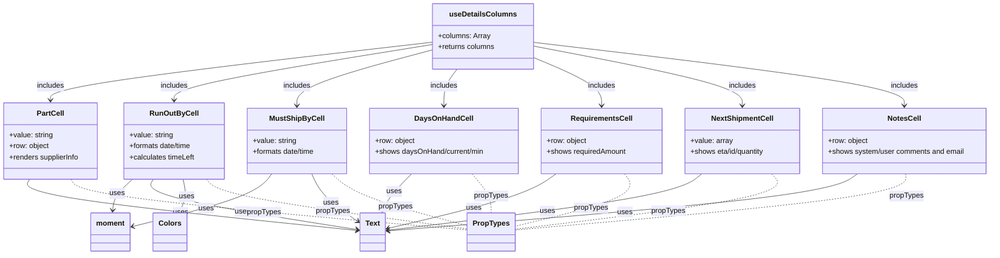

# Diagram: web/portal/src/pages/critical-parts/table/CriticalPartsDetails.columns.js


> Auto-generated by Obscura crawlers

## Diagram 1



### SVG

<svg id="container" width="2188.599609375" xmlns="http://www.w3.org/2000/svg" class="classDiagram" height="560" viewBox="0 0 2188.599609375 560" role="graphics-document document" aria-roledescription="class"><style>#container{font-family:"trebuchet ms",verdana,arial,sans-serif;font-size:16px;fill:#333;}@keyframes edge-animation-frame{from{stroke-dashoffset:0;}}@keyframes dash{to{stroke-dashoffset:0;}}#container .edge-animation-slow{stroke-dasharray:9,5!important;stroke-dashoffset:900;animation:dash 50s linear infinite;stroke-linecap:round;}#container .edge-animation-fast{stroke-dasharray:9,5!important;stroke-dashoffset:900;animation:dash 20s linear infinite;stroke-linecap:round;}#container .error-icon{fill:#552222;}#container .error-text{fill:#552222;stroke:#552222;}#container .edge-thickness-normal{stroke-width:1px;}#container .edge-thickness-thick{stroke-width:3.5px;}#container .edge-pattern-solid{stroke-dasharray:0;}#container .edge-thickness-invisible{stroke-width:0;fill:none;}#container .edge-pattern-dashed{stroke-dasharray:3;}#container .edge-pattern-dotted{stroke-dasharray:2;}#container .marker{fill:#333333;stroke:#333333;}#container .marker.cross{stroke:#333333;}#container svg{font-family:"trebuchet ms",verdana,arial,sans-serif;font-size:16px;}#container p{margin:0;}#container g.classGroup text{fill:#9370DB;stroke:none;font-family:"trebuchet ms",verdana,arial,sans-serif;font-size:10px;}#container g.classGroup text .title{font-weight:bolder;}#container .nodeLabel,#container .edgeLabel{color:#131300;}#container .edgeLabel .label rect{fill:#ECECFF;}#container .label text{fill:#131300;}#container .labelBkg{background:#ECECFF;}#container .edgeLabel .label span{background:#ECECFF;}#container .classTitle{font-weight:bolder;}#container .node rect,#container .node circle,#container .node ellipse,#container .node polygon,#container .node path{fill:#ECECFF;stroke:#9370DB;stroke-width:1px;}#container .divider{stroke:#9370DB;stroke-width:1;}#container g.clickable{cursor:pointer;}#container g.classGroup rect{fill:#ECECFF;stroke:#9370DB;}#container g.classGroup line{stroke:#9370DB;stroke-width:1;}#container .classLabel .box{stroke:none;stroke-width:0;fill:#ECECFF;opacity:0.5;}#container .classLabel .label{fill:#9370DB;font-size:10px;}#container .relation{stroke:#333333;stroke-width:1;fill:none;}#container .dashed-line{stroke-dasharray:3;}#container .dotted-line{stroke-dasharray:1 2;}#container #compositionStart,#container .composition{fill:#333333!important;stroke:#333333!important;stroke-width:1;}#container #compositionEnd,#container .composition{fill:#333333!important;stroke:#333333!important;stroke-width:1;}#container #dependencyStart,#container .dependency{fill:#333333!important;stroke:#333333!important;stroke-width:1;}#container #dependencyStart,#container .dependency{fill:#333333!important;stroke:#333333!important;stroke-width:1;}#container #extensionStart,#container .extension{fill:transparent!important;stroke:#333333!important;stroke-width:1;}#container #extensionEnd,#container .extension{fill:transparent!important;stroke:#333333!important;stroke-width:1;}#container #aggregationStart,#container .aggregation{fill:transparent!important;stroke:#333333!important;stroke-width:1;}#container #aggregationEnd,#container .aggregation{fill:transparent!important;stroke:#333333!important;stroke-width:1;}#container #lollipopStart,#container .lollipop{fill:#ECECFF!important;stroke:#333333!important;stroke-width:1;}#container #lollipopEnd,#container .lollipop{fill:#ECECFF!important;stroke:#333333!important;stroke-width:1;}#container .edgeTerminals{font-size:11px;line-height:initial;}#container .classTitleText{text-anchor:middle;font-size:18px;fill:#333;}#container .label-icon{display:inline-block;height:1em;overflow:visible;vertical-align:-0.125em;}#container .node .label-icon path{fill:currentColor;stroke:revert;stroke-width:revert;}#container :root{--mermaid-font-family:"trebuchet ms",verdana,arial,sans-serif;}</style><g><defs><marker id="container_class-aggregationStart" class="marker aggregation class" refX="18" refY="7" markerWidth="190" markerHeight="240" orient="auto"><path d="M 18,7 L9,13 L1,7 L9,1 Z"></path></marker></defs><defs><marker id="container_class-aggregationEnd" class="marker aggregation class" refX="1" refY="7" markerWidth="20" markerHeight="28" orient="auto"><path d="M 18,7 L9,13 L1,7 L9,1 Z"></path></marker></defs><defs><marker id="container_class-extensionStart" class="marker extension class" refX="18" refY="7" markerWidth="190" markerHeight="240" orient="auto"><path d="M 1,7 L18,13 V 1 Z"></path></marker></defs><defs><marker id="container_class-extensionEnd" class="marker extension class" refX="1" refY="7" markerWidth="20" markerHeight="28" orient="auto"><path d="M 1,1 V 13 L18,7 Z"></path></marker></defs><defs><marker id="container_class-compositionStart" class="marker composition class" refX="18" refY="7" markerWidth="190" markerHeight="240" orient="auto"><path d="M 18,7 L9,13 L1,7 L9,1 Z"></path></marker></defs><defs><marker id="container_class-compositionEnd" class="marker composition class" refX="1" refY="7" markerWidth="20" markerHeight="28" orient="auto"><path d="M 18,7 L9,13 L1,7 L9,1 Z"></path></marker></defs><defs><marker id="container_class-dependencyStart" class="marker dependency class" refX="6" refY="7" markerWidth="190" markerHeight="240" orient="auto"><path d="M 5,7 L9,13 L1,7 L9,1 Z"></path></marker></defs><defs><marker id="container_class-dependencyEnd" class="marker dependency class" refX="13" refY="7" markerWidth="20" markerHeight="28" orient="auto"><path d="M 18,7 L9,13 L14,7 L9,1 Z"></path></marker></defs><defs><marker id="container_class-lollipopStart" class="marker lollipop class" refX="13" refY="7" markerWidth="190" markerHeight="240" orient="auto"><circle stroke="black" fill="transparent" cx="7" cy="7" r="6"></circle></marker></defs><defs><marker id="container_class-lollipopEnd" class="marker lollipop class" refX="1" refY="7" markerWidth="190" markerHeight="240" orient="auto"><circle stroke="black" fill="transparent" cx="7" cy="7" r="6"></circle></marker></defs><g class="root"><g class="clusters"></g><g class="edgePaths"><path d="M951.611,92.614L811.754,108.678C671.896,124.743,392.18,156.871,252.323,178.102C112.465,199.333,112.465,209.667,112.465,214.833L112.465,220" id="id_useDetailsColumns_PartCell_1" class="edge-thickness-normal edge-pattern-solid relation" style=";;;" data-edge="true" data-et="edge" data-id="id_useDetailsColumns_PartCell_1" data-points="W3sieCI6OTUxLjYxMTMyODEyNSwieSI6OTIuNjE0MTU0Nzg1OTQxMTJ9LHsieCI6MTEyLjQ2NDg0Mzc1LCJ5IjoxODl9LHsieCI6MTEyLjQ2NDg0Mzc1LCJ5IjoyMjZ9XQ==" marker-end="url(#container_class-dependencyEnd)"></path><path d="M951.611,97.625L856.716,112.854C761.821,128.083,572.031,158.542,477.135,178.937C382.24,199.333,382.24,209.667,382.24,214.833L382.24,220" id="id_useDetailsColumns_RunOutByCell_2" class="edge-thickness-normal edge-pattern-solid relation" style=";;;" data-edge="true" data-et="edge" data-id="id_useDetailsColumns_RunOutByCell_2" data-points="W3sieCI6OTUxLjYxMTMyODEyNSwieSI6OTcuNjI0NTA3NTQyODYxNzV9LHsieCI6MzgyLjI0MDIzNDM3NSwieSI6MTg5fSx7IngiOjM4Mi4yNDAyMzQzNzUsInkiOjIyNn1d" marker-end="url(#container_class-dependencyEnd)"></path><path d="M951.611,109.292L901.806,122.577C852.001,135.862,752.39,162.431,702.585,182.882C652.779,203.333,652.779,217.667,652.779,224.833L652.779,232" id="id_useDetailsColumns_MustShipByCell_3" class="edge-thickness-normal edge-pattern-solid relation" style=";;;" data-edge="true" data-et="edge" data-id="id_useDetailsColumns_MustShipByCell_3" data-points="W3sieCI6OTUxLjYxMTMyODEyNSwieSI6MTA5LjI5MjQxNTA0NTY0MzU1fSx7IngiOjY1Mi43NzkyOTY4NzUsInkiOjE4OX0seyJ4Ijo2NTIuNzc5Mjk2ODc1LCJ5IjoyMzh9XQ==" marker-end="url(#container_class-dependencyEnd)"></path><path d="M1006.678,152L1001.989,158.167C997.299,164.333,987.92,176.667,983.231,190C978.541,203.333,978.541,217.667,978.541,224.833L978.541,232" id="id_useDetailsColumns_DaysOnHandCell_4" class="edge-thickness-normal edge-pattern-solid relation" style=";;;" data-edge="true" data-et="edge" data-id="id_useDetailsColumns_DaysOnHandCell_4" data-points="W3sieCI6MTAwNi42NzgyMDAyNTgwMjc2LCJ5IjoxNTJ9LHsieCI6OTc4LjU0MTAxNTYyNSwieSI6MTg5fSx7IngiOjk3OC41NDEwMTU2MjUsInkiOjIzOH1d" marker-end="url(#container_class-dependencyEnd)"></path><path d="M1171.252,125.344L1196.947,135.953C1222.643,146.563,1274.033,167.781,1299.729,185.557C1325.424,203.333,1325.424,217.667,1325.424,224.833L1325.424,232" id="id_useDetailsColumns_RequirementsCell_5" class="edge-thickness-normal edge-pattern-solid relation" style=";;;" data-edge="true" data-et="edge" data-id="id_useDetailsColumns_RequirementsCell_5" data-points="W3sieCI6MTE3MS4yNTE5NTMxMjUsInkiOjEyNS4zNDM4MTkzNjAxODQ2N30seyJ4IjoxMzI1LjQyMzgyODEyNSwieSI6MTg5fSx7IngiOjEzMjUuNDIzODI4MTI1LCJ5IjoyMzh9XQ==" marker-end="url(#container_class-dependencyEnd)"></path><path d="M1171.252,100.762L1249.043,115.468C1326.834,130.174,1482.416,159.587,1560.207,181.46C1637.998,203.333,1637.998,217.667,1637.998,224.833L1637.998,232" id="id_useDetailsColumns_NextShipmentCell_6" class="edge-thickness-normal edge-pattern-solid relation" style=";;;" data-edge="true" data-et="edge" data-id="id_useDetailsColumns_NextShipmentCell_6" data-points="W3sieCI6MTE3MS4yNTE5NTMxMjUsInkiOjEwMC43NjE1NTMxMDYwMDg3Nn0seyJ4IjoxNjM3Ljk5ODA0Njg3NSwieSI6MTg5fSx7IngiOjE2MzcuOTk4MDQ2ODc1LCJ5IjoyMzh9XQ==" marker-end="url(#container_class-dependencyEnd)"></path><path d="M1171.252,92.761L1309.289,108.801C1447.326,124.841,1723.4,156.92,1861.438,180.127C1999.475,203.333,1999.475,217.667,1999.475,224.833L1999.475,232" id="id_useDetailsColumns_NotesCell_7" class="edge-thickness-normal edge-pattern-solid relation" style=";;;" data-edge="true" data-et="edge" data-id="id_useDetailsColumns_NotesCell_7" data-points="W3sieCI6MTE3MS4yNTE5NTMxMjUsInkiOjkyLjc2MTA1MDg5MTM1ODc1fSx7IngiOjE5OTkuNDc0NjA5Mzc1LCJ5IjoxODl9LHsieCI6MTk5OS40NzQ2MDkzNzUsInkiOjIzOH1d" marker-end="url(#container_class-dependencyEnd)"></path><path d="M65.089,394L61.611,400.167C58.133,406.333,51.177,418.667,171.139,437.433C291.101,456.199,537.982,481.397,661.423,493.997L784.863,506.596" id="id_PartCell_Text_8" class="edge-thickness-normal edge-pattern-solid relation" style=";;;" data-edge="true" data-et="edge" data-id="id_PartCell_Text_8" data-points="W3sieCI6NjUuMDg4NzQ2MTI2MDMzMDYsInkiOjM5NH0seyJ4Ijo0NC4yMjA3MDMxMjUsInkiOjQzMX0seyJ4Ijo3OTAuODMyMDMxMjUsInkiOjUwNy4yMDUwOTIyOTQ2ODY5fV0=" marker-end="url(#container_class-dependencyEnd)"></path><path d="M290.638,394L283.913,400.167C277.188,406.333,263.739,418.667,256.63,430.003C249.52,441.339,248.752,451.678,248.368,456.847L247.983,462.017" id="id_RunOutByCell_moment_9" class="edge-thickness-normal edge-pattern-solid relation" style=";;;" data-edge="true" data-et="edge" data-id="id_RunOutByCell_moment_9" data-points="W3sieCI6MjkwLjYzNzc2Nzk0OTM4MDIsInkiOjM5NH0seyJ4IjoyNTAuMjg5MDYyNSwieSI6NDMxfSx7IngiOjI0Ny41MzgzOTQ5NzYyNjU4MywieSI6NDY4fV0=" marker-end="url(#container_class-dependencyEnd)"></path><path d="M334.864,394L331.386,400.167C327.908,406.333,320.952,418.667,395.959,437.13C470.966,455.594,627.935,480.187,706.42,492.484L784.904,504.781" id="id_RunOutByCell_Text_10" class="edge-thickness-normal edge-pattern-solid relation" style=";;;" data-edge="true" data-et="edge" data-id="id_RunOutByCell_Text_10" data-points="W3sieCI6MzM0Ljg2NDEzNjc1MTAzMzEsInkiOjM5NH0seyJ4IjozMTMuOTk2MDkzNzUsInkiOjQzMX0seyJ4Ijo3OTAuODMyMDMxMjUsInkiOjUwNS43MDk3MTQ5MDU0ODV9XQ==" marker-end="url(#container_class-dependencyEnd)"></path><path d="M400.74,394L402.098,400.167C403.456,406.333,406.172,418.667,405.062,430.095C403.953,441.523,399.016,452.045,396.548,457.307L394.08,462.568" id="id_RunOutByCell_Colors_11" class="edge-thickness-normal edge-pattern-solid relation" style=";;;" data-edge="true" data-et="edge" data-id="id_RunOutByCell_Colors_11" data-points="W3sieCI6NDAwLjczOTk3NjExMDUzNzIsInkiOjM5NH0seyJ4Ijo0MDguODg4NjcxODc1LCJ5Ijo0MzF9LHsieCI6MzkxLjUzMjExNTMwODU0NDMsInkiOjQ2OH1d" marker-end="url(#container_class-dependencyEnd)"></path><path d="M595.86,382L589.404,390.167C582.948,398.333,570.035,414.667,519.483,433.973C468.931,453.28,380.738,475.561,336.642,486.701L292.546,497.841" id="id_MustShipByCell_moment_12" class="edge-thickness-normal edge-pattern-solid relation" style=";;;" data-edge="true" data-et="edge" data-id="id_MustShipByCell_moment_12" data-points="W3sieCI6NTk1Ljg1OTg3NTM4NzM5NjYsInkiOjM4Mn0seyJ4Ijo1NTcuMTIzMDQ2ODc1LCJ5Ijo0MzF9LHsieCI6Mjg2LjcyODUxNTYyNSwieSI6NDk5LjMxMDQ4MTgwNTgwMzY1fV0=" marker-end="url(#container_class-dependencyEnd)"></path><path d="M685.066,382L688.728,390.167C692.39,398.333,699.715,414.667,716.527,432.178C733.34,449.689,759.64,468.378,772.791,477.722L785.941,487.067" id="id_MustShipByCell_Text_13" class="edge-thickness-normal edge-pattern-solid relation" style=";;;" data-edge="true" data-et="edge" data-id="id_MustShipByCell_Text_13" data-points="W3sieCI6Njg1LjA2NjA5OTU2MDk1MDQsInkiOjM4Mn0seyJ4Ijo3MDcuMDM5MDYyNSwieSI6NDMxfSx7IngiOjc5MC44MzIwMzEyNSwieSI6NDkwLjU0MjE0NTM5MTkzOTg3fV0=" marker-end="url(#container_class-dependencyEnd)"></path><path d="M905.192,382L896.872,390.167C888.552,398.333,871.913,414.667,861.125,428.095C850.337,441.523,845.401,452.045,842.933,457.307L840.465,462.568" id="id_DaysOnHandCell_Text_14" class="edge-thickness-normal edge-pattern-solid relation" style=";;;" data-edge="true" data-et="edge" data-id="id_DaysOnHandCell_Text_14" data-points="W3sieCI6OTA1LjE5MTcxMjkzOTA0OTYsInkiOjM4Mn0seyJ4Ijo4NTUuMjczNDM3NSwieSI6NDMxfSx7IngiOjgzNy45MTY4ODA5MzM1NDQzLCJ5Ijo0Njh9XQ==" marker-end="url(#container_class-dependencyEnd)"></path><path d="M1223.739,382L1212.205,390.167C1200.672,398.333,1177.604,414.667,1115.554,434.699C1053.504,454.732,952.471,478.464,901.955,490.33L851.439,502.196" id="id_RequirementsCell_Text_15" class="edge-thickness-normal edge-pattern-solid relation" style=";;;" data-edge="true" data-et="edge" data-id="id_RequirementsCell_Text_15" data-points="W3sieCI6MTIyMy43MzkxNjkwMzQwOTEsInkiOjM4Mn0seyJ4IjoxMTU0LjUzNzEwOTM3NSwieSI6NDMxfSx7IngiOjg0NS41OTc2NTYyNSwieSI6NTAzLjU2Nzk0ODMzODI0MDV9XQ==" marker-end="url(#container_class-dependencyEnd)"></path><path d="M1546.521,382L1536.145,390.167C1525.769,398.333,1505.017,414.667,1389.19,435.341C1273.362,456.015,1062.459,481.03,957.008,493.538L851.556,506.045" id="id_NextShipmentCell_Text_16" class="edge-thickness-normal edge-pattern-solid relation" style=";;;" data-edge="true" data-et="edge" data-id="id_NextShipmentCell_Text_16" data-points="W3sieCI6MTU0Ni41MjA5MDMyNzk5NTg3LCJ5IjozODJ9LHsieCI6MTQ4NC4yNjU2MjUsInkiOjQzMX0seyJ4Ijo4NDUuNTk3NjU2MjUsInkiOjUwNi43NTIxMzYyNTA4NzI0fV0=" marker-end="url(#container_class-dependencyEnd)"></path><path d="M1893.448,382L1881.422,390.167C1869.396,398.333,1845.343,414.667,1671.699,435.562C1498.054,456.457,1174.816,481.915,1013.198,494.644L851.579,507.372" id="id_NotesCell_Text_17" class="edge-thickness-normal edge-pattern-solid relation" style=";;;" data-edge="true" data-et="edge" data-id="id_NotesCell_Text_17" data-points="W3sieCI6MTg5My40NDgwMDgxMzUzMzA2LCJ5IjozODJ9LHsieCI6MTgyMS4yOTEwMTU2MjUsInkiOjQzMX0seyJ4Ijo4NDUuNTk3NjU2MjUsInkiOjUwNy44NDMzOTE5MDk2NTI5NX1d" marker-end="url(#container_class-dependencyEnd)"></path><path d="M156.691,394L159.938,400.167C163.185,406.333,169.678,418.667,315.257,437.268C460.835,455.87,745.499,480.739,887.83,493.174L1030.162,505.609" id="id_PartCell_PropTypes_18" class="edge-thickness-normal edge-pattern-dashed relation" style=";;;" data-edge="true" data-et="edge" data-id="id_PartCell_PropTypes_18" data-points="W3sieCI6MTU2LjY5MTIxMjU1MTY1Mjg4LCJ5IjozOTR9LHsieCI6MTc2LjE3MTg3NSwieSI6NDMxfSx7IngiOjEwMzAuMTYyMTA5Mzc1LCJ5Ijo1MDUuNjA5MjA1NjgwNjUyM31d"></path><path d="M452.193,394L457.329,400.167C462.464,406.333,472.735,418.667,569.063,436.892C665.391,455.118,847.777,479.236,938.969,491.295L1030.162,503.354" id="id_RunOutByCell_PropTypes_19" class="edge-thickness-normal edge-pattern-dashed relation" style=";;;" data-edge="true" data-et="edge" data-id="id_RunOutByCell_PropTypes_19" data-points="W3sieCI6NDUyLjE5MzIzMDI0Mjc2ODYsInkiOjM5NH0seyJ4Ijo0ODMuMDA1ODU5Mzc1LCJ5Ijo0MzF9LHsieCI6MTAzMC4xNjIxMDkzNzUsInkiOjUwMy4zNTQwNzgxMjMxNjF9XQ=="></path><path d="M729.169,382L737.833,390.167C746.498,398.333,763.827,414.667,813.993,433.789C864.158,452.911,947.16,474.822,988.661,485.777L1030.162,496.733" id="id_MustShipByCell_PropTypes_20" class="edge-thickness-normal edge-pattern-dashed relation" style=";;;" data-edge="true" data-et="edge" data-id="id_MustShipByCell_PropTypes_20" data-points="W3sieCI6NzI5LjE2ODg4ODgxNzE0ODcsInkiOjM4Mn0seyJ4Ijo3ODEuMTU2MjUsInkiOjQzMX0seyJ4IjoxMDMwLjE2MjEwOTM3NSwieSI6NDk2LjczMjg3OTUyODUzMDN9XQ=="></path><path d="M1039.163,382L1046.039,390.167C1052.915,398.333,1066.668,414.667,1073.544,429C1080.42,443.333,1080.42,455.667,1080.42,461.833L1080.42,468" id="id_DaysOnHandCell_PropTypes_21" class="edge-thickness-normal edge-pattern-dashed relation" style=";;;" data-edge="true" data-et="edge" data-id="id_DaysOnHandCell_PropTypes_21" data-points="W3sieCI6MTAzOS4xNjMxNzQ3MTU5MDksInkiOjM4Mn0seyJ4IjoxMDgwLjQxOTkyMTg3NSwieSI6NDMxfSx7IngiOjEwODAuNDE5OTIxODc1LCJ5Ijo0Njh9XQ=="></path><path d="M1375.838,382L1381.557,390.167C1387.275,398.333,1398.712,414.667,1357.852,433.993C1316.992,453.32,1223.835,475.639,1177.256,486.799L1130.678,497.959" id="id_RequirementsCell_PropTypes_22" class="edge-thickness-normal edge-pattern-dashed relation" style=";;;" data-edge="true" data-et="edge" data-id="id_RequirementsCell_PropTypes_22" data-points="W3sieCI6MTM3NS44Mzg0NzE3MjAwNDEzLCJ5IjozODJ9LHsieCI6MTQxMC4xNDg0Mzc1LCJ5Ijo0MzF9LHsieCI6MTEzMC42Nzc3MzQzNzUsInkiOjQ5Ny45NTg2NzgxMjY1MzYzN31d"></path><path d="M1702.962,382L1710.331,390.167C1717.699,398.333,1732.437,414.667,1637.056,435.008C1541.675,455.348,1336.176,479.697,1233.427,491.871L1130.678,504.045" id="id_NextShipmentCell_PropTypes_23" class="edge-thickness-normal edge-pattern-dashed relation" style=";;;" data-edge="true" data-et="edge" data-id="id_NextShipmentCell_PropTypes_23" data-points="W3sieCI6MTcwMi45NjIxNDgxMTQ2Njk0LCJ5IjozODJ9LHsieCI6MTc0Ny4xNzM4MjgxMjUsInkiOjQzMX0seyJ4IjoxMTMwLjY3NzczNDM3NSwieSI6NTA0LjA0NTIyODQ1NjQzMjV9XQ=="></path><path d="M2000.995,382L2001.167,390.167C2001.34,398.333,2001.684,414.667,1856.632,435.282C1711.579,455.897,1421.128,480.795,1275.903,493.243L1130.678,505.692" id="id_NotesCell_PropTypes_24" class="edge-thickness-normal edge-pattern-dashed relation" style=";;;" data-edge="true" data-et="edge" data-id="id_NotesCell_PropTypes_24" data-points="W3sieCI6MjAwMC45OTQ3NTQwMDMwOTkyLCJ5IjozODJ9LHsieCI6MjAwMi4wMjkyOTY4NzUsInkiOjQzMX0seyJ4IjoxMTMwLjY3NzczNDM3NSwieSI6NTA1LjY5MTkxOTcwNTY3Nzl9XQ=="></path></g><g class="edgeLabels"><g class="edgeLabel" transform="translate(112.46484375, 189)"><g class="label" data-id="id_useDetailsColumns_PartCell_1" transform="translate(-30.6484375, -12)"><foreignObject width="61.296875" height="24"><div xmlns="http://www.w3.org/1999/xhtml" class="labelBkg" style="display: table-cell; white-space: nowrap; line-height: 1.5; max-width: 200px; text-align: center;"><span class="edgeLabel"><p>includes</p></span></div></foreignObject></g></g><g class="edgeLabel" transform="translate(382.240234375, 189)"><g class="label" data-id="id_useDetailsColumns_RunOutByCell_2" transform="translate(-30.6484375, -12)"><foreignObject width="61.296875" height="24"><div xmlns="http://www.w3.org/1999/xhtml" class="labelBkg" style="display: table-cell; white-space: nowrap; line-height: 1.5; max-width: 200px; text-align: center;"><span class="edgeLabel"><p>includes</p></span></div></foreignObject></g></g><g class="edgeLabel" transform="translate(652.779296875, 189)"><g class="label" data-id="id_useDetailsColumns_MustShipByCell_3" transform="translate(-30.6484375, -12)"><foreignObject width="61.296875" height="24"><div xmlns="http://www.w3.org/1999/xhtml" class="labelBkg" style="display: table-cell; white-space: nowrap; line-height: 1.5; max-width: 200px; text-align: center;"><span class="edgeLabel"><p>includes</p></span></div></foreignObject></g></g><g class="edgeLabel" transform="translate(978.541015625, 189)"><g class="label" data-id="id_useDetailsColumns_DaysOnHandCell_4" transform="translate(-30.6484375, -12)"><foreignObject width="61.296875" height="24"><div xmlns="http://www.w3.org/1999/xhtml" class="labelBkg" style="display: table-cell; white-space: nowrap; line-height: 1.5; max-width: 200px; text-align: center;"><span class="edgeLabel"><p>includes</p></span></div></foreignObject></g></g><g class="edgeLabel" transform="translate(1325.423828125, 189)"><g class="label" data-id="id_useDetailsColumns_RequirementsCell_5" transform="translate(-30.6484375, -12)"><foreignObject width="61.296875" height="24"><div xmlns="http://www.w3.org/1999/xhtml" class="labelBkg" style="display: table-cell; white-space: nowrap; line-height: 1.5; max-width: 200px; text-align: center;"><span class="edgeLabel"><p>includes</p></span></div></foreignObject></g></g><g class="edgeLabel" transform="translate(1637.998046875, 189)"><g class="label" data-id="id_useDetailsColumns_NextShipmentCell_6" transform="translate(-30.6484375, -12)"><foreignObject width="61.296875" height="24"><div xmlns="http://www.w3.org/1999/xhtml" class="labelBkg" style="display: table-cell; white-space: nowrap; line-height: 1.5; max-width: 200px; text-align: center;"><span class="edgeLabel"><p>includes</p></span></div></foreignObject></g></g><g class="edgeLabel" transform="translate(1999.474609375, 189)"><g class="label" data-id="id_useDetailsColumns_NotesCell_7" transform="translate(-30.6484375, -12)"><foreignObject width="61.296875" height="24"><div xmlns="http://www.w3.org/1999/xhtml" class="labelBkg" style="display: table-cell; white-space: nowrap; line-height: 1.5; max-width: 200px; text-align: center;"><span class="edgeLabel"><p>includes</p></span></div></foreignObject></g></g><g class="edgeLabel" transform="translate(396.39659, 466.94587)"><g class="label" data-id="id_PartCell_Text_8" transform="translate(-16.4921875, -12)"><foreignObject width="32.984375" height="24"><div xmlns="http://www.w3.org/1999/xhtml" class="labelBkg" style="display: table-cell; white-space: nowrap; line-height: 1.5; max-width: 200px; text-align: center;"><span class="edgeLabel"><p>uses</p></span></div></foreignObject></g></g><g class="edgeLabel" transform="translate(250.2890625, 431)"><g class="label" data-id="id_RunOutByCell_moment_9" transform="translate(-16.4921875, -12)"><foreignObject width="32.984375" height="24"><div xmlns="http://www.w3.org/1999/xhtml" class="labelBkg" style="display: table-cell; white-space: nowrap; line-height: 1.5; max-width: 200px; text-align: center;"><span class="edgeLabel"><p>uses</p></span></div></foreignObject></g></g><g class="edgeLabel" transform="translate(531.4305, 465.06719)"><g class="label" data-id="id_RunOutByCell_Text_10" transform="translate(-16.4921875, -12)"><foreignObject width="32.984375" height="24"><div xmlns="http://www.w3.org/1999/xhtml" class="labelBkg" style="display: table-cell; white-space: nowrap; line-height: 1.5; max-width: 200px; text-align: center;"><span class="edgeLabel"><p>uses</p></span></div></foreignObject></g></g><g class="edgeLabel" transform="translate(408.25546, 432.34986)"><g class="label" data-id="id_RunOutByCell_Colors_11" transform="translate(-16.4921875, -12)"><foreignObject width="32.984375" height="24"><div xmlns="http://www.w3.org/1999/xhtml" class="labelBkg" style="display: table-cell; white-space: nowrap; line-height: 1.5; max-width: 200px; text-align: center;"><span class="edgeLabel"><p>uses</p></span></div></foreignObject></g></g><g class="edgeLabel" transform="translate(452.20561, 457.50557)"><g class="label" data-id="id_MustShipByCell_moment_12" transform="translate(-16.4921875, -12)"><foreignObject width="32.984375" height="24"><div xmlns="http://www.w3.org/1999/xhtml" class="labelBkg" style="display: table-cell; white-space: nowrap; line-height: 1.5; max-width: 200px; text-align: center;"><span class="edgeLabel"><p>uses</p></span></div></foreignObject></g></g><g class="edgeLabel" transform="translate(727.04811, 445.21816)"><g class="label" data-id="id_MustShipByCell_Text_13" transform="translate(-16.4921875, -12)"><foreignObject width="32.984375" height="24"><div xmlns="http://www.w3.org/1999/xhtml" class="labelBkg" style="display: table-cell; white-space: nowrap; line-height: 1.5; max-width: 200px; text-align: center;"><span class="edgeLabel"><p>uses</p></span></div></foreignObject></g></g><g class="edgeLabel" transform="translate(865.6498, 420.81451)"><g class="label" data-id="id_DaysOnHandCell_Text_14" transform="translate(-16.4921875, -12)"><foreignObject width="32.984375" height="24"><div xmlns="http://www.w3.org/1999/xhtml" class="labelBkg" style="display: table-cell; white-space: nowrap; line-height: 1.5; max-width: 200px; text-align: center;"><span class="edgeLabel"><p>uses</p></span></div></foreignObject></g></g><g class="edgeLabel" transform="translate(1041.34075, 457.58912)"><g class="label" data-id="id_RequirementsCell_Text_15" transform="translate(-16.4921875, -12)"><foreignObject width="32.984375" height="24"><div xmlns="http://www.w3.org/1999/xhtml" class="labelBkg" style="display: table-cell; white-space: nowrap; line-height: 1.5; max-width: 200px; text-align: center;"><span class="edgeLabel"><p>uses</p></span></div></foreignObject></g></g><g class="edgeLabel" transform="translate(1204.26878, 464.21031)"><g class="label" data-id="id_NextShipmentCell_Text_16" transform="translate(-16.4921875, -12)"><foreignObject width="32.984375" height="24"><div xmlns="http://www.w3.org/1999/xhtml" class="labelBkg" style="display: table-cell; white-space: nowrap; line-height: 1.5; max-width: 200px; text-align: center;"><span class="edgeLabel"><p>uses</p></span></div></foreignObject></g></g><g class="edgeLabel" transform="translate(1376.92058, 465.99761)"><g class="label" data-id="id_NotesCell_Text_17" transform="translate(-16.4921875, -12)"><foreignObject width="32.984375" height="24"><div xmlns="http://www.w3.org/1999/xhtml" class="labelBkg" style="display: table-cell; white-space: nowrap; line-height: 1.5; max-width: 200px; text-align: center;"><span class="edgeLabel"><p>uses</p></span></div></foreignObject></g></g><g class="edgeLabel" transform="translate(582.33882, 466.48494)"><g class="label" data-id="id_PartCell_PropTypes_18" transform="translate(-37.625, -12)"><foreignObject width="75.25" height="24"><div xmlns="http://www.w3.org/1999/xhtml" class="labelBkg" style="display: table-cell; white-space: nowrap; line-height: 1.5; max-width: 200px; text-align: center;"><span class="edgeLabel"><p>propTypes</p></span></div></foreignObject></g></g><g class="edgeLabel" transform="translate(732.71678, 464.02092)"><g class="label" data-id="id_RunOutByCell_PropTypes_19" transform="translate(-37.625, -12)"><foreignObject width="75.25" height="24"><div xmlns="http://www.w3.org/1999/xhtml" class="labelBkg" style="display: table-cell; white-space: nowrap; line-height: 1.5; max-width: 200px; text-align: center;"><span class="edgeLabel"><p>propTypes</p></span></div></foreignObject></g></g><g class="edgeLabel" transform="translate(871.12225, 454.74934)"><g class="label" data-id="id_MustShipByCell_PropTypes_20" transform="translate(-37.625, -12)"><foreignObject width="75.25" height="24"><div xmlns="http://www.w3.org/1999/xhtml" class="labelBkg" style="display: table-cell; white-space: nowrap; line-height: 1.5; max-width: 200px; text-align: center;"><span class="edgeLabel"><p>propTypes</p></span></div></foreignObject></g></g><g class="edgeLabel" transform="translate(1080.419921875, 431)"><g class="label" data-id="id_DaysOnHandCell_PropTypes_21" transform="translate(-37.625, -12)"><foreignObject width="75.25" height="24"><div xmlns="http://www.w3.org/1999/xhtml" class="labelBkg" style="display: table-cell; white-space: nowrap; line-height: 1.5; max-width: 200px; text-align: center;"><span class="edgeLabel"><p>propTypes</p></span></div></foreignObject></g></g><g class="edgeLabel" transform="translate(1299.49884, 457.51065)"><g class="label" data-id="id_RequirementsCell_PropTypes_22" transform="translate(-37.625, -12)"><foreignObject width="75.25" height="24"><div xmlns="http://www.w3.org/1999/xhtml" class="labelBkg" style="display: table-cell; white-space: nowrap; line-height: 1.5; max-width: 200px; text-align: center;"><span class="edgeLabel"><p>propTypes</p></span></div></foreignObject></g></g><g class="edgeLabel" transform="translate(1471.69532, 463.63993)"><g class="label" data-id="id_NextShipmentCell_PropTypes_23" transform="translate(-37.625, -12)"><foreignObject width="75.25" height="24"><div xmlns="http://www.w3.org/1999/xhtml" class="labelBkg" style="display: table-cell; white-space: nowrap; line-height: 1.5; max-width: 200px; text-align: center;"><span class="edgeLabel"><p>propTypes</p></span></div></foreignObject></g></g><g class="edgeLabel" transform="translate(2002.029296875, 431)"><g class="label" data-id="id_NotesCell_PropTypes_24" transform="translate(-37.625, -12)"><foreignObject width="75.25" height="24"><div xmlns="http://www.w3.org/1999/xhtml" class="labelBkg" style="display: table-cell; white-space: nowrap; line-height: 1.5; max-width: 200px; text-align: center;"><span class="edgeLabel"><p>propTypes</p></span></div></foreignObject></g></g></g><g class="nodes"><g class="node default" id="classId-useDetailsColumns-0" transform="translate(1061.431640625, 80)"><g class="basic label-container"><path d="M-109.8203125 -72 L109.8203125 -72 L109.8203125 72 L-109.8203125 72" stroke="none" stroke-width="0" fill="#ECECFF" style=""></path><path d="M-109.8203125 -72 C-53.69842025205482 -72, 2.4234719958903668 -72, 109.8203125 -72 M-109.8203125 -72 C-25.158956279152278 -72, 59.502399941695444 -72, 109.8203125 -72 M109.8203125 -72 C109.8203125 -30.691817106816302, 109.8203125 10.616365786367396, 109.8203125 72 M109.8203125 -72 C109.8203125 -14.756894447921752, 109.8203125 42.486211104156496, 109.8203125 72 M109.8203125 72 C61.668649320196415 72, 13.51698614039283 72, -109.8203125 72 M109.8203125 72 C27.318736607187958 72, -55.182839285624084 72, -109.8203125 72 M-109.8203125 72 C-109.8203125 38.02857489012368, -109.8203125 4.057149780247357, -109.8203125 -72 M-109.8203125 72 C-109.8203125 34.61853586734518, -109.8203125 -2.7629282653096396, -109.8203125 -72" stroke="#9370DB" stroke-width="1.3" fill="none" stroke-dasharray="0 0" style=""></path></g><g class="annotation-group text" transform="translate(0, -48)"></g><g class="label-group text" transform="translate(-69.65625, -48)"><g class="label" style="font-weight: bolder" transform="translate(0,-12)"><foreignObject width="139.3125" height="24"><div xmlns="http://www.w3.org/1999/xhtml" style="display: table-cell; white-space: nowrap; line-height: 1.5; max-width: 188px; text-align: center;"><span class="nodeLabel markdown-node-label" style=""><p>useDetailsColumns</p></span></div></foreignObject></g></g><g class="members-group text" transform="translate(-97.8203125, 0)"><g class="label" style="" transform="translate(0,-12)"><foreignObject width="114.59375" height="24"><div xmlns="http://www.w3.org/1999/xhtml" style="display: table-cell; white-space: nowrap; line-height: 1.5; max-width: 172px; text-align: center;"><span class="nodeLabel markdown-node-label" style=""><p>+columns: Array</p></span></div></foreignObject></g><g class="label" style="" transform="translate(0,12)"><foreignObject width="125.984375" height="24"><div xmlns="http://www.w3.org/1999/xhtml" style="display: table-cell; white-space: nowrap; line-height: 1.5; max-width: 183px; text-align: center;"><span class="nodeLabel markdown-node-label" style=""><p>+returns columns</p></span></div></foreignObject></g></g><g class="methods-group text" transform="translate(-97.8203125, 72)"></g><g class="divider" style=""><path d="M-109.8203125 -24 C-22.50766075609573 -24, 64.80499098780854 -24, 109.8203125 -24 M-109.8203125 -24 C-26.43365013762333 -24, 56.95301222475334 -24, 109.8203125 -24" stroke="#9370DB" stroke-width="1.3" fill="none" stroke-dasharray="0 0" style=""></path></g><g class="divider" style=""><path d="M-109.8203125 48 C-27.48638878244408 48, 54.84753493511184 48, 109.8203125 48 M-109.8203125 48 C-28.86464780075339 48, 52.09101689849322 48, 109.8203125 48" stroke="#9370DB" stroke-width="1.3" fill="none" stroke-dasharray="0 0" style=""></path></g></g><g class="node default" id="classId-PartCell-1" transform="translate(112.46484375, 310)"><g class="basic label-container"><path d="M-104.46484375 -84 L104.46484375 -84 L104.46484375 84 L-104.46484375 84" stroke="none" stroke-width="0" fill="#ECECFF" style=""></path><path d="M-104.46484375 -84 C-52.607228295076474 -84, -0.7496128401529489 -84, 104.46484375 -84 M-104.46484375 -84 C-45.024308334945836 -84, 14.416227080108328 -84, 104.46484375 -84 M104.46484375 -84 C104.46484375 -49.72618192381802, 104.46484375 -15.452363847636036, 104.46484375 84 M104.46484375 -84 C104.46484375 -33.51861466288899, 104.46484375 16.962770674222014, 104.46484375 84 M104.46484375 84 C44.762000512077186 84, -14.940842725845627 84, -104.46484375 84 M104.46484375 84 C26.13496302364878 84, -52.19491770270244 84, -104.46484375 84 M-104.46484375 84 C-104.46484375 49.55081568118729, -104.46484375 15.101631362374576, -104.46484375 -84 M-104.46484375 84 C-104.46484375 37.857645955262825, -104.46484375 -8.28470808947435, -104.46484375 -84" stroke="#9370DB" stroke-width="1.3" fill="none" stroke-dasharray="0 0" style=""></path></g><g class="annotation-group text" transform="translate(0, -60)"></g><g class="label-group text" transform="translate(-28.6796875, -60)"><g class="label" style="font-weight: bolder" transform="translate(0,-12)"><foreignObject width="57.359375" height="24"><div xmlns="http://www.w3.org/1999/xhtml" style="display: table-cell; white-space: nowrap; line-height: 1.5; max-width: 106px; text-align: center;"><span class="nodeLabel markdown-node-label" style=""><p>PartCell</p></span></div></foreignObject></g></g><g class="members-group text" transform="translate(-92.46484375, -12)"><g class="label" style="" transform="translate(0,-12)"><foreignObject width="96.421875" height="24"><div xmlns="http://www.w3.org/1999/xhtml" style="display: table-cell; white-space: nowrap; line-height: 1.5; max-width: 154px; text-align: center;"><span class="nodeLabel markdown-node-label" style=""><p>+value: string</p></span></div></foreignObject></g><g class="label" style="" transform="translate(0,12)"><foreignObject width="88.125" height="24"><div xmlns="http://www.w3.org/1999/xhtml" style="display: table-cell; white-space: nowrap; line-height: 1.5; max-width: 146px; text-align: center;"><span class="nodeLabel markdown-node-label" style=""><p>+row: object</p></span></div></foreignObject></g><g class="label" style="" transform="translate(0,36)"><foreignObject width="156.25" height="24"><div xmlns="http://www.w3.org/1999/xhtml" style="display: table-cell; white-space: nowrap; line-height: 1.5; max-width: 214px; text-align: center;"><span class="nodeLabel markdown-node-label" style=""><p>+renders supplierInfo</p></span></div></foreignObject></g></g><g class="methods-group text" transform="translate(-92.46484375, 84)"></g><g class="divider" style=""><path d="M-104.46484375 -36 C-59.777037703709844 -36, -15.089231657419688 -36, 104.46484375 -36 M-104.46484375 -36 C-21.726456855759125 -36, 61.01193003848175 -36, 104.46484375 -36" stroke="#9370DB" stroke-width="1.3" fill="none" stroke-dasharray="0 0" style=""></path></g><g class="divider" style=""><path d="M-104.46484375 60 C-25.58319047235736 60, 53.29846280528528 60, 104.46484375 60 M-104.46484375 60 C-43.11032524914747 60, 18.244193251705056 60, 104.46484375 60" stroke="#9370DB" stroke-width="1.3" fill="none" stroke-dasharray="0 0" style=""></path></g></g><g class="node default" id="classId-RunOutByCell-2" transform="translate(382.240234375, 310)"><g class="basic label-container"><path d="M-109.4375 -84 L109.4375 -84 L109.4375 84 L-109.4375 84" stroke="none" stroke-width="0" fill="#ECECFF" style=""></path><path d="M-109.4375 -84 C-44.505186359920046 -84, 20.427127280159908 -84, 109.4375 -84 M-109.4375 -84 C-51.29790747985921 -84, 6.841685040281575 -84, 109.4375 -84 M109.4375 -84 C109.4375 -35.18553844787859, 109.4375 13.628923104242816, 109.4375 84 M109.4375 -84 C109.4375 -30.71644178266134, 109.4375 22.567116434677317, 109.4375 84 M109.4375 84 C54.38939875834652 84, -0.6587024833069535 84, -109.4375 84 M109.4375 84 C56.22179782874481 84, 3.006095657489624 84, -109.4375 84 M-109.4375 84 C-109.4375 21.25886170237927, -109.4375 -41.48227659524146, -109.4375 -84 M-109.4375 84 C-109.4375 32.94251267073768, -109.4375 -18.114974658524645, -109.4375 -84" stroke="#9370DB" stroke-width="1.3" fill="none" stroke-dasharray="0 0" style=""></path></g><g class="annotation-group text" transform="translate(0, -60)"></g><g class="label-group text" transform="translate(-50.015625, -60)"><g class="label" style="font-weight: bolder" transform="translate(0,-12)"><foreignObject width="100.03125" height="24"><div xmlns="http://www.w3.org/1999/xhtml" style="display: table-cell; white-space: nowrap; line-height: 1.5; max-width: 149px; text-align: center;"><span class="nodeLabel markdown-node-label" style=""><p>RunOutByCell</p></span></div></foreignObject></g></g><g class="members-group text" transform="translate(-97.4375, -12)"><g class="label" style="" transform="translate(0,-12)"><foreignObject width="96.421875" height="24"><div xmlns="http://www.w3.org/1999/xhtml" style="display: table-cell; white-space: nowrap; line-height: 1.5; max-width: 154px; text-align: center;"><span class="nodeLabel markdown-node-label" style=""><p>+value: string</p></span></div></foreignObject></g><g class="label" style="" transform="translate(0,12)"><foreignObject width="141.46875" height="24"><div xmlns="http://www.w3.org/1999/xhtml" style="display: table-cell; white-space: nowrap; line-height: 1.5; max-width: 199px; text-align: center;"><span class="nodeLabel markdown-node-label" style=""><p>+formats date/time</p></span></div></foreignObject></g><g class="label" style="" transform="translate(0,36)"><foreignObject width="144.859375" height="24"><div xmlns="http://www.w3.org/1999/xhtml" style="display: table-cell; white-space: nowrap; line-height: 1.5; max-width: 202px; text-align: center;"><span class="nodeLabel markdown-node-label" style=""><p>+calculates timeLeft</p></span></div></foreignObject></g></g><g class="methods-group text" transform="translate(-97.4375, 84)"></g><g class="divider" style=""><path d="M-109.4375 -36 C-51.6072256575693 -36, 6.223048684861396 -36, 109.4375 -36 M-109.4375 -36 C-34.65112499714694 -36, 40.135250005706126 -36, 109.4375 -36" stroke="#9370DB" stroke-width="1.3" fill="none" stroke-dasharray="0 0" style=""></path></g><g class="divider" style=""><path d="M-109.4375 60 C-60.7866288807089 60, -12.135757761417807 60, 109.4375 60 M-109.4375 60 C-45.60407057030748 60, 18.229358859385044 60, 109.4375 60" stroke="#9370DB" stroke-width="1.3" fill="none" stroke-dasharray="0 0" style=""></path></g></g><g class="node default" id="classId-MustShipByCell-3" transform="translate(652.779296875, 310)"><g class="basic label-container"><path d="M-111.1015625 -72 L111.1015625 -72 L111.1015625 72 L-111.1015625 72" stroke="none" stroke-width="0" fill="#ECECFF" style=""></path><path d="M-111.1015625 -72 C-36.25841123805762 -72, 38.58474002388476 -72, 111.1015625 -72 M-111.1015625 -72 C-65.11241246704034 -72, -19.1232624340807 -72, 111.1015625 -72 M111.1015625 -72 C111.1015625 -15.516447124136853, 111.1015625 40.967105751726294, 111.1015625 72 M111.1015625 -72 C111.1015625 -16.351930235841145, 111.1015625 39.29613952831771, 111.1015625 72 M111.1015625 72 C60.67824812012507 72, 10.254933740250138 72, -111.1015625 72 M111.1015625 72 C53.71865059606329 72, -3.664261307873417 72, -111.1015625 72 M-111.1015625 72 C-111.1015625 42.80762629229348, -111.1015625 13.615252584586962, -111.1015625 -72 M-111.1015625 72 C-111.1015625 16.440611874973406, -111.1015625 -39.11877625005319, -111.1015625 -72" stroke="#9370DB" stroke-width="1.3" fill="none" stroke-dasharray="0 0" style=""></path></g><g class="annotation-group text" transform="translate(0, -48)"></g><g class="label-group text" transform="translate(-56.734375, -48)"><g class="label" style="font-weight: bolder" transform="translate(0,-12)"><foreignObject width="113.46875" height="24"><div xmlns="http://www.w3.org/1999/xhtml" style="display: table-cell; white-space: nowrap; line-height: 1.5; max-width: 162px; text-align: center;"><span class="nodeLabel markdown-node-label" style=""><p>MustShipByCell</p></span></div></foreignObject></g></g><g class="members-group text" transform="translate(-99.1015625, 0)"><g class="label" style="" transform="translate(0,-12)"><foreignObject width="96.421875" height="24"><div xmlns="http://www.w3.org/1999/xhtml" style="display: table-cell; white-space: nowrap; line-height: 1.5; max-width: 154px; text-align: center;"><span class="nodeLabel markdown-node-label" style=""><p>+value: string</p></span></div></foreignObject></g><g class="label" style="" transform="translate(0,12)"><foreignObject width="141.46875" height="24"><div xmlns="http://www.w3.org/1999/xhtml" style="display: table-cell; white-space: nowrap; line-height: 1.5; max-width: 199px; text-align: center;"><span class="nodeLabel markdown-node-label" style=""><p>+formats date/time</p></span></div></foreignObject></g></g><g class="methods-group text" transform="translate(-99.1015625, 72)"></g><g class="divider" style=""><path d="M-111.1015625 -24 C-65.77024503206101 -24, -20.43892756412204 -24, 111.1015625 -24 M-111.1015625 -24 C-24.43860550756804 -24, 62.22435148486392 -24, 111.1015625 -24" stroke="#9370DB" stroke-width="1.3" fill="none" stroke-dasharray="0 0" style=""></path></g><g class="divider" style=""><path d="M-111.1015625 48 C-59.63323676797935 48, -8.164911035958696 48, 111.1015625 48 M-111.1015625 48 C-40.977905430135536 48, 29.14575163972893 48, 111.1015625 48" stroke="#9370DB" stroke-width="1.3" fill="none" stroke-dasharray="0 0" style=""></path></g></g><g class="node default" id="classId-DaysOnHandCell-4" transform="translate(978.541015625, 310)"><g class="basic label-container"><path d="M-164.66015625 -72 L164.66015625 -72 L164.66015625 72 L-164.66015625 72" stroke="none" stroke-width="0" fill="#ECECFF" style=""></path><path d="M-164.66015625 -72 C-38.764422028774746 -72, 87.13131219245051 -72, 164.66015625 -72 M-164.66015625 -72 C-54.370480176685604 -72, 55.91919589662879 -72, 164.66015625 -72 M164.66015625 -72 C164.66015625 -33.15925315529375, 164.66015625 5.681493689412505, 164.66015625 72 M164.66015625 -72 C164.66015625 -31.487531363151845, 164.66015625 9.02493727369631, 164.66015625 72 M164.66015625 72 C62.81544497532626 72, -39.02926629934748 72, -164.66015625 72 M164.66015625 72 C91.57506505191137 72, 18.489973853822733 72, -164.66015625 72 M-164.66015625 72 C-164.66015625 31.16882946867623, -164.66015625 -9.662341062647542, -164.66015625 -72 M-164.66015625 72 C-164.66015625 34.38066200607595, -164.66015625 -3.2386759878480973, -164.66015625 -72" stroke="#9370DB" stroke-width="1.3" fill="none" stroke-dasharray="0 0" style=""></path></g><g class="annotation-group text" transform="translate(0, -48)"></g><g class="label-group text" transform="translate(-60.2109375, -48)"><g class="label" style="font-weight: bolder" transform="translate(0,-12)"><foreignObject width="120.421875" height="24"><div xmlns="http://www.w3.org/1999/xhtml" style="display: table-cell; white-space: nowrap; line-height: 1.5; max-width: 170px; text-align: center;"><span class="nodeLabel markdown-node-label" style=""><p>DaysOnHandCell</p></span></div></foreignObject></g></g><g class="members-group text" transform="translate(-152.66015625, 0)"><g class="label" style="" transform="translate(0,-12)"><foreignObject width="88.125" height="24"><div xmlns="http://www.w3.org/1999/xhtml" style="display: table-cell; white-space: nowrap; line-height: 1.5; max-width: 146px; text-align: center;"><span class="nodeLabel markdown-node-label" style=""><p>+row: object</p></span></div></foreignObject></g><g class="label" style="" transform="translate(0,12)"><foreignObject width="245.109375" height="24"><div xmlns="http://www.w3.org/1999/xhtml" style="display: table-cell; white-space: nowrap; line-height: 1.5; max-width: 302px; text-align: center;"><span class="nodeLabel markdown-node-label" style=""><p>+shows daysOnHand/current/min</p></span></div></foreignObject></g></g><g class="methods-group text" transform="translate(-152.66015625, 72)"></g><g class="divider" style=""><path d="M-164.66015625 -24 C-91.63884309189048 -24, -18.617529933780958 -24, 164.66015625 -24 M-164.66015625 -24 C-88.8431581191509 -24, -13.0261599883018 -24, 164.66015625 -24" stroke="#9370DB" stroke-width="1.3" fill="none" stroke-dasharray="0 0" style=""></path></g><g class="divider" style=""><path d="M-164.66015625 48 C-38.43815958819616 48, 87.78383707360769 48, 164.66015625 48 M-164.66015625 48 C-44.70777236780151 48, 75.24461151439698 48, 164.66015625 48" stroke="#9370DB" stroke-width="1.3" fill="none" stroke-dasharray="0 0" style=""></path></g></g><g class="node default" id="classId-RequirementsCell-5" transform="translate(1325.423828125, 310)"><g class="basic label-container"><path d="M-132.22265625 -72 L132.22265625 -72 L132.22265625 72 L-132.22265625 72" stroke="none" stroke-width="0" fill="#ECECFF" style=""></path><path d="M-132.22265625 -72 C-53.50564669086717 -72, 25.211362868265667 -72, 132.22265625 -72 M-132.22265625 -72 C-30.135855194613498 -72, 71.950945860773 -72, 132.22265625 -72 M132.22265625 -72 C132.22265625 -20.705032767748136, 132.22265625 30.589934464503727, 132.22265625 72 M132.22265625 -72 C132.22265625 -14.473143450976465, 132.22265625 43.05371309804707, 132.22265625 72 M132.22265625 72 C75.74975261383247 72, 19.27684897766494 72, -132.22265625 72 M132.22265625 72 C73.21247549776731 72, 14.202294745534616 72, -132.22265625 72 M-132.22265625 72 C-132.22265625 33.818066203752345, -132.22265625 -4.3638675924953105, -132.22265625 -72 M-132.22265625 72 C-132.22265625 34.164616038959174, -132.22265625 -3.6707679220816516, -132.22265625 -72" stroke="#9370DB" stroke-width="1.3" fill="none" stroke-dasharray="0 0" style=""></path></g><g class="annotation-group text" transform="translate(0, -48)"></g><g class="label-group text" transform="translate(-64.6015625, -48)"><g class="label" style="font-weight: bolder" transform="translate(0,-12)"><foreignObject width="129.203125" height="24"><div xmlns="http://www.w3.org/1999/xhtml" style="display: table-cell; white-space: nowrap; line-height: 1.5; max-width: 178px; text-align: center;"><span class="nodeLabel markdown-node-label" style=""><p>RequirementsCell</p></span></div></foreignObject></g></g><g class="members-group text" transform="translate(-120.22265625, 0)"><g class="label" style="" transform="translate(0,-12)"><foreignObject width="88.125" height="24"><div xmlns="http://www.w3.org/1999/xhtml" style="display: table-cell; white-space: nowrap; line-height: 1.5; max-width: 146px; text-align: center;"><span class="nodeLabel markdown-node-label" style=""><p>+row: object</p></span></div></foreignObject></g><g class="label" style="" transform="translate(0,12)"><foreignObject width="175.84375" height="24"><div xmlns="http://www.w3.org/1999/xhtml" style="display: table-cell; white-space: nowrap; line-height: 1.5; max-width: 233px; text-align: center;"><span class="nodeLabel markdown-node-label" style=""><p>+shows requiredAmount</p></span></div></foreignObject></g></g><g class="methods-group text" transform="translate(-120.22265625, 72)"></g><g class="divider" style=""><path d="M-132.22265625 -24 C-77.90183315684648 -24, -23.581010063692958 -24, 132.22265625 -24 M-132.22265625 -24 C-44.353527613227854 -24, 43.51560102354429 -24, 132.22265625 -24" stroke="#9370DB" stroke-width="1.3" fill="none" stroke-dasharray="0 0" style=""></path></g><g class="divider" style=""><path d="M-132.22265625 48 C-72.5190353025113 48, -12.815414355022611 48, 132.22265625 48 M-132.22265625 48 C-59.04106019690022 48, 14.140535856199563 48, 132.22265625 48" stroke="#9370DB" stroke-width="1.3" fill="none" stroke-dasharray="0 0" style=""></path></g></g><g class="node default" id="classId-NextShipmentCell-6" transform="translate(1637.998046875, 310)"><g class="basic label-container"><path d="M-130.3515625 -72 L130.3515625 -72 L130.3515625 72 L-130.3515625 72" stroke="none" stroke-width="0" fill="#ECECFF" style=""></path><path d="M-130.3515625 -72 C-74.32077566671796 -72, -18.28998883343594 -72, 130.3515625 -72 M-130.3515625 -72 C-45.43512719611108 -72, 39.481308107777835 -72, 130.3515625 -72 M130.3515625 -72 C130.3515625 -17.987328565236503, 130.3515625 36.025342869526995, 130.3515625 72 M130.3515625 -72 C130.3515625 -18.95983281087814, 130.3515625 34.08033437824372, 130.3515625 72 M130.3515625 72 C30.436423854907304 72, -69.47871479018539 72, -130.3515625 72 M130.3515625 72 C26.354866608106576 72, -77.64182928378685 72, -130.3515625 72 M-130.3515625 72 C-130.3515625 33.36232188562077, -130.3515625 -5.275356228758454, -130.3515625 -72 M-130.3515625 72 C-130.3515625 34.517686405247815, -130.3515625 -2.9646271895043697, -130.3515625 -72" stroke="#9370DB" stroke-width="1.3" fill="none" stroke-dasharray="0 0" style=""></path></g><g class="annotation-group text" transform="translate(0, -48)"></g><g class="label-group text" transform="translate(-65.515625, -48)"><g class="label" style="font-weight: bolder" transform="translate(0,-12)"><foreignObject width="131.03125" height="24"><div xmlns="http://www.w3.org/1999/xhtml" style="display: table-cell; white-space: nowrap; line-height: 1.5; max-width: 180px; text-align: center;"><span class="nodeLabel markdown-node-label" style=""><p>NextShipmentCell</p></span></div></foreignObject></g></g><g class="members-group text" transform="translate(-118.3515625, 0)"><g class="label" style="" transform="translate(0,-12)"><foreignObject width="91.625" height="24"><div xmlns="http://www.w3.org/1999/xhtml" style="display: table-cell; white-space: nowrap; line-height: 1.5; max-width: 149px; text-align: center;"><span class="nodeLabel markdown-node-label" style=""><p>+value: array</p></span></div></foreignObject></g><g class="label" style="" transform="translate(0,12)"><foreignObject width="171.1875" height="24"><div xmlns="http://www.w3.org/1999/xhtml" style="display: table-cell; white-space: nowrap; line-height: 1.5; max-width: 229px; text-align: center;"><span class="nodeLabel markdown-node-label" style=""><p>+shows eta/id/quantity</p></span></div></foreignObject></g></g><g class="methods-group text" transform="translate(-118.3515625, 72)"></g><g class="divider" style=""><path d="M-130.3515625 -24 C-62.54168448908311 -24, 5.26819352183378 -24, 130.3515625 -24 M-130.3515625 -24 C-43.92325367348873 -24, 42.50505515302254 -24, 130.3515625 -24" stroke="#9370DB" stroke-width="1.3" fill="none" stroke-dasharray="0 0" style=""></path></g><g class="divider" style=""><path d="M-130.3515625 48 C-27.61278435673303 48, 75.12599378653394 48, 130.3515625 48 M-130.3515625 48 C-27.09093850512231 48, 76.16968548975538 48, 130.3515625 48" stroke="#9370DB" stroke-width="1.3" fill="none" stroke-dasharray="0 0" style=""></path></g></g><g class="node default" id="classId-NotesCell-7" transform="translate(1999.474609375, 310)"><g class="basic label-container"><path d="M-181.125 -72 L181.125 -72 L181.125 72 L-181.125 72" stroke="none" stroke-width="0" fill="#ECECFF" style=""></path><path d="M-181.125 -72 C-49.42557496891803 -72, 82.27385006216394 -72, 181.125 -72 M-181.125 -72 C-47.66986644735482 -72, 85.78526710529036 -72, 181.125 -72 M181.125 -72 C181.125 -41.55723286508467, 181.125 -11.114465730169343, 181.125 72 M181.125 -72 C181.125 -35.27331017546563, 181.125 1.4533796490687365, 181.125 72 M181.125 72 C106.98521121075021 72, 32.845422421500416 72, -181.125 72 M181.125 72 C75.05680050168608 72, -31.011398996627833 72, -181.125 72 M-181.125 72 C-181.125 26.392940690438152, -181.125 -19.214118619123695, -181.125 -72 M-181.125 72 C-181.125 26.239250338717, -181.125 -19.521499322566, -181.125 -72" stroke="#9370DB" stroke-width="1.3" fill="none" stroke-dasharray="0 0" style=""></path></g><g class="annotation-group text" transform="translate(0, -48)"></g><g class="label-group text" transform="translate(-34.8125, -48)"><g class="label" style="font-weight: bolder" transform="translate(0,-12)"><foreignObject width="69.625" height="24"><div xmlns="http://www.w3.org/1999/xhtml" style="display: table-cell; white-space: nowrap; line-height: 1.5; max-width: 119px; text-align: center;"><span class="nodeLabel markdown-node-label" style=""><p>NotesCell</p></span></div></foreignObject></g></g><g class="members-group text" transform="translate(-169.125, 0)"><g class="label" style="" transform="translate(0,-12)"><foreignObject width="88.125" height="24"><div xmlns="http://www.w3.org/1999/xhtml" style="display: table-cell; white-space: nowrap; line-height: 1.5; max-width: 146px; text-align: center;"><span class="nodeLabel markdown-node-label" style=""><p>+row: object</p></span></div></foreignObject></g><g class="label" style="" transform="translate(0,12)"><foreignObject width="303.4375" height="24"><div xmlns="http://www.w3.org/1999/xhtml" style="display: table-cell; white-space: nowrap; line-height: 1.5; max-width: 361px; text-align: center;"><span class="nodeLabel markdown-node-label" style=""><p>+shows system/user comments and email</p></span></div></foreignObject></g></g><g class="methods-group text" transform="translate(-169.125, 72)"></g><g class="divider" style=""><path d="M-181.125 -24 C-43.991647077706574 -24, 93.14170584458685 -24, 181.125 -24 M-181.125 -24 C-79.1177145277078 -24, 22.889570944584392 -24, 181.125 -24" stroke="#9370DB" stroke-width="1.3" fill="none" stroke-dasharray="0 0" style=""></path></g><g class="divider" style=""><path d="M-181.125 48 C-71.45133005027056 48, 38.22233989945889 48, 181.125 48 M-181.125 48 C-94.6769830889741 48, -8.228966177948195 48, 181.125 48" stroke="#9370DB" stroke-width="1.3" fill="none" stroke-dasharray="0 0" style=""></path></g></g><g class="node default" id="classId-Text-8" transform="translate(818.21484375, 510)"><g class="basic label-container"><path d="M-27.3828125 -42 L27.3828125 -42 L27.3828125 42 L-27.3828125 42" stroke="none" stroke-width="0" fill="#ECECFF" style=""></path><path d="M-27.3828125 -42 C-13.416043033419387 -42, 0.5507264331612269 -42, 27.3828125 -42 M-27.3828125 -42 C-7.2067458868851055 -42, 12.969320726229789 -42, 27.3828125 -42 M27.3828125 -42 C27.3828125 -9.24237104740186, 27.3828125 23.51525790519628, 27.3828125 42 M27.3828125 -42 C27.3828125 -14.851828261609338, 27.3828125 12.296343476781324, 27.3828125 42 M27.3828125 42 C6.785309419046531 42, -13.812193661906939 42, -27.3828125 42 M27.3828125 42 C13.267210873728825 42, -0.8483907525423504 42, -27.3828125 42 M-27.3828125 42 C-27.3828125 11.868844558833406, -27.3828125 -18.26231088233319, -27.3828125 -42 M-27.3828125 42 C-27.3828125 22.98918108797823, -27.3828125 3.9783621759564625, -27.3828125 -42" stroke="#9370DB" stroke-width="1.3" fill="none" stroke-dasharray="0 0" style=""></path></g><g class="annotation-group text" transform="translate(0, -18)"></g><g class="label-group text" transform="translate(-15.3828125, -18)"><g class="label" style="font-weight: bolder" transform="translate(0,-12)"><foreignObject width="30.765625" height="24"><div xmlns="http://www.w3.org/1999/xhtml" style="display: table-cell; white-space: nowrap; line-height: 1.5; max-width: 80px; text-align: center;"><span class="nodeLabel markdown-node-label" style=""><p>Text</p></span></div></foreignObject></g></g><g class="members-group text" transform="translate(-15.3828125, 30)"></g><g class="methods-group text" transform="translate(-15.3828125, 60)"></g><g class="divider" style=""><path d="M-27.3828125 6 C-12.684865155248835 6, 2.013082189502331 6, 27.3828125 6 M-27.3828125 6 C-7.154101594274163 6, 13.074609311451674 6, 27.3828125 6" stroke="#9370DB" stroke-width="1.3" fill="none" stroke-dasharray="0 0" style=""></path></g><g class="divider" style=""><path d="M-27.3828125 24 C-7.806058098365433 24, 11.770696303269133 24, 27.3828125 24 M-27.3828125 24 C-7.185429466581748 24, 13.011953566836503 24, 27.3828125 24" stroke="#9370DB" stroke-width="1.3" fill="none" stroke-dasharray="0 0" style=""></path></g></g><g class="node default" id="classId-moment-9" transform="translate(244.416015625, 510)"><g class="basic label-container"><path d="M-42.3125 -42 L42.3125 -42 L42.3125 42 L-42.3125 42" stroke="none" stroke-width="0" fill="#ECECFF" style=""></path><path d="M-42.3125 -42 C-22.61934435033843 -42, -2.9261887006768603 -42, 42.3125 -42 M-42.3125 -42 C-19.950887782747344 -42, 2.410724434505312 -42, 42.3125 -42 M42.3125 -42 C42.3125 -18.94766291620714, 42.3125 4.104674167585721, 42.3125 42 M42.3125 -42 C42.3125 -19.550183329208107, 42.3125 2.8996333415837867, 42.3125 42 M42.3125 42 C9.700980874934316 42, -22.910538250131367 42, -42.3125 42 M42.3125 42 C17.573647172638854 42, -7.165205654722293 42, -42.3125 42 M-42.3125 42 C-42.3125 16.93642138206123, -42.3125 -8.12715723587754, -42.3125 -42 M-42.3125 42 C-42.3125 19.01606090952002, -42.3125 -3.967878180959957, -42.3125 -42" stroke="#9370DB" stroke-width="1.3" fill="none" stroke-dasharray="0 0" style=""></path></g><g class="annotation-group text" transform="translate(0, -18)"></g><g class="label-group text" transform="translate(-30.3125, -18)"><g class="label" style="font-weight: bolder" transform="translate(0,-12)"><foreignObject width="60.625" height="24"><div xmlns="http://www.w3.org/1999/xhtml" style="display: table-cell; white-space: nowrap; line-height: 1.5; max-width: 111px; text-align: center;"><span class="nodeLabel markdown-node-label" style=""><p>moment</p></span></div></foreignObject></g></g><g class="members-group text" transform="translate(-30.3125, 30)"></g><g class="methods-group text" transform="translate(-30.3125, 60)"></g><g class="divider" style=""><path d="M-42.3125 6 C-20.529979021685655 6, 1.25254195662869 6, 42.3125 6 M-42.3125 6 C-19.733596783455734 6, 2.845306433088531 6, 42.3125 6" stroke="#9370DB" stroke-width="1.3" fill="none" stroke-dasharray="0 0" style=""></path></g><g class="divider" style=""><path d="M-42.3125 24 C-20.14210195171706 24, 2.0282960965658816 24, 42.3125 24 M-42.3125 24 C-8.909780414020844 24, 24.492939171958312 24, 42.3125 24" stroke="#9370DB" stroke-width="1.3" fill="none" stroke-dasharray="0 0" style=""></path></g></g><g class="node default" id="classId-Colors-10" transform="translate(371.830078125, 510)"><g class="basic label-container"><path d="M-35.1015625 -42 L35.1015625 -42 L35.1015625 42 L-35.1015625 42" stroke="none" stroke-width="0" fill="#ECECFF" style=""></path><path d="M-35.1015625 -42 C-14.902794161885378 -42, 5.295974176229244 -42, 35.1015625 -42 M-35.1015625 -42 C-14.062804350437652 -42, 6.975953799124696 -42, 35.1015625 -42 M35.1015625 -42 C35.1015625 -17.324917895602603, 35.1015625 7.350164208794794, 35.1015625 42 M35.1015625 -42 C35.1015625 -22.20294804716033, 35.1015625 -2.40589609432066, 35.1015625 42 M35.1015625 42 C16.375880297033255 42, -2.3498019059334894 42, -35.1015625 42 M35.1015625 42 C10.335422841426396 42, -14.430716817147207 42, -35.1015625 42 M-35.1015625 42 C-35.1015625 22.992092783593378, -35.1015625 3.9841855671867563, -35.1015625 -42 M-35.1015625 42 C-35.1015625 10.88010227035581, -35.1015625 -20.23979545928838, -35.1015625 -42" stroke="#9370DB" stroke-width="1.3" fill="none" stroke-dasharray="0 0" style=""></path></g><g class="annotation-group text" transform="translate(0, -18)"></g><g class="label-group text" transform="translate(-23.1015625, -18)"><g class="label" style="font-weight: bolder" transform="translate(0,-12)"><foreignObject width="46.203125" height="24"><div xmlns="http://www.w3.org/1999/xhtml" style="display: table-cell; white-space: nowrap; line-height: 1.5; max-width: 95px; text-align: center;"><span class="nodeLabel markdown-node-label" style=""><p>Colors</p></span></div></foreignObject></g></g><g class="members-group text" transform="translate(-23.1015625, 30)"></g><g class="methods-group text" transform="translate(-23.1015625, 60)"></g><g class="divider" style=""><path d="M-35.1015625 6 C-20.051429510293726 6, -5.001296520587452 6, 35.1015625 6 M-35.1015625 6 C-10.683366885857577 6, 13.734828728284846 6, 35.1015625 6" stroke="#9370DB" stroke-width="1.3" fill="none" stroke-dasharray="0 0" style=""></path></g><g class="divider" style=""><path d="M-35.1015625 24 C-15.505367117583155 24, 4.090828264833689 24, 35.1015625 24 M-35.1015625 24 C-7.118891113547999 24, 20.863780272904002 24, 35.1015625 24" stroke="#9370DB" stroke-width="1.3" fill="none" stroke-dasharray="0 0" style=""></path></g></g><g class="node default" id="classId-PropTypes-11" transform="translate(1080.419921875, 510)"><g class="basic label-container"><path d="M-50.2578125 -42 L50.2578125 -42 L50.2578125 42 L-50.2578125 42" stroke="none" stroke-width="0" fill="#ECECFF" style=""></path><path d="M-50.2578125 -42 C-29.919238395637414 -42, -9.580664291274829 -42, 50.2578125 -42 M-50.2578125 -42 C-29.28947928467699 -42, -8.32114606935398 -42, 50.2578125 -42 M50.2578125 -42 C50.2578125 -10.487738732620503, 50.2578125 21.024522534758994, 50.2578125 42 M50.2578125 -42 C50.2578125 -9.687955731700221, 50.2578125 22.624088536599558, 50.2578125 42 M50.2578125 42 C14.872166635607584 42, -20.51347922878483 42, -50.2578125 42 M50.2578125 42 C23.925409983710306 42, -2.4069925325793875 42, -50.2578125 42 M-50.2578125 42 C-50.2578125 11.811832306192215, -50.2578125 -18.37633538761557, -50.2578125 -42 M-50.2578125 42 C-50.2578125 19.942428217353854, -50.2578125 -2.1151435652922927, -50.2578125 -42" stroke="#9370DB" stroke-width="1.3" fill="none" stroke-dasharray="0 0" style=""></path></g><g class="annotation-group text" transform="translate(0, -18)"></g><g class="label-group text" transform="translate(-38.2578125, -18)"><g class="label" style="font-weight: bolder" transform="translate(0,-12)"><foreignObject width="76.515625" height="24"><div xmlns="http://www.w3.org/1999/xhtml" style="display: table-cell; white-space: nowrap; line-height: 1.5; max-width: 125px; text-align: center;"><span class="nodeLabel markdown-node-label" style=""><p>PropTypes</p></span></div></foreignObject></g></g><g class="members-group text" transform="translate(-38.2578125, 30)"></g><g class="methods-group text" transform="translate(-38.2578125, 60)"></g><g class="divider" style=""><path d="M-50.2578125 6 C-28.262890323697878 6, -6.267968147395756 6, 50.2578125 6 M-50.2578125 6 C-24.463681416625636 6, 1.3304496667487271 6, 50.2578125 6" stroke="#9370DB" stroke-width="1.3" fill="none" stroke-dasharray="0 0" style=""></path></g><g class="divider" style=""><path d="M-50.2578125 24 C-15.994129405963236 24, 18.26955368807353 24, 50.2578125 24 M-50.2578125 24 C-25.765444085034982 24, -1.2730756700699644 24, 50.2578125 24" stroke="#9370DB" stroke-width="1.3" fill="none" stroke-dasharray="0 0" style=""></path></g></g></g></g></g></svg>

## Diagram 2

```mermaid
flowchart TD
    A[useDetailsColumns()] --> B[columns array]
    B --> C{column entries}
    C --> C1[Part column -> PartCell]
    C --> C2[Run Out By -> RunOutByCell]
    C --> C3[Must Ship By -> MustShipByCell]
    C --> C4[Days On Hand -> DaysOnHandCell]
    C --> C5[Reqmts -> RequirementsCell]
    C --> C6[DOH/Schedule Shipments -> NextShipmentCell]
    C --> C7[Notes/Comments -> NotesCell]

    PartCell --> R[Text rendering of part & supplierInfo]
    RunOutByCell --> M[moment formatting]
    RunOutByCell --> T[Text rendering date/time]
    RunOutByCell --> H[color decision using Colors.highlight]
    MustShipByCell --> M2[moment formatting]
    DaysOnHandCell --> D[display days, current, min]
    RequirementsCell --> Q[display requiredAmount]
    NextShipmentCell --> S[extract first shipment -> show ETA, ID, Qty]
    NotesCell --> N[display system/user comments and email]

    subgraph Rendering
        R & T & D & Q & S & N --> UI[Table cell DOM]
    end
```

> SVG rendering failed for this diagram.
