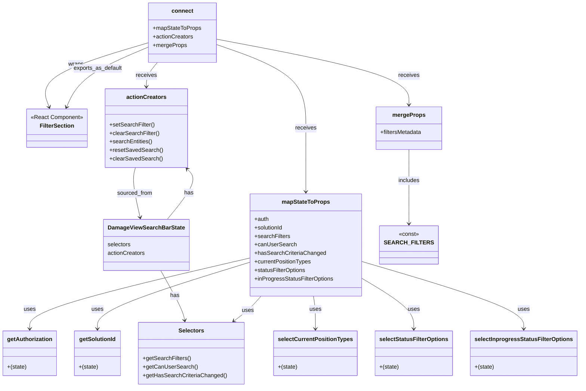

# Diagram: web/portal/src/pages/damageview/components/search/DamageView.SearchFilters.container.js

> Auto-generated by Obscura crawlers

## Mermaid

### SVG

<svg id="container" width="1588.15625" xmlns="http://www.w3.org/2000/svg" class="classDiagram" height="1090" viewBox="0 0 1588.15625 1090" role="graphics-document document" aria-roledescription="class"><g><defs><marker id="container_class-aggregationStart" class="marker aggregation class" refX="18" refY="7" markerWidth="190" markerHeight="240" orient="auto"><path d="M 18,7 L9,13 L1,7 L9,1 Z"></path></marker></defs><defs><marker id="container_class-aggregationEnd" class="marker aggregation class" refX="1" refY="7" markerWidth="20" markerHeight="28" orient="auto"><path d="M 18,7 L9,13 L1,7 L9,1 Z"></path></marker></defs><defs><marker id="container_class-extensionStart" class="marker extension class" refX="18" refY="7" markerWidth="190" markerHeight="240" orient="auto"><path d="M 1,7 L18,13 V 1 Z"></path></marker></defs><defs><marker id="container_class-extensionEnd" class="marker extension class" refX="1" refY="7" markerWidth="20" markerHeight="28" orient="auto"><path d="M 1,1 V 13 L18,7 Z"></path></marker></defs><defs><marker id="container_class-compositionStart" class="marker composition class" refX="18" refY="7" markerWidth="190" markerHeight="240" orient="auto"><path d="M 18,7 L9,13 L1,7 L9,1 Z"></path></marker></defs><defs><marker id="container_class-compositionEnd" class="marker composition class" refX="1" refY="7" markerWidth="20" markerHeight="28" orient="auto"><path d="M 18,7 L9,13 L1,7 L9,1 Z"></path></marker></defs><defs><marker id="container_class-dependencyStart" class="marker dependency class" refX="6" refY="7" markerWidth="190" markerHeight="240" orient="auto"><path d="M 5,7 L9,13 L1,7 L9,1 Z"></path></marker></defs><defs><marker id="container_class-dependencyEnd" class="marker dependency class" refX="13" refY="7" markerWidth="20" markerHeight="28" orient="auto"><path d="M 18,7 L9,13 L14,7 L9,1 Z"></path></marker></defs><defs><marker id="container_class-lollipopStart" class="marker lollipop class" refX="13" refY="7" markerWidth="190" markerHeight="240" orient="auto"><circle stroke="black" fill="transparent" cx="7" cy="7" r="6"></circle></marker></defs><defs><marker id="container_class-lollipopEnd" class="marker lollipop class" refX="1" refY="7" markerWidth="190" markerHeight="240" orient="auto"><circle stroke="black" fill="transparent" cx="7" cy="7" r="6"></circle></marker></defs><g class="root"><g class="clusters"></g><g class="edgePaths"><path d="M443.603,762L453.61,780.167C463.617,798.333,483.631,834.667,494.666,858.019C505.702,881.372,507.759,891.743,508.788,896.929L509.817,902.115" id="id_DamageViewSearchBarState_Selectors_1" class="edge-thickness-normal edge-pattern-solid relation" style=";;;" data-edge="true" data-et="edge" data-id="id_DamageViewSearchBarState_Selectors_1" data-points="W3sieCI6NDQzLjYwMzQ5NDA0MzUwODMsInkiOjc2Mn0seyJ4Ijo1MDMuNjQ0NTMxMjUsInkiOjg3MX0seyJ4Ijo1MTAuOTg0MTU0NDg1ODg3MSwieSI6OTA4fV0=" marker-end="url(#container_class-dependencyEnd)"></path><path d="M461.494,618L476.015,599.833C490.536,581.667,519.577,545.333,528.769,521.715C537.961,498.097,527.303,487.194,521.974,481.742L516.644,476.291" id="id_DamageViewSearchBarState_actionCreators_2" class="edge-thickness-normal edge-pattern-solid relation" style=";;;" data-edge="true" data-et="edge" data-id="id_DamageViewSearchBarState_actionCreators_2" data-points="W3sieCI6NDYxLjQ5Mzk0NjM5MTU3NDYsInkiOjYxOH0seyJ4Ijo1NDguNjE5MTQwNjI1LCJ5Ijo1MDl9LHsieCI6NTEyLjQ1MDE5NTMxMjUsInkiOjQ3Mn1d" marker-end="url(#container_class-dependencyEnd)"></path><path d="M687.223,727.043L586.26,751.036C485.297,775.029,283.371,823.014,182.408,856.174C81.445,889.333,81.445,907.667,81.445,916.833L81.445,926" id="id_mapStateToProps_getAuthorization_3" class="edge-thickness-normal edge-pattern-solid relation" style=";;;" data-edge="true" data-et="edge" data-id="id_mapStateToProps_getAuthorization_3" data-points="W3sieCI6Njg3LjIyMjY1NjI1LCJ5Ijo3MjcuMDQzMDY1MDcyMDA1OX0seyJ4Ijo4MS40NDUzMTI1LCJ5Ijo4NzF9LHsieCI6ODEuNDQ1MzEyNSwieSI6OTMyfV0=" marker-end="url(#container_class-dependencyEnd)"></path><path d="M687.223,739.143L617.515,761.119C547.807,783.095,408.392,827.048,338.684,858.19C268.977,889.333,268.977,907.667,268.977,916.833L268.977,926" id="id_mapStateToProps_getSolutionId_4" class="edge-thickness-normal edge-pattern-solid relation" style=";;;" data-edge="true" data-et="edge" data-id="id_mapStateToProps_getSolutionId_4" data-points="W3sieCI6Njg3LjIyMjY1NjI1LCJ5Ijo3MzkuMTQyNzUxMTk3NDc0NX0seyJ4IjoyNjguOTc2NTYyNSwieSI6ODcxfSx7IngiOjI2OC45NzY1NjI1LCJ5Ijo5MzJ9XQ==" marker-end="url(#container_class-dependencyEnd)"></path><path d="M720.716,834L715.475,840.167C710.234,846.333,699.752,858.667,687.295,870.39C674.838,882.113,660.406,893.226,653.191,898.783L645.975,904.339" id="id_mapStateToProps_Selectors_5" class="edge-thickness-normal edge-pattern-solid relation" style=";;;" data-edge="true" data-et="edge" data-id="id_mapStateToProps_Selectors_5" data-points="W3sieCI6NzIwLjcxNTg1ODA4MDExMDUsInkiOjgzNH0seyJ4Ijo2ODkuMjY5NTMxMjUsInkiOjg3MX0seyJ4Ijo2NDEuMjIxMDQ5NjQ3MTc3NCwieSI6OTA4fV0=" marker-end="url(#container_class-dependencyEnd)"></path><path d="M864.178,834L865.081,840.167C865.983,846.333,867.789,858.667,868.691,874C869.594,889.333,869.594,907.667,869.594,916.833L869.594,926" id="id_mapStateToProps_selectCurrentPositionTypes_6" class="edge-thickness-normal edge-pattern-solid relation" style=";;;" data-edge="true" data-et="edge" data-id="id_mapStateToProps_selectCurrentPositionTypes_6" data-points="W3sieCI6ODY0LjE3ODIxOTk1ODU2MzUsInkiOjgzNH0seyJ4Ijo4NjkuNTkzNzUsInkiOjg3MX0seyJ4Ijo4NjkuNTkzNzUsInkiOjkzMn1d" marker-end="url(#container_class-dependencyEnd)"></path><path d="M998.98,785.941L1022.014,800.117C1045.047,814.294,1091.113,842.647,1114.146,865.99C1137.18,889.333,1137.18,907.667,1137.18,916.833L1137.18,926" id="id_mapStateToProps_selectStatusFilterOptions_7" class="edge-thickness-normal edge-pattern-solid relation" style=";;;" data-edge="true" data-et="edge" data-id="id_mapStateToProps_selectStatusFilterOptions_7" data-points="W3sieCI6OTk4Ljk4MDQ2ODc1LCJ5Ijo3ODUuOTQwNzcwOTQ3MzQ2MX0seyJ4IjoxMTM3LjE3OTY4NzUsInkiOjg3MX0seyJ4IjoxMTM3LjE3OTY4NzUsInkiOjkzMn1d" marker-end="url(#container_class-dependencyEnd)"></path><path d="M998.98,737.569L1071.854,759.808C1144.727,782.046,1290.473,826.523,1363.346,857.928C1436.219,889.333,1436.219,907.667,1436.219,916.833L1436.219,926" id="id_mapStateToProps_selectInprogressStatusFilterOptions_8" class="edge-thickness-normal edge-pattern-solid relation" style=";;;" data-edge="true" data-et="edge" data-id="id_mapStateToProps_selectInprogressStatusFilterOptions_8" data-points="W3sieCI6OTk4Ljk4MDQ2ODc1LCJ5Ijo3MzcuNTY5MTUyNjQ5NTM0M30seyJ4IjoxNDM2LjIxODc1LCJ5Ijo4NzF9LHsieCI6MTQzNi4yMTg3NSwieSI6OTMyfV0=" marker-end="url(#container_class-dependencyEnd)"></path><path d="M1120.965,421L1120.965,435.667C1120.965,450.333,1120.965,479.667,1120.965,514.5C1120.965,549.333,1120.965,589.667,1120.965,609.833L1120.965,630" id="id_mergeProps_SEARCH_FILTERS_9" class="edge-thickness-normal edge-pattern-solid relation" style=";;;" data-edge="true" data-et="edge" data-id="id_mergeProps_SEARCH_FILTERS_9" data-points="W3sieCI6MTEyMC45NjQ4NDM3NSwieSI6NDIxfSx7IngiOjExMjAuOTY0ODQzNzUsInkiOjUwOX0seyJ4IjoxMTIwLjk2NDg0Mzc1LCJ5Ijo2MzZ9XQ==" marker-end="url(#container_class-dependencyEnd)"></path><path d="M373.012,472L371.293,478.167C369.575,484.333,366.138,496.667,368.337,520.025C370.536,543.383,378.37,577.767,382.287,594.958L386.205,612.15" id="id_actionCreators_DamageViewSearchBarState_10" class="edge-thickness-normal edge-pattern-solid relation" style=";;;" data-edge="true" data-et="edge" data-id="id_actionCreators_DamageViewSearchBarState_10" data-points="W3sieCI6MzczLjAxMTcxODc1LCJ5Ijo0NzJ9LHsieCI6MzYyLjcwMTE3MTg3NSwieSI6NTA5fSx7IngiOjM4Ny41Mzc2MjczMzA4MDExLCJ5Ijo2MTh9XQ==" marker-end="url(#container_class-dependencyEnd)"></path><path d="M597.594,125.488L638.512,140.074C679.43,154.659,761.266,183.829,802.184,223.081C843.102,262.333,843.102,311.667,843.102,361C843.102,410.333,843.102,459.667,843.102,489.5C843.102,519.333,843.102,529.667,843.102,534.833L843.102,540" id="id_connect_mapStateToProps_11" class="edge-thickness-normal edge-pattern-solid relation" style=";;;" data-edge="true" data-et="edge" data-id="id_connect_mapStateToProps_11" data-points="W3sieCI6NTk3LjU5Mzc1LCJ5IjoxMjUuNDg4MzQ4ODEwNzE1NjV9LHsieCI6ODQzLjEwMTU2MjUsInkiOjIxM30seyJ4Ijo4NDMuMTAxNTYyNSwieSI6MzYxfSx7IngiOjg0My4xMDE1NjI1LCJ5Ijo1MDl9LHsieCI6ODQzLjEwMTU2MjUsInkiOjU0Nn1d" marker-end="url(#container_class-dependencyEnd)"></path><path d="M434.43,176L429.349,182.167C424.268,188.333,414.106,200.667,409.025,212C403.943,223.333,403.943,233.667,403.943,238.833L403.943,244" id="id_connect_actionCreators_12" class="edge-thickness-normal edge-pattern-solid relation" style=";;;" data-edge="true" data-et="edge" data-id="id_connect_actionCreators_12" data-points="W3sieCI6NDM0LjQzMDQ5NDU3NjQ0NjMsInkiOjE3Nn0seyJ4Ijo0MDMuOTQzMzU5Mzc1LCJ5IjoyMTN9LHsieCI6NDAzLjk0MzM1OTM3NSwieSI6MjUwfV0=" marker-end="url(#container_class-dependencyEnd)"></path><path d="M597.594,110.415L684.822,127.512C772.051,144.61,946.508,178.805,1033.736,209.569C1120.965,240.333,1120.965,267.667,1120.965,281.333L1120.965,295" id="id_connect_mergeProps_13" class="edge-thickness-normal edge-pattern-solid relation" style=";;;" data-edge="true" data-et="edge" data-id="id_connect_mergeProps_13" data-points="W3sieCI6NTk3LjU5Mzc1LCJ5IjoxMTAuNDE0ODQxMTEwMTQwODZ9LHsieCI6MTEyMC45NjQ4NDM3NSwieSI6MjEzfSx7IngiOjExMjAuOTY0ODQzNzUsInkiOjMwMX1d" marker-end="url(#container_class-dependencyEnd)"></path><path d="M409.695,120.262L358.315,135.718C306.934,151.175,204.173,182.087,158.28,212.273C112.387,242.459,123.362,271.918,128.849,286.648L134.337,301.378" id="id_connect_FilterSection_14" class="edge-thickness-normal edge-pattern-solid relation" style=";;;" data-edge="true" data-et="edge" data-id="id_connect_FilterSection_14" data-points="W3sieCI6NDA5LjY5NTMxMjUsInkiOjEyMC4yNjE5MDc0MjA5ODU0Mn0seyJ4IjoxMDEuNDEyMTA5Mzc1LCJ5IjoyMTN9LHsieCI6MTM2LjQzMTM3NjY4OTE4OTIsInkiOjMwN31d" marker-end="url(#container_class-dependencyEnd)"></path><path d="M409.695,132.228L378.256,145.69C346.816,159.152,283.938,186.076,246.069,214.288C208.2,242.5,195.342,272,188.913,286.75L182.484,301.5" id="id_connect_FilterSection_15" class="edge-thickness-normal edge-pattern-solid relation" style=";;;" data-edge="true" data-et="edge" data-id="id_connect_FilterSection_15" data-points="W3sieCI6NDA5LjY5NTMxMjUsInkiOjEzMi4yMjc5NTg4NjIwNzE4M30seyJ4IjoyMjEuMDU4NTkzNzUsInkiOjIxM30seyJ4IjoxODAuMDg2MTc1MDQyMjI5NzQsInkiOjMwN31d" marker-end="url(#container_class-dependencyEnd)"></path></g><g class="edgeLabels"><g class="edgeLabel" transform="translate(482.72382, 833.02002)"><g class="label" data-id="id_DamageViewSearchBarState_Selectors_1" transform="translate(-12.703125, -12)"><foreignObject width="25.40625" height="24">

has

</foreignObject></g></g><g class="edgeLabel" transform="translate(521.20944, 543.29154)"><g class="label" data-id="id_DamageViewSearchBarState_actionCreators_2" transform="translate(-12.703125, -12)"><foreignObject width="25.40625" height="24">

has

</foreignObject></g></g><g class="edgeLabel" transform="translate(81.4453125, 871)"><g class="label" data-id="id_mapStateToProps_getAuthorization_3" transform="translate(-16.4921875, -12)"><foreignObject width="32.984375" height="24">

uses

</foreignObject></g></g><g class="edgeLabel" transform="translate(268.9765625, 871)"><g class="label" data-id="id_mapStateToProps_getSolutionId_4" transform="translate(-16.4921875, -12)"><foreignObject width="32.984375" height="24">

uses

</foreignObject></g></g><g class="edgeLabel" transform="translate(684.48171, 874.68689)"><g class="label" data-id="id_mapStateToProps_Selectors_5" transform="translate(-16.4921875, -12)"><foreignObject width="32.984375" height="24">

uses

</foreignObject></g></g><g class="edgeLabel" transform="translate(869.59375, 871)"><g class="label" data-id="id_mapStateToProps_selectCurrentPositionTypes_6" transform="translate(-16.4921875, -12)"><foreignObject width="32.984375" height="24">

uses

</foreignObject></g></g><g class="edgeLabel" transform="translate(1137.1796875, 871)"><g class="label" data-id="id_mapStateToProps_selectStatusFilterOptions_7" transform="translate(-16.4921875, -12)"><foreignObject width="32.984375" height="24">

uses

</foreignObject></g></g><g class="edgeLabel" transform="translate(1436.21875, 871)"><g class="label" data-id="id_mapStateToProps_selectInprogressStatusFilterOptions_8" transform="translate(-16.4921875, -12)"><foreignObject width="32.984375" height="24">

uses

</foreignObject></g></g><g class="edgeLabel" transform="translate(1120.96484375, 509)"><g class="label" data-id="id_mergeProps_SEARCH_FILTERS_9" transform="translate(-30.6484375, -12)"><foreignObject width="61.296875" height="24">

includes

</foreignObject></g></g><g class="edgeLabel" transform="translate(370.85279, 544.77507)"><g class="label" data-id="id_actionCreators_DamageViewSearchBarState_10" transform="translate(-49.78125, -12)"><foreignObject width="99.5625" height="24">

sourced_from

</foreignObject></g></g><g class="edgeLabel" transform="translate(843.1015625, 361)"><g class="label" data-id="id_connect_mapStateToProps_11" transform="translate(-29.4921875, -12)"><foreignObject width="58.984375" height="24">

receives

</foreignObject></g></g><g class="edgeLabel" transform="translate(403.943359375, 213)"><g class="label" data-id="id_connect_actionCreators_12" transform="translate(-29.4921875, -12)"><foreignObject width="58.984375" height="24">

receives

</foreignObject></g></g><g class="edgeLabel" transform="translate(1120.96484375, 213)"><g class="label" data-id="id_connect_mergeProps_13" transform="translate(-29.4921875, -12)"><foreignObject width="58.984375" height="24">

receives

</foreignObject></g></g><g class="edgeLabel" transform="translate(207.5242, 181.07924)"><g class="label" data-id="id_connect_FilterSection_14" transform="translate(-21.390625, -12)"><foreignObject width="42.78125" height="24">

wraps

</foreignObject></g></g><g class="edgeLabel" transform="translate(268.24521, 192.79524)"><g class="label" data-id="id_connect_FilterSection_15" transform="translate(-68.8828125, -12)"><foreignObject width="137.765625" height="24">

exports_as_default

</foreignObject></g></g></g><g class="nodes"><g class="node default" id="classId-FilterSection-0" transform="translate(156.548828125, 361)"><g class="basic label-container"><path d="M-85.2109375 -54 L85.2109375 -54 L85.2109375 54 L-85.2109375 54" stroke="none" stroke-width="0" fill="#ECECFF" style=""></path><path d="M-85.2109375 -54 C-22.81709452174087 -54, 39.57674845651826 -54, 85.2109375 -54 M-85.2109375 -54 C-27.051170233764637 -54, 31.108597032470726 -54, 85.2109375 -54 M85.2109375 -54 C85.2109375 -22.137794260390915, 85.2109375 9.724411479218169, 85.2109375 54 M85.2109375 -54 C85.2109375 -16.96129712138361, 85.2109375 20.077405757232782, 85.2109375 54 M85.2109375 54 C33.957305506097725 54, -17.29632648780455 54, -85.2109375 54 M85.2109375 54 C22.67046530801815 54, -39.8700068839637 54, -85.2109375 54 M-85.2109375 54 C-85.2109375 17.062125323451404, -85.2109375 -19.87574935309719, -85.2109375 -54 M-85.2109375 54 C-85.2109375 24.52514348913835, -85.2109375 -4.949713021723298, -85.2109375 -54" stroke="#9370DB" stroke-width="1.3" fill="none" stroke-dasharray="0 0" style=""></path></g><g class="annotation-group text" transform="translate(-73.2109375, -30)"><g class="label" style="" transform="translate(0,-12)"><foreignObject width="146.421875" height="24">

«React Component»

</foreignObject></g></g><g class="label-group text" transform="translate(-46.3203125, -6)"><g class="label" style="font-weight: bolder" transform="translate(0,-12)"><foreignObject width="92.640625" height="24">

FilterSection

</foreignObject></g></g><g class="members-group text" transform="translate(-73.2109375, 42)"></g><g class="methods-group text" transform="translate(-73.2109375, 72)"></g><g class="divider" style=""><path d="M-85.2109375 18 C-41.8757554216908 18, 1.4594266566184046 18, 85.2109375 18 M-85.2109375 18 C-18.473735023078135 18, 48.26346745384373 18, 85.2109375 18" stroke="#9370DB" stroke-width="1.3" fill="none" stroke-dasharray="0 0" style=""></path></g><g class="divider" style=""><path d="M-85.2109375 36 C-33.511009438045534 36, 18.188918623908933 36, 85.2109375 36 M-85.2109375 36 C-22.099147350474475 36, 41.01264279905105 36, 85.2109375 36" stroke="#9370DB" stroke-width="1.3" fill="none" stroke-dasharray="0 0" style=""></path></g></g><g class="node default" id="classId-connect-1" transform="translate(503.64453125, 92)"><g class="basic label-container"><path d="M-93.94921875 -84 L93.94921875 -84 L93.94921875 84 L-93.94921875 84" stroke="none" stroke-width="0" fill="#ECECFF" style=""></path><path d="M-93.94921875 -84 C-31.87264609784551 -84, 30.20392655430898 -84, 93.94921875 -84 M-93.94921875 -84 C-44.09261995506843 -84, 5.763978839863142 -84, 93.94921875 -84 M93.94921875 -84 C93.94921875 -22.477897829425878, 93.94921875 39.044204341148244, 93.94921875 84 M93.94921875 -84 C93.94921875 -33.47570882491795, 93.94921875 17.048582350164097, 93.94921875 84 M93.94921875 84 C42.28133489839117 84, -9.386548953217655 84, -93.94921875 84 M93.94921875 84 C42.778230648465374 84, -8.392757453069251 84, -93.94921875 84 M-93.94921875 84 C-93.94921875 38.64872154458153, -93.94921875 -6.702556910836947, -93.94921875 -84 M-93.94921875 84 C-93.94921875 34.19552080118779, -93.94921875 -15.60895839762442, -93.94921875 -84" stroke="#9370DB" stroke-width="1.3" fill="none" stroke-dasharray="0 0" style=""></path></g><g class="annotation-group text" transform="translate(0, -60)"></g><g class="label-group text" transform="translate(-28.9140625, -60)"><g class="label" style="font-weight: bolder" transform="translate(0,-12)"><foreignObject width="57.828125" height="24">

connect

</foreignObject></g></g><g class="members-group text" transform="translate(-81.94921875, -12)"><g class="label" style="" transform="translate(0,-12)"><foreignObject width="134.984375" height="24">

+mapStateToProps

</foreignObject></g><g class="label" style="" transform="translate(0,12)"><foreignObject width="113.078125" height="24">

+actionCreators

</foreignObject></g><g class="label" style="" transform="translate(0,36)"><foreignObject width="94.140625" height="24">

+mergeProps

</foreignObject></g></g><g class="methods-group text" transform="translate(-81.94921875, 84)"></g><g class="divider" style=""><path d="M-93.94921875 -36 C-24.691705271333888 -36, 44.565808207332225 -36, 93.94921875 -36 M-93.94921875 -36 C-48.35755813963148 -36, -2.7658975292629577 -36, 93.94921875 -36" stroke="#9370DB" stroke-width="1.3" fill="none" stroke-dasharray="0 0" style=""></path></g><g class="divider" style=""><path d="M-93.94921875 60 C-30.085378364921162 60, 33.778462020157676 60, 93.94921875 60 M-93.94921875 60 C-29.626763383739572 60, 34.695691982520856 60, 93.94921875 60" stroke="#9370DB" stroke-width="1.3" fill="none" stroke-dasharray="0 0" style=""></path></g></g><g class="node default" id="classId-mapStateToProps-2" transform="translate(843.1015625, 690)"><g class="basic label-container"><path d="M-155.87890625 -144 L155.87890625 -144 L155.87890625 144 L-155.87890625 144" stroke="none" stroke-width="0" fill="#ECECFF" style=""></path><path d="M-155.87890625 -144 C-34.00118794435545 -144, 87.8765303612891 -144, 155.87890625 -144 M-155.87890625 -144 C-39.61380386184278 -144, 76.65129852631443 -144, 155.87890625 -144 M155.87890625 -144 C155.87890625 -37.43651962941483, 155.87890625 69.12696074117034, 155.87890625 144 M155.87890625 -144 C155.87890625 -51.41266960361979, 155.87890625 41.17466079276042, 155.87890625 144 M155.87890625 144 C40.71136269329925 144, -74.4561808634015 144, -155.87890625 144 M155.87890625 144 C85.8573185640582 144, 15.835730878116408 144, -155.87890625 144 M-155.87890625 144 C-155.87890625 83.35186918498671, -155.87890625 22.703738369973422, -155.87890625 -144 M-155.87890625 144 C-155.87890625 31.898972728243095, -155.87890625 -80.20205454351381, -155.87890625 -144" stroke="#9370DB" stroke-width="1.3" fill="none" stroke-dasharray="0 0" style=""></path></g><g class="annotation-group text" transform="translate(0, -120)"></g><g class="label-group text" transform="translate(-64.7109375, -120)"><g class="label" style="font-weight: bolder" transform="translate(0,-12)"><foreignObject width="129.421875" height="24">

mapStateToProps

</foreignObject></g></g><g class="members-group text" transform="translate(-143.87890625, -72)"><g class="label" style="" transform="translate(0,-12)"><foreignObject width="40.921875" height="24">

+auth

</foreignObject></g><g class="label" style="" transform="translate(0,12)"><foreignObject width="82.109375" height="24">

+solutionId

</foreignObject></g><g class="label" style="" transform="translate(0,36)"><foreignObject width="99.609375" height="24">

+searchFilters

</foreignObject></g><g class="label" style="" transform="translate(0,60)"><foreignObject width="115.140625" height="24">

+canUserSearch

</foreignObject></g><g class="label" style="" transform="translate(0,84)"><foreignObject width="197.75" height="24">

+hasSearchCriteriaChanged

</foreignObject></g><g class="label" style="" transform="translate(0,108)"><foreignObject width="160.890625" height="24">

+currentPositionTypes

</foreignObject></g><g class="label" style="" transform="translate(0,132)"><foreignObject width="146.375" height="24">

+statusFilterOptions

</foreignObject></g><g class="label" style="" transform="translate(0,156)"><foreignObject width="223.046875" height="24">

+inProgressStatusFilterOptions

</foreignObject></g></g><g class="methods-group text" transform="translate(-143.87890625, 144)"></g><g class="divider" style=""><path d="M-155.87890625 -96 C-62.8181680566895 -96, 30.242570136620998 -96, 155.87890625 -96 M-155.87890625 -96 C-57.60299685085643 -96, 40.672912548287144 -96, 155.87890625 -96" stroke="#9370DB" stroke-width="1.3" fill="none" stroke-dasharray="0 0" style=""></path></g><g class="divider" style=""><path d="M-155.87890625 120 C-59.42065632693267 120, 37.037593596134656 120, 155.87890625 120 M-155.87890625 120 C-40.461720473097415 120, 74.95546530380517 120, 155.87890625 120" stroke="#9370DB" stroke-width="1.3" fill="none" stroke-dasharray="0 0" style=""></path></g></g><g class="node default" id="classId-mergeProps-3" transform="translate(1120.96484375, 361)"><g class="basic label-container"><path d="M-92.671875 -60 L92.671875 -60 L92.671875 60 L-92.671875 60" stroke="none" stroke-width="0" fill="#ECECFF" style=""></path><path d="M-92.671875 -60 C-53.09949819362678 -60, -13.527121387253558 -60, 92.671875 -60 M-92.671875 -60 C-44.59194436335738 -60, 3.4879862732852445 -60, 92.671875 -60 M92.671875 -60 C92.671875 -30.614435234163587, 92.671875 -1.2288704683271732, 92.671875 60 M92.671875 -60 C92.671875 -14.178419945278925, 92.671875 31.64316010944215, 92.671875 60 M92.671875 60 C37.76690351571407 60, -17.13806796857186 60, -92.671875 60 M92.671875 60 C50.90028389795222 60, 9.128692795904442 60, -92.671875 60 M-92.671875 60 C-92.671875 31.349868008886787, -92.671875 2.6997360177735743, -92.671875 -60 M-92.671875 60 C-92.671875 15.834966658611506, -92.671875 -28.330066682776987, -92.671875 -60" stroke="#9370DB" stroke-width="1.3" fill="none" stroke-dasharray="0 0" style=""></path></g><g class="annotation-group text" transform="translate(0, -36)"></g><g class="label-group text" transform="translate(-43.859375, -36)"><g class="label" style="font-weight: bolder" transform="translate(0,-12)"><foreignObject width="87.71875" height="24">

mergeProps

</foreignObject></g></g><g class="members-group text" transform="translate(-80.671875, 12)"><g class="label" style="" transform="translate(0,-12)"><foreignObject width="117.484375" height="24">

+filtersMetadata

</foreignObject></g></g><g class="methods-group text" transform="translate(-80.671875, 60)"></g><g class="divider" style=""><path d="M-92.671875 -12 C-45.89566235495819 -12, 0.8805502900836188 -12, 92.671875 -12 M-92.671875 -12 C-25.282635888987144 -12, 42.10660322202571 -12, 92.671875 -12" stroke="#9370DB" stroke-width="1.3" fill="none" stroke-dasharray="0 0" style=""></path></g><g class="divider" style=""><path d="M-92.671875 36 C-42.95449034803741 36, 6.762894303925179 36, 92.671875 36 M-92.671875 36 C-50.979180189191474 36, -9.286485378382949 36, 92.671875 36" stroke="#9370DB" stroke-width="1.3" fill="none" stroke-dasharray="0 0" style=""></path></g></g><g class="node default" id="classId-actionCreators-4" transform="translate(403.943359375, 361)"><g class="basic label-container"><path d="M-112.18359375 -111 L112.18359375 -111 L112.18359375 111 L-112.18359375 111" stroke="none" stroke-width="0" fill="#ECECFF" style=""></path><path d="M-112.18359375 -111 C-64.12742657489395 -111, -16.07125939978789 -111, 112.18359375 -111 M-112.18359375 -111 C-29.994291323739162 -111, 52.195011102521676 -111, 112.18359375 -111 M112.18359375 -111 C112.18359375 -28.718229487871398, 112.18359375 53.563541024257205, 112.18359375 111 M112.18359375 -111 C112.18359375 -38.8504866651202, 112.18359375 33.2990266697596, 112.18359375 111 M112.18359375 111 C38.33042812148177 111, -35.52273750703645 111, -112.18359375 111 M112.18359375 111 C51.57985532449887 111, -9.023883101002255 111, -112.18359375 111 M-112.18359375 111 C-112.18359375 48.15700287506446, -112.18359375 -14.685994249871086, -112.18359375 -111 M-112.18359375 111 C-112.18359375 22.334729272225033, -112.18359375 -66.33054145554993, -112.18359375 -111" stroke="#9370DB" stroke-width="1.3" fill="none" stroke-dasharray="0 0" style=""></path></g><g class="annotation-group text" transform="translate(0, -87)"></g><g class="label-group text" transform="translate(-53.6328125, -87)"><g class="label" style="font-weight: bolder" transform="translate(0,-12)"><foreignObject width="107.265625" height="24">

actionCreators

</foreignObject></g></g><g class="members-group text" transform="translate(-100.18359375, -39)"></g><g class="methods-group text" transform="translate(-100.18359375, -9)"><g class="label" style="" transform="translate(0,-12)"><foreignObject width="125.953125" height="24">

+setSearchFilter()

</foreignObject></g><g class="label" style="" transform="translate(0,12)"><foreignObject width="139.6875" height="24">

+clearSearchFilter()

</foreignObject></g><g class="label" style="" transform="translate(0,36)"><foreignObject width="120.359375" height="24">

+searchEntities()

</foreignObject></g><g class="label" style="" transform="translate(0,60)"><foreignObject width="146.734375" height="24">

+resetSavedSearch()

</foreignObject></g><g class="label" style="" transform="translate(0,84)"><foreignObject width="146.046875" height="24">

+clearSavedSearch()

</foreignObject></g></g><g class="divider" style=""><path d="M-112.18359375 -63 C-44.36067647669411 -63, 23.46224079661178 -63, 112.18359375 -63 M-112.18359375 -63 C-38.8439565083297 -63, 34.495680733340606 -63, 112.18359375 -63" stroke="#9370DB" stroke-width="1.3" fill="none" stroke-dasharray="0 0" style=""></path></g><g class="divider" style=""><path d="M-112.18359375 -39 C-49.259137528106926 -39, 13.665318693786148 -39, 112.18359375 -39 M-112.18359375 -39 C-54.67544646641982 -39, 2.832700817160358 -39, 112.18359375 -39" stroke="#9370DB" stroke-width="1.3" fill="none" stroke-dasharray="0 0" style=""></path></g></g><g class="node default" id="classId-DamageViewSearchBarState-5" transform="translate(403.943359375, 690)"><g class="basic label-container"><path d="M-116.17578125 -72 L116.17578125 -72 L116.17578125 72 L-116.17578125 72" stroke="none" stroke-width="0" fill="#ECECFF" style=""></path><path d="M-116.17578125 -72 C-67.85490348904118 -72, -19.534025728082355 -72, 116.17578125 -72 M-116.17578125 -72 C-60.85379604242223 -72, -5.531810834844464 -72, 116.17578125 -72 M116.17578125 -72 C116.17578125 -30.616992136837787, 116.17578125 10.766015726324426, 116.17578125 72 M116.17578125 -72 C116.17578125 -23.77513412414281, 116.17578125 24.44973175171438, 116.17578125 72 M116.17578125 72 C35.69990735288327 72, -44.775966544233455 72, -116.17578125 72 M116.17578125 72 C58.14392790596653 72, 0.11207456193305632 72, -116.17578125 72 M-116.17578125 72 C-116.17578125 30.662433136840882, -116.17578125 -10.675133726318236, -116.17578125 -72 M-116.17578125 72 C-116.17578125 21.5786090233549, -116.17578125 -28.8427819532902, -116.17578125 -72" stroke="#9370DB" stroke-width="1.3" fill="none" stroke-dasharray="0 0" style=""></path></g><g class="annotation-group text" transform="translate(0, -48)"></g><g class="label-group text" transform="translate(-103.0078125, -48)"><g class="label" style="font-weight: bolder" transform="translate(0,-12)"><foreignObject width="206.015625" height="24">

DamageViewSearchBarState

</foreignObject></g></g><g class="members-group text" transform="translate(-104.17578125, 0)"><g class="label" style="" transform="translate(0,-12)"><foreignObject width="65.46875" height="24">

selectors

</foreignObject></g><g class="label" style="" transform="translate(0,12)"><foreignObject width="105.34375" height="24">

actionCreators

</foreignObject></g></g><g class="methods-group text" transform="translate(-104.17578125, 72)"></g><g class="divider" style=""><path d="M-116.17578125 -24 C-35.14697550114991 -24, 45.88183024770018 -24, 116.17578125 -24 M-116.17578125 -24 C-65.73335109198206 -24, -15.290920933964117 -24, 116.17578125 -24" stroke="#9370DB" stroke-width="1.3" fill="none" stroke-dasharray="0 0" style=""></path></g><g class="divider" style=""><path d="M-116.17578125 48 C-65.39366396846495 48, -14.611546686929913 48, 116.17578125 48 M-116.17578125 48 C-44.47213715381427 48, 27.231506942371453 48, 116.17578125 48" stroke="#9370DB" stroke-width="1.3" fill="none" stroke-dasharray="0 0" style=""></path></g></g><g class="node default" id="classId-Selectors-6" transform="translate(528.2421875, 995)"><g class="basic label-container"><path d="M-145.1796875 -87 L145.1796875 -87 L145.1796875 87 L-145.1796875 87" stroke="none" stroke-width="0" fill="#ECECFF" style=""></path><path d="M-145.1796875 -87 C-62.793117193751854 -87, 19.59345311249629 -87, 145.1796875 -87 M-145.1796875 -87 C-50.75363122107832 -87, 43.672425057843355 -87, 145.1796875 -87 M145.1796875 -87 C145.1796875 -34.919659108230825, 145.1796875 17.16068178353835, 145.1796875 87 M145.1796875 -87 C145.1796875 -31.22400537200687, 145.1796875 24.551989255986257, 145.1796875 87 M145.1796875 87 C75.73120195813152 87, 6.2827164162630424 87, -145.1796875 87 M145.1796875 87 C29.453126249821736 87, -86.27343500035653 87, -145.1796875 87 M-145.1796875 87 C-145.1796875 27.720948600180463, -145.1796875 -31.558102799639073, -145.1796875 -87 M-145.1796875 87 C-145.1796875 30.900912804862237, -145.1796875 -25.198174390275526, -145.1796875 -87" stroke="#9370DB" stroke-width="1.3" fill="none" stroke-dasharray="0 0" style=""></path></g><g class="annotation-group text" transform="translate(0, -63)"></g><g class="label-group text" transform="translate(-34.171875, -63)"><g class="label" style="font-weight: bolder" transform="translate(0,-12)"><foreignObject width="68.34375" height="24">

Selectors

</foreignObject></g></g><g class="members-group text" transform="translate(-133.1796875, -15)"></g><g class="methods-group text" transform="translate(-133.1796875, 15)"><g class="label" style="" transform="translate(0,-12)"><foreignObject width="133.78125" height="24">

+getSearchFilters()

</foreignObject></g><g class="label" style="" transform="translate(0,12)"><foreignObject width="149.390625" height="24">

+getCanUserSearch()

</foreignObject></g><g class="label" style="" transform="translate(0,36)"><foreignObject width="232.1875" height="24">

+getHasSearchCriteriaChanged()

</foreignObject></g></g><g class="divider" style=""><path d="M-145.1796875 -39 C-63.21862590544076 -39, 18.74243568911848 -39, 145.1796875 -39 M-145.1796875 -39 C-72.22585527946167 -39, 0.7279769410766619 -39, 145.1796875 -39" stroke="#9370DB" stroke-width="1.3" fill="none" stroke-dasharray="0 0" style=""></path></g><g class="divider" style=""><path d="M-145.1796875 -15 C-49.767193824464 -15, 45.645299851072 -15, 145.1796875 -15 M-145.1796875 -15 C-79.86550497630473 -15, -14.551322452609469 -15, 145.1796875 -15" stroke="#9370DB" stroke-width="1.3" fill="none" stroke-dasharray="0 0" style=""></path></g></g><g class="node default" id="classId-SEARCH_FILTERS-7" transform="translate(1120.96484375, 690)"><g class="basic label-container"><path d="M-71.984375 -54 L71.984375 -54 L71.984375 54 L-71.984375 54" stroke="none" stroke-width="0" fill="#ECECFF" style=""></path><path d="M-71.984375 -54 C-36.25328577353354 -54, -0.5221965470670824 -54, 71.984375 -54 M-71.984375 -54 C-21.839346300157715 -54, 28.30568239968457 -54, 71.984375 -54 M71.984375 -54 C71.984375 -16.438041594959962, 71.984375 21.123916810080075, 71.984375 54 M71.984375 -54 C71.984375 -11.193244631217723, 71.984375 31.613510737564553, 71.984375 54 M71.984375 54 C36.239359406728475 54, 0.49434381345695044 54, -71.984375 54 M71.984375 54 C37.060955959598104 54, 2.137536919196208 54, -71.984375 54 M-71.984375 54 C-71.984375 18.99166030429479, -71.984375 -16.01667939141042, -71.984375 -54 M-71.984375 54 C-71.984375 27.67220844816743, -71.984375 1.344416896334863, -71.984375 -54" stroke="#9370DB" stroke-width="1.3" fill="none" stroke-dasharray="0 0" style=""></path></g><g class="annotation-group text" transform="translate(-28.6171875, -30)"><g class="label" style="" transform="translate(0,-12)"><foreignObject width="57.234375" height="24">

«const»

</foreignObject></g></g><g class="label-group text" transform="translate(-59.984375, -6)"><g class="label" style="font-weight: bolder" transform="translate(0,-12)"><foreignObject width="119.96875" height="24">

SEARCH_FILTERS

</foreignObject></g></g><g class="members-group text" transform="translate(-59.984375, 42)"></g><g class="methods-group text" transform="translate(-59.984375, 72)"></g><g class="divider" style=""><path d="M-71.984375 18 C-21.162836970020017 18, 29.658701059959967 18, 71.984375 18 M-71.984375 18 C-38.749020996954144 18, -5.513666993908288 18, 71.984375 18" stroke="#9370DB" stroke-width="1.3" fill="none" stroke-dasharray="0 0" style=""></path></g><g class="divider" style=""><path d="M-71.984375 36 C-26.632254457878553 36, 18.719866084242895 36, 71.984375 36 M-71.984375 36 C-35.020605587623486 36, 1.9431638247530287 36, 71.984375 36" stroke="#9370DB" stroke-width="1.3" fill="none" stroke-dasharray="0 0" style=""></path></g></g><g class="node default" id="classId-getSolutionId-8" transform="translate(268.9765625, 995)"><g class="basic label-container"><path d="M-64.0859375 -63 L64.0859375 -63 L64.0859375 63 L-64.0859375 63" stroke="none" stroke-width="0" fill="#ECECFF" style=""></path><path d="M-64.0859375 -63 C-25.533911599503575 -63, 13.018114300992849 -63, 64.0859375 -63 M-64.0859375 -63 C-30.485822627407643 -63, 3.114292245184714 -63, 64.0859375 -63 M64.0859375 -63 C64.0859375 -30.16222226654085, 64.0859375 2.675555466918297, 64.0859375 63 M64.0859375 -63 C64.0859375 -36.486239773624064, 64.0859375 -9.972479547248135, 64.0859375 63 M64.0859375 63 C28.619815053843162 63, -6.846307392313676 63, -64.0859375 63 M64.0859375 63 C15.279193489600125 63, -33.52755052079975 63, -64.0859375 63 M-64.0859375 63 C-64.0859375 27.67240778286559, -64.0859375 -7.6551844342688184, -64.0859375 -63 M-64.0859375 63 C-64.0859375 29.760317671470645, -64.0859375 -3.47936465705871, -64.0859375 -63" stroke="#9370DB" stroke-width="1.3" fill="none" stroke-dasharray="0 0" style=""></path></g><g class="annotation-group text" transform="translate(0, -39)"></g><g class="label-group text" transform="translate(-49.71875, -39)"><g class="label" style="font-weight: bolder" transform="translate(0,-12)"><foreignObject width="99.4375" height="24">

getSolutionId

</foreignObject></g></g><g class="members-group text" transform="translate(-52.0859375, 9)"></g><g class="methods-group text" transform="translate(-52.0859375, 39)"><g class="label" style="" transform="translate(0,-12)"><foreignObject width="54.453125" height="24">

+(state)

</foreignObject></g></g><g class="divider" style=""><path d="M-64.0859375 -15 C-35.4752840530816 -15, -6.864630606163203 -15, 64.0859375 -15 M-64.0859375 -15 C-13.423889716372784 -15, 37.23815806725443 -15, 64.0859375 -15" stroke="#9370DB" stroke-width="1.3" fill="none" stroke-dasharray="0 0" style=""></path></g><g class="divider" style=""><path d="M-64.0859375 9 C-34.05214260455587 9, -4.01834770911173 9, 64.0859375 9 M-64.0859375 9 C-24.39894712726548 9, 15.28804324546904 9, 64.0859375 9" stroke="#9370DB" stroke-width="1.3" fill="none" stroke-dasharray="0 0" style=""></path></g></g><g class="node default" id="classId-getAuthorization-9" transform="translate(81.4453125, 995)"><g class="basic label-container"><path d="M-73.4453125 -63 L73.4453125 -63 L73.4453125 63 L-73.4453125 63" stroke="none" stroke-width="0" fill="#ECECFF" style=""></path><path d="M-73.4453125 -63 C-28.873235583131745 -63, 15.69884133373651 -63, 73.4453125 -63 M-73.4453125 -63 C-37.48605131382268 -63, -1.5267901276453557 -63, 73.4453125 -63 M73.4453125 -63 C73.4453125 -24.68319486711588, 73.4453125 13.63361026576824, 73.4453125 63 M73.4453125 -63 C73.4453125 -28.35610101958752, 73.4453125 6.28779796082496, 73.4453125 63 M73.4453125 63 C37.31615699364979 63, 1.1870014872995824 63, -73.4453125 63 M73.4453125 63 C31.96873015802842 63, -9.507852183943157 63, -73.4453125 63 M-73.4453125 63 C-73.4453125 16.01053196931816, -73.4453125 -30.978936061363683, -73.4453125 -63 M-73.4453125 63 C-73.4453125 37.2477052557927, -73.4453125 11.495410511585405, -73.4453125 -63" stroke="#9370DB" stroke-width="1.3" fill="none" stroke-dasharray="0 0" style=""></path></g><g class="annotation-group text" transform="translate(0, -39)"></g><g class="label-group text" transform="translate(-61.4453125, -39)"><g class="label" style="font-weight: bolder" transform="translate(0,-12)"><foreignObject width="122.890625" height="24">

getAuthorization

</foreignObject></g></g><g class="members-group text" transform="translate(-61.4453125, 9)"></g><g class="methods-group text" transform="translate(-61.4453125, 39)"><g class="label" style="" transform="translate(0,-12)"><foreignObject width="54.453125" height="24">

+(state)

</foreignObject></g></g><g class="divider" style=""><path d="M-73.4453125 -15 C-23.09663279317469 -15, 27.252046913650616 -15, 73.4453125 -15 M-73.4453125 -15 C-21.82472417269178 -15, 29.79586415461644 -15, 73.4453125 -15" stroke="#9370DB" stroke-width="1.3" fill="none" stroke-dasharray="0 0" style=""></path></g><g class="divider" style=""><path d="M-73.4453125 9 C-29.34270054730647 9, 14.759911405387058 9, 73.4453125 9 M-73.4453125 9 C-15.739504105863872 9, 41.966304288272255 9, 73.4453125 9" stroke="#9370DB" stroke-width="1.3" fill="none" stroke-dasharray="0 0" style=""></path></g></g><g class="node default" id="classId-selectCurrentPositionTypes-10" transform="translate(869.59375, 995)"><g class="basic label-container"><path d="M-112.484375 -63 L112.484375 -63 L112.484375 63 L-112.484375 63" stroke="none" stroke-width="0" fill="#ECECFF" style=""></path><path d="M-112.484375 -63 C-38.23301339083042 -63, 36.018348218339156 -63, 112.484375 -63 M-112.484375 -63 C-41.3032986464777 -63, 29.8777777070446 -63, 112.484375 -63 M112.484375 -63 C112.484375 -31.606210313107653, 112.484375 -0.21242062621530522, 112.484375 63 M112.484375 -63 C112.484375 -36.866542319556075, 112.484375 -10.73308463911215, 112.484375 63 M112.484375 63 C50.53195240820415 63, -11.420470183591704 63, -112.484375 63 M112.484375 63 C54.527123594987565 63, -3.430127810024871 63, -112.484375 63 M-112.484375 63 C-112.484375 13.823473331871355, -112.484375 -35.35305333625729, -112.484375 -63 M-112.484375 63 C-112.484375 36.585627930804435, -112.484375 10.171255861608877, -112.484375 -63" stroke="#9370DB" stroke-width="1.3" fill="none" stroke-dasharray="0 0" style=""></path></g><g class="annotation-group text" transform="translate(0, -39)"></g><g class="label-group text" transform="translate(-100.484375, -39)"><g class="label" style="font-weight: bolder" transform="translate(0,-12)"><foreignObject width="200.96875" height="24">

selectCurrentPositionTypes

</foreignObject></g></g><g class="members-group text" transform="translate(-100.484375, 9)"></g><g class="methods-group text" transform="translate(-100.484375, 39)"><g class="label" style="" transform="translate(0,-12)"><foreignObject width="54.453125" height="24">

+(state)

</foreignObject></g></g><g class="divider" style=""><path d="M-112.484375 -15 C-65.58299693795989 -15, -18.68161887591978 -15, 112.484375 -15 M-112.484375 -15 C-35.702843262927345 -15, 41.07868847414531 -15, 112.484375 -15" stroke="#9370DB" stroke-width="1.3" fill="none" stroke-dasharray="0 0" style=""></path></g><g class="divider" style=""><path d="M-112.484375 9 C-44.312147319570414 9, 23.860080360859172 9, 112.484375 9 M-112.484375 9 C-27.936988725289282 9, 56.610397549421435 9, 112.484375 9" stroke="#9370DB" stroke-width="1.3" fill="none" stroke-dasharray="0 0" style=""></path></g></g><g class="node default" id="classId-selectStatusFilterOptions-11" transform="translate(1137.1796875, 995)"><g class="basic label-container"><path d="M-105.1015625 -63 L105.1015625 -63 L105.1015625 63 L-105.1015625 63" stroke="none" stroke-width="0" fill="#ECECFF" style=""></path><path d="M-105.1015625 -63 C-53.543654501963445 -63, -1.9857465039268902 -63, 105.1015625 -63 M-105.1015625 -63 C-57.996291725145355 -63, -10.89102095029071 -63, 105.1015625 -63 M105.1015625 -63 C105.1015625 -24.484173426856792, 105.1015625 14.031653146286416, 105.1015625 63 M105.1015625 -63 C105.1015625 -23.738012996356545, 105.1015625 15.52397400728691, 105.1015625 63 M105.1015625 63 C46.21425430578165 63, -12.673053888436698 63, -105.1015625 63 M105.1015625 63 C57.154067304203025 63, 9.20657210840605 63, -105.1015625 63 M-105.1015625 63 C-105.1015625 19.70378671551716, -105.1015625 -23.592426568965678, -105.1015625 -63 M-105.1015625 63 C-105.1015625 31.018936188899303, -105.1015625 -0.9621276222013933, -105.1015625 -63" stroke="#9370DB" stroke-width="1.3" fill="none" stroke-dasharray="0 0" style=""></path></g><g class="annotation-group text" transform="translate(0, -39)"></g><g class="label-group text" transform="translate(-93.1015625, -39)"><g class="label" style="font-weight: bolder" transform="translate(0,-12)"><foreignObject width="186.203125" height="24">

selectStatusFilterOptions

</foreignObject></g></g><g class="members-group text" transform="translate(-93.1015625, 9)"></g><g class="methods-group text" transform="translate(-93.1015625, 39)"><g class="label" style="" transform="translate(0,-12)"><foreignObject width="54.453125" height="24">

+(state)

</foreignObject></g></g><g class="divider" style=""><path d="M-105.1015625 -15 C-39.4683764266011 -15, 26.164809646797806 -15, 105.1015625 -15 M-105.1015625 -15 C-54.933426522401575 -15, -4.76529054480315 -15, 105.1015625 -15" stroke="#9370DB" stroke-width="1.3" fill="none" stroke-dasharray="0 0" style=""></path></g><g class="divider" style=""><path d="M-105.1015625 9 C-61.724302725601085 9, -18.34704295120217 9, 105.1015625 9 M-105.1015625 9 C-62.402873763186555 9, -19.70418502637311 9, 105.1015625 9" stroke="#9370DB" stroke-width="1.3" fill="none" stroke-dasharray="0 0" style=""></path></g></g><g class="node default" id="classId-selectInprogressStatusFilterOptions-12" transform="translate(1436.21875, 995)"><g class="basic label-container"><path d="M-143.9375 -63 L143.9375 -63 L143.9375 63 L-143.9375 63" stroke="none" stroke-width="0" fill="#ECECFF" style=""></path><path d="M-143.9375 -63 C-64.01131317327997 -63, 15.914873653440054 -63, 143.9375 -63 M-143.9375 -63 C-30.809133211154972 -63, 82.31923357769006 -63, 143.9375 -63 M143.9375 -63 C143.9375 -17.19075496882777, 143.9375 28.618490062344463, 143.9375 63 M143.9375 -63 C143.9375 -30.629120828486407, 143.9375 1.7417583430271861, 143.9375 63 M143.9375 63 C42.89026277880383 63, -58.15697444239234 63, -143.9375 63 M143.9375 63 C59.586115253352716 63, -24.765269493294568 63, -143.9375 63 M-143.9375 63 C-143.9375 27.204702217864977, -143.9375 -8.590595564270046, -143.9375 -63 M-143.9375 63 C-143.9375 34.317881185378106, -143.9375 5.635762370756211, -143.9375 -63" stroke="#9370DB" stroke-width="1.3" fill="none" stroke-dasharray="0 0" style=""></path></g><g class="annotation-group text" transform="translate(0, -39)"></g><g class="label-group text" transform="translate(-131.9375, -39)"><g class="label" style="font-weight: bolder" transform="translate(0,-12)"><foreignObject width="263.875" height="24">

selectInprogressStatusFilterOptions

</foreignObject></g></g><g class="members-group text" transform="translate(-131.9375, 9)"></g><g class="methods-group text" transform="translate(-131.9375, 39)"><g class="label" style="" transform="translate(0,-12)"><foreignObject width="54.453125" height="24">

+(state)

</foreignObject></g></g><g class="divider" style=""><path d="M-143.9375 -15 C-70.79484757261558 -15, 2.347804854768839 -15, 143.9375 -15 M-143.9375 -15 C-49.51991434608557 -15, 44.89767130782886 -15, 143.9375 -15" stroke="#9370DB" stroke-width="1.3" fill="none" stroke-dasharray="0 0" style=""></path></g><g class="divider" style=""><path d="M-143.9375 9 C-68.56925062415755 9, 6.7989987516849055 9, 143.9375 9 M-143.9375 9 C-79.36030995697291 9, -14.783119913945825 9, 143.9375 9" stroke="#9370DB" stroke-width="1.3" fill="none" stroke-dasharray="0 0" style=""></path></g></g></g></g></g></svg>
