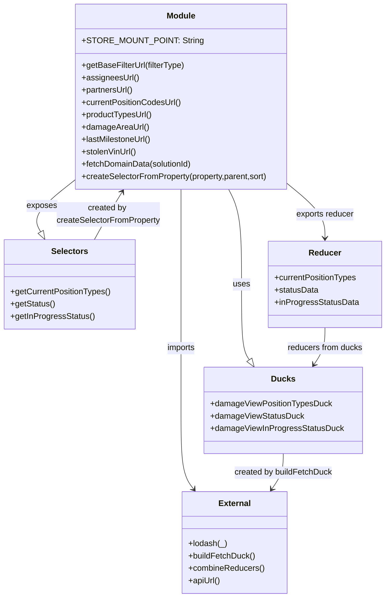

# Diagram: web/portal/src/pages/damageview/components/search/DamageViewDomainData.js


> Auto-generated by Obscura crawlers

## Diagram 1



### SVG

<svg id="container" width="743.96484375" xmlns="http://www.w3.org/2000/svg" class="classDiagram" height="1162" viewBox="0 0 743.96484375 1162" role="graphics-document document" aria-roledescription="class"><style>#container{font-family:"trebuchet ms",verdana,arial,sans-serif;font-size:16px;fill:#333;}@keyframes edge-animation-frame{from{stroke-dashoffset:0;}}@keyframes dash{to{stroke-dashoffset:0;}}#container .edge-animation-slow{stroke-dasharray:9,5!important;stroke-dashoffset:900;animation:dash 50s linear infinite;stroke-linecap:round;}#container .edge-animation-fast{stroke-dasharray:9,5!important;stroke-dashoffset:900;animation:dash 20s linear infinite;stroke-linecap:round;}#container .error-icon{fill:#552222;}#container .error-text{fill:#552222;stroke:#552222;}#container .edge-thickness-normal{stroke-width:1px;}#container .edge-thickness-thick{stroke-width:3.5px;}#container .edge-pattern-solid{stroke-dasharray:0;}#container .edge-thickness-invisible{stroke-width:0;fill:none;}#container .edge-pattern-dashed{stroke-dasharray:3;}#container .edge-pattern-dotted{stroke-dasharray:2;}#container .marker{fill:#333333;stroke:#333333;}#container .marker.cross{stroke:#333333;}#container svg{font-family:"trebuchet ms",verdana,arial,sans-serif;font-size:16px;}#container p{margin:0;}#container g.classGroup text{fill:#9370DB;stroke:none;font-family:"trebuchet ms",verdana,arial,sans-serif;font-size:10px;}#container g.classGroup text .title{font-weight:bolder;}#container .nodeLabel,#container .edgeLabel{color:#131300;}#container .edgeLabel .label rect{fill:#ECECFF;}#container .label text{fill:#131300;}#container .labelBkg{background:#ECECFF;}#container .edgeLabel .label span{background:#ECECFF;}#container .classTitle{font-weight:bolder;}#container .node rect,#container .node circle,#container .node ellipse,#container .node polygon,#container .node path{fill:#ECECFF;stroke:#9370DB;stroke-width:1px;}#container .divider{stroke:#9370DB;stroke-width:1;}#container g.clickable{cursor:pointer;}#container g.classGroup rect{fill:#ECECFF;stroke:#9370DB;}#container g.classGroup line{stroke:#9370DB;stroke-width:1;}#container .classLabel .box{stroke:none;stroke-width:0;fill:#ECECFF;opacity:0.5;}#container .classLabel .label{fill:#9370DB;font-size:10px;}#container .relation{stroke:#333333;stroke-width:1;fill:none;}#container .dashed-line{stroke-dasharray:3;}#container .dotted-line{stroke-dasharray:1 2;}#container #compositionStart,#container .composition{fill:#333333!important;stroke:#333333!important;stroke-width:1;}#container #compositionEnd,#container .composition{fill:#333333!important;stroke:#333333!important;stroke-width:1;}#container #dependencyStart,#container .dependency{fill:#333333!important;stroke:#333333!important;stroke-width:1;}#container #dependencyStart,#container .dependency{fill:#333333!important;stroke:#333333!important;stroke-width:1;}#container #extensionStart,#container .extension{fill:transparent!important;stroke:#333333!important;stroke-width:1;}#container #extensionEnd,#container .extension{fill:transparent!important;stroke:#333333!important;stroke-width:1;}#container #aggregationStart,#container .aggregation{fill:transparent!important;stroke:#333333!important;stroke-width:1;}#container #aggregationEnd,#container .aggregation{fill:transparent!important;stroke:#333333!important;stroke-width:1;}#container #lollipopStart,#container .lollipop{fill:#ECECFF!important;stroke:#333333!important;stroke-width:1;}#container #lollipopEnd,#container .lollipop{fill:#ECECFF!important;stroke:#333333!important;stroke-width:1;}#container .edgeTerminals{font-size:11px;line-height:initial;}#container .classTitleText{text-anchor:middle;font-size:18px;fill:#333;}#container .label-icon{display:inline-block;height:1em;overflow:visible;vertical-align:-0.125em;}#container .node .label-icon path{fill:currentColor;stroke:revert;stroke-width:revert;}#container :root{--mermaid-font-family:"trebuchet ms",verdana,arial,sans-serif;}</style><g><defs><marker id="container_class-aggregationStart" class="marker aggregation class" refX="18" refY="7" markerWidth="190" markerHeight="240" orient="auto"><path d="M 18,7 L9,13 L1,7 L9,1 Z"></path></marker></defs><defs><marker id="container_class-aggregationEnd" class="marker aggregation class" refX="1" refY="7" markerWidth="20" markerHeight="28" orient="auto"><path d="M 18,7 L9,13 L1,7 L9,1 Z"></path></marker></defs><defs><marker id="container_class-extensionStart" class="marker extension class" refX="18" refY="7" markerWidth="190" markerHeight="240" orient="auto"><path d="M 1,7 L18,13 V 1 Z"></path></marker></defs><defs><marker id="container_class-extensionEnd" class="marker extension class" refX="1" refY="7" markerWidth="20" markerHeight="28" orient="auto"><path d="M 1,1 V 13 L18,7 Z"></path></marker></defs><defs><marker id="container_class-compositionStart" class="marker composition class" refX="18" refY="7" markerWidth="190" markerHeight="240" orient="auto"><path d="M 18,7 L9,13 L1,7 L9,1 Z"></path></marker></defs><defs><marker id="container_class-compositionEnd" class="marker composition class" refX="1" refY="7" markerWidth="20" markerHeight="28" orient="auto"><path d="M 18,7 L9,13 L1,7 L9,1 Z"></path></marker></defs><defs><marker id="container_class-dependencyStart" class="marker dependency class" refX="6" refY="7" markerWidth="190" markerHeight="240" orient="auto"><path d="M 5,7 L9,13 L1,7 L9,1 Z"></path></marker></defs><defs><marker id="container_class-dependencyEnd" class="marker dependency class" refX="13" refY="7" markerWidth="20" markerHeight="28" orient="auto"><path d="M 18,7 L9,13 L14,7 L9,1 Z"></path></marker></defs><defs><marker id="container_class-lollipopStart" class="marker lollipop class" refX="13" refY="7" markerWidth="190" markerHeight="240" orient="auto"><circle stroke="black" fill="transparent" cx="7" cy="7" r="6"></circle></marker></defs><defs><marker id="container_class-lollipopEnd" class="marker lollipop class" refX="1" refY="7" markerWidth="190" markerHeight="240" orient="auto"><circle stroke="black" fill="transparent" cx="7" cy="7" r="6"></circle></marker></defs><g class="root"><g class="clusters"></g><g class="edgePaths"><path d="M443.25,368L447.423,376.167C451.595,384.333,459.94,400.667,464.113,431.5C468.285,462.333,468.285,507.667,468.285,551C468.285,594.333,468.285,635.667,470.769,660.1C473.253,684.533,478.221,692.066,480.704,695.833L483.188,699.599" id="id_Module_Ducks_1" class="edge-thickness-normal edge-pattern-solid relation" style=";;;" data-edge="true" data-et="edge" data-id="id_Module_Ducks_1" data-points="W3sieCI6NDQzLjI1MDIyMTc1MjE4MzQsInkiOjM2OH0seyJ4Ijo0NjguMjg1MTU2MjUsInkiOjQxN30seyJ4Ijo0NjguMjg1MTU2MjUsInkiOjU1M30seyJ4Ijo0NjguMjg1MTU2MjUsInkiOjY3N30seyJ4Ijo0OTIuNjg0NjU5MDkwOTA5MSwieSI6NzE0fV0=" marker-end="url(#container_class-extensionEnd)"></path><path d="M142.34,351.867L128.498,362.722C114.656,373.578,86.973,395.289,76.26,411.796C65.548,428.303,71.806,439.606,74.936,445.257L78.065,450.909" id="id_Module_Selectors_2" class="edge-thickness-normal edge-pattern-solid relation" style=";;;" data-edge="true" data-et="edge" data-id="id_Module_Selectors_2" data-points="W3sieCI6MTQyLjMzOTg0Mzc1LCJ5IjozNTEuODY2ODM3OTAxODM0MDZ9LHsieCI6NTkuMjg5MDYyNSwieSI6NDE3fSx7IngiOjg2LjQyMDg5ODQzNzUsInkiOjQ2Nn1d" marker-end="url(#container_class-extensionEnd)"></path><path d="M560.23,360.997L571.504,370.331C582.777,379.665,605.324,398.332,616.598,415.333C627.871,432.333,627.871,447.667,627.871,455.333L627.871,463" id="id_Module_Reducer_3" class="edge-thickness-normal edge-pattern-solid relation" style=";;;" data-edge="true" data-et="edge" data-id="id_Module_Reducer_3" data-points="W3sieCI6NTYwLjIzMDQ2ODc1LCJ5IjozNjAuOTk2Nzc5OTMzOTAzOX0seyJ4Ijo2MjcuODcxMDkzNzUsInkiOjQxN30seyJ4Ijo2MjcuODcxMDkzNzUsInkiOjQ2OX1d" marker-end="url(#container_class-dependencyEnd)"></path><path d="M351.285,368L351.285,376.167C351.285,384.333,351.285,400.667,351.285,431.5C351.285,462.333,351.285,507.667,351.285,551C351.285,594.333,351.285,635.667,351.285,676.5C351.285,717.333,351.285,757.667,351.285,798C351.285,838.333,351.285,878.667,355.39,904.205C359.495,929.744,367.704,940.488,371.809,945.86L375.914,951.232" id="id_Module_External_4" class="edge-thickness-normal edge-pattern-solid relation" style=";;;" data-edge="true" data-et="edge" data-id="id_Module_External_4" data-points="W3sieCI6MzUxLjI4NTE1NjI1LCJ5IjozNjh9LHsieCI6MzUxLjI4NTE1NjI1LCJ5Ijo0MTd9LHsieCI6MzUxLjI4NTE1NjI1LCJ5Ijo1NTN9LHsieCI6MzUxLjI4NTE1NjI1LCJ5Ijo2Nzd9LHsieCI6MzUxLjI4NTE1NjI1LCJ5Ijo3OTh9LHsieCI6MzUxLjI4NTE1NjI1LCJ5Ijo5MTl9LHsieCI6Mzc5LjU1Njk1NjU3MTY5MTE2LCJ5Ijo5NTZ9XQ==" marker-end="url(#container_class-dependencyEnd)"></path><path d="M548.078,882L548.078,888.167C548.078,894.333,548.078,906.667,544.431,918.174C540.784,929.682,533.489,940.363,529.842,945.704L526.194,951.045" id="id_Ducks_External_5" class="edge-thickness-normal edge-pattern-solid relation" style=";;;" data-edge="true" data-et="edge" data-id="id_Ducks_External_5" data-points="W3sieCI6NTQ4LjA3ODEyNSwieSI6ODgyfSx7IngiOjU0OC4wNzgxMjUsInkiOjkxOX0seyJ4Ijo1MjIuODEwNjYxNzY0NzA1OSwieSI6OTU2fV0=" marker-end="url(#container_class-dependencyEnd)"></path><path d="M627.871,637L627.871,643.667C627.871,650.333,627.871,663.667,624.355,675.665C620.839,687.664,613.807,698.327,610.291,703.659L606.775,708.991" id="id_Reducer_Ducks_6" class="edge-thickness-normal edge-pattern-solid relation" style=";;;" data-edge="true" data-et="edge" data-id="id_Reducer_Ducks_6" data-points="W3sieCI6NjI3Ljg3MTA5Mzc1LCJ5Ijo2Mzd9LHsieCI6NjI3Ljg3MTA5Mzc1LCJ5Ijo2Nzd9LHsieCI6NjAzLjQ3MTU5MDkwOTA5MDksInkiOjcxNH1d" marker-end="url(#container_class-dependencyEnd)"></path><path d="M182.767,466L187.289,457.833C191.811,449.667,200.854,433.333,209.893,417.851C218.932,402.368,227.966,387.737,232.483,380.421L236.999,373.105" id="id_Selectors_Module_7" class="edge-thickness-normal edge-pattern-solid relation" style=";;;" data-edge="true" data-et="edge" data-id="id_Selectors_Module_7" data-points="W3sieCI6MTgyLjc2NjYwMTU2MjUsInkiOjQ2Nn0seyJ4IjoyMDkuODk4NDM3NSwieSI6NDE3fSx7IngiOjI0MC4xNTE0OTA4NTY5ODY5LCJ5IjozNjh9XQ==" marker-end="url(#container_class-dependencyEnd)"></path></g><g class="edgeLabels"><g class="edgeLabel" transform="translate(468.28515625, 553)"><g class="label" data-id="id_Module_Ducks_1" transform="translate(-16.4921875, -12)"><foreignObject width="32.984375" height="24"><div xmlns="http://www.w3.org/1999/xhtml" class="labelBkg" style="display: table-cell; white-space: nowrap; line-height: 1.5; max-width: 200px; text-align: center;"><span class="edgeLabel"><p>uses</p></span></div></foreignObject></g></g><g class="edgeLabel" transform="translate(78.77796, 401.7157)"><g class="label" data-id="id_Module_Selectors_2" transform="translate(-29.4296875, -12)"><foreignObject width="58.859375" height="24"><div xmlns="http://www.w3.org/1999/xhtml" class="labelBkg" style="display: table-cell; white-space: nowrap; line-height: 1.5; max-width: 200px; text-align: center;"><span class="edgeLabel"><p>exposes</p></span></div></foreignObject></g></g><g class="edgeLabel" transform="translate(627.87109375, 417)"><g class="label" data-id="id_Module_Reducer_3" transform="translate(-57.1875, -12)"><foreignObject width="114.375" height="24"><div xmlns="http://www.w3.org/1999/xhtml" class="labelBkg" style="display: table-cell; white-space: nowrap; line-height: 1.5; max-width: 200px; text-align: center;"><span class="edgeLabel"><p>exports reducer</p></span></div></foreignObject></g></g><g class="edgeLabel" transform="translate(351.28515625, 677)"><g class="label" data-id="id_Module_External_4" transform="translate(-28.25, -12)"><foreignObject width="56.5" height="24"><div xmlns="http://www.w3.org/1999/xhtml" class="labelBkg" style="display: table-cell; white-space: nowrap; line-height: 1.5; max-width: 200px; text-align: center;"><span class="edgeLabel"><p>imports</p></span></div></foreignObject></g></g><g class="edgeLabel" transform="translate(548.078125, 919)"><g class="label" data-id="id_Ducks_External_5" transform="translate(-95.8828125, -12)"><foreignObject width="191.765625" height="24"><div xmlns="http://www.w3.org/1999/xhtml" class="labelBkg" style="display: table-cell; white-space: nowrap; line-height: 1.5; max-width: 200px; text-align: center;"><span class="edgeLabel"><p>created by buildFetchDuck</p></span></div></foreignObject></g></g><g class="edgeLabel" transform="translate(627.87109375, 677)"><g class="label" data-id="id_Reducer_Ducks_6" transform="translate(-73.734375, -12)"><foreignObject width="147.46875" height="24"><div xmlns="http://www.w3.org/1999/xhtml" class="labelBkg" style="display: table-cell; white-space: nowrap; line-height: 1.5; max-width: 200px; text-align: center;"><span class="edgeLabel"><p>reducers from ducks</p></span></div></foreignObject></g></g><g class="edgeLabel" transform="translate(209.8984375, 417)"><g class="label" data-id="id_Selectors_Module_7" transform="translate(-101.1796875, -24)"><foreignObject width="202.359375" height="48"><div xmlns="http://www.w3.org/1999/xhtml" class="labelBkg" style="display: table; white-space: break-spaces; line-height: 1.5; max-width: 200px; text-align: center; width: 200px;"><span class="edgeLabel"><p>created by createSelectorFromProperty</p></span></div></foreignObject></g></g></g><g class="nodes"><g class="node default" id="classId-Module-0" transform="translate(351.28515625, 188)"><g class="basic label-container"><path d="M-208.9453125 -180 L208.9453125 -180 L208.9453125 180 L-208.9453125 180" stroke="none" stroke-width="0" fill="#ECECFF" style=""></path><path d="M-208.9453125 -180 C-114.46851362198237 -180, -19.991714743964735 -180, 208.9453125 -180 M-208.9453125 -180 C-88.5953253429342 -180, 31.754661814131595 -180, 208.9453125 -180 M208.9453125 -180 C208.9453125 -91.63666807429054, 208.9453125 -3.2733361485810804, 208.9453125 180 M208.9453125 -180 C208.9453125 -45.58812071727513, 208.9453125 88.82375856544974, 208.9453125 180 M208.9453125 180 C78.1929005636463 180, -52.55951137270739 180, -208.9453125 180 M208.9453125 180 C53.77777873764745 180, -101.3897550247051 180, -208.9453125 180 M-208.9453125 180 C-208.9453125 91.76430828333882, -208.9453125 3.5286165666776412, -208.9453125 -180 M-208.9453125 180 C-208.9453125 56.03260962848502, -208.9453125 -67.93478074302996, -208.9453125 -180" stroke="#9370DB" stroke-width="1.3" fill="none" stroke-dasharray="0 0" style=""></path></g><g class="annotation-group text" transform="translate(0, -156)"></g><g class="label-group text" transform="translate(-27.09375, -156)"><g class="label" style="font-weight: bolder" transform="translate(0,-12)"><foreignObject width="54.1875" height="24"><div xmlns="http://www.w3.org/1999/xhtml" style="display: table-cell; white-space: nowrap; line-height: 1.5; max-width: 104px; text-align: center;"><span class="nodeLabel markdown-node-label" style=""><p>Module</p></span></div></foreignObject></g></g><g class="members-group text" transform="translate(-196.9453125, -108)"><g class="label" style="" transform="translate(0,-12)"><foreignObject width="216.34375" height="24"><div xmlns="http://www.w3.org/1999/xhtml" style="display: table-cell; white-space: nowrap; line-height: 1.5; max-width: 274px; text-align: center;"><span class="nodeLabel markdown-node-label" style=""><p>+STORE_MOUNT_POINT: String</p></span></div></foreignObject></g></g><g class="methods-group text" transform="translate(-196.9453125, -60)"><g class="label" style="" transform="translate(0,-12)"><foreignObject width="201.8125" height="24"><div xmlns="http://www.w3.org/1999/xhtml" style="display: table-cell; white-space: nowrap; line-height: 1.5; max-width: 259px; text-align: center;"><span class="nodeLabel markdown-node-label" style=""><p>+getBaseFilterUrl(filterType)</p></span></div></foreignObject></g><g class="label" style="" transform="translate(0,12)"><foreignObject width="110.03125" height="24"><div xmlns="http://www.w3.org/1999/xhtml" style="display: table-cell; white-space: nowrap; line-height: 1.5; max-width: 167px; text-align: center;"><span class="nodeLabel markdown-node-label" style=""><p>+assigneesUrl()</p></span></div></foreignObject></g><g class="label" style="" transform="translate(0,36)"><foreignObject width="101.3125" height="24"><div xmlns="http://www.w3.org/1999/xhtml" style="display: table-cell; white-space: nowrap; line-height: 1.5; max-width: 159px; text-align: center;"><span class="nodeLabel markdown-node-label" style=""><p>+partnersUrl()</p></span></div></foreignObject></g><g class="label" style="" transform="translate(0,60)"><foreignObject width="195.25" height="24"><div xmlns="http://www.w3.org/1999/xhtml" style="display: table-cell; white-space: nowrap; line-height: 1.5; max-width: 253px; text-align: center;"><span class="nodeLabel markdown-node-label" style=""><p>+currentPositionCodesUrl()</p></span></div></foreignObject></g><g class="label" style="" transform="translate(0,84)"><foreignObject width="137.859375" height="24"><div xmlns="http://www.w3.org/1999/xhtml" style="display: table-cell; white-space: nowrap; line-height: 1.5; max-width: 195px; text-align: center;"><span class="nodeLabel markdown-node-label" style=""><p>+productTypesUrl()</p></span></div></foreignObject></g><g class="label" style="" transform="translate(0,108)"><foreignObject width="129.25" height="24"><div xmlns="http://www.w3.org/1999/xhtml" style="display: table-cell; white-space: nowrap; line-height: 1.5; max-width: 187px; text-align: center;"><span class="nodeLabel markdown-node-label" style=""><p>+damageAreaUrl()</p></span></div></foreignObject></g><g class="label" style="" transform="translate(0,132)"><foreignObject width="136.953125" height="24"><div xmlns="http://www.w3.org/1999/xhtml" style="display: table-cell; white-space: nowrap; line-height: 1.5; max-width: 194px; text-align: center;"><span class="nodeLabel markdown-node-label" style=""><p>+lastMilestoneUrl()</p></span></div></foreignObject></g><g class="label" style="" transform="translate(0,156)"><foreignObject width="107.65625" height="24"><div xmlns="http://www.w3.org/1999/xhtml" style="display: table-cell; white-space: nowrap; line-height: 1.5; max-width: 165px; text-align: center;"><span class="nodeLabel markdown-node-label" style=""><p>+stolenVinUrl()</p></span></div></foreignObject></g><g class="label" style="" transform="translate(0,180)"><foreignObject width="217.875" height="24"><div xmlns="http://www.w3.org/1999/xhtml" style="display: table-cell; white-space: nowrap; line-height: 1.5; max-width: 275px; text-align: center;"><span class="nodeLabel markdown-node-label" style=""><p>+fetchDomainData(solutionId)</p></span></div></foreignObject></g><g class="label" style="" transform="translate(0,204)"><foreignObject width="366.796875" height="24"><div xmlns="http://www.w3.org/1999/xhtml" style="display: table-cell; white-space: nowrap; line-height: 1.5; max-width: 424px; text-align: center;"><span class="nodeLabel markdown-node-label" style=""><p>+createSelectorFromProperty(property,parent,sort)</p></span></div></foreignObject></g></g><g class="divider" style=""><path d="M-208.9453125 -132 C-89.54269098848344 -132, 29.859930523033114 -132, 208.9453125 -132 M-208.9453125 -132 C-105.97760108568262 -132, -3.0098896713652437 -132, 208.9453125 -132" stroke="#9370DB" stroke-width="1.3" fill="none" stroke-dasharray="0 0" style=""></path></g><g class="divider" style=""><path d="M-208.9453125 -84 C-109.4203445400324 -84, -9.895376580064806 -84, 208.9453125 -84 M-208.9453125 -84 C-111.80372747471549 -84, -14.662142449430974 -84, 208.9453125 -84" stroke="#9370DB" stroke-width="1.3" fill="none" stroke-dasharray="0 0" style=""></path></g></g><g class="node default" id="classId-Ducks-1" transform="translate(548.078125, 798)"><g class="basic label-container"><path d="M-150.75 -84 L150.75 -84 L150.75 84 L-150.75 84" stroke="none" stroke-width="0" fill="#ECECFF" style=""></path><path d="M-150.75 -84 C-78.04150162228314 -84, -5.333003244566271 -84, 150.75 -84 M-150.75 -84 C-83.05590802050287 -84, -15.361816041005738 -84, 150.75 -84 M150.75 -84 C150.75 -36.02966730626275, 150.75 11.940665387474496, 150.75 84 M150.75 -84 C150.75 -50.24569606001192, 150.75 -16.491392120023846, 150.75 84 M150.75 84 C53.61709992372917 84, -43.51580015254166 84, -150.75 84 M150.75 84 C32.51607252444944 84, -85.71785495110112 84, -150.75 84 M-150.75 84 C-150.75 17.403242906664957, -150.75 -49.193514186670086, -150.75 -84 M-150.75 84 C-150.75 30.229403937455878, -150.75 -23.541192125088244, -150.75 -84" stroke="#9370DB" stroke-width="1.3" fill="none" stroke-dasharray="0 0" style=""></path></g><g class="annotation-group text" transform="translate(0, -60)"></g><g class="label-group text" transform="translate(-21.859375, -60)"><g class="label" style="font-weight: bolder" transform="translate(0,-12)"><foreignObject width="43.71875" height="24"><div xmlns="http://www.w3.org/1999/xhtml" style="display: table-cell; white-space: nowrap; line-height: 1.5; max-width: 93px; text-align: center;"><span class="nodeLabel markdown-node-label" style=""><p>Ducks</p></span></div></foreignObject></g></g><g class="members-group text" transform="translate(-138.75, -12)"><g class="label" style="" transform="translate(0,-12)"><foreignObject width="234.71875" height="24"><div xmlns="http://www.w3.org/1999/xhtml" style="display: table-cell; white-space: nowrap; line-height: 1.5; max-width: 293px; text-align: center;"><span class="nodeLabel markdown-node-label" style=""><p>+damageViewPositionTypesDuck</p></span></div></foreignObject></g><g class="label" style="" transform="translate(0,12)"><foreignObject width="180.015625" height="24"><div xmlns="http://www.w3.org/1999/xhtml" style="display: table-cell; white-space: nowrap; line-height: 1.5; max-width: 238px; text-align: center;"><span class="nodeLabel markdown-node-label" style=""><p>+damageViewStatusDuck</p></span></div></foreignObject></g><g class="label" style="" transform="translate(0,36)"><foreignObject width="255.640625" height="24"><div xmlns="http://www.w3.org/1999/xhtml" style="display: table-cell; white-space: nowrap; line-height: 1.5; max-width: 314px; text-align: center;"><span class="nodeLabel markdown-node-label" style=""><p>+damageViewInProgressStatusDuck</p></span></div></foreignObject></g></g><g class="methods-group text" transform="translate(-138.75, 84)"></g><g class="divider" style=""><path d="M-150.75 -36 C-70.41687325417502 -36, 9.916253491649968 -36, 150.75 -36 M-150.75 -36 C-73.81537123332811 -36, 3.1192575333437844 -36, 150.75 -36" stroke="#9370DB" stroke-width="1.3" fill="none" stroke-dasharray="0 0" style=""></path></g><g class="divider" style=""><path d="M-150.75 60 C-79.77832134796533 60, -8.806642695930663 60, 150.75 60 M-150.75 60 C-43.349176737117375 60, 64.05164652576525 60, 150.75 60" stroke="#9370DB" stroke-width="1.3" fill="none" stroke-dasharray="0 0" style=""></path></g></g><g class="node default" id="classId-Selectors-2" transform="translate(134.59375, 553)"><g class="basic label-container"><path d="M-126.59375 -87 L126.59375 -87 L126.59375 87 L-126.59375 87" stroke="none" stroke-width="0" fill="#ECECFF" style=""></path><path d="M-126.59375 -87 C-68.2153382502417 -87, -9.836926500483415 -87, 126.59375 -87 M-126.59375 -87 C-31.81101144877593 -87, 62.97172710244814 -87, 126.59375 -87 M126.59375 -87 C126.59375 -20.222967976122135, 126.59375 46.55406404775573, 126.59375 87 M126.59375 -87 C126.59375 -25.622248630116268, 126.59375 35.755502739767465, 126.59375 87 M126.59375 87 C64.69784134005442 87, 2.801932680108834 87, -126.59375 87 M126.59375 87 C53.8655109584617 87, -18.862728083076604 87, -126.59375 87 M-126.59375 87 C-126.59375 40.06276781716296, -126.59375 -6.874464365674086, -126.59375 -87 M-126.59375 87 C-126.59375 39.620219948926696, -126.59375 -7.759560102146608, -126.59375 -87" stroke="#9370DB" stroke-width="1.3" fill="none" stroke-dasharray="0 0" style=""></path></g><g class="annotation-group text" transform="translate(0, -63)"></g><g class="label-group text" transform="translate(-34.171875, -63)"><g class="label" style="font-weight: bolder" transform="translate(0,-12)"><foreignObject width="68.34375" height="24"><div xmlns="http://www.w3.org/1999/xhtml" style="display: table-cell; white-space: nowrap; line-height: 1.5; max-width: 117px; text-align: center;"><span class="nodeLabel markdown-node-label" style=""><p>Selectors</p></span></div></foreignObject></g></g><g class="members-group text" transform="translate(-114.59375, -15)"></g><g class="methods-group text" transform="translate(-114.59375, 15)"><g class="label" style="" transform="translate(0,-12)"><foreignObject width="195.015625" height="24"><div xmlns="http://www.w3.org/1999/xhtml" style="display: table-cell; white-space: nowrap; line-height: 1.5; max-width: 252px; text-align: center;"><span class="nodeLabel markdown-node-label" style=""><p>+getCurrentPositionTypes()</p></span></div></foreignObject></g><g class="label" style="" transform="translate(0,12)"><foreignObject width="86.5625" height="24"><div xmlns="http://www.w3.org/1999/xhtml" style="display: table-cell; white-space: nowrap; line-height: 1.5; max-width: 144px; text-align: center;"><span class="nodeLabel markdown-node-label" style=""><p>+getStatus()</p></span></div></foreignObject></g><g class="label" style="" transform="translate(0,36)"><foreignObject width="162.203125" height="24"><div xmlns="http://www.w3.org/1999/xhtml" style="display: table-cell; white-space: nowrap; line-height: 1.5; max-width: 220px; text-align: center;"><span class="nodeLabel markdown-node-label" style=""><p>+getInProgressStatus()</p></span></div></foreignObject></g></g><g class="divider" style=""><path d="M-126.59375 -39 C-28.829132108176168 -39, 68.93548578364766 -39, 126.59375 -39 M-126.59375 -39 C-72.87082397844318 -39, -19.147897956886382 -39, 126.59375 -39" stroke="#9370DB" stroke-width="1.3" fill="none" stroke-dasharray="0 0" style=""></path></g><g class="divider" style=""><path d="M-126.59375 -15 C-33.03772236069571 -15, 60.51830527860858 -15, 126.59375 -15 M-126.59375 -15 C-59.09497685076778 -15, 8.403796298464442 -15, 126.59375 -15" stroke="#9370DB" stroke-width="1.3" fill="none" stroke-dasharray="0 0" style=""></path></g></g><g class="node default" id="classId-Reducer-3" transform="translate(627.87109375, 553)"><g class="basic label-container"><path d="M-108.09375 -84 L108.09375 -84 L108.09375 84 L-108.09375 84" stroke="none" stroke-width="0" fill="#ECECFF" style=""></path><path d="M-108.09375 -84 C-53.28706124780503 -84, 1.5196275043899448 -84, 108.09375 -84 M-108.09375 -84 C-44.37915044251405 -84, 19.335449114971894 -84, 108.09375 -84 M108.09375 -84 C108.09375 -44.741684318838466, 108.09375 -5.483368637676932, 108.09375 84 M108.09375 -84 C108.09375 -21.33882283534335, 108.09375 41.3223543293133, 108.09375 84 M108.09375 84 C35.62174805015674 84, -36.85025389968652 84, -108.09375 84 M108.09375 84 C57.38746105888724 84, 6.68117211777448 84, -108.09375 84 M-108.09375 84 C-108.09375 49.52916419257688, -108.09375 15.058328385153757, -108.09375 -84 M-108.09375 84 C-108.09375 45.309783018106145, -108.09375 6.619566036212291, -108.09375 -84" stroke="#9370DB" stroke-width="1.3" fill="none" stroke-dasharray="0 0" style=""></path></g><g class="annotation-group text" transform="translate(0, -60)"></g><g class="label-group text" transform="translate(-29.90625, -60)"><g class="label" style="font-weight: bolder" transform="translate(0,-12)"><foreignObject width="59.8125" height="24"><div xmlns="http://www.w3.org/1999/xhtml" style="display: table-cell; white-space: nowrap; line-height: 1.5; max-width: 110px; text-align: center;"><span class="nodeLabel markdown-node-label" style=""><p>Reducer</p></span></div></foreignObject></g></g><g class="members-group text" transform="translate(-96.09375, -12)"><g class="label" style="" transform="translate(0,-12)"><foreignObject width="160.890625" height="24"><div xmlns="http://www.w3.org/1999/xhtml" style="display: table-cell; white-space: nowrap; line-height: 1.5; max-width: 218px; text-align: center;"><span class="nodeLabel markdown-node-label" style=""><p>+currentPositionTypes</p></span></div></foreignObject></g><g class="label" style="" transform="translate(0,12)"><foreignObject width="85.609375" height="24"><div xmlns="http://www.w3.org/1999/xhtml" style="display: table-cell; white-space: nowrap; line-height: 1.5; max-width: 143px; text-align: center;"><span class="nodeLabel markdown-node-label" style=""><p>+statusData</p></span></div></foreignObject></g><g class="label" style="" transform="translate(0,36)"><foreignObject width="162.28125" height="24"><div xmlns="http://www.w3.org/1999/xhtml" style="display: table-cell; white-space: nowrap; line-height: 1.5; max-width: 220px; text-align: center;"><span class="nodeLabel markdown-node-label" style=""><p>+inProgressStatusData</p></span></div></foreignObject></g></g><g class="methods-group text" transform="translate(-96.09375, 84)"></g><g class="divider" style=""><path d="M-108.09375 -36 C-57.71022374158005 -36, -7.326697483160103 -36, 108.09375 -36 M-108.09375 -36 C-53.162859555095054 -36, 1.7680308898098929 -36, 108.09375 -36" stroke="#9370DB" stroke-width="1.3" fill="none" stroke-dasharray="0 0" style=""></path></g><g class="divider" style=""><path d="M-108.09375 60 C-54.29358850892982 60, -0.49342701785964493 60, 108.09375 60 M-108.09375 60 C-49.954620320674444 60, 8.184509358651113 60, 108.09375 60" stroke="#9370DB" stroke-width="1.3" fill="none" stroke-dasharray="0 0" style=""></path></g></g><g class="node default" id="classId-External-4" transform="translate(455.203125, 1055)"><g class="basic label-container"><path d="M-100.765625 -99 L100.765625 -99 L100.765625 99 L-100.765625 99" stroke="none" stroke-width="0" fill="#ECECFF" style=""></path><path d="M-100.765625 -99 C-58.618437890093276 -99, -16.47125078018655 -99, 100.765625 -99 M-100.765625 -99 C-56.59083138473509 -99, -12.41603776947018 -99, 100.765625 -99 M100.765625 -99 C100.765625 -36.550492590365415, 100.765625 25.89901481926917, 100.765625 99 M100.765625 -99 C100.765625 -29.67365995165315, 100.765625 39.6526800966937, 100.765625 99 M100.765625 99 C21.584716585237302 99, -57.596191829525395 99, -100.765625 99 M100.765625 99 C56.352564217190825 99, 11.939503434381649 99, -100.765625 99 M-100.765625 99 C-100.765625 53.33578336887631, -100.765625 7.671566737752613, -100.765625 -99 M-100.765625 99 C-100.765625 40.290092421895515, -100.765625 -18.41981515620897, -100.765625 -99" stroke="#9370DB" stroke-width="1.3" fill="none" stroke-dasharray="0 0" style=""></path></g><g class="annotation-group text" transform="translate(0, -75)"></g><g class="label-group text" transform="translate(-30.171875, -75)"><g class="label" style="font-weight: bolder" transform="translate(0,-12)"><foreignObject width="60.34375" height="24"><div xmlns="http://www.w3.org/1999/xhtml" style="display: table-cell; white-space: nowrap; line-height: 1.5; max-width: 110px; text-align: center;"><span class="nodeLabel markdown-node-label" style=""><p>External</p></span></div></foreignObject></g></g><g class="members-group text" transform="translate(-88.765625, -27)"></g><g class="methods-group text" transform="translate(-88.765625, 3)"><g class="label" style="" transform="translate(0,-12)"><foreignObject width="75.875" height="24"><div xmlns="http://www.w3.org/1999/xhtml" style="display: table-cell; white-space: nowrap; line-height: 1.5; max-width: 133px; text-align: center;"><span class="nodeLabel markdown-node-label" style=""><p>+lodash(_)</p></span></div></foreignObject></g><g class="label" style="" transform="translate(0,12)"><foreignObject width="129.890625" height="24"><div xmlns="http://www.w3.org/1999/xhtml" style="display: table-cell; white-space: nowrap; line-height: 1.5; max-width: 187px; text-align: center;"><span class="nodeLabel markdown-node-label" style=""><p>+buildFetchDuck()</p></span></div></foreignObject></g><g class="label" style="" transform="translate(0,36)"><foreignObject width="147.359375" height="24"><div xmlns="http://www.w3.org/1999/xhtml" style="display: table-cell; white-space: nowrap; line-height: 1.5; max-width: 205px; text-align: center;"><span class="nodeLabel markdown-node-label" style=""><p>+combineReducers()</p></span></div></foreignObject></g><g class="label" style="" transform="translate(0,60)"><foreignObject width="62.296875" height="24"><div xmlns="http://www.w3.org/1999/xhtml" style="display: table-cell; white-space: nowrap; line-height: 1.5; max-width: 120px; text-align: center;"><span class="nodeLabel markdown-node-label" style=""><p>+apiUrl()</p></span></div></foreignObject></g></g><g class="divider" style=""><path d="M-100.765625 -51 C-28.173893948018105 -51, 44.41783710396379 -51, 100.765625 -51 M-100.765625 -51 C-52.01086536350215 -51, -3.2561057270042966 -51, 100.765625 -51" stroke="#9370DB" stroke-width="1.3" fill="none" stroke-dasharray="0 0" style=""></path></g><g class="divider" style=""><path d="M-100.765625 -27 C-43.775196268313586 -27, 13.215232463372828 -27, 100.765625 -27 M-100.765625 -27 C-37.8509799919583 -27, 25.063665016083405 -27, 100.765625 -27" stroke="#9370DB" stroke-width="1.3" fill="none" stroke-dasharray="0 0" style=""></path></g></g></g></g></g></svg>

## Diagram 2

```mermaid
flowchart LR
    A[fetchDomainData(solutionId)] --> B{solutionId?}
    B -- yes --> C[/apiUrl("/entity-search/solution/{solutionId}/list?currentPositionTypes=1")/]
    B -- no --> D[/apiUrl("/entity-search/list?currentPositionTypes=1")/]
    A --> E[getBaseFilterUrl("status")]
    A --> F[getBaseFilterUrl("inProgressStatus")]
    E --> G[/apiUrl("/damageview/submission/filters?filterType=status")/]
    F --> H[/apiUrl("/damageview/submission/filters?filterType=inProgressStatus")/]
    C --> I[dispatch(damageViewPositionTypesDuck.fetch(urlPositionTypes))]
    D --> I
    G --> J[dispatch(damageViewStatusDuck.fetch(statusUrl))]
    H --> K[dispatch(damageViewInProgressStatusDuck.fetch(inProgressStatusUrl))]
    I --> L[Redux store @ damageViewDomainData.currentPositionTypes]
    J --> M[Redux store @ damageViewDomainData.statusData]
    K --> N[Redux store @ damageViewDomainData.inProgressStatusData]
```

> SVG rendering failed for this diagram.
