# Diagram: web/portal/src/pages/damageview/dashboard/DamageView.Dashboard.page.container.js

> Auto-generated by Obscura crawlers

## Mermaid

```mermaid
classDiagram
    class DamageViewDashboard {
        <<React Component>>
    }
    class connect {
        <<HOC>>
    }
    class mapStateToProps {
        +solutionId
        +currentOrganization
        +showFilters
        +submissionData
        +countWidgetData
        +...other props
    }
    class mergeProps {
        +props
    }
    class actionCreators {
        +fetchShippers()
        +toggleShowFilters()
        +setSearchFilter()
        +searchEntities()
        +resetSearchBar()
        +clearSearchFilters()
        +resetExport()
        +clearExportErrors()
        +fetchFields()
        +submitDamageForm(formData,fields,shipper)
        +fetchSubmissionData(solutionId)
        +fetchCountWidgetData(solutionId)
        +fetchWatchedSubmissions(solutionId)
        +setWatchedSubmissonsPageIndex(solutionId,page,pageSize)
        +fetchMySubmissions(solutionId)
        +setMySubmissonsPageIndex(solutionId,page,pageSize)
        +exportSubmissonData(submissionId,locale)
        +pushDamageViewDetailsPage(submissionId)
        +mySubmissionsSetSort(sortColumn,reverse)
    }
    class DamageViewSearchBarState {
        <<Redux Module>>
        selectors
        actionCreators
    }
    class DamageViewDashboardState {
        <<Redux Module>>
        selectors
        actionCreators
    }
    class DamageViewWatchedSubmissionsWidgetState {
        <<Redux Module>>
        selectors
        actionCreators
    }
    class DamageViewMySubmissionsWidgetState {
        <<Redux Module>>
        selectors
        actionCreators
    }
    class DamageViewExportSubmissionState {
        <<Redux Module>>
        selectors
        actionCreators
    }
    class DamageViewDamageFormState {
        <<Redux Module>>
        selectors
        actionCreators
    }
    class DamageViewSubmissionsByStatusState {
        <<Redux Module>>
        selectors
        actionCreators
    }
    class DamageViewDomainDataState {
        <<Redux Module>>
        selectors
    }
    class OrganizationsState {
        +getFeatureData()
        +getSolutionId()
        +getActiveOrganization()
    }
    class AuthorizationSelectors {
        +getAuthorization()
    }
    class ProfileState {
        selectors
    }
    class utils {
        +isShipper(org)
    }

    %% Connections
    connect --> DamageViewDashboard : wraps
    connect --> mapStateToProps
    connect --> actionCreators
    connect --> mergeProps

    mapStateToProps --> OrganizationsState : uses getFeatureData/getSolutionId/getActiveOrganization
    mapStateToProps --> DamageViewSearchBarState : uses selectors.getShowAdvancedSearch
    mapStateToProps --> DamageViewSubmissionsByStatusState : uses selectors (getSearchFilters,getSearchResults,getIsLoading)
    mapStateToProps --> DamageViewDashboardState : uses selectors (getCountWidgetData,getIsCountWidgetDataLoading)
    mapStateToProps --> DamageViewWatchedSubmissionsWidgetState : uses selectors (getIsLoading,getSearchResults,getPage,getPageSize,getTotalPages)
    mapStateToProps --> DamageViewMySubmissionsWidgetState : uses selectors (getIsLoading,getSearchResults,getPage,getPageSize,getTotalPages,getDefaultSortColumn,getDefaultReverseSort,getSortColumn,getReverseSort)
    mapStateToProps --> DamageViewExportSubmissionState : uses selectors (getExportName,getExportIdentifier,getExportFailed,getIsExporting)
    mapStateToProps --> DamageViewDamageFormState : uses selectors (getFields,getShippers,getFieldsLoading)
    mapStateToProps --> DamageViewDomainDataState : uses selectors.getStatus
    mapStateToProps --> AuthorizationSelectors : uses getAuthorization
    mapStateToProps --> ProfileState : uses selectors.getUserPreferences
    mapStateToProps --> utils : uses isShipper

    actionCreators --> DamageViewSearchBarState : re-exports action creators
    actionCreators --> DamageViewExportSubmissionState : re-exports action creators
    actionCreators --> DamageViewDamageFormState : re-exports action creators
    actionCreators --> DamageViewSubmissionsByStatusState : dispatches searchEntities
    actionCreators --> DamageViewDashboardState : dispatches fetchCountWidgetData
    actionCreators --> DamageViewWatchedSubmissionsWidgetState : dispatches searchEntities/setPagination
    actionCreators --> DamageViewMySubmissionsWidgetState : dispatches searchEntities/setPagination/setSort

    %% High-level flow
    mapStateToProps --> connect : provides props
    actionCreators --> connect : provides dispatch props
    mergeProps --> connect : merges into final props
    connect --> DamageViewDashboard : injects props into component
```

### SVG

<svg id="container" width="6333.51953125" xmlns="http://www.w3.org/2000/svg" class="classDiagram" height="1052" viewBox="0 0 6333.51953125 1052" role="graphics-document document" aria-roledescription="class"><g><defs><marker id="container_class-aggregationStart" class="marker aggregation class" refX="18" refY="7" markerWidth="190" markerHeight="240" orient="auto"><path d="M 18,7 L9,13 L1,7 L9,1 Z"></path></marker></defs><defs><marker id="container_class-aggregationEnd" class="marker aggregation class" refX="1" refY="7" markerWidth="20" markerHeight="28" orient="auto"><path d="M 18,7 L9,13 L1,7 L9,1 Z"></path></marker></defs><defs><marker id="container_class-extensionStart" class="marker extension class" refX="18" refY="7" markerWidth="190" markerHeight="240" orient="auto"><path d="M 1,7 L18,13 V 1 Z"></path></marker></defs><defs><marker id="container_class-extensionEnd" class="marker extension class" refX="1" refY="7" markerWidth="20" markerHeight="28" orient="auto"><path d="M 1,1 V 13 L18,7 Z"></path></marker></defs><defs><marker id="container_class-compositionStart" class="marker composition class" refX="18" refY="7" markerWidth="190" markerHeight="240" orient="auto"><path d="M 18,7 L9,13 L1,7 L9,1 Z"></path></marker></defs><defs><marker id="container_class-compositionEnd" class="marker composition class" refX="1" refY="7" markerWidth="20" markerHeight="28" orient="auto"><path d="M 18,7 L9,13 L1,7 L9,1 Z"></path></marker></defs><defs><marker id="container_class-dependencyStart" class="marker dependency class" refX="6" refY="7" markerWidth="190" markerHeight="240" orient="auto"><path d="M 5,7 L9,13 L1,7 L9,1 Z"></path></marker></defs><defs><marker id="container_class-dependencyEnd" class="marker dependency class" refX="13" refY="7" markerWidth="20" markerHeight="28" orient="auto"><path d="M 18,7 L9,13 L14,7 L9,1 Z"></path></marker></defs><defs><marker id="container_class-lollipopStart" class="marker lollipop class" refX="13" refY="7" markerWidth="190" markerHeight="240" orient="auto"><circle stroke="black" fill="transparent" cx="7" cy="7" r="6"></circle></marker></defs><defs><marker id="container_class-lollipopEnd" class="marker lollipop class" refX="1" refY="7" markerWidth="190" markerHeight="240" orient="auto"><circle stroke="black" fill="transparent" cx="7" cy="7" r="6"></circle></marker></defs><g class="root"><g class="clusters"></g><g class="edgePaths"><path d="M2852.35,68.15L2744.965,84.292C2637.581,100.433,2422.812,132.717,2325.059,193.547C2227.307,254.378,2246.571,343.756,2256.203,388.446L2265.835,433.135" id="id_connect_DamageViewDashboard_1" class="edge-thickness-normal edge-pattern-solid relation" style=";;;" data-edge="true" data-et="edge" data-id="id_connect_DamageViewDashboard_1" data-points="W3sieCI6Mjg1Mi4zNDk2MDkzNzUsInkiOjY4LjE1MDA2MDAwMDA1NzAxfSx7IngiOjIyMDguMDQyOTY4NzUsInkiOjE2NX0seyJ4IjoyMjY3LjA5OTQxODgyNjIxOTMsInkiOjQzOX1d" marker-end="url(#container_class-dependencyEnd)"></path><path d="M2934.178,74.006L2985.861,89.171C3037.545,104.337,3140.912,134.669,3274.78,193.378C3408.648,252.087,3573.017,339.175,3655.201,382.718L3737.386,426.262" id="id_connect_mapStateToProps_2" class="edge-thickness-normal edge-pattern-solid relation" style=";;;" data-edge="true" data-et="edge" data-id="id_connect_mapStateToProps_2" data-points="W3sieCI6MjkzNC4xNzc3MzQzNzUsInkiOjc0LjAwNTU4NjQ2NzgzODg3fSx7IngiOjMyNDQuMjc5Mjk2ODc1LCJ5IjoxNjV9LHsieCI6Mzc0Mi42ODc1LCJ5Ijo0MjkuMDcwODIyMTQ2NDMzNX1d" marker-end="url(#container_class-dependencyEnd)"></path><path d="M2852.35,74.025L2800.76,89.187C2749.171,104.35,2645.993,134.675,2597.589,157.089C2549.185,179.502,2555.555,194.004,2558.74,201.256L2561.925,208.507" id="id_connect_actionCreators_3" class="edge-thickness-normal edge-pattern-solid relation" style=";;;" data-edge="true" data-et="edge" data-id="id_connect_actionCreators_3" data-points="W3sieCI6Mjg1Mi4zNDk2MDkzNzUsInkiOjc0LjAyNDk5MDI0Njg5Mjk0fSx7IngiOjI1NDIuODE0NDUzMTI1LCJ5IjoxNjV9LHsieCI6MjU2NC4zMzgwMjc1ODE5MzYsInkiOjIxNH1d" marker-end="url(#container_class-dependencyEnd)"></path><path d="M2921.417,116L2925.674,124.167C2929.932,132.333,2938.447,148.667,2960.144,200.571C2981.841,252.476,3016.719,339.951,3034.158,383.689L3051.597,427.427" id="id_connect_mergeProps_4" class="edge-thickness-normal edge-pattern-solid relation" style=";;;" data-edge="true" data-et="edge" data-id="id_connect_mergeProps_4" data-points="W3sieCI6MjkyMS40MTY2NjAzNDU4NzQsInkiOjExNn0seyJ4IjoyOTQ2Ljk2Mjg5MDYyNSwieSI6MTY1fSx7IngiOjMwNTMuODE5MTQ1Mzg4NzE5MywieSI6NDMzfV0=" marker-end="url(#container_class-dependencyEnd)"></path><path d="M3742.688,503.8L3152.049,556.667C2561.411,609.533,1380.135,715.267,789.497,775.3C198.859,835.333,198.859,849.667,198.859,856.833L198.859,864" id="id_mapStateToProps_OrganizationsState_5" class="edge-thickness-normal edge-pattern-solid relation" style=";;;" data-edge="true" data-et="edge" data-id="id_mapStateToProps_OrganizationsState_5" data-points="W3sieCI6Mzc0Mi42ODc1LCJ5Ijo1MDMuODAwMDE1Nzc2NDE4M30seyJ4IjoxOTguODU5Mzc1LCJ5Ijo4MjF9LHsieCI6MTk4Ljg1OTM3NSwieSI6ODcwfV0=" marker-end="url(#container_class-dependencyEnd)"></path><path d="M3742.688,504.889L3207.973,557.574C2673.258,610.259,1603.828,715.63,1080.702,776.584C557.575,837.538,580.752,854.077,592.34,862.346L603.928,870.615" id="id_mapStateToProps_DamageViewSearchBarState_6" class="edge-thickness-normal edge-pattern-solid relation" style=";;;" data-edge="true" data-et="edge" data-id="id_mapStateToProps_DamageViewSearchBarState_6" data-points="W3sieCI6Mzc0Mi42ODc1LCJ5Ijo1MDQuODg4NTk1NjY0Njg4N30seyJ4Ijo1MzQuMzk4NDM3NSwieSI6ODIxfSx7IngiOjYwOC44MTI1LCJ5Ijo4NzQuMDk5OTU2OTU5Mjc1Mn1d" marker-end="url(#container_class-dependencyEnd)"></path><path d="M3742.688,507.127L3295.896,559.439C2849.104,611.752,1955.521,716.376,1523.074,776.86C1090.627,837.343,1119.317,853.687,1133.662,861.858L1148.006,870.03" id="id_mapStateToProps_DamageViewSubmissionsByStatusState_7" class="edge-thickness-normal edge-pattern-solid relation" style=";;;" data-edge="true" data-et="edge" data-id="id_mapStateToProps_DamageViewSubmissionsByStatusState_7" data-points="W3sieCI6Mzc0Mi42ODc1LCJ5Ijo1MDcuMTI3MzYwNTIyOTUwOTR9LHsieCI6MTA2MS45Mzc1LCJ5Ijo4MjF9LHsieCI6MTE1My4yMTk3ODQwMDczNTMsInkiOjg3M31d" marker-end="url(#container_class-dependencyEnd)"></path><path d="M3742.688,510.889L3394.07,562.574C3045.453,614.259,2348.219,717.63,2022.772,781.36C1697.324,845.09,1743.664,869.18,1766.834,881.225L1790.005,893.27" id="id_mapStateToProps_DamageViewDashboardState_8" class="edge-thickness-normal edge-pattern-solid relation" style=";;;" data-edge="true" data-et="edge" data-id="id_mapStateToProps_DamageViewDashboardState_8" data-points="W3sieCI6Mzc0Mi42ODc1LCJ5Ijo1MTAuODg4ODAzMTU2OTc0NzV9LHsieCI6MTY1MC45ODQzNzUsInkiOjgyMX0seyJ4IjoxNzk1LjMyODEyNSwieSI6ODk2LjAzNzI4MzY4MTQ4MzZ9XQ==" marker-end="url(#container_class-dependencyEnd)"></path><path d="M3742.688,518.671L3505.852,569.059C3269.016,619.447,2795.344,720.224,2580.278,779.951C2365.213,839.679,2408.754,858.358,2430.524,867.697L2452.295,877.037" id="id_mapStateToProps_DamageViewWatchedSubmissionsWidgetState_9" class="edge-thickness-normal edge-pattern-solid relation" style=";;;" data-edge="true" data-et="edge" data-id="id_mapStateToProps_DamageViewWatchedSubmissionsWidgetState_9" data-points="W3sieCI6Mzc0Mi42ODc1LCJ5Ijo1MTguNjcxMTExNzQxNzM4MX0seyJ4IjoyMzIxLjY3MTg3NSwieSI6ODIxfSx7IngiOjI0NTcuODA4NTkzNzUsInkiOjg3OS40MDIwNjAyMDQyOTU0fV0=" marker-end="url(#container_class-dependencyEnd)"></path><path d="M3742.688,567.063L3673.737,609.386C3604.786,651.709,3466.885,736.354,3474.294,795.325C3481.703,854.295,3634.423,887.59,3710.782,904.238L3787.142,920.885" id="id_mapStateToProps_DamageViewMySubmissionsWidgetState_10" class="edge-thickness-normal edge-pattern-solid relation" style=";;;" data-edge="true" data-et="edge" data-id="id_mapStateToProps_DamageViewMySubmissionsWidgetState_10" data-points="W3sieCI6Mzc0Mi42ODc1LCJ5Ijo1NjcuMDYyOTY5MjE3MTYxM30seyJ4IjozMzI4Ljk4NDM3NSwieSI6ODIxfSx7IngiOjM3OTMuMDAzOTA2MjUsInkiOjkyMi4xNjM0OTI5MDgzNTY2fV0=" marker-end="url(#container_class-dependencyEnd)"></path><path d="M3984.008,567.063L4052.958,609.386C4121.909,651.709,4259.81,736.354,4355.246,790.358C4450.682,844.362,4503.653,867.723,4530.138,879.404L4556.623,891.085" id="id_mapStateToProps_DamageViewExportSubmissionState_11" class="edge-thickness-normal edge-pattern-solid relation" style=";;;" data-edge="true" data-et="edge" data-id="id_mapStateToProps_DamageViewExportSubmissionState_11" data-points="W3sieCI6Mzk4NC4wMDc4MTI1LCJ5Ijo1NjcuMDYyOTY5MjE3MTYxM30seyJ4Ijo0Mzk3LjcxMDkzNzUsInkiOjgyMX0seyJ4Ijo0NTYyLjExMzI4MTI1LCJ5Ijo4OTMuNTA1ODgzOTkyMjQ3Nn1d" marker-end="url(#container_class-dependencyEnd)"></path><path d="M3984.008,527.402L4155.633,576.335C4327.258,625.268,4670.508,723.134,4855.631,780.756C5040.754,838.378,5067.751,855.756,5081.25,864.445L5094.748,873.134" id="id_mapStateToProps_DamageViewDamageFormState_12" class="edge-thickness-normal edge-pattern-solid relation" style=";;;" data-edge="true" data-et="edge" data-id="id_mapStateToProps_DamageViewDamageFormState_12" data-points="W3sieCI6Mzk4NC4wMDc4MTI1LCJ5Ijo1MjcuNDAyMTA1MjI3NDE1NX0seyJ4Ijo1MDEzLjc1NzgxMjUsInkiOjgyMX0seyJ4Ijo1MDk5Ljc5Mjk2ODc1LCJ5Ijo4NzYuMzgxMTQ1MTkyMDA1NX1d" marker-end="url(#container_class-dependencyEnd)"></path><path d="M3984.008,516.849L4240.477,567.541C4496.947,618.233,5009.885,719.616,5266.355,779.975C5522.824,840.333,5522.824,859.667,5522.824,869.333L5522.824,879" id="id_mapStateToProps_DamageViewDomainDataState_13" class="edge-thickness-normal edge-pattern-solid relation" style=";;;" data-edge="true" data-et="edge" data-id="id_mapStateToProps_DamageViewDomainDataState_13" data-points="W3sieCI6Mzk4NC4wMDc4MTI1LCJ5Ijo1MTYuODQ4ODAzOTgwOTI0fSx7IngiOjU1MjIuODI0MjE4NzUsInkiOjgyMX0seyJ4Ijo1NTIyLjgyNDIxODc1LCJ5Ijo4ODV9XQ==" marker-end="url(#container_class-dependencyEnd)"></path><path d="M3984.008,513.239L4289.812,564.532C4595.616,615.826,5207.224,718.413,5513.028,780.873C5818.832,843.333,5818.832,865.667,5818.832,876.833L5818.832,888" id="id_mapStateToProps_AuthorizationSelectors_14" class="edge-thickness-normal edge-pattern-solid relation" style=";;;" data-edge="true" data-et="edge" data-id="id_mapStateToProps_AuthorizationSelectors_14" data-points="W3sieCI6Mzk4NC4wMDc4MTI1LCJ5Ijo1MTMuMjM4NzM1NjA3Mzg2M30seyJ4Ijo1ODE4LjgzMjAzMTI1LCJ5Ijo4MjF9LHsieCI6NTgxOC44MzIwMzEyNSwieSI6ODk0fV0=" marker-end="url(#container_class-dependencyEnd)"></path><path d="M3984.008,511.028L4329.773,562.69C4675.538,614.352,5367.068,717.676,5712.833,781.005C6058.598,844.333,6058.598,867.667,6058.598,879.333L6058.598,891" id="id_mapStateToProps_ProfileState_15" class="edge-thickness-normal edge-pattern-solid relation" style=";;;" data-edge="true" data-et="edge" data-id="id_mapStateToProps_ProfileState_15" data-points="W3sieCI6Mzk4NC4wMDc4MTI1LCJ5Ijo1MTEuMDI4MjU3MDMyMjI4N30seyJ4Ijo2MDU4LjU5NzY1NjI1LCJ5Ijo4MjF9LHsieCI6NjA1OC41OTc2NTYyNSwieSI6ODk3fV0=" marker-end="url(#container_class-dependencyEnd)"></path><path d="M3984.008,509.581L4361.708,561.484C4739.409,613.387,5494.81,717.194,5872.51,780.263C6250.211,843.333,6250.211,865.667,6250.211,876.833L6250.211,888" id="id_mapStateToProps_utils_16" class="edge-thickness-normal edge-pattern-solid relation" style=";;;" data-edge="true" data-et="edge" data-id="id_mapStateToProps_utils_16" data-points="W3sieCI6Mzk4NC4wMDc4MTI1LCJ5Ijo1MDkuNTgwOTc5NTQ3ODgzNH0seyJ4Ijo2MjUwLjIxMDkzNzUsInkiOjgyMX0seyJ4Ijo2MjUwLjIxMDkzNzUsInkiOjg5NH1d" marker-end="url(#container_class-dependencyEnd)"></path><path d="M2426.621,537.609L2151.049,584.841C1875.477,632.073,1324.332,726.536,1046.022,781.492C767.713,836.448,762.238,851.896,759.5,859.621L756.763,867.345" id="id_actionCreators_DamageViewSearchBarState_17" class="edge-thickness-normal edge-pattern-solid relation" style=";;;" data-edge="true" data-et="edge" data-id="id_actionCreators_DamageViewSearchBarState_17" data-points="W3sieCI6MjQyNi42MjEwOTM3NSwieSI6NTM3LjYwOTAxMjMwNDM1MX0seyJ4Ijo3NzMuMTg3NSwieSI6ODIxfSx7IngiOjc1NC43NTgzODY5NDg1Mjk0LCJ5Ijo4NzN9XQ==" marker-end="url(#container_class-dependencyEnd)"></path><path d="M2947.16,534.293L3248.347,582.077C3549.534,629.862,4151.908,725.431,4450.357,780.94C4748.806,836.448,4743.331,851.896,4740.594,859.621L4737.856,867.345" id="id_actionCreators_DamageViewExportSubmissionState_18" class="edge-thickness-normal edge-pattern-solid relation" style=";;;" data-edge="true" data-et="edge" data-id="id_actionCreators_DamageViewExportSubmissionState_18" data-points="W3sieCI6Mjk0Ny4xNjAxNTYyNSwieSI6NTM0LjI5MjgyODM2OTA5NDV9LHsieCI6NDc1NC4yODEyNSwieSI6ODIxfSx7IngiOjQ3MzUuODUyMTM2OTQ4NTMsInkiOjg3M31d" marker-end="url(#container_class-dependencyEnd)"></path><path d="M2947.16,526.007L3334.839,575.173C3722.518,624.338,4497.876,722.669,4882.818,779.559C5267.759,836.448,5262.284,851.896,5259.547,859.621L5256.81,867.345" id="id_actionCreators_DamageViewDamageFormState_19" class="edge-thickness-normal edge-pattern-solid relation" style=";;;" data-edge="true" data-et="edge" data-id="id_actionCreators_DamageViewDamageFormState_19" data-points="W3sieCI6Mjk0Ny4xNjAxNTYyNSwieSI6NTI2LjAwNzM3MDQ0MzMxNH0seyJ4Ijo1MjczLjIzNDM3NSwieSI6ODIxfSx7IngiOjUyNTQuODA1MjYxOTQ4NTMsInkiOjg3M31d" marker-end="url(#container_class-dependencyEnd)"></path><path d="M2426.621,556.802L2246.997,600.835C2067.372,644.868,1708.124,732.934,1525.762,784.691C1343.4,836.448,1337.925,851.896,1335.188,859.621L1332.45,867.345" id="id_actionCreators_DamageViewSubmissionsByStatusState_20" class="edge-thickness-normal edge-pattern-solid relation" style=";;;" data-edge="true" data-et="edge" data-id="id_actionCreators_DamageViewSubmissionsByStatusState_20" data-points="W3sieCI6MjQyNi42MjEwOTM3NSwieSI6NTU2LjgwMjI0OTEzMjkyNzd9LHsieCI6MTM0OC44NzUsInkiOjgyMX0seyJ4IjoxMzMwLjQ0NTg4Njk0ODUyOTUsInkiOjg3M31d" marker-end="url(#container_class-dependencyEnd)"></path><path d="M2426.621,610.572L2348.984,645.643C2271.346,680.715,2116.072,750.857,2035.697,793.653C1955.322,836.448,1949.847,851.896,1947.11,859.621L1944.372,867.345" id="id_actionCreators_DamageViewDashboardState_21" class="edge-thickness-normal edge-pattern-solid relation" style=";;;" data-edge="true" data-et="edge" data-id="id_actionCreators_DamageViewDashboardState_21" data-points="W3sieCI6MjQyNi42MjEwOTM3NSwieSI6NjEwLjU3MjE1NDA3Nzg5OTh9LHsieCI6MTk2MC43OTY4NzUsInkiOjgyMX0seyJ4IjoxOTQyLjM2Nzc2MTk0ODUyOTUsInkiOjg3M31d" marker-end="url(#container_class-dependencyEnd)"></path><path d="M2686.891,772L2686.891,780.167C2686.891,788.333,2686.891,804.667,2684.153,820.557C2681.416,836.448,2675.941,851.896,2673.203,859.621L2670.466,867.345" id="id_actionCreators_DamageViewWatchedSubmissionsWidgetState_22" class="edge-thickness-normal edge-pattern-solid relation" style=";;;" data-edge="true" data-et="edge" data-id="id_actionCreators_DamageViewWatchedSubmissionsWidgetState_22" data-points="W3sieCI6MjY4Ni44OTA2MjUsInkiOjc3Mn0seyJ4IjoyNjg2Ljg5MDYyNSwieSI6ODIxfSx7IngiOjI2NjguNDYxNTExOTQ4NTI5MywieSI6ODczfV0=" marker-end="url(#container_class-dependencyEnd)"></path><path d="M2947.16,557.963L3122.799,601.803C3298.438,645.642,3649.715,733.321,3822.616,784.885C3995.517,836.448,3990.042,851.896,3987.305,859.621L3984.567,867.345" id="id_actionCreators_DamageViewMySubmissionsWidgetState_23" class="edge-thickness-normal edge-pattern-solid relation" style=";;;" data-edge="true" data-et="edge" data-id="id_actionCreators_DamageViewMySubmissionsWidgetState_23" data-points="W3sieCI6Mjk0Ny4xNjAxNTYyNSwieSI6NTU3Ljk2MzMyNDUxNDcyOX0seyJ4Ijo0MDAwLjk5MjE4NzUsInkiOjgyMX0seyJ4IjozOTgyLjU2MzA3NDQ0ODUyOTMsInkiOjg3M31d" marker-end="url(#container_class-dependencyEnd)"></path><path d="M3876.92,373L3880.841,338.333C3884.762,303.667,3892.604,234.333,3736.475,183.299C3580.346,132.265,3260.246,99.53,3100.196,83.162L2940.147,66.795" id="id_mapStateToProps_connect_24" class="edge-thickness-normal edge-pattern-solid relation" style=";;;" data-edge="true" data-et="edge" data-id="id_mapStateToProps_connect_24" data-points="W3sieCI6Mzg3Ni45MTk5Njk1MTIxOTUsInkiOjM3M30seyJ4IjozOTAwLjQ0NTMxMjUsInkiOjE2NX0seyJ4IjoyOTM0LjE3NzczNDM3NSwieSI6NjYuMTg0MDk5NzM2ODUwNzh9XQ==" marker-end="url(#container_class-dependencyEnd)"></path><path d="M2816.756,214L2820.558,205.833C2824.359,197.667,2831.962,181.333,2839.559,165.887C2847.155,150.44,2854.746,135.88,2858.541,128.6L2862.337,121.32" id="id_actionCreators_connect_25" class="edge-thickness-normal edge-pattern-solid relation" style=";;;" data-edge="true" data-et="edge" data-id="id_actionCreators_connect_25" data-points="W3sieCI6MjgxNi43NTY0NzI3MDM4ODcsInkiOjIxNH0seyJ4IjoyODM5LjU2NDQ1MzEyNSwieSI6MTY1fSx7IngiOjI4NjUuMTEwNjgzNDA0MTI2LCJ5IjoxMTZ9XQ==" marker-end="url(#container_class-dependencyEnd)"></path><path d="M3089.232,433L3097.785,388.333C3106.339,343.667,3123.446,254.333,3098.527,195.725C3073.607,137.116,3006.662,109.232,2973.189,95.29L2939.716,81.348" id="id_mergeProps_connect_26" class="edge-thickness-normal edge-pattern-solid relation" style=";;;" data-edge="true" data-et="edge" data-id="id_mergeProps_connect_26" data-points="W3sieCI6MzA4OS4yMzE5MjE2ODQ0NTEsInkiOjQzM30seyJ4IjozMTQwLjU1MjczNDM3NSwieSI6MTY1fSx7IngiOjI5MzQuMTc3NzM0Mzc1LCJ5Ijo3OS4wNDEzODYyODI1MDA4N31d" marker-end="url(#container_class-dependencyEnd)"></path><path d="M2852.35,70.958L2780.76,86.631C2709.171,102.305,2565.993,133.653,2474.746,194.077C2383.5,254.502,2344.186,344.004,2324.528,388.756L2304.871,433.507" id="id_connect_DamageViewDashboard_27" class="edge-thickness-normal edge-pattern-solid relation" style=";;;" data-edge="true" data-et="edge" data-id="id_connect_DamageViewDashboard_27" data-points="W3sieCI6Mjg1Mi4zNDk2MDkzNzUsInkiOjcwLjk1NzcxMTYyODY3OTM4fSx7IngiOjI0MjIuODE0NDUzMTI1LCJ5IjoxNjV9LHsieCI6MjMwMi40NTgxMzg4MTQ3ODY3LCJ5Ijo0Mzl9XQ==" marker-end="url(#container_class-dependencyEnd)"></path></g><g class="edgeLabels"><g class="edgeLabel" transform="translate(2391.6072, 137.40726)"><g class="label" data-id="id_connect_DamageViewDashboard_1" transform="translate(-21.390625, -12)"><foreignObject width="42.78125" height="24">

wraps

</foreignObject></g></g><g class="edgeLabel"><g class="label" data-id="id_connect_mapStateToProps_2" transform="translate(0, 0)"><foreignObject width="0" height="0">

</foreignObject></g></g><g class="edgeLabel"><g class="label" data-id="id_connect_actionCreators_3" transform="translate(0, 0)"><foreignObject width="0" height="0">

</foreignObject></g></g><g class="edgeLabel"><g class="label" data-id="id_connect_mergeProps_4" transform="translate(0, 0)"><foreignObject width="0" height="0">

</foreignObject></g></g><g class="edgeLabel" transform="translate(198.859375, 821)"><g class="label" data-id="id_mapStateToProps_OrganizationsState_5" transform="translate(-190.859375, -24)"><foreignObject width="381.71875" height="48">

uses getFeatureData/getSolutionId/getActiveOrganization

</foreignObject></g></g><g class="edgeLabel" transform="translate(2093.05476, 667.42623)"><g class="label" data-id="id_mapStateToProps_DamageViewSearchBarState_6" transform="translate(-124.6796875, -24)"><foreignObject width="249.359375" height="48">

uses selectors.getShowAdvancedSearch

</foreignObject></g></g><g class="edgeLabel" transform="translate(2350.14161, 670.17205)"><g class="label" data-id="id_mapStateToProps_DamageViewSubmissionsByStatusState_7" transform="translate(-174.640625, -24)"><foreignObject width="349.28125" height="48">

uses selectors (getSearchFilters,getSearchResults,getIsLoading)

</foreignObject></g></g><g class="edgeLabel" transform="translate(2616.37399, 677.87351)"><g class="label" data-id="id_mapStateToProps_DamageViewDashboardState_8" transform="translate(-189.8125, -24)"><foreignObject width="379.625" height="48">

uses selectors (getCountWidgetData,getIsCountWidgetDataLoading)

</foreignObject></g></g><g class="edgeLabel" transform="translate(2959.73363, 685.24885)"><g class="label" data-id="id_mapStateToProps_DamageViewWatchedSubmissionsWidgetState_9" transform="translate(-240.875, -24)"><foreignObject width="481.75" height="48">

uses selectors (getIsLoading,getSearchResults,getPage,getPageSize,getTotalPages)

</foreignObject></g></g><g class="edgeLabel" transform="translate(3333.45984, 818.2529)"><g class="label" data-id="id_mapStateToProps_DamageViewMySubmissionsWidgetState_10" transform="translate(-517.75, -24)"><foreignObject width="1035.5" height="48">

uses selectors (getIsLoading,getSearchResults,getPage,getPageSize,getTotalPages,getDefaultSortColumn,getDefaultReverseSort,getSortColumn,getReverseSort)

</foreignObject></g></g><g class="edgeLabel" transform="translate(4267.42636, 741.02942)"><g class="label" data-id="id_mapStateToProps_DamageViewExportSubmissionState_11" transform="translate(-242.4609375, -24)"><foreignObject width="484.921875" height="48">

uses selectors (getExportName,getExportIdentifier,getExportFailed,getIsExporting)

</foreignObject></g></g><g class="edgeLabel" transform="translate(4548.08153, 688.22838)"><g class="label" data-id="id_mapStateToProps_DamageViewDamageFormState_12" transform="translate(-145.3671875, -24)"><foreignObject width="290.734375" height="48">

uses selectors (getFields,getShippers,getFieldsLoading)

</foreignObject></g></g><g class="edgeLabel" transform="translate(5522.82421875, 821)"><g class="label" data-id="id_mapStateToProps_DamageViewDomainDataState_13" transform="translate(-87.28125, -12)"><foreignObject width="174.5625" height="24">

uses selectors.getStatus

</foreignObject></g></g><g class="edgeLabel" transform="translate(5818.83203125, 821)"><g class="label" data-id="id_mapStateToProps_AuthorizationSelectors_14" transform="translate(-78.953125, -12)"><foreignObject width="157.90625" height="24">

uses getAuthorization

</foreignObject></g></g><g class="edgeLabel" transform="translate(6058.59765625, 821)"><g class="label" data-id="id_mapStateToProps_ProfileState_15" transform="translate(-104.6015625, -24)"><foreignObject width="209.203125" height="48">

uses selectors.getUserPreferences

</foreignObject></g></g><g class="edgeLabel" transform="translate(6250.2109375, 821)"><g class="label" data-id="id_mapStateToProps_utils_16" transform="translate(-52.859375, -12)"><foreignObject width="105.71875" height="24">

uses isShipper

</foreignObject></g></g><g class="edgeLabel" transform="translate(1572.71619, 683.96442)"><g class="label" data-id="id_actionCreators_DamageViewSearchBarState_17" transform="translate(-94.109375, -12)"><foreignObject width="188.21875" height="24">

re-exports action creators

</foreignObject></g></g><g class="edgeLabel" transform="translate(3877.96452, 681.96876)"><g class="label" data-id="id_actionCreators_DamageViewExportSubmissionState_18" transform="translate(-94.109375, -12)"><foreignObject width="188.21875" height="24">

re-exports action creators

</foreignObject></g></g><g class="edgeLabel" transform="translate(4137.56264, 676.97416)"><g class="label" data-id="id_actionCreators_DamageViewDamageFormState_19" transform="translate(-94.109375, -12)"><foreignObject width="188.21875" height="24">

re-exports action creators

</foreignObject></g></g><g class="edgeLabel" transform="translate(1860.95673, 695.46873)"><g class="label" data-id="id_actionCreators_DamageViewSubmissionsByStatusState_20" transform="translate(-92.296875, -12)"><foreignObject width="184.59375" height="24">

dispatches searchEntities

</foreignObject></g></g><g class="edgeLabel" transform="translate(2168.57035, 727.14201)"><g class="label" data-id="id_actionCreators_DamageViewDashboardState_21" transform="translate(-100, -24)"><foreignObject width="200" height="48">

dispatches fetchCountWidgetData

</foreignObject></g></g><g class="edgeLabel" transform="translate(2686.890625, 821)"><g class="label" data-id="id_actionCreators_DamageViewWatchedSubmissionsWidgetState_22" transform="translate(-104.34375, -24)"><foreignObject width="208.6875" height="48">

dispatches searchEntities/setPagination

</foreignObject></g></g><g class="edgeLabel" transform="translate(3500.83964, 696.16183)"><g class="label" data-id="id_actionCreators_DamageViewMySubmissionsWidgetState_23" transform="translate(-134.2578125, -24)"><foreignObject width="268.515625" height="48">

dispatches searchEntities/setPagination/setSort

</foreignObject></g></g><g class="edgeLabel" transform="translate(3521.43156, 126.23994)"><g class="label" data-id="id_mapStateToProps_connect_24" transform="translate(-54.1953125, -12)"><foreignObject width="108.390625" height="24">

provides props

</foreignObject></g></g><g class="edgeLabel" transform="translate(2839.564453125, 165)"><g class="label" data-id="id_actionCreators_connect_25" transform="translate(-87.3984375, -12)"><foreignObject width="174.796875" height="24">

provides dispatch props

</foreignObject></g></g><g class="edgeLabel" transform="translate(3135.9158, 189.21432)"><g class="label" data-id="id_mergeProps_connect_26" transform="translate(-83.7265625, -12)"><foreignObject width="167.453125" height="24">

merges into final props

</foreignObject></g></g><g class="edgeLabel" transform="translate(2491.41011, 149.98169)"><g class="label" data-id="id_connect_DamageViewDashboard_27" transform="translate(-100, -24)"><foreignObject width="200" height="48">

injects props into component

</foreignObject></g></g></g><g class="nodes"><g class="node default" id="classId-DamageViewDashboard-0" transform="translate(2278.73828125, 493)"><g class="basic label-container"><path d="M-97.8828125 -54 L97.8828125 -54 L97.8828125 54 L-97.8828125 54" stroke="none" stroke-width="0" fill="#ECECFF" style=""></path><path d="M-97.8828125 -54 C-43.886654986752234 -54, 10.109502526495532 -54, 97.8828125 -54 M-97.8828125 -54 C-29.86674411237027 -54, 38.14932427525946 -54, 97.8828125 -54 M97.8828125 -54 C97.8828125 -23.215557868952587, 97.8828125 7.5688842620948265, 97.8828125 54 M97.8828125 -54 C97.8828125 -17.444617266145087, 97.8828125 19.110765467709825, 97.8828125 54 M97.8828125 54 C41.39042282873828 54, -15.101966842523439 54, -97.8828125 54 M97.8828125 54 C30.91520837105989 54, -36.05239575788022 54, -97.8828125 54 M-97.8828125 54 C-97.8828125 23.39784726165552, -97.8828125 -7.204305476688958, -97.8828125 -54 M-97.8828125 54 C-97.8828125 19.69012304046192, -97.8828125 -14.61975391907616, -97.8828125 -54" stroke="#9370DB" stroke-width="1.3" fill="none" stroke-dasharray="0 0" style=""></path></g><g class="annotation-group text" transform="translate(-73.2109375, -30)"><g class="label" style="" transform="translate(0,-12)"><foreignObject width="146.421875" height="24">

«React Component»

</foreignObject></g></g><g class="label-group text" transform="translate(-85.8828125, -6)"><g class="label" style="font-weight: bolder" transform="translate(0,-12)"><foreignObject width="171.765625" height="24">

DamageViewDashboard

</foreignObject></g></g><g class="members-group text" transform="translate(-85.8828125, 42)"></g><g class="methods-group text" transform="translate(-85.8828125, 72)"></g><g class="divider" style=""><path d="M-97.8828125 18 C-48.191384047757026 18, 1.5000444044859478 18, 97.8828125 18 M-97.8828125 18 C-54.02040224722226 18, -10.157991994444515 18, 97.8828125 18" stroke="#9370DB" stroke-width="1.3" fill="none" stroke-dasharray="0 0" style=""></path></g><g class="divider" style=""><path d="M-97.8828125 36 C-33.61819131028976 36, 30.64642987942048 36, 97.8828125 36 M-97.8828125 36 C-42.04350453043833 36, 13.795803439123347 36, 97.8828125 36" stroke="#9370DB" stroke-width="1.3" fill="none" stroke-dasharray="0 0" style=""></path></g></g><g class="node default" id="classId-connect-1" transform="translate(2893.263671875, 62)"><g class="basic label-container"><path d="M-40.9140625 -54 L40.9140625 -54 L40.9140625 54 L-40.9140625 54" stroke="none" stroke-width="0" fill="#ECECFF" style=""></path><path d="M-40.9140625 -54 C-15.47423487021194 -54, 9.965592759576118 -54, 40.9140625 -54 M-40.9140625 -54 C-12.307254058545436 -54, 16.29955438290913 -54, 40.9140625 -54 M40.9140625 -54 C40.9140625 -24.156449140395384, 40.9140625 5.687101719209231, 40.9140625 54 M40.9140625 -54 C40.9140625 -26.228590735914533, 40.9140625 1.5428185281709332, 40.9140625 54 M40.9140625 54 C9.62105195079354 54, -21.67195859841292 54, -40.9140625 54 M40.9140625 54 C14.385179804356493 54, -12.143702891287013 54, -40.9140625 54 M-40.9140625 54 C-40.9140625 16.57377342008442, -40.9140625 -20.852453159831157, -40.9140625 -54 M-40.9140625 54 C-40.9140625 22.870419082682716, -40.9140625 -8.259161834634568, -40.9140625 -54" stroke="#9370DB" stroke-width="1.3" fill="none" stroke-dasharray="0 0" style=""></path></g><g class="annotation-group text" transform="translate(-24.4296875, -30)"><g class="label" style="" transform="translate(0,-12)"><foreignObject width="48.859375" height="24">

«HOC»

</foreignObject></g></g><g class="label-group text" transform="translate(-28.9140625, -6)"><g class="label" style="font-weight: bolder" transform="translate(0,-12)"><foreignObject width="57.828125" height="24">

connect

</foreignObject></g></g><g class="members-group text" transform="translate(-28.9140625, 42)"></g><g class="methods-group text" transform="translate(-28.9140625, 72)"></g><g class="divider" style=""><path d="M-40.9140625 18 C-19.575147294640693 18, 1.763767910718613 18, 40.9140625 18 M-40.9140625 18 C-19.083764218823998 18, 2.746534062352005 18, 40.9140625 18" stroke="#9370DB" stroke-width="1.3" fill="none" stroke-dasharray="0 0" style=""></path></g><g class="divider" style=""><path d="M-40.9140625 36 C-23.326705529894255 36, -5.73934855978851 36, 40.9140625 36 M-40.9140625 36 C-14.681778785833568 36, 11.550504928332863 36, 40.9140625 36" stroke="#9370DB" stroke-width="1.3" fill="none" stroke-dasharray="0 0" style=""></path></g></g><g class="node default" id="classId-mapStateToProps-2" transform="translate(3863.34765625, 493)"><g class="basic label-container"><path d="M-120.66015625 -120 L120.66015625 -120 L120.66015625 120 L-120.66015625 120" stroke="none" stroke-width="0" fill="#ECECFF" style=""></path><path d="M-120.66015625 -120 C-28.07635828766145 -120, 64.5074396746771 -120, 120.66015625 -120 M-120.66015625 -120 C-29.641980829381126 -120, 61.37619459123775 -120, 120.66015625 -120 M120.66015625 -120 C120.66015625 -58.09274861930281, 120.66015625 3.8145027613943796, 120.66015625 120 M120.66015625 -120 C120.66015625 -57.1158146981095, 120.66015625 5.768370603780994, 120.66015625 120 M120.66015625 120 C47.839161645255004 120, -24.981832959489992 120, -120.66015625 120 M120.66015625 120 C61.41640576193253 120, 2.172655273865061 120, -120.66015625 120 M-120.66015625 120 C-120.66015625 52.75794597719451, -120.66015625 -14.48410804561098, -120.66015625 -120 M-120.66015625 120 C-120.66015625 69.22165731894003, -120.66015625 18.443314637880064, -120.66015625 -120" stroke="#9370DB" stroke-width="1.3" fill="none" stroke-dasharray="0 0" style=""></path></g><g class="annotation-group text" transform="translate(0, -96)"></g><g class="label-group text" transform="translate(-64.7109375, -96)"><g class="label" style="font-weight: bolder" transform="translate(0,-12)"><foreignObject width="129.421875" height="24">

mapStateToProps

</foreignObject></g></g><g class="members-group text" transform="translate(-108.66015625, -48)"><g class="label" style="" transform="translate(0,-12)"><foreignObject width="82.109375" height="24">

+solutionId

</foreignObject></g><g class="label" style="" transform="translate(0,12)"><foreignObject width="152.609375" height="24">

+currentOrganization

</foreignObject></g><g class="label" style="" transform="translate(0,36)"><foreignObject width="89.8125" height="24">

+showFilters

</foreignObject></g><g class="label" style="" transform="translate(0,60)"><foreignObject width="123.734375" height="24">

+submissionData

</foreignObject></g><g class="label" style="" transform="translate(0,84)"><foreignObject width="132.203125" height="24">

+countWidgetData

</foreignObject></g><g class="label" style="" transform="translate(0,108)"><foreignObject width="103.703125" height="24">

+...other props

</foreignObject></g></g><g class="methods-group text" transform="translate(-108.66015625, 120)"></g><g class="divider" style=""><path d="M-120.66015625 -72 C-61.443944995883385 -72, -2.2277337417667695 -72, 120.66015625 -72 M-120.66015625 -72 C-63.809473764601016 -72, -6.958791279202032 -72, 120.66015625 -72" stroke="#9370DB" stroke-width="1.3" fill="none" stroke-dasharray="0 0" style=""></path></g><g class="divider" style=""><path d="M-120.66015625 96 C-67.61184686093625 96, -14.563537471872522 96, 120.66015625 96 M-120.66015625 96 C-52.33098919154169 96, 15.99817786691662 96, 120.66015625 96" stroke="#9370DB" stroke-width="1.3" fill="none" stroke-dasharray="0 0" style=""></path></g></g><g class="node default" id="classId-mergeProps-3" transform="translate(3077.7421875, 493)"><g class="basic label-container"><path d="M-58.6875 -60 L58.6875 -60 L58.6875 60 L-58.6875 60" stroke="none" stroke-width="0" fill="#ECECFF" style=""></path><path d="M-58.6875 -60 C-20.0363544038128 -60, 18.614791192374398 -60, 58.6875 -60 M-58.6875 -60 C-17.788698156570568 -60, 23.110103686858864 -60, 58.6875 -60 M58.6875 -60 C58.6875 -19.136450243114375, 58.6875 21.72709951377125, 58.6875 60 M58.6875 -60 C58.6875 -33.48713153376923, 58.6875 -6.974263067538459, 58.6875 60 M58.6875 60 C23.153673269918542 60, -12.380153460162916 60, -58.6875 60 M58.6875 60 C15.025754011454318 60, -28.635991977091365 60, -58.6875 60 M-58.6875 60 C-58.6875 14.009878997802723, -58.6875 -31.980242004394555, -58.6875 -60 M-58.6875 60 C-58.6875 32.33155745246817, -58.6875 4.663114904936336, -58.6875 -60" stroke="#9370DB" stroke-width="1.3" fill="none" stroke-dasharray="0 0" style=""></path></g><g class="annotation-group text" transform="translate(0, -36)"></g><g class="label-group text" transform="translate(-43.859375, -36)"><g class="label" style="font-weight: bolder" transform="translate(0,-12)"><foreignObject width="87.71875" height="24">

mergeProps

</foreignObject></g></g><g class="members-group text" transform="translate(-46.6875, 12)"><g class="label" style="" transform="translate(0,-12)"><foreignObject width="49.515625" height="24">

+props

</foreignObject></g></g><g class="methods-group text" transform="translate(-46.6875, 60)"></g><g class="divider" style=""><path d="M-58.6875 -12 C-24.077439517448767 -12, 10.532620965102467 -12, 58.6875 -12 M-58.6875 -12 C-34.35344301575951 -12, -10.01938603151902 -12, 58.6875 -12" stroke="#9370DB" stroke-width="1.3" fill="none" stroke-dasharray="0 0" style=""></path></g><g class="divider" style=""><path d="M-58.6875 36 C-19.219688768184852 36, 20.248122463630295 36, 58.6875 36 M-58.6875 36 C-23.205630200120417 36, 12.276239599759165 36, 58.6875 36" stroke="#9370DB" stroke-width="1.3" fill="none" stroke-dasharray="0 0" style=""></path></g></g><g class="node default" id="classId-actionCreators-4" transform="translate(2686.890625, 493)"><g class="basic label-container"><path d="M-260.26953125 -279 L260.26953125 -279 L260.26953125 279 L-260.26953125 279" stroke="none" stroke-width="0" fill="#ECECFF" style=""></path><path d="M-260.26953125 -279 C-130.9291817783616 -279, -1.5888323067231909 -279, 260.26953125 -279 M-260.26953125 -279 C-93.67929127443873 -279, 72.91094870112255 -279, 260.26953125 -279 M260.26953125 -279 C260.26953125 -153.96844496867186, 260.26953125 -28.936889937343693, 260.26953125 279 M260.26953125 -279 C260.26953125 -146.4559732801764, 260.26953125 -13.911946560352817, 260.26953125 279 M260.26953125 279 C99.90242399148562 279, -60.46468326702876 279, -260.26953125 279 M260.26953125 279 C102.81770354804476 279, -54.63412415391048 279, -260.26953125 279 M-260.26953125 279 C-260.26953125 90.17949790772772, -260.26953125 -98.64100418454456, -260.26953125 -279 M-260.26953125 279 C-260.26953125 120.76055439389566, -260.26953125 -37.47889121220868, -260.26953125 -279" stroke="#9370DB" stroke-width="1.3" fill="none" stroke-dasharray="0 0" style=""></path></g><g class="annotation-group text" transform="translate(0, -255)"></g><g class="label-group text" transform="translate(-53.6328125, -255)"><g class="label" style="font-weight: bolder" transform="translate(0,-12)"><foreignObject width="107.265625" height="24">

actionCreators

</foreignObject></g></g><g class="members-group text" transform="translate(-248.26953125, -207)"></g><g class="methods-group text" transform="translate(-248.26953125, -177)"><g class="label" style="" transform="translate(0,-12)"><foreignObject width="118.34375" height="24">

+fetchShippers()

</foreignObject></g><g class="label" style="" transform="translate(0,12)"><foreignObject width="146.203125" height="24">

+toggleShowFilters()

</foreignObject></g><g class="label" style="" transform="translate(0,36)"><foreignObject width="125.953125" height="24">

+setSearchFilter()

</foreignObject></g><g class="label" style="" transform="translate(0,60)"><foreignObject width="120.359375" height="24">

+searchEntities()

</foreignObject></g><g class="label" style="" transform="translate(0,84)"><foreignObject width="128.0625" height="24">

+resetSearchBar()

</foreignObject></g><g class="label" style="" transform="translate(0,108)"><foreignObject width="146.921875" height="24">

+clearSearchFilters()

</foreignObject></g><g class="label" style="" transform="translate(0,132)"><foreignObject width="101.859375" height="24">

+resetExport()

</foreignObject></g><g class="label" style="" transform="translate(0,156)"><foreignObject width="144.203125" height="24">

+clearExportErrors()

</foreignObject></g><g class="label" style="" transform="translate(0,180)"><foreignObject width="96.78125" height="24">

+fetchFields()

</foreignObject></g><g class="label" style="" transform="translate(0,204)"><foreignObject width="333.0625" height="24">

+submitDamageForm(formData,fields,shipper)

</foreignObject></g><g class="label" style="" transform="translate(0,228)"><foreignObject width="245.703125" height="24">

+fetchSubmissionData(solutionId)

</foreignObject></g><g class="label" style="" transform="translate(0,252)"><foreignObject width="254.234375" height="24">

+fetchCountWidgetData(solutionId)

</foreignObject></g><g class="label" style="" transform="translate(0,276)"><foreignObject width="282.25" height="24">

+fetchWatchedSubmissions(solutionId)

</foreignObject></g><g class="label" style="" transform="translate(0,300)"><foreignObject width="442.90625" height="24">

+setWatchedSubmissonsPageIndex(solutionId,page,pageSize)

</foreignObject></g><g class="label" style="" transform="translate(0,324)"><foreignObject width="240.28125" height="24">

+fetchMySubmissions(solutionId)

</foreignObject></g><g class="label" style="" transform="translate(0,348)"><foreignObject width="400.9375" height="24">

+setMySubmissonsPageIndex(solutionId,page,pageSize)

</foreignObject></g><g class="label" style="" transform="translate(0,372)"><foreignObject width="321.9375" height="24">

+exportSubmissonData(submissionId,locale)

</foreignObject></g><g class="label" style="" transform="translate(0,396)"><foreignObject width="326.140625" height="24">

+pushDamageViewDetailsPage(submissionId)

</foreignObject></g><g class="label" style="" transform="translate(0,420)"><foreignObject width="325" height="24">

+mySubmissionsSetSort(sortColumn,reverse)

</foreignObject></g></g><g class="divider" style=""><path d="M-260.26953125 -231 C-56.84728498063782 -231, 146.57496128872435 -231, 260.26953125 -231 M-260.26953125 -231 C-86.8220505494989 -231, 86.6254301510022 -231, 260.26953125 -231" stroke="#9370DB" stroke-width="1.3" fill="none" stroke-dasharray="0 0" style=""></path></g><g class="divider" style=""><path d="M-260.26953125 -207 C-133.30955664615746 -207, -6.349582042314921 -207, 260.26953125 -207 M-260.26953125 -207 C-57.19105595039335 -207, 145.8874193492133 -207, 260.26953125 -207" stroke="#9370DB" stroke-width="1.3" fill="none" stroke-dasharray="0 0" style=""></path></g></g><g class="node default" id="classId-DamageViewSearchBarState-5" transform="translate(724.98828125, 957)"><g class="basic label-container"><path d="M-116.17578125 -84 L116.17578125 -84 L116.17578125 84 L-116.17578125 84" stroke="none" stroke-width="0" fill="#ECECFF" style=""></path><path d="M-116.17578125 -84 C-29.562930647674136 -84, 57.04991995465173 -84, 116.17578125 -84 M-116.17578125 -84 C-47.16718617947957 -84, 21.841408891040857 -84, 116.17578125 -84 M116.17578125 -84 C116.17578125 -30.783505962841573, 116.17578125 22.432988074316853, 116.17578125 84 M116.17578125 -84 C116.17578125 -24.495009300244348, 116.17578125 35.009981399511304, 116.17578125 84 M116.17578125 84 C53.90277753068382 84, -8.370226188632358 84, -116.17578125 84 M116.17578125 84 C33.94920178499147 84, -48.277377680017054 84, -116.17578125 84 M-116.17578125 84 C-116.17578125 36.964677204718676, -116.17578125 -10.070645590562648, -116.17578125 -84 M-116.17578125 84 C-116.17578125 49.052146975451386, -116.17578125 14.104293950902772, -116.17578125 -84" stroke="#9370DB" stroke-width="1.3" fill="none" stroke-dasharray="0 0" style=""></path></g><g class="annotation-group text" transform="translate(-60.4921875, -60)"><g class="label" style="" transform="translate(0,-12)"><foreignObject width="120.984375" height="24">

«Redux Module»

</foreignObject></g></g><g class="label-group text" transform="translate(-103.0078125, -36)"><g class="label" style="font-weight: bolder" transform="translate(0,-12)"><foreignObject width="206.015625" height="24">

DamageViewSearchBarState

</foreignObject></g></g><g class="members-group text" transform="translate(-104.17578125, 12)"><g class="label" style="" transform="translate(0,-12)"><foreignObject width="65.46875" height="24">

selectors

</foreignObject></g><g class="label" style="" transform="translate(0,12)"><foreignObject width="105.34375" height="24">

actionCreators

</foreignObject></g></g><g class="methods-group text" transform="translate(-104.17578125, 84)"></g><g class="divider" style=""><path d="M-116.17578125 -12 C-26.98154871969861 -12, 62.21268381060278 -12, 116.17578125 -12 M-116.17578125 -12 C-26.380929410738432 -12, 63.413922428523136 -12, 116.17578125 -12" stroke="#9370DB" stroke-width="1.3" fill="none" stroke-dasharray="0 0" style=""></path></g><g class="divider" style=""><path d="M-116.17578125 60 C-35.50872349772531 60, 45.158334254549374 60, 116.17578125 60 M-116.17578125 60 C-49.07301543671319 60, 18.029750376573617 60, 116.17578125 60" stroke="#9370DB" stroke-width="1.3" fill="none" stroke-dasharray="0 0" style=""></path></g></g><g class="node default" id="classId-DamageViewDashboardState-6" transform="translate(1912.59765625, 957)"><g class="basic label-container"><path d="M-117.26953125 -84 L117.26953125 -84 L117.26953125 84 L-117.26953125 84" stroke="none" stroke-width="0" fill="#ECECFF" style=""></path><path d="M-117.26953125 -84 C-62.173562485755376 -84, -7.077593721510752 -84, 117.26953125 -84 M-117.26953125 -84 C-60.00927052265776 -84, -2.7490097953155157 -84, 117.26953125 -84 M117.26953125 -84 C117.26953125 -39.215190223837865, 117.26953125 5.569619552324269, 117.26953125 84 M117.26953125 -84 C117.26953125 -49.46765645861158, 117.26953125 -14.935312917223158, 117.26953125 84 M117.26953125 84 C24.675402877735422 84, -67.91872549452916 84, -117.26953125 84 M117.26953125 84 C48.310895661023906 84, -20.647739927952188 84, -117.26953125 84 M-117.26953125 84 C-117.26953125 40.454735168474045, -117.26953125 -3.0905296630519103, -117.26953125 -84 M-117.26953125 84 C-117.26953125 19.41750402984367, -117.26953125 -45.16499194031266, -117.26953125 -84" stroke="#9370DB" stroke-width="1.3" fill="none" stroke-dasharray="0 0" style=""></path></g><g class="annotation-group text" transform="translate(-60.4921875, -60)"><g class="label" style="" transform="translate(0,-12)"><foreignObject width="120.984375" height="24">

«Redux Module»

</foreignObject></g></g><g class="label-group text" transform="translate(-105.1953125, -36)"><g class="label" style="font-weight: bolder" transform="translate(0,-12)"><foreignObject width="210.390625" height="24">

DamageViewDashboardState

</foreignObject></g></g><g class="members-group text" transform="translate(-105.26953125, 12)"><g class="label" style="" transform="translate(0,-12)"><foreignObject width="65.46875" height="24">

selectors

</foreignObject></g><g class="label" style="" transform="translate(0,12)"><foreignObject width="105.34375" height="24">

actionCreators

</foreignObject></g></g><g class="methods-group text" transform="translate(-105.26953125, 84)"></g><g class="divider" style=""><path d="M-117.26953125 -12 C-30.37889253003408 -12, 56.51174618993184 -12, 117.26953125 -12 M-117.26953125 -12 C-26.807296948954374 -12, 63.65493735209125 -12, 117.26953125 -12" stroke="#9370DB" stroke-width="1.3" fill="none" stroke-dasharray="0 0" style=""></path></g><g class="divider" style=""><path d="M-117.26953125 60 C-65.52863942170345 60, -13.787747593406877 60, 117.26953125 60 M-117.26953125 60 C-68.23646783662669 60, -19.203404423253374 60, 117.26953125 60" stroke="#9370DB" stroke-width="1.3" fill="none" stroke-dasharray="0 0" style=""></path></g></g><g class="node default" id="classId-DamageViewWatchedSubmissionsWidgetState-7" transform="translate(2638.69140625, 957)"><g class="basic label-container"><path d="M-180.8828125 -84 L180.8828125 -84 L180.8828125 84 L-180.8828125 84" stroke="none" stroke-width="0" fill="#ECECFF" style=""></path><path d="M-180.8828125 -84 C-38.97375912934896 -84, 102.93529424130207 -84, 180.8828125 -84 M-180.8828125 -84 C-59.415388933607005 -84, 62.05203463278599 -84, 180.8828125 -84 M180.8828125 -84 C180.8828125 -33.36945838841284, 180.8828125 17.261083223174325, 180.8828125 84 M180.8828125 -84 C180.8828125 -48.173866653603696, 180.8828125 -12.347733307207392, 180.8828125 84 M180.8828125 84 C84.0401856133984 84, -12.802441273203186 84, -180.8828125 84 M180.8828125 84 C62.87296720490234 84, -55.136878090195324 84, -180.8828125 84 M-180.8828125 84 C-180.8828125 41.719715750434894, -180.8828125 -0.5605684991302127, -180.8828125 -84 M-180.8828125 84 C-180.8828125 36.976767253765175, -180.8828125 -10.04646549246965, -180.8828125 -84" stroke="#9370DB" stroke-width="1.3" fill="none" stroke-dasharray="0 0" style=""></path></g><g class="annotation-group text" transform="translate(-60.4921875, -60)"><g class="label" style="" transform="translate(0,-12)"><foreignObject width="120.984375" height="24">

«Redux Module»

</foreignObject></g></g><g class="label-group text" transform="translate(-168.8828125, -36)"><g class="label" style="font-weight: bolder" transform="translate(0,-12)"><foreignObject width="337.765625" height="24">

DamageViewWatchedSubmissionsWidgetState

</foreignObject></g></g><g class="members-group text" transform="translate(-168.8828125, 12)"><g class="label" style="" transform="translate(0,-12)"><foreignObject width="65.46875" height="24">

selectors

</foreignObject></g><g class="label" style="" transform="translate(0,12)"><foreignObject width="105.34375" height="24">

actionCreators

</foreignObject></g></g><g class="methods-group text" transform="translate(-168.8828125, 84)"></g><g class="divider" style=""><path d="M-180.8828125 -12 C-45.37585843120047 -12, 90.13109563759906 -12, 180.8828125 -12 M-180.8828125 -12 C-82.83037739517195 -12, 15.222057709656099 -12, 180.8828125 -12" stroke="#9370DB" stroke-width="1.3" fill="none" stroke-dasharray="0 0" style=""></path></g><g class="divider" style=""><path d="M-180.8828125 60 C-42.029333045346874 60, 96.82414640930625 60, 180.8828125 60 M-180.8828125 60 C-79.22267915062619 60, 22.437454198747616 60, 180.8828125 60" stroke="#9370DB" stroke-width="1.3" fill="none" stroke-dasharray="0 0" style=""></path></g></g><g class="node default" id="classId-DamageViewMySubmissionsWidgetState-8" transform="translate(3952.79296875, 957)"><g class="basic label-container"><path d="M-159.7890625 -84 L159.7890625 -84 L159.7890625 84 L-159.7890625 84" stroke="none" stroke-width="0" fill="#ECECFF" style=""></path><path d="M-159.7890625 -84 C-89.26738047471639 -84, -18.74569844943278 -84, 159.7890625 -84 M-159.7890625 -84 C-48.78906945045664 -84, 62.210923599086726 -84, 159.7890625 -84 M159.7890625 -84 C159.7890625 -28.99758488435068, 159.7890625 26.00483023129864, 159.7890625 84 M159.7890625 -84 C159.7890625 -43.91000375690726, 159.7890625 -3.8200075138145166, 159.7890625 84 M159.7890625 84 C77.4975757814377 84, -4.793910937124593 84, -159.7890625 84 M159.7890625 84 C59.69676199591103 84, -40.395538508177935 84, -159.7890625 84 M-159.7890625 84 C-159.7890625 32.910976485503795, -159.7890625 -18.17804702899241, -159.7890625 -84 M-159.7890625 84 C-159.7890625 35.70923816764492, -159.7890625 -12.581523664710161, -159.7890625 -84" stroke="#9370DB" stroke-width="1.3" fill="none" stroke-dasharray="0 0" style=""></path></g><g class="annotation-group text" transform="translate(-60.4921875, -60)"><g class="label" style="" transform="translate(0,-12)"><foreignObject width="120.984375" height="24">

«Redux Module»

</foreignObject></g></g><g class="label-group text" transform="translate(-147.7890625, -36)"><g class="label" style="font-weight: bolder" transform="translate(0,-12)"><foreignObject width="295.578125" height="24">

DamageViewMySubmissionsWidgetState

</foreignObject></g></g><g class="members-group text" transform="translate(-147.7890625, 12)"><g class="label" style="" transform="translate(0,-12)"><foreignObject width="65.46875" height="24">

selectors

</foreignObject></g><g class="label" style="" transform="translate(0,12)"><foreignObject width="105.34375" height="24">

actionCreators

</foreignObject></g></g><g class="methods-group text" transform="translate(-147.7890625, 84)"></g><g class="divider" style=""><path d="M-159.7890625 -12 C-57.27179451075742 -12, 45.24547347848517 -12, 159.7890625 -12 M-159.7890625 -12 C-38.56580400396744 -12, 82.65745449206511 -12, 159.7890625 -12" stroke="#9370DB" stroke-width="1.3" fill="none" stroke-dasharray="0 0" style=""></path></g><g class="divider" style=""><path d="M-159.7890625 60 C-49.30409824621165 60, 61.1808660075767 60, 159.7890625 60 M-159.7890625 60 C-81.41458799657643 60, -3.040113493152859 60, 159.7890625 60" stroke="#9370DB" stroke-width="1.3" fill="none" stroke-dasharray="0 0" style=""></path></g></g><g class="node default" id="classId-DamageViewExportSubmissionState-9" transform="translate(4706.08203125, 957)"><g class="basic label-container"><path d="M-143.96875 -84 L143.96875 -84 L143.96875 84 L-143.96875 84" stroke="none" stroke-width="0" fill="#ECECFF" style=""></path><path d="M-143.96875 -84 C-64.04897864817082 -84, 15.870792703658367 -84, 143.96875 -84 M-143.96875 -84 C-30.55781576156302 -84, 82.85311847687396 -84, 143.96875 -84 M143.96875 -84 C143.96875 -45.59545567020186, 143.96875 -7.190911340403716, 143.96875 84 M143.96875 -84 C143.96875 -28.12067274738621, 143.96875 27.758654505227582, 143.96875 84 M143.96875 84 C66.5607910851651 84, -10.847167829669786 84, -143.96875 84 M143.96875 84 C43.39000771032792 84, -57.18873457934416 84, -143.96875 84 M-143.96875 84 C-143.96875 23.795535974547768, -143.96875 -36.408928050904464, -143.96875 -84 M-143.96875 84 C-143.96875 38.512335622852184, -143.96875 -6.9753287542956315, -143.96875 -84" stroke="#9370DB" stroke-width="1.3" fill="none" stroke-dasharray="0 0" style=""></path></g><g class="annotation-group text" transform="translate(-60.4921875, -60)"><g class="label" style="" transform="translate(0,-12)"><foreignObject width="120.984375" height="24">

«Redux Module»

</foreignObject></g></g><g class="label-group text" transform="translate(-131.96875, -36)"><g class="label" style="font-weight: bolder" transform="translate(0,-12)"><foreignObject width="263.9375" height="24">

DamageViewExportSubmissionState

</foreignObject></g></g><g class="members-group text" transform="translate(-131.96875, 12)"><g class="label" style="" transform="translate(0,-12)"><foreignObject width="65.46875" height="24">

selectors

</foreignObject></g><g class="label" style="" transform="translate(0,12)"><foreignObject width="105.34375" height="24">

actionCreators

</foreignObject></g></g><g class="methods-group text" transform="translate(-131.96875, 84)"></g><g class="divider" style=""><path d="M-143.96875 -12 C-69.82054213948493 -12, 4.327665721030144 -12, 143.96875 -12 M-143.96875 -12 C-55.74688944087026 -12, 32.474971118259475 -12, 143.96875 -12" stroke="#9370DB" stroke-width="1.3" fill="none" stroke-dasharray="0 0" style=""></path></g><g class="divider" style=""><path d="M-143.96875 60 C-38.71957111251976 60, 66.52960777496048 60, 143.96875 60 M-143.96875 60 C-68.61131088167183 60, 6.746128236656347 60, 143.96875 60" stroke="#9370DB" stroke-width="1.3" fill="none" stroke-dasharray="0 0" style=""></path></g></g><g class="node default" id="classId-DamageViewDamageFormState-10" transform="translate(5225.03515625, 957)"><g class="basic label-container"><path d="M-125.2421875 -84 L125.2421875 -84 L125.2421875 84 L-125.2421875 84" stroke="none" stroke-width="0" fill="#ECECFF" style=""></path><path d="M-125.2421875 -84 C-68.69244944968614 -84, -12.142711399372288 -84, 125.2421875 -84 M-125.2421875 -84 C-28.65348028489781 -84, 67.93522693020438 -84, 125.2421875 -84 M125.2421875 -84 C125.2421875 -20.430465622104734, 125.2421875 43.13906875579053, 125.2421875 84 M125.2421875 -84 C125.2421875 -21.928758592626004, 125.2421875 40.14248281474799, 125.2421875 84 M125.2421875 84 C53.22284716274173 84, -18.79649317451654 84, -125.2421875 84 M125.2421875 84 C50.12114654167635 84, -24.999894416647294 84, -125.2421875 84 M-125.2421875 84 C-125.2421875 18.332619423529522, -125.2421875 -47.334761152940956, -125.2421875 -84 M-125.2421875 84 C-125.2421875 49.62208705358616, -125.2421875 15.244174107172313, -125.2421875 -84" stroke="#9370DB" stroke-width="1.3" fill="none" stroke-dasharray="0 0" style=""></path></g><g class="annotation-group text" transform="translate(-60.4921875, -60)"><g class="label" style="" transform="translate(0,-12)"><foreignObject width="120.984375" height="24">

«Redux Module»

</foreignObject></g></g><g class="label-group text" transform="translate(-113.2421875, -36)"><g class="label" style="font-weight: bolder" transform="translate(0,-12)"><foreignObject width="226.484375" height="24">

DamageViewDamageFormState

</foreignObject></g></g><g class="members-group text" transform="translate(-113.2421875, 12)"><g class="label" style="" transform="translate(0,-12)"><foreignObject width="65.46875" height="24">

selectors

</foreignObject></g><g class="label" style="" transform="translate(0,12)"><foreignObject width="105.34375" height="24">

actionCreators

</foreignObject></g></g><g class="methods-group text" transform="translate(-113.2421875, 84)"></g><g class="divider" style=""><path d="M-125.2421875 -12 C-40.139355687127036 -12, 44.96347612574593 -12, 125.2421875 -12 M-125.2421875 -12 C-72.82342921851651 -12, -20.404670937033018 -12, 125.2421875 -12" stroke="#9370DB" stroke-width="1.3" fill="none" stroke-dasharray="0 0" style=""></path></g><g class="divider" style=""><path d="M-125.2421875 60 C-44.01916382760028 60, 37.20385984479944 60, 125.2421875 60 M-125.2421875 60 C-52.32824328198511 60, 20.58570093602978 60, 125.2421875 60" stroke="#9370DB" stroke-width="1.3" fill="none" stroke-dasharray="0 0" style=""></path></g></g><g class="node default" id="classId-DamageViewSubmissionsByStatusState-11" transform="translate(1300.67578125, 957)"><g class="basic label-container"><path d="M-156.3515625 -84 L156.3515625 -84 L156.3515625 84 L-156.3515625 84" stroke="none" stroke-width="0" fill="#ECECFF" style=""></path><path d="M-156.3515625 -84 C-44.46948763512843 -84, 67.41258722974314 -84, 156.3515625 -84 M-156.3515625 -84 C-36.322604789919524 -84, 83.70635292016095 -84, 156.3515625 -84 M156.3515625 -84 C156.3515625 -34.0802543537465, 156.3515625 15.839491292507006, 156.3515625 84 M156.3515625 -84 C156.3515625 -17.638121100177585, 156.3515625 48.72375779964483, 156.3515625 84 M156.3515625 84 C76.51684021961687 84, -3.317882060766266 84, -156.3515625 84 M156.3515625 84 C82.10898038285761 84, 7.866398265715219 84, -156.3515625 84 M-156.3515625 84 C-156.3515625 31.18550990196151, -156.3515625 -21.62898019607698, -156.3515625 -84 M-156.3515625 84 C-156.3515625 19.27539930440946, -156.3515625 -45.44920139118108, -156.3515625 -84" stroke="#9370DB" stroke-width="1.3" fill="none" stroke-dasharray="0 0" style=""></path></g><g class="annotation-group text" transform="translate(-60.4921875, -60)"><g class="label" style="" transform="translate(0,-12)"><foreignObject width="120.984375" height="24">

«Redux Module»

</foreignObject></g></g><g class="label-group text" transform="translate(-144.3515625, -36)"><g class="label" style="font-weight: bolder" transform="translate(0,-12)"><foreignObject width="288.703125" height="24">

DamageViewSubmissionsByStatusState

</foreignObject></g></g><g class="members-group text" transform="translate(-144.3515625, 12)"><g class="label" style="" transform="translate(0,-12)"><foreignObject width="65.46875" height="24">

selectors

</foreignObject></g><g class="label" style="" transform="translate(0,12)"><foreignObject width="105.34375" height="24">

actionCreators

</foreignObject></g></g><g class="methods-group text" transform="translate(-144.3515625, 84)"></g><g class="divider" style=""><path d="M-156.3515625 -12 C-72.22050067323146 -12, 11.910561153537088 -12, 156.3515625 -12 M-156.3515625 -12 C-37.6132470201172 -12, 81.1250684597656 -12, 156.3515625 -12" stroke="#9370DB" stroke-width="1.3" fill="none" stroke-dasharray="0 0" style=""></path></g><g class="divider" style=""><path d="M-156.3515625 60 C-80.8589805237398 60, -5.366398547479605 60, 156.3515625 60 M-156.3515625 60 C-86.57166605476465 60, -16.791769609529297 60, 156.3515625 60" stroke="#9370DB" stroke-width="1.3" fill="none" stroke-dasharray="0 0" style=""></path></g></g><g class="node default" id="classId-DamageViewDomainDataState-12" transform="translate(5522.82421875, 957)"><g class="basic label-container"><path d="M-122.546875 -72 L122.546875 -72 L122.546875 72 L-122.546875 72" stroke="none" stroke-width="0" fill="#ECECFF" style=""></path><path d="M-122.546875 -72 C-66.01359470204747 -72, -9.480314404094926 -72, 122.546875 -72 M-122.546875 -72 C-46.25247430232014 -72, 30.041926395359724 -72, 122.546875 -72 M122.546875 -72 C122.546875 -32.111322670569436, 122.546875 7.777354658861128, 122.546875 72 M122.546875 -72 C122.546875 -25.383307694931098, 122.546875 21.233384610137804, 122.546875 72 M122.546875 72 C36.958014756267815 72, -48.63084548746437 72, -122.546875 72 M122.546875 72 C57.62771414001834 72, -7.291446719963318 72, -122.546875 72 M-122.546875 72 C-122.546875 18.744446332001587, -122.546875 -34.511107335996826, -122.546875 -72 M-122.546875 72 C-122.546875 39.86273102751436, -122.546875 7.725462055028714, -122.546875 -72" stroke="#9370DB" stroke-width="1.3" fill="none" stroke-dasharray="0 0" style=""></path></g><g class="annotation-group text" transform="translate(-60.4921875, -48)"><g class="label" style="" transform="translate(0,-12)"><foreignObject width="120.984375" height="24">

«Redux Module»

</foreignObject></g></g><g class="label-group text" transform="translate(-110.546875, -24)"><g class="label" style="font-weight: bolder" transform="translate(0,-12)"><foreignObject width="221.09375" height="24">

DamageViewDomainDataState

</foreignObject></g></g><g class="members-group text" transform="translate(-110.546875, 24)"><g class="label" style="" transform="translate(0,-12)"><foreignObject width="65.46875" height="24">

selectors

</foreignObject></g></g><g class="methods-group text" transform="translate(-110.546875, 72)"></g><g class="divider" style=""><path d="M-122.546875 0 C-31.224072884727335 0, 60.09872923054533 0, 122.546875 0 M-122.546875 0 C-46.21132963938122 0, 30.12421572123756 0, 122.546875 0" stroke="#9370DB" stroke-width="1.3" fill="none" stroke-dasharray="0 0" style=""></path></g><g class="divider" style=""><path d="M-122.546875 48 C-73.41752318552588 48, -24.28817137105176 48, 122.546875 48 M-122.546875 48 C-65.93813639291909 48, -9.329397785838168 48, 122.546875 48" stroke="#9370DB" stroke-width="1.3" fill="none" stroke-dasharray="0 0" style=""></path></g></g><g class="node default" id="classId-OrganizationsState-13" transform="translate(198.859375, 957)"><g class="basic label-container"><path d="M-135.24609375 -87 L135.24609375 -87 L135.24609375 87 L-135.24609375 87" stroke="none" stroke-width="0" fill="#ECECFF" style=""></path><path d="M-135.24609375 -87 C-53.806232315443935 -87, 27.63362911911213 -87, 135.24609375 -87 M-135.24609375 -87 C-79.72414212823253 -87, -24.202190506465072 -87, 135.24609375 -87 M135.24609375 -87 C135.24609375 -24.768883106268397, 135.24609375 37.462233787463205, 135.24609375 87 M135.24609375 -87 C135.24609375 -49.100798675100954, 135.24609375 -11.201597350201908, 135.24609375 87 M135.24609375 87 C51.34740923081333 87, -32.55127528837335 87, -135.24609375 87 M135.24609375 87 C34.718561603763774 87, -65.80897054247245 87, -135.24609375 87 M-135.24609375 87 C-135.24609375 41.808430865452024, -135.24609375 -3.3831382690959515, -135.24609375 -87 M-135.24609375 87 C-135.24609375 40.03086110409631, -135.24609375 -6.93827779180738, -135.24609375 -87" stroke="#9370DB" stroke-width="1.3" fill="none" stroke-dasharray="0 0" style=""></path></g><g class="annotation-group text" transform="translate(0, -63)"></g><g class="label-group text" transform="translate(-69.8671875, -63)"><g class="label" style="font-weight: bolder" transform="translate(0,-12)"><foreignObject width="139.734375" height="24">

OrganizationsState

</foreignObject></g></g><g class="members-group text" transform="translate(-123.24609375, -15)"></g><g class="methods-group text" transform="translate(-123.24609375, 15)"><g class="label" style="" transform="translate(0,-12)"><foreignObject width="128.203125" height="24">

+getFeatureData()

</foreignObject></g><g class="label" style="" transform="translate(0,12)"><foreignObject width="116.28125" height="24">

+getSolutionId()

</foreignObject></g><g class="label" style="" transform="translate(0,36)"><foreignObject width="176.625" height="24">

+getActiveOrganization()

</foreignObject></g></g><g class="divider" style=""><path d="M-135.24609375 -39 C-41.67647975022227 -39, 51.89313424955546 -39, 135.24609375 -39 M-135.24609375 -39 C-43.31583944195742 -39, 48.614414866085156 -39, 135.24609375 -39" stroke="#9370DB" stroke-width="1.3" fill="none" stroke-dasharray="0 0" style=""></path></g><g class="divider" style=""><path d="M-135.24609375 -15 C-79.28896083839562 -15, -23.33182792679125 -15, 135.24609375 -15 M-135.24609375 -15 C-47.84032925224679 -15, 39.56543524550642 -15, 135.24609375 -15" stroke="#9370DB" stroke-width="1.3" fill="none" stroke-dasharray="0 0" style=""></path></g></g><g class="node default" id="classId-AuthorizationSelectors-14" transform="translate(5818.83203125, 957)"><g class="basic label-container"><path d="M-123.4609375 -63 L123.4609375 -63 L123.4609375 63 L-123.4609375 63" stroke="none" stroke-width="0" fill="#ECECFF" style=""></path><path d="M-123.4609375 -63 C-41.335589118822014 -63, 40.78975926235597 -63, 123.4609375 -63 M-123.4609375 -63 C-68.74563319384976 -63, -14.030328887699511 -63, 123.4609375 -63 M123.4609375 -63 C123.4609375 -29.746196846648893, 123.4609375 3.5076063067022147, 123.4609375 63 M123.4609375 -63 C123.4609375 -26.153772285672964, 123.4609375 10.692455428654071, 123.4609375 63 M123.4609375 63 C57.08218427988683 63, -9.296568940226337 63, -123.4609375 63 M123.4609375 63 C65.65603273677745 63, 7.851127973554895 63, -123.4609375 63 M-123.4609375 63 C-123.4609375 16.622567816164015, -123.4609375 -29.75486436767197, -123.4609375 -63 M-123.4609375 63 C-123.4609375 33.17797131029663, -123.4609375 3.355942620593254, -123.4609375 -63" stroke="#9370DB" stroke-width="1.3" fill="none" stroke-dasharray="0 0" style=""></path></g><g class="annotation-group text" transform="translate(0, -39)"></g><g class="label-group text" transform="translate(-83.875, -39)"><g class="label" style="font-weight: bolder" transform="translate(0,-12)"><foreignObject width="167.75" height="24">

AuthorizationSelectors

</foreignObject></g></g><g class="members-group text" transform="translate(-111.4609375, 9)"></g><g class="methods-group text" transform="translate(-111.4609375, 39)"><g class="label" style="" transform="translate(0,-12)"><foreignObject width="139.046875" height="24">

+getAuthorization()

</foreignObject></g></g><g class="divider" style=""><path d="M-123.4609375 -15 C-73.74902212699283 -15, -24.037106753985668 -15, 123.4609375 -15 M-123.4609375 -15 C-43.622335894277214 -15, 36.21626571144557 -15, 123.4609375 -15" stroke="#9370DB" stroke-width="1.3" fill="none" stroke-dasharray="0 0" style=""></path></g><g class="divider" style=""><path d="M-123.4609375 9 C-28.335146719236533 9, 66.79064406152693 9, 123.4609375 9 M-123.4609375 9 C-40.47476565929219 9, 42.51140618141562 9, 123.4609375 9" stroke="#9370DB" stroke-width="1.3" fill="none" stroke-dasharray="0 0" style=""></path></g></g><g class="node default" id="classId-ProfileState-15" transform="translate(6058.59765625, 957)"><g class="basic label-container"><path d="M-66.3046875 -60 L66.3046875 -60 L66.3046875 60 L-66.3046875 60" stroke="none" stroke-width="0" fill="#ECECFF" style=""></path><path d="M-66.3046875 -60 C-34.35963735958312 -60, -2.414587219166229 -60, 66.3046875 -60 M-66.3046875 -60 C-24.241586227636247 -60, 17.821515044727505 -60, 66.3046875 -60 M66.3046875 -60 C66.3046875 -19.479944570454876, 66.3046875 21.040110859090248, 66.3046875 60 M66.3046875 -60 C66.3046875 -30.781077103669436, 66.3046875 -1.562154207338871, 66.3046875 60 M66.3046875 60 C15.139217681354722 60, -36.026252137290555 60, -66.3046875 60 M66.3046875 60 C18.23322192523821 60, -29.838243649523577 60, -66.3046875 60 M-66.3046875 60 C-66.3046875 35.711434730068845, -66.3046875 11.42286946013769, -66.3046875 -60 M-66.3046875 60 C-66.3046875 16.938001022589653, -66.3046875 -26.123997954820695, -66.3046875 -60" stroke="#9370DB" stroke-width="1.3" fill="none" stroke-dasharray="0 0" style=""></path></g><g class="annotation-group text" transform="translate(0, -36)"></g><g class="label-group text" transform="translate(-43.140625, -36)"><g class="label" style="font-weight: bolder" transform="translate(0,-12)"><foreignObject width="86.28125" height="24">

ProfileState

</foreignObject></g></g><g class="members-group text" transform="translate(-54.3046875, 12)"><g class="label" style="" transform="translate(0,-12)"><foreignObject width="65.46875" height="24">

selectors

</foreignObject></g></g><g class="methods-group text" transform="translate(-54.3046875, 60)"></g><g class="divider" style=""><path d="M-66.3046875 -12 C-21.83369989911467 -12, 22.63728770177066 -12, 66.3046875 -12 M-66.3046875 -12 C-38.799344916694366 -12, -11.29400233338874 -12, 66.3046875 -12" stroke="#9370DB" stroke-width="1.3" fill="none" stroke-dasharray="0 0" style=""></path></g><g class="divider" style=""><path d="M-66.3046875 36 C-17.764966214497868 36, 30.774755071004265 36, 66.3046875 36 M-66.3046875 36 C-24.68437107405751 36, 16.935945351884982 36, 66.3046875 36" stroke="#9370DB" stroke-width="1.3" fill="none" stroke-dasharray="0 0" style=""></path></g></g><g class="node default" id="classId-utils-16" transform="translate(6250.2109375, 957)"><g class="basic label-container"><path d="M-75.30859375 -63 L75.30859375 -63 L75.30859375 63 L-75.30859375 63" stroke="none" stroke-width="0" fill="#ECECFF" style=""></path><path d="M-75.30859375 -63 C-26.128284784846237 -63, 23.052024180307527 -63, 75.30859375 -63 M-75.30859375 -63 C-43.82931159832858 -63, -12.35002944665716 -63, 75.30859375 -63 M75.30859375 -63 C75.30859375 -26.325831164298855, 75.30859375 10.348337671402291, 75.30859375 63 M75.30859375 -63 C75.30859375 -33.0127900452038, 75.30859375 -3.0255800904076082, 75.30859375 63 M75.30859375 63 C39.00262422853851 63, 2.696654707077016 63, -75.30859375 63 M75.30859375 63 C28.390474895955542 63, -18.527643958088916 63, -75.30859375 63 M-75.30859375 63 C-75.30859375 32.59269259482794, -75.30859375 2.1853851896558822, -75.30859375 -63 M-75.30859375 63 C-75.30859375 12.960390364100505, -75.30859375 -37.07921927179899, -75.30859375 -63" stroke="#9370DB" stroke-width="1.3" fill="none" stroke-dasharray="0 0" style=""></path></g><g class="annotation-group text" transform="translate(0, -39)"></g><g class="label-group text" transform="translate(-16.1640625, -39)"><g class="label" style="font-weight: bolder" transform="translate(0,-12)"><foreignObject width="32.328125" height="24">

utils

</foreignObject></g></g><g class="members-group text" transform="translate(-63.30859375, 9)"></g><g class="methods-group text" transform="translate(-63.30859375, 39)"><g class="label" style="" transform="translate(0,-12)"><foreignObject width="110.453125" height="24">

+isShipper(org)

</foreignObject></g></g><g class="divider" style=""><path d="M-75.30859375 -15 C-26.09493840696583 -15, 23.11871693606834 -15, 75.30859375 -15 M-75.30859375 -15 C-23.405607155049772 -15, 28.497379439900456 -15, 75.30859375 -15" stroke="#9370DB" stroke-width="1.3" fill="none" stroke-dasharray="0 0" style=""></path></g><g class="divider" style=""><path d="M-75.30859375 9 C-28.505617954852404 9, 18.29735784029519 9, 75.30859375 9 M-75.30859375 9 C-36.32183576123771 9, 2.6649222275245847 9, 75.30859375 9" stroke="#9370DB" stroke-width="1.3" fill="none" stroke-dasharray="0 0" style=""></path></g></g></g></g></g></svg>
