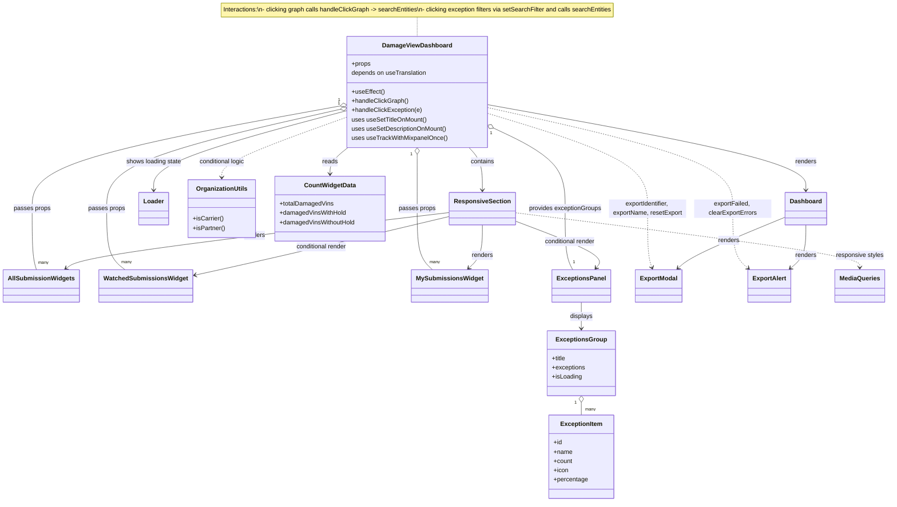

# Diagram: web/portal/src/pages/damageview/dashboard/DamageView.Dashboard.page.js

> Auto-generated by Obscura crawlers

## Mermaid

### SVG

<svg id="container" width="2262.46875" xmlns="http://www.w3.org/2000/svg" class="classDiagram" height="1298" viewBox="0 0 2262.46875 1298" role="graphics-document document" aria-roledescription="class"><g><defs><marker id="container_class-aggregationStart" class="marker aggregation class" refX="18" refY="7" markerWidth="190" markerHeight="240" orient="auto"><path d="M 18,7 L9,13 L1,7 L9,1 Z"></path></marker></defs><defs><marker id="container_class-aggregationEnd" class="marker aggregation class" refX="1" refY="7" markerWidth="20" markerHeight="28" orient="auto"><path d="M 18,7 L9,13 L1,7 L9,1 Z"></path></marker></defs><defs><marker id="container_class-extensionStart" class="marker extension class" refX="18" refY="7" markerWidth="190" markerHeight="240" orient="auto"><path d="M 1,7 L18,13 V 1 Z"></path></marker></defs><defs><marker id="container_class-extensionEnd" class="marker extension class" refX="1" refY="7" markerWidth="20" markerHeight="28" orient="auto"><path d="M 1,1 V 13 L18,7 Z"></path></marker></defs><defs><marker id="container_class-compositionStart" class="marker composition class" refX="18" refY="7" markerWidth="190" markerHeight="240" orient="auto"><path d="M 18,7 L9,13 L1,7 L9,1 Z"></path></marker></defs><defs><marker id="container_class-compositionEnd" class="marker composition class" refX="1" refY="7" markerWidth="20" markerHeight="28" orient="auto"><path d="M 18,7 L9,13 L1,7 L9,1 Z"></path></marker></defs><defs><marker id="container_class-dependencyStart" class="marker dependency class" refX="6" refY="7" markerWidth="190" markerHeight="240" orient="auto"><path d="M 5,7 L9,13 L1,7 L9,1 Z"></path></marker></defs><defs><marker id="container_class-dependencyEnd" class="marker dependency class" refX="13" refY="7" markerWidth="20" markerHeight="28" orient="auto"><path d="M 18,7 L9,13 L14,7 L9,1 Z"></path></marker></defs><defs><marker id="container_class-lollipopStart" class="marker lollipop class" refX="13" refY="7" markerWidth="190" markerHeight="240" orient="auto"><circle stroke="black" fill="transparent" cx="7" cy="7" r="6"></circle></marker></defs><defs><marker id="container_class-lollipopEnd" class="marker lollipop class" refX="1" refY="7" markerWidth="190" markerHeight="240" orient="auto"><circle stroke="black" fill="transparent" cx="7" cy="7" r="6"></circle></marker></defs><g class="root"><g class="clusters"></g><g class="edgePaths"><path d="M1058.707,44L1058.707,48.167C1058.707,52.333,1058.707,60.667,1058.707,69C1058.707,77.333,1058.707,85.667,1058.707,89.833L1058.707,94" id="edgeNote1" class="edge-thickness-normal edge-pattern-dotted relation" style="fill: none;;;fill: none" data-edge="true" data-et="edge" data-id="edgeNote1" data-points="W3sieCI6MTA1OC43MDcwMzEyNSwieSI6NDR9LHsieCI6MTA1OC43MDcwMzEyNSwieSI6Njl9LHsieCI6MTA1OC43MDcwMzEyNSwieSI6OTR9XQ=="></path><path d="M1236.828,270.396L1373.006,295.163C1509.184,319.931,1781.539,369.465,1917.717,406.399C2053.895,443.333,2053.895,467.667,2053.895,479.833L2053.895,492" id="id_DamageViewDashboard_Dashboard_1" class="edge-thickness-normal edge-pattern-solid relation" style=";;;" data-edge="true" data-et="edge" data-id="id_DamageViewDashboard_Dashboard_1" data-points="W3sieCI6MTIzNi44MjgxMjUsInkiOjI3MC4zOTU4MjI4NjYyOTQwNX0seyJ4IjoyMDUzLjg5NDUzMTI1LCJ5Ijo0MTl9LHsieCI6MjA1My44OTQ1MzEyNSwieSI6NDk4fV0=" marker-end="url(#container_class-dependencyEnd)"></path><path d="M1188.791,382L1194.361,388.167C1199.932,394.333,1211.073,406.667,1216.644,425C1222.215,443.333,1222.215,467.667,1222.215,479.833L1222.215,492" id="id_DamageViewDashboard_ResponsiveSection_2" class="edge-thickness-normal edge-pattern-solid relation" style=";;;" data-edge="true" data-et="edge" data-id="id_DamageViewDashboard_ResponsiveSection_2" data-points="W3sieCI6MTE4OC43OTA1OTQ3ODU5MTE3LCJ5IjozODJ9LHsieCI6MTIyMi4yMTQ4NDM3NSwieSI6NDE5fSx7IngiOjEyMjIuMjE0ODQzNzUsInkiOjQ5OH1d" marker-end="url(#container_class-dependencyEnd)"></path><path d="M880.586,285.729L797.692,307.94C714.798,330.152,549.01,374.576,466.117,408.955C383.223,443.333,383.223,467.667,383.223,479.833L383.223,492" id="id_DamageViewDashboard_Loader_3" class="edge-thickness-normal edge-pattern-solid relation" style=";;;" data-edge="true" data-et="edge" data-id="id_DamageViewDashboard_Loader_3" data-points="W3sieCI6ODgwLjU4NTkzNzUsInkiOjI4NS43Mjg1OTE3NTEyODk1N30seyJ4IjozODMuMjIyNjU2MjUsInkiOjQxOX0seyJ4IjozODMuMjIyNjU2MjUsInkiOjQ5OH1d" marker-end="url(#container_class-dependencyEnd)"></path><path d="M2053.895,582L2053.895,595.167C2053.895,608.333,2053.895,634.667,2047.381,653.353C2040.867,672.04,2027.84,683.081,2021.326,688.601L2014.812,694.121" id="id_Dashboard_ExportAlert_4" class="edge-thickness-normal edge-pattern-solid relation" style=";;;" data-edge="true" data-et="edge" data-id="id_Dashboard_ExportAlert_4" data-points="W3sieCI6MjA1My44OTQ1MzEyNSwieSI6NTgyfSx7IngiOjIwNTMuODk0NTMxMjUsInkiOjY2MX0seyJ4IjoyMDEwLjIzNTExNjY5MzAzOCwieSI6Njk4fV0=" marker-end="url(#container_class-dependencyEnd)"></path><path d="M2002.457,561.189L1962.074,577.824C1921.69,594.459,1840.923,627.73,1794.554,649.855C1748.184,671.981,1736.213,682.963,1730.227,688.453L1724.241,693.944" id="id_Dashboard_ExportModal_5" class="edge-thickness-normal edge-pattern-solid relation" style=";;;" data-edge="true" data-et="edge" data-id="id_Dashboard_ExportModal_5" data-points="W3sieCI6MjAwMi40NTcwMzEyNSwieSI6NTYxLjE4ODcxNzYzNTAxMn0seyJ4IjoxNzYwLjE1NjI1LCJ5Ijo2NjF9LHsieCI6MTcxOS44MTkyMjQ2ODM1NDQyLCJ5Ijo2OTh9XQ==" marker-end="url(#container_class-dependencyEnd)"></path><path d="M1141.02,549.671L985.232,568.226C829.444,586.78,517.868,623.89,354.667,648.011C191.465,672.133,176.637,683.265,169.224,688.831L161.81,694.398" id="id_ResponsiveSection_AllSubmissionWidgets_6" class="edge-thickness-normal edge-pattern-solid relation" style=";;;" data-edge="true" data-et="edge" data-id="id_ResponsiveSection_AllSubmissionWidgets_6" data-points="W3sieCI6MTE0MS4wMTk1MzEyNSwieSI6NTQ5LjY3MDY1NzgwNzcxNzd9LHsieCI6MjA2LjI5Mjk2ODc1LCJ5Ijo2NjF9LHsieCI6MTU3LjAxMTQ3MTUxODk4NzM1LCJ5Ijo2OTh9XQ==" marker-end="url(#container_class-dependencyEnd)"></path><path d="M1141.02,559.297L1069.699,576.248C998.379,593.198,855.738,627.099,745.609,652.714C635.481,678.33,557.864,695.659,519.055,704.324L480.246,712.989" id="id_ResponsiveSection_WatchedSubmissionsWidget_7" class="edge-thickness-normal edge-pattern-solid relation" style=";;;" data-edge="true" data-et="edge" data-id="id_ResponsiveSection_WatchedSubmissionsWidget_7" data-points="W3sieCI6MTE0MS4wMTk1MzEyNSwieSI6NTU5LjI5NzM4OTc4MzE3MjR9LHsieCI6NzEzLjA5NzY1NjI1LCJ5Ijo2NjF9LHsieCI6NDc0LjM5MDYyNSwieSI6NzE0LjI5NjA2NjUwNDAxM31d" marker-end="url(#container_class-dependencyEnd)"></path><path d="M1222.215,582L1222.215,595.167C1222.215,608.333,1222.215,634.667,1216.552,653.305C1210.89,671.944,1199.565,682.887,1193.902,688.359L1188.24,693.831" id="id_ResponsiveSection_MySubmissionsWidget_8" class="edge-thickness-normal edge-pattern-solid relation" style=";;;" data-edge="true" data-et="edge" data-id="id_ResponsiveSection_MySubmissionsWidget_8" data-points="W3sieCI6MTIyMi4yMTQ4NDM3NSwieSI6NTgyfSx7IngiOjEyMjIuMjE0ODQzNzUsInkiOjY2MX0seyJ4IjoxMTgzLjkyNTAzOTU1Njk2MiwieSI6Njk4fV0=" marker-end="url(#container_class-dependencyEnd)"></path><path d="M1303.41,570.897L1342.874,585.914C1382.339,600.931,1461.267,630.966,1496.398,651.37C1531.529,671.775,1522.862,682.55,1518.529,687.937L1514.195,693.325" id="id_ResponsiveSection_ExceptionsPanel_9" class="edge-thickness-normal edge-pattern-solid relation" style=";;;" data-edge="true" data-et="edge" data-id="id_ResponsiveSection_ExceptionsPanel_9" data-points="W3sieCI6MTMwMy40MTAxNTYyNSwieSI6NTcwLjg5Njk2OTM5OTE2MjJ9LHsieCI6MTU0MC4xOTUzMTI1LCJ5Ijo2NjF9LHsieCI6MTUxMC40MzQ2ODE1NjY0NTU4LCJ5Ijo2OTh9XQ==" marker-end="url(#container_class-dependencyEnd)"></path><path d="M863.622,273.976L732.551,298.146C601.48,322.317,339.338,370.659,208.266,414.996C77.195,459.333,77.195,499.667,77.195,540C77.195,580.333,77.195,620.667,79.059,647C80.923,673.333,84.65,685.667,86.514,691.833L88.377,698" id="id_DamageViewDashboard_AllSubmissionWidgets_10" class="edge-thickness-normal edge-pattern-solid relation" style=";;;" data-edge="true" data-et="edge" data-id="id_DamageViewDashboard_AllSubmissionWidgets_10" data-points="W3sieCI6ODgwLjU4NTkzNzUsInkiOjI3MC44NDcyMDYzNTgxNzY4fSx7IngiOjc3LjE5NTMxMjUsInkiOjQxOX0seyJ4Ijo3Ny4xOTUzMTI1LCJ5Ijo1NDB9LHsieCI6NzcuMTk1MzEyNSwieSI6NjYxfSx7IngiOjg4LjM3NzI3NDUyNTMxNjQ1LCJ5Ijo2OTh9XQ==" marker-start="url(#container_class-aggregationStart)"></path><path d="M863.766,282.377L763.739,305.148C663.713,327.918,463.659,373.459,363.632,416.396C263.605,459.333,263.605,499.667,263.605,540C263.605,580.333,263.605,620.667,271.073,647C278.54,673.333,293.474,685.667,300.941,691.833L308.408,698" id="id_DamageViewDashboard_WatchedSubmissionsWidget_11" class="edge-thickness-normal edge-pattern-solid relation" style=";;;" data-edge="true" data-et="edge" data-id="id_DamageViewDashboard_WatchedSubmissionsWidget_11" data-points="W3sieCI6ODgwLjU4NTkzNzUsInkiOjI3OC41NDgxNzU4NDIzMTU3NH0seyJ4IjoyNjMuNjA1NDY4NzUsInkiOjQxOX0seyJ4IjoyNjMuNjA1NDY4NzUsInkiOjU0MH0seyJ4IjoyNjMuNjA1NDY4NzUsInkiOjY2MX0seyJ4IjozMDguNDA4MzI2NzQwNTA2MywieSI6Njk4fV0=" marker-start="url(#container_class-aggregationStart)"></path><path d="M1058.707,399.25L1058.707,402.542C1058.707,405.833,1058.707,412.417,1058.707,435.875C1058.707,459.333,1058.707,499.667,1058.707,540C1058.707,580.333,1058.707,620.667,1065.089,647C1071.47,673.333,1084.234,685.667,1090.615,691.833L1096.997,698" id="id_DamageViewDashboard_MySubmissionsWidget_12" class="edge-thickness-normal edge-pattern-solid relation" style=";;;" data-edge="true" data-et="edge" data-id="id_DamageViewDashboard_MySubmissionsWidget_12" data-points="W3sieCI6MTA1OC43MDcwMzEyNSwieSI6MzgyfSx7IngiOjEwNTguNzA3MDMxMjUsInkiOjQxOX0seyJ4IjoxMDU4LjcwNzAzMTI1LCJ5Ijo1NDB9LHsieCI6MTA1OC43MDcwMzEyNSwieSI6NjYxfSx7IngiOjEwOTYuOTk2ODM1NDQzMDM4LCJ5Ijo2OTh9XQ==" marker-start="url(#container_class-aggregationStart)"></path><path d="M1252.357,331.662L1282.453,346.218C1312.549,360.774,1372.741,389.887,1402.838,424.61C1432.934,459.333,1432.934,499.667,1432.934,540C1432.934,580.333,1432.934,620.667,1436.346,647C1439.759,673.333,1446.584,685.667,1449.997,691.833L1453.409,698" id="id_DamageViewDashboard_ExceptionsPanel_13" class="edge-thickness-normal edge-pattern-solid relation" style=";;;" data-edge="true" data-et="edge" data-id="id_DamageViewDashboard_ExceptionsPanel_13" data-points="W3sieCI6MTIzNi44MjgxMjUsInkiOjMyNC4xNTA4MDA2MDk1OTA2NX0seyJ4IjoxNDMyLjkzMzU5Mzc1LCJ5Ijo0MTl9LHsieCI6MTQzMi45MzM1OTM3NSwieSI6NTQwfSx7IngiOjE0MzIuOTMzNTkzNzUsInkiOjY2MX0seyJ4IjoxNDUzLjQwOTQ2NDAwMzE2NDcsInkiOjY5OH1d" marker-start="url(#container_class-aggregationStart)"></path><path d="M1236.828,292.76L1305.266,313.8C1373.704,334.84,1510.581,376.92,1579.019,418.127C1647.457,459.333,1647.457,499.667,1647.457,540C1647.457,580.333,1647.457,620.667,1649.213,646.052C1650.968,671.438,1654.479,681.875,1656.235,687.094L1657.99,692.313" id="id_DamageViewDashboard_ExportModal_14" class="edge-thickness-normal edge-pattern-dashed relation" style=";;;" data-edge="true" data-et="edge" data-id="id_DamageViewDashboard_ExportModal_14" data-points="W3sieCI6MTIzNi44MjgxMjUsInkiOjI5Mi43NTk5NDU1OTQ0Nzk4Nn0seyJ4IjoxNjQ3LjQ1NzAzMTI1LCJ5Ijo0MTl9LHsieCI6MTY0Ny40NTcwMzEyNSwieSI6NTQwfSx7IngiOjE2NDcuNDU3MDMxMjUsInkiOjY2MX0seyJ4IjoxNjU5LjkwMzE4NDMzNTQ0MywieSI6Njk4fV0=" marker-end="url(#container_class-dependencyEnd)"></path><path d="M1236.828,277.864L1341.933,301.387C1447.038,324.909,1657.247,371.955,1762.352,415.644C1867.457,459.333,1867.457,499.667,1867.457,540C1867.457,580.333,1867.457,620.667,1873.971,646.353C1880.484,672.04,1893.512,683.081,1900.025,688.601L1906.539,694.121" id="id_DamageViewDashboard_ExportAlert_15" class="edge-thickness-normal edge-pattern-dashed relation" style=";;;" data-edge="true" data-et="edge" data-id="id_DamageViewDashboard_ExportAlert_15" data-points="W3sieCI6MTIzNi44MjgxMjUsInkiOjI3Ny44NjM4ODYyMDU1NjQxNH0seyJ4IjoxODY3LjQ1NzAzMTI1LCJ5Ijo0MTl9LHsieCI6MTg2Ny40NTcwMzEyNSwieSI6NTQwfSx7IngiOjE4NjcuNDU3MDMxMjUsInkiOjY2MX0seyJ4IjoxOTExLjExNjQ0NTgwNjk2MiwieSI6Njk4fV0=" marker-end="url(#container_class-dependencyEnd)"></path><path d="M1476.652,782L1476.652,788.167C1476.652,794.333,1476.652,806.667,1476.652,818C1476.652,829.333,1476.652,839.667,1476.652,844.833L1476.652,850" id="id_ExceptionsPanel_ExceptionsGroup_16" class="edge-thickness-normal edge-pattern-solid relation" style=";;;" data-edge="true" data-et="edge" data-id="id_ExceptionsPanel_ExceptionsGroup_16" data-points="W3sieCI6MTQ3Ni42NTIzNDM3NSwieSI6NzgyfSx7IngiOjE0NzYuNjUyMzQzNzUsInkiOjgxOX0seyJ4IjoxNDc2LjY1MjM0Mzc1LCJ5Ijo4NTZ9XQ==" marker-end="url(#container_class-dependencyEnd)"></path><path d="M1476.652,1041.25L1476.652,1042.542C1476.652,1043.833,1476.652,1046.417,1476.652,1051.875C1476.652,1057.333,1476.652,1065.667,1476.652,1069.833L1476.652,1074" id="id_ExceptionsGroup_ExceptionItem_17" class="edge-thickness-normal edge-pattern-solid relation" style=";;;" data-edge="true" data-et="edge" data-id="id_ExceptionsGroup_ExceptionItem_17" data-points="W3sieCI6MTQ3Ni42NTIzNDM3NSwieSI6MTAyNH0seyJ4IjoxNDc2LjY1MjM0Mzc1LCJ5IjoxMDQ5fSx7IngiOjE0NzYuNjUyMzQzNzUsInkiOjEwNzR9XQ==" marker-start="url(#container_class-aggregationStart)"></path><path d="M880.586,302.147L826.507,321.623C772.428,341.098,664.271,380.049,610.192,406.191C556.113,432.333,556.113,445.667,556.113,452.333L556.113,459" id="id_DamageViewDashboard_OrganizationUtils_18" class="edge-thickness-normal edge-pattern-dashed relation" style=";;;" data-edge="true" data-et="edge" data-id="id_DamageViewDashboard_OrganizationUtils_18" data-points="W3sieCI6ODgwLjU4NTkzNzUsInkiOjMwMi4xNDcwNzI5OTYzMzE1M30seyJ4Ijo1NTYuMTEzMjgxMjUsInkiOjQxOX0seyJ4Ijo1NTYuMTEzMjgxMjUsInkiOjQ2NX1d" marker-end="url(#container_class-dependencyEnd)"></path><path d="M880.586,381.505L872.829,387.754C865.073,394.004,849.56,406.502,841.803,417.918C834.047,429.333,834.047,439.667,834.047,444.833L834.047,450" id="id_DamageViewDashboard_CountWidgetData_19" class="edge-thickness-normal edge-pattern-solid relation" style=";;;" data-edge="true" data-et="edge" data-id="id_DamageViewDashboard_CountWidgetData_19" data-points="W3sieCI6ODgwLjU4NTkzNzUsInkiOjM4MS41MDUyNzcwNjc3OTM0fSx7IngiOjgzNC4wNDY4NzUsInkiOjQxOX0seyJ4Ijo4MzQuMDQ2ODc1LCJ5Ijo0NTZ9XQ==" marker-end="url(#container_class-dependencyEnd)"></path><path d="M1303.41,550.13L1451.519,568.608C1599.628,587.087,1895.845,624.043,2043.954,647.688C2192.063,671.333,2192.063,681.667,2192.063,686.833L2192.063,692" id="id_ResponsiveSection_MediaQueries_20" class="edge-thickness-normal edge-pattern-dashed relation" style=";;;" data-edge="true" data-et="edge" data-id="id_ResponsiveSection_MediaQueries_20" data-points="W3sieCI6MTMwMy40MTAxNTYyNSwieSI6NTUwLjEzMDA3ODQxOTIxMDV9LHsieCI6MjE5Mi4wNjI1LCJ5Ijo2NjF9LHsieCI6MjE5Mi4wNjI1LCJ5Ijo2OTh9XQ==" marker-end="url(#container_class-dependencyEnd)"></path></g><g class="edgeLabels"><g class="edgeLabel"><g class="label" data-id="edgeNote1" transform="translate(0, 0)"><foreignObject width="0" height="0">

</foreignObject></g></g><g class="edgeLabel" transform="translate(2053.89453125, 419)"><g class="label" data-id="id_DamageViewDashboard_Dashboard_1" transform="translate(-27.75, -12)"><foreignObject width="55.5" height="24">

renders

</foreignObject></g></g><g class="edgeLabel" transform="translate(1222.21484375, 419)"><g class="label" data-id="id_DamageViewDashboard_ResponsiveSection_2" transform="translate(-30.890625, -12)"><foreignObject width="61.78125" height="24">

contains

</foreignObject></g></g><g class="edgeLabel" transform="translate(383.22265625, 419)"><g class="label" data-id="id_DamageViewDashboard_Loader_3" transform="translate(-71.9921875, -12)"><foreignObject width="143.984375" height="24">

shows loading state

</foreignObject></g></g><g class="edgeLabel" transform="translate(2053.89453125, 661)"><g class="label" data-id="id_Dashboard_ExportAlert_4" transform="translate(-27.75, -12)"><foreignObject width="55.5" height="24">

renders

</foreignObject></g></g><g class="edgeLabel" transform="translate(1856.00134, 621.5184)"><g class="label" data-id="id_Dashboard_ExportModal_5" transform="translate(-27.75, -12)"><foreignObject width="55.5" height="24">

renders

</foreignObject></g></g><g class="edgeLabel" transform="translate(643.0599, 608.97947)"><g class="label" data-id="id_ResponsiveSection_AllSubmissionWidgets_6" transform="translate(-27.75, -12)"><foreignObject width="55.5" height="24">

renders

</foreignObject></g></g><g class="edgeLabel" transform="translate(713.09765625, 661)"><g class="label" data-id="id_ResponsiveSection_WatchedSubmissionsWidget_7" transform="translate(-67.4375, -12)"><foreignObject width="134.875" height="24">

conditional render

</foreignObject></g></g><g class="edgeLabel" transform="translate(1222.21484375, 661)"><g class="label" data-id="id_ResponsiveSection_MySubmissionsWidget_8" transform="translate(-27.75, -12)"><foreignObject width="55.5" height="24">

renders

</foreignObject></g></g><g class="edgeLabel" transform="translate(1443.99231, 624.39221)"><g class="label" data-id="id_ResponsiveSection_ExceptionsPanel_9" transform="translate(-67.4375, -12)"><foreignObject width="134.875" height="24">

conditional render

</foreignObject></g></g><g class="edgeLabel" transform="translate(77.1953125, 540)"><g class="label" data-id="id_DamageViewDashboard_AllSubmissionWidgets_10" transform="translate(-47.3125, -12)"><foreignObject width="94.625" height="24">

passes props

</foreignObject></g></g><g class="edgeLabel" transform="translate(263.60546875, 540)"><g class="label" data-id="id_DamageViewDashboard_WatchedSubmissionsWidget_11" transform="translate(-47.3125, -12)"><foreignObject width="94.625" height="24">

passes props

</foreignObject></g></g><g class="edgeLabel" transform="translate(1058.70703125, 540)"><g class="label" data-id="id_DamageViewDashboard_MySubmissionsWidget_12" transform="translate(-47.3125, -12)"><foreignObject width="94.625" height="24">

passes props

</foreignObject></g></g><g class="edgeLabel" transform="translate(1432.93359375, 540)"><g class="label" data-id="id_DamageViewDashboard_ExceptionsPanel_13" transform="translate(-94.5234375, -12)"><foreignObject width="189.046875" height="24">

provides exceptionGroups

</foreignObject></g></g><g class="edgeLabel" transform="translate(1647.45703125, 540)"><g class="label" data-id="id_DamageViewDashboard_ExportModal_14" transform="translate(-100, -24)"><foreignObject width="200" height="48">

exportIdentifier, exportName, resetExport

</foreignObject></g></g><g class="edgeLabel" transform="translate(1867.45703125, 540)"><g class="label" data-id="id_DamageViewDashboard_ExportAlert_15" transform="translate(-100, -24)"><foreignObject width="200" height="48">

exportFailed, clearExportErrors

</foreignObject></g></g><g class="edgeLabel" transform="translate(1476.65234375, 819)"><g class="label" data-id="id_ExceptionsPanel_ExceptionsGroup_16" transform="translate(-29.6875, -12)"><foreignObject width="59.375" height="24">

displays

</foreignObject></g></g><g class="edgeLabel"><g class="label" data-id="id_ExceptionsGroup_ExceptionItem_17" transform="translate(0, 0)"><foreignObject width="0" height="0">

</foreignObject></g></g><g class="edgeLabel" transform="translate(556.11328125, 419)"><g class="label" data-id="id_DamageViewDashboard_OrganizationUtils_18" transform="translate(-60.5234375, -12)"><foreignObject width="121.046875" height="24">

conditional logic

</foreignObject></g></g><g class="edgeLabel" transform="translate(834.046875, 419)"><g class="label" data-id="id_DamageViewDashboard_CountWidgetData_19" transform="translate(-20.0078125, -12)"><foreignObject width="40.015625" height="24">

reads

</foreignObject></g></g><g class="edgeLabel" transform="translate(2192.0625, 661)"><g class="label" data-id="id_ResponsiveSection_MediaQueries_20" transform="translate(-62.359375, -12)"><foreignObject width="124.71875" height="24">

responsive styles

</foreignObject></g></g><g class="edgeTerminals" transform="translate(860.655845437715, 259.269583213633)"><g class="inner" transform="translate(0, 0)"><foreignObject style="width: 9px; height: 12px;">
1
</foreignObject></g></g><g class="edgeTerminals" transform="translate(860.1930045844715, 267.8067493633365)"><g class="inner" transform="translate(0, 0)"><foreignObject style="width: 9px; height: 12px;">
1
</foreignObject></g></g><g class="edgeTerminals" transform="translate(1043.707030625, 399.49999946428574)"><g class="inner" transform="translate(0, 0)"><foreignObject style="width: 9px; height: 12px;">
1
</foreignObject></g></g><g class="edgeTerminals" transform="translate(1246.051036990467, 345.2739590412919)"><g class="inner" transform="translate(0, 0)"><foreignObject style="width: 9px; height: 12px;">
1
</foreignObject></g></g><g class="edgeTerminals" transform="translate(1461.652341875, 1041.4999983928572)"><g class="inner" transform="translate(0, 0)"><foreignObject style="width: 9px; height: 12px;">
1
</foreignObject></g></g><g class="edgeTerminals" transform="translate(92.67326242587743, 671.9088990080867)"><g class="inner" transform="translate(0, 0)"></g><foreignObject style="width: 36px; height: 12px;">
many
</foreignObject></g><g class="edgeTerminals" transform="translate(299.46638890051355, 670.2907277470629)"><g class="inner" transform="translate(0, 0)"></g><foreignObject style="width: 36px; height: 12px;">
many
</foreignObject></g><g class="edgeTerminals" transform="translate(1089.835696475157, 670.052682428909)"><g class="inner" transform="translate(0, 0)"></g><foreignObject style="width: 36px; height: 12px;">
many
</foreignObject></g><g class="edgeTerminals" transform="translate(1453.0602622234535, 670.4252338758596)"><g class="inner" transform="translate(0, 0)"></g><foreignObject style="width: 9px; height: 12px;">
1
</foreignObject></g><g class="edgeTerminals" transform="translate(1486.652341875, 1051.4999983928572)"><g class="inner" transform="translate(0, 0)"></g><foreignObject style="width: 36px; height: 12px;">
many
</foreignObject></g></g><g class="nodes"><g class="node default" id="classId-DamageViewDashboard-0" transform="translate(1058.70703125, 238)"><g class="basic label-container"><path d="M-178.12109375 -144 L178.12109375 -144 L178.12109375 144 L-178.12109375 144" stroke="none" stroke-width="0" fill="#ECECFF" style=""></path><path d="M-178.12109375 -144 C-84.19179127855443 -144, 9.737511192891134 -144, 178.12109375 -144 M-178.12109375 -144 C-69.2551454868838 -144, 39.61080277623239 -144, 178.12109375 -144 M178.12109375 -144 C178.12109375 -33.66751744116577, 178.12109375 76.66496511766846, 178.12109375 144 M178.12109375 -144 C178.12109375 -65.52530286352747, 178.12109375 12.949394272945057, 178.12109375 144 M178.12109375 144 C82.20254043336035 144, -13.71601288327929 144, -178.12109375 144 M178.12109375 144 C57.999411053730256 144, -62.12227164253949 144, -178.12109375 144 M-178.12109375 144 C-178.12109375 70.28072008988173, -178.12109375 -3.4385598202365486, -178.12109375 -144 M-178.12109375 144 C-178.12109375 45.126050766425436, -178.12109375 -53.74789846714913, -178.12109375 -144" stroke="#9370DB" stroke-width="1.3" fill="none" stroke-dasharray="0 0" style=""></path></g><g class="annotation-group text" transform="translate(0, -120)"></g><g class="label-group text" transform="translate(-85.8828125, -120)"><g class="label" style="font-weight: bolder" transform="translate(0,-12)"><foreignObject width="171.765625" height="24">

DamageViewDashboard

</foreignObject></g></g><g class="members-group text" transform="translate(-166.12109375, -72)"><g class="label" style="" transform="translate(0,-12)"><foreignObject width="49.515625" height="24">

+props

</foreignObject></g><g class="label" style="" transform="translate(0,12)"><foreignObject width="196.921875" height="24">

depends on useTranslation

</foreignObject></g></g><g class="methods-group text" transform="translate(-166.12109375, 0)"><g class="label" style="" transform="translate(0,-12)"><foreignObject width="84.8125" height="24">

+useEffect()

</foreignObject></g><g class="label" style="" transform="translate(0,12)"><foreignObject width="145.84375" height="24">

+handleClickGraph()

</foreignObject></g><g class="label" style="" transform="translate(0,36)"><foreignObject width="182.015625" height="24">

+handleClickException(e)

</foreignObject></g><g class="label" style="" transform="translate(0,60)"><foreignObject width="194.75" height="24">

uses useSetTitleOnMount()

</foreignObject></g><g class="label" style="" transform="translate(0,84)"><foreignObject width="246.359375" height="24">

uses useSetDescriptionOnMount()

</foreignObject></g><g class="label" style="" transform="translate(0,108)"><foreignObject width="245.96875" height="24">

uses useTrackWithMixpanelOnce()

</foreignObject></g></g><g class="divider" style=""><path d="M-178.12109375 -96 C-89.92016895029415 -96, -1.7192441505883096 -96, 178.12109375 -96 M-178.12109375 -96 C-42.681153879485066 -96, 92.75878599102987 -96, 178.12109375 -96" stroke="#9370DB" stroke-width="1.3" fill="none" stroke-dasharray="0 0" style=""></path></g><g class="divider" style=""><path d="M-178.12109375 -24 C-70.33437451090701 -24, 37.45234472818598 -24, 178.12109375 -24 M-178.12109375 -24 C-54.34151991562136 -24, 69.43805391875728 -24, 178.12109375 -24" stroke="#9370DB" stroke-width="1.3" fill="none" stroke-dasharray="0 0" style=""></path></g></g><g class="node default" id="classId-AllSubmissionWidgets-1" transform="translate(101.0703125, 740)"><g class="basic label-container"><path d="M-93.0703125 -42 L93.0703125 -42 L93.0703125 42 L-93.0703125 42" stroke="none" stroke-width="0" fill="#ECECFF" style=""></path><path d="M-93.0703125 -42 C-35.596576260582296 -42, 21.877159978835408 -42, 93.0703125 -42 M-93.0703125 -42 C-46.41421788995076 -42, 0.2418767200984746 -42, 93.0703125 -42 M93.0703125 -42 C93.0703125 -8.696386271450486, 93.0703125 24.60722745709903, 93.0703125 42 M93.0703125 -42 C93.0703125 -8.706015753137322, 93.0703125 24.587968493725356, 93.0703125 42 M93.0703125 42 C25.888777919925005 42, -41.29275666014999 42, -93.0703125 42 M93.0703125 42 C30.51212465611964 42, -32.04606318776072 42, -93.0703125 42 M-93.0703125 42 C-93.0703125 22.8674498169587, -93.0703125 3.7348996339174008, -93.0703125 -42 M-93.0703125 42 C-93.0703125 20.383336138368197, -93.0703125 -1.2333277232636064, -93.0703125 -42" stroke="#9370DB" stroke-width="1.3" fill="none" stroke-dasharray="0 0" style=""></path></g><g class="annotation-group text" transform="translate(0, -18)"></g><g class="label-group text" transform="translate(-81.0703125, -18)"><g class="label" style="font-weight: bolder" transform="translate(0,-12)"><foreignObject width="162.140625" height="24">

AllSubmissionWidgets

</foreignObject></g></g><g class="members-group text" transform="translate(-81.0703125, 30)"></g><g class="methods-group text" transform="translate(-81.0703125, 60)"></g><g class="divider" style=""><path d="M-93.0703125 6 C-46.597293021355675 6, -0.12427354271135016 6, 93.0703125 6 M-93.0703125 6 C-48.097500323717185 6, -3.1246881474343695 6, 93.0703125 6" stroke="#9370DB" stroke-width="1.3" fill="none" stroke-dasharray="0 0" style=""></path></g><g class="divider" style=""><path d="M-93.0703125 24 C-26.936402443134142 24, 39.197507613731716 24, 93.0703125 24 M-93.0703125 24 C-28.796002252233322 24, 35.478307995533356 24, 93.0703125 24" stroke="#9370DB" stroke-width="1.3" fill="none" stroke-dasharray="0 0" style=""></path></g></g><g class="node default" id="classId-WatchedSubmissionsWidget-2" transform="translate(359.265625, 740)"><g class="basic label-container"><path d="M-115.125 -42 L115.125 -42 L115.125 42 L-115.125 42" stroke="none" stroke-width="0" fill="#ECECFF" style=""></path><path d="M-115.125 -42 C-43.765761555291945 -42, 27.59347688941611 -42, 115.125 -42 M-115.125 -42 C-43.27147125264055 -42, 28.582057494718896 -42, 115.125 -42 M115.125 -42 C115.125 -15.406652702616668, 115.125 11.186694594766664, 115.125 42 M115.125 -42 C115.125 -13.035345028698387, 115.125 15.929309942603226, 115.125 42 M115.125 42 C59.52459339886115 42, 3.9241867977222995 42, -115.125 42 M115.125 42 C55.72102721887289 42, -3.6829455622542184 42, -115.125 42 M-115.125 42 C-115.125 10.492692942887604, -115.125 -21.01461411422479, -115.125 -42 M-115.125 42 C-115.125 14.680445346416448, -115.125 -12.639109307167104, -115.125 -42" stroke="#9370DB" stroke-width="1.3" fill="none" stroke-dasharray="0 0" style=""></path></g><g class="annotation-group text" transform="translate(0, -18)"></g><g class="label-group text" transform="translate(-103.125, -18)"><g class="label" style="font-weight: bolder" transform="translate(0,-12)"><foreignObject width="206.25" height="24">

WatchedSubmissionsWidget

</foreignObject></g></g><g class="members-group text" transform="translate(-103.125, 30)"></g><g class="methods-group text" transform="translate(-103.125, 60)"></g><g class="divider" style=""><path d="M-115.125 6 C-33.43780322182903 6, 48.24939355634194 6, 115.125 6 M-115.125 6 C-64.71164795229463 6, -14.298295904589253 6, 115.125 6" stroke="#9370DB" stroke-width="1.3" fill="none" stroke-dasharray="0 0" style=""></path></g><g class="divider" style=""><path d="M-115.125 24 C-32.45299165769026 24, 50.219016684619476 24, 115.125 24 M-115.125 24 C-29.295597813452247 24, 56.533804373095506 24, 115.125 24" stroke="#9370DB" stroke-width="1.3" fill="none" stroke-dasharray="0 0" style=""></path></g></g><g class="node default" id="classId-MySubmissionsWidget-3" transform="translate(1140.4609375, 740)"><g class="basic label-container"><path d="M-94.03125 -42 L94.03125 -42 L94.03125 42 L-94.03125 42" stroke="none" stroke-width="0" fill="#ECECFF" style=""></path><path d="M-94.03125 -42 C-44.65538442719923 -42, 4.720481145601539 -42, 94.03125 -42 M-94.03125 -42 C-51.25906331847839 -42, -8.48687663695678 -42, 94.03125 -42 M94.03125 -42 C94.03125 -18.211939588031377, 94.03125 5.576120823937245, 94.03125 42 M94.03125 -42 C94.03125 -9.396843925002074, 94.03125 23.206312149995853, 94.03125 42 M94.03125 42 C39.17365637364909 42, -15.683937252701824 42, -94.03125 42 M94.03125 42 C45.58021560927826 42, -2.870818781443475 42, -94.03125 42 M-94.03125 42 C-94.03125 10.753235102035987, -94.03125 -20.493529795928026, -94.03125 -42 M-94.03125 42 C-94.03125 23.143147252968433, -94.03125 4.286294505936866, -94.03125 -42" stroke="#9370DB" stroke-width="1.3" fill="none" stroke-dasharray="0 0" style=""></path></g><g class="annotation-group text" transform="translate(0, -18)"></g><g class="label-group text" transform="translate(-82.03125, -18)"><g class="label" style="font-weight: bolder" transform="translate(0,-12)"><foreignObject width="164.0625" height="24">

MySubmissionsWidget

</foreignObject></g></g><g class="members-group text" transform="translate(-82.03125, 30)"></g><g class="methods-group text" transform="translate(-82.03125, 60)"></g><g class="divider" style=""><path d="M-94.03125 6 C-21.52437283551818 6, 50.98250432896364 6, 94.03125 6 M-94.03125 6 C-30.012258316626742 6, 34.006733366746516 6, 94.03125 6" stroke="#9370DB" stroke-width="1.3" fill="none" stroke-dasharray="0 0" style=""></path></g><g class="divider" style=""><path d="M-94.03125 24 C-46.35850816191834 24, 1.314233676163326 24, 94.03125 24 M-94.03125 24 C-50.662080824934314 24, -7.292911649868628 24, 94.03125 24" stroke="#9370DB" stroke-width="1.3" fill="none" stroke-dasharray="0 0" style=""></path></g></g><g class="node default" id="classId-Dashboard-4" transform="translate(2053.89453125, 540)"><g class="basic label-container"><path d="M-51.4375 -42 L51.4375 -42 L51.4375 42 L-51.4375 42" stroke="none" stroke-width="0" fill="#ECECFF" style=""></path><path d="M-51.4375 -42 C-30.422465055597392 -42, -9.407430111194785 -42, 51.4375 -42 M-51.4375 -42 C-25.548256392135364 -42, 0.34098721572927104 -42, 51.4375 -42 M51.4375 -42 C51.4375 -19.41263108327433, 51.4375 3.1747378334513385, 51.4375 42 M51.4375 -42 C51.4375 -14.477323664218606, 51.4375 13.045352671562789, 51.4375 42 M51.4375 42 C24.888662571526673 42, -1.6601748569466537 42, -51.4375 42 M51.4375 42 C24.784953943030878 42, -1.8675921139382439 42, -51.4375 42 M-51.4375 42 C-51.4375 12.734578731032052, -51.4375 -16.530842537935897, -51.4375 -42 M-51.4375 42 C-51.4375 10.358799801611948, -51.4375 -21.282400396776104, -51.4375 -42" stroke="#9370DB" stroke-width="1.3" fill="none" stroke-dasharray="0 0" style=""></path></g><g class="annotation-group text" transform="translate(0, -18)"></g><g class="label-group text" transform="translate(-39.4375, -18)"><g class="label" style="font-weight: bolder" transform="translate(0,-12)"><foreignObject width="78.875" height="24">

Dashboard

</foreignObject></g></g><g class="members-group text" transform="translate(-39.4375, 30)"></g><g class="methods-group text" transform="translate(-39.4375, 60)"></g><g class="divider" style=""><path d="M-51.4375 6 C-10.352271971225171 6, 30.732956057549657 6, 51.4375 6 M-51.4375 6 C-13.714965086700516 6, 24.007569826598967 6, 51.4375 6" stroke="#9370DB" stroke-width="1.3" fill="none" stroke-dasharray="0 0" style=""></path></g><g class="divider" style=""><path d="M-51.4375 24 C-17.41213063427159 24, 16.613238731456818 24, 51.4375 24 M-51.4375 24 C-11.546699863620809 24, 28.344100272758382 24, 51.4375 24" stroke="#9370DB" stroke-width="1.3" fill="none" stroke-dasharray="0 0" style=""></path></g></g><g class="node default" id="classId-ExceptionsPanel-5" transform="translate(1476.65234375, 740)"><g class="basic label-container"><path d="M-71.7421875 -42 L71.7421875 -42 L71.7421875 42 L-71.7421875 42" stroke="none" stroke-width="0" fill="#ECECFF" style=""></path><path d="M-71.7421875 -42 C-35.77691226037383 -42, 0.18836297925234646 -42, 71.7421875 -42 M-71.7421875 -42 C-25.649733949628278 -42, 20.442719600743445 -42, 71.7421875 -42 M71.7421875 -42 C71.7421875 -18.211704111072937, 71.7421875 5.5765917778541265, 71.7421875 42 M71.7421875 -42 C71.7421875 -21.957323858156844, 71.7421875 -1.914647716313688, 71.7421875 42 M71.7421875 42 C16.530532564161966 42, -38.68112237167607 42, -71.7421875 42 M71.7421875 42 C26.788621887097555 42, -18.16494372580489 42, -71.7421875 42 M-71.7421875 42 C-71.7421875 16.973423171555456, -71.7421875 -8.053153656889087, -71.7421875 -42 M-71.7421875 42 C-71.7421875 10.258269030534223, -71.7421875 -21.483461938931555, -71.7421875 -42" stroke="#9370DB" stroke-width="1.3" fill="none" stroke-dasharray="0 0" style=""></path></g><g class="annotation-group text" transform="translate(0, -18)"></g><g class="label-group text" transform="translate(-59.7421875, -18)"><g class="label" style="font-weight: bolder" transform="translate(0,-12)"><foreignObject width="119.484375" height="24">

ExceptionsPanel

</foreignObject></g></g><g class="members-group text" transform="translate(-59.7421875, 30)"></g><g class="methods-group text" transform="translate(-59.7421875, 60)"></g><g class="divider" style=""><path d="M-71.7421875 6 C-19.60900814996137 6, 32.52417120007726 6, 71.7421875 6 M-71.7421875 6 C-15.912389285541579 6, 39.91740892891684 6, 71.7421875 6" stroke="#9370DB" stroke-width="1.3" fill="none" stroke-dasharray="0 0" style=""></path></g><g class="divider" style=""><path d="M-71.7421875 24 C-29.64732267577174 24, 12.44754214845652 24, 71.7421875 24 M-71.7421875 24 C-23.97767974033743 24, 23.786828019325142 24, 71.7421875 24" stroke="#9370DB" stroke-width="1.3" fill="none" stroke-dasharray="0 0" style=""></path></g></g><g class="node default" id="classId-ExportModal-6" transform="translate(1674.03125, 740)"><g class="basic label-container"><path d="M-58.4921875 -42 L58.4921875 -42 L58.4921875 42 L-58.4921875 42" stroke="none" stroke-width="0" fill="#ECECFF" style=""></path><path d="M-58.4921875 -42 C-22.158547424333626 -42, 14.175092651332747 -42, 58.4921875 -42 M-58.4921875 -42 C-14.810155217148754 -42, 28.871877065702492 -42, 58.4921875 -42 M58.4921875 -42 C58.4921875 -22.01276202445094, 58.4921875 -2.025524048901879, 58.4921875 42 M58.4921875 -42 C58.4921875 -13.790101309070561, 58.4921875 14.419797381858878, 58.4921875 42 M58.4921875 42 C25.839862634315097 42, -6.812462231369807 42, -58.4921875 42 M58.4921875 42 C32.48306292020371 42, 6.473938340407408 42, -58.4921875 42 M-58.4921875 42 C-58.4921875 19.706874368847775, -58.4921875 -2.586251262304451, -58.4921875 -42 M-58.4921875 42 C-58.4921875 17.346574347733032, -58.4921875 -7.306851304533936, -58.4921875 -42" stroke="#9370DB" stroke-width="1.3" fill="none" stroke-dasharray="0 0" style=""></path></g><g class="annotation-group text" transform="translate(0, -18)"></g><g class="label-group text" transform="translate(-46.4921875, -18)"><g class="label" style="font-weight: bolder" transform="translate(0,-12)"><foreignObject width="92.984375" height="24">

ExportModal

</foreignObject></g></g><g class="members-group text" transform="translate(-46.4921875, 30)"></g><g class="methods-group text" transform="translate(-46.4921875, 60)"></g><g class="divider" style=""><path d="M-58.4921875 6 C-19.82647586837726 6, 18.839235763245483 6, 58.4921875 6 M-58.4921875 6 C-29.895223966039254 6, -1.2982604320785072 6, 58.4921875 6" stroke="#9370DB" stroke-width="1.3" fill="none" stroke-dasharray="0 0" style=""></path></g><g class="divider" style=""><path d="M-58.4921875 24 C-21.58612780678645 24, 15.3199318864271 24, 58.4921875 24 M-58.4921875 24 C-33.68797668479044 24, -8.883765869580884 24, 58.4921875 24" stroke="#9370DB" stroke-width="1.3" fill="none" stroke-dasharray="0 0" style=""></path></g></g><g class="node default" id="classId-ExportAlert-7" transform="translate(1960.67578125, 740)"><g class="basic label-container"><path d="M-53.8203125 -42 L53.8203125 -42 L53.8203125 42 L-53.8203125 42" stroke="none" stroke-width="0" fill="#ECECFF" style=""></path><path d="M-53.8203125 -42 C-13.737653039635084 -42, 26.34500642072983 -42, 53.8203125 -42 M-53.8203125 -42 C-26.956068270910514 -42, -0.09182404182102744 -42, 53.8203125 -42 M53.8203125 -42 C53.8203125 -17.94799950774005, 53.8203125 6.1040009845198995, 53.8203125 42 M53.8203125 -42 C53.8203125 -11.542919111021384, 53.8203125 18.914161777957233, 53.8203125 42 M53.8203125 42 C12.165768205197288 42, -29.488776089605423 42, -53.8203125 42 M53.8203125 42 C14.387770319592398 42, -25.044771860815203 42, -53.8203125 42 M-53.8203125 42 C-53.8203125 14.520694428002365, -53.8203125 -12.95861114399527, -53.8203125 -42 M-53.8203125 42 C-53.8203125 10.597729444889556, -53.8203125 -20.80454111022089, -53.8203125 -42" stroke="#9370DB" stroke-width="1.3" fill="none" stroke-dasharray="0 0" style=""></path></g><g class="annotation-group text" transform="translate(0, -18)"></g><g class="label-group text" transform="translate(-41.8203125, -18)"><g class="label" style="font-weight: bolder" transform="translate(0,-12)"><foreignObject width="83.640625" height="24">

ExportAlert

</foreignObject></g></g><g class="members-group text" transform="translate(-41.8203125, 30)"></g><g class="methods-group text" transform="translate(-41.8203125, 60)"></g><g class="divider" style=""><path d="M-53.8203125 6 C-15.392728760938063 6, 23.034854978123875 6, 53.8203125 6 M-53.8203125 6 C-12.515647521120677 6, 28.789017457758646 6, 53.8203125 6" stroke="#9370DB" stroke-width="1.3" fill="none" stroke-dasharray="0 0" style=""></path></g><g class="divider" style=""><path d="M-53.8203125 24 C-24.68770742438327 24, 4.444897651233461 24, 53.8203125 24 M-53.8203125 24 C-19.26064571712699 24, 15.299021065746018 24, 53.8203125 24" stroke="#9370DB" stroke-width="1.3" fill="none" stroke-dasharray="0 0" style=""></path></g></g><g class="node default" id="classId-ResponsiveSection-8" transform="translate(1222.21484375, 540)"><g class="basic label-container"><path d="M-81.1953125 -42 L81.1953125 -42 L81.1953125 42 L-81.1953125 42" stroke="none" stroke-width="0" fill="#ECECFF" style=""></path><path d="M-81.1953125 -42 C-30.24342038652165 -42, 20.708471726956702 -42, 81.1953125 -42 M-81.1953125 -42 C-40.93926007121865 -42, -0.6832076424372957 -42, 81.1953125 -42 M81.1953125 -42 C81.1953125 -15.32374763711882, 81.1953125 11.352504725762358, 81.1953125 42 M81.1953125 -42 C81.1953125 -9.361008204447415, 81.1953125 23.27798359110517, 81.1953125 42 M81.1953125 42 C21.888690012782547 42, -37.417932474434906 42, -81.1953125 42 M81.1953125 42 C27.710718219396128 42, -25.773876061207744 42, -81.1953125 42 M-81.1953125 42 C-81.1953125 22.697228836427314, -81.1953125 3.394457672854628, -81.1953125 -42 M-81.1953125 42 C-81.1953125 18.99846977137854, -81.1953125 -4.003060457242917, -81.1953125 -42" stroke="#9370DB" stroke-width="1.3" fill="none" stroke-dasharray="0 0" style=""></path></g><g class="annotation-group text" transform="translate(0, -18)"></g><g class="label-group text" transform="translate(-69.1953125, -18)"><g class="label" style="font-weight: bolder" transform="translate(0,-12)"><foreignObject width="138.390625" height="24">

ResponsiveSection

</foreignObject></g></g><g class="members-group text" transform="translate(-69.1953125, 30)"></g><g class="methods-group text" transform="translate(-69.1953125, 60)"></g><g class="divider" style=""><path d="M-81.1953125 6 C-36.50989925148584 6, 8.175513997028318 6, 81.1953125 6 M-81.1953125 6 C-36.491039195608074 6, 8.213234108783851 6, 81.1953125 6" stroke="#9370DB" stroke-width="1.3" fill="none" stroke-dasharray="0 0" style=""></path></g><g class="divider" style=""><path d="M-81.1953125 24 C-34.66026337323376 24, 11.874785753532478 24, 81.1953125 24 M-81.1953125 24 C-45.953763749148756 24, -10.712214998297512 24, 81.1953125 24" stroke="#9370DB" stroke-width="1.3" fill="none" stroke-dasharray="0 0" style=""></path></g></g><g class="node default" id="classId-Loader-9" transform="translate(383.22265625, 540)"><g class="basic label-container"><path d="M-37.3046875 -42 L37.3046875 -42 L37.3046875 42 L-37.3046875 42" stroke="none" stroke-width="0" fill="#ECECFF" style=""></path><path d="M-37.3046875 -42 C-16.291427498965444 -42, 4.7218325020691125 -42, 37.3046875 -42 M-37.3046875 -42 C-10.402637288783229 -42, 16.499412922433542 -42, 37.3046875 -42 M37.3046875 -42 C37.3046875 -16.589662216438942, 37.3046875 8.820675567122116, 37.3046875 42 M37.3046875 -42 C37.3046875 -20.98816255677755, 37.3046875 0.023674886444901233, 37.3046875 42 M37.3046875 42 C15.819768213929613 42, -5.665151072140773 42, -37.3046875 42 M37.3046875 42 C13.225989176796393 42, -10.852709146407214 42, -37.3046875 42 M-37.3046875 42 C-37.3046875 17.92612954001087, -37.3046875 -6.147740919978261, -37.3046875 -42 M-37.3046875 42 C-37.3046875 8.82307308214812, -37.3046875 -24.35385383570376, -37.3046875 -42" stroke="#9370DB" stroke-width="1.3" fill="none" stroke-dasharray="0 0" style=""></path></g><g class="annotation-group text" transform="translate(0, -18)"></g><g class="label-group text" transform="translate(-25.3046875, -18)"><g class="label" style="font-weight: bolder" transform="translate(0,-12)"><foreignObject width="50.609375" height="24">

Loader

</foreignObject></g></g><g class="members-group text" transform="translate(-25.3046875, 30)"></g><g class="methods-group text" transform="translate(-25.3046875, 60)"></g><g class="divider" style=""><path d="M-37.3046875 6 C-12.096799703814142 6, 13.111088092371716 6, 37.3046875 6 M-37.3046875 6 C-13.009437884559048 6, 11.285811730881903 6, 37.3046875 6" stroke="#9370DB" stroke-width="1.3" fill="none" stroke-dasharray="0 0" style=""></path></g><g class="divider" style=""><path d="M-37.3046875 24 C-14.25243098395029 24, 8.799825532099419 24, 37.3046875 24 M-37.3046875 24 C-17.950263739367774 24, 1.4041600212644525 24, 37.3046875 24" stroke="#9370DB" stroke-width="1.3" fill="none" stroke-dasharray="0 0" style=""></path></g></g><g class="node default" id="classId-ExceptionsGroup-10" transform="translate(1476.65234375, 940)"><g class="basic label-container"><path d="M-85.96875 -84 L85.96875 -84 L85.96875 84 L-85.96875 84" stroke="none" stroke-width="0" fill="#ECECFF" style=""></path><path d="M-85.96875 -84 C-49.245281736934736 -84, -12.521813473869472 -84, 85.96875 -84 M-85.96875 -84 C-42.87840976613308 -84, 0.21193046773383628 -84, 85.96875 -84 M85.96875 -84 C85.96875 -44.5659945473194, 85.96875 -5.131989094638797, 85.96875 84 M85.96875 -84 C85.96875 -23.13963197016421, 85.96875 37.72073605967158, 85.96875 84 M85.96875 84 C19.53403822079217 84, -46.90067355841566 84, -85.96875 84 M85.96875 84 C18.468874208297933 84, -49.031001583404134 84, -85.96875 84 M-85.96875 84 C-85.96875 38.77573743011217, -85.96875 -6.448525139775654, -85.96875 -84 M-85.96875 84 C-85.96875 42.82819095892101, -85.96875 1.656381917842026, -85.96875 -84" stroke="#9370DB" stroke-width="1.3" fill="none" stroke-dasharray="0 0" style=""></path></g><g class="annotation-group text" transform="translate(0, -60)"></g><g class="label-group text" transform="translate(-61.71875, -60)"><g class="label" style="font-weight: bolder" transform="translate(0,-12)"><foreignObject width="123.4375" height="24">

ExceptionsGroup

</foreignObject></g></g><g class="members-group text" transform="translate(-73.96875, -12)"><g class="label" style="" transform="translate(0,-12)"><foreignObject width="37.140625" height="24">

+title

</foreignObject></g><g class="label" style="" transform="translate(0,12)"><foreignObject width="86.21875" height="24">

+exceptions

</foreignObject></g><g class="label" style="" transform="translate(0,36)"><foreignObject width="77.203125" height="24">

+isLoading

</foreignObject></g></g><g class="methods-group text" transform="translate(-73.96875, 84)"></g><g class="divider" style=""><path d="M-85.96875 -36 C-21.751080041751592 -36, 42.466589916496815 -36, 85.96875 -36 M-85.96875 -36 C-41.49699987684853 -36, 2.9747502463029463 -36, 85.96875 -36" stroke="#9370DB" stroke-width="1.3" fill="none" stroke-dasharray="0 0" style=""></path></g><g class="divider" style=""><path d="M-85.96875 60 C-45.29491748248685 60, -4.621084964973704 60, 85.96875 60 M-85.96875 60 C-37.67404606704795 60, 10.620657865904107 60, 85.96875 60" stroke="#9370DB" stroke-width="1.3" fill="none" stroke-dasharray="0 0" style=""></path></g></g><g class="node default" id="classId-ExceptionItem-11" transform="translate(1476.65234375, 1182)"><g class="basic label-container"><path d="M-82.24609375 -108 L82.24609375 -108 L82.24609375 108 L-82.24609375 108" stroke="none" stroke-width="0" fill="#ECECFF" style=""></path><path d="M-82.24609375 -108 C-25.503685960829188 -108, 31.238721828341625 -108, 82.24609375 -108 M-82.24609375 -108 C-42.533124923172196 -108, -2.820156096344391 -108, 82.24609375 -108 M82.24609375 -108 C82.24609375 -26.316014431222243, 82.24609375 55.367971137555514, 82.24609375 108 M82.24609375 -108 C82.24609375 -27.901549453553457, 82.24609375 52.196901092893086, 82.24609375 108 M82.24609375 108 C38.23189278026472 108, -5.782308189470555 108, -82.24609375 108 M82.24609375 108 C44.811280986412896 108, 7.3764682228257925 108, -82.24609375 108 M-82.24609375 108 C-82.24609375 29.663537354882763, -82.24609375 -48.672925290234474, -82.24609375 -108 M-82.24609375 108 C-82.24609375 42.22864107669504, -82.24609375 -23.542717846609918, -82.24609375 -108" stroke="#9370DB" stroke-width="1.3" fill="none" stroke-dasharray="0 0" style=""></path></g><g class="annotation-group text" transform="translate(0, -84)"></g><g class="label-group text" transform="translate(-52.1640625, -84)"><g class="label" style="font-weight: bolder" transform="translate(0,-12)"><foreignObject width="104.328125" height="24">

ExceptionItem

</foreignObject></g></g><g class="members-group text" transform="translate(-70.24609375, -36)"><g class="label" style="" transform="translate(0,-12)"><foreignObject width="22.078125" height="24">

+id

</foreignObject></g><g class="label" style="" transform="translate(0,12)"><foreignObject width="48.5" height="24">

+name

</foreignObject></g><g class="label" style="" transform="translate(0,36)"><foreignObject width="49.125" height="24">

+count

</foreignObject></g><g class="label" style="" transform="translate(0,60)"><foreignObject width="38.546875" height="24">

+icon

</foreignObject></g><g class="label" style="" transform="translate(0,84)"><foreignObject width="88.328125" height="24">

+percentage

</foreignObject></g></g><g class="methods-group text" transform="translate(-70.24609375, 108)"></g><g class="divider" style=""><path d="M-82.24609375 -60 C-40.64095322972849 -60, 0.9641872905430233 -60, 82.24609375 -60 M-82.24609375 -60 C-44.00920515832566 -60, -5.772316566651327 -60, 82.24609375 -60" stroke="#9370DB" stroke-width="1.3" fill="none" stroke-dasharray="0 0" style=""></path></g><g class="divider" style=""><path d="M-82.24609375 84 C-16.49129360088793 84, 49.26350654822414 84, 82.24609375 84 M-82.24609375 84 C-42.816800151428275 84, -3.38750655285655 84, 82.24609375 84" stroke="#9370DB" stroke-width="1.3" fill="none" stroke-dasharray="0 0" style=""></path></g></g><g class="node default" id="classId-OrganizationUtils-12" transform="translate(556.11328125, 540)"><g class="basic label-container"><path d="M-85.5859375 -75 L85.5859375 -75 L85.5859375 75 L-85.5859375 75" stroke="none" stroke-width="0" fill="#ECECFF" style=""></path><path d="M-85.5859375 -75 C-43.53367345225793 -75, -1.4814094045158583 -75, 85.5859375 -75 M-85.5859375 -75 C-47.147249171654835 -75, -8.70856084330967 -75, 85.5859375 -75 M85.5859375 -75 C85.5859375 -23.746732763930176, 85.5859375 27.50653447213965, 85.5859375 75 M85.5859375 -75 C85.5859375 -38.43132834468617, 85.5859375 -1.8626566893723435, 85.5859375 75 M85.5859375 75 C46.28993903286754 75, 6.993940565735073 75, -85.5859375 75 M85.5859375 75 C26.691094864933106 75, -32.20374777013379 75, -85.5859375 75 M-85.5859375 75 C-85.5859375 27.950446542119806, -85.5859375 -19.099106915760387, -85.5859375 -75 M-85.5859375 75 C-85.5859375 21.199615420328918, -85.5859375 -32.600769159342164, -85.5859375 -75" stroke="#9370DB" stroke-width="1.3" fill="none" stroke-dasharray="0 0" style=""></path></g><g class="annotation-group text" transform="translate(0, -51)"></g><g class="label-group text" transform="translate(-63.484375, -51)"><g class="label" style="font-weight: bolder" transform="translate(0,-12)"><foreignObject width="126.96875" height="24">

OrganizationUtils

</foreignObject></g></g><g class="members-group text" transform="translate(-73.5859375, -3)"></g><g class="methods-group text" transform="translate(-73.5859375, 27)"><g class="label" style="" transform="translate(0,-12)"><foreignObject width="79.609375" height="24">

+isCarrier()

</foreignObject></g><g class="label" style="" transform="translate(0,12)"><foreignObject width="83.6875" height="24">

+isPartner()

</foreignObject></g></g><g class="divider" style=""><path d="M-85.5859375 -27 C-41.27645061834555 -27, 3.033036263308901 -27, 85.5859375 -27 M-85.5859375 -27 C-39.86377438438417 -27, 5.858388731231656 -27, 85.5859375 -27" stroke="#9370DB" stroke-width="1.3" fill="none" stroke-dasharray="0 0" style=""></path></g><g class="divider" style=""><path d="M-85.5859375 -3 C-46.97401988245022 -3, -8.362102264900443 -3, 85.5859375 -3 M-85.5859375 -3 C-23.545419076435486 -3, 38.49509934712903 -3, 85.5859375 -3" stroke="#9370DB" stroke-width="1.3" fill="none" stroke-dasharray="0 0" style=""></path></g></g><g class="node default" id="classId-CountWidgetData-13" transform="translate(834.046875, 540)"><g class="basic label-container"><path d="M-142.34765625 -84 L142.34765625 -84 L142.34765625 84 L-142.34765625 84" stroke="none" stroke-width="0" fill="#ECECFF" style=""></path><path d="M-142.34765625 -84 C-31.617828250010618 -84, 79.11199974997876 -84, 142.34765625 -84 M-142.34765625 -84 C-53.030121478883515 -84, 36.28741329223297 -84, 142.34765625 -84 M142.34765625 -84 C142.34765625 -32.802592084716096, 142.34765625 18.394815830567808, 142.34765625 84 M142.34765625 -84 C142.34765625 -30.24665935788869, 142.34765625 23.506681284222623, 142.34765625 84 M142.34765625 84 C73.87852389988107 84, 5.409391549762148 84, -142.34765625 84 M142.34765625 84 C60.44063444894611 84, -21.466387352107773 84, -142.34765625 84 M-142.34765625 84 C-142.34765625 20.696803872145992, -142.34765625 -42.606392255708016, -142.34765625 -84 M-142.34765625 84 C-142.34765625 40.33456906147515, -142.34765625 -3.330861877049699, -142.34765625 -84" stroke="#9370DB" stroke-width="1.3" fill="none" stroke-dasharray="0 0" style=""></path></g><g class="annotation-group text" transform="translate(0, -60)"></g><g class="label-group text" transform="translate(-63.8515625, -60)"><g class="label" style="font-weight: bolder" transform="translate(0,-12)"><foreignObject width="127.703125" height="24">

CountWidgetData

</foreignObject></g></g><g class="members-group text" transform="translate(-130.34765625, -12)"><g class="label" style="" transform="translate(0,-12)"><foreignObject width="139.40625" height="24">

+totalDamagedVins

</foreignObject></g><g class="label" style="" transform="translate(0,12)"><foreignObject width="172.40625" height="24">

+damagedVinsWithHold

</foreignObject></g><g class="label" style="" transform="translate(0,36)"><foreignObject width="196.84375" height="24">

+damagedVinsWithoutHold

</foreignObject></g></g><g class="methods-group text" transform="translate(-130.34765625, 84)"></g><g class="divider" style=""><path d="M-142.34765625 -36 C-43.320101251033606 -36, 55.70745374793279 -36, 142.34765625 -36 M-142.34765625 -36 C-62.3293290510032 -36, 17.6889981479936 -36, 142.34765625 -36" stroke="#9370DB" stroke-width="1.3" fill="none" stroke-dasharray="0 0" style=""></path></g><g class="divider" style=""><path d="M-142.34765625 60 C-75.6019745278473 60, -8.856292805694608 60, 142.34765625 60 M-142.34765625 60 C-80.15554620030883 60, -17.963436150617653 60, 142.34765625 60" stroke="#9370DB" stroke-width="1.3" fill="none" stroke-dasharray="0 0" style=""></path></g></g><g class="node default" id="classId-MediaQueries-14" transform="translate(2192.0625, 740)"><g class="basic label-container"><path d="M-62.40625 -42 L62.40625 -42 L62.40625 42 L-62.40625 42" stroke="none" stroke-width="0" fill="#ECECFF" style=""></path><path d="M-62.40625 -42 C-15.347757101632588 -42, 31.710735796734824 -42, 62.40625 -42 M-62.40625 -42 C-15.724263483826554 -42, 30.95772303234689 -42, 62.40625 -42 M62.40625 -42 C62.40625 -12.233812149365654, 62.40625 17.53237570126869, 62.40625 42 M62.40625 -42 C62.40625 -17.589674194451767, 62.40625 6.820651611096466, 62.40625 42 M62.40625 42 C17.65793934178108 42, -27.09037131643784 42, -62.40625 42 M62.40625 42 C30.357810899305925 42, -1.6906282013881508 42, -62.40625 42 M-62.40625 42 C-62.40625 9.282010516341991, -62.40625 -23.435978967316018, -62.40625 -42 M-62.40625 42 C-62.40625 8.597162008127846, -62.40625 -24.805675983744308, -62.40625 -42" stroke="#9370DB" stroke-width="1.3" fill="none" stroke-dasharray="0 0" style=""></path></g><g class="annotation-group text" transform="translate(0, -18)"></g><g class="label-group text" transform="translate(-50.40625, -18)"><g class="label" style="font-weight: bolder" transform="translate(0,-12)"><foreignObject width="100.8125" height="24">

MediaQueries

</foreignObject></g></g><g class="members-group text" transform="translate(-50.40625, 30)"></g><g class="methods-group text" transform="translate(-50.40625, 60)"></g><g class="divider" style=""><path d="M-62.40625 6 C-27.011306492761946 6, 8.383637014476108 6, 62.40625 6 M-62.40625 6 C-22.957444668310153 6, 16.491360663379695 6, 62.40625 6" stroke="#9370DB" stroke-width="1.3" fill="none" stroke-dasharray="0 0" style=""></path></g><g class="divider" style=""><path d="M-62.40625 24 C-34.97066873811628 24, -7.535087476232562 24, 62.40625 24 M-62.40625 24 C-31.889449384696942 24, -1.3726487693938836 24, 62.40625 24" stroke="#9370DB" stroke-width="1.3" fill="none" stroke-dasharray="0 0" style=""></path></g></g><g class="node undefined" id="note0" transform="translate(1058.70703125, 26)"><g class="basic label-container"><path d="M-520.25 -18 L520.25 -18 L520.25 18 L-520.25 18" stroke="none" stroke-width="0" fill="#fff5ad" style="fill:#fff5ad !important;stroke:#aaaa33 !important"></path><path d="M-520.25 -18 C-297.5235287680438 -18, -74.79705753608755 -18, 520.25 -18 M-520.25 -18 C-269.50924772450367 -18, -18.768495449007332 -18, 520.25 -18 M520.25 -18 C520.25 -7.254416712299923, 520.25 3.491166575400154, 520.25 18 M520.25 -18 C520.25 -6.352111209137842, 520.25 5.295777581724316, 520.25 18 M520.25 18 C139.26166821401534 18, -241.7266635719693 18, -520.25 18 M520.25 18 C157.79906808068034 18, -204.65186383863931 18, -520.25 18 M-520.25 18 C-520.25 7.369028772157019, -520.25 -3.2619424556859613, -520.25 -18 M-520.25 18 C-520.25 6.193689786358938, -520.25 -5.612620427282124, -520.25 -18" stroke="#aaaa33" stroke-width="1.3" fill="none" stroke-dasharray="0 0" style="fill:#fff5ad !important;stroke:#aaaa33 !important"></path></g><g class="label" style="text-align:left !important;white-space:nowrap !important" transform="translate(-514.25, -12)"><rect></rect><foreignObject width="1028.5" height="24">

Interactions:\n- clicking graph calls handleClickGraph -&gt; searchEntities\n- clicking exception filters via setSearchFilter and calls searchEntities

</foreignObject></g></g></g></g></g></svg>
