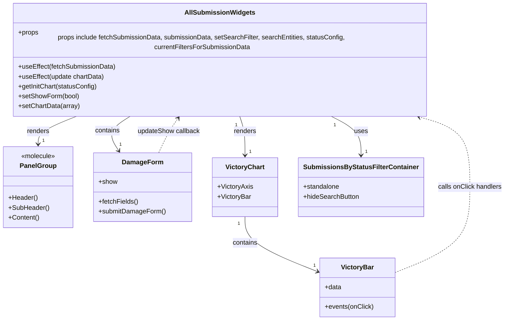

# Diagram: web/portal/src/pages/damageview/dashboard/components/DamageView.AllSubmissionsWidgets.js


> Auto-generated by Obscura crawlers

## Diagram 1



### SVG

<svg id="container" width="1220.28125" xmlns="http://www.w3.org/2000/svg" class="classDiagram" height="770" viewBox="0 0 1220.28125 770" role="graphics-document document" aria-roledescription="class"><style>#container{font-family:"trebuchet ms",verdana,arial,sans-serif;font-size:16px;fill:#333;}@keyframes edge-animation-frame{from{stroke-dashoffset:0;}}@keyframes dash{to{stroke-dashoffset:0;}}#container .edge-animation-slow{stroke-dasharray:9,5!important;stroke-dashoffset:900;animation:dash 50s linear infinite;stroke-linecap:round;}#container .edge-animation-fast{stroke-dasharray:9,5!important;stroke-dashoffset:900;animation:dash 20s linear infinite;stroke-linecap:round;}#container .error-icon{fill:#552222;}#container .error-text{fill:#552222;stroke:#552222;}#container .edge-thickness-normal{stroke-width:1px;}#container .edge-thickness-thick{stroke-width:3.5px;}#container .edge-pattern-solid{stroke-dasharray:0;}#container .edge-thickness-invisible{stroke-width:0;fill:none;}#container .edge-pattern-dashed{stroke-dasharray:3;}#container .edge-pattern-dotted{stroke-dasharray:2;}#container .marker{fill:#333333;stroke:#333333;}#container .marker.cross{stroke:#333333;}#container svg{font-family:"trebuchet ms",verdana,arial,sans-serif;font-size:16px;}#container p{margin:0;}#container g.classGroup text{fill:#9370DB;stroke:none;font-family:"trebuchet ms",verdana,arial,sans-serif;font-size:10px;}#container g.classGroup text .title{font-weight:bolder;}#container .nodeLabel,#container .edgeLabel{color:#131300;}#container .edgeLabel .label rect{fill:#ECECFF;}#container .label text{fill:#131300;}#container .labelBkg{background:#ECECFF;}#container .edgeLabel .label span{background:#ECECFF;}#container .classTitle{font-weight:bolder;}#container .node rect,#container .node circle,#container .node ellipse,#container .node polygon,#container .node path{fill:#ECECFF;stroke:#9370DB;stroke-width:1px;}#container .divider{stroke:#9370DB;stroke-width:1;}#container g.clickable{cursor:pointer;}#container g.classGroup rect{fill:#ECECFF;stroke:#9370DB;}#container g.classGroup line{stroke:#9370DB;stroke-width:1;}#container .classLabel .box{stroke:none;stroke-width:0;fill:#ECECFF;opacity:0.5;}#container .classLabel .label{fill:#9370DB;font-size:10px;}#container .relation{stroke:#333333;stroke-width:1;fill:none;}#container .dashed-line{stroke-dasharray:3;}#container .dotted-line{stroke-dasharray:1 2;}#container #compositionStart,#container .composition{fill:#333333!important;stroke:#333333!important;stroke-width:1;}#container #compositionEnd,#container .composition{fill:#333333!important;stroke:#333333!important;stroke-width:1;}#container #dependencyStart,#container .dependency{fill:#333333!important;stroke:#333333!important;stroke-width:1;}#container #dependencyStart,#container .dependency{fill:#333333!important;stroke:#333333!important;stroke-width:1;}#container #extensionStart,#container .extension{fill:transparent!important;stroke:#333333!important;stroke-width:1;}#container #extensionEnd,#container .extension{fill:transparent!important;stroke:#333333!important;stroke-width:1;}#container #aggregationStart,#container .aggregation{fill:transparent!important;stroke:#333333!important;stroke-width:1;}#container #aggregationEnd,#container .aggregation{fill:transparent!important;stroke:#333333!important;stroke-width:1;}#container #lollipopStart,#container .lollipop{fill:#ECECFF!important;stroke:#333333!important;stroke-width:1;}#container #lollipopEnd,#container .lollipop{fill:#ECECFF!important;stroke:#333333!important;stroke-width:1;}#container .edgeTerminals{font-size:11px;line-height:initial;}#container .classTitleText{text-anchor:middle;font-size:18px;fill:#333;}#container .label-icon{display:inline-block;height:1em;overflow:visible;vertical-align:-0.125em;}#container .node .label-icon path{fill:currentColor;stroke:revert;stroke-width:revert;}#container :root{--mermaid-font-family:"trebuchet ms",verdana,arial,sans-serif;}</style><g><defs><marker id="container_class-aggregationStart" class="marker aggregation class" refX="18" refY="7" markerWidth="190" markerHeight="240" orient="auto"><path d="M 18,7 L9,13 L1,7 L9,1 Z"></path></marker></defs><defs><marker id="container_class-aggregationEnd" class="marker aggregation class" refX="1" refY="7" markerWidth="20" markerHeight="28" orient="auto"><path d="M 18,7 L9,13 L1,7 L9,1 Z"></path></marker></defs><defs><marker id="container_class-extensionStart" class="marker extension class" refX="18" refY="7" markerWidth="190" markerHeight="240" orient="auto"><path d="M 1,7 L18,13 V 1 Z"></path></marker></defs><defs><marker id="container_class-extensionEnd" class="marker extension class" refX="1" refY="7" markerWidth="20" markerHeight="28" orient="auto"><path d="M 1,1 V 13 L18,7 Z"></path></marker></defs><defs><marker id="container_class-compositionStart" class="marker composition class" refX="18" refY="7" markerWidth="190" markerHeight="240" orient="auto"><path d="M 18,7 L9,13 L1,7 L9,1 Z"></path></marker></defs><defs><marker id="container_class-compositionEnd" class="marker composition class" refX="1" refY="7" markerWidth="20" markerHeight="28" orient="auto"><path d="M 18,7 L9,13 L1,7 L9,1 Z"></path></marker></defs><defs><marker id="container_class-dependencyStart" class="marker dependency class" refX="6" refY="7" markerWidth="190" markerHeight="240" orient="auto"><path d="M 5,7 L9,13 L1,7 L9,1 Z"></path></marker></defs><defs><marker id="container_class-dependencyEnd" class="marker dependency class" refX="13" refY="7" markerWidth="20" markerHeight="28" orient="auto"><path d="M 18,7 L9,13 L14,7 L9,1 Z"></path></marker></defs><defs><marker id="container_class-lollipopStart" class="marker lollipop class" refX="13" refY="7" markerWidth="190" markerHeight="240" orient="auto"><circle stroke="black" fill="transparent" cx="7" cy="7" r="6"></circle></marker></defs><defs><marker id="container_class-lollipopEnd" class="marker lollipop class" refX="1" refY="7" markerWidth="190" markerHeight="240" orient="auto"><circle stroke="black" fill="transparent" cx="7" cy="7" r="6"></circle></marker></defs><g class="root"><g class="clusters"></g><g class="edgePaths"><path d="M193.867,272L177.962,278.167C162.057,284.333,130.247,296.667,114.342,308C98.438,319.333,98.438,329.667,98.438,334.833L98.438,340" id="id_AllSubmissionWidgets_PanelGroup_1" class="edge-thickness-normal edge-pattern-solid relation" style=";;;" data-edge="true" data-et="edge" data-id="id_AllSubmissionWidgets_PanelGroup_1" data-points="W3sieCI6MTkzLjg2NjYwOTY1MjM2NjksInkiOjI3Mn0seyJ4Ijo5OC40Mzc1LCJ5IjozMDl9LHsieCI6OTguNDM3NSwieSI6MzQ2fV0=" marker-end="url(#container_class-dependencyEnd)"></path><path d="M321.964,272L312.044,278.167C302.123,284.333,282.282,296.667,277.27,310.653C272.258,324.639,282.074,340.279,286.982,348.098L291.891,355.918" id="id_AllSubmissionWidgets_DamageForm_2" class="edge-thickness-normal edge-pattern-solid relation" style=";;;" data-edge="true" data-et="edge" data-id="id_AllSubmissionWidgets_DamageForm_2" data-points="W3sieCI6MzIxLjk2NDMzNTI0NDA4MjgsInkiOjI3Mn0seyJ4IjoyNjIuNDQxNDA2MjUsInkiOjMwOX0seyJ4IjoyOTUuMDgwMzA3OTA0NDExNzcsInkiOjM2MX1d" marker-end="url(#container_class-dependencyEnd)"></path><path d="M582.996,272L585.27,278.167C587.544,284.333,592.092,296.667,594.366,312.5C596.641,328.333,596.641,347.667,596.641,357.333L596.641,367" id="id_AllSubmissionWidgets_VictoryChart_3" class="edge-thickness-normal edge-pattern-solid relation" style=";;;" data-edge="true" data-et="edge" data-id="id_AllSubmissionWidgets_VictoryChart_3" data-points="W3sieCI6NTgyLjk5NTY3NzY5OTcwNDIsInkiOjI3Mn0seyJ4Ijo1OTYuNjQwNjI1LCJ5IjozMDl9LHsieCI6NTk2LjY0MDYyNSwieSI6MzczfV0=" marker-end="url(#container_class-dependencyEnd)"></path><path d="M596.641,517L596.641,527.667C596.641,538.333,596.641,559.667,625.374,582.002C654.107,604.338,711.573,627.675,740.306,639.344L769.039,651.013" id="id_VictoryChart_VictoryBar_4" class="edge-thickness-normal edge-pattern-solid relation" style=";;;" data-edge="true" data-et="edge" data-id="id_VictoryChart_VictoryBar_4" data-points="W3sieCI6NTk2LjY0MDYyNSwieSI6NTE3fSx7IngiOjU5Ni42NDA2MjUsInkiOjU4MX0seyJ4Ijo3NzQuNTk3NjU2MjUsInkiOjY1My4yNzA2MDEwNzY5OTAzfV0=" marker-end="url(#container_class-dependencyEnd)"></path><path d="M798.146,272L810.471,278.167C822.796,284.333,847.447,296.667,859.772,312.5C872.098,328.333,872.098,347.667,872.098,357.333L872.098,367" id="id_AllSubmissionWidgets_SubmissionsByStatusFilterContainer_5" class="edge-thickness-normal edge-pattern-solid relation" style=";;;" data-edge="true" data-et="edge" data-id="id_AllSubmissionWidgets_SubmissionsByStatusFilterContainer_5" data-points="W3sieCI6Nzk4LjE0NTU0ODI2MTgzNDQsInkiOjI3Mn0seyJ4Ijo4NzIuMDk3NjU2MjUsInkiOjMwOX0seyJ4Ijo4NzIuMDk3NjU2MjUsInkiOjM3M31d" marker-end="url(#container_class-dependencyEnd)"></path><path d="M955.48,653.271L985.14,641.226C1014.799,629.18,1074.118,605.09,1103.778,570.378C1133.438,535.667,1133.438,490.333,1133.438,445C1133.438,399.667,1133.438,354.333,1112.539,325.771C1091.64,297.21,1049.842,285.419,1028.943,279.524L1008.044,273.629" id="id_VictoryBar_AllSubmissionWidgets_6" class="edge-thickness-normal edge-pattern-dashed relation" style=";;;" data-edge="true" data-et="edge" data-id="id_VictoryBar_AllSubmissionWidgets_6" data-points="W3sieCI6OTU1LjQ4MDQ2ODc1LCJ5Ijo2NTMuMjcwNjAxMDc2OTkwM30seyJ4IjoxMTMzLjQzNzUsInkiOjU4MX0seyJ4IjoxMTMzLjQzNzUsInkiOjQ0NX0seyJ4IjoxMTMzLjQzNzUsInkiOjMwOX0seyJ4IjoxMDAyLjI2ODk3NjUxNjI3MjIsInkiOjI3Mn1d" marker-end="url(#container_class-dependencyEnd)"></path><path d="M387.269,361L391.341,352.333C395.412,343.667,403.556,326.333,411.514,312.309C419.473,298.285,427.247,287.571,431.134,282.214L435.021,276.856" id="id_DamageForm_AllSubmissionWidgets_7" class="edge-thickness-normal edge-pattern-dashed relation" style=";;;" data-edge="true" data-et="edge" data-id="id_DamageForm_AllSubmissionWidgets_7" data-points="W3sieCI6Mzg3LjI2ODk1NjgwMTQ3MDYsInkiOjM2MX0seyJ4Ijo0MTEuNjk5MjE4NzUsInkiOjMwOX0seyJ4Ijo0MzguNTQ0NDAxODEyMTMwMTYsInkiOjI3Mn1d" marker-end="url(#container_class-dependencyEnd)"></path></g><g class="edgeLabels"><g class="edgeLabel" transform="translate(98.4375, 309)"><g class="label" data-id="id_AllSubmissionWidgets_PanelGroup_1" transform="translate(-27.75, -12)"><foreignObject width="55.5" height="24"><div xmlns="http://www.w3.org/1999/xhtml" class="labelBkg" style="display: table-cell; white-space: nowrap; line-height: 1.5; max-width: 200px; text-align: center;"><span class="edgeLabel"><p>renders</p></span></div></foreignObject></g></g><g class="edgeLabel" transform="translate(266.13196, 306.70592)"><g class="label" data-id="id_AllSubmissionWidgets_DamageForm_2" transform="translate(-30.890625, -12)"><foreignObject width="61.78125" height="24"><div xmlns="http://www.w3.org/1999/xhtml" class="labelBkg" style="display: table-cell; white-space: nowrap; line-height: 1.5; max-width: 200px; text-align: center;"><span class="edgeLabel"><p>contains</p></span></div></foreignObject></g></g><g class="edgeLabel" transform="translate(596.640625, 309)"><g class="label" data-id="id_AllSubmissionWidgets_VictoryChart_3" transform="translate(-27.75, -12)"><foreignObject width="55.5" height="24"><div xmlns="http://www.w3.org/1999/xhtml" class="labelBkg" style="display: table-cell; white-space: nowrap; line-height: 1.5; max-width: 200px; text-align: center;"><span class="edgeLabel"><p>renders</p></span></div></foreignObject></g></g><g class="edgeLabel" transform="translate(596.640625, 581)"><g class="label" data-id="id_VictoryChart_VictoryBar_4" transform="translate(-30.890625, -12)"><foreignObject width="61.78125" height="24"><div xmlns="http://www.w3.org/1999/xhtml" class="labelBkg" style="display: table-cell; white-space: nowrap; line-height: 1.5; max-width: 200px; text-align: center;"><span class="edgeLabel"><p>contains</p></span></div></foreignObject></g></g><g class="edgeLabel" transform="translate(872.09765625, 309)"><g class="label" data-id="id_AllSubmissionWidgets_SubmissionsByStatusFilterContainer_5" transform="translate(-16.4921875, -12)"><foreignObject width="32.984375" height="24"><div xmlns="http://www.w3.org/1999/xhtml" class="labelBkg" style="display: table-cell; white-space: nowrap; line-height: 1.5; max-width: 200px; text-align: center;"><span class="edgeLabel"><p>uses</p></span></div></foreignObject></g></g><g class="edgeLabel" transform="translate(1133.4375, 445)"><g class="label" data-id="id_VictoryBar_AllSubmissionWidgets_6" transform="translate(-78.84375, -12)"><foreignObject width="157.6875" height="24"><div xmlns="http://www.w3.org/1999/xhtml" class="labelBkg" style="display: table-cell; white-space: nowrap; line-height: 1.5; max-width: 200px; text-align: center;"><span class="edgeLabel"><p>calls onClick handlers</p></span></div></foreignObject></g></g><g class="edgeLabel" transform="translate(411.69921875, 309)"><g class="label" data-id="id_DamageForm_AllSubmissionWidgets_7" transform="translate(-76.8984375, -12)"><foreignObject width="153.796875" height="24"><div xmlns="http://www.w3.org/1999/xhtml" class="labelBkg" style="display: table-cell; white-space: nowrap; line-height: 1.5; max-width: 200px; text-align: center;"><span class="edgeLabel"><p>updateShow callback</p></span></div></foreignObject></g></g><g class="edgeTerminals" transform="translate(172.12758415117403, 264.3407013782605)"><g class="inner" transform="translate(0, 0)"><foreignObject style="width: 9px; height: 12px;"><div xmlns="http://www.w3.org/1999/xhtml" style="display: inline-block; padding-right: 1px; white-space: nowrap;"><span class="edgeLabel">1</span></div></foreignObject></g></g><g class="edgeTerminals" transform="translate(299.1828599352336, 268.49936417564993)"><g class="inner" transform="translate(0, 0)"><foreignObject style="width: 9px; height: 12px;"><div xmlns="http://www.w3.org/1999/xhtml" style="display: inline-block; padding-right: 1px; white-space: nowrap;"><span class="edgeLabel">1</span></div></foreignObject></g></g><g class="edgeTerminals" transform="translate(574.9772470316404, 293.6091365804033)"><g class="inner" transform="translate(0, 0)"><foreignObject style="width: 9px; height: 12px;"><div xmlns="http://www.w3.org/1999/xhtml" style="display: inline-block; padding-right: 1px; white-space: nowrap;"><span class="edgeLabel">1</span></div></foreignObject></g></g><g class="edgeTerminals" transform="translate(581.6406275, 534.5000021428572)"><g class="inner" transform="translate(0, 0)"><foreignObject style="width: 9px; height: 12px;"><div xmlns="http://www.w3.org/1999/xhtml" style="display: inline-block; padding-right: 1px; white-space: nowrap;"><span class="edgeLabel">1</span></div></foreignObject></g></g><g class="edgeTerminals" transform="translate(807.0843158636231, 293.24496013520394)"><g class="inner" transform="translate(0, 0)"><foreignObject style="width: 9px; height: 12px;"><div xmlns="http://www.w3.org/1999/xhtml" style="display: inline-block; padding-right: 1px; white-space: nowrap;"><span class="edgeLabel">1</span></div></foreignObject></g></g><g class="edgeTerminals" transform="translate(108.4375, 323.5)"><g class="inner" transform="translate(0, 0)"></g><foreignObject style="width: 9px; height: 12px;"><div xmlns="http://www.w3.org/1999/xhtml" style="display: inline-block; padding-right: 1px; white-space: nowrap;"><span class="edgeLabel">1</span></div></foreignObject></g><g class="edgeTerminals" transform="translate(293.4815736633568, 333.2034782222686)"><g class="inner" transform="translate(0, 0)"></g><foreignObject style="width: 9px; height: 12px;"><div xmlns="http://www.w3.org/1999/xhtml" style="display: inline-block; padding-right: 1px; white-space: nowrap;"><span class="edgeLabel">1</span></div></foreignObject></g><g class="edgeTerminals" transform="translate(606.6406274999998, 350.5000021428571)"><g class="inner" transform="translate(0, 0)"></g><foreignObject style="width: 9px; height: 12px;"><div xmlns="http://www.w3.org/1999/xhtml" style="display: inline-block; padding-right: 1px; white-space: nowrap;"><span class="edgeLabel">1</span></div></foreignObject></g><g class="edgeTerminals" transform="translate(759.0277289755586, 627.7882508037765)"><g class="inner" transform="translate(0, 0)"></g><foreignObject style="width: 9px; height: 12px;"><div xmlns="http://www.w3.org/1999/xhtml" style="display: inline-block; padding-right: 1px; white-space: nowrap;"><span class="edgeLabel">1</span></div></foreignObject></g><g class="edgeTerminals" transform="translate(882.0976581249998, 350.50000160714285)"><g class="inner" transform="translate(0, 0)"></g><foreignObject style="width: 9px; height: 12px;"><div xmlns="http://www.w3.org/1999/xhtml" style="display: inline-block; padding-right: 1px; white-space: nowrap;"><span class="edgeLabel">1</span></div></foreignObject></g></g><g class="nodes"><g class="node default" id="classId-AllSubmissionWidgets-0" transform="translate(534.31640625, 140)"><g class="basic label-container"><path d="M-526.31640625 -132 L526.31640625 -132 L526.31640625 132 L-526.31640625 132" stroke="none" stroke-width="0" fill="#ECECFF" style=""></path><path d="M-526.31640625 -132 C-140.3387398312356 -132, 245.63892658752877 -132, 526.31640625 -132 M-526.31640625 -132 C-310.33371045235515 -132, -94.35101465471035 -132, 526.31640625 -132 M526.31640625 -132 C526.31640625 -77.25588999782633, 526.31640625 -22.511779995652645, 526.31640625 132 M526.31640625 -132 C526.31640625 -30.122440980103647, 526.31640625 71.7551180397927, 526.31640625 132 M526.31640625 132 C268.8224605846305 132, 11.32851491926101 132, -526.31640625 132 M526.31640625 132 C170.44588484562996 132, -185.42463655874008 132, -526.31640625 132 M-526.31640625 132 C-526.31640625 62.33275828657963, -526.31640625 -7.334483426840734, -526.31640625 -132 M-526.31640625 132 C-526.31640625 68.12932676915219, -526.31640625 4.258653538304372, -526.31640625 -132" stroke="#9370DB" stroke-width="1.3" fill="none" stroke-dasharray="0 0" style=""></path></g><g class="annotation-group text" transform="translate(0, -108)"></g><g class="label-group text" transform="translate(-81.0703125, -108)"><g class="label" style="font-weight: bolder" transform="translate(0,-12)"><foreignObject width="162.140625" height="24"><div xmlns="http://www.w3.org/1999/xhtml" style="display: table-cell; white-space: nowrap; line-height: 1.5; max-width: 210px; text-align: center;"><span class="nodeLabel markdown-node-label" style=""><p>AllSubmissionWidgets</p></span></div></foreignObject></g></g><g class="members-group text" transform="translate(-514.31640625, -60)"><g class="label" style="" transform="translate(0,-12)"><foreignObject width="49.515625" height="24"><div xmlns="http://www.w3.org/1999/xhtml" style="display: table-cell; white-space: nowrap; line-height: 1.5; max-width: 107px; text-align: center;"><span class="nodeLabel markdown-node-label" style=""><p>+props</p></span></div></foreignObject></g><g class="label" style="" transform="translate(0,12)"><foreignObject width="947.5625" height="24"><div xmlns="http://www.w3.org/1999/xhtml" style="display: table-cell; white-space: nowrap; line-height: 1.5; max-width: 998px; text-align: center;"><span class="nodeLabel markdown-node-label" style=""><p>props include fetchSubmissionData, submissionData, setSearchFilter, searchEntities, statusConfig, currentFiltersForSubmissionData</p></span></div></foreignObject></g></g><g class="methods-group text" transform="translate(-514.31640625, 12)"><g class="label" style="" transform="translate(0,-12)"><foreignObject width="238.28125" height="24"><div xmlns="http://www.w3.org/1999/xhtml" style="display: table-cell; white-space: nowrap; line-height: 1.5; max-width: 296px; text-align: center;"><span class="nodeLabel markdown-node-label" style=""><p>+useEffect(fetchSubmissionData)</p></span></div></foreignObject></g><g class="label" style="" transform="translate(0,12)"><foreignObject width="211.28125" height="24"><div xmlns="http://www.w3.org/1999/xhtml" style="display: table-cell; white-space: nowrap; line-height: 1.5; max-width: 269px; text-align: center;"><span class="nodeLabel markdown-node-label" style=""><p>+useEffect(update chartData)</p></span></div></foreignObject></g><g class="label" style="" transform="translate(0,36)"><foreignObject width="193.421875" height="24"><div xmlns="http://www.w3.org/1999/xhtml" style="display: table-cell; white-space: nowrap; line-height: 1.5; max-width: 251px; text-align: center;"><span class="nodeLabel markdown-node-label" style=""><p>+getInitChart(statusConfig)</p></span></div></foreignObject></g><g class="label" style="" transform="translate(0,60)"><foreignObject width="148.640625" height="24"><div xmlns="http://www.w3.org/1999/xhtml" style="display: table-cell; white-space: nowrap; line-height: 1.5; max-width: 206px; text-align: center;"><span class="nodeLabel markdown-node-label" style=""><p>+setShowForm(bool)</p></span></div></foreignObject></g><g class="label" style="" transform="translate(0,84)"><foreignObject width="149.203125" height="24"><div xmlns="http://www.w3.org/1999/xhtml" style="display: table-cell; white-space: nowrap; line-height: 1.5; max-width: 207px; text-align: center;"><span class="nodeLabel markdown-node-label" style=""><p>+setChartData(array)</p></span></div></foreignObject></g></g><g class="divider" style=""><path d="M-526.31640625 -84 C-254.81573111864589 -84, 16.68494401270823 -84, 526.31640625 -84 M-526.31640625 -84 C-262.3059474522925 -84, 1.7045113454149714 -84, 526.31640625 -84" stroke="#9370DB" stroke-width="1.3" fill="none" stroke-dasharray="0 0" style=""></path></g><g class="divider" style=""><path d="M-526.31640625 -12 C-139.17361475106867 -12, 247.96917674786266 -12, 526.31640625 -12 M-526.31640625 -12 C-127.68645879785134 -12, 270.9434886542973 -12, 526.31640625 -12" stroke="#9370DB" stroke-width="1.3" fill="none" stroke-dasharray="0 0" style=""></path></g></g><g class="node default" id="classId-PanelGroup-1" transform="translate(98.4375, 445)"><g class="basic label-container"><path d="M-82.09375 -99 L82.09375 -99 L82.09375 99 L-82.09375 99" stroke="none" stroke-width="0" fill="#ECECFF" style=""></path><path d="M-82.09375 -99 C-39.048171326149436 -99, 3.9974073477011274 -99, 82.09375 -99 M-82.09375 -99 C-22.83902370725425 -99, 36.4157025854915 -99, 82.09375 -99 M82.09375 -99 C82.09375 -58.84007692214589, 82.09375 -18.68015384429178, 82.09375 99 M82.09375 -99 C82.09375 -24.300217698194913, 82.09375 50.39956460361017, 82.09375 99 M82.09375 99 C32.747993740022984 99, -16.59776251995403 99, -82.09375 99 M82.09375 99 C42.797889078603966 99, 3.5020281572079313 99, -82.09375 99 M-82.09375 99 C-82.09375 24.202102711134472, -82.09375 -50.595794577731056, -82.09375 -99 M-82.09375 99 C-82.09375 19.929226540062402, -82.09375 -59.141546919875196, -82.09375 -99" stroke="#9370DB" stroke-width="1.3" fill="none" stroke-dasharray="0 0" style=""></path></g><g class="annotation-group text" transform="translate(-42.2265625, -75)"><g class="label" style="" transform="translate(0,-12)"><foreignObject width="84.453125" height="24"><div xmlns="http://www.w3.org/1999/xhtml" style="display: table-cell; white-space: nowrap; line-height: 1.5; max-width: 134px; text-align: center;"><span class="nodeLabel markdown-node-label" style=""><p>«molecule»</p></span></div></foreignObject></g></g><g class="label-group text" transform="translate(-42.328125, -51)"><g class="label" style="font-weight: bolder" transform="translate(0,-12)"><foreignObject width="84.65625" height="24"><div xmlns="http://www.w3.org/1999/xhtml" style="display: table-cell; white-space: nowrap; line-height: 1.5; max-width: 134px; text-align: center;"><span class="nodeLabel markdown-node-label" style=""><p>PanelGroup</p></span></div></foreignObject></g></g><g class="members-group text" transform="translate(-70.09375, -3)"></g><g class="methods-group text" transform="translate(-70.09375, 27)"><g class="label" style="" transform="translate(0,-12)"><foreignObject width="70.96875" height="24"><div xmlns="http://www.w3.org/1999/xhtml" style="display: table-cell; white-space: nowrap; line-height: 1.5; max-width: 128px; text-align: center;"><span class="nodeLabel markdown-node-label" style=""><p>+Header()</p></span></div></foreignObject></g><g class="label" style="" transform="translate(0,12)"><foreignObject width="97.859375" height="24"><div xmlns="http://www.w3.org/1999/xhtml" style="display: table-cell; white-space: nowrap; line-height: 1.5; max-width: 155px; text-align: center;"><span class="nodeLabel markdown-node-label" style=""><p>+SubHeader()</p></span></div></foreignObject></g><g class="label" style="" transform="translate(0,36)"><foreignObject width="75.125" height="24"><div xmlns="http://www.w3.org/1999/xhtml" style="display: table-cell; white-space: nowrap; line-height: 1.5; max-width: 132px; text-align: center;"><span class="nodeLabel markdown-node-label" style=""><p>+Content()</p></span></div></foreignObject></g></g><g class="divider" style=""><path d="M-82.09375 -27 C-36.95107858107466 -27, 8.191592837850678 -27, 82.09375 -27 M-82.09375 -27 C-44.09519003221915 -27, -6.096630064438301 -27, 82.09375 -27" stroke="#9370DB" stroke-width="1.3" fill="none" stroke-dasharray="0 0" style=""></path></g><g class="divider" style=""><path d="M-82.09375 -3 C-43.11089004393565 -3, -4.128030087871295 -3, 82.09375 -3 M-82.09375 -3 C-45.00392821295507 -3, -7.914106425910134 -3, 82.09375 -3" stroke="#9370DB" stroke-width="1.3" fill="none" stroke-dasharray="0 0" style=""></path></g></g><g class="node default" id="classId-DamageForm-2" transform="translate(347.8046875, 445)"><g class="basic label-container"><path d="M-117.2734375 -84 L117.2734375 -84 L117.2734375 84 L-117.2734375 84" stroke="none" stroke-width="0" fill="#ECECFF" style=""></path><path d="M-117.2734375 -84 C-31.07509618029792 -84, 55.12324513940416 -84, 117.2734375 -84 M-117.2734375 -84 C-34.33445394514246 -84, 48.60452960971509 -84, 117.2734375 -84 M117.2734375 -84 C117.2734375 -41.900781410954764, 117.2734375 0.19843717809047234, 117.2734375 84 M117.2734375 -84 C117.2734375 -29.559528619174124, 117.2734375 24.880942761651752, 117.2734375 84 M117.2734375 84 C58.42824838937208 84, -0.41694072125584114 84, -117.2734375 84 M117.2734375 84 C63.346107562354064 84, 9.418777624708127 84, -117.2734375 84 M-117.2734375 84 C-117.2734375 17.11538717949584, -117.2734375 -49.76922564100832, -117.2734375 -84 M-117.2734375 84 C-117.2734375 34.00742928576616, -117.2734375 -15.985141428467685, -117.2734375 -84" stroke="#9370DB" stroke-width="1.3" fill="none" stroke-dasharray="0 0" style=""></path></g><g class="annotation-group text" transform="translate(0, -60)"></g><g class="label-group text" transform="translate(-47.484375, -60)"><g class="label" style="font-weight: bolder" transform="translate(0,-12)"><foreignObject width="94.96875" height="24"><div xmlns="http://www.w3.org/1999/xhtml" style="display: table-cell; white-space: nowrap; line-height: 1.5; max-width: 144px; text-align: center;"><span class="nodeLabel markdown-node-label" style=""><p>DamageForm</p></span></div></foreignObject></g></g><g class="members-group text" transform="translate(-105.2734375, -12)"><g class="label" style="" transform="translate(0,-12)"><foreignObject width="45.65625" height="24"><div xmlns="http://www.w3.org/1999/xhtml" style="display: table-cell; white-space: nowrap; line-height: 1.5; max-width: 104px; text-align: center;"><span class="nodeLabel markdown-node-label" style=""><p>+show</p></span></div></foreignObject></g></g><g class="methods-group text" transform="translate(-105.2734375, 36)"><g class="label" style="" transform="translate(0,-12)"><foreignObject width="96.78125" height="24"><div xmlns="http://www.w3.org/1999/xhtml" style="display: table-cell; white-space: nowrap; line-height: 1.5; max-width: 154px; text-align: center;"><span class="nodeLabel markdown-node-label" style=""><p>+fetchFields()</p></span></div></foreignObject></g><g class="label" style="" transform="translate(0,12)"><foreignObject width="163.0625" height="24"><div xmlns="http://www.w3.org/1999/xhtml" style="display: table-cell; white-space: nowrap; line-height: 1.5; max-width: 220px; text-align: center;"><span class="nodeLabel markdown-node-label" style=""><p>+submitDamageForm()</p></span></div></foreignObject></g></g><g class="divider" style=""><path d="M-117.2734375 -36 C-24.537954645946584 -36, 68.19752820810683 -36, 117.2734375 -36 M-117.2734375 -36 C-69.67867848769374 -36, -22.08391947538749 -36, 117.2734375 -36" stroke="#9370DB" stroke-width="1.3" fill="none" stroke-dasharray="0 0" style=""></path></g><g class="divider" style=""><path d="M-117.2734375 12 C-62.01048817810919 12, -6.747538856218384 12, 117.2734375 12 M-117.2734375 12 C-56.02033971624043 12, 5.232758067519143 12, 117.2734375 12" stroke="#9370DB" stroke-width="1.3" fill="none" stroke-dasharray="0 0" style=""></path></g></g><g class="node default" id="classId-VictoryChart-3" transform="translate(596.640625, 445)"><g class="basic label-container"><path d="M-77.9609375 -72 L77.9609375 -72 L77.9609375 72 L-77.9609375 72" stroke="none" stroke-width="0" fill="#ECECFF" style=""></path><path d="M-77.9609375 -72 C-32.158096253802015 -72, 13.644744992395971 -72, 77.9609375 -72 M-77.9609375 -72 C-23.942813275627216 -72, 30.075310948745567 -72, 77.9609375 -72 M77.9609375 -72 C77.9609375 -20.31615875740112, 77.9609375 31.36768248519776, 77.9609375 72 M77.9609375 -72 C77.9609375 -31.84876351408765, 77.9609375 8.302472971824699, 77.9609375 72 M77.9609375 72 C17.664727623871705 72, -42.63148225225659 72, -77.9609375 72 M77.9609375 72 C36.05697959523222 72, -5.846978309535558 72, -77.9609375 72 M-77.9609375 72 C-77.9609375 27.27808603504628, -77.9609375 -17.443827929907442, -77.9609375 -72 M-77.9609375 72 C-77.9609375 25.804846531100196, -77.9609375 -20.390306937799608, -77.9609375 -72" stroke="#9370DB" stroke-width="1.3" fill="none" stroke-dasharray="0 0" style=""></path></g><g class="annotation-group text" transform="translate(0, -48)"></g><g class="label-group text" transform="translate(-45.4375, -48)"><g class="label" style="font-weight: bolder" transform="translate(0,-12)"><foreignObject width="90.875" height="24"><div xmlns="http://www.w3.org/1999/xhtml" style="display: table-cell; white-space: nowrap; line-height: 1.5; max-width: 139px; text-align: center;"><span class="nodeLabel markdown-node-label" style=""><p>VictoryChart</p></span></div></foreignObject></g></g><g class="members-group text" transform="translate(-65.9609375, 0)"><g class="label" style="" transform="translate(0,-12)"><foreignObject width="86.484375" height="24"><div xmlns="http://www.w3.org/1999/xhtml" style="display: table-cell; white-space: nowrap; line-height: 1.5; max-width: 144px; text-align: center;"><span class="nodeLabel markdown-node-label" style=""><p>+VictoryAxis</p></span></div></foreignObject></g><g class="label" style="" transform="translate(0,12)"><foreignObject width="82.1875" height="24"><div xmlns="http://www.w3.org/1999/xhtml" style="display: table-cell; white-space: nowrap; line-height: 1.5; max-width: 140px; text-align: center;"><span class="nodeLabel markdown-node-label" style=""><p>+VictoryBar</p></span></div></foreignObject></g></g><g class="methods-group text" transform="translate(-65.9609375, 72)"></g><g class="divider" style=""><path d="M-77.9609375 -24 C-43.02947831097285 -24, -8.098019121945697 -24, 77.9609375 -24 M-77.9609375 -24 C-40.38484969014767 -24, -2.808761880295336 -24, 77.9609375 -24" stroke="#9370DB" stroke-width="1.3" fill="none" stroke-dasharray="0 0" style=""></path></g><g class="divider" style=""><path d="M-77.9609375 48 C-23.540572314242127 48, 30.879792871515747 48, 77.9609375 48 M-77.9609375 48 C-20.84076903935128 48, 36.27939942129744 48, 77.9609375 48" stroke="#9370DB" stroke-width="1.3" fill="none" stroke-dasharray="0 0" style=""></path></g></g><g class="node default" id="classId-VictoryBar-4" transform="translate(865.0390625, 690)"><g class="basic label-container"><path d="M-90.44140625 -72 L90.44140625 -72 L90.44140625 72 L-90.44140625 72" stroke="none" stroke-width="0" fill="#ECECFF" style=""></path><path d="M-90.44140625 -72 C-44.477614701663136 -72, 1.4861768466737288 -72, 90.44140625 -72 M-90.44140625 -72 C-39.82267987428016 -72, 10.796046501439676 -72, 90.44140625 -72 M90.44140625 -72 C90.44140625 -34.881957991837766, 90.44140625 2.236084016324469, 90.44140625 72 M90.44140625 -72 C90.44140625 -35.73619568348164, 90.44140625 0.5276086330367207, 90.44140625 72 M90.44140625 72 C20.23246683534323 72, -49.97647257931354 72, -90.44140625 72 M90.44140625 72 C25.60612677284489 72, -39.22915270431022 72, -90.44140625 72 M-90.44140625 72 C-90.44140625 29.433368550162214, -90.44140625 -13.133262899675572, -90.44140625 -72 M-90.44140625 72 C-90.44140625 35.504193612696156, -90.44140625 -0.9916127746076882, -90.44140625 -72" stroke="#9370DB" stroke-width="1.3" fill="none" stroke-dasharray="0 0" style=""></path></g><g class="annotation-group text" transform="translate(0, -48)"></g><g class="label-group text" transform="translate(-38.1484375, -48)"><g class="label" style="font-weight: bolder" transform="translate(0,-12)"><foreignObject width="76.296875" height="24"><div xmlns="http://www.w3.org/1999/xhtml" style="display: table-cell; white-space: nowrap; line-height: 1.5; max-width: 125px; text-align: center;"><span class="nodeLabel markdown-node-label" style=""><p>VictoryBar</p></span></div></foreignObject></g></g><g class="members-group text" transform="translate(-78.44140625, 0)"><g class="label" style="" transform="translate(0,-12)"><foreignObject width="40.625" height="24"><div xmlns="http://www.w3.org/1999/xhtml" style="display: table-cell; white-space: nowrap; line-height: 1.5; max-width: 98px; text-align: center;"><span class="nodeLabel markdown-node-label" style=""><p>+data</p></span></div></foreignObject></g></g><g class="methods-group text" transform="translate(-78.44140625, 48)"><g class="label" style="" transform="translate(0,-12)"><foreignObject width="118.734375" height="24"><div xmlns="http://www.w3.org/1999/xhtml" style="display: table-cell; white-space: nowrap; line-height: 1.5; max-width: 176px; text-align: center;"><span class="nodeLabel markdown-node-label" style=""><p>+events(onClick)</p></span></div></foreignObject></g></g><g class="divider" style=""><path d="M-90.44140625 -24 C-45.6189145370561 -24, -0.7964228241121987 -24, 90.44140625 -24 M-90.44140625 -24 C-38.638400273101595 -24, 13.16460570379681 -24, 90.44140625 -24" stroke="#9370DB" stroke-width="1.3" fill="none" stroke-dasharray="0 0" style=""></path></g><g class="divider" style=""><path d="M-90.44140625 24 C-19.86992591918745 24, 50.7015544116251 24, 90.44140625 24 M-90.44140625 24 C-49.42815082360726 24, -8.414895397214522 24, 90.44140625 24" stroke="#9370DB" stroke-width="1.3" fill="none" stroke-dasharray="0 0" style=""></path></g></g><g class="node default" id="classId-SubmissionsByStatusFilterContainer-5" transform="translate(872.09765625, 445)"><g class="basic label-container"><path d="M-147.49609375 -72 L147.49609375 -72 L147.49609375 72 L-147.49609375 72" stroke="none" stroke-width="0" fill="#ECECFF" style=""></path><path d="M-147.49609375 -72 C-46.76181768342552 -72, 53.97245838314896 -72, 147.49609375 -72 M-147.49609375 -72 C-30.663936523825654 -72, 86.16822070234869 -72, 147.49609375 -72 M147.49609375 -72 C147.49609375 -34.865022465179365, 147.49609375 2.26995506964127, 147.49609375 72 M147.49609375 -72 C147.49609375 -39.99272264056508, 147.49609375 -7.985445281130154, 147.49609375 72 M147.49609375 72 C70.10673532171985 72, -7.282623106560294 72, -147.49609375 72 M147.49609375 72 C78.08110499875356 72, 8.66611624750712 72, -147.49609375 72 M-147.49609375 72 C-147.49609375 39.173891630352465, -147.49609375 6.347783260704929, -147.49609375 -72 M-147.49609375 72 C-147.49609375 34.92594909510515, -147.49609375 -2.1481018097896936, -147.49609375 -72" stroke="#9370DB" stroke-width="1.3" fill="none" stroke-dasharray="0 0" style=""></path></g><g class="annotation-group text" transform="translate(0, -48)"></g><g class="label-group text" transform="translate(-133.0546875, -48)"><g class="label" style="font-weight: bolder" transform="translate(0,-12)"><foreignObject width="266.109375" height="24"><div xmlns="http://www.w3.org/1999/xhtml" style="display: table-cell; white-space: nowrap; line-height: 1.5; max-width: 313px; text-align: center;"><span class="nodeLabel markdown-node-label" style=""><p>SubmissionsByStatusFilterContainer</p></span></div></foreignObject></g></g><g class="members-group text" transform="translate(-135.49609375, 0)"><g class="label" style="" transform="translate(0,-12)"><foreignObject width="89.375" height="24"><div xmlns="http://www.w3.org/1999/xhtml" style="display: table-cell; white-space: nowrap; line-height: 1.5; max-width: 147px; text-align: center;"><span class="nodeLabel markdown-node-label" style=""><p>+standalone</p></span></div></foreignObject></g><g class="label" style="" transform="translate(0,12)"><foreignObject width="137.9375" height="24"><div xmlns="http://www.w3.org/1999/xhtml" style="display: table-cell; white-space: nowrap; line-height: 1.5; max-width: 195px; text-align: center;"><span class="nodeLabel markdown-node-label" style=""><p>+hideSearchButton</p></span></div></foreignObject></g></g><g class="methods-group text" transform="translate(-135.49609375, 72)"></g><g class="divider" style=""><path d="M-147.49609375 -24 C-59.95202793836381 -24, 27.592037873272375 -24, 147.49609375 -24 M-147.49609375 -24 C-83.43546225968986 -24, -19.374830769379713 -24, 147.49609375 -24" stroke="#9370DB" stroke-width="1.3" fill="none" stroke-dasharray="0 0" style=""></path></g><g class="divider" style=""><path d="M-147.49609375 48 C-70.69532226081533 48, 6.105449228369338 48, 147.49609375 48 M-147.49609375 48 C-49.951797963972226 48, 47.59249782205555 48, 147.49609375 48" stroke="#9370DB" stroke-width="1.3" fill="none" stroke-dasharray="0 0" style=""></path></g></g></g></g></g></svg>

## Diagram 2

```mermaid
flowchart LR
    FetchSubmissionData[fetchSubmissionData(solutionId)] -->|populates| SubmissionData[submissionData]
    SubmissionData -->|used by| InitChart[getInitChart(statusConfig)]
    InitChart --> ChartDataState[setChartData(chartData)]
    ChartDataState --> VictoryChartComp[VictoryChart / VictoryBar]
    VictoryChartComp -->|renders bars| UI[User Interface]
    Button[Submit Damage Button] -->|click| ShowFormSet[setShowForm(true)]
    ShowFormSet --> DamageFormComp[DamageForm(show=true)]
    BarClick[VictoryBar onClick] -->|sets status filter| SetSearchFilter[setSearchFilter("status", [field])]
    SetSearchFilter --> ApplyOtherFilters[for each currentFiltersForSubmissionData -> setSearchFilter]
    ApplyOtherFilters --> SearchEntities[searchEntities()]
    BarClick --> SearchEntities
    Loader[Loader loaded={!isLoading}] --> VictoryChartComp
```

> SVG rendering failed for this diagram.
