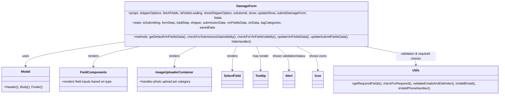

# Diagram: web/portal/src/pages/damageview/dashboard/components/DamageView.DamageForm.js


> Auto-generated by Obscura crawlers

## Diagram 1



### SVG

<svg id="container" width="2527.3359375" xmlns="http://www.w3.org/2000/svg" class="classDiagram" height="408" viewBox="0 0 2527.3359375 408" role="graphics-document document" aria-roledescription="class"><style>#container{font-family:"trebuchet ms",verdana,arial,sans-serif;font-size:16px;fill:#333;}@keyframes edge-animation-frame{from{stroke-dashoffset:0;}}@keyframes dash{to{stroke-dashoffset:0;}}#container .edge-animation-slow{stroke-dasharray:9,5!important;stroke-dashoffset:900;animation:dash 50s linear infinite;stroke-linecap:round;}#container .edge-animation-fast{stroke-dasharray:9,5!important;stroke-dashoffset:900;animation:dash 20s linear infinite;stroke-linecap:round;}#container .error-icon{fill:#552222;}#container .error-text{fill:#552222;stroke:#552222;}#container .edge-thickness-normal{stroke-width:1px;}#container .edge-thickness-thick{stroke-width:3.5px;}#container .edge-pattern-solid{stroke-dasharray:0;}#container .edge-thickness-invisible{stroke-width:0;fill:none;}#container .edge-pattern-dashed{stroke-dasharray:3;}#container .edge-pattern-dotted{stroke-dasharray:2;}#container .marker{fill:#333333;stroke:#333333;}#container .marker.cross{stroke:#333333;}#container svg{font-family:"trebuchet ms",verdana,arial,sans-serif;font-size:16px;}#container p{margin:0;}#container g.classGroup text{fill:#9370DB;stroke:none;font-family:"trebuchet ms",verdana,arial,sans-serif;font-size:10px;}#container g.classGroup text .title{font-weight:bolder;}#container .nodeLabel,#container .edgeLabel{color:#131300;}#container .edgeLabel .label rect{fill:#ECECFF;}#container .label text{fill:#131300;}#container .labelBkg{background:#ECECFF;}#container .edgeLabel .label span{background:#ECECFF;}#container .classTitle{font-weight:bolder;}#container .node rect,#container .node circle,#container .node ellipse,#container .node polygon,#container .node path{fill:#ECECFF;stroke:#9370DB;stroke-width:1px;}#container .divider{stroke:#9370DB;stroke-width:1;}#container g.clickable{cursor:pointer;}#container g.classGroup rect{fill:#ECECFF;stroke:#9370DB;}#container g.classGroup line{stroke:#9370DB;stroke-width:1;}#container .classLabel .box{stroke:none;stroke-width:0;fill:#ECECFF;opacity:0.5;}#container .classLabel .label{fill:#9370DB;font-size:10px;}#container .relation{stroke:#333333;stroke-width:1;fill:none;}#container .dashed-line{stroke-dasharray:3;}#container .dotted-line{stroke-dasharray:1 2;}#container #compositionStart,#container .composition{fill:#333333!important;stroke:#333333!important;stroke-width:1;}#container #compositionEnd,#container .composition{fill:#333333!important;stroke:#333333!important;stroke-width:1;}#container #dependencyStart,#container .dependency{fill:#333333!important;stroke:#333333!important;stroke-width:1;}#container #dependencyStart,#container .dependency{fill:#333333!important;stroke:#333333!important;stroke-width:1;}#container #extensionStart,#container .extension{fill:transparent!important;stroke:#333333!important;stroke-width:1;}#container #extensionEnd,#container .extension{fill:transparent!important;stroke:#333333!important;stroke-width:1;}#container #aggregationStart,#container .aggregation{fill:transparent!important;stroke:#333333!important;stroke-width:1;}#container #aggregationEnd,#container .aggregation{fill:transparent!important;stroke:#333333!important;stroke-width:1;}#container #lollipopStart,#container .lollipop{fill:#ECECFF!important;stroke:#333333!important;stroke-width:1;}#container #lollipopEnd,#container .lollipop{fill:#ECECFF!important;stroke:#333333!important;stroke-width:1;}#container .edgeTerminals{font-size:11px;line-height:initial;}#container .classTitleText{text-anchor:middle;font-size:18px;fill:#333;}#container .label-icon{display:inline-block;height:1em;overflow:visible;vertical-align:-0.125em;}#container .node .label-icon path{fill:currentColor;stroke:revert;stroke-width:revert;}#container :root{--mermaid-font-family:"trebuchet ms",verdana,arial,sans-serif;}</style><g><defs><marker id="container_class-aggregationStart" class="marker aggregation class" refX="18" refY="7" markerWidth="190" markerHeight="240" orient="auto"><path d="M 18,7 L9,13 L1,7 L9,1 Z"></path></marker></defs><defs><marker id="container_class-aggregationEnd" class="marker aggregation class" refX="1" refY="7" markerWidth="20" markerHeight="28" orient="auto"><path d="M 18,7 L9,13 L1,7 L9,1 Z"></path></marker></defs><defs><marker id="container_class-extensionStart" class="marker extension class" refX="18" refY="7" markerWidth="190" markerHeight="240" orient="auto"><path d="M 1,7 L18,13 V 1 Z"></path></marker></defs><defs><marker id="container_class-extensionEnd" class="marker extension class" refX="1" refY="7" markerWidth="20" markerHeight="28" orient="auto"><path d="M 1,1 V 13 L18,7 Z"></path></marker></defs><defs><marker id="container_class-compositionStart" class="marker composition class" refX="18" refY="7" markerWidth="190" markerHeight="240" orient="auto"><path d="M 18,7 L9,13 L1,7 L9,1 Z"></path></marker></defs><defs><marker id="container_class-compositionEnd" class="marker composition class" refX="1" refY="7" markerWidth="20" markerHeight="28" orient="auto"><path d="M 18,7 L9,13 L1,7 L9,1 Z"></path></marker></defs><defs><marker id="container_class-dependencyStart" class="marker dependency class" refX="6" refY="7" markerWidth="190" markerHeight="240" orient="auto"><path d="M 5,7 L9,13 L1,7 L9,1 Z"></path></marker></defs><defs><marker id="container_class-dependencyEnd" class="marker dependency class" refX="13" refY="7" markerWidth="20" markerHeight="28" orient="auto"><path d="M 18,7 L9,13 L14,7 L9,1 Z"></path></marker></defs><defs><marker id="container_class-lollipopStart" class="marker lollipop class" refX="13" refY="7" markerWidth="190" markerHeight="240" orient="auto"><circle stroke="black" fill="transparent" cx="7" cy="7" r="6"></circle></marker></defs><defs><marker id="container_class-lollipopEnd" class="marker lollipop class" refX="1" refY="7" markerWidth="190" markerHeight="240" orient="auto"><circle stroke="black" fill="transparent" cx="7" cy="7" r="6"></circle></marker></defs><g class="root"><g class="clusters"></g><g class="edgePaths"><path d="M608.332,167.459L528.047,177.049C447.762,186.64,287.191,205.82,206.906,222.577C126.621,239.333,126.621,253.667,126.621,260.833L126.621,268" id="id_DamageForm_Modal_1" class="edge-thickness-normal edge-pattern-solid relation" style=";;;" data-edge="true" data-et="edge" data-id="id_DamageForm_Modal_1" data-points="W3sieCI6NjA4LjMzMjAzMTI1LCJ5IjoxNjcuNDU5MjcyMDk3MDUzN30seyJ4IjoxMjYuNjIxMDkzNzUsInkiOjIyNX0seyJ4IjoxMjYuNjIxMDkzNzUsInkiOjI3NH1d" marker-end="url(#container_class-dependencyEnd)"></path><path d="M752.052,176L704.608,184.167C657.164,192.333,562.275,208.667,514.831,224.5C467.387,240.333,467.387,255.667,467.387,263.333L467.387,271" id="id_DamageForm_FieldComponents_2" class="edge-thickness-normal edge-pattern-solid relation" style=";;;" data-edge="true" data-et="edge" data-id="id_DamageForm_FieldComponents_2" data-points="W3sieCI6NzUyLjA1MjQyNTk4Njg0MjEsInkiOjE3Nn0seyJ4Ijo0NjcuMzg2NzE4NzUsInkiOjIyNX0seyJ4Ijo0NjcuMzg2NzE4NzUsInkiOjI3N31d" marker-end="url(#container_class-dependencyEnd)"></path><path d="M1011.863,176L989.678,184.167C967.493,192.333,923.124,208.667,900.939,224.5C878.754,240.333,878.754,255.667,878.754,263.333L878.754,271" id="id_DamageForm_ImageUploaderContainer_3" class="edge-thickness-normal edge-pattern-solid relation" style=";;;" data-edge="true" data-et="edge" data-id="id_DamageForm_ImageUploaderContainer_3" data-points="W3sieCI6MTAxMS44NjMyODEyNSwieSI6MTc2fSx7IngiOjg3OC43NTM5MDYyNSwieSI6MjI1fSx7IngiOjg3OC43NTM5MDYyNSwieSI6Mjc3fV0=" marker-end="url(#container_class-dependencyEnd)"></path><path d="M1195.882,176L1191.588,184.167C1187.294,192.333,1178.706,208.667,1174.411,227.5C1170.117,246.333,1170.117,267.667,1170.117,278.333L1170.117,289" id="id_DamageForm_SelectField_4" class="edge-thickness-normal edge-pattern-solid relation" style=";;;" data-edge="true" data-et="edge" data-id="id_DamageForm_SelectField_4" data-points="W3sieCI6MTE5NS44ODIxOTU3MjM2ODQyLCJ5IjoxNzZ9LHsieCI6MTE3MC4xMTcxODc1LCJ5IjoyMjV9LHsieCI6MTE3MC4xMTcxODc1LCJ5IjoyOTV9XQ==" marker-end="url(#container_class-dependencyEnd)"></path><path d="M1284.219,176L1288.514,184.167C1292.808,192.333,1301.396,208.667,1305.69,227.5C1309.984,246.333,1309.984,267.667,1309.984,278.333L1309.984,289" id="id_DamageForm_Tooltip_5" class="edge-thickness-normal edge-pattern-solid relation" style=";;;" data-edge="true" data-et="edge" data-id="id_DamageForm_Tooltip_5" data-points="W3sieCI6MTI4NC4yMTkzNjY3NzYzMTU4LCJ5IjoxNzZ9LHsieCI6MTMwOS45ODQzNzUsInkiOjIyNX0seyJ4IjoxMzA5Ljk4NDM3NSwieSI6Mjk1fV0=" marker-end="url(#container_class-dependencyEnd)"></path><path d="M1377.95,176L1391.356,184.167C1404.763,192.333,1431.577,208.667,1444.984,227.5C1458.391,246.333,1458.391,267.667,1458.391,278.333L1458.391,289" id="id_DamageForm_Alert_6" class="edge-thickness-normal edge-pattern-solid relation" style=";;;" data-edge="true" data-et="edge" data-id="id_DamageForm_Alert_6" data-points="W3sieCI6MTM3Ny45NDk2Mjk5MzQyMTA0LCJ5IjoxNzZ9LHsieCI6MTQ1OC4zOTA2MjUsInkiOjIyNX0seyJ4IjoxNDU4LjM5MDYyNSwieSI6Mjk1fV0=" marker-end="url(#container_class-dependencyEnd)"></path><path d="M1473.219,176L1495.889,184.167C1518.558,192.333,1563.896,208.667,1586.565,227.5C1609.234,246.333,1609.234,267.667,1609.234,278.333L1609.234,289" id="id_DamageForm_Icon_7" class="edge-thickness-normal edge-pattern-solid relation" style=";;;" data-edge="true" data-et="edge" data-id="id_DamageForm_Icon_7" data-points="W3sieCI6MTQ3My4yMTkzNjY3NzYzMTU4LCJ5IjoxNzZ9LHsieCI6MTYwOS4yMzQzNzUsInkiOjIyNX0seyJ4IjoxNjA5LjIzNDM3NSwieSI6Mjk1fV0=" marker-end="url(#container_class-dependencyEnd)"></path><path d="M1785.032,176L1838.016,184.167C1891,192.333,1996.969,208.667,2049.953,224C2102.938,239.333,2102.938,253.667,2102.938,260.833L2102.938,268" id="id_DamageForm_Utils_8" class="edge-thickness-normal edge-pattern-solid relation" style=";;;" data-edge="true" data-et="edge" data-id="id_DamageForm_Utils_8" data-points="W3sieCI6MTc4NS4wMzE4NjY3NzYzMTU4LCJ5IjoxNzZ9LHsieCI6MjEwMi45Mzc1LCJ5IjoyMjV9LHsieCI6MjEwMi45Mzc1LCJ5IjoyNzR9XQ==" marker-end="url(#container_class-dependencyEnd)"></path></g><g class="edgeLabels"><g class="edgeLabel" transform="translate(126.62109375, 225)"><g class="label" data-id="id_DamageForm_Modal_1" transform="translate(-16.4921875, -12)"><foreignObject width="32.984375" height="24"><div xmlns="http://www.w3.org/1999/xhtml" class="labelBkg" style="display: table-cell; white-space: nowrap; line-height: 1.5; max-width: 200px; text-align: center;"><span class="edgeLabel"><p>uses</p></span></div></foreignObject></g></g><g class="edgeLabel" transform="translate(467.38671875, 225)"><g class="label" data-id="id_DamageForm_FieldComponents_2" transform="translate(-27.75, -12)"><foreignObject width="55.5" height="24"><div xmlns="http://www.w3.org/1999/xhtml" class="labelBkg" style="display: table-cell; white-space: nowrap; line-height: 1.5; max-width: 200px; text-align: center;"><span class="edgeLabel"><p>renders</p></span></div></foreignObject></g></g><g class="edgeLabel" transform="translate(878.75390625, 225)"><g class="label" data-id="id_DamageForm_ImageUploaderContainer_3" transform="translate(-27.75, -12)"><foreignObject width="55.5" height="24"><div xmlns="http://www.w3.org/1999/xhtml" class="labelBkg" style="display: table-cell; white-space: nowrap; line-height: 1.5; max-width: 200px; text-align: center;"><span class="edgeLabel"><p>renders</p></span></div></foreignObject></g></g><g class="edgeLabel" transform="translate(1170.1171875, 225)"><g class="label" data-id="id_DamageForm_SelectField_4" transform="translate(-27.75, -12)"><foreignObject width="55.5" height="24"><div xmlns="http://www.w3.org/1999/xhtml" class="labelBkg" style="display: table-cell; white-space: nowrap; line-height: 1.5; max-width: 200px; text-align: center;"><span class="edgeLabel"><p>renders</p></span></div></foreignObject></g></g><g class="edgeLabel" transform="translate(1309.984375, 225)"><g class="label" data-id="id_DamageForm_Tooltip_5" transform="translate(-41.2734375, -12)"><foreignObject width="82.546875" height="24"><div xmlns="http://www.w3.org/1999/xhtml" class="labelBkg" style="display: table-cell; white-space: nowrap; line-height: 1.5; max-width: 200px; text-align: center;"><span class="edgeLabel"><p>may render</p></span></div></foreignObject></g></g><g class="edgeLabel" transform="translate(1458.390625, 225)"><g class="label" data-id="id_DamageForm_Alert_6" transform="translate(-87.1328125, -12)"><foreignObject width="174.265625" height="24"><div xmlns="http://www.w3.org/1999/xhtml" class="labelBkg" style="display: table-cell; white-space: nowrap; line-height: 1.5; max-width: 200px; text-align: center;"><span class="edgeLabel"><p>shows validation/status</p></span></div></foreignObject></g></g><g class="edgeLabel" transform="translate(1609.234375, 225)"><g class="label" data-id="id_DamageForm_Icon_7" transform="translate(-43.7109375, -12)"><foreignObject width="87.421875" height="24"><div xmlns="http://www.w3.org/1999/xhtml" class="labelBkg" style="display: table-cell; white-space: nowrap; line-height: 1.5; max-width: 200px; text-align: center;"><span class="edgeLabel"><p>shows icons</p></span></div></foreignObject></g></g><g class="edgeLabel" transform="translate(2102.9375, 225)"><g class="label" data-id="id_DamageForm_Utils_8" transform="translate(-100, -24)"><foreignObject width="200" height="48"><div xmlns="http://www.w3.org/1999/xhtml" class="labelBkg" style="display: table; white-space: break-spaces; line-height: 1.5; max-width: 200px; text-align: center; width: 200px;"><span class="edgeLabel"><p>validation &amp; required checks</p></span></div></foreignObject></g></g></g><g class="nodes"><g class="node default" id="classId-DamageForm-0" transform="translate(1240.05078125, 92)"><g class="basic label-container"><path d="M-631.71875 -84 L631.71875 -84 L631.71875 84 L-631.71875 84" stroke="none" stroke-width="0" fill="#ECECFF" style=""></path><path d="M-631.71875 -84 C-363.9842000340622 -84, -96.24965006812442 -84, 631.71875 -84 M-631.71875 -84 C-295.7044691019516 -84, 40.309811796096824 -84, 631.71875 -84 M631.71875 -84 C631.71875 -25.005807244043723, 631.71875 33.988385511912554, 631.71875 84 M631.71875 -84 C631.71875 -25.01621984767288, 631.71875 33.96756030465424, 631.71875 84 M631.71875 84 C265.4669907723583 84, -100.78476845528337 84, -631.71875 84 M631.71875 84 C201.85523140331316 84, -228.0082871933737 84, -631.71875 84 M-631.71875 84 C-631.71875 34.79288487338674, -631.71875 -14.41423025322652, -631.71875 -84 M-631.71875 84 C-631.71875 27.618513074954976, -631.71875 -28.76297385009005, -631.71875 -84" stroke="#9370DB" stroke-width="1.3" fill="none" stroke-dasharray="0 0" style=""></path></g><g class="annotation-group text" transform="translate(0, -60)"></g><g class="label-group text" transform="translate(-47.484375, -60)"><g class="label" style="font-weight: bolder" transform="translate(0,-12)"><foreignObject width="94.96875" height="24"><div xmlns="http://www.w3.org/1999/xhtml" style="display: table-cell; white-space: nowrap; line-height: 1.5; max-width: 144px; text-align: center;"><span class="nodeLabel markdown-node-label" style=""><p>DamageForm</p></span></div></foreignObject></g></g><g class="members-group text" transform="translate(-619.71875, -12)"><g class="label" style="" transform="translate(0,-12)"><foreignObject width="954.03125" height="24"><div xmlns="http://www.w3.org/1999/xhtml" style="display: table-cell; white-space: nowrap; line-height: 1.5; max-width: 1011px; text-align: center;"><span class="nodeLabel markdown-node-label" style=""><p>+props: shipperOptions, fetchFields, isFieldsLoading, showShipperOption, solutionId, show, updateShow, submitDamageForm, fields</p></span></div></foreignObject></g><g class="label" style="" transform="translate(0,12)"><foreignObject width="836.6875" height="24"><div xmlns="http://www.w3.org/1999/xhtml" style="display: table-cell; white-space: nowrap; line-height: 1.5; max-width: 894px; text-align: center;"><span class="nodeLabel markdown-node-label" style=""><p>+state: isSubmitting, formStep, totalStep, shipper, submissionData, vinFieldsData, vinData, tagCategories, savedData</p></span></div></foreignObject></g></g><g class="methods-group text" transform="translate(-619.71875, 60)"><g class="label" style="" transform="translate(0,-12)"><foreignObject width="1191.953125" height="24"><div xmlns="http://www.w3.org/1999/xhtml" style="display: table-cell; white-space: nowrap; line-height: 1.5; max-width: 1249px; text-align: center;"><span class="nodeLabel markdown-node-label" style=""><p>+methods: getDefaultVinFieldsData(), checkForSubmissionDataValidity(), checkForVinFieldsValidity(), updateVinFieldsData(), updateSubmitFieldsData(), hideHandler()</p></span></div></foreignObject></g></g><g class="divider" style=""><path d="M-631.71875 -36 C-367.784147999898 -36, -103.84954599979596 -36, 631.71875 -36 M-631.71875 -36 C-245.94446568935746 -36, 139.82981862128509 -36, 631.71875 -36" stroke="#9370DB" stroke-width="1.3" fill="none" stroke-dasharray="0 0" style=""></path></g><g class="divider" style=""><path d="M-631.71875 36 C-132.34691386857423 36, 367.02492226285153 36, 631.71875 36 M-631.71875 36 C-137.54117676502534 36, 356.6363964699493 36, 631.71875 36" stroke="#9370DB" stroke-width="1.3" fill="none" stroke-dasharray="0 0" style=""></path></g></g><g class="node default" id="classId-FieldComponents-1" transform="translate(467.38671875, 337)"><g class="basic label-container"><path d="M-172.14453125 -60 L172.14453125 -60 L172.14453125 60 L-172.14453125 60" stroke="none" stroke-width="0" fill="#ECECFF" style=""></path><path d="M-172.14453125 -60 C-43.14285900844217 -60, 85.85881323311565 -60, 172.14453125 -60 M-172.14453125 -60 C-101.32288926148372 -60, -30.501247272967447 -60, 172.14453125 -60 M172.14453125 -60 C172.14453125 -16.417361990388244, 172.14453125 27.165276019223512, 172.14453125 60 M172.14453125 -60 C172.14453125 -24.686497188082626, 172.14453125 10.627005623834748, 172.14453125 60 M172.14453125 60 C94.79785886496744 60, 17.451186479934876 60, -172.14453125 60 M172.14453125 60 C91.39272013556567 60, 10.640909021131336 60, -172.14453125 60 M-172.14453125 60 C-172.14453125 12.515340741302666, -172.14453125 -34.96931851739467, -172.14453125 -60 M-172.14453125 60 C-172.14453125 34.23450102589092, -172.14453125 8.469002051781843, -172.14453125 -60" stroke="#9370DB" stroke-width="1.3" fill="none" stroke-dasharray="0 0" style=""></path></g><g class="annotation-group text" transform="translate(0, -36)"></g><g class="label-group text" transform="translate(-63.3984375, -36)"><g class="label" style="font-weight: bolder" transform="translate(0,-12)"><foreignObject width="126.796875" height="24"><div xmlns="http://www.w3.org/1999/xhtml" style="display: table-cell; white-space: nowrap; line-height: 1.5; max-width: 176px; text-align: center;"><span class="nodeLabel markdown-node-label" style=""><p>FieldComponents</p></span></div></foreignObject></g></g><g class="members-group text" transform="translate(-160.14453125, 12)"><g class="label" style="" transform="translate(0,-12)"><foreignObject width="256.890625" height="24"><div xmlns="http://www.w3.org/1999/xhtml" style="display: table-cell; white-space: nowrap; line-height: 1.5; max-width: 314px; text-align: center;"><span class="nodeLabel markdown-node-label" style=""><p>+renders field inputs based on type</p></span></div></foreignObject></g></g><g class="methods-group text" transform="translate(-160.14453125, 60)"></g><g class="divider" style=""><path d="M-172.14453125 -12 C-82.34981688008335 -12, 7.444897489833295 -12, 172.14453125 -12 M-172.14453125 -12 C-68.64975047680849 -12, 34.845030296383015 -12, 172.14453125 -12" stroke="#9370DB" stroke-width="1.3" fill="none" stroke-dasharray="0 0" style=""></path></g><g class="divider" style=""><path d="M-172.14453125 36 C-84.03559480232308 36, 4.07334164535385 36, 172.14453125 36 M-172.14453125 36 C-35.62056610005493 36, 100.90339904989014 36, 172.14453125 36" stroke="#9370DB" stroke-width="1.3" fill="none" stroke-dasharray="0 0" style=""></path></g></g><g class="node default" id="classId-ImageUploaderContainer-2" transform="translate(878.75390625, 337)"><g class="basic label-container"><path d="M-189.22265625 -60 L189.22265625 -60 L189.22265625 60 L-189.22265625 60" stroke="none" stroke-width="0" fill="#ECECFF" style=""></path><path d="M-189.22265625 -60 C-79.55294418107043 -60, 30.11676788785914 -60, 189.22265625 -60 M-189.22265625 -60 C-77.5109423689171 -60, 34.2007715121658 -60, 189.22265625 -60 M189.22265625 -60 C189.22265625 -13.20702469563539, 189.22265625 33.58595060872922, 189.22265625 60 M189.22265625 -60 C189.22265625 -20.361381906457275, 189.22265625 19.27723618708545, 189.22265625 60 M189.22265625 60 C107.69498711813914 60, 26.167317986278277 60, -189.22265625 60 M189.22265625 60 C55.6521520653601 60, -77.9183521192798 60, -189.22265625 60 M-189.22265625 60 C-189.22265625 30.234023742144757, -189.22265625 0.4680474842895137, -189.22265625 -60 M-189.22265625 60 C-189.22265625 16.466668334249718, -189.22265625 -27.066663331500564, -189.22265625 -60" stroke="#9370DB" stroke-width="1.3" fill="none" stroke-dasharray="0 0" style=""></path></g><g class="annotation-group text" transform="translate(0, -36)"></g><g class="label-group text" transform="translate(-91.3828125, -36)"><g class="label" style="font-weight: bolder" transform="translate(0,-12)"><foreignObject width="182.765625" height="24"><div xmlns="http://www.w3.org/1999/xhtml" style="display: table-cell; white-space: nowrap; line-height: 1.5; max-width: 232px; text-align: center;"><span class="nodeLabel markdown-node-label" style=""><p>ImageUploaderContainer</p></span></div></foreignObject></g></g><g class="members-group text" transform="translate(-177.22265625, 12)"><g class="label" style="" transform="translate(0,-12)"><foreignObject width="263.0625" height="24"><div xmlns="http://www.w3.org/1999/xhtml" style="display: table-cell; white-space: nowrap; line-height: 1.5; max-width: 321px; text-align: center;"><span class="nodeLabel markdown-node-label" style=""><p>+handles photo upload per category</p></span></div></foreignObject></g></g><g class="methods-group text" transform="translate(-177.22265625, 60)"></g><g class="divider" style=""><path d="M-189.22265625 -12 C-79.32699141560583 -12, 30.568673418788336 -12, 189.22265625 -12 M-189.22265625 -12 C-88.03639586817418 -12, 13.149864513651636 -12, 189.22265625 -12" stroke="#9370DB" stroke-width="1.3" fill="none" stroke-dasharray="0 0" style=""></path></g><g class="divider" style=""><path d="M-189.22265625 36 C-78.1965676957935 36, 32.82952085841299 36, 189.22265625 36 M-189.22265625 36 C-72.54831992892271 36, 44.12601639215458 36, 189.22265625 36" stroke="#9370DB" stroke-width="1.3" fill="none" stroke-dasharray="0 0" style=""></path></g></g><g class="node default" id="classId-Modal-3" transform="translate(126.62109375, 337)"><g class="basic label-container"><path d="M-118.62109375 -63 L118.62109375 -63 L118.62109375 63 L-118.62109375 63" stroke="none" stroke-width="0" fill="#ECECFF" style=""></path><path d="M-118.62109375 -63 C-53.52915572573326 -63, 11.562782298533477 -63, 118.62109375 -63 M-118.62109375 -63 C-55.11696880586533 -63, 8.387156138269333 -63, 118.62109375 -63 M118.62109375 -63 C118.62109375 -18.651225085302478, 118.62109375 25.697549829395044, 118.62109375 63 M118.62109375 -63 C118.62109375 -31.306475007831743, 118.62109375 0.38704998433651383, 118.62109375 63 M118.62109375 63 C26.49378814043203 63, -65.63351746913594 63, -118.62109375 63 M118.62109375 63 C50.43255041584868 63, -17.75599291830264 63, -118.62109375 63 M-118.62109375 63 C-118.62109375 15.9792609623711, -118.62109375 -31.0414780752578, -118.62109375 -63 M-118.62109375 63 C-118.62109375 15.93641666509022, -118.62109375 -31.12716666981956, -118.62109375 -63" stroke="#9370DB" stroke-width="1.3" fill="none" stroke-dasharray="0 0" style=""></path></g><g class="annotation-group text" transform="translate(0, -39)"></g><g class="label-group text" transform="translate(-22.4453125, -39)"><g class="label" style="font-weight: bolder" transform="translate(0,-12)"><foreignObject width="44.890625" height="24"><div xmlns="http://www.w3.org/1999/xhtml" style="display: table-cell; white-space: nowrap; line-height: 1.5; max-width: 95px; text-align: center;"><span class="nodeLabel markdown-node-label" style=""><p>Modal</p></span></div></foreignObject></g></g><g class="members-group text" transform="translate(-106.62109375, 9)"></g><g class="methods-group text" transform="translate(-106.62109375, 39)"><g class="label" style="" transform="translate(0,-12)"><foreignObject width="190.796875" height="24"><div xmlns="http://www.w3.org/1999/xhtml" style="display: table-cell; white-space: nowrap; line-height: 1.5; max-width: 248px; text-align: center;"><span class="nodeLabel markdown-node-label" style=""><p>+Header(), Body(), Footer()</p></span></div></foreignObject></g></g><g class="divider" style=""><path d="M-118.62109375 -15 C-48.56622459375079 -15, 21.488644562498422 -15, 118.62109375 -15 M-118.62109375 -15 C-35.586196223177154 -15, 47.44870130364569 -15, 118.62109375 -15" stroke="#9370DB" stroke-width="1.3" fill="none" stroke-dasharray="0 0" style=""></path></g><g class="divider" style=""><path d="M-118.62109375 9 C-67.5484577804155 9, -16.47582181083102 9, 118.62109375 9 M-118.62109375 9 C-61.202483678368026 9, -3.7838736067360514 9, 118.62109375 9" stroke="#9370DB" stroke-width="1.3" fill="none" stroke-dasharray="0 0" style=""></path></g></g><g class="node default" id="classId-Utils-4" transform="translate(2102.9375, 337)"><g class="basic label-container"><path d="M-416.3984375 -63 L416.3984375 -63 L416.3984375 63 L-416.3984375 63" stroke="none" stroke-width="0" fill="#ECECFF" style=""></path><path d="M-416.3984375 -63 C-209.59848234534323 -63, -2.798527190686457 -63, 416.3984375 -63 M-416.3984375 -63 C-204.11358147075896 -63, 8.171274558482082 -63, 416.3984375 -63 M416.3984375 -63 C416.3984375 -16.80722794984399, 416.3984375 29.385544100312018, 416.3984375 63 M416.3984375 -63 C416.3984375 -26.74269624868704, 416.3984375 9.514607502625921, 416.3984375 63 M416.3984375 63 C109.17306600512404 63, -198.05230548975192 63, -416.3984375 63 M416.3984375 63 C124.86980772300643 63, -166.65882205398714 63, -416.3984375 63 M-416.3984375 63 C-416.3984375 30.474108232327183, -416.3984375 -2.051783535345635, -416.3984375 -63 M-416.3984375 63 C-416.3984375 17.809872688328696, -416.3984375 -27.38025462334261, -416.3984375 -63" stroke="#9370DB" stroke-width="1.3" fill="none" stroke-dasharray="0 0" style=""></path></g><g class="annotation-group text" transform="translate(0, -39)"></g><g class="label-group text" transform="translate(-16.796875, -39)"><g class="label" style="font-weight: bolder" transform="translate(0,-12)"><foreignObject width="33.59375" height="24"><div xmlns="http://www.w3.org/1999/xhtml" style="display: table-cell; white-space: nowrap; line-height: 1.5; max-width: 83px; text-align: center;"><span class="nodeLabel markdown-node-label" style=""><p>Utils</p></span></div></foreignObject></g></g><g class="members-group text" transform="translate(-404.3984375, 9)"></g><g class="methods-group text" transform="translate(-404.3984375, 39)"><g class="label" style="" transform="translate(0,-12)"><foreignObject width="792" height="24"><div xmlns="http://www.w3.org/1999/xhtml" style="display: table-cell; white-space: nowrap; line-height: 1.5; max-width: 849px; text-align: center;"><span class="nodeLabel markdown-node-label" style=""><p>+getRequiredFields(), checkForRequired(), validateEmailsAndDelimiter(), isValidEmail(), isValidPhoneNumber()</p></span></div></foreignObject></g></g><g class="divider" style=""><path d="M-416.3984375 -15 C-147.18239622039584 -15, 122.03364505920831 -15, 416.3984375 -15 M-416.3984375 -15 C-110.89172106463394 -15, 194.61499537073212 -15, 416.3984375 -15" stroke="#9370DB" stroke-width="1.3" fill="none" stroke-dasharray="0 0" style=""></path></g><g class="divider" style=""><path d="M-416.3984375 9 C-129.97919060239224 9, 156.44005629521553 9, 416.3984375 9 M-416.3984375 9 C-145.31059790363838 9, 125.77724169272324 9, 416.3984375 9" stroke="#9370DB" stroke-width="1.3" fill="none" stroke-dasharray="0 0" style=""></path></g></g><g class="node default" id="classId-SelectField-5" transform="translate(1170.1171875, 337)"><g class="basic label-container"><path d="M-52.140625 -42 L52.140625 -42 L52.140625 42 L-52.140625 42" stroke="none" stroke-width="0" fill="#ECECFF" style=""></path><path d="M-52.140625 -42 C-25.04726305889312 -42, 2.0460988822137622 -42, 52.140625 -42 M-52.140625 -42 C-30.646315756270184 -42, -9.152006512540368 -42, 52.140625 -42 M52.140625 -42 C52.140625 -14.080934080158666, 52.140625 13.838131839682667, 52.140625 42 M52.140625 -42 C52.140625 -10.156189962339145, 52.140625 21.68762007532171, 52.140625 42 M52.140625 42 C12.723016326620915 42, -26.69459234675817 42, -52.140625 42 M52.140625 42 C26.054657642678027 42, -0.03130971464394605 42, -52.140625 42 M-52.140625 42 C-52.140625 25.160353249132992, -52.140625 8.320706498265984, -52.140625 -42 M-52.140625 42 C-52.140625 9.48866162800713, -52.140625 -23.02267674398574, -52.140625 -42" stroke="#9370DB" stroke-width="1.3" fill="none" stroke-dasharray="0 0" style=""></path></g><g class="annotation-group text" transform="translate(0, -18)"></g><g class="label-group text" transform="translate(-40.140625, -18)"><g class="label" style="font-weight: bolder" transform="translate(0,-12)"><foreignObject width="80.28125" height="24"><div xmlns="http://www.w3.org/1999/xhtml" style="display: table-cell; white-space: nowrap; line-height: 1.5; max-width: 129px; text-align: center;"><span class="nodeLabel markdown-node-label" style=""><p>SelectField</p></span></div></foreignObject></g></g><g class="members-group text" transform="translate(-40.140625, 30)"></g><g class="methods-group text" transform="translate(-40.140625, 60)"></g><g class="divider" style=""><path d="M-52.140625 6 C-26.238873358129172 6, -0.33712171625834486 6, 52.140625 6 M-52.140625 6 C-17.375794163411634 6, 17.389036673176733 6, 52.140625 6" stroke="#9370DB" stroke-width="1.3" fill="none" stroke-dasharray="0 0" style=""></path></g><g class="divider" style=""><path d="M-52.140625 24 C-20.541626791523072 24, 11.057371416953856 24, 52.140625 24 M-52.140625 24 C-24.856672643234067 24, 2.427279713531867 24, 52.140625 24" stroke="#9370DB" stroke-width="1.3" fill="none" stroke-dasharray="0 0" style=""></path></g></g><g class="node default" id="classId-Tooltip-6" transform="translate(1309.984375, 337)"><g class="basic label-container"><path d="M-37.7265625 -42 L37.7265625 -42 L37.7265625 42 L-37.7265625 42" stroke="none" stroke-width="0" fill="#ECECFF" style=""></path><path d="M-37.7265625 -42 C-11.223729502964716 -42, 15.279103494070569 -42, 37.7265625 -42 M-37.7265625 -42 C-16.702317500703202 -42, 4.321927498593595 -42, 37.7265625 -42 M37.7265625 -42 C37.7265625 -23.348076728874613, 37.7265625 -4.696153457749226, 37.7265625 42 M37.7265625 -42 C37.7265625 -9.904989774115897, 37.7265625 22.190020451768206, 37.7265625 42 M37.7265625 42 C16.35586383854169 42, -5.014834822916619 42, -37.7265625 42 M37.7265625 42 C21.81699154524904 42, 5.907420590498074 42, -37.7265625 42 M-37.7265625 42 C-37.7265625 14.092474314515393, -37.7265625 -13.815051370969215, -37.7265625 -42 M-37.7265625 42 C-37.7265625 21.345336197008844, -37.7265625 0.6906723940176889, -37.7265625 -42" stroke="#9370DB" stroke-width="1.3" fill="none" stroke-dasharray="0 0" style=""></path></g><g class="annotation-group text" transform="translate(0, -18)"></g><g class="label-group text" transform="translate(-25.7265625, -18)"><g class="label" style="font-weight: bolder" transform="translate(0,-12)"><foreignObject width="51.453125" height="24"><div xmlns="http://www.w3.org/1999/xhtml" style="display: table-cell; white-space: nowrap; line-height: 1.5; max-width: 101px; text-align: center;"><span class="nodeLabel markdown-node-label" style=""><p>Tooltip</p></span></div></foreignObject></g></g><g class="members-group text" transform="translate(-25.7265625, 30)"></g><g class="methods-group text" transform="translate(-25.7265625, 60)"></g><g class="divider" style=""><path d="M-37.7265625 6 C-20.97584972602742 6, -4.225136952054839 6, 37.7265625 6 M-37.7265625 6 C-18.18597726051798 6, 1.3546079789640402 6, 37.7265625 6" stroke="#9370DB" stroke-width="1.3" fill="none" stroke-dasharray="0 0" style=""></path></g><g class="divider" style=""><path d="M-37.7265625 24 C-7.836565657482456 24, 22.053431185035087 24, 37.7265625 24 M-37.7265625 24 C-19.82167298788731 24, -1.916783475774622 24, 37.7265625 24" stroke="#9370DB" stroke-width="1.3" fill="none" stroke-dasharray="0 0" style=""></path></g></g><g class="node default" id="classId-Alert-7" transform="translate(1458.390625, 337)"><g class="basic label-container"><path d="M-29.7734375 -42 L29.7734375 -42 L29.7734375 42 L-29.7734375 42" stroke="none" stroke-width="0" fill="#ECECFF" style=""></path><path d="M-29.7734375 -42 C-10.768872832106524 -42, 8.235691835786952 -42, 29.7734375 -42 M-29.7734375 -42 C-9.646129914864733 -42, 10.481177670270533 -42, 29.7734375 -42 M29.7734375 -42 C29.7734375 -20.27215889855885, 29.7734375 1.4556822028823007, 29.7734375 42 M29.7734375 -42 C29.7734375 -20.275414714714667, 29.7734375 1.449170570570665, 29.7734375 42 M29.7734375 42 C15.422520451539205 42, 1.0716034030784094 42, -29.7734375 42 M29.7734375 42 C17.67515929538083 42, 5.57688109076166 42, -29.7734375 42 M-29.7734375 42 C-29.7734375 9.94268165364128, -29.7734375 -22.11463669271744, -29.7734375 -42 M-29.7734375 42 C-29.7734375 22.046143555470504, -29.7734375 2.092287110941008, -29.7734375 -42" stroke="#9370DB" stroke-width="1.3" fill="none" stroke-dasharray="0 0" style=""></path></g><g class="annotation-group text" transform="translate(0, -18)"></g><g class="label-group text" transform="translate(-17.7734375, -18)"><g class="label" style="font-weight: bolder" transform="translate(0,-12)"><foreignObject width="35.546875" height="24"><div xmlns="http://www.w3.org/1999/xhtml" style="display: table-cell; white-space: nowrap; line-height: 1.5; max-width: 85px; text-align: center;"><span class="nodeLabel markdown-node-label" style=""><p>Alert</p></span></div></foreignObject></g></g><g class="members-group text" transform="translate(-17.7734375, 30)"></g><g class="methods-group text" transform="translate(-17.7734375, 60)"></g><g class="divider" style=""><path d="M-29.7734375 6 C-7.970503686652599 6, 13.832430126694803 6, 29.7734375 6 M-29.7734375 6 C-8.062939683745348 6, 13.647558132509303 6, 29.7734375 6" stroke="#9370DB" stroke-width="1.3" fill="none" stroke-dasharray="0 0" style=""></path></g><g class="divider" style=""><path d="M-29.7734375 24 C-15.772374746958041 24, -1.7713119939160826 24, 29.7734375 24 M-29.7734375 24 C-15.52622199930987 24, -1.27900649861974 24, 29.7734375 24" stroke="#9370DB" stroke-width="1.3" fill="none" stroke-dasharray="0 0" style=""></path></g></g><g class="node default" id="classId-Icon-8" transform="translate(1609.234375, 337)"><g class="basic label-container"><path d="M-27.3046875 -42 L27.3046875 -42 L27.3046875 42 L-27.3046875 42" stroke="none" stroke-width="0" fill="#ECECFF" style=""></path><path d="M-27.3046875 -42 C-11.15279308815468 -42, 4.999101323690638 -42, 27.3046875 -42 M-27.3046875 -42 C-13.947670380178055 -42, -0.5906532603561097 -42, 27.3046875 -42 M27.3046875 -42 C27.3046875 -20.25431779851669, 27.3046875 1.4913644029666173, 27.3046875 42 M27.3046875 -42 C27.3046875 -19.411939696678896, 27.3046875 3.1761206066422076, 27.3046875 42 M27.3046875 42 C10.529879426503989 42, -6.244928646992022 42, -27.3046875 42 M27.3046875 42 C12.358276359954536 42, -2.588134780090929 42, -27.3046875 42 M-27.3046875 42 C-27.3046875 11.492892673851763, -27.3046875 -19.014214652296474, -27.3046875 -42 M-27.3046875 42 C-27.3046875 13.180797716320544, -27.3046875 -15.638404567358911, -27.3046875 -42" stroke="#9370DB" stroke-width="1.3" fill="none" stroke-dasharray="0 0" style=""></path></g><g class="annotation-group text" transform="translate(0, -18)"></g><g class="label-group text" transform="translate(-15.3046875, -18)"><g class="label" style="font-weight: bolder" transform="translate(0,-12)"><foreignObject width="30.609375" height="24"><div xmlns="http://www.w3.org/1999/xhtml" style="display: table-cell; white-space: nowrap; line-height: 1.5; max-width: 81px; text-align: center;"><span class="nodeLabel markdown-node-label" style=""><p>Icon</p></span></div></foreignObject></g></g><g class="members-group text" transform="translate(-15.3046875, 30)"></g><g class="methods-group text" transform="translate(-15.3046875, 60)"></g><g class="divider" style=""><path d="M-27.3046875 6 C-10.523188701663603 6, 6.258310096672794 6, 27.3046875 6 M-27.3046875 6 C-14.811388708460465 6, -2.318089916920929 6, 27.3046875 6" stroke="#9370DB" stroke-width="1.3" fill="none" stroke-dasharray="0 0" style=""></path></g><g class="divider" style=""><path d="M-27.3046875 24 C-7.182880604577814 24, 12.938926290844371 24, 27.3046875 24 M-27.3046875 24 C-7.289125697960834 24, 12.726436104078331 24, 27.3046875 24" stroke="#9370DB" stroke-width="1.3" fill="none" stroke-dasharray="0 0" style=""></path></g></g></g></g></g></svg>

## Diagram 2

```mermaid
graph LR
    Start([Start]) --> DecideShipper{showShipperOption?}
    DecideShipper -- Yes --> ShipperStep[Select Shipper]
    DecideShipper -- No --> SubmissionStep[Fill Submission Fields]
    ShipperStep --> LoadFields[fetchFields & enable next]
    LoadFields --> SubmissionStep
    SubmissionStep --> ValidateSubmission{valid submission fields?}
    ValidateSubmission -- No --> ShowWarning1[Show \"Please fill out all required fields\"]
    ShowWarning1 --> SubmissionStep
    ValidateSubmission -- Yes --> VINLoop{formStep & totalStep}
    VINLoop --> VINStep[Fill VIN fields (per VIN)]
    VINStep --> UploadPhotos[Upload Photos for VIN]
    UploadPhotos --> ValidateVIN{checkForVinFieldsValidity}
    ValidateVIN -- No --> ShowWarning2[Show \"Please fill out all required fields and photos\"]
    ShowWarning2 --> VINStep
    ValidateVIN -- Yes --> MoreVINs{Add Another VIN?}
    MoreVINs -- Yes --> AddVIN[Add VIN to vinData, reset vinFieldsData, increment steps] --> VINLoop
    MoreVINs -- No --> ReadyToSubmit{All VINs valid?}
    ReadyToSubmit -- Yes --> Submit[submitDamageForm(...)]
    Submit --> Submitting[isSubmitting=true, upload photos]
    Submitting --> Result{Submission result}
    Result -- success --> Success[Show confirmation with submission IDs]
    Result -- failed --> Failure[Show failure alert, allow retry]
    Success --> End([End])
    Failure --> End
```

> SVG rendering failed for this diagram.
