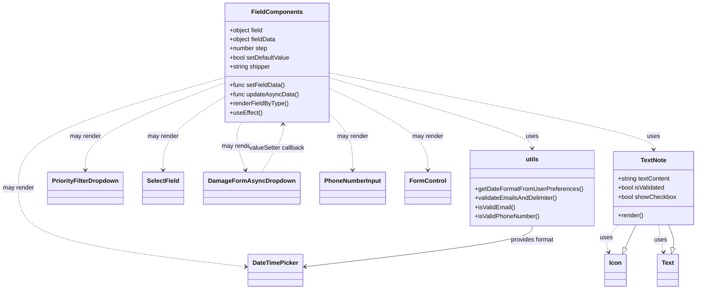

# Diagram: web/portal/src/pages/damageview/dashboard/components/DamageView.Form.FieldsRender.js


> Auto-generated by Obscura crawlers

## Diagram 1



### SVG

<svg id="container" width="1791.703125" xmlns="http://www.w3.org/2000/svg" class="classDiagram" height="758" viewBox="0 0 1791.703125 758" role="graphics-document document" aria-roledescription="class"><style>#container{font-family:"trebuchet ms",verdana,arial,sans-serif;font-size:16px;fill:#333;}@keyframes edge-animation-frame{from{stroke-dashoffset:0;}}@keyframes dash{to{stroke-dashoffset:0;}}#container .edge-animation-slow{stroke-dasharray:9,5!important;stroke-dashoffset:900;animation:dash 50s linear infinite;stroke-linecap:round;}#container .edge-animation-fast{stroke-dasharray:9,5!important;stroke-dashoffset:900;animation:dash 20s linear infinite;stroke-linecap:round;}#container .error-icon{fill:#552222;}#container .error-text{fill:#552222;stroke:#552222;}#container .edge-thickness-normal{stroke-width:1px;}#container .edge-thickness-thick{stroke-width:3.5px;}#container .edge-pattern-solid{stroke-dasharray:0;}#container .edge-thickness-invisible{stroke-width:0;fill:none;}#container .edge-pattern-dashed{stroke-dasharray:3;}#container .edge-pattern-dotted{stroke-dasharray:2;}#container .marker{fill:#333333;stroke:#333333;}#container .marker.cross{stroke:#333333;}#container svg{font-family:"trebuchet ms",verdana,arial,sans-serif;font-size:16px;}#container p{margin:0;}#container g.classGroup text{fill:#9370DB;stroke:none;font-family:"trebuchet ms",verdana,arial,sans-serif;font-size:10px;}#container g.classGroup text .title{font-weight:bolder;}#container .nodeLabel,#container .edgeLabel{color:#131300;}#container .edgeLabel .label rect{fill:#ECECFF;}#container .label text{fill:#131300;}#container .labelBkg{background:#ECECFF;}#container .edgeLabel .label span{background:#ECECFF;}#container .classTitle{font-weight:bolder;}#container .node rect,#container .node circle,#container .node ellipse,#container .node polygon,#container .node path{fill:#ECECFF;stroke:#9370DB;stroke-width:1px;}#container .divider{stroke:#9370DB;stroke-width:1;}#container g.clickable{cursor:pointer;}#container g.classGroup rect{fill:#ECECFF;stroke:#9370DB;}#container g.classGroup line{stroke:#9370DB;stroke-width:1;}#container .classLabel .box{stroke:none;stroke-width:0;fill:#ECECFF;opacity:0.5;}#container .classLabel .label{fill:#9370DB;font-size:10px;}#container .relation{stroke:#333333;stroke-width:1;fill:none;}#container .dashed-line{stroke-dasharray:3;}#container .dotted-line{stroke-dasharray:1 2;}#container #compositionStart,#container .composition{fill:#333333!important;stroke:#333333!important;stroke-width:1;}#container #compositionEnd,#container .composition{fill:#333333!important;stroke:#333333!important;stroke-width:1;}#container #dependencyStart,#container .dependency{fill:#333333!important;stroke:#333333!important;stroke-width:1;}#container #dependencyStart,#container .dependency{fill:#333333!important;stroke:#333333!important;stroke-width:1;}#container #extensionStart,#container .extension{fill:transparent!important;stroke:#333333!important;stroke-width:1;}#container #extensionEnd,#container .extension{fill:transparent!important;stroke:#333333!important;stroke-width:1;}#container #aggregationStart,#container .aggregation{fill:transparent!important;stroke:#333333!important;stroke-width:1;}#container #aggregationEnd,#container .aggregation{fill:transparent!important;stroke:#333333!important;stroke-width:1;}#container #lollipopStart,#container .lollipop{fill:#ECECFF!important;stroke:#333333!important;stroke-width:1;}#container #lollipopEnd,#container .lollipop{fill:#ECECFF!important;stroke:#333333!important;stroke-width:1;}#container .edgeTerminals{font-size:11px;line-height:initial;}#container .classTitleText{text-anchor:middle;font-size:18px;fill:#333;}#container .label-icon{display:inline-block;height:1em;overflow:visible;vertical-align:-0.125em;}#container .node .label-icon path{fill:currentColor;stroke:revert;stroke-width:revert;}#container :root{--mermaid-font-family:"trebuchet ms",verdana,arial,sans-serif;}</style><g><defs><marker id="container_class-aggregationStart" class="marker aggregation class" refX="18" refY="7" markerWidth="190" markerHeight="240" orient="auto"><path d="M 18,7 L9,13 L1,7 L9,1 Z"></path></marker></defs><defs><marker id="container_class-aggregationEnd" class="marker aggregation class" refX="1" refY="7" markerWidth="20" markerHeight="28" orient="auto"><path d="M 18,7 L9,13 L1,7 L9,1 Z"></path></marker></defs><defs><marker id="container_class-extensionStart" class="marker extension class" refX="18" refY="7" markerWidth="190" markerHeight="240" orient="auto"><path d="M 1,7 L18,13 V 1 Z"></path></marker></defs><defs><marker id="container_class-extensionEnd" class="marker extension class" refX="1" refY="7" markerWidth="20" markerHeight="28" orient="auto"><path d="M 1,1 V 13 L18,7 Z"></path></marker></defs><defs><marker id="container_class-compositionStart" class="marker composition class" refX="18" refY="7" markerWidth="190" markerHeight="240" orient="auto"><path d="M 18,7 L9,13 L1,7 L9,1 Z"></path></marker></defs><defs><marker id="container_class-compositionEnd" class="marker composition class" refX="1" refY="7" markerWidth="20" markerHeight="28" orient="auto"><path d="M 18,7 L9,13 L1,7 L9,1 Z"></path></marker></defs><defs><marker id="container_class-dependencyStart" class="marker dependency class" refX="6" refY="7" markerWidth="190" markerHeight="240" orient="auto"><path d="M 5,7 L9,13 L1,7 L9,1 Z"></path></marker></defs><defs><marker id="container_class-dependencyEnd" class="marker dependency class" refX="13" refY="7" markerWidth="20" markerHeight="28" orient="auto"><path d="M 18,7 L9,13 L14,7 L9,1 Z"></path></marker></defs><defs><marker id="container_class-lollipopStart" class="marker lollipop class" refX="13" refY="7" markerWidth="190" markerHeight="240" orient="auto"><circle stroke="black" fill="transparent" cx="7" cy="7" r="6"></circle></marker></defs><defs><marker id="container_class-lollipopEnd" class="marker lollipop class" refX="1" refY="7" markerWidth="190" markerHeight="240" orient="auto"><circle stroke="black" fill="transparent" cx="7" cy="7" r="6"></circle></marker></defs><g class="root"><g class="clusters"></g><g class="edgePaths"><path d="M1590.582,589L1584.417,595.667C1578.252,602.333,1565.922,615.667,1561.486,627.551C1557.051,639.435,1560.51,649.87,1562.239,655.087L1563.969,660.305" id="id_TextNote_Icon_1" class="edge-thickness-normal edge-pattern-dashed relation" style=";;;" data-edge="true" data-et="edge" data-id="id_TextNote_Icon_1" data-points="W3sieCI6MTU5MC41ODIyNjEwMjk0MTE3LCJ5Ijo1ODl9LHsieCI6MTU1My41OTE3OTY4NzUsInkiOjYyOX0seyJ4IjoxNTY1Ljg1NjgyODUyMDU2OTcsInkiOjY2Nn1d" marker-end="url(#container_class-dependencyEnd)"></path><path d="M1692.063,589L1692.945,595.667C1693.827,602.333,1695.591,615.667,1697.673,627.526C1699.754,639.385,1702.152,649.769,1703.352,654.962L1704.551,660.154" id="id_TextNote_Text_2" class="edge-thickness-normal edge-pattern-dashed relation" style=";;;" data-edge="true" data-et="edge" data-id="id_TextNote_Text_2" data-points="W3sieCI6MTY5Mi4wNjI1LCJ5Ijo1ODl9LHsieCI6MTY5Ny4zNTU0Njg3NSwieSI6NjI5fSx7IngiOjE3MDUuOTAxMTA3NTk0OTM2OCwieSI6NjY2fV0=" marker-end="url(#container_class-dependencyEnd)"></path><path d="M581.828,216.22L521.783,239.683C461.737,263.147,341.646,310.073,281.6,348.203C221.555,386.333,221.555,415.667,221.555,430.333L221.555,445" id="id_FieldComponents_PriorityFilterDropdown_3" class="edge-thickness-normal edge-pattern-dashed relation" style=";;;" data-edge="true" data-et="edge" data-id="id_FieldComponents_PriorityFilterDropdown_3" data-points="W3sieCI6NTgxLjgyODEyNSwieSI6MjE2LjIxOTc5NDIxMjMyMDM4fSx7IngiOjIyMS41NTQ2ODc1LCJ5IjozNTd9LHsieCI6MjIxLjU1NDY4NzUsInkiOjQ1MX1d" marker-end="url(#container_class-dependencyEnd)"></path><path d="M581.828,251.205L554.807,268.837C527.786,286.47,473.745,321.735,446.724,354.034C419.703,386.333,419.703,415.667,419.703,430.333L419.703,445" id="id_FieldComponents_SelectField_4" class="edge-thickness-normal edge-pattern-dashed relation" style=";;;" data-edge="true" data-et="edge" data-id="id_FieldComponents_SelectField_4" data-points="W3sieCI6NTgxLjgyODEyNSwieSI6MjUxLjIwNDk1Mjc4MzQ2NDN9LHsieCI6NDE5LjcwMzEyNSwieSI6MzU3fSx7IngiOjQxOS43MDMxMjUsInkiOjQ1MX1d" marker-end="url(#container_class-dependencyEnd)"></path><path d="M621.65,320L617.941,326.167C614.232,332.333,606.815,344.667,608.403,365.559C609.99,386.451,620.582,415.903,625.878,430.628L631.174,445.354" id="id_FieldComponents_DamageFormAsyncDropdown_5" class="edge-thickness-normal edge-pattern-dashed relation" style=";;;" data-edge="true" data-et="edge" data-id="id_FieldComponents_DamageFormAsyncDropdown_5" data-points="W3sieCI6NjIxLjY0OTUxMDIwMDc3NzIsInkiOjMyMH0seyJ4Ijo1OTkuMzk4NDM3NSwieSI6MzU3fSx7IngiOjYzMy4yMDM5ODY2NzI3OTQxLCJ5Ijo0NTF9XQ==" marker-end="url(#container_class-dependencyEnd)"></path><path d="M849.102,297.488L859.031,307.407C868.961,317.325,888.82,337.163,898.75,361.748C908.68,386.333,908.68,415.667,908.68,430.333L908.68,445" id="id_FieldComponents_PhoneNumberInput_6" class="edge-thickness-normal edge-pattern-dashed relation" style=";;;" data-edge="true" data-et="edge" data-id="id_FieldComponents_PhoneNumberInput_6" data-points="W3sieCI6ODQ5LjEwMTU2MjUsInkiOjI5Ny40ODgxMjI0MzQ5NTE0fSx7IngiOjkwOC42Nzk2ODc1LCJ5IjozNTd9LHsieCI6OTA4LjY3OTY4NzUsInkiOjQ1MX1d" marker-end="url(#container_class-dependencyEnd)"></path><path d="M849.102,231.216L890.781,252.18C932.461,273.144,1015.82,315.072,1057.5,350.703C1099.18,386.333,1099.18,415.667,1099.18,430.333L1099.18,445" id="id_FieldComponents_FormControl_7" class="edge-thickness-normal edge-pattern-dashed relation" style=";;;" data-edge="true" data-et="edge" data-id="id_FieldComponents_FormControl_7" data-points="W3sieCI6ODQ5LjEwMTU2MjUsInkiOjIzMS4yMTYyODYxMDExMjg5Nn0seyJ4IjoxMDk5LjE3OTY4NzUsInkiOjM1N30seyJ4IjoxMDk5LjE3OTY4NzUsInkiOjQ1MX1d" marker-end="url(#container_class-dependencyEnd)"></path><path d="M581.828,202.715L493.069,228.43C404.31,254.144,226.792,305.572,138.033,353.953C49.273,402.333,49.273,447.667,49.273,493C49.273,538.333,49.273,583.667,146.361,617.991C243.449,652.315,437.624,675.63,534.711,687.288L631.799,698.945" id="id_FieldComponents_DateTimePicker_8" class="edge-thickness-normal edge-pattern-dashed relation" style=";;;" data-edge="true" data-et="edge" data-id="id_FieldComponents_DateTimePicker_8" data-points="W3sieCI6NTgxLjgyODEyNSwieSI6MjAyLjcxNTQyOTk0NTE3NTc0fSx7IngiOjQ5LjI3MzQzNzUsInkiOjM1N30seyJ4Ijo0OS4yNzM0Mzc1LCJ5Ijo0OTN9LHsieCI6NDkuMjczNDM3NSwieSI6NjI5fSx7IngiOjYzNy43NTU4NTkzNzUsInkiOjY5OS42NjA1ODYwNTQyNzEzfV0=" marker-end="url(#container_class-dependencyEnd)"></path><path d="M849.102,203.669L935.192,229.224C1021.283,254.779,1193.464,305.89,1279.554,336.611C1365.645,367.333,1365.645,377.667,1365.645,382.833L1365.645,388" id="id_FieldComponents_utils_9" class="edge-thickness-normal edge-pattern-dashed relation" style=";;;" data-edge="true" data-et="edge" data-id="id_FieldComponents_utils_9" data-points="W3sieCI6ODQ5LjEwMTU2MjUsInkiOjIwMy42Njg4NTk1NzAwNzA3N30seyJ4IjoxMzY1LjY0NDUzMTI1LCJ5IjozNTd9LHsieCI6MTM2NS42NDQ1MzEyNSwieSI6Mzk0fV0=" marker-end="url(#container_class-dependencyEnd)"></path><path d="M849.102,190.758L987.478,218.465C1125.854,246.172,1402.607,301.586,1540.983,334.96C1679.359,368.333,1679.359,379.667,1679.359,385.333L1679.359,391" id="id_FieldComponents_TextNote_10" class="edge-thickness-normal edge-pattern-dashed relation" style=";;;" data-edge="true" data-et="edge" data-id="id_FieldComponents_TextNote_10" data-points="W3sieCI6ODQ5LjEwMTU2MjUsInkiOjE5MC43NTc5OTY3MzM2Mjg2M30seyJ4IjoxNjc5LjM1OTM3NSwieSI6MzU3fSx7IngiOjE2NzkuMzU5Mzc1LCJ5IjozOTd9XQ==" marker-end="url(#container_class-dependencyEnd)"></path><path d="M674.683,451L684.521,435.333C694.359,419.667,714.035,388.333,723.384,367.496C732.733,346.658,731.755,336.316,731.267,331.144L730.778,325.973" id="id_DamageFormAsyncDropdown_FieldComponents_11" class="edge-thickness-normal edge-pattern-dashed relation" style=";;;" data-edge="true" data-et="edge" data-id="id_DamageFormAsyncDropdown_FieldComponents_11" data-points="W3sieCI6Njc0LjY4Mjg0Njk2NjkxMTcsInkiOjQ1MX0seyJ4Ijo3MzMuNzEwOTM3NSwieSI6MzU3fSx7IngiOjczMC4yMTI5ODE3MDMzNjc5LCJ5IjozMjB9XQ==" marker-end="url(#container_class-dependencyEnd)"></path><path d="M1365.645,592L1365.645,598.167C1365.645,604.333,1365.645,616.667,1268.474,634.492C1171.303,652.317,976.961,675.635,879.79,687.293L782.619,698.952" id="id_utils_DateTimePicker_12" class="edge-thickness-normal edge-pattern-solid relation" style=";;;" data-edge="true" data-et="edge" data-id="id_utils_DateTimePicker_12" data-points="W3sieCI6MTM2NS42NDQ1MzEyNSwieSI6NTkyfSx7IngiOjEzNjUuNjQ0NTMxMjUsInkiOjYyOX0seyJ4Ijo3NzYuNjYyMTA5Mzc1LCJ5Ijo2OTkuNjY2OTE4ODAzMTUyNn1d" marker-end="url(#container_class-dependencyEnd)"></path><path d="M1604.743,650.162L1606.265,646.635C1607.788,643.108,1610.832,636.054,1615.565,625.86C1620.297,615.667,1626.717,602.333,1629.927,595.667L1633.136,589" id="id_Icon_TextNote_13" class="edge-thickness-normal edge-pattern-solid relation" style=";;;" data-edge="true" data-et="edge" data-id="id_Icon_TextNote_13" data-points="W3sieCI6MTU5Ny45MDcxNjQ3NTQ3NDY5LCJ5Ijo2NjZ9LHsieCI6MTYxMy44NzY5NTMxMjUsInkiOjYyOX0seyJ4IjoxNjMzLjEzNjQ4ODk3MDU4ODMsInkiOjU4OX1d" marker-start="url(#container_class-extensionStart)"></path><path d="M1729.184,649.192L1729.961,645.827C1730.739,642.462,1732.293,635.731,1730.399,625.699C1728.506,615.667,1723.164,602.333,1720.493,595.667L1717.822,589" id="id_Text_TextNote_14" class="edge-thickness-normal edge-pattern-solid relation" style=";;;" data-edge="true" data-et="edge" data-id="id_Text_TextNote_14" data-points="W3sieCI6MTcyNS4zMDIwMTc0MDUwNjMyLCJ5Ijo2NjZ9LHsieCI6MTczMy44NDc2NTYyNSwieSI6NjI5fSx7IngiOjE3MTcuODIxNjkxMTc2NDcwNSwieSI6NTg5fV0=" marker-start="url(#container_class-extensionStart)"></path></g><g class="edgeLabels"><g class="edgeLabel" transform="translate(1558.85438, 623.30925)"><g class="label" data-id="id_TextNote_Icon_1" transform="translate(-16.4921875, -12)"><foreignObject width="32.984375" height="24"><div xmlns="http://www.w3.org/1999/xhtml" class="labelBkg" style="display: table-cell; white-space: nowrap; line-height: 1.5; max-width: 200px; text-align: center;"><span class="edgeLabel"><p>uses</p></span></div></foreignObject></g></g><g class="edgeLabel" transform="translate(1697.19972, 627.82294)"><g class="label" data-id="id_TextNote_Text_2" transform="translate(-16.4921875, -12)"><foreignObject width="32.984375" height="24"><div xmlns="http://www.w3.org/1999/xhtml" class="labelBkg" style="display: table-cell; white-space: nowrap; line-height: 1.5; max-width: 200px; text-align: center;"><span class="edgeLabel"><p>uses</p></span></div></foreignObject></g></g><g class="edgeLabel" transform="translate(221.5546875, 357)"><g class="label" data-id="id_FieldComponents_PriorityFilterDropdown_3" transform="translate(-41.2734375, -12)"><foreignObject width="82.546875" height="24"><div xmlns="http://www.w3.org/1999/xhtml" class="labelBkg" style="display: table-cell; white-space: nowrap; line-height: 1.5; max-width: 200px; text-align: center;"><span class="edgeLabel"><p>may render</p></span></div></foreignObject></g></g><g class="edgeLabel" transform="translate(419.703125, 357)"><g class="label" data-id="id_FieldComponents_SelectField_4" transform="translate(-41.2734375, -12)"><foreignObject width="82.546875" height="24"><div xmlns="http://www.w3.org/1999/xhtml" class="labelBkg" style="display: table-cell; white-space: nowrap; line-height: 1.5; max-width: 200px; text-align: center;"><span class="edgeLabel"><p>may render</p></span></div></foreignObject></g></g><g class="edgeLabel" transform="translate(608.99564, 383.68606)"><g class="label" data-id="id_FieldComponents_DamageFormAsyncDropdown_5" transform="translate(-41.2734375, -12)"><foreignObject width="82.546875" height="24"><div xmlns="http://www.w3.org/1999/xhtml" class="labelBkg" style="display: table-cell; white-space: nowrap; line-height: 1.5; max-width: 200px; text-align: center;"><span class="edgeLabel"><p>may render</p></span></div></foreignObject></g></g><g class="edgeLabel" transform="translate(908.6796875, 357)"><g class="label" data-id="id_FieldComponents_PhoneNumberInput_6" transform="translate(-41.2734375, -12)"><foreignObject width="82.546875" height="24"><div xmlns="http://www.w3.org/1999/xhtml" class="labelBkg" style="display: table-cell; white-space: nowrap; line-height: 1.5; max-width: 200px; text-align: center;"><span class="edgeLabel"><p>may render</p></span></div></foreignObject></g></g><g class="edgeLabel" transform="translate(1099.1796875, 357)"><g class="label" data-id="id_FieldComponents_FormControl_7" transform="translate(-41.2734375, -12)"><foreignObject width="82.546875" height="24"><div xmlns="http://www.w3.org/1999/xhtml" class="labelBkg" style="display: table-cell; white-space: nowrap; line-height: 1.5; max-width: 200px; text-align: center;"><span class="edgeLabel"><p>may render</p></span></div></foreignObject></g></g><g class="edgeLabel" transform="translate(49.2734375, 493)"><g class="label" data-id="id_FieldComponents_DateTimePicker_8" transform="translate(-41.2734375, -12)"><foreignObject width="82.546875" height="24"><div xmlns="http://www.w3.org/1999/xhtml" class="labelBkg" style="display: table-cell; white-space: nowrap; line-height: 1.5; max-width: 200px; text-align: center;"><span class="edgeLabel"><p>may render</p></span></div></foreignObject></g></g><g class="edgeLabel" transform="translate(1365.64453125, 357)"><g class="label" data-id="id_FieldComponents_utils_9" transform="translate(-16.4921875, -12)"><foreignObject width="32.984375" height="24"><div xmlns="http://www.w3.org/1999/xhtml" class="labelBkg" style="display: table-cell; white-space: nowrap; line-height: 1.5; max-width: 200px; text-align: center;"><span class="edgeLabel"><p>uses</p></span></div></foreignObject></g></g><g class="edgeLabel" transform="translate(1679.359375, 357)"><g class="label" data-id="id_FieldComponents_TextNote_10" transform="translate(-16.4921875, -12)"><foreignObject width="32.984375" height="24"><div xmlns="http://www.w3.org/1999/xhtml" class="labelBkg" style="display: table-cell; white-space: nowrap; line-height: 1.5; max-width: 200px; text-align: center;"><span class="edgeLabel"><p>uses</p></span></div></foreignObject></g></g><g class="edgeLabel" transform="translate(714.07905, 388.26304)"><g class="label" data-id="id_DamageFormAsyncDropdown_FieldComponents_11" transform="translate(-73.0390625, -12)"><foreignObject width="146.078125" height="24"><div xmlns="http://www.w3.org/1999/xhtml" class="labelBkg" style="display: table-cell; white-space: nowrap; line-height: 1.5; max-width: 200px; text-align: center;"><span class="edgeLabel"><p>valueSetter callback</p></span></div></foreignObject></g></g><g class="edgeLabel" transform="translate(1365.64453125, 629)"><g class="label" data-id="id_utils_DateTimePicker_12" transform="translate(-57.890625, -12)"><foreignObject width="115.78125" height="24"><div xmlns="http://www.w3.org/1999/xhtml" class="labelBkg" style="display: table-cell; white-space: nowrap; line-height: 1.5; max-width: 200px; text-align: center;"><span class="edgeLabel"><p>provides format</p></span></div></foreignObject></g></g><g class="edgeLabel"><g class="label" data-id="id_Icon_TextNote_13" transform="translate(0, 0)"><foreignObject width="0" height="0"><div xmlns="http://www.w3.org/1999/xhtml" class="labelBkg" style="display: table-cell; white-space: nowrap; line-height: 1.5; max-width: 200px; text-align: center;"><span class="edgeLabel"></span></div></foreignObject></g></g><g class="edgeLabel"><g class="label" data-id="id_Text_TextNote_14" transform="translate(0, 0)"><foreignObject width="0" height="0"><div xmlns="http://www.w3.org/1999/xhtml" class="labelBkg" style="display: table-cell; white-space: nowrap; line-height: 1.5; max-width: 200px; text-align: center;"><span class="edgeLabel"></span></div></foreignObject></g></g></g><g class="nodes"><g class="node default" id="classId-TextNote-0" transform="translate(1679.359375, 493)"><g class="basic label-container"><path d="M-104.34375 -96 L104.34375 -96 L104.34375 96 L-104.34375 96" stroke="none" stroke-width="0" fill="#ECECFF" style=""></path><path d="M-104.34375 -96 C-33.746312391039055 -96, 36.85112521792189 -96, 104.34375 -96 M-104.34375 -96 C-32.01299715296648 -96, 40.317755694067046 -96, 104.34375 -96 M104.34375 -96 C104.34375 -19.97158833337798, 104.34375 56.05682333324404, 104.34375 96 M104.34375 -96 C104.34375 -48.47611435032112, 104.34375 -0.9522287006422374, 104.34375 96 M104.34375 96 C48.931006252007336 96, -6.481737495985328 96, -104.34375 96 M104.34375 96 C57.821180756272696 96, 11.298611512545392 96, -104.34375 96 M-104.34375 96 C-104.34375 27.50950872372553, -104.34375 -40.98098255254894, -104.34375 -96 M-104.34375 96 C-104.34375 54.71968379973504, -104.34375 13.439367599470074, -104.34375 -96" stroke="#9370DB" stroke-width="1.3" fill="none" stroke-dasharray="0 0" style=""></path></g><g class="annotation-group text" transform="translate(0, -72)"></g><g class="label-group text" transform="translate(-32.71875, -72)"><g class="label" style="font-weight: bolder" transform="translate(0,-12)"><foreignObject width="65.4375" height="24"><div xmlns="http://www.w3.org/1999/xhtml" style="display: table-cell; white-space: nowrap; line-height: 1.5; max-width: 114px; text-align: center;"><span class="nodeLabel markdown-node-label" style=""><p>TextNote</p></span></div></foreignObject></g></g><g class="members-group text" transform="translate(-92.34375, -24)"><g class="label" style="" transform="translate(0,-12)"><foreignObject width="138.28125" height="24"><div xmlns="http://www.w3.org/1999/xhtml" style="display: table-cell; white-space: nowrap; line-height: 1.5; max-width: 196px; text-align: center;"><span class="nodeLabel markdown-node-label" style=""><p>+string textContent</p></span></div></foreignObject></g><g class="label" style="" transform="translate(0,12)"><foreignObject width="125.1875" height="24"><div xmlns="http://www.w3.org/1999/xhtml" style="display: table-cell; white-space: nowrap; line-height: 1.5; max-width: 183px; text-align: center;"><span class="nodeLabel markdown-node-label" style=""><p>+bool isValidated</p></span></div></foreignObject></g><g class="label" style="" transform="translate(0,36)"><foreignObject width="151.96875" height="24"><div xmlns="http://www.w3.org/1999/xhtml" style="display: table-cell; white-space: nowrap; line-height: 1.5; max-width: 210px; text-align: center;"><span class="nodeLabel markdown-node-label" style=""><p>+bool showCheckbox</p></span></div></foreignObject></g></g><g class="methods-group text" transform="translate(-92.34375, 72)"><g class="label" style="" transform="translate(0,-12)"><foreignObject width="66.609375" height="24"><div xmlns="http://www.w3.org/1999/xhtml" style="display: table-cell; white-space: nowrap; line-height: 1.5; max-width: 124px; text-align: center;"><span class="nodeLabel markdown-node-label" style=""><p>+render()</p></span></div></foreignObject></g></g><g class="divider" style=""><path d="M-104.34375 -48 C-48.77317522879489 -48, 6.7973995424102185 -48, 104.34375 -48 M-104.34375 -48 C-45.586162386251466 -48, 13.171425227497068 -48, 104.34375 -48" stroke="#9370DB" stroke-width="1.3" fill="none" stroke-dasharray="0 0" style=""></path></g><g class="divider" style=""><path d="M-104.34375 48 C-31.264171644866437 48, 41.815406710267126 48, 104.34375 48 M-104.34375 48 C-58.42779285462426 48, -12.511835709248516 48, 104.34375 48" stroke="#9370DB" stroke-width="1.3" fill="none" stroke-dasharray="0 0" style=""></path></g></g><g class="node default" id="classId-FieldComponents-1" transform="translate(715.46484375, 164)"><g class="basic label-container"><path d="M-133.63671875 -156 L133.63671875 -156 L133.63671875 156 L-133.63671875 156" stroke="none" stroke-width="0" fill="#ECECFF" style=""></path><path d="M-133.63671875 -156 C-62.230806752990134 -156, 9.175105244019733 -156, 133.63671875 -156 M-133.63671875 -156 C-55.33725064648566 -156, 22.962217457028686 -156, 133.63671875 -156 M133.63671875 -156 C133.63671875 -66.57367681219303, 133.63671875 22.852646375613944, 133.63671875 156 M133.63671875 -156 C133.63671875 -49.87805794580588, 133.63671875 56.243884108388244, 133.63671875 156 M133.63671875 156 C69.1931413177303 156, 4.749563885460589 156, -133.63671875 156 M133.63671875 156 C29.979400971844626 156, -73.67791680631075 156, -133.63671875 156 M-133.63671875 156 C-133.63671875 36.56999100111739, -133.63671875 -82.86001799776523, -133.63671875 -156 M-133.63671875 156 C-133.63671875 58.871483416724104, -133.63671875 -38.25703316655179, -133.63671875 -156" stroke="#9370DB" stroke-width="1.3" fill="none" stroke-dasharray="0 0" style=""></path></g><g class="annotation-group text" transform="translate(0, -132)"></g><g class="label-group text" transform="translate(-63.3984375, -132)"><g class="label" style="font-weight: bolder" transform="translate(0,-12)"><foreignObject width="126.796875" height="24"><div xmlns="http://www.w3.org/1999/xhtml" style="display: table-cell; white-space: nowrap; line-height: 1.5; max-width: 176px; text-align: center;"><span class="nodeLabel markdown-node-label" style=""><p>FieldComponents</p></span></div></foreignObject></g></g><g class="members-group text" transform="translate(-121.63671875, -84)"><g class="label" style="" transform="translate(0,-12)"><foreignObject width="89.796875" height="24"><div xmlns="http://www.w3.org/1999/xhtml" style="display: table-cell; white-space: nowrap; line-height: 1.5; max-width: 147px; text-align: center;"><span class="nodeLabel markdown-node-label" style=""><p>+object field</p></span></div></foreignObject></g><g class="label" style="" transform="translate(0,12)"><foreignObject width="123.015625" height="24"><div xmlns="http://www.w3.org/1999/xhtml" style="display: table-cell; white-space: nowrap; line-height: 1.5; max-width: 180px; text-align: center;"><span class="nodeLabel markdown-node-label" style=""><p>+object fieldData</p></span></div></foreignObject></g><g class="label" style="" transform="translate(0,36)"><foreignObject width="100.265625" height="24"><div xmlns="http://www.w3.org/1999/xhtml" style="display: table-cell; white-space: nowrap; line-height: 1.5; max-width: 158px; text-align: center;"><span class="nodeLabel markdown-node-label" style=""><p>+number step</p></span></div></foreignObject></g><g class="label" style="" transform="translate(0,60)"><foreignObject width="159.109375" height="24"><div xmlns="http://www.w3.org/1999/xhtml" style="display: table-cell; white-space: nowrap; line-height: 1.5; max-width: 216px; text-align: center;"><span class="nodeLabel markdown-node-label" style=""><p>+bool setDefaultValue</p></span></div></foreignObject></g><g class="label" style="" transform="translate(0,84)"><foreignObject width="109.125" height="24"><div xmlns="http://www.w3.org/1999/xhtml" style="display: table-cell; white-space: nowrap; line-height: 1.5; max-width: 167px; text-align: center;"><span class="nodeLabel markdown-node-label" style=""><p>+string shipper</p></span></div></foreignObject></g></g><g class="methods-group text" transform="translate(-121.63671875, 60)"><g class="label" style="" transform="translate(0,-12)"><foreignObject width="143.9375" height="24"><div xmlns="http://www.w3.org/1999/xhtml" style="display: table-cell; white-space: nowrap; line-height: 1.5; max-width: 201px; text-align: center;"><span class="nodeLabel markdown-node-label" style=""><p>+func setFieldData()</p></span></div></foreignObject></g><g class="label" style="" transform="translate(0,12)"><foreignObject width="179.875" height="24"><div xmlns="http://www.w3.org/1999/xhtml" style="display: table-cell; white-space: nowrap; line-height: 1.5; max-width: 237px; text-align: center;"><span class="nodeLabel markdown-node-label" style=""><p>+func updateAsyncData()</p></span></div></foreignObject></g><g class="label" style="" transform="translate(0,36)"><foreignObject width="152.640625" height="24"><div xmlns="http://www.w3.org/1999/xhtml" style="display: table-cell; white-space: nowrap; line-height: 1.5; max-width: 210px; text-align: center;"><span class="nodeLabel markdown-node-label" style=""><p>+renderFieldByType()</p></span></div></foreignObject></g><g class="label" style="" transform="translate(0,60)"><foreignObject width="84.8125" height="24"><div xmlns="http://www.w3.org/1999/xhtml" style="display: table-cell; white-space: nowrap; line-height: 1.5; max-width: 142px; text-align: center;"><span class="nodeLabel markdown-node-label" style=""><p>+useEffect()</p></span></div></foreignObject></g></g><g class="divider" style=""><path d="M-133.63671875 -108 C-30.84044585311041 -108, 71.95582704377918 -108, 133.63671875 -108 M-133.63671875 -108 C-53.31595168324476 -108, 27.004815383510476 -108, 133.63671875 -108" stroke="#9370DB" stroke-width="1.3" fill="none" stroke-dasharray="0 0" style=""></path></g><g class="divider" style=""><path d="M-133.63671875 36 C-78.64530858106409 36, -23.65389841212817 36, 133.63671875 36 M-133.63671875 36 C-53.551028593320964 36, 26.53466156335807 36, 133.63671875 36" stroke="#9370DB" stroke-width="1.3" fill="none" stroke-dasharray="0 0" style=""></path></g></g><g class="node default" id="classId-PriorityFilterDropdown-2" transform="translate(221.5546875, 493)"><g class="basic label-container"><path d="M-96.0078125 -42 L96.0078125 -42 L96.0078125 42 L-96.0078125 42" stroke="none" stroke-width="0" fill="#ECECFF" style=""></path><path d="M-96.0078125 -42 C-26.140874403927697 -42, 43.726063692144606 -42, 96.0078125 -42 M-96.0078125 -42 C-42.48567851054181 -42, 11.03645547891638 -42, 96.0078125 -42 M96.0078125 -42 C96.0078125 -12.13959165062051, 96.0078125 17.72081669875898, 96.0078125 42 M96.0078125 -42 C96.0078125 -11.145879040367358, 96.0078125 19.708241919265284, 96.0078125 42 M96.0078125 42 C23.082246648217136 42, -49.84331920356573 42, -96.0078125 42 M96.0078125 42 C53.99162896289106 42, 11.975445425782127 42, -96.0078125 42 M-96.0078125 42 C-96.0078125 18.938952141830423, -96.0078125 -4.122095716339153, -96.0078125 -42 M-96.0078125 42 C-96.0078125 17.98451939387699, -96.0078125 -6.030961212246019, -96.0078125 -42" stroke="#9370DB" stroke-width="1.3" fill="none" stroke-dasharray="0 0" style=""></path></g><g class="annotation-group text" transform="translate(0, -18)"></g><g class="label-group text" transform="translate(-84.0078125, -18)"><g class="label" style="font-weight: bolder" transform="translate(0,-12)"><foreignObject width="168.015625" height="24"><div xmlns="http://www.w3.org/1999/xhtml" style="display: table-cell; white-space: nowrap; line-height: 1.5; max-width: 215px; text-align: center;"><span class="nodeLabel markdown-node-label" style=""><p>PriorityFilterDropdown</p></span></div></foreignObject></g></g><g class="members-group text" transform="translate(-84.0078125, 30)"></g><g class="methods-group text" transform="translate(-84.0078125, 60)"></g><g class="divider" style=""><path d="M-96.0078125 6 C-45.407073139650734 6, 5.193666220698532 6, 96.0078125 6 M-96.0078125 6 C-33.33131344649419 6, 29.345185607011615 6, 96.0078125 6" stroke="#9370DB" stroke-width="1.3" fill="none" stroke-dasharray="0 0" style=""></path></g><g class="divider" style=""><path d="M-96.0078125 24 C-21.419594970090614 24, 53.16862255981877 24, 96.0078125 24 M-96.0078125 24 C-43.73253485508341 24, 8.542742789833184 24, 96.0078125 24" stroke="#9370DB" stroke-width="1.3" fill="none" stroke-dasharray="0 0" style=""></path></g></g><g class="node default" id="classId-SelectField-3" transform="translate(419.703125, 493)"><g class="basic label-container"><path d="M-52.140625 -42 L52.140625 -42 L52.140625 42 L-52.140625 42" stroke="none" stroke-width="0" fill="#ECECFF" style=""></path><path d="M-52.140625 -42 C-29.64924853841641 -42, -7.157872076832817 -42, 52.140625 -42 M-52.140625 -42 C-30.988253688094034 -42, -9.835882376188067 -42, 52.140625 -42 M52.140625 -42 C52.140625 -13.043820953438797, 52.140625 15.912358093122407, 52.140625 42 M52.140625 -42 C52.140625 -21.487721096635763, 52.140625 -0.975442193271526, 52.140625 42 M52.140625 42 C12.370548054832994 42, -27.39952889033401 42, -52.140625 42 M52.140625 42 C27.611398360368057 42, 3.0821717207361132 42, -52.140625 42 M-52.140625 42 C-52.140625 12.629480001369728, -52.140625 -16.741039997260543, -52.140625 -42 M-52.140625 42 C-52.140625 23.773873700097916, -52.140625 5.547747400195831, -52.140625 -42" stroke="#9370DB" stroke-width="1.3" fill="none" stroke-dasharray="0 0" style=""></path></g><g class="annotation-group text" transform="translate(0, -18)"></g><g class="label-group text" transform="translate(-40.140625, -18)"><g class="label" style="font-weight: bolder" transform="translate(0,-12)"><foreignObject width="80.28125" height="24"><div xmlns="http://www.w3.org/1999/xhtml" style="display: table-cell; white-space: nowrap; line-height: 1.5; max-width: 129px; text-align: center;"><span class="nodeLabel markdown-node-label" style=""><p>SelectField</p></span></div></foreignObject></g></g><g class="members-group text" transform="translate(-40.140625, 30)"></g><g class="methods-group text" transform="translate(-40.140625, 60)"></g><g class="divider" style=""><path d="M-52.140625 6 C-19.336185837702786 6, 13.468253324594428 6, 52.140625 6 M-52.140625 6 C-12.507526590348398 6, 27.125571819303204 6, 52.140625 6" stroke="#9370DB" stroke-width="1.3" fill="none" stroke-dasharray="0 0" style=""></path></g><g class="divider" style=""><path d="M-52.140625 24 C-12.815073321967276 24, 26.51047835606545 24, 52.140625 24 M-52.140625 24 C-25.88626343199947 24, 0.3680981360010591 24, 52.140625 24" stroke="#9370DB" stroke-width="1.3" fill="none" stroke-dasharray="0 0" style=""></path></g></g><g class="node default" id="classId-DamageFormAsyncDropdown-4" transform="translate(648.30859375, 493)"><g class="basic label-container"><path d="M-118.2109375 -42 L118.2109375 -42 L118.2109375 42 L-118.2109375 42" stroke="none" stroke-width="0" fill="#ECECFF" style=""></path><path d="M-118.2109375 -42 C-31.305113526862925 -42, 55.60071044627415 -42, 118.2109375 -42 M-118.2109375 -42 C-70.28290175241824 -42, -22.354866004836467 -42, 118.2109375 -42 M118.2109375 -42 C118.2109375 -15.26917557158519, 118.2109375 11.461648856829619, 118.2109375 42 M118.2109375 -42 C118.2109375 -23.230693672947424, 118.2109375 -4.461387345894849, 118.2109375 42 M118.2109375 42 C51.493512422446344 42, -15.223912655107313 42, -118.2109375 42 M118.2109375 42 C41.59590850176144 42, -35.019120496477115 42, -118.2109375 42 M-118.2109375 42 C-118.2109375 18.329568551290503, -118.2109375 -5.340862897418994, -118.2109375 -42 M-118.2109375 42 C-118.2109375 12.088678135845967, -118.2109375 -17.822643728308066, -118.2109375 -42" stroke="#9370DB" stroke-width="1.3" fill="none" stroke-dasharray="0 0" style=""></path></g><g class="annotation-group text" transform="translate(0, -18)"></g><g class="label-group text" transform="translate(-106.2109375, -18)"><g class="label" style="font-weight: bolder" transform="translate(0,-12)"><foreignObject width="212.421875" height="24"><div xmlns="http://www.w3.org/1999/xhtml" style="display: table-cell; white-space: nowrap; line-height: 1.5; max-width: 260px; text-align: center;"><span class="nodeLabel markdown-node-label" style=""><p>DamageFormAsyncDropdown</p></span></div></foreignObject></g></g><g class="members-group text" transform="translate(-106.2109375, 30)"></g><g class="methods-group text" transform="translate(-106.2109375, 60)"></g><g class="divider" style=""><path d="M-118.2109375 6 C-37.4824275872723 6, 43.246082325455404 6, 118.2109375 6 M-118.2109375 6 C-64.64247874488262 6, -11.074019989765262 6, 118.2109375 6" stroke="#9370DB" stroke-width="1.3" fill="none" stroke-dasharray="0 0" style=""></path></g><g class="divider" style=""><path d="M-118.2109375 24 C-33.02781286949167 24, 52.15531176101666 24, 118.2109375 24 M-118.2109375 24 C-41.67460423730638 24, 34.861729025387234 24, 118.2109375 24" stroke="#9370DB" stroke-width="1.3" fill="none" stroke-dasharray="0 0" style=""></path></g></g><g class="node default" id="classId-PhoneNumberInput-5" transform="translate(908.6796875, 493)"><g class="basic label-container"><path d="M-83.40625 -42 L83.40625 -42 L83.40625 42 L-83.40625 42" stroke="none" stroke-width="0" fill="#ECECFF" style=""></path><path d="M-83.40625 -42 C-30.27137841153411 -42, 22.863493176931783 -42, 83.40625 -42 M-83.40625 -42 C-18.40034889495844 -42, 46.60555221008312 -42, 83.40625 -42 M83.40625 -42 C83.40625 -24.01636869321736, 83.40625 -6.032737386434718, 83.40625 42 M83.40625 -42 C83.40625 -13.313483657678024, 83.40625 15.373032684643952, 83.40625 42 M83.40625 42 C36.861967549739774 42, -9.682314900520453 42, -83.40625 42 M83.40625 42 C38.860309907073805 42, -5.685630185852389 42, -83.40625 42 M-83.40625 42 C-83.40625 12.581470288801611, -83.40625 -16.837059422396777, -83.40625 -42 M-83.40625 42 C-83.40625 18.68500310498734, -83.40625 -4.629993790025317, -83.40625 -42" stroke="#9370DB" stroke-width="1.3" fill="none" stroke-dasharray="0 0" style=""></path></g><g class="annotation-group text" transform="translate(0, -18)"></g><g class="label-group text" transform="translate(-71.40625, -18)"><g class="label" style="font-weight: bolder" transform="translate(0,-12)"><foreignObject width="142.8125" height="24"><div xmlns="http://www.w3.org/1999/xhtml" style="display: table-cell; white-space: nowrap; line-height: 1.5; max-width: 193px; text-align: center;"><span class="nodeLabel markdown-node-label" style=""><p>PhoneNumberInput</p></span></div></foreignObject></g></g><g class="members-group text" transform="translate(-71.40625, 30)"></g><g class="methods-group text" transform="translate(-71.40625, 60)"></g><g class="divider" style=""><path d="M-83.40625 6 C-45.889467555147775 6, -8.37268511029555 6, 83.40625 6 M-83.40625 6 C-36.33989906318125 6, 10.726451873637501 6, 83.40625 6" stroke="#9370DB" stroke-width="1.3" fill="none" stroke-dasharray="0 0" style=""></path></g><g class="divider" style=""><path d="M-83.40625 24 C-24.132475889160695 24, 35.14129822167861 24, 83.40625 24 M-83.40625 24 C-37.52781964928367 24, 8.350610701432657 24, 83.40625 24" stroke="#9370DB" stroke-width="1.3" fill="none" stroke-dasharray="0 0" style=""></path></g></g><g class="node default" id="classId-FormControl-6" transform="translate(1099.1796875, 493)"><g class="basic label-container"><path d="M-57.09375 -42 L57.09375 -42 L57.09375 42 L-57.09375 42" stroke="none" stroke-width="0" fill="#ECECFF" style=""></path><path d="M-57.09375 -42 C-15.077087522334075 -42, 26.93957495533185 -42, 57.09375 -42 M-57.09375 -42 C-17.89307859219099 -42, 21.307592815618023 -42, 57.09375 -42 M57.09375 -42 C57.09375 -18.764113439909238, 57.09375 4.471773120181524, 57.09375 42 M57.09375 -42 C57.09375 -11.526570144281198, 57.09375 18.946859711437604, 57.09375 42 M57.09375 42 C20.103079888672823 42, -16.887590222654353 42, -57.09375 42 M57.09375 42 C12.400315997251894 42, -32.29311800549621 42, -57.09375 42 M-57.09375 42 C-57.09375 12.196017417063768, -57.09375 -17.607965165872464, -57.09375 -42 M-57.09375 42 C-57.09375 10.170886507717633, -57.09375 -21.658226984564735, -57.09375 -42" stroke="#9370DB" stroke-width="1.3" fill="none" stroke-dasharray="0 0" style=""></path></g><g class="annotation-group text" transform="translate(0, -18)"></g><g class="label-group text" transform="translate(-45.09375, -18)"><g class="label" style="font-weight: bolder" transform="translate(0,-12)"><foreignObject width="90.1875" height="24"><div xmlns="http://www.w3.org/1999/xhtml" style="display: table-cell; white-space: nowrap; line-height: 1.5; max-width: 140px; text-align: center;"><span class="nodeLabel markdown-node-label" style=""><p>FormControl</p></span></div></foreignObject></g></g><g class="members-group text" transform="translate(-45.09375, 30)"></g><g class="methods-group text" transform="translate(-45.09375, 60)"></g><g class="divider" style=""><path d="M-57.09375 6 C-14.51595406020521 6, 28.06184187958958 6, 57.09375 6 M-57.09375 6 C-26.204282983795004 6, 4.6851840324099925 6, 57.09375 6" stroke="#9370DB" stroke-width="1.3" fill="none" stroke-dasharray="0 0" style=""></path></g><g class="divider" style=""><path d="M-57.09375 24 C-30.67598389116592 24, -4.25821778233184 24, 57.09375 24 M-57.09375 24 C-23.169842812816235 24, 10.75406437436753 24, 57.09375 24" stroke="#9370DB" stroke-width="1.3" fill="none" stroke-dasharray="0 0" style=""></path></g></g><g class="node default" id="classId-DateTimePicker-7" transform="translate(707.208984375, 708)"><g class="basic label-container"><path d="M-69.453125 -42 L69.453125 -42 L69.453125 42 L-69.453125 42" stroke="none" stroke-width="0" fill="#ECECFF" style=""></path><path d="M-69.453125 -42 C-31.600765998282363 -42, 6.251593003435275 -42, 69.453125 -42 M-69.453125 -42 C-24.921972330421376 -42, 19.60918033915725 -42, 69.453125 -42 M69.453125 -42 C69.453125 -11.061864482292524, 69.453125 19.876271035414952, 69.453125 42 M69.453125 -42 C69.453125 -16.209685381709566, 69.453125 9.580629236580869, 69.453125 42 M69.453125 42 C26.806305878584176 42, -15.840513242831648 42, -69.453125 42 M69.453125 42 C23.562761975933277 42, -22.327601048133445 42, -69.453125 42 M-69.453125 42 C-69.453125 22.231710373037444, -69.453125 2.4634207460748883, -69.453125 -42 M-69.453125 42 C-69.453125 19.443551265631218, -69.453125 -3.1128974687375646, -69.453125 -42" stroke="#9370DB" stroke-width="1.3" fill="none" stroke-dasharray="0 0" style=""></path></g><g class="annotation-group text" transform="translate(0, -18)"></g><g class="label-group text" transform="translate(-57.453125, -18)"><g class="label" style="font-weight: bolder" transform="translate(0,-12)"><foreignObject width="114.90625" height="24"><div xmlns="http://www.w3.org/1999/xhtml" style="display: table-cell; white-space: nowrap; line-height: 1.5; max-width: 164px; text-align: center;"><span class="nodeLabel markdown-node-label" style=""><p>DateTimePicker</p></span></div></foreignObject></g></g><g class="members-group text" transform="translate(-57.453125, 30)"></g><g class="methods-group text" transform="translate(-57.453125, 60)"></g><g class="divider" style=""><path d="M-69.453125 6 C-15.713948187023206 6, 38.02522862595359 6, 69.453125 6 M-69.453125 6 C-15.827875792625541 6, 37.79737341474892 6, 69.453125 6" stroke="#9370DB" stroke-width="1.3" fill="none" stroke-dasharray="0 0" style=""></path></g><g class="divider" style=""><path d="M-69.453125 24 C-24.24978417837343 24, 20.953556643253137 24, 69.453125 24 M-69.453125 24 C-34.81600115586965 24, -0.17887731173929922 24, 69.453125 24" stroke="#9370DB" stroke-width="1.3" fill="none" stroke-dasharray="0 0" style=""></path></g></g><g class="node default" id="classId-Icon-8" transform="translate(1579.779296875, 708)"><g class="basic label-container"><path d="M-27.3046875 -42 L27.3046875 -42 L27.3046875 42 L-27.3046875 42" stroke="none" stroke-width="0" fill="#ECECFF" style=""></path><path d="M-27.3046875 -42 C-9.775732284857838 -42, 7.753222930284323 -42, 27.3046875 -42 M-27.3046875 -42 C-11.752227594058944 -42, 3.8002323118821124 -42, 27.3046875 -42 M27.3046875 -42 C27.3046875 -17.405783066792754, 27.3046875 7.188433866414492, 27.3046875 42 M27.3046875 -42 C27.3046875 -19.33164330006767, 27.3046875 3.3367133998646565, 27.3046875 42 M27.3046875 42 C10.67672320208732 42, -5.95124109582536 42, -27.3046875 42 M27.3046875 42 C15.758962342933328 42, 4.213237185866657 42, -27.3046875 42 M-27.3046875 42 C-27.3046875 11.264664007828856, -27.3046875 -19.47067198434229, -27.3046875 -42 M-27.3046875 42 C-27.3046875 12.14307871689683, -27.3046875 -17.71384256620634, -27.3046875 -42" stroke="#9370DB" stroke-width="1.3" fill="none" stroke-dasharray="0 0" style=""></path></g><g class="annotation-group text" transform="translate(0, -18)"></g><g class="label-group text" transform="translate(-15.3046875, -18)"><g class="label" style="font-weight: bolder" transform="translate(0,-12)"><foreignObject width="30.609375" height="24"><div xmlns="http://www.w3.org/1999/xhtml" style="display: table-cell; white-space: nowrap; line-height: 1.5; max-width: 81px; text-align: center;"><span class="nodeLabel markdown-node-label" style=""><p>Icon</p></span></div></foreignObject></g></g><g class="members-group text" transform="translate(-15.3046875, 30)"></g><g class="methods-group text" transform="translate(-15.3046875, 60)"></g><g class="divider" style=""><path d="M-27.3046875 6 C-13.867222377523053 6, -0.4297572550461055 6, 27.3046875 6 M-27.3046875 6 C-5.795539814007217 6, 15.713607871985566 6, 27.3046875 6" stroke="#9370DB" stroke-width="1.3" fill="none" stroke-dasharray="0 0" style=""></path></g><g class="divider" style=""><path d="M-27.3046875 24 C-6.759271993002653 24, 13.786143513994695 24, 27.3046875 24 M-27.3046875 24 C-9.412435365877581 24, 8.479816768244838 24, 27.3046875 24" stroke="#9370DB" stroke-width="1.3" fill="none" stroke-dasharray="0 0" style=""></path></g></g><g class="node default" id="classId-Text-9" transform="translate(1715.6015625, 708)"><g class="basic label-container"><path d="M-27.3828125 -42 L27.3828125 -42 L27.3828125 42 L-27.3828125 42" stroke="none" stroke-width="0" fill="#ECECFF" style=""></path><path d="M-27.3828125 -42 C-13.410416001972594 -42, 0.5619804960548116 -42, 27.3828125 -42 M-27.3828125 -42 C-15.611758241122459 -42, -3.840703982244918 -42, 27.3828125 -42 M27.3828125 -42 C27.3828125 -15.33961985109244, 27.3828125 11.32076029781512, 27.3828125 42 M27.3828125 -42 C27.3828125 -11.817741184488707, 27.3828125 18.364517631022586, 27.3828125 42 M27.3828125 42 C11.579856829210227 42, -4.223098841579546 42, -27.3828125 42 M27.3828125 42 C12.439647430788815 42, -2.5035176384223696 42, -27.3828125 42 M-27.3828125 42 C-27.3828125 22.0780288215414, -27.3828125 2.1560576430827965, -27.3828125 -42 M-27.3828125 42 C-27.3828125 15.284143077368483, -27.3828125 -11.431713845263033, -27.3828125 -42" stroke="#9370DB" stroke-width="1.3" fill="none" stroke-dasharray="0 0" style=""></path></g><g class="annotation-group text" transform="translate(0, -18)"></g><g class="label-group text" transform="translate(-15.3828125, -18)"><g class="label" style="font-weight: bolder" transform="translate(0,-12)"><foreignObject width="30.765625" height="24"><div xmlns="http://www.w3.org/1999/xhtml" style="display: table-cell; white-space: nowrap; line-height: 1.5; max-width: 80px; text-align: center;"><span class="nodeLabel markdown-node-label" style=""><p>Text</p></span></div></foreignObject></g></g><g class="members-group text" transform="translate(-15.3828125, 30)"></g><g class="methods-group text" transform="translate(-15.3828125, 60)"></g><g class="divider" style=""><path d="M-27.3828125 6 C-7.98538199383615 6, 11.4120485123277 6, 27.3828125 6 M-27.3828125 6 C-8.100915814210936 6, 11.180980871578129 6, 27.3828125 6" stroke="#9370DB" stroke-width="1.3" fill="none" stroke-dasharray="0 0" style=""></path></g><g class="divider" style=""><path d="M-27.3828125 24 C-14.65010463769068 24, -1.9173967753813592 24, 27.3828125 24 M-27.3828125 24 C-12.948537034286227 24, 1.4857384314275457 24, 27.3828125 24" stroke="#9370DB" stroke-width="1.3" fill="none" stroke-dasharray="0 0" style=""></path></g></g><g class="node default" id="classId-utils-10" transform="translate(1365.64453125, 493)"><g class="basic label-container"><path d="M-159.37109375 -99 L159.37109375 -99 L159.37109375 99 L-159.37109375 99" stroke="none" stroke-width="0" fill="#ECECFF" style=""></path><path d="M-159.37109375 -99 C-36.19050934367 -99, 86.99007506266 -99, 159.37109375 -99 M-159.37109375 -99 C-36.63445083981067 -99, 86.10219207037866 -99, 159.37109375 -99 M159.37109375 -99 C159.37109375 -51.20525794799283, 159.37109375 -3.410515895985654, 159.37109375 99 M159.37109375 -99 C159.37109375 -55.653157730568665, 159.37109375 -12.30631546113733, 159.37109375 99 M159.37109375 99 C49.29924304332549 99, -60.77260766334902 99, -159.37109375 99 M159.37109375 99 C41.562586363187876 99, -76.24592102362425 99, -159.37109375 99 M-159.37109375 99 C-159.37109375 48.031368990015615, -159.37109375 -2.9372620199687702, -159.37109375 -99 M-159.37109375 99 C-159.37109375 24.455944988552815, -159.37109375 -50.08811002289437, -159.37109375 -99" stroke="#9370DB" stroke-width="1.3" fill="none" stroke-dasharray="0 0" style=""></path></g><g class="annotation-group text" transform="translate(0, -75)"></g><g class="label-group text" transform="translate(-16.1640625, -75)"><g class="label" style="font-weight: bolder" transform="translate(0,-12)"><foreignObject width="32.328125" height="24"><div xmlns="http://www.w3.org/1999/xhtml" style="display: table-cell; white-space: nowrap; line-height: 1.5; max-width: 82px; text-align: center;"><span class="nodeLabel markdown-node-label" style=""><p>utils</p></span></div></foreignObject></g></g><g class="members-group text" transform="translate(-147.37109375, -27)"></g><g class="methods-group text" transform="translate(-147.37109375, 3)"><g class="label" style="" transform="translate(0,-12)"><foreignObject width="278.578125" height="24"><div xmlns="http://www.w3.org/1999/xhtml" style="display: table-cell; white-space: nowrap; line-height: 1.5; max-width: 336px; text-align: center;"><span class="nodeLabel markdown-node-label" style=""><p>+getDateFormatFromUserPreferences()</p></span></div></foreignObject></g><g class="label" style="" transform="translate(0,12)"><foreignObject width="218.5625" height="24"><div xmlns="http://www.w3.org/1999/xhtml" style="display: table-cell; white-space: nowrap; line-height: 1.5; max-width: 276px; text-align: center;"><span class="nodeLabel markdown-node-label" style=""><p>+validateEmailsAndDelimiter()</p></span></div></foreignObject></g><g class="label" style="" transform="translate(0,36)"><foreignObject width="105.921875" height="24"><div xmlns="http://www.w3.org/1999/xhtml" style="display: table-cell; white-space: nowrap; line-height: 1.5; max-width: 163px; text-align: center;"><span class="nodeLabel markdown-node-label" style=""><p>+isValidEmail()</p></span></div></foreignObject></g><g class="label" style="" transform="translate(0,60)"><foreignObject width="170.0625" height="24"><div xmlns="http://www.w3.org/1999/xhtml" style="display: table-cell; white-space: nowrap; line-height: 1.5; max-width: 227px; text-align: center;"><span class="nodeLabel markdown-node-label" style=""><p>+isValidPhoneNumber()</p></span></div></foreignObject></g></g><g class="divider" style=""><path d="M-159.37109375 -51 C-77.65810226601464 -51, 4.054889217970725 -51, 159.37109375 -51 M-159.37109375 -51 C-83.10649133642438 -51, -6.841888922848767 -51, 159.37109375 -51" stroke="#9370DB" stroke-width="1.3" fill="none" stroke-dasharray="0 0" style=""></path></g><g class="divider" style=""><path d="M-159.37109375 -27 C-34.242645231790206 -27, 90.88580328641959 -27, 159.37109375 -27 M-159.37109375 -27 C-91.4156414641536 -27, -23.46018917830719 -27, 159.37109375 -27" stroke="#9370DB" stroke-width="1.3" fill="none" stroke-dasharray="0 0" style=""></path></g></g></g></g></g></svg>

## Diagram 2

```mermaid
flowchart TD
    A[field.valueType?] -->|dropdown| B{isAsync?}
    A -->|input or email| C[Render FormControl input/email]
    A -->|phone| D[Render PhoneNumberInput]
    A -->|date| E[Render DateTimePicker]
    A -->|textarea| F[Render FormControl textarea + email validation]
    A -->|other| G[null]
    B -->|false & isSubfield| H[PriorityFilterDropdown (isSubfield && !isAsync)]
    B -->|false & !isSubfield| I[SelectField (!isAsync)]
    B -->|true| J[DamageFormAsyncDropdown (isAsync)]
    F --> K{fieldName === additionalEmails?}
    K -->|yes| L[validateAdditionalEmailsField -> show 3 TextNote lines with validations]
    K -->|no| M[no extra validation TextNote]
    C --> N{fieldName === secondarySubmitterEmail?}
    N -->|yes| O[TextNote: emails different && valid]
    N -->|no| P[no extra TextNote]
    D --> Q{fieldName === secondarySubmitterPhoneNumber?}
    Q -->|yes| R[TextNote: phones different && valid]
    Q -->|no| S[maybe TextNote from textContext]
    J --> T{field.textContext?}
    T -->|yes| U[TextNote with getTranslatedFormTextContext]
    T -->|no| V[end]
```

> SVG rendering failed for this diagram.
