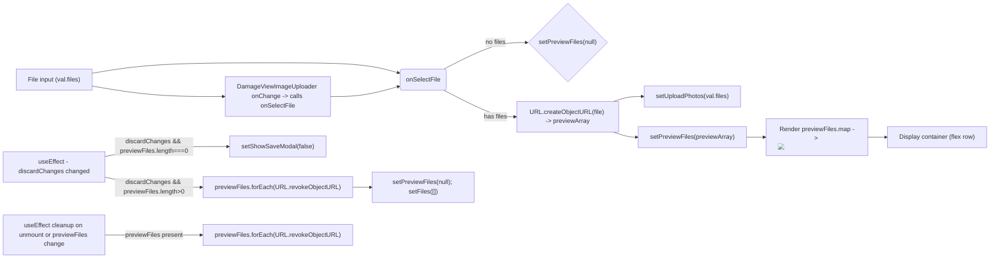

# Diagram: web/portal/src/pages/damageview/dashboard/components/DamageView.ImageEditor.container.js


> Auto-generated by Obscura crawlers

## Diagram 1

```mermaid
classDiagram
class ImageEditorContainer {
  +category: string
  +imageList: array
  +setShowSaveModal(func)
  +discardChanges: bool
  +previewFiles: array
  +setPreviewFiles(func)
  +setUploadPhotos(func)
  -files: array
  -commentData: string
  +onSelectFile(val)
  +useEffect_discard()
  +useEffect_cleanup()
}
class DamageViewImageUploader {
  +style: object
  +files: array
  +setFiles(func)
  +setCommentData(func)
  +commentData: string
  +showCommentsBox: bool
  +imagesData: array
  +name: string
  +onChange(name,val)
}
ImageEditorContainer --> DamageViewImageUploader : uses
ImageEditorContainer o-- "previewFiles" : renders
ImageEditorContainer ..> URL : "createObjectURL / revokeObjectURL"
```

> SVG rendering failed for this diagram.

## Diagram 2



### SVG

<svg id="container" width="2521.125" xmlns="http://www.w3.org/2000/svg" class="flowchart" height="660.69140625" viewBox="0 0 2521.125 660.69140625" role="graphics-document document" aria-roledescription="flowchart-v2"><style>#container{font-family:"trebuchet ms",verdana,arial,sans-serif;font-size:16px;fill:#333;}@keyframes edge-animation-frame{from{stroke-dashoffset:0;}}@keyframes dash{to{stroke-dashoffset:0;}}#container .edge-animation-slow{stroke-dasharray:9,5!important;stroke-dashoffset:900;animation:dash 50s linear infinite;stroke-linecap:round;}#container .edge-animation-fast{stroke-dasharray:9,5!important;stroke-dashoffset:900;animation:dash 20s linear infinite;stroke-linecap:round;}#container .error-icon{fill:#552222;}#container .error-text{fill:#552222;stroke:#552222;}#container .edge-thickness-normal{stroke-width:1px;}#container .edge-thickness-thick{stroke-width:3.5px;}#container .edge-pattern-solid{stroke-dasharray:0;}#container .edge-thickness-invisible{stroke-width:0;fill:none;}#container .edge-pattern-dashed{stroke-dasharray:3;}#container .edge-pattern-dotted{stroke-dasharray:2;}#container .marker{fill:#333333;stroke:#333333;}#container .marker.cross{stroke:#333333;}#container svg{font-family:"trebuchet ms",verdana,arial,sans-serif;font-size:16px;}#container p{margin:0;}#container .label{font-family:"trebuchet ms",verdana,arial,sans-serif;color:#333;}#container .cluster-label text{fill:#333;}#container .cluster-label span{color:#333;}#container .cluster-label span p{background-color:transparent;}#container .label text,#container span{fill:#333;color:#333;}#container .node rect,#container .node circle,#container .node ellipse,#container .node polygon,#container .node path{fill:#ECECFF;stroke:#9370DB;stroke-width:1px;}#container .rough-node .label text,#container .node .label text,#container .image-shape .label,#container .icon-shape .label{text-anchor:middle;}#container .node .katex path{fill:#000;stroke:#000;stroke-width:1px;}#container .rough-node .label,#container .node .label,#container .image-shape .label,#container .icon-shape .label{text-align:center;}#container .node.clickable{cursor:pointer;}#container .root .anchor path{fill:#333333!important;stroke-width:0;stroke:#333333;}#container .arrowheadPath{fill:#333333;}#container .edgePath .path{stroke:#333333;stroke-width:2.0px;}#container .flowchart-link{stroke:#333333;fill:none;}#container .edgeLabel{background-color:rgba(232,232,232, 0.8);text-align:center;}#container .edgeLabel p{background-color:rgba(232,232,232, 0.8);}#container .edgeLabel rect{opacity:0.5;background-color:rgba(232,232,232, 0.8);fill:rgba(232,232,232, 0.8);}#container .labelBkg{background-color:rgba(232, 232, 232, 0.5);}#container .cluster rect{fill:#ffffde;stroke:#aaaa33;stroke-width:1px;}#container .cluster text{fill:#333;}#container .cluster span{color:#333;}#container div.mermaidTooltip{position:absolute;text-align:center;max-width:200px;padding:2px;font-family:"trebuchet ms",verdana,arial,sans-serif;font-size:12px;background:hsl(80, 100%, 96.2745098039%);border:1px solid #aaaa33;border-radius:2px;pointer-events:none;z-index:100;}#container .flowchartTitleText{text-anchor:middle;font-size:18px;fill:#333;}#container rect.text{fill:none;stroke-width:0;}#container .icon-shape,#container .image-shape{background-color:rgba(232,232,232, 0.8);text-align:center;}#container .icon-shape p,#container .image-shape p{background-color:rgba(232,232,232, 0.8);padding:2px;}#container .icon-shape rect,#container .image-shape rect{opacity:0.5;background-color:rgba(232,232,232, 0.8);fill:rgba(232,232,232, 0.8);}#container .label-icon{display:inline-block;height:1em;overflow:visible;vertical-align:-0.125em;}#container .node .label-icon path{fill:currentColor;stroke:revert;stroke-width:revert;}#container :root{--mermaid-font-family:"trebuchet ms",verdana,arial,sans-serif;}</style><g><marker id="container_flowchart-v2-pointEnd" class="marker flowchart-v2" viewBox="0 0 10 10" refX="5" refY="5" markerUnits="userSpaceOnUse" markerWidth="8" markerHeight="8" orient="auto"><path d="M 0 0 L 10 5 L 0 10 z" class="arrowMarkerPath" style="stroke-width: 1; stroke-dasharray: 1, 0;"></path></marker><marker id="container_flowchart-v2-pointStart" class="marker flowchart-v2" viewBox="0 0 10 10" refX="4.5" refY="5" markerUnits="userSpaceOnUse" markerWidth="8" markerHeight="8" orient="auto"><path d="M 0 5 L 10 10 L 10 0 z" class="arrowMarkerPath" style="stroke-width: 1; stroke-dasharray: 1, 0;"></path></marker><marker id="container_flowchart-v2-circleEnd" class="marker flowchart-v2" viewBox="0 0 10 10" refX="11" refY="5" markerUnits="userSpaceOnUse" markerWidth="11" markerHeight="11" orient="auto"><circle cx="5" cy="5" r="5" class="arrowMarkerPath" style="stroke-width: 1; stroke-dasharray: 1, 0;"></circle></marker><marker id="container_flowchart-v2-circleStart" class="marker flowchart-v2" viewBox="0 0 10 10" refX="-1" refY="5" markerUnits="userSpaceOnUse" markerWidth="11" markerHeight="11" orient="auto"><circle cx="5" cy="5" r="5" class="arrowMarkerPath" style="stroke-width: 1; stroke-dasharray: 1, 0;"></circle></marker><marker id="container_flowchart-v2-crossEnd" class="marker cross flowchart-v2" viewBox="0 0 11 11" refX="12" refY="5.2" markerUnits="userSpaceOnUse" markerWidth="11" markerHeight="11" orient="auto"><path d="M 1,1 l 9,9 M 10,1 l -9,9" class="arrowMarkerPath" style="stroke-width: 2; stroke-dasharray: 1, 0;"></path></marker><marker id="container_flowchart-v2-crossStart" class="marker cross flowchart-v2" viewBox="0 0 11 11" refX="-1" refY="5.2" markerUnits="userSpaceOnUse" markerWidth="11" markerHeight="11" orient="auto"><path d="M 1,1 l 9,9 M 10,1 l -9,9" class="arrowMarkerPath" style="stroke-width: 2; stroke-dasharray: 1, 0;"></path></marker><g class="root"><g class="clusters"></g><g class="edgePaths"><path d="M236.5,188.082L262.583,183.683C288.667,179.285,340.833,170.488,418.887,166.09C496.94,161.691,600.88,161.691,688.154,161.691C775.427,161.691,846.034,161.691,896.774,166.032C947.513,170.372,978.386,179.052,993.822,183.392L1009.259,187.732" id="L_FileInput_OnSelectFile_0" class="edge-thickness-normal edge-pattern-solid edge-thickness-normal edge-pattern-solid flowchart-link" style=";" data-edge="true" data-et="edge" data-id="L_FileInput_OnSelectFile_0" data-points="W3sieCI6MjM2LjUsInkiOjE4OC4wODE2MDIzMjg0MzEzNn0seyJ4IjozOTMsInkiOjE2MS42OTE0MDYyNX0seyJ4Ijo3MDQuODIwMzEyNSwieSI6MTYxLjY5MTQwNjI1fSx7IngiOjkxNi42NDA2MjUsInkiOjE2MS42OTE0MDYyNX0seyJ4IjoxMDEzLjEwOTM3NSwieSI6MTg4LjgxNDk5NDk1OTY3NzQyfV0=" marker-end="url(#container_flowchart-v2-pointEnd)"></path><path d="M1124.541,178.191L1146.528,166.736C1168.515,155.281,1212.488,132.371,1247.701,120.916C1282.914,109.461,1309.367,109.461,1322.594,109.461L1335.82,109.461" id="L_OnSelectFile_ClearPreview_0" class="edge-thickness-normal edge-pattern-solid edge-thickness-normal edge-pattern-solid flowchart-link" style=";" data-edge="true" data-et="edge" data-id="L_OnSelectFile_ClearPreview_0" data-points="W3sieCI6MTEyNC41NDEzNzk3NDc5MzksInkiOjE3OC4xOTE0MDYyNX0seyJ4IjoxMjU2LjQ2MDkzNzUsInkiOjEwOS40NjA5Mzc1fSx7IngiOjEzMzkuODIwMzEyNSwieSI6MTA5LjQ2MDkzNzV9XQ==" marker-end="url(#container_flowchart-v2-pointEnd)"></path><path d="M1124.541,232.191L1146.528,243.48C1168.515,254.768,1212.488,277.345,1242.944,288.633C1273.401,299.922,1290.341,299.922,1298.811,299.922L1307.281,299.922" id="L_OnSelectFile_CreatePreviews_0" class="edge-thickness-normal edge-pattern-solid edge-thickness-normal edge-pattern-solid flowchart-link" style=";" data-edge="true" data-et="edge" data-id="L_OnSelectFile_CreatePreviews_0" data-points="W3sieCI6MTEyNC41NDEzNzk3NDc5MzksInkiOjIzMi4xOTE0MDYyNX0seyJ4IjoxMjU2LjQ2MDkzNzUsInkiOjI5OS45MjE4NzV9LHsieCI6MTMxMS4yODEyNSwieSI6Mjk5LjkyMTg3NX1d" marker-end="url(#container_flowchart-v2-pointEnd)"></path><path d="M1557.531,260.922L1563.99,258.755C1570.448,256.589,1583.365,252.255,1595.448,250.089C1607.531,247.922,1618.781,247.922,1624.406,247.922L1630.031,247.922" id="L_CreatePreviews_SetUploadPhotos_0" class="edge-thickness-normal edge-pattern-solid edge-thickness-normal edge-pattern-solid flowchart-link" style=";" data-edge="true" data-et="edge" data-id="L_CreatePreviews_SetUploadPhotos_0" data-points="W3sieCI6MTU1Ny41MzEyNSwieSI6MjYwLjkyMTg3NX0seyJ4IjoxNTk2LjI4MTI1LCJ5IjoyNDcuOTIxODc1fSx7IngiOjE2MzQuMDMxMjUsInkiOjI0Ny45MjE4NzV9XQ==" marker-end="url(#container_flowchart-v2-pointEnd)"></path><path d="M1557.531,338.922L1563.99,341.089C1570.448,343.255,1583.365,347.589,1593.323,349.755C1603.281,351.922,1610.281,351.922,1613.781,351.922L1617.281,351.922" id="L_CreatePreviews_SetPreviewFiles_0" class="edge-thickness-normal edge-pattern-solid edge-thickness-normal edge-pattern-solid flowchart-link" style=";" data-edge="true" data-et="edge" data-id="L_CreatePreviews_SetPreviewFiles_0" data-points="W3sieCI6MTU1Ny41MzEyNSwieSI6MzM4LjkyMTg3NX0seyJ4IjoxNTk2LjI4MTI1LCJ5IjozNTEuOTIxODc1fSx7IngiOjE2MjEuMjgxMjUsInkiOjM1MS45MjE4NzV9XQ==" marker-end="url(#container_flowchart-v2-pointEnd)"></path><path d="M1895.859,351.922L1900.026,351.922C1904.193,351.922,1912.526,351.922,1920.193,351.922C1927.859,351.922,1934.859,351.922,1938.359,351.922L1941.859,351.922" id="L_SetPreviewFiles_RenderPreview_0" class="edge-thickness-normal edge-pattern-solid edge-thickness-normal edge-pattern-solid flowchart-link" style=";" data-edge="true" data-et="edge" data-id="L_SetPreviewFiles_RenderPreview_0" data-points="W3sieCI6MTg5NS44NTkzNzUsInkiOjM1MS45MjE4NzV9LHsieCI6MTkyMC44NTkzNzUsInkiOjM1MS45MjE4NzV9LHsieCI6MTk0NS44NTkzNzUsInkiOjM1MS45MjE4NzV9XQ==" marker-end="url(#container_flowchart-v2-pointEnd)"></path><path d="M268,401.182L288.833,396.933C309.667,392.685,351.333,384.188,403.137,379.94C454.94,375.691,516.88,375.691,547.85,375.691L578.82,375.691" id="L_DiscardCheck_HideSaveModal_0" class="edge-thickness-normal edge-pattern-solid edge-thickness-normal edge-pattern-solid flowchart-link" style=";" data-edge="true" data-et="edge" data-id="L_DiscardCheck_HideSaveModal_0" data-points="W3sieCI6MjY4LCJ5Ijo0MDEuMTgxNjAyMzI4NDMxNH0seyJ4IjozOTMsInkiOjM3NS42OTE0MDYyNX0seyJ4Ijo1ODIuODIwMzEyNSwieSI6Mzc1LjY5MTQwNjI1fV0=" marker-end="url(#container_flowchart-v2-pointEnd)"></path><path d="M268,454.201L288.833,458.45C309.667,462.698,351.333,471.195,392.333,475.443C433.333,479.691,473.667,479.691,493.833,479.691L514,479.691" id="L_DiscardCheck_RevokeOnDiscard_0" class="edge-thickness-normal edge-pattern-solid edge-thickness-normal edge-pattern-solid flowchart-link" style=";" data-edge="true" data-et="edge" data-id="L_DiscardCheck_RevokeOnDiscard_0" data-points="W3sieCI6MjY4LCJ5Ijo0NTQuMjAxMjEwMTcxNTY4Nn0seyJ4IjozOTMsInkiOjQ3OS42OTE0MDYyNX0seyJ4Ijo1MTgsInkiOjQ3OS42OTE0MDYyNX1d" marker-end="url(#container_flowchart-v2-pointEnd)"></path><path d="M891.641,479.691L895.807,479.691C899.974,479.691,908.307,479.691,915.974,479.691C923.641,479.691,930.641,479.691,934.141,479.691L937.641,479.691" id="L_RevokeOnDiscard_ClearLocalState_0" class="edge-thickness-normal edge-pattern-solid edge-thickness-normal edge-pattern-solid flowchart-link" style=";" data-edge="true" data-et="edge" data-id="L_RevokeOnDiscard_ClearLocalState_0" data-points="W3sieCI6ODkxLjY0MDYyNSwieSI6NDc5LjY5MTQwNjI1fSx7IngiOjkxNi42NDA2MjUsInkiOjQ3OS42OTE0MDYyNX0seyJ4Ijo5NDEuNjQwNjI1LCJ5Ijo0NzkuNjkxNDA2MjV9XQ==" marker-end="url(#container_flowchart-v2-pointEnd)"></path><path d="M268,601.691L288.833,601.691C309.667,601.691,351.333,601.691,392.333,601.691C433.333,601.691,473.667,601.691,493.833,601.691L514,601.691" id="L_UnmountCleanup_RevokeOnUnmount_0" class="edge-thickness-normal edge-pattern-solid edge-thickness-normal edge-pattern-solid flowchart-link" style=";" data-edge="true" data-et="edge" data-id="L_UnmountCleanup_RevokeOnUnmount_0" data-points="W3sieCI6MjY4LCJ5Ijo2MDEuNjkxNDA2MjV9LHsieCI6MzkzLCJ5Ijo2MDEuNjkxNDA2MjV9LHsieCI6NTE4LCJ5Ijo2MDEuNjkxNDA2MjV9XQ==" marker-end="url(#container_flowchart-v2-pointEnd)"></path><path d="M2205.859,351.922L2210.026,351.922C2214.193,351.922,2222.526,351.922,2230.193,351.922C2237.859,351.922,2244.859,351.922,2248.359,351.922L2251.859,351.922" id="L_RenderPreview_UIContainer_0" class="edge-thickness-normal edge-pattern-solid edge-thickness-normal edge-pattern-solid flowchart-link" style=";" data-edge="true" data-et="edge" data-id="L_RenderPreview_UIContainer_0" data-points="W3sieCI6MjIwNS44NTkzNzUsInkiOjM1MS45MjE4NzV9LHsieCI6MjIzMC44NTkzNzUsInkiOjM1MS45MjE4NzV9LHsieCI6MjI1NS44NTkzNzUsInkiOjM1MS45MjE4NzV9XQ==" marker-end="url(#container_flowchart-v2-pointEnd)"></path><path d="M838.094,247.691L851.185,247.691C864.276,247.691,890.458,247.691,918.984,243.512C947.51,239.332,978.379,230.973,993.814,226.793L1009.248,222.613" id="L_DamageView_OnSelectFile_0" class="edge-thickness-normal edge-pattern-solid edge-thickness-normal edge-pattern-solid flowchart-link" style=";" data-edge="true" data-et="edge" data-id="L_DamageView_OnSelectFile_0" data-points="W3sieCI6ODM4LjA5Mzc1LCJ5IjoyNDcuNjkxNDA2MjV9LHsieCI6OTE2LjY0MDYyNSwieSI6MjQ3LjY5MTQwNjI1fSx7IngiOjEwMTMuMTA5Mzc1LCJ5IjoyMjEuNTY3ODE3NTQwMzIyNTh9XQ==" marker-end="url(#container_flowchart-v2-pointEnd)"></path><path d="M236.5,221.301L262.583,225.7C288.667,230.098,340.833,238.895,396.008,243.293C451.182,247.691,509.365,247.691,538.456,247.691L567.547,247.691" id="L_FileInput_DamageView_0" class="edge-thickness-normal edge-pattern-solid edge-thickness-normal edge-pattern-solid flowchart-link" style=";" data-edge="true" data-et="edge" data-id="L_FileInput_DamageView_0" data-points="W3sieCI6MjM2LjUsInkiOjIyMS4zMDEyMTAxNzE1Njg2NH0seyJ4IjozOTMsInkiOjI0Ny42OTE0MDYyNX0seyJ4Ijo1NzEuNTQ2ODc1LCJ5IjoyNDcuNjkxNDA2MjV9XQ==" marker-end="url(#container_flowchart-v2-pointEnd)"></path></g><g class="edgeLabels"><g class="edgeLabel"><g class="label" data-id="L_FileInput_OnSelectFile_0" transform="translate(0, 0)"><foreignObject width="0" height="0"><div xmlns="http://www.w3.org/1999/xhtml" class="labelBkg" style="display: table-cell; white-space: nowrap; line-height: 1.5; max-width: 200px; text-align: center;"><span class="edgeLabel"></span></div></foreignObject></g></g><g class="edgeLabel" transform="translate(1256.4609375, 109.4609375)"><g class="label" data-id="L_OnSelectFile_ClearPreview_0" transform="translate(-26.484375, -12)"><foreignObject width="52.96875" height="24"><div xmlns="http://www.w3.org/1999/xhtml" class="labelBkg" style="display: table-cell; white-space: nowrap; line-height: 1.5; max-width: 200px; text-align: center;"><span class="edgeLabel"><p>no files</p></span></div></foreignObject></g></g><g class="edgeLabel" transform="translate(1256.4609375, 299.921875)"><g class="label" data-id="L_OnSelectFile_CreatePreviews_0" transform="translate(-29.8203125, -12)"><foreignObject width="59.640625" height="24"><div xmlns="http://www.w3.org/1999/xhtml" class="labelBkg" style="display: table-cell; white-space: nowrap; line-height: 1.5; max-width: 200px; text-align: center;"><span class="edgeLabel"><p>has files</p></span></div></foreignObject></g></g><g class="edgeLabel"><g class="label" data-id="L_CreatePreviews_SetUploadPhotos_0" transform="translate(0, 0)"><foreignObject width="0" height="0"><div xmlns="http://www.w3.org/1999/xhtml" class="labelBkg" style="display: table-cell; white-space: nowrap; line-height: 1.5; max-width: 200px; text-align: center;"><span class="edgeLabel"></span></div></foreignObject></g></g><g class="edgeLabel"><g class="label" data-id="L_CreatePreviews_SetPreviewFiles_0" transform="translate(0, 0)"><foreignObject width="0" height="0"><div xmlns="http://www.w3.org/1999/xhtml" class="labelBkg" style="display: table-cell; white-space: nowrap; line-height: 1.5; max-width: 200px; text-align: center;"><span class="edgeLabel"></span></div></foreignObject></g></g><g class="edgeLabel"><g class="label" data-id="L_SetPreviewFiles_RenderPreview_0" transform="translate(0, 0)"><foreignObject width="0" height="0"><div xmlns="http://www.w3.org/1999/xhtml" class="labelBkg" style="display: table-cell; white-space: nowrap; line-height: 1.5; max-width: 200px; text-align: center;"><span class="edgeLabel"></span></div></foreignObject></g></g><g class="edgeLabel" transform="translate(393, 375.69140625)"><g class="label" data-id="L_DiscardCheck_HideSaveModal_0" transform="translate(-100, -24)"><foreignObject width="200" height="48"><div xmlns="http://www.w3.org/1999/xhtml" class="labelBkg" style="display: table; white-space: break-spaces; line-height: 1.5; max-width: 200px; text-align: center; width: 200px;"><span class="edgeLabel"><p>discardChanges &amp;&amp; previewFiles.length===0</p></span></div></foreignObject></g></g><g class="edgeLabel" transform="translate(393, 479.69140625)"><g class="label" data-id="L_DiscardCheck_RevokeOnDiscard_0" transform="translate(-100, -24)"><foreignObject width="200" height="48"><div xmlns="http://www.w3.org/1999/xhtml" class="labelBkg" style="display: table; white-space: break-spaces; line-height: 1.5; max-width: 200px; text-align: center; width: 200px;"><span class="edgeLabel"><p>discardChanges &amp;&amp; previewFiles.length&gt;0</p></span></div></foreignObject></g></g><g class="edgeLabel"><g class="label" data-id="L_RevokeOnDiscard_ClearLocalState_0" transform="translate(0, 0)"><foreignObject width="0" height="0"><div xmlns="http://www.w3.org/1999/xhtml" class="labelBkg" style="display: table-cell; white-space: nowrap; line-height: 1.5; max-width: 200px; text-align: center;"><span class="edgeLabel"></span></div></foreignObject></g></g><g class="edgeLabel" transform="translate(393, 601.69140625)"><g class="label" data-id="L_UnmountCleanup_RevokeOnUnmount_0" transform="translate(-74.2734375, -12)"><foreignObject width="148.546875" height="24"><div xmlns="http://www.w3.org/1999/xhtml" class="labelBkg" style="display: table-cell; white-space: nowrap; line-height: 1.5; max-width: 200px; text-align: center;"><span class="edgeLabel"><p>previewFiles present</p></span></div></foreignObject></g></g><g class="edgeLabel"><g class="label" data-id="L_RenderPreview_UIContainer_0" transform="translate(0, 0)"><foreignObject width="0" height="0"><div xmlns="http://www.w3.org/1999/xhtml" class="labelBkg" style="display: table-cell; white-space: nowrap; line-height: 1.5; max-width: 200px; text-align: center;"><span class="edgeLabel"></span></div></foreignObject></g></g><g class="edgeLabel"><g class="label" data-id="L_DamageView_OnSelectFile_0" transform="translate(0, 0)"><foreignObject width="0" height="0"><div xmlns="http://www.w3.org/1999/xhtml" class="labelBkg" style="display: table-cell; white-space: nowrap; line-height: 1.5; max-width: 200px; text-align: center;"><span class="edgeLabel"></span></div></foreignObject></g></g><g class="edgeLabel"><g class="label" data-id="L_FileInput_DamageView_0" transform="translate(0, 0)"><foreignObject width="0" height="0"><div xmlns="http://www.w3.org/1999/xhtml" class="labelBkg" style="display: table-cell; white-space: nowrap; line-height: 1.5; max-width: 200px; text-align: center;"><span class="edgeLabel"></span></div></foreignObject></g></g></g><g class="nodes"><g class="node default" id="flowchart-FileInput-0" transform="translate(138, 204.69140625)"><rect class="basic label-container" style="" x="-98.5" y="-27" width="197" height="54"></rect><g class="label" style="" transform="translate(-68.5, -12)"><rect></rect><foreignObject width="137" height="24"><div xmlns="http://www.w3.org/1999/xhtml" style="display: table-cell; white-space: nowrap; line-height: 1.5; max-width: 200px; text-align: center;"><span class="nodeLabel"><p>File input (val.files)</p></span></div></foreignObject></g></g><g class="node default" id="flowchart-OnSelectFile-1" transform="translate(1071.640625, 204.69140625)"><g class="basic label-container outer-path"><path d="M-54.03125 -27 C-14.017332744899363 -27, 25.996584510201274 -27, 54.03125 -27 C54.03125 -27, 54.03125 -27, 54.03125 -27 C54.13091533906339 -26.995877811084398, 54.23058067812678 -26.991755622168796, 54.44414672736166 -26.982922465033347 C54.54860801306359 -26.969901379349853, 54.653069298765516 -26.95688029366636, 54.85422295140367 -26.931806517013612 C54.977207967462626 -26.90601927091075, 55.10019298352158 -26.88023202480789, 55.258677435703994 -26.847001329696653 C55.364543086453 -26.81548375991149, 55.47040873720199 -26.783966190126332, 55.65474734602342 -26.729086208503173 C55.79052201957713 -26.676106766481332, 55.92629669313084 -26.623127324459492, 56.039727123264846 -26.578866633275286 C56.166931147167254 -26.516680375274408, 56.29413517106966 -26.45449411727353, 56.410986965185366 -26.397368756032446 C56.516990103586096 -26.33420459570481, 56.62299324198682 -26.271040435377177, 56.765990790612136 -26.185832391312644 C56.867727399703405 -26.11319384858835, 56.96946400879467 -26.040555305864054, 57.10231356344834 -25.94570254698197 C57.178899410326046 -25.88083764345336, 57.25548525720376 -25.815972739924753, 57.417657858128706 -25.678619553365657 C57.52071398742314 -25.57556342407122, 57.62377011671758 -25.472507294776786, 57.70986955336566 -25.386407858128706 C57.78444726687391 -25.298354118178043, 57.859024980382166 -25.21030037822738, 57.97695254698197 -25.07106356344834 C58.070747678859995 -24.939695307579587, 58.16454281073803 -24.808327051710833, 58.217082391312644 -24.734740790612136 C58.28423919958397 -24.62203712440631, 58.35139600785531 -24.509333458200487, 58.42861875603245 -24.37973696518537 C58.46507738584002 -24.30515964590969, 58.50153601564759 -24.230582326634014, 58.61011663327529 -24.008477123264846 C58.66790142025409 -23.860387406027304, 58.72568620723289 -23.712297688789757, 58.760336208503176 -23.623497346023417 C58.80618603601547 -23.469490490183805, 58.85203586352776 -23.315483634344197, 58.87825132969665 -23.227427435703994 C58.901900510888964 -23.11463931877533, 58.92554969208128 -23.00185120184666, 58.96305651701361 -22.82297295140367 C58.98083482529373 -22.680346984131184, 58.99861313357385 -22.537721016858697, 59.01417246503335 -22.412896727361662 C59.017795442766634 -22.325301201877565, 59.02141842049991 -22.237705676393468, 59.03125 -22 C59.03125 -22, 59.03125 -22, 59.03125 -22 C59.03125 -7.17643567248898, 59.03125 7.6471286550220405, 59.03125 22 C59.03125 22, 59.03125 22, 59.03125 22 C59.02686834277606 22.10593870436905, 59.022486685552124 22.211877408738097, 59.01417246503335 22.412896727361662 C58.993964786982026 22.57501224380956, 58.9737571089307 22.737127760257458, 58.96305651701361 22.82297295140367 C58.940860781772805 22.92882926673654, 58.918665046532 23.034685582069407, 58.87825132969665 23.227427435703994 C58.83854340956623 23.36080398831104, 58.7988354894358 23.49418054091809, 58.760336208503176 23.623497346023417 C58.71089074173646 23.750215217196807, 58.66144527496974 23.876933088370194, 58.61011663327529 24.008477123264846 C58.55045641333342 24.13051405372947, 58.49079619339155 24.252550984194094, 58.42861875603245 24.379736965185366 C58.38403576032943 24.454556885838343, 58.33945276462642 24.529376806491324, 58.217082391312644 24.734740790612133 C58.13737360528708 24.8463798915754, 58.05766481926151 24.95801899253867, 57.97695254698197 25.07106356344834 C57.91728643604807 25.14151120750837, 57.85762032511418 25.2119588515684, 57.70986955336566 25.386407858128706 C57.619129015342025 25.47714839615234, 57.52838847731839 25.567888934175972, 57.417657858128706 25.678619553365657 C57.29321279851128 25.784019142399202, 57.16876773889385 25.889418731432745, 57.10231356344834 25.94570254698197 C56.999271865233155 26.01927290543055, 56.89623016701797 26.092843263879136, 56.765990790612136 26.185832391312644 C56.64434148489125 26.258319643730132, 56.52269217917036 26.330806896147617, 56.410986965185366 26.397368756032446 C56.26325909417771 26.4695885114975, 56.11553122317006 26.541808266962548, 56.039727123264846 26.578866633275286 C55.89577256749422 26.63503787524268, 55.75181801172359 26.69120911721008, 55.65474734602342 26.729086208503173 C55.56394561500636 26.75611905507518, 55.4731438839893 26.78315190164719, 55.258677435703994 26.847001329696653 C55.133786820423516 26.87318813793866, 55.00889620514304 26.89937494618066, 54.85422295140367 26.931806517013612 C54.72869904496361 26.947453055634117, 54.60317513852355 26.963099594254622, 54.44414672736166 26.982922465033347 C54.3096984684005 26.98848328615752, 54.17525020943934 26.994044107281695, 54.03125 27 C54.03125 27, 54.03125 27, 54.03125 27 C24.50837919281962 27, -5.014491614360757 27, -54.03125 27 C-54.03125 27, -54.03125 27, -54.03125 27 C-54.16415530111567 26.994502996084375, -54.29706060223134 26.989005992168746, -54.44414672736166 26.982922465033347 C-54.57093360915072 26.96711849669977, -54.69772049093977 26.95131452836619, -54.85422295140367 26.931806517013612 C-54.94168880496721 26.913466856104364, -55.02915465853074 26.895127195195112, -55.258677435703994 26.847001329696653 C-55.361213857231824 26.81647491439424, -55.463750278759655 26.78594849909183, -55.65474734602342 26.729086208503173 C-55.787105748007576 26.677439799784327, -55.919464149991725 26.62579339106548, -56.039727123264846 26.578866633275286 C-56.158010889616314 26.521041223465204, -56.27629465596779 26.463215813655125, -56.410986965185366 26.397368756032446 C-56.500797846089746 26.343853086909846, -56.590608726994134 26.290337417787246, -56.765990790612136 26.185832391312644 C-56.86358504294608 26.116151434466076, -56.96117929528001 26.04647047761951, -57.10231356344834 25.94570254698197 C-57.224021261538276 25.842621384898607, -57.34572895962821 25.739540222815247, -57.417657858128706 25.67861955336566 C-57.52681770836255 25.569459703131816, -57.635977558596394 25.46029985289797, -57.70986955336566 25.386407858128706 C-57.77838376143601 25.30551328552043, -57.84689796950637 25.224618712912154, -57.97695254698197 25.07106356344834 C-58.02591020057287 25.002494103233417, -58.074867854163784 24.933924643018493, -58.217082391312644 24.734740790612133 C-58.29660557173064 24.60128367416842, -58.376128752148624 24.46782655772471, -58.42861875603244 24.37973696518537 C-58.494252882786746 24.24548021302077, -58.55988700954104 24.111223460856166, -58.61011663327528 24.00847712326485 C-58.662684330842026 23.873757660314453, -58.71525202840876 23.739038197364053, -58.760336208503176 23.623497346023417 C-58.79460622250522 23.508386398122475, -58.82887623650726 23.393275450221537, -58.87825132969665 23.227427435703994 C-58.901173913542664 23.118104620418915, -58.924096497388675 23.008781805133832, -58.96305651701361 22.82297295140367 C-58.981842590179824 22.67226221929316, -59.000628663346035 22.52155148718265, -59.01417246503335 22.412896727361662 C-59.01889807267041 22.298642068715083, -59.02362368030748 22.184387410068503, -59.03125 22 C-59.03125 22, -59.03125 22, -59.03125 22 C-59.03125 11.542132051314997, -59.03125 1.0842641026299944, -59.03125 -22 C-59.03125 -22, -59.03125 -22, -59.03125 -22 C-59.025082640089515 -22.149113014757297, -59.01891528017903 -22.29822602951459, -59.01417246503335 -22.41289672736166 C-59.00087621203941 -22.519565534904032, -58.98757995904546 -22.626234342446406, -58.96305651701361 -22.82297295140367 C-58.94328668384413 -22.917259609239608, -58.923516850674645 -23.01154626707554, -58.87825132969665 -23.227427435703994 C-58.85262020301185 -23.31352087261593, -58.82698907632706 -23.399614309527863, -58.760336208503176 -23.623497346023417 C-58.72655700467775 -23.710066026199602, -58.692777800852326 -23.79663470637579, -58.61011663327529 -24.008477123264846 C-58.54202578653953 -24.147759176473258, -58.473934939803776 -24.287041229681666, -58.42861875603245 -24.379736965185366 C-58.37136214302121 -24.475825959987244, -58.31410553000997 -24.571914954789126, -58.217082391312644 -24.734740790612133 C-58.12151846979786 -24.86858639050639, -58.02595454828308 -25.002431990400645, -57.97695254698197 -25.07106356344834 C-57.8910992644026 -25.17243034264462, -57.80524598182323 -25.2737971218409, -57.70986955336566 -25.386407858128706 C-57.61887716411602 -25.47740024737834, -57.527884774866386 -25.56839263662798, -57.417657858128706 -25.678619553365657 C-57.32095586140225 -25.76052196672803, -57.22425386467578 -25.842424380090407, -57.10231356344834 -25.945702546981966 C-57.000885286470925 -26.018120944808324, -56.89945700949351 -26.09053934263468, -56.765990790612136 -26.185832391312644 C-56.64393376329458 -26.25856259306814, -56.52187673597702 -26.331292794823636, -56.410986965185366 -26.397368756032446 C-56.32073512731238 -26.44149019105347, -56.23048328943939 -26.485611626074494, -56.039727123264846 -26.578866633275286 C-55.933899363038094 -26.620160753456076, -55.82807160281134 -26.661454873636867, -55.65474734602342 -26.729086208503173 C-55.572297813056544 -26.75363249798094, -55.48984828008967 -26.778178787458714, -55.258677435703994 -26.847001329696653 C-55.11620822492956 -26.876873981813556, -54.97373901415513 -26.90674663393046, -54.85422295140367 -26.931806517013612 C-54.72278898578152 -26.948189743742898, -54.59135502015938 -26.964572970472183, -54.44414672736166 -26.982922465033347 C-54.32794517365837 -26.9877285968456, -54.21174361995508 -26.99253472865785, -54.03125 -27 C-54.03125 -27, -54.03125 -27, -54.03125 -27" stroke="none" stroke-width="0" fill="#ECECFF" style=""></path><path d="M-54.03125 -27 C-26.241353902389555 -27, 1.5485421952208895 -27, 54.03125 -27 M-54.03125 -27 C-24.522297954429206 -27, 4.986654091141588 -27, 54.03125 -27 M54.03125 -27 C54.03125 -27, 54.03125 -27, 54.03125 -27 M54.03125 -27 C54.03125 -27, 54.03125 -27, 54.03125 -27 M54.03125 -27 C54.117547003262 -26.996430729543096, 54.203844006523994 -26.992861459086193, 54.44414672736166 -26.982922465033347 M54.03125 -27 C54.15498864570428 -26.994882131756665, 54.27872729140856 -26.98976426351333, 54.44414672736166 -26.982922465033347 M54.44414672736166 -26.982922465033347 C54.56962982947065 -26.967281012667407, 54.69511293157964 -26.951639560301466, 54.85422295140367 -26.931806517013612 M54.44414672736166 -26.982922465033347 C54.57827626084296 -26.966203236120823, 54.71240579432427 -26.9494840072083, 54.85422295140367 -26.931806517013612 M54.85422295140367 -26.931806517013612 C55.00971156554628 -26.899203983082433, 55.165200179688895 -26.866601449151254, 55.258677435703994 -26.847001329696653 M54.85422295140367 -26.931806517013612 C54.94048252245867 -26.913719786948413, 55.02674209351367 -26.89563305688321, 55.258677435703994 -26.847001329696653 M55.258677435703994 -26.847001329696653 C55.40172261258479 -26.804414935404697, 55.54476778946559 -26.761828541112745, 55.65474734602342 -26.729086208503173 M55.258677435703994 -26.847001329696653 C55.39708703428236 -26.80579500685949, 55.53549663286072 -26.764588684022325, 55.65474734602342 -26.729086208503173 M55.65474734602342 -26.729086208503173 C55.7839874976376 -26.678656544854388, 55.913227649251766 -26.628226881205606, 56.039727123264846 -26.578866633275286 M55.65474734602342 -26.729086208503173 C55.80687815394371 -26.66972458304686, 55.95900896186399 -26.610362957590546, 56.039727123264846 -26.578866633275286 M56.039727123264846 -26.578866633275286 C56.16501428294472 -26.51761747309127, 56.290301442624596 -26.456368312907255, 56.410986965185366 -26.397368756032446 M56.039727123264846 -26.578866633275286 C56.174838234107185 -26.51281483601396, 56.30994934494953 -26.44676303875263, 56.410986965185366 -26.397368756032446 M56.410986965185366 -26.397368756032446 C56.50643287258309 -26.3404953399389, 56.601878779980815 -26.283621923845356, 56.765990790612136 -26.185832391312644 M56.410986965185366 -26.397368756032446 C56.50276674369783 -26.34267987858732, 56.5945465222103 -26.287991001142192, 56.765990790612136 -26.185832391312644 M56.765990790612136 -26.185832391312644 C56.86372590332762 -26.11605086208673, 56.9614610160431 -26.046269332860817, 57.10231356344834 -25.94570254698197 M56.765990790612136 -26.185832391312644 C56.84308910610766 -26.130785252095833, 56.92018742160319 -26.075738112879023, 57.10231356344834 -25.94570254698197 M57.10231356344834 -25.94570254698197 C57.19211630059493 -25.869643508411567, 57.28191903774152 -25.793584469841168, 57.417657858128706 -25.678619553365657 M57.10231356344834 -25.94570254698197 C57.17932470608407 -25.88047743632059, 57.256335848719786 -25.81525232565921, 57.417657858128706 -25.678619553365657 M57.417657858128706 -25.678619553365657 C57.48738198431557 -25.608895427178798, 57.557106110502424 -25.53917130099194, 57.70986955336566 -25.386407858128706 M57.417657858128706 -25.678619553365657 C57.532143056912254 -25.56413435458211, 57.6466282556958 -25.449649155798564, 57.70986955336566 -25.386407858128706 M57.70986955336566 -25.386407858128706 C57.77088436324852 -25.31436780822868, 57.831899173131376 -25.242327758328656, 57.97695254698197 -25.07106356344834 M57.70986955336566 -25.386407858128706 C57.79391235591518 -25.287178708664346, 57.87795515846471 -25.187949559199986, 57.97695254698197 -25.07106356344834 M57.97695254698197 -25.07106356344834 C58.0350595603423 -24.989679627565447, 58.09316657370263 -24.908295691682554, 58.217082391312644 -24.734740790612136 M57.97695254698197 -25.07106356344834 C58.04930212904515 -24.969731668944128, 58.12165171110833 -24.86839977443991, 58.217082391312644 -24.734740790612136 M58.217082391312644 -24.734740790612136 C58.28600973164063 -24.619065788229737, 58.354937071968614 -24.503390785847337, 58.42861875603245 -24.37973696518537 M58.217082391312644 -24.734740790612136 C58.293166889392324 -24.607054527733702, 58.369251387472 -24.479368264855268, 58.42861875603245 -24.37973696518537 M58.42861875603245 -24.37973696518537 C58.47257729391016 -24.289818338744897, 58.51653583178788 -24.199899712304425, 58.61011663327529 -24.008477123264846 M58.42861875603245 -24.37973696518537 C58.4741990404602 -24.286501003154267, 58.51977932488795 -24.193265041123166, 58.61011663327529 -24.008477123264846 M58.61011663327529 -24.008477123264846 C58.6497140932638 -23.906997530458256, 58.68931155325232 -23.80551793765167, 58.760336208503176 -23.623497346023417 M58.61011663327529 -24.008477123264846 C58.644248867038904 -23.921003704896204, 58.67838110080252 -23.833530286527562, 58.760336208503176 -23.623497346023417 M58.760336208503176 -23.623497346023417 C58.80480529128136 -23.474128329991583, 58.849274374059554 -23.324759313959753, 58.87825132969665 -23.227427435703994 M58.760336208503176 -23.623497346023417 C58.78466738399825 -23.541770368187493, 58.80899855949332 -23.460043390351572, 58.87825132969665 -23.227427435703994 M58.87825132969665 -23.227427435703994 C58.900465396647704 -23.12148369243601, 58.92267946359876 -23.015539949168023, 58.96305651701361 -22.82297295140367 M58.87825132969665 -23.227427435703994 C58.902564631686 -23.111471981458205, 58.926877933675335 -22.995516527212413, 58.96305651701361 -22.82297295140367 M58.96305651701361 -22.82297295140367 C58.9753242661653 -22.72455528637909, 58.987592015317 -22.62613762135451, 59.01417246503335 -22.412896727361662 M58.96305651701361 -22.82297295140367 C58.97653549172827 -22.714838264107822, 58.99001446644293 -22.606703576811974, 59.01417246503335 -22.412896727361662 M59.01417246503335 -22.412896727361662 C59.01933569715434 -22.28806128421789, 59.024498929275325 -22.163225841074116, 59.03125 -22 M59.01417246503335 -22.412896727361662 C59.0203126109683 -22.264441685869254, 59.02645275690324 -22.11598664437685, 59.03125 -22 M59.03125 -22 C59.03125 -22, 59.03125 -22, 59.03125 -22 M59.03125 -22 C59.03125 -22, 59.03125 -22, 59.03125 -22 M59.03125 -22 C59.03125 -6.719549719170137, 59.03125 8.560900561659725, 59.03125 22 M59.03125 -22 C59.03125 -6.26693080775242, 59.03125 9.46613838449516, 59.03125 22 M59.03125 22 C59.03125 22, 59.03125 22, 59.03125 22 M59.03125 22 C59.03125 22, 59.03125 22, 59.03125 22 M59.03125 22 C59.02601134455823 22.126659010911446, 59.02077268911646 22.253318021822892, 59.01417246503335 22.412896727361662 M59.03125 22 C59.02587525875684 22.129949262235428, 59.02050051751368 22.259898524470856, 59.01417246503335 22.412896727361662 M59.01417246503335 22.412896727361662 C58.99411439891311 22.573811986391885, 58.97405633279288 22.734727245422103, 58.96305651701361 22.82297295140367 M59.01417246503335 22.412896727361662 C58.99729628605952 22.54828538819937, 58.980420107085706 22.68367404903708, 58.96305651701361 22.82297295140367 M58.96305651701361 22.82297295140367 C58.94062743257622 22.929942160086004, 58.91819834813884 23.036911368768337, 58.87825132969665 23.227427435703994 M58.96305651701361 22.82297295140367 C58.943393151592005 22.91675184126662, 58.923729786170405 23.01053073112957, 58.87825132969665 23.227427435703994 M58.87825132969665 23.227427435703994 C58.83245880813444 23.381241804250394, 58.78666628657222 23.535056172796793, 58.760336208503176 23.623497346023417 M58.87825132969665 23.227427435703994 C58.83205595996686 23.3825949473926, 58.785860590237064 23.53776245908121, 58.760336208503176 23.623497346023417 M58.760336208503176 23.623497346023417 C58.7262030326288 23.710973178815006, 58.692069856754436 23.798449011606596, 58.61011663327529 24.008477123264846 M58.760336208503176 23.623497346023417 C58.710036818427945 23.75240363508172, 58.65973742835272 23.881309924140023, 58.61011663327529 24.008477123264846 M58.61011663327529 24.008477123264846 C58.547493281197994 24.13657523739123, 58.4848699291207 24.264673351517615, 58.42861875603245 24.379736965185366 M58.61011663327529 24.008477123264846 C58.56504226135931 24.100678224712464, 58.51996788944332 24.192879326160085, 58.42861875603245 24.379736965185366 M58.42861875603245 24.379736965185366 C58.35047688340564 24.51087594805138, 58.272335010778825 24.642014930917387, 58.217082391312644 24.734740790612133 M58.42861875603245 24.379736965185366 C58.36756379616521 24.482200408493846, 58.30650883629796 24.584663851802325, 58.217082391312644 24.734740790612133 M58.217082391312644 24.734740790612133 C58.13446431013305 24.850454612965944, 58.05184622895345 24.96616843531976, 57.97695254698197 25.07106356344834 M58.217082391312644 24.734740790612133 C58.12437638965528 24.864583624695786, 58.03167038799792 24.994426458779444, 57.97695254698197 25.07106356344834 M57.97695254698197 25.07106356344834 C57.89458654209932 25.16831292164848, 57.812220537216675 25.26556227984862, 57.70986955336566 25.386407858128706 M57.97695254698197 25.07106356344834 C57.91929563040685 25.139138956211628, 57.86163871383173 25.20721434897492, 57.70986955336566 25.386407858128706 M57.70986955336566 25.386407858128706 C57.619643950984354 25.47663346051001, 57.52941834860305 25.56685906289131, 57.417657858128706 25.678619553365657 M57.70986955336566 25.386407858128706 C57.64883920328337 25.447438208210986, 57.587808853201096 25.508468558293266, 57.417657858128706 25.678619553365657 M57.417657858128706 25.678619553365657 C57.29611565570402 25.781560547770546, 57.174573453279336 25.884501542175435, 57.10231356344834 25.94570254698197 M57.417657858128706 25.678619553365657 C57.298328695644564 25.77968619855198, 57.17899953316043 25.8807528437383, 57.10231356344834 25.94570254698197 M57.10231356344834 25.94570254698197 C56.972504975087 26.038384097663567, 56.84269638672565 26.131065648345167, 56.765990790612136 26.185832391312644 M57.10231356344834 25.94570254698197 C56.97171357265686 26.038949148137995, 56.84111358186538 26.13219574929402, 56.765990790612136 26.185832391312644 M56.765990790612136 26.185832391312644 C56.685259455899626 26.233937825228836, 56.60452812118711 26.282043259145027, 56.410986965185366 26.397368756032446 M56.765990790612136 26.185832391312644 C56.6243497145718 26.270232153159025, 56.48270863853146 26.35463191500541, 56.410986965185366 26.397368756032446 M56.410986965185366 26.397368756032446 C56.325179402315634 26.43931751739504, 56.239371839445894 26.481266278757637, 56.039727123264846 26.578866633275286 M56.410986965185366 26.397368756032446 C56.288342178309925 26.457326138866105, 56.165697391434485 26.517283521699767, 56.039727123264846 26.578866633275286 M56.039727123264846 26.578866633275286 C55.94532460300625 26.615702610986386, 55.850922082747644 26.65253858869748, 55.65474734602342 26.729086208503173 M56.039727123264846 26.578866633275286 C55.9239794402333 26.62403151934593, 55.80823175720176 26.66919640541657, 55.65474734602342 26.729086208503173 M55.65474734602342 26.729086208503173 C55.56195305915433 26.756712264654237, 55.46915877228523 26.7843383208053, 55.258677435703994 26.847001329696653 M55.65474734602342 26.729086208503173 C55.57004511547153 26.754303155109465, 55.48534288491964 26.77952010171576, 55.258677435703994 26.847001329696653 M55.258677435703994 26.847001329696653 C55.16891249225692 26.865823059060574, 55.07914754880985 26.884644788424495, 54.85422295140367 26.931806517013612 M55.258677435703994 26.847001329696653 C55.155700610392074 26.868593299371536, 55.05272378508015 26.89018526904642, 54.85422295140367 26.931806517013612 M54.85422295140367 26.931806517013612 C54.72442689322727 26.947985578792704, 54.59463083505086 26.96416464057179, 54.44414672736166 26.982922465033347 M54.85422295140367 26.931806517013612 C54.739302360924036 26.94613135367801, 54.624381770444394 26.960456190342406, 54.44414672736166 26.982922465033347 M54.44414672736166 26.982922465033347 C54.34700892365956 26.986940114313125, 54.24987111995745 26.9909577635929, 54.03125 27 M54.44414672736166 26.982922465033347 C54.29357875855402 26.989150002288486, 54.14301078974637 26.99537753954363, 54.03125 27 M54.03125 27 C54.03125 27, 54.03125 27, 54.03125 27 M54.03125 27 C54.03125 27, 54.03125 27, 54.03125 27 M54.03125 27 C32.28799548233347 27, 10.54474096466695 27, -54.03125 27 M54.03125 27 C24.41037255481266 27, -5.210504890374679 27, -54.03125 27 M-54.03125 27 C-54.03125 27, -54.03125 27, -54.03125 27 M-54.03125 27 C-54.03125 27, -54.03125 27, -54.03125 27 M-54.03125 27 C-54.183433158950145 26.99370565798641, -54.33561631790028 26.987411315972818, -54.44414672736166 26.982922465033347 M-54.03125 27 C-54.17583568774125 26.994019891720004, -54.320421375482496 26.98803978344001, -54.44414672736166 26.982922465033347 M-54.44414672736166 26.982922465033347 C-54.53578546621249 26.971499708148002, -54.627424205063306 26.960076951262653, -54.85422295140367 26.931806517013612 M-54.44414672736166 26.982922465033347 C-54.559922881369715 26.96849098248635, -54.67569903537777 26.954059499939355, -54.85422295140367 26.931806517013612 M-54.85422295140367 26.931806517013612 C-54.944920380154535 26.91278926604237, -55.0356178089054 26.89377201507113, -55.258677435703994 26.847001329696653 M-54.85422295140367 26.931806517013612 C-54.95858382163298 26.909924343637126, -55.06294469186229 26.888042170260636, -55.258677435703994 26.847001329696653 M-55.258677435703994 26.847001329696653 C-55.369537767907744 26.813996778816197, -55.48039810011149 26.780992227935744, -55.65474734602342 26.729086208503173 M-55.258677435703994 26.847001329696653 C-55.36422840920511 26.815577443387195, -55.469779382706236 26.78415355707774, -55.65474734602342 26.729086208503173 M-55.65474734602342 26.729086208503173 C-55.784509866884555 26.67845271574172, -55.91427238774569 26.627819222980268, -56.039727123264846 26.578866633275286 M-55.65474734602342 26.729086208503173 C-55.79638092666402 26.673820613841837, -55.93801450730463 26.6185550191805, -56.039727123264846 26.578866633275286 M-56.039727123264846 26.578866633275286 C-56.1422120286251 26.528764815971, -56.24469693398535 26.478662998666717, -56.410986965185366 26.397368756032446 M-56.039727123264846 26.578866633275286 C-56.149105502419914 26.525394801982642, -56.258483881574975 26.471922970690002, -56.410986965185366 26.397368756032446 M-56.410986965185366 26.397368756032446 C-56.52379513708841 26.330149675882055, -56.63660330899146 26.262930595731667, -56.765990790612136 26.185832391312644 M-56.410986965185366 26.397368756032446 C-56.48687710304193 26.352148049295096, -56.56276724089849 26.306927342557746, -56.765990790612136 26.185832391312644 M-56.765990790612136 26.185832391312644 C-56.888646259061076 26.09825807008375, -57.011301727510016 26.01068374885486, -57.10231356344834 25.94570254698197 M-56.765990790612136 26.185832391312644 C-56.880916076349635 26.103777314455737, -56.99584136208713 26.021722237598826, -57.10231356344834 25.94570254698197 M-57.10231356344834 25.94570254698197 C-57.21244640772185 25.8524247860069, -57.32257925199535 25.759147025031833, -57.417657858128706 25.67861955336566 M-57.10231356344834 25.94570254698197 C-57.17001952138854 25.88835852574113, -57.23772547932874 25.831014504500292, -57.417657858128706 25.67861955336566 M-57.417657858128706 25.67861955336566 C-57.518432688632195 25.57784472286217, -57.619207519135685 25.47706989235868, -57.70986955336566 25.386407858128706 M-57.417657858128706 25.67861955336566 C-57.526178247452215 25.57009916404215, -57.63469863677572 25.461578774718642, -57.70986955336566 25.386407858128706 M-57.70986955336566 25.386407858128706 C-57.79976437078937 25.280269247758685, -57.88965918821308 25.174130637388668, -57.97695254698197 25.07106356344834 M-57.70986955336566 25.386407858128706 C-57.80887668786898 25.269510355313052, -57.90788382237231 25.152612852497402, -57.97695254698197 25.07106356344834 M-57.97695254698197 25.07106356344834 C-58.03559382800863 24.988931339140585, -58.09423510903529 24.906799114832825, -58.217082391312644 24.734740790612133 M-57.97695254698197 25.07106356344834 C-58.07147332580835 24.93867897579272, -58.16599410463472 24.8062943881371, -58.217082391312644 24.734740790612133 M-58.217082391312644 24.734740790612133 C-58.291659548440094 24.609584172246457, -58.366236705567545 24.48442755388078, -58.42861875603244 24.37973696518537 M-58.217082391312644 24.734740790612133 C-58.28860124551658 24.61471666678752, -58.360120099720525 24.494692542962905, -58.42861875603244 24.37973696518537 M-58.42861875603244 24.37973696518537 C-58.47405264494 24.286800459977176, -58.51948653384756 24.193863954768982, -58.61011663327528 24.00847712326485 M-58.42861875603244 24.37973696518537 C-58.49154756700799 24.251014024895717, -58.55447637798354 24.122291084606065, -58.61011663327528 24.00847712326485 M-58.61011663327528 24.00847712326485 C-58.655337167183276 23.892586827048603, -58.70055770109128 23.77669653083236, -58.760336208503176 23.623497346023417 M-58.61011663327528 24.00847712326485 C-58.669801632557466 23.85551757925435, -58.72948663183965 23.702558035243854, -58.760336208503176 23.623497346023417 M-58.760336208503176 23.623497346023417 C-58.80055176863933 23.488415660694564, -58.84076732877548 23.35333397536571, -58.87825132969665 23.227427435703994 M-58.760336208503176 23.623497346023417 C-58.788320149493984 23.52950094516804, -58.816304090484785 23.435504544312664, -58.87825132969665 23.227427435703994 M-58.87825132969665 23.227427435703994 C-58.91053629318178 23.073453384467857, -58.9428212566669 22.919479333231724, -58.96305651701361 22.82297295140367 M-58.87825132969665 23.227427435703994 C-58.906985565871125 23.090387579518378, -58.9357198020456 22.953347723332765, -58.96305651701361 22.82297295140367 M-58.96305651701361 22.82297295140367 C-58.98040910710484 22.68376229606747, -58.99776169719606 22.544551640731274, -59.01417246503335 22.412896727361662 M-58.96305651701361 22.82297295140367 C-58.976343087760846 22.716381819407257, -58.989629658508086 22.609790687410843, -59.01417246503335 22.412896727361662 M-59.01417246503335 22.412896727361662 C-59.02098808290253 22.248110280217677, -59.027803700771706 22.08332383307369, -59.03125 22 M-59.01417246503335 22.412896727361662 C-59.019728166742695 22.278572244439086, -59.02528386845204 22.14424776151651, -59.03125 22 M-59.03125 22 C-59.03125 22, -59.03125 22, -59.03125 22 M-59.03125 22 C-59.03125 22, -59.03125 22, -59.03125 22 M-59.03125 22 C-59.03125 5.762424694821682, -59.03125 -10.475150610356636, -59.03125 -22 M-59.03125 22 C-59.03125 10.379371271238618, -59.03125 -1.2412574575227637, -59.03125 -22 M-59.03125 -22 C-59.03125 -22, -59.03125 -22, -59.03125 -22 M-59.03125 -22 C-59.03125 -22, -59.03125 -22, -59.03125 -22 M-59.03125 -22 C-59.02772129032117 -22.085316334063652, -59.024192580642335 -22.170632668127308, -59.01417246503335 -22.41289672736166 M-59.03125 -22 C-59.02686087151829 -22.106119342727638, -59.022471743036576 -22.212238685455276, -59.01417246503335 -22.41289672736166 M-59.01417246503335 -22.41289672736166 C-59.0028569521586 -22.503675104219354, -58.99154143928386 -22.59445348107705, -58.96305651701361 -22.82297295140367 M-59.01417246503335 -22.41289672736166 C-58.995133788370026 -22.565633963768505, -58.97609511170671 -22.718371200175348, -58.96305651701361 -22.82297295140367 M-58.96305651701361 -22.82297295140367 C-58.934998761324074 -22.956786524217584, -58.90694100563454 -23.090600097031494, -58.87825132969665 -23.227427435703994 M-58.96305651701361 -22.82297295140367 C-58.93743139358116 -22.94518476899297, -58.911806270148695 -23.067396586582266, -58.87825132969665 -23.227427435703994 M-58.87825132969665 -23.227427435703994 C-58.83727714965824 -23.365057280366567, -58.79630296961982 -23.502687125029137, -58.760336208503176 -23.623497346023417 M-58.87825132969665 -23.227427435703994 C-58.831921452041044 -23.383046751551184, -58.785591574385435 -23.538666067398374, -58.760336208503176 -23.623497346023417 M-58.760336208503176 -23.623497346023417 C-58.71459067455166 -23.740733102040753, -58.66884514060015 -23.857968858058094, -58.61011663327529 -24.008477123264846 M-58.760336208503176 -23.623497346023417 C-58.71336872169633 -23.743864698820545, -58.666401234889484 -23.864232051617673, -58.61011663327529 -24.008477123264846 M-58.61011663327529 -24.008477123264846 C-58.54077142635067 -24.15032501125052, -58.47142621942605 -24.292172899236196, -58.42861875603245 -24.379736965185366 M-58.61011663327529 -24.008477123264846 C-58.559869578652346 -24.11125911630891, -58.509622524029396 -24.214041109352976, -58.42861875603245 -24.379736965185366 M-58.42861875603245 -24.379736965185366 C-58.36754190627613 -24.482237144467675, -58.30646505651982 -24.584737323749984, -58.217082391312644 -24.734740790612133 M-58.42861875603245 -24.379736965185366 C-58.354077979485965 -24.504832529058433, -58.27953720293949 -24.6299280929315, -58.217082391312644 -24.734740790612133 M-58.217082391312644 -24.734740790612133 C-58.16748744908036 -24.804202829105126, -58.11789250684807 -24.87366486759812, -57.97695254698197 -25.07106356344834 M-58.217082391312644 -24.734740790612133 C-58.14455506263322 -24.836321634741928, -58.072027733953796 -24.937902478871724, -57.97695254698197 -25.07106356344834 M-57.97695254698197 -25.07106356344834 C-57.88682979175703 -25.177471299471726, -57.79670703653209 -25.28387903549511, -57.70986955336566 -25.386407858128706 M-57.97695254698197 -25.07106356344834 C-57.90859025293089 -25.151778771512987, -57.84022795887981 -25.232493979577633, -57.70986955336566 -25.386407858128706 M-57.70986955336566 -25.386407858128706 C-57.6149210450765 -25.481356366417863, -57.51997253678734 -25.57630487470702, -57.417657858128706 -25.678619553365657 M-57.70986955336566 -25.386407858128706 C-57.59705135825179 -25.499226053242577, -57.484233163137915 -25.612044248356447, -57.417657858128706 -25.678619553365657 M-57.417657858128706 -25.678619553365657 C-57.308297681357324 -25.77124289834837, -57.19893750458594 -25.86386624333108, -57.10231356344834 -25.945702546981966 M-57.417657858128706 -25.678619553365657 C-57.34604645182485 -25.73927132064147, -57.27443504552098 -25.799923087917286, -57.10231356344834 -25.945702546981966 M-57.10231356344834 -25.945702546981966 C-56.98678633966869 -26.028187399340368, -56.87125911588904 -26.11067225169877, -56.765990790612136 -26.185832391312644 M-57.10231356344834 -25.945702546981966 C-57.02221569397718 -26.002891326573458, -56.94211782450602 -26.06008010616495, -56.765990790612136 -26.185832391312644 M-56.765990790612136 -26.185832391312644 C-56.67709919506629 -26.238800285259437, -56.588207599520445 -26.29176817920623, -56.410986965185366 -26.397368756032446 M-56.765990790612136 -26.185832391312644 C-56.67449952095332 -26.240349354795953, -56.583008251294494 -26.29486631827926, -56.410986965185366 -26.397368756032446 M-56.410986965185366 -26.397368756032446 C-56.32731988242032 -26.438271100434694, -56.24365279965527 -26.479173444836942, -56.039727123264846 -26.578866633275286 M-56.410986965185366 -26.397368756032446 C-56.27240928456531 -26.46511525599233, -56.13383160394526 -26.532861755952215, -56.039727123264846 -26.578866633275286 M-56.039727123264846 -26.578866633275286 C-55.89735278632275 -26.6344212719424, -55.75497844938065 -26.689975910609515, -55.65474734602342 -26.729086208503173 M-56.039727123264846 -26.578866633275286 C-55.94486979219332 -26.615880078716287, -55.8500124611218 -26.652893524157292, -55.65474734602342 -26.729086208503173 M-55.65474734602342 -26.729086208503173 C-55.52896648944009 -26.76653279195073, -55.40318563285675 -26.803979375398292, -55.258677435703994 -26.847001329696653 M-55.65474734602342 -26.729086208503173 C-55.51661244354483 -26.77021075076814, -55.37847754106624 -26.811335293033107, -55.258677435703994 -26.847001329696653 M-55.258677435703994 -26.847001329696653 C-55.169398041734375 -26.8657212500413, -55.080118647764756 -26.88444117038595, -54.85422295140367 -26.931806517013612 M-55.258677435703994 -26.847001329696653 C-55.10791090791996 -26.878613746238333, -54.95714438013592 -26.910226162780017, -54.85422295140367 -26.931806517013612 M-54.85422295140367 -26.931806517013612 C-54.70100175065267 -26.950905519769517, -54.547780549901674 -26.97000452252542, -54.44414672736166 -26.982922465033347 M-54.85422295140367 -26.931806517013612 C-54.7539275315625 -26.944308328059098, -54.653632111721336 -26.95681013910458, -54.44414672736166 -26.982922465033347 M-54.44414672736166 -26.982922465033347 C-54.305059133375586 -26.988675170473524, -54.1659715393895 -26.9944278759137, -54.03125 -27 M-54.44414672736166 -26.982922465033347 C-54.30282973889827 -26.988767378911174, -54.16151275043487 -26.994612292789004, -54.03125 -27 M-54.03125 -27 C-54.03125 -27, -54.03125 -27, -54.03125 -27 M-54.03125 -27 C-54.03125 -27, -54.03125 -27, -54.03125 -27" stroke="#9370DB" stroke-width="1.3" fill="none" stroke-dasharray="0 0" style=""></path></g><g class="label" style="" transform="translate(-44.03125, -12)"><rect></rect><foreignObject width="88.0625" height="24"><div xmlns="http://www.w3.org/1999/xhtml" style="display: table-cell; white-space: nowrap; line-height: 1.5; max-width: 200px; text-align: center;"><span class="nodeLabel"><p>onSelectFile</p></span></div></foreignObject></g></g><g class="node default" id="flowchart-ClearPreview-3" transform="translate(1441.28125, 109.4609375)"><polygon points="101.4609375,0 202.921875,-101.4609375 101.4609375,-202.921875 0,-101.4609375" class="label-container" transform="translate(-100.9609375, 101.4609375)"></polygon><g class="label" style="" transform="translate(-74.4609375, -12)"><rect></rect><foreignObject width="148.921875" height="24"><div xmlns="http://www.w3.org/1999/xhtml" style="display: table-cell; white-space: nowrap; line-height: 1.5; max-width: 200px; text-align: center;"><span class="nodeLabel"><p>setPreviewFiles(null)</p></span></div></foreignObject></g></g><g class="node default" id="flowchart-CreatePreviews-5" transform="translate(1441.28125, 299.921875)"><rect class="basic label-container" style="" x="-130" y="-39" width="260" height="78"></rect><g class="label" style="" transform="translate(-100, -24)"><rect></rect><foreignObject width="200" height="48"><div xmlns="http://www.w3.org/1999/xhtml" style="display: table; white-space: break-spaces; line-height: 1.5; max-width: 200px; text-align: center; width: 200px;"><span class="nodeLabel"><p>URL.createObjectURL(file) -&gt; previewArray</p></span></div></foreignObject></g></g><g class="node default" id="flowchart-SetUploadPhotos-7" transform="translate(1758.5703125, 247.921875)"><rect class="basic label-container" style="" x="-124.5390625" y="-27" width="249.078125" height="54"></rect><g class="label" style="" transform="translate(-94.5390625, -12)"><rect></rect><foreignObject width="189.078125" height="24"><div xmlns="http://www.w3.org/1999/xhtml" style="display: table-cell; white-space: nowrap; line-height: 1.5; max-width: 200px; text-align: center;"><span class="nodeLabel"><p>setUploadPhotos(val.files)</p></span></div></foreignObject></g></g><g class="node default" id="flowchart-SetPreviewFiles-9" transform="translate(1758.5703125, 351.921875)"><rect class="basic label-container" style="" x="-137.2890625" y="-27" width="274.578125" height="54"></rect><g class="label" style="" transform="translate(-107.2890625, -12)"><rect></rect><foreignObject width="214.578125" height="24"><div xmlns="http://www.w3.org/1999/xhtml" style="display: table; white-space: break-spaces; line-height: 1.5; max-width: 200px; text-align: center; width: 200px;"><span class="nodeLabel"><p>setPreviewFiles(previewArray)</p></span></div></foreignObject></g></g><g class="node default" id="flowchart-RenderPreview-11" transform="translate(2075.859375, 351.921875)"><rect class="basic label-container" style="" x="-130" y="-47" width="260" height="94"></rect><g class="label" style="" transform="translate(-100, -32)"><rect></rect><foreignObject width="200" height="64"><div xmlns="http://www.w3.org/1999/xhtml" style="display: table; white-space: break-spaces; line-height: 1.5; max-width: 200px; text-align: center; width: 200px;"><span class="nodeLabel"><p>Render previewFiles.map -&gt; </p></span></div></foreignObject></g></g><g class="node default" id="flowchart-DiscardCheck-12" transform="translate(138, 427.69140625)"><rect class="basic label-container" style="" x="-130" y="-39" width="260" height="78"></rect><g class="label" style="" transform="translate(-100, -24)"><rect></rect><foreignObject width="200" height="48"><div xmlns="http://www.w3.org/1999/xhtml" style="display: table; white-space: break-spaces; line-height: 1.5; max-width: 200px; text-align: center; width: 200px;"><span class="nodeLabel"><p>useEffect - discardChanges changed</p></span></div></foreignObject></g></g><g class="node default" id="flowchart-HideSaveModal-13" transform="translate(704.8203125, 375.69140625)"><rect class="basic label-container" style="" x="-122" y="-27" width="244" height="54"></rect><g class="label" style="" transform="translate(-92, -12)"><rect></rect><foreignObject width="184" height="24"><div xmlns="http://www.w3.org/1999/xhtml" style="display: table-cell; white-space: nowrap; line-height: 1.5; max-width: 200px; text-align: center;"><span class="nodeLabel"><p>setShowSaveModal(false)</p></span></div></foreignObject></g></g><g class="node default" id="flowchart-RevokeOnDiscard-15" transform="translate(704.8203125, 479.69140625)"><rect class="basic label-container" style="" x="-186.8203125" y="-27" width="373.640625" height="54"></rect><g class="label" style="" transform="translate(-156.8203125, -12)"><rect></rect><foreignObject width="313.640625" height="24"><div xmlns="http://www.w3.org/1999/xhtml" style="display: table; white-space: break-spaces; line-height: 1.5; max-width: 200px; text-align: center; width: 200px;"><span class="nodeLabel"><p>previewFiles.forEach(URL.revokeObjectURL)</p></span></div></foreignObject></g></g><g class="node default" id="flowchart-ClearLocalState-17" transform="translate(1071.640625, 479.69140625)"><rect class="basic label-container" style="" x="-130" y="-39" width="260" height="78"></rect><g class="label" style="" transform="translate(-100, -24)"><rect></rect><foreignObject width="200" height="48"><div xmlns="http://www.w3.org/1999/xhtml" style="display: table; white-space: break-spaces; line-height: 1.5; max-width: 200px; text-align: center; width: 200px;"><span class="nodeLabel"><p>setPreviewFiles(null); setFiles([])</p></span></div></foreignObject></g></g><g class="node default" id="flowchart-UnmountCleanup-18" transform="translate(138, 601.69140625)"><rect class="basic label-container" style="" x="-130" y="-51" width="260" height="102"></rect><g class="label" style="" transform="translate(-100, -36)"><rect></rect><foreignObject width="200" height="72"><div xmlns="http://www.w3.org/1999/xhtml" style="display: table; white-space: break-spaces; line-height: 1.5; max-width: 200px; text-align: center; width: 200px;"><span class="nodeLabel"><p>useEffect cleanup on unmount or previewFiles change</p></span></div></foreignObject></g></g><g class="node default" id="flowchart-RevokeOnUnmount-19" transform="translate(704.8203125, 601.69140625)"><rect class="basic label-container" style="" x="-186.8203125" y="-27" width="373.640625" height="54"></rect><g class="label" style="" transform="translate(-156.8203125, -12)"><rect></rect><foreignObject width="313.640625" height="24"><div xmlns="http://www.w3.org/1999/xhtml" style="display: table; white-space: break-spaces; line-height: 1.5; max-width: 200px; text-align: center; width: 200px;"><span class="nodeLabel"><p>previewFiles.forEach(URL.revokeObjectURL)</p></span></div></foreignObject></g></g><g class="node default" id="flowchart-UIContainer-21" transform="translate(2384.4921875, 351.921875)"><rect class="basic label-container" style="" x="-128.6328125" y="-27" width="257.265625" height="54"></rect><g class="label" style="" transform="translate(-98.6328125, -12)"><rect></rect><foreignObject width="197.265625" height="24"><div xmlns="http://www.w3.org/1999/xhtml" style="display: table-cell; white-space: nowrap; line-height: 1.5; max-width: 200px; text-align: center;"><span class="nodeLabel"><p>Display container (flex row)</p></span></div></foreignObject></g></g><g class="node default" id="flowchart-DamageView-22" transform="translate(704.8203125, 247.69140625)"><rect class="basic label-container" style="" x="-133.2734375" y="-51" width="266.546875" height="102"></rect><g class="label" style="" transform="translate(-103.2734375, -36)"><rect></rect><foreignObject width="206.546875" height="72"><div xmlns="http://www.w3.org/1999/xhtml" style="display: table; white-space: break-spaces; line-height: 1.5; max-width: 200px; text-align: center; width: 200px;"><span class="nodeLabel"><p>DamageViewImageUploader onChange -&gt; calls onSelectFile</p></span></div></foreignObject></g></g></g></g></g></svg>
