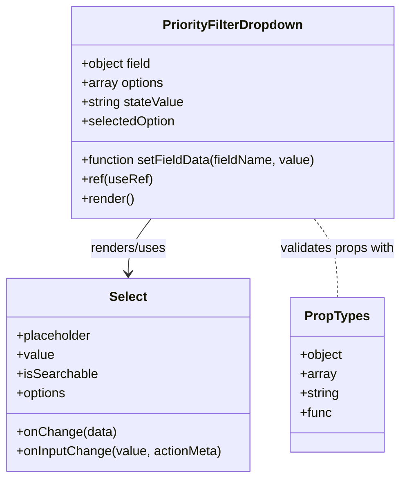

# Diagram: web/portal/src/pages/damageview/dashboard/components/DamageView.PriorityFilterDropdown.js


> Auto-generated by Obscura crawlers

## Diagram 1



### SVG

<svg id="container" width="500.27734375" xmlns="http://www.w3.org/2000/svg" class="classDiagram" height="594" viewBox="0 0 500.27734375 594" role="graphics-document document" aria-roledescription="class"><style>#container{font-family:"trebuchet ms",verdana,arial,sans-serif;font-size:16px;fill:#333;}@keyframes edge-animation-frame{from{stroke-dashoffset:0;}}@keyframes dash{to{stroke-dashoffset:0;}}#container .edge-animation-slow{stroke-dasharray:9,5!important;stroke-dashoffset:900;animation:dash 50s linear infinite;stroke-linecap:round;}#container .edge-animation-fast{stroke-dasharray:9,5!important;stroke-dashoffset:900;animation:dash 20s linear infinite;stroke-linecap:round;}#container .error-icon{fill:#552222;}#container .error-text{fill:#552222;stroke:#552222;}#container .edge-thickness-normal{stroke-width:1px;}#container .edge-thickness-thick{stroke-width:3.5px;}#container .edge-pattern-solid{stroke-dasharray:0;}#container .edge-thickness-invisible{stroke-width:0;fill:none;}#container .edge-pattern-dashed{stroke-dasharray:3;}#container .edge-pattern-dotted{stroke-dasharray:2;}#container .marker{fill:#333333;stroke:#333333;}#container .marker.cross{stroke:#333333;}#container svg{font-family:"trebuchet ms",verdana,arial,sans-serif;font-size:16px;}#container p{margin:0;}#container g.classGroup text{fill:#9370DB;stroke:none;font-family:"trebuchet ms",verdana,arial,sans-serif;font-size:10px;}#container g.classGroup text .title{font-weight:bolder;}#container .nodeLabel,#container .edgeLabel{color:#131300;}#container .edgeLabel .label rect{fill:#ECECFF;}#container .label text{fill:#131300;}#container .labelBkg{background:#ECECFF;}#container .edgeLabel .label span{background:#ECECFF;}#container .classTitle{font-weight:bolder;}#container .node rect,#container .node circle,#container .node ellipse,#container .node polygon,#container .node path{fill:#ECECFF;stroke:#9370DB;stroke-width:1px;}#container .divider{stroke:#9370DB;stroke-width:1;}#container g.clickable{cursor:pointer;}#container g.classGroup rect{fill:#ECECFF;stroke:#9370DB;}#container g.classGroup line{stroke:#9370DB;stroke-width:1;}#container .classLabel .box{stroke:none;stroke-width:0;fill:#ECECFF;opacity:0.5;}#container .classLabel .label{fill:#9370DB;font-size:10px;}#container .relation{stroke:#333333;stroke-width:1;fill:none;}#container .dashed-line{stroke-dasharray:3;}#container .dotted-line{stroke-dasharray:1 2;}#container #compositionStart,#container .composition{fill:#333333!important;stroke:#333333!important;stroke-width:1;}#container #compositionEnd,#container .composition{fill:#333333!important;stroke:#333333!important;stroke-width:1;}#container #dependencyStart,#container .dependency{fill:#333333!important;stroke:#333333!important;stroke-width:1;}#container #dependencyStart,#container .dependency{fill:#333333!important;stroke:#333333!important;stroke-width:1;}#container #extensionStart,#container .extension{fill:transparent!important;stroke:#333333!important;stroke-width:1;}#container #extensionEnd,#container .extension{fill:transparent!important;stroke:#333333!important;stroke-width:1;}#container #aggregationStart,#container .aggregation{fill:transparent!important;stroke:#333333!important;stroke-width:1;}#container #aggregationEnd,#container .aggregation{fill:transparent!important;stroke:#333333!important;stroke-width:1;}#container #lollipopStart,#container .lollipop{fill:#ECECFF!important;stroke:#333333!important;stroke-width:1;}#container #lollipopEnd,#container .lollipop{fill:#ECECFF!important;stroke:#333333!important;stroke-width:1;}#container .edgeTerminals{font-size:11px;line-height:initial;}#container .classTitleText{text-anchor:middle;font-size:18px;fill:#333;}#container .label-icon{display:inline-block;height:1em;overflow:visible;vertical-align:-0.125em;}#container .node .label-icon path{fill:currentColor;stroke:revert;stroke-width:revert;}#container :root{--mermaid-font-family:"trebuchet ms",verdana,arial,sans-serif;}</style><g><defs><marker id="container_class-aggregationStart" class="marker aggregation class" refX="18" refY="7" markerWidth="190" markerHeight="240" orient="auto"><path d="M 18,7 L9,13 L1,7 L9,1 Z"></path></marker></defs><defs><marker id="container_class-aggregationEnd" class="marker aggregation class" refX="1" refY="7" markerWidth="20" markerHeight="28" orient="auto"><path d="M 18,7 L9,13 L1,7 L9,1 Z"></path></marker></defs><defs><marker id="container_class-extensionStart" class="marker extension class" refX="18" refY="7" markerWidth="190" markerHeight="240" orient="auto"><path d="M 1,7 L18,13 V 1 Z"></path></marker></defs><defs><marker id="container_class-extensionEnd" class="marker extension class" refX="1" refY="7" markerWidth="20" markerHeight="28" orient="auto"><path d="M 1,1 V 13 L18,7 Z"></path></marker></defs><defs><marker id="container_class-compositionStart" class="marker composition class" refX="18" refY="7" markerWidth="190" markerHeight="240" orient="auto"><path d="M 18,7 L9,13 L1,7 L9,1 Z"></path></marker></defs><defs><marker id="container_class-compositionEnd" class="marker composition class" refX="1" refY="7" markerWidth="20" markerHeight="28" orient="auto"><path d="M 18,7 L9,13 L1,7 L9,1 Z"></path></marker></defs><defs><marker id="container_class-dependencyStart" class="marker dependency class" refX="6" refY="7" markerWidth="190" markerHeight="240" orient="auto"><path d="M 5,7 L9,13 L1,7 L9,1 Z"></path></marker></defs><defs><marker id="container_class-dependencyEnd" class="marker dependency class" refX="13" refY="7" markerWidth="20" markerHeight="28" orient="auto"><path d="M 18,7 L9,13 L14,7 L9,1 Z"></path></marker></defs><defs><marker id="container_class-lollipopStart" class="marker lollipop class" refX="13" refY="7" markerWidth="190" markerHeight="240" orient="auto"><circle stroke="black" fill="transparent" cx="7" cy="7" r="6"></circle></marker></defs><defs><marker id="container_class-lollipopEnd" class="marker lollipop class" refX="1" refY="7" markerWidth="190" markerHeight="240" orient="auto"><circle stroke="black" fill="transparent" cx="7" cy="7" r="6"></circle></marker></defs><g class="root"><g class="clusters"></g><g class="edgePaths"><path d="M187.983,272L183.249,278.167C178.516,284.333,169.049,296.667,164.316,308C159.582,319.333,159.582,329.667,159.582,334.833L159.582,340" id="id_PriorityFilterDropdown_Select_1" class="edge-thickness-normal edge-pattern-solid relation" style=";;;" data-edge="true" data-et="edge" data-id="id_PriorityFilterDropdown_Select_1" data-points="W3sieCI6MTg3Ljk4Mjg0OTQ4MjI0ODUzLCJ5IjoyNzJ9LHsieCI6MTU5LjU4MjAzMTI1LCJ5IjozMDl9LHsieCI6MTU5LjU4MjAzMTI1LCJ5IjozNDZ9XQ==" marker-end="url(#container_class-dependencyEnd)"></path><path d="M390.627,272L395.36,278.167C400.093,284.333,409.56,296.667,414.294,313C419.027,329.333,419.027,349.667,419.027,359.833L419.027,370" id="id_PriorityFilterDropdown_PropTypes_2" class="edge-thickness-normal edge-pattern-dashed relation" style=";;;" data-edge="true" data-et="edge" data-id="id_PriorityFilterDropdown_PropTypes_2" data-points="W3sieCI6MzkwLjYyNjUyNTUxNzc1MTUsInkiOjI3Mn0seyJ4Ijo0MTkuMDI3MzQzNzUsInkiOjMwOX0seyJ4Ijo0MTkuMDI3MzQzNzUsInkiOjM3MH1d"></path></g><g class="edgeLabels"><g class="edgeLabel" transform="translate(159.58203125, 309)"><g class="label" data-id="id_PriorityFilterDropdown_Select_1" transform="translate(-48.15625, -12)"><foreignObject width="96.3125" height="24"><div xmlns="http://www.w3.org/1999/xhtml" class="labelBkg" style="display: table-cell; white-space: nowrap; line-height: 1.5; max-width: 200px; text-align: center;"><span class="edgeLabel"><p>renders/uses</p></span></div></foreignObject></g></g><g class="edgeLabel" transform="translate(419.02734375, 309)"><g class="label" data-id="id_PriorityFilterDropdown_PropTypes_2" transform="translate(-73.25, -12)"><foreignObject width="146.5" height="24"><div xmlns="http://www.w3.org/1999/xhtml" class="labelBkg" style="display: table-cell; white-space: nowrap; line-height: 1.5; max-width: 200px; text-align: center;"><span class="edgeLabel"><p>validates props with</p></span></div></foreignObject></g></g></g><g class="nodes"><g class="node default" id="classId-PriorityFilterDropdown-0" transform="translate(289.3046875, 140)"><g class="basic label-container"><path d="M-200.95703125 -132 L200.95703125 -132 L200.95703125 132 L-200.95703125 132" stroke="none" stroke-width="0" fill="#ECECFF" style=""></path><path d="M-200.95703125 -132 C-40.966519014635935 -132, 119.02399322072813 -132, 200.95703125 -132 M-200.95703125 -132 C-61.98807719243513 -132, 76.98087686512974 -132, 200.95703125 -132 M200.95703125 -132 C200.95703125 -70.47416199168396, 200.95703125 -8.948323983367914, 200.95703125 132 M200.95703125 -132 C200.95703125 -77.62039109316294, 200.95703125 -23.240782186325887, 200.95703125 132 M200.95703125 132 C81.61966674048163 132, -37.71769776903673 132, -200.95703125 132 M200.95703125 132 C77.36589341771145 132, -46.225244414577105 132, -200.95703125 132 M-200.95703125 132 C-200.95703125 41.39927816447329, -200.95703125 -49.201443671053426, -200.95703125 -132 M-200.95703125 132 C-200.95703125 57.08470426894135, -200.95703125 -17.830591462117297, -200.95703125 -132" stroke="#9370DB" stroke-width="1.3" fill="none" stroke-dasharray="0 0" style=""></path></g><g class="annotation-group text" transform="translate(0, -108)"></g><g class="label-group text" transform="translate(-84.0078125, -108)"><g class="label" style="font-weight: bolder" transform="translate(0,-12)"><foreignObject width="168.015625" height="24"><div xmlns="http://www.w3.org/1999/xhtml" style="display: table-cell; white-space: nowrap; line-height: 1.5; max-width: 215px; text-align: center;"><span class="nodeLabel markdown-node-label" style=""><p>PriorityFilterDropdown</p></span></div></foreignObject></g></g><g class="members-group text" transform="translate(-188.95703125, -60)"><g class="label" style="" transform="translate(0,-12)"><foreignObject width="89.796875" height="24"><div xmlns="http://www.w3.org/1999/xhtml" style="display: table-cell; white-space: nowrap; line-height: 1.5; max-width: 147px; text-align: center;"><span class="nodeLabel markdown-node-label" style=""><p>+object field</p></span></div></foreignObject></g><g class="label" style="" transform="translate(0,12)"><foreignObject width="104.15625" height="24"><div xmlns="http://www.w3.org/1999/xhtml" style="display: table-cell; white-space: nowrap; line-height: 1.5; max-width: 162px; text-align: center;"><span class="nodeLabel markdown-node-label" style=""><p>+array options</p></span></div></foreignObject></g><g class="label" style="" transform="translate(0,36)"><foreignObject width="129.484375" height="24"><div xmlns="http://www.w3.org/1999/xhtml" style="display: table-cell; white-space: nowrap; line-height: 1.5; max-width: 187px; text-align: center;"><span class="nodeLabel markdown-node-label" style=""><p>+string stateValue</p></span></div></foreignObject></g><g class="label" style="" transform="translate(0,60)"><foreignObject width="118.5625" height="24"><div xmlns="http://www.w3.org/1999/xhtml" style="display: table-cell; white-space: nowrap; line-height: 1.5; max-width: 176px; text-align: center;"><span class="nodeLabel markdown-node-label" style=""><p>+selectedOption</p></span></div></foreignObject></g></g><g class="methods-group text" transform="translate(-188.95703125, 60)"><g class="label" style="" transform="translate(0,-12)"><foreignObject width="293.90625" height="24"><div xmlns="http://www.w3.org/1999/xhtml" style="display: table-cell; white-space: nowrap; line-height: 1.5; max-width: 351px; text-align: center;"><span class="nodeLabel markdown-node-label" style=""><p>+function setFieldData(fieldName, value)</p></span></div></foreignObject></g><g class="label" style="" transform="translate(0,12)"><foreignObject width="88.4375" height="24"><div xmlns="http://www.w3.org/1999/xhtml" style="display: table-cell; white-space: nowrap; line-height: 1.5; max-width: 146px; text-align: center;"><span class="nodeLabel markdown-node-label" style=""><p>+ref(useRef)</p></span></div></foreignObject></g><g class="label" style="" transform="translate(0,36)"><foreignObject width="66.609375" height="24"><div xmlns="http://www.w3.org/1999/xhtml" style="display: table-cell; white-space: nowrap; line-height: 1.5; max-width: 124px; text-align: center;"><span class="nodeLabel markdown-node-label" style=""><p>+render()</p></span></div></foreignObject></g></g><g class="divider" style=""><path d="M-200.95703125 -84 C-81.62915736896474 -84, 37.69871651207052 -84, 200.95703125 -84 M-200.95703125 -84 C-107.54207147737392 -84, -14.127111704747847 -84, 200.95703125 -84" stroke="#9370DB" stroke-width="1.3" fill="none" stroke-dasharray="0 0" style=""></path></g><g class="divider" style=""><path d="M-200.95703125 36 C-53.406625488392564 36, 94.14378027321487 36, 200.95703125 36 M-200.95703125 36 C-44.70348430194713 36, 111.55006264610574 36, 200.95703125 36" stroke="#9370DB" stroke-width="1.3" fill="none" stroke-dasharray="0 0" style=""></path></g></g><g class="node default" id="classId-Select-1" transform="translate(159.58203125, 466)"><g class="basic label-container"><path d="M-151.58203125 -120 L151.58203125 -120 L151.58203125 120 L-151.58203125 120" stroke="none" stroke-width="0" fill="#ECECFF" style=""></path><path d="M-151.58203125 -120 C-75.65380669197398 -120, 0.27441786605203333 -120, 151.58203125 -120 M-151.58203125 -120 C-54.898568659876034 -120, 41.78489393024793 -120, 151.58203125 -120 M151.58203125 -120 C151.58203125 -44.67411415443853, 151.58203125 30.651771691122946, 151.58203125 120 M151.58203125 -120 C151.58203125 -62.28871299798801, 151.58203125 -4.577425995976014, 151.58203125 120 M151.58203125 120 C66.18859885177496 120, -19.20483354645009 120, -151.58203125 120 M151.58203125 120 C78.41220615296167 120, 5.242381055923346 120, -151.58203125 120 M-151.58203125 120 C-151.58203125 58.51875803670124, -151.58203125 -2.962483926597514, -151.58203125 -120 M-151.58203125 120 C-151.58203125 42.96800357395962, -151.58203125 -34.06399285208076, -151.58203125 -120" stroke="#9370DB" stroke-width="1.3" fill="none" stroke-dasharray="0 0" style=""></path></g><g class="annotation-group text" transform="translate(0, -96)"></g><g class="label-group text" transform="translate(-22.6640625, -96)"><g class="label" style="font-weight: bolder" transform="translate(0,-12)"><foreignObject width="45.328125" height="24"><div xmlns="http://www.w3.org/1999/xhtml" style="display: table-cell; white-space: nowrap; line-height: 1.5; max-width: 94px; text-align: center;"><span class="nodeLabel markdown-node-label" style=""><p>Select</p></span></div></foreignObject></g></g><g class="members-group text" transform="translate(-139.58203125, -48)"><g class="label" style="" transform="translate(0,-12)"><foreignObject width="94.640625" height="24"><div xmlns="http://www.w3.org/1999/xhtml" style="display: table-cell; white-space: nowrap; line-height: 1.5; max-width: 153px; text-align: center;"><span class="nodeLabel markdown-node-label" style=""><p>+placeholder</p></span></div></foreignObject></g><g class="label" style="" transform="translate(0,12)"><foreignObject width="46.71875" height="24"><div xmlns="http://www.w3.org/1999/xhtml" style="display: table-cell; white-space: nowrap; line-height: 1.5; max-width: 104px; text-align: center;"><span class="nodeLabel markdown-node-label" style=""><p>+value</p></span></div></foreignObject></g><g class="label" style="" transform="translate(0,36)"><foreignObject width="100.21875" height="24"><div xmlns="http://www.w3.org/1999/xhtml" style="display: table-cell; white-space: nowrap; line-height: 1.5; max-width: 158px; text-align: center;"><span class="nodeLabel markdown-node-label" style=""><p>+isSearchable</p></span></div></foreignObject></g><g class="label" style="" transform="translate(0,60)"><foreignObject width="63.3125" height="24"><div xmlns="http://www.w3.org/1999/xhtml" style="display: table-cell; white-space: nowrap; line-height: 1.5; max-width: 121px; text-align: center;"><span class="nodeLabel markdown-node-label" style=""><p>+options</p></span></div></foreignObject></g></g><g class="methods-group text" transform="translate(-139.58203125, 72)"><g class="label" style="" transform="translate(0,-12)"><foreignObject width="122.765625" height="24"><div xmlns="http://www.w3.org/1999/xhtml" style="display: table-cell; white-space: nowrap; line-height: 1.5; max-width: 180px; text-align: center;"><span class="nodeLabel markdown-node-label" style=""><p>+onChange(data)</p></span></div></foreignObject></g><g class="label" style="" transform="translate(0,12)"><foreignObject width="256.5" height="24"><div xmlns="http://www.w3.org/1999/xhtml" style="display: table-cell; white-space: nowrap; line-height: 1.5; max-width: 314px; text-align: center;"><span class="nodeLabel markdown-node-label" style=""><p>+onInputChange(value, actionMeta)</p></span></div></foreignObject></g></g><g class="divider" style=""><path d="M-151.58203125 -72 C-63.722995321928806 -72, 24.136040606142387 -72, 151.58203125 -72 M-151.58203125 -72 C-60.43222481273689 -72, 30.71758162452622 -72, 151.58203125 -72" stroke="#9370DB" stroke-width="1.3" fill="none" stroke-dasharray="0 0" style=""></path></g><g class="divider" style=""><path d="M-151.58203125 48 C-76.79341453770493 48, -2.0047978254098666 48, 151.58203125 48 M-151.58203125 48 C-33.868537176736936 48, 83.84495689652613 48, 151.58203125 48" stroke="#9370DB" stroke-width="1.3" fill="none" stroke-dasharray="0 0" style=""></path></g></g><g class="node default" id="classId-PropTypes-2" transform="translate(419.02734375, 466)"><g class="basic label-container"><path d="M-57.86328125 -96 L57.86328125 -96 L57.86328125 96 L-57.86328125 96" stroke="none" stroke-width="0" fill="#ECECFF" style=""></path><path d="M-57.86328125 -96 C-24.495985852180333 -96, 8.871309545639335 -96, 57.86328125 -96 M-57.86328125 -96 C-26.864054345053976 -96, 4.135172559892048 -96, 57.86328125 -96 M57.86328125 -96 C57.86328125 -51.662264494932366, 57.86328125 -7.324528989864731, 57.86328125 96 M57.86328125 -96 C57.86328125 -40.48290341204544, 57.86328125 15.034193175909124, 57.86328125 96 M57.86328125 96 C26.689673780520405 96, -4.4839336889591905 96, -57.86328125 96 M57.86328125 96 C21.937861806969558 96, -13.987557636060885 96, -57.86328125 96 M-57.86328125 96 C-57.86328125 22.834324120930503, -57.86328125 -50.33135175813899, -57.86328125 -96 M-57.86328125 96 C-57.86328125 34.91153148703446, -57.86328125 -26.176937025931082, -57.86328125 -96" stroke="#9370DB" stroke-width="1.3" fill="none" stroke-dasharray="0 0" style=""></path></g><g class="annotation-group text" transform="translate(0, -72)"></g><g class="label-group text" transform="translate(-38.2578125, -72)"><g class="label" style="font-weight: bolder" transform="translate(0,-12)"><foreignObject width="76.515625" height="24"><div xmlns="http://www.w3.org/1999/xhtml" style="display: table-cell; white-space: nowrap; line-height: 1.5; max-width: 125px; text-align: center;"><span class="nodeLabel markdown-node-label" style=""><p>PropTypes</p></span></div></foreignObject></g></g><g class="members-group text" transform="translate(-45.86328125, -24)"><g class="label" style="" transform="translate(0,-12)"><foreignObject width="53.46875" height="24"><div xmlns="http://www.w3.org/1999/xhtml" style="display: table-cell; white-space: nowrap; line-height: 1.5; max-width: 111px; text-align: center;"><span class="nodeLabel markdown-node-label" style=""><p>+object</p></span></div></foreignObject></g><g class="label" style="" transform="translate(0,12)"><foreignObject width="44.578125" height="24"><div xmlns="http://www.w3.org/1999/xhtml" style="display: table-cell; white-space: nowrap; line-height: 1.5; max-width: 102px; text-align: center;"><span class="nodeLabel markdown-node-label" style=""><p>+array</p></span></div></foreignObject></g><g class="label" style="" transform="translate(0,36)"><foreignObject width="49.625" height="24"><div xmlns="http://www.w3.org/1999/xhtml" style="display: table-cell; white-space: nowrap; line-height: 1.5; max-width: 108px; text-align: center;"><span class="nodeLabel markdown-node-label" style=""><p>+string</p></span></div></foreignObject></g><g class="label" style="" transform="translate(0,60)"><foreignObject width="39.453125" height="24"><div xmlns="http://www.w3.org/1999/xhtml" style="display: table-cell; white-space: nowrap; line-height: 1.5; max-width: 97px; text-align: center;"><span class="nodeLabel markdown-node-label" style=""><p>+func</p></span></div></foreignObject></g></g><g class="methods-group text" transform="translate(-45.86328125, 96)"></g><g class="divider" style=""><path d="M-57.86328125 -48 C-14.540798324573366 -48, 28.781684600853268 -48, 57.86328125 -48 M-57.86328125 -48 C-25.232205093034317 -48, 7.398871063931367 -48, 57.86328125 -48" stroke="#9370DB" stroke-width="1.3" fill="none" stroke-dasharray="0 0" style=""></path></g><g class="divider" style=""><path d="M-57.86328125 72 C-23.863008633777994 72, 10.137263982444011 72, 57.86328125 72 M-57.86328125 72 C-17.942224999495792 72, 21.978831251008415 72, 57.86328125 72" stroke="#9370DB" stroke-width="1.3" fill="none" stroke-dasharray="0 0" style=""></path></g></g></g></g></g></svg>

## Diagram 2

```mermaid
flowchart TD
    U[User types into Select input] --> OC[onInputChange(value, actionMeta)]
    OC --> A{actionMeta.action === "input-change"}
    A -- yes --> F[Find focusedOption: options.find or options[0]]
    F --> S[Set ref.current.state.focusedOption = focusedOption]
    A -- no --> N[Do nothing / ignore input-change]
    UserSelect[User selects an option] --> OC2[onChange(data)]
    OC2 --> SD[setFieldData(field.fieldName, data.value)]
    SelectComponent[Select component render] --> UserSelect
    SelectComponent --> U
```

> SVG rendering failed for this diagram.
