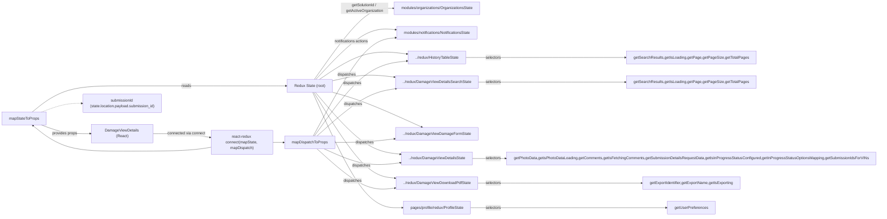
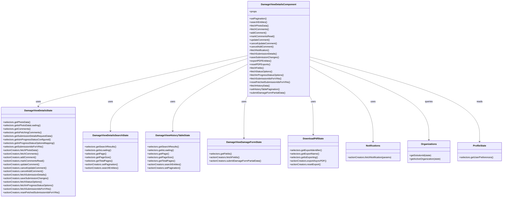

# Diagram: web/portal/src/pages/damageview/details/DamageView.Details.page.container.js

> Auto-generated by Obscura crawlers

## Diagram 1

### SVG

<svg id="container" width="3727.03125" xmlns="http://www.w3.org/2000/svg" class="flowchart" height="895" viewBox="0 0 3727.03125 895" role="graphics-document document" aria-roledescription="flowchart-v2"><g><marker id="container_flowchart-v2-pointEnd" class="marker flowchart-v2" viewBox="0 0 10 10" refX="5" refY="5" markerUnits="userSpaceOnUse" markerWidth="8" markerHeight="8" orient="auto"><path d="M 0 0 L 10 5 L 0 10 z" class="arrowMarkerPath" style="stroke-width: 1; stroke-dasharray: 1, 0;"></path></marker><marker id="container_flowchart-v2-pointStart" class="marker flowchart-v2" viewBox="0 0 10 10" refX="4.5" refY="5" markerUnits="userSpaceOnUse" markerWidth="8" markerHeight="8" orient="auto"><path d="M 0 5 L 10 10 L 10 0 z" class="arrowMarkerPath" style="stroke-width: 1; stroke-dasharray: 1, 0;"></path></marker><marker id="container_flowchart-v2-circleEnd" class="marker flowchart-v2" viewBox="0 0 10 10" refX="11" refY="5" markerUnits="userSpaceOnUse" markerWidth="11" markerHeight="11" orient="auto"><circle cx="5" cy="5" r="5" class="arrowMarkerPath" style="stroke-width: 1; stroke-dasharray: 1, 0;"></circle></marker><marker id="container_flowchart-v2-circleStart" class="marker flowchart-v2" viewBox="0 0 10 10" refX="-1" refY="5" markerUnits="userSpaceOnUse" markerWidth="11" markerHeight="11" orient="auto"><circle cx="5" cy="5" r="5" class="arrowMarkerPath" style="stroke-width: 1; stroke-dasharray: 1, 0;"></circle></marker><marker id="container_flowchart-v2-crossEnd" class="marker cross flowchart-v2" viewBox="0 0 11 11" refX="12" refY="5.2" markerUnits="userSpaceOnUse" markerWidth="11" markerHeight="11" orient="auto"><path d="M 1,1 l 9,9 M 10,1 l -9,9" class="arrowMarkerPath" style="stroke-width: 2; stroke-dasharray: 1, 0;"></path></marker><marker id="container_flowchart-v2-crossStart" class="marker cross flowchart-v2" viewBox="0 0 11 11" refX="-1" refY="5.2" markerUnits="userSpaceOnUse" markerWidth="11" markerHeight="11" orient="auto"><path d="M 1,1 l 9,9 M 10,1 l -9,9" class="arrowMarkerPath" style="stroke-width: 2; stroke-dasharray: 1, 0;"></path></marker><g class="root"><g class="clusters"></g><g class="edgePaths"><path d="M1341.186,336L1376.559,285.833C1411.931,235.667,1482.677,135.333,1538.216,85.167C1593.755,35,1634.089,35,1654.255,35L1674.422,35" id="L_State_Organizations_0" class="edge-thickness-normal edge-pattern-solid edge-thickness-normal edge-pattern-solid flowchart-link" style=";" data-edge="true" data-et="edge" data-id="L_State_Organizations_0" data-points="W3sieCI6MTM0MS4xODYxODk5NzcxMzQsInkiOjMzNn0seyJ4IjoxNTUzLjQyMTg3NSwieSI6MzV9LHsieCI6MTY3OC40MjE4NzUsInkiOjM1fV0=" marker-end="url(#container_flowchart-v2-pointEnd)"></path><path d="M1347.327,336L1381.676,299.167C1416.026,262.333,1484.724,188.667,1540.36,153.473C1595.996,118.28,1638.57,121.561,1659.858,123.201L1681.145,124.841" id="L_State_Notifications_0" class="edge-thickness-normal edge-pattern-solid edge-thickness-normal edge-pattern-solid flowchart-link" style=";" data-edge="true" data-et="edge" data-id="L_State_Notifications_0" data-points="W3sieCI6MTM0Ny4zMjc0MDA0NTM2MjksInkiOjMzNn0seyJ4IjoxNTUzLjQyMTg3NSwieSI6MTE1fSx7IngiOjE2ODUuMTMyODEyNSwieSI6MTI1LjE0ODEyNzcxMTg3MDc5fV0=" marker-end="url(#container_flowchart-v2-pointEnd)"></path><path d="M1362.177,336L1394.051,314.5C1425.925,293,1489.673,250,1551.714,231.986C1613.754,213.973,1674.085,220.945,1704.251,224.432L1734.417,227.918" id="L_State_DamageViewHistoryTableState_0" class="edge-thickness-normal edge-pattern-solid edge-thickness-normal edge-pattern-solid flowchart-link" style=";" data-edge="true" data-et="edge" data-id="L_State_DamageViewHistoryTableState_0" data-points="W3sieCI6MTM2Mi4xNzY1MzI0NTE5MjMsInkiOjMzNn0seyJ4IjoxNTUzLjQyMTg3NSwieSI6MjA3fSx7IngiOjE3MzguMzkwNjI1LCJ5IjoyMjguMzc3MzQxOTI3NzE2ODh9XQ==" marker-end="url(#container_flowchart-v2-pointEnd)"></path><path d="M1417.727,341.51L1440.342,336.425C1462.958,331.34,1508.19,321.17,1552.684,318.614C1597.178,316.057,1640.934,321.114,1662.812,323.643L1684.691,326.171" id="L_State_DamageViewDetailsSearchState_0" class="edge-thickness-normal edge-pattern-solid edge-thickness-normal edge-pattern-solid flowchart-link" style=";" data-edge="true" data-et="edge" data-id="L_State_DamageViewDetailsSearchState_0" data-points="W3sieCI6MTQxNy43MjY1NjI1LCJ5IjozNDEuNTEwMDE1ODc2NzY5Mn0seyJ4IjoxNTUzLjQyMTg3NSwieSI6MzExfSx7IngiOjE2ODguNjY0MDYyNSwieSI6MzI2LjYzMDMwNzc0MjQ2OTV9XQ==" marker-end="url(#container_flowchart-v2-pointEnd)"></path><path d="M1417.727,387.383L1440.342,393.152C1462.958,398.922,1508.19,410.461,1570.979,432.48C1633.767,454.5,1714.112,487,1754.285,503.25L1794.458,519.5" id="L_State_DamageViewDamageFormState_0" class="edge-thickness-normal edge-pattern-solid edge-thickness-normal edge-pattern-solid flowchart-link" style=";" data-edge="true" data-et="edge" data-id="L_State_DamageViewDamageFormState_0" data-points="W3sieCI6MTQxNy43MjY1NjI1LCJ5IjozODcuMzgyODY2NjAxMzU4fSx7IngiOjE1NTMuNDIxODc1LCJ5Ijo0MjJ9LHsieCI6MTc5OC4xNjU3MzY2MDcxNDMsInkiOjUyMX1d" marker-end="url(#container_flowchart-v2-pointEnd)"></path><path d="M1346.83,390L1381.262,427.667C1415.694,465.333,1484.558,540.667,1544.927,581.331C1605.295,621.995,1657.169,627.99,1683.105,630.988L1709.042,633.985" id="L_State_DamageViewDetailsState_0" class="edge-thickness-normal edge-pattern-solid edge-thickness-normal edge-pattern-solid flowchart-link" style=";" data-edge="true" data-et="edge" data-id="L_State_DamageViewDetailsState_0" data-points="W3sieCI6MTM0Ni44Mjk3OTI0OTAxMTg1LCJ5IjozOTB9LHsieCI6MTU1My40MjE4NzUsInkiOjYxNn0seyJ4IjoxNzEzLjAxNTYyNSwieSI6NjM0LjQ0NDY4NDEwNjI0Mjd9XQ==" marker-end="url(#container_flowchart-v2-pointEnd)"></path><path d="M1339.64,390L1375.27,445C1410.9,500,1482.161,610,1539.874,667.552C1597.587,725.104,1641.752,730.209,1663.835,732.761L1685.917,735.313" id="L_State_DownloadPdfState_0" class="edge-thickness-normal edge-pattern-solid edge-thickness-normal edge-pattern-solid flowchart-link" style=";" data-edge="true" data-et="edge" data-id="L_State_DownloadPdfState_0" data-points="W3sieCI6MTMzOS42Mzk3MDU4ODIzNTMsInkiOjM5MH0seyJ4IjoxNTUzLjQyMTg3NSwieSI6NzIwfSx7IngiOjE2ODkuODkwNjI1LCJ5Ijo3MzUuNzcyMDY0OTA5MzMyNn1d" marker-end="url(#container_flowchart-v2-pointEnd)"></path><path d="M1334.713,390L1371.164,468.333C1407.616,546.667,1480.519,703.333,1543.371,781.667C1606.224,860,1659.026,860,1685.427,860L1711.828,860" id="L_State_ProfileState_0" class="edge-thickness-normal edge-pattern-solid edge-thickness-normal edge-pattern-solid flowchart-link" style=";" data-edge="true" data-et="edge" data-id="L_State_ProfileState_0" data-points="W3sieCI6MTMzNC43MTI1ODgwMjgxNjksInkiOjM5MH0seyJ4IjoxNTUzLjQyMTg3NSwieSI6ODYwfSx7IngiOjE3MTUuODI4MTI1LCJ5Ijo4NjB9XQ==" marker-end="url(#container_flowchart-v2-pointEnd)"></path><path d="M1991.438,243L2011.055,243C2030.672,243,2069.906,243,2183.543,243C2297.18,243,2485.219,243,2579.238,243L2673.258,243" id="L_DamageViewHistoryTableState_getHistoryData_0" class="edge-thickness-normal edge-pattern-solid edge-thickness-normal edge-pattern-solid flowchart-link" style=";" data-edge="true" data-et="edge" data-id="L_DamageViewHistoryTableState_getHistoryData_0" data-points="W3sieCI6MTk5MS40Mzc1LCJ5IjoyNDN9LHsieCI6MjEwOS4xNDA2MjUsInkiOjI0M30seyJ4IjoyNjc3LjI1NzgxMjUsInkiOjI0M31d" marker-end="url(#container_flowchart-v2-pointEnd)"></path><path d="M2041.164,347L2052.493,347C2063.823,347,2086.482,347,2191.831,347C2297.18,347,2485.219,347,2579.238,347L2673.258,347" id="L_DamageViewDetailsSearchState_DetailsSearchSelectors_0" class="edge-thickness-normal edge-pattern-solid edge-thickness-normal edge-pattern-solid flowchart-link" style=";" data-edge="true" data-et="edge" data-id="L_DamageViewDetailsSearchState_DetailsSearchSelectors_0" data-points="W3sieCI6MjA0MS4xNjQwNjI1LCJ5IjozNDd9LHsieCI6MjEwOS4xNDA2MjUsInkiOjM0N30seyJ4IjoyNjc3LjI1NzgxMjUsInkiOjM0N31d" marker-end="url(#container_flowchart-v2-pointEnd)"></path><path d="M2016.813,652L2032.201,652C2047.589,652,2078.365,652,2102.708,652C2127.052,652,2144.964,652,2153.919,652L2162.875,652" id="L_DamageViewDetailsState_DetailsSelectors_0" class="edge-thickness-normal edge-pattern-solid edge-thickness-normal edge-pattern-solid flowchart-link" style=";" data-edge="true" data-et="edge" data-id="L_DamageViewDetailsState_DetailsSelectors_0" data-points="W3sieCI6MjAxNi44MTI1LCJ5Ijo2NTJ9LHsieCI6MjEwOS4xNDA2MjUsInkiOjY1Mn0seyJ4IjoyMTY2Ljg3NSwieSI6NjUyfV0=" marker-end="url(#container_flowchart-v2-pointEnd)"></path><path d="M2039.938,756L2051.471,756C2063.005,756,2086.073,756,2201.059,756C2316.044,756,2522.948,756,2626.4,756L2729.852,756" id="L_DownloadPdfState_getExportIdentifier,getExportName,getIsExporting_0" class="edge-thickness-normal edge-pattern-solid edge-thickness-normal edge-pattern-solid flowchart-link" style=";" data-edge="true" data-et="edge" data-id="L_DownloadPdfState_getExportIdentifier,getExportName,getIsExporting_0" data-points="W3sieCI6MjAzOS45Mzc1LCJ5Ijo3NTZ9LHsieCI6MjEwOS4xNDA2MjUsInkiOjc1Nn0seyJ4IjoyNzMzLjg1MTU2MjUsInkiOjc1Nn1d" marker-end="url(#container_flowchart-v2-pointEnd)"></path><path d="M2014,860L2029.857,860C2045.714,860,2077.427,860,2214.913,860C2352.398,860,2595.656,860,2717.285,860L2838.914,860" id="L_ProfileState_getUserPreferences_0" class="edge-thickness-normal edge-pattern-solid edge-thickness-normal edge-pattern-solid flowchart-link" style=";" data-edge="true" data-et="edge" data-id="L_ProfileState_getUserPreferences_0" data-points="W3sieCI6MjAxNCwieSI6ODYwfSx7IngiOjIxMDkuMTQwNjI1LCJ5Ijo4NjB9LHsieCI6Mjg0Mi45MTQwNjI1LCJ5Ijo4NjB9XQ==" marker-end="url(#container_flowchart-v2-pointEnd)"></path><path d="M136.824,468L159.719,450.5C182.614,433,228.405,398,292.809,380.5C357.214,363,440.232,363,527.781,363C615.331,363,707.411,363,792.849,363C878.286,363,957.081,363,1022.311,363C1087.542,363,1139.208,363,1170.324,363C1201.44,363,1212.005,363,1217.288,363L1222.57,363" id="L_mapState_State_0" class="edge-thickness-normal edge-pattern-solid edge-thickness-normal edge-pattern-solid flowchart-link" style=";" data-edge="true" data-et="edge" data-id="L_mapState_State_0" data-points="W3sieCI6MTM2LjgyNDA0MTE5MzE4MTgsInkiOjQ2OH0seyJ4IjoyNzQuMTk1MzEyNSwieSI6MzYzfSx7IngiOjUyMy4yNSwieSI6MzYzfSx7IngiOjc5OS40OTIxODc1LCJ5IjozNjN9LHsieCI6MTAzNS44NzUsInkiOjM2M30seyJ4IjoxMTkwLjg3NSwieSI6MzYzfSx7IngiOjEyMjYuNTcwMzEyNSwieSI6MzYzfV0=" marker-end="url(#container_flowchart-v2-pointEnd)"></path><path d="M181.893,522L197.276,527.167C212.66,532.333,243.428,542.667,278.296,547.833C313.164,553,352.133,553,371.617,553L391.102,553" id="L_mapState_DamageViewDetailsComponent_0" class="edge-thickness-normal edge-pattern-solid edge-thickness-normal edge-pattern-solid flowchart-link" style=";" data-edge="true" data-et="edge" data-id="L_mapState_DamageViewDetailsComponent_0" data-points="W3sieCI6MTgxLjg5MjY0NTQ3NDEzNzk0LCJ5Ijo1MjJ9LHsieCI6Mjc0LjE5NTMxMjUsInkiOjU1M30seyJ4IjozOTUuMTAxNTYyNSwieSI6NTUzfV0=" marker-end="url(#container_flowchart-v2-pointEnd)"></path><path d="M181.893,468L197.276,462.833C212.66,457.667,243.428,447.333,271.344,442.167C299.26,437,324.326,437,336.858,437L349.391,437" id="L_mapState_submissionId_0" class="edge-thickness-normal edge-pattern-dotted edge-thickness-normal edge-pattern-solid flowchart-link" style=";" data-edge="true" data-et="edge" data-id="L_mapState_submissionId_0" data-points="W3sieCI6MTgxLjg5MjY0NTQ3NDEzNzk0LCJ5Ijo0Njh9LHsieCI6Mjc0LjE5NTMxMjUsInkiOjQzN30seyJ4IjozNTMuMzkwNjI1LCJ5Ijo0Mzd9XQ==" marker-end="url(#container_flowchart-v2-pointEnd)"></path><path d="M1382.191,611L1410.729,623.833C1439.268,636.667,1496.345,662.333,1550.82,672.169C1605.295,682.005,1657.169,676.01,1683.105,673.012L1709.042,670.015" id="L_mapDispatch_DamageViewDetailsState_0" class="edge-thickness-normal edge-pattern-solid edge-thickness-normal edge-pattern-solid flowchart-link" style=";" data-edge="true" data-et="edge" data-id="L_mapDispatch_DamageViewDetailsState_0" data-points="W3sieCI6MTM4Mi4xOTA1Nzk5Mjc4ODQ1LCJ5Ijo2MTF9LHsieCI6MTU1My40MjE4NzUsInkiOjY4OH0seyJ4IjoxNzEzLjAxNTYyNSwieSI6NjY5LjU1NTMxNTg5Mzc1NzN9XQ==" marker-end="url(#container_flowchart-v2-pointEnd)"></path><path d="M1354.336,557L1387.517,529.167C1420.698,501.333,1487.06,445.667,1542.121,414.813C1597.182,383.959,1640.942,377.918,1662.822,374.898L1684.702,371.877" id="L_mapDispatch_DamageViewDetailsSearchState_0" class="edge-thickness-normal edge-pattern-solid edge-thickness-normal edge-pattern-solid flowchart-link" style=";" data-edge="true" data-et="edge" data-id="L_mapDispatch_DamageViewDetailsSearchState_0" data-points="W3sieCI6MTM1NC4zMzU5Nzc3NzA2MTg1LCJ5Ijo1NTd9LHsieCI6MTU1My40MjE4NzUsInkiOjM5MH0seyJ4IjoxNjg4LjY2NDA2MjUsInkiOjM3MS4zMzA0NjU3NTIwNTA0fV0=" marker-end="url(#container_flowchart-v2-pointEnd)"></path><path d="M1428.422,584L1449.255,584C1470.089,584,1511.755,584,1554.829,581.43C1597.902,578.859,1642.382,573.719,1664.622,571.148L1686.862,568.578" id="L_mapDispatch_DamageViewDamageFormState_0" class="edge-thickness-normal edge-pattern-solid edge-thickness-normal edge-pattern-solid flowchart-link" style=";" data-edge="true" data-et="edge" data-id="L_mapDispatch_DamageViewDamageFormState_0" data-points="W3sieCI6MTQyOC40MjE4NzUsInkiOjU4NH0seyJ4IjoxNTUzLjQyMTg3NSwieSI6NTg0fSx7IngiOjE2OTAuODM1OTM3NSwieSI6NTY4LjExODY4Mjc1MTg3NDh9XQ==" marker-end="url(#container_flowchart-v2-pointEnd)"></path><path d="M1342.622,557L1377.755,510.667C1412.889,464.333,1483.155,371.667,1548.454,321.847C1613.754,272.027,1674.085,265.055,1704.251,261.568L1734.417,258.082" id="L_mapDispatch_DamageViewHistoryTableState_0" class="edge-thickness-normal edge-pattern-solid edge-thickness-normal edge-pattern-solid flowchart-link" style=";" data-edge="true" data-et="edge" data-id="L_mapDispatch_DamageViewHistoryTableState_0" data-points="W3sieCI6MTM0Mi42MjE4MjM3NzA0OTE4LCJ5Ijo1NTd9LHsieCI6MTU1My40MjE4NzUsInkiOjI3OX0seyJ4IjoxNzM4LjM5MDYyNSwieSI6MjU3LjYyMjY1ODA3MjI4MzF9XQ==" marker-end="url(#container_flowchart-v2-pointEnd)"></path><path d="M1352.17,611L1385.712,641.167C1419.254,671.333,1486.338,731.667,1541.962,759.281C1597.587,786.896,1641.752,781.791,1663.835,779.239L1685.917,776.687" id="L_mapDispatch_DownloadPdfState_0" class="edge-thickness-normal edge-pattern-solid edge-thickness-normal edge-pattern-solid flowchart-link" style=";" data-edge="true" data-et="edge" data-id="L_mapDispatch_DownloadPdfState_0" data-points="W3sieCI6MTM1Mi4xNjk1MDg3MTM5NDI0LCJ5Ijo2MTF9LHsieCI6MTU1My40MjE4NzUsInkiOjc5Mn0seyJ4IjoxNjg5Ljg5MDYyNSwieSI6Nzc2LjIyNzkzNTA5MDY2NzR9XQ==" marker-end="url(#container_flowchart-v2-pointEnd)"></path><path d="M1337.416,557L1373.417,493.333C1409.418,429.667,1481.42,302.333,1538.71,236.206C1596.001,170.079,1638.58,165.158,1659.87,162.698L1681.159,160.237" id="L_mapDispatch_Notifications_0" class="edge-thickness-normal edge-pattern-solid edge-thickness-normal edge-pattern-solid flowchart-link" style=";" data-edge="true" data-et="edge" data-id="L_mapDispatch_Notifications_0" data-points="W3sieCI6MTMzNy40MTU4NzcxMzkzNjQzLCJ5Ijo1NTd9LHsieCI6MTU1My40MjE4NzUsInkiOjE3NX0seyJ4IjoxNjg1LjEzMjgxMjUsInkiOjE1OS43Nzc4MDg0MzIxOTM4NH1d" marker-end="url(#container_flowchart-v2-pointEnd)"></path><path d="M651.398,553L676.081,553C700.763,553,750.128,553,791.879,555.239C833.631,557.477,867.77,561.954,884.839,564.193L901.909,566.431" id="L_DamageViewDetailsComponent_connect_0" class="edge-thickness-normal edge-pattern-solid edge-thickness-normal edge-pattern-solid flowchart-link" style=";" data-edge="true" data-et="edge" data-id="L_DamageViewDetailsComponent_connect_0" data-points="W3sieCI6NjUxLjM5ODQzNzUsInkiOjU1M30seyJ4Ijo3OTkuNDkyMTg3NSwieSI6NTUzfSx7IngiOjkwNS44NzUsInkiOjU2Ni45NTEzODMxNTEwMDYzfV0=" marker-end="url(#container_flowchart-v2-pointEnd)"></path><path d="M905.875,601.049L888.145,603.374C870.414,605.699,834.953,610.35,771.182,612.675C707.411,615,615.331,615,527.781,615C440.232,615,357.214,615,293.945,599.88C230.677,584.761,187.159,554.522,165.4,539.402L143.641,524.283" id="L_connect_mapState_0" class="edge-thickness-normal edge-pattern-solid edge-thickness-normal edge-pattern-solid flowchart-link" style=";" data-edge="true" data-et="edge" data-id="L_connect_mapState_0" data-points="W3sieCI6OTA1Ljg3NSwieSI6NjAxLjA0ODYxNjg0ODk5Mzd9LHsieCI6Nzk5LjQ5MjE4NzUsInkiOjYxNX0seyJ4Ijo1MjMuMjUsInkiOjYxNX0seyJ4IjoyNzQuMTk1MzEyNSwieSI6NjE1fSx7IngiOjE0MC4zNTY0NDUzMTI1LCJ5Ijo1MjJ9XQ==" marker-end="url(#container_flowchart-v2-pointEnd)"></path><path d="M1165.875,584L1170.042,584C1174.208,584,1182.542,584,1190.208,584C1197.875,584,1204.875,584,1208.375,584L1211.875,584" id="L_connect_mapDispatch_0" class="edge-thickness-normal edge-pattern-solid edge-thickness-normal edge-pattern-solid flowchart-link" style=";" data-edge="true" data-et="edge" data-id="L_connect_mapDispatch_0" data-points="W3sieCI6MTE2NS44NzUsInkiOjU4NH0seyJ4IjoxMTkwLjg3NSwieSI6NTg0fSx7IngiOjEyMTUuODc1LCJ5Ijo1ODR9XQ==" marker-end="url(#container_flowchart-v2-pointEnd)"></path></g><g class="edgeLabels"><g class="edgeLabel" transform="translate(1553.421875, 35)"><g class="label" data-id="L_State_Organizations_0" transform="translate(-100, -24)"><foreignObject width="200" height="48">

getSolutionId / getActiveOrganization

</foreignObject></g></g><g class="edgeLabel" transform="translate(1495.42209, 177.19455)"><g class="label" data-id="L_State_Notifications_0" transform="translate(-73.9765625, -12)"><foreignObject width="147.953125" height="24">

notifications actions

</foreignObject></g></g><g class="edgeLabel"><g class="label" data-id="L_State_DamageViewHistoryTableState_0" transform="translate(0, 0)"><foreignObject width="0" height="0">

</foreignObject></g></g><g class="edgeLabel"><g class="label" data-id="L_State_DamageViewDetailsSearchState_0" transform="translate(0, 0)"><foreignObject width="0" height="0">

</foreignObject></g></g><g class="edgeLabel"><g class="label" data-id="L_State_DamageViewDamageFormState_0" transform="translate(0, 0)"><foreignObject width="0" height="0">

</foreignObject></g></g><g class="edgeLabel"><g class="label" data-id="L_State_DamageViewDetailsState_0" transform="translate(0, 0)"><foreignObject width="0" height="0">

</foreignObject></g></g><g class="edgeLabel"><g class="label" data-id="L_State_DownloadPdfState_0" transform="translate(0, 0)"><foreignObject width="0" height="0">

</foreignObject></g></g><g class="edgeLabel"><g class="label" data-id="L_State_ProfileState_0" transform="translate(0, 0)"><foreignObject width="0" height="0">

</foreignObject></g></g><g class="edgeLabel" transform="translate(2109.140625, 243)"><g class="label" data-id="L_DamageViewHistoryTableState_getHistoryData_0" transform="translate(-32.734375, -12)"><foreignObject width="65.46875" height="24">

selectors

</foreignObject></g></g><g class="edgeLabel" transform="translate(2109.140625, 347)"><g class="label" data-id="L_DamageViewDetailsSearchState_DetailsSearchSelectors_0" transform="translate(-32.734375, -12)"><foreignObject width="65.46875" height="24">

selectors

</foreignObject></g></g><g class="edgeLabel" transform="translate(2109.140625, 652)"><g class="label" data-id="L_DamageViewDetailsState_DetailsSelectors_0" transform="translate(-32.734375, -12)"><foreignObject width="65.46875" height="24">

selectors

</foreignObject></g></g><g class="edgeLabel" transform="translate(2109.140625, 756)"><g class="label" data-id="L_DownloadPdfState_getExportIdentifier,getExportName,getIsExporting_0" transform="translate(-32.734375, -12)"><foreignObject width="65.46875" height="24">

selectors

</foreignObject></g></g><g class="edgeLabel" transform="translate(2109.140625, 860)"><g class="label" data-id="L_ProfileState_getUserPreferences_0" transform="translate(-32.734375, -12)"><foreignObject width="65.46875" height="24">

selectors

</foreignObject></g></g><g class="edgeLabel" transform="translate(799.4921875, 363)"><g class="label" data-id="L_mapState_State_0" transform="translate(-20.0078125, -12)"><foreignObject width="40.015625" height="24">

reads

</foreignObject></g></g><g class="edgeLabel" transform="translate(274.1953125, 553)"><g class="label" data-id="L_mapState_DamageViewDetailsComponent_0" transform="translate(-54.1953125, -12)"><foreignObject width="108.390625" height="24">

provides props

</foreignObject></g></g><g class="edgeLabel"><g class="label" data-id="L_mapState_submissionId_0" transform="translate(0, 0)"><foreignObject width="0" height="0">

</foreignObject></g></g><g class="edgeLabel" transform="translate(1541.06774, 682.44454)"><g class="label" data-id="L_mapDispatch_DamageViewDetailsState_0" transform="translate(-39.1796875, -12)"><foreignObject width="78.359375" height="24">

dispatches

</foreignObject></g></g><g class="edgeLabel" transform="translate(1506.17777, 429.62995)"><g class="label" data-id="L_mapDispatch_DamageViewDetailsSearchState_0" transform="translate(-39.1796875, -12)"><foreignObject width="78.359375" height="24">

dispatches

</foreignObject></g></g><g class="edgeLabel" transform="translate(1553.421875, 584)"><g class="label" data-id="L_mapDispatch_DamageViewDamageFormState_0" transform="translate(-39.1796875, -12)"><foreignObject width="78.359375" height="24">

dispatches

</foreignObject></g></g><g class="edgeLabel" transform="translate(1504.27388, 343.81566)"><g class="label" data-id="L_mapDispatch_DamageViewHistoryTableState_0" transform="translate(-39.1796875, -12)"><foreignObject width="78.359375" height="24">

dispatches

</foreignObject></g></g><g class="edgeLabel" transform="translate(1503.86754, 747.4324)"><g class="label" data-id="L_mapDispatch_DownloadPdfState_0" transform="translate(-39.1796875, -12)"><foreignObject width="78.359375" height="24">

dispatches

</foreignObject></g></g><g class="edgeLabel" transform="translate(1478.04988, 308.29307)"><g class="label" data-id="L_mapDispatch_Notifications_0" transform="translate(-39.1796875, -12)"><foreignObject width="78.359375" height="24">

dispatches

</foreignObject></g></g><g class="edgeLabel" transform="translate(799.4921875, 553)"><g class="label" data-id="L_DamageViewDetailsComponent_connect_0" transform="translate(-81.3828125, -12)"><foreignObject width="162.765625" height="24">

connected via connect

</foreignObject></g></g><g class="edgeLabel"><g class="label" data-id="L_connect_mapState_0" transform="translate(0, 0)"><foreignObject width="0" height="0">

</foreignObject></g></g><g class="edgeLabel"><g class="label" data-id="L_connect_mapDispatch_0" transform="translate(0, 0)"><foreignObject width="0" height="0">

</foreignObject></g></g></g><g class="nodes"><g class="node default" id="flowchart-State-0" transform="translate(1322.1484375, 363)"><rect class="basic label-container" style="" x="-95.578125" y="-27" width="191.15625" height="54"></rect><g class="label" style="" transform="translate(-65.578125, -12)"><rect></rect><foreignObject width="131.15625" height="24">

Redux State (root)

</foreignObject></g></g><g class="node default" id="flowchart-Organizations-1" transform="translate(1864.9140625, 35)"><rect class="basic label-container" style="" x="-186.4921875" y="-27" width="372.984375" height="54"></rect><g class="label" style="" transform="translate(-156.4921875, -12)"><rect></rect><foreignObject width="312.984375" height="24">

modules/organizations/OrganizationsState

</foreignObject></g></g><g class="node default" id="flowchart-Notifications-3" transform="translate(1864.9140625, 139)"><rect class="basic label-container" style="" x="-179.78125" y="-27" width="359.5625" height="54"></rect><g class="label" style="" transform="translate(-149.78125, -12)"><rect></rect><foreignObject width="299.5625" height="24">

modules/notifications/NotificationsState

</foreignObject></g></g><g class="node default" id="flowchart-DamageViewHistoryTableState-5" transform="translate(1864.9140625, 243)"><rect class="basic label-container" style="" x="-126.5234375" y="-27" width="253.046875" height="54"></rect><g class="label" style="" transform="translate(-96.5234375, -12)"><rect></rect><foreignObject width="193.046875" height="24">

../redux/HistoryTableState

</foreignObject></g></g><g class="node default" id="flowchart-DamageViewDetailsSearchState-7" transform="translate(1864.9140625, 347)"><rect class="basic label-container" style="" x="-176.25" y="-27" width="352.5" height="54"></rect><g class="label" style="" transform="translate(-146.25, -12)"><rect></rect><foreignObject width="292.5" height="24">

../redux/DamageViewDetailsSearchState

</foreignObject></g></g><g class="node default" id="flowchart-DamageViewDamageFormState-9" transform="translate(1864.9140625, 548)"><rect class="basic label-container" style="" x="-174.078125" y="-27" width="348.15625" height="54"></rect><g class="label" style="" transform="translate(-144.078125, -12)"><rect></rect><foreignObject width="288.15625" height="24">

../redux/DamageViewDamageFormState

</foreignObject></g></g><g class="node default" id="flowchart-DamageViewDetailsState-11" transform="translate(1864.9140625, 652)"><rect class="basic label-container" style="" x="-151.8984375" y="-27" width="303.796875" height="54"></rect><g class="label" style="" transform="translate(-121.8984375, -12)"><rect></rect><foreignObject width="243.796875" height="24">

../redux/DamageViewDetailsState

</foreignObject></g></g><g class="node default" id="flowchart-DownloadPdfState-13" transform="translate(1864.9140625, 756)"><rect class="basic label-container" style="" x="-175.0234375" y="-27" width="350.046875" height="54"></rect><g class="label" style="" transform="translate(-145.0234375, -12)"><rect></rect><foreignObject width="290.046875" height="24">

../redux/DamageViewDownloadPdfState

</foreignObject></g></g><g class="node default" id="flowchart-ProfileState-15" transform="translate(1864.9140625, 860)"><rect class="basic label-container" style="" x="-149.0859375" y="-27" width="298.171875" height="54"></rect><g class="label" style="" transform="translate(-119.0859375, -12)"><rect></rect><foreignObject width="238.171875" height="24">

pages/profile/redux/ProfileState

</foreignObject></g></g><g class="node default" id="flowchart-getHistoryData-17" transform="translate(2942.953125, 243)"><rect class="basic label-container" style="" x="-265.6953125" y="-27" width="531.390625" height="54"></rect><g class="label" style="" transform="translate(-235.6953125, -12)"><rect></rect><foreignObject width="471.390625" height="24">

getSearchResults,getIsLoading,getPage,getPageSize,getTotalPages

</foreignObject></g></g><g class="node default" id="flowchart-DetailsSearchSelectors-19" transform="translate(2942.953125, 347)"><rect class="basic label-container" style="" x="-265.6953125" y="-27" width="531.390625" height="54"></rect><g class="label" style="" transform="translate(-235.6953125, -12)"><rect></rect><foreignObject width="471.390625" height="24">

getSearchResults,getIsLoading,getPage,getPageSize,getTotalPages

</foreignObject></g></g><g class="node default" id="flowchart-DetailsSelectors-21" transform="translate(2942.953125, 652)"><rect class="basic label-container" style="" x="-776.078125" y="-27" width="1552.15625" height="54"></rect><g class="label" style="" transform="translate(-746.078125, -12)"><rect></rect><foreignObject width="1492.15625" height="24">

getPhotoData,getisPhotoDataLoading,getComments,getIsFetchingComments,getSubmissionDetailsRequestData,getIsInProgressStatusConfigured,getInProgressStatusOptionsMapping,getSubmissionIdsForVINs

</foreignObject></g></g><g class="node default" id="flowchart-getExportIdentifier,getExportName,getIsExporting-23" transform="translate(2942.953125, 756)"><rect class="basic label-container" style="" x="-209.1015625" y="-27" width="418.203125" height="54"></rect><g class="label" style="" transform="translate(-179.1015625, -12)"><rect></rect><foreignObject width="358.203125" height="24">

getExportIdentifier,getExportName,getIsExporting

</foreignObject></g></g><g class="node default" id="flowchart-getUserPreferences-25" transform="translate(2942.953125, 860)"><rect class="basic label-container" style="" x="-100.0390625" y="-27" width="200.078125" height="54"></rect><g class="label" style="" transform="translate(-70.0390625, -12)"><rect></rect><foreignObject width="140.078125" height="24">

getUserPreferences

</foreignObject></g></g><g class="node default" id="flowchart-mapState-26" transform="translate(101.5, 495)"><rect class="basic label-container" style="" x="-93.5" y="-27" width="187" height="54"></rect><g class="label" style="" transform="translate(-63.5, -12)"><rect></rect><foreignObject width="127" height="24">

mapStateToProps

</foreignObject></g></g><g class="node default" id="flowchart-DamageViewDetailsComponent-29" transform="translate(523.25, 553)"><rect class="basic label-container" style="" x="-128.1484375" y="-27" width="256.296875" height="54"></rect><g class="label" style="" transform="translate(-98.1484375, -12)"><rect></rect><foreignObject width="196.296875" height="24">

DamageViewDetails (React)

</foreignObject></g></g><g class="node default" id="flowchart-submissionId-31" transform="translate(523.25, 437)"><rect class="basic label-container" style="" x="-169.859375" y="-39" width="339.71875" height="78"></rect><g class="label" style="" transform="translate(-139.859375, -24)"><rect></rect><foreignObject width="279.71875" height="48">

submissionId (state.location.payload.submission_id)

</foreignObject></g></g><g class="node default" id="flowchart-mapDispatch-32" transform="translate(1322.1484375, 584)"><rect class="basic label-container" style="" x="-106.2734375" y="-27" width="212.546875" height="54"></rect><g class="label" style="" transform="translate(-76.2734375, -12)"><rect></rect><foreignObject width="152.546875" height="24">

mapDispatchToProps

</foreignObject></g></g><g class="node default" id="flowchart-connect-45" transform="translate(1035.875, 584)"><rect class="basic label-container" style="" x="-130" y="-51" width="260" height="102"></rect><g class="label" style="" transform="translate(-100, -36)"><rect></rect><foreignObject width="200" height="72">

react-redux connect(mapState, mapDispatch)

</foreignObject></g></g></g></g></g></svg>

## Diagram 2

### SVG

<svg id="container" width="3376.1171875" xmlns="http://www.w3.org/2000/svg" class="classDiagram" height="1344" viewBox="0 0 3376.1171875 1344" role="graphics-document document" aria-roledescription="class"><g><defs><marker id="container_class-aggregationStart" class="marker aggregation class" refX="18" refY="7" markerWidth="190" markerHeight="240" orient="auto"><path d="M 18,7 L9,13 L1,7 L9,1 Z"></path></marker></defs><defs><marker id="container_class-aggregationEnd" class="marker aggregation class" refX="1" refY="7" markerWidth="20" markerHeight="28" orient="auto"><path d="M 18,7 L9,13 L1,7 L9,1 Z"></path></marker></defs><defs><marker id="container_class-extensionStart" class="marker extension class" refX="18" refY="7" markerWidth="190" markerHeight="240" orient="auto"><path d="M 1,7 L18,13 V 1 Z"></path></marker></defs><defs><marker id="container_class-extensionEnd" class="marker extension class" refX="1" refY="7" markerWidth="20" markerHeight="28" orient="auto"><path d="M 1,1 V 13 L18,7 Z"></path></marker></defs><defs><marker id="container_class-compositionStart" class="marker composition class" refX="18" refY="7" markerWidth="190" markerHeight="240" orient="auto"><path d="M 18,7 L9,13 L1,7 L9,1 Z"></path></marker></defs><defs><marker id="container_class-compositionEnd" class="marker composition class" refX="1" refY="7" markerWidth="20" markerHeight="28" orient="auto"><path d="M 18,7 L9,13 L1,7 L9,1 Z"></path></marker></defs><defs><marker id="container_class-dependencyStart" class="marker dependency class" refX="6" refY="7" markerWidth="190" markerHeight="240" orient="auto"><path d="M 5,7 L9,13 L1,7 L9,1 Z"></path></marker></defs><defs><marker id="container_class-dependencyEnd" class="marker dependency class" refX="13" refY="7" markerWidth="20" markerHeight="28" orient="auto"><path d="M 18,7 L9,13 L14,7 L9,1 Z"></path></marker></defs><defs><marker id="container_class-lollipopStart" class="marker lollipop class" refX="13" refY="7" markerWidth="190" markerHeight="240" orient="auto"><circle stroke="black" fill="transparent" cx="7" cy="7" r="6"></circle></marker></defs><defs><marker id="container_class-lollipopEnd" class="marker lollipop class" refX="1" refY="7" markerWidth="190" markerHeight="240" orient="auto"><circle stroke="black" fill="transparent" cx="7" cy="7" r="6"></circle></marker></defs><g class="root"><g class="clusters"></g><g class="edgePaths"><path d="M1659.658,378.004L1425.729,430.504C1191.799,483.003,723.941,588.001,490.011,645.667C256.082,703.333,256.082,713.667,256.082,718.833L256.082,724" id="id_DamageViewDetailsComponent_DamageViewDetailsState_1" class="edge-thickness-normal edge-pattern-solid relation" style=";;;" data-edge="true" data-et="edge" data-id="id_DamageViewDetailsComponent_DamageViewDetailsState_1" data-points="W3sieCI6MTY1OS42NTgyMDMxMjUsInkiOjM3OC4wMDQyMzAyODU4ODQyNn0seyJ4IjoyNTYuMDgyMDMxMjUsInkiOjY5M30seyJ4IjoyNTYuMDgyMDMxMjUsInkiOjczMH1d" marker-end="url(#container_class-dependencyEnd)"></path><path d="M1659.658,397.731L1506.187,446.942C1352.715,496.154,1045.771,594.577,892.3,676.955C738.828,759.333,738.828,825.667,738.828,858.833L738.828,892" id="id_DamageViewDetailsComponent_DamageViewDetailsSearchState_2" class="edge-thickness-normal edge-pattern-solid relation" style=";;;" data-edge="true" data-et="edge" data-id="id_DamageViewDetailsComponent_DamageViewDetailsSearchState_2" data-points="W3sieCI6MTY1OS42NTgyMDMxMjUsInkiOjM5Ny43MzA2NDczMjQyNTU0fSx7IngiOjczOC44MjgxMjUsInkiOjY5M30seyJ4Ijo3MzguODI4MTI1LCJ5Ijo4OTh9XQ==" marker-end="url(#container_class-dependencyEnd)"></path><path d="M1659.658,436.452L1575.745,479.21C1491.832,521.968,1324.006,607.484,1240.093,683.409C1156.18,759.333,1156.18,825.667,1156.18,858.833L1156.18,892" id="id_DamageViewDetailsComponent_DamageViewHistoryTableState_3" class="edge-thickness-normal edge-pattern-solid relation" style=";;;" data-edge="true" data-et="edge" data-id="id_DamageViewDetailsComponent_DamageViewHistoryTableState_3" data-points="W3sieCI6MTY1OS42NTgyMDMxMjUsInkiOjQzNi40NTE5OTM4Nzk4Mjk2fSx7IngiOjExNTYuMTc5Njg3NSwieSI6NjkzfSx7IngiOjExNTYuMTc5Njg3NSwieSI6ODk4fV0=" marker-end="url(#container_class-dependencyEnd)"></path><path d="M1659.658,652.195L1655.304,658.996C1650.951,665.797,1642.243,679.398,1637.889,727.366C1633.535,775.333,1633.535,857.667,1633.535,898.833L1633.535,940" id="id_DamageViewDetailsComponent_DamageViewDamageFormState_4" class="edge-thickness-normal edge-pattern-solid relation" style=";;;" data-edge="true" data-et="edge" data-id="id_DamageViewDetailsComponent_DamageViewDamageFormState_4" data-points="W3sieCI6MTY1OS42NTgyMDMxMjUsInkiOjY1Mi4xOTUzMzY3MzA2NDA5fSx7IngiOjE2MzMuNTM1MTU2MjUsInkiOjY5M30seyJ4IjoxNjMzLjUzNTE1NjI1LCJ5Ijo5NDZ9XQ==" marker-end="url(#container_class-dependencyEnd)"></path><path d="M2069.635,652.195L2073.989,658.996C2078.342,665.797,2087.05,679.398,2091.404,723.366C2095.758,767.333,2095.758,841.667,2095.758,878.833L2095.758,916" id="id_DamageViewDetailsComponent_DownloadPdfState_5" class="edge-thickness-normal edge-pattern-solid relation" style=";;;" data-edge="true" data-et="edge" data-id="id_DamageViewDetailsComponent_DownloadPdfState_5" data-points="W3sieCI6MjA2OS42MzQ3NjU2MjUsInkiOjY1Mi4xOTUzMzY3MzA2NDA5fSx7IngiOjIwOTUuNzU3ODEyNSwieSI6NjkzfSx7IngiOjIwOTUuNzU3ODEyNSwieSI6OTIyfV0=" marker-end="url(#container_class-dependencyEnd)"></path><path d="M2069.635,448.523L2141.315,489.269C2212.996,530.016,2356.357,611.508,2428.038,697.421C2499.719,783.333,2499.719,873.667,2499.719,918.833L2499.719,964" id="id_DamageViewDetailsComponent_Notifications_6" class="edge-thickness-normal edge-pattern-solid relation" style=";;;" data-edge="true" data-et="edge" data-id="id_DamageViewDetailsComponent_Notifications_6" data-points="W3sieCI6MjA2OS42MzQ3NjU2MjUsInkiOjQ0OC41MjMzODQwODgzMDE5NX0seyJ4IjoyNDk5LjcxODc1LCJ5Ijo2OTN9LHsieCI6MjQ5OS43MTg3NSwieSI6OTcwfV0=" marker-end="url(#container_class-dependencyEnd)"></path><path d="M2069.635,404.898L2204.657,452.915C2339.68,500.932,2609.725,596.966,2744.747,688.15C2879.77,779.333,2879.77,865.667,2879.77,908.833L2879.77,952" id="id_DamageViewDetailsComponent_Organizations_7" class="edge-thickness-normal edge-pattern-solid relation" style=";;;" data-edge="true" data-et="edge" data-id="id_DamageViewDetailsComponent_Organizations_7" data-points="W3sieCI6MjA2OS42MzQ3NjU2MjUsInkiOjQwNC44OTgzMjQ3NDg5NjI0N30seyJ4IjoyODc5Ljc2OTUzMTI1LCJ5Ijo2OTN9LHsieCI6Mjg3OS43Njk1MzEyNSwieSI6OTU4fV0=" marker-end="url(#container_class-dependencyEnd)"></path><path d="M2069.635,386.568L2261.49,437.64C2453.345,488.712,2837.055,590.856,3028.91,687.095C3220.766,783.333,3220.766,873.667,3220.766,918.833L3220.766,964" id="id_DamageViewDetailsComponent_ProfileState_8" class="edge-thickness-normal edge-pattern-solid relation" style=";;;" data-edge="true" data-et="edge" data-id="id_DamageViewDetailsComponent_ProfileState_8" data-points="W3sieCI6MjA2OS42MzQ3NjU2MjUsInkiOjM4Ni41NjgwNDQ0Mzk3NzE3fSx7IngiOjMyMjAuNzY1NjI1LCJ5Ijo2OTN9LHsieCI6MzIyMC43NjU2MjUsInkiOjk3MH1d" marker-end="url(#container_class-dependencyEnd)"></path></g><g class="edgeLabels"><g class="edgeLabel" transform="translate(256.08203125, 693)"><g class="label" data-id="id_DamageViewDetailsComponent_DamageViewDetailsState_1" transform="translate(-16.4921875, -12)"><foreignObject width="32.984375" height="24">

uses

</foreignObject></g></g><g class="edgeLabel" transform="translate(738.828125, 693)"><g class="label" data-id="id_DamageViewDetailsComponent_DamageViewDetailsSearchState_2" transform="translate(-16.4921875, -12)"><foreignObject width="32.984375" height="24">

uses

</foreignObject></g></g><g class="edgeLabel" transform="translate(1156.1796875, 693)"><g class="label" data-id="id_DamageViewDetailsComponent_DamageViewHistoryTableState_3" transform="translate(-16.4921875, -12)"><foreignObject width="32.984375" height="24">

uses

</foreignObject></g></g><g class="edgeLabel" transform="translate(1633.53515625, 693)"><g class="label" data-id="id_DamageViewDetailsComponent_DamageViewDamageFormState_4" transform="translate(-16.4921875, -12)"><foreignObject width="32.984375" height="24">

uses

</foreignObject></g></g><g class="edgeLabel" transform="translate(2095.7578125, 693)"><g class="label" data-id="id_DamageViewDetailsComponent_DownloadPdfState_5" transform="translate(-16.4921875, -12)"><foreignObject width="32.984375" height="24">

uses

</foreignObject></g></g><g class="edgeLabel" transform="translate(2499.71875, 693)"><g class="label" data-id="id_DamageViewDetailsComponent_Notifications_6" transform="translate(-16.4921875, -12)"><foreignObject width="32.984375" height="24">

uses

</foreignObject></g></g><g class="edgeLabel" transform="translate(2879.76953125, 693)"><g class="label" data-id="id_DamageViewDetailsComponent_Organizations_7" transform="translate(-27.2421875, -12)"><foreignObject width="54.484375" height="24">

queries

</foreignObject></g></g><g class="edgeLabel" transform="translate(3220.765625, 693)"><g class="label" data-id="id_DamageViewDetailsComponent_ProfileState_8" transform="translate(-20.0078125, -12)"><foreignObject width="40.015625" height="24">

reads

</foreignObject></g></g></g><g class="nodes"><g class="node default" id="classId-DamageViewDetailsComponent-0" transform="translate(1864.646484375, 332)"><g class="basic label-container"><path d="M-204.98828125 -324 L204.98828125 -324 L204.98828125 324 L-204.98828125 324" stroke="none" stroke-width="0" fill="#ECECFF" style=""></path><path d="M-204.98828125 -324 C-80.11374426209126 -324, 44.76079272581748 -324, 204.98828125 -324 M-204.98828125 -324 C-70.51281843510336 -324, 63.96264437979329 -324, 204.98828125 -324 M204.98828125 -324 C204.98828125 -149.01115861608812, 204.98828125 25.97768276782375, 204.98828125 324 M204.98828125 -324 C204.98828125 -120.40080800568225, 204.98828125 83.1983839886355, 204.98828125 324 M204.98828125 324 C52.75655608584401 324, -99.47516907831198 324, -204.98828125 324 M204.98828125 324 C104.83015743439415 324, 4.672033618788305 324, -204.98828125 324 M-204.98828125 324 C-204.98828125 193.66338513969936, -204.98828125 63.326770279398716, -204.98828125 -324 M-204.98828125 324 C-204.98828125 126.51390181843357, -204.98828125 -70.97219636313287, -204.98828125 -324" stroke="#9370DB" stroke-width="1.3" fill="none" stroke-dasharray="0 0" style=""></path></g><g class="annotation-group text" transform="translate(0, -300)"></g><g class="label-group text" transform="translate(-114.0078125, -300)"><g class="label" style="font-weight: bolder" transform="translate(0,-12)"><foreignObject width="228.015625" height="24">

DamageViewDetailsComponent

</foreignObject></g></g><g class="members-group text" transform="translate(-192.98828125, -252)"><g class="label" style="" transform="translate(0,-12)"><foreignObject width="49.515625" height="24">

+props

</foreignObject></g></g><g class="methods-group text" transform="translate(-192.98828125, -204)"><g class="label" style="" transform="translate(0,-12)"><foreignObject width="117.203125" height="24">

+setPagination()

</foreignObject></g><g class="label" style="" transform="translate(0,12)"><foreignObject width="120.359375" height="24">

+searchEntities()

</foreignObject></g><g class="label" style="" transform="translate(0,36)"><foreignObject width="130.390625" height="24">

+fetchPhotoData()

</foreignObject></g><g class="label" style="" transform="translate(0,60)"><foreignObject width="131.359375" height="24">

+fetchComments()

</foreignObject></g><g class="label" style="" transform="translate(0,84)"><foreignObject width="115.234375" height="24">

+addComment()

</foreignObject></g><g class="label" style="" transform="translate(0,108)"><foreignObject width="168.171875" height="24">

+markCommentsRead()

</foreignObject></g><g class="label" style="" transform="translate(0,132)"><foreignObject width="138.984375" height="24">

+updateComment()

</foreignObject></g><g class="label" style="" transform="translate(0,156)"><foreignObject width="186.5625" height="24">

+cancelUpdateComment()

</foreignObject></g><g class="label" style="" transform="translate(0,180)"><foreignObject width="162.25" height="24">

+cancelAddComment()

</foreignObject></g><g class="label" style="" transform="translate(0,204)"><foreignObject width="139.5625" height="24">

+fetchNotification()

</foreignObject></g><g class="label" style="" transform="translate(0,228)"><foreignObject width="188.4375" height="24">

+fetchSubmissionDetails()

</foreignObject></g><g class="label" style="" transform="translate(0,252)"><foreignObject width="194.953125" height="24">

+saveSubmissionChanges()

</foreignObject></g><g class="label" style="" transform="translate(0,276)"><foreignObject width="147.5" height="24">

+exportPDFEntities()

</foreignObject></g><g class="label" style="" transform="translate(0,300)"><foreignObject width="136.796875" height="24">

+resetPDFExports()

</foreignObject></g><g class="label" style="" transform="translate(0,324)"><foreignObject width="96.78125" height="24">

+fetchFields()

</foreignObject></g><g class="label" style="" transform="translate(0,348)"><foreignObject width="157.296875" height="24">

+fetchStatusOptions()

</foreignObject></g><g class="label" style="" transform="translate(0,372)"><foreignObject width="232.9375" height="24">

+fetchInProgressStatusOptions()

</foreignObject></g><g class="label" style="" transform="translate(0,396)"><foreignObject width="214.96875" height="24">

+fetchSubmissionIdsForVINs()

</foreignObject></g><g class="label" style="" transform="translate(0,420)"><foreignObject width="271.96875" height="24">

+resetFetchedSubmissionIdsForVINs()

</foreignObject></g><g class="label" style="" transform="translate(0,444)"><foreignObject width="139.609375" height="24">

+fetchHistoryData()

</foreignObject></g><g class="label" style="" transform="translate(0,468)"><foreignObject width="208.015625" height="24">

+setHistoryTablePagination()

</foreignObject></g><g class="label" style="" transform="translate(0,492)"><foreignObject width="243.09375" height="24">

+submitDamageFormPartialData()

</foreignObject></g></g><g class="divider" style=""><path d="M-204.98828125 -276 C-54.34416958301426 -276, 96.29994208397147 -276, 204.98828125 -276 M-204.98828125 -276 C-99.0685538138984 -276, 6.851173622203191 -276, 204.98828125 -276" stroke="#9370DB" stroke-width="1.3" fill="none" stroke-dasharray="0 0" style=""></path></g><g class="divider" style=""><path d="M-204.98828125 -228 C-53.50142068866049 -228, 97.98543987267902 -228, 204.98828125 -228 M-204.98828125 -228 C-96.4667594914089 -228, 12.054762267182213 -228, 204.98828125 -228" stroke="#9370DB" stroke-width="1.3" fill="none" stroke-dasharray="0 0" style=""></path></g></g><g class="node default" id="classId-Organizations-1" transform="translate(2879.76953125, 1033)"><g class="basic label-container"><path d="M-143.64453125 -75 L143.64453125 -75 L143.64453125 75 L-143.64453125 75" stroke="none" stroke-width="0" fill="#ECECFF" style=""></path><path d="M-143.64453125 -75 C-66.6805934763119 -75, 10.283344297376203 -75, 143.64453125 -75 M-143.64453125 -75 C-49.24284546809254 -75, 45.15884031381492 -75, 143.64453125 -75 M143.64453125 -75 C143.64453125 -43.75992848294372, 143.64453125 -12.519856965887435, 143.64453125 75 M143.64453125 -75 C143.64453125 -26.558613298105733, 143.64453125 21.882773403788534, 143.64453125 75 M143.64453125 75 C79.01266388101688 75, 14.380796512033754 75, -143.64453125 75 M143.64453125 75 C74.29517209630384 75, 4.945812942607688 75, -143.64453125 75 M-143.64453125 75 C-143.64453125 39.71085188064926, -143.64453125 4.421703761298517, -143.64453125 -75 M-143.64453125 75 C-143.64453125 42.2107928928377, -143.64453125 9.421585785675404, -143.64453125 -75" stroke="#9370DB" stroke-width="1.3" fill="none" stroke-dasharray="0 0" style=""></path></g><g class="annotation-group text" transform="translate(0, -51)"></g><g class="label-group text" transform="translate(-50.5546875, -51)"><g class="label" style="font-weight: bolder" transform="translate(0,-12)"><foreignObject width="101.109375" height="24">

Organizations

</foreignObject></g></g><g class="members-group text" transform="translate(-131.64453125, -3)"></g><g class="methods-group text" transform="translate(-131.64453125, 27)"><g class="label" style="" transform="translate(0,-12)"><foreignObject width="152.375" height="24">

+getSolutionId(state)

</foreignObject></g><g class="label" style="" transform="translate(0,12)"><foreignObject width="212.734375" height="24">

+getActiveOrganization(state)

</foreignObject></g></g><g class="divider" style=""><path d="M-143.64453125 -27 C-68.81461502636597 -27, 6.015301197268059 -27, 143.64453125 -27 M-143.64453125 -27 C-36.51447988895025 -27, 70.6155714720995 -27, 143.64453125 -27" stroke="#9370DB" stroke-width="1.3" fill="none" stroke-dasharray="0 0" style=""></path></g><g class="divider" style=""><path d="M-143.64453125 -3 C-34.04665800509083 -3, 75.55121523981833 -3, 143.64453125 -3 M-143.64453125 -3 C-45.4668964173416 -3, 52.7107384153168 -3, 143.64453125 -3" stroke="#9370DB" stroke-width="1.3" fill="none" stroke-dasharray="0 0" style=""></path></g></g><g class="node default" id="classId-Notifications-2" transform="translate(2499.71875, 1033)"><g class="basic label-container"><path d="M-186.40625 -63 L186.40625 -63 L186.40625 63 L-186.40625 63" stroke="none" stroke-width="0" fill="#ECECFF" style=""></path><path d="M-186.40625 -63 C-107.92688171480086 -63, -29.447513429601713 -63, 186.40625 -63 M-186.40625 -63 C-78.71248000221483 -63, 28.981289995570336 -63, 186.40625 -63 M186.40625 -63 C186.40625 -35.02020091228968, 186.40625 -7.040401824579355, 186.40625 63 M186.40625 -63 C186.40625 -24.096251626887792, 186.40625 14.807496746224416, 186.40625 63 M186.40625 63 C54.41736459785798 63, -77.57152080428403 63, -186.40625 63 M186.40625 63 C62.03613448436852 63, -62.333981031262965 63, -186.40625 63 M-186.40625 63 C-186.40625 36.50107184367123, -186.40625 10.00214368734246, -186.40625 -63 M-186.40625 63 C-186.40625 33.43426045278353, -186.40625 3.8685209055670597, -186.40625 -63" stroke="#9370DB" stroke-width="1.3" fill="none" stroke-dasharray="0 0" style=""></path></g><g class="annotation-group text" transform="translate(0, -39)"></g><g class="label-group text" transform="translate(-46.75, -39)"><g class="label" style="font-weight: bolder" transform="translate(0,-12)"><foreignObject width="93.5" height="24">

Notifications

</foreignObject></g></g><g class="members-group text" transform="translate(-174.40625, 9)"></g><g class="methods-group text" transform="translate(-174.40625, 39)"><g class="label" style="" transform="translate(0,-12)"><foreignObject width="302.0625" height="24">

+actionCreators.fetchNotification(params)

</foreignObject></g></g><g class="divider" style=""><path d="M-186.40625 -15 C-45.15579873925415 -15, 96.0946525214917 -15, 186.40625 -15 M-186.40625 -15 C-82.00259807690814 -15, 22.401053846183714 -15, 186.40625 -15" stroke="#9370DB" stroke-width="1.3" fill="none" stroke-dasharray="0 0" style=""></path></g><g class="divider" style=""><path d="M-186.40625 9 C-68.15808530063987 9, 50.09007939872026 9, 186.40625 9 M-186.40625 9 C-60.579819638122586 9, 65.24661072375483 9, 186.40625 9" stroke="#9370DB" stroke-width="1.3" fill="none" stroke-dasharray="0 0" style=""></path></g></g><g class="node default" id="classId-DamageViewHistoryTableState-3" transform="translate(1156.1796875, 1033)"><g class="basic label-container"><path d="M-182.6875 -135 L182.6875 -135 L182.6875 135 L-182.6875 135" stroke="none" stroke-width="0" fill="#ECECFF" style=""></path><path d="M-182.6875 -135 C-70.7743160485807 -135, 41.1388679028386 -135, 182.6875 -135 M-182.6875 -135 C-38.328846271426414 -135, 106.02980745714717 -135, 182.6875 -135 M182.6875 -135 C182.6875 -39.47885096080353, 182.6875 56.042298078392946, 182.6875 135 M182.6875 -135 C182.6875 -43.7243704072409, 182.6875 47.551259185518205, 182.6875 135 M182.6875 135 C43.22830535736176 135, -96.23088928527648 135, -182.6875 135 M182.6875 135 C89.47272829445606 135, -3.7420434110878773 135, -182.6875 135 M-182.6875 135 C-182.6875 79.28528776243861, -182.6875 23.570575524877228, -182.6875 -135 M-182.6875 135 C-182.6875 68.20283190929318, -182.6875 1.405663818586362, -182.6875 -135" stroke="#9370DB" stroke-width="1.3" fill="none" stroke-dasharray="0 0" style=""></path></g><g class="annotation-group text" transform="translate(0, -111)"></g><g class="label-group text" transform="translate(-112.015625, -111)"><g class="label" style="font-weight: bolder" transform="translate(0,-12)"><foreignObject width="224.03125" height="24">

DamageViewHistoryTableState

</foreignObject></g></g><g class="members-group text" transform="translate(-170.6875, -63)"></g><g class="methods-group text" transform="translate(-170.6875, -33)"><g class="label" style="" transform="translate(0,-12)"><foreignObject width="211.640625" height="24">

+selectors.getSearchResults()

</foreignObject></g><g class="label" style="" transform="translate(0,12)"><foreignObject width="179.484375" height="24">

+selectors.getIsLoading()

</foreignObject></g><g class="label" style="" transform="translate(0,36)"><foreignObject width="143.796875" height="24">

+selectors.getPage()

</foreignObject></g><g class="label" style="" transform="translate(0,60)"><foreignObject width="172.625" height="24">

+selectors.getPageSize()

</foreignObject></g><g class="label" style="" transform="translate(0,84)"><foreignObject width="186.90625" height="24">

+selectors.getTotalPages()

</foreignObject></g><g class="label" style="" transform="translate(0,108)"><foreignObject width="229.359375" height="24">

+actionCreators.searchEntities()

</foreignObject></g><g class="label" style="" transform="translate(0,132)"><foreignObject width="226.203125" height="24">

+actionCreators.setPagination()

</foreignObject></g></g><g class="divider" style=""><path d="M-182.6875 -87 C-68.869511153435 -87, 44.94847769313 -87, 182.6875 -87 M-182.6875 -87 C-105.95554816524789 -87, -29.22359633049578 -87, 182.6875 -87" stroke="#9370DB" stroke-width="1.3" fill="none" stroke-dasharray="0 0" style=""></path></g><g class="divider" style=""><path d="M-182.6875 -63 C-67.05357837755601 -63, 48.580343244887985 -63, 182.6875 -63 M-182.6875 -63 C-66.53538906173968 -63, 49.61672187652064 -63, 182.6875 -63" stroke="#9370DB" stroke-width="1.3" fill="none" stroke-dasharray="0 0" style=""></path></g></g><g class="node default" id="classId-DamageViewDetailsSearchState-4" transform="translate(738.828125, 1033)"><g class="basic label-container"><path d="M-184.6640625 -135 L184.6640625 -135 L184.6640625 135 L-184.6640625 135" stroke="none" stroke-width="0" fill="#ECECFF" style=""></path><path d="M-184.6640625 -135 C-102.85966875807466 -135, -21.055275016149324 -135, 184.6640625 -135 M-184.6640625 -135 C-79.4468045200891 -135, 25.770453459821795 -135, 184.6640625 -135 M184.6640625 -135 C184.6640625 -70.77685827345883, 184.6640625 -6.553716546917656, 184.6640625 135 M184.6640625 -135 C184.6640625 -27.985752504785992, 184.6640625 79.02849499042802, 184.6640625 135 M184.6640625 135 C59.816137232593405 135, -65.03178803481319 135, -184.6640625 135 M184.6640625 135 C77.33444125047937 135, -29.995179999041255 135, -184.6640625 135 M-184.6640625 135 C-184.6640625 39.222022500214024, -184.6640625 -56.55595499957195, -184.6640625 -135 M-184.6640625 135 C-184.6640625 79.41646051640845, -184.6640625 23.832921032816913, -184.6640625 -135" stroke="#9370DB" stroke-width="1.3" fill="none" stroke-dasharray="0 0" style=""></path></g><g class="annotation-group text" transform="translate(0, -111)"></g><g class="label-group text" transform="translate(-115.96875, -111)"><g class="label" style="font-weight: bolder" transform="translate(0,-12)"><foreignObject width="231.9375" height="24">

DamageViewDetailsSearchState

</foreignObject></g></g><g class="members-group text" transform="translate(-172.6640625, -63)"></g><g class="methods-group text" transform="translate(-172.6640625, -33)"><g class="label" style="" transform="translate(0,-12)"><foreignObject width="211.640625" height="24">

+selectors.getSearchResults()

</foreignObject></g><g class="label" style="" transform="translate(0,12)"><foreignObject width="179.484375" height="24">

+selectors.getIsLoading()

</foreignObject></g><g class="label" style="" transform="translate(0,36)"><foreignObject width="143.796875" height="24">

+selectors.getPage()

</foreignObject></g><g class="label" style="" transform="translate(0,60)"><foreignObject width="172.625" height="24">

+selectors.getPageSize()

</foreignObject></g><g class="label" style="" transform="translate(0,84)"><foreignObject width="186.90625" height="24">

+selectors.getTotalPages()

</foreignObject></g><g class="label" style="" transform="translate(0,108)"><foreignObject width="226.203125" height="24">

+actionCreators.setPagination()

</foreignObject></g><g class="label" style="" transform="translate(0,132)"><foreignObject width="229.359375" height="24">

+actionCreators.searchEntities()

</foreignObject></g></g><g class="divider" style=""><path d="M-184.6640625 -87 C-100.85930727667626 -87, -17.054552053352523 -87, 184.6640625 -87 M-184.6640625 -87 C-97.77701656501578 -87, -10.88997063003157 -87, 184.6640625 -87" stroke="#9370DB" stroke-width="1.3" fill="none" stroke-dasharray="0 0" style=""></path></g><g class="divider" style=""><path d="M-184.6640625 -63 C-83.76912293795591 -63, 17.125816624088174 -63, 184.6640625 -63 M-184.6640625 -63 C-53.14270284652923 -63, 78.37865680694154 -63, 184.6640625 -63" stroke="#9370DB" stroke-width="1.3" fill="none" stroke-dasharray="0 0" style=""></path></g></g><g class="node default" id="classId-DamageViewDetailsState-5" transform="translate(256.08203125, 1033)"><g class="basic label-container"><path d="M-248.08203125 -303 L248.08203125 -303 L248.08203125 303 L-248.08203125 303" stroke="none" stroke-width="0" fill="#ECECFF" style=""></path><path d="M-248.08203125 -303 C-132.9509015825589 -303, -17.819771915117826 -303, 248.08203125 -303 M-248.08203125 -303 C-122.96454093592182 -303, 2.1529493781563644 -303, 248.08203125 -303 M248.08203125 -303 C248.08203125 -72.11374625861419, 248.08203125 158.77250748277163, 248.08203125 303 M248.08203125 -303 C248.08203125 -82.73165824617502, 248.08203125 137.53668350764997, 248.08203125 303 M248.08203125 303 C105.28285546103524 303, -37.51632032792952 303, -248.08203125 303 M248.08203125 303 C75.12831781923524 303, -97.82539561152953 303, -248.08203125 303 M-248.08203125 303 C-248.08203125 159.0647435550312, -248.08203125 15.129487110062428, -248.08203125 -303 M-248.08203125 303 C-248.08203125 151.4527310706044, -248.08203125 -0.09453785879122734, -248.08203125 -303" stroke="#9370DB" stroke-width="1.3" fill="none" stroke-dasharray="0 0" style=""></path></g><g class="annotation-group text" transform="translate(0, -279)"></g><g class="label-group text" transform="translate(-91.2578125, -279)"><g class="label" style="font-weight: bolder" transform="translate(0,-12)"><foreignObject width="182.515625" height="24">

DamageViewDetailsState

</foreignObject></g></g><g class="members-group text" transform="translate(-236.08203125, -231)"></g><g class="methods-group text" transform="translate(-236.08203125, -201)"><g class="label" style="" transform="translate(0,-12)"><foreignObject width="185.84375" height="24">

+selectors.getPhotoData()

</foreignObject></g><g class="label" style="" transform="translate(0,12)"><foreignObject width="255.0625" height="24">

+selectors.getisPhotoDataLoading()

</foreignObject></g><g class="label" style="" transform="translate(0,36)"><foreignObject width="186.8125" height="24">

+selectors.getComments()

</foreignObject></g><g class="label" style="" transform="translate(0,60)"><foreignObject width="259.78125" height="24">

+selectors.getIsFetchingComments()

</foreignObject></g><g class="label" style="" transform="translate(0,84)"><foreignObject width="336.125" height="24">

+selectors.getSubmissionDetailsRequestData()

</foreignObject></g><g class="label" style="" transform="translate(0,108)"><foreignObject width="321.546875" height="24">

+selectors.getIsInProgressStatusConfigured()

</foreignObject></g><g class="label" style="" transform="translate(0,132)"><foreignObject width="350.765625" height="24">

+selectors.getInProgressStatusOptionsMapping()

</foreignObject></g><g class="label" style="" transform="translate(0,156)"><foreignObject width="270.421875" height="24">

+selectors.getSubmissionIdsForVINs()

</foreignObject></g><g class="label" style="" transform="translate(0,180)"><foreignObject width="239.34375" height="24">

+actionCreators.fetchPhotoData()

</foreignObject></g><g class="label" style="" transform="translate(0,204)"><foreignObject width="240.296875" height="24">

+actionCreators.fetchComments()

</foreignObject></g><g class="label" style="" transform="translate(0,228)"><foreignObject width="224.40625" height="24">

+actionCreators.addComment()

</foreignObject></g><g class="label" style="" transform="translate(0,252)"><foreignObject width="277.09375" height="24">

+actionCreators.markCommentsRead()

</foreignObject></g><g class="label" style="" transform="translate(0,276)"><foreignObject width="247.75" height="24">

+actionCreators.updateComment()

</foreignObject></g><g class="label" style="" transform="translate(0,300)"><foreignObject width="295.34375" height="24">

+actionCreators.cancelUpdateComment()

</foreignObject></g><g class="label" style="" transform="translate(0,324)"><foreignObject width="271.015625" height="24">

+actionCreators.cancelAddComment()

</foreignObject></g><g class="label" style="" transform="translate(0,348)"><foreignObject width="297.390625" height="24">

+actionCreators.fetchSubmissionDetails()

</foreignObject></g><g class="label" style="" transform="translate(0,372)"><foreignObject width="303.9375" height="24">

+actionCreators.saveSubmissionChanges()

</foreignObject></g><g class="label" style="" transform="translate(0,396)"><foreignObject width="266.25" height="24">

+actionCreators.fetchStatusOptions()

</foreignObject></g><g class="label" style="" transform="translate(0,420)"><foreignObject width="341.875" height="24">

+actionCreators.fetchInProgressStatusOptions()

</foreignObject></g><g class="label" style="" transform="translate(0,444)"><foreignObject width="323.90625" height="24">

+actionCreators.fetchSubmissionIdsForVINs()

</foreignObject></g><g class="label" style="" transform="translate(0,468)"><foreignObject width="380.90625" height="24">

+actionCreators.resetFetchedSubmissionIdsForVINs()

</foreignObject></g></g><g class="divider" style=""><path d="M-248.08203125 -255 C-63.692213677429294 -255, 120.69760389514141 -255, 248.08203125 -255 M-248.08203125 -255 C-137.24239742416728 -255, -26.40276359833456 -255, 248.08203125 -255" stroke="#9370DB" stroke-width="1.3" fill="none" stroke-dasharray="0 0" style=""></path></g><g class="divider" style=""><path d="M-248.08203125 -231 C-137.22113819391524 -231, -26.360245137830503 -231, 248.08203125 -231 M-248.08203125 -231 C-87.80055436547616 -231, 72.48092251904768 -231, 248.08203125 -231" stroke="#9370DB" stroke-width="1.3" fill="none" stroke-dasharray="0 0" style=""></path></g></g><g class="node default" id="classId-DamageViewDamageFormState-6" transform="translate(1633.53515625, 1033)"><g class="basic label-container"><path d="M-244.66796875 -87 L244.66796875 -87 L244.66796875 87 L-244.66796875 87" stroke="none" stroke-width="0" fill="#ECECFF" style=""></path><path d="M-244.66796875 -87 C-65.64899270990145 -87, 113.3699833301971 -87, 244.66796875 -87 M-244.66796875 -87 C-83.42847547092174 -87, 77.81101780815652 -87, 244.66796875 -87 M244.66796875 -87 C244.66796875 -32.652633736344065, 244.66796875 21.69473252731187, 244.66796875 87 M244.66796875 -87 C244.66796875 -19.43664257612666, 244.66796875 48.12671484774668, 244.66796875 87 M244.66796875 87 C89.90817808546888 87, -64.85161257906225 87, -244.66796875 87 M244.66796875 87 C91.03775566071127 87, -62.59245742857746 87, -244.66796875 87 M-244.66796875 87 C-244.66796875 27.626343547256283, -244.66796875 -31.747312905487433, -244.66796875 -87 M-244.66796875 87 C-244.66796875 40.015983102584364, -244.66796875 -6.968033794831271, -244.66796875 -87" stroke="#9370DB" stroke-width="1.3" fill="none" stroke-dasharray="0 0" style=""></path></g><g class="annotation-group text" transform="translate(0, -63)"></g><g class="label-group text" transform="translate(-113.2421875, -63)"><g class="label" style="font-weight: bolder" transform="translate(0,-12)"><foreignObject width="226.484375" height="24">

DamageViewDamageFormState

</foreignObject></g></g><g class="members-group text" transform="translate(-232.66796875, -15)"></g><g class="methods-group text" transform="translate(-232.66796875, 15)"><g class="label" style="" transform="translate(0,-12)"><foreignObject width="152.234375" height="24">

+selectors.getFields()

</foreignObject></g><g class="label" style="" transform="translate(0,12)"><foreignObject width="205.71875" height="24">

+actionCreators.fetchFields()

</foreignObject></g><g class="label" style="" transform="translate(0,36)"><foreignObject width="352.09375" height="24">

+actionCreators.submitDamageFormPartialData()

</foreignObject></g></g><g class="divider" style=""><path d="M-244.66796875 -39 C-63.65511561603023 -39, 117.35773751793954 -39, 244.66796875 -39 M-244.66796875 -39 C-96.28622070174802 -39, 52.09552734650396 -39, 244.66796875 -39" stroke="#9370DB" stroke-width="1.3" fill="none" stroke-dasharray="0 0" style=""></path></g><g class="divider" style=""><path d="M-244.66796875 -15 C-135.47220126148306 -15, -26.276433772966158 -15, 244.66796875 -15 M-244.66796875 -15 C-121.59719354167274 -15, 1.4735816666545247 -15, 244.66796875 -15" stroke="#9370DB" stroke-width="1.3" fill="none" stroke-dasharray="0 0" style=""></path></g></g><g class="node default" id="classId-DownloadPdfState-7" transform="translate(2095.7578125, 1033)"><g class="basic label-container"><path d="M-167.5546875 -111 L167.5546875 -111 L167.5546875 111 L-167.5546875 111" stroke="none" stroke-width="0" fill="#ECECFF" style=""></path><path d="M-167.5546875 -111 C-100.30374607618865 -111, -33.05280465237729 -111, 167.5546875 -111 M-167.5546875 -111 C-74.02905442493629 -111, 19.496578650127418 -111, 167.5546875 -111 M167.5546875 -111 C167.5546875 -53.08235769433192, 167.5546875 4.835284611336164, 167.5546875 111 M167.5546875 -111 C167.5546875 -27.849822917500944, 167.5546875 55.30035416499811, 167.5546875 111 M167.5546875 111 C36.162272670386926 111, -95.23014215922615 111, -167.5546875 111 M167.5546875 111 C99.94672909184537 111, 32.33877068369074 111, -167.5546875 111 M-167.5546875 111 C-167.5546875 47.33913990431012, -167.5546875 -16.321720191379754, -167.5546875 -111 M-167.5546875 111 C-167.5546875 35.03653322604079, -167.5546875 -40.92693354791842, -167.5546875 -111" stroke="#9370DB" stroke-width="1.3" fill="none" stroke-dasharray="0 0" style=""></path></g><g class="annotation-group text" transform="translate(0, -87)"></g><g class="label-group text" transform="translate(-68.125, -87)"><g class="label" style="font-weight: bolder" transform="translate(0,-12)"><foreignObject width="136.25" height="24">

DownloadPdfState

</foreignObject></g></g><g class="members-group text" transform="translate(-155.5546875, -39)"></g><g class="methods-group text" transform="translate(-155.5546875, -9)"><g class="label" style="" transform="translate(0,-12)"><foreignObject width="223.9375" height="24">

+selectors.getExportIdentifier()

</foreignObject></g><g class="label" style="" transform="translate(0,12)"><foreignObject width="199.234375" height="24">

+selectors.getExportName()

</foreignObject></g><g class="label" style="" transform="translate(0,36)"><foreignObject width="191.578125" height="24">

+selectors.getIsExporting()

</foreignObject></g><g class="label" style="" transform="translate(0,60)"><foreignObject width="242.984375" height="24">

+actionCreators.exportAsyncPDF()

</foreignObject></g><g class="label" style="" transform="translate(0,84)"><foreignObject width="210.796875" height="24">

+actionCreators.resetExport()

</foreignObject></g></g><g class="divider" style=""><path d="M-167.5546875 -63 C-99.12331864337285 -63, -30.69194978674571 -63, 167.5546875 -63 M-167.5546875 -63 C-93.60890781232023 -63, -19.66312812464045 -63, 167.5546875 -63" stroke="#9370DB" stroke-width="1.3" fill="none" stroke-dasharray="0 0" style=""></path></g><g class="divider" style=""><path d="M-167.5546875 -39 C-58.79475767121518 -39, 49.96517215756964 -39, 167.5546875 -39 M-167.5546875 -39 C-96.29295078861165 -39, -25.031214077223296 -39, 167.5546875 -39" stroke="#9370DB" stroke-width="1.3" fill="none" stroke-dasharray="0 0" style=""></path></g></g><g class="node default" id="classId-ProfileState-8" transform="translate(3220.765625, 1033)"><g class="basic label-container"><path d="M-147.3515625 -63 L147.3515625 -63 L147.3515625 63 L-147.3515625 63" stroke="none" stroke-width="0" fill="#ECECFF" style=""></path><path d="M-147.3515625 -63 C-42.05953494483575 -63, 63.23249261032851 -63, 147.3515625 -63 M-147.3515625 -63 C-63.666393581900095 -63, 20.01877533619981 -63, 147.3515625 -63 M147.3515625 -63 C147.3515625 -35.46475381642526, 147.3515625 -7.929507632850523, 147.3515625 63 M147.3515625 -63 C147.3515625 -18.5055675122523, 147.3515625 25.988864975495403, 147.3515625 63 M147.3515625 63 C50.781196786380335 63, -45.78916892723933 63, -147.3515625 63 M147.3515625 63 C47.35489639817585 63, -52.64176970364829 63, -147.3515625 63 M-147.3515625 63 C-147.3515625 30.830209421231807, -147.3515625 -1.3395811575363865, -147.3515625 -63 M-147.3515625 63 C-147.3515625 25.837449223461967, -147.3515625 -11.325101553076067, -147.3515625 -63" stroke="#9370DB" stroke-width="1.3" fill="none" stroke-dasharray="0 0" style=""></path></g><g class="annotation-group text" transform="translate(0, -39)"></g><g class="label-group text" transform="translate(-43.140625, -39)"><g class="label" style="font-weight: bolder" transform="translate(0,-12)"><foreignObject width="86.28125" height="24">

ProfileState

</foreignObject></g></g><g class="members-group text" transform="translate(-135.3515625, 9)"></g><g class="methods-group text" transform="translate(-135.3515625, 39)"><g class="label" style="" transform="translate(0,-12)"><foreignObject width="227.5625" height="24">

+selectors.getUserPreferences()

</foreignObject></g></g><g class="divider" style=""><path d="M-147.3515625 -15 C-74.51442405893604 -15, -1.6772856178720872 -15, 147.3515625 -15 M-147.3515625 -15 C-61.60675304734484 -15, 24.138056405310323 -15, 147.3515625 -15" stroke="#9370DB" stroke-width="1.3" fill="none" stroke-dasharray="0 0" style=""></path></g><g class="divider" style=""><path d="M-147.3515625 9 C-39.536626011678294 9, 68.27831047664341 9, 147.3515625 9 M-147.3515625 9 C-57.839473304783326 9, 31.67261589043335 9, 147.3515625 9" stroke="#9370DB" stroke-width="1.3" fill="none" stroke-dasharray="0 0" style=""></path></g></g></g></g></g></svg>
