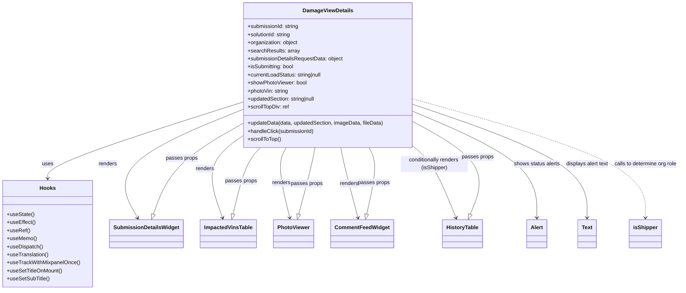
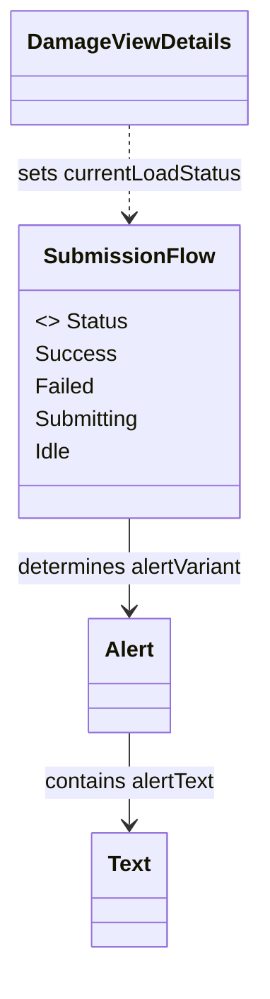

# Diagram: web/portal/src/pages/damageview/details/DamageView.Details.page.js

> Auto-generated by Obscura crawlers

## Diagram 1

### SVG

<svg id="container" width="2009.87109375" xmlns="http://www.w3.org/2000/svg" class="classDiagram" height="864" viewBox="0 0 2009.87109375 864" role="graphics-document document" aria-roledescription="class"><g><defs><marker id="container_class-aggregationStart" class="marker aggregation class" refX="18" refY="7" markerWidth="190" markerHeight="240" orient="auto"><path d="M 18,7 L9,13 L1,7 L9,1 Z"></path></marker></defs><defs><marker id="container_class-aggregationEnd" class="marker aggregation class" refX="1" refY="7" markerWidth="20" markerHeight="28" orient="auto"><path d="M 18,7 L9,13 L1,7 L9,1 Z"></path></marker></defs><defs><marker id="container_class-extensionStart" class="marker extension class" refX="18" refY="7" markerWidth="190" markerHeight="240" orient="auto"><path d="M 1,7 L18,13 V 1 Z"></path></marker></defs><defs><marker id="container_class-extensionEnd" class="marker extension class" refX="1" refY="7" markerWidth="20" markerHeight="28" orient="auto"><path d="M 1,1 V 13 L18,7 Z"></path></marker></defs><defs><marker id="container_class-compositionStart" class="marker composition class" refX="18" refY="7" markerWidth="190" markerHeight="240" orient="auto"><path d="M 18,7 L9,13 L1,7 L9,1 Z"></path></marker></defs><defs><marker id="container_class-compositionEnd" class="marker composition class" refX="1" refY="7" markerWidth="20" markerHeight="28" orient="auto"><path d="M 18,7 L9,13 L1,7 L9,1 Z"></path></marker></defs><defs><marker id="container_class-dependencyStart" class="marker dependency class" refX="6" refY="7" markerWidth="190" markerHeight="240" orient="auto"><path d="M 5,7 L9,13 L1,7 L9,1 Z"></path></marker></defs><defs><marker id="container_class-dependencyEnd" class="marker dependency class" refX="13" refY="7" markerWidth="20" markerHeight="28" orient="auto"><path d="M 18,7 L9,13 L14,7 L9,1 Z"></path></marker></defs><defs><marker id="container_class-lollipopStart" class="marker lollipop class" refX="13" refY="7" markerWidth="190" markerHeight="240" orient="auto"><circle stroke="black" fill="transparent" cx="7" cy="7" r="6"></circle></marker></defs><defs><marker id="container_class-lollipopEnd" class="marker lollipop class" refX="1" refY="7" markerWidth="190" markerHeight="240" orient="auto"><circle stroke="black" fill="transparent" cx="7" cy="7" r="6"></circle></marker></defs><g class="root"><g class="clusters"></g><g class="edgePaths"><path d="M700.895,306.052L607.384,336.543C513.874,367.035,326.853,428.017,233.342,465.675C139.832,503.333,139.832,517.667,139.832,524.833L139.832,532" id="id_DamageViewDetails_Hooks_1" class="edge-thickness-normal edge-pattern-solid relation" style=";;;" data-edge="true" data-et="edge" data-id="id_DamageViewDetails_Hooks_1" data-points="W3sieCI6NzAwLjg5NDUzMTI1LCJ5IjozMDYuMDUyMTY1MDk0MTM1Nn0seyJ4IjoxMzkuODMyMDMxMjUsInkiOjQ4OX0seyJ4IjoxMzkuODMyMDMxMjUsInkiOjUzOH1d" marker-end="url(#container_class-dependencyEnd)"></path><path d="M700.895,328.676L636.659,355.397C572.424,382.117,443.953,435.559,394.064,489.064C344.176,542.57,372.869,596.141,387.215,622.926L401.562,649.711" id="id_DamageViewDetails_SubmissionDetailsWidget_2" class="edge-thickness-normal edge-pattern-solid relation" style=";;;" data-edge="true" data-et="edge" data-id="id_DamageViewDetails_SubmissionDetailsWidget_2" data-points="W3sieCI6NzAwLjg5NDUzMTI1LCJ5IjozMjguNjc2MDExNTE1NTAyN30seyJ4IjozMTUuNDgyNDIxODc1LCJ5Ijo0ODl9LHsieCI6NDA0LjM5NDczNzgzMDUyODg3LCJ5Ijo2NTV9XQ==" marker-end="url(#container_class-dependencyEnd)"></path><path d="M700.895,409.313L682.86,422.594C664.826,435.875,628.757,462.438,619.809,502.439C610.861,542.44,629.034,595.88,638.121,622.6L647.207,649.319" id="id_DamageViewDetails_ImpactedVinsTable_3" class="edge-thickness-normal edge-pattern-solid relation" style=";;;" data-edge="true" data-et="edge" data-id="id_DamageViewDetails_ImpactedVinsTable_3" data-points="W3sieCI6NzAwLjg5NDUzMTI1LCJ5Ijo0MDkuMzEzMDE1NjMxNzg0NjV9LHsieCI6NTkyLjY4NzUsInkiOjQ4OX0seyJ4Ijo2NDkuMTM4OTcyMzU1NzY5MywieSI6NjU1fV0=" marker-end="url(#container_class-dependencyEnd)"></path><path d="M833.107,440L828.592,448.167C824.077,456.333,815.046,472.667,816.63,507.525C818.215,542.384,830.414,595.767,836.513,622.459L842.613,649.151" id="id_DamageViewDetails_PhotoViewer_4" class="edge-thickness-normal edge-pattern-solid relation" style=";;;" data-edge="true" data-et="edge" data-id="id_DamageViewDetails_PhotoViewer_4" data-points="W3sieCI6ODMzLjEwNzE5MzM5NjIyNjQsInkiOjQ0MH0seyJ4Ijo4MDYuMDE1NjI1LCJ5Ijo0ODl9LHsieCI6ODQzLjk0OTIxODc1LCJ5Ijo2NTV9XQ==" marker-end="url(#container_class-dependencyEnd)"></path><path d="M991.274,440L992.739,448.167C994.203,456.333,997.133,472.667,1005.201,507.529C1013.27,542.392,1026.478,595.784,1033.081,622.48L1039.685,649.176" id="id_DamageViewDetails_CommentFeedWidget_5" class="edge-thickness-normal edge-pattern-solid relation" style=";;;" data-edge="true" data-et="edge" data-id="id_DamageViewDetails_CommentFeedWidget_5" data-points="W3sieCI6OTkxLjI3MzcwMjgzMDE4ODcsInkiOjQ0MH0seyJ4IjoxMDAwLjA2MjUsInkiOjQ4OX0seyJ4IjoxMDQxLjEyNjA1MTY4MjY5MjQsInkiOjY1NX1d" marker-end="url(#container_class-dependencyEnd)"></path><path d="M1204.168,436.485L1214.533,445.237C1224.898,453.99,1245.629,471.495,1266.748,506.986C1287.868,542.478,1309.376,595.956,1320.13,622.694L1330.885,649.433" id="id_DamageViewDetails_HistoryTable_6" class="edge-thickness-normal edge-pattern-solid relation" style=";;;" data-edge="true" data-et="edge" data-id="id_DamageViewDetails_HistoryTable_6" data-points="W3sieCI6MTIwNC4xNjc5Njg3NSwieSI6NDM2LjQ4NDg3Njc3MzcxMTczfSx7IngiOjEyNjYuMzU5Mzc1LCJ5Ijo0ODl9LHsieCI6MTMzMy4xMjM0OTc1OTYxNTM4LCJ5Ijo2NTV9XQ==" marker-end="url(#container_class-dependencyEnd)"></path><path d="M1204.168,331.791L1265.335,357.993C1326.501,384.194,1448.835,436.597,1510.001,489.465C1571.168,542.333,1571.168,595.667,1571.168,622.333L1571.168,649" id="id_DamageViewDetails_Alert_7" class="edge-thickness-normal edge-pattern-solid relation" style=";;;" data-edge="true" data-et="edge" data-id="id_DamageViewDetails_Alert_7" data-points="W3sieCI6MTIwNC4xNjc5Njg3NSwieSI6MzMxLjc5MTQyMDE0NjM2NTE3fSx7IngiOjE1NzEuMTY3OTY4NzUsInkiOjQ4OX0seyJ4IjoxNTcxLjE2Nzk2ODc1LCJ5Ijo2NTV9XQ==" marker-end="url(#container_class-dependencyEnd)"></path><path d="M1204.168,310.272L1291.053,340.06C1377.939,369.848,1551.71,429.424,1638.595,485.879C1725.48,542.333,1725.48,595.667,1725.48,622.333L1725.48,649" id="id_DamageViewDetails_Text_8" class="edge-thickness-normal edge-pattern-solid relation" style=";;;" data-edge="true" data-et="edge" data-id="id_DamageViewDetails_Text_8" data-points="W3sieCI6MTIwNC4xNjc5Njg3NSwieSI6MzEwLjI3MTgxMzAxMzI2NTk2fSx7IngiOjE3MjUuNDgwNDY4NzUsInkiOjQ4OX0seyJ4IjoxNzI1LjQ4MDQ2ODc1LCJ5Ijo2NTV9XQ==" marker-end="url(#container_class-dependencyEnd)"></path><path d="M1204.168,293.938L1321.141,326.448C1438.113,358.958,1672.059,423.979,1789.031,483.156C1906.004,542.333,1906.004,595.667,1906.004,622.333L1906.004,649" id="id_DamageViewDetails_isShipper_9" class="edge-thickness-normal edge-pattern-dashed relation" style=";;;" data-edge="true" data-et="edge" data-id="id_DamageViewDetails_isShipper_9" data-points="W3sieCI6MTIwNC4xNjc5Njg3NSwieSI6MjkzLjkzNzc0ODExNjQ2NTc0fSx7IngiOjE5MDYuMDAzOTA2MjUsInkiOjQ4OX0seyJ4IjoxOTA2LjAwMzkwNjI1LCJ5Ijo2NTV9XQ==" marker-end="url(#container_class-dependencyEnd)"></path><path d="M446.727,638.669L455.21,613.724C463.693,588.779,480.659,538.89,523.02,494.209C565.382,449.529,633.138,410.059,667.016,390.323L700.895,370.588" id="id_SubmissionDetailsWidget_DamageViewDetails_10" class="edge-thickness-normal edge-pattern-solid relation" style=";;;" data-edge="true" data-et="edge" data-id="id_SubmissionDetailsWidget_DamageViewDetails_10" data-points="W3sieCI6NDQxLjE3MzUyNzY0NDIzMDgsInkiOjY1NX0seyJ4Ijo0OTcuNjI1LCJ5Ijo0ODl9LHsieCI6NzAwLjg5NDUzMTI1LCJ5IjozNzAuNTg3ODUyOTIyOTkyNH1d" marker-start="url(#container_class-extensionStart)"></path><path d="M676.862,638.183L682.544,613.32C688.226,588.456,699.59,538.728,712.716,505.697C725.843,472.667,740.733,456.333,748.177,448.167L755.622,440" id="id_ImpactedVinsTable_DamageViewDetails_11" class="edge-thickness-normal edge-pattern-solid relation" style=";;;" data-edge="true" data-et="edge" data-id="id_ImpactedVinsTable_DamageViewDetails_11" data-points="W3sieCI6NjczLjAxOTUzMTI1LCJ5Ijo2NTV9LHsieCI6NzEwLjk1MzEyNSwieSI6NDg5fSx7IngiOjc1NS42MjIyODc3MzU4NDkxLCJ5Ijo0NDB9XQ==" marker-start="url(#container_class-extensionStart)"></path><path d="M868.079,638.255L874.232,613.379C880.386,588.503,892.693,538.752,900.311,505.709C907.93,472.667,910.859,456.333,912.324,448.167L913.789,440" id="id_PhotoViewer_DamageViewDetails_12" class="edge-thickness-normal edge-pattern-solid relation" style=";;;" data-edge="true" data-et="edge" data-id="id_PhotoViewer_DamageViewDetails_12" data-points="W3sieCI6ODYzLjkzNjQ0ODMxNzMwNzcsInkiOjY1NX0seyJ4Ijo5MDUsInkiOjQ4OX0seyJ4Ijo5MTMuNzg4Nzk3MTY5ODExMywieSI6NDQwfV0=" marker-start="url(#container_class-extensionStart)"></path><path d="M1064.956,638.183L1070.638,613.32C1076.32,588.456,1087.683,538.728,1088.85,505.697C1090.016,472.667,1080.986,456.333,1076.471,448.167L1071.955,440" id="id_CommentFeedWidget_DamageViewDetails_13" class="edge-thickness-normal edge-pattern-solid relation" style=";;;" data-edge="true" data-et="edge" data-id="id_CommentFeedWidget_DamageViewDetails_13" data-points="W3sieCI6MTA2MS4xMTMyODEyNSwieSI6NjU1fSx7IngiOjEwOTkuMDQ2ODc1LCJ5Ijo0ODl9LHsieCI6MTA3MS45NTUzMDY2MDM3NzM2LCJ5Ijo0NDB9XQ==" marker-start="url(#container_class-extensionStart)"></path><path d="M1373.344,638.996L1383.399,613.997C1393.454,588.997,1413.563,538.999,1385.367,492.932C1357.171,446.865,1280.669,404.73,1242.419,383.663L1204.168,362.595" id="id_HistoryTable_DamageViewDetails_14" class="edge-thickness-normal edge-pattern-solid relation" style=";;;" data-edge="true" data-et="edge" data-id="id_HistoryTable_DamageViewDetails_14" data-points="W3sieCI6MTM2Ni45MDc3NTI0MDM4NDYyLCJ5Ijo2NTV9LHsieCI6MTQzMy42NzE4NzUsInkiOjQ4OX0seyJ4IjoxMjA0LjE2Nzk2ODc1LCJ5IjozNjIuNTk1MDk0NjY0MzcxOH1d" marker-start="url(#container_class-extensionStart)"></path></g><g class="edgeLabels"><g class="edgeLabel" transform="translate(139.83203125, 489)"><g class="label" data-id="id_DamageViewDetails_Hooks_1" transform="translate(-16.4921875, -12)"><foreignObject width="32.984375" height="24">

uses

</foreignObject></g></g><g class="edgeLabel" transform="translate(315.482421875, 489)"><g class="label" data-id="id_DamageViewDetails_SubmissionDetailsWidget_2" transform="translate(-27.75, -12)"><foreignObject width="55.5" height="24">

renders

</foreignObject></g></g><g class="edgeLabel" transform="translate(599.28018, 508.38628)"><g class="label" data-id="id_DamageViewDetails_ImpactedVinsTable_3" transform="translate(-27.75, -12)"><foreignObject width="55.5" height="24">

renders

</foreignObject></g></g><g class="edgeLabel" transform="translate(818.74582, 544.70819)"><g class="label" data-id="id_DamageViewDetails_PhotoViewer_4" transform="translate(-27.75, -12)"><foreignObject width="55.5" height="24">

renders

</foreignObject></g></g><g class="edgeLabel" transform="translate(1014.61714, 547.83733)"><g class="label" data-id="id_DamageViewDetails_CommentFeedWidget_5" transform="translate(-27.75, -12)"><foreignObject width="55.5" height="24">

renders

</foreignObject></g></g><g class="edgeLabel" transform="translate(1284.55486, 534.24063)"><g class="label" data-id="id_DamageViewDetails_HistoryTable_6" transform="translate(-100, -24)"><foreignObject width="200" height="48">

conditionally renders (isShipper)

</foreignObject></g></g><g class="edgeLabel" transform="translate(1571.16796875, 489)"><g class="label" data-id="id_DamageViewDetails_Alert_7" transform="translate(-69.65625, -12)"><foreignObject width="139.3125" height="24">

shows status alerts

</foreignObject></g></g><g class="edgeLabel" transform="translate(1725.48046875, 489)"><g class="label" data-id="id_DamageViewDetails_Text_8" transform="translate(-64.65625, -12)"><foreignObject width="129.3125" height="24">

displays alert text

</foreignObject></g></g><g class="edgeLabel" transform="translate(1906.00390625, 489)"><g class="label" data-id="id_DamageViewDetails_isShipper_9" transform="translate(-95.8671875, -12)"><foreignObject width="191.734375" height="24">

calls to determine org role

</foreignObject></g></g><g class="edgeLabel" transform="translate(523.50771, 473.92235)"><g class="label" data-id="id_SubmissionDetailsWidget_DamageViewDetails_10" transform="translate(-47.3125, -12)"><foreignObject width="94.625" height="24">

passes props

</foreignObject></g></g><g class="edgeLabel" transform="translate(699.3718, 539.68068)"><g class="label" data-id="id_ImpactedVinsTable_DamageViewDetails_11" transform="translate(-47.3125, -12)"><foreignObject width="94.625" height="24">

passes props

</foreignObject></g></g><g class="edgeLabel" transform="translate(890.44536, 547.83733)"><g class="label" data-id="id_PhotoViewer_DamageViewDetails_12" transform="translate(-47.3125, -12)"><foreignObject width="94.625" height="24">

passes props

</foreignObject></g></g><g class="edgeLabel" transform="translate(1086.31668, 544.70819)"><g class="label" data-id="id_CommentFeedWidget_DamageViewDetails_13" transform="translate(-47.3125, -12)"><foreignObject width="94.625" height="24">

passes props

</foreignObject></g></g><g class="edgeLabel" transform="translate(1397.28188, 468.95732)"><g class="label" data-id="id_HistoryTable_DamageViewDetails_14" transform="translate(-47.3125, -12)"><foreignObject width="94.625" height="24">

passes props

</foreignObject></g></g></g><g class="nodes"><g class="node default" id="classId-DamageViewDetails-0" transform="translate(952.53125, 224)"><g class="basic label-container"><path d="M-251.63671875 -216 L251.63671875 -216 L251.63671875 216 L-251.63671875 216" stroke="none" stroke-width="0" fill="#ECECFF" style=""></path><path d="M-251.63671875 -216 C-64.13656245511106 -216, 123.36359383977788 -216, 251.63671875 -216 M-251.63671875 -216 C-86.43831956514921 -216, 78.76007961970157 -216, 251.63671875 -216 M251.63671875 -216 C251.63671875 -126.6219628641386, 251.63671875 -37.24392572827719, 251.63671875 216 M251.63671875 -216 C251.63671875 -71.76705689639107, 251.63671875 72.46588620721786, 251.63671875 216 M251.63671875 216 C94.8111598984442 216, -62.014398953111595 216, -251.63671875 216 M251.63671875 216 C118.07623039272542 216, -15.484257964549158 216, -251.63671875 216 M-251.63671875 216 C-251.63671875 79.56509091745656, -251.63671875 -56.86981816508688, -251.63671875 -216 M-251.63671875 216 C-251.63671875 62.767424899567686, -251.63671875 -90.46515020086463, -251.63671875 -216" stroke="#9370DB" stroke-width="1.3" fill="none" stroke-dasharray="0 0" style=""></path></g><g class="annotation-group text" transform="translate(0, -192)"></g><g class="label-group text" transform="translate(-71.9453125, -192)"><g class="label" style="font-weight: bolder" transform="translate(0,-12)"><foreignObject width="143.890625" height="24">

DamageViewDetails

</foreignObject></g></g><g class="members-group text" transform="translate(-239.63671875, -144)"><g class="label" style="" transform="translate(0,-12)"><foreignObject width="154.515625" height="24">

+submissionId: string

</foreignObject></g><g class="label" style="" transform="translate(0,12)"><foreignObject width="131.8125" height="24">

+solutionId: string

</foreignObject></g><g class="label" style="" transform="translate(0,36)"><foreignObject width="151.890625" height="24">

+organization: object

</foreignObject></g><g class="label" style="" transform="translate(0,60)"><foreignObject width="153.234375" height="24">

+searchResults: array

</foreignObject></g><g class="label" style="" transform="translate(0,84)"><foreignObject width="286.359375" height="24">

+submissionDetailsRequestData: object

</foreignObject></g><g class="label" style="" transform="translate(0,108)"><foreignObject width="140.453125" height="24">

+isSubmitting: bool

</foreignObject></g><g class="label" style="" transform="translate(0,132)"><foreignObject width="225.4375" height="24">

+currentLoadStatus: string|null

</foreignObject></g><g class="label" style="" transform="translate(0,156)"><foreignObject width="177.84375" height="24">

+showPhotoViewer: bool

</foreignObject></g><g class="label" style="" transform="translate(0,180)"><foreignObject width="123.59375" height="24">

+photoVin: string

</foreignObject></g><g class="label" style="" transform="translate(0,204)"><foreignObject width="207.21875" height="24">

+updatedSection: string|null

</foreignObject></g><g class="label" style="" transform="translate(0,228)"><foreignObject width="124.375" height="24">

+scrollTopDiv: ref

</foreignObject></g></g><g class="methods-group text" transform="translate(-239.63671875, 144)"><g class="label" style="" transform="translate(0,-12)"><foreignObject width="407.328125" height="24">

+updateData(data, updatedSection, imageData, fileData)

</foreignObject></g><g class="label" style="" transform="translate(0,12)"><foreignObject width="199.375" height="24">

+handleClick(submissionId)

</foreignObject></g><g class="label" style="" transform="translate(0,36)"><foreignObject width="100.875" height="24">

+scrollToTop()

</foreignObject></g></g><g class="divider" style=""><path d="M-251.63671875 -168 C-55.03520275763597 -168, 141.56631323472806 -168, 251.63671875 -168 M-251.63671875 -168 C-55.39884534428117 -168, 140.83902806143766 -168, 251.63671875 -168" stroke="#9370DB" stroke-width="1.3" fill="none" stroke-dasharray="0 0" style=""></path></g><g class="divider" style=""><path d="M-251.63671875 120 C-108.8733403781385 120, 33.89003799372301 120, 251.63671875 120 M-251.63671875 120 C-70.55364274561174 120, 110.52943325877652 120, 251.63671875 120" stroke="#9370DB" stroke-width="1.3" fill="none" stroke-dasharray="0 0" style=""></path></g></g><g class="node default" id="classId-Hooks-1" transform="translate(139.83203125, 697)"><g class="basic label-container"><path d="M-131.83203125 -159 L131.83203125 -159 L131.83203125 159 L-131.83203125 159" stroke="none" stroke-width="0" fill="#ECECFF" style=""></path><path d="M-131.83203125 -159 C-35.00445100997338 -159, 61.82312923005324 -159, 131.83203125 -159 M-131.83203125 -159 C-28.483566514397438 -159, 74.86489822120512 -159, 131.83203125 -159 M131.83203125 -159 C131.83203125 -53.649933133387265, 131.83203125 51.70013373322547, 131.83203125 159 M131.83203125 -159 C131.83203125 -88.02444161913597, 131.83203125 -17.04888323827194, 131.83203125 159 M131.83203125 159 C70.73871667994243 159, 9.645402109884856 159, -131.83203125 159 M131.83203125 159 C32.252561657041525 159, -67.32690793591695 159, -131.83203125 159 M-131.83203125 159 C-131.83203125 46.551686361948484, -131.83203125 -65.89662727610303, -131.83203125 -159 M-131.83203125 159 C-131.83203125 71.73759939203808, -131.83203125 -15.524801215923844, -131.83203125 -159" stroke="#9370DB" stroke-width="1.3" fill="none" stroke-dasharray="0 0" style=""></path></g><g class="annotation-group text" transform="translate(0, -135)"></g><g class="label-group text" transform="translate(-22.9140625, -135)"><g class="label" style="font-weight: bolder" transform="translate(0,-12)"><foreignObject width="45.828125" height="24">

Hooks

</foreignObject></g></g><g class="members-group text" transform="translate(-119.83203125, -87)"></g><g class="methods-group text" transform="translate(-119.83203125, -57)"><g class="label" style="" transform="translate(0,-12)"><foreignObject width="81.203125" height="24">

+useState()

</foreignObject></g><g class="label" style="" transform="translate(0,12)"><foreignObject width="84.8125" height="24">

+useEffect()

</foreignObject></g><g class="label" style="" transform="translate(0,36)"><foreignObject width="67.390625" height="24">

+useRef()

</foreignObject></g><g class="label" style="" transform="translate(0,60)"><foreignObject width="88.09375" height="24">

+useMemo()

</foreignObject></g><g class="label" style="" transform="translate(0,84)"><foreignObject width="106.765625" height="24">

+useDispatch()

</foreignObject></g><g class="label" style="" transform="translate(0,108)"><foreignObject width="125.140625" height="24">

+useTranslation()

</foreignObject></g><g class="label" style="" transform="translate(0,132)"><foreignObject width="216.75" height="24">

+useTrackWithMixpanelOnce()

</foreignObject></g><g class="label" style="" transform="translate(0,156)"><foreignObject width="165.515625" height="24">

+useSetTitleOnMount()

</foreignObject></g><g class="label" style="" transform="translate(0,180)"><foreignObject width="126.34375" height="24">

+useSetSubTitle()

</foreignObject></g></g><g class="divider" style=""><path d="M-131.83203125 -111 C-63.44244883917693 -111, 4.947133571646134 -111, 131.83203125 -111 M-131.83203125 -111 C-32.16359055465726 -111, 67.50485014068548 -111, 131.83203125 -111" stroke="#9370DB" stroke-width="1.3" fill="none" stroke-dasharray="0 0" style=""></path></g><g class="divider" style=""><path d="M-131.83203125 -87 C-45.146950947116096 -87, 41.53812935576781 -87, 131.83203125 -87 M-131.83203125 -87 C-49.82101240049053 -87, 32.19000644901894 -87, 131.83203125 -87" stroke="#9370DB" stroke-width="1.3" fill="none" stroke-dasharray="0 0" style=""></path></g></g><g class="node default" id="classId-SubmissionDetailsWidget-2" transform="translate(426.890625, 697)"><g class="basic label-container"><path d="M-105.2265625 -42 L105.2265625 -42 L105.2265625 42 L-105.2265625 42" stroke="none" stroke-width="0" fill="#ECECFF" style=""></path><path d="M-105.2265625 -42 C-57.69387839029689 -42, -10.161194280593776 -42, 105.2265625 -42 M-105.2265625 -42 C-61.10568388704444 -42, -16.984805274088885 -42, 105.2265625 -42 M105.2265625 -42 C105.2265625 -16.466574309962365, 105.2265625 9.06685138007527, 105.2265625 42 M105.2265625 -42 C105.2265625 -13.985193761292788, 105.2265625 14.029612477414425, 105.2265625 42 M105.2265625 42 C28.97866718352313 42, -47.26922813295374 42, -105.2265625 42 M105.2265625 42 C42.02042228267477 42, -21.185717934650455 42, -105.2265625 42 M-105.2265625 42 C-105.2265625 22.365193092734884, -105.2265625 2.7303861854697686, -105.2265625 -42 M-105.2265625 42 C-105.2265625 24.95436254613204, -105.2265625 7.908725092264078, -105.2265625 -42" stroke="#9370DB" stroke-width="1.3" fill="none" stroke-dasharray="0 0" style=""></path></g><g class="annotation-group text" transform="translate(0, -18)"></g><g class="label-group text" transform="translate(-93.2265625, -18)"><g class="label" style="font-weight: bolder" transform="translate(0,-12)"><foreignObject width="186.453125" height="24">

SubmissionDetailsWidget

</foreignObject></g></g><g class="members-group text" transform="translate(-93.2265625, 30)"></g><g class="methods-group text" transform="translate(-93.2265625, 60)"></g><g class="divider" style=""><path d="M-105.2265625 6 C-31.04509631337784 6, 43.13636987324432 6, 105.2265625 6 M-105.2265625 6 C-54.981287512974866 6, -4.736012525949732 6, 105.2265625 6" stroke="#9370DB" stroke-width="1.3" fill="none" stroke-dasharray="0 0" style=""></path></g><g class="divider" style=""><path d="M-105.2265625 24 C-25.59214028816723 24, 54.04228192366554 24, 105.2265625 24 M-105.2265625 24 C-27.545745428351438 24, 50.135071643297124 24, 105.2265625 24" stroke="#9370DB" stroke-width="1.3" fill="none" stroke-dasharray="0 0" style=""></path></g></g><g class="node default" id="classId-ImpactedVinsTable-3" transform="translate(663.421875, 697)"><g class="basic label-container"><path d="M-81.3046875 -42 L81.3046875 -42 L81.3046875 42 L-81.3046875 42" stroke="none" stroke-width="0" fill="#ECECFF" style=""></path><path d="M-81.3046875 -42 C-44.22537030204159 -42, -7.14605310408318 -42, 81.3046875 -42 M-81.3046875 -42 C-48.25204532547039 -42, -15.199403150940782 -42, 81.3046875 -42 M81.3046875 -42 C81.3046875 -15.59894624173246, 81.3046875 10.80210751653508, 81.3046875 42 M81.3046875 -42 C81.3046875 -9.357068460809685, 81.3046875 23.28586307838063, 81.3046875 42 M81.3046875 42 C39.593643329288035 42, -2.1174008414239296 42, -81.3046875 42 M81.3046875 42 C43.85494383439747 42, 6.405200168794934 42, -81.3046875 42 M-81.3046875 42 C-81.3046875 10.661624625349098, -81.3046875 -20.676750749301803, -81.3046875 -42 M-81.3046875 42 C-81.3046875 13.289994631732348, -81.3046875 -15.420010736535303, -81.3046875 -42" stroke="#9370DB" stroke-width="1.3" fill="none" stroke-dasharray="0 0" style=""></path></g><g class="annotation-group text" transform="translate(0, -18)"></g><g class="label-group text" transform="translate(-69.3046875, -18)"><g class="label" style="font-weight: bolder" transform="translate(0,-12)"><foreignObject width="138.609375" height="24">

ImpactedVinsTable

</foreignObject></g></g><g class="members-group text" transform="translate(-69.3046875, 30)"></g><g class="methods-group text" transform="translate(-69.3046875, 60)"></g><g class="divider" style=""><path d="M-81.3046875 6 C-28.891939107402642 6, 23.520809285194716 6, 81.3046875 6 M-81.3046875 6 C-23.584040798804978 6, 34.136605902390045 6, 81.3046875 6" stroke="#9370DB" stroke-width="1.3" fill="none" stroke-dasharray="0 0" style=""></path></g><g class="divider" style=""><path d="M-81.3046875 24 C-32.92887784586825 24, 15.4469318082635 24, 81.3046875 24 M-81.3046875 24 C-47.12896773301956 24, -12.953247966039115 24, 81.3046875 24" stroke="#9370DB" stroke-width="1.3" fill="none" stroke-dasharray="0 0" style=""></path></g></g><g class="node default" id="classId-PhotoViewer-4" transform="translate(853.546875, 697)"><g class="basic label-container"><path d="M-58.3984375 -42 L58.3984375 -42 L58.3984375 42 L-58.3984375 42" stroke="none" stroke-width="0" fill="#ECECFF" style=""></path><path d="M-58.3984375 -42 C-22.410585705020814 -42, 13.577266089958371 -42, 58.3984375 -42 M-58.3984375 -42 C-16.247862543134353 -42, 25.902712413731294 -42, 58.3984375 -42 M58.3984375 -42 C58.3984375 -14.761429438062017, 58.3984375 12.477141123875967, 58.3984375 42 M58.3984375 -42 C58.3984375 -17.11312265311245, 58.3984375 7.773754693775103, 58.3984375 42 M58.3984375 42 C29.086397590238562 42, -0.22564231952287628 42, -58.3984375 42 M58.3984375 42 C17.185885860989444 42, -24.026665778021112 42, -58.3984375 42 M-58.3984375 42 C-58.3984375 24.481563346560364, -58.3984375 6.963126693120728, -58.3984375 -42 M-58.3984375 42 C-58.3984375 20.593062840314694, -58.3984375 -0.8138743193706119, -58.3984375 -42" stroke="#9370DB" stroke-width="1.3" fill="none" stroke-dasharray="0 0" style=""></path></g><g class="annotation-group text" transform="translate(0, -18)"></g><g class="label-group text" transform="translate(-46.3984375, -18)"><g class="label" style="font-weight: bolder" transform="translate(0,-12)"><foreignObject width="92.796875" height="24">

PhotoViewer

</foreignObject></g></g><g class="members-group text" transform="translate(-46.3984375, 30)"></g><g class="methods-group text" transform="translate(-46.3984375, 60)"></g><g class="divider" style=""><path d="M-58.3984375 6 C-12.789801653581321 6, 32.81883419283736 6, 58.3984375 6 M-58.3984375 6 C-25.121556867840937 6, 8.155323764318126 6, 58.3984375 6" stroke="#9370DB" stroke-width="1.3" fill="none" stroke-dasharray="0 0" style=""></path></g><g class="divider" style=""><path d="M-58.3984375 24 C-12.73767264609505 24, 32.9230922078099 24, 58.3984375 24 M-58.3984375 24 C-23.84779097187827 24, 10.702855556243463 24, 58.3984375 24" stroke="#9370DB" stroke-width="1.3" fill="none" stroke-dasharray="0 0" style=""></path></g></g><g class="node default" id="classId-CommentFeedWidget-5" transform="translate(1051.515625, 697)"><g class="basic label-container"><path d="M-89.5703125 -42 L89.5703125 -42 L89.5703125 42 L-89.5703125 42" stroke="none" stroke-width="0" fill="#ECECFF" style=""></path><path d="M-89.5703125 -42 C-47.13868792125028 -42, -4.707063342500561 -42, 89.5703125 -42 M-89.5703125 -42 C-38.823241370958 -42, 11.923829758083997 -42, 89.5703125 -42 M89.5703125 -42 C89.5703125 -19.23993798781018, 89.5703125 3.5201240243796406, 89.5703125 42 M89.5703125 -42 C89.5703125 -14.270441278830834, 89.5703125 13.459117442338332, 89.5703125 42 M89.5703125 42 C23.218233970931152 42, -43.133844558137696 42, -89.5703125 42 M89.5703125 42 C30.89316362448824 42, -27.783985251023523 42, -89.5703125 42 M-89.5703125 42 C-89.5703125 10.144176343780444, -89.5703125 -21.711647312439112, -89.5703125 -42 M-89.5703125 42 C-89.5703125 16.60006077283095, -89.5703125 -8.7998784543381, -89.5703125 -42" stroke="#9370DB" stroke-width="1.3" fill="none" stroke-dasharray="0 0" style=""></path></g><g class="annotation-group text" transform="translate(0, -18)"></g><g class="label-group text" transform="translate(-77.5703125, -18)"><g class="label" style="font-weight: bolder" transform="translate(0,-12)"><foreignObject width="155.140625" height="24">

CommentFeedWidget

</foreignObject></g></g><g class="members-group text" transform="translate(-77.5703125, 30)"></g><g class="methods-group text" transform="translate(-77.5703125, 60)"></g><g class="divider" style=""><path d="M-89.5703125 6 C-40.960036631439294 6, 7.650239237121411 6, 89.5703125 6 M-89.5703125 6 C-25.361181116013682 6, 38.847950267972635 6, 89.5703125 6" stroke="#9370DB" stroke-width="1.3" fill="none" stroke-dasharray="0 0" style=""></path></g><g class="divider" style=""><path d="M-89.5703125 24 C-26.312014447036425 24, 36.94628360592715 24, 89.5703125 24 M-89.5703125 24 C-30.97397620272634 24, 27.622360094547318 24, 89.5703125 24" stroke="#9370DB" stroke-width="1.3" fill="none" stroke-dasharray="0 0" style=""></path></g></g><g class="node default" id="classId-HistoryTable-6" transform="translate(1350.015625, 697)"><g class="basic label-container"><path d="M-58.25 -42 L58.25 -42 L58.25 42 L-58.25 42" stroke="none" stroke-width="0" fill="#ECECFF" style=""></path><path d="M-58.25 -42 C-26.778261501794635 -42, 4.69347699641073 -42, 58.25 -42 M-58.25 -42 C-31.812924895604162 -42, -5.375849791208324 -42, 58.25 -42 M58.25 -42 C58.25 -20.63292636731038, 58.25 0.7341472653792422, 58.25 42 M58.25 -42 C58.25 -8.591274517224768, 58.25 24.817450965550464, 58.25 42 M58.25 42 C26.8611106432251 42, -4.5277787135498 42, -58.25 42 M58.25 42 C26.186229120849276 42, -5.877541758301447 42, -58.25 42 M-58.25 42 C-58.25 23.0894405182036, -58.25 4.178881036407198, -58.25 -42 M-58.25 42 C-58.25 9.726460058022411, -58.25 -22.547079883955178, -58.25 -42" stroke="#9370DB" stroke-width="1.3" fill="none" stroke-dasharray="0 0" style=""></path></g><g class="annotation-group text" transform="translate(0, -18)"></g><g class="label-group text" transform="translate(-46.25, -18)"><g class="label" style="font-weight: bolder" transform="translate(0,-12)"><foreignObject width="92.5" height="24">

HistoryTable

</foreignObject></g></g><g class="members-group text" transform="translate(-46.25, 30)"></g><g class="methods-group text" transform="translate(-46.25, 60)"></g><g class="divider" style=""><path d="M-58.25 6 C-18.837778487276807 6, 20.574443025446385 6, 58.25 6 M-58.25 6 C-21.633990688121507 6, 14.982018623756986 6, 58.25 6" stroke="#9370DB" stroke-width="1.3" fill="none" stroke-dasharray="0 0" style=""></path></g><g class="divider" style=""><path d="M-58.25 24 C-32.65676703826574 24, -7.063534076531475 24, 58.25 24 M-58.25 24 C-23.05499042935967 24, 12.14001914128066 24, 58.25 24" stroke="#9370DB" stroke-width="1.3" fill="none" stroke-dasharray="0 0" style=""></path></g></g><g class="node default" id="classId-Alert-7" transform="translate(1571.16796875, 697)"><g class="basic label-container"><path d="M-29.7734375 -42 L29.7734375 -42 L29.7734375 42 L-29.7734375 42" stroke="none" stroke-width="0" fill="#ECECFF" style=""></path><path d="M-29.7734375 -42 C-6.4588879888705115 -42, 16.855661522258977 -42, 29.7734375 -42 M-29.7734375 -42 C-8.065723830547896 -42, 13.641989838904209 -42, 29.7734375 -42 M29.7734375 -42 C29.7734375 -18.30635003735648, 29.7734375 5.387299925287039, 29.7734375 42 M29.7734375 -42 C29.7734375 -13.759937779851938, 29.7734375 14.480124440296123, 29.7734375 42 M29.7734375 42 C14.89435997863932 42, 0.015282457278640749 42, -29.7734375 42 M29.7734375 42 C10.112500204466802 42, -9.548437091066397 42, -29.7734375 42 M-29.7734375 42 C-29.7734375 12.134334034322581, -29.7734375 -17.731331931354838, -29.7734375 -42 M-29.7734375 42 C-29.7734375 24.487627537183098, -29.7734375 6.975255074366196, -29.7734375 -42" stroke="#9370DB" stroke-width="1.3" fill="none" stroke-dasharray="0 0" style=""></path></g><g class="annotation-group text" transform="translate(0, -18)"></g><g class="label-group text" transform="translate(-17.7734375, -18)"><g class="label" style="font-weight: bolder" transform="translate(0,-12)"><foreignObject width="35.546875" height="24">

Alert

</foreignObject></g></g><g class="members-group text" transform="translate(-17.7734375, 30)"></g><g class="methods-group text" transform="translate(-17.7734375, 60)"></g><g class="divider" style=""><path d="M-29.7734375 6 C-10.69052717785824 6, 8.39238314428352 6, 29.7734375 6 M-29.7734375 6 C-9.817924505905328 6, 10.137588488189344 6, 29.7734375 6" stroke="#9370DB" stroke-width="1.3" fill="none" stroke-dasharray="0 0" style=""></path></g><g class="divider" style=""><path d="M-29.7734375 24 C-15.710628187629306 24, -1.6478188752586114 24, 29.7734375 24 M-29.7734375 24 C-10.915227488040461 24, 7.942982523919078 24, 29.7734375 24" stroke="#9370DB" stroke-width="1.3" fill="none" stroke-dasharray="0 0" style=""></path></g></g><g class="node default" id="classId-Text-8" transform="translate(1725.48046875, 697)"><g class="basic label-container"><path d="M-27.3828125 -42 L27.3828125 -42 L27.3828125 42 L-27.3828125 42" stroke="none" stroke-width="0" fill="#ECECFF" style=""></path><path d="M-27.3828125 -42 C-15.74260111657778 -42, -4.102389733155562 -42, 27.3828125 -42 M-27.3828125 -42 C-12.178458585518893 -42, 3.025895328962214 -42, 27.3828125 -42 M27.3828125 -42 C27.3828125 -16.421120510370987, 27.3828125 9.157758979258027, 27.3828125 42 M27.3828125 -42 C27.3828125 -23.570648383198574, 27.3828125 -5.141296766397147, 27.3828125 42 M27.3828125 42 C9.044803494519645 42, -9.29320551096071 42, -27.3828125 42 M27.3828125 42 C15.787307089622836 42, 4.191801679245671 42, -27.3828125 42 M-27.3828125 42 C-27.3828125 13.387487225735374, -27.3828125 -15.225025548529253, -27.3828125 -42 M-27.3828125 42 C-27.3828125 20.855927007840375, -27.3828125 -0.2881459843192502, -27.3828125 -42" stroke="#9370DB" stroke-width="1.3" fill="none" stroke-dasharray="0 0" style=""></path></g><g class="annotation-group text" transform="translate(0, -18)"></g><g class="label-group text" transform="translate(-15.3828125, -18)"><g class="label" style="font-weight: bolder" transform="translate(0,-12)"><foreignObject width="30.765625" height="24">

Text

</foreignObject></g></g><g class="members-group text" transform="translate(-15.3828125, 30)"></g><g class="methods-group text" transform="translate(-15.3828125, 60)"></g><g class="divider" style=""><path d="M-27.3828125 6 C-10.577434473252193 6, 6.227943553495614 6, 27.3828125 6 M-27.3828125 6 C-6.108331261444253 6, 15.166149977111495 6, 27.3828125 6" stroke="#9370DB" stroke-width="1.3" fill="none" stroke-dasharray="0 0" style=""></path></g><g class="divider" style=""><path d="M-27.3828125 24 C-11.432057903504331 24, 4.5186966929913375 24, 27.3828125 24 M-27.3828125 24 C-15.633994121979452 24, -3.8851757439589036 24, 27.3828125 24" stroke="#9370DB" stroke-width="1.3" fill="none" stroke-dasharray="0 0" style=""></path></g></g><g class="node default" id="classId-isShipper-9" transform="translate(1906.00390625, 697)"><g class="basic label-container"><path d="M-46.75 -42 L46.75 -42 L46.75 42 L-46.75 42" stroke="none" stroke-width="0" fill="#ECECFF" style=""></path><path d="M-46.75 -42 C-26.87013578630809 -42, -6.99027157261618 -42, 46.75 -42 M-46.75 -42 C-26.438495506874972 -42, -6.126991013749944 -42, 46.75 -42 M46.75 -42 C46.75 -13.571526905971307, 46.75 14.856946188057385, 46.75 42 M46.75 -42 C46.75 -14.426990733003038, 46.75 13.146018533993924, 46.75 42 M46.75 42 C14.290444708624797 42, -18.169110582750406 42, -46.75 42 M46.75 42 C20.547047074256195 42, -5.65590585148761 42, -46.75 42 M-46.75 42 C-46.75 20.76698476015054, -46.75 -0.4660304796989223, -46.75 -42 M-46.75 42 C-46.75 12.475521604782287, -46.75 -17.048956790435426, -46.75 -42" stroke="#9370DB" stroke-width="1.3" fill="none" stroke-dasharray="0 0" style=""></path></g><g class="annotation-group text" transform="translate(0, -18)"></g><g class="label-group text" transform="translate(-34.75, -18)"><g class="label" style="font-weight: bolder" transform="translate(0,-12)"><foreignObject width="69.5" height="24">

isShipper

</foreignObject></g></g><g class="members-group text" transform="translate(-34.75, 30)"></g><g class="methods-group text" transform="translate(-34.75, 60)"></g><g class="divider" style=""><path d="M-46.75 6 C-15.51038955919698 6, 15.72922088160604 6, 46.75 6 M-46.75 6 C-21.47598481566032 6, 3.7980303686793633 6, 46.75 6" stroke="#9370DB" stroke-width="1.3" fill="none" stroke-dasharray="0 0" style=""></path></g><g class="divider" style=""><path d="M-46.75 24 C-20.66812032772816 24, 5.413759344543678 24, 46.75 24 M-46.75 24 C-27.862631676414136 24, -8.975263352828271 24, 46.75 24" stroke="#9370DB" stroke-width="1.3" fill="none" stroke-dasharray="0 0" style=""></path></g></g></g></g></g></svg>

## Diagram 2

### SVG

<svg id="container" width="188.09375" xmlns="http://www.w3.org/2000/svg" class="classDiagram" height="706" viewBox="0 0 188.09375 706" role="graphics-document document" aria-roledescription="class"><g><defs><marker id="container_class-aggregationStart" class="marker aggregation class" refX="18" refY="7" markerWidth="190" markerHeight="240" orient="auto"><path d="M 18,7 L9,13 L1,7 L9,1 Z"></path></marker></defs><defs><marker id="container_class-aggregationEnd" class="marker aggregation class" refX="1" refY="7" markerWidth="20" markerHeight="28" orient="auto"><path d="M 18,7 L9,13 L1,7 L9,1 Z"></path></marker></defs><defs><marker id="container_class-extensionStart" class="marker extension class" refX="18" refY="7" markerWidth="190" markerHeight="240" orient="auto"><path d="M 1,7 L18,13 V 1 Z"></path></marker></defs><defs><marker id="container_class-extensionEnd" class="marker extension class" refX="1" refY="7" markerWidth="20" markerHeight="28" orient="auto"><path d="M 1,1 V 13 L18,7 Z"></path></marker></defs><defs><marker id="container_class-compositionStart" class="marker composition class" refX="18" refY="7" markerWidth="190" markerHeight="240" orient="auto"><path d="M 18,7 L9,13 L1,7 L9,1 Z"></path></marker></defs><defs><marker id="container_class-compositionEnd" class="marker composition class" refX="1" refY="7" markerWidth="20" markerHeight="28" orient="auto"><path d="M 18,7 L9,13 L1,7 L9,1 Z"></path></marker></defs><defs><marker id="container_class-dependencyStart" class="marker dependency class" refX="6" refY="7" markerWidth="190" markerHeight="240" orient="auto"><path d="M 5,7 L9,13 L1,7 L9,1 Z"></path></marker></defs><defs><marker id="container_class-dependencyEnd" class="marker dependency class" refX="13" refY="7" markerWidth="20" markerHeight="28" orient="auto"><path d="M 18,7 L9,13 L14,7 L9,1 Z"></path></marker></defs><defs><marker id="container_class-lollipopStart" class="marker lollipop class" refX="13" refY="7" markerWidth="190" markerHeight="240" orient="auto"><circle stroke="black" fill="transparent" cx="7" cy="7" r="6"></circle></marker></defs><defs><marker id="container_class-lollipopEnd" class="marker lollipop class" refX="1" refY="7" markerWidth="190" markerHeight="240" orient="auto"><circle stroke="black" fill="transparent" cx="7" cy="7" r="6"></circle></marker></defs><g class="root"><g class="clusters"></g><g class="edgePaths"><path d="M94.047,92L94.047,98.167C94.047,104.333,94.047,116.667,94.047,128C94.047,139.333,94.047,149.667,94.047,154.833L94.047,160" id="id_DamageViewDetails_SubmissionFlow_1" class="edge-thickness-normal edge-pattern-dashed relation" style=";;;" data-edge="true" data-et="edge" data-id="id_DamageViewDetails_SubmissionFlow_1" data-points="W3sieCI6OTQuMDQ2ODc1LCJ5Ijo5Mn0seyJ4Ijo5NC4wNDY4NzUsInkiOjEyOX0seyJ4Ijo5NC4wNDY4NzUsInkiOjE2Nn1d" marker-end="url(#container_class-dependencyEnd)"></path><path d="M94.047,382L94.047,388.167C94.047,394.333,94.047,406.667,94.047,418C94.047,429.333,94.047,439.667,94.047,444.833L94.047,450" id="id_SubmissionFlow_Alert_2" class="edge-thickness-normal edge-pattern-solid relation" style=";;;" data-edge="true" data-et="edge" data-id="id_SubmissionFlow_Alert_2" data-points="W3sieCI6OTQuMDQ2ODc1LCJ5IjozODJ9LHsieCI6OTQuMDQ2ODc1LCJ5Ijo0MTl9LHsieCI6OTQuMDQ2ODc1LCJ5Ijo0NTZ9XQ==" marker-end="url(#container_class-dependencyEnd)"></path><path d="M94.047,540L94.047,546.167C94.047,552.333,94.047,564.667,94.047,576C94.047,587.333,94.047,597.667,94.047,602.833L94.047,608" id="id_Alert_Text_3" class="edge-thickness-normal edge-pattern-solid relation" style=";;;" data-edge="true" data-et="edge" data-id="id_Alert_Text_3" data-points="W3sieCI6OTQuMDQ2ODc1LCJ5Ijo1NDB9LHsieCI6OTQuMDQ2ODc1LCJ5Ijo1Nzd9LHsieCI6OTQuMDQ2ODc1LCJ5Ijo2MTR9XQ==" marker-end="url(#container_class-dependencyEnd)"></path></g><g class="edgeLabels"><g class="edgeLabel" transform="translate(94.046875, 129)"><g class="label" data-id="id_DamageViewDetails_SubmissionFlow_1" transform="translate(-83.453125, -12)"><foreignObject width="166.90625" height="24">

sets currentLoadStatus

</foreignObject></g></g><g class="edgeLabel" transform="translate(94.046875, 419)"><g class="label" data-id="id_SubmissionFlow_Alert_2" transform="translate(-86.046875, -12)"><foreignObject width="172.09375" height="24">

determines alertVariant

</foreignObject></g></g><g class="edgeLabel" transform="translate(94.046875, 577)"><g class="label" data-id="id_Alert_Text_3" transform="translate(-64.6796875, -12)"><foreignObject width="129.359375" height="24">

contains alertText

</foreignObject></g></g></g><g class="nodes"><g class="node default" id="classId-SubmissionFlow-0" transform="translate(94.046875, 274)"><g class="basic label-container"><path d="M-81.25390625 -108 L81.25390625 -108 L81.25390625 108 L-81.25390625 108" stroke="none" stroke-width="0" fill="#ECECFF" style=""></path><path d="M-81.25390625 -108 C-16.775195944686814 -108, 47.70351436062637 -108, 81.25390625 -108 M-81.25390625 -108 C-30.400833807947414 -108, 20.45223863410517 -108, 81.25390625 -108 M81.25390625 -108 C81.25390625 -35.69249242077548, 81.25390625 36.61501515844904, 81.25390625 108 M81.25390625 -108 C81.25390625 -45.414566179695996, 81.25390625 17.17086764060801, 81.25390625 108 M81.25390625 108 C46.14792013785154 108, 11.041934025703085 108, -81.25390625 108 M81.25390625 108 C44.47424068055472 108, 7.694575111109444 108, -81.25390625 108 M-81.25390625 108 C-81.25390625 38.99690128788207, -81.25390625 -30.006197424235864, -81.25390625 -108 M-81.25390625 108 C-81.25390625 45.43711118806219, -81.25390625 -17.12577762387562, -81.25390625 -108" stroke="#9370DB" stroke-width="1.3" fill="none" stroke-dasharray="0 0" style=""></path></g><g class="annotation-group text" transform="translate(0, -84)"></g><g class="label-group text" transform="translate(-58.9765625, -84)"><g class="label" style="font-weight: bolder" transform="translate(0,-12)"><foreignObject width="117.953125" height="24">

SubmissionFlow

</foreignObject></g></g><g class="members-group text" transform="translate(-69.25390625, -36)"><g class="label" style="" transform="translate(0,-12)"><foreignObject width="65.890625" height="24">

&lt;&gt; Status

</foreignObject></g><g class="label" style="" transform="translate(0,12)"><foreignObject width="56.203125" height="24">

Success

</foreignObject></g><g class="label" style="" transform="translate(0,36)"><foreignObject width="43.015625" height="24">

Failed

</foreignObject></g><g class="label" style="" transform="translate(0,60)"><foreignObject width="79.53125" height="24">

Submitting

</foreignObject></g><g class="label" style="" transform="translate(0,84)"><foreignObject width="27.625" height="24">

Idle

</foreignObject></g></g><g class="methods-group text" transform="translate(-69.25390625, 108)"></g><g class="divider" style=""><path d="M-81.25390625 -60 C-35.13437172769531 -60, 10.98516279460938 -60, 81.25390625 -60 M-81.25390625 -60 C-32.97056179188137 -60, 15.312782666237254 -60, 81.25390625 -60" stroke="#9370DB" stroke-width="1.3" fill="none" stroke-dasharray="0 0" style=""></path></g><g class="divider" style=""><path d="M-81.25390625 84 C-25.166512021399733 84, 30.920882207200535 84, 81.25390625 84 M-81.25390625 84 C-19.03476786538647 84, 43.18437051922706 84, 81.25390625 84" stroke="#9370DB" stroke-width="1.3" fill="none" stroke-dasharray="0 0" style=""></path></g></g><g class="node default" id="classId-DamageViewDetails-1" transform="translate(94.046875, 50)"><g class="basic label-container"><path d="M-83.9453125 -42 L83.9453125 -42 L83.9453125 42 L-83.9453125 42" stroke="none" stroke-width="0" fill="#ECECFF" style=""></path><path d="M-83.9453125 -42 C-26.02505518284542 -42, 31.89520213430916 -42, 83.9453125 -42 M-83.9453125 -42 C-38.05320827912541 -42, 7.838895941749186 -42, 83.9453125 -42 M83.9453125 -42 C83.9453125 -10.263145851581267, 83.9453125 21.473708296837465, 83.9453125 42 M83.9453125 -42 C83.9453125 -10.283969977343194, 83.9453125 21.432060045313612, 83.9453125 42 M83.9453125 42 C46.641761475744204 42, 9.338210451488408 42, -83.9453125 42 M83.9453125 42 C18.422865213675692 42, -47.099582072648616 42, -83.9453125 42 M-83.9453125 42 C-83.9453125 10.367144863116987, -83.9453125 -21.265710273766025, -83.9453125 -42 M-83.9453125 42 C-83.9453125 16.76040593120815, -83.9453125 -8.479188137583698, -83.9453125 -42" stroke="#9370DB" stroke-width="1.3" fill="none" stroke-dasharray="0 0" style=""></path></g><g class="annotation-group text" transform="translate(0, -18)"></g><g class="label-group text" transform="translate(-71.9453125, -18)"><g class="label" style="font-weight: bolder" transform="translate(0,-12)"><foreignObject width="143.890625" height="24">

DamageViewDetails

</foreignObject></g></g><g class="members-group text" transform="translate(-71.9453125, 30)"></g><g class="methods-group text" transform="translate(-71.9453125, 60)"></g><g class="divider" style=""><path d="M-83.9453125 6 C-30.416397084535475 6, 23.11251833092905 6, 83.9453125 6 M-83.9453125 6 C-27.667195964044446 6, 28.61092057191111 6, 83.9453125 6" stroke="#9370DB" stroke-width="1.3" fill="none" stroke-dasharray="0 0" style=""></path></g><g class="divider" style=""><path d="M-83.9453125 24 C-18.29434609189424 24, 47.35662031621152 24, 83.9453125 24 M-83.9453125 24 C-43.594125270925 24, -3.242938041849996 24, 83.9453125 24" stroke="#9370DB" stroke-width="1.3" fill="none" stroke-dasharray="0 0" style=""></path></g></g><g class="node default" id="classId-Alert-2" transform="translate(94.046875, 498)"><g class="basic label-container"><path d="M-29.7734375 -42 L29.7734375 -42 L29.7734375 42 L-29.7734375 42" stroke="none" stroke-width="0" fill="#ECECFF" style=""></path><path d="M-29.7734375 -42 C-9.435085338482484 -42, 10.903266823035032 -42, 29.7734375 -42 M-29.7734375 -42 C-10.863528217778448 -42, 8.046381064443104 -42, 29.7734375 -42 M29.7734375 -42 C29.7734375 -16.293713636790077, 29.7734375 9.412572726419846, 29.7734375 42 M29.7734375 -42 C29.7734375 -20.648210438194486, 29.7734375 0.7035791236110285, 29.7734375 42 M29.7734375 42 C16.819838502998813 42, 3.8662395059976298 42, -29.7734375 42 M29.7734375 42 C17.479969036573323 42, 5.186500573146642 42, -29.7734375 42 M-29.7734375 42 C-29.7734375 14.97549511454891, -29.7734375 -12.049009770902181, -29.7734375 -42 M-29.7734375 42 C-29.7734375 21.06261237678654, -29.7734375 0.12522475357307883, -29.7734375 -42" stroke="#9370DB" stroke-width="1.3" fill="none" stroke-dasharray="0 0" style=""></path></g><g class="annotation-group text" transform="translate(0, -18)"></g><g class="label-group text" transform="translate(-17.7734375, -18)"><g class="label" style="font-weight: bolder" transform="translate(0,-12)"><foreignObject width="35.546875" height="24">

Alert

</foreignObject></g></g><g class="members-group text" transform="translate(-17.7734375, 30)"></g><g class="methods-group text" transform="translate(-17.7734375, 60)"></g><g class="divider" style=""><path d="M-29.7734375 6 C-9.989474990746217 6, 9.794487518507566 6, 29.7734375 6 M-29.7734375 6 C-11.002966375639197 6, 7.767504748721606 6, 29.7734375 6" stroke="#9370DB" stroke-width="1.3" fill="none" stroke-dasharray="0 0" style=""></path></g><g class="divider" style=""><path d="M-29.7734375 24 C-15.816892834009915 24, -1.8603481680198293 24, 29.7734375 24 M-29.7734375 24 C-17.49168765159143 24, -5.209937803182861 24, 29.7734375 24" stroke="#9370DB" stroke-width="1.3" fill="none" stroke-dasharray="0 0" style=""></path></g></g><g class="node default" id="classId-Text-3" transform="translate(94.046875, 656)"><g class="basic label-container"><path d="M-27.3828125 -42 L27.3828125 -42 L27.3828125 42 L-27.3828125 42" stroke="none" stroke-width="0" fill="#ECECFF" style=""></path><path d="M-27.3828125 -42 C-13.526406524470676 -42, 0.32999945105864725 -42, 27.3828125 -42 M-27.3828125 -42 C-9.79496601964868 -42, 7.792880460702641 -42, 27.3828125 -42 M27.3828125 -42 C27.3828125 -19.22119848930743, 27.3828125 3.557603021385141, 27.3828125 42 M27.3828125 -42 C27.3828125 -15.106536038928148, 27.3828125 11.786927922143704, 27.3828125 42 M27.3828125 42 C10.164323955588195 42, -7.05416458882361 42, -27.3828125 42 M27.3828125 42 C7.376374635334017 42, -12.630063229331967 42, -27.3828125 42 M-27.3828125 42 C-27.3828125 16.676611202421956, -27.3828125 -8.646777595156088, -27.3828125 -42 M-27.3828125 42 C-27.3828125 19.0904277528465, -27.3828125 -3.8191444943069968, -27.3828125 -42" stroke="#9370DB" stroke-width="1.3" fill="none" stroke-dasharray="0 0" style=""></path></g><g class="annotation-group text" transform="translate(0, -18)"></g><g class="label-group text" transform="translate(-15.3828125, -18)"><g class="label" style="font-weight: bolder" transform="translate(0,-12)"><foreignObject width="30.765625" height="24">

Text

</foreignObject></g></g><g class="members-group text" transform="translate(-15.3828125, 30)"></g><g class="methods-group text" transform="translate(-15.3828125, 60)"></g><g class="divider" style=""><path d="M-27.3828125 6 C-13.525915076169722 6, 0.3309823476605551 6, 27.3828125 6 M-27.3828125 6 C-13.303637698595153 6, 0.7755371028096931 6, 27.3828125 6" stroke="#9370DB" stroke-width="1.3" fill="none" stroke-dasharray="0 0" style=""></path></g><g class="divider" style=""><path d="M-27.3828125 24 C-13.608605991186032 24, 0.16560051762793648 24, 27.3828125 24 M-27.3828125 24 C-7.555683541688179 24, 12.271445416623642 24, 27.3828125 24" stroke="#9370DB" stroke-width="1.3" fill="none" stroke-dasharray="0 0" style=""></path></g></g></g></g></g></svg>
