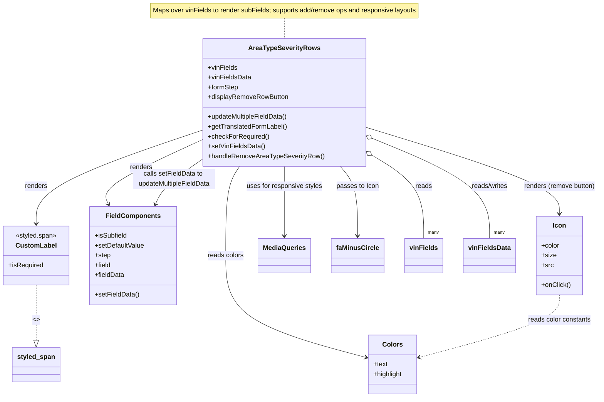

# Diagram: web/portal/src/pages/damageview/details/components/AreaTypeSeverityEditableRows.js

> Auto-generated by Obscura crawlers

## Mermaid

### SVG

<svg id="container" width="1437.267578125" xmlns="http://www.w3.org/2000/svg" class="classDiagram" height="970" viewBox="0 0 1437.267578125 970" role="graphics-document document" aria-roledescription="class"><g><defs><marker id="container_class-aggregationStart" class="marker aggregation class" refX="18" refY="7" markerWidth="190" markerHeight="240" orient="auto"><path d="M 18,7 L9,13 L1,7 L9,1 Z"></path></marker></defs><defs><marker id="container_class-aggregationEnd" class="marker aggregation class" refX="1" refY="7" markerWidth="20" markerHeight="28" orient="auto"><path d="M 18,7 L9,13 L1,7 L9,1 Z"></path></marker></defs><defs><marker id="container_class-extensionStart" class="marker extension class" refX="18" refY="7" markerWidth="190" markerHeight="240" orient="auto"><path d="M 1,7 L18,13 V 1 Z"></path></marker></defs><defs><marker id="container_class-extensionEnd" class="marker extension class" refX="1" refY="7" markerWidth="20" markerHeight="28" orient="auto"><path d="M 1,1 V 13 L18,7 Z"></path></marker></defs><defs><marker id="container_class-compositionStart" class="marker composition class" refX="18" refY="7" markerWidth="190" markerHeight="240" orient="auto"><path d="M 18,7 L9,13 L1,7 L9,1 Z"></path></marker></defs><defs><marker id="container_class-compositionEnd" class="marker composition class" refX="1" refY="7" markerWidth="20" markerHeight="28" orient="auto"><path d="M 18,7 L9,13 L1,7 L9,1 Z"></path></marker></defs><defs><marker id="container_class-dependencyStart" class="marker dependency class" refX="6" refY="7" markerWidth="190" markerHeight="240" orient="auto"><path d="M 5,7 L9,13 L1,7 L9,1 Z"></path></marker></defs><defs><marker id="container_class-dependencyEnd" class="marker dependency class" refX="13" refY="7" markerWidth="20" markerHeight="28" orient="auto"><path d="M 18,7 L9,13 L14,7 L9,1 Z"></path></marker></defs><defs><marker id="container_class-lollipopStart" class="marker lollipop class" refX="13" refY="7" markerWidth="190" markerHeight="240" orient="auto"><circle stroke="black" fill="transparent" cx="7" cy="7" r="6"></circle></marker></defs><defs><marker id="container_class-lollipopEnd" class="marker lollipop class" refX="1" refY="7" markerWidth="190" markerHeight="240" orient="auto"><circle stroke="black" fill="transparent" cx="7" cy="7" r="6"></circle></marker></defs><g class="root"><g class="clusters"></g><g class="edgePaths"><path d="M690.045,44L690.045,48.167C690.045,52.333,690.045,60.667,690.045,69C690.045,77.333,690.045,85.667,690.045,89.833L690.045,94" id="edgeNote1" class="edge-thickness-normal edge-pattern-dotted relation" style="fill: none;;;fill: none" data-edge="true" data-et="edge" data-id="edgeNote1" data-points="W3sieCI6NjkwLjA0NDkyMTg3NSwieSI6NDR9LHsieCI6NjkwLjA0NDkyMTg3NSwieSI6Njl9LHsieCI6NjkwLjA0NDkyMTg3NSwieSI6OTR9XQ=="></path><path d="M496.143,316.026L428.12,339.188C360.098,362.351,224.053,408.675,156.03,447.004C88.008,485.333,88.008,515.667,88.008,530.833L88.008,546" id="id_AreaTypeSeverityRows_CustomLabel_1" class="edge-thickness-normal edge-pattern-solid relation" style=";;;" data-edge="true" data-et="edge" data-id="id_AreaTypeSeverityRows_CustomLabel_1" data-points="W3sieCI6NDk2LjE0MjU3ODEyNSwieSI6MzE2LjAyNTc5NzgyODMzNjc1fSx7IngiOjg4LjAwNzgxMjUsInkiOjQ1NX0seyJ4Ijo4OC4wMDc4MTI1LCJ5Ijo1NTJ9XQ==" marker-end="url(#container_class-dependencyEnd)"></path><path d="M496.143,338.939L453.97,358.282C411.798,377.626,327.452,416.313,288.7,442.918C249.948,469.524,256.789,484.048,260.21,491.31L263.63,498.572" id="id_AreaTypeSeverityRows_FieldComponents_2" class="edge-thickness-normal edge-pattern-solid relation" style=";;;" data-edge="true" data-et="edge" data-id="id_AreaTypeSeverityRows_FieldComponents_2" data-points="W3sieCI6NDk2LjE0MjU3ODEyNSwieSI6MzM4LjkzODU2NjI4NDQzNTc1fSx7IngiOjI0My4xMDc0MjE4NzUsInkiOjQ1NX0seyJ4IjoyNjYuMTg2NTk4NTU3NjkyMywieSI6NTA0fV0=" marker-end="url(#container_class-dependencyEnd)"></path><path d="M883.947,311.092L960.074,335.076C1036.2,359.061,1188.452,407.031,1264.579,442.182C1340.705,477.333,1340.705,499.667,1340.705,510.833L1340.705,522" id="id_AreaTypeSeverityRows_Icon_3" class="edge-thickness-normal edge-pattern-solid relation" style=";;;" data-edge="true" data-et="edge" data-id="id_AreaTypeSeverityRows_Icon_3" data-points="W3sieCI6ODgzLjk0NzI2NTYyNSwieSI6MzExLjA5MTc2OTc3NzA4OTR9LHsieCI6MTM0MC43MDUwNzgxMjUsInkiOjQ1NX0seyJ4IjoxMzQwLjcwNTA3ODEyNSwieSI6NTI4fV0=" marker-end="url(#container_class-dependencyEnd)"></path><path d="M690.045,406L690.045,414.167C690.045,422.333,690.045,438.667,690.045,467C690.045,495.333,690.045,535.667,690.045,555.833L690.045,576" id="id_AreaTypeSeverityRows_MediaQueries_4" class="edge-thickness-normal edge-pattern-solid relation" style=";;;" data-edge="true" data-et="edge" data-id="id_AreaTypeSeverityRows_MediaQueries_4" data-points="W3sieCI6NjkwLjA0NDkyMTg3NSwieSI6NDA2fSx7IngiOjY5MC4wNDQ5MjE4NzUsInkiOjQ1NX0seyJ4Ijo2OTAuMDQ0OTIxODc1LCJ5Ijo1ODJ9XQ==" marker-end="url(#container_class-dependencyEnd)"></path><path d="M582.331,406L576.692,414.167C571.053,422.333,559.776,438.667,554.137,475C548.498,511.333,548.498,567.667,548.498,622C548.498,676.333,548.498,728.667,603.605,769.998C658.712,811.329,768.927,841.658,824.034,856.822L879.141,871.986" id="id_AreaTypeSeverityRows_Colors_5" class="edge-thickness-normal edge-pattern-solid relation" style=";;;" data-edge="true" data-et="edge" data-id="id_AreaTypeSeverityRows_Colors_5" data-points="W3sieCI6NTgyLjMzMTIwMjM2MjgwNDksInkiOjQwNn0seyJ4Ijo1NDguNDk4MDQ2ODc1LCJ5Ijo0NTV9LHsieCI6NTQ4LjQ5ODA0Njg3NSwieSI6NjI0fSx7IngiOjU0OC40OTgwNDY4NzUsInkiOjc4MX0seyJ4Ijo4ODQuOTI1NzgxMjUsInkiOjg3My41NzgzODMxNzU5NTcyfV0=" marker-end="url(#container_class-dependencyEnd)"></path><path d="M822.044,406L828.955,414.167C835.865,422.333,849.685,438.667,856.596,467C863.506,495.333,863.506,535.667,863.506,555.833L863.506,576" id="id_AreaTypeSeverityRows_faMinusCircle_6" class="edge-thickness-normal edge-pattern-solid relation" style=";;;" data-edge="true" data-et="edge" data-id="id_AreaTypeSeverityRows_faMinusCircle_6" data-points="W3sieCI6ODIyLjA0NDQ2NDU1NzkyNjksInkiOjQwNn0seyJ4Ijo4NjMuNTA1ODU5Mzc1LCJ5Ijo0NTV9LHsieCI6ODYzLjUwNTg1OTM3NSwieSI6NTgyfV0=" marker-end="url(#container_class-dependencyEnd)"></path><path d="M88.008,696L88.008,710.167C88.008,724.333,88.008,752.667,88.008,775.125C88.008,797.583,88.008,814.167,88.008,822.458L88.008,830.75" id="id_CustomLabel_styled_span_7" class="edge-thickness-normal edge-pattern-dashed relation" style=";;;" data-edge="true" data-et="edge" data-id="id_CustomLabel_styled_span_7" data-points="W3sieCI6ODguMDA3ODEyNSwieSI6Njk2fSx7IngiOjg4LjAwNzgxMjUsInkiOjc4MX0seyJ4Ijo4OC4wMDc4MTI1LCJ5Ijo4NDh9XQ==" marker-end="url(#container_class-extensionEnd)"></path><path d="M1340.705,720L1340.705,730.167C1340.705,740.333,1340.705,760.667,1285.598,785.998C1230.491,811.329,1120.277,841.658,1065.169,856.822L1010.062,871.986" id="id_Icon_Colors_8" class="edge-thickness-normal edge-pattern-dashed relation" style=";;;" data-edge="true" data-et="edge" data-id="id_Icon_Colors_8" data-points="W3sieCI6MTM0MC43MDUwNzgxMjUsInkiOjcyMH0seyJ4IjoxMzQwLjcwNTA3ODEyNSwieSI6NzgxfSx7IngiOjEwMDQuMjc3MzQzNzUsInkiOjg3My41NzgzODMxNzU5NTcyfV0=" marker-end="url(#container_class-dependencyEnd)"></path><path d="M377.566,498.502L380.735,491.252C383.905,484.002,390.243,469.501,410.006,450.659C429.769,431.817,462.956,408.634,479.549,397.043L496.143,385.451" id="id_FieldComponents_AreaTypeSeverityRows_9" class="edge-thickness-normal edge-pattern-solid relation" style=";;;" data-edge="true" data-et="edge" data-id="id_FieldComponents_AreaTypeSeverityRows_9" data-points="W3sieCI6Mzc1LjE2MjY1MjU1MTc3NTEsInkiOjUwNH0seyJ4IjozOTYuNTgyMDMxMjUsInkiOjQ1NX0seyJ4Ijo0OTYuMTQyNTc4MTI1LCJ5IjozODUuNDUxNDcxODUwODExNjN9XQ==" marker-start="url(#container_class-dependencyStart)"></path><path d="M898.586,380.01L918.633,392.508C938.681,405.006,978.777,430.003,998.825,463.668C1018.873,497.333,1018.873,539.667,1018.873,560.833L1018.873,582" id="id_AreaTypeSeverityRows_vinFields_10" class="edge-thickness-normal edge-pattern-solid relation" style=";;;" data-edge="true" data-et="edge" data-id="id_AreaTypeSeverityRows_vinFields_10" data-points="W3sieCI6ODgzLjk0NzI2NTYyNSwieSI6MzcwLjg4Mzc2MDk4ODM1ODN9LHsieCI6MTAxOC44NzMwNDY4NzUsInkiOjQ1NX0seyJ4IjoxMDE4Ljg3MzA0Njg3NSwieSI6NTgyfV0=" marker-start="url(#container_class-aggregationStart)"></path><path d="M899.833,338.793L945.592,358.161C991.352,377.529,1082.87,416.264,1128.629,456.799C1174.389,497.333,1174.389,539.667,1174.389,560.833L1174.389,582" id="id_AreaTypeSeverityRows_vinFieldsData_11" class="edge-thickness-normal edge-pattern-solid relation" style=";;;" data-edge="true" data-et="edge" data-id="id_AreaTypeSeverityRows_vinFieldsData_11" data-points="W3sieCI6ODgzLjk0NzI2NTYyNSwieSI6MzMyLjA2OTc3MDYzMDM2MzJ9LHsieCI6MTE3NC4zODg2NzE4NzUsInkiOjQ1NX0seyJ4IjoxMTc0LjM4ODY3MTg3NSwieSI6NTgyfV0=" marker-start="url(#container_class-aggregationStart)"></path></g><g class="edgeLabels"><g class="edgeLabel"><g class="label" data-id="edgeNote1" transform="translate(0, 0)"><foreignObject width="0" height="0">

</foreignObject></g></g><g class="edgeLabel" transform="translate(88.0078125, 455)"><g class="label" data-id="id_AreaTypeSeverityRows_CustomLabel_1" transform="translate(-27.75, -12)"><foreignObject width="55.5" height="24">

renders

</foreignObject></g></g><g class="edgeLabel" transform="translate(345.00929, 408.25994)"><g class="label" data-id="id_AreaTypeSeverityRows_FieldComponents_2" transform="translate(-27.75, -12)"><foreignObject width="55.5" height="24">

renders

</foreignObject></g></g><g class="edgeLabel" transform="translate(1340.705078125, 455)"><g class="label" data-id="id_AreaTypeSeverityRows_Icon_3" transform="translate(-88.5625, -12)"><foreignObject width="177.125" height="24">

renders (remove button)

</foreignObject></g></g><g class="edgeLabel" transform="translate(690.044921875, 455)"><g class="label" data-id="id_AreaTypeSeverityRows_MediaQueries_4" transform="translate(-93.4453125, -12)"><foreignObject width="186.890625" height="24">

uses for responsive styles

</foreignObject></g></g><g class="edgeLabel" transform="translate(548.498046875, 624)"><g class="label" data-id="id_AreaTypeSeverityRows_Colors_5" transform="translate(-44.140625, -12)"><foreignObject width="88.28125" height="24">

reads colors

</foreignObject></g></g><g class="edgeLabel" transform="translate(863.505859375, 455)"><g class="label" data-id="id_AreaTypeSeverityRows_faMinusCircle_6" transform="translate(-51.5, -12)"><foreignObject width="103" height="24">

passes to Icon

</foreignObject></g></g><g class="edgeLabel" transform="translate(88.0078125, 781)"><g class="label" data-id="id_CustomLabel_styled_span_7" transform="translate(-8.0078125, -12)"><foreignObject width="16.015625" height="24">

&lt;&gt;

</foreignObject></g></g><g class="edgeLabel" transform="translate(1340.705078125, 781)"><g class="label" data-id="id_Icon_Colors_8" transform="translate(-77.8984375, -12)"><foreignObject width="155.796875" height="24">

reads color constants

</foreignObject></g></g><g class="edgeLabel" transform="translate(396.58203125, 455)"><g class="label" data-id="id_FieldComponents_AreaTypeSeverityRows_9" transform="translate(-100, -24)"><foreignObject width="200" height="48">

calls setFieldData to updateMultipleFieldData

</foreignObject></g></g><g class="edgeLabel" transform="translate(1018.873046875, 455)"><g class="label" data-id="id_AreaTypeSeverityRows_vinFields_10" transform="translate(-20.0078125, -12)"><foreignObject width="40.015625" height="24">

reads

</foreignObject></g></g><g class="edgeLabel" transform="translate(1174.388671875, 455)"><g class="label" data-id="id_AreaTypeSeverityRows_vinFieldsData_11" transform="translate(-45.9453125, -12)"><foreignObject width="91.890625" height="24">

reads/writes

</foreignObject></g></g><g class="edgeTerminals" transform="translate(1028.8730484375, 559.5000013392857)"><g class="inner" transform="translate(0, 0)"></g><foreignObject style="width: 36px; height: 12px;">
many
</foreignObject></g><g class="edgeTerminals" transform="translate(1184.3886709375001, 559.4999991964286)"><g class="inner" transform="translate(0, 0)"></g><foreignObject style="width: 36px; height: 12px;">
many
</foreignObject></g></g><g class="nodes"><g class="node default" id="classId-AreaTypeSeverityRows-0" transform="translate(690.044921875, 250)"><g class="basic label-container"><path d="M-193.90234375 -156 L193.90234375 -156 L193.90234375 156 L-193.90234375 156" stroke="none" stroke-width="0" fill="#ECECFF" style=""></path><path d="M-193.90234375 -156 C-57.99486150715995 -156, 77.9126207356801 -156, 193.90234375 -156 M-193.90234375 -156 C-51.01336347332028 -156, 91.87561680335943 -156, 193.90234375 -156 M193.90234375 -156 C193.90234375 -52.404304953388404, 193.90234375 51.19139009322319, 193.90234375 156 M193.90234375 -156 C193.90234375 -91.31831853394543, 193.90234375 -26.63663706789086, 193.90234375 156 M193.90234375 156 C83.5613625512252 156, -26.779618647549597 156, -193.90234375 156 M193.90234375 156 C64.53833944710846 156, -64.82566485578309 156, -193.90234375 156 M-193.90234375 156 C-193.90234375 45.89980548290187, -193.90234375 -64.20038903419626, -193.90234375 -156 M-193.90234375 156 C-193.90234375 64.01542898362715, -193.90234375 -27.969142032745708, -193.90234375 -156" stroke="#9370DB" stroke-width="1.3" fill="none" stroke-dasharray="0 0" style=""></path></g><g class="annotation-group text" transform="translate(0, -132)"></g><g class="label-group text" transform="translate(-83.1328125, -132)"><g class="label" style="font-weight: bolder" transform="translate(0,-12)"><foreignObject width="166.265625" height="24">

AreaTypeSeverityRows

</foreignObject></g></g><g class="members-group text" transform="translate(-181.90234375, -84)"><g class="label" style="" transform="translate(0,-12)"><foreignObject width="71.765625" height="24">

+vinFields

</foreignObject></g><g class="label" style="" transform="translate(0,12)"><foreignObject width="104.984375" height="24">

+vinFieldsData

</foreignObject></g><g class="label" style="" transform="translate(0,36)"><foreignObject width="74.65625" height="24">

+formStep

</foreignObject></g><g class="label" style="" transform="translate(0,60)"><foreignObject width="197" height="24">

+displayRemoveRowButton

</foreignObject></g></g><g class="methods-group text" transform="translate(-181.90234375, 36)"><g class="label" style="" transform="translate(0,-12)"><foreignObject width="197.1875" height="24">

+updateMultipleFieldData()

</foreignObject></g><g class="label" style="" transform="translate(0,12)"><foreignObject width="192.96875" height="24">

+getTranslatedFormLabel()

</foreignObject></g><g class="label" style="" transform="translate(0,36)"><foreignObject width="148.296875" height="24">

+checkForRequired()

</foreignObject></g><g class="label" style="" transform="translate(0,60)"><foreignObject width="138.5" height="24">

+setVinFieldsData()

</foreignObject></g><g class="label" style="" transform="translate(0,84)"><foreignObject width="280.671875" height="24">

+handleRemoveAreaTypeSeverityRow()

</foreignObject></g></g><g class="divider" style=""><path d="M-193.90234375 -108 C-83.67385135147858 -108, 26.55464104704285 -108, 193.90234375 -108 M-193.90234375 -108 C-39.52764796096622 -108, 114.84704782806756 -108, 193.90234375 -108" stroke="#9370DB" stroke-width="1.3" fill="none" stroke-dasharray="0 0" style=""></path></g><g class="divider" style=""><path d="M-193.90234375 12 C-97.38601293574308 12, -0.8696821214861643 12, 193.90234375 12 M-193.90234375 12 C-49.213332447153675 12, 95.47567885569265 12, 193.90234375 12" stroke="#9370DB" stroke-width="1.3" fill="none" stroke-dasharray="0 0" style=""></path></g></g><g class="node default" id="classId-CustomLabel-1" transform="translate(88.0078125, 624)"><g class="basic label-container"><path d="M-80.0078125 -72 L80.0078125 -72 L80.0078125 72 L-80.0078125 72" stroke="none" stroke-width="0" fill="#ECECFF" style=""></path><path d="M-80.0078125 -72 C-40.87917796853973 -72, -1.7505434370794575 -72, 80.0078125 -72 M-80.0078125 -72 C-37.13074113018156 -72, 5.746330239636876 -72, 80.0078125 -72 M80.0078125 -72 C80.0078125 -35.279722426465824, 80.0078125 1.440555147068352, 80.0078125 72 M80.0078125 -72 C80.0078125 -33.910086103170265, 80.0078125 4.17982779365947, 80.0078125 72 M80.0078125 72 C47.27002332935827 72, 14.532234158716534 72, -80.0078125 72 M80.0078125 72 C16.155059359859415 72, -47.69769378028117 72, -80.0078125 72 M-80.0078125 72 C-80.0078125 32.28744820541395, -80.0078125 -7.425103589172096, -80.0078125 -72 M-80.0078125 72 C-80.0078125 32.5109219174965, -80.0078125 -6.978156165006993, -80.0078125 -72" stroke="#9370DB" stroke-width="1.3" fill="none" stroke-dasharray="0 0" style=""></path></g><g class="annotation-group text" transform="translate(-50.5, -48)"><g class="label" style="" transform="translate(0,-12)"><foreignObject width="101" height="24">

«styled.span»

</foreignObject></g></g><g class="label-group text" transform="translate(-47.265625, -24)"><g class="label" style="font-weight: bolder" transform="translate(0,-12)"><foreignObject width="94.53125" height="24">

CustomLabel

</foreignObject></g></g><g class="members-group text" transform="translate(-68.0078125, 24)"><g class="label" style="" transform="translate(0,-12)"><foreignObject width="85.515625" height="24">

+isRequired

</foreignObject></g></g><g class="methods-group text" transform="translate(-68.0078125, 72)"></g><g class="divider" style=""><path d="M-80.0078125 0 C-33.55024835943769 0, 12.907315781124623 0, 80.0078125 0 M-80.0078125 0 C-28.17846745447254 0, 23.650877591054922 0, 80.0078125 0" stroke="#9370DB" stroke-width="1.3" fill="none" stroke-dasharray="0 0" style=""></path></g><g class="divider" style=""><path d="M-80.0078125 48 C-40.096583429855784 48, -0.18535435971156744 48, 80.0078125 48 M-80.0078125 48 C-20.570597480464528 48, 38.866617539070944 48, 80.0078125 48" stroke="#9370DB" stroke-width="1.3" fill="none" stroke-dasharray="0 0" style=""></path></g></g><g class="node default" id="classId-FieldComponents-2" transform="translate(322.70703125, 624)"><g class="basic label-container"><path d="M-104.69140625 -120 L104.69140625 -120 L104.69140625 120 L-104.69140625 120" stroke="none" stroke-width="0" fill="#ECECFF" style=""></path><path d="M-104.69140625 -120 C-39.0010007674186 -120, 26.689404715162794 -120, 104.69140625 -120 M-104.69140625 -120 C-51.934851721813786 -120, 0.8217028063724285 -120, 104.69140625 -120 M104.69140625 -120 C104.69140625 -39.728360617033346, 104.69140625 40.54327876593331, 104.69140625 120 M104.69140625 -120 C104.69140625 -50.57606072349776, 104.69140625 18.847878553004477, 104.69140625 120 M104.69140625 120 C22.188103377826963 120, -60.315199494346075 120, -104.69140625 120 M104.69140625 120 C44.31129047947075 120, -16.068825291058502 120, -104.69140625 120 M-104.69140625 120 C-104.69140625 49.11560091337431, -104.69140625 -21.768798173251383, -104.69140625 -120 M-104.69140625 120 C-104.69140625 50.20201045735024, -104.69140625 -19.59597908529952, -104.69140625 -120" stroke="#9370DB" stroke-width="1.3" fill="none" stroke-dasharray="0 0" style=""></path></g><g class="annotation-group text" transform="translate(0, -96)"></g><g class="label-group text" transform="translate(-63.3984375, -96)"><g class="label" style="font-weight: bolder" transform="translate(0,-12)"><foreignObject width="126.796875" height="24">

FieldComponents

</foreignObject></g></g><g class="members-group text" transform="translate(-92.69140625, -48)"><g class="label" style="" transform="translate(0,-12)"><foreignObject width="79.609375" height="24">

+isSubfield

</foreignObject></g><g class="label" style="" transform="translate(0,12)"><foreignObject width="121.984375" height="24">

+setDefaultValue

</foreignObject></g><g class="label" style="" transform="translate(0,36)"><foreignObject width="39.21875" height="24">

+step

</foreignObject></g><g class="label" style="" transform="translate(0,60)"><foreignObject width="39.84375" height="24">

+field

</foreignObject></g><g class="label" style="" transform="translate(0,84)"><foreignObject width="73.0625" height="24">

+fieldData

</foreignObject></g></g><g class="methods-group text" transform="translate(-92.69140625, 96)"><g class="label" style="" transform="translate(0,-12)"><foreignObject width="108.25" height="24">

+setFieldData()

</foreignObject></g></g><g class="divider" style=""><path d="M-104.69140625 -72 C-31.64064411255616 -72, 41.41011802488768 -72, 104.69140625 -72 M-104.69140625 -72 C-51.83065420040823 -72, 1.0300978491835338 -72, 104.69140625 -72" stroke="#9370DB" stroke-width="1.3" fill="none" stroke-dasharray="0 0" style=""></path></g><g class="divider" style=""><path d="M-104.69140625 72 C-45.31854855711774 72, 14.054309135764527 72, 104.69140625 72 M-104.69140625 72 C-38.94342099265508 72, 26.804564264689844 72, 104.69140625 72" stroke="#9370DB" stroke-width="1.3" fill="none" stroke-dasharray="0 0" style=""></path></g></g><g class="node default" id="classId-Icon-3" transform="translate(1340.705078125, 624)"><g class="basic label-container"><path d="M-55.11328125 -96 L55.11328125 -96 L55.11328125 96 L-55.11328125 96" stroke="none" stroke-width="0" fill="#ECECFF" style=""></path><path d="M-55.11328125 -96 C-21.153732036856795 -96, 12.80581717628641 -96, 55.11328125 -96 M-55.11328125 -96 C-14.119534431357458 -96, 26.874212387285084 -96, 55.11328125 -96 M55.11328125 -96 C55.11328125 -31.26574142964887, 55.11328125 33.46851714070226, 55.11328125 96 M55.11328125 -96 C55.11328125 -30.23936712564057, 55.11328125 35.52126574871886, 55.11328125 96 M55.11328125 96 C28.47268774310825 96, 1.8320942362164985 96, -55.11328125 96 M55.11328125 96 C24.50069854757437 96, -6.111884154851261 96, -55.11328125 96 M-55.11328125 96 C-55.11328125 22.95231467623651, -55.11328125 -50.09537064752698, -55.11328125 -96 M-55.11328125 96 C-55.11328125 30.71155666752506, -55.11328125 -34.57688666494988, -55.11328125 -96" stroke="#9370DB" stroke-width="1.3" fill="none" stroke-dasharray="0 0" style=""></path></g><g class="annotation-group text" transform="translate(0, -72)"></g><g class="label-group text" transform="translate(-15.3046875, -72)"><g class="label" style="font-weight: bolder" transform="translate(0,-12)"><foreignObject width="30.609375" height="24">

Icon

</foreignObject></g></g><g class="members-group text" transform="translate(-43.11328125, -24)"><g class="label" style="" transform="translate(0,-12)"><foreignObject width="44.796875" height="24">

+color

</foreignObject></g><g class="label" style="" transform="translate(0,12)"><foreignObject width="35.578125" height="24">

+size

</foreignObject></g><g class="label" style="" transform="translate(0,36)"><foreignObject width="28.8125" height="24">

+src

</foreignObject></g></g><g class="methods-group text" transform="translate(-43.11328125, 72)"><g class="label" style="" transform="translate(0,-12)"><foreignObject width="70.921875" height="24">

+onClick()

</foreignObject></g></g><g class="divider" style=""><path d="M-55.11328125 -48 C-20.551423699035567 -48, 14.010433851928866 -48, 55.11328125 -48 M-55.11328125 -48 C-18.826093258523947 -48, 17.461094732952105 -48, 55.11328125 -48" stroke="#9370DB" stroke-width="1.3" fill="none" stroke-dasharray="0 0" style=""></path></g><g class="divider" style=""><path d="M-55.11328125 48 C-25.83936477755179 48, 3.4345516948964203 48, 55.11328125 48 M-55.11328125 48 C-27.98158463384021 48, -0.8498880176804207 48, 55.11328125 48" stroke="#9370DB" stroke-width="1.3" fill="none" stroke-dasharray="0 0" style=""></path></g></g><g class="node default" id="classId-MediaQueries-4" transform="translate(690.044921875, 624)"><g class="basic label-container"><path d="M-62.40625 -42 L62.40625 -42 L62.40625 42 L-62.40625 42" stroke="none" stroke-width="0" fill="#ECECFF" style=""></path><path d="M-62.40625 -42 C-32.04022627573521 -42, -1.6742025514704224 -42, 62.40625 -42 M-62.40625 -42 C-34.22780035258201 -42, -6.049350705164024 -42, 62.40625 -42 M62.40625 -42 C62.40625 -17.891049564092498, 62.40625 6.217900871815004, 62.40625 42 M62.40625 -42 C62.40625 -11.507340694289049, 62.40625 18.985318611421903, 62.40625 42 M62.40625 42 C36.97758179480143 42, 11.548913589602861 42, -62.40625 42 M62.40625 42 C25.953244053597807 42, -10.499761892804386 42, -62.40625 42 M-62.40625 42 C-62.40625 24.849156046750647, -62.40625 7.698312093501293, -62.40625 -42 M-62.40625 42 C-62.40625 15.323696470959415, -62.40625 -11.352607058081169, -62.40625 -42" stroke="#9370DB" stroke-width="1.3" fill="none" stroke-dasharray="0 0" style=""></path></g><g class="annotation-group text" transform="translate(0, -18)"></g><g class="label-group text" transform="translate(-50.40625, -18)"><g class="label" style="font-weight: bolder" transform="translate(0,-12)"><foreignObject width="100.8125" height="24">

MediaQueries

</foreignObject></g></g><g class="members-group text" transform="translate(-50.40625, 30)"></g><g class="methods-group text" transform="translate(-50.40625, 60)"></g><g class="divider" style=""><path d="M-62.40625 6 C-14.622194898421952 6, 33.161860203156095 6, 62.40625 6 M-62.40625 6 C-22.993384526683926 6, 16.41948094663215 6, 62.40625 6" stroke="#9370DB" stroke-width="1.3" fill="none" stroke-dasharray="0 0" style=""></path></g><g class="divider" style=""><path d="M-62.40625 24 C-36.44212100638072 24, -10.477992012761433 24, 62.40625 24 M-62.40625 24 C-31.394991504532545 24, -0.38373300906508945 24, 62.40625 24" stroke="#9370DB" stroke-width="1.3" fill="none" stroke-dasharray="0 0" style=""></path></g></g><g class="node default" id="classId-Colors-5" transform="translate(944.6015625, 890)"><g class="basic label-container"><path d="M-59.67578125 -72 L59.67578125 -72 L59.67578125 72 L-59.67578125 72" stroke="none" stroke-width="0" fill="#ECECFF" style=""></path><path d="M-59.67578125 -72 C-35.78952676048536 -72, -11.90327227097071 -72, 59.67578125 -72 M-59.67578125 -72 C-14.344559688139341 -72, 30.986661873721317 -72, 59.67578125 -72 M59.67578125 -72 C59.67578125 -31.64387671407927, 59.67578125 8.712246571841462, 59.67578125 72 M59.67578125 -72 C59.67578125 -22.677097340086874, 59.67578125 26.645805319826252, 59.67578125 72 M59.67578125 72 C21.44393876031048 72, -16.78790372937904 72, -59.67578125 72 M59.67578125 72 C12.865388352859803 72, -33.945004544280394 72, -59.67578125 72 M-59.67578125 72 C-59.67578125 38.53634324250079, -59.67578125 5.072686485001583, -59.67578125 -72 M-59.67578125 72 C-59.67578125 30.072094901991733, -59.67578125 -11.855810196016535, -59.67578125 -72" stroke="#9370DB" stroke-width="1.3" fill="none" stroke-dasharray="0 0" style=""></path></g><g class="annotation-group text" transform="translate(0, -48)"></g><g class="label-group text" transform="translate(-23.1015625, -48)"><g class="label" style="font-weight: bolder" transform="translate(0,-12)"><foreignObject width="46.203125" height="24">

Colors

</foreignObject></g></g><g class="members-group text" transform="translate(-47.67578125, 0)"><g class="label" style="" transform="translate(0,-12)"><foreignObject width="35.5625" height="24">

+text

</foreignObject></g><g class="label" style="" transform="translate(0,12)"><foreignObject width="72.25" height="24">

+highlight

</foreignObject></g></g><g class="methods-group text" transform="translate(-47.67578125, 72)"></g><g class="divider" style=""><path d="M-59.67578125 -24 C-14.79700476164205 -24, 30.0817717267159 -24, 59.67578125 -24 M-59.67578125 -24 C-18.026738515119483 -24, 23.622304219761034 -24, 59.67578125 -24" stroke="#9370DB" stroke-width="1.3" fill="none" stroke-dasharray="0 0" style=""></path></g><g class="divider" style=""><path d="M-59.67578125 48 C-33.21064455644334 48, -6.745507862886676 48, 59.67578125 48 M-59.67578125 48 C-31.425420571662443 48, -3.1750598933248853 48, 59.67578125 48" stroke="#9370DB" stroke-width="1.3" fill="none" stroke-dasharray="0 0" style=""></path></g></g><g class="node default" id="classId-faMinusCircle-6" transform="translate(863.505859375, 624)"><g class="basic label-container"><path d="M-61.0546875 -42 L61.0546875 -42 L61.0546875 42 L-61.0546875 42" stroke="none" stroke-width="0" fill="#ECECFF" style=""></path><path d="M-61.0546875 -42 C-22.82213042253308 -42, 15.410426654933843 -42, 61.0546875 -42 M-61.0546875 -42 C-24.553511229502135 -42, 11.94766504099573 -42, 61.0546875 -42 M61.0546875 -42 C61.0546875 -22.633184773674543, 61.0546875 -3.266369547349086, 61.0546875 42 M61.0546875 -42 C61.0546875 -22.564827503450346, 61.0546875 -3.129655006900691, 61.0546875 42 M61.0546875 42 C35.63941882854965 42, 10.224150157099302 42, -61.0546875 42 M61.0546875 42 C29.108407443170012 42, -2.8378726136599752 42, -61.0546875 42 M-61.0546875 42 C-61.0546875 14.851029360093747, -61.0546875 -12.297941279812505, -61.0546875 -42 M-61.0546875 42 C-61.0546875 22.06306970477788, -61.0546875 2.126139409555762, -61.0546875 -42" stroke="#9370DB" stroke-width="1.3" fill="none" stroke-dasharray="0 0" style=""></path></g><g class="annotation-group text" transform="translate(0, -18)"></g><g class="label-group text" transform="translate(-49.0546875, -18)"><g class="label" style="font-weight: bolder" transform="translate(0,-12)"><foreignObject width="98.109375" height="24">

faMinusCircle

</foreignObject></g></g><g class="members-group text" transform="translate(-49.0546875, 30)"></g><g class="methods-group text" transform="translate(-49.0546875, 60)"></g><g class="divider" style=""><path d="M-61.0546875 6 C-31.92195616559342 6, -2.789224831186843 6, 61.0546875 6 M-61.0546875 6 C-14.64582079439505 6, 31.7630459112099 6, 61.0546875 6" stroke="#9370DB" stroke-width="1.3" fill="none" stroke-dasharray="0 0" style=""></path></g><g class="divider" style=""><path d="M-61.0546875 24 C-30.480651500409003 24, 0.09338449918199387 24, 61.0546875 24 M-61.0546875 24 C-13.891191154221005 24, 33.27230519155799 24, 61.0546875 24" stroke="#9370DB" stroke-width="1.3" fill="none" stroke-dasharray="0 0" style=""></path></g></g><g class="node default" id="classId-styled_span-7" transform="translate(88.0078125, 890)"><g class="basic label-container"><path d="M-56.328125 -42 L56.328125 -42 L56.328125 42 L-56.328125 42" stroke="none" stroke-width="0" fill="#ECECFF" style=""></path><path d="M-56.328125 -42 C-31.005817351933313 -42, -5.683509703866626 -42, 56.328125 -42 M-56.328125 -42 C-32.89850346302512 -42, -9.468881926050237 -42, 56.328125 -42 M56.328125 -42 C56.328125 -13.157976604667397, 56.328125 15.684046790665207, 56.328125 42 M56.328125 -42 C56.328125 -19.934040962210517, 56.328125 2.131918075578966, 56.328125 42 M56.328125 42 C15.018918005190763 42, -26.290288989618475 42, -56.328125 42 M56.328125 42 C23.74280037963969 42, -8.842524240720621 42, -56.328125 42 M-56.328125 42 C-56.328125 20.79436767820244, -56.328125 -0.4112646435951177, -56.328125 -42 M-56.328125 42 C-56.328125 12.332833314967402, -56.328125 -17.334333370065195, -56.328125 -42" stroke="#9370DB" stroke-width="1.3" fill="none" stroke-dasharray="0 0" style=""></path></g><g class="annotation-group text" transform="translate(0, -18)"></g><g class="label-group text" transform="translate(-44.328125, -18)"><g class="label" style="font-weight: bolder" transform="translate(0,-12)"><foreignObject width="88.65625" height="24">

styled_span

</foreignObject></g></g><g class="members-group text" transform="translate(-44.328125, 30)"></g><g class="methods-group text" transform="translate(-44.328125, 60)"></g><g class="divider" style=""><path d="M-56.328125 6 C-22.198802514764147 6, 11.930519970471707 6, 56.328125 6 M-56.328125 6 C-30.147874501444697 6, -3.9676240028893943 6, 56.328125 6" stroke="#9370DB" stroke-width="1.3" fill="none" stroke-dasharray="0 0" style=""></path></g><g class="divider" style=""><path d="M-56.328125 24 C-29.83082258303391 24, -3.333520166067821 24, 56.328125 24 M-56.328125 24 C-25.953476933117784 24, 4.421171133764432 24, 56.328125 24" stroke="#9370DB" stroke-width="1.3" fill="none" stroke-dasharray="0 0" style=""></path></g></g><g class="node default" id="classId-vinFields-8" transform="translate(1018.873046875, 624)"><g class="basic label-container"><path d="M-44.3125 -42 L44.3125 -42 L44.3125 42 L-44.3125 42" stroke="none" stroke-width="0" fill="#ECECFF" style=""></path><path d="M-44.3125 -42 C-21.913870109800097 -42, 0.4847597803998056 -42, 44.3125 -42 M-44.3125 -42 C-18.38369344857824 -42, 7.545113102843523 -42, 44.3125 -42 M44.3125 -42 C44.3125 -22.048533947285264, 44.3125 -2.097067894570529, 44.3125 42 M44.3125 -42 C44.3125 -13.400190974449128, 44.3125 15.199618051101744, 44.3125 42 M44.3125 42 C22.66390518386067 42, 1.0153103677213409 42, -44.3125 42 M44.3125 42 C22.34631898787195 42, 0.3801379757438994 42, -44.3125 42 M-44.3125 42 C-44.3125 11.578897962320774, -44.3125 -18.842204075358453, -44.3125 -42 M-44.3125 42 C-44.3125 20.419367505001176, -44.3125 -1.1612649899976475, -44.3125 -42" stroke="#9370DB" stroke-width="1.3" fill="none" stroke-dasharray="0 0" style=""></path></g><g class="annotation-group text" transform="translate(0, -18)"></g><g class="label-group text" transform="translate(-32.3125, -18)"><g class="label" style="font-weight: bolder" transform="translate(0,-12)"><foreignObject width="64.625" height="24">

vinFields

</foreignObject></g></g><g class="members-group text" transform="translate(-32.3125, 30)"></g><g class="methods-group text" transform="translate(-32.3125, 60)"></g><g class="divider" style=""><path d="M-44.3125 6 C-14.844765638661514 6, 14.622968722676973 6, 44.3125 6 M-44.3125 6 C-21.30396795254286 6, 1.7045640949142822 6, 44.3125 6" stroke="#9370DB" stroke-width="1.3" fill="none" stroke-dasharray="0 0" style=""></path></g><g class="divider" style=""><path d="M-44.3125 24 C-9.25249285308601 24, 25.80751429382798 24, 44.3125 24 M-44.3125 24 C-16.303415882004202 24, 11.705668235991595 24, 44.3125 24" stroke="#9370DB" stroke-width="1.3" fill="none" stroke-dasharray="0 0" style=""></path></g></g><g class="node default" id="classId-vinFieldsData-9" transform="translate(1174.388671875, 624)"><g class="basic label-container"><path d="M-61.203125 -42 L61.203125 -42 L61.203125 42 L-61.203125 42" stroke="none" stroke-width="0" fill="#ECECFF" style=""></path><path d="M-61.203125 -42 C-35.22446977767896 -42, -9.245814555357917 -42, 61.203125 -42 M-61.203125 -42 C-21.01970068396158 -42, 19.163723632076838 -42, 61.203125 -42 M61.203125 -42 C61.203125 -16.437168610408836, 61.203125 9.125662779182328, 61.203125 42 M61.203125 -42 C61.203125 -16.29631625450237, 61.203125 9.407367490995263, 61.203125 42 M61.203125 42 C13.246939079976087 42, -34.709246840047825 42, -61.203125 42 M61.203125 42 C22.40752420100999 42, -16.388076597980017 42, -61.203125 42 M-61.203125 42 C-61.203125 8.512358406831822, -61.203125 -24.975283186336355, -61.203125 -42 M-61.203125 42 C-61.203125 18.874919580576602, -61.203125 -4.250160838846796, -61.203125 -42" stroke="#9370DB" stroke-width="1.3" fill="none" stroke-dasharray="0 0" style=""></path></g><g class="annotation-group text" transform="translate(0, -18)"></g><g class="label-group text" transform="translate(-49.203125, -18)"><g class="label" style="font-weight: bolder" transform="translate(0,-12)"><foreignObject width="98.40625" height="24">

vinFieldsData

</foreignObject></g></g><g class="members-group text" transform="translate(-49.203125, 30)"></g><g class="methods-group text" transform="translate(-49.203125, 60)"></g><g class="divider" style=""><path d="M-61.203125 6 C-15.610138856641356 6, 29.982847286717288 6, 61.203125 6 M-61.203125 6 C-17.18761487607936 6, 26.827895247841283 6, 61.203125 6" stroke="#9370DB" stroke-width="1.3" fill="none" stroke-dasharray="0 0" style=""></path></g><g class="divider" style=""><path d="M-61.203125 24 C-27.388765888857534 24, 6.425593222284931 24, 61.203125 24 M-61.203125 24 C-13.663935106652296 24, 33.87525478669541 24, 61.203125 24" stroke="#9370DB" stroke-width="1.3" fill="none" stroke-dasharray="0 0" style=""></path></g></g><g class="node undefined" id="note0" transform="translate(690.044921875, 26)"><g class="basic label-container"><path d="M-333.84375 -18 L333.84375 -18 L333.84375 18 L-333.84375 18" stroke="none" stroke-width="0" fill="#fff5ad" style="fill:#fff5ad !important;stroke:#aaaa33 !important"></path><path d="M-333.84375 -18 C-104.14225087730463 -18, 125.55924824539073 -18, 333.84375 -18 M-333.84375 -18 C-122.66117749224284 -18, 88.52139501551432 -18, 333.84375 -18 M333.84375 -18 C333.84375 -8.681375638229786, 333.84375 0.6372487235404272, 333.84375 18 M333.84375 -18 C333.84375 -7.759604142420828, 333.84375 2.480791715158343, 333.84375 18 M333.84375 18 C78.84137491934715 18, -176.1610001613057 18, -333.84375 18 M333.84375 18 C137.98526170128187 18, -57.87322659743626 18, -333.84375 18 M-333.84375 18 C-333.84375 4.108009884040452, -333.84375 -9.783980231919095, -333.84375 -18 M-333.84375 18 C-333.84375 7.885832058047548, -333.84375 -2.2283358839049043, -333.84375 -18" stroke="#aaaa33" stroke-width="1.3" fill="none" stroke-dasharray="0 0" style="fill:#fff5ad !important;stroke:#aaaa33 !important"></path></g><g class="label" style="text-align:left !important;white-space:nowrap !important" transform="translate(-327.84375, -12)"><rect></rect><foreignObject width="655.6875" height="24">

Maps over vinFields to render subFields; supports add/remove ops and responsive layouts

</foreignObject></g></g></g></g></g></svg>
