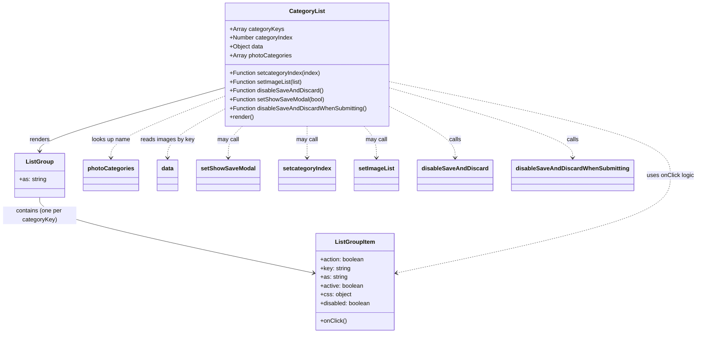

# Diagram: web/portal/src/pages/damageview/details/components/CategoryList.js


> Auto-generated by Obscura crawlers

## Diagram 1



### SVG

<svg id="container" width="1843.2734375" xmlns="http://www.w3.org/2000/svg" class="classDiagram" height="908" viewBox="0 0 1843.2734375 908" role="graphics-document document" aria-roledescription="class"><style>#container{font-family:"trebuchet ms",verdana,arial,sans-serif;font-size:16px;fill:#333;}@keyframes edge-animation-frame{from{stroke-dashoffset:0;}}@keyframes dash{to{stroke-dashoffset:0;}}#container .edge-animation-slow{stroke-dasharray:9,5!important;stroke-dashoffset:900;animation:dash 50s linear infinite;stroke-linecap:round;}#container .edge-animation-fast{stroke-dasharray:9,5!important;stroke-dashoffset:900;animation:dash 20s linear infinite;stroke-linecap:round;}#container .error-icon{fill:#552222;}#container .error-text{fill:#552222;stroke:#552222;}#container .edge-thickness-normal{stroke-width:1px;}#container .edge-thickness-thick{stroke-width:3.5px;}#container .edge-pattern-solid{stroke-dasharray:0;}#container .edge-thickness-invisible{stroke-width:0;fill:none;}#container .edge-pattern-dashed{stroke-dasharray:3;}#container .edge-pattern-dotted{stroke-dasharray:2;}#container .marker{fill:#333333;stroke:#333333;}#container .marker.cross{stroke:#333333;}#container svg{font-family:"trebuchet ms",verdana,arial,sans-serif;font-size:16px;}#container p{margin:0;}#container g.classGroup text{fill:#9370DB;stroke:none;font-family:"trebuchet ms",verdana,arial,sans-serif;font-size:10px;}#container g.classGroup text .title{font-weight:bolder;}#container .nodeLabel,#container .edgeLabel{color:#131300;}#container .edgeLabel .label rect{fill:#ECECFF;}#container .label text{fill:#131300;}#container .labelBkg{background:#ECECFF;}#container .edgeLabel .label span{background:#ECECFF;}#container .classTitle{font-weight:bolder;}#container .node rect,#container .node circle,#container .node ellipse,#container .node polygon,#container .node path{fill:#ECECFF;stroke:#9370DB;stroke-width:1px;}#container .divider{stroke:#9370DB;stroke-width:1;}#container g.clickable{cursor:pointer;}#container g.classGroup rect{fill:#ECECFF;stroke:#9370DB;}#container g.classGroup line{stroke:#9370DB;stroke-width:1;}#container .classLabel .box{stroke:none;stroke-width:0;fill:#ECECFF;opacity:0.5;}#container .classLabel .label{fill:#9370DB;font-size:10px;}#container .relation{stroke:#333333;stroke-width:1;fill:none;}#container .dashed-line{stroke-dasharray:3;}#container .dotted-line{stroke-dasharray:1 2;}#container #compositionStart,#container .composition{fill:#333333!important;stroke:#333333!important;stroke-width:1;}#container #compositionEnd,#container .composition{fill:#333333!important;stroke:#333333!important;stroke-width:1;}#container #dependencyStart,#container .dependency{fill:#333333!important;stroke:#333333!important;stroke-width:1;}#container #dependencyStart,#container .dependency{fill:#333333!important;stroke:#333333!important;stroke-width:1;}#container #extensionStart,#container .extension{fill:transparent!important;stroke:#333333!important;stroke-width:1;}#container #extensionEnd,#container .extension{fill:transparent!important;stroke:#333333!important;stroke-width:1;}#container #aggregationStart,#container .aggregation{fill:transparent!important;stroke:#333333!important;stroke-width:1;}#container #aggregationEnd,#container .aggregation{fill:transparent!important;stroke:#333333!important;stroke-width:1;}#container #lollipopStart,#container .lollipop{fill:#ECECFF!important;stroke:#333333!important;stroke-width:1;}#container #lollipopEnd,#container .lollipop{fill:#ECECFF!important;stroke:#333333!important;stroke-width:1;}#container .edgeTerminals{font-size:11px;line-height:initial;}#container .classTitleText{text-anchor:middle;font-size:18px;fill:#333;}#container .label-icon{display:inline-block;height:1em;overflow:visible;vertical-align:-0.125em;}#container .node .label-icon path{fill:currentColor;stroke:revert;stroke-width:revert;}#container :root{--mermaid-font-family:"trebuchet ms",verdana,arial,sans-serif;}</style><g><defs><marker id="container_class-aggregationStart" class="marker aggregation class" refX="18" refY="7" markerWidth="190" markerHeight="240" orient="auto"><path d="M 18,7 L9,13 L1,7 L9,1 Z"></path></marker></defs><defs><marker id="container_class-aggregationEnd" class="marker aggregation class" refX="1" refY="7" markerWidth="20" markerHeight="28" orient="auto"><path d="M 18,7 L9,13 L1,7 L9,1 Z"></path></marker></defs><defs><marker id="container_class-extensionStart" class="marker extension class" refX="18" refY="7" markerWidth="190" markerHeight="240" orient="auto"><path d="M 1,7 L18,13 V 1 Z"></path></marker></defs><defs><marker id="container_class-extensionEnd" class="marker extension class" refX="1" refY="7" markerWidth="20" markerHeight="28" orient="auto"><path d="M 1,1 V 13 L18,7 Z"></path></marker></defs><defs><marker id="container_class-compositionStart" class="marker composition class" refX="18" refY="7" markerWidth="190" markerHeight="240" orient="auto"><path d="M 18,7 L9,13 L1,7 L9,1 Z"></path></marker></defs><defs><marker id="container_class-compositionEnd" class="marker composition class" refX="1" refY="7" markerWidth="20" markerHeight="28" orient="auto"><path d="M 18,7 L9,13 L1,7 L9,1 Z"></path></marker></defs><defs><marker id="container_class-dependencyStart" class="marker dependency class" refX="6" refY="7" markerWidth="190" markerHeight="240" orient="auto"><path d="M 5,7 L9,13 L1,7 L9,1 Z"></path></marker></defs><defs><marker id="container_class-dependencyEnd" class="marker dependency class" refX="13" refY="7" markerWidth="20" markerHeight="28" orient="auto"><path d="M 18,7 L9,13 L14,7 L9,1 Z"></path></marker></defs><defs><marker id="container_class-lollipopStart" class="marker lollipop class" refX="13" refY="7" markerWidth="190" markerHeight="240" orient="auto"><circle stroke="black" fill="transparent" cx="7" cy="7" r="6"></circle></marker></defs><defs><marker id="container_class-lollipopEnd" class="marker lollipop class" refX="1" refY="7" markerWidth="190" markerHeight="240" orient="auto"><circle stroke="black" fill="transparent" cx="7" cy="7" r="6"></circle></marker></defs><g class="root"><g class="clusters"></g><g class="edgePaths"><path d="M595.988,240.074L514.657,263.562C433.326,287.049,270.663,334.025,189.331,362.679C108,391.333,108,401.667,108,406.833L108,412" id="id_CategoryList_ListGroup_1" class="edge-thickness-normal edge-pattern-solid relation" style=";;;" data-edge="true" data-et="edge" data-id="id_CategoryList_ListGroup_1" data-points="W3sieCI6NTk1Ljk4ODI4MTI1LCJ5IjoyNDAuMDc0MDYyODY0NTYzODR9LHsieCI6MTA4LCJ5IjozODF9LHsieCI6MTA4LCJ5Ijo0MTh9XQ==" marker-end="url(#container_class-dependencyEnd)"></path><path d="M108,538L108,546.167C108,554.333,108,570.667,227.781,604.906C347.563,639.146,587.125,691.293,706.907,717.366L826.688,743.439" id="id_ListGroup_ListGroupItem_2" class="edge-thickness-normal edge-pattern-solid relation" style=";;;" data-edge="true" data-et="edge" data-id="id_ListGroup_ListGroupItem_2" data-points="W3sieCI6MTA4LCJ5Ijo1Mzh9LHsieCI6MTA4LCJ5Ijo1ODd9LHsieCI6ODMyLjU1MDc4MTI1LCJ5Ijo3NDQuNzE0OTY2ODgxMTk1MX1d" marker-end="url(#container_class-dependencyEnd)"></path><path d="M1039.73,223.717L1161.617,249.931C1283.503,276.145,1527.275,328.572,1649.161,370.953C1771.047,413.333,1771.047,445.667,1771.047,480C1771.047,514.333,1771.047,550.667,1651.266,594.906C1531.484,639.146,1291.921,691.293,1172.14,717.366L1052.359,743.439" id="id_CategoryList_ListGroupItem_3" class="edge-thickness-normal edge-pattern-dashed relation" style=";;;" data-edge="true" data-et="edge" data-id="id_CategoryList_ListGroupItem_3" data-points="W3sieCI6MTAzOS43MzA0Njg3NSwieSI6MjIzLjcxNzM0MjMwNTQyMjZ9LHsieCI6MTc3MS4wNDY4NzUsInkiOjM4MX0seyJ4IjoxNzcxLjA0Njg3NSwieSI6NDc4fSx7IngiOjE3NzEuMDQ2ODc1LCJ5Ijo1ODd9LHsieCI6MTA0Ni40OTYwOTM3NSwieSI6NzQ0LjcxNDk2Njg4MTE5NTF9XQ==" marker-end="url(#container_class-dependencyEnd)"></path><path d="M595.988,263.336L546.169,282.947C496.349,302.557,396.71,341.779,346.89,369.556C297.07,397.333,297.07,413.667,297.07,421.833L297.07,430" id="id_CategoryList_photoCategories_4" class="edge-thickness-normal edge-pattern-dashed relation" style=";;;" data-edge="true" data-et="edge" data-id="id_CategoryList_photoCategories_4" data-points="W3sieCI6NTk1Ljk4ODI4MTI1LCJ5IjoyNjMuMzM1ODg2MDUwMzE0M30seyJ4IjoyOTcuMDcwMzEyNSwieSI6MzgxfSx7IngiOjI5Ny4wNzAzMTI1LCJ5Ijo0MzZ9XQ==" marker-end="url(#container_class-dependencyEnd)"></path><path d="M595.988,299.051L571.361,312.709C546.734,326.367,497.48,353.684,472.854,375.508C448.227,397.333,448.227,413.667,448.227,421.833L448.227,430" id="id_CategoryList_data_5" class="edge-thickness-normal edge-pattern-dashed relation" style=";;;" data-edge="true" data-et="edge" data-id="id_CategoryList_data_5" data-points="W3sieCI6NTk1Ljk4ODI4MTI1LCJ5IjoyOTkuMDUwNjk0MzEyMzQ1NDZ9LHsieCI6NDQ4LjIyNjU2MjUsInkiOjM4MX0seyJ4Ijo0NDguMjI2NTYyNSwieSI6NDM2fV0=" marker-end="url(#container_class-dependencyEnd)"></path><path d="M647.311,344L641.051,350.167C634.791,356.333,622.27,368.667,616.01,383C609.75,397.333,609.75,413.667,609.75,421.833L609.75,430" id="id_CategoryList_setShowSaveModal_6" class="edge-thickness-normal edge-pattern-dashed relation" style=";;;" data-edge="true" data-et="edge" data-id="id_CategoryList_setShowSaveModal_6" data-points="W3sieCI6NjQ3LjMxMTIwNDI2ODI5MjYsInkiOjM0NH0seyJ4Ijo2MDkuNzUsInkiOjM4MX0seyJ4Ijo2MDkuNzUsInkiOjQzNn1d" marker-end="url(#container_class-dependencyEnd)"></path><path d="M817.859,344L817.859,350.167C817.859,356.333,817.859,368.667,817.859,383C817.859,397.333,817.859,413.667,817.859,421.833L817.859,430" id="id_CategoryList_setcategoryIndex_7" class="edge-thickness-normal edge-pattern-dashed relation" style=";;;" data-edge="true" data-et="edge" data-id="id_CategoryList_setcategoryIndex_7" data-points="W3sieCI6ODE3Ljg1OTM3NSwieSI6MzQ0fSx7IngiOjgxNy44NTkzNzUsInkiOjM4MX0seyJ4Ijo4MTcuODU5Mzc1LCJ5Ijo0MzZ9XQ==" marker-end="url(#container_class-dependencyEnd)"></path><path d="M968.56,344L974.092,350.167C979.623,356.333,990.687,368.667,996.218,383C1001.75,397.333,1001.75,413.667,1001.75,421.833L1001.75,430" id="id_CategoryList_setImageList_8" class="edge-thickness-normal edge-pattern-dashed relation" style=";;;" data-edge="true" data-et="edge" data-id="id_CategoryList_setImageList_8" data-points="W3sieCI6OTY4LjU1OTk4NDc1NjA5NzUsInkiOjM0NH0seyJ4IjoxMDAxLjc1LCJ5IjozODF9LHsieCI6MTAwMS43NSwieSI6NDM2fV0=" marker-end="url(#container_class-dependencyEnd)"></path><path d="M1039.73,292.608L1067.761,307.34C1095.792,322.072,1151.853,351.536,1179.883,374.435C1207.914,397.333,1207.914,413.667,1207.914,421.833L1207.914,430" id="id_CategoryList_disableSaveAndDiscard_9" class="edge-thickness-normal edge-pattern-dashed relation" style=";;;" data-edge="true" data-et="edge" data-id="id_CategoryList_disableSaveAndDiscard_9" data-points="W3sieCI6MTAzOS43MzA0Njg3NSwieSI6MjkyLjYwODE5Nzk2OTAzNDh9LHsieCI6MTIwNy45MTQwNjI1LCJ5IjozODF9LHsieCI6MTIwNy45MTQwNjI1LCJ5Ijo0MzZ9XQ==" marker-end="url(#container_class-dependencyEnd)"></path><path d="M1039.73,241.376L1118.705,264.647C1197.68,287.918,1355.629,334.459,1434.604,365.896C1513.578,397.333,1513.578,413.667,1513.578,421.833L1513.578,430" id="id_CategoryList_disableSaveAndDiscardWhenSubmitting_10" class="edge-thickness-normal edge-pattern-dashed relation" style=";;;" data-edge="true" data-et="edge" data-id="id_CategoryList_disableSaveAndDiscardWhenSubmitting_10" data-points="W3sieCI6MTAzOS43MzA0Njg3NSwieSI6MjQxLjM3NjM4MTIxNTQ2OTYyfSx7IngiOjE1MTMuNTc4MTI1LCJ5IjozODF9LHsieCI6MTUxMy41NzgxMjUsInkiOjQzNn1d" marker-end="url(#container_class-dependencyEnd)"></path></g><g class="edgeLabels"><g class="edgeLabel" transform="translate(108, 381)"><g class="label" data-id="id_CategoryList_ListGroup_1" transform="translate(-27.75, -12)"><foreignObject width="55.5" height="24"><div xmlns="http://www.w3.org/1999/xhtml" class="labelBkg" style="display: table-cell; white-space: nowrap; line-height: 1.5; max-width: 200px; text-align: center;"><span class="edgeLabel"><p>renders</p></span></div></foreignObject></g></g><g class="edgeLabel" transform="translate(108, 587)"><g class="label" data-id="id_ListGroup_ListGroupItem_2" transform="translate(-100, -24)"><foreignObject width="200" height="48"><div xmlns="http://www.w3.org/1999/xhtml" class="labelBkg" style="display: table; white-space: break-spaces; line-height: 1.5; max-width: 200px; text-align: center; width: 200px;"><span class="edgeLabel"><p>contains (one per categoryKey)</p></span></div></foreignObject></g></g><g class="edgeLabel" transform="translate(1771.046875, 478)"><g class="label" data-id="id_CategoryList_ListGroupItem_3" transform="translate(-64.2265625, -12)"><foreignObject width="128.453125" height="24"><div xmlns="http://www.w3.org/1999/xhtml" class="labelBkg" style="display: table-cell; white-space: nowrap; line-height: 1.5; max-width: 200px; text-align: center;"><span class="edgeLabel"><p>uses onClick logic</p></span></div></foreignObject></g></g><g class="edgeLabel" transform="translate(297.0703125, 381)"><g class="label" data-id="id_CategoryList_photoCategories_4" transform="translate(-53.3515625, -12)"><foreignObject width="106.703125" height="24"><div xmlns="http://www.w3.org/1999/xhtml" class="labelBkg" style="display: table-cell; white-space: nowrap; line-height: 1.5; max-width: 200px; text-align: center;"><span class="edgeLabel"><p>looks up name</p></span></div></foreignObject></g></g><g class="edgeLabel" transform="translate(448.2265625, 381)"><g class="label" data-id="id_CategoryList_data_5" transform="translate(-72.8203125, -12)"><foreignObject width="145.640625" height="24"><div xmlns="http://www.w3.org/1999/xhtml" class="labelBkg" style="display: table-cell; white-space: nowrap; line-height: 1.5; max-width: 200px; text-align: center;"><span class="edgeLabel"><p>reads images by key</p></span></div></foreignObject></g></g><g class="edgeLabel" transform="translate(609.75, 381)"><g class="label" data-id="id_CategoryList_setShowSaveModal_6" transform="translate(-29.8515625, -12)"><foreignObject width="59.703125" height="24"><div xmlns="http://www.w3.org/1999/xhtml" class="labelBkg" style="display: table-cell; white-space: nowrap; line-height: 1.5; max-width: 200px; text-align: center;"><span class="edgeLabel"><p>may call</p></span></div></foreignObject></g></g><g class="edgeLabel" transform="translate(817.859375, 381)"><g class="label" data-id="id_CategoryList_setcategoryIndex_7" transform="translate(-29.8515625, -12)"><foreignObject width="59.703125" height="24"><div xmlns="http://www.w3.org/1999/xhtml" class="labelBkg" style="display: table-cell; white-space: nowrap; line-height: 1.5; max-width: 200px; text-align: center;"><span class="edgeLabel"><p>may call</p></span></div></foreignObject></g></g><g class="edgeLabel" transform="translate(1001.75, 381)"><g class="label" data-id="id_CategoryList_setImageList_8" transform="translate(-29.8515625, -12)"><foreignObject width="59.703125" height="24"><div xmlns="http://www.w3.org/1999/xhtml" class="labelBkg" style="display: table-cell; white-space: nowrap; line-height: 1.5; max-width: 200px; text-align: center;"><span class="edgeLabel"><p>may call</p></span></div></foreignObject></g></g><g class="edgeLabel" transform="translate(1207.9140625, 381)"><g class="label" data-id="id_CategoryList_disableSaveAndDiscard_9" transform="translate(-16.4453125, -12)"><foreignObject width="32.890625" height="24"><div xmlns="http://www.w3.org/1999/xhtml" class="labelBkg" style="display: table-cell; white-space: nowrap; line-height: 1.5; max-width: 200px; text-align: center;"><span class="edgeLabel"><p>calls</p></span></div></foreignObject></g></g><g class="edgeLabel" transform="translate(1513.578125, 381)"><g class="label" data-id="id_CategoryList_disableSaveAndDiscardWhenSubmitting_10" transform="translate(-16.4453125, -12)"><foreignObject width="32.890625" height="24"><div xmlns="http://www.w3.org/1999/xhtml" class="labelBkg" style="display: table-cell; white-space: nowrap; line-height: 1.5; max-width: 200px; text-align: center;"><span class="edgeLabel"><p>calls</p></span></div></foreignObject></g></g></g><g class="nodes"><g class="node default" id="classId-CategoryList-0" transform="translate(817.859375, 176)"><g class="basic label-container"><path d="M-221.87109375 -168 L221.87109375 -168 L221.87109375 168 L-221.87109375 168" stroke="none" stroke-width="0" fill="#ECECFF" style=""></path><path d="M-221.87109375 -168 C-76.86588131051349 -168, 68.13933112897303 -168, 221.87109375 -168 M-221.87109375 -168 C-84.48569861665666 -168, 52.899696516686674 -168, 221.87109375 -168 M221.87109375 -168 C221.87109375 -45.02438565665847, 221.87109375 77.95122868668307, 221.87109375 168 M221.87109375 -168 C221.87109375 -72.23892302649466, 221.87109375 23.52215394701068, 221.87109375 168 M221.87109375 168 C56.05758491850594 168, -109.75592391298812 168, -221.87109375 168 M221.87109375 168 C55.649508686644936 168, -110.57207637671013 168, -221.87109375 168 M-221.87109375 168 C-221.87109375 42.308936523838966, -221.87109375 -83.38212695232207, -221.87109375 -168 M-221.87109375 168 C-221.87109375 69.56479308726927, -221.87109375 -28.87041382546147, -221.87109375 -168" stroke="#9370DB" stroke-width="1.3" fill="none" stroke-dasharray="0 0" style=""></path></g><g class="annotation-group text" transform="translate(0, -144)"></g><g class="label-group text" transform="translate(-45.8359375, -144)"><g class="label" style="font-weight: bolder" transform="translate(0,-12)"><foreignObject width="91.671875" height="24"><div xmlns="http://www.w3.org/1999/xhtml" style="display: table-cell; white-space: nowrap; line-height: 1.5; max-width: 139px; text-align: center;"><span class="nodeLabel markdown-node-label" style=""><p>CategoryList</p></span></div></foreignObject></g></g><g class="members-group text" transform="translate(-209.87109375, -96)"><g class="label" style="" transform="translate(0,-12)"><foreignObject width="144.359375" height="24"><div xmlns="http://www.w3.org/1999/xhtml" style="display: table-cell; white-space: nowrap; line-height: 1.5; max-width: 202px; text-align: center;"><span class="nodeLabel markdown-node-label" style=""><p>+Array categoryKeys</p></span></div></foreignObject></g><g class="label" style="" transform="translate(0,12)"><foreignObject width="172.484375" height="24"><div xmlns="http://www.w3.org/1999/xhtml" style="display: table-cell; white-space: nowrap; line-height: 1.5; max-width: 230px; text-align: center;"><span class="nodeLabel markdown-node-label" style=""><p>+Number categoryIndex</p></span></div></foreignObject></g><g class="label" style="" transform="translate(0,36)"><foreignObject width="92.078125" height="24"><div xmlns="http://www.w3.org/1999/xhtml" style="display: table-cell; white-space: nowrap; line-height: 1.5; max-width: 149px; text-align: center;"><span class="nodeLabel markdown-node-label" style=""><p>+Object data</p></span></div></foreignObject></g><g class="label" style="" transform="translate(0,60)"><foreignObject width="168.515625" height="24"><div xmlns="http://www.w3.org/1999/xhtml" style="display: table-cell; white-space: nowrap; line-height: 1.5; max-width: 226px; text-align: center;"><span class="nodeLabel markdown-node-label" style=""><p>+Array photoCategories</p></span></div></foreignObject></g></g><g class="methods-group text" transform="translate(-209.87109375, 24)"><g class="label" style="" transform="translate(0,-12)"><foreignObject width="248.625" height="24"><div xmlns="http://www.w3.org/1999/xhtml" style="display: table-cell; white-space: nowrap; line-height: 1.5; max-width: 306px; text-align: center;"><span class="nodeLabel markdown-node-label" style=""><p>+Function setcategoryIndex(index)</p></span></div></foreignObject></g><g class="label" style="" transform="translate(0,12)"><foreignObject width="199.109375" height="24"><div xmlns="http://www.w3.org/1999/xhtml" style="display: table-cell; white-space: nowrap; line-height: 1.5; max-width: 256px; text-align: center;"><span class="nodeLabel markdown-node-label" style=""><p>+Function setImageList(list)</p></span></div></foreignObject></g><g class="label" style="" transform="translate(0,36)"><foreignObject width="253.703125" height="24"><div xmlns="http://www.w3.org/1999/xhtml" style="display: table-cell; white-space: nowrap; line-height: 1.5; max-width: 311px; text-align: center;"><span class="nodeLabel markdown-node-label" style=""><p>+Function disableSaveAndDiscard()</p></span></div></foreignObject></g><g class="label" style="" transform="translate(0,60)"><foreignObject width="257.265625" height="24"><div xmlns="http://www.w3.org/1999/xhtml" style="display: table-cell; white-space: nowrap; line-height: 1.5; max-width: 315px; text-align: center;"><span class="nodeLabel markdown-node-label" style=""><p>+Function setShowSaveModal(bool)</p></span></div></foreignObject></g><g class="label" style="" transform="translate(0,84)"><foreignObject width="373.90625" height="24"><div xmlns="http://www.w3.org/1999/xhtml" style="display: table-cell; white-space: nowrap; line-height: 1.5; max-width: 431px; text-align: center;"><span class="nodeLabel markdown-node-label" style=""><p>+Function disableSaveAndDiscardWhenSubmitting()</p></span></div></foreignObject></g><g class="label" style="" transform="translate(0,108)"><foreignObject width="66.609375" height="24"><div xmlns="http://www.w3.org/1999/xhtml" style="display: table-cell; white-space: nowrap; line-height: 1.5; max-width: 124px; text-align: center;"><span class="nodeLabel markdown-node-label" style=""><p>+render()</p></span></div></foreignObject></g></g><g class="divider" style=""><path d="M-221.87109375 -120 C-126.7820018586189 -120, -31.692909967237796 -120, 221.87109375 -120 M-221.87109375 -120 C-65.25615272227918 -120, 91.35878830544164 -120, 221.87109375 -120" stroke="#9370DB" stroke-width="1.3" fill="none" stroke-dasharray="0 0" style=""></path></g><g class="divider" style=""><path d="M-221.87109375 0 C-127.71418676497147 0, -33.557279779942945 0, 221.87109375 0 M-221.87109375 0 C-115.7057320473548 0, -9.5403703447096 0, 221.87109375 0" stroke="#9370DB" stroke-width="1.3" fill="none" stroke-dasharray="0 0" style=""></path></g></g><g class="node default" id="classId-ListGroup-1" transform="translate(108, 478)"><g class="basic label-container"><path d="M-66.4765625 -60 L66.4765625 -60 L66.4765625 60 L-66.4765625 60" stroke="none" stroke-width="0" fill="#ECECFF" style=""></path><path d="M-66.4765625 -60 C-27.100043382030755 -60, 12.27647573593849 -60, 66.4765625 -60 M-66.4765625 -60 C-16.46350090129117 -60, 33.54956069741766 -60, 66.4765625 -60 M66.4765625 -60 C66.4765625 -20.744352459370774, 66.4765625 18.511295081258453, 66.4765625 60 M66.4765625 -60 C66.4765625 -16.962016783834642, 66.4765625 26.075966432330716, 66.4765625 60 M66.4765625 60 C38.494611320741456 60, 10.512660141482904 60, -66.4765625 60 M66.4765625 60 C17.041546899306894 60, -32.39346870138621 60, -66.4765625 60 M-66.4765625 60 C-66.4765625 26.919978997288922, -66.4765625 -6.160042005422156, -66.4765625 -60 M-66.4765625 60 C-66.4765625 13.220532920725091, -66.4765625 -33.55893415854982, -66.4765625 -60" stroke="#9370DB" stroke-width="1.3" fill="none" stroke-dasharray="0 0" style=""></path></g><g class="annotation-group text" transform="translate(0, -36)"></g><g class="label-group text" transform="translate(-35.46875, -36)"><g class="label" style="font-weight: bolder" transform="translate(0,-12)"><foreignObject width="70.9375" height="24"><div xmlns="http://www.w3.org/1999/xhtml" style="display: table-cell; white-space: nowrap; line-height: 1.5; max-width: 120px; text-align: center;"><span class="nodeLabel markdown-node-label" style=""><p>ListGroup</p></span></div></foreignObject></g></g><g class="members-group text" transform="translate(-54.4765625, 12)"><g class="label" style="" transform="translate(0,-12)"><foreignObject width="73.484375" height="24"><div xmlns="http://www.w3.org/1999/xhtml" style="display: table-cell; white-space: nowrap; line-height: 1.5; max-width: 132px; text-align: center;"><span class="nodeLabel markdown-node-label" style=""><p>+as: string</p></span></div></foreignObject></g></g><g class="methods-group text" transform="translate(-54.4765625, 60)"></g><g class="divider" style=""><path d="M-66.4765625 -12 C-22.55682824016865 -12, 21.362906019662702 -12, 66.4765625 -12 M-66.4765625 -12 C-19.87060346326362 -12, 26.73535557347276 -12, 66.4765625 -12" stroke="#9370DB" stroke-width="1.3" fill="none" stroke-dasharray="0 0" style=""></path></g><g class="divider" style=""><path d="M-66.4765625 36 C-26.65028715949864 36, 13.175988181002722 36, 66.4765625 36 M-66.4765625 36 C-36.22989593733825 36, -5.9832293746764975 36, 66.4765625 36" stroke="#9370DB" stroke-width="1.3" fill="none" stroke-dasharray="0 0" style=""></path></g></g><g class="node default" id="classId-ListGroupItem-2" transform="translate(939.5234375, 768)"><g class="basic label-container"><path d="M-106.97265625 -132 L106.97265625 -132 L106.97265625 132 L-106.97265625 132" stroke="none" stroke-width="0" fill="#ECECFF" style=""></path><path d="M-106.97265625 -132 C-58.78778872678475 -132, -10.602921203569494 -132, 106.97265625 -132 M-106.97265625 -132 C-34.039457749454556 -132, 38.89374075109089 -132, 106.97265625 -132 M106.97265625 -132 C106.97265625 -30.949623398694186, 106.97265625 70.10075320261163, 106.97265625 132 M106.97265625 -132 C106.97265625 -29.385313945292026, 106.97265625 73.22937210941595, 106.97265625 132 M106.97265625 132 C62.59647273683306 132, 18.220289223666114 132, -106.97265625 132 M106.97265625 132 C47.9378291489498 132, -11.096997952100395 132, -106.97265625 132 M-106.97265625 132 C-106.97265625 63.84908345735816, -106.97265625 -4.3018330852836755, -106.97265625 -132 M-106.97265625 132 C-106.97265625 59.87187875207535, -106.97265625 -12.256242495849307, -106.97265625 -132" stroke="#9370DB" stroke-width="1.3" fill="none" stroke-dasharray="0 0" style=""></path></g><g class="annotation-group text" transform="translate(0, -108)"></g><g class="label-group text" transform="translate(-51.9296875, -108)"><g class="label" style="font-weight: bolder" transform="translate(0,-12)"><foreignObject width="103.859375" height="24"><div xmlns="http://www.w3.org/1999/xhtml" style="display: table-cell; white-space: nowrap; line-height: 1.5; max-width: 152px; text-align: center;"><span class="nodeLabel markdown-node-label" style=""><p>ListGroupItem</p></span></div></foreignObject></g></g><g class="members-group text" transform="translate(-94.97265625, -60)"><g class="label" style="" transform="translate(0,-12)"><foreignObject width="120.625" height="24"><div xmlns="http://www.w3.org/1999/xhtml" style="display: table-cell; white-space: nowrap; line-height: 1.5; max-width: 178px; text-align: center;"><span class="nodeLabel markdown-node-label" style=""><p>+action: boolean</p></span></div></foreignObject></g><g class="label" style="" transform="translate(0,12)"><foreignObject width="82.34375" height="24"><div xmlns="http://www.w3.org/1999/xhtml" style="display: table-cell; white-space: nowrap; line-height: 1.5; max-width: 140px; text-align: center;"><span class="nodeLabel markdown-node-label" style=""><p>+key: string</p></span></div></foreignObject></g><g class="label" style="" transform="translate(0,36)"><foreignObject width="73.484375" height="24"><div xmlns="http://www.w3.org/1999/xhtml" style="display: table-cell; white-space: nowrap; line-height: 1.5; max-width: 132px; text-align: center;"><span class="nodeLabel markdown-node-label" style=""><p>+as: string</p></span></div></foreignObject></g><g class="label" style="" transform="translate(0,60)"><foreignObject width="118.4375" height="24"><div xmlns="http://www.w3.org/1999/xhtml" style="display: table-cell; white-space: nowrap; line-height: 1.5; max-width: 176px; text-align: center;"><span class="nodeLabel markdown-node-label" style=""><p>+active: boolean</p></span></div></foreignObject></g><g class="label" style="" transform="translate(0,84)"><foreignObject width="83.96875" height="24"><div xmlns="http://www.w3.org/1999/xhtml" style="display: table-cell; white-space: nowrap; line-height: 1.5; max-width: 142px; text-align: center;"><span class="nodeLabel markdown-node-label" style=""><p>+css: object</p></span></div></foreignObject></g><g class="label" style="" transform="translate(0,108)"><foreignObject width="138.015625" height="24"><div xmlns="http://www.w3.org/1999/xhtml" style="display: table-cell; white-space: nowrap; line-height: 1.5; max-width: 195px; text-align: center;"><span class="nodeLabel markdown-node-label" style=""><p>+disabled: boolean</p></span></div></foreignObject></g></g><g class="methods-group text" transform="translate(-94.97265625, 108)"><g class="label" style="" transform="translate(0,-12)"><foreignObject width="70.921875" height="24"><div xmlns="http://www.w3.org/1999/xhtml" style="display: table-cell; white-space: nowrap; line-height: 1.5; max-width: 128px; text-align: center;"><span class="nodeLabel markdown-node-label" style=""><p>+onClick()</p></span></div></foreignObject></g></g><g class="divider" style=""><path d="M-106.97265625 -84 C-55.20082916203405 -84, -3.4290020740680944 -84, 106.97265625 -84 M-106.97265625 -84 C-29.01817034328363 -84, 48.93631556343274 -84, 106.97265625 -84" stroke="#9370DB" stroke-width="1.3" fill="none" stroke-dasharray="0 0" style=""></path></g><g class="divider" style=""><path d="M-106.97265625 84 C-25.097118239344738 84, 56.778419771310524 84, 106.97265625 84 M-106.97265625 84 C-30.38031883406957 84, 46.21201858186086 84, 106.97265625 84" stroke="#9370DB" stroke-width="1.3" fill="none" stroke-dasharray="0 0" style=""></path></g></g><g class="node default" id="classId-photoCategories-3" transform="translate(297.0703125, 478)"><g class="basic label-container"><path d="M-72.59375 -42 L72.59375 -42 L72.59375 42 L-72.59375 42" stroke="none" stroke-width="0" fill="#ECECFF" style=""></path><path d="M-72.59375 -42 C-37.137586868388674 -42, -1.6814237367773472 -42, 72.59375 -42 M-72.59375 -42 C-25.471905779954504 -42, 21.64993844009099 -42, 72.59375 -42 M72.59375 -42 C72.59375 -13.49753767926008, 72.59375 15.004924641479839, 72.59375 42 M72.59375 -42 C72.59375 -9.315783726500136, 72.59375 23.368432546999728, 72.59375 42 M72.59375 42 C20.244916155522404 42, -32.10391768895519 42, -72.59375 42 M72.59375 42 C37.15747095830517 42, 1.721191916610337 42, -72.59375 42 M-72.59375 42 C-72.59375 16.76170334531592, -72.59375 -8.476593309368162, -72.59375 -42 M-72.59375 42 C-72.59375 8.883909078919054, -72.59375 -24.232181842161893, -72.59375 -42" stroke="#9370DB" stroke-width="1.3" fill="none" stroke-dasharray="0 0" style=""></path></g><g class="annotation-group text" transform="translate(0, -18)"></g><g class="label-group text" transform="translate(-60.59375, -18)"><g class="label" style="font-weight: bolder" transform="translate(0,-12)"><foreignObject width="121.1875" height="24"><div xmlns="http://www.w3.org/1999/xhtml" style="display: table-cell; white-space: nowrap; line-height: 1.5; max-width: 169px; text-align: center;"><span class="nodeLabel markdown-node-label" style=""><p>photoCategories</p></span></div></foreignObject></g></g><g class="members-group text" transform="translate(-60.59375, 30)"></g><g class="methods-group text" transform="translate(-60.59375, 60)"></g><g class="divider" style=""><path d="M-72.59375 6 C-35.81518174754395 6, 0.9633865049120942 6, 72.59375 6 M-72.59375 6 C-29.81238029708596 6, 12.968989405828083 6, 72.59375 6" stroke="#9370DB" stroke-width="1.3" fill="none" stroke-dasharray="0 0" style=""></path></g><g class="divider" style=""><path d="M-72.59375 24 C-22.90101265978148 24, 26.791724680437042 24, 72.59375 24 M-72.59375 24 C-22.05438952726096 24, 28.484970945478082 24, 72.59375 24" stroke="#9370DB" stroke-width="1.3" fill="none" stroke-dasharray="0 0" style=""></path></g></g><g class="node default" id="classId-data-4" transform="translate(448.2265625, 478)"><g class="basic label-container"><path d="M-28.5625 -42 L28.5625 -42 L28.5625 42 L-28.5625 42" stroke="none" stroke-width="0" fill="#ECECFF" style=""></path><path d="M-28.5625 -42 C-13.51000901506668 -42, 1.542481969866639 -42, 28.5625 -42 M-28.5625 -42 C-13.552861644865414 -42, 1.456776710269171 -42, 28.5625 -42 M28.5625 -42 C28.5625 -9.427487686865724, 28.5625 23.14502462626855, 28.5625 42 M28.5625 -42 C28.5625 -14.813324893074252, 28.5625 12.373350213851495, 28.5625 42 M28.5625 42 C16.470425754471048 42, 4.378351508942096 42, -28.5625 42 M28.5625 42 C12.322111030344335 42, -3.9182779393113307 42, -28.5625 42 M-28.5625 42 C-28.5625 21.212129657568926, -28.5625 0.42425931513785287, -28.5625 -42 M-28.5625 42 C-28.5625 24.531205544937134, -28.5625 7.062411089874267, -28.5625 -42" stroke="#9370DB" stroke-width="1.3" fill="none" stroke-dasharray="0 0" style=""></path></g><g class="annotation-group text" transform="translate(0, -18)"></g><g class="label-group text" transform="translate(-16.5625, -18)"><g class="label" style="font-weight: bolder" transform="translate(0,-12)"><foreignObject width="33.125" height="24"><div xmlns="http://www.w3.org/1999/xhtml" style="display: table-cell; white-space: nowrap; line-height: 1.5; max-width: 83px; text-align: center;"><span class="nodeLabel markdown-node-label" style=""><p>data</p></span></div></foreignObject></g></g><g class="members-group text" transform="translate(-16.5625, 30)"></g><g class="methods-group text" transform="translate(-16.5625, 60)"></g><g class="divider" style=""><path d="M-28.5625 6 C-16.18861271238884 6, -3.814725424777677 6, 28.5625 6 M-28.5625 6 C-16.191634656543016 6, -3.8207693130860356 6, 28.5625 6" stroke="#9370DB" stroke-width="1.3" fill="none" stroke-dasharray="0 0" style=""></path></g><g class="divider" style=""><path d="M-28.5625 24 C-11.858898506900697 24, 4.844702986198605 24, 28.5625 24 M-28.5625 24 C-8.661869014276697 24, 11.238761971446607 24, 28.5625 24" stroke="#9370DB" stroke-width="1.3" fill="none" stroke-dasharray="0 0" style=""></path></g></g><g class="node default" id="classId-setShowSaveModal-5" transform="translate(609.75, 478)"><g class="basic label-container"><path d="M-82.9609375 -42 L82.9609375 -42 L82.9609375 42 L-82.9609375 42" stroke="none" stroke-width="0" fill="#ECECFF" style=""></path><path d="M-82.9609375 -42 C-35.49739693583645 -42, 11.966143628327103 -42, 82.9609375 -42 M-82.9609375 -42 C-43.627619336857784 -42, -4.294301173715567 -42, 82.9609375 -42 M82.9609375 -42 C82.9609375 -15.040667018581733, 82.9609375 11.918665962836535, 82.9609375 42 M82.9609375 -42 C82.9609375 -11.581952940933888, 82.9609375 18.836094118132223, 82.9609375 42 M82.9609375 42 C40.5021041437299 42, -1.9567292125401963 42, -82.9609375 42 M82.9609375 42 C24.759274643334983 42, -33.442388213330034 42, -82.9609375 42 M-82.9609375 42 C-82.9609375 17.854408638496263, -82.9609375 -6.2911827230074735, -82.9609375 -42 M-82.9609375 42 C-82.9609375 18.957770191615253, -82.9609375 -4.084459616769493, -82.9609375 -42" stroke="#9370DB" stroke-width="1.3" fill="none" stroke-dasharray="0 0" style=""></path></g><g class="annotation-group text" transform="translate(0, -18)"></g><g class="label-group text" transform="translate(-70.9609375, -18)"><g class="label" style="font-weight: bolder" transform="translate(0,-12)"><foreignObject width="141.921875" height="24"><div xmlns="http://www.w3.org/1999/xhtml" style="display: table-cell; white-space: nowrap; line-height: 1.5; max-width: 189px; text-align: center;"><span class="nodeLabel markdown-node-label" style=""><p>setShowSaveModal</p></span></div></foreignObject></g></g><g class="members-group text" transform="translate(-70.9609375, 30)"></g><g class="methods-group text" transform="translate(-70.9609375, 60)"></g><g class="divider" style=""><path d="M-82.9609375 6 C-23.39238481206312 6, 36.17616787587376 6, 82.9609375 6 M-82.9609375 6 C-17.45966824311003 6, 48.04160101377994 6, 82.9609375 6" stroke="#9370DB" stroke-width="1.3" fill="none" stroke-dasharray="0 0" style=""></path></g><g class="divider" style=""><path d="M-82.9609375 24 C-42.961172085643625 24, -2.96140667128725 24, 82.9609375 24 M-82.9609375 24 C-34.55663851975395 24, 13.847660460492094 24, 82.9609375 24" stroke="#9370DB" stroke-width="1.3" fill="none" stroke-dasharray="0 0" style=""></path></g></g><g class="node default" id="classId-setcategoryIndex-6" transform="translate(817.859375, 478)"><g class="basic label-container"><path d="M-75.1484375 -42 L75.1484375 -42 L75.1484375 42 L-75.1484375 42" stroke="none" stroke-width="0" fill="#ECECFF" style=""></path><path d="M-75.1484375 -42 C-24.771341926579154 -42, 25.60575364684169 -42, 75.1484375 -42 M-75.1484375 -42 C-43.497285053884916 -42, -11.846132607769832 -42, 75.1484375 -42 M75.1484375 -42 C75.1484375 -23.797450231451613, 75.1484375 -5.594900462903226, 75.1484375 42 M75.1484375 -42 C75.1484375 -9.550648100258819, 75.1484375 22.898703799482362, 75.1484375 42 M75.1484375 42 C29.670422600256224 42, -15.807592299487553 42, -75.1484375 42 M75.1484375 42 C21.75570654226413 42, -31.637024415471743 42, -75.1484375 42 M-75.1484375 42 C-75.1484375 19.92501584700704, -75.1484375 -2.1499683059859223, -75.1484375 -42 M-75.1484375 42 C-75.1484375 16.391941987933492, -75.1484375 -9.216116024133015, -75.1484375 -42" stroke="#9370DB" stroke-width="1.3" fill="none" stroke-dasharray="0 0" style=""></path></g><g class="annotation-group text" transform="translate(0, -18)"></g><g class="label-group text" transform="translate(-63.1484375, -18)"><g class="label" style="font-weight: bolder" transform="translate(0,-12)"><foreignObject width="126.296875" height="24"><div xmlns="http://www.w3.org/1999/xhtml" style="display: table-cell; white-space: nowrap; line-height: 1.5; max-width: 174px; text-align: center;"><span class="nodeLabel markdown-node-label" style=""><p>setcategoryIndex</p></span></div></foreignObject></g></g><g class="members-group text" transform="translate(-63.1484375, 30)"></g><g class="methods-group text" transform="translate(-63.1484375, 60)"></g><g class="divider" style=""><path d="M-75.1484375 6 C-30.195475606878375 6, 14.75748628624325 6, 75.1484375 6 M-75.1484375 6 C-28.52321699502965 6, 18.1020035099407 6, 75.1484375 6" stroke="#9370DB" stroke-width="1.3" fill="none" stroke-dasharray="0 0" style=""></path></g><g class="divider" style=""><path d="M-75.1484375 24 C-36.35957285080767 24, 2.4292917983846536 24, 75.1484375 24 M-75.1484375 24 C-37.65865905162351 24, -0.16888060324701826 24, 75.1484375 24" stroke="#9370DB" stroke-width="1.3" fill="none" stroke-dasharray="0 0" style=""></path></g></g><g class="node default" id="classId-setImageList-7" transform="translate(1001.75, 478)"><g class="basic label-container"><path d="M-58.7421875 -42 L58.7421875 -42 L58.7421875 42 L-58.7421875 42" stroke="none" stroke-width="0" fill="#ECECFF" style=""></path><path d="M-58.7421875 -42 C-13.94652909736952 -42, 30.84912930526096 -42, 58.7421875 -42 M-58.7421875 -42 C-12.48531461737641 -42, 33.77155826524718 -42, 58.7421875 -42 M58.7421875 -42 C58.7421875 -19.463674243094005, 58.7421875 3.0726515138119908, 58.7421875 42 M58.7421875 -42 C58.7421875 -10.323246888198717, 58.7421875 21.353506223602565, 58.7421875 42 M58.7421875 42 C15.771646313688457 42, -27.198894872623086 42, -58.7421875 42 M58.7421875 42 C14.893073160912273 42, -28.956041178175454 42, -58.7421875 42 M-58.7421875 42 C-58.7421875 14.751773675846241, -58.7421875 -12.496452648307518, -58.7421875 -42 M-58.7421875 42 C-58.7421875 13.65238123981971, -58.7421875 -14.695237520360578, -58.7421875 -42" stroke="#9370DB" stroke-width="1.3" fill="none" stroke-dasharray="0 0" style=""></path></g><g class="annotation-group text" transform="translate(0, -18)"></g><g class="label-group text" transform="translate(-46.7421875, -18)"><g class="label" style="font-weight: bolder" transform="translate(0,-12)"><foreignObject width="93.484375" height="24"><div xmlns="http://www.w3.org/1999/xhtml" style="display: table-cell; white-space: nowrap; line-height: 1.5; max-width: 142px; text-align: center;"><span class="nodeLabel markdown-node-label" style=""><p>setImageList</p></span></div></foreignObject></g></g><g class="members-group text" transform="translate(-46.7421875, 30)"></g><g class="methods-group text" transform="translate(-46.7421875, 60)"></g><g class="divider" style=""><path d="M-58.7421875 6 C-29.11448923426421 6, 0.5132090314715825 6, 58.7421875 6 M-58.7421875 6 C-24.24935598408998 6, 10.243475531820039 6, 58.7421875 6" stroke="#9370DB" stroke-width="1.3" fill="none" stroke-dasharray="0 0" style=""></path></g><g class="divider" style=""><path d="M-58.7421875 24 C-20.385812649248685 24, 17.97056220150263 24, 58.7421875 24 M-58.7421875 24 C-17.44052005272802 24, 23.861147394543963 24, 58.7421875 24" stroke="#9370DB" stroke-width="1.3" fill="none" stroke-dasharray="0 0" style=""></path></g></g><g class="node default" id="classId-disableSaveAndDiscard-8" transform="translate(1207.9140625, 478)"><g class="basic label-container"><path d="M-97.421875 -42 L97.421875 -42 L97.421875 42 L-97.421875 42" stroke="none" stroke-width="0" fill="#ECECFF" style=""></path><path d="M-97.421875 -42 C-51.35512592832576 -42, -5.288376856651524 -42, 97.421875 -42 M-97.421875 -42 C-26.93608423637525 -42, 43.5497065272495 -42, 97.421875 -42 M97.421875 -42 C97.421875 -13.010550620086345, 97.421875 15.97889875982731, 97.421875 42 M97.421875 -42 C97.421875 -23.038913198776484, 97.421875 -4.077826397552968, 97.421875 42 M97.421875 42 C46.31898383045133 42, -4.78390733909734 42, -97.421875 42 M97.421875 42 C41.43127471793834 42, -14.559325564123327 42, -97.421875 42 M-97.421875 42 C-97.421875 21.91436270957934, -97.421875 1.8287254191586797, -97.421875 -42 M-97.421875 42 C-97.421875 19.518423442262655, -97.421875 -2.9631531154746895, -97.421875 -42" stroke="#9370DB" stroke-width="1.3" fill="none" stroke-dasharray="0 0" style=""></path></g><g class="annotation-group text" transform="translate(0, -18)"></g><g class="label-group text" transform="translate(-85.421875, -18)"><g class="label" style="font-weight: bolder" transform="translate(0,-12)"><foreignObject width="170.84375" height="24"><div xmlns="http://www.w3.org/1999/xhtml" style="display: table-cell; white-space: nowrap; line-height: 1.5; max-width: 219px; text-align: center;"><span class="nodeLabel markdown-node-label" style=""><p>disableSaveAndDiscard</p></span></div></foreignObject></g></g><g class="members-group text" transform="translate(-85.421875, 30)"></g><g class="methods-group text" transform="translate(-85.421875, 60)"></g><g class="divider" style=""><path d="M-97.421875 6 C-31.25672824365509 6, 34.90841851268982 6, 97.421875 6 M-97.421875 6 C-40.53145756425076 6, 16.358959871498485 6, 97.421875 6" stroke="#9370DB" stroke-width="1.3" fill="none" stroke-dasharray="0 0" style=""></path></g><g class="divider" style=""><path d="M-97.421875 24 C-45.84433467482655 24, 5.733205650346903 24, 97.421875 24 M-97.421875 24 C-54.049967272744794 24, -10.678059545489589 24, 97.421875 24" stroke="#9370DB" stroke-width="1.3" fill="none" stroke-dasharray="0 0" style=""></path></g></g><g class="node default" id="classId-disableSaveAndDiscardWhenSubmitting-9" transform="translate(1513.578125, 478)"><g class="basic label-container"><path d="M-158.2421875 -42 L158.2421875 -42 L158.2421875 42 L-158.2421875 42" stroke="none" stroke-width="0" fill="#ECECFF" style=""></path><path d="M-158.2421875 -42 C-35.60269418100992 -42, 87.03679913798015 -42, 158.2421875 -42 M-158.2421875 -42 C-87.44347887997411 -42, -16.644770259948217 -42, 158.2421875 -42 M158.2421875 -42 C158.2421875 -11.60822091012669, 158.2421875 18.78355817974662, 158.2421875 42 M158.2421875 -42 C158.2421875 -11.275572681686036, 158.2421875 19.448854636627928, 158.2421875 42 M158.2421875 42 C54.77384602002502 42, -48.69449545994996 42, -158.2421875 42 M158.2421875 42 C78.30592587991092 42, -1.6303357401781682 42, -158.2421875 42 M-158.2421875 42 C-158.2421875 21.927502009021396, -158.2421875 1.8550040180427914, -158.2421875 -42 M-158.2421875 42 C-158.2421875 22.460505100362933, -158.2421875 2.921010200725867, -158.2421875 -42" stroke="#9370DB" stroke-width="1.3" fill="none" stroke-dasharray="0 0" style=""></path></g><g class="annotation-group text" transform="translate(0, -18)"></g><g class="label-group text" transform="translate(-146.2421875, -18)"><g class="label" style="font-weight: bolder" transform="translate(0,-12)"><foreignObject width="292.484375" height="24"><div xmlns="http://www.w3.org/1999/xhtml" style="display: table-cell; white-space: nowrap; line-height: 1.5; max-width: 339px; text-align: center;"><span class="nodeLabel markdown-node-label" style=""><p>disableSaveAndDiscardWhenSubmitting</p></span></div></foreignObject></g></g><g class="members-group text" transform="translate(-146.2421875, 30)"></g><g class="methods-group text" transform="translate(-146.2421875, 60)"></g><g class="divider" style=""><path d="M-158.2421875 6 C-37.002961513594144 6, 84.23626447281171 6, 158.2421875 6 M-158.2421875 6 C-46.10085430584833 6, 66.04047888830334 6, 158.2421875 6" stroke="#9370DB" stroke-width="1.3" fill="none" stroke-dasharray="0 0" style=""></path></g><g class="divider" style=""><path d="M-158.2421875 24 C-71.32676213323575 24, 15.588663233528507 24, 158.2421875 24 M-158.2421875 24 C-32.65240618694193 24, 92.93737512611614 24, 158.2421875 24" stroke="#9370DB" stroke-width="1.3" fill="none" stroke-dasharray="0 0" style=""></path></g></g></g></g></g></svg>

## Diagram 2

```mermaid
flowchart LR
    Click([ListGroup.Item Click])
    CheckDisable{disableSaveAndDiscard() ?}
    ShowModal[setShowSaveModal(true)]
    SetIndex[setcategoryIndex(index)]
    SetImages[setImageList(data[key])]
    DisabledState{disableSaveAndDiscardWhenSubmitting() ?}
    ActiveState{index === categoryIndex ? active : inactive}
    LookupName[/photoCategories.find(cat => cat.category === key)?.name/]

    Click --> DisabledState
    DisabledState -- true --> ClickDisabled[Item disabled => no action]
    DisabledState -- false --> CheckDisable
    CheckDisable -- true --> ShowModal
    CheckDisable -- false --> SetIndex & SetImages
    Click --> LookupName
    Click --> ActiveState
```

> SVG rendering failed for this diagram.
