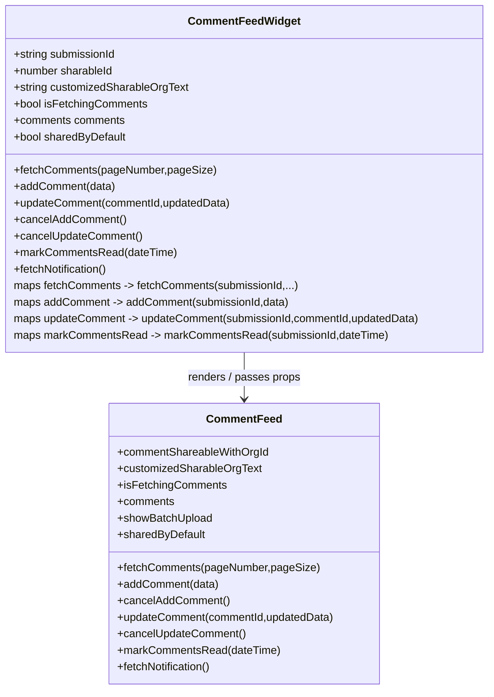

# Diagram: web/portal/src/pages/damageview/details/components/CommentFeedWidget.js


> Auto-generated by Obscura crawlers

## Diagram 1



### SVG

<svg id="container" width="716.3203125" xmlns="http://www.w3.org/2000/svg" class="classDiagram" height="1002" viewBox="0 0 716.3203125 1002" role="graphics-document document" aria-roledescription="class"><style>#container{font-family:"trebuchet ms",verdana,arial,sans-serif;font-size:16px;fill:#333;}@keyframes edge-animation-frame{from{stroke-dashoffset:0;}}@keyframes dash{to{stroke-dashoffset:0;}}#container .edge-animation-slow{stroke-dasharray:9,5!important;stroke-dashoffset:900;animation:dash 50s linear infinite;stroke-linecap:round;}#container .edge-animation-fast{stroke-dasharray:9,5!important;stroke-dashoffset:900;animation:dash 20s linear infinite;stroke-linecap:round;}#container .error-icon{fill:#552222;}#container .error-text{fill:#552222;stroke:#552222;}#container .edge-thickness-normal{stroke-width:1px;}#container .edge-thickness-thick{stroke-width:3.5px;}#container .edge-pattern-solid{stroke-dasharray:0;}#container .edge-thickness-invisible{stroke-width:0;fill:none;}#container .edge-pattern-dashed{stroke-dasharray:3;}#container .edge-pattern-dotted{stroke-dasharray:2;}#container .marker{fill:#333333;stroke:#333333;}#container .marker.cross{stroke:#333333;}#container svg{font-family:"trebuchet ms",verdana,arial,sans-serif;font-size:16px;}#container p{margin:0;}#container g.classGroup text{fill:#9370DB;stroke:none;font-family:"trebuchet ms",verdana,arial,sans-serif;font-size:10px;}#container g.classGroup text .title{font-weight:bolder;}#container .nodeLabel,#container .edgeLabel{color:#131300;}#container .edgeLabel .label rect{fill:#ECECFF;}#container .label text{fill:#131300;}#container .labelBkg{background:#ECECFF;}#container .edgeLabel .label span{background:#ECECFF;}#container .classTitle{font-weight:bolder;}#container .node rect,#container .node circle,#container .node ellipse,#container .node polygon,#container .node path{fill:#ECECFF;stroke:#9370DB;stroke-width:1px;}#container .divider{stroke:#9370DB;stroke-width:1;}#container g.clickable{cursor:pointer;}#container g.classGroup rect{fill:#ECECFF;stroke:#9370DB;}#container g.classGroup line{stroke:#9370DB;stroke-width:1;}#container .classLabel .box{stroke:none;stroke-width:0;fill:#ECECFF;opacity:0.5;}#container .classLabel .label{fill:#9370DB;font-size:10px;}#container .relation{stroke:#333333;stroke-width:1;fill:none;}#container .dashed-line{stroke-dasharray:3;}#container .dotted-line{stroke-dasharray:1 2;}#container #compositionStart,#container .composition{fill:#333333!important;stroke:#333333!important;stroke-width:1;}#container #compositionEnd,#container .composition{fill:#333333!important;stroke:#333333!important;stroke-width:1;}#container #dependencyStart,#container .dependency{fill:#333333!important;stroke:#333333!important;stroke-width:1;}#container #dependencyStart,#container .dependency{fill:#333333!important;stroke:#333333!important;stroke-width:1;}#container #extensionStart,#container .extension{fill:transparent!important;stroke:#333333!important;stroke-width:1;}#container #extensionEnd,#container .extension{fill:transparent!important;stroke:#333333!important;stroke-width:1;}#container #aggregationStart,#container .aggregation{fill:transparent!important;stroke:#333333!important;stroke-width:1;}#container #aggregationEnd,#container .aggregation{fill:transparent!important;stroke:#333333!important;stroke-width:1;}#container #lollipopStart,#container .lollipop{fill:#ECECFF!important;stroke:#333333!important;stroke-width:1;}#container #lollipopEnd,#container .lollipop{fill:#ECECFF!important;stroke:#333333!important;stroke-width:1;}#container .edgeTerminals{font-size:11px;line-height:initial;}#container .classTitleText{text-anchor:middle;font-size:18px;fill:#333;}#container .label-icon{display:inline-block;height:1em;overflow:visible;vertical-align:-0.125em;}#container .node .label-icon path{fill:currentColor;stroke:revert;stroke-width:revert;}#container :root{--mermaid-font-family:"trebuchet ms",verdana,arial,sans-serif;}</style><g><defs><marker id="container_class-aggregationStart" class="marker aggregation class" refX="18" refY="7" markerWidth="190" markerHeight="240" orient="auto"><path d="M 18,7 L9,13 L1,7 L9,1 Z"></path></marker></defs><defs><marker id="container_class-aggregationEnd" class="marker aggregation class" refX="1" refY="7" markerWidth="20" markerHeight="28" orient="auto"><path d="M 18,7 L9,13 L1,7 L9,1 Z"></path></marker></defs><defs><marker id="container_class-extensionStart" class="marker extension class" refX="18" refY="7" markerWidth="190" markerHeight="240" orient="auto"><path d="M 1,7 L18,13 V 1 Z"></path></marker></defs><defs><marker id="container_class-extensionEnd" class="marker extension class" refX="1" refY="7" markerWidth="20" markerHeight="28" orient="auto"><path d="M 1,1 V 13 L18,7 Z"></path></marker></defs><defs><marker id="container_class-compositionStart" class="marker composition class" refX="18" refY="7" markerWidth="190" markerHeight="240" orient="auto"><path d="M 18,7 L9,13 L1,7 L9,1 Z"></path></marker></defs><defs><marker id="container_class-compositionEnd" class="marker composition class" refX="1" refY="7" markerWidth="20" markerHeight="28" orient="auto"><path d="M 18,7 L9,13 L1,7 L9,1 Z"></path></marker></defs><defs><marker id="container_class-dependencyStart" class="marker dependency class" refX="6" refY="7" markerWidth="190" markerHeight="240" orient="auto"><path d="M 5,7 L9,13 L1,7 L9,1 Z"></path></marker></defs><defs><marker id="container_class-dependencyEnd" class="marker dependency class" refX="13" refY="7" markerWidth="20" markerHeight="28" orient="auto"><path d="M 18,7 L9,13 L14,7 L9,1 Z"></path></marker></defs><defs><marker id="container_class-lollipopStart" class="marker lollipop class" refX="13" refY="7" markerWidth="190" markerHeight="240" orient="auto"><circle stroke="black" fill="transparent" cx="7" cy="7" r="6"></circle></marker></defs><defs><marker id="container_class-lollipopEnd" class="marker lollipop class" refX="1" refY="7" markerWidth="190" markerHeight="240" orient="auto"><circle stroke="black" fill="transparent" cx="7" cy="7" r="6"></circle></marker></defs><g class="root"><g class="clusters"></g><g class="edgePaths"><path d="M358.16,512L358.16,518.167C358.16,524.333,358.16,536.667,358.16,548C358.16,559.333,358.16,569.667,358.16,574.833L358.16,580" id="id_CommentFeedWidget_CommentFeed_1" class="edge-thickness-normal edge-pattern-solid relation" style=";;;" data-edge="true" data-et="edge" data-id="id_CommentFeedWidget_CommentFeed_1" data-points="W3sieCI6MzU4LjE2MDE1NjI1LCJ5Ijo1MTJ9LHsieCI6MzU4LjE2MDE1NjI1LCJ5Ijo1NDl9LHsieCI6MzU4LjE2MDE1NjI1LCJ5Ijo1ODZ9XQ==" marker-end="url(#container_class-dependencyEnd)"></path></g><g class="edgeLabels"><g class="edgeLabel" transform="translate(358.16015625, 549)"><g class="label" data-id="id_CommentFeedWidget_CommentFeed_1" transform="translate(-83.4609375, -12)"><foreignObject width="166.921875" height="24"><div xmlns="http://www.w3.org/1999/xhtml" class="labelBkg" style="display: table-cell; white-space: nowrap; line-height: 1.5; max-width: 200px; text-align: center;"><span class="edgeLabel"><p>renders / passes props</p></span></div></foreignObject></g></g></g><g class="nodes"><g class="node default" id="classId-CommentFeedWidget-0" transform="translate(358.16015625, 260)"><g class="basic label-container"><path d="M-350.16015625 -252 L350.16015625 -252 L350.16015625 252 L-350.16015625 252" stroke="none" stroke-width="0" fill="#ECECFF" style=""></path><path d="M-350.16015625 -252 C-139.95739378269926 -252, 70.24536868460149 -252, 350.16015625 -252 M-350.16015625 -252 C-206.09099118554403 -252, -62.021826121088054 -252, 350.16015625 -252 M350.16015625 -252 C350.16015625 -109.39587736635258, 350.16015625 33.20824526729484, 350.16015625 252 M350.16015625 -252 C350.16015625 -87.496849840039, 350.16015625 77.00630031992199, 350.16015625 252 M350.16015625 252 C75.04033120057494 252, -200.07949384885012 252, -350.16015625 252 M350.16015625 252 C192.6113756222374 252, 35.06259499447481 252, -350.16015625 252 M-350.16015625 252 C-350.16015625 100.1186812215673, -350.16015625 -51.7626375568654, -350.16015625 -252 M-350.16015625 252 C-350.16015625 140.47427107658496, -350.16015625 28.948542153169882, -350.16015625 -252" stroke="#9370DB" stroke-width="1.3" fill="none" stroke-dasharray="0 0" style=""></path></g><g class="annotation-group text" transform="translate(0, -228)"></g><g class="label-group text" transform="translate(-77.5703125, -228)"><g class="label" style="font-weight: bolder" transform="translate(0,-12)"><foreignObject width="155.140625" height="24"><div xmlns="http://www.w3.org/1999/xhtml" style="display: table-cell; white-space: nowrap; line-height: 1.5; max-width: 204px; text-align: center;"><span class="nodeLabel markdown-node-label" style=""><p>CommentFeedWidget</p></span></div></foreignObject></g></g><g class="members-group text" transform="translate(-338.16015625, -180)"><g class="label" style="" transform="translate(0,-12)"><foreignObject width="150.6875" height="24"><div xmlns="http://www.w3.org/1999/xhtml" style="display: table-cell; white-space: nowrap; line-height: 1.5; max-width: 208px; text-align: center;"><span class="nodeLabel markdown-node-label" style=""><p>+string submissionId</p></span></div></foreignObject></g><g class="label" style="" transform="translate(0,12)"><foreignObject width="146.03125" height="24"><div xmlns="http://www.w3.org/1999/xhtml" style="display: table-cell; white-space: nowrap; line-height: 1.5; max-width: 203px; text-align: center;"><span class="nodeLabel markdown-node-label" style=""><p>+number sharableId</p></span></div></foreignObject></g><g class="label" style="" transform="translate(0,36)"><foreignObject width="255.1875" height="24"><div xmlns="http://www.w3.org/1999/xhtml" style="display: table-cell; white-space: nowrap; line-height: 1.5; max-width: 313px; text-align: center;"><span class="nodeLabel markdown-node-label" style=""><p>+string customizedSharableOrgText</p></span></div></foreignObject></g><g class="label" style="" transform="translate(0,60)"><foreignObject width="194.625" height="24"><div xmlns="http://www.w3.org/1999/xhtml" style="display: table-cell; white-space: nowrap; line-height: 1.5; max-width: 252px; text-align: center;"><span class="nodeLabel markdown-node-label" style=""><p>+bool isFetchingComments</p></span></div></foreignObject></g><g class="label" style="" transform="translate(0,84)"><foreignObject width="163.109375" height="24"><div xmlns="http://www.w3.org/1999/xhtml" style="display: table-cell; white-space: nowrap; line-height: 1.5; max-width: 220px; text-align: center;"><span class="nodeLabel markdown-node-label" style=""><p>+comments comments</p></span></div></foreignObject></g><g class="label" style="" transform="translate(0,108)"><foreignObject width="164.765625" height="24"><div xmlns="http://www.w3.org/1999/xhtml" style="display: table-cell; white-space: nowrap; line-height: 1.5; max-width: 222px; text-align: center;"><span class="nodeLabel markdown-node-label" style=""><p>+bool sharedByDefault</p></span></div></foreignObject></g></g><g class="methods-group text" transform="translate(-338.16015625, -12)"><g class="label" style="" transform="translate(0,-12)"><foreignObject width="290.4375" height="24"><div xmlns="http://www.w3.org/1999/xhtml" style="display: table-cell; white-space: nowrap; line-height: 1.5; max-width: 348px; text-align: center;"><span class="nodeLabel markdown-node-label" style=""><p>+fetchComments(pageNumber,pageSize)</p></span></div></foreignObject></g><g class="label" style="" transform="translate(0,12)"><foreignObject width="147.875" height="24"><div xmlns="http://www.w3.org/1999/xhtml" style="display: table-cell; white-space: nowrap; line-height: 1.5; max-width: 205px; text-align: center;"><span class="nodeLabel markdown-node-label" style=""><p>+addComment(data)</p></span></div></foreignObject></g><g class="label" style="" transform="translate(0,36)"><foreignObject width="319.046875" height="24"><div xmlns="http://www.w3.org/1999/xhtml" style="display: table-cell; white-space: nowrap; line-height: 1.5; max-width: 376px; text-align: center;"><span class="nodeLabel markdown-node-label" style=""><p>+updateComment(commentId,updatedData)</p></span></div></foreignObject></g><g class="label" style="" transform="translate(0,60)"><foreignObject width="162.25" height="24"><div xmlns="http://www.w3.org/1999/xhtml" style="display: table-cell; white-space: nowrap; line-height: 1.5; max-width: 220px; text-align: center;"><span class="nodeLabel markdown-node-label" style=""><p>+cancelAddComment()</p></span></div></foreignObject></g><g class="label" style="" transform="translate(0,84)"><foreignObject width="186.5625" height="24"><div xmlns="http://www.w3.org/1999/xhtml" style="display: table-cell; white-space: nowrap; line-height: 1.5; max-width: 244px; text-align: center;"><span class="nodeLabel markdown-node-label" style=""><p>+cancelUpdateComment()</p></span></div></foreignObject></g><g class="label" style="" transform="translate(0,108)"><foreignObject width="235.90625" height="24"><div xmlns="http://www.w3.org/1999/xhtml" style="display: table-cell; white-space: nowrap; line-height: 1.5; max-width: 293px; text-align: center;"><span class="nodeLabel markdown-node-label" style=""><p>+markCommentsRead(dateTime)</p></span></div></foreignObject></g><g class="label" style="" transform="translate(0,132)"><foreignObject width="139.5625" height="24"><div xmlns="http://www.w3.org/1999/xhtml" style="display: table-cell; white-space: nowrap; line-height: 1.5; max-width: 197px; text-align: center;"><span class="nodeLabel markdown-node-label" style=""><p>+fetchNotification()</p></span></div></foreignObject></g><g class="label" style="" transform="translate(0,156)"><foreignObject width="415.578125" height="24"><div xmlns="http://www.w3.org/1999/xhtml" style="display: table-cell; white-space: nowrap; line-height: 1.5; max-width: 487px; text-align: center;"><span class="nodeLabel markdown-node-label" style=""><p>maps fetchComments -&gt; fetchComments(submissionId,...)</p></span></div></foreignObject></g><g class="label" style="" transform="translate(0,180)"><foreignObject width="404.3125" height="24"><div xmlns="http://www.w3.org/1999/xhtml" style="display: table-cell; white-space: nowrap; line-height: 1.5; max-width: 476px; text-align: center;"><span class="nodeLabel markdown-node-label" style=""><p>maps addComment -&gt; addComment(submissionId,data)</p></span></div></foreignObject></g><g class="label" style="" transform="translate(0,204)"><foreignObject width="598.75" height="24"><div xmlns="http://www.w3.org/1999/xhtml" style="display: table-cell; white-space: nowrap; line-height: 1.5; max-width: 670px; text-align: center;"><span class="nodeLabel markdown-node-label" style=""><p>maps updateComment -&gt; updateComment(submissionId,commentId,updatedData)</p></span></div></foreignObject></g><g class="label" style="" transform="translate(0,228)"><foreignObject width="544.796875" height="24"><div xmlns="http://www.w3.org/1999/xhtml" style="display: table-cell; white-space: nowrap; line-height: 1.5; max-width: 616px; text-align: center;"><span class="nodeLabel markdown-node-label" style=""><p>maps markCommentsRead -&gt; markCommentsRead(submissionId,dateTime)</p></span></div></foreignObject></g></g><g class="divider" style=""><path d="M-350.16015625 -204 C-180.8114569255122 -204, -11.462757601024407 -204, 350.16015625 -204 M-350.16015625 -204 C-96.81077308707489 -204, 156.53861007585022 -204, 350.16015625 -204" stroke="#9370DB" stroke-width="1.3" fill="none" stroke-dasharray="0 0" style=""></path></g><g class="divider" style=""><path d="M-350.16015625 -36 C-131.79101321834727 -36, 86.57812981330545 -36, 350.16015625 -36 M-350.16015625 -36 C-85.87091425564307 -36, 178.41832773871386 -36, 350.16015625 -36" stroke="#9370DB" stroke-width="1.3" fill="none" stroke-dasharray="0 0" style=""></path></g></g><g class="node default" id="classId-CommentFeed-1" transform="translate(358.16015625, 790)"><g class="basic label-container"><path d="M-197.52734375 -204 L197.52734375 -204 L197.52734375 204 L-197.52734375 204" stroke="none" stroke-width="0" fill="#ECECFF" style=""></path><path d="M-197.52734375 -204 C-115.15434715785038 -204, -32.78135056570076 -204, 197.52734375 -204 M-197.52734375 -204 C-72.84151193681711 -204, 51.84431987636577 -204, 197.52734375 -204 M197.52734375 -204 C197.52734375 -71.78614139583041, 197.52734375 60.427717208339175, 197.52734375 204 M197.52734375 -204 C197.52734375 -109.34726153919667, 197.52734375 -14.694523078393331, 197.52734375 204 M197.52734375 204 C42.96769886873733 204, -111.59194601252534 204, -197.52734375 204 M197.52734375 204 C74.32215316919464 204, -48.88303741161073 204, -197.52734375 204 M-197.52734375 204 C-197.52734375 105.73826538424211, -197.52734375 7.476530768484224, -197.52734375 -204 M-197.52734375 204 C-197.52734375 46.816957076443515, -197.52734375 -110.36608584711297, -197.52734375 -204" stroke="#9370DB" stroke-width="1.3" fill="none" stroke-dasharray="0 0" style=""></path></g><g class="annotation-group text" transform="translate(0, -180)"></g><g class="label-group text" transform="translate(-52.0078125, -180)"><g class="label" style="font-weight: bolder" transform="translate(0,-12)"><foreignObject width="104.015625" height="24"><div xmlns="http://www.w3.org/1999/xhtml" style="display: table-cell; white-space: nowrap; line-height: 1.5; max-width: 154px; text-align: center;"><span class="nodeLabel markdown-node-label" style=""><p>CommentFeed</p></span></div></foreignObject></g></g><g class="members-group text" transform="translate(-185.52734375, -132)"><g class="label" style="" transform="translate(0,-12)"><foreignObject width="221.046875" height="24"><div xmlns="http://www.w3.org/1999/xhtml" style="display: table-cell; white-space: nowrap; line-height: 1.5; max-width: 278px; text-align: center;"><span class="nodeLabel markdown-node-label" style=""><p>+commentShareableWithOrgId</p></span></div></foreignObject></g><g class="label" style="" transform="translate(0,12)"><foreignObject width="209.3125" height="24"><div xmlns="http://www.w3.org/1999/xhtml" style="display: table-cell; white-space: nowrap; line-height: 1.5; max-width: 267px; text-align: center;"><span class="nodeLabel markdown-node-label" style=""><p>+customizedSharableOrgText</p></span></div></foreignObject></g><g class="label" style="" transform="translate(0,36)"><foreignObject width="157.515625" height="24"><div xmlns="http://www.w3.org/1999/xhtml" style="display: table-cell; white-space: nowrap; line-height: 1.5; max-width: 215px; text-align: center;"><span class="nodeLabel markdown-node-label" style=""><p>+isFetchingComments</p></span></div></foreignObject></g><g class="label" style="" transform="translate(0,60)"><foreignObject width="83.4375" height="24"><div xmlns="http://www.w3.org/1999/xhtml" style="display: table-cell; white-space: nowrap; line-height: 1.5; max-width: 141px; text-align: center;"><span class="nodeLabel markdown-node-label" style=""><p>+comments</p></span></div></foreignObject></g><g class="label" style="" transform="translate(0,84)"><foreignObject width="138.8125" height="24"><div xmlns="http://www.w3.org/1999/xhtml" style="display: table-cell; white-space: nowrap; line-height: 1.5; max-width: 196px; text-align: center;"><span class="nodeLabel markdown-node-label" style=""><p>+showBatchUpload</p></span></div></foreignObject></g><g class="label" style="" transform="translate(0,108)"><foreignObject width="127.640625" height="24"><div xmlns="http://www.w3.org/1999/xhtml" style="display: table-cell; white-space: nowrap; line-height: 1.5; max-width: 185px; text-align: center;"><span class="nodeLabel markdown-node-label" style=""><p>+sharedByDefault</p></span></div></foreignObject></g></g><g class="methods-group text" transform="translate(-185.52734375, 36)"><g class="label" style="" transform="translate(0,-12)"><foreignObject width="290.4375" height="24"><div xmlns="http://www.w3.org/1999/xhtml" style="display: table-cell; white-space: nowrap; line-height: 1.5; max-width: 348px; text-align: center;"><span class="nodeLabel markdown-node-label" style=""><p>+fetchComments(pageNumber,pageSize)</p></span></div></foreignObject></g><g class="label" style="" transform="translate(0,12)"><foreignObject width="147.875" height="24"><div xmlns="http://www.w3.org/1999/xhtml" style="display: table-cell; white-space: nowrap; line-height: 1.5; max-width: 205px; text-align: center;"><span class="nodeLabel markdown-node-label" style=""><p>+addComment(data)</p></span></div></foreignObject></g><g class="label" style="" transform="translate(0,36)"><foreignObject width="162.25" height="24"><div xmlns="http://www.w3.org/1999/xhtml" style="display: table-cell; white-space: nowrap; line-height: 1.5; max-width: 220px; text-align: center;"><span class="nodeLabel markdown-node-label" style=""><p>+cancelAddComment()</p></span></div></foreignObject></g><g class="label" style="" transform="translate(0,60)"><foreignObject width="319.046875" height="24"><div xmlns="http://www.w3.org/1999/xhtml" style="display: table-cell; white-space: nowrap; line-height: 1.5; max-width: 376px; text-align: center;"><span class="nodeLabel markdown-node-label" style=""><p>+updateComment(commentId,updatedData)</p></span></div></foreignObject></g><g class="label" style="" transform="translate(0,84)"><foreignObject width="186.5625" height="24"><div xmlns="http://www.w3.org/1999/xhtml" style="display: table-cell; white-space: nowrap; line-height: 1.5; max-width: 244px; text-align: center;"><span class="nodeLabel markdown-node-label" style=""><p>+cancelUpdateComment()</p></span></div></foreignObject></g><g class="label" style="" transform="translate(0,108)"><foreignObject width="235.90625" height="24"><div xmlns="http://www.w3.org/1999/xhtml" style="display: table-cell; white-space: nowrap; line-height: 1.5; max-width: 293px; text-align: center;"><span class="nodeLabel markdown-node-label" style=""><p>+markCommentsRead(dateTime)</p></span></div></foreignObject></g><g class="label" style="" transform="translate(0,132)"><foreignObject width="139.5625" height="24"><div xmlns="http://www.w3.org/1999/xhtml" style="display: table-cell; white-space: nowrap; line-height: 1.5; max-width: 197px; text-align: center;"><span class="nodeLabel markdown-node-label" style=""><p>+fetchNotification()</p></span></div></foreignObject></g></g><g class="divider" style=""><path d="M-197.52734375 -156 C-95.78047077157832 -156, 5.966402206843355 -156, 197.52734375 -156 M-197.52734375 -156 C-45.07866105894496 -156, 107.37002163211008 -156, 197.52734375 -156" stroke="#9370DB" stroke-width="1.3" fill="none" stroke-dasharray="0 0" style=""></path></g><g class="divider" style=""><path d="M-197.52734375 12 C-78.43275887242025 12, 40.6618260051595 12, 197.52734375 12 M-197.52734375 12 C-46.421204028169285 12, 104.68493569366143 12, 197.52734375 12" stroke="#9370DB" stroke-width="1.3" fill="none" stroke-dasharray="0 0" style=""></path></g></g></g></g></g></svg>

## Diagram 2

```mermaid
flowchart TD
    ExternalAPIs[External APIs / Services]
    ParentComponent[Parent Component]
    CommentFeedWidgetNode[CommentFeedWidget]
    CommentFeedNode[CommentFeed]
    User[User Interaction]
    Store[State / Props Source]
    NotificationService[Notification Service]

    ExternalAPIs -->|provides fetchComments/add/update/mark| CommentFeedWidgetNode
    ParentComponent -->|passes submissionId, sharableId, text, handlers| CommentFeedWidgetNode
    Store -->|provides isFetchingComments & comments| CommentFeedWidgetNode
    User -->|adds/updates/comments| CommentFeedWidgetNode
    CommentFeedWidgetNode -->|render props / handlers| CommentFeedNode
    CommentFeedNode -->|calls fetchComments(page,pageSize)| ExternalAPIs
    CommentFeedNode -->|calls addComment(data)| ExternalAPIs
    CommentFeedNode -->|calls updateComment(id,data)| ExternalAPIs
    CommentFeedNode -->|calls markCommentsRead(dateTime)| ExternalAPIs
    CommentFeedNode -->|emit notifications| NotificationService
    NotificationService -->|fetchNotification| CommentFeedWidgetNode
```

> SVG rendering failed for this diagram.
