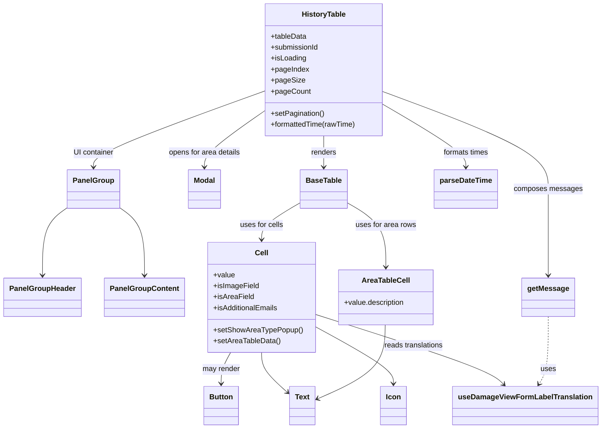

# Diagram: web/portal/src/pages/damageview/details/components/HistoryTable.js


> Auto-generated by Obscura crawlers

## Diagram 1



### SVG

<svg id="container" width="1272.2265625" xmlns="http://www.w3.org/2000/svg" class="classDiagram" height="934" viewBox="0 0 1272.2265625 934" role="graphics-document document" aria-roledescription="class"><style>#container{font-family:"trebuchet ms",verdana,arial,sans-serif;font-size:16px;fill:#333;}@keyframes edge-animation-frame{from{stroke-dashoffset:0;}}@keyframes dash{to{stroke-dashoffset:0;}}#container .edge-animation-slow{stroke-dasharray:9,5!important;stroke-dashoffset:900;animation:dash 50s linear infinite;stroke-linecap:round;}#container .edge-animation-fast{stroke-dasharray:9,5!important;stroke-dashoffset:900;animation:dash 20s linear infinite;stroke-linecap:round;}#container .error-icon{fill:#552222;}#container .error-text{fill:#552222;stroke:#552222;}#container .edge-thickness-normal{stroke-width:1px;}#container .edge-thickness-thick{stroke-width:3.5px;}#container .edge-pattern-solid{stroke-dasharray:0;}#container .edge-thickness-invisible{stroke-width:0;fill:none;}#container .edge-pattern-dashed{stroke-dasharray:3;}#container .edge-pattern-dotted{stroke-dasharray:2;}#container .marker{fill:#333333;stroke:#333333;}#container .marker.cross{stroke:#333333;}#container svg{font-family:"trebuchet ms",verdana,arial,sans-serif;font-size:16px;}#container p{margin:0;}#container g.classGroup text{fill:#9370DB;stroke:none;font-family:"trebuchet ms",verdana,arial,sans-serif;font-size:10px;}#container g.classGroup text .title{font-weight:bolder;}#container .nodeLabel,#container .edgeLabel{color:#131300;}#container .edgeLabel .label rect{fill:#ECECFF;}#container .label text{fill:#131300;}#container .labelBkg{background:#ECECFF;}#container .edgeLabel .label span{background:#ECECFF;}#container .classTitle{font-weight:bolder;}#container .node rect,#container .node circle,#container .node ellipse,#container .node polygon,#container .node path{fill:#ECECFF;stroke:#9370DB;stroke-width:1px;}#container .divider{stroke:#9370DB;stroke-width:1;}#container g.clickable{cursor:pointer;}#container g.classGroup rect{fill:#ECECFF;stroke:#9370DB;}#container g.classGroup line{stroke:#9370DB;stroke-width:1;}#container .classLabel .box{stroke:none;stroke-width:0;fill:#ECECFF;opacity:0.5;}#container .classLabel .label{fill:#9370DB;font-size:10px;}#container .relation{stroke:#333333;stroke-width:1;fill:none;}#container .dashed-line{stroke-dasharray:3;}#container .dotted-line{stroke-dasharray:1 2;}#container #compositionStart,#container .composition{fill:#333333!important;stroke:#333333!important;stroke-width:1;}#container #compositionEnd,#container .composition{fill:#333333!important;stroke:#333333!important;stroke-width:1;}#container #dependencyStart,#container .dependency{fill:#333333!important;stroke:#333333!important;stroke-width:1;}#container #dependencyStart,#container .dependency{fill:#333333!important;stroke:#333333!important;stroke-width:1;}#container #extensionStart,#container .extension{fill:transparent!important;stroke:#333333!important;stroke-width:1;}#container #extensionEnd,#container .extension{fill:transparent!important;stroke:#333333!important;stroke-width:1;}#container #aggregationStart,#container .aggregation{fill:transparent!important;stroke:#333333!important;stroke-width:1;}#container #aggregationEnd,#container .aggregation{fill:transparent!important;stroke:#333333!important;stroke-width:1;}#container #lollipopStart,#container .lollipop{fill:#ECECFF!important;stroke:#333333!important;stroke-width:1;}#container #lollipopEnd,#container .lollipop{fill:#ECECFF!important;stroke:#333333!important;stroke-width:1;}#container .edgeTerminals{font-size:11px;line-height:initial;}#container .classTitleText{text-anchor:middle;font-size:18px;fill:#333;}#container .label-icon{display:inline-block;height:1em;overflow:visible;vertical-align:-0.125em;}#container .node .label-icon path{fill:currentColor;stroke:revert;stroke-width:revert;}#container :root{--mermaid-font-family:"trebuchet ms",verdana,arial,sans-serif;}</style><g><defs><marker id="container_class-aggregationStart" class="marker aggregation class" refX="18" refY="7" markerWidth="190" markerHeight="240" orient="auto"><path d="M 18,7 L9,13 L1,7 L9,1 Z"></path></marker></defs><defs><marker id="container_class-aggregationEnd" class="marker aggregation class" refX="1" refY="7" markerWidth="20" markerHeight="28" orient="auto"><path d="M 18,7 L9,13 L1,7 L9,1 Z"></path></marker></defs><defs><marker id="container_class-extensionStart" class="marker extension class" refX="18" refY="7" markerWidth="190" markerHeight="240" orient="auto"><path d="M 1,7 L18,13 V 1 Z"></path></marker></defs><defs><marker id="container_class-extensionEnd" class="marker extension class" refX="1" refY="7" markerWidth="20" markerHeight="28" orient="auto"><path d="M 1,1 V 13 L18,7 Z"></path></marker></defs><defs><marker id="container_class-compositionStart" class="marker composition class" refX="18" refY="7" markerWidth="190" markerHeight="240" orient="auto"><path d="M 18,7 L9,13 L1,7 L9,1 Z"></path></marker></defs><defs><marker id="container_class-compositionEnd" class="marker composition class" refX="1" refY="7" markerWidth="20" markerHeight="28" orient="auto"><path d="M 18,7 L9,13 L1,7 L9,1 Z"></path></marker></defs><defs><marker id="container_class-dependencyStart" class="marker dependency class" refX="6" refY="7" markerWidth="190" markerHeight="240" orient="auto"><path d="M 5,7 L9,13 L1,7 L9,1 Z"></path></marker></defs><defs><marker id="container_class-dependencyEnd" class="marker dependency class" refX="13" refY="7" markerWidth="20" markerHeight="28" orient="auto"><path d="M 18,7 L9,13 L14,7 L9,1 Z"></path></marker></defs><defs><marker id="container_class-lollipopStart" class="marker lollipop class" refX="13" refY="7" markerWidth="190" markerHeight="240" orient="auto"><circle stroke="black" fill="transparent" cx="7" cy="7" r="6"></circle></marker></defs><defs><marker id="container_class-lollipopEnd" class="marker lollipop class" refX="1" refY="7" markerWidth="190" markerHeight="240" orient="auto"><circle stroke="black" fill="transparent" cx="7" cy="7" r="6"></circle></marker></defs><g class="root"><g class="clusters"></g><g class="edgePaths"><path d="M684.424,296L684.424,302.167C684.424,308.333,684.424,320.667,684.424,332C684.424,343.333,684.424,353.667,684.424,358.833L684.424,364" id="id_HistoryTable_BaseTable_1" class="edge-thickness-normal edge-pattern-solid relation" style=";;;" data-edge="true" data-et="edge" data-id="id_HistoryTable_BaseTable_1" data-points="W3sieCI6Njg0LjQyMzgyODEyNSwieSI6Mjk2fSx7IngiOjY4NC40MjM4MjgxMjUsInkiOjMzM30seyJ4Ijo2ODQuNDIzODI4MTI1LCJ5IjozNzB9XQ==" marker-end="url(#container_class-dependencyEnd)"></path><path d="M555.799,244.084L535.099,258.903C514.398,273.722,472.998,303.361,452.298,323.347C431.598,343.333,431.598,353.667,431.598,358.833L431.598,364" id="id_HistoryTable_Modal_2" class="edge-thickness-normal edge-pattern-solid relation" style=";;;" data-edge="true" data-et="edge" data-id="id_HistoryTable_Modal_2" data-points="W3sieCI6NTU1Ljc5ODgyODEyNSwieSI6MjQ0LjA4MzUyNDUzMTI3NTM0fSx7IngiOjQzMS41OTc2NTYyNSwieSI6MzMzfSx7IngiOjQzMS41OTc2NTYyNSwieSI6MzcwfV0=" marker-end="url(#container_class-dependencyEnd)"></path><path d="M555.799,199.643L495.794,221.869C435.789,244.096,315.779,288.548,255.774,315.941C195.77,343.333,195.77,353.667,195.77,358.833L195.77,364" id="id_HistoryTable_PanelGroup_3" class="edge-thickness-normal edge-pattern-solid relation" style=";;;" data-edge="true" data-et="edge" data-id="id_HistoryTable_PanelGroup_3" data-points="W3sieCI6NTU1Ljc5ODgyODEyNSwieSI6MTk5LjY0MzM0NDQ4NDgxMzZ9LHsieCI6MTk1Ljc2OTUzMTI1LCJ5IjozMzN9LHsieCI6MTk1Ljc2OTUzMTI1LCJ5IjozNzB9XQ==" marker-end="url(#container_class-dependencyEnd)"></path><path d="M141.441,452.125L132.669,458.604C123.896,465.083,106.35,478.042,97.577,502.687C88.805,527.333,88.805,563.667,88.805,581.833L88.805,600" id="id_PanelGroup_PanelGroupHeader_4" class="edge-thickness-normal edge-pattern-solid relation" style=";;;" data-edge="true" data-et="edge" data-id="id_PanelGroup_PanelGroupHeader_4" data-points="W3sieCI6MTQxLjQ0MTQwNjI1LCJ5Ijo0NTIuMTI0NjAyODU1Nzg2NH0seyJ4Ijo4OC44MDQ2ODc1LCJ5Ijo0OTF9LHsieCI6ODguODA0Njg3NSwieSI6NjA2fV0=" marker-end="url(#container_class-dependencyEnd)"></path><path d="M250.098,452.125L258.87,458.604C267.643,465.083,285.189,478.042,293.962,502.687C302.734,527.333,302.734,563.667,302.734,581.833L302.734,600" id="id_PanelGroup_PanelGroupContent_5" class="edge-thickness-normal edge-pattern-solid relation" style=";;;" data-edge="true" data-et="edge" data-id="id_PanelGroup_PanelGroupContent_5" data-points="W3sieCI6MjUwLjA5NzY1NjI1LCJ5Ijo0NTIuMTI0NjAyODU1Nzg2NH0seyJ4IjozMDIuNzM0Mzc1LCJ5Ijo0OTF9LHsieCI6MzAyLjczNDM3NSwieSI6NjA2fV0=" marker-end="url(#container_class-dependencyEnd)"></path><path d="M635.064,441.106L620.963,449.422C606.861,457.738,578.657,474.369,564.555,487.851C550.453,501.333,550.453,511.667,550.453,516.833L550.453,522" id="id_BaseTable_Cell_6" class="edge-thickness-normal edge-pattern-solid relation" style=";;;" data-edge="true" data-et="edge" data-id="id_BaseTable_Cell_6" data-points="W3sieCI6NjM1LjA2NDQ1MzEyNSwieSI6NDQxLjEwNjI5MzY0NTEyNDE0fSx7IngiOjU1MC40NTMxMjUsInkiOjQ5MX0seyJ4Ijo1NTAuNDUzMTI1LCJ5Ijo1Mjh9XQ==" marker-end="url(#container_class-dependencyEnd)"></path><path d="M733.783,441.106L747.885,449.422C761.987,457.738,790.191,474.369,804.293,497.851C818.395,521.333,818.395,551.667,818.395,566.833L818.395,582" id="id_BaseTable_AreaTableCell_7" class="edge-thickness-normal edge-pattern-solid relation" style=";;;" data-edge="true" data-et="edge" data-id="id_BaseTable_AreaTableCell_7" data-points="W3sieCI6NzMzLjc4MzIwMzEyNSwieSI6NDQxLjEwNjI5MzY0NTEyNDE0fSx7IngiOjgxOC4zOTQ1MzEyNSwieSI6NDkxfSx7IngiOjgxOC4zOTQ1MzEyNSwieSI6NTg4fV0=" marker-end="url(#container_class-dependencyEnd)"></path><path d="M483.386,768L479.94,774.167C476.493,780.333,469.6,792.667,466.154,804C462.707,815.333,462.707,825.667,462.707,830.833L462.707,836" id="id_Cell_Button_8" class="edge-thickness-normal edge-pattern-solid relation" style=";;;" data-edge="true" data-et="edge" data-id="id_Cell_Button_8" data-points="W3sieCI6NDgzLjM4NjA0Njk3NDUyMjMsInkiOjc2OH0seyJ4Ijo0NjIuNzA3MDMxMjUsInkiOjgwNX0seyJ4Ijo0NjIuNzA3MDMxMjUsInkiOjg0Mn1d" marker-end="url(#container_class-dependencyEnd)"></path><path d="M550.453,768L550.453,774.167C550.453,780.333,550.453,792.667,559.752,807.216C569.05,821.766,587.648,838.531,596.946,846.914L606.245,855.297" id="id_Cell_Text_9" class="edge-thickness-normal edge-pattern-solid relation" style=";;;" data-edge="true" data-et="edge" data-id="id_Cell_Text_9" data-points="W3sieCI6NTUwLjQ1MzEyNSwieSI6NzY4fSx7IngiOjU1MC40NTMxMjUsInkiOjgwNX0seyJ4Ijo2MTAuNzAxMTcxODc1LCJ5Ijo4NTkuMzE0MTUwNzEyMTA0N31d" marker-end="url(#container_class-dependencyEnd)"></path><path d="M665.047,711.362L693.272,726.968C721.497,742.574,777.948,773.787,806.173,794.56C834.398,815.333,834.398,825.667,834.398,830.833L834.398,836" id="id_Cell_Icon_10" class="edge-thickness-normal edge-pattern-solid relation" style=";;;" data-edge="true" data-et="edge" data-id="id_Cell_Icon_10" data-points="W3sieCI6NjY1LjA0Njg3NSwieSI6NzExLjM2MTU2MjgwMDkzNTV9LHsieCI6ODM0LjM5ODQzNzUsInkiOjgwNX0seyJ4Ijo4MzQuMzk4NDM3NSwieSI6ODQyfV0=" marker-end="url(#container_class-dependencyEnd)"></path><path d="M665.047,684.938L727.126,704.948C789.204,724.959,913.362,764.979,980.676,790.435C1047.989,815.891,1058.459,826.783,1063.694,832.229L1068.929,837.674" id="id_Cell_useDamageViewFormLabelTranslation_11" class="edge-thickness-normal edge-pattern-solid relation" style=";;;" data-edge="true" data-et="edge" data-id="id_Cell_useDamageViewFormLabelTranslation_11" data-points="W3sieCI6NjY1LjA0Njg3NSwieSI6Njg0LjkzNzkxNzUzODgzNjZ9LHsieCI6MTAzNy41MTk1MzEyNSwieSI6ODA1fSx7IngiOjEwNzMuMDg3MDI1MzE2NDU1OCwieSI6ODQyfV0=" marker-end="url(#container_class-dependencyEnd)"></path><path d="M813.049,228.475L842.349,245.896C871.65,263.317,930.251,298.158,959.551,320.746C988.852,343.333,988.852,353.667,988.852,358.833L988.852,364" id="id_HistoryTable_parseDateTime_12" class="edge-thickness-normal edge-pattern-solid relation" style=";;;" data-edge="true" data-et="edge" data-id="id_HistoryTable_parseDateTime_12" data-points="W3sieCI6ODEzLjA0ODgyODEyNSwieSI6MjI4LjQ3NTA0NjAzMjgzNTY4fSx7IngiOjk4OC44NTE1NjI1LCJ5IjozMzN9LHsieCI6OTg4Ljg1MTU2MjUsInkiOjM3MH1d" marker-end="url(#container_class-dependencyEnd)"></path><path d="M1164.453,690L1164.453,709.167C1164.453,728.333,1164.453,766.667,1161.015,791.16C1157.577,815.653,1150.701,826.306,1147.263,831.632L1143.825,836.959" id="id_getMessage_useDamageViewFormLabelTranslation_13" class="edge-thickness-normal edge-pattern-dashed relation" style=";;;" data-edge="true" data-et="edge" data-id="id_getMessage_useDamageViewFormLabelTranslation_13" data-points="W3sieCI6MTE2NC40NTMxMjUsInkiOjY5MH0seyJ4IjoxMTY0LjQ1MzEyNSwieSI6ODA1fSx7IngiOjExNDAuNTcwNzA4MDY5NjIwMiwieSI6ODQyfV0=" marker-end="url(#container_class-dependencyEnd)"></path><path d="M813.049,200.499L871.616,222.583C930.184,244.666,1047.318,288.833,1105.886,324.083C1164.453,359.333,1164.453,385.667,1164.453,412C1164.453,438.333,1164.453,464.667,1164.453,496C1164.453,527.333,1164.453,563.667,1164.453,581.833L1164.453,600" id="id_HistoryTable_getMessage_14" class="edge-thickness-normal edge-pattern-solid relation" style=";;;" data-edge="true" data-et="edge" data-id="id_HistoryTable_getMessage_14" data-points="W3sieCI6ODEzLjA0ODgyODEyNSwieSI6MjAwLjQ5OTM4MzU4MjU0NTAyfSx7IngiOjExNjQuNDUzMTI1LCJ5IjozMzN9LHsieCI6MTE2NC40NTMxMjUsInkiOjQxMn0seyJ4IjoxMTY0LjQ1MzEyNSwieSI6NDkxfSx7IngiOjExNjQuNDUzMTI1LCJ5Ijo2MDZ9XQ==" marker-end="url(#container_class-dependencyEnd)"></path><path d="M816.867,708L816.456,724.167C816.044,740.333,815.221,772.667,790.901,799.546C766.58,826.426,718.761,847.852,694.852,858.565L670.942,869.277" id="id_AreaTableCell_Text_15" class="edge-thickness-normal edge-pattern-solid relation" style=";;;" data-edge="true" data-et="edge" data-id="id_AreaTableCell_Text_15" data-points="W3sieCI6ODE2Ljg2NzM2MTY2NDAxMjcsInkiOjcwOH0seyJ4Ijo4MTQuMzk4NDM3NSwieSI6ODA1fSx7IngiOjY2NS40NjY3OTY4NzUsInkiOjg3MS43MzA3NzIyMTMxNzU2fV0=" marker-end="url(#container_class-dependencyEnd)"></path></g><g class="edgeLabels"><g class="edgeLabel" transform="translate(684.423828125, 333)"><g class="label" data-id="id_HistoryTable_BaseTable_1" transform="translate(-27.75, -12)"><foreignObject width="55.5" height="24"><div xmlns="http://www.w3.org/1999/xhtml" class="labelBkg" style="display: table-cell; white-space: nowrap; line-height: 1.5; max-width: 200px; text-align: center;"><span class="edgeLabel"><p>renders</p></span></div></foreignObject></g></g><g class="edgeLabel" transform="translate(431.59765625, 333)"><g class="label" data-id="id_HistoryTable_Modal_2" transform="translate(-79.4296875, -12)"><foreignObject width="158.859375" height="24"><div xmlns="http://www.w3.org/1999/xhtml" class="labelBkg" style="display: table-cell; white-space: nowrap; line-height: 1.5; max-width: 200px; text-align: center;"><span class="edgeLabel"><p>opens for area details</p></span></div></foreignObject></g></g><g class="edgeLabel" transform="translate(195.76953125, 333)"><g class="label" data-id="id_HistoryTable_PanelGroup_3" transform="translate(-44.3828125, -12)"><foreignObject width="88.765625" height="24"><div xmlns="http://www.w3.org/1999/xhtml" class="labelBkg" style="display: table-cell; white-space: nowrap; line-height: 1.5; max-width: 200px; text-align: center;"><span class="edgeLabel"><p>UI container</p></span></div></foreignObject></g></g><g class="edgeLabel"><g class="label" data-id="id_PanelGroup_PanelGroupHeader_4" transform="translate(0, 0)"><foreignObject width="0" height="0"><div xmlns="http://www.w3.org/1999/xhtml" class="labelBkg" style="display: table-cell; white-space: nowrap; line-height: 1.5; max-width: 200px; text-align: center;"><span class="edgeLabel"></span></div></foreignObject></g></g><g class="edgeLabel"><g class="label" data-id="id_PanelGroup_PanelGroupContent_5" transform="translate(0, 0)"><foreignObject width="0" height="0"><div xmlns="http://www.w3.org/1999/xhtml" class="labelBkg" style="display: table-cell; white-space: nowrap; line-height: 1.5; max-width: 200px; text-align: center;"><span class="edgeLabel"></span></div></foreignObject></g></g><g class="edgeLabel" transform="translate(550.453125, 491)"><g class="label" data-id="id_BaseTable_Cell_6" transform="translate(-47.5390625, -12)"><foreignObject width="95.078125" height="24"><div xmlns="http://www.w3.org/1999/xhtml" class="labelBkg" style="display: table-cell; white-space: nowrap; line-height: 1.5; max-width: 200px; text-align: center;"><span class="edgeLabel"><p>uses for cells</p></span></div></foreignObject></g></g><g class="edgeLabel" transform="translate(818.39453125, 491)"><g class="label" data-id="id_BaseTable_AreaTableCell_7" transform="translate(-66.0390625, -12)"><foreignObject width="132.078125" height="24"><div xmlns="http://www.w3.org/1999/xhtml" class="labelBkg" style="display: table-cell; white-space: nowrap; line-height: 1.5; max-width: 200px; text-align: center;"><span class="edgeLabel"><p>uses for area rows</p></span></div></foreignObject></g></g><g class="edgeLabel" transform="translate(462.70703125, 805)"><g class="label" data-id="id_Cell_Button_8" transform="translate(-41.2734375, -12)"><foreignObject width="82.546875" height="24"><div xmlns="http://www.w3.org/1999/xhtml" class="labelBkg" style="display: table-cell; white-space: nowrap; line-height: 1.5; max-width: 200px; text-align: center;"><span class="edgeLabel"><p>may render</p></span></div></foreignObject></g></g><g class="edgeLabel"><g class="label" data-id="id_Cell_Text_9" transform="translate(0, 0)"><foreignObject width="0" height="0"><div xmlns="http://www.w3.org/1999/xhtml" class="labelBkg" style="display: table-cell; white-space: nowrap; line-height: 1.5; max-width: 200px; text-align: center;"><span class="edgeLabel"></span></div></foreignObject></g></g><g class="edgeLabel"><g class="label" data-id="id_Cell_Icon_10" transform="translate(0, 0)"><foreignObject width="0" height="0"><div xmlns="http://www.w3.org/1999/xhtml" class="labelBkg" style="display: table-cell; white-space: nowrap; line-height: 1.5; max-width: 200px; text-align: center;"><span class="edgeLabel"></span></div></foreignObject></g></g><g class="edgeLabel" transform="translate(875.70719, 752.84174)"><g class="label" data-id="id_Cell_useDamageViewFormLabelTranslation_11" transform="translate(-65.4921875, -12)"><foreignObject width="130.984375" height="24"><div xmlns="http://www.w3.org/1999/xhtml" class="labelBkg" style="display: table-cell; white-space: nowrap; line-height: 1.5; max-width: 200px; text-align: center;"><span class="edgeLabel"><p>reads translations</p></span></div></foreignObject></g></g><g class="edgeLabel" transform="translate(988.8515625, 333)"><g class="label" data-id="id_HistoryTable_parseDateTime_12" transform="translate(-50.4140625, -12)"><foreignObject width="100.828125" height="24"><div xmlns="http://www.w3.org/1999/xhtml" class="labelBkg" style="display: table-cell; white-space: nowrap; line-height: 1.5; max-width: 200px; text-align: center;"><span class="edgeLabel"><p>formats times</p></span></div></foreignObject></g></g><g class="edgeLabel" transform="translate(1164.453125, 805)"><g class="label" data-id="id_getMessage_useDamageViewFormLabelTranslation_13" transform="translate(-16.4921875, -12)"><foreignObject width="32.984375" height="24"><div xmlns="http://www.w3.org/1999/xhtml" class="labelBkg" style="display: table-cell; white-space: nowrap; line-height: 1.5; max-width: 200px; text-align: center;"><span class="edgeLabel"><p>uses</p></span></div></foreignObject></g></g><g class="edgeLabel" transform="translate(1164.453125, 412)"><g class="label" data-id="id_HistoryTable_getMessage_14" transform="translate(-73.5, -12)"><foreignObject width="147" height="24"><div xmlns="http://www.w3.org/1999/xhtml" class="labelBkg" style="display: table-cell; white-space: nowrap; line-height: 1.5; max-width: 200px; text-align: center;"><span class="edgeLabel"><p>composes messages</p></span></div></foreignObject></g></g><g class="edgeLabel"><g class="label" data-id="id_AreaTableCell_Text_15" transform="translate(0, 0)"><foreignObject width="0" height="0"><div xmlns="http://www.w3.org/1999/xhtml" class="labelBkg" style="display: table-cell; white-space: nowrap; line-height: 1.5; max-width: 200px; text-align: center;"><span class="edgeLabel"></span></div></foreignObject></g></g></g><g class="nodes"><g class="node default" id="classId-HistoryTable-0" transform="translate(684.423828125, 152)"><g class="basic label-container"><path d="M-128.625 -144 L128.625 -144 L128.625 144 L-128.625 144" stroke="none" stroke-width="0" fill="#ECECFF" style=""></path><path d="M-128.625 -144 C-55.88180709766685 -144, 16.8613858046663 -144, 128.625 -144 M-128.625 -144 C-73.36692278336554 -144, -18.108845566731077 -144, 128.625 -144 M128.625 -144 C128.625 -72.9856132588435, 128.625 -1.9712265176870005, 128.625 144 M128.625 -144 C128.625 -54.08003743656833, 128.625 35.839925126863335, 128.625 144 M128.625 144 C68.90814722815827 144, 9.191294456316527 144, -128.625 144 M128.625 144 C32.90435280657225 144, -62.8162943868555 144, -128.625 144 M-128.625 144 C-128.625 31.90662023442735, -128.625 -80.1867595311453, -128.625 -144 M-128.625 144 C-128.625 58.62053476097577, -128.625 -26.758930478048455, -128.625 -144" stroke="#9370DB" stroke-width="1.3" fill="none" stroke-dasharray="0 0" style=""></path></g><g class="annotation-group text" transform="translate(0, -120)"></g><g class="label-group text" transform="translate(-46.25, -120)"><g class="label" style="font-weight: bolder" transform="translate(0,-12)"><foreignObject width="92.5" height="24"><div xmlns="http://www.w3.org/1999/xhtml" style="display: table-cell; white-space: nowrap; line-height: 1.5; max-width: 141px; text-align: center;"><span class="nodeLabel markdown-node-label" style=""><p>HistoryTable</p></span></div></foreignObject></g></g><g class="members-group text" transform="translate(-116.625, -72)"><g class="label" style="" transform="translate(0,-12)"><foreignObject width="78.328125" height="24"><div xmlns="http://www.w3.org/1999/xhtml" style="display: table-cell; white-space: nowrap; line-height: 1.5; max-width: 136px; text-align: center;"><span class="nodeLabel markdown-node-label" style=""><p>+tableData</p></span></div></foreignObject></g><g class="label" style="" transform="translate(0,12)"><foreignObject width="104.8125" height="24"><div xmlns="http://www.w3.org/1999/xhtml" style="display: table-cell; white-space: nowrap; line-height: 1.5; max-width: 162px; text-align: center;"><span class="nodeLabel markdown-node-label" style=""><p>+submissionId</p></span></div></foreignObject></g><g class="label" style="" transform="translate(0,36)"><foreignObject width="77.203125" height="24"><div xmlns="http://www.w3.org/1999/xhtml" style="display: table-cell; white-space: nowrap; line-height: 1.5; max-width: 135px; text-align: center;"><span class="nodeLabel markdown-node-label" style=""><p>+isLoading</p></span></div></foreignObject></g><g class="label" style="" transform="translate(0,60)"><foreignObject width="82.65625" height="24"><div xmlns="http://www.w3.org/1999/xhtml" style="display: table-cell; white-space: nowrap; line-height: 1.5; max-width: 140px; text-align: center;"><span class="nodeLabel markdown-node-label" style=""><p>+pageIndex</p></span></div></foreignObject></g><g class="label" style="" transform="translate(0,84)"><foreignObject width="71.5" height="24"><div xmlns="http://www.w3.org/1999/xhtml" style="display: table-cell; white-space: nowrap; line-height: 1.5; max-width: 129px; text-align: center;"><span class="nodeLabel markdown-node-label" style=""><p>+pageSize</p></span></div></foreignObject></g><g class="label" style="" transform="translate(0,108)"><foreignObject width="85.109375" height="24"><div xmlns="http://www.w3.org/1999/xhtml" style="display: table-cell; white-space: nowrap; line-height: 1.5; max-width: 143px; text-align: center;"><span class="nodeLabel markdown-node-label" style=""><p>+pageCount</p></span></div></foreignObject></g></g><g class="methods-group text" transform="translate(-116.625, 96)"><g class="label" style="" transform="translate(0,-12)"><foreignObject width="117.203125" height="24"><div xmlns="http://www.w3.org/1999/xhtml" style="display: table-cell; white-space: nowrap; line-height: 1.5; max-width: 175px; text-align: center;"><span class="nodeLabel markdown-node-label" style=""><p>+setPagination()</p></span></div></foreignObject></g><g class="label" style="" transform="translate(0,12)"><foreignObject width="187" height="24"><div xmlns="http://www.w3.org/1999/xhtml" style="display: table-cell; white-space: nowrap; line-height: 1.5; max-width: 244px; text-align: center;"><span class="nodeLabel markdown-node-label" style=""><p>+formattedTime(rawTime)</p></span></div></foreignObject></g></g><g class="divider" style=""><path d="M-128.625 -96 C-50.30417547858079 -96, 28.016649042838424 -96, 128.625 -96 M-128.625 -96 C-61.31600169976008 -96, 5.992996600479842 -96, 128.625 -96" stroke="#9370DB" stroke-width="1.3" fill="none" stroke-dasharray="0 0" style=""></path></g><g class="divider" style=""><path d="M-128.625 72 C-28.798759749156787 72, 71.02748050168643 72, 128.625 72 M-128.625 72 C-67.19010169110439 72, -5.7552033822087765 72, 128.625 72" stroke="#9370DB" stroke-width="1.3" fill="none" stroke-dasharray="0 0" style=""></path></g></g><g class="node default" id="classId-BaseTable-1" transform="translate(684.423828125, 412)"><g class="basic label-container"><path d="M-49.359375 -42 L49.359375 -42 L49.359375 42 L-49.359375 42" stroke="none" stroke-width="0" fill="#ECECFF" style=""></path><path d="M-49.359375 -42 C-22.17586839033746 -42, 5.007638219325081 -42, 49.359375 -42 M-49.359375 -42 C-27.782941328902382 -42, -6.206507657804764 -42, 49.359375 -42 M49.359375 -42 C49.359375 -25.033152775947084, 49.359375 -8.066305551894168, 49.359375 42 M49.359375 -42 C49.359375 -22.523442418949628, 49.359375 -3.046884837899256, 49.359375 42 M49.359375 42 C11.481575823298606 42, -26.39622335340279 42, -49.359375 42 M49.359375 42 C22.158231460035257 42, -5.042912079929486 42, -49.359375 42 M-49.359375 42 C-49.359375 19.35369912390557, -49.359375 -3.292601752188858, -49.359375 -42 M-49.359375 42 C-49.359375 24.90527606840463, -49.359375 7.810552136809257, -49.359375 -42" stroke="#9370DB" stroke-width="1.3" fill="none" stroke-dasharray="0 0" style=""></path></g><g class="annotation-group text" transform="translate(0, -18)"></g><g class="label-group text" transform="translate(-37.359375, -18)"><g class="label" style="font-weight: bolder" transform="translate(0,-12)"><foreignObject width="74.71875" height="24"><div xmlns="http://www.w3.org/1999/xhtml" style="display: table-cell; white-space: nowrap; line-height: 1.5; max-width: 123px; text-align: center;"><span class="nodeLabel markdown-node-label" style=""><p>BaseTable</p></span></div></foreignObject></g></g><g class="members-group text" transform="translate(-37.359375, 30)"></g><g class="methods-group text" transform="translate(-37.359375, 60)"></g><g class="divider" style=""><path d="M-49.359375 6 C-12.974338321214852 6, 23.410698357570297 6, 49.359375 6 M-49.359375 6 C-24.768124395332013 6, -0.17687379066402542 6, 49.359375 6" stroke="#9370DB" stroke-width="1.3" fill="none" stroke-dasharray="0 0" style=""></path></g><g class="divider" style=""><path d="M-49.359375 24 C-12.18371373323474 24, 24.99194753353052 24, 49.359375 24 M-49.359375 24 C-15.607341781813886 24, 18.144691436372227 24, 49.359375 24" stroke="#9370DB" stroke-width="1.3" fill="none" stroke-dasharray="0 0" style=""></path></g></g><g class="node default" id="classId-Modal-2" transform="translate(431.59765625, 412)"><g class="basic label-container"><path d="M-34.4453125 -42 L34.4453125 -42 L34.4453125 42 L-34.4453125 42" stroke="none" stroke-width="0" fill="#ECECFF" style=""></path><path d="M-34.4453125 -42 C-13.706662868434424 -42, 7.031986763131151 -42, 34.4453125 -42 M-34.4453125 -42 C-10.367802939039073 -42, 13.709706621921853 -42, 34.4453125 -42 M34.4453125 -42 C34.4453125 -13.163905923461783, 34.4453125 15.672188153076434, 34.4453125 42 M34.4453125 -42 C34.4453125 -20.072344841297845, 34.4453125 1.8553103174043102, 34.4453125 42 M34.4453125 42 C13.496891877748968 42, -7.451528744502063 42, -34.4453125 42 M34.4453125 42 C7.909025735270141 42, -18.627261029459717 42, -34.4453125 42 M-34.4453125 42 C-34.4453125 21.708963573028537, -34.4453125 1.4179271460570746, -34.4453125 -42 M-34.4453125 42 C-34.4453125 16.060546931818017, -34.4453125 -9.878906136363966, -34.4453125 -42" stroke="#9370DB" stroke-width="1.3" fill="none" stroke-dasharray="0 0" style=""></path></g><g class="annotation-group text" transform="translate(0, -18)"></g><g class="label-group text" transform="translate(-22.4453125, -18)"><g class="label" style="font-weight: bolder" transform="translate(0,-12)"><foreignObject width="44.890625" height="24"><div xmlns="http://www.w3.org/1999/xhtml" style="display: table-cell; white-space: nowrap; line-height: 1.5; max-width: 95px; text-align: center;"><span class="nodeLabel markdown-node-label" style=""><p>Modal</p></span></div></foreignObject></g></g><g class="members-group text" transform="translate(-22.4453125, 30)"></g><g class="methods-group text" transform="translate(-22.4453125, 60)"></g><g class="divider" style=""><path d="M-34.4453125 6 C-14.057018333225653 6, 6.331275833548695 6, 34.4453125 6 M-34.4453125 6 C-8.673123141299818 6, 17.099066217400363 6, 34.4453125 6" stroke="#9370DB" stroke-width="1.3" fill="none" stroke-dasharray="0 0" style=""></path></g><g class="divider" style=""><path d="M-34.4453125 24 C-10.283900040425497 24, 13.877512419149006 24, 34.4453125 24 M-34.4453125 24 C-20.453440374264723 24, -6.461568248529449 24, 34.4453125 24" stroke="#9370DB" stroke-width="1.3" fill="none" stroke-dasharray="0 0" style=""></path></g></g><g class="node default" id="classId-PanelGroup-3" transform="translate(195.76953125, 412)"><g class="basic label-container"><path d="M-54.328125 -42 L54.328125 -42 L54.328125 42 L-54.328125 42" stroke="none" stroke-width="0" fill="#ECECFF" style=""></path><path d="M-54.328125 -42 C-14.565507480378372 -42, 25.197110039243256 -42, 54.328125 -42 M-54.328125 -42 C-14.958250244056956 -42, 24.41162451188609 -42, 54.328125 -42 M54.328125 -42 C54.328125 -11.735600225427856, 54.328125 18.52879954914429, 54.328125 42 M54.328125 -42 C54.328125 -10.907236617242088, 54.328125 20.185526765515824, 54.328125 42 M54.328125 42 C10.883275501785846 42, -32.56157399642831 42, -54.328125 42 M54.328125 42 C29.543826438030766 42, 4.759527876061533 42, -54.328125 42 M-54.328125 42 C-54.328125 8.669338345363812, -54.328125 -24.661323309272376, -54.328125 -42 M-54.328125 42 C-54.328125 11.138011064235329, -54.328125 -19.723977871529343, -54.328125 -42" stroke="#9370DB" stroke-width="1.3" fill="none" stroke-dasharray="0 0" style=""></path></g><g class="annotation-group text" transform="translate(0, -18)"></g><g class="label-group text" transform="translate(-42.328125, -18)"><g class="label" style="font-weight: bolder" transform="translate(0,-12)"><foreignObject width="84.65625" height="24"><div xmlns="http://www.w3.org/1999/xhtml" style="display: table-cell; white-space: nowrap; line-height: 1.5; max-width: 134px; text-align: center;"><span class="nodeLabel markdown-node-label" style=""><p>PanelGroup</p></span></div></foreignObject></g></g><g class="members-group text" transform="translate(-42.328125, 30)"></g><g class="methods-group text" transform="translate(-42.328125, 60)"></g><g class="divider" style=""><path d="M-54.328125 6 C-15.619976394935087 6, 23.088172210129827 6, 54.328125 6 M-54.328125 6 C-14.35445486909429 6, 25.61921526181142 6, 54.328125 6" stroke="#9370DB" stroke-width="1.3" fill="none" stroke-dasharray="0 0" style=""></path></g><g class="divider" style=""><path d="M-54.328125 24 C-22.99383666613289 24, 8.340451667734222 24, 54.328125 24 M-54.328125 24 C-19.495454911389437 24, 15.337215177221125 24, 54.328125 24" stroke="#9370DB" stroke-width="1.3" fill="none" stroke-dasharray="0 0" style=""></path></g></g><g class="node default" id="classId-PanelGroupHeader-4" transform="translate(88.8046875, 648)"><g class="basic label-container"><path d="M-80.8046875 -42 L80.8046875 -42 L80.8046875 42 L-80.8046875 42" stroke="none" stroke-width="0" fill="#ECECFF" style=""></path><path d="M-80.8046875 -42 C-32.00586997160334 -42, 16.792947556793322 -42, 80.8046875 -42 M-80.8046875 -42 C-43.28654946389512 -42, -5.768411427790241 -42, 80.8046875 -42 M80.8046875 -42 C80.8046875 -24.626758332334532, 80.8046875 -7.253516664669064, 80.8046875 42 M80.8046875 -42 C80.8046875 -15.017014431723936, 80.8046875 11.965971136552128, 80.8046875 42 M80.8046875 42 C42.82760969883653 42, 4.850531897673065 42, -80.8046875 42 M80.8046875 42 C16.674722580343342 42, -47.455242339313315 42, -80.8046875 42 M-80.8046875 42 C-80.8046875 12.79780293871806, -80.8046875 -16.40439412256388, -80.8046875 -42 M-80.8046875 42 C-80.8046875 23.84986607876307, -80.8046875 5.699732157526142, -80.8046875 -42" stroke="#9370DB" stroke-width="1.3" fill="none" stroke-dasharray="0 0" style=""></path></g><g class="annotation-group text" transform="translate(0, -18)"></g><g class="label-group text" transform="translate(-68.8046875, -18)"><g class="label" style="font-weight: bolder" transform="translate(0,-12)"><foreignObject width="137.609375" height="24"><div xmlns="http://www.w3.org/1999/xhtml" style="display: table-cell; white-space: nowrap; line-height: 1.5; max-width: 187px; text-align: center;"><span class="nodeLabel markdown-node-label" style=""><p>PanelGroupHeader</p></span></div></foreignObject></g></g><g class="members-group text" transform="translate(-68.8046875, 30)"></g><g class="methods-group text" transform="translate(-68.8046875, 60)"></g><g class="divider" style=""><path d="M-80.8046875 6 C-27.907593856888994 6, 24.989499786222012 6, 80.8046875 6 M-80.8046875 6 C-33.25320328610012 6, 14.298280927799766 6, 80.8046875 6" stroke="#9370DB" stroke-width="1.3" fill="none" stroke-dasharray="0 0" style=""></path></g><g class="divider" style=""><path d="M-80.8046875 24 C-22.760843141954872 24, 35.283001216090256 24, 80.8046875 24 M-80.8046875 24 C-38.20258817904327 24, 4.3995111419134645 24, 80.8046875 24" stroke="#9370DB" stroke-width="1.3" fill="none" stroke-dasharray="0 0" style=""></path></g></g><g class="node default" id="classId-PanelGroupContent-5" transform="translate(302.734375, 648)"><g class="basic label-container"><path d="M-83.125 -42 L83.125 -42 L83.125 42 L-83.125 42" stroke="none" stroke-width="0" fill="#ECECFF" style=""></path><path d="M-83.125 -42 C-25.50185280279024 -42, 32.12129439441952 -42, 83.125 -42 M-83.125 -42 C-20.179984245941014 -42, 42.76503150811797 -42, 83.125 -42 M83.125 -42 C83.125 -15.415729366325902, 83.125 11.168541267348196, 83.125 42 M83.125 -42 C83.125 -13.694115272782565, 83.125 14.61176945443487, 83.125 42 M83.125 42 C40.21876114982624 42, -2.6874777003475145 42, -83.125 42 M83.125 42 C39.74787245878936 42, -3.629255082421281 42, -83.125 42 M-83.125 42 C-83.125 20.6437062762623, -83.125 -0.7125874474753999, -83.125 -42 M-83.125 42 C-83.125 15.673582991287471, -83.125 -10.652834017425057, -83.125 -42" stroke="#9370DB" stroke-width="1.3" fill="none" stroke-dasharray="0 0" style=""></path></g><g class="annotation-group text" transform="translate(0, -18)"></g><g class="label-group text" transform="translate(-71.125, -18)"><g class="label" style="font-weight: bolder" transform="translate(0,-12)"><foreignObject width="142.25" height="24"><div xmlns="http://www.w3.org/1999/xhtml" style="display: table-cell; white-space: nowrap; line-height: 1.5; max-width: 191px; text-align: center;"><span class="nodeLabel markdown-node-label" style=""><p>PanelGroupContent</p></span></div></foreignObject></g></g><g class="members-group text" transform="translate(-71.125, 30)"></g><g class="methods-group text" transform="translate(-71.125, 60)"></g><g class="divider" style=""><path d="M-83.125 6 C-37.11630639001239 6, 8.89238721997522 6, 83.125 6 M-83.125 6 C-32.9248789957187 6, 17.2752420085626 6, 83.125 6" stroke="#9370DB" stroke-width="1.3" fill="none" stroke-dasharray="0 0" style=""></path></g><g class="divider" style=""><path d="M-83.125 24 C-18.407987246596704 24, 46.30902550680659 24, 83.125 24 M-83.125 24 C-25.279093139947932 24, 32.566813720104136 24, 83.125 24" stroke="#9370DB" stroke-width="1.3" fill="none" stroke-dasharray="0 0" style=""></path></g></g><g class="node default" id="classId-Cell-6" transform="translate(550.453125, 648)"><g class="basic label-container"><path d="M-114.59375 -120 L114.59375 -120 L114.59375 120 L-114.59375 120" stroke="none" stroke-width="0" fill="#ECECFF" style=""></path><path d="M-114.59375 -120 C-52.909212393030316 -120, 8.775325213939368 -120, 114.59375 -120 M-114.59375 -120 C-53.33019766206665 -120, 7.9333546758666955 -120, 114.59375 -120 M114.59375 -120 C114.59375 -24.84613540177496, 114.59375 70.30772919645008, 114.59375 120 M114.59375 -120 C114.59375 -45.421546613052115, 114.59375 29.15690677389577, 114.59375 120 M114.59375 120 C28.613008099874435 120, -57.36773380025113 120, -114.59375 120 M114.59375 120 C51.50707022221154 120, -11.579609555576923 120, -114.59375 120 M-114.59375 120 C-114.59375 28.732690756928065, -114.59375 -62.53461848614387, -114.59375 -120 M-114.59375 120 C-114.59375 65.50177480386017, -114.59375 11.003549607720359, -114.59375 -120" stroke="#9370DB" stroke-width="1.3" fill="none" stroke-dasharray="0 0" style=""></path></g><g class="annotation-group text" transform="translate(0, -96)"></g><g class="label-group text" transform="translate(-13.609375, -96)"><g class="label" style="font-weight: bolder" transform="translate(0,-12)"><foreignObject width="27.21875" height="24"><div xmlns="http://www.w3.org/1999/xhtml" style="display: table-cell; white-space: nowrap; line-height: 1.5; max-width: 77px; text-align: center;"><span class="nodeLabel markdown-node-label" style=""><p>Cell</p></span></div></foreignObject></g></g><g class="members-group text" transform="translate(-102.59375, -48)"><g class="label" style="" transform="translate(0,-12)"><foreignObject width="46.71875" height="24"><div xmlns="http://www.w3.org/1999/xhtml" style="display: table-cell; white-space: nowrap; line-height: 1.5; max-width: 104px; text-align: center;"><span class="nodeLabel markdown-node-label" style=""><p>+value</p></span></div></foreignObject></g><g class="label" style="" transform="translate(0,12)"><foreignObject width="98.4375" height="24"><div xmlns="http://www.w3.org/1999/xhtml" style="display: table-cell; white-space: nowrap; line-height: 1.5; max-width: 156px; text-align: center;"><span class="nodeLabel markdown-node-label" style=""><p>+isImageField</p></span></div></foreignObject></g><g class="label" style="" transform="translate(0,36)"><foreignObject width="86.8125" height="24"><div xmlns="http://www.w3.org/1999/xhtml" style="display: table-cell; white-space: nowrap; line-height: 1.5; max-width: 144px; text-align: center;"><span class="nodeLabel markdown-node-label" style=""><p>+isAreaField</p></span></div></foreignObject></g><g class="label" style="" transform="translate(0,60)"><foreignObject width="142.515625" height="24"><div xmlns="http://www.w3.org/1999/xhtml" style="display: table-cell; white-space: nowrap; line-height: 1.5; max-width: 200px; text-align: center;"><span class="nodeLabel markdown-node-label" style=""><p>+isAdditionalEmails</p></span></div></foreignObject></g></g><g class="methods-group text" transform="translate(-102.59375, 72)"><g class="label" style="" transform="translate(0,-12)"><foreignObject width="191.578125" height="24"><div xmlns="http://www.w3.org/1999/xhtml" style="display: table-cell; white-space: nowrap; line-height: 1.5; max-width: 249px; text-align: center;"><span class="nodeLabel markdown-node-label" style=""><p>+setShowAreaTypePopup()</p></span></div></foreignObject></g><g class="label" style="" transform="translate(0,12)"><foreignObject width="144.6875" height="24"><div xmlns="http://www.w3.org/1999/xhtml" style="display: table-cell; white-space: nowrap; line-height: 1.5; max-width: 202px; text-align: center;"><span class="nodeLabel markdown-node-label" style=""><p>+setAreaTableData()</p></span></div></foreignObject></g></g><g class="divider" style=""><path d="M-114.59375 -72 C-52.056320517248295 -72, 10.48110896550341 -72, 114.59375 -72 M-114.59375 -72 C-35.36063246276714 -72, 43.872485074465715 -72, 114.59375 -72" stroke="#9370DB" stroke-width="1.3" fill="none" stroke-dasharray="0 0" style=""></path></g><g class="divider" style=""><path d="M-114.59375 48 C-53.40812258229312 48, 7.777504835413765 48, 114.59375 48 M-114.59375 48 C-57.7027510081657 48, -0.8117520163313969 48, 114.59375 48" stroke="#9370DB" stroke-width="1.3" fill="none" stroke-dasharray="0 0" style=""></path></g></g><g class="node default" id="classId-AreaTableCell-7" transform="translate(818.39453125, 648)"><g class="basic label-container"><path d="M-103.34765625 -60 L103.34765625 -60 L103.34765625 60 L-103.34765625 60" stroke="none" stroke-width="0" fill="#ECECFF" style=""></path><path d="M-103.34765625 -60 C-21.959856056790528 -60, 59.427944136418944 -60, 103.34765625 -60 M-103.34765625 -60 C-46.4732925054273 -60, 10.401071239145395 -60, 103.34765625 -60 M103.34765625 -60 C103.34765625 -18.78049843223127, 103.34765625 22.43900313553746, 103.34765625 60 M103.34765625 -60 C103.34765625 -24.075616313444968, 103.34765625 11.848767373110064, 103.34765625 60 M103.34765625 60 C34.58206066328721 60, -34.18353492342558 60, -103.34765625 60 M103.34765625 60 C22.440134149864747 60, -58.467387950270506 60, -103.34765625 60 M-103.34765625 60 C-103.34765625 34.550161319848286, -103.34765625 9.100322639696579, -103.34765625 -60 M-103.34765625 60 C-103.34765625 18.478666565871116, -103.34765625 -23.04266686825777, -103.34765625 -60" stroke="#9370DB" stroke-width="1.3" fill="none" stroke-dasharray="0 0" style=""></path></g><g class="annotation-group text" transform="translate(0, -36)"></g><g class="label-group text" transform="translate(-49.8515625, -36)"><g class="label" style="font-weight: bolder" transform="translate(0,-12)"><foreignObject width="99.703125" height="24"><div xmlns="http://www.w3.org/1999/xhtml" style="display: table-cell; white-space: nowrap; line-height: 1.5; max-width: 148px; text-align: center;"><span class="nodeLabel markdown-node-label" style=""><p>AreaTableCell</p></span></div></foreignObject></g></g><g class="members-group text" transform="translate(-91.34765625, 12)"><g class="label" style="" transform="translate(0,-12)"><foreignObject width="132.84375" height="24"><div xmlns="http://www.w3.org/1999/xhtml" style="display: table-cell; white-space: nowrap; line-height: 1.5; max-width: 190px; text-align: center;"><span class="nodeLabel markdown-node-label" style=""><p>+value.description</p></span></div></foreignObject></g></g><g class="methods-group text" transform="translate(-91.34765625, 60)"></g><g class="divider" style=""><path d="M-103.34765625 -12 C-34.14373094100293 -12, 35.06019436799414 -12, 103.34765625 -12 M-103.34765625 -12 C-55.21369973045664 -12, -7.0797432109132785 -12, 103.34765625 -12" stroke="#9370DB" stroke-width="1.3" fill="none" stroke-dasharray="0 0" style=""></path></g><g class="divider" style=""><path d="M-103.34765625 36 C-37.81357461133139 36, 27.72050702733722 36, 103.34765625 36 M-103.34765625 36 C-42.19158525447235 36, 18.9644857410553 36, 103.34765625 36" stroke="#9370DB" stroke-width="1.3" fill="none" stroke-dasharray="0 0" style=""></path></g></g><g class="node default" id="classId-Button-8" transform="translate(462.70703125, 884)"><g class="basic label-container"><path d="M-36.8359375 -42 L36.8359375 -42 L36.8359375 42 L-36.8359375 42" stroke="none" stroke-width="0" fill="#ECECFF" style=""></path><path d="M-36.8359375 -42 C-9.462259628913621 -42, 17.911418242172758 -42, 36.8359375 -42 M-36.8359375 -42 C-20.730532929142335 -42, -4.62512835828467 -42, 36.8359375 -42 M36.8359375 -42 C36.8359375 -17.710045762322864, 36.8359375 6.579908475354273, 36.8359375 42 M36.8359375 -42 C36.8359375 -14.984984933678593, 36.8359375 12.030030132642814, 36.8359375 42 M36.8359375 42 C17.853815575081804 42, -1.128306349836393 42, -36.8359375 42 M36.8359375 42 C9.272558774534328 42, -18.290819950931343 42, -36.8359375 42 M-36.8359375 42 C-36.8359375 19.206573578687472, -36.8359375 -3.5868528426250563, -36.8359375 -42 M-36.8359375 42 C-36.8359375 9.136812914253838, -36.8359375 -23.726374171492324, -36.8359375 -42" stroke="#9370DB" stroke-width="1.3" fill="none" stroke-dasharray="0 0" style=""></path></g><g class="annotation-group text" transform="translate(0, -18)"></g><g class="label-group text" transform="translate(-24.8359375, -18)"><g class="label" style="font-weight: bolder" transform="translate(0,-12)"><foreignObject width="49.671875" height="24"><div xmlns="http://www.w3.org/1999/xhtml" style="display: table-cell; white-space: nowrap; line-height: 1.5; max-width: 99px; text-align: center;"><span class="nodeLabel markdown-node-label" style=""><p>Button</p></span></div></foreignObject></g></g><g class="members-group text" transform="translate(-24.8359375, 30)"></g><g class="methods-group text" transform="translate(-24.8359375, 60)"></g><g class="divider" style=""><path d="M-36.8359375 6 C-9.873983444548902 6, 17.087970610902197 6, 36.8359375 6 M-36.8359375 6 C-18.368319576038758 6, 0.09929834792248471 6, 36.8359375 6" stroke="#9370DB" stroke-width="1.3" fill="none" stroke-dasharray="0 0" style=""></path></g><g class="divider" style=""><path d="M-36.8359375 24 C-20.134662843178354 24, -3.4333881863567086 24, 36.8359375 24 M-36.8359375 24 C-12.565223208570082 24, 11.705491082859837 24, 36.8359375 24" stroke="#9370DB" stroke-width="1.3" fill="none" stroke-dasharray="0 0" style=""></path></g></g><g class="node default" id="classId-Text-9" transform="translate(638.083984375, 884)"><g class="basic label-container"><path d="M-27.3828125 -42 L27.3828125 -42 L27.3828125 42 L-27.3828125 42" stroke="none" stroke-width="0" fill="#ECECFF" style=""></path><path d="M-27.3828125 -42 C-9.526802572897868 -42, 8.329207354204264 -42, 27.3828125 -42 M-27.3828125 -42 C-15.86179963529952 -42, -4.340786770599038 -42, 27.3828125 -42 M27.3828125 -42 C27.3828125 -13.93347659757599, 27.3828125 14.133046804848021, 27.3828125 42 M27.3828125 -42 C27.3828125 -17.803828743480775, 27.3828125 6.39234251303845, 27.3828125 42 M27.3828125 42 C15.057405168496373 42, 2.731997836992747 42, -27.3828125 42 M27.3828125 42 C13.562702137676167 42, -0.25740822464766566 42, -27.3828125 42 M-27.3828125 42 C-27.3828125 24.186689675938716, -27.3828125 6.373379351877432, -27.3828125 -42 M-27.3828125 42 C-27.3828125 22.34806208150789, -27.3828125 2.6961241630157815, -27.3828125 -42" stroke="#9370DB" stroke-width="1.3" fill="none" stroke-dasharray="0 0" style=""></path></g><g class="annotation-group text" transform="translate(0, -18)"></g><g class="label-group text" transform="translate(-15.3828125, -18)"><g class="label" style="font-weight: bolder" transform="translate(0,-12)"><foreignObject width="30.765625" height="24"><div xmlns="http://www.w3.org/1999/xhtml" style="display: table-cell; white-space: nowrap; line-height: 1.5; max-width: 80px; text-align: center;"><span class="nodeLabel markdown-node-label" style=""><p>Text</p></span></div></foreignObject></g></g><g class="members-group text" transform="translate(-15.3828125, 30)"></g><g class="methods-group text" transform="translate(-15.3828125, 60)"></g><g class="divider" style=""><path d="M-27.3828125 6 C-14.017645300264897 6, -0.6524781005297946 6, 27.3828125 6 M-27.3828125 6 C-7.496181804990151 6, 12.390448890019698 6, 27.3828125 6" stroke="#9370DB" stroke-width="1.3" fill="none" stroke-dasharray="0 0" style=""></path></g><g class="divider" style=""><path d="M-27.3828125 24 C-14.639714329040926 24, -1.8966161580818515 24, 27.3828125 24 M-27.3828125 24 C-7.619960734376633 24, 12.142891031246734 24, 27.3828125 24" stroke="#9370DB" stroke-width="1.3" fill="none" stroke-dasharray="0 0" style=""></path></g></g><g class="node default" id="classId-Icon-10" transform="translate(834.3984375, 884)"><g class="basic label-container"><path d="M-27.3046875 -42 L27.3046875 -42 L27.3046875 42 L-27.3046875 42" stroke="none" stroke-width="0" fill="#ECECFF" style=""></path><path d="M-27.3046875 -42 C-11.927003748300933 -42, 3.4506800033981335 -42, 27.3046875 -42 M-27.3046875 -42 C-10.09013767202142 -42, 7.12441215595716 -42, 27.3046875 -42 M27.3046875 -42 C27.3046875 -12.542557288362858, 27.3046875 16.914885423274285, 27.3046875 42 M27.3046875 -42 C27.3046875 -13.598982243523047, 27.3046875 14.802035512953907, 27.3046875 42 M27.3046875 42 C7.715465885619643 42, -11.873755728760713 42, -27.3046875 42 M27.3046875 42 C6.743306400802108 42, -13.818074698395783 42, -27.3046875 42 M-27.3046875 42 C-27.3046875 22.99780778646439, -27.3046875 3.9956155729287772, -27.3046875 -42 M-27.3046875 42 C-27.3046875 10.636281247401804, -27.3046875 -20.72743750519639, -27.3046875 -42" stroke="#9370DB" stroke-width="1.3" fill="none" stroke-dasharray="0 0" style=""></path></g><g class="annotation-group text" transform="translate(0, -18)"></g><g class="label-group text" transform="translate(-15.3046875, -18)"><g class="label" style="font-weight: bolder" transform="translate(0,-12)"><foreignObject width="30.609375" height="24"><div xmlns="http://www.w3.org/1999/xhtml" style="display: table-cell; white-space: nowrap; line-height: 1.5; max-width: 81px; text-align: center;"><span class="nodeLabel markdown-node-label" style=""><p>Icon</p></span></div></foreignObject></g></g><g class="members-group text" transform="translate(-15.3046875, 30)"></g><g class="methods-group text" transform="translate(-15.3046875, 60)"></g><g class="divider" style=""><path d="M-27.3046875 6 C-6.090955733181861 6, 15.122776033636278 6, 27.3046875 6 M-27.3046875 6 C-6.016921663200165 6, 15.27084417359967 6, 27.3046875 6" stroke="#9370DB" stroke-width="1.3" fill="none" stroke-dasharray="0 0" style=""></path></g><g class="divider" style=""><path d="M-27.3046875 24 C-13.972222666658647 24, -0.6397578333172937 24, 27.3046875 24 M-27.3046875 24 C-12.754433972003044 24, 1.795819555993912 24, 27.3046875 24" stroke="#9370DB" stroke-width="1.3" fill="none" stroke-dasharray="0 0" style=""></path></g></g><g class="node default" id="classId-parseDateTime-11" transform="translate(988.8515625, 412)"><g class="basic label-container"><path d="M-67.1015625 -42 L67.1015625 -42 L67.1015625 42 L-67.1015625 42" stroke="none" stroke-width="0" fill="#ECECFF" style=""></path><path d="M-67.1015625 -42 C-35.678713058754425 -42, -4.255863617508844 -42, 67.1015625 -42 M-67.1015625 -42 C-24.125997784292373 -42, 18.849566931415254 -42, 67.1015625 -42 M67.1015625 -42 C67.1015625 -15.403209807245592, 67.1015625 11.193580385508817, 67.1015625 42 M67.1015625 -42 C67.1015625 -21.714024754489113, 67.1015625 -1.4280495089782264, 67.1015625 42 M67.1015625 42 C19.942434801948664 42, -27.21669289610267 42, -67.1015625 42 M67.1015625 42 C35.22087485557541 42, 3.3401872111508197 42, -67.1015625 42 M-67.1015625 42 C-67.1015625 20.052001094223726, -67.1015625 -1.8959978115525473, -67.1015625 -42 M-67.1015625 42 C-67.1015625 8.685374886547677, -67.1015625 -24.629250226904645, -67.1015625 -42" stroke="#9370DB" stroke-width="1.3" fill="none" stroke-dasharray="0 0" style=""></path></g><g class="annotation-group text" transform="translate(0, -18)"></g><g class="label-group text" transform="translate(-55.1015625, -18)"><g class="label" style="font-weight: bolder" transform="translate(0,-12)"><foreignObject width="110.203125" height="24"><div xmlns="http://www.w3.org/1999/xhtml" style="display: table-cell; white-space: nowrap; line-height: 1.5; max-width: 159px; text-align: center;"><span class="nodeLabel markdown-node-label" style=""><p>parseDateTime</p></span></div></foreignObject></g></g><g class="members-group text" transform="translate(-55.1015625, 30)"></g><g class="methods-group text" transform="translate(-55.1015625, 60)"></g><g class="divider" style=""><path d="M-67.1015625 6 C-38.69708507360576 6, -10.292607647211518 6, 67.1015625 6 M-67.1015625 6 C-30.813226993520253 6, 5.475108512959494 6, 67.1015625 6" stroke="#9370DB" stroke-width="1.3" fill="none" stroke-dasharray="0 0" style=""></path></g><g class="divider" style=""><path d="M-67.1015625 24 C-32.62260922959561 24, 1.8563440408087786 24, 67.1015625 24 M-67.1015625 24 C-32.354581043999985 24, 2.392400412000029 24, 67.1015625 24" stroke="#9370DB" stroke-width="1.3" fill="none" stroke-dasharray="0 0" style=""></path></g></g><g class="node default" id="classId-getMessage-12" transform="translate(1164.453125, 648)"><g class="basic label-container"><path d="M-54.984375 -42 L54.984375 -42 L54.984375 42 L-54.984375 42" stroke="none" stroke-width="0" fill="#ECECFF" style=""></path><path d="M-54.984375 -42 C-31.016606601274955 -42, -7.048838202549909 -42, 54.984375 -42 M-54.984375 -42 C-21.227928656036866 -42, 12.528517687926268 -42, 54.984375 -42 M54.984375 -42 C54.984375 -24.579798457675505, 54.984375 -7.15959691535101, 54.984375 42 M54.984375 -42 C54.984375 -22.829790271440555, 54.984375 -3.659580542881109, 54.984375 42 M54.984375 42 C26.30481416464601 42, -2.374746670707978 42, -54.984375 42 M54.984375 42 C12.562396869733611 42, -29.859581260532778 42, -54.984375 42 M-54.984375 42 C-54.984375 16.748675416086478, -54.984375 -8.502649167827045, -54.984375 -42 M-54.984375 42 C-54.984375 19.642332797322446, -54.984375 -2.715334405355108, -54.984375 -42" stroke="#9370DB" stroke-width="1.3" fill="none" stroke-dasharray="0 0" style=""></path></g><g class="annotation-group text" transform="translate(0, -18)"></g><g class="label-group text" transform="translate(-42.984375, -18)"><g class="label" style="font-weight: bolder" transform="translate(0,-12)"><foreignObject width="85.96875" height="24"><div xmlns="http://www.w3.org/1999/xhtml" style="display: table-cell; white-space: nowrap; line-height: 1.5; max-width: 134px; text-align: center;"><span class="nodeLabel markdown-node-label" style=""><p>getMessage</p></span></div></foreignObject></g></g><g class="members-group text" transform="translate(-42.984375, 30)"></g><g class="methods-group text" transform="translate(-42.984375, 60)"></g><g class="divider" style=""><path d="M-54.984375 6 C-12.209028100892944 6, 30.566318798214112 6, 54.984375 6 M-54.984375 6 C-17.57842310212824 6, 19.82752879574352 6, 54.984375 6" stroke="#9370DB" stroke-width="1.3" fill="none" stroke-dasharray="0 0" style=""></path></g><g class="divider" style=""><path d="M-54.984375 24 C-19.144545230106225 24, 16.69528453978755 24, 54.984375 24 M-54.984375 24 C-25.78887838318998 24, 3.406618233620037 24, 54.984375 24" stroke="#9370DB" stroke-width="1.3" fill="none" stroke-dasharray="0 0" style=""></path></g></g><g class="node default" id="classId-useDamageViewFormLabelTranslation-13" transform="translate(1113.4609375, 884)"><g class="basic label-container"><path d="M-150.765625 -42 L150.765625 -42 L150.765625 42 L-150.765625 42" stroke="none" stroke-width="0" fill="#ECECFF" style=""></path><path d="M-150.765625 -42 C-42.186939967269254 -42, 66.39174506546149 -42, 150.765625 -42 M-150.765625 -42 C-58.04869905351717 -42, 34.66822689296566 -42, 150.765625 -42 M150.765625 -42 C150.765625 -14.738562232743575, 150.765625 12.522875534512849, 150.765625 42 M150.765625 -42 C150.765625 -11.350053022862738, 150.765625 19.299893954274523, 150.765625 42 M150.765625 42 C86.33727646196839 42, 21.908927923936773 42, -150.765625 42 M150.765625 42 C47.58278557880459 42, -55.60005384239082 42, -150.765625 42 M-150.765625 42 C-150.765625 20.625455371929153, -150.765625 -0.7490892561416942, -150.765625 -42 M-150.765625 42 C-150.765625 8.529172644635487, -150.765625 -24.941654710729026, -150.765625 -42" stroke="#9370DB" stroke-width="1.3" fill="none" stroke-dasharray="0 0" style=""></path></g><g class="annotation-group text" transform="translate(0, -18)"></g><g class="label-group text" transform="translate(-138.765625, -18)"><g class="label" style="font-weight: bolder" transform="translate(0,-12)"><foreignObject width="277.53125" height="24"><div xmlns="http://www.w3.org/1999/xhtml" style="display: table-cell; white-space: nowrap; line-height: 1.5; max-width: 324px; text-align: center;"><span class="nodeLabel markdown-node-label" style=""><p>useDamageViewFormLabelTranslation</p></span></div></foreignObject></g></g><g class="members-group text" transform="translate(-138.765625, 30)"></g><g class="methods-group text" transform="translate(-138.765625, 60)"></g><g class="divider" style=""><path d="M-150.765625 6 C-90.2246268028658 6, -29.683628605731613 6, 150.765625 6 M-150.765625 6 C-61.43639856862036 6, 27.892827862759276 6, 150.765625 6" stroke="#9370DB" stroke-width="1.3" fill="none" stroke-dasharray="0 0" style=""></path></g><g class="divider" style=""><path d="M-150.765625 24 C-34.3289661672906 24, 82.1076926654188 24, 150.765625 24 M-150.765625 24 C-63.85058929539173 24, 23.064446409216544 24, 150.765625 24" stroke="#9370DB" stroke-width="1.3" fill="none" stroke-dasharray="0 0" style=""></path></g></g></g></g></g></svg>

## Diagram 2

```mermaid
graph LR
    Props[External Props: tableData, submissionId, pagination handlers] --> HistoryTable[HistoryTable Component]
    HistoryTable -->|renders main| BaseTable_Main[BaseTable (History)]
    BaseTable_Main -->|rows with expand| SubComponent[SubComponent: expanded rows]
    SubComponent --> BaseTable_Expanded[BaseTable (Expanded Logs)]
    BaseTable_Expanded --> CellComp[Cell]
    CellComp -->|if area field| AreaPopup[Area popup data]
    AreaPopup --> ModalPopup[Modal -> BaseTable (AreaTable)]
    CellComp -->|renders| TextComp[Text]
    CellComp -->|may render| ButtonComp[Button]
    CellComp --> IconComp[Icon]
    HistoryTable --> parseDateTime[parseDateTime]
    HistoryTable --> getMessage[getMessage]
    getMessage --> useDamageViewFormLabelTranslation[useDamageViewFormLabelTranslation]
```

> SVG rendering failed for this diagram.
